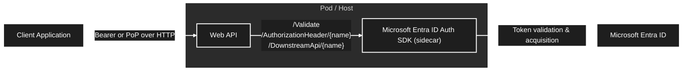
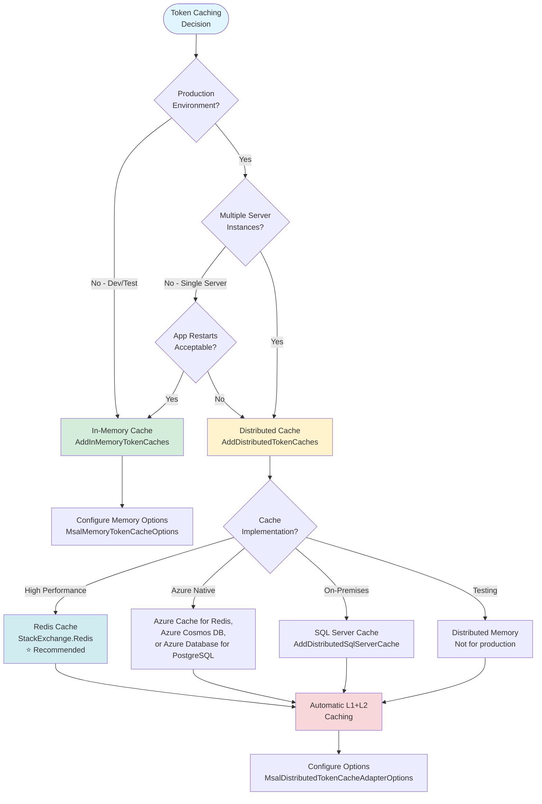
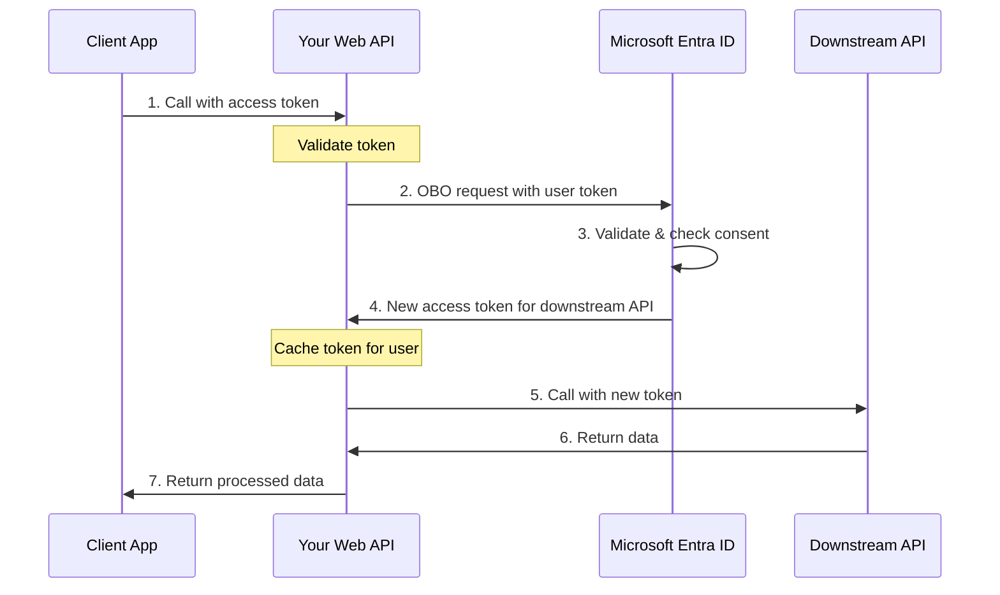
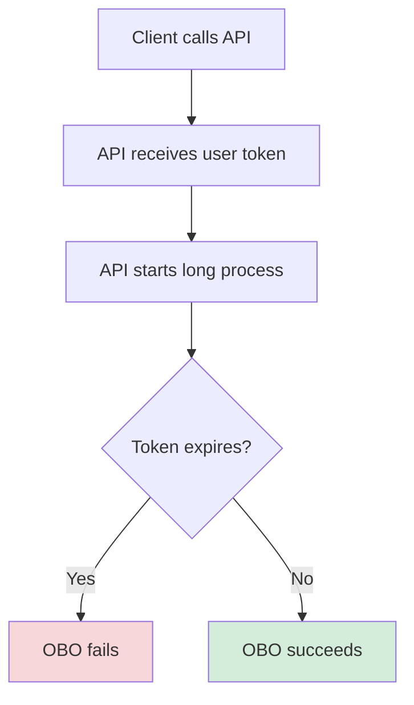
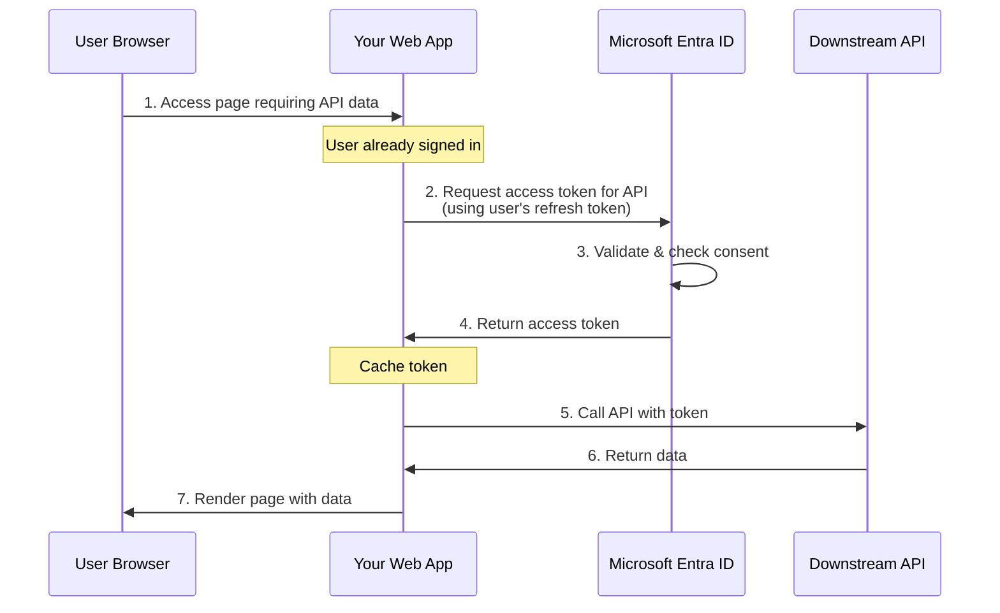
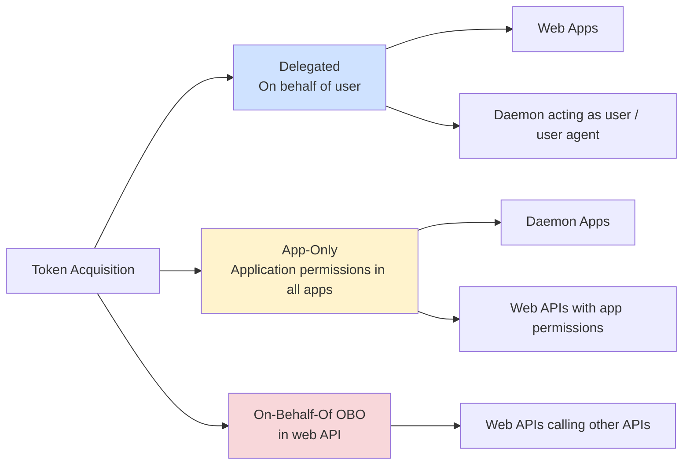
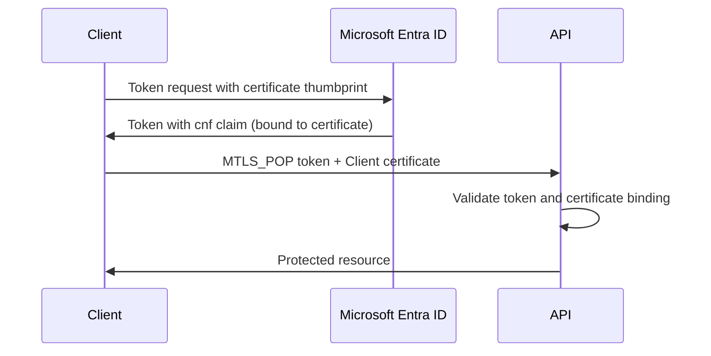

# Microsoft Learn — Microsoft Entra / 開発者向け (Identity Platform・MSAL・Microsoft.Identity.Web) (part 12)

Source: https://learn.microsoft.com/ja-jp/entra/
Pages in this file: 32

---

<!-- MSL-PAGE {"url":"entra/msidweb/agent-id-sdk/overview"} -->
## Microsoft Entra ID認証 SDK (サイドカー) の概要

- Source: https://learn.microsoft.com/ja-jp/entra/msidweb/agent-id-sdk/overview
- Service: msal / microsoft-identity-web
- Article date: 2026-09-15
- Summary: polyglot マイクロサービス環境のトークンの検証と取得を処理するコンテナー化されたサービスである Microsoft Entra ID Auth SDK (サイドカー) について説明します。

Microsoft Entra ID認証 SDK (サイドカー) は、トークンの取得、検証、および安全なダウンストリーム API 呼び出しを処理するコンテナー化された Web サービスです。 アプリケーションと共にコンパニオン コンテナーとして実行されるため、ID ロジックを専用サービスにオフロードできます。 Microsoft Entra ID認証 SDK (サイドカー) で ID 操作を一元化することで、各サービスに複雑なトークン管理ロジックを埋め込む必要がなくなり、コードの重複や潜在的なセキュリティの脆弱性が軽減されます。

Kubernetes、Docker を使用したコンテナー化されたサービス、またはAzure上の最新のマイクロサービスを使用して構築する場合、Microsoft Entra ID認証 SDK (サイドカー) は、クラウドネイティブ アプリケーションでの認証と承認を処理するための標準化された方法を提供します。

### Microsoft Entra ID 認証 SDK (サイドカー) とは何ですか?

Microsoft Entra ID認証 SDK (サイドカー) は、認証と承認のために HTTP API を介してアプリケーションと通信し、テクノロジ スタックに関係なく一貫した統合パターンを提供します。 Microsoft Entra ID認証 SDK (サイドカー) は、アプリケーション コードに ID ロジックを直接埋め込む代わりに、標準の HTTP 要求を介してトークンの管理、検証、および API 呼び出しを処理します。

このアプローチにより、一貫した認証パターンを維持しながら、さまざまなサービスをPython、Node.js、Go、Javaなどで記述できるポリグロット マイクロサービス アーキテクチャが可能になります。

一般的なアーキテクチャは次のとおりです。

*クライアント アプリケーション → お客様の Web API → Microsoft Entra ID Auth SDK (サイドカー) → Microsoft Entra ID*

最新のコンテナー イメージとバージョン タグについては、使用を開始する [コンテナー イメージ](https://learn.microsoft.com/ja-jp/entra/msidweb/agent-id-sdk/installation) を参照してください。

#### セキュリティ

Microsoft Entra ID認証 SDK (サイドカー) のデプロイが、セキュリティで保護された操作のベスト プラクティスに従っていることを確認します。 SDK は、許可されていないアクセスを防ぐために、ネットワーク アクセスが制限されたコンテナー化された環境で実行する必要があります。 SDK API をパブリックに公開すると、未承認のトークン取得などのセキュリティの脆弱性につながる可能性があります。

セキュリティ [のベスト プラクティス](https://learn.microsoft.com/ja-jp/entra/msidweb/agent-id-sdk/security) を参照して、ネットワーク、資格情報、および実行時のセキュリティに関する推奨事項のベスト プラクティスを確認します。

注意事項

SDK API にパブリックにアクセスすることはできません。 承認されていないトークンの取得を防ぐために、同じ信頼境界内 (同じポッドや仮想ネットワークなど) 内のアプリケーションのみがアクセスできるようにする必要があります。

### 簡単スタート

Microsoft Entra ID認証 SDK (サイドカー) の使用を開始するには、次の手順を実行することをお勧めします。

1. **[デプロイを選択する](https://learn.microsoft.com/ja-jp/entra/msidweb/agent-id-sdk/installation)** - Kubernetes、Docker、または AKS を選択する
2. **[設定の構成](https://learn.microsoft.com/ja-jp/entra/msidweb/agent-id-sdk/configuration)** - 環境変数を設定する
3. **[シナリオを選択する](https://learn.microsoft.com/ja-jp/entra/msidweb/agent-id-sdk/scenarios/validate-authorization-header)** - ガイド付き例に従う
4. **[運用環境へのデプロイ](https://learn.microsoft.com/ja-jp/entra/msidweb/agent-id-sdk/security)** - セキュリティのベスト プラクティスを確認する

### 主な利点

このアーキテクチャでは、ID に関する懸念事項をビジネス ロジックから分離し、次の利点を提供します。

| メリット | Description |
| --- | --- |
| **複数言語のサポート** | Python、Node.js、Go、Javaなどから HTTP 経由で呼び出す |
| **一元化されたセキュリティ構成** | ID 構成、トークン管理、資格情報管理の 1 つの場所 |
| **コンテナー ネイティブ** | Kubernetes、Docker、AKS、およびその他の最新のデプロイ用に構築されています |
| **ゼロ トラスト準備完了** | マネージド ID と所有証明トークンとの統合 - 機密データをアプリケーション コードから除外する |

### Microsoft Entra ID Auth SDK（サイドカー）または Microsoft.Identity.Web を使用する場合

| Scenario | Microsoft Entra ID認証 SDK (サイドカー) を使用する | Microsoft.Identity.Web を使用します。 |
| --- | --- | --- |
| **言語サポート** | 複数の言語 (Python、Node.js、Go、Javaなど) | .NETのみ |
| **デプロイメント モデル** | コンテナー (Kubernetes、Docker、AKS) | 任意のデプロイ モデル |
| **ID パターン** | すべてのサービスで一貫したパターン | ディープ .NET フレームワークの統合 |
| **エージェント ID** | サポートされているすべての言語で利用可能 | .NETのみ |
| **トークンの検証** | サポートされているすべての言語で利用可能 | .NETのみ |
| **セキュリティ モデル** | アプリケーション コードから分離されたシークレットとトークン | アプリケーションとの統合 |
| **パフォーマンス** | 追加のネットワーク ホップが必要 | 直接インプロセス呼び出し |
| **フレームワークの統合** | HTTP API の統合 | ネイティブ .NET統合 |
| **コンテナー化** | コンテナー化された環境向けに設計 | コンテナーの有無にかかわらず動作します |

[Microsoft.Identity.Web](https://learn.microsoft.com/ja-jp/entra/msidweb/agent-id-sdk/comparison) との比較を参照して、2 つのアプローチの選択に関する詳細なガイダンスを確認してください。

#### トークンの検証

Microsoft Entra ID認証 SDK (サイドカー) は、Microsoft Entra IDの公開キーに対して署名を検証し、有効期限を確認し、トークンがアプリケーション用であることを確認することで、SHR PoP 資格情報に埋め込まれたアプリ専用アクセス トークンなど、Microsoft Entra IDによって発行されたアクセス トークンと ID トークンを検証します。 SHR PoP 資格情報の場合、SHR 署名も検証され、常にタイムスタンプ (`ts`) が検証されます。 既定では、HTTP メソッド (`m`)、ホスト、ホスト、ポート (`u`)、およびパス (`p`) を検証します。演算子はこれらのチェックを無効にすることができます。 クエリ バインド (`q`) はオプトインされ、URI スキーム、ヘッダー (`h`)、本文 (`b`) は検証されません。 検証が完了したら、要求、ロール、スコープを抽出して、アプリケーション ロジック内で十分な情報に基づいた承認決定を行うことができます。

#### トークン取得/承認ヘッダーの作成

- **オン・ビハーフ・オブ OAuth 2.0 フロー** - ダウンストリーム API にユーザーコンテキストを委任する
- **クライアント資格情報** - アプリケーション間認証
- **管理 ID** - ネイティブ Azure サービス認証
- **エージェント ID** - 自律または委任されたエージェント パターン

#### ダウンストリーム API 呼び出し

- トークンを自動的に取得してアタッチする
- 省略可能な要求のオーバーライド (スコープ、メソッド、ヘッダー)
- 署名された HTTP 要求 (PoP/SHR) のサポート

#### シナリオとチュートリアル

次のガイドは、Microsoft Entra ID認証 SDK (サイドカー) をアプリケーションに統合する方法を示す実用的なコード例を含む、包括的なステップバイステップのチュートリアルです。 各シナリオでは、さまざまなプログラミング言語とフレームワークに合わせて調整された完全な要求/応答の例、コード スニペット、実装パターンが提供されます。

| Scenario | Description |
| --- | --- |
| **[承認ヘッダーの検証](https://learn.microsoft.com/ja-jp/entra/msidweb/agent-id-sdk/scenarios/validate-authorization-header)** | アクセス制御とカスタム承認ミドルウェア用の Bearer トークンまたはアプリ専用の SHR PoP 資格情報から要求を抽出する |
| **[承認ヘッダーを取得する](https://learn.microsoft.com/ja-jp/entra/msidweb/agent-id-sdk/scenarios/obtain-authorization-header)** | ダウンストリーム API を安全に呼び出すためのトークンを取得する |
| **[ダウンストリーム API を呼び出す](https://learn.microsoft.com/ja-jp/entra/msidweb/agent-id-sdk/scenarios/call-downstream-api)** | 複数言語マイクロサービスの自動トークン添付を使用して、保護された API への HTTP 呼び出しを行う |
| **[マネージド ID を使用する](https://learn.microsoft.com/ja-jp/entra/msidweb/agent-id-sdk/scenarios/managed-identity)** | Microsoft Graphまたはその他のAzure サービスを呼び出すためのAzure サービスとして認証する |
| **[長時間連続実行のOBOフローを実装する](https://learn.microsoft.com/ja-jp/entra/msidweb/agent-id-sdk/scenarios/long-running-on-behalf)** | 拡張操作におけるトークンの更新とOn-Behalf-Ofデリゲーションを用いたユーザーコンテキストの管理 |
| **[署名付き HTTP 要求を使用する](https://learn.microsoft.com/ja-jp/entra/msidweb/agent-id-sdk/scenarios/signed-http-request)** | PoP トークンを使用して所有証明セキュリティを実装する |
| **[エージェントの自律バッチ処理](https://learn.microsoft.com/ja-jp/entra/msidweb/agent-id-sdk/scenarios/agent-autonomous-batch)** | 自律エージェント ID を使用してバッチ ジョブを処理する |
| **[TypeScript から統合する](https://learn.microsoft.com/ja-jp/entra/msidweb/agent-id-sdk/scenarios/using-from-typescript)** | Node.js/Express/NestJS アプリケーションから Microsoft Entra ID Auth SDK (サイドカー) を使用する |
| **[Pythonから統合する](https://learn.microsoft.com/ja-jp/entra/msidweb/agent-id-sdk/scenarios/using-from-python)** | Flask/FastAPI/Django アプリケーションから Microsoft Entra ID Auth SDK (サイドカー) を使用する |

### アーキテクチャのパターン

クライアントが Web API を呼び出す一般的なフローである API は、HTTP エンドポイントを介して ID 操作を Microsoft Entra ID Auth SDK (サイドカー) に委任します。 SDK は、 `/Validate` エンドポイントを使用して受信トークンを検証し、 `/AuthorizationHeader` と `/AuthorizationHeaderUnauthenticated`を使用してトークンを取得し、 `/DownstreamApi` と `/DownstreamApiUnauthenticated`を使用してダウンストリーム API を直接呼び出すことができます。

次のスニペットに示すアーキテクチャを使用して、トークンの発行と Open ID Connect メタデータ取得のMicrosoft Entra IDと対話します。



### サポートとリソース

次のリソースは、包括的なガイダンスを提供し、一般的な質問に対する問題と回答のトラブルシューティングに役立ちます。

| Resource | Description |
| --- | --- |
| **[エージェント ID](https://learn.microsoft.com/ja-jp/entra/msidweb/agent-id-sdk/agent-identities)** | 高度なシナリオの自律型および委任されたエージェント パターンについて説明します |
| **[API リファレンス](https://learn.microsoft.com/ja-jp/entra/msidweb/agent-id-sdk/endpoints)** | 要求/応答形式、クエリ パラメーター、およびエラー コードを含む完全なエンドポイント ドキュメント |
| **[トラブルシューティング](https://learn.microsoft.com/ja-jp/entra/msidweb/agent-id-sdk/troubleshooting)** | デプロイとランタイムの問題に関する一般的な問題と詳細な解決策 |
| **[FAQ](https://learn.microsoft.com/ja-jp/entra/msidweb/agent-id-sdk/faq)** | 構成、セキュリティ、統合に関するトピックについてよく寄せられる質問 |

その他のヘルプ:

- Microsoft-identity-web リポジトリ
- [Microsoft Entra IDトラブルシューティング ガイドを確認してください](https://learn.microsoft.com/ja-jp/entra/identity-platform/reference-error-codes)
<!-- /MSL-PAGE -->

---

<!-- MSL-PAGE {"url":"entra/msidweb/agent-id-sdk/quickstart-python"} -->
## クイック スタート: Python で Microsoft Entra ID Auth SDK (サイドカー) を使用してユーザーをサインインさせ、ダウンストリーム API を呼び出す

- Source: https://learn.microsoft.com/ja-jp/entra/msidweb/agent-id-sdk/quickstart-python
- Service: msal / microsoft-identity-web
- Article date: 2026-04-19
- Summary: Pythonの Microsoft Entra ID Auth SDK (サイドカー) を使用してMicrosoft Graphなどのダウンストリーム API をユーザーにサインインし、呼び出す方法について説明します。

このクイック スタートでは、サンプル Web アプリを使用して、ユーザーまたはエージェントにサインインし、独自の ID を使用してダウンストリーム API を呼び出す方法を学習します。 サンプル アプリでは、Microsoft Entra ID Auth SDK (サイドカー) を使用して委任されたアクセスのユーザー トークンを検証し、Microsoft Graphなどのダウンストリーム API とのサービス間通信にアプリケーション ID を使用します。

### [前提条件]

- [UV パッケージ マネージャー](https://github.com/astral-sh/uv)をインストールします。 UV は、Rust で記述された高速Python パッケージ インストーラーおよびリゾルバーです。
- [Docker Desktop をインストールします](https://www.docker.com/products/docker-desktop/)。
- アクティブなサブスクリプションを持つAzure アカウント。 アカウントをまだお持ちでない場合は、 [無料でアカウントを作成してください](https://azure.microsoft.com/pricing/purchase-options/azure-account?cid=msft_learn)。
- このAzure アカウントには、アプリケーションを管理するためのアクセス許可が必要です。 次のMicrosoft Entraのロールには、必要なアクセス許可が含まれます。

    - アプリケーション管理者
    - アプリケーション開発者
- 従業員テナント。 既定のディレクトリを使用するか、 [新しいテナントを設定](https://learn.microsoft.com/ja-jp/entra/identity-platform/quickstart-create-new-tenant)できます。

### Microsoft Entra アプリケーションを作成して構成する

クイックスタートの残りの部分を完了するには、まずアプリケーションをMicrosoft Entra IDに登録する必要があります。

#### アプリケーションの登録を作成する

アプリ登録を作成するには、次の手順に従います。

1. 少なくとも [Microsoft Entra 管理センター](https://entra.microsoft.com)[Application Developer](https://learn.microsoft.com/ja-jp/entra/identity/role-based-access-control/permissions-reference#application-developer) としてサインインします。
2. 複数のテナントにアクセスできる場合は、上部メニューの **[設定]** アイコン  を使用して、アプリケーションを登録するテナントに切り替えます。
3. **Entra ID**&gt;**アプリの登録** に移動し、**新しい登録** を選択します。
4. **IDENTITY-client-app** など、アプリのわかりやすい*名前*を入力します。 アプリ ユーザーにはこの名前が表示され、いつでも変更できます。 同じ名前で複数のアプリ登録を行うことができます。
5. [ **サポートされているアカウントの種類] で**、アプリケーションを使用できるユーザーを指定します。 **ほとんどのアプリケーションに対してのみ、この組織ディレクトリのアカウント**を選択します。 各オプションの詳細については、表を参照してください。

    | サポートされているアカウントの種類 | Description |
    | --- | --- |
    | **この組織のディレクトリ内のアカウントのみ** | *テナント内の*ユーザー (またはゲスト) のみが使用するシングルテナント アプリの*場合*。 |
    | **任意の組織のディレクトリ内のアカウント** | *マルチテナント* アプリの場合、*any* Microsoft Entra テナントのユーザーがアプリケーションを使用できるようにする必要があります。 複数の組織に提供する予定のサービスとしてのソフトウェア (SaaS) アプリケーションに最適です。 |
    | **任意の組織ディレクトリおよび個人用 Microsoft アカウントのアカウント** | マルチテナント アプリの場合、組織と個人の両方のMicrosoft アカウントをサポートするアプリ (例: Skype、Xbox、Live、Hotmail)。 |
    | **個人Microsoft アカウント** | 個人のMicrosoft アカウント (Skype、Xbox、Live、Hotmail など) でのみ使用されるアプリの場合。 |
6. [ **登録** ] を選択してアプリの登録を完了します。

    [Image: Web ブラウザーでのMicrosoft Entra 管理センターのスクリーンショット。[アプリケーションの登録] ウィンドウが表示されます。]
7. アプリケーションの **[概要]** ページが表示されます。 後で使用するために、アプリケーションの [概要] ページから次の値を記録します。

    - アプリケーション (クライアント) ID
    - ディレクトリ (テナント) ID

    [Image: Web ブラウザーのMicrosoft Entra 管理センターのスクリーンショット。アプリ登録の [概要] ウィンドウが表示されます。]

#### リダイレクト URI を追加する

Pythonサンプル アプリでは、ブラウザーベースのサインイン フローで対話型認証を使用します。 認証応答を処理するようにリダイレクト URI を構成します。

1. アプリの登録で、[ **管理**] で [ **認証**] を選択します。
2. **[プラットフォームの追加]** を選択します。
3. **[モバイルアプリケーションとデスクトップアプリケーション] を選択します**。
4. [ **カスタム リダイレクト URI] に**「 `http://localhost`」と入力します。
5. **設定**を選択します。

#### クライアント資格情報を追加する

Microsoft Entra ID Auth SDK (サイドカー) は、クライアント資格情報を使用してダウンストリーム API の認証とトークンの取得を行います。 ローカルの開発とテストでは、認証に自己署名証明書を使用します。

##### 自己署名証明書を生成する

管理者として PowerShell を実行し、次のコマンドを使用して自己署名証明書を生成します。

```powershell
# Generate a self-signed certificate
$cert = New-SelfSignedCertificate `
    -Subject "CN=AgentID-Client-Certificate" `
    -CertStoreLocation "Cert:\CurrentUser\My" `
    -KeyExportPolicy Exportable `
    -KeySpec Signature `
    -KeyLength 2048 `
    -KeyAlgorithm RSA `
    -HashAlgorithm SHA256 `
    -NotAfter (Get-Date).AddDays(7)

# Export public key (CER) for upload to Azure
$cerPath = "agentid-client-certificate.cer"
Export-Certificate -Cert $cert -FilePath $cerPath

# Export private key (PFX) for the Entra ID Auth SDK (sidecar) container
# Replace <your-pfx-password> with a strong password and store it securely (for example, in a secret store).
$pfxPath = "agentid-client-certificate.pfx"
$certPassword = ConvertTo-SecureString -String "<your-pfx-password>" -Force -AsPlainText
Export-PfxCertificate -Cert $cert -FilePath $pfxPath -Password $certPassword

Write-Host "Certificate generated successfully!"
Write-Host "CER file (public key): $cerPath"
Write-Host "PFX file (private key): $pfxPath"
Write-Host "Certificate Thumbprint: $($cert.Thumbprint)"
```

PowerShell 出力に表示される証明書の拇印を記録します。 Microsoft Entra 管理センターの証明書がローカルにインストールされたものと一致することを確認するために必要です。

##### 証明書をMicrosoft Entra IDにアップロードする

現在のディレクトリに作成された `.cer` ファイルをMicrosoft Entra 管理センターにアップロードするには、次の手順に従います。

1. Microsoft Entra 管理センターでアプリの登録を開く
2. **[管理]** で、**[証明書とシークレット]** を選択します。
3. **証明書** タブで、**証明書のアップロード**を選択します。
4. 生成した `.cer` ファイル (たとえば、 `agentid-client-cert.cer`) を選択します。
5. 説明 ("AgentID ローカル開発証明書" など) を指定します。
6. [**] を選択し、[**] を追加します。
7. 表示された証明書の **拇印** を記録します (証明書生成の拇印と一致する必要があります)。

注

運用環境では、信頼された証明機関 (CA) によって発行された証明書を使用し、マネージド ID アクセスを使用してAzure Key Vaultに格納します。 自己署名証明書は、ローカルの開発とテストにのみ使用します。

#### API のアクセス許可を構成する

委任されたアクセス許可をMicrosoft Graphに構成するには、次の手順に従います。 これらのアクセス許可を使用すると、クライアント アプリケーションは、サインインしているユーザーの代わりに、メールの読み取りなどの操作を実行できます。

1. アプリの登録で、**Manage** で、**API アクセス許可**&gt;**アクセス許可の追加**&gt;**Microsoft Graph** を選択します。
2. **[委任されたアクセス許可]** を選択します。 Microsoft Graphでは、多くのアクセス許可が公開され、最もよく使用されるアクセス許可が一覧の一番上に表示されます。
3. [ **アクセス許可の選択**] で、 **User.Read** を選択して追加します。

#### アプリケーションのアクセス許可を構成する

Entra ID Auth SDK (サイドカー) が (ユーザー コンテキストなしで) 独自の ID を使用して API を呼び出すアプリケーション専用フローをテストするには、アプリケーションのアクセス許可を構成します。

1. **API のアクセス許可** ページで、**アクセス許可の追加**&gt;**Microsoft Graph** を選択します。
2. **[アプリケーションのアクセス許可]** を選択します。
3. [ **アクセス許可の選択**] で、 **User.Read.All** を検索して選択します。
4. **アクセス許可の追加** を選択します。
5. **[テナント]に管理者の同意を付与する** を選択し、確認します。

注

アプリケーションのアクセス許可には管理者の同意が必要です。 この手順を実行しないと、テスト セクションのアプリケーション専用エンドポイントは失敗します。

#### API を公開する (トークン検証テスト用)

(`/validate` スコープを使用して) アプリケーション専用に発行されたトークンを使用して、Entra ID認証 SDK (サイドカー) の`api://<application-client-id>/access_as_user` エンドポイントを呼び出すには、この手順を完了**する必要があります**。 委任されたアクセス許可を持つMicrosoft Graphシナリオのみをテストする場合は、このセクションをスキップできます。 必要なスコープを含む API を公開するには、次の手順に従います。

1. [ **管理**] で、[ **API の公開**] を選択します。
2. ページの上部で、**アプリケーション ID URI** の横にある **[追加]** を選択します。 この値の既定値は `api://<application-client-id>` です。 アプリ ID URI は、API のコードで参照するスコープのプレフィックスとして機能し、グローバルに一意である必要があります。 **保存** を選択します。
3. 次のように [ **スコープの追加]** を選択します。

    Microsoft Entra 管理センター のアプリ登録の [API の公開] ペインのスクリーンショット
4. 次に、[スコープの追加] ウィンドウで、次のようにスコープの属性 **を** 指定します。

    - **スコープ名**: `access_as_user`
    - **同意できるユーザー**: 管理者とユーザー
    - **管理者の同意の表示名**: Entra ID認証 SDK (サイドカー) にユーザーとしてアクセスする
    - **管理者の同意の説明**: サインインしているユーザーとして Entra ID Auth SDK (サイドカー) API へのアクセスを許可する
    - **状態**: 有効
5. **[スコープの追加]** を選択します。

### Microsoft Entra ID認証 SDK (サイドカー) を起動する

Microsoft Entra ID認証 SDK (サイドカー) は、トークンの取得、検証、および安全なダウンストリーム API 呼び出しを処理するコンテナー化された Web サービスです。 アプリケーションと共にコンパニオン コンテナーとして実行されるため、ID ロジックを専用サービスにオフロードできます。

#### 構成ファイルを作成する

Entra ID認証 SDK (サイドカー) には、Microsoft Entra アプリケーションに接続するための構成ファイルが必要です。 構成用の新しいディレクトリを作成し、 `appsettings.json` ファイルを作成します。

```powershell
# Create a directory for the Entra ID Auth SDK (sidecar) configuration
New-Item -ItemType Directory -Path "agentid-config" -Force
cd agentid-config

# Create the appsettings.json file
New-Item -ItemType File -Path "appsettings.json"
```

優先するテキスト エディターで `appsettings.json` を開き、次の構成を追加します。プレースホルダーの値は、Microsoft Entra アプリケーションの詳細に置き換えてください。

```json
{
    "AzureAd": {
        "Instance": "https://login.microsoftonline.com/",
        "TenantId": "YOUR_TENANT_ID_HERE",
        "ClientId": "YOUR_CLIENT_ID_HERE",
        "ClientCredentials": [
            {
                "SourceType": "Path",
                "CertificateStorePath": "agentid-client-certificate.pfx",
                "CertificateDistinguishedName": "<your-pfx-password>"
            }
        ]
    },
    "DownstreamApis": {
        "me": {
            "BaseUrl": "https://graph.microsoft.com/v1.0/",
            "RelativePath": "me",
            "Scopes": [ "User.Read" ]
        }
    },
    "Logging": {
        "LogLevel": {
            "Default": "Information",
            "Microsoft.AspNetCore": "Warning"
        }
    },
    "AllowedHosts": "*"
}
```

#### Entra ID認証 SDK (サイドカー) コンテナーをプルして実行する

Entra ID認証 SDK (サイドカー) は、[Microsoft Container Registry (MCR](https://mcr.microsoft.com/en-us/artifact/mar/entra-sdk/auth-sidecar)) の事前構築済みコンテナー イメージとして使用できます。 コンテナー イメージをプルする前に、Docker Desktop が実行されていることを確認します。 Docker が実行されていない場合は、Docker Desktop を開き、状態が "Docker Desktop が実行されています" と表示されるまで待ちます。

構成ディレクトリに移動し、次のコマンドを実行します。

```powershell
# Navigate to your config directory
cd agentid-config

# Pull the Entra ID Auth SDK (sidecar) container image from MCR
docker pull mcr.microsoft.com/entra-sdk/auth-sidecar:1.0.0-rc.2-azurelinux3.0-distroless

# Run the container
docker run -d `
    --name agentid-sdk `
    -p 5178:8080 `
    -e ASPNETCORE_ENVIRONMENT=Development `
    mcr.microsoft.com/entra-sdk/auth-sidecar:1.0.0-rc.2-azurelinux3.0-distroless

# Copy configuration files into the container
docker cp appsettings.json agentid-sdk:/app/appsettings.json
docker cp agentid-client-certificate.pfx agentid-sdk:/app/agentid-client-certificate.pfx

# Restart the container to apply the configuration
docker restart agentid-sdk
```

注

Windows ホストの場合は、Windows コンテナーバリアント `mcr.microsoft.com/entra-sdk/auth-sidecar:1.0.0-rc.2-windows` を使用します。

次の Docker コマンドを使用して、Entra ID認証 SDK (サイドカー) コンテナーを管理できます。

- **コンテナー ログの表示**: `docker logs agentid-sdk`
- **リアルタイム ログを表示**する: `docker logs -f agentid-sdk`
- **コンテナーを停止します**。 `docker stop agentid-sdk`
- **コンテナーをもう一度起動します**。 `docker start agentid-sdk`
- **コンテナーを削除します**。 `docker rm agentid-sdk`

#### コンテナーが実行されていることを確認する

Entra ID Auth SDK (サイドカー) コンテナーが正常に実行されているかどうかは、ヘルス チェック エンドポイントを呼び出して確認できます`/healthz`:

```powershell
Invoke-RestMethod -Uri "http://localhost:5178/healthz" -ErrorAction SilentlyContinue
```

このエンドポイントは、`Healthy`を返します。これにより、Entra ID認証 SDK (サイドカー) が正しく実行されており、要求を処理する準備が整っています。 テスト中は、Entra ID認証 SDK (サイドカー) を終了しないでください。 Python アプリからのすべての認証と API 呼び出しが機能するためには、コンテナーをバックグラウンドで実行し続ける必要があります。

### Python サンプル アプリを実行する

Pythonサンプル アプリでは、認証と API 呼び出しに Microsoft Entra ID Auth SDK (サイドカー) を使用する方法を示します。 Entra ID認証 SDK (サイドカー) は、ローカル Web サービスとして実行され、認証プロキシとして機能します。 ユーザー トークンを検証し、ユーザーに代わってMicrosoft Graphなどのダウンストリーム API を呼び出します。

このサンプルには、2 つの認証パターンを示すPython スクリプトが含まれています。

- **委任されたアクセス許可**: Entra ID Auth SDK (サイドカー) は、ユーザー トークンを検証し、サインインしているユーザーの代わりに API を呼び出します。
- **アプリケーションのアクセス許可**: Entra ID認証 SDK (サイドカー) は、独自の ID を使用して、ユーザー コンテキストなしで API を呼び出します。

この方法では、アプリケーションが単純な HTTP 要求を通じて使用できる 1 つのサービスでトークン管理と API アクセスを一元化します。

#### Python サンプル アプリを複製またはダウンロードする

[Python サンプル アプリ](https://github.com/AzureAD/microsoft-identity-web/tree/master/tests/DevApps/SidecarAdapter/python)をダウンロードし、ローカル ディレクトリに抽出します。 または、コマンド プロンプトを開き、目的のプロジェクトの場所に移動し、次のコマンドを実行して、リポジトリを複製します。

```powershell
git clone https://github.com/AzureAD/microsoft-identity-web.git
cd microsoft-identity-web/tests/DevApps/SidecarAdapter/python
```

サンプル アプリには、次のPython スクリプトが含まれています。

- `get_token.py` – Microsoft Authentication Library (MSAL) を介してユーザー アクセス トークンを取得します。
- `main.py`– Entra ID認証 SDK (サイドカー) エンドポイントを呼び出し、JSON 応答を表示するコマンド ライン インターフェイス。
- `MicrosoftIdentityWebSidecarClient.py` – Entra ID Auth SDK (sidecar) の `/Validate`、`/AuthorizationHeader`、および `/DownstreamApi` エンドポイント用の HTTP クライアントのラッパー。

Python スクリプトは、Auth SDK (サイドカー) エンドポイントEntra ID呼び出すときにパラメーター `me`を使用します。 このパラメーターは、Entra ID Auth SDK (サイドカー) `appsettings.json`の "me" という名前のダウンストリーム API 構成を参照します。

```json
"DownstreamApis": {
    "me": {
        "BaseUrl": "https://graph.microsoft.com/v1.0/",
        "RelativePath": "me",
        "Scopes": [ "User.Read" ]
    }
}
```

`me` パラメーターを使用して Entra ID Auth SDK (サイドカー) エンドポイントを呼び出すと、SDK は構成のベース URL と相対パスを使用して完全な API エンドポイントを構築し、指定されたスコープを要求し、Microsoft Graph `/me` エンドポイントを呼び出してサインインしているユーザーのプロファイルを取得します。 別の名前とエンドポイントを使用して `appsettings.json` にダウンストリーム API 構成を追加して、追加の API を呼び出すことができます。

### Microsoft Entra ID認証 SDK (サイドカー) と Python アプリの間の対話をテストする

このクイック スタートでは、3 層認証パターンを示します。

1. **User authentication**: Pythonに MSAL を使用してユーザー アクセス トークンを取得します。 このトークンは、ユーザーの ID を証明します。
2. **トークン検証**: Entra ID認証 SDK (サイドカー) は、ユーザー トークンを検証して、アプリケーションに対して本物で発行されていることを確認します。
3. **トークン交換**: Entra ID Auth SDK (サイドカー) は、On-Behalf-Of (OBO) フローを使用して、ユーザー トークンを Microsoft Graph をスコープとする新しいトークンに交換してから、API を呼び出します。

アプリケーションのみのシナリオでは、Entra ID Auth SDK (サイドカー) はユーザー認証をバイパスし、独自のクライアント資格情報を使用してトークンを直接取得します。 SDK によってこの認証ロジックが一元化されるため、Python アプリケーションは複雑な OAuth フローを管理せずに単純な HTTP 要求を行うだけで済みます。

#### ユーザー アクセス トークンを取得する

Entra ID認証 SDK (サイドカー) エンドポイントをテストする前に、有効なアクセス トークンを取得します。 `get_token.py` スクリプトは、Pythonに MSAL を使用して、ブラウザー ベースのサインイン フローを介して対話形式でトークンを取得します。

**トークンスコープと対象ユーザー:**

要求するスコープによって、トークンの対象ユーザー (`aud` 要求) が決まります。これは、呼び出すエンドポイントと一致する必要があります。

- **トークン検証テストの場合**は、 `api://<client-id>/access_as_user` を使用して `/validate` エンドポイントをテストします
- **Microsoft Graph テスト**では、`User.Read` スコープを持つ新しいトークンを取得して、`/authorizationheader` と `/downstreamapi` エンドポイントをテストします

次のコマンドを使用して、構成変数を設定し、トークンを取得します。

```powershell
# Set your configuration
$clientId = "YOUR_CLIENT_ID_HERE"
$tenantId = "YOUR_TENANT_ID_HERE"
$authority = "https://login.microsoftonline.com/$tenantId"

# For testing Entra ID Auth SDK (sidecar) APIs (if you exposed the API)
$scope = "api://$clientId/access_as_user"

# Or for testing Microsoft Graph directly
# $scope = "User.Read"

# Acquire token
$token = uv run --with msal get_token.py --client-id $clientId --authority $authority --scope $scope
```

トークン取得コマンドを実行すると、スクリプトによってブラウザーベースの対話型サインイン フローが開始されます。 このブラウザー認証は、最初の実行時にのみ行われます。 認証が成功すると、トークンは後で使用するためにローカルにキャッシュされます。 その後、アクセス トークンがコンソールに出力され、後続のコマンドで使用するために `$token` PowerShell 変数に格納されます。

#### 委任されたアクセス許可を使用して Microsoft Entra ID Auth SDK (サイドカー) エンドポイントをテストする

有効なユーザー トークンを取得したら、Entra ID認証 SDK (サイドカー) コア エンドポイントをテストできます。 これらの操作では委任されたアクセス許可が使用されるため、SDK はサインインしているユーザーに代わって動作します。

まず、SDK のベース URL を設定します。

```powershell
$side_car_url = "http://localhost:5178"
```

##### 1. ユーザー トークンを検証する

`/validate` エンドポイントには、`api://<client-id>/access_as_user` スコープを使用してアプリケーション専用に発行されたトークンが必要です。 トークンの検証をテストする前に、「API を公開する」セクションの手順を完了していることを確認してください。 次のコマンドを使用して、 `/validate` エンドポイントを呼び出します。

```powershell
uv run --with requests main.py --base-url $side_car_url --authorization-header "Bearer $token" validate
```

**予想される応答:**

`/validate` エンドポイントは、トークンが有効であることを確認し、要求情報を抽出します。

```json
{
  "protocol": "Bearer",
  "token": "eyJ0eXAiOiJKV1QiLCJub25jZSI6...",
  "claims": {
    "aud": "xxxxxxxx-xxxx-xxxx-xxxx-xxxxxxxxxxxx",
    "iss": "https://login.microsoftonline.com/...",
    "name": "Your Name",
    "upn": "your.email@domain.com"
  }
}
```

この応答では、次のことが確認されます。

- トークン形式が正しい (ベアラー トークン)
- トークンは、予期される機関によって発行されます
- 対象ユーザー (`aud`) がアプリケーションと一致する
- ユーザーのアイデンティティ クレームが存在しており、有効である

##### 2. Microsoft Graphの承認ヘッダーを取得する

`/authorizationheader` エンドポイントは、ダウンストリーム API を呼び出すための適切に書式設定された承認ヘッダーを取得します。

```powershell
uv run --with requests main.py --base-url $side_car_url --authorization-header "Bearer $token" get-auth-header me
```

このエンドポイント:

- 受信ユーザー トークンを検証します
- ユーザーに代わってMicrosoft Graphの新しいトークンを取得します
- 書式設定された承認ヘッダーを返します。

##### 3. Microsoft Entra ID認証 SDK (サイドカー) を使用してMicrosoft Graphを呼び出す

`/downstreamapi` エンドポイントはMicrosoft Graphを直接呼び出し、応答を返します。

```powershell
uv run --with requests main.py --base-url $side_car_url --authorization-header "Bearer $token" invoke-downstream me
```

**予想される応答:**

```json
{
  "statusCode": 200,
  "headers": {...},
  "content": {
    "displayName": "Your Name",
    "mail": "your.email@domain.com",
    "userPrincipalName": "your.email@domain.com"
  }
}
```

`me` パラメーターは、`appsettings.json`で定義したダウンストリーム API 構成に対応します。 Entra ID 認証 SDK（サイドカー）:

1. ユーザー トークンを検証します
2. on-behalf-of (OBO) フローを使用して、Microsoft Graphの新しいトークンを取得します
3. Microsoft Graphで `/me` エンドポイントを呼び出します
4. ユーザー プロファイル データを返します

##### 4. 既定のスコープをオーバーライドし、要求本文を指定する

API 呼び出しをカスタマイズするには、 `appsettings.json` で構成されている既定のスコープをオーバーライドするか、書き込み操作の要求本文を指定します。

```powershell
uv run --with requests main.py --base-url $side_car_url --authorization-header "Bearer $token" --scope <scopes> invoke-downstream <api-name> --body-file <path-to-file>
```

この方法は、次の場合に役立ちます。

- さまざまなアクセス許可レベルをテストする。 たとえば、--scope `User.Read Mail.Read` などのさまざまなスコープを指定して、追加のアクセス許可を要求できます。
- ダウンストリーム API には、既定で構成されていないスコープが必要です
- 追加のアクセス許可を動的に要求する必要がある
- 要求本文を必要とする API (リソースの作成や更新など) を呼び出す場合は、POST/PUT 操作に使用される省略可能な `--body-file` パラメーターを追加します

#### アプリケーション専用エンドポイントをテストする

Microsoft Entra ID認証 SDK (サイドカー) では、アプリケーションのみのフローもサポートされています。 これらのフローでは、Entra ID認証 SDK (サイドカー) は、ユーザーに代わって動作するのではなく、独自のアプリ ID を使用します。 これらのエンドポイントでは、ユーザー承認ヘッダーは必要ありません。

注

アプリケーション専用フローでは、委任されたアクセス許可だけでなく**アプリケーションのアクセス許可** (`User.Read.All` など) がMicrosoft Entra IDに付与されている必要があります。 管理者は、これらのエンドポイントをテストする前に、これらのアクセス許可に同意する必要があります。

##### ユーザー コンテキストなしで承認ヘッダーを取得する

このエンドポイントを使用して、Entra ID Auth SDK (サイドカー) 独自の ID でMicrosoft Graphを呼び出すための承認ヘッダーを取得します。

```powershell
uv run --with requests main.py --base-url $side_car_url get-auth-header-unauth me
```

このエンドポイント:

- Entra ID認証 SDK (サイドカー) のクライアント資格情報 (アプリ ID) を使用して認証します。
- Microsoft Graphのアプリ専用アクセス トークンを取得します
- 承認ヘッダーを返します。

##### ユーザー コンテキストなしでMicrosoft Graphを呼び出す

このエンドポイントを使用して、Entra ID認証 SDK (サイドカー) ID を使用してMicrosoft Graphを直接呼び出します。

```powershell
uv run --with requests main.py --base-url $side_car_url invoke-downstream-unauth me
```

この例では、次の場所でサービス間通信を示します。

- 認証フローにユーザーが関与していない
- Entra ID認証 SDK (サイドカー) は、独自のクライアント ID と証明書を使用して認証します
- API 呼び出しでは、委任されたアクセス許可ではなく、アプリケーションのアクセス許可が使用されます
- このパターンは、バックグラウンド サービス、バッチ処理、または自動化されたタスクに最適です

#### 応答を理解する

##### トークン検証応答の構造

検証応答では、トークンに関する詳細情報が提供されます。

| フィールド | Description |
| --- | --- |
| `protocol` | 認証スキーム (OAuth 2.0 トークンの場合は常に "Bearer") |
| `token` | 元のアクセス トークン (例では切り捨てられます) |
| `claims` | トークンのペイロードから抽出されたキー・バリューペア |
| `claims.aud` | 対象ユーザー (クライアント ID) |
| `claims.iss` | トークン発行者 (Microsoft Entra ID) |
| `claims.name` | サインインしているユーザーの表示名 |
| `claims.upn` | ユーザー プリンシパル名 (電子メール アドレス) |

##### Microsoft Graph呼び出し応答の構造

| フィールド | Description |
| --- | --- |
| `statusCode` | Microsoft Graphからの HTTP 状態コード (200 = 成功) |
| `headers` | API 呼び出しからの応答ヘッダー |
| `content` | Microsoft Graphによって返される実際のデータ |
| `content.displayName` | ディレクトリ内のユーザーの表示名 |
| `content.mail` | ユーザーのメール アドレス |
| `content.userPrincipalName` | ユーザーの UPN |

#### 一般的な問題のトラブルシューティング

Microsoft Entra ID認証 SDK (サイドカー) エンドポイントのテスト中にエラーが発生した場合は、一般的な問題に対して次の解決策を確認してください。

| 問題点 | 解決策 |
| --- | --- |
| **"接続が拒否されました" エラー** | Entra ID認証 SDK (サイドカー) コンテナーが実行されていることを確認します:`docker ps -a`。 コンテナーの状態に "Exited" と表示されている場合は、ログを確認します: `docker logs agentid-sdk`。 コンテナーを再起動します。 `docker start agentid-sdk` し、正常性エンドポイント ( `Invoke-RestMethod -Uri "http://localhost:5178/healthz"`) をテストします。 |
| **コンテナーから 500 内部サーバー エラーが返される** | 詳細なエラーのコンテナー ログを表示する: `docker logs agentid-sdk`。 一般的な原因: `appsettings.json`の無効な JSON、正しくない証明書パス、間違った証明書パスワード、または TenantId/ClientId 値がありません。 |
| **証明書が見つからないエラー** | PFX ファイルが正しくコピーされたことを確認します: `docker exec agentid-sdk ls -la /app/agentid-client-certificate.pfx`。 見つからない場合は、もう一度コピーします: `docker cp agentid-client-certificate.pfx agentid-sdk:/app/agentid-client-certificate.pfx` して再起動します: `docker restart agentid-sdk`。 |
| **"無効なトークン" または "対象ユーザーの検証に失敗しました" エラー** | トークンの対象ユーザー (`aud` 要求) がクライアント ID と一致していることを確認します。 `/validate` エンドポイントには、`api://<client-id>/access_as_user` スコープを使用します。 Microsoft Graph呼び出しの場合は、`User.Read` を使用します。 トークン キャッシュ ( `Remove-Item -Path "$env:USERPROFILE\.msal_token_cache.bin" -ErrorAction SilentlyContinue`) をクリアします。 |
| **appsettings.jsonが読み込まれない** | ファイルがコンテナーにコピーされたことを確認します: `docker exec agentid-sdk cat /app/appsettings.json`。 JSON が有効であることを確認します (コメントなし、適切な構文)。 ファイルが見つからないか正しくない場合は、もう一度コピーしてコンテナーを再起動します。 |
| **構成の変更後にコンテナーが起動しない** | コンテナーを停止して削除します: `docker stop agentid-sdk && docker rm agentid-sdk`。 「Entra ID認証 SDK (サイドカー) コンテナーをプルして実行する」セクションに従って、更新された構成ファイルでコンテナーを再度実行します。 |
<!-- /MSL-PAGE -->

---

<!-- MSL-PAGE {"url":"entra/msidweb/agent-id-sdk/quickstart-typescript"} -->
## クイック スタート: TypeScript で Microsoft Entra ID Auth SDK (サイドカー) を使用してユーザーをサインインさせ、ダウンストリーム API を呼び出す

- Source: https://learn.microsoft.com/ja-jp/entra/msidweb/agent-id-sdk/quickstart-typescript
- Service: msal / microsoft-identity-web
- Article date: 2026-09-15
- Summary: TypeScript の Microsoft Entra ID Auth SDK (サイドカー) を使用してMicrosoft Graphなどのダウンストリーム API をユーザーにサインインし、呼び出す方法について説明します。

このクイック スタートでは、サンプル Web アプリを使用して、ユーザーまたはエージェントにサインインし、独自の ID を使用してダウンストリーム API を呼び出す方法を学習します。 サンプル アプリでは、Microsoft Entra ID Auth SDK (サイドカー) を使用して委任されたアクセスのユーザー トークンを検証し、Microsoft Graphなどのダウンストリーム API とのサービス間通信にアプリケーション ID を使用します。

### [前提条件]

- [18.x 以降Node.js](https://nodejs.org/en/download) インストールします。
- [Docker Desktop をインストールします](https://www.docker.com/products/docker-desktop/)。
- アクティブなサブスクリプションを持つAzure アカウント。 アカウントをまだお持ちでない場合は、 [無料でアカウントを作成してください](https://azure.microsoft.com/pricing/purchase-options/azure-account?cid=msft_learn)。
- このAzure アカウントには、アプリケーションを管理するためのアクセス許可が必要です。 次のMicrosoft Entraのロールには、必要なアクセス許可が含まれます。

    - アプリケーション管理者
    - アプリケーション開発者
- 従業員テナント。 既定のディレクトリを使用するか、 [新しいテナントを設定](https://learn.microsoft.com/ja-jp/entra/identity-platform/quickstart-create-new-tenant)できます。

### Microsoft Entra アプリケーションを作成して構成する

クイックスタートの残りの部分を完了するには、まずアプリケーションをMicrosoft Entra IDに登録する必要があります。

#### アプリケーションの登録を作成する

アプリ登録を作成するには、次の手順に従います。

1. 少なくとも [Microsoft Entra 管理センター](https://entra.microsoft.com)[Application Developer](https://learn.microsoft.com/ja-jp/entra/identity/role-based-access-control/permissions-reference#application-developer) としてサインインします。
2. 複数のテナントにアクセスできる場合は、上部メニューの **[設定]** アイコン  を使用して、アプリケーションを登録するテナントに切り替えます。
3. **Entra ID**&gt;**アプリの登録** に移動し、**新しい登録** を選択します。
4. **IDENTITY-client-app** など、アプリのわかりやすい*名前*を入力します。 アプリ ユーザーにはこの名前が表示され、いつでも変更できます。 同じ名前で複数のアプリ登録を行うことができます。
5. [ **サポートされているアカウントの種類] で**、アプリケーションを使用できるユーザーを指定します。 **ほとんどのアプリケーションに対してのみ、この組織ディレクトリのアカウント**を選択します。 各オプションの詳細については、表を参照してください。

    | サポートされているアカウントの種類 | Description |
    | --- | --- |
    | **この組織のディレクトリ内のアカウントのみ** | *テナント内の*ユーザー (またはゲスト) のみが使用するシングルテナント アプリの*場合*。 |
    | **任意の組織のディレクトリ内のアカウント** | *マルチテナント* アプリの場合、*any* Microsoft Entra テナントのユーザーがアプリケーションを使用できるようにする必要があります。 複数の組織に提供する予定のサービスとしてのソフトウェア (SaaS) アプリケーションに最適です。 |
    | **任意の組織ディレクトリおよび個人用 Microsoft アカウントのアカウント** | マルチテナント アプリの場合、組織と個人の両方のMicrosoft アカウントをサポートするアプリ (例: Skype、Xbox、Live、Hotmail)。 |
    | **個人Microsoft アカウント** | 個人のMicrosoft アカウント (Skype、Xbox、Live、Hotmail など) でのみ使用されるアプリの場合。 |
6. [ **登録** ] を選択してアプリの登録を完了します。

    [Image: Web ブラウザーでのMicrosoft Entra 管理センターのスクリーンショット。[アプリケーションの登録] ウィンドウが表示されます。]
7. アプリケーションの **[概要]** ページが表示されます。 後で使用するために、アプリケーションの [概要] ページから次の値を記録します。

    - アプリケーション (クライアント) ID
    - ディレクトリ (テナント) ID

    [Image: Web ブラウザーのMicrosoft Entra 管理センターのスクリーンショット。アプリ登録の [概要] ウィンドウが表示されます。]

#### リダイレクト URI を追加する

TypeScript サンプル アプリでは、ブラウザーベースのサインイン フローで対話型認証を使用します。 認証応答を処理するようにリダイレクト URI を構成します。

1. アプリの登録で、[ **管理**] で [ **認証**] を選択します。
2. **[プラットフォームの追加]** を選択します。
3. **[モバイルアプリケーションとデスクトップアプリケーション] を選択します**。
4. [ **カスタム リダイレクト URI] に**「 `http://localhost`」と入力します。
5. **設定**を選択します。

#### クライアント資格情報を追加する

Microsoft Entra ID認証 SDK (サイドカー) は、クライアント資格情報を使用してダウンストリーム API のトークンを認証および取得します。 ローカルの開発とテストでは、認証に自己署名証明書を使用します。

##### 自己署名証明書を生成する

管理者として PowerShell を実行し、次のコマンドを使用して自己署名証明書を生成します。

```powershell
# Generate a self-signed certificate
$cert = New-SelfSignedCertificate `
    -Subject "CN=AgentID-Client-Certificate" `
    -CertStoreLocation "Cert:\CurrentUser\My" `
    -KeyExportPolicy Exportable `
    -KeySpec Signature `
    -KeyLength 2048 `
    -KeyAlgorithm RSA `
    -HashAlgorithm SHA256 `
    -NotAfter (Get-Date).AddDays(7)

# Export public key (CER) for upload to Azure
$cerPath = "agentid-client-certificate.cer"
Export-Certificate -Cert $cert -FilePath $cerPath

# Export private key (PFX) for the Entra ID Auth SDK (sidecar) container
# Replace <your-pfx-password> with a strong password and store it securely (for example, in a secret store).
$pfxPath = "agentid-client-certificate.pfx"
$certPassword = ConvertTo-SecureString -String "<your-pfx-password>" -Force -AsPlainText
Export-PfxCertificate -Cert $cert -FilePath $pfxPath -Password $certPassword

Write-Host "Certificate generated successfully!"
Write-Host "CER file (public key): $cerPath"
Write-Host "PFX file (private key): $pfxPath"
Write-Host "Certificate Thumbprint: $($cert.Thumbprint)"
```

PowerShell 出力に表示される証明書の拇印を記録します。 Microsoft Entra 管理センターの証明書がローカルにインストールされたものと一致することを確認するために必要です。

##### 証明書をMicrosoft Entra IDにアップロードする

現在のディレクトリに作成された `.cer` ファイルをMicrosoft Entra 管理センターにアップロードするには、次の手順に従います。

1. Microsoft Entra 管理センターでアプリの登録を開く
2. **[管理]** で、**[証明書とシークレット]** を選択します。
3. **証明書** タブで、**証明書のアップロード**を選択します。
4. 生成した `.cer` ファイル (たとえば、 `agentid-client-cert.cer`) を選択します。
5. 説明 ("AgentID ローカル開発証明書" など) を指定します。
6. [**] を選択し、[**] を追加します。
7. 表示された証明書の **拇印** を記録します (証明書生成の拇印と一致する必要があります)。

注

運用環境では、信頼された証明機関 (CA) によって発行された証明書を使用し、マネージド ID アクセスを使用してAzure Key Vaultに格納します。 自己署名証明書は、ローカルの開発とテストにのみ使用する必要があります。

#### API のアクセス許可を構成する

委任されたアクセス許可をMicrosoft Graphに構成するには、次の手順に従います。 これらのアクセス許可を使用すると、クライアント アプリケーションは、サインインしているユーザーの代わりに、メールの読み取りなどの操作を実行できます。

1. アプリの登録で、**Manage** で、**API アクセス許可**&gt;**アクセス許可の追加**&gt;**Microsoft Graph** を選択します。
2. **[委任されたアクセス許可]** を選択します。 Microsoft Graphでは、多くのアクセス許可が公開され、最もよく使用されるアクセス許可が一覧の一番上に表示されます。
3. [ **アクセス許可の選択**] で、 **User.Read** を選択して追加します。

#### アプリケーションのアクセス許可を構成する

Entra ID Auth SDK (サイドカー) が (ユーザー コンテキストなしで) 独自の ID を使用して API を呼び出すアプリケーション専用フローをテストするには、アプリケーションのアクセス許可を構成します。

1. **API のアクセス許可** ページで、**アクセス許可の追加**&gt;**Microsoft Graph** を選択します。
2. **[アプリケーションのアクセス許可]** を選択します。
3. [ **アクセス許可の選択**] で、 **User.Read.All** を検索して選択します。
4. **アクセス許可の追加** を選択します。
5. **[テナント]に管理者の同意を付与する** を選択し、確認します。

注

アプリケーションのアクセス許可には管理者の同意が必要です。 この手順を実行しないと、テスト セクションのアプリケーション専用エンドポイントは失敗します。

#### API を公開する (トークン検証テスト用)

(`/validate` スコープを使用して) アプリケーション専用に発行されたトークンを使用して、Entra ID認証 SDK (サイドカー) の`api://<application-client-id>/access_as_user` エンドポイントを呼び出すには、この手順を完了**する必要があります**。 委任されたアクセス許可を持つMicrosoft Graphシナリオのみをテストする場合は、このセクションをスキップできます。 必要なスコープを含む API を公開するには、次の手順に従います。

1. [ **管理**] で、[ **API の公開**] を選択します。
2. ページの上部で、**アプリケーション ID URI** の横にある **[追加]** を選択します。 この値の既定値は `api://<application-client-id>` です。 アプリ ID URI は、API のコードで参照するスコープのプレフィックスとして機能し、グローバルに一意である必要があります。 **保存** を選択します。
3. 次のように [ **スコープの追加]** を選択します。

    Microsoft Entra 管理センター のアプリ登録の [API の公開] ペインのスクリーンショット
4. 次に、[スコープの追加] ウィンドウで、次のようにスコープの属性 **を** 指定します。

    - **スコープ名**: `access_as_user`
    - **同意できるユーザー**: 管理者とユーザー
    - **管理者の同意の表示名**: Entra ID認証 SDK (サイドカー) にユーザーとしてアクセスする
    - **管理者の同意の説明**: サインインしているユーザーとして Entra ID Auth SDK (サイドカー) API へのアクセスを許可する
    - **状態**: 有効
5. **[スコープの追加]** を選択します。

### Microsoft Entra ID認証 SDK (サイドカー) を起動する

Microsoft Entra ID認証 SDK (サイドカー) は、トークンの取得、検証、および安全なダウンストリーム API 呼び出しを処理するコンテナー化された Web サービスです。 アプリケーションと共にコンパニオン コンテナーとして実行されるため、ID ロジックを専用サービスにオフロードできます。

#### 構成ファイルを作成する

Entra ID認証 SDK (サイドカー) には、Microsoft Entra アプリケーションに接続するための構成ファイルが必要です。 構成用の新しいディレクトリを作成し、 `appsettings.json` ファイルを作成します。

```powershell
# Create a directory for the Entra ID Auth SDK (sidecar) configuration
New-Item -ItemType Directory -Path "agentid-config" -Force
cd agentid-config

# Create the appsettings.json file
New-Item -ItemType File -Path "appsettings.json"
```

優先するテキスト エディターで `appsettings.json` を開き、次の構成を追加します。プレースホルダーの値は、Microsoft Entra アプリケーションの詳細に置き換えてください。

```json
{
    "AzureAd": {
        "Instance": "https://login.microsoftonline.com/",
        "TenantId": "YOUR_TENANT_ID_HERE",
        "ClientId": "YOUR_CLIENT_ID_HERE",
        "ClientCredentials": [
            {
                "SourceType": "Path",
                "CertificateStorePath": "agentid-client-certificate.pfx",
                "CertificateDistinguishedName": "<your-pfx-password>"
            }
        ]
    },
    "DownstreamApis": {
        "me": {
            "BaseUrl": "https://graph.microsoft.com/v1.0/",
            "RelativePath": "me",
            "Scopes": [ "User.Read" ]
        }
    },
    "Logging": {
        "LogLevel": {
            "Default": "Information",
            "Microsoft.AspNetCore": "Warning"
        }
    },
    "AllowedHosts": "*"
}
```

#### Entra ID認証 SDK (サイドカー) コンテナーをプルして実行する

Entra ID認証 SDK (サイドカー) は、[Microsoft Container Registry (MCR](https://mcr.microsoft.com/en-us/artifact/mar/entra-sdk/auth-sidecar)) の事前構築済みコンテナー イメージとして使用できます。 コンテナー イメージをプルする前に、Docker Desktop が実行されていることを確認します。 Docker が実行されていない場合は、Docker Desktop を開き、状態が "Docker Desktop が実行されています" と表示されるまで待ちます。

構成ディレクトリに移動し、次のコマンドを実行します。

```powershell
# Navigate to your config directory
cd agentid-config

# Set the recommended sidecar image version
$sidecarVersion = "1.1.2-preview"
$sidecarImage = "mcr.microsoft.com/entra-sdk/auth-sidecar:${sidecarVersion}-azurelinux3.0-distroless"

# Pull the Entra ID Auth SDK (sidecar) container image from MCR
docker pull $sidecarImage

# Run the container
docker run -d `
    --name agentid-sdk `
    -p 5178:8080 `
    -e ASPNETCORE_ENVIRONMENT=Development `
    $sidecarImage

# Copy configuration files into the container
docker cp appsettings.json agentid-sdk:/app/appsettings.json
docker cp agentid-client-certificate.pfx agentid-sdk:/app/agentid-client-certificate.pfx

# Restart the container to apply the configuration
docker restart agentid-sdk
```

注

Windows ホストの場合は、コンテナーをプルして実行する前に`$sidecarImage = "mcr.microsoft.com/entra-sdk/auth-sidecar:${sidecarVersion}-windows"`を設定します。

次の Docker コマンドを使用して、Entra ID認証 SDK (サイドカー) コンテナーを管理できます。

- **コンテナー ログの表示**: `docker logs agentid-sdk`
- **リアルタイム ログを表示**する: `docker logs -f agentid-sdk`
- **コンテナーを停止します**。 `docker stop agentid-sdk`
- **コンテナーをもう一度起動します**。 `docker start agentid-sdk`
- **コンテナーを削除します**。 `docker rm agentid-sdk`

#### コンテナーが実行されていることを確認する

Entra ID Auth SDK (サイドカー) コンテナーが正常に実行されているかどうかは、ヘルス チェック エンドポイントを呼び出して確認できます`/healthz`:

```powershell
Invoke-RestMethod -Uri "http://localhost:5178/healthz" -ErrorAction SilentlyContinue
```

このエンドポイントは、`Healthy`を返します。これにより、Entra ID認証 SDK (サイドカー) が正しく実行されており、要求を処理する準備が整っています。 テスト中は、Entra ID認証 SDK (サイドカー) を終了しないでください。 TypeScript サンプル アプリからのすべての認証と API 呼び出しが機能するためには、コンテナーをバックグラウンドで実行し続ける必要があります。

### TypeScript サンプル アプリを実行する

TypeScript サンプル アプリでは、Microsoft Entra ID認証 SDK (サイドカー) を使用してユーザー トークンを検証する方法を示します。 アプリは、Entra ID認証 SDK (サイドカー) を介して受信要求を検証する Express.js サーバーです。 Entra ID認証 SDK (サイドカー) は、ユーザーに代わってMicrosoft Graphなどのダウンストリーム API を呼び出すこともできます。

#### サンプル アプリをクローンまたはダウンロードする

[TypeScript サンプル アプリをダウンロード](https://github.com/AzureAD/microsoft-identity-web/tree/master/tests/DevApps/SidecarAdapter/typescript) し、ローカル ディレクトリに展開します。 または、コマンド プロンプトを開き、目的のプロジェクトの場所に移動し、次のコマンドを実行して、リポジトリを複製します。

```powershell
git clone https://github.com/AzureAD/microsoft-identity-web.git
```

リポジトリを複製した後、TypeScript サンプル アプリに移動します。

```powershell
cd microsoft-identity-web/tests/DevApps/SidecarAdapter/typescript
```

TypeScript サンプル アプリは、Microsoft Entra ID認証 SDK (サイドカー) を使用して認証パターンを示すために連携する 3 つの主要なファイルで構成されています。

**sidecar.ts**: `SidecarClient` クラスを提供します。これは、Entra ID認証 SDK (サイドカー) コンテナーと通信する TypeScript クライアントです。 Entra ID認証 SDK (サイドカー) の`/Validate` エンドポイントにベアラー トークンを送信し、検証済みのトークンをユーザー要求と共に受け取り、トークン検証エラーを処理します。

**app.ts**: 受信要求を認証する Express.js Web サーバー。 承認ヘッダーからベアラー トークンまたはアプリ専用の SHR PoP 資格情報を抽出し、 `SidecarClient`を使用して検証します。 PoP の場合、サイドカーが要求バインディングを検証できるように、 `original-method` と `original-uri` を転送します。 サイドカーが資格情報を拒否した場合、サーバーはサイドカーの状態コードを伝達します。 サイドカー接続エラーでは 502 が返され、予期しないアプリケーション エラーでは 500 が返されます。 検証が成功すると、ダウンストリーム ルート ハンドラーで使用するために、 `req.sidecarValidation` を介して返された要求が要求オブジェクトにアタッチされます。

Important

開発サンプルは、着信 Express 要求から外部スキームとホストを派生させます。 運用環境で使用する前に、これらの値を信頼された構成からの正規の外部オリジンに置き換え、エンコードされた要求ターゲットを信頼されたサーバーまたはプロキシの境界に保持します。

**sidecar.test.ts**: 完全な認証フローを検証する自動統合テストが含まれています。 テスト スイートは、まず Express サーバーを起動してから、MSAL Node を使用して対話型ブラウザー認証を実行し、必要なスコープでアクセス トークンを取得します。 その後、取得したトークンを使用してサーバーに HTTP 要求を行い、Entra ID認証 SDK (サイドカー) がトークンを正しく検証してから、予期されるユーザー要求を返します。

#### 依存関係のインストール

TypeScript サンプル ディレクトリに移動し、必要なパッケージをインストールします。

```powershell
cd d:\SDKs\microsoft-identity-web\tests\DevApps\SidecarAdapter\typescript
npm install
```

#### サンプル アプリを構成する

サンプル アプリを実行する前に、次のようにアプリケーションの詳細を使用して構成します。

1. `sidecar.test.ts`を開き、クライアント ID、テナント ID、およびスコープをアプリの登録に合わせて更新します。
2. 環境変数の `.env` ディレクトリに`typescript` ファイルを作成します。

    ```powershell
    # Create .env file
    New-Item -ItemType File -Path ".env" -Force
    ```

    次の構成を `.env`に追加します。

    ```env
    PORT=5555
    SIDECAR_BASE_URL=http://localhost:5178
    ```

#### Express サーバーを起動する

`npm start`を実行して TypeScript サンプル アプリを起動します。 サーバーは `http://localhost:5555` で起動し、認証された要求を受け入れる準備ができています。 次のような出力が表示されます。

```text
Server listening on port 5555
Sidecar base URL: http://localhost:5178
```

このターミナル ウィンドウは開いたままにしておきます。 次のセクションでテスト要求を処理するには、Express サーバーの実行を続ける必要があります。

### TypeScript サンプル アプリをテストする

Entra ID認証 SDK (サイドカー) コンテナーと Express サーバーの両方が実行されたので、認証と API 呼び出しのシナリオをテストできます。

#### ユーザーが委任したアクセス許可を使用してテストする

このシナリオでは、ユーザーのサインイン、トークンの取得、そのトークンを使用した Express サーバーの呼び出しを行う方法を示します。

##### ユーザー トークンを取得する

このサンプルには、MSAL を使用してユーザー トークンを取得する自動テストが含まれています。 **新**しい PowerShell ウィンドウを開き (Express サーバーを実行したままにする)、次のコマンドを実行します。

```powershell
cd d:\SDKs\microsoft-identity-web\tests\DevApps\SidecarAdapter\typescript
npm test
```

このコマンドは、次の統合テストを実行します。

1. 対話型認証用のブラウザー ウィンドウを開きます
2. `api://<your-client-id>/access_as_user` スコープを持つアクセス トークンを取得します。
3. トークンを使用して Express サーバーを呼び出す
4. Entra ID認証 SDK (サイドカー) がトークンを正常に検証することを確認します

最初の実行時に、Microsoft Entra資格情報を使用してサインインするように求められます。 ブラウザー ウィンドウが自動的に開きます。 認証が成功したら、ブラウザーを閉じます。

##### curl を使用した手動テスト

手動テストを希望する場合は、トークンを取得し、Express サーバーを直接呼び出すことができます。

```powershell
# First, get a token (you'll need to implement token acquisition or extract from test output)
$token = "YOUR_ACCESS_TOKEN_HERE"

# Call the Express server
Invoke-RestMethod -Uri "http://localhost:5555/api/protected" `
    -Headers @{ Authorization = "Bearer $token" } `
    -Method Get
```

想定される応答は次のとおりです。

```json
message                                                  protocol token          claims
-------                                                  -------- -----          ------
Request authenticated via Microsoft Identity Web Sidecar Bearer   ***redacted*** @{aud=api://"Your client ID"; iss=https://sts.win…
```

#### アプリケーションのみの認証をテストする

このシナリオでは、ユーザー コンテキストなしでアプリケーションの独自の ID を使用してダウンストリーム API を呼び出す方法を示します。

PowerShell ウィンドウから、Entra ID認証 SDK (サイドカー) を直接呼び出して、アプリケーションのみのフローをテストします。

```powershell
# Call Microsoft Graph using application identity
Invoke-RestMethod -Uri "http://localhost:5178/DownstreamApiUnauthenticated/me" `
    -Method Get
```

このエンドポイント:

1. アプリケーションの証明書 ( `appsettings.json` で構成) を使用して認証します
2. Microsoft Graphのアプリ専用アクセス トークンを取得します
3. Graph API `/me` エンドポイントを呼び出します
4. サービス プリンシパル情報を返します

注

このシナリオでは、管理者の同意を得た `User.Read.All` アプリケーションのアクセス許可が必要です (クイック スタートで前に構成しました)。

#### カスタム ダウンストリーム API 呼び出しをテストする

カスタム ダウンストリーム API 構成は、Entra ID Auth SDK (サイドカー) の`appsettings.json`に追加することでテストできます。

```json
"DownstreamApis": {
    "me": {
        "BaseUrl": "https://graph.microsoft.com/v1.0/",
        "RelativePath": "me",
        "Scopes": [ "User.Read" ]
    },
    "users": {
        "BaseUrl": "https://graph.microsoft.com/v1.0/",
        "RelativePath": "users",
        "Scopes": [ "User.Read.All" ]
    }
}
```

次に、Entra ID認証 SDK (サイドカー) コンテナーを再起動し、新しいエンドポイントをテストします。

```powershell
# Restart container to reload configuration
docker restart agentid-sdk

# Test the new endpoint
Invoke-RestMethod -Uri "http://localhost:5178/DownstreamApiUnauthenticated/users" `
    -Method Get
```
<!-- /MSL-PAGE -->

---

<!-- MSL-PAGE {"url":"entra/msidweb/agent-id-sdk/scenarios/agent-autonomous-batch"} -->
## シナリオ: エージェントの自律バッチ処理

- Source: https://learn.microsoft.com/ja-jp/entra/msidweb/agent-id-sdk/scenarios/agent-autonomous-batch
- Service: msal / microsoft-identity-web
- Article date: 2026-04-19
- Summary: ユーザー コンテキストなしで自律的なバッチ処理にエージェント ID を使用する方法について説明します。

エージェント ID を使用して自律的なバッチ処理を実装し、ユーザー コンテキストなしで操作を実行します。 このシナリオでは、大量のデータのバッチ処理、cron ジョブによるスケジュールされたタスク、ユーザー セッション外のバックグラウンド操作、セキュリティで保護されたサービスからシステムへのワークフローが可能になります。 このガイドでは、Microsoft Entra ID認証 SDK (サイドカー) を構成し、スケジュールされたジョブやキューベースの処理などの一般的なパターンを実装する方法について説明します。

### [前提条件]

- アクティブなサブスクリプションを持つAzure アカウント。 [無料でアカウントを作成できます](https://azure.microsoft.com/free/?WT.mc_id=A261C142F)。
- エージェント ID サポートが有効になっているお使いの環境にデプロイされた **Microsoft Entra ID Auth SDK (サイドカー)**。 セットアップ手順については [、インストール ガイド](https://learn.microsoft.com/ja-jp/entra/msidweb/agent-id-sdk/installation) を参照してください。
- ** Microsoft Entra ID** の登録アプリケーション - バッチ サービスの [Microsoft Entra 管理センター](https://entra.microsoft.com) に新しいアプリを登録します。 詳細については、「 [アプリケーションの登録](https://learn.microsoft.com/ja-jp/entra/msidweb/getting-started/quickstart-webapp)」を参照してください。 記録：
    - アプリケーション (クライアント) ID
    - ディレクトリ (テナント) ID
    - 認証用のクライアント シークレットまたは証明書を作成する
    - バッチ ジョブがアクセスするダウンストリーム API のアプリケーションアクセス許可を構成する (Microsoft Graphアクセス許可など)
- Microsoft Entra ID - アカウントには、アプリケーションの登録、エージェント ID の構成、アプリケーションのアクセス許可の付与を行うアクセス許可が必要です。
- **ダウンストリーム API へのアクセス** - ターゲット API (Microsoft Graph など) にアクセスし、バッチ操作に必要なスコープで構成する必要があります。

### エージェント ID のセットアップ

エージェント ID の作成とフェデレーション ID 資格情報の構成の詳細については、[Microsoft エージェント ID プラットフォームのドキュメント](https://learn.microsoft.com/ja-jp/entra/agent-id/identity-platform)を参照してください。

#### 主要な構成要件

バッチ処理用にエージェント ID を設定する場合:

1. **フェデレーション ID 資格情報**: アプリケーションがシークレットを格納せずにトークンを取得できるようにワークロード ID フェデレーションを構成する
2. **アプリケーションのアクセス許可**: バッチ操作に必要な Microsoft Graph API アクセス許可 (またはその他のダウンストリーム API アクセス許可) のみをエージェント ID に付与します
3. **環境変数**: 実行中の Microsoft Entra ID Auth SDK (サイドカー) インスタンスを指すように`ENTRA_SDK_URL`を設定し、バッチ処理コードで使用するエージェント `CLIENT_ID`を格納します
4. **トークン スコープ**: Microsoft Entra ID認証 SDK (サイドカー) が、ユーザーの代わりにではなく、サービス プリンシパルのコンテキストでトークンを要求するように構成されていることを確認します

### Implementation

次のコード スニペットは、エージェント ID を使用して自律的なバッチ処理を実装する方法を示しています。 重要な原則は、エージェント ID を Microsoft Entra ID Auth SDK (サイドカー) に渡し、ユーザー委任トークンではなくアプリケーション トークンを要求することです。

#### TypeScript

バッチ操作を処理するために、エージェント ID を使用してアプリケーション トークンを要求します。

```typescript
async function processBatchWithAgent(
  incomingToken: string,
  agentIdentity: string
) {
  const sdkUrl = process.env.ENTRA_SDK_URL!;
  
  // Get users list using agent identity (autonomous)
  const response = await fetch(
    `${sdkUrl}/DownstreamApi/Graph?` +
    `AgentIdentity=${agentIdentity}&` +
    `optionsOverride.RelativePath=users&` +
    `optionsOverride.RequestAppToken=true`,
    {
      headers: {
        'Authorization': incomingToken
      }
    }
  );
  
  const result = await response.json();
  const users = JSON.parse(result.content);
  
  // Process each user
  for (const user of users.value) {
    await processUser(user);
  }
}

async function scheduledReportGeneration() {
  const agentIdentity = process.env.AGENT_CLIENT_ID!;
  const token = await getSystemToken();
  
  // Generate reports for all departments
  const departments = await getDepartments(token, agentIdentity);
  
  for (const dept of departments) {
    await generateDepartmentReport(token, agentIdentity, dept);
  }
}
```

#### Python

要求ライブラリを使用するPythonでの同等の実装を次に示します。

```python
import requests
import os
import json

def process_batch_with_agent(incoming_token: str, agent_identity: str):
    """Process batch using autonomous agent."""
    sdk_url = os.getenv('ENTRA_SDK_URL', 'http://localhost:5000')
    
    # Get users using agent identity
    response = requests.get(
        f"{sdk_url}/DownstreamApi/Graph",
        params={
            'AgentIdentity': agent_identity,
            'optionsOverride.RelativePath': 'users',
            'optionsOverride.RequestAppToken': 'true'
        },
        headers={'Authorization': incoming_token}
    )
    
    result = response.json()
    users = json.loads(result['content'])
    
    # Process each user
    for user in users['value']:
        process_user(user)
```

### バッチ処理パターン

さまざまなシナリオでは、さまざまなバッチ処理アプローチが必要です。 次のコード スニペットは、エージェント ID を利用する最も一般的な実装のパターンを提供します。

#### スケジュール化されたジョブ

特定の時刻にバッチ操作を実行する必要がある場合は、スケジュールされたジョブを使用します。

```typescript
// Cron-based batch processor
import cron from 'node-cron';

// Run every day at 2 AM
cron.schedule('0 2 * * *', async () => {
  console.log('Starting nightly batch process');
  
  try {
    await runAutonomousBatch(
      process.env.AGENT_CLIENT_ID!
    );
    console.log('Batch completed successfully');
  } catch (error) {
    console.error('Batch failed:', error);
  }
});
```

#### キューベースの処理

バッチ項目が非同期的または予測不能に到着する場合は、キューベースの処理を使用します。

```typescript
// Process messages from queue
async function processQueueMessages(queueClient, agentIdentity: string) {
  while (true) {
    const messages = await queueClient.receiveMessages(10);
    
    for (const message of messages) {
      try {
        await processMessage(message, agentIdentity);
        await queueClient.deleteMessage(message);
      } catch (error) {
        console.error('Message processing failed:', error);
      }
    }
    
    await sleep(5000);
  }
}
```

### ベスト プラクティス

1. **アプリケーションのアクセス許可を使用**する: 最小特権の原則に従って、バッチ操作に必要なアプリケーションのアクセス許可のみを付与します
2. **再試行ロジックを実装**する: 指数バックオフで一時的な障害を処理して信頼性を向上させる
3. **進行状況の監視**: バッチ ジョブの進行状況を追跡し、主要メトリックをログに記録してトラブルシューティングとパフォーマンス分析を有効にする
4. **スコープの制限**: 各操作に必要なアクセス許可のみを要求する
5. **監査操作**: 処理された内容とエージェントの詳細を含むすべてのエージェント アクションをログに記録します
6. **スロットリングの処理**: APIのレート制限を守り、適切なバックオフ戦略を実装する
<!-- /MSL-PAGE -->

---

<!-- MSL-PAGE {"url":"entra/msidweb/agent-id-sdk/scenarios/call-downstream-api"} -->
## シナリオ: ダウンストリーム API を呼び出す

- Source: https://learn.microsoft.com/ja-jp/entra/msidweb/agent-id-sdk/scenarios/call-downstream-api
- Service: msal / microsoft-identity-web
- Article date: 2026-04-19
- Summary: Microsoft Entra ID認証 SDK (サイドカー) を使用してトークンを取得し、ダウンストリーム API への HTTP 呼び出しを行う方法について説明します。

Microsoft Entra ID認証 SDK (サイドカー) を使用して、トークンの取得と HTTP 通信の両方を 1 回の操作で処理します。 SDK は、受信トークンをダウンストリーム API にスコープ指定されたトークンと交換し、HTTP 呼び出しを行い、応答を返します。 このガイドでは、ダウンストリーム API の構成、TypeScript とPythonでの呼び出しの実装、さまざまな HTTP メソッドの処理、再試行によるエラーの管理を行う方法について説明します。

### [前提条件]

- アクティブなサブスクリプションを持つAzure アカウント。 [無料でアカウントを作成できます](https://azure.microsoft.com/free/?WT.mc_id=A261C142F)。
- **Microsoft Entra ID Auth SDK (サイドカー)** がデプロイされ、環境内で実行されています。 セットアップ手順については [、インストール ガイド](https://learn.microsoft.com/ja-jp/entra/msidweb/agent-id-sdk/installation) を参照してください。
- SDKでは、呼び出すAPIのベースURLと必要なスコープを用いて**ダウンストリームAPIを構成**します。
- **認証されたクライアントからのベアラー トークン** - アプリケーションは、SDK に転送するクライアント アプリケーションからトークンを受け取ります。
- ** Microsoft Entra ID** のアクセス許可を適用する - アカウントには、アプリケーションを登録し、API アクセス許可を付与するためのアクセス許可が必要です。

### コンフィギュレーション

Microsoft Entra ID Auth SDK (サイドカー) 環境設定でダウンストリーム API を構成します。

```yaml
env:
- name: DownstreamApis__Graph__BaseUrl
  value: "https://graph.microsoft.com/v1.0"
- name: DownstreamApis__Graph__Scopes__0
  value: "User.Read"
- name: DownstreamApis__Graph__Scopes__1
  value: "Mail.Read"
```

この構成では、次を指定します。

- **BaseUrl**: ダウンストリーム API のルート エンドポイント
- **スコープ**: ダウンストリーム API へのアクセスに必要なアクセス許可

### TypeScript/Node.js

次の例は、TypeScript および Node.js アプリケーションからダウンストリーム API を呼び出す方法を示しています。 このコードは、再利用可能な関数と Express.jsとの統合の両方を示しています。

```typescript
interface DownstreamApiResponse {
  statusCode: number;
  headers: Record<string, string>;
  content: string;
}

async function callDownstreamApi(
  incomingToken: string,
  serviceName: string,
  relativePath: string,
  method: string = 'GET',
  body?: any
): Promise<any> {
  const sdkUrl = process.env.ENTRA_SDK_URL || 'http://localhost:5000';
  
  const url = new URL(`${sdkUrl}/DownstreamApi/${serviceName}`);
  url.searchParams.append('optionsOverride.RelativePath', relativePath);
  if (method !== 'GET') {
    url.searchParams.append('optionsOverride.HttpMethod', method);
  }
  
  const requestOptions: any = {
    method: method,
    headers: {
      'Authorization': incomingToken
    }
  };
  
  if (body) {
    requestOptions.headers['Content-Type'] = 'application/json';
    requestOptions.body = JSON.stringify(body);
  }
  
  const response = await fetch(url.toString(), requestOptions);
  
  if (!response.ok) {
    throw new Error(`SDK error: ${response.statusText}`);
  }
  
  const data = await response.json() as DownstreamApiResponse;
  
  if (data.statusCode >= 400) {
    throw new Error(`API error ${data.statusCode}: ${data.content}`);
  }
  
  return JSON.parse(data.content);
}

// Usage examples
async function getUserProfile(incomingToken: string) {
  return await callDownstreamApi(incomingToken, 'Graph', 'me');
}

async function listEmails(incomingToken: string) {
  return await callDownstreamApi(
    incomingToken,
    'Graph',
    'me/messages?$top=10&$select=subject,from,receivedDateTime'
  );
}

async function sendEmail(incomingToken: string, message: any) {
  return await callDownstreamApi(
    incomingToken,
    'Graph',
    'me/sendMail',
    'POST',
    { message }
  );
}
```

次の例では、ミドルウェアとルート ハンドラーを使用して、これらの関数を Express.js アプリケーションに統合する方法を示します。

```javascript
// Express.js API example
import express from 'express';

const app = express();
app.use(express.json());

app.get('/api/profile', async (req, res) => {
  try {
    const incomingToken = req.headers.authorization;
    if (!incomingToken) {
      return res.status(401).json({ error: 'No authorization token' });
    }
    
    const profile = await getUserProfile(incomingToken);
    res.json(profile);
  } catch (error) {
    console.error('Error:', error);
    res.status(500).json({ error: 'Failed to fetch profile' });
  }
});

app.get('/api/messages', async (req, res) => {
  try {
    const incomingToken = req.headers.authorization;
    if (!incomingToken) {
      return res.status(401).json({ error: 'No authorization token' });
    }
    
    const messages = await listEmails(incomingToken);
    res.json(messages);
  } catch (error) {
    console.error('Error:', error);
    res.status(500).json({ error: 'Failed to fetch messages' });
  }
});

app.post('/api/messages/send', async (req, res) => {
  try {
    const incomingToken = req.headers.authorization;
    if (!incomingToken) {
      return res.status(401).json({ error: 'No authorization token' });
    }
    
    const message = req.body;
    await sendEmail(incomingToken, message);
    res.json({ success: true });
  } catch (error) {
    console.error('Error:', error);
    res.status(500).json({ error: 'Failed to send message' });
  }
});

app.listen(8080, () => {
  console.log('Server running on port 8080');
});
```

### Python

次の例では、HTTP 処理のために要求ライブラリと Flask を使用して、Python アプリケーションからダウンストリーム API を呼び出す方法を示します。

```python
import os
import json
import requests
from typing import Dict, Any, Optional

def call_downstream_api(
    incoming_token: str,
    service_name: str,
    relative_path: str,
    method: str = 'GET',
    body: Optional[Dict[str, Any]] = None
) -> Any:
    """Call a downstream API via the Microsoft Entra ID Auth SDK (sidecar)."""
    sdk_url = os.getenv('ENTRA_SDK_URL', 'http://localhost:5000')
    
    params = {
        'optionsOverride.RelativePath': relative_path
    }
    
    if method != 'GET':
        params['optionsOverride.HttpMethod'] = method
    
    headers = {'Authorization': incoming_token}
    json_body = None
    
    if body:
        headers['Content-Type'] = 'application/json'
        json_body = body
    
    response = requests.request(
        method,
        f"{sdk_url}/DownstreamApi/{service_name}",
        params=params,
        headers=headers,
        json=json_body
    )
    
    if not response.ok:
        raise Exception(f"SDK error: {response.text}")
    
    data = response.json()
    
    if data['statusCode'] >= 400:
        raise Exception(f"API error {data['statusCode']}: {data['content']}")
    
    return json.loads(data['content'])

# Usage examples
def get_user_profile(incoming_token: str) -> Dict[str, Any]:
    return call_downstream_api(incoming_token, 'Graph', 'me')

def list_emails(incoming_token: str) -> Dict[str, Any]:
    return call_downstream_api(
        incoming_token,
        'Graph',
        'me/messages?$top=10&$select=subject,from,receivedDateTime'
    )

def send_email(incoming_token: str, message: Dict[str, Any]) -> None:
    call_downstream_api(
        incoming_token,
        'Graph',
        'me/sendMail',
        'POST',
        {'message': message}
    )
```

これらの関数を Flask アプリケーションに統合する場合は、次の例を使用できます。

```python
# Flask API example
from flask import Flask, request, jsonify

app = Flask(__name__)

@app.route('/api/profile')
def profile():
    incoming_token = request.headers.get('Authorization')
    if not incoming_token:
        return jsonify({'error': 'No authorization token'}), 401
    
    try:
        profile_data = get_user_profile(incoming_token)
        return jsonify(profile_data)
    except Exception as e:
        print(f"Error: {e}")
        return jsonify({'error': 'Failed to fetch profile'}), 500

@app.route('/api/messages')
def messages():
    incoming_token = request.headers.get('Authorization')
    if not incoming_token:
        return jsonify({'error': 'No authorization token'}), 401
    
    try:
        messages_data = list_emails(incoming_token)
        return jsonify(messages_data)
    except Exception as e:
        print(f"Error: {e}")
        return jsonify({'error': 'Failed to fetch messages'}), 500

@app.route('/api/messages/send', methods=['POST'])
def send_message():
    incoming_token = request.headers.get('Authorization')
    if not incoming_token:
        return jsonify({'error': 'No authorization token'}), 401
    
    try:
        message = request.json
        send_email(incoming_token, message)
        return jsonify({'success': True})
    except Exception as e:
        print(f"Error: {e}")
        return jsonify({'error': 'Failed to send message'}), 500

if __name__ == '__main__':
    app.run(port=8080)
```

### POST/PUT/PATCH リクエスト

`/DownstreamApi` エンドポイントは、HTTP メソッドと要求本文を渡すことによって変更操作をサポートします。 これらのパターンは、ダウンストリーム API でリソースを作成、更新、または削除する必要がある場合に使用します。

#### リソースの作成

```typescript
// POST example - Create a calendar event
async function createEvent(incomingToken: string, event: any) {
  return await callDownstreamApi(
    incomingToken,
    'Graph',
    'me/events',
    'POST',
    event
  );
}

// Usage
const newEvent = {
  subject: "Team Meeting",
  start: {
    dateTime: "2024-01-15T14:00:00",
    timeZone: "Pacific Standard Time"
  },
  end: {
    dateTime: "2024-01-15T15:00:00",
    timeZone: "Pacific Standard Time"
  }
};

const createdEvent = await createEvent(incomingToken, newEvent);
```

#### リソースの更新

```typescript
// PATCH example - Update user profile
async function updateProfile(incomingToken: string, updates: any) {
  return await callDownstreamApi(
    incomingToken,
    'Graph',
    'me',
    'PATCH',
    updates
  );
}

// Usage
await updateProfile(incomingToken, {
  mobilePhone: "+1 555 0100",
  officeLocation: "Building 2, Room 201"
});
```

### 高度なシナリオ

次のシナリオは、特殊なユース ケースの高度な構成を示しています。

#### カスタム ヘッダー

ダウンストリーム API 要求にカスタム ヘッダーを追加します。

```typescript
const url = new URL(`${sdkUrl}/DownstreamApi/MyApi`);
url.searchParams.append('optionsOverride.RelativePath', 'items');
url.searchParams.append('optionsOverride.CustomHeader.X-Custom-Header', 'custom-value');
url.searchParams.append('optionsOverride.CustomHeader.X-Request-Id', requestId);
```

#### スコープをオーバーライドする

既定で構成されたスコープとは異なるスコープを要求します。

```typescript
const url = new URL(`${sdkUrl}/DownstreamApi/Graph`);
url.searchParams.append('optionsOverride.RelativePath', 'me');
url.searchParams.append('optionsOverride.Scopes', 'User.ReadWrite');
url.searchParams.append('optionsOverride.Scopes', 'Mail.Send');
```

#### エージェント ID を用いた認証

エージェント ID を使用して、アプリケーションのアクセス許可を持つ API を呼び出します。

```typescript
const url = new URL(`${sdkUrl}/DownstreamApi/Graph`);
url.searchParams.append('optionsOverride.RelativePath', 'users');
url.searchParams.append('AgentIdentity', agentClientId);
url.searchParams.append('AgentUsername', 'admin@contoso.com');
```

### エラー処理

一時的な障害を適切に処理するために、指数バックオフを使用して再試行ロジックを実装します。

```typescript
async function callDownstreamApiWithRetry(
  incomingToken: string,
  serviceName: string,
  relativePath: string,
  method: string = 'GET',
  body?: any,
  maxRetries: number = 3
): Promise<any> {
  let lastError: Error;
  
  for (let attempt = 1; attempt <= maxRetries; attempt++) {
    try {
      return await callDownstreamApi(
        incomingToken,
        serviceName,
        relativePath,
        method,
        body
      );
    } catch (error) {
      lastError = error as Error;
      
      // Don't retry on client errors (4xx)
      if (error.message.includes('API error 4')) {
        throw error;
      }
      
      // Retry on server errors (5xx) or network errors
      if (attempt < maxRetries) {
        const delay = Math.pow(2, attempt) * 100;
        await new Promise(resolve => setTimeout(resolve, delay));
      }
    }
  }
  
  throw new Error(`Failed after ${maxRetries} retries: ${lastError!.message}`);
}
```

### AuthorizationHeader アプローチとの比較

Microsoft Entra ID認証 SDK (サイドカー) には、ダウンストリーム API を呼び出すための 2 つの方法が用意されています。 この比較を使用して、ニーズに最も適したアプローチを決定します。

#### 機能の比較

| 能力 | /DownstreamApi | /AuthorizationHeader |
| --- | --- | --- |
| トークンの取得 | SDK によって処理されます | SDK によって処理されます |
| HTTP 要求 | SDK によって処理されます | お客様の責任 |
| 応答の解析 | JSON 形式で包む | 直接 HTTP 応答 |
| カスタム ヘッダー | クエリ パラメーターを使用する | 完全な HTTP 制御 |
| 要求本文 | 自動的に転送される | フル コントロール |
| エラー処理 | SDK によってラップされたエラー | 標準 HTTP エラー |

#### 各アプローチを使用するタイミング

| 使用事例 | 勧告 | 最適な対象者 |
| --- | --- | --- |
| 従来のパターンを使用した標準 REST API 呼び出し | `/DownstreamApi` | GET、POST、PUT、PATCH、DELETE 操作。定型句の削減 |
| カスタム構成を必要とする複雑な HTTP クライアント | `/AuthorizationHeader` | 特殊な要求/応答処理。きめ細かい制御 |
| 必要な HTTP エラー コードとヘッダーへの直接アクセス | `/AuthorizationHeader` | 低レベルの HTTP 動作制御を必要とするアプリケーション |
| シンプルで迅速な統合の優先順位付け | `/DownstreamApi` | 低レベルの制御よりもシンプルさを優先するアプリケーション |

### ベスト プラクティス

1. **HTTP クライアントを再利用**する: 接続のオーバーヘッドを回避するために 1 回作成して再利用する
2. **エラー処理を実装**する: 指数バックオフを伴う一時的な障害の再試行ロジックを追加する
3. **状態コードの確認**: 応答コンテンツを解析する前に、常に状態コードを確認してください
4. **タイムアウトの設定**: 要求のハングを防ぐために適切な要求タイムアウトを構成する
5. **関連付け ID を含める**: エンド ツー エンドトレースの一意の識別子を持つすべての要求をログに記録する
6. **入力の検証**: ダウンストリーム API に送信する前にデータをサニタイズして検証する
7. **パフォーマンスの監視**: API 呼び出しの待機時間と失敗率を追跡して監視可能
<!-- /MSL-PAGE -->

---

<!-- MSL-PAGE {"url":"entra/msidweb/agent-id-sdk/scenarios/long-running-on-behalf"} -->
## シナリオ: 長時間実行の代理(OBO)

- Source: https://learn.microsoft.com/ja-jp/entra/msidweb/agent-id-sdk/scenarios/long-running-on-behalf
- Service: msal / microsoft-identity-web
- Article date: 2026-04-19
- Summary: 操作がトークンの有効期間を超えて拡張される、実行時間の長い OBO シナリオを実装する方法について説明します。

Microsoft Entra ID認証 SDK (サイドカー) を使用してトークンを自動的に更新することで、ユーザーのトークンの有効期間を超える実行時間の長い操作を実装します。 このガイドでは、ユーザー コンテキストを格納し、バックグラウンド処理を実装し、トークンの有効期限を処理する方法について説明します。

### [前提条件]

- アクティブなサブスクリプションを持つAzure アカウント。 [無料でアカウントを作成できます](https://azure.microsoft.com/free/?WT.mc_id=A261C142F)。
- **Microsoft Entra ID Auth SDK (サイドカー)** がデプロイされ、更新トークンのサポートが有効になっている状態で実行されます。 セットアップ手順については [、インストール ガイド](https://learn.microsoft.com/ja-jp/entra/msidweb/agent-id-sdk/installation) を参照してください。
- ** Microsoft Entra ID** に登録されたアプリケーション - [Microsoft Entra 管理センター](https://entra.microsoft.com) に新しいアプリを登録します。 詳細については、「 [アプリケーションの登録](https://learn.microsoft.com/ja-jp/entra/msidweb/getting-started/quickstart-webapp)」を参照してください。 記録：
    - アプリケーション (クライアント) ID
    - ディレクトリ (テナント) ID
    - [**API の公開**] セクションで**アプリ ID URI を**構成する
    - ダウンストリーム サービスの API アクセス許可を付与する (たとえば、タスクのMicrosoft Graphアクセス許可やバッチ ジョブアクセスレポート)
    - デバイス フローまたは同様のパターンを使用している場合は **、[パブリック クライアント フローを許可する]** を有効にする
- 実行時間の長い操作に適したスコープを持つ SDK で**構成されたダウンストリーム API**。
- 実行時間の長いバックグラウンド操作中にユーザー コンテキストを格納するための**ストレージ メカニズム** (データベース、キャッシュ、またはメッセージ キュー)。
- ** Microsoft Entra ID での適切な権限** - アカウントには、OBO フローを構成し、API 権限を付与できる権限が必要です。

### コンフィギュレーション

Microsoft Entra IDで更新トークンの有効期間を長く構成します。

```bash
# Set refresh token lifetime (via Microsoft Graph PowerShell)
Connect-MgGraph -Scopes "Policy.Read.All", "Policy.ReadWrite.ApplicationConfiguration"

# Create token lifetime policy (example: 90 days)
$params = @{
    Definition = @(
        '{"TokenLifetimePolicy":{"Version":1,"AccessTokenLifetime":"1:00:00","RefreshTokenMaxInactiveTime":"90.00:00:00","RefreshTokenMaxAge":"90.00:00:00"}}'
    )
    DisplayName = "LongRunningOBOPolicy"
    IsOrganizationDefault = $false
}

New-MgPolicyTokenLifetimePolicy -BodyParameter $params
```

### 実装パターン

実行時間の長い OBO シナリオには、操作の開始時にユーザー コンテキストを格納する、バックグラウンドで処理する、トークンの更新を自動的に処理する、という 3 つの重要なコンポーネントが必要です。

注

このセクションの TypeScript スニペットとPython スニペットは、例示の擬似コードです。 `ValidateToken`、`generateTaskId`、`storeUserContext`、`getUserContext`、`queueBackgroundTask`、`fetchData`、`generateReport`、`uploadToOneDrive`、`sendNotification`、`markTaskComplete`、`markTaskFailed`、`updateUserContext`、`isTokenExpiredError`などのヘルパー関数は、アプリケーション独自のストレージ、キュー、およびビジネス ロジックを表します。 それらをスタックの同等の実装に置き換えます。

#### ユーザー コンテキストを格納する

操作を開始するときに、ユーザーの ID とトークンを格納します。

```typescript
// When user initiates long-running task
interface UserContext {
  userId: string;
  userPrincipalName: string;
  originalToken: string;
  taskId: string;
  createdAt: Date;
}

async function initiateLongRunningTask(incomingToken: string): Promise<string> {
  // Extract user information from token
  const tokenClaims = ValidateToken(incomingToken);
  
  const taskId = generateTaskId();
  
  // Store user context
  const userContext: UserContext = {
    userId: tokenClaims.oid,
    userPrincipalName: tokenClaims.upn,
    originalToken: incomingToken,
    taskId: taskId,
    createdAt: new Date()
  };
  
  await storeUserContext(taskId, userContext);
  
  // Start background process
  await queueBackgroundTask(taskId);
  
  return taskId;
}
```

#### バックグラウンド処理

格納されているユーザー コンテキストを使用して、キューに登録されたタスクを処理します。

```typescript
async function processLongRunningTask(taskId: string) {
  // Retrieve user context
  const userContext = await getUserContext(taskId);
  
  // Use stored token with the SDK - refresh handled automatically
  try {
    // Step 1: Process data
    const data = await fetchData(userContext.originalToken);
    
    // Step 2: Generate report (may take hours)
    const report = await generateReport(data);
    
    // Step 3: Upload to user's OneDrive
    await uploadToOneDrive(userContext.originalToken, report);
    
    // Step 4: Send notification
    await sendNotification(userContext.originalToken, userContext.userId);
    
    await markTaskComplete(taskId);
  } catch (error) {
    // Handle token expiration
    if (isTokenExpiredError(error)) {
      await markTaskFailed(taskId, 'User token expired and could not be refreshed');
    } else {
      await markTaskFailed(taskId, error.message);
    }
  }
}

async function uploadToOneDrive(token: string, report: Buffer) {
  // SDK automatically handles token refresh
  const response = await fetch(
    `${sidecarUrl}/DownstreamApi/Graph?optionsOverride.RelativePath=me/drive/root:/reports/report.pdf:/content`,
    {
      method: 'PUT',
      headers: {
        'Authorization': token,
        'Content-Type': 'application/pdf'
      },
      body: report
    }
  );
  
  return await response.json();
}
```

#### 定期的なトークン更新

有効期限が切れる前にトークンを自動的に更新します。

```typescript
// Proactively refresh tokens before expiration
async function refreshTokenPeriodically(taskId: string) {
  const userContext = await getUserContext(taskId);
  
  // Call SDK to refresh token
  const response = await fetch(
    `${sidecarUrl}/AuthorizationHeader/Graph`,
    {
      headers: {
        'Authorization': userContext.originalToken
      }
    }
  );
  
  if (response.ok) {
    const data = await response.json();
    // Extract new token
    const newToken = data.authorizationHeader;
    
    // Update stored context
    userContext.originalToken = newToken;
    await updateUserContext(taskId, userContext);
  }
}
```

### Pythonの例

次の例では、Flask または FastAPI を使用してPythonで実行時間の長いタスク プロセッサを示します。

```python
import asyncio
from datetime import datetime, timedelta
import requests
import os

class LongRunningTaskProcessor:
    def __init__(self, sidecar_url: str):
        self.sidecar_url = sidecar_url
    
    async def process_task(self, task_id: str, user_token: str):
        """Process a long-running task using the user's token."""
        try:
            # Step 1: Fetch data
            data = await self.fetch_data(user_token)
            
            # Step 2: Process (may take hours)
            await asyncio.sleep(3600)  # Simulate long processing
            result = await self.process_data(data)
            
            # Step 3: Upload result
            await self.upload_result(user_token, result)
            
            # Step 4: Notify user
            await self.notify_user(user_token, task_id)
            
        except Exception as e:
            print(f"Task {task_id} failed: {e}")
            # Handle failure
    
    async def fetch_data(self, token: str):
        """Fetch data from API - token refresh handled by the SDK."""
        response = requests.get(
            f"{self.sidecar_url}/DownstreamApi/Graph",
            params={'optionsOverride.RelativePath': 'me/messages'},
            headers={'Authorization': token}
        )
        response.raise_for_status()
        return response.json()
    
    async def upload_result(self, token: str, result):
        """Upload result to user's OneDrive."""
        response = requests.put(
            f"{self.sidecar_url}/DownstreamApi/Graph",
            params={'optionsOverride.RelativePath': 'me/drive/root:/results/output.json:/content'},
            headers={'Authorization': token},
            json=result
        )
        response.raise_for_status()
```

### トークンの有効期限処理

SDK を介して API を呼び出す場合は、トークンの有効期限など、一時的なエラーを処理するための再試行ロジックを実装します。

```typescript
async function callApiWithRetry(
  token: string,
  apiCall: (token: string) => Promise<any>,
  maxRetries: number = 3
): Promise<any> {
  for (let attempt = 1; attempt <= maxRetries; attempt++) {
    try {
      return await apiCall(token);
    } catch (error) {
      if (attempt < maxRetries) {
        // Wait and retry
        await new Promise(resolve => setTimeout(resolve, 1000 * attempt));
        continue;
      }
      throw error;
    }
  }
}
```

### ベスト プラクティスとセキュリティ

| 練習 | メリット |
| --- | --- |
| **最小コンテキストを格納する** | 操作を完了するために必要な重要なユーザー情報のみを保持する |
| **格納されているトークンを暗号化する** | 暗号化を使用して保存中のトークンを保護し、未承認のアクセスを防ぐ |
| **セキュリティで保護されたキー管理** | 暗号化キーにセキュリティで保護されたキー管理プラクティスを使用する |
| **コンテキストの有効期限を設定する** | 保存されているユーザー コンテキストに時間制限を実装して、無期限のストレージを回避する |
| **アクセス制御** | 保存されているユーザー コンテキストへのアクセスを承認されたプロセスのみに制限する |
| **更新エラーの処理** | 更新トークンの有効期限を検出し、ユーザーに適切に通知する |
| **トークンの使用状況を監視する** | 更新トークンの使用量を追跡して、トークンの有効期間と使用パターンを理解する |
| **監査ログ** | コンプライアンスとトラブルシューティングのために、すべてのトークン使用状況と実行時間の長い操作をログに記録する |
| **ユーザーの同意** | 開始する前に、実行時間の長い操作に対するユーザーの同意を取得して文書化する |
| **失効のサポート** | ユーザーが実行時間の長い操作を取り消し、トークン アクセスを取り消せるようにする |
| **ユーザーに通知する** | 特に操作が失敗した場合に、実行時間の長いタスクの状態をユーザーに通知する |
| **クリーンアップを実装する** | ストレージから完了したタスク コンテキストを削除して蓄積を防ぐ |

### 制限事項

- **更新トークンの有効期間**: 更新トークンの有効期間は最大 (通常は 90 日) であり、操作を実行できる期間が制限されます
- **ユーザーの同意の失効**: ユーザーはいつでも同意を取り消すことができるので、操作が失敗する
- **条件付きアクセスの変更**: 管理者が処理中に条件付きアクセス ポリシーを変更する場合がある
- **MFA の中断**: 多要素認証の要件によってトークンの更新が妨げられます
- **セッションの終了**: ユーザー セッションは、管理者またはセキュリティ ポリシーによって終了される可能性があります
<!-- /MSL-PAGE -->

---

<!-- MSL-PAGE {"url":"entra/msidweb/agent-id-sdk/scenarios/managed-identity"} -->
## シナリオ: マネージド ID の使用

- Source: https://learn.microsoft.com/ja-jp/entra/msidweb/agent-id-sdk/scenarios/managed-identity
- Service: msal / microsoft-identity-web
- Article date: 2026-04-19
- Summary: Microsoft Entra ID Auth SDK (サイドカー) で Azure マネージド ID を使用して資格情報管理を排除する方法について説明します。

Microsoft Entra ワークロード ID を使用すると、資格情報を保存することなく、Azure Kubernetes Service (AKS) 内のポッドを Microsoft Entra ID Auth SDK (サイドカー) に対して認証できます。 SDK はポッドのマネージド ID を使用してトークンを自動的に取得するため、クライアント シークレットや証明書が不要で、アプリケーションのセキュリティが維持されます。

Important

AKS の場合、Microsoft Entra ワークロード ID は **file ベースのトークン プロジェクション**`SignedAssertionFilePath` 資格情報の種類を使用します。 ワークロード ID webhook は、トークンをポッド内の `/var/run/secrets/azure/tokens/azure-identity-token` に自動的に投影します。 これは、 `SignedAssertionFromManagedIdentity` 資格情報の種類を使用する VM または App Services のクラシック マネージド ID とは異なります。

### [前提条件]

- アクティブなサブスクリプションを持つAzure アカウント。 [無料でアカウントを作成できます](https://azure.microsoft.com/free/?WT.mc_id=A261C142F)。
- OIDC 発行者とワークロード ID が有効になっている**Azure Kubernetes Service (AKS) クラスター**。 「 [クイック スタート: AKS クラスターをデプロイする」を](https://learn.microsoft.com/ja-jp/azure/aks/learn/quick-kubernetes-deploy-cli)参照してください。
- **Microsoft Entra ID Auth SDK (サイドカー)** コンテナー イメージを使用でき、デプロイする準備ができました。 セットアップ手順については [、インストール ガイド](https://learn.microsoft.com/ja-jp/entra/msidweb/agent-id-sdk/installation) を参照してください。
- Microsoft Entra ID - アカウントには、マネージド ID の作成と管理、フェデレーション ID 資格情報の作成、アプリケーションのアクセス許可の付与を行うアクセス許可が必要です。
- ポッドをデプロイし、Kubernetes リソースを作成するための AKS クラスター**への kubectl アクセス**。

### 設定手順

Microsoft Entra ID Auth SDK (サイドカー) を使用してマネージド ID Azure構成するには、次の手順に従います。

#### 1. AKS でワークロード ID を有効にする

ワークロード ID を有効にするには、OIDC 発行者とワークロード ID のサポートを使用して AKS クラスターを作成または更新します。

```bash
# Create or update AKS cluster with workload identity
az aks create \
  --resource-group myResourceGroup \
  --name myAKSCluster \
  --enable-oidc-issuer \
  --enable-workload-identity

# Get OIDC issuer URL
export AKS_OIDC_ISSUER=$(az aks show \
  --resource-group myResourceGroup \
  --name myAKSCluster \
  --query "oidcIssuerProfile.issuerUrl" -o tsv)
```

#### 2.マネージド ID を作成する

次に、AKS ポッドが Microsoft Entra ID 認証 SDK (サイドカー) に対する認証に使用するマネージド ID をAzureに作成する必要があります。

```bash
# Create managed identity
az identity create \
  --resource-group myResourceGroup \
  --name myapp-identity

# Get identity details
export IDENTITY_CLIENT_ID=$(az identity show \
  --resource-group myResourceGroup \
  --name myapp-identity \
  --query clientId -o tsv)

export IDENTITY_OBJECT_ID=$(az identity show \
  --resource-group myResourceGroup \
  --name myapp-identity \
  --query principalId -o tsv)
```

#### 3. アクセス許可を付与する

Microsoft Entra ID Auth SDK (サイドカー) を介してダウンストリーム API にアクセスするために必要な API アクセス許可をマネージド ID に付与します。

```bash
# Grant Microsoft Graph permissions
az ad app permission add \
  --id $IDENTITY_CLIENT_ID \
  --api 00000003-0000-0000-c000-000000000000 \
  --api-permissions e1fe6dd8-ba31-4d61-89e7-88639da4683d=Scope  # User.Read

# Grant admin consent
az ad app permission admin-consent --id $IDENTITY_CLIENT_ID
```

#### 4. フェデレーテッド ID 資格情報を作成する

AKS ワークロード ID とマネージド ID をリンクするためのフェデレーション ID 資格情報を作成します。

```bash
# Create federated credential for Kubernetes service account
az identity federated-credential create \
  --name myapp-federated-identity \
  --identity-name myapp-identity \
  --resource-group myResourceGroup \
  --issuer $AKS_OIDC_ISSUER \
  --subject system:serviceaccount:default:myapp-sa
```

#### 5. Kubernetes サービス アカウントを作成する

最後に、マネージド ID クライアント ID で注釈が付けられた Kubernetes サービス アカウントを作成します。

```yaml
apiVersion: v1
kind: ServiceAccount
metadata:
  name: myapp-sa
  namespace: default
  annotations:
    azure.workload.identity/client-id: "<MANAGED_IDENTITY_CLIENT_ID>"
```

作成したら、kubectl を使用してサービス アカウントの構成を適用できます。

```bash
kubectl apply -f serviceaccount.yaml
```

### デプロイの構成

Microsoft Entra ID認証 SDK (サイドカー) をアプリケーションと共に Kubernetes ポッドにデプロイします。 SDK では、構成時にワークロード ID が自動的に使用されます。

#### ポッド構成の完了

```yaml
apiVersion: apps/v1
kind: Deployment
metadata:
  name: myapp
  namespace: default
spec:
  replicas: 3
  selector:
    matchLabels:
      app: myapp
  template:
    metadata:
      labels:
        app: myapp
        azure.workload.identity/use: "true"  # Required for workload identity
    spec:
      serviceAccountName: myapp-sa
      containers:
      # Application container
      - name: app
        image: myregistry/myapp:latest
        ports:
        - containerPort: 8080
        env:
        - name: SIDECAR_URL
          value: "http://localhost:5000"
        resources:
          requests:
            memory: "256Mi"
            cpu: "250m"
          limits:
            memory: "512Mi"
            cpu: "500m"
      
      # SDK container
      - name: sidecar
        image: mcr.microsoft.com/entra-sdk/auth-sidecar:1.0.0
        ports:
        - containerPort: 5000
        env:
        # Microsoft Entra ID Configuration
        - name: AzureAd__Instance
          value: "https://login.microsoftonline.com/"
        - name: AzureAd__TenantId
          value: "common"  # Or specific tenant ID
        - name: AzureAd__ClientId
          value: "<MANAGED_IDENTITY_CLIENT_ID>"
        
        # Client Credentials - Use SignedAssertionFilePath for workload identity
        - name: AzureAd__ClientCredentials__0__SourceType
          value: "SignedAssertionFilePath"
        
        # Downstream API Configuration
        - name: DownstreamApis__Graph__BaseUrl
          value: "https://graph.microsoft.com/v1.0"
        - name: DownstreamApis__Graph__Scopes
          value: "User.Read Mail.Read"
        
        # Logging
        - name: Logging__LogLevel__Default
          value: "Information"
        - name: Logging__LogLevel__Microsoft.Identity.Web
          value: "Information"
        
        resources:
          requests:
            memory: "128Mi"
            cpu: "100m"
          limits:
            memory: "256Mi"
            cpu: "250m"
        
        livenessProbe:
          httpGet:
            path: /healthz
            port: 5000
          initialDelaySeconds: 10
          periodSeconds: 10
        
        readinessProbe:
          httpGet:
            path: /healthz
            port: 5000
          initialDelaySeconds: 5
          periodSeconds: 5
```

#### ワークロード ID トークンプロジェクションのしくみ

Azure Workload Identity ラベル (`azure.workload.identity/use: "true"`) と適切に注釈が付けられたサービス アカウントを使用してポッドを構成すると、Azure Workload Identity webhook は自動的に次のようになります。

1. 環境変数をポッドに**挿入**します。

    - `AZURE_CLIENT_ID` - サービス アカウント注釈からのマネージド ID クライアント ID
    - `AZURE_TENANT_ID` テナントID（識別子）
    - `AZURE_FEDERATED_TOKEN_FILE` - 投影されたトークン ファイルへのパス (`/var/run/secrets/azure/tokens/azure-identity-token`)
2. **トークン ファイルを** ボリューム マウントとして投影します。 `/var/run/secrets/azure/tokens/azure-identity-token`
3. 有効期限が切れる前にトークンを**自動的に更新**する

SDK では、 `SignedAssertionFilePath` 資格情報の種類を使用して、この投影されたファイルの場所からトークンを読み取る。 このアプローチは、コンテナー化されたワークロード ID に固有であり、VM または App Services のクラシック マネージド ID とは異なります。

### 検証

ワークロード ID が適切に構成されていること、および Microsoft Entra ID 認証 SDK (サイドカー) が次の手順を使用してトークンを取得できることを確認します。

#### ワークロード ID のテスト

kubectl コマンドを使用して、ポッド ラベルとサービス アカウントの構成を確認します。

```bash
# Check pod labels
kubectl get pod -l app=myapp -o yaml | grep -A 5 "labels:"

# Verify service account
kubectl get pod -l app=myapp -o yaml | grep serviceAccountName

# Check SDK logs
kubectl logs -l app=myapp -c sidecar

# Test token acquisition
kubectl exec -it $(kubectl get pod -l app=myapp -o name | head -1) -c app -- \
  curl -H "Authorization: Bearer <test-token>" \
  http://localhost:5000/AuthorizationHeader/Graph
```

#### 環境変数を確認する

Azureワークロード ID 環境変数がポッドで正しく設定されていることを確認します。

```bash
# Check identity environment variables in pod
kubectl exec -it $(kubectl get pod -l app=myapp -o name | head -1) -c sidecar -- env | grep AZURE

# You should see:
# AZURE_CLIENT_ID=<managed-identity-client-id>
# AZURE_TENANT_ID=<tenant-id>
# AZURE_FEDERATED_TOKEN_FILE=/var/run/secrets/azure/tokens/azure-identity-token
```

### アプリケーション コード

Microsoft Entra ID認証 SDK (サイドカー) はポッドのマネージド ID を使用してMicrosoft Entra IDに対する認証を行うため、アプリケーションはクライアント シークレットや証明書を管理しません。 アプリケーションは引き続き受信ユーザー トークンを SDK に転送するため、On-Behalf-of (OBO) フローは適切なユーザーをターゲットにすることができますが、資格情報処理コードは必要ありません。

```typescript
// TypeScript example
async function getUserProfile(incomingToken: string) {
  const sidecarUrl = process.env.SIDECAR_URL!;

  const response = await fetch(
    `${sidecarUrl}/DownstreamApi/Graph?optionsOverride.RelativePath=me`,
    {
      method: 'POST',
      headers: {
        'Authorization': incomingToken
      }
    }
  );

  const result = await response.json();
  return JSON.parse(result.content);
}
```

### 複数の環境

開発環境と運用環境全体でさまざまな認証方法を管理します。

#### 発達

ローカル開発にクライアント シークレットを使用する - シークレットを安全に格納し、ソース管理にコミットしないようにします。

```yaml
# dev-secrets.yaml (local only, not committed)
apiVersion: v1
kind: Secret
metadata:
  name: sidecar-secrets-dev
type: Opaque
stringData:
  AzureAd__ClientCredentials__0__SourceType: "ClientSecret"
  AzureAd__ClientCredentials__0__ClientSecret: "<dev-client-secret>"
```

#### 生産

セキュリティで保護された資格情報のない認証には、運用環境でワークロード ID を使用します。

```yaml
# prod-serviceaccount.yaml
apiVersion: v1
kind: ServiceAccount
metadata:
  name: myapp-sa-prod
  annotations:
    azure.workload.identity/client-id: "<prod-managed-identity-client-id>"
```

### トラブルシューティング

ワークロード ID と Microsoft Entra ID 認証 SDK (サイドカー) に関する一般的な問題を診断して解決します。

#### ポッドの起動に失敗する

ポッドのイベントとログを確認して、スタートアップ エラーを特定します。

```bash
# Check pod events
kubectl describe pod -l app=myapp

# Check SDK logs
kubectl logs -l app=myapp -c sidecar
```

一般的な問題:

- マネージド ID クライアント ID を持つサービス アカウントの注釈がありません
- ポッド ラベルがありません `azure.workload.identity/use: "true"`
- サービス アカウント注釈のクライアント ID が不正確か、不一致です

#### トークンの取得が失敗する

```bash
# Check logs for AADSTS errors
kubectl logs -l app=myapp -c sidecar | grep AADSTS
```

一般的な問題:

- フェデレーション資格情報 OIDC 発行者 URL がクラスターの発行者 URL と正確に一致しない
- サブジェクト パターンの不一致 ( `system:serviceaccount:<namespace>:<service-account>`であるべきです)
- マネージド ID に必要なアクセス許可がない、または管理者の同意が付与されていない
- サービス アカウントに適切なラベルまたは注釈が付けされていません

#### 環境変数が設定されていない

ワークロード ID ウェブフックが正しく設定され、ポッドが適切にミューテートされていることを確認します。

```bash
# Verify workload identity webhook is running
kubectl get pods -n kube-system | grep azure-workload-identity-webhook

# Check pod mutation
kubectl get pod -l app=myapp -o yaml | grep -A 10 "env:"
```

### ベスト プラクティス

マネージド ID を使用したセキュリティとオペレーショナル エクセレンスについては、次のプラクティスに従ってください。

- **環境ごとに個別の ID**: 開発、ステージング、運用に異なるマネージド ID を使用して、ID が侵害された場合の爆発半径を制限します。
- **最小特権の適用**: 各マネージド ID に必要なアクセス許可のみを付与し、定期的に監査して不要なアクセスを取り消します。
- **有効な診断ログ**: ID の使用状況を監視し、疑わしいパターンを検出するように、Microsoft Entra監査ログと SDK 診断ログを構成します。
- **アクセス許可を定期的に確認**する: 付与されたアクセス許可がアプリケーションに必要なままであることを定期的に検証します。
- **ドキュメントの管理**: 各マネージド ID に付与されたすべてのアクセス許可とその業務上の正当な理由を文書化します。
- **ステージングでのテスト**: 運用環境のデプロイ前に、ステージング環境でワークロード ID の構成を確認します。
- **適切なラベルを適用**する: マネージド ID ポッドに一貫性のある Kubernetes ラベル (`azure.workload.identity/use: "true"`) を使用して操作を簡略化します。

マネージド ID を使用すると、クライアント シークレットまたは証明書を管理したり、トークンを自動的に更新したり、Microsoft Entra IDで完全な監査証跡を提供したり、Azure RBAC とシームレスに統合したり、資格情報の公開リスクを軽減してセキュリティ体制を強化したりする必要がなくなります。

### 他のメソッドとの比較

マネージド ID と代替認証方法を比較します。

| メソッド | セキュリティ | 複雑さ | Maintenance |
| --- | --- | --- | --- |
| **ワークロードアイデンティティ** | 高 - リークまたはローテーションする共有シークレットのない有効期間の短いフェデレーション トークン。 | 中程度 — OIDC 発行者、連合資格情報、ポッドラベルの一度限りのセットアップ。 | 低 — トークンはプラットフォームによって自動的に発行され、ローテーションされます。 |
| 証明書 (Key Vault) | High — 秘密キーがKey Vaultを離れることはなく、アクセスは監査可能です。 | 中程度 — Key Vaultプロビジョニングとアクセス ポリシーが必要です。 | Moderate — 証明書を更新し、アクセス ポリシーを維持する必要があります。 |
| 証明書 (Kubernetes シークレット) | ミディアム — 秘密キーはクラスターに格納されており、RBAC と静止時のデータ暗号化に依存しています。 | 低 — 標準の Kubernetes シークレット リソースを使用します。 | 高 — 証明書を手動で更新して再配布する必要があります。 |
| クライアント シークレット | 低 - 漏えいに対して脆弱な有効期間の長い共有シークレット。 | 低 - シークレット値の格納のみが必要です。 | 高 - シークレットは頻繁にローテーションし、安全に配布する必要があります。 |

ワークロード ID は、共有シークレットを使用しないトークンベースの認証により、最高のセキュリティ評価を提供し、中程度のセットアップ作業が必要であり、他の方法と比較して継続的なメンテナンスが最小限必要です。
<!-- /MSL-PAGE -->

---

<!-- MSL-PAGE {"url":"entra/msidweb/agent-id-sdk/scenarios/obtain-authorization-header"} -->
## シナリオ: 承認ヘッダーを取得する

- Source: https://learn.microsoft.com/ja-jp/entra/msidweb/agent-id-sdk/scenarios/obtain-authorization-header
- Service: msal / microsoft-identity-web
- Article date: 2026-04-19
- Summary: Microsoft Entra ID認証 SDK (サイドカー) を使用して、ダウンストリーム API をスコープとした承認ヘッダーのトークンを交換する方法について説明します。

Microsoft Entra ID Auth SDK (サイドカー) の `/AuthorizationHeader` エンドポイントを使用して、受信したベアラー トークンを、ダウンストリーム API を対象とする認可ヘッダーに交換します。 この方法では、トークンの取得を SDK に委任しながら、HTTP 要求を完全に制御できます。

### [前提条件]

- アクティブなサブスクリプションを持つAzure アカウント。 [無料でアカウントを作成できます](https://azure.microsoft.com/free/?WT.mc_id=A261C142F)。
- **Microsoft Entra ID Auth SDK (サイドカー)** がデプロイされ、環境内で実行されています。 セットアップ手順については [、インストール ガイド](https://learn.microsoft.com/ja-jp/entra/msidweb/agent-id-sdk/installation) を参照してください。
- ベース URL とトークン交換に必要なスコープを使用して SDK で**構成されたダウンストリーム API**。
- **認証されたクライアントからのベアラー トークン** - アプリケーションは、ダウンストリーム API トークンと交換するクライアント アプリケーションからトークンを受け取ります。
- ** Microsoft Entra ID** のアクセス許可を適用する - アカウントには、アプリケーションを登録し、API アクセス許可を付与するためのアクセス許可が必要です。

### コンフィギュレーション

ベース URL、必要なスコープ、およびオプションの相対パスを使用して、Microsoft Entra ID Auth SDK (サイドカー) でダウンストリーム API を構成します。

```yaml
env:
- name: DownstreamApis__Graph__BaseUrl
  value: "https://graph.microsoft.com/v1.0"
- name: DownstreamApis__Graph__Scopes
  value: "User.Read Mail.Read"
```

### TypeScript/Node.js

Microsoft Entra ID認証 SDK (サイドカー) を呼び出し、承認ヘッダーを取得する TypeScript 関数を作成します。 その後、HTTP クライアントでこのヘッダーを使用して、ダウンストリーム API を呼び出すことができます。

```typescript
import fetch from 'node-fetch';

interface AuthHeaderResponse {
  authorizationHeader: string;
}

async function getAuthorizationHeader(
  incomingToken: string,
  serviceName: string
): Promise<string> {
  const sidecarUrl = process.env.SIDECAR_URL || 'http://localhost:5000';
  
  const response = await fetch(
    `${sidecarUrl}/AuthorizationHeader/${serviceName}`,
    {
      headers: {
        'Authorization': incomingToken
      }
    }
  );
  
  if (!response.ok) {
    throw new Error(`Failed to get authorization header: ${response.statusText}`);
  }
  
  const data = await response.json() as AuthHeaderResponse;
  return data.authorizationHeader;
}

// Usage example
async function getUserProfile(incomingToken: string) {
  // Get authorization header for Microsoft Graph
  const authHeader = await getAuthorizationHeader(incomingToken, 'Graph');
  
  // Use the authorization header to call Microsoft Graph
  const graphResponse = await fetch(
    'https://graph.microsoft.com/v1.0/me',
    {
      headers: {
        'Authorization': authHeader
      }
    }
  );
  
  return await graphResponse.json();
}
```

次の例では、ミドルウェアとルート ハンドラーを使用して、この関数を Express.js アプリケーションに統合する方法を示します。

```javascript
// Express.js middleware example
import express from 'express';

const app = express();

app.get('/api/profile', async (req, res) => {
  try {
    const incomingToken = req.headers.authorization;
    if (!incomingToken) {
      return res.status(401).json({ error: 'No authorization token provided' });
    }
    
    const profile = await getUserProfile(incomingToken);
    res.json(profile);
  } catch (error) {
    console.error('Error fetching profile:', error);
    res.status(500).json({ error: 'Failed to fetch profile' });
  }
});
```

### Python

次のスニペットは、Microsoft Entra ID認証 SDK (サイドカー) を呼び出し、承認ヘッダーを取得するPython関数を示しています。

```python
import os
import requests
from typing import Dict, Any

def get_authorization_header(incoming_token: str, service_name: str) -> str:
    """Get an authorization header from the SDK."""
    sidecar_url = os.getenv('SIDECAR_URL', 'http://localhost:5000')
    
    response = requests.get(
        f"{sidecar_url}/AuthorizationHeader/{service_name}",
        headers={'Authorization': incoming_token}
    )
    
    if not response.ok:
        raise Exception(f"Failed to get authorization header: {response.text}")
    
    data = response.json()
    return data['authorizationHeader']

def get_user_profile(incoming_token: str) -> Dict[str, Any]:
    """Get user profile from Microsoft Graph."""
    # Get authorization header for Microsoft Graph
    auth_header = get_authorization_header(incoming_token, 'Graph')
    
    # Use the authorization header to call Microsoft Graph
    graph_response = requests.get(
        'https://graph.microsoft.com/v1.0/me',
        headers={'Authorization': auth_header}
    )
    
    if not graph_response.ok:
        raise Exception(f"Graph API error: {graph_response.text}")
    
    return graph_response.json()
```

この関数を Flask アプリケーションに統合する場合は、次の例を使用できます。

```python
from flask import Flask, request, jsonify

app = Flask(__name__)

@app.route('/api/profile')
def profile():
    incoming_token = request.headers.get('Authorization')
    if not incoming_token:
        return jsonify({'error': 'No authorization token provided'}), 401
    
    try:
        profile_data = get_user_profile(incoming_token)
        return jsonify(profile_data)
    except Exception as e:
        print(f"Error fetching profile: {e}")
        return jsonify({'error': 'Failed to fetch profile'}), 500

if __name__ == '__main__':
    app.run(port=8080)
```

### Go

次に、Microsoft Entra ID認証 SDK (サイドカー) を呼び出し、承認ヘッダーを取得する Go 関数を示します。 この実装では、JSON 応答を解析し、ヘッダーを使用する方法を示します。

```go
package main

import (
    "encoding/json"
    "fmt"
    "io"
    "net/http"
    "os"
)

type AuthHeaderResponse struct {
    AuthorizationHeader string `json:"authorizationHeader"`
}

type UserProfile struct {
    DisplayName string `json:"displayName"`
    Mail        string `json:"mail"`
    UserPrincipalName string `json:"userPrincipalName"`
}

func getAuthorizationHeader(incomingToken, serviceName string) (string, error) {
    sidecarURL := os.Getenv("SIDECAR_URL")
    if sidecarURL == "" {
        sidecarURL = "http://localhost:5000"
    }
    
    url := fmt.Sprintf("%s/AuthorizationHeader/%s", sidecarURL, serviceName)
    
    req, err := http.NewRequest("GET", url, nil)
    if err != nil {
        return "", err
    }
    
    req.Header.Set("Authorization", incomingToken)
    
    client := &http.Client{}
    resp, err := client.Do(req)
    if err != nil {
        return "", err
    }
    defer resp.Body.Close()
    
    if resp.StatusCode != http.StatusOK {
        body, _ := io.ReadAll(resp.Body)
        return "", fmt.Errorf("failed to get authorization header: %s", string(body))
    }
    
    var authResp AuthHeaderResponse
    if err := json.NewDecoder(resp.Body).Decode(&authResp); err != nil {
        return "", err
    }
    
    return authResp.AuthorizationHeader, nil
}

func getUserProfile(incomingToken string) (*UserProfile, error) {
    // Get authorization header for Microsoft Graph
    authHeader, err := getAuthorizationHeader(incomingToken, "Graph")
    if err != nil {
        return nil, err
    }
    
    // Use the authorization header to call Microsoft Graph
    req, err := http.NewRequest("GET", "https://graph.microsoft.com/v1.0/me", nil)
    if err != nil {
        return nil, err
    }
    
    req.Header.Set("Authorization", authHeader)
    
    client := &http.Client{}
    resp, err := client.Do(req)
    if err != nil {
        return nil, err
    }
    defer resp.Body.Close()
    
    if resp.StatusCode != http.StatusOK {
        body, _ := io.ReadAll(resp.Body)
        return nil, fmt.Errorf("Graph API error: %s", string(body))
    }
    
    var profile UserProfile
    if err := json.NewDecoder(resp.Body).Decode(&profile); err != nil {
        return nil, err
    }
    
    return &profile, nil
}

// HTTP handler example
func profileHandler(w http.ResponseWriter, r *http.Request) {
    incomingToken := r.Header.Get("Authorization")
    if incomingToken == "" {
        http.Error(w, "No authorization token provided", http.StatusUnauthorized)
        return
    }
    
    profile, err := getUserProfile(incomingToken)
    if err != nil {
        fmt.Printf("Error fetching profile: %v\n", err)
        http.Error(w, "Failed to fetch profile", http.StatusInternalServerError)
        return
    }
    
    w.Header().Set("Content-Type", "application/json")
    json.NewEncoder(w).Encode(profile)
}

func main() {
    http.HandleFunc("/api/profile", profileHandler)
    fmt.Println("Server starting on :8080")
    http.ListenAndServe(":8080", nil)
}
```

### C# の実装

Microsoft Entra ID認証 SDK (サイドカー) を呼び出して承認ヘッダーを取得する C# クラスを作成します。 この実装では、ASP.NET Coreの依存関係の挿入を使用します。

```csharp
using System;
using System.Net.Http;
using System.Net.Http.Json;
using System.Threading.Tasks;
using Microsoft.AspNetCore.Mvc;

public class SidecarClient
{
    private readonly HttpClient _httpClient;
    private readonly string _sidecarUrl;
    
    public SidecarClient(IHttpClientFactory httpClientFactory, IConfiguration config)
    {
        _httpClient = httpClientFactory.CreateClient();
        _sidecarUrl = config["SIDECAR_URL"] ?? "http://localhost:5000";
    }
    
    public async Task<string> GetAuthorizationHeaderAsync(
        string incomingAuthorizationHeader, 
        string serviceName)
    {
        var request = new HttpRequestMessage(
            HttpMethod.Get,
            $"{_sidecarUrl}/AuthorizationHeader/{serviceName}"
        );
        
        request.Headers.Add("Authorization", incomingAuthorizationHeader);
        
        var response = await _httpClient.SendAsync(request);
        response.EnsureSuccessStatusCode();
        
        var result = await response.Content.ReadFromJsonAsync<AuthHeaderResponse>();
        return result.AuthorizationHeader;
    }
}

public record AuthHeaderResponse(string AuthorizationHeader);

public record UserProfile(string DisplayName, string Mail, string UserPrincipalName);

// Controller example
[ApiController]
[Route("api/[controller]")]
public class ProfileController : ControllerBase
{
    private readonly SidecarClient _sidecarClient;
    private readonly HttpClient _httpClient;
    
    public ProfileController(SidecarClient sidecarClient, IHttpClientFactory httpClientFactory)
    {
        _sidecarClient = sidecarClient;
        _httpClient = httpClientFactory.CreateClient();
    }
    
    [HttpGet]
    public async Task<ActionResult<UserProfile>> GetProfile()
    {
        var incomingToken = Request.Headers["Authorization"].ToString();
        if (string.IsNullOrEmpty(incomingToken))
        {
            return Unauthorized("No authorization token provided");
        }
        
        try
        {
            // Get authorization header for Microsoft Graph
            var authHeader = await _sidecarClient.GetAuthorizationHeaderAsync(
                incomingToken, 
                "Graph"
            );
            
            // Use the authorization header to call Microsoft Graph
            var request = new HttpRequestMessage(
                HttpMethod.Get,
                "https://graph.microsoft.com/v1.0/me"
            );
            request.Headers.Add("Authorization", authHeader);
            
            var response = await _httpClient.SendAsync(request);
            response.EnsureSuccessStatusCode();
            
            var profile = await response.Content.ReadFromJsonAsync<UserProfile>();
            return Ok(profile);
        }
        catch (Exception ex)
        {
            return StatusCode(500, $"Failed to fetch profile: {ex.Message}");
        }
    }
}
```

### 高度なシナリオ

Microsoft Entra ID認証 SDK (サイドカー) では、クエリ パラメーターを使用していくつかの高度なパターンがサポートされています。

#### スコープをオーバーライドする

構成とは異なる特定のスコープを要求します。

```typescript
const response = await fetch(
  `${sidecarUrl}/AuthorizationHeader/Graph?` +
  `optionsOverride.Scopes=User.Read&` +
  `optionsOverride.Scopes=Mail.Send`,
  {
    headers: { 'Authorization': incomingToken }
  }
);
```

#### マルチテナントのサポート

特定のユーザーのテナントをオーバーライドします。

```typescript
const response = await fetch(
  `${sidecarUrl}/AuthorizationHeader/Graph?` +
  `optionsOverride.AcquireTokenOptions.Tenant=${userTenantId}`,
  {
    headers: { 'Authorization': incomingToken }
  }
);
```

#### アプリケーション トークンを要求する

OBO の代わりにアプリケーション トークンを要求します。

```typescript
const response = await fetch(
  `${sidecarUrl}/AuthorizationHeader/Graph?` +
  `optionsOverride.RequestAppToken=true`,
  {
    headers: { 'Authorization': incomingToken }
  }
);
```

#### エージェント ID を用いた認証

委任にエージェント ID を使用します。

```typescript
const response = await fetch(
  `${sidecarUrl}/AuthorizationHeader/Graph?` +
  `AgentIdentity=${agentClientId}&` +
  `AgentUsername=${encodeURIComponent(userPrincipalName)}`,
  {
    headers: { 'Authorization': incomingToken }
  }
);
```

### エラー処理

一時的な障害と永続的な障害を区別するために、Microsoft Entra ID認証 SDK (サイドカー) を呼び出すときに、適切なエラー処理を実装します。

#### 一時的なエラーを処理する

一時的な障害に対して指数バックオフを使用して再試行ロジックを実装します。

```typescript
async function getAuthorizationHeaderWithRetry(
  incomingToken: string,
  serviceName: string,
  maxRetries = 3
): Promise<string> {
  let lastError: Error;
  
  for (let attempt = 1; attempt <= maxRetries; attempt++) {
    try {
      const response = await fetch(
        `${sidecarUrl}/AuthorizationHeader/${serviceName}`,
        {
          headers: { 'Authorization': incomingToken }
        }
      );
      
      if (response.ok) {
        const data = await response.json();
        return data.authorizationHeader;
      }
      
      // Don't retry on 4xx errors (client errors)
      if (response.status >= 400 && response.status < 500) {
        const error = await response.json();
        throw new Error(`Client error: ${error.detail || response.statusText}`);
      }
      
      // Retry on 5xx errors (server errors)
      lastError = new Error(`Server error: ${response.statusText}`);
      
      if (attempt < maxRetries) {
        // Exponential backoff
        await new Promise(resolve => 
          setTimeout(resolve, Math.pow(2, attempt) * 100)
        );
      }
    } catch (error) {
      lastError = error as Error;
      if (attempt < maxRetries) {
        await new Promise(resolve => 
          setTimeout(resolve, Math.pow(2, attempt) * 100)
        );
      }
    }
  }
  
  throw new Error(`Failed after ${maxRetries} retries: ${lastError.message}`);
}
```

### ベスト プラクティス

Microsoft Entra ID認証 SDK (サイドカー) から承認ヘッダーを取得する場合は、次のプラクティスに従います。

- **HTTP クライアントの再利用**: 1 つの HTTP クライアント インスタンスを作成し、呼び出しごとに新しいクライアントを作成するのではなく、要求間で再利用します。 これにより、パフォーマンスが向上し、接続プールが有効になります。
- **エラーを適切に処理**する: 一時的なエラー (5xx エラー) の再試行ロジックを実装しますが、構成の問題を示すクライアント エラー (4xx 応答) では直ちに失敗します。
- **適切なタイムアウトの設定**: 予想される待機時間に基づいて SDK 呼び出しのタイムアウトを構成します。 これにより、SDK が応答しない場合にアプリケーションがハングするのを防ぐことができます。
- **キャッシュ承認ヘッダー**: SDK への不要な呼び出しを減らすために、キャッシュは有効期間中に返されたヘッダーをキャッシュします。 キャッシュ時にトークンの有効期限を尊重します。
- **ログ関連付け ID**: SDK 応答からの関連付け ID をログに含めて、システム境界を越えた要求トレースを有効にします。
- **応答の検証**: 承認ヘッダーを使用する前に、常に応答状態コードを確認し、必須フィールドが存在することを検証します。
<!-- /MSL-PAGE -->

---

<!-- MSL-PAGE {"url":"entra/msidweb/agent-id-sdk/scenarios/signed-http-request"} -->
## シナリオ: 署名済み HTTP 要求 (SHR)

- Source: https://learn.microsoft.com/ja-jp/entra/msidweb/agent-id-sdk/scenarios/signed-http-request
- Service: msal / microsoft-identity-web
- Article date: 2026-09-15
- Summary: 所有証明トークンを使用してセキュリティを強化するために署名付き HTTP 要求を使用する方法について説明します。

Microsoft Entra ID認証 SDK (サイドカー) と共に署名済み HTTP 要求 (SHR) を使用して、所有証明 (PoP) トークン セキュリティを実装します。 PoP トークンはトークンを公開キーに暗号でバインドし、ダウンストリーム API を呼び出すときにトークンの盗難や攻撃の再生を防ぎます。

### [前提条件]

- アクティブなサブスクリプションを持つAzure アカウント。 [無料でアカウントを作成できます](https://azure.microsoft.com/free/?WT.mc_id=A261C142F)。
- **Microsoft Entra ID Auth SDK（サイドカー）** がデプロイされ、proof-of-possession サポートが有効化された状態で実行されている。 セットアップ手順については [、インストール ガイド](https://learn.microsoft.com/ja-jp/entra/msidweb/agent-id-sdk/installation) を参照してください。
- **RSA キー ペア** - 暗号化署名用の公開キーと秘密キーのペアを生成します。 公開キーは SDK で構成されますが、秘密キーはアプリケーションでセキュリティで保護されたままになります。
- **PoP トークンをサポートするダウンストリーム API** - ターゲット API は、所有証明トークンを検証し、公開キーを使用して署名を検証する必要があります。
- Microsoft Entra ID - アプリケーションを登録し、PoP 設定を構成するためのアクセス許可がアカウントに必要です。

### キー ペアを生成する

PoP トークンを実装する前に、RSA キー ペアを生成します。 秘密キーは要求に署名するためにアプリケーションに残り、公開キーは Microsoft Entra ID 認証 SDK (サイドカー) で構成されます。

```bash
# Generate RSA private key
openssl genrsa -out private.pem 2048

# Extract public key
openssl rsa -in private.pem -pubout -out public.pem

# Base64 encode public key for configuration
base64 -w 0 public.pem > public.pem.b64

# View base64-encoded key
cat public.pem.b64
```

### コンフィギュレーション

RSA 公開キーとダウンストリーム API 設定を使用して、Microsoft Entra ID Auth SDK (サイドカー) を構成します。 機密キーをセキュリティで保護された構成ストアに格納する:

#### SDK の構成

```yaml
apiVersion: v1
kind: Secret
metadata:
  name: shr-keys
type: Opaque
data:
  public-key: <base64-encoded-public-key>

---
apiVersion: v1
kind: ConfigMap
metadata:
  name: sidecar-config
data:
  # ... other configuration ...
  DownstreamApis__SecureApi__BaseUrl: "https://api.contoso.com"
  DownstreamApis__SecureApi__Scopes: "api://secureapi/.default"
  DownstreamApis__SecureApi__AcquireTokenOptions__PopPublicKey: "<base64-public-key>"
```

### 使用例

アプリケーションで PoP トークンを使用するには、公開キーを指定して Microsoft Entra ID Auth SDK (サイドカー) から PoP トークンを要求し、それを API 要求に含めます。

#### TypeScript

```typescript
// Request PoP token
async function getPopToken(incomingToken: string, publicKey: string): Promise<string> {
  const sidecarUrl = process.env.SIDECAR_URL!;
  
  const response = await fetch(
    `${sidecarUrl}/AuthorizationHeader/SecureApi?` +
    `optionsOverride.AcquireTokenOptions.PopPublicKey=${encodeURIComponent(publicKey)}`,
    {
      headers: {
        'Authorization': incomingToken
      }
    }
  );
  
  const data = await response.json();
  return data.authorizationHeader; // Returns "PoP <pop-token>"
}

// Use PoP token with signed request
async function callSecureApi(incomingToken: string, publicKey: string, privateKey: string) {
  // Get PoP token from the SDK
  const popToken = await getPopToken(incomingToken, publicKey);
  
  // Make request to API with PoP token
  const response = await fetch('https://api.contoso.com/secure/data', {
    headers: {
      'Authorization': popToken
    }
  });
  
  return await response.json();
}
```

#### Python

```python
import base64
import requests
import os

def get_pop_token(incoming_token: str, public_key: str) -> str:
    """Get a PoP token from the SDK."""
    sidecar_url = os.getenv('SIDECAR_URL', 'http://localhost:5000')
    
    response = requests.get(
        f"{sidecar_url}/AuthorizationHeader/SecureApi",
        params={
            'optionsOverride.AcquireTokenOptions.PopPublicKey': public_key
        },
        headers={'Authorization': incoming_token}
    )
    
    response.raise_for_status()
    data = response.json()
    return data['authorizationHeader']

def call_secure_api(incoming_token: str, public_key_b64: str):
    """Call API with PoP token."""
    pop_token = get_pop_token(incoming_token, public_key_b64)
    
    response = requests.get(
        'https://api.contoso.com/secure/data',
        headers={'Authorization': pop_token}
    )
    
    return response.json()
```

### 要求ごとの SHR

異なる API またはスコープに異なる公開キーを指定することで、要求ごとに PoP 設定をオーバーライドできます。

```typescript
// Enable SHR for specific request
const response = await fetch(
  `${sidecarUrl}/AuthorizationHeader/Graph?` +
  `optionsOverride.AcquireTokenOptions.PopPublicKey=${encodeURIComponent(publicKey)}`,
  {
    headers: { 'Authorization': incomingToken }
  }
);
```

### キー管理

RSA キーを保護し、必要に応じてキーのローテーションを有効にするために、セキュリティで保護されたキー管理プラクティスを実装します。

#### セキュリティで保護されたキー ストレージ

Kubernetes シークレットを使用して RSA キーを安全に格納する:

```yaml
# Store keys in Kubernetes Secret
apiVersion: v1
kind: Secret
metadata:
  name: shr-keys
type: Opaque
data:
  public-key: <base64-encoded-public-key>
  private-key: <base64-encoded-private-key>

---
# Mount keys in application
volumes:
- name: shr-keys
  secret:
    secretName: shr-keys
    defaultMode: 0400

containers:
- name: app
  volumeMounts:
  - name: shr-keys
    mountPath: /keys
    readOnly: true
```

#### キーのローテーション

OpenSSL と更新構成を使用して、署名キーを定期的にローテーションします。

```bash
#!/bin/bash
# Script to rotate SHR keys

# Generate new key pair
openssl genrsa -out private-new.pem 2048
openssl rsa -in private-new.pem -pubout -out public-new.pem
base64 -w 0 public-new.pem > public-new.pem.b64

# Update Kubernetes secret
kubectl create secret generic shr-keys-new \
  --from-file=public-key=public-new.pem.b64 \
  --from-file=private-key=private-new.pem \
  --dry-run=client -o yaml | kubectl apply -f -

# Update deployment to use new keys
kubectl rollout restart deployment myapp
```

### PoP トークンの検証

ダウンストリーム API は、PoP トークンが正しく署名され、要求にバインドされていることを確認するために、PoP トークンを検証する必要があります。

1. トークンから抽出された公開キーを使用して JWT 署名を確認する
2. 標準的な JWT 要求 (発行者、対象ユーザー、有効期限) を検証する
3. `cnf`要求に予期される公開キーが含まれていることを確認します
4. `cnf`要求のキーを使用して、HTTP 要求の署名が一致することを検証します

Microsoft Entra ID Auth SDK（サイドカー）を使用して受信したアプリ専用の SHR PoP 資格情報を検証するには、[認可ヘッダーを検証する](https://learn.microsoft.com/ja-jp/entra/msidweb/agent-id-sdk/scenarios/validate-authorization-header)を参照してください。

### メリット

所有証明トークンを使用して署名付き HTTP 要求を実装すると、いくつかのセキュリティ上の利点があります。

- **トークン バインド**: 各トークンは、暗号化によって特定の公開キーにバインドされ、傍受された場合でも未承認の使用を防ぎます。
- **再生防止**: 攻撃者は、対応する秘密キーを所有していないと、キャプチャされたトークンを再生できません。
- **セキュリティ強化**: 機密性の高い操作やセキュリティの高い環境で特に重要なトークンの盗難に対する保護を提供します。
- **所有証明**: クライアントがトークンに対応する秘密キーを保持していることを暗号で証明します。

### ベスト プラクティス

署名付き HTTP 要求を実装する場合は、次のプラクティスに従って、セキュリティと運用の信頼性を維持します。

- **セキュリティで保護された秘密キー**: ログ、構成ファイル、またはコード リポジトリで秘密キーを公開しないでください。 キー コンテナーまたは構成管理システムを使用して安全に格納します。
- **キーを定期的にローテーション**する: キー交換スケジュールを実装して、潜在的なキー侵害の影響を最小限に抑えます。 ローテーション中に SDK とダウンストリーム API の両方を更新します。
- **Per-API キーの使用**: 1 つのキーが侵害された場合の影響を制限するために、異なる API またはセキュリティ ゾーンに対して異なるキー ペアを使用します。
- **使用状況の監視**: PoP トークンの使用状況を監査および監視して、疑わしいパターンや未承認のアクセス試行を検出します。
- **徹底的なテスト**: 運用環境にデプロイする前に PoP トークンの検証が正しく機能することを確認し、署名の検証と要求のバインディング チェックの両方に合格することを確認します。
<!-- /MSL-PAGE -->

---

<!-- MSL-PAGE {"url":"entra/msidweb/agent-id-sdk/scenarios/using-from-python"} -->
## シナリオ: Pythonからの Microsoft Entra ID 認証 SDK (サイドカー) の使用

- Source: https://learn.microsoft.com/ja-jp/entra/msidweb/agent-id-sdk/scenarios/using-from-python
- Service: msal / microsoft-identity-web
- Article date: 2026-04-19
- Summary: Microsoft Entra ID Auth SDK (サイドカー) とPython アプリケーションを統合する方法について説明します。

Microsoft Entra ID認証 SDK (サイドカー) と統合してトークンを取得し、ダウンストリーム API を呼び出すPython クライアント ライブラリを作成します。 次に、このクライアントを Flask、FastAPI、または Django アプリケーションに統合して、認証された要求を処理します。

### [前提条件]

- アクティブなサブスクリプションを持つAzure アカウント。 [無料でアカウントを作成できます](https://azure.microsoft.com/free/?WT.mc_id=A261C142F)。
- **Python** (バージョン 3.7 以降)、pip が開発用コンピューターにインストールされています。
- **Microsoft Entra ID Auth SDK (サイドカー)** がデプロイされ、環境内で実行されています。 セットアップ手順については [、インストール ガイド](https://learn.microsoft.com/ja-jp/entra/msidweb/agent-id-sdk/installation) を参照してください。
- ベース URL と必要なスコープを使用して SDK で**構成されたダウンストリーム API**。
- ** Microsoft Entra ID** のアクセス許可を適用する - アカウントには、アプリケーションを登録し、API アクセス許可を付与するためのアクセス許可が必要です。

### 設定

クライアント ライブラリを作成する前に、HTTP 要求を行うのに必要な依存関係をインストールします。

```bash
pip install requests
```

### クライアント ライブラリの実装

Microsoft Entra ID認証 SDK (サイドカー) への HTTP 呼び出しをラップする再利用可能なクライアント クラスを作成します。 このクラスは、トークン転送、要求構成、およびエラー処理を処理します。

```python
# sidecar_client.py
import os
import json
import requests
from typing import Dict, Any, Optional, List
from urllib.parse import urlencode

class SidecarClient:
    """Client for interacting with the Microsoft Entra ID Auth SDK (sidecar)."""
    
    def __init__(self, base_url: Optional[str] = None, timeout: int = 10):
        self.base_url = base_url or os.getenv('SIDECAR_URL', 'http://localhost:5000')
        self.timeout = timeout
    
    def get_authorization_header(
        self,
        incoming_token: str,
        service_name: str,
        scopes: Optional[List[str]] = None,
        tenant: Optional[str] = None,
        agent_identity: Optional[str] = None,
        agent_username: Optional[str] = None
    ) -> str:
        """Get authorization header from the SDK."""
        params = {}
        
        if scopes:
            params['optionsOverride.Scopes'] = scopes
        
        if tenant:
            params['optionsOverride.AcquireTokenOptions.Tenant'] = tenant
        
        if agent_identity:
            params['AgentIdentity'] = agent_identity
            if agent_username:
                params['AgentUsername'] = agent_username
        
        response = requests.get(
            f"{self.base_url}/AuthorizationHeader/{service_name}",
            params=params,
            headers={'Authorization': incoming_token},
            timeout=self.timeout
        )
        
        response.raise_for_status()
        data = response.json()
        return data['authorizationHeader']
    
    def call_downstream_api(
        self,
        incoming_token: str,
        service_name: str,
        relative_path: str,
        method: str = 'GET',
        body: Optional[Dict[str, Any]] = None,
        scopes: Optional[List[str]] = None
    ) -> Any:
        """Call downstream API via the SDK."""
        params = {'optionsOverride.RelativePath': relative_path}
        
        if method != 'GET':
            params['optionsOverride.HttpMethod'] = method
        
        if scopes:
            params['optionsOverride.Scopes'] = scopes
        
        headers = {'Authorization': incoming_token}
        json_body = None
        
        if body:
            headers['Content-Type'] = 'application/json'
            json_body = body
        
        response = requests.request(
            method,
            f"{self.base_url}/DownstreamApi/{service_name}",
            params=params,
            headers=headers,
            json=json_body,
            timeout=self.timeout
        )
        
        response.raise_for_status()
        data = response.json()
        
        if data['statusCode'] >= 400:
            raise Exception(f"API error {data['statusCode']}: {data['content']}")
        
        return json.loads(data['content'])

# Usage
sidecar = SidecarClient(base_url='http://localhost:5000')

# Get authorization header
auth_header = sidecar.get_authorization_header(token, 'Graph')

# Call API
profile = sidecar.call_downstream_api(token, 'Graph', 'me')
```

### Flask の統合

ヘルパー関数で受信トークンを抽出し、それをルート ハンドラーで使用してダウンストリーム API を呼び出すことで、クライアント ライブラリを Flask アプリケーションに統合します。

```python
from flask import Flask, request, jsonify
from sidecar_client import SidecarClient

app = Flask(__name__)
sidecar = SidecarClient()

def get_token():
    """Extract token from request."""
    token = request.headers.get('Authorization')
    if not token:
        raise ValueError('No authorization token provided')
    return token

@app.route('/api/profile')
def profile():
    try:
        token = get_token()
        profile_data = sidecar.call_downstream_api(
            token,
            'Graph',
            'me'
        )
        return jsonify(profile_data)
    except ValueError as e:
        return jsonify({'error': str(e)}), 401
    except Exception as e:
        return jsonify({'error': str(e)}), 500

@app.route('/api/messages')
def messages():
    try:
        token = get_token()
        messages_data = sidecar.call_downstream_api(
            token,
            'Graph',
            'me/messages?$top=10'
        )
        return jsonify(messages_data)
    except ValueError as e:
        return jsonify({'error': str(e)}), 401
    except Exception as e:
        return jsonify({'error': str(e)}), 500

@app.route('/api/messages/send', methods=['POST'])
def send_message():
    try:
        token = get_token()
        message = request.json
        
        result = sidecar.call_downstream_api(
            token,
            'Graph',
            'me/sendMail',
            method='POST',
            body={'message': message}
        )
        
        return jsonify({'success': True, 'result': result})
    except ValueError as e:
        return jsonify({'error': str(e)}), 401
    except Exception as e:
        return jsonify({'error': str(e)}), 500

if __name__ == '__main__':
    app.run(host='0.0.0.0', port=8080)
```

### FastAPI の統合

FastAPI アプリケーションの場合は、依存関係挿入システムと `Header` 依存関係を使用して、承認トークンを抽出して検証してから、それをルーティング ハンドラーに渡します。

```python
from fastapi import FastAPI, Header, HTTPException
from sidecar_client import SidecarClient
from typing import Optional

app = FastAPI()
sidecar = SidecarClient()

async def get_token(authorization: Optional[str] = Header(None)):
    if not authorization:
        raise HTTPException(status_code=401, detail="No authorization token")
    return authorization

@app.get("/api/profile")
async def get_profile(token: str = Depends(get_token)):
    try:
        return sidecar.call_downstream_api(token, 'Graph', 'me')
    except Exception as e:
        raise HTTPException(status_code=500, detail=str(e))

@app.get("/api/messages")
async def get_messages(token: str = Depends(get_token)):
    try:
        return sidecar.call_downstream_api(
            token,
            'Graph',
            'me/messages?$top=10'
        )
    except Exception as e:
        raise HTTPException(status_code=500, detail=str(e))
```

### Django の統合

Django アプリケーションの場合は、要求ヘッダーから承認トークンを抽出し、それを使用してダウンストリーム API を呼び出すビュー クラスを作成します。

```python
# views.py
from django.http import JsonResponse
from django.views import View
from sidecar_client import SidecarClient

sidecar = SidecarClient()

class ProfileView(View):
    def get(self, request):
        token = request.META.get('HTTP_AUTHORIZATION')
        if not token:
            return JsonResponse({'error': 'No authorization token'}, status=401)
        
        try:
            profile = sidecar.call_downstream_api(token, 'Graph', 'me')
            return JsonResponse(profile)
        except Exception as e:
            return JsonResponse({'error': str(e)}, status=500)

class MessagesView(View):
    def get(self, request):
        token = request.META.get('HTTP_AUTHORIZATION')
        if not token:
            return JsonResponse({'error': 'No authorization token'}, status=401)
        
        try:
            messages = sidecar.call_downstream_api(
                token,
                'Graph',
                'me/messages?$top=10'
            )
            return JsonResponse(messages)
        except Exception as e:
            return JsonResponse({'error': str(e)}, status=500)
```

### 上級: requests.Session の使用

パフォーマンスと回復性を向上させるには、再試行ロジックで `requests.Session` オブジェクトを使用します。 この方法では、一時的な障害と接続プールの自動再試行を有効にして、オーバーヘッドを削減します。

```python
import requests
from requests.adapters import HTTPAdapter
from requests.packages.urllib3.util.retry import Retry

class SidecarClient:
    def __init__(self, base_url: Optional[str] = None):
        self.base_url = base_url or os.getenv('SIDECAR_URL', 'http://localhost:5000')
        
        # Configure session with retry logic
        self.session = requests.Session()
        retry = Retry(
            total=3,
            backoff_factor=0.3,
            status_forcelist=[500, 502, 503, 504]
        )
        adapter = HTTPAdapter(max_retries=retry)
        self.session.mount('http://', adapter)
        self.session.mount('https://', adapter)
    
    def call_downstream_api(self, token, service_name, relative_path, **kwargs):
        # Use self.session instead of requests
        response = self.session.get(...)
        return response
```

### ベスト プラクティス

Pythonから Microsoft Entra ID Auth SDK (サイドカー) を使用する場合は、次のプラクティスに従って、信頼性と保守性に優れたアプリケーションを構築します。

- **クライアント インスタンスの再利用**: 1 つの `SidecarClient` インスタンスを作成し、要求ごとに新しいインスタンスを作成するのではなく、アプリケーション全体で再利用します。 これにより、パフォーマンスとリソースの使用量が向上します。
- **適切なタイムアウトの設定**: ダウンストリーム API の待機時間に基づいて要求タイムアウトを構成します。 これにより、SDK またはダウンストリーム サービスの速度が低下した場合に、アプリケーションが無期限にハングすることを防ぐことができます。
- **エラー処理を実装**する: 特に一時的なエラーの場合は、適切なエラー処理と再試行ロジックを追加します。 クライアント エラー (4xx) とサーバー エラー (5xx) を区別して、適切な応答を判断します。
- **型ヒントを使用**する: コードをわかりやすくし、開発時にエラーをキャッチするために、関数パラメーターと戻り値に型ヒントを追加します。
- **接続プールを有効にする**: 要求間で接続を再利用するために `requests.Session` オブジェクトを使用します。これにより、オーバーヘッドが軽減され、複数の API 呼び出しのスループットが向上します。
<!-- /MSL-PAGE -->

---

<!-- MSL-PAGE {"url":"entra/msidweb/agent-id-sdk/scenarios/using-from-typescript"} -->
## シナリオ: TypeScript から Microsoft Entra ID Auth SDK (サイドカー) を使用する

- Source: https://learn.microsoft.com/ja-jp/entra/msidweb/agent-id-sdk/scenarios/using-from-typescript
- Service: msal / microsoft-identity-web
- Article date: 2026-04-19
- Summary: Microsoft Entra ID Auth SDK (サイドカー) と TypeScript および Node.js アプリケーションを統合する方法について説明します。

トークンを取得し、ダウンストリーム API を呼び出すために、Microsoft Entra ID Auth SDK (サイドカー) と統合する TypeScript/Node.js クライアント ライブラリを作成します。 次に、認証された API 要求を処理するために、このクライアントを Express.js または NestJS アプリケーションに統合します。

### [前提条件]

- アクティブなサブスクリプションを持つAzure アカウント。 [無料でアカウントを作成できます](https://azure.microsoft.com/free/?WT.mc_id=A261C142F)。
- npm が開発用コンピューターにインストールされている **Node.js** (バージョン 14 以降)。
- **Microsoft Entra ID Auth SDK (サイドカー)** がデプロイされ、環境内で実行されています。 セットアップ手順については [、インストール ガイド](https://learn.microsoft.com/ja-jp/entra/msidweb/agent-id-sdk/installation) を参照してください。
- ベース URL と必要なスコープを使用して SDK で**構成されたダウンストリーム API**。
- ** Microsoft Entra ID** のアクセス許可を適用する - アカウントには、アプリケーションを登録し、API アクセス許可を付与するためのアクセス許可が必要です。

### 設定

クライアント ライブラリを作成する前に、HTTP 要求を行うのに必要な依存関係をインストールします。

```bash
npm install node-fetch
npm install --save-dev @types/node-fetch
```

### クライアント ライブラリの実装

Microsoft Entra ID認証 SDK (サイドカー) への HTTP 呼び出しをラップする再利用可能なクライアント クラスを作成します。 このクラスは、トークン転送、要求構成、およびエラー処理を処理します。

```typescript
// sidecar-client.ts
import fetch from 'node-fetch';

export interface SidecarConfig {
  baseUrl: string;
  timeout?: number;
}

export class SidecarClient {
  private readonly baseUrl: string;
  private readonly timeout: number;
  
  constructor(config: SidecarConfig) {
    this.baseUrl = config.baseUrl || process.env.SIDECAR_URL || 'http://localhost:5000';
    this.timeout = config.timeout || 10000;
  }
  
  async getAuthorizationHeader(
    incomingToken: string,
    serviceName: string,
    options?: {
      scopes?: string[];
      tenant?: string;
      agentIdentity?: string;
      agentUsername?: string;
    }
  ): Promise<string> {
    const url = new URL(`${this.baseUrl}/AuthorizationHeader/${serviceName}`);
    
    if (options?.scopes) {
      options.scopes.forEach(scope => 
        url.searchParams.append('optionsOverride.Scopes', scope)
      );
    }
    
    if (options?.tenant) {
      url.searchParams.append('optionsOverride.AcquireTokenOptions.Tenant', options.tenant);
    }
    
    if (options?.agentIdentity) {
      url.searchParams.append('AgentIdentity', options.agentIdentity);
      if (options.agentUsername) {
        url.searchParams.append('AgentUsername', options.agentUsername);
      }
    }
    
    const response = await fetch(url.toString(), {
      headers: { 'Authorization': incomingToken },
      signal: AbortSignal.timeout(this.timeout)
    });
    
    if (!response.ok) {
      throw new Error(`SDK error: ${response.statusText}`);
    }
    
    const data = await response.json();
    return data.authorizationHeader;
  }
  
  async callDownstreamApi<T>(
    incomingToken: string,
    serviceName: string,
    relativePath: string,
    options?: {
      method?: string;
      body?: any;
      scopes?: string[];
    }
  ): Promise<T> {
    const url = new URL(`${this.baseUrl}/DownstreamApi/${serviceName}`);
    url.searchParams.append('optionsOverride.RelativePath', relativePath);
    
    if (options?.method && options.method !== 'GET') {
      url.searchParams.append('optionsOverride.HttpMethod', options.method);
    }
    
    if (options?.scopes) {
      options.scopes.forEach(scope => 
        url.searchParams.append('optionsOverride.Scopes', scope)
      );
    }
    
    const fetchOptions: any = {
      method: options?.method || 'GET',
      headers: { 'Authorization': incomingToken },
      signal: AbortSignal.timeout(this.timeout)
    };
    
    if (options?.body) {
      fetchOptions.headers['Content-Type'] = 'application/json';
      fetchOptions.body = JSON.stringify(options.body);
    }
    
    const response = await fetch(url.toString(), fetchOptions);
    
    if (!response.ok) {
      throw new Error(`SDK error: ${response.statusText}`);
    }
    
    const data = await response.json();
    
    if (data.statusCode >= 400) {
      throw new Error(`API error ${data.statusCode}: ${data.content}`);
    }
    
    return JSON.parse(data.content) as T;
  }
}

// Usage
const sidecar = new SidecarClient({ baseUrl: 'http://localhost:5000' });

// Get authorization header
const authHeader = await sidecar.getAuthorizationHeader(token, 'Graph');

// Call API
interface UserProfile {
  displayName: string;
  mail: string;
  userPrincipalName: string;
}

const profile = await sidecar.callDownstreamApi<UserProfile>(
  token,
  'Graph',
  'me'
);
```

### Express.js 統合

ミドルウェアを作成してクライアント ライブラリを Express.js アプリケーションに統合し、ダウンストリーム API を呼び出す受信トークンとルート ハンドラーを抽出します。

```typescript
import express from 'express';
import { SidecarClient } from './sidecar-client';

const app = express();
app.use(express.json());

const sidecar = new SidecarClient({ baseUrl: process.env.SIDECAR_URL! });

// Middleware to extract token
app.use((req, res, next) => {
  const token = req.headers.authorization;
  if (!token && !req.path.startsWith('/health')) {
    return res.status(401).json({ error: 'No authorization token' });
  }
  req.userToken = token;
  next();
});

// Routes
app.get('/api/profile', async (req, res) => {
  try {
    const profile = await sidecar.callDownstreamApi(
      req.userToken,
      'Graph',
      'me'
    );
    res.json(profile);
  } catch (error) {
    res.status(500).json({ error: error.message });
  }
});

app.get('/api/messages', async (req, res) => {
  try {
    const messages = await sidecar.callDownstreamApi(
      req.userToken,
      'Graph',
      'me/messages?$top=10'
    );
    res.json(messages);
  } catch (error) {
    res.status(500).json({ error: error.message });
  }
});

app.listen(8080, () => {
  console.log('Server running on port 8080');
});
```

### NestJS の統合

NestJS アプリケーションの場合は、クライアント ライブラリをラップするサービスを作成します。 このサービスをコントローラーに挿入して、認証された要求を処理できます。

```typescript
import { Injectable } from '@nestjs/common';
import { SidecarClient } from './sidecar-client';

@Injectable()
export class GraphService {
  private readonly sidecar: SidecarClient;
  
  constructor() {
    this.sidecar = new SidecarClient({ 
      baseUrl: process.env.SIDECAR_URL! 
    });
  }
  
  async getUserProfile(token: string) {
    return await this.sidecar.callDownstreamApi(
      token,
      'Graph',
      'me'
    );
  }
  
  async getUserMessages(token: string, top: number = 10) {
    return await this.sidecar.callDownstreamApi(
      token,
      'Graph',
      `me/messages?$top=${top}`
    );
  }
}
```

### ベスト プラクティス

TypeScript から Microsoft Entra ID Auth SDK (サイドカー) を使用する場合は、次のプラクティスに従って、信頼性と保守性に優れたアプリケーションを構築します。

- **クライアント インスタンスの再利用**: 1 つの `SidecarClient` インスタンスを作成し、要求ごとに新しいインスタンスを作成するのではなく、アプリケーション全体で再利用します。 これにより、パフォーマンスとリソースの使用量が向上します。
- **適切なタイムアウトの設定**: ダウンストリーム API の待機時間に基づいて要求タイムアウトを構成します。 これにより、SDK またはダウンストリーム サービスの速度が低下した場合に、アプリケーションが無期限にハングすることを防ぐことができます。
- **エラー処理を実装**する: 特に一時的なエラーの場合は、適切なエラー処理と再試行ロジックを追加します。 クライアント エラー (4xx) とサーバー エラー (5xx) を区別して、適切な応答を判断します。
- **TypeScript インターフェイスを使用**する: API 応答の TypeScript インターフェイスを定義して、型の安全性を確保し、実行時ではなくコンパイル時にエラーをキャッチします。
- **接続プールを有効にする**: HTTP エージェントを使用して、要求間での接続の再利用を有効にします。これにより、オーバーヘッドが削減され、スループットが向上します。
<!-- /MSL-PAGE -->

---

<!-- MSL-PAGE {"url":"entra/msidweb/agent-id-sdk/scenarios/validate-authorization-header"} -->
## シナリオ: 承認ヘッダーを検証する

- Source: https://learn.microsoft.com/ja-jp/entra/msidweb/agent-id-sdk/scenarios/validate-authorization-header
- Service: msal / microsoft-identity-web
- Article date: 2026-09-15
- Summary: Microsoft Entra ID Auth SDK（サイドカー）を使用して、受信した Bearer 資格情報とアプリ専用の PoP 資格情報を検証し、クレームを抽出する方法について説明します。

受信した Bearer トークン、またはアプリ専用の署名付き HTTP 要求 (SHR) の Proof-of-Possession トークンを Microsoft Entra ID Auth SDK (サイドカー) の `/Validate` エンドポイントに転送して検証し、その後、返されたクレームを抽出して認可の判断を行います。 このガイドでは、トークン検証ミドルウェアを実装し、スコープまたはロールに基づいて承認の決定を行う方法について説明します。

Note

インバウンド SHR PoP 検証は、sidecar バージョン `1.1.2-preview` 以降でサポートされています。

### [前提条件]

- アクティブなサブスクリプションを持つAzure アカウント。 [無料でアカウントを作成できます](https://azure.microsoft.com/free/?WT.mc_id=A261C142F)。
- **Microsoft Entra ID Auth SDK (サイドカー)** バージョン`1.1.2-preview`以降がデプロイされ、アプリケーションからのネットワーク アクセスで実行されます。 セットアップ手順については [、インストール ガイド](https://learn.microsoft.com/ja-jp/entra/msidweb/agent-id-sdk/installation) を参照し、サポートされている適切なイメージバリアントを使用してください。
- ** Microsoft Entra ID** に登録されたアプリケーション - [Microsoft Entra 管理センター](https://entra.microsoft.com) に新しいアプリを登録します。この組織のディレクトリ内の *Accounts のみ*に構成されます。 詳細については、「 [アプリケーションの登録](https://learn.microsoft.com/ja-jp/entra/msidweb/getting-started/quickstart-webapp) 」を参照してください。 アプリケーションの **[概要**] ページから次の値を記録します。
    - アプリケーション (クライアント) ID
    - ディレクトリ (テナント) ID
    - [**API の公開**] セクションで**アプリ ID URI を**構成する (トークン検証の対象ユーザーとして使用)
- **認証されたクライアントからのベアラー トークン** - アプリケーションは、OAuth 2.0 フローを介してクライアント アプリケーションからトークンを受け取る必要があります。
- **PoP 検証用のアプリ専用アクセス トークン - PoP** パスは、委任されたアクセス トークンまたはユーザー アクセス トークンを受け入れていません。
- Microsoft Entra ID - アプリケーションを登録して認証設定を構成するためのアクセス許可がアカウントに必要です。

### コンフィギュレーション

API のトークンを検証するには、Microsoft Entra ID テナント情報を使用して Microsoft Entra ID Auth SDK (サイドカー) を構成します。

```yaml
env:
- name: AzureAd__Instance
  value: "https://login.microsoftonline.com/"
- name: AzureAd__TenantId
  value: "your-tenant-id"
- name: AzureAd__ClientId
  value: "your-api-client-id"
- name: AzureAd__Audience
  value: "api://your-api-id"
```

これらの `AzureAd` 設定は、ベアラー トークンと、SHR 資格情報に埋め込まれたアクセス トークンを検証します。 `AzureAd__Scopes` は Bearer 検証には適用されますが、アプリ専用の PoP トークンには適用されません。

#### PoP 検証の設定

PoP のサポートは自動的に登録され、個別の有効化スイッチはありません。 セキュリティで保護された要求バインドの既定値を変更する必要がある場合にのみ、 `Sidecar__PopValidation` を構成します。

| 構成キー | デフォルト | Description |
| --- | --- | --- |
| `Sidecar__PopValidation__ValidateM` | `true` | 元の HTTP メソッドに対して `m` 要求を検証します。 |
| `Sidecar__PopValidation__ValidateU` | `true` | `u`要求が、元の URI ホストまたはそのホストとポートのいずれかと一致することを検証します。 |
| `Sidecar__PopValidation__ValidateP` | `true` | 元の URI のパスに対して `p` 要求を検証します。 |
| `Sidecar__PopValidation__ValidateQ` | `false` | `q`要求の署名付きクエリ パラメーターを検証します。 |
| `Sidecar__PopValidation__AcceptUnsignedQueryParameters` | `true` | SHR 署名でカバーされていないクエリ パラメーターを許可します。 |
| `Sidecar__PopValidation__ValidatePresentClaims` | `false` | これらの要求が存在する場合は常に、 `ClaimsToValidateWhenPresent` に記載されている要求を検証します。 |
| `Sidecar__PopValidation__SignedHttpRequestLifetime` | `00:05:00` | `ts`要求の時間の経過後に SHR が有効な状態を維持する期間を設定します。 値が 0 より大きいか、サイドカーの起動が失敗する必要があります。 埋め込みアクセス トークンの有効期間は個別に検証されます。 |
| `Sidecar__PopValidation__ClaimsToValidateWhenPresent__<index>` | `m`、`p` | `ValidatePresentClaims`が`true`されるときに使用されるインデックス付きリストを定義します。 `h`または`b`を含めないでください。サイドカーは元の要求ヘッダーまたは本文を受け取りません。 |

`ValidateTs`、 `ValidateH`、 `ValidateB`、および `AcceptUnsignedHeaders` は、個別に構成可能なサイドカー オプションではありません。 タイムスタンプ (`ts`) 検証は常に有効です。 サイドカーはヘッダー (`h`) と本文ハッシュ (`b`) 検証をオフに設定し、元の要求行のみを受信するため、署名されていないヘッダーを受け入れます。 ただし、 `ValidatePresentClaims` は、その要求が存在する場合に、一覧表示されている要求の検証を呼び出すことができます。 検証に必要な情報は使用できないため、 `h` または `b` を `ClaimsToValidateWhenPresent`に追加しないでください。 サイドカーは、サーバーのノンスやリプレイ キャッシュ保護を強制せず、リモートの `jku` URL から PoP 署名キーを取得しません。

### サポートされている検証スキーム

`/Validate` エンドポイントは、ベアラー資格情報と PoP 資格情報の両方を受け入れます。

| Scheme | サポートされているトークン | 情報リクエスト |
| --- | --- | --- |
| `Bearer` | Bearer スキームを使用して直接提示されるアクセス トークン | `Authorization` ヘッダー |
| `PoP` | SHR 資格情報に埋め込まれたアプリ専用アクセス トークン | `Authorization`、 `original-method`、および絶対 `original-uri` ヘッダー |

ベアラー要求:

```http
GET /Validate HTTP/1.1
Authorization: Bearer <access-token>
```

PoP リクエスト:

```http
GET /Validate HTTP/1.1
Authorization: PoP <signed-http-request>
original-method: GET
original-uri: https://api.contoso.com/data
```

PoP の場合、`original-method` と `original-uri` は、SHR 認証情報の署名対象となったリクエスト行を表している必要があります。 既定では、サイドカーは、ポート、パス、タイムスタンプの有無にかかわらず、メソッド、ホストを検証します。 クエリ パラメーターは、 `ValidateQ` が有効になっている場合にのみ検証されます。 リバース プロキシまたは TLS ターミネータの背後で、信頼されたプロキシからのみ転送されたヘッダーを処理するようにフレームワークを構成するか、信頼された正規ルーティング メタデータから URI を構築します。 クライアントが指定した `original-method` または `original-uri` の値を変更せずに転送しないでください。 `/Validate`の呼び出し自体は、署名されたリソース要求ではありません。

正常に応答すると、`Bearer`または`PoP`に`protocol`が設定されます。 PoP の場合、 `token` には、SHR 資格情報に埋め込まれた検証済みアクセス トークンが含まれます。 失敗した PoP 要求は、`WWW-Authenticate: PoP error="invalid_token"`で`401 Unauthorized`を返します。 `/Validate`は両方のスキームを受け入れるため、応答には Bearer チャレンジを含めることもできます。

Important

受信 PoP 検証では、アプリ専用アクセス トークンがサポートされます。 委任されたトークンまたはユーザー トークン、OBO またはアクター トークン フロー、mTLS PoP、または PFT/CDT over-PoP はサポートされていません。

アダプターの完全な例については、[TypeScript アダプター](https://github.com/AzureAD/microsoft-identity-web/blob/master/tests/DevApps/SidecarAdapter/typescript/README.md)と [Python アダプター](https://github.com/AzureAD/microsoft-identity-web/blob/master/tests/DevApps/SidecarAdapter/python/README.md)を参照してください。

これらの開発例を運用環境に適応させる前に、要求から派生したスキームまたはホストを信頼された構成からの正規の外部オリジンに置き換え、エンコードされた要求ターゲットを信頼されたサーバーまたはプロキシの境界に保持します。

PoP の構成例については、[sidecar appsettings の構成](https://github.com/AzureAD/microsoft-identity-web/blob/master/src/Microsoft.Identity.Web.Sidecar/appsettings.json#L42-L53)を参照してください。

### TypeScript/Node.js

次の実装では、TypeScript または JavaScript を使用して Microsoft Entra ID Auth SDK (サイドカー) と統合するトークン検証ミドルウェアを作成する方法を示します。 ベアラー リクエストは`Authorization`ヘッダーを引き継ぎます。 PoP 要求では、元のメソッドと絶対 URI も転送されます。

この例では、Node.js 18 以降の組み込みの Fetch API を使用します。

```typescript
interface ValidateResponse {
  protocol: string;
  token: string;
  claims: {
    aud: string;
    iss: string;
    oid?: string;
    sub?: string;
    tid?: string;
    upn?: string;
    scp?: string;
    roles?: string[];
    [key: string]: unknown;
  };
}

class TokenValidationError extends Error {
  constructor(
    public readonly status: number,
    public readonly challenges: string[]
  ) {
    super(`Token validation failed with status ${status}`);
  }
}

async function validateToken(
  authorizationHeader: string,
  originalMethod?: string,
  originalUri?: string
): Promise<ValidateResponse> {
  const sidecarUrl = process.env.SIDECAR_URL || 'http://localhost:5000';

  const headers: Record<string, string> = {
    'Authorization': authorizationHeader
  };

  if (authorizationHeader.toLowerCase().startsWith('pop ')) {
    if (!originalMethod || !originalUri) {
      throw new Error(
        'PoP validation requires the original HTTP method and absolute URI.'
      );
    }

    headers['original-method'] = originalMethod;
    headers['original-uri'] = originalUri;
  }

  const response = await fetch(`${sidecarUrl}/Validate`, {
    headers
  });
  
  if (!response.ok) {
    const challenge = response.headers.get('www-authenticate');
    throw new TokenValidationError(
      response.status,
      challenge ? [challenge] : []
    );
  }
  
  return await response.json() as ValidateResponse;
}
```

次のスニペットは、Express.js ミドルウェアで `validateToken` 関数を使用して API エンドポイントを保護する方法を示しています。 `EXTERNAL_ORIGIN`を信頼された外部スキームとホストに設定します。 信頼されたサーバーまたはプロキシの境界は、エンコードされた元の要求ターゲット (パス プレフィックスやクエリ文字列など) を `req.originalUrl`に保持する必要があります。

```javascript
// Express.js middleware example
import express from 'express';

const app = express();
const externalOrigin = process.env.EXTERNAL_ORIGIN?.replace(/\/+$/, '');

if (!externalOrigin) {
  throw new Error(
    'EXTERNAL_ORIGIN must contain the trusted external scheme and host.'
  );
}

// Token validation middleware
async function requireAuth(req, res, next) {
  const authHeader = req.headers.authorization;
  
  if (!authHeader) {
    return res.status(401).json({ error: 'No authorization token provided' });
  }
  
  try {
    let validation;
    if (authHeader.toLowerCase().startsWith('pop ')) {
      const originalUri = `${externalOrigin}${req.originalUrl}`;
      validation = await validateToken(
        authHeader,
        req.method,
        originalUri
      );
    } else {
      validation = await validateToken(authHeader);
    }
    
    // Attach claims to request object
    req.user = {
      id: validation.claims.oid,
      upn: validation.claims.upn,
      tenantId: validation.claims.tid,
      scopes: validation.claims.scp?.split(' ') || [],
      roles: validation.claims.roles || [],
      claims: validation.claims
    };
    
    next();
  } catch (error) {
    console.error('Token validation failed:', error);
    if (error instanceof TokenValidationError) {
      for (const challenge of error.challenges) {
        res.append('WWW-Authenticate', challenge);
      }
      return res.status(error.status).json({ error: 'Invalid token' });
    }

    return res.status(502).json({ error: 'Token validation unavailable' });
  }
}

// Protected endpoint
app.get('/api/protected', requireAuth, (req, res) => {
  res.json({
    message: 'Access granted',
    user: {
      id: req.user.id,
      upn: req.user.upn
    }
  });
});

// Scope-based authorization
app.get('/api/admin', requireAuth, (req, res) => {
  if (!req.user.roles.includes('Admin')) {
    return res.status(403).json({ error: 'Insufficient permissions' });
  }
  
  res.json({ message: 'Admin access granted' });
});

app.listen(8080);
```

### Python

次のPython スニペットでは、Flask デコレーターを使用して、トークン検証でルート ハンドラーをラップします。 ベアラー リクエストは `Authorization` ヘッダーを転送します。 PoP 要求では、元のメソッドと絶対 URI も転送されます。

PoP 要求の場合は、クエリ文字列を含む元のエンコードされた要求ターゲットを `RAW_URI` または `REQUEST_URI`に保持するように WSGI サーバーまたは信頼されたプロキシを構成します。 これらの環境値のサポートはサーバー固有です。 `EXTERNAL_ORIGIN`を信頼された外部スキームとホストに設定し、クライアント提供のヘッダーから派生させないでください。 プロキシがパスまたはクエリ文字列を書き換える場合、アプリケーションの境界で書き換え前の未加工ターゲットを保持する必要があります。

```python
import os
import requests
from flask import Flask, request, jsonify
from functools import wraps

app = Flask(__name__)
app.config['EXTERNAL_ORIGIN'] = os.environ['EXTERNAL_ORIGIN'].rstrip('/')

class TokenValidationError(Exception):
    def __init__(self, status_code: int, challenges: list[str]):
        super().__init__(f'Token validation failed with status {status_code}')
        self.status_code = status_code
        self.challenges = challenges

def get_original_uri() -> str:
    raw_target = (
        request.environ.get('RAW_URI')
        or request.environ.get('REQUEST_URI')
    )
    if not raw_target or not raw_target.startswith('/'):
        raise RuntimeError(
            'PoP validation requires a WSGI server or trusted proxy that '
            'preserves the origin-form raw request target.'
        )

    return f"{app.config['EXTERNAL_ORIGIN']}{raw_target}"

def validate_token(
    authorization_header: str,
    original_method: str = '',
    original_uri: str = ''
) -> dict:
    """Validate token using the SDK."""
    sidecar_url = os.getenv('SIDECAR_URL', 'http://localhost:5000')

    headers = {'Authorization': authorization_header}
    if authorization_header.lower().startswith('pop '):
        if not original_method or not original_uri:
            raise ValueError(
                'PoP validation requires the original HTTP method and absolute URI.'
            )
        headers['original-method'] = original_method
        headers['original-uri'] = original_uri

    response = requests.get(
        f"{sidecar_url}/Validate",
        headers=headers
    )
    
    if not response.ok:
        raise TokenValidationError(
            response.status_code,
            response.raw.headers.getlist('WWW-Authenticate')
        )
    
    return response.json()

# Token validation decorator
def require_auth(f):
    @wraps(f)
    def decorated_function(*args, **kwargs):
        auth_header = request.headers.get('Authorization')
        
        if not auth_header:
            return jsonify({'error': 'No authorization token provided'}), 401
        
        try:
            if auth_header.lower().startswith('pop '):
                validation = validate_token(
                    auth_header,
                    request.method,
                    get_original_uri()
                )
            else:
                validation = validate_token(auth_header)
            
            # Attach user info to Flask's g object
            from flask import g
            g.user = {
                'id': validation['claims']['oid'],
                'upn': validation['claims'].get('upn'),
                'tenant_id': validation['claims']['tid'],
                'scopes': validation['claims'].get('scp', '').split(' '),
                'roles': validation['claims'].get('roles', []),
                'claims': validation['claims']
            }
            
            return f(*args, **kwargs)
        except TokenValidationError as error:
            response = jsonify({'error': 'Invalid token'})
            response.status_code = error.status_code
            for challenge in error.challenges:
                response.headers.add('WWW-Authenticate', challenge)
            return response
        except Exception as error:
            print(f"Token validation failed: {error}")
            return jsonify({'error': 'Token validation unavailable'}), 502
    
    return decorated_function

# Protected endpoint
@app.route('/api/protected')
@require_auth
def protected():
    from flask import g
    return jsonify({
        'message': 'Access granted',
        'user': {
            'id': g.user['id'],
            'upn': g.user['upn']
        }
    })

# Role-based authorization
@app.route('/api/admin')
@require_auth
def admin():
    from flask import g
    if 'Admin' not in g.user['roles']:
        return jsonify({'error': 'Insufficient permissions'}), 403
    
    return jsonify({'message': 'Admin access granted'})

if __name__ == '__main__':
    app.run(port=8080)
```

### Go

次の Go 実装は、標準の HTTP ハンドラー パターンを使用したトークンの検証を示しています。 Bearer 要求では、`Authorization` ヘッダーを転送します。 PoP 要求では、元のメソッドと絶対 URI も転送されます。 `EXTERNAL_ORIGIN`を信頼された外部スキームとホストに設定します。 信頼されたサーバーまたはプロキシの境界は、エンコードされた元の要求ターゲット (パス プレフィックスやクエリ文字列など) を `RequestURI`に保持する必要があります。

```go
package main

import (
    "encoding/json"
    "errors"
    "fmt"
    "net/http"
    "os"
    "strings"
)

type ValidateResponse struct {
    Protocol string                 `json:"protocol"`
    Token    string                 `json:"token"`
    Claims   map[string]interface{} `json:"claims"`
}

type User struct {
    ID       string
    UPN      string
    TenantID string
    Scopes   []string
    Roles    []string
    Claims   map[string]interface{}
}

type OriginalRequest struct {
    Method string
    URI    string
}

type TokenValidationError struct {
    StatusCode int
    Challenges []string
}

func (e *TokenValidationError) Error() string {
    return fmt.Sprintf("token validation failed with status %d", e.StatusCode)
}

func hasPoPScheme(authHeader string) bool {
    return len(authHeader) >= 4 && strings.EqualFold(authHeader[:4], "PoP ")
}

func getOriginalURI(r *http.Request) (string, error) {
    externalOrigin := strings.TrimRight(os.Getenv("EXTERNAL_ORIGIN"), "/")
    if externalOrigin == "" {
        return "", fmt.Errorf(
            "EXTERNAL_ORIGIN must contain the trusted external scheme and host",
        )
    }
    if r.RequestURI == "" || !strings.HasPrefix(r.RequestURI, "/") {
        return "", fmt.Errorf(
            "the trusted server or proxy must preserve the origin-form raw request target",
        )
    }

    return externalOrigin + r.RequestURI, nil
}

func validateToken(
    authHeader string,
    originalRequest *OriginalRequest,
) (*ValidateResponse, error) {
    sidecarURL := os.Getenv("SIDECAR_URL")
    if sidecarURL == "" {
        sidecarURL = "http://localhost:5000"
    }
    
    req, err := http.NewRequest("GET", fmt.Sprintf("%s/Validate", sidecarURL), nil)
    if err != nil {
        return nil, err
    }
    
    req.Header.Set("Authorization", authHeader)

    if hasPoPScheme(authHeader) {
        if originalRequest == nil ||
            originalRequest.Method == "" ||
            originalRequest.URI == "" {
            return nil, fmt.Errorf(
                "PoP validation requires the original HTTP method and absolute URI",
            )
        }
        req.Header.Set("original-method", originalRequest.Method)
        req.Header.Set("original-uri", originalRequest.URI)
    }
    
    client := &http.Client{}
    resp, err := client.Do(req)
    if err != nil {
        return nil, err
    }
    defer resp.Body.Close()
    
    if resp.StatusCode != http.StatusOK {
        return nil, &TokenValidationError{
            StatusCode: resp.StatusCode,
            Challenges: resp.Header.Values("WWW-Authenticate"),
        }
    }
    
    var validation ValidateResponse
    if err := json.NewDecoder(resp.Body).Decode(&validation); err != nil {
        return nil, err
    }
    
    return &validation, nil
}

// Middleware for token validation
func requireAuth(next http.HandlerFunc) http.HandlerFunc {
    return func(w http.ResponseWriter, r *http.Request) {
        authHeader := r.Header.Get("Authorization")
        
        if authHeader == "" {
            http.Error(w, "No authorization token provided", http.StatusUnauthorized)
            return
        }
        
        var originalRequest *OriginalRequest
        if hasPoPScheme(authHeader) {
            originalURI, err := getOriginalURI(r)
            if err != nil {
                http.Error(w, err.Error(), http.StatusInternalServerError)
                return
            }
            originalRequest = &OriginalRequest{
                Method: r.Method,
                URI:    originalURI,
            }
        }

        validation, err := validateToken(authHeader, originalRequest)
        if err != nil {
            var validationError *TokenValidationError
            if errors.As(err, &validationError) {
                for _, challenge := range validationError.Challenges {
                    w.Header().Add("WWW-Authenticate", challenge)
                }
                http.Error(w, "Invalid token", validationError.StatusCode)
            } else {
                http.Error(w, "Token validation unavailable", http.StatusBadGateway)
            }
            return
        }
        
        // Extract user information from claims
        user := &User{
            Claims: validation.Claims,
        }

        if oid, ok := validation.Claims["oid"].(string); ok {
            user.ID = oid
        }

        if tid, ok := validation.Claims["tid"].(string); ok {
            user.TenantID = tid
        }
        
        if upn, ok := validation.Claims["upn"].(string); ok {
            user.UPN = upn
        }
        
        if scp, ok := validation.Claims["scp"].(string); ok {
            user.Scopes = strings.Split(scp, " ")
        }
        
        if roles, ok := validation.Claims["roles"].([]interface{}); ok {
            for _, role := range roles {
                if roleName, ok := role.(string); ok {
                    user.Roles = append(user.Roles, roleName)
                }
            }
        }
        
        // Store user in context (simplified - use context.Context in production)
        r.Header.Set("X-User-ID", user.ID)
        r.Header.Set("X-User-UPN", user.UPN)
        
        next(w, r)
    }
}

func protectedHandler(w http.ResponseWriter, r *http.Request) {
    w.Header().Set("Content-Type", "application/json")
    json.NewEncoder(w).Encode(map[string]interface{}{
        "message": "Access granted",
        "user": map[string]string{
            "id":  r.Header.Get("X-User-ID"),
            "upn": r.Header.Get("X-User-UPN"),
        },
    })
}

func main() {
    http.HandleFunc("/api/protected", requireAuth(protectedHandler))
    
    fmt.Println("Server starting on :8080")
    http.ListenAndServe(":8080", nil)
}
```

### C#

`EXTERNAL_ORIGIN`を信頼された外部スキームとホストに設定します。 信頼されたサーバーまたはプロキシの境界で、エンコードされたパスとクエリが `GetEncodedPathAndQuery()`によって公開されていることを確認します。

次の C# 実装では、ASP.NET Core ミドルウェアを使用したトークン検証を示します。 ベアラー要求は、 `Authorization` ヘッダーを転送します。 PoP 要求では、元のメソッドと絶対 URI も転送されます。

```csharp
using Microsoft.AspNetCore.Mvc;
using Microsoft.AspNetCore.Http.Extensions;
using System.Linq;
using System.Net.Http;
using System.Net.Http.Json;
using System.Text.Json;

public class ValidateResponse
{
    public string Protocol { get; set; } = string.Empty;
    public string Token { get; set; } = string.Empty;
    public JsonElement Claims { get; set; }
}

public sealed class TokenValidationException : Exception
{
    public int StatusCode { get; }
    public string[] Challenges { get; }

    public TokenValidationException(int statusCode, string[] challenges)
        : base($"Token validation failed with status {statusCode}")
    {
        StatusCode = statusCode;
        Challenges = challenges;
    }
}

public class TokenValidationService
{
    private readonly HttpClient _httpClient;
    private readonly string _sidecarUrl;
    
    public TokenValidationService(IHttpClientFactory httpClientFactory, IConfiguration config)
    {
        _httpClient = httpClientFactory.CreateClient();
        _sidecarUrl = config["SIDECAR_URL"] ?? "http://localhost:5000";
    }
    
    public async Task<ValidateResponse> ValidateTokenAsync(
        string authorizationHeader,
        string? originalMethod = null,
        string? originalUri = null)
    {
        var request = new HttpRequestMessage(HttpMethod.Get, $"{_sidecarUrl}/Validate");
        request.Headers.Add("Authorization", authorizationHeader);

        if (authorizationHeader.StartsWith("PoP ", StringComparison.OrdinalIgnoreCase))
        {
            if (string.IsNullOrEmpty(originalMethod) || string.IsNullOrEmpty(originalUri))
            {
                throw new ArgumentException(
                    "PoP validation requires the original HTTP method and absolute URI.");
            }

            request.Headers.Add("original-method", originalMethod);
            request.Headers.Add("original-uri", originalUri);
        }

        var response = await _httpClient.SendAsync(request);

        if (!response.IsSuccessStatusCode)
        {
            var challenges = response.Headers.WwwAuthenticate
                .Select(challenge => challenge.ToString())
                .ToArray();
            throw new TokenValidationException((int)response.StatusCode, challenges);
        }
        
        return await response.Content.ReadFromJsonAsync<ValidateResponse>()
            ?? throw new HttpRequestException(
                "The sidecar returned an empty validation response.");
    }
}

// Middleware example
public class TokenValidationMiddleware
{
    private readonly RequestDelegate _next;
    private readonly TokenValidationService _validationService;
    private readonly string _externalOrigin;
    
    public TokenValidationMiddleware(
        RequestDelegate next,
        TokenValidationService validationService,
        IConfiguration config)
    {
        _next = next;
        _validationService = validationService;
        _externalOrigin = (config["EXTERNAL_ORIGIN"]
            ?? throw new InvalidOperationException(
                "EXTERNAL_ORIGIN must contain the trusted external scheme and host."))
            .TrimEnd('/');
    }
    
    public async Task InvokeAsync(HttpContext context)
    {
        var authHeader = context.Request.Headers["Authorization"].ToString();
        
        if (string.IsNullOrEmpty(authHeader))
        {
            context.Response.StatusCode = 401;
            await context.Response.WriteAsJsonAsync(new { error = "No authorization token" });
            return;
        }
        
        try
        {
            ValidateResponse validation;
            if (authHeader.StartsWith("PoP ", StringComparison.OrdinalIgnoreCase))
            {
                var originalUri =
                    $"{_externalOrigin}{context.Request.GetEncodedPathAndQuery()}";
                validation = await _validationService.ValidateTokenAsync(
                    authHeader,
                    context.Request.Method,
                    originalUri);
            }
            else
            {
                validation = await _validationService.ValidateTokenAsync(authHeader);
            }
            
            // Store claims in HttpContext.Items for use in controllers
            context.Items["UserClaims"] = validation.Claims;
            if (validation.Claims.TryGetProperty("oid", out JsonElement oid) &&
                oid.ValueKind == JsonValueKind.String)
            {
                context.Items["UserId"] = oid.GetString();
            }
            
            await _next(context);
        }
        catch (TokenValidationException ex)
        {
            foreach (var challenge in ex.Challenges)
            {
                context.Response.Headers.Append("WWW-Authenticate", challenge);
            }
            context.Response.StatusCode = ex.StatusCode;
            await context.Response.WriteAsJsonAsync(new { error = "Invalid token" });
        }
        catch (Exception ex) when (
            ex is HttpRequestException or JsonException or NotSupportedException)
        {
            context.Response.StatusCode = 502;
            await context.Response.WriteAsJsonAsync(
                new { error = "Token validation unavailable" });
        }
    }
}

// Controller example
[ApiController]
[Route("api")]
public class ProtectedController : ControllerBase
{
    [HttpGet("protected")]
    public IActionResult GetProtected()
    {
        var userId = HttpContext.Items["UserId"] as string;
        
        return Ok(new
        {
            message = "Access granted",
            user = new { id = userId }
        });
    }
}
```

### 特定のクレームの抽出

トークンを検証した後、要求を抽出して、アプリケーションで承認の決定を行うことができます。 `/Validate` エンドポイントは、次の情報を含む要求オブジェクトを返します。

```json
{
  "protocol": "Bearer",
  "claims": {
    "oid": "user-object-id",
    "upn": "user@contoso.com",
    "tid": "tenant-id",
    "scp": "User.Read Mail.Read",
    "roles": ["Admin"]
  }
}
```

**一般的な要求は次のとおりです。**

- **`oid`**: トークンによって表されるユーザーまたはクライアント サービス プリンシパルのオブジェクト ID
- **`upn`**: 委任されたユーザー トークンのユーザー プリンシパル名。この要求は通常、アプリ専用トークンには存在しません
- **`tid`**: トークンを発行したテナントの ID
- **`scp`**: ユーザーがアプリケーションに付与した委任されたスコープ
- **`roles`**: 表される ID に付与されるアプリケーション ロール。アプリ専用トークンの場合、これらの値はクライアントに付与されたアプリケーションのアクセス許可またはアプリ ロールを表します

PoP 応答の場合、 `protocol` は `PoP`され、要求は委任されたユーザーではなくアプリケーション ID を記述します。 承認のためにアプリケーション ロールまたはその他の信頼されたアプリ要求を使用する。委任されたスコープは必要ありません。

次の例は、検証応答から特定の要求を抽出する方法を示しています。

**ユーザー ID**:

```typescript
// Extract user identity
const userId = validation.claims.oid;  // Object ID
const userPrincipalName = validation.claims.upn;  // User Principal Name
const tenantId = validation.claims.tid;  // Tenant ID
```

**スコープとロール**:

```typescript
// Extract scopes (delegated permissions)
const scopes = validation.claims.scp?.split(' ') || [];

// Check for specific scope
if (scopes.includes('User.Read')) {
  // Allow access
}

// Extract roles (application permissions)
const roles = validation.claims.roles || [];

// Check for specific role
if (roles.includes('Admin')) {
  // Allow admin access
}
```

### 承認パターン

トークンを検証した後、認証スキームではなくトークンの要求に基づいて承認を適用します。 検証されたトークンに `scp` または `scope` 要求が含まれている場合は、委任されたスコープを使用します。 アプリ専用トークンには、アプリケーション ロールまたはその他の信頼できるアプリ クレームを使用します。これらが直接提示される場合でも、PoP 資格情報に埋め込まれている場合でも同様です。 受信 PoP 検証では、アプリ専用トークンのみがサポートされます。

#### スコープベースの承認

アクセスを許可する前に、委任されたトークンに必要なスコープが含まれているかどうかを確認します。

```typescript
function requireScopes(requiredScopes: string[]) {
  return async (req, res, next) => {
    const validation = await validateToken(req.headers.authorization);
    const userScopes = validation.claims.scp?.split(' ') || [];
    const hasAllScopes = requiredScopes.every(s => userScopes.includes(s));
    
    if (!hasAllScopes) {
      return res.status(403).json({ error: 'Insufficient scopes' });
    }
    next();
  };
}

app.get('/api/mail', requireScopes(['Mail.Read']), (req, res) => {
  res.json({ message: 'Mail access granted' });
});
```

#### ロール ベースの承認

アプリ専用 ID に必要なアプリケーション ロールがあるかどうかを確認します。

```typescript
function requireRoles(requiredRoles: string[]) {
  return (req, res, next) => {
    const identityRoles = req.user?.roles || [];
    const hasRole = requiredRoles.some(r => identityRoles.includes(r));
    
    if (!hasRole) {
      return res.status(403).json({ error: 'Insufficient permissions' });
    }
    next();
  };
}

app.delete('/api/resource', requireAuth, requireRoles(['Admin']), (req, res) => {
  res.json({ message: 'Resource deleted' });
});
```

### エラー処理

資格情報の有効期限が切れているか無効であるか、直接提示されたアクセス トークンが `AzureAd:Scopes`で構成されているスコープを満たしていないため、トークンの検証が失敗する可能性があります。 アプリケーション ロールまたはその他の信頼されたアプリ要求が見つからない場合は、 `/Validate` が成功した後のアプリケーション層承認エラーです。 これらのシナリオを区別するエラー処理を実装します。 PoP 資格情報の場合は、元のメソッドと URI を次のヘルパーに渡します。

```typescript
async function validateTokenSafely(
  authHeader: string,
  originalMethod?: string,
  originalUri?: string
): Promise<ValidateResponse | null> {
  try {
    return await validateToken(authHeader, originalMethod, originalUri);
  } catch (error: unknown) {
    if (error instanceof TokenValidationError && error.status === 401) {
      console.error('Token is invalid or expired');
    } else if (error instanceof TokenValidationError && error.status === 403) {
      console.error('Token lacks a required configured scope');
    } else if (error instanceof Error) {
      console.error('Token validation error:', error.message);
    } else {
      console.error('Unknown token validation error');
    }
    return null;
  }
}
```

#### 一般的な検証エラー

| エラー | 原因 | 解決策 |
| --- | --- | --- |
| 401 ベアラーチャレンジで未承認 | Authorization ヘッダーが見つからないか、形式が正しくありません | 有効なベアラーまたは PoP 資格情報を送信する |
| 401 ベアラーチャレンジで未承認 | 無効または期限切れのベアラー トークン | クライアントに新しいトークンを要求する |
| 401 `PoP` チャレンジで承認されていません | 無効な SHR 署名、期限切れの `ts`、要求バインドの不一致、またはサポートされていない埋め込みトークンの種類 | SHR とアプリ専用アクセス トークンを確認し、元のメソッドと URI を確認します |
| PoP リクエストに対して 401 Unauthorized が返される | `original-method` または `original-uri` がありません | 元の署名済み要求から両方のヘッダーを転送する |
| `/Validate` からの 403 アクセス禁止 | 直接提示されたアクセス トークンは、`AzureAd:Scopes` で設定されているスコープを満たしていません | 必要なスコープで委任されたトークンを要求するか、構成されたスコープ要件を更新します |
| 403 アプリケーションから許可されていません | 検証済みのアプリ ID に、必要なアプリケーション ロールまたはその他の信頼された要求がない | 必要なロールを割り当てるか、アプリケーションの承認ポリシーを更新する |

### 応答の構造

`/Validate` エンドポイントは次を返します。

```json
{
  "protocol": "Bearer",
  "token": "******",
  "claims": {
    "aud": "api://your-api-id",
    "iss": "https://sts.windows.net/tenant-id/",
    "iat": 1234567890,
    "nbf": 1234567890,
    "exp": 1234571490,
    "oid": "user-object-id",
    "sub": "subject",
    "tid": "tenant-id",
    "upn": "user@contoso.com",
    "scp": "User.Read Mail.Read",
    "roles": ["Admin"]
  }
}
```

`protocol` プロパティは、`/Validate` が正常に処理した認証スキームに応じて、`Bearer` または `PoP` になります。 PoP の場合、 `token` には SHR 資格情報に埋め込まれた検証済みアクセス トークンが含まれており、 `claims` にはその埋め込みアクセス トークンからの要求のみが含まれます。 外部 SHR からの要求 ( `resourceProvider`など) は返されません。

### ベスト プラクティス

1. **早期検証**: API ゲートウェイまたはエントリ ポイントでトークンを検証する
2. **ID を承認**する: 委任されたトークンとアプリケーション ロールの委任されたスコープ、アプリケーションのアクセス許可、またはアプリ専用トークンに対するその他の信頼された要求 (PoP 資格情報に埋め込まれているものも含む) を確認する
3. **ログエラー**: セキュリティ監視のためのログ検証エラー
4. **エラーの処理**: デバッグ用の明確なエラー メッセージを提供する
5. **ミドルウェアの使用**: 整合性のためにミドルウェアとして検証を実装する
6. **セキュリティで保護された SDK**: SDK にアプリケーションからのみアクセスできることを確認する
<!-- /MSL-PAGE -->

---

<!-- MSL-PAGE {"url":"entra/msidweb/agent-id-sdk/security"} -->
## セキュリティのベスト プラクティス: Microsoft Entra ID認証 SDK (サイドカー) の強化

- Source: https://learn.microsoft.com/ja-jp/entra/msidweb/agent-id-sdk/security
- Service: msal / microsoft-identity-web
- Article date: 2026-09-15
- Summary: Microsoft Entra ID認証 SDK (サイドカー) のデプロイと運用に関するセキュリティ構成とセキュリティ強化のベスト プラクティス。

このガイドでは、運用環境で Microsoft Entra ID Auth SDK (サイドカー) を安全にデプロイして運用するための包括的なセキュリティ構成とセキュリティ強化のベスト プラクティスについて説明します。 ネットワーク分離、資格情報管理、トークン検証、ランタイム セキュリティ、監視などの重要なセキュリティ制御が含まれており、SDK のデプロイがセキュリティのベスト プラクティスに従っていることを確認します。

注意事項

Microsoft Entra ID認証 SDK (サイドカー) API に**パブリックにアクセス**することはできません。 アクセスできるのは、同じ信頼境界内のアプリケーション (同じポッド、同じ仮想ネットワークなど) だけです。 既定では、許可されるホストは localhost です。 この API を公開すると、 **承認されていないトークンの取得**が有効になります。これは重大なセキュリティ リスクです。 また、同じ信頼境界内のすべてのアプリケーションがこの API にアクセスできる点にも注意してください。 その境界内のすべてのアプリケーションが信頼され、適切にセキュリティ保護されていることを確認します。

### SDK を実行しても安全ですか?

Microsoft Entra ID認証 SDK (サイドカー) はセキュリティを念頭に置いて設計されていますが、その安全性は適切な構成とデプロイのプラクティスによって異なります。 セキュリティで保護されたデプロイを確保するには、次のベスト プラクティスに従います。

- コンテナー化された環境でのみ実行する
- localhost/pod-internal のみにアクセスを制限する
- Kubernetes ネットワーク ポリシーを使用する
- 資格情報を安全に格納する (Key Vault、シークレット)
- 非ルート ユーザーとして実行する
- 監査ログを有効にする

### ネットワークのセキュリティ

ネットワークの分離は、認証操作を保護するために重要です。 Microsoft Entra ID認証 SDK (サイドカー) は、厳密なアクセス制御と包括的なトラフィック フィルタリングを使用して、信頼された境界内で実行する必要があります。 これには、localhost 専用のバインド、ポッド内部通信、認証エンドポイントへの不正アクセスを防止するネットワーク ポリシーが含まれます。

#### SDK アクセスを制限する

認証エンドポイントへの外部ネットワーク アクセスを防ぐために、localhost でのみリッスンするように Kestrel を構成します。

```yaml
containers:
- name: sidecar
  image: mcr.microsoft.com/entra-sdk/auth-sidecar:1.0.0
  env:
  - name: Kestrel__Endpoints__Http__Url
    value: "http://127.0.0.1:5000"
```

または、アクセスを制限するために、AllowedHosts で Kestrel のホスト フィルター処理を使用します。

```yaml
containers:
- name: sidecar
  image: mcr.microsoft.com/entra-sdk/auth-sidecar:1.0.0
  env:
  - name: AllowedHosts
    value: "localhost;127.0.0.1"
```

#### ポッドローカル通信を使用する

localhost 経由で Microsoft Entra ID Auth SDK (サイドカー) と通信するようにアプリケーションを構成して、トラフィックが同じポッド内に残り、ネットワークを通過しないようにします。

```yaml
containers:
- name: app
  env:
  - name: SIDECAR_URL
    value: "http://localhost:5000" # Pod-local communication only
```

LoadBalancer またはイングレスを介して公開しないでください (これにより、信頼された境界外からの未承認のトークン取得が許可されます)。

```yaml
# WRONG - exposes Microsoft Entra ID Auth SDK (sidecar) publicly
apiVersion: v1
kind: Service
metadata:
  name: sidecar-service
spec:
  type: LoadBalancer # Exposes SDK publicly - INSECURE
  selector:
    app: myapp
  ports:
  - port: 5000
```

### 資格情報の管理

セキュリティで保護された資格情報管理は、SDK セキュリティの基礎となります。 可能な限りマネージド ID を使用してシークレットを排除し、認証資格情報を構成するときに最小限の特権の原則に従います。

#### コンテナーのワークロード ID を優先する

コンテナー化されたデプロイ (AKS) のMicrosoft Entra ワークロード ID を使用して、シークレットを完全に排除し、ファイル ベースのトークン プロジェクションを使用してセキュリティで保護された資格情報管理を確保します。

```yaml
apiVersion: v1
kind: ServiceAccount
metadata:
  name: myapp-sa
  annotations:
    azure.workload.identity/client-id: "<managed-identity-client-id>"

---
apiVersion: apps/v1
kind: Deployment
metadata:
  name: myapp
spec:
  template:
    metadata:
      labels:
        azure.workload.identity/use: "true"
    spec:
      serviceAccountName: myapp-sa
      containers:
      - name: sidecar
        image: mcr.microsoft.com/entra-sdk/auth-sidecar:1.0.0
        env:
        - name: AzureAd__ClientId
          value: "<web-api-client-id>"
        
        # Workload Identity credentials - uses file-based token projection
        - name: AzureAd__ClientCredentials__0__SourceType
          value: "SignedAssertionFilePath"
```

**Benefits**: ワークロード ID を使用すると、資格情報の自動管理、Azure RBAC 統合、完全な監査証跡を提供しながら、シークレットを格納またはローテーションする必要がなくなります。 トークンはワークロード ID webhook によってポッドに自動的に投影され、SDK は `SignedAssertionFilePath` 資格情報の種類を使用してそれを読み取ります。 このアプローチにより、従来のシークレットベースの認証と比較して、セキュリティ リスクと運用オーバーヘッドが大幅に削減されます。

**Note**: Azure VM と App Services (コンテナー化されていない環境) の場合は、代わりに、`SignedAssertionFromManagedIdentity` 資格情報の種類でシステム割り当てマネージド ID またはユーザー割り当てマネージド ID を使用します。 詳細については、「 [マネージド ID の使用」を](https://learn.microsoft.com/ja-jp/entra/msidweb/agent-id-sdk/overview)参照してください。

#### シークレットに対して証明書を使用する

クライアント シークレットを回避できない場合は、認証に証明書を優先します。 証明書は公開キー暗号化を使用し、抽出や誤用が困難なため、クライアント シークレットよりも強力なセキュリティを提供します。 Azure Key Vaultに証明書を格納して、一元管理と自動更新を行います。

```yaml
- name: AzureAd__ClientCredentials__0__SourceType
  value: "KeyVault"
- name: AzureAd__ClientCredentials__0__KeyVaultUrl
  value: "https://your-keyvault.vault.azure.net"
- name: AzureAd__ClientCredentials__0__KeyVaultCertificateName
  value: "your-cert-name"
```

**Benefits**: Azure Key Vaultは、自動ローテーション、アクセス ポリシー、包括的な監査を使用して一元化された証明書管理を提供し、証明書がコンテナー イメージに埋め込まれることはありません。 詳細については、「 [認証に証明書を使用する」を](https://learn.microsoft.com/ja-jp/entra/msidweb/agent-id-sdk/overview)参照してください。

#### シークレットを安全に格納する

Kubernetes シークレットは、マネージド ID または証明書がオプションでない場合にクライアント シークレットを格納するのに適したオプションですが、シークレットが保存時に暗号化され、アクセスが厳密に制御されていることを確認します。

```yaml
apiVersion: v1
kind: Secret
metadata:
  name: app-cert
type: Opaque
data:
  certificate.pfx: <base64-encoded-pfx>
  certificate.password: <base64-encoded-password>

---
containers:
- name: sidecar
  volumeMounts:
  - name: cert-volume
    mountPath: /certs
    readOnly: true
  env:
  - name: AzureAd__ClientCredentials__0__SourceType
    value: "Path"
  - name: AzureAd__ClientCredentials__0__CertificateDiskPath
    value: "/certs/certificate.pfx"
  - name: AzureAd__ClientCredentials__0__CertificatePassword
    valueFrom:
      secretKeyRef:
        name: app-cert
        key: certificate.password

volumes:
- name: cert-volume
  secret:
    secretName: app-cert
    items:
    - key: certificate.pfx
      path: certificate.pfx
    defaultMode: 0400  # Read-only for owner
```

#### クライアント シークレット (可能な場合は避ける)

クライアント シークレットを使用する必要がある場合は、リスクを最小限に抑えるために追加のセキュリティ対策を実装します。 クライアント シークレットはマネージド ID や証明書よりも安全性が低いので、短い有効期限、保存時の暗号化によるストレージのセキュリティ保護、RBAC によるアクセスの制限、頻繁なローテーション スケジュールなど、追加の保護が必要です。 デプロイ マニフェストに表示されるコンテナー イメージまたは環境変数にシークレットを格納しないでください。

```yaml
apiVersion: v1
kind: Secret
metadata:
  name: app-secrets
type: Opaque
stringData:
  client-secret: "<your-client-secret>"

---
containers:
- name: sidecar
  env:
  - name: AzureAd__ClientCredentials__0__SourceType
    value: "ClientSecret"
  - name: AzureAd__ClientCredentials__0__ClientSecret
    valueFrom:
      secretKeyRef:
        name: app-secrets
        key: client-secret
```

注意事項

シークレットをソース管理にコミットしないでください。 外部シークレット管理 (Azure Key Vault、シールされたシークレットなど) を使用します。

### トークンのセキュリティ

トークン セキュリティにより、有効な適切なスコープのトークンのみが SDK によって受け入れられ、処理されるようになります。 トークンの検証、スコープの要件、および対象ユーザーチェックを実装して、未承認のアクセスを防ぎ、トークンの誤用を制限します。

#### スコープの検証を有効にする

受信トークンに特定のスコープを要求する (スペース区切り):

```yaml
- name: AzureAd__Scopes
  value: "access_as_user"
```

#### 適切な対象ユーザーを設定する

トークンの検証に必要な対象ユーザーを構成します。

```yaml
- name: AzureAd__Audience
  value: "api://your-api-id"
```

注

予想される対象ユーザーの値は、アプリの登録の [**要求されたAccessTokenVersion**](https://learn.microsoft.com/ja-jp/entra/identity-platform/reference-app-manifest#requestedaccesstokenversion-attribute) によって異なります。

- **バージョン 2**: `{ClientId}` 値を直接使用する
- **バージョン 1** または **null**: アプリ ID URI を使用する (通常はカスタマイズしていない限り `api://{ClientId}` )

#### 使用する前にトークンを検証する

ユーザー トークンを受け入れる前に、常に `/Validate` を呼び出します。

```bash
GET /Validate
Authorization: Bearer <user-token>
```

#### 受信 PoP 検証をセキュリティで保護する

注

インバウンド SHR PoP 検証には、サイドカー バージョン `1.1.2-preview` 以降が必要です。

アプリ専用の SHR PoP 資格情報の場合は、信頼された要求処理パスから `original-method` と `original-uri` を派生させます。 信頼されていないクライアントによって提供される置換値を受け入れないでください。 サイドカーはこれらの値に対して SHR 資格情報を検証しますが、元のリクエストを直接確認することはありません。

`ts`要求は、`Sidecar:PopValidation:SignedHttpRequestLifetime`を使用して SHR の有効期限を決定します。既定値は 5 分です。 このチェックはリプレイキャッシュではなく、サーバーのノンス検証はサポートされていません。

検証後、ロール、アプリケーションのアクセス許可、またはその他の信頼された要求を使用してアプリ ID を承認します。 `AzureAd:Scopes` は Bearer 検証に適用され、アプリ専用の PoP 資格情報の承認には使用されません。

### ランタイム セキュリティ

ランタイム セキュリティ コントロールは、変更、特権エスカレーション、および承認されていない機能アクセスから SDK コンテナーを保護します。 攻撃対象領域を減らすために、最小限の特権と読み取り専用ファイルシステムで実行するようにコンテナーを構成します。

#### 読み取り専用のルートファイルシステム

コンテナー ファイルシステムの変更を防止する:

```yaml
    securityContext:
      readOnlyRootFilesystem: true
```

SDK ではメモリ内キーとトークン キャッシュが使用されるため、読み取り専用のデプロイに書き込み可能なマウントは必要ありません。

#### ポッドのセキュリティ ポリシー

セキュリティ標準を適用する:

```yaml
apiVersion: policy/v1beta1
kind: PodSecurityPolicy
metadata:
  name: sidecar-psp
spec:
  privileged: false
  allowPrivilegeEscalation: false
  requiredDropCapabilities:
  - ALL
  runAsUser:
    rule: 'MustRunAsNonRoot'
  seLinux:
    rule: 'MustRunAs'
  fsGroup:
    rule: 'MustRunAs'
  readOnlyRootFilesystem: true
```

### ログ記録と監視

効果的なログ記録と監視により、異常を検出し、問題のトラブルシューティングを行い、コンプライアンスのために監査証跡を維持することができます。 環境に適したログ レベルを構成し、正常性プローブを実装して、SDK が期待どおりに動作することを確認します。

#### 適切なログ記録を構成する

運用環境:

```yaml
- name: Logging__LogLevel__Default
  value: "Warning"
- name: Logging__LogLevel__Microsoft.Identity.Web
  value: "Information"
```

開発環境 (詳細):

```yaml
- name: Logging__LogLevel__Default
  value: "Debug"
- name: ASPNETCORE_ENVIRONMENT
  value: "Development"
```

#### ヘルスモニタリングを有効にする

liveness と readiness のプローブを構成します。

```yaml
livenessProbe:
  httpGet:
    path: /health
    port: 5000
  initialDelaySeconds: 10
  periodSeconds: 10
  failureThreshold: 3

readinessProbe:
  httpGet:
    path: /health
    port: 5000
  initialDelaySeconds: 5
  periodSeconds: 5
  failureThreshold: 3
```

### ベスト プラクティスチェックリスト

この包括的なチェックリストを使用して、SDK のデプロイが、ネットワーク、資格情報、トークン、ランタイム、監視の各ディメンションにわたって推奨されるすべてのセキュリティ プラクティスに従っていることを確認します。

ネットワーク：

- [ ] SDK は localhost/127.0.0.1 でのみリッスンします
- [ ] LoadBalancer またはイングレスを介して公開されない
- [ ] ネットワーク ポリシーによって外部アクセスが制限される
- [ ] 外部通信用の HTTPS/TLS

資格 情報：

- [ ] コンテナーにワークロード ID を使用する (AKS、Kubernetes、Docker) `SignedAssertionFilePath`
- [ ] VM/App Services でマネージド ID を使用する `SignedAssertionFromManagedIdentity`
- [ ] シークレットよりも証明書を優先する
- [ ] セキュリティで保護された管理システムに格納されているシークレット
- [ ] 定期的な資格情報の更新

トークン：

- [ ] スコープの検証が有効になっている
- [ ] 対象ユーザーの検証が構成されている
- [ ] 使用前に検証されたトークン

ランタイム：

- [ ] コンテナーは非ルートとして実行されます
- [ ] 読み取り専用ルート ファイルシステム
- [ ] 適用されるセキュリティ コンテキスト
- [ ] リソース制限の設定

モニタリング：

- [ ] 適切に構成されているログ設定
- [ ] ヘルスチェック有効
- [ ] 監査ログが有効になっている
- [ ] 構成されたアラート

### 一般的なセキュリティ パターン

参照実装では、複数のセキュリティ制御をまとまりのあるデプロイ パターンに組み合わせる方法を示します。 これらのパターンは、さまざまな脅威モデルでの運用デプロイのテンプレートとして機能します。

#### 高セキュリティ展開

```yaml
apiVersion: v1
kind: ServiceAccount
metadata:
  name: secure-app-sa
  annotations:
    azure.workload.identity/client-id: "<managed-identity-id>"

---
apiVersion: apps/v1
kind: Deployment
metadata:
  name: secure-app
spec:
  template:
    metadata:
      labels:
        azure.workload.identity/use: "true"
    spec:
      serviceAccountName: secure-app-sa
      securityContext:
        fsGroup: 1654
      containers:
      - name: sidecar
        image: mcr.microsoft.com/entra-sdk/auth-sidecar:1.0.0
        ports:
        - containerPort: 5000
        env:
        - name: Kestrel__Endpoints__Http__Url
          value: "http://127.0.0.1:5000"
        - name: AzureAd__TenantId
          valueFrom:
            configMapKeyRef:
              name: app-config
              key: tenant-id
        - name: AzureAd__ClientId
          value: "<managed-identity-client-id>"
        securityContext:
          runAsNonRoot: true
          runAsUser: 1654
          runAsGroup: 1654
          readOnlyRootFilesystem: true
          allowPrivilegeEscalation: false
          capabilities:
            drop:
            - ALL
        resources:
          requests:
            memory: "128Mi"
            cpu: "100m"
          limits:
            memory: "256Mi"
            cpu: "250m"
        livenessProbe:
          httpGet:
            path: /health
            port: 5000
          initialDelaySeconds: 10
          periodSeconds: 10
```

#### 資格情報を定期的にローテーションする

資格情報をローテーションすると、資格情報が漏洩または侵害された場合に攻撃者の機会を減らすことができます。 ローテーションの頻度は、資格情報の種類と組織のセキュリティ ポリシーによって異なります。

- **クライアント シークレット**: 90 日ごと (推奨)
- **証明書**: 有効期限が切れる前(通常は 1 ~ 2 年ごと)
- **署名済み HTTP 要求 (SHR) のキー**: 組織のセキュリティ ポリシーに従います

**実装ガイダンス**: 自動ローテーション機能を備えたAzure Key Vaultを使用するか、外部シークレット マネージャー (Sealed Secrets など) をデプロイ パイプラインに統合します。 これにより、手動による介入が最小限に抑え、一貫したローテーション スケジュールが保証されます。

#### 侵害された資格情報に対応する

資格情報が侵害されたと思われる場合は、すぐに次の手順に従ってインシデントを封じ込め、未承認のアクセスを防ぎます。

1. **Microsoft Entra ID で資格情報の侵害を取り消す** - 資格情報をアプリケーション登録から削除して、直ちに使用をブロックします。
2. **新しい資格情報の生成** - Microsoft Entra IDに新しいクライアント シークレットまたは証明書を作成して、侵害された資格情報を置き換えます。
3. **シークレット管理システムの更新** - 新しい資格情報を Kubernetes シークレットに格納するか、適切なアクセス制御を使用してAzure Key Vaultします。
4. **SDK コンテナーを再デプロイ** する - 新しい資格情報を使用するようにデプロイを更新し、実行中のすべてのインスタンスが変更を確実に取得できるようにします。
5. **Review アクセス ログ** - 侵害期間中に、承認されていないトークン要求や疑わしいアクティビティの兆候がないか、Azure Monitorと Kubernetes 監査ログを確認します。
6. **インシデントを文書化する** - インシデントの詳細 (検出されたとき、発生した方法、アクセスされた内容) を記録し、組織のインシデント対応手順に従って繰り返しを防ぎます。
<!-- /MSL-PAGE -->

---

<!-- MSL-PAGE {"url":"entra/msidweb/agent-id-sdk/troubleshooting"} -->
## トラブルシューティング: Microsoft Entra ID認証 SDK (サイドカー) に関する一般的な問題

- Source: https://learn.microsoft.com/ja-jp/entra/msidweb/agent-id-sdk/troubleshooting
- Service: msal / microsoft-identity-web
- Article date: 2026-09-15
- Summary: Microsoft Entra ID認証 SDK (サイドカー) のデプロイと操作に関する一般的な問題の解決策。

SDK のデプロイと運用に関する一般的な問題の解決策。

### クイック診断

#### SDK の正常性を確認する

```bash
# Check if SDK is running
kubectl get pods -l app=myapp

# Check SDK logs
kubectl logs <pod-name> -c sidecar

# Test health endpoint
kubectl exec <pod-name> -c sidecar -- curl http://localhost:5000/healthz
```

#### 構成の確認

```bash
# View SDK environment variables
kubectl exec <pod-name> -c sidecar -- env | grep AzureAd

# Check ConfigMap
kubectl get configmap sidecar-config -o yaml

# Check Secrets
kubectl get secret sidecar-secrets -o yaml
```

### 一般的な問題

#### コンテナーが起動しない

##### 症状

ポッドには、 `CrashLoopBackOff` または `Error` 状態が表示されます。

##### 考えられる原因

**必要な構成がない**

```bash
# Check logs for configuration errors
kubectl logs <pod-name> -c sidecar

# Look for messages like:
# "AzureAd:TenantId is required"
# "AzureAd:ClientId is required"
```

**解決策**:

```yaml
# Ensure all required configuration is set
env:
- name: AzureAd__TenantId
  value: "<your-tenant-id>"
- name: AzureAd__ClientId
  value: "<your-client-id>"
```

**無効な資格情報の構成**

```bash
# Check for credential errors in logs
kubectl logs <pod-name> -c sidecar | grep -i "credential"
```

**Solution**: 資格情報の構成とKey Vaultまたはシークレットへのアクセスを確認します。

**ポートの競合**

```bash
# Check if port 5000 is already in use
kubectl exec <pod-name> -c sidecar -- netstat -tuln | grep 5000
```

**解決策**: 必要に応じて SDK ポートを変更します。

```yaml
env:
- name: ASPNETCORE_URLS
  value: "http://+:5001"
```

#### 401 未承認のエラー

##### 症状

SDK に要求すると、401 Unauthorized が返されます。

##### 考えられる原因

**承認ヘッダーがありません**

```bash
# Test with curl
curl -v http://localhost:5000/AuthorizationHeader/Graph
# Should show 401 because no Authorization header
```

**解決策**: Authorization ヘッダーを含める:

```bash
curl -H "Authorization: Bearer <token>" \
  http://localhost:5000/AuthorizationHeader/Graph
```

**無効なトークンまたは期限切れのトークン**

```bash
# Check token claims
kubectl exec <pod-name> -c sidecar -- curl -H "Authorization: Bearer <token>" \
  http://localhost:5000/Validate
```

**Solution**: Microsoft Entra IDから新しいトークンを取得します。

**対象ユーザーの不一致**

```bash
# Check logs for audience validation errors
kubectl logs <pod-name> -c sidecar | grep -i "audience"
```

**解決策**: 対象ユーザーの構成がトークンと一致するかどうかを確認する:

```yaml
env:
- name: AzureAd__Audience
  value: "api://<your-api-id>"
```

注

予想される対象ユーザーの値は、アプリの登録の [**要求されたAccessTokenVersion**](https://learn.microsoft.com/ja-jp/entra/identity-platform/reference-app-manifest#requestedaccesstokenversion-attribute) によって異なります。

- **バージョン 2**: `{ClientId}` 値を直接使用する
- **バージョン 1** または **null**: アプリ ID URI を使用する (通常はカスタマイズしていない限り `api://{ClientId}` )

**スコープ検証エラー**

```bash
# Check logs for scope errors
kubectl logs <pod-name> -c sidecar | grep -i "scope"
```

**解決策**: トークンに必要なスコープが含まれていることを確認します。

```yaml
env:
- name: AzureAd__Scopes
  value: "access_as_user"  # Or remove to disable scope validation
```

**PoP 検証エラー**

`/Validate` への PoP 要求は、SHR 検証が失敗した場合、次のチャレンジを含む `401 Unauthorized` を返します。

```http
WWW-Authenticate: PoP error="invalid_token"
```

`/Validate`は両方の認証スキームを受け入れるため、応答にベアラー チャレンジを含めることもできます。

次のことを確認します。

- `Authorization` ヘッダーは`PoP <signed-http-request>`を使用します。
- `original-method` と `original-uri` が存在し、SHR 資格情報の署名に使用される外部から参照できる要求行と一致します。
- 埋め込みアクセス トークンはアプリ専用トークンです。
- 現在の時刻は、 `ts` 要求と `Sidecar:PopValidation:SignedHttpRequestLifetime`を渡していません。既定値は `00:05:00` です。
- SHR 署名と、要求にバインドされた `m`、`u`、および `p` クレームは一致します。 クエリの検証が有効になっている場合は、 `q` 要求も確認します。

構成と統合の例については、「 [承認ヘッダーの検証」を](https://learn.microsoft.com/ja-jp/entra/msidweb/agent-id-sdk/scenarios/validate-authorization-header)参照してください。

詳細なエラーを理解するには、ログ レベルを上げる必要がある場合があります。

```bash
Logging__LogLevel__Default=Debug 
Logging__LogLevel__Microsoft.Identity.Web=Debug 
Logging__LogLevel__Microsoft.AspNetCore=Debug 
```

#### 400 無効な要求 - エージェント ID の検証

##### 症状

エージェント ID パラメーターを持つ要求は、400 Bad Request を返します。

##### エラー: AgentUsername に AgentIdentity がありません

**要求**:

```bash
curl -H "Authorization: Bearer <token>" \
  "http://localhost:5000/AuthorizationHeader/Graph?AgentUsername=user@contoso.com"
```

**エラー応答**:

```json
{
  "status": 400,
  "detail": "AgentUsername requires AgentIdentity to be specified"
}
```

**解決策**: AgentIdentity パラメーターを含めます。

```bash
curl -H "Authorization: Bearer <token>" \
  "http://localhost:5000/AuthorizationHeader/Graph?AgentIdentity=<client-id>&AgentUsername=user@contoso.com"
```

##### エラー: AgentUsername と AgentUserId の両方が指定されました

**要求**:

```bash
curl -H "Authorization: Bearer <token>" \
  "http://localhost:5000/AuthorizationHeader/Graph?AgentIdentity=<id>&AgentUsername=user@contoso.com&AgentUserId=<oid>"
```

**エラー応答**:

```json
{
  "status": 400,
  "detail": "AgentUsername and AgentUserId are mutually exclusive"
}
```

**解決策**: 次の 1 つだけを使用します。

```bash
# Use AgentUsername
curl -H "Authorization: Bearer <token>" \
  "http://localhost:5000/AuthorizationHeader/Graph?AgentIdentity=<id>&AgentUsername=user@contoso.com"

# OR use AgentUserId
curl -H "Authorization: Bearer <token>" \
  "http://localhost:5000/AuthorizationHeader/Graph?AgentIdentity=<id>&AgentUserId=<oid>"
```

##### エラー: AgentUserId 形式が無効です

**要求**:

```bash
curl -H "Authorization: Bearer <token>" \
  "http://localhost:5000/AuthorizationHeader/Graph?AgentIdentity=<id>&AgentUserId=invalid-guid"
```

**エラー応答**:

```json
{
  "status": 400,
  "detail": "AgentUserId must be a valid GUID"
}
```

**解決策**: 有効な GUID を指定します。

```bash
curl -H "Authorization: Bearer <token>" \
  "http://localhost:5000/AuthorizationHeader/Graph?AgentIdentity=<id>&AgentUserId=12345678-1234-1234-1234-123456789012"
```

#### 404 が見つかりません - サービスが構成されていません

##### 症状

```json
{
  "status": 404,
  "detail": "Downstream API 'UnknownService' not configured"
}
```

##### 考えられる原因

**サービス名の入力ミス**

```bash
# Wrong service name in URL
curl -H "Authorization: Bearer <token>" \
  http://localhost:5000/AuthorizationHeader/Grafh
# Should be "Graph"
```

**解決策**: 構成から正しいサービス名を使用します。

**DownstreamApis の構成が見つからない**

**解決策**: サービス構成を追加する:

```yaml
env:
- name: DownstreamApis__Graph__BaseUrl
  value: "https://graph.microsoft.com/v1.0"
- name: DownstreamApis__Graph__Scopes
  value: "User.Read"
```

#### トークン取得エラー

##### 症状

トークンを取得するときの 500 内部サーバー エラー。

##### AADSTS エラー コード

**AADSTS50076: 多要素認証が必要**

```text
AADSTS50076: Due to a configuration change made by your administrator,
or because you moved to a new location, you must use multi-factor authentication.
```

**解決策**: ユーザーは MFA を完了する必要があります。 これは、条件付きアクセス ポリシーで想定される動作です。

**AADSTS65001: ユーザーの同意が必要です**

```text
AADSTS65001: The user or administrator has not consented to use the application.
```

**解決策**:

1. アプリケーションの管理者の同意を要求する
2. 委任されたアクセス許可が正しく構成されていることを確認する

**AADSTS700016: アプリケーションが見つかりません**

```text
AADSTS700016: Application with identifier '<client-id>' was not found.
```

**解決策**: ClientId が正しく、アプリケーションがテナントに存在するかどうかを確認します。

**AADSTS7000215: クライアント シークレットが無効です**

```text
AADSTS7000215: Invalid client secret is provided.
```

**解決策**:

1. クライアント シークレットが正しいことを確認する
2. シークレットの有効期限が切れているかどうかを確認する
3. 新しいシークレットの生成と構成の更新

**AADSTS700027: 証明書または秘密キーが構成されていません**

```text
AADSTS700027: The certificate with identifier '<thumbprint>' was not found.
```

**解決策**:

1. 証明書がアプリ登録に登録されていることを確認する
2. SDK で証明書の構成を確認する
3. コンテナーから証明書にアクセスできることを確認する

##### トークン キャッシュの問題

**解決策**: トークン キャッシュをクリアして再起動します。

```bash
kubectl rollout restart deployment <deployment-name>
```

分散キャッシュ (Redis) の場合:

```bash
# Clear Redis cache
redis-cli FLUSHDB
```

#### ネットワーク接続の問題

##### Microsoft Entra IDに到達できない

**現象**: トークンを取得するときのタイムアウト エラー。

**診断**:

```bash
# Test connectivity from SDK container
kubectl exec <pod-name> -c sidecar -- curl -v https://login.microsoftonline.com

# Check DNS resolution
kubectl exec <pod-name> -c sidecar -- nslookup login.microsoftonline.com
```

**解決策**:

- ネットワーク ポリシーを確認する
- ファイアウォール規則で HTTPS の login.microsoftonline.com が許可されていることを確認する
- DNS が正しく動作していることを確認する

##### ダウンストリーム API に到達できない

**診断**:

```bash
# Test connectivity to downstream API
kubectl exec <pod-name> -c sidecar -- curl -v https://graph.microsoft.com

# Check configuration
kubectl exec <pod-name> -c sidecar -- env | grep DownstreamApis__Graph__BaseUrl
```

**解決策**:

- ダウンストリーム API URL が正しいことを確認する
- ネットワーク エグレス ルールを確認する
- クラスターから API にアクセスできることを確認する

#### アプリケーションが SDK に到達できない

##### 症状

SDK を呼び出すと、アプリケーションに接続エラーが表示されます。

**診断**:

```bash
# Test from application container
kubectl exec <pod-name> -c app -- curl -v http://localhost:5000/healthz

# Check if sidecar is listening
kubectl exec <pod-name> -c sidecar -- netstat -tuln | grep 5000
```

**解決策**:

- 環境変数SIDECAR\_URL確認する
- SDK が実行されていることを確認します。 `kubectl get pods`
- ポート 5000 がブロックされていないことを確認する

#### パフォーマンスの問題

##### トークンの取得が遅い

**診断**:

```bash
# Enable detailed logging
# Add to SDK configuration:
# - name: Logging__LogLevel__Microsoft.Identity.Web
#   value: "Debug"

# Check logs for timing information
kubectl logs <pod-name> -c sidecar | grep "Token acquisition"
```

**解決策**:

1. **トークン キャッシュの確認**: キャッシュが有効になっていて動作していることを確認する
2. **リソースの増加**: より多くの CPU/メモリを SDK に割り当てる
3. **Network Latency**: Microsoft Entra IDへのレイテンシを確認する
4. **接続プール**: HTTP 接続の再利用を確認する

##### メモリ使用量が多い

**診断**:

```bash
# Check resource usage
kubectl top pod <pod-name> --containers

# Check for memory leaks in logs
kubectl logs <pod-name> -c sidecar | grep -i "memory"
```

**解決策**:

1. メモリ制限を増やす
2. トークン キャッシュ サイズの問題を確認する
3. アプリケーションの使用パターンを確認する
4. 複数のレプリカの分散キャッシュを検討する

#### 証明書の問題

##### 証明書が見つかりません

**現象**:

```
Certificate with thumbprint '<thumbprint>' not found in certificate store.
```

**解決策**:

- 証明書が正しくマウントされていることを確認する
- 証明書ストアのパスを確認する
- 証明書のアクセス許可が正しいことを確認する

##### 証明書の有効期限が切れました

**現象**:

```
The certificate has expired.
```

**解決策**:

1. 新しい証明書を生成する
2. Microsoft Entra IDに登録する
3. SDK の構成を更新する
4. コンテナーを再デプロイする

##### Key Vault アクセスが拒否されました

**現象**:

```
Access denied to Key Vault '<vault-name>'.
```

**解決策**:

- マネージド ID にKey Vaultへのアクセス ポリシーがあることを確認する
- Key Vault のファイアウォール規則を確認する
- 証明書がKey Vaultに存在することを確認する

#### 送信署名付き HTTP リクエスト (SHR) に関する問題

##### PoP トークンが無効です

**現象**: ダウンストリーム API が PoP トークンを拒否します。

**診断**:

```bash
# Check if PoP token is being requested
kubectl logs <pod-name> -c sidecar | grep -i "pop"

# Verify PopPublicKey is configured correctly
kubectl exec <pod-name> -c sidecar -- env | grep PopPublicKey
```

**解決策**:

- 公開キーが base64 で正しくエンコードされていることを確認する
- ダウンストリーム API で PoP トークンがサポートされていることを確認する
- PoP トークンの形式を確認する

##### 秘密キーがありません

**現象**: HTTP 要求に署名できません。

**解決策**: アプリケーションが要求に署名するために秘密キーを使用できることを確認します。

### エラー参照テーブル

| エラー コード | メッセージ | 原因 | 解決策 |
| --- | --- | --- | --- |
| 400 | AgentUsername には AgentIdentity が必要です | AgentIdentity のない AgentUsername | AgentIdentity パラメーターの追加 |
| 400 | AgentUsername と AgentUserId は相互に排他的です | 指定された両方のパラメーター | パラメーターを 1 つだけ使用する |
| 400 | AgentUserId は有効な GUID である必要があります | GUID 形式が無効です | 有効な GUID を指定する |
| 400 | サービス名が必要です | パスにサービス名がありません | URL にサービス名を含める |
| 401 | 無許可 | Authorization ヘッダーが見つからないか、形式が正しくありません | 有効なベアラーまたは PoP 資格情報を含める |
| 401 | 無許可 | 無効または期限切れのベアラー トークン | 新しいトークンを取得する |
| 401 | PoP error="invalid\_token" | SHR 署名、要求バインド、タイムスタンプ、元の要求ヘッダー、または埋め込みアプリ専用トークンの検証に失敗しました | PoP 資格情報、元のメソッドと URI、タイムスタンプ、埋め込みトークンを確認する |
| 4:03 | 許可されていません | 必要なスコープがありません | 正しいスコープを持つリクエストトークン |
| 404 | ダウンストリーム API が構成されていません | サービスが構成に含まれていない | DownstreamApis 構成を追加する |
| 500 | トークンの取得に失敗しました | さまざまな MSAL エラー | ログで特定の AADSTS エラーを確認する |
| 503 | サービス利用不可 | 正常性チェックの失敗 | SDK の状態と構成を確認する |

### デバッグ ツール

#### 詳細なログ記録を有効にする

```yaml
env:
- name: Logging__LogLevel__Default
  value: "Debug"
- name: Logging__LogLevel__Microsoft.Identity.Web
  value: "Trace"
- name: Logging__LogLevel__Microsoft.AspNetCore
  value: "Debug"
```

**警告**: デバッグ/トレース ログは機密情報をログに記録することがあります。 開発時にのみ使用するか、運用環境で一時的に使用します。

#### トークンの検証をテストする

```bash
# Validate token
curl -H "Authorization: Bearer <token>" \
  http://localhost:5000/Validate | jq .

# Check claims
curl -H "Authorization: Bearer <token>" \
  http://localhost:5000/Validate | jq '.claims'

# Validate an app-only SHR PoP credential
curl -i \
  -H "Authorization: PoP <signed-http-request>" \
  -H "original-method: GET" \
  -H "original-uri: https://api.contoso.com/data" \
  http://localhost:5000/Validate
```

#### トークンの取得をテストする

```bash
# Get authorization header
curl -H "Authorization: Bearer <token>" \
  http://localhost:5000/AuthorizationHeader/Graph | jq .

# Extract and decode token
curl -H "Authorization: Bearer <token>" \
  http://localhost:5000/AuthorizationHeader/Graph | \
  jq -r '.authorizationHeader' | \
  cut -d' ' -f2 | \
  jwt decode -
```

#### Application Insights での監視

構成されている場合:

```bash
# Query Application Insights
az monitor app-insights query \
  --app <app-insights-name> \
  --analytics-query "traces | where message contains 'token acquisition' | take 100"
```

### ヘルプを受ける

#### 診断情報の収集

イシューを開く際には、以下を含めてください。

1. **SDK のバージョン**:

    ```bash
    kubectl describe pod <pod-name> | grep -A 5 "sidecar:"
    ```
2. **構成** (機密データの編集):

    ```bash
    kubectl get configmap sidecar-config -o yaml
    ```
3. **ログ** (最後の 100 行):

    ```bash
    kubectl logs <pod-name> -c sidecar --tail=100
    ```
4. **エラー メッセージ**: SDK からの完全なエラー応答
5. **要求の詳細**: HTTP メソッド、エンドポイント、使用されるパラメーター

#### サポート リソース

- **GitHubの問題**: [microsoft-identity-web/issues](https://github.com/AzureAD/microsoft-identity-web/issues)
- Microsoft Q&A: Microsoft Identity Platform
- **スタック オーバーフロー**: タグ `[microsoft-identity-web]`

### トラブルシューティングのベスト プラクティス

1. **正常性チェックから始める**: 常に SDK が正常であることを最初に確認する
2. **ログの確認**: SDK ログに重要な診断情報が含まれている
3. **構成の確認**: 必要なすべての設定が存在し、正しいことを確認する
4. **段階的なテスト**: 単純な要求から開始し、複雑さを徐々に追加する
5. **関連付け ID の使用**: サービス間のトレースに関連付け ID を含める
6. **継続的な監視**: 認証エラーのアラートを設定する
7. **ドキュメントの問題**: 今後のリファレンスに関する問題と解決策に関するメモを保持する

#### 関連するリソース

- [インストール ガイド](https://learn.microsoft.com/ja-jp/entra/msidweb/agent-id-sdk/installation)
- [構成リファレンス](https://learn.microsoft.com/ja-jp/entra/msidweb/agent-id-sdk/configuration)
- [セキュリティのベスト プラクティス](https://learn.microsoft.com/ja-jp/entra/msidweb/agent-id-sdk/security)
- [よくある質問](https://learn.microsoft.com/ja-jp/entra/msidweb/agent-id-sdk/faq)
<!-- /MSL-PAGE -->

---

<!-- MSL-PAGE {"url":"entra/msidweb/authentication/authorization"} -->
## Microsoft.Identity.Web を使用して Web API に認証を実装します。

- Source: https://learn.microsoft.com/ja-jp/entra/msidweb/authentication/authorization
- Service: msal / microsoft-identity-web
- Article date: 2026-04-19
- Summary: Microsoft.Identity.Web を使用して、ASP.NET Core Web API に承認を実装し、ポリシーを使用してスコープ、アプリケーションのアクセス許可、およびテナントアクセスを検証します。

この記事では、Microsoft.Identity.Webを使用して、ASP.NET Coreのweb APIで認可を実装します。 **スコープ** (委任されたアクセス許可) と**アプリのアクセス許可** (アプリケーションのアクセス許可) を検証して、保護されたリソースへのアクセスを制御します。 この例では、ID プロバイダーとして Microsoft Entra ID を使用します。

### 承認の概念を理解する

このセクションでは、認証と承認の主な違いを説明し、Microsoft.Identity.Web がアクセストークンで何を検証するかについて述べます。

#### 認証と承認

| 概念 | Purpose | 結果 |
| --- | --- | --- |
| **認証** | ID を確認する | 401 失敗した場合は未承認 |
| **認可** | アクセス許可の確認 | 403 不十分な場合は禁止 |

#### 検証される内容

Web API がアクセス トークンを受信すると、Microsoft。Identity.Web によって次の検証が行われます。

1. **トークン署名** - 信頼された機関からの署名ですか?
2. **トークンの対象ユーザー** - この API を対象としていますか?
3. **トークンの有効期限** - まだ有効ですか?
4. **スコープ/ロール** - クライアント アプリとサブジェクト (ユーザー) に適切なアクセス許可がありますか?

このガイドでは **、#4 ( スコープとアプリのアクセス許可の検証**) に焦点を当てています。

#### スコープ (委任アクセス許可)

スコープは、ユーザーが自分の代わりに動作するアクセス許可をアプリに委任する場合に適用されます (たとえば、サインインしているユーザーの代わりに呼び出される Web API)。

| Detail | 価値 |
| --- | --- |
| **トークン要求** | `scp` または `scope` (クライアント アプリ)、 `roles` (ユーザー) |
| **値の例** | `"access_as_user"`、`"User.Read"`、`"Files.ReadWrite"` |

#### アプリのアクセス許可 (アプリケーションのアクセス許可)

アプリのアクセス許可は、アプリがクライアント資格情報を使用してデーモンやバックグラウンド サービスなどのユーザー コンテキストなしで Web API をそれ自体として呼び出す場合に適用されます。

| Detail | 価値 |
| --- | --- |
| **トークン要求** | `roles` |
| **値の例** | `"Mail.Read.All"`、`"User.Read.All"` |

### RequiredScope を使用してスコープを検証する

`RequiredScope`属性は、アクセス トークンに指定されたスコープの少なくとも 1 つが含まれていることを確認します。 この属性は、API がユーザー委任要求のみを処理する場合に使用します。

#### スコープの検証を設定する

API でスコープの検証を有効にするには、次の手順に従います。

**1. API で承認を有効にします。**

アプリケーション パイプラインに認証サービスと承認サービスを追加します。

```csharp
using Microsoft.AspNetCore.Authentication.JwtBearer;
using Microsoft.Identity.Web;

var builder = WebApplication.CreateBuilder(args);

builder.Services.AddAuthentication(JwtBearerDefaults.AuthenticationScheme)
    .AddMicrosoftIdentityWebApi(builder.Configuration.GetSection("AzureAd"));

builder.Services.AddAuthorization(); // Required for authorization

var app = builder.Build();

app.UseAuthentication();
app.UseAuthorization(); // Must be after UseAuthentication
app.MapControllers();

app.Run();
```

**2. コントローラーまたはアクションを保護する:**

コントローラーまたは個々のアクションに `[Authorize]` 属性と `[RequiredScope]` 属性を適用します。

```csharp
using Microsoft.AspNetCore.Authorization;
using Microsoft.Identity.Web.Resource;

[Authorize]
[RequiredScope("access_as_user")]
public class TodoListController : ControllerBase
{
    [HttpGet]
    public IActionResult GetTodos()
    {
        // Only accessible if token has "access_as_user" scope
        return Ok(new[] { "Todo 1", "Todo 2" });
    }
}
```

#### スコープ パターンを適用する

アプリケーションでスコープを管理する方法に最も適したパターンを選択します。

##### パターン 1: ハードコーディングされたスコープ

このパターンは、開発時にスコープが固定され既知である場合に使用します。

```csharp
[Authorize]
[RequiredScope("access_as_user")]
public class TodoListController : ControllerBase
{
    // All actions require "access_as_user" scope
}
```

複数のスコープのいずれかを受け入れるには、パラメーターとして一覧表示します。

```csharp
[Authorize]
[RequiredScope("read", "write", "admin")]
public class TodoListController : ControllerBase
{
    // Token must have "read" OR "write" OR "admin"
}
```

##### パターン 2: 構成からのスコープ

環境ごとにスコープを構成する必要がある場合は、このパターンを使用します。 構成ファイルでスコープを定義します。

**appsettings.json:**

```json
{
  "AzureAd": {
    "Instance": "https://login.microsoftonline.com/",
    "TenantId": "your-tenant-id",
    "ClientId": "your-api-client-id",
    "Scopes": "access_as_user read write"
  }
}
```

コントローラーの構成キーを参照します。

```csharp
[Authorize]
[RequiredScope(RequiredScopesConfigurationKey = "AzureAd:Scopes")]
public class TodoListController : ControllerBase
{
    // Scopes read from configuration
}
```

この方法では、再コンパイルせずにスコープを変更できます。

##### パターン 3: アクション レベルのスコープ

このパターンは、異なるアクションで異なるアクセス許可が必要な場合に使用します。 個々のアクション メソッドに `[RequiredScope]` を適用します。

```csharp
[Authorize]
public class TodoListController : ControllerBase
{
    [HttpGet]
    [RequiredScope("read")]
    public IActionResult GetTodos()
    {
        return Ok(todos);
    }

    [HttpPost]
    [RequiredScope("write")]
    public IActionResult CreateTodo([FromBody] Todo todo)
    {
        // Only tokens with "write" scope can create
        return CreatedAtAction(nameof(GetTodos), todo);
    }

    [HttpDelete("{id}")]
    [RequiredScope("admin")]
    public IActionResult DeleteTodo(int id)
    {
        // Only tokens with "admin" scope can delete
        return NoContent();
    }
}
```

#### 検証フローを理解する

要求が到着すると、ミドルウェアは次の順序で処理します。

1. 認証ミドルウェア ASP.NET Coreトークンを検証する
2. `RequiredScope` 属性は、 `scp` または `scope` 要求をチェックします
3. トークンに少なくとも 1 つの一致するスコープが含まれている場合、要求は続行されます。
4. 一致するスコープが見つからない場合、API は 403 Forbidden 応答を返します。

次の例は、一般的なエラー応答を示しています。

```json
{
  "error": "insufficient_scope",
  "error_description": "The token does not have the required scope 'access_as_user'."
}
```

### RequiredScopeOrAppPermission を使用してアプリのアクセス許可を検証する

`RequiredScopeOrAppPermission`属性は、**スコープ** (委任) または**アプリのアクセス許可** (アプリケーション) を検証します。 この属性は、API が同じエンドポイントからユーザー委任アプリとデーモン/サービス アプリの両方にサービスを提供する場合に使用します。

API がユーザー委任要求のみを処理する場合は、代わりに `RequiredScope` を使用します。

#### スコープまたはアプリのアクセス許可の検証を設定する

属性を適用して、いずれかのトークンの種類を受け入れます。

```csharp
using Microsoft.Identity.Web.Resource;

[Authorize]
[RequiredScopeOrAppPermission(
    AcceptedScope = new[] { "access_as_user" },
    AcceptedAppPermission = new[] { "TodoList.ReadWrite.All" }
)]
public class TodoListController : ControllerBase
{
    [HttpGet]
    public IActionResult GetTodos()
    {
        // Accessible with EITHER:
        // - User-delegated token with "access_as_user" scope, OR
        // - App-only token with "TodoList.ReadWrite.All" app permission
        return Ok(todos);
    }
}
```

#### 設定からアプリのアクセス許可を構成する

スコープとアプリのアクセス許可を構成に格納して、再コンパイルせずに変更します。

**appsettings.json:**

```json
{
  "AzureAd": {
    "Instance": "https://login.microsoftonline.com/",
    "TenantId": "your-tenant-id",
    "ClientId": "your-api-client-id",
    "Scopes": "access_as_user",
    "AppPermissions": "TodoList.ReadWrite.All TodoList.Admin"
  }
}
```

コントローラーの構成キーを参照します。

```csharp
[Authorize]
[RequiredScopeOrAppPermission(
    RequiredScopesConfigurationKey = "AzureAd:Scopes",
    RequiredAppPermissionsConfigurationKey = "AzureAd:AppPermissions"
)]
public class TodoListController : ControllerBase
{
    // Scopes and app permissions from configuration
}
```

#### トークン要求の違いを比較する

次の表は、ユーザー委任トークンとアプリ専用トークンの要求の違いを示しています。

| トークンの種類 | 請求 | 値の例 |
| --- | --- | --- |
| **ユーザーによる委任** | `scp` または `scope` | `"access_as_user User.Read"` |
| **アプリのみ** | `roles` | `["TodoList.ReadWrite.All"]` |

次の例は、ユーザー委任トークンを示しています。

```json
{
  "aud": "api://your-api-client-id",
  "iss": "https://login.microsoftonline.com/.../v2.0",
  "scp": "access_as_user",
  "sub": "user-object-id",
  ...
}
```

次の例は、アプリ専用トークンを示しています。

```json
{
  "aud": "api://your-api-client-id",
  "iss": "https://login.microsoftonline.com/.../v2.0",
  "roles": ["TodoList.ReadWrite.All"],
  "sub": "app-object-id",
  ...
}
```

### 承認ポリシーを作成する

複雑な承認シナリオでは、ASP.NET Core承認ポリシーを使用します。 ポリシーを使用すると、ルールを一元化し、複数の要件を組み合わせ、テスト可能な承認ロジックを記述できます。

| メリット | Description |
| --- | --- |
| **一元化されたロジック** | 承認規則を 1 回定義し、どこでも再利用する |
| **コンポーザブル** | 複数の要件を組み合わせる (スコープ + 要求 + カスタム ロジック) |
| **テスト可能** | 簡単な単体テスト承認ロジック |
| **フレキシブル** | スコープ検証以外のカスタム要件 |

#### パターン 1: RequireScope を使用してポリシーを定義する

特定のスコープを必要とする名前付きポリシーを定義し、コントローラーで参照します。

```csharp
using Microsoft.Identity.Web;

var builder = WebApplication.CreateBuilder(args);

builder.Services.AddAuthentication(JwtBearerDefaults.AuthenticationScheme)
    .AddMicrosoftIdentityWebApi(builder.Configuration.GetSection("AzureAd"));

builder.Services.AddAuthorization(options =>
{
    options.AddPolicy("TodoReadPolicy", policyBuilder =>
    {
        policyBuilder.RequireScope("read", "access_as_user");
    });

    options.AddPolicy("TodoWritePolicy", policyBuilder =>
    {
        policyBuilder.RequireScope("write", "admin");
    });
});

var app = builder.Build();
```

コントローラー アクションにポリシーを適用します。

```csharp
[Authorize]
public class TodoListController : ControllerBase
{
    [HttpGet]
    [Authorize(Policy = "TodoReadPolicy")]
    public IActionResult GetTodos()
    {
        return Ok(todos);
    }

    [HttpPost]
    [Authorize(Policy = "TodoWritePolicy")]
    public IActionResult CreateTodo([FromBody] Todo todo)
    {
        return CreatedAtAction(nameof(GetTodos), todo);
    }
}
```

#### パターン 2: ScopeAuthorizationRequirement を使用してポリシーを定義する

より明示的なスコープ要件には、 `ScopeAuthorizationRequirement` を使用します。

```csharp
using Microsoft.Identity.Web;
using Microsoft.Identity.Web.Resource;

builder.Services.AddAuthorization(options =>
{
    options.AddPolicy("CustomPolicy", policyBuilder =>
    {
        policyBuilder.AddRequirements(
            new ScopeAuthorizationRequirement(new[] { "access_as_user" })
        );
    });
});
```

#### パターン 3: 既定のポリシーを設定する

すべての `[Authorize]` 属性に自動的に適用される既定のポリシーを設定します。

```csharp
builder.Services.AddAuthorization(options =>
{
    var defaultPolicy = new AuthorizationPolicyBuilder()
        .RequireScope("access_as_user")
        .Build();

    options.DefaultPolicy = defaultPolicy;
});
```

すべての `[Authorize]` 属性に `access_as_user` スコープが必要になりました。

```csharp
[Authorize] // Automatically requires "access_as_user" scope
public class TodoListController : ControllerBase
{
    // All actions protected by default policy
}
```

#### パターン 4: 複数の要件を組み合わせる

スコープ、ロール、および認証の要件を 1 つのポリシーで結合します。

```csharp
builder.Services.AddAuthorization(options =>
{
    options.AddPolicy("AdminPolicy", policyBuilder =>
    {
        policyBuilder.RequireScope("admin");
        policyBuilder.RequireRole("Admin"); // Also check role claim
        policyBuilder.RequireAuthenticatedUser();
    });
});
```

#### パターン 5: 構成からポリシーを構築する

ポリシー環境固有の状態を維持するために、構成からスコープを読み込みます。

```csharp
var requiredScopes = builder.Configuration["AzureAd:Scopes"]?.Split(' ');

builder.Services.AddAuthorization(options =>
{
    options.AddPolicy("ApiAccessPolicy", policyBuilder =>
    {
        if (requiredScopes != null)
        {
            policyBuilder.RequireScope(requiredScopes);
        }
    });
});
```

### テナント別に要求をフィルター処理する

特定のMicrosoft Entra テナントからのトークンへの API アクセスを制限します。 これは、マルチテナント API が承認された顧客テナントからの要求のみを受け入れる必要がある場合に便利です。

#### 許可されたテナントへのアクセスを制限する

許可リストに対してテナント ID 要求をチェックするポリシーを定義します。

```csharp
builder.Services.AddAuthorization(options =>
{
    string[] allowedTenants =
    {
        "14c2f153-90a7-4689-9db7-9543bf084dad", // Contoso tenant
        "af8cc1a0-d2aa-4ca7-b829-00d361edb652", // Fabrikam tenant
        "979f4440-75dc-4664-b2e1-2cafa0ac67d1"  // Northwind tenant
    };

    options.AddPolicy("AllowedTenantsOnly", policyBuilder =>
    {
        policyBuilder.RequireClaim(
            "http://schemas.microsoft.com/identity/claims/tenantid",
            allowedTenants
        );
    });

    // Apply to all endpoints by default
    options.DefaultPolicy = options.GetPolicy("AllowedTenantsOnly");
});
```

#### 設定からテナント フィルター処理を構成する

コードを変更せずに管理できるように、許可されたテナント ID を構成に格納します。

**appsettings.json:**

```json
{
  "AzureAd": {
    "Instance": "https://login.microsoftonline.com/",
    "ClientId": "your-api-client-id",
    "AllowedTenants": [
      "14c2f153-90a7-4689-9db7-9543bf084dad",
      "af8cc1a0-d2aa-4ca7-b829-00d361edb652"
    ]
  }
}
```

テナントの一覧を読み取り、起動時にポリシーを作成します。

```csharp
var allowedTenants = builder.Configuration.GetSection("AzureAd:AllowedTenants")
    .Get<string[]>();

builder.Services.AddAuthorization(options =>
{
    options.AddPolicy("AllowedTenantsOnly", policyBuilder =>
    {
        policyBuilder.RequireClaim(
            "http://schemas.microsoft.com/identity/claims/tenantid",
            allowedTenants ?? Array.Empty<string>()
        );
    });
});
```

#### スコープとテナント フィルターの組み合わせ

有効なスコープと承認済みのテナントの両方を必要とするポリシーを作成します。

```csharp
builder.Services.AddAuthorization(options =>
{
    options.AddPolicy("SecureApiAccess", policyBuilder =>
    {
        // Require specific scope
        policyBuilder.RequireScope("access_as_user");

        // AND require specific tenant
        policyBuilder.RequireClaim(
            "http://schemas.microsoft.com/identity/claims/tenantid",
            allowedTenants
        );
    });
});
```

### ベスト プラクティスに従う

これらの推奨事項を適用して、セキュリティで保護された保守可能な承認ロジックを構築します。

#### やるべきこと

**1. スコープの検証と常に `[Authorize]` をペアリングします。**

```csharp
[Authorize] // Authentication
[RequiredScope("access_as_user")] // Authorization
public class MyController : ControllerBase { }
```

**2. 環境固有のスコープの構成を使用します。**

```csharp
[RequiredScope(RequiredScopesConfigurationKey = "AzureAd:Scopes")]
```

**3. 最小特権を適用します。**

```csharp
[HttpGet]
[RequiredScope("read")] // Only read permission needed

[HttpPost]
[RequiredScope("write")] // Write permission for modifications
```

**4. 複雑な承認にポリシーを使用する:**

```csharp
builder.Services.AddAuthorization(options =>
{
    options.AddPolicy("AdminOnly", policy =>
    {
        policy.RequireScope("admin");
        policy.RequireClaim("department", "IT");
    });
});
```

**5. 開発中に詳細なエラー応答を有効にする:**

```csharp
if (builder.Environment.IsDevelopment())
{
    Microsoft.IdentityModel.Logging.IdentityModelEventSource.ShowPII = true;
}
```

#### してはいけないこと

**1. `[Authorize]`を使用するときは、`RequiredScope`をスキップしないでください。**

```csharp
//  Wrong - RequiredScope won't work without [Authorize]
[RequiredScope("access_as_user")]
public class MyController : ControllerBase { }

//  Correct
[Authorize]
[RequiredScope("access_as_user")]
public class MyController : ControllerBase { }
```

**2. 運用環境でテナント ID をハードコーディングしないでください。**

```csharp
//  Wrong
policyBuilder.RequireClaim("tid", "14c2f153-90a7-4689-9db7-9543bf084dad");

//  Better - use configuration
var tenants = Configuration.GetSection("AllowedTenants").Get<string[]>();
policyBuilder.RequireClaim("tid", tenants);
```

**3. スコープとロールを混同しないでください。**

```csharp
//  Wrong - This checks roles claim, not scopes
[RequiredScope("Admin")] // "Admin" is typically a role, not a scope

//  Correct
[RequiredScope("access_as_user")] // Scope
[Authorize(Roles = "Admin")] // Role
```

**4. 運用環境のエラー メッセージで機密性の高いスコープ情報を公開しないでください。**

運用環境に適したログ レベルとエラー処理を構成します。

### 承認に関する問題のトラブルシューティング

承認に関する一般的な問題を診断するには、次のガイダンスを使用します。

#### 403 禁止 - 範囲が設定されていません

**エラー：** API は、有効なトークンを持つ場合でも 403 を返します。

**診断：**

1. https://jwt.ms でトークンをデコードします。
2. `scp`または`scope`要求を確認します。
3. 値が `RequiredScope` 属性と一致するかどうかを確認します。

**Solution:**

- トークンを取得するときに、クライアント アプリが正しいスコープを要求していることを確認します。
- Microsoft Entraの API アプリ登録でスコープが公開されていることを確認します。
- 必要に応じて、管理者の同意を付与します。

#### RequiredScope が機能しない

**症状：** 属性は無視されるように見えます。

**チェック**:

1. `[Authorize]`属性を追加しましたか?
2. `app.UseAuthorization()`は`app.UseAuthentication()`後に呼び出されますか？
3. `services.AddAuthorization()`登録されていますか?

#### 構成キーが見つかりません

**エラー：** スコープの検証はサイレントモードで失敗します。

**チェック**:

```json
{
  "AzureAd": {
    "Scopes": "access_as_user" // Matches RequiredScopesConfigurationKey
  }
}
```

構成パスが正確に一致していることを確認します。
<!-- /MSL-PAGE -->

---

<!-- MSL-PAGE {"url":"entra/msidweb/authentication/certificateless"} -->
## Microsoft.Identity.Webを使用した証明書なしの認証

- Source: https://learn.microsoft.com/ja-jp/entra/msidweb/authentication/certificateless
- Service: msal / microsoft-identity-web
- Article date: 2026-04-19
- Summary: Microsoft.Identity.Web で、フェデレーション ID 資格情報とマネージド ID を使用して、証明書なしの認証を構成し、資格情報不要のデプロイを実現します。

この記事では、証明書やクライアント シークレットを管理せずにアプリケーションがMicrosoft Entra IDで認証されるように、証明書なしの認証を構成する方法について説明します。 アプリでは、Azureマネージド ID によってサポートされるフェデレーション ID 資格情報 (FIC) を使用してトークンを取得します。これにより、資格情報のローテーションが不要になり、シークレットの拡散が軽減され、Azureデプロイが簡略化されます。

Microsoft。Identity.Web では、バージョン 2.12.0 以降で使用可能な `SignedAssertionFromManagedIdentity` 資格情報ソースの種類を使用した証明書レス認証がサポートされています。

### 証明書なしの認証について

このセクションでは、証明書なしの認証のしくみと、それを使用するタイミングについて説明します。

従来、機密クライアント アプリケーションは、クライアント シークレットまたは証明書を提示することで、Microsoft Entra ID に対して本人確認を行います。 どちらの方法でも、資格情報のライフサイクルを管理する必要があります。つまり、有効期限が切れる前にシークレットをローテーションし、証明書を更新し、安全に保存する必要があります。

フェデレーション ID 資格情報 (FIC) によってこのモデルが変更されます。 FIC では、アプリの登録とマネージド ID の間に信頼関係を構成します。 アプリケーションを認証する必要がある場合:

1. Microsoft。Identity.Web は、Azure ホスト上のマネージド ID エンドポイントからトークンを要求します。
2. ライブラリは、マネージド ID トークンを署名付きアサーションとして使用して、Microsoft Entra IDで認証します。
3. Microsoft Entra IDは、アプリの登録時にフェデレーション資格情報構成に対して署名済みアサーションを検証します。
4. Microsoft Entra IDは、要求されたリソースのアクセス トークンを発行します。

その結果、構成、コード、または環境変数にシークレットや証明書が存在しない、完全に資格情報のないデプロイになります。

#### 適切な認証方法を選択する

次の表は、証明書なしの認証が適切な選択であるタイミングを判断するのに役立ちます。

| シナリオ | 推奨される方法 |
| --- | --- |
| アプリはAzureで実行され、資格情報の管理をゼロにする必要がある | FIC を使用した証明書なし |
| アプリはAzureで実行されますが、オンプレミスのフォールバックをサポートする必要があります | FIC をプライマリとして使用する証明書ベースの資格情報 |
| アプリはAzure (オンプレミス、その他のクラウド) の外部で実行されます | 証明書またはクライアント シークレット |
| ローカル コンピューターでの開発とテスト | ローカル ストアからのクライアント シークレットまたは証明書 |

### 前提条件

開始する前に、次のリソースとツールがあることを確認します。

- **Azure サブスクリプション**。 アカウントがない場合は、[無料アカウントを作成](https://azure.microsoft.com/free/)してください。
- Microsoft Entra ID で、シナリオに必要な API アクセス許可を持つ **アプリ登録**。
- Azure内の **Managed Identity**、つまり、コンピューティング リソースにシステムによって割り当てられるもの、またはスタンドアロンでユーザーによって割り当てられるものとして機能するマネージドID。
- **Microsoft。Identity.Web** バージョン 2.12.0 以降がプロジェクトにインストールされています。
- Azure App Service、Azure Kubernetes Service (AKS)、Azure Container Apps、Azure 仮想マシンなど、マネージド ID をサポートするAzure コンピューティング リソース。

### 手順 1: マネージド ID を作成または識別する

システム割り当てマネージド ID またはユーザー割り当てマネージド ID を使用できます。 まだ作成していない場合は、シナリオの指示に従います。

#### オプション A: システム割り当てマネージド ID を使用する

システム割り当てマネージド ID は、Azure リソースのライフサイクルに関連付けられます。 App Service などのリソースでシステム割り当て ID を有効にすると、Azureによって ID が自動的に作成されます。

1. [Azure ポータル](https://portal.azure.com)で、コンピューティング リソース (App Service など) に移動します。
2. 左側のナビゲーション メニューから **[ID] を** 選択します。
3. **[システム割り当て済み]** タブで、**[状態]** を **[オン]** に設定します。
4. [ **保存] を** 選択し、アクションを確認します。
5. ID が作成されたら、 **オブジェクト (プリンシパル) ID をコピーします**。 この値は、フェデレーション資格情報を構成するときに必要です。

#### オプション B: ユーザー割り当てマネージド ID を作成する

ユーザー割り当てマネージド ID は、1 つ以上のコンピューティング リソースに割り当てることができるスタンドアロン Azure リソースです。

1. [Azure ポータル](https://portal.azure.com)で、**Managed Identities** を検索して選択します。
2. **を選択して**を作成します。
3. **サブスクリプション**、**リソース グループ**、**リージョン**を選択し、ID の**名前**を入力します。
4. [ **確認と作成**]、[ **作成**] の順に選択します。
5. デプロイが完了したら、新しいマネージド ID リソースを開きます。
6. **[概要**] ページから**クライアント ID を**コピーします。 この値は、アプリケーション構成に必要です。

### 手順 2: Azure ポータルでフェデレーション ID 資格情報を構成する

フェデレーション ID 資格情報は、アプリの登録とマネージド ID の間に信頼関係を確立します。 次の手順に従って作成します。

1. [Azure ポータル](https://portal.azure.com)で、**Microsoft Entra ID**&gt;**アプリの登録** に移動します。
2. アプリケーションで使用するアプリの登録を選択します。
3. 左側のナビゲーション メニューで、[ **証明書とシークレット**] を選択します。
4. [ **フェデレーション資格情報** ] タブを選択します。
5. **資格情報の追加**を選択します。
6. **[フェデレーション資格情報のシナリオ**] で、[**カスタマー マネージド キー**] または **[その他の発行者**] を選択します (使用可能なオプションは、ポータルのバージョンによって異なります)。
7. 次のフィールドを構成します。

    | フィールド | 価値 |
    | --- | --- |
    | **発行者** | `https://login.microsoftonline.com/{tenant-id}/v2.0` — `{tenant-id}`をMicrosoft Entraテナント ID に置き換えます。 |
    | **サブジェクト識別子** | マネージド ID の **オブジェクト (プリンシパル) ID** 。 システム割り当ての場合は、リソースの [ID] ページでこれを見つけます。 ユーザー割り当ての場合は、マネージド ID の [概要] ページの **[プリンシパル ID**] でこれを見つけます。 |
    | **氏名** | わかりやすい名前 (例: `fic-managed-identity-prod`)。 |
    | **オーディエンス** | `api://AzureADTokenExchange` (既定値)。 |
8. [**] を選択し、[**] を追加します。

Important

**サブジェクト識別子**は、マネージド ID の**オブジェクト (プリンシパル) ID と**正確に一致する必要があります。 不一致により、認証が失敗し、 `AADSTS70021` エラーが発生します。

#### Azure CLIを使用してフェデレーション ID 資格情報を構成する

または、Azure CLIを使用してフェデレーション資格情報を作成します。 次のコマンドは、アプリの登録時に資格情報を作成します。

```azurecli
az ad app federated-credential create \
    --id <app-object-id> \
    --parameters '{
        "name": "fic-managed-identity-prod",
        "issuer": "https://login.microsoftonline.com/<tenant-id>/v2.0",
        "subject": "<managed-identity-principal-id>",
        "audiences": ["api://AzureADTokenExchange"],
        "description": "FIC for production managed identity"
    }'
```

#### Azure サービス別の発行者 URL

フェデレーション資格情報の発行者 URL は、アプリケーションをホストするAzure サービスによって異なります。

| Azure サービス | 発行者 URL |
| --- | --- |
| Azure App Service/Azure Functions | `https://login.microsoftonline.com/{tenant-id}/v2.0` |
| Azure Container Apps | `https://login.microsoftonline.com/{tenant-id}/v2.0` |
| Azure Kubernetes Service (AKS) | クラスターの OIDC 発行者 URL ( `az aks show --query oidcIssuerProfile.issuerUrl`で取得) |
| Azure 仮想マシン | `https://login.microsoftonline.com/{tenant-id}/v2.0` |

#### サブジェクト識別子の形式

サブジェクト識別子の形式は、マネージド ID の種類によって異なります。

**システム割り当てマネージド ID** — リソースの **[ID** ] ページのオブジェクト (プリンシパル) ID を使用します。 これは GUID 値です (たとえば、 `a1b2c3d4-e5f6-7890-abcd-ef1234567890`)。

**ユーザー割り当てマネージド ID - マネージド ID** リソースの **[概要**] ページから**プリンシパル ID** (オブジェクト ID とも呼ばれます) を使用します。 これは GUID 値でもあります。

注

ワークロード ID を持つ AKS の場合、サブジェクト識別子は別の形式 ( `system:serviceaccount:{namespace}:{service-account-name}`) を使用します。 この値は、ポッドが使用する Kubernetes サービス アカウントと一致する必要があります。

### 手順 3: アプリケーションを構成する

#### appsettings.json の更新

`ClientCredentials`構成に `AzureAd` セクションを追加します。 `SourceType` を `SignedAssertionFromManagedIdentity` に設定します。

##### ユーザー割り当てマネージド ID の場合

```json
{
  "AzureAd": {
    "Instance": "https://login.microsoftonline.com/",
    "TenantId": "YOUR_TENANT_ID",
    "ClientId": "YOUR_CLIENT_ID",
    "ClientCredentials": [
      {
        "SourceType": "SignedAssertionFromManagedIdentity",
        "ManagedIdentityClientId": "USER_ASSIGNED_MSI_CLIENT_ID"
      }
    ]
  }
}
```

次のプレースホルダーを置き換えてください。

| プレースホルダー | 説明 |
| --- | --- |
| `YOUR_TENANT_ID` | Microsoft Entra テナント ID。 |
| `YOUR_CLIENT_ID` | アプリ登録のアプリケーション (クライアント) ID。 |
| `USER_ASSIGNED_MSI_CLIENT_ID` | ユーザー割り当てマネージド ID のクライアント ID (ID の [概要] ページから)。 |

##### システム割り当てマネージド ID の場合

システム割り当てマネージド ID を使用する場合は、 `ManagedIdentityClientId` プロパティを省略します。 Microsoft。Identity.Web では、ホストのシステム割り当て ID が自動的に使用されます。

```json
{
  "AzureAd": {
    "Instance": "https://login.microsoftonline.com/",
    "TenantId": "YOUR_TENANT_ID",
    "ClientId": "YOUR_CLIENT_ID",
    "ClientCredentials": [
      {
        "SourceType": "SignedAssertionFromManagedIdentity"
      }
    ]
  }
}
```

#### Program.csにサービスを登録する

スタートアップ構成では、特別なコード変更は必要ありません。 標準Microsoft。Identity.Web 登録メソッドは、`ClientCredentials` セクションを自動的に読み取ります。

次の例では、ユーザーをサインインさせ、ダウンストリーム API を呼び出す Web アプリの認証を登録します。

```csharp
// For a web app that signs in users and calls downstream APIs
builder.Services.AddAuthentication(OpenIdConnectDefaults.AuthenticationScheme)
    .AddMicrosoftIdentityWebApp(builder.Configuration.GetSection("AzureAd"))
    .EnableTokenAcquisitionToCallDownstreamApi()
    .AddInMemoryTokenCaches();
```

次の例では、ダウンストリーム API を呼び出す Web API の認証を登録します。

```csharp
// For a web API that calls downstream APIs
builder.Services.AddAuthentication(JwtBearerDefaults.AuthenticationScheme)
    .AddMicrosoftIdentityWebApi(builder.Configuration.GetSection("AzureAd"))
    .EnableTokenAcquisitionToCallDownstreamApi()
    .AddInMemoryTokenCaches();
```

次の例では、ユーザー操作なしでデーモン アプリケーションの認証を登録します。

```csharp
// For a daemon application (no user interaction)
builder.Services.AddAuthentication()
    .AddMicrosoftIdentityWebApi(builder.Configuration.GetSection("AzureAd"));

builder.Services.AddTokenAcquisition()
    .AddInMemoryTokenCaches();
```

Microsoft。Identity.Web は、`SignedAssertionFromManagedIdentity` ソースの種類を検出し、トークン交換を透過的に処理します。

### システム割り当てマネージド ID とユーザー割り当てマネージド ID を比較する

アーキテクチャに最適なマネージド ID の種類を選択します。 次のセクションでは、トレードオフについて説明します。

#### システム割り当てマネージド ID

システム割り当て ID は、それが属するAzure リソースを使用して自動的に作成および削除されます。

**長所:**

- 管理する個別のリソースはありません。ID ライフサイクルはコンピューティング リソースと一致します。
- 単一リソースデプロイのセットアップが簡単です。
- 構成には`ManagedIdentityClientId`は必要ありません。

**Considerations:**

- 複数のリソース間で ID を共有することはできません。
- リソースを削除して再作成すると、ID が変更されます。フェデレーション ID 資格情報を更新する必要があります。

**次の場合に最適です。** 1 つのコンピューティング リソースが 1 つのアプリ登録にマップされる単一インスタンスデプロイ。

#### ユーザー割り当てマネージド ID

ユーザー割り当て ID は、独自のライフサイクルを持つスタンドアロン Azure リソースです。

**長所:**

- 複数のコンピューティング リソース間で 1 つの ID を共有します (たとえば、異なるリージョンの複数の App Service インスタンス)。
- ID は、コンピューティング リソースのライフサイクルとは無関係に保持されます。
- コンピューティング リソースをデプロイする前に、事前に作成して事前構成します。

**Considerations:**

- 管理する追加のAzure リソース。
- 構成で `ManagedIdentityClientId` を指定する必要があります。

**次の場合に最適です。** 複数インスタンスまたは複数リージョンのデプロイ、ブルーグリーンのデプロイ パターン、コンピューティング リソースが頻繁に再作成されるシナリオ。

### Azure コンピューティング サービスにデプロイする

アプリケーションを構成したら、マネージド ID をサポートする Azure コンピューティング サービスにデプロイします。

#### Azure App Service

1. App Service でマネージド ID を有効にします ( 手順 1 を参照)。
2. 任意の方法 (Visual Studio、Azure CLI、GitHub Actions) を使用して、アプリケーションを App Service にデプロイします。
3. デプロイした構成の `AzureAd` セクションが 手順 3 の設定と一致していることを確認します。
4. ユーザー割り当てマネージド ID を使用する場合は、App Service に割り当てます。

    ```azurecli
    az webapp identity assign \
      --resource-group <resource-group> \
      --name <app-service-name> \
      --identities <managed-identity-resource-id>
    ```
5. App Service を再起動して、ID の割り当てを取得します。

#### Azure Kubernetes サービス (AKS)

AKS の場合は、ワークロード ID を使用して、Kubernetes サービス アカウントをマネージド ID に関連付けます。 次の手順を実行します。

1. AKS クラスターでワークロード ID 機能を有効にします。

    ```azurecli
    az aks update \
      --resource-group <resource-group> \
      --name <aks-cluster-name> \
      --enable-oidc-issuer \
      --enable-workload-identity
    ```
2. マネージド ID クライアント ID で注釈が付けられた Kubernetes サービス アカウントを作成します。

    ```yaml
    apiVersion: v1
    kind: ServiceAccount
    metadata:
      name: my-app-sa
      namespace: default
      annotations:
        azure.workload.identity/client-id: "<USER_ASSIGNED_MSI_CLIENT_ID>"
    ```
3. AKS OIDC 発行者をマネージド ID にリンクするフェデレーション資格情報を作成します。
4. サービス アカウントを使用するようにポッドを構成します。

    ```yaml
    apiVersion: v1
    kind: Pod
    metadata:
      name: my-app
      namespace: default
      labels:
        azure.workload.identity/use: "true"
    spec:
      serviceAccountName: my-app-sa
      containers:
        - name: my-app
          image: <your-container-image>
    ```
5. ポッドをデプロイします。 ワークロード ID Webhook は、マネージド ID トークン エンドポイントに必要な環境変数を挿入します。

#### Azure Container Apps

1. マネージド ID を使用してコンテナー アプリを作成または更新します。

    ```azurecli
    az containerapp identity assign \
      --resource-group <resource-group> \
      --name <container-app-name> \
      --user-assigned <managed-identity-resource-id>
    ```
2. 適切な `AzureAd` 構成でコンテナー イメージをデプロイします。
3. マネージド ID トークン エンドポイントは、コンテナー内で自動的に使用できます。

### 証明書から証明書なしの認証に移行する

アプリケーションで現在証明書ベースの認証を使用している場合は、構成を最小限に抑えて証明書なしの認証に移行できます。

#### 移行手順を完了する

1. Azure コンピューティング リソースのマネージド ID を作成します (Step 1)。
2. フェデレーション **ID 資格情報を**アプリの登録に追加します (手順 2 を参照)。
3. **構成を更新** して、 `SignedAssertionFromManagedIdentity` 資格情報を追加します。 移行中は、既存の証明書資格情報をフォールバックとして保持できます。

    ```json
    {
      "AzureAd": {
        "Instance": "https://login.microsoftonline.com/",
        "TenantId": "YOUR_TENANT_ID",
        "ClientId": "YOUR_CLIENT_ID",
        "ClientCredentials": [
          {
            "SourceType": "SignedAssertionFromManagedIdentity",
            "ManagedIdentityClientId": "USER_ASSIGNED_MSI_CLIENT_ID"
          },
          {
            "SourceType": "KeyVault",
            "KeyVaultUrl": "https://your-keyvault.vault.azure.net",
            "KeyVaultCertificateName": "your-cert-name"
          }
        ]
      }
    }
    ```

    Microsoft。Identity.Web は、資格情報ソースを順番に試行します。 Azureで実行すると、最初の資格情報 (`SignedAssertionFromManagedIdentity`) が成功します。 失敗した場合 (たとえば、ローカル開発中)、ライブラリは証明書にフォールバックします。
4. 運用環境に適用する前に、ステージング環境に**デプロイして検証**します。
5. **証明書** なしの認証が運用環境で動作することを確認した後、構成から証明書資格情報を削除します。
6. **Azure Key Vaultから証明書**を削除し、不要になったらアプリの登録を削除します。

#### 構成の前後を比較する

次の例は、証明書ベースから証明書レス認証への構成の変更を示しています。

**従来の（証明書ベース）:**

```json
{
  "AzureAd": {
    "ClientCredentials": [
      {
        "SourceType": "KeyVault",
        "KeyVaultUrl": "https://your-keyvault.vault.azure.net",
        "KeyVaultCertificateName": "your-cert-name"
      }
    ]
  }
}
```

**証明書不要の場合：**

```json
{
  "AzureAd": {
    "ClientCredentials": [
      {
        "SourceType": "SignedAssertionFromManagedIdentity",
        "ManagedIdentityClientId": "USER_ASSIGNED_MSI_CLIENT_ID"
      }
    ]
  }
}
```

### 一般的なエラーのトラブルシューティング

証明書なしの認証に関する問題を診断して解決するには、次のガイダンスを使用します。

#### AADSTS70021: 一致するフェデレーション ID レコードが見つかりません

**原因：** フェデレーション ID 資格情報のサブジェクト識別子が、マネージド ID のオブジェクト (プリンシパル) ID と一致しません。

**解決方法:**

1. Azure ポータルで、マネージド ID リソースに移動し、**Principal ID** (オブジェクト ID とも呼ばれます) を **Overview** ページからコピーします。
2. アプリ登録の&gt;に移動し、&gt;を確認します。
3. **[サブジェクト識別子**] フィールドがプリンシパル ID と正確に一致するかどうかを確認します。
4. 値が一致しない場合は、資格情報を削除し、正しいサブジェクト識別子で再作成します。

#### AADSTS700024: クライアント アサーションが有効な時間範囲に含まれていません

**原因：** 署名付きアサーションの有効期限が切れているか、システム クロックが偏っている場合に使用されるマネージド ID トークン。

**解決方法:**

- Azure リソースのシステム クロックが正確であることを確認します。
- アプリケーションを再起動して、新しいマネージド ID トークン要求を強制します。
- コンテナーで実行する場合は、コンテナーのクロックがホストと同期されていることを確認します。

#### ManagedIdentityException: マネージド ID エンドポイントを使用できません

**Cause:** アプリケーションは、Azure インスタンス メタデータ サービス (IMDS) またはマネージド ID トークン エンドポイントに到達できません。

**解決方法:**

- マネージド ID をサポートするAzureコンピューティング リソースでアプリケーションが実行されていることを確認します。
- マネージド ID が有効になっており、コンピューティング リソースに割り当てられているかどうかを確認します。
- AKS の場合は、ワークロード ID webhook が実行されており、ポッドに正しいサービス アカウント注釈があることを確認します。
- ローカル開発では、このエラーが発生する可能性があります。 フォールバック資格情報ソースを使用します ( 移行手順を参照)。

#### AADSTS700016: ディレクトリにアプリケーションが見つかりません

**原因：** 構成の `ClientId` が、指定したテナントでの有効なアプリ登録と一致しません。

**解決方法:**

- `ClientId`がアプリ登録の**アプリケーション (クライアント) ID と**一致するかどうかを確認します。
- `TenantId`が、アプリが登録されているテナントと一致するかどうかを確認します。

#### デバッグログを有効化する

**原因：** 資格情報ソースの順序または構成の不一致により、ライブラリが FIC 資格情報をスキップする可能性があります。

**解決方法:**

1. Microsoft.Identity.Webでログ記録を有効にして、トークン取得の詳細な手順を確認します。 次のコードは、ID ライブラリのデバッグ レベルのログ記録を構成します。

    ```csharp
    builder.Services.AddLogging(logging =>
    {
        logging.AddConsole();
        logging.SetMinimumLevel(LogLevel.Debug);
        logging.AddFilter("Microsoft.Identity", LogLevel.Debug);
    });
    ```
2. ライブラリが試行した資格情報ソースと返されたエラーに関するメッセージのログを確認します。

#### ユーザー割り当てマネージド ID が取得されない

**原因：** 複数のユーザー割り当てマネージド ID がコンピューティング リソースに割り当てられている場合、 `ManagedIdentityClientId` が指定されていない場合、ライブラリで間違った ID が使用される可能性があります。

**解決方法:**

- ユーザー割り当てマネージド ID を使用する場合は、常に `ManagedIdentityClientId` プロパティを指定します。
- クライアント ID が、フェデレーション ID 資格情報を構成した ID と一致するかどうかを確認します。

### セキュリティ上の利点を確認する

FIC を使用した証明書レス認証は、従来の資格情報ベースのアプローチよりも大きなセキュリティ上の利点を提供します。

#### 漏えいするシークレットなし

構成または展開成果物には証明書ファイル、PFX パスワード、またはクライアント シークレットが存在しないため、攻撃者が抽出するものはありません。 攻撃者が構成ファイルへの読み取りアクセス権を取得した場合でも、Azureの外部からアプリケーションを偽装することはできません。

#### 資格情報のローテーションなし

マネージド ID トークンは有効期間が短く、Azure プラットフォームによって自動的に更新されます。 ローテーション スケジュールを実装したり、有効期限を監視したり、デプロイ全体で資格情報の更新を調整したりする必要はありません。

#### 攻撃面の縮小

マネージド ID トークン エンドポイントには、ID が割り当てられている特定のAzure リソースからのみアクセスできます。 攻撃者は、別のホスト、ネットワーク、またはクラウド環境の資格情報を使用できません。

#### コンプライアンスの簡素化

有効期間が長い資格情報がないと、コンプライアンスに関するいくつかのカテゴリの問題を排除できます。

- ソース管理、環境変数、または構成ファイルに格納されているシークレットはありません。
- 監査、ローテーション、または取り消しを行う重要な資料はありません。
- 保守する証明書インフラストラクチャ (CA、更新プロセス) はありません。

#### 多層防御

証明書なしの認証を他のAzureセキュリティ機能と組み合わせて、階層型保護を実現します。

- **Azure RBAC**: どの ID がどのリソースにアクセスできるかを制御します。
- **条件付きアクセス**: ID のリスク、場所、デバイスの状態に基づいてポリシーを適用します。
- **Private エンドポイント**: Azure リソースへのネットワーク アクセスを制限します。
- **Microsoft Defender for Cloud**: 疑わしい認証パターンを監視します。
<!-- /MSL-PAGE -->

---

<!-- MSL-PAGE {"url":"entra/msidweb/authentication/certificates"} -->
## Microsoft.Identity.Web で証明書を使用します。

- Source: https://learn.microsoft.com/ja-jp/entra/msidweb/authentication/certificates
- Service: msal / microsoft-identity-web
- Article date: 2026-04-19
- Summary: Microsoftで証明書ベースの認証を構成する方法について説明します。Azure Key Vault、証明書ストア、ファイル パス、または Base64 でエンコードされた値を使用する Identity.Web。

Microsoft。Identity.Web では、機密クライアント アプリケーションのクライアント シークレットに代わるセキュリティで保護された代替手段として、証明書ベースの認証がサポートされています。 証明書では非対称暗号化が使用されるため、秘密キー所有者のみが認証できます。

この記事では、さまざまなソースから証明書の資格情報を構成し、アプリに登録して、運用環境で管理します。

#### 証明書を使用する理由

| 要因 | クライアント シークレット | 証書 |
| --- | --- | --- |
| **Security** | 共有シークレット (対称) | 非対称キー ペア |
| **回転** | アプリの再デプロイまたは構成の変更が必要 | Key Vaultを介して自動化できます |
| **露出リスク** | 構成内のシークレットが漏洩する可能性がある | 秘密キーはセキュリティで保護されたストレージにとどまります |
| **コンプライアンス** | エンタープライズ ポリシーを満たしていない可能性がある | ほとんどのエンタープライズ セキュリティ要件を満たす |
| **推奨対象** | 開発、プロトタイプ作成 | プロダクション ワークロード |

Important

Microsoftは、運用アプリケーションのクライアント シークレットよりも証明書を推奨します。 最高のセキュリティ体制を実現するには、ホスティング環境で証明書 [レス認証](https://learn.microsoft.com/ja-jp/entra/msidweb/authentication/certificateless) (マネージド ID またはワークロード ID フェデレーション) がサポートされている場合に使用します。

#### どのように機能するのか

1. 秘密キーを使用して X.509 証明書を生成または取得します。
2. 証明書の **public key** (または拇印) をMicrosoft Entraアプリの登録に登録します。
3. 実行時に、Microsoft。Identity.Web は、構成されたソースから証明書 (秘密キーを含む) を読み込みます。
4. ライブラリは秘密キーを使用してクライアント アサーションに署名し、トークンを取得するためにMicrosoft Entra IDに送信します。

#### 証明書のソース

Microsoft。Identity.Web では、複数のソースからの証明書の読み込みがサポートされています。

| ソースの種類 | `SourceType`値 | 最適な対象者 |
| --- | --- | --- |
| Azure Key Vault | `KeyVault` | 運用環境 (推奨) |
| 証明書ストア | `StoreWithThumbprint` または `StoreWithDistinguishedName` | Windows サーバー、オンプレミス |
| ファイルパス | `Path` | アプリ開発とコンテナー化 |
| Base64 でエンコードされた文字列 | `Base64Encoded` | Kubernetes シークレット、CI/CD パイプライン |

証明書資格情報は、`ClientCertificates` (または`AzureAd`) 構成セクション内の `AzureAdB2C` 配列で構成します。 ローテーション シナリオでは、複数の証明書 (Microsoft) を指定できます。Identity.Web は、最初に検出された有効な証明書を使用します。

### Azure Key Vaultから (推奨)

Azure Key Vaultは、運用環境の証明書に推奨されるソースです。 一元管理、アクセス制御、監査、自動ローテーション機能が提供されます。

#### コンフィギュレーション

証明書の構成を `appsettings.json`に追加します。

```json
{
  "AzureAd": {
    "Instance": "https://login.microsoftonline.com/",
    "TenantId": "your-tenant-id",
    "ClientId": "your-client-id",

    "ClientCertificates": [
      {
        "SourceType": "KeyVault",
        "KeyVaultUrl": "https://your-keyvault-name.vault.azure.net",
        "KeyVaultCertificateName": "your-certificate-name"
      }
    ]
  }
}
```

| 財産 | 説明 |
| --- | --- |
| `SourceType` | `"KeyVault"`である必要があります。 |
| `KeyVaultUrl` | Azure Key Vaultの URI (たとえば、`https://myapp-kv.vault.azure.net`)。 |
| `KeyVaultCertificateName` | Key Vaultに格納されている証明書の名前。 |

#### Key Vault アクセス ポリシーを設定する

アプリケーションの ID には、Key Vaultから証明書を読み取るアクセス許可が必要です。 これを付与する方法は、ボールト アクセス ポリシー モデルを使用するか、Azure ロールベースのアクセス制御 (RBAC) を使用するかによって決まります。

##### オプション 1: ボールト アクセス ポリシー

```azurecli
az keyvault set-policy \
  --name your-keyvault-name \
  --object-id <app-or-managed-identity-object-id> \
  --certificate-permissions get list \
  --secret-permissions get
```

注

Azure Key Vaultは秘密キーを証明書にリンクされたシークレットとして格納するため、`--secret-permissions get` アクセス許可が必要です。 Microsoft。Identity.Web は、証明書とその秘密キーの両方にアクセスする必要があります。

##### オプション 2: AZURE RBAC

**Key Vault Certificate User** ロールをアプリケーションの ID に割り当てます。

```azurecli
az role assignment create \
  --role "Key Vault Certificate User" \
  --assignee <app-or-managed-identity-object-id> \
  --scope /subscriptions/<sub-id>/resourceGroups/<rg>/providers/Microsoft.KeyVault/vaults/<vault-name>
```

#### マネージド ID を使用してKey Vaultにアクセスする

アプリが Azure (App Service、Azure Functions、Azure Kubernetes Service、VM) で実行されている場合は、マネージド ID を使用してKey Vaultに対する認証を行います。 これにより、ボールトそのものにアクセスするための資格情報が必要なくなります。

##### システム割り当てマネージド ID

アプリでシステム割り当てマネージド ID が有効になっている場合は、Microsoft。Identity.Web は、`DefaultAzureCredential` を自動的に使用して、Key Vaultに対する認証を行います。 `ClientCertificates` エントリを超える追加の構成は必要ありません。

```json
{
  "AzureAd": {
    "Instance": "https://login.microsoftonline.com/",
    "TenantId": "your-tenant-id",
    "ClientId": "your-client-id",

    "ClientCertificates": [
      {
        "SourceType": "KeyVault",
        "KeyVaultUrl": "https://your-keyvault-name.vault.azure.net",
        "KeyVaultCertificateName": "your-certificate-name"
      }
    ]
  }
}
```

##### ユーザー割り当てマネージド ID

ユーザー割り当てマネージド ID の場合は、Key Vault証明書記述子で `ManagedIdentityClientId`を指定します。

```json
{
  "AzureAd": {
    "Instance": "https://login.microsoftonline.com/",
    "TenantId": "your-tenant-id",
    "ClientId": "your-client-id",

    "ClientCertificates": [
      {
        "SourceType": "KeyVault",
        "KeyVaultUrl": "https://your-keyvault-name.vault.azure.net",
        "KeyVaultCertificateName": "your-certificate-name",
        "ManagedIdentityClientId": "user-assigned-managed-identity-client-id"
      }
    ]
  }
}
```

ヒント

開発中にローカルで実行すると、`DefaultAzureCredential`はAzure CLIまたはVisual Studio資格情報にフォールバックします。 `az login` でサインインしていること、および開発者アカウントに適切なKey Vaultアクセス許可があることを確認します。

### 証明書ストアから (Windowsのみ)

Windowsでは、Windows証明書ストアから証明書を読み込むことができます。 これは、オンプレミスまたは IIS でホストされる展開で一般的です。

#### 拇印による認証

`StoreWithThumbprint`を使用して、SHA-1 拇印で証明書を識別します。

```json
{
  "AzureAd": {
    "Instance": "https://login.microsoftonline.com/",
    "TenantId": "your-tenant-id",
    "ClientId": "your-client-id",

    "ClientCertificates": [
      {
        "SourceType": "StoreWithThumbprint",
        "CertificateStorePath": "CurrentUser/My",
        "CertificateThumbprint": "A1B2C3D4E5F6A1B2C3D4E5F6A1B2C3D4E5F6A1B2"
      }
    ]
  }
}
```

| 財産 | 説明 |
| --- | --- |
| `SourceType` | `"StoreWithThumbprint"`である必要があります。 |
| `CertificateStorePath` | 証明書ストアの場所。 一般的な値: `"CurrentUser/My"`、 `"LocalMachine/My"`。 |
| `CertificateThumbprint` | 証明書の SHA-1 拇印 (40 16 進文字)。 |

#### 識別名

`StoreWithDistinguishedName`を使用して、サブジェクト名で証明書を識別します。

```json
{
  "AzureAd": {
    "Instance": "https://login.microsoftonline.com/",
    "TenantId": "your-tenant-id",
    "ClientId": "your-client-id",

    "ClientCertificates": [
      {
        "SourceType": "StoreWithDistinguishedName",
        "CertificateStorePath": "CurrentUser/My",
        "CertificateDistinguishedName": "CN=MyAppCertificate"
      }
    ]
  }
}
```

| 財産 | 説明 |
| --- | --- |
| `SourceType` | `"StoreWithDistinguishedName"`である必要があります。 |
| `CertificateStorePath` | 証明書ストアの場所。 一般的な値: `"CurrentUser/My"`、 `"LocalMachine/My"`。 |
| `CertificateDistinguishedName` | 証明書のサブジェクト識別名 (たとえば、 `"CN=MyAppCertificate"`)。 |

#### 証明書ストアの場所

次の表に、一般的な証明書ストア パスと、それらにアクセスするために必要なアクセス許可を示します。

| Path | 説明 | 権限が必要です |
| --- | --- | --- |
| `CurrentUser/My` | 現在のユーザーの個人用ストア | ユーザー レベルのアクセス |
| `LocalMachine/My` | システム全体の個人用ストア | 管理者アクセス |
| `LocalMachine/Root` | 信頼されたルート CA | 管理者アクセス |
| `CurrentUser/Root` | 現在のユーザーの信頼されたルート CA | ユーザー レベルのアクセス |

注

IIS でホストする場合、アプリケーション プール ID には証明書の秘密キーへの読み取りアクセス権が必要です。 証明書 MMC スナップインの [ **秘密キーの管理** ] オプションを使用して、これを許可できます。

### ファイル パスから

証明書は、ディスク上の `.pfx` (PKCS#12) ファイルから直接読み込むことができます。

Warnung

運用環境では、パスワードが構成されているディスクに証明書ファイル **を格納することはお勧めしません**。 この方法は、ローカル開発、またはファイル システムがセキュリティで保護されている環境 (コンテナーにマウントされたシークレットなど) でのみ使用します。

#### コンフィギュレーション

証明書ファイルのパスとパスワードを `appsettings.json`に追加します。

```json
{
  "AzureAd": {
    "Instance": "https://login.microsoftonline.com/",
    "TenantId": "your-tenant-id",
    "ClientId": "your-client-id",

    "ClientCertificates": [
      {
        "SourceType": "Path",
        "CertificateDiskPath": "/path/to/certificate.pfx",
        "CertificatePassword": "your-certificate-password"
      }
    ]
  }
}
```

| 財産 | 説明 |
| --- | --- |
| `SourceType` | `"Path"`である必要があります。 |
| `CertificateDiskPath` | `.pfx` ファイルへの絶対パスまたは相対パス。 |
| `CertificatePassword` | `.pfx` ファイルのパスワード。 証明書にパスワードがない場合は、このプロパティを省略するか、空の文字列に設定します。 |

ヒント

パスワードをプレーン テキストで `appsettings.json`に格納しないようにするには、環境変数またはシークレット マネージャーからパスワードを参照します。

**.NET ユーザー シークレット (開発) の使用:**

```bash
dotnet user-secrets set "AzureAd:ClientCertificates:0:CertificatePassword" "your-password"
```

**環境変数の使用:**

```bash
export AzureAd__ClientCertificates__0__CertificatePassword="your-password"
```

### Base64 でエンコードされた値から

証明書は Base64 でエンコードされた文字列として指定できます。 この方法は、環境変数、Kubernetes シークレット、または CI/CD パイプライン変数を使用して証明書を挿入する場合に便利です。

#### コンフィギュレーション

Base64 でエンコードされた証明書の値を `appsettings.json`に追加します。

```json
{
  "AzureAd": {
    "Instance": "https://login.microsoftonline.com/",
    "TenantId": "your-tenant-id",
    "ClientId": "your-client-id",

    "ClientCertificates": [
      {
        "SourceType": "Base64Encoded",
        "Base64EncodedValue": "MIIKcQIBAzCCCi0GCSqGSIb3DQEHAaCCCh4Egg..."
      }
    ]
  }
}
```

| 財産 | 説明 |
| --- | --- |
| `SourceType` | `"Base64Encoded"`である必要があります。 |
| `Base64EncodedValue` | Base64 文字列としてエンコードされた完全な証明書 (秘密キーを含む)。 |

#### Base64 値を生成する

`.pfx` ファイルを Base64 文字列に変換します。

**PowerShell**:

```powershell
$certBytes = [System.IO.File]::ReadAllBytes("path/to/certificate.pfx")
$base64 = [System.Convert]::ToBase64String($certBytes)
$base64 | Set-Clipboard  # Copies to clipboard
```

**Bash：**

```bash
base64 -w 0 path/to/certificate.pfx
```

#### Kubernetes シークレットでの使用

Base64 でエンコードされた証明書を Kubernetes シークレットに格納し、環境変数にマップします。

```yaml
apiVersion: v1
kind: Secret
metadata:
  name: app-cert-secret
type: Opaque
data:
  AzureAd__ClientCertificates__0__Base64EncodedValue: <base64-encoded-pfx>
```

デプロイ内のシークレットを参照する。

```yaml
env:
  - name: AzureAd__ClientCertificates__0__SourceType
    value: "Base64Encoded"
  - name: AzureAd__ClientCertificates__0__Base64EncodedValue
    valueFrom:
      secretKeyRef:
        name: app-cert-secret
        key: AzureAd__ClientCertificates__0__Base64EncodedValue
```

#### CI/CD パイプラインでの使用

Azure DevOpsまたはGitHub Actionsで、Base64 でエンコードされた証明書をシークレット変数として格納し、実行時に環境変数として設定します。

**GitHub Actions例:**

```yaml
env:
  AzureAd__ClientCertificates__0__SourceType: "Base64Encoded"
  AzureAd__ClientCertificates__0__Base64EncodedValue: ${{ secrets.APP_CERTIFICATE_BASE64 }}
```

**Azure DevOps例:**

```yaml
variables:
  AzureAd__ClientCertificates__0__SourceType: "Base64Encoded"
  AzureAd__ClientCertificates__0__Base64EncodedValue: $(AppCertificateBase64)
```

Important

証明書は Base64 でエンコードされていますが、秘密キーが含まれており、シークレットとして扱う必要があります。 CI/CD パイプラインでは常にシークレット変数を使用します。Base64 でエンコードされた証明書をソース管理にコミットしないでください。

### C# コードで証明書を構成する

JSON 構成に加えて、`CredentialDescription` の `Microsoft.Identity.Abstractions` クラスを使用して、証明書資格情報をプログラムで構成できます。

#### ヘルパー メソッド

`CredentialDescription` クラスは、証明書のソースの種類ごとに静的ヘルパー メソッドを提供します。

```csharp
using Microsoft.Identity.Abstractions;

// From Azure Key Vault
var kvCredential = CredentialDescription.FromKeyVault(
    "https://your-keyvault-name.vault.azure.net",
    "your-certificate-name");

// From certificate store (by thumbprint)
var thumbprintCredential = CredentialDescription.FromCertificateStore(
    "CurrentUser/My",
    thumbprint: "A1B2C3D4E5F6A1B2C3D4E5F6A1B2C3D4E5F6A1B2");

// From certificate store (by distinguished name)
var dnCredential = CredentialDescription.FromCertificateStore(
    "CurrentUser/My",
    distinguishedName: "CN=MyAppCertificate");

// From file path
var pathCredential = CredentialDescription.FromCertificatePath(
    "/path/to/certificate.pfx",
    "your-certificate-password");

// From Base64-encoded string
var base64Credential = CredentialDescription.FromBase64String(
    "MIIKcQIBAzCCCi0GCSqGSIb3DQEHAaCCCh4Egg...");
```

#### ASP.NET Coreで使用する

認証を構成するときに、資格情報の説明を直接渡します。

```csharp
builder.Services.AddAuthentication(OpenIdConnectDefaults.AuthenticationScheme)
    .AddMicrosoftIdentityWebApp(options =>
    {
        options.Instance = "https://login.microsoftonline.com/";
        options.TenantId = "your-tenant-id";
        options.ClientId = "your-client-id";
        options.ClientCredentials = new[]
        {
            CredentialDescription.FromKeyVault(
                "https://your-keyvault-name.vault.azure.net",
                "your-certificate-name")
        };
    });
```

ヒント

ヘルパー メソッドは、 `CredentialDescription` オブジェクトのプロパティを手動で設定することと同じです。 `appsettings.json`ではなく、コードで資格情報を構成するときに、より簡潔な構文が提供されます。

### 開発用の自己署名証明書を作成する

ローカルでの開発とテストでは、自己署名証明書を作成できます。 運用環境では自己署名証明書を使用しないでください。

#### PowerShell の使用 (Windows)

次のコマンドを実行して自己署名証明書を作成し、エクスポートし、拇印を表示します。

```powershell
$cert = New-SelfSignedCertificate `
  -Subject "CN=MyDevCertificate" `
  -CertStoreLocation "Cert:\CurrentUser\My" `
  -KeyExportPolicy Exportable `
  -KeySpec Signature `
  -KeyLength 2048 `
  -KeyAlgorithm RSA `
  -HashAlgorithm SHA256 `
  -NotAfter (Get-Date).AddYears(2)

# Export the .pfx file (with private key)
$password = ConvertTo-SecureString -String "YourPassword123!" -Force -AsPlainText
Export-PfxCertificate -Cert $cert -FilePath ".\MyDevCertificate.pfx" -Password $password

# Export the .cer file (public key only — for app registration)
Export-Certificate -Cert $cert -FilePath ".\MyDevCertificate.cer"

# Display the thumbprint
Write-Host "Thumbprint: $($cert.Thumbprint)"
```

#### OpenSSL (クロスプラットフォーム) の使用

次のコマンドを実行して証明書を生成し、 `.pfx` ファイルとしてパッケージ化し、拇印を表示します。

```bash
# Generate a self-signed certificate and private key
openssl req -x509 -newkey rsa:2048 \
  -keyout key.pem -out cert.pem \
  -days 730 -nodes \
  -subj "/CN=MyDevCertificate"

# Package into a .pfx file
openssl pkcs12 -export \
  -out MyDevCertificate.pfx \
  -inkey key.pem -in cert.pem \
  -passout pass:YourPassword123!

# Get the thumbprint
openssl x509 -in cert.pem -noout -fingerprint -sha1
```

#### .NET CLI の使用

開発用 HTTPS 証明書を `.pfx` ファイルとしてエクスポートします。

```bash
dotnet dev-certs https --export-path ./MyDevCertificate.pfx --password YourPassword123!
```

注

`dotnet dev-certs` コマンドは、HTTPS 開発証明書を生成します。 証明書の読み込みのテストに使用できますが、これは主にローカル HTTPS を対象としており、すべての認証テスト シナリオに適していない場合があります。

### Microsoft Entra IDに証明書を登録する

証明書を作成または取得した後、その公開キーを Microsoft Entra ID のアプリ登録に登録する必要があります。

#### Azure ポータルの使用

1. [Azure ポータル](https://portal.azure.com)に移動し、**Microsoft Entra ID**&gt;**アプリの登録** に移動します。
2. アプリケーションを選択します。
3. **証明書とシークレット**&gt;**Certificates**&gt;**証明書のアップロード**を選択します。
4. `.cer`含む`.pem`またはファイルをアップロードします。 秘密キーを含む `.pfx` ファイルをアップロードしないでください。
5. アップロード後に表示される **拇印** の値に注意してください。構成に必要な場合があります。

#### Azure CLIの使用

```azurecli
az ad app credential reset \
  --id <application-client-id> \
  --cert @/path/to/certificate.pem \
  --append
```

`--append` フラグは、既存の資格情報を削除せずに証明書を追加します。

#### Microsoft Graph PowerShell の使用

```powershell
$certData = [System.IO.File]::ReadAllBytes(".\MyDevCertificate.cer")
$base64Cert = [System.Convert]::ToBase64String($certData)

$keyCredential = @{
    type = "AsymmetricX509Cert"
    usage = "Verify"
    key = [System.Convert]::FromBase64String($base64Cert)
    displayName = "MyAppCertificate"
}

Update-MgApplication -ApplicationId <app-object-id> -KeyCredentials @($keyCredential)
```

Important

**公開キー** (`.cer`または`.pem`) のみをアプリ登録にアップロードします。 秘密キーを含む `.pfx` ファイルをアップロードしないでください。 秘密キーは安全に保存され、アプリケーションにのみアクセスできる必要があります。

### 証明書ローテーション

証明書のローテーションでは、期限切れの証明書が期限切れになる前に新しい証明書に置き換えられ、サービスが中断されないようにします。

#### 戦略: 証明書の重複

推奨される方法では、重複する有効期間が使用されます。

1. 現在の証明書の有効期限が切れる前 (たとえば、30 ~ 60 日前) に**新しい証明書を生成**します。
2. **既存の証明書と共にMicrosoft Entraアプリの登録に新しい証明書**を登録します。 Microsoft Entra IDは、登録されている証明書によって署名されたトークンを受け入れます。
3. **新しい証明書**をアプリケーションの証明書ソース (Key Vault、証明書ストアなど) にデプロイします。
4. 新しい証明書をポイントするように**構成を更新**します (必要な場合)。
5. すべてのインスタンスが新しい証明書を使用することを確認した後、アプリの登録から**古い証明書を削除**します。

#### 構成内の複数の証明書

Microsoft。Identity.Web では、複数の証明書の指定がサポートされています。 ライブラリはそれらを順番に試行し、最初の有効な証明書を使用します。

```json
{
  "AzureAd": {
    "ClientCertificates": [
      {
        "SourceType": "KeyVault",
        "KeyVaultUrl": "https://your-keyvault.vault.azure.net",
        "KeyVaultCertificateName": "new-cert-2026"
      },
      {
        "SourceType": "KeyVault",
        "KeyVaultUrl": "https://your-keyvault.vault.azure.net",
        "KeyVaultCertificateName": "current-cert-2025"
      }
    ]
  }
}
```

#### Azure Key Vaultを使用した自動回転

Azure Key Vaultでは、証明書の自動更新がサポートされます。 自動ローテーションを有効にする場合:

1. Key Vaultは、有効期限が切れる前に新しい証明書バージョンを生成します。
2. Microsoft。Identity.Web は、(次の証明書フェッチ時に) 最新バージョンを自動的に取得します。
3. 古い証明書のバージョンは、有効期限が切れるまで有効なままです。

Key Vaultで自動ローテーションを構成するには:

```azurecli
az keyvault certificate set-attributes \
  --vault-name your-keyvault-name \
  --name your-certificate-name \
  --policy @rotation-policy.json
```

ヒント

実行時間の長いプロセスを使用するアプリケーションの場合は、定期的な証明書更新の実装を検討してください。 Microsoft。Identity.Web は、証明書をメモリにキャッシュします。 証明書がKey Vaultでローテーションされた場合、アプリケーションは次回新しい MSAL 機密クライアント アプリケーション インスタンスを作成する必要がある場合に、新しい証明書を取得します。

### 証明書エラーのトラブルシューティングを行う

このセクションでは、一般的なエラー メッセージとその解決策を示します。

#### 一般的なエラー

##### 証明書が見つかりません

**エラー メッセージ:**

```text
System.Security.Cryptography.CryptographicException: The certificate cannot be found.
```

**考えられる原因と解決策:**

| 原因 | ソリューション |
| --- | --- |
| 間違った拇印 | 構成の拇印がインストールされている証明書と一致していることを確認します。 非表示の文字 (スペース、非表示の Unicode) を削除します。 |
| 間違った証明書ストア | 証明書 `CertificateStorePath` インストールされている場所と一致したことを確認します (`CurrentUser/My` と `LocalMachine/My`)。 |
| 証明書がインストールされていない | `certmgr.msc` (CurrentUser) または `certlm.msc` (LocalMachine) を使用して、証明書を正しいストアにインポートします。 |
| Key Vault名の不一致 | `KeyVaultUrl`と`KeyVaultCertificateName`が正しいことを確認します。 |
| ファイルが見つかりません | `CertificateDiskPath`が既存の`.pfx` ファイルを指しており、アプリケーションに読み取りアクセス権があることを確認します。 |

##### Key Vaultへのアクセスが拒否されました

**エラー メッセージ:**

```text
Azure.RequestFailedException: The user, group or application '...' does not have certificates get permission on key vault '...'
```

**ソリューション**

- アクセス ポリシーで`get`とシークレットの両方アクセス許可が付与されていることを確認**します**。
- AZURE RBAC を使用する場合は、ID に **Key Vault Certificate User** ロールがあることを確認します。
- マネージド ID の場合は、ID が有効になっており、ポリシーで正しいオブジェクト ID が使用されていることを確認します。

##### 証明書の秘密キーにアクセスできない

**エラー メッセージ:**

```text
System.Security.Cryptography.CryptographicException: Keyset does not exist.
```

**ソリューション**

- Windows/IIS では、アプリケーション プール ID が秘密キーに**read** アクセスできることを確認します。 秘密 **キーの管理**を使用してアクセス権を付与するには、証明書 MMC スナップインを使用します。
- Linux では、 `.pfx` ファイルに適切なファイルアクセス許可 (`chmod 600`) があることを確認します。
- 証明書が秘密キー (`Export-PfxCertificate` または `openssl pkcs12 -export`) でエクスポートされていることを確認します。

##### 証明書の有効期限が切れました

**エラー メッセージ:**

```text
AADSTS700027: Client assertion contains an invalid signature. The key was expired.
```

**ソリューション**

- 証明書の有効期間 ( `openssl x509 -in cert.pem -noout -dates`) を確認します。
- 新しい証明書を生成し、アプリの登録とアプリケーションの構成の両方を更新します。
- 将来の有効期限の問題を防ぐために、証明書のローテーションを実装します。 「 証明書のローテーション」を参照してください。

##### 証明書のパスワードが正しくありません

**エラー メッセージ:**

```text
System.Security.Cryptography.CryptographicException: The specified network password is not correct.
```

**ソリューション**

- `CertificatePassword`が、`.pfx` ファイルのエクスポート時に使用したパスワードと一致するかどうかを確認します。
- 環境変数を使用する場合は、エンコードの問題 (末尾の改行、特殊文字) を確認します。
- 既知のパスワードを使用して証明書を再エクスポートします。

#### 診断チェックリスト

証明書認証が機能しない場合は、次のチェックリストを使用します。

- [ ] **証明書の有効性** — 証明書は有効期間内ですか? `NotBefore`と`NotAfter`の日付を確認します。
- [ ] **アプリの登録** — 証明書の公開キーは正しいアプリ登録にアップロードされていますか?
- [ ] **拇印の一致** — 構成の拇印はアプリ登録の証明書と一致しますか?
- [ ] **秘密キー アクセス** — アプリケーション プロセスは証明書の秘密キーを読み取ることができますか?
- [ ] **Key Vault アクセス許可** — Key Vault ソースの場合、ID には `certificates/get` と `secrets/get` アクセス許可の両方がありますか?
- [ ] **構成セクション** — 正しいセクション (`AzureAd` または `AzureAdB2C`) の下の証明書の構成ですか?
- [ ] **NuGet パッケージ** — `Microsoft.Identity.Web`は最新ですか? 以前のバージョンでは、特定の証明書ソースの種類のサポートが不足している可能性があります。

#### ログ記録を有効にする

詳細な診断情報を取得するには、MSAL ログを有効にします。

```csharp
builder.Services.AddMicrosoftIdentityWebAppAuthentication(builder.Configuration, "AzureAd")
    .EnableTokenAcquisitionToCallDownstreamApi()
    .AddInMemoryTokenCaches();

builder.Logging.AddFilter("Microsoft.Identity", LogLevel.Debug);
```

証明書の読み込み、クライアント アサーションの作成、トークンの取得に関するメッセージのログを確認します。
<!-- /MSL-PAGE -->

---

<!-- MSL-PAGE {"url":"entra/msidweb/authentication/client-secrets"} -->
## Microsoft.Identity.Web でクライアント シークレットを使用します。

- Source: https://learn.microsoft.com/ja-jp/entra/msidweb/authentication/client-secrets
- Service: msal / microsoft-identity-web
- Article date: 2026-04-19
- Summary: Microsoft.Identity.Webでクライアントシークレット認証を開発とテスト用に構成し、運用環境の資格情報に移行する方法を学びます。

クライアント シークレットは、Microsoft ID プラットフォームからトークンを要求するときにアプリケーションが ID を証明するために使用する文字列値です。 Microsoft。Identity.Web は、機密クライアント アプリケーションの資格情報の種類の 1 つとしてクライアント シークレットをサポートします。

Important

クライアント シークレットは、 **開発環境とテスト環境**でのみ使用する必要があります。 運用ワークロードの場合は、 [証明書](https://learn.microsoft.com/ja-jp/entra/msidweb/authentication/certificates) または [証明書なしの資格情報](https://learn.microsoft.com/ja-jp/entra/msidweb/authentication/certificateless) (マネージド ID やフェデレーション ID 資格情報など) を使用します。 クライアント シークレットは、証明書ベースの資格情報よりも侵害が容易であり、特定の操作にスコープを設定することはできません。

### 資格情報タイプの選択

機密クライアント アプリケーションには、Microsoft ID プラットフォームで認証するための資格情報が必要です。 Microsoft。Identity.Web では、`ClientCredentials` 構成セクションを通じて、次の資格情報の種類がサポートされます。

| 認証タイプ | 推奨される環境 | セキュリティ レベル |
| --- | --- | --- |
| **クライアント シークレット** | 開発、テスト | 低 |
| **証書** | ステージング、運用 | 高 |
| **マネージド ID** | Azureホスト型運用環境 | 最高 |
| **フェデレーション ID** | CI/CD、Kubernetes | 高 |

クライアント シークレットは、Microsoft Entra IDでアプリに登録された単純な文字列です。 これらはセットアップするのが最も簡単な資格情報の種類ですが、セキュリティ上の重要な制限もあります。

- ソース コード、ログ、または構成ファイルで誤って公開される可能性があります。
- 有効期限があり、手動でローテーションする必要があります。
- これらは、シークレットの所有を超えて呼び出し元の ID の暗号化証明を提供しません。

### appsettings.json でクライアント シークレットを構成する

クライアント シークレットを構成するには、`ClientCredentials` ファイルの `AzureAd` セクションに`appsettings.json`配列を追加します。

```json
{
  "AzureAd": {
    "Instance": "https://login.microsoftonline.com/",
    "TenantId": "YOUR_TENANT_ID",
    "ClientId": "YOUR_CLIENT_ID",
    "ClientCredentials": [
      {
        "SourceType": "ClientSecret",
        "ClientSecret": "YOUR_SECRET_VALUE"
      }
    ]
  }
}
```

`ClientCredentials`配列は、複数のエントリをサポートしています。 Microsoft。Identity.Web は、各資格情報が成功するまで順番に試行します。これは、シークレットローテーションのシナリオに役立ちます。

Warnung

実際のシークレット値をソース管理にコミットしないでください。 前の例の `YOUR_SECRET_VALUE` プレースホルダーは、次のセクションで説明するように、セキュリティで保護されたストアへの参照に置き換える必要があります。

### 開発用のシークレットを格納する

このセクションでは、ローカル開発時にシークレット値をソース コードから除外する方法について説明します。

#### .NET ユーザーシークレット

ローカル開発中にシークレットを格納するための推奨される方法は、 [Secret Manager ツール](https://learn.microsoft.com/ja-jp/aspnet/core/security/app-secrets)です。 ユーザー シークレットは、プロジェクト ツリーの外部に機密データを格納するため、ソース管理への誤ったコミットを防ぎます。

1. プロジェクトのユーザーシークレットを初期化せよ。

    ```dotnetcli
    dotnet user-secrets init
    ```
2. クライアント シークレットの値を設定します。

    ```dotnetcli
    dotnet user-secrets set "AzureAd:ClientCredentials:0:ClientSecret" "your-secret-value"
    ```
3. シークレットが格納されたことを確認します。

    ```dotnetcli
    dotnet user-secrets list
    ```

ユーザー シークレットは、`Development`または`WebApplication.CreateBuilder()`を使用すると、`Host.CreateDefaultBuilder()`環境に自動的に読み込まれます。

`appsettings.json`には、実際のシークレット値のない構造が含まれている必要があります。

```json
{
  "AzureAd": {
    "Instance": "https://login.microsoftonline.com/",
    "TenantId": "YOUR_TENANT_ID",
    "ClientId": "YOUR_CLIENT_ID",
    "ClientCredentials": [
      {
        "SourceType": "ClientSecret"
      }
    ]
  }
}
```

#### 環境変数

環境変数を使用して、クライアント シークレットを提供することもできます。 .NET構成では、`__` (二重アンダースコア) 区切り記号を使用する環境変数が構成階層に自動的にマップされます。 シェルの変数を設定します。

## [PowerShell](#tab/powershell)
```powershell
$env:AzureAd__ClientCredentials__0__ClientSecret = "your-secret-value"
```

## [バッシュ](#tab/bash)
```bash
export AzureAd__ClientCredentials__0__ClientSecret="your-secret-value"
```

---

環境変数は `appsettings.json`の値よりも優先されるため、構成ファイル内のシークレット値は空または省略できます。

### 上位環境のシークレットを格納する

ステージング、QA、または任意の共有環境の場合は、Azure Key Vaultを構成ソースとして使用します。 この方法では、監査、アクセス ポリシー、自動ローテーション機能を提供しながら、構成ファイルと環境変数からシークレットを保持します。

#### 構成ソースとしてAzure Key Vaultを追加する

1. 必要な NuGet パッケージをインストールします。

    ```dotnetcli
    dotnet add package Azure.Extensions.AspNetCore.Configuration.Secrets
    ```
2. 構成パスにマップされる名前を使用して、クライアント シークレットをAzure Key Vaultに格納します。 区切り記号として `--` (二重ダッシュ) を使用します。

    ```azurecli
    az keyvault secret set \
      --vault-name "your-keyvault-name" \
      --name "AzureAd--ClientCredentials--0--ClientSecret" \
      --value "your-secret-value"
    ```
3. Key Vaultを構成ソースとして `Program.cs` に追加します。 次のコードは、標準構成 API を通じてシークレットを使用できるように、Key Vaultを登録します。

    ```csharp
    var builder = WebApplication.CreateBuilder(args);
    
    builder.Configuration.AddAzureKeyVault(
        new Uri("https://your-keyvault-name.vault.azure.net/"),
        new DefaultAzureCredential());
    ```

Key Vault シークレット名 `AzureAd--ClientCredentials--0--ClientSecret` は、`AzureAd:ClientCredentials:0:ClientSecret` 構成パスに自動的にマップされます。

ヒント

Key Vaultを使用してクライアント シークレットを格納する場合でも、運用環境のワークロードが証明書またはマネージド ID によってより適切に処理されるかどうかを検討してください。 Key Vaultは、共有開発環境またはステージング環境に役立ちますが、運用環境のアプリケーションでは、より強力な資格情報の種類を使用する必要があります。

### Azure ポータルでクライアント シークレットを作成する

アプリケーションのクライアント シークレットを Microsoft Entra ID に登録するには、次の手順に従います。

1. [Microsoft Entra 管理センター](https://entra.microsoft.com)にサインインします。
2. **Identity**&gt;**Applications**&gt;**アプリの登録** に移動します。
3. 一覧からアプリケーションを選択します。
4. 左側のメニューで、[ **証明書とシークレット**] を選択します。
5. [ **クライアント シークレット** ] タブを選択します。
6. **新しいクライアント シークレット**を選択します。
7. [ **クライアント シークレットの追加] ウィンドウで、次の操作を**行います。
    - シークレットの **説明** ("開発シークレット" など) を入力します。
    - **[有効期限] 期間を**選択します。 使用できるオプションには、180 日、365 日、730 日、またはカスタム日付があります。
    - [**] を選択し、[**] を追加します。
8. **シークレット値をすぐにコピーします。** 値は 1 回だけ表示され、ページから移動した後は取得できません。

Important

作成直後にシークレット値を安全な場所に記録します。 Microsoft Entra IDは、作成時にのみ値を表示します。 値を失った場合は、新しいシークレットを作成する必要があります。

### シークレットの有効期限とローテーションを管理する

クライアント シークレットの有効期間は最大であり、作成時に指定された日付に有効期限が切れます。 アプリケーションの停止を回避するためにシークレットローテーションを計画します。

#### 有効期限の監視

- アプリ登録の **[証明書とシークレット**] ページの [**有効期限**] 列を確認します。
- 資格情報の有効期限が切れる前にアラートを受信するように[Microsoft Entraの推奨事項](https://learn.microsoft.com/ja-jp/entra/identity/monitoring-health/recommendation-renew-expiring-application-credential)を設定します。

#### ローテーション戦略

ダウンタイムなしのローテーションをサポートするには、 `ClientCredentials` 配列を使用します。

1. Azure ポータルで新しいクライアント シークレットを作成します。
2. `ClientCredentials`配列の追加エントリとして新しいシークレットを追加します。 新しいシークレットを最初に配置して、古いシークレットの前に試行されるようにします。

    ```json
    {
      "AzureAd": {
        "ClientCredentials": [
          {
            "SourceType": "ClientSecret",
            "ClientSecret": "[NEW_SECRET_REFERENCE]"
          },
          {
            "SourceType": "ClientSecret",
            "ClientSecret": "[OLD_SECRET_REFERENCE]"
          }
        ]
      }
    }
    ```
3. 更新された構成をデプロイします。 Microsoft。Identity.Web は最初の資格情報を試行し、最初の資格情報が失敗した場合は 2 番目の資格情報にフォールバックします。
4. 新しいシークレットが動作することを確認したら、構成とAzure ポータルの両方から古いシークレットを削除します。

### 本番資格情報への移行

運用環境にデプロイする前に、クライアント シークレットからより安全な資格情報の種類に移行します。

#### 証明書ベースの認証

証明書は、ID の暗号化証明を提供し、運用環境で推奨される資格情報の種類です。 次の構成では、Key Vaultから証明書を取得します。

```json
{
  "AzureAd": {
    "ClientCredentials": [
      {
        "SourceType": "KeyVault",
        "KeyVaultUrl": "https://your-keyvault-name.vault.azure.net",
        "KeyVaultCertificateName": "your-certificate-name"
      }
    ]
  }
}
```

詳細な手順については、[Microsoft.Identity.Web で証明書を使用する](https://learn.microsoft.com/ja-jp/entra/msidweb/authentication/certificates)を参照してください。

#### マネージド ID (証明書なし)

Azureでホストされているアプリケーションの場合、マネージド ID では資格情報を完全に管理する必要がなくなります。 次の構成では、ユーザー割り当てマネージド ID が使用されます。

```json
{
  "AzureAd": {
    "ClientCredentials": [
      {
        "SourceType": "SignedAssertionFromManagedIdentity",
        "ManagedIdentityClientId": "YOUR_MANAGED_IDENTITY_CLIENT_ID"
      }
    ]
  }
}
```

詳細な手順については、Microsoft.Identity.Web を使用した [証明書レス認証](https://learn.microsoft.com/ja-jp/entra/msidweb/authentication/certificateless) を参照してください。

#### 移行チェックリスト

- [ ] 新しい資格情報 (証明書またはマネージド ID) を生成またはプロビジョニングします。
- [ ] 新しい資格情報の種類を使用するようにアプリケーション構成を更新します。
- [ ] ステージング環境で新しい資格情報をテストします。
- [ ] 運用環境にデプロイします。
- [ ] Azure ポータルから古いクライアント シークレットを削除します。
- [ ] 古いシークレットなしでアプリケーションが正しく機能するかどうかを確認します。

### 一般的なセキュリティミスを回避する

クライアント シークレットを使用する場合は、次のアンチパターンとその推奨される代替手段を確認します。

| アンチパターン | リスク | レコメンデーション |
| --- | --- | --- |
| ソースコードに秘密情報をハードコードする | バージョン 管理で公開されるシークレット | ユーザー シークレット、環境変数、またはKey Vaultを使用する |
| シークレットを含む `appsettings.Development.json` のコミット | リポジトリ アクセス権を持つすべてのユーザーに公開されるシークレット | ファイルを `.gitignore` に追加し、代わりにユーザー シークレットを使用する |
| 環境間でシークレットを共有する | 侵害された開発シークレットによって運用環境が公開される | 環境ごとに一意のシークレットを使用する |
| 運用環境でのシークレットの使用 | 資格情報の盗難のリスクが高い | 証明書またはマネージド ID への移行 |
| 有効期限のないシークレットの作成 | シークレットの有効期限が切れたときのアプリケーションの停止 | 有効期限のアラームを設定し、ローテーションを実装する |
| シークレット値のログ記録 | ログ ファイルで公開されるシークレット | 資格情報の値をログに記録しないでください。資格情報のソースの種類のみをログに記録する |
| サーバー上のプレーンテキスト ファイルにシークレットを格納する | サーバー アクセス権を持つすべてのユーザーに公開されるシークレット | 環境変数またはKey Vaultを使用する |

### 一般的なエラーのトラブルシューティング

このセクションでは、クライアント シークレットを構成するときに発生する可能性がある頻繁なエラーについて説明します。

#### 無効なクライアント シークレット

**エラー**: `AADSTS7000215: Invalid client secret provided.`

**考えられる原因**:

- シークレット値が正しくコピーされませんでした。 シークレット値には、コピー/貼り付け操作中に切り捨てられる特殊文字を含めることができます。
- シークレットは、 `ClientId`で構成されたものとは異なるアプリ登録用に作成されました。
- 構成パスが誤っており、シークレット値がアプリケーションによって読み取られていません。

**解決方法:**

1. Azure ポータルで新しいクライアント シークレットを作成し、完全な値を慎重にコピーします。
2. 構成内の `ClientId` と `TenantId` が、シークレットが作成されたアプリの登録と一致するかどうかを確認します。
3. ブレークポイントまたはログ ステートメントを追加して、構成が正しく読み込まれたかどうかを確認します。

    ```csharp
    // For debugging only — remove before committing
    var config = builder.Configuration.GetSection("AzureAd:ClientCredentials:0:ClientSecret").Value;
    Console.WriteLine($"Secret loaded: {!string.IsNullOrEmpty(config)}");
    ```

#### 期限切れのクライアント シークレット

**エラー**: `AADSTS7000222: The provided client secret keys for app '{app-id}' are expired.`

**解決方法:**

1. Microsoft Entra 管理センターでアプリの登録に移動します。
2. [ **証明書とシークレット**&gt;**Client シークレット**] で有効期限を確認します。
3. 新しいシークレットを作成し、アプリケーション構成を更新します。
4. 期限切れのシークレットをポータルから削除します。

#### 構成でシークレットが見つかりません

**症状：**シークレット値が`NullReferenceException`のため、アプリケーションは`null`を発生させるか、認証に失敗します。

**考えられる原因**:

- ユーザー シークレットはプロジェクト用に初期化されません。
- 環境変数の名前が、想定される構成パスと一致しません。
- Key Vaultは構成ソースとして構成されていません。
- アプリケーションは、ユーザー シークレットが読み込まれない開発環境以外で実行されています。

**解決方法:**

1. ユーザー シークレットが初期化されていることを確認するには、`UserSecretsId` ファイル内の`.csproj`を確認します。
2. `dotnet user-secrets list`を実行してシークレットが設定されていることを確認します。
3. 構成パスが正確に一致することを確認します: `AzureAd:ClientCredentials:0:ClientSecret`。
4. 開発環境の外部で実行している場合は、適切な構成ソース (環境変数またはKey Vault) が使用可能であることを確認します。
<!-- /MSL-PAGE -->

---

<!-- MSL-PAGE {"url":"entra/msidweb/authentication/credentials-overview"} -->
## Microsoft.Identity.Web の資格情報の概要

- Source: https://learn.microsoft.com/ja-jp/entra/msidweb/authentication/credentials-overview
- Service: msal / microsoft-identity-web
- Article date: 2026-04-19
- Summary: Microsoft.Identity.Webを使用してMicrosoftのアイデンティティプラットフォームでアプリケーションを認証するために使用できるさまざまな資格情報の種類について学びます。

アプリケーションがMicrosoft ID プラットフォームで認証されると、その ID を証明するための資格情報が提示されます。 Microsoft。Identity.Web では、複数の資格情報の種類がサポートされており、それぞれ異なる環境とセキュリティ要件に適しています。

この記事では、使用可能な資格情報の種類を理解し、シナリオに適した資格情報を選択し、アプリケーションで資格情報を構成する方法について説明します。

### 資格情報の選択が重要な理由

アプリケーションが使用する資格情報は、セキュリティ体制、運用上のオーバーヘッド、デプロイの柔軟性に直接影響します。 資格情報が適切に選択されていないと、シークレットが公開されたり、手動でローテーションされたり、アプリケーションを実行できる場所が制限されたりする可能性があります。

Microsoft。Identity.Web には、次のことが可能な統合構成モデルが用意されています。

- 自動フォールバックを使用して複数の資格情報を指定します。
- アプリケーション コードを変更せずに資格情報の種類を変更します。
- 環境ごとに異なる資格情報 (開発、ステージング、運用) を使用します。

### サポートされている資格情報の種類

Microsoft。Identity.Web では、機密クライアント アプリケーションの資格情報の 3 つのカテゴリがサポートされています。

#### 証明書なしの資格情報 (フェデレーション ID 資格情報 + マネージド ID)

証明書なしの資格情報では、Azureマネージド ID とフェデレーション ID 資格情報 (FIC) を組み合わせて使用し、シークレットや証明書を管理せずにアプリケーションを認証します。 Azureは、資格情報のライフサイクル全体を処理します。

**動作方法:**アプリケーションは、そのマネージド ID を使用してトークンを取得します。このトークンは、Microsoft ID プラットフォームが事前に構成されたフェデレーション信頼を通じてアプリケーションの ID の証明として受け入れます。

**Azureで実行されている運用ワークロードの**最適です。

[証明書レス認証の詳細](https://learn.microsoft.com/ja-jp/entra/msidweb/authentication/certificateless)

#### 証明書

証明書は、強力な非対称キーベースの認証を提供します。 アプリケーションは、証明書の秘密キーを使用してアサーションに署名することで、その ID を証明します。 Microsoft。Identity.Web では、複数のソースから証明書を読み込むことができます。

- **Azure Key Vault** - アクセス ポリシーを使用した一元化されたマネージド証明書ストレージ。
- **Certificate Store** - Windows証明書ストア (CurrentUser または LocalMachine)。
- **ファイル パス** - ディスク上の証明書ファイル (.pfx 形式)。
- **Base64 エンコード** - 構成に直接埋め込まれた証明書。

**次の場合に最適です。** 証明書なしの資格情報を使用できない運用ワークロード、またはハイブリッド環境。

[証明書資格情報についてもっと知る](https://learn.microsoft.com/ja-jp/entra/msidweb/authentication/certificates)

#### クライアント シークレット

クライアント シークレットは、アプリケーションがMicrosoft ID プラットフォームに提示する共有文字列です。 これらは構成する最も簡単な資格情報の種類ですが、最も弱いセキュリティを提供します。

**次の場合に最適です。** ローカル開発とテストのみ。

[クライアント シークレットの詳細](https://learn.microsoft.com/ja-jp/entra/msidweb/authentication/client-secrets)

### 適切な資格情報の種類を選択する

次のデシジョン ツリーを使用して、シナリオに適した資格情報の種類を決定します。

```text
Is your application running on Azure?
├── Yes
│   ├── Can you use Managed Identity?
│   │   ├── Yes → Use certificateless credentials (recommended)
│   │   └── No → Use certificates from Azure Key Vault
└── No
    ├── Is this a production environment?
    │   ├── Yes → Use certificates (Key Vault, Certificate Store, or file path)
    │   └── No → Use client secrets for development/testing
```

#### 一般的なガイダンス

資格情報の種類を選択するときは、次の原則に従います。

- **アプリケーションがAzureで実行される場合、常に証明書レスの資格情報を優先します**。 資格情報の管理を完全に排除します。
- **証明書** なしの資格情報を使用できない場合は、証明書を使用します。 可能な限り、Azure Key Vaultに保存してください。
- **クライアント シークレットを開発環境に制限します。** 運用環境のデプロイではクライアント シークレットを使用しないでください。

### 資格情報の種類を比較する

次の表は、資格情報の種類の主な違いをまとめたものです。

| 特徴 | 証明書なし (FIC + MI) | 証明書 | クライアント シークレット |
| --- | --- | --- | --- |
| **セキュリティ レベル** | 最高 | 高 | 低 |
| **秘密の露出リスク** | なし - 漏洩するシークレットなし | 低 - 秘密キーが保護されている | 高 - 文字列をコピーできます |
| **回転が必要** | いいえ - Azureはライフサイクルを管理します | はい - 証明書の有効期限が切れる前 | はい - シークレットの有効期限が切れる前 |
| **回転の複雑さ** | なし | 中 - 証明書の更新、再デプロイ | 低 - 文字列を更新して再配置 |
| **Azure ポータルのセットアップ** | マネージド アイデンティティ + FIC トラスト | 証明書をアプリ登録にアップロードする | アプリ登録でシークレットを生成する |
| **適切な環境** | Azureプロダクション | 任意の運用環境 | 開発とテストのみ |
| **インフラストラクチャの依存関係** | Azure コンピューティング リソース | 証明書ストアまたはKey Vault | なし |
| **コンプライアンス** | ゼロトラスト要件を満たす | ほとんどのコンプライアンス フレームワークを満たす | セキュリティ ポリシーを満たしていない可能性があります |

### appsettings.json で資格情報を構成する

Microsoft。Identity.Web では、構成で `ClientCredentials` 配列を使用して、1 つ以上の資格情報を指定します。 配列内の各エントリには、資格情報の取得元を示す `SourceType` プロパティが含まれています。

#### 構成構造

次の例は、1 つの証明書なしの資格情報を使用した最小限の構成を示しています。

```json
{
  "AzureAd": {
    "Instance": "https://login.microsoftonline.com/",
    "TenantId": "your-tenant-id",
    "ClientId": "your-client-id",

    "ClientCredentials": [
      {
        "SourceType": "SignedAssertionFromManagedIdentity",
        "ManagedIdentityClientId": "user-assigned-managed-identity-client-id"
      }
    ]
  }
}
```

#### SourceTypeの値

`SourceType` プロパティは`CredentialSource` 列挙型に対応し、Microsoft.Identity.Web が資格情報をどのように読み込むかを決定します。

| SourceType の値 | 認証タイプ | 説明 |
| --- | --- | --- |
| `SignedAssertionFromManagedIdentity` | 証明書なし | マネージド ID を使用して署名付きアサーションを取得します。 Azure運用環境に推奨されます。 |
| `KeyVault` | 証書 | URI でAzure Key Vaultから証明書を読み込みます。 |
| `StoreWithThumbprint` | 証書 | 拇印によってWindows証明書ストアから証明書を読み込みます。 |
| `StoreWithDistinguishedName` | 証書 | サブジェクト識別名を使用して、Windows証明書ストアから証明書を読み込みます。 |
| `Path` | 証書 | ディスク上の .pfx ファイルから証明書を読み込みます。 |
| `Base64Encoded` | 証書 | 構成で Base64 でエンコードされた文字列から証明書を読み込みます。 |
| `ClientSecret` | クライアント シークレット | クライアント シークレット文字列を使用します。 |
| `AutoDecryptKeys` | トークンの暗号化解除 | 暗号化されたトークンを復号化するためのキーを自動的に取得します。 |
| `SignedAssertionFilePath` | フェデレーテッド | (Kubernetes ワークロード ID の場合) ファイル パスから署名付きアサーションを読み取ります。 |

#### 種類別の資格情報の例

次の例は、 `appsettings.json` で各資格情報の種類を構成する方法と、使用可能な場合は C# コードで構成する方法を示しています。

##### 証明書なしの (マネージド ID)

クライアント ID を指定することによって、ユーザー割り当てマネージド ID を使用します。

```json
{
  "AzureAd": {
    "Instance": "https://login.microsoftonline.com/",
    "TenantId": "your-tenant-id",
    "ClientId": "your-client-id",
    "ClientCredentials": [
      {
        "SourceType": "SignedAssertionFromManagedIdentity",
        "ManagedIdentityClientId": "user-assigned-managed-identity-client-id"
      }
    ]
  }
}
```

システム割り当てマネージド ID の場合は、 `ManagedIdentityClientId` プロパティを省略します。

```json
{
  "AzureAd": {
    "ClientCredentials": [
      {
        "SourceType": "SignedAssertionFromManagedIdentity"
      }
    ]
  }
}
```

##### Azure Key Vaultからの証明書

コンテナーの URL と証明書名を指定して、Azure Key Vaultに格納されている証明書を読み込みます。

```json
{
  "AzureAd": {
    "ClientCredentials": [
      {
        "SourceType": "KeyVault",
        "KeyVaultUrl": "https://your-keyvault.vault.azure.net",
        "KeyVaultCertificateName": "your-certificate-name"
      }
    ]
  }
}
```

C# で `CredentialDescription` ヘルパー メソッドを使用することもできます。

```csharp
var credential = CredentialDescription.FromKeyVault(
    "https://your-keyvault.vault.azure.net",
    "your-certificate-name");
```

##### 証明書ストアからの証明書

拇印を使用してWindows証明書ストアから証明書を読み込みます。

```json
{
  "AzureAd": {
    "ClientCredentials": [
      {
        "SourceType": "StoreWithThumbprint",
        "CertificateThumbprint": "ABC123DEF456...",
        "CertificateStorePath": "CurrentUser/My"
      }
    ]
  }
}
```

識別名を使用することもできます。これにより、新しい証明書が自動的に選択されるため、証明書のローテーションが簡略化されます。

```json
{
  "AzureAd": {
    "ClientCredentials": [
      {
        "SourceType": "StoreWithDistinguishedName",
        "CertificateDistinguishedName": "CN=YourAppCertificate",
        "CertificateStorePath": "CurrentUser/My"
      }
    ]
  }
}
```

C# では、ヘルパー メソッドを使用します。

```csharp
// By thumbprint
var credential = CredentialDescription.FromCertificateStore(
    "CurrentUser/My",
    thumbprint: "ABC123DEF456...");

// By distinguished name (recommended for rotation)
var credential = CredentialDescription.FromCertificateStore(
    "CurrentUser/My",
    distinguishedName: "CN=YourAppCertificate");
```

##### ファイル パスからの証明書

ディスク上の `.pfx` ファイルから証明書を読み込みます。

```json
{
  "AzureAd": {
    "ClientCredentials": [
      {
        "SourceType": "Path",
        "CertificateDiskPath": "/var/certs/app-cert.pfx",
        "CertificatePassword": "certificate-password"
      }
    ]
  }
}
```

Warnung

証明書パスワードを `appsettings.json`に直接保存しないようにします。 機密値には、[ASP.NET Core Secret Manager](https://learn.microsoft.com/ja-jp/aspnet/core/security/app-secrets)、環境変数、またはAzure Key Vaultを使用します。

##### Base64 でエンコードされた証明書

Base64 でエンコードされた文字列として証明書を構成に直接埋め込みます。

```json
{
  "AzureAd": {
    "ClientCredentials": [
      {
        "SourceType": "Base64Encoded",
        "Base64EncodedValue": "MIIKcQIBAzCCCi0..."
      }
    ]
  }
}
```

##### クライアント シークレット

開発およびテスト用のクライアント シークレット文字列を指定します。

```json
{
  "AzureAd": {
    "ClientCredentials": [
      {
        "SourceType": "ClientSecret",
        "ClientSecret": "your-client-secret"
      }
    ]
  }
}
```

注意事項

クライアント シークレットは、開発中にのみ使用する必要があります。 シークレットをソース管理にコミットしたり、運用環境にデプロイしたりしないでください。

### フォールバック機能を使用して複数の資格情報を使用する

`ClientCredentials`配列には複数の資格情報を指定できます。 Microsoft。Identity.Web は、各資格情報を順番に試行し、現在の資格情報が失敗した場合は次の資格情報にフォールバックします。 このパターンは、複数の環境で実行されるアプリケーションに役立ちます。

```json
{
  "AzureAd": {
    "Instance": "https://login.microsoftonline.com/",
    "TenantId": "your-tenant-id",
    "ClientId": "your-client-id",
    "ClientCredentials": [
      {
        "SourceType": "SignedAssertionFromManagedIdentity",
        "ManagedIdentityClientId": "your-managed-identity-client-id"
      },
      {
        "SourceType": "KeyVault",
        "KeyVaultUrl": "https://your-keyvault.vault.azure.net",
        "KeyVaultCertificateName": "your-certificate-name"
      },
      {
        "SourceType": "ClientSecret",
        "ClientSecret": "development-only-secret"
      }
    ]
  }
}
```

この例は次のとおりです。

1. アプリケーションはまず、マネージド ID を使用して証明書なしの認証を試みます (Azureで動作します)。
2. マネージド ID が使用できない場合は、Key Vaultから証明書にフォールバックします。
3. 最後の手段として、クライアント シークレット (ローカル開発用) を使用します。

この方法では、コードを変更することなく、環境間で同じ構成ファイルを使用できます。

### コードで資格情報を構成する

`Program.cs`または`Startup.cs`で、プログラムで資格情報を構成することもできます。

```csharp
using Microsoft.Identity.Web;

builder.Services.AddMicrosoftIdentityWebAppAuthentication(builder.Configuration, "AzureAd")
    .EnableTokenAcquisitionToCallDownstreamApi()
    .AddDownstreamApi("MyApi", builder.Configuration.GetSection("MyApi"))
    .AddDistributedTokenCaches();

// Or configure credentials programmatically
builder.Services.Configure<MicrosoftIdentityOptions>(options =>
{
    options.ClientCredentials = new[]
    {
        new CredentialDescription
        {
            SourceType = CredentialSource.SignedAssertionFromManagedIdentity,
            ManagedIdentityClientId = "your-managed-identity-client-id"
        }
    };
});
```

### トークン暗号化解除資格情報

認証用のクライアント資格情報を超えて、Microsoft。Identity.Web では、トークン暗号化解除の資格情報もサポートされています。 アプリケーションが暗号化されたトークンを受け取り、暗号化を解除する必要がある場合は、トークン暗号化解除資格情報を使用します。

トークン復号化資格情報では、クライアント資格情報と同じ `SourceType` 値と構成パターンが使用されますが、 `TokenDecryptionCredentials` 配列で指定されます。

```json
{
  "AzureAd": {
    "TokenDecryptionCredentials": [
      {
        "SourceType": "KeyVault",
        "KeyVaultUrl": "https://your-keyvault.vault.azure.net",
        "KeyVaultCertificateName": "token-decryption-cert"
      }
    ]
  }
}
```

[トークンの暗号化解除の詳細を確認する](https://learn.microsoft.com/ja-jp/entra/msidweb/authentication/token-decryption)

### ベスト プラクティス

アプリケーションの資格情報を構成するときは、次の推奨事項に留意してください。

**運用環境では証明書なしの資格情報を優先します。** 秘密情報の露出リスクを排除し、ローテーションによる負荷を軽減する。 マネージド ID をサポートAzureコンピューティング リソースでアプリケーションが実行されるたびに使用します。

**移植性のために資格情報フォールバックを使用します。** コードを変更せずに開発、ステージング、運用全体でアプリケーションが動作するように、複数の資格情報を優先度順に構成します。

**運用環境ではクライアント シークレットを使用しないでください。** クライアント シークレットは、ログ、構成ファイル、またはソース管理によってリークする可能性があります。 代わりに、証明書または証明書なしの資格情報を使用してください。

**機密性の高い値を構成ファイルの外部に格納します。** 証明書パスワードとクライアント シークレットには、Azure Key Vault、環境変数、または ASP.NET Core Secret Manager を使用します。 機密性の高い値をソース管理にコミットしないでください。

**有効期限が切れる前に証明書をローテーションします。** 証明書の有効期限を監視し、ローテーション プロセスを確立します。 Azure Key Vaultは、証明書の更新を自動化できます。

**証明書ストレージにはAzure Key Vaultを使用します。** Key Vaultでは、一元管理、アクセス ポリシー、監査ログ、証明書の自動ローテーションが提供されます。
<!-- /MSL-PAGE -->

---

<!-- MSL-PAGE {"url":"entra/msidweb/authentication/token-cache-overview"} -->
## Microsoftのトークン キャッシュの概要。Identity.Web

- Source: https://learn.microsoft.com/ja-jp/entra/msidweb/authentication/token-cache-overview
- Service: msal / microsoft-identity-web
- Article date: 2026-04-19
- Summary: Microsoftでのトークン キャッシュ戦略について説明します。Identity.Web (インメモリ、分散、L1/L2 キャッシュ アーキテクチャを含む)。

トークン キャッシュにより、アプリケーションのパフォーマンス、信頼性、およびユーザー エクスペリエンスが向上します。 Microsoft。Identity.Web は、パフォーマンス、永続化、運用の信頼性のバランスを取る柔軟なキャッシュ戦略を提供します。

### 概要

このセクションでは、Microsoft.Identity.Webがどのトークンをキャッシュするか、そしてなぜキャッシュがアプリケーションにとって重要なのかを説明します。

#### キャッシュされるトークンは何ですか?

Microsoft。Identity.Web は、いくつかの種類のトークンをキャッシュします。

| トークンの種類 | サイズ | Scope | 立ち退き |
| --- | --- | --- | --- |
| **アクセス トークン** | 最大 2 KB | Per (ユーザー/アプリ、テナント、リソース) | 自動 (有効期間ベース) |
| **更新トークン** | Variable | ユーザー アカウントごと | 手動またはポリシーベースのアプローチ |
| **ID トークン** | ~ 2 ~ 7 KB | ユーザーあたり | 自動 |

**トークン キャッシュが適用される場所:**

- **[API を呼び出す Web アプリ](https://learn.microsoft.com/ja-jp/entra/msidweb/call-downstream-apis/from-web-apps)** - 委任されたアクセスのユーザー トークン
- **[ダウンストリーム API を呼び出す Web API](https://learn.microsoft.com/ja-jp/entra/msidweb/call-downstream-apis/from-web-apis)** - OBO トークン (慎重な削除ポリシーが必要)
- **デーモン アプリケーション** - サービス間呼び出し用のアプリ専用トークン

#### トークンをキャッシュする理由

**パフォーマンス上の利点:**

- Microsoft Entra IDへのラウンド トリップを減らします
- API 呼び出しの高速化 (L1: &lt;10 ミリ秒対 L2: 最大 30 ミリ秒対ネットワーク: &gt;100 ミリ秒)
- エンド ユーザーの待機時間の短縮

**信頼性の利点:**

- 一時的なMicrosoft Entraの停止中に作業を続行する
- ネットワークの一時的な障害に対する回復性
- 分散キャッシュが障害を起こしたときの優雅な劣化

**コスト上の利点:**

- 認証要求を減らす (スロットリング回避)
- 認証操作のAzure コストを削減する

### クイック スタート

環境に応じて、次のいずれかのキャッシュ構成をすぐに開始します。

#### 開発 - メモリ内キャッシュ

次の例では、開発とサンプルに適したメモリ内トークン キャッシュを追加します。

```csharp
using Microsoft.Identity.Web;

builder.Services.AddMicrosoftIdentityWebAppAuthentication(builder.Configuration, "AzureAd")
    .EnableTokenAcquisitionToCallDownstreamApi()
    .AddInMemoryTokenCaches();
```

**長所:**

- 設定が簡単
- 高速パフォーマンス
- 外部依存関係なし

**欠点：**

- アプリの再起動時にキャッシュが失われました。 Web アプリでは、ユーザーは Cookie 経由でサインインしたままですが、アクセス トークンを取得してキャッシュを再作成するには、再サインインする必要があります
- 運用マルチサーバー展開には適していません
- アプリケーション インスタンス間で共有されない

#### 生産 - 分散キャッシュ

運用アプリケーション 、特にマルチサーバーデプロイの場合は、Redis または別のプロバイダーによってサポートされる分散キャッシュを使用します。

```csharp
using Microsoft.Identity.Web;

builder.Services.AddMicrosoftIdentityWebAppAuthentication(builder.Configuration, "AzureAd")
    .EnableTokenAcquisitionToCallDownstreamApi()
    .AddDistributedTokenCaches();

// Choose your cache implementation
builder.Services.AddStackExchangeRedisCache(options =>
{
    options.Configuration = builder.Configuration.GetConnectionString("Redis");
    options.InstanceName = "MyApp_";
});
```

**長所:**

- アプリの再起動後も存続する
- すべてのアプリケーション インスタンス間で共有
- L1 + L2 の自動キャッシュ

**欠点：**

- 外部キャッシュ インフラストラクチャが必要
- 追加の構成の複雑さ
- キャッシュ操作のネットワーク待機時間

### キャッシュ戦略の選択

次の決定フローチャートとマトリックスを使用して、デプロイに最適なキャッシュ戦略を選択します。



#### デシジョン マトリックス

次の表は、一般的なデプロイ シナリオで推奨されるキャッシュの種類をまとめたものです。

| シナリオ | 推奨されるキャッシュ | 根拠 |
| --- | --- | --- |
| **ローカル開発** | In-Memory | シンプルで、インフラストラクチャは必要ありません |
| **サンプル/デモ** | In-Memory | デモ用の簡単なセットアップ |
| **単一サーバー運用 (再起動 OK)** | In-Memory | セッションを再確立できる場合は許容されます |
| **マルチサーバー運用** | Redis | 共有キャッシュ、高パフォーマンス、信頼性 |
| **Azure ホストされるアプリケーション** | Azure Cache for Redis | ネイティブ Azure統合、マネージド サービス |
| **オンプレミスエンタープライズ** | SQL Server | 既存のインフラストラクチャを活用する |
| **PostgreSQL 環境** | PostgreSQL | 既存の PostgreSQL データベースを使用し、使い慣れた SQL セマンティクス |
| **セキュリティの高い環境** | SQL Server + 暗号化 | データ所在地、保存時の暗号化 |
| **分散シナリオのテスト** | 分散メモリ | インフラストラクチャを使用せずに L2 キャッシュの動作をテストする |

### キャッシュの実装

Microsoft。Identity.Web では、いくつかのキャッシュ実装がサポートされています。 インフラストラクチャと可用性の要件に一致するものを選択します。

#### メモリ内キャッシュ

**使用するタイミング:**

- 開発とテスト
- 許容可能な再起動動作を持つ単一サーバーデプロイ
- サンプルとプロトタイプ

**環境設定:**

次のコードは、メモリ内トークン キャッシュを既定の設定に登録します。

```csharp
builder.Services.AddMicrosoftIdentityWebAppAuthentication(builder.Configuration, "AzureAd")
    .EnableTokenAcquisitionToCallDownstreamApi()
    .AddInMemoryTokenCaches();
```

**カスタム オプションの場合:**

オプションを渡すことで、有効期限とサイズの制限をカスタマイズできます。

```csharp
builder.Services.AddMicrosoftIdentityWebAppAuthentication(builder.Configuration, "AzureAd")
    .EnableTokenAcquisitionToCallDownstreamApi()
    .AddInMemoryTokenCaches(options =>
    {
        // Token cache entry will expire after this duration
        options.AbsoluteExpirationRelativeToNow = TimeSpan.FromHours(1);

        // Limit cache size (default is unlimited)
        options.SizeLimit = 500 * 1024 * 1024; // 500 MB
    });
```

→メモリ内キャッシュの構成の詳細を確認する

#### 自動 L1 をサポートする分散キャッシュ (L2)

**使用するタイミング:**

- 本番マルチサーバー展開
- 再起動後のキャッシュ永続化を必要とするアプリケーション
- 高可用性のシナリオ

**Key feature:** Microsoft 以降。Identity.Web v1.8.0 では、分散キャッシュには、パフォーマンスと信頼性のためにメモリ内 L1 キャッシュが自動的に含まれます。

##### Redis Cache (推奨)

Redis 接続文字列を **appsettings.json**に追加します。

```json
{
  "ConnectionStrings": {
    "Redis": "localhost:6379"
  }
}
```

次に、分散トークン キャッシュと Redis プロバイダーを **Program.cs**に登録します。

```csharp
using Microsoft.Identity.Web;
using Microsoft.Identity.Web.TokenCacheProviders.Distributed;

builder.Services.AddMicrosoftIdentityWebAppAuthentication(builder.Configuration, "AzureAd")
    .EnableTokenAcquisitionToCallDownstreamApi()
    .AddDistributedTokenCaches();

// Redis cache implementation
builder.Services.AddStackExchangeRedisCache(options =>
{
    options.Configuration = builder.Configuration.GetConnectionString("Redis");
    options.InstanceName = "MyApp_"; // Unique prefix per application
});

// Optional: Configure distributed cache behavior
builder.Services.Configure<MsalDistributedTokenCacheAdapterOptions>(options =>
{
    // Control L1 cache size
    options.L1CacheOptions.SizeLimit = 500 * 1024 * 1024; // 500 MB

    // Handle L2 cache failures gracefully
    options.OnL2CacheFailure = (exception) =>
    {
        if (exception is StackExchange.Redis.RedisConnectionException)
        {
            // Log the failure
            // Optionally attempt reconnection
            return true; // Retry the operation
        }
        return false; // Don't retry
    };
});
```

##### Azure Cache for Redis

Azure Cache for Redisを使用するには、キャッシュをAzure 接続文字列に登録します。

```csharp
builder.Services.AddStackExchangeRedisCache(options =>
{
    options.Configuration = builder.Configuration.GetConnectionString("AzureRedis");
    options.InstanceName = "MyApp_";
});
```

**接続文字列の形式:**

```
<cache-name>.redis.cache.windows.net:6380,password=<access-key>,ssl=True,abortConnect=False
```

##### SQL Server キャッシュ

次の例では、分散キャッシュ バックエンドとしてSQL Serverを構成します。

```csharp
builder.Services.AddDistributedSqlServerCache(options =>
{
    options.ConnectionString = builder.Configuration.GetConnectionString("TokenCacheDb");
    options.SchemaName = "dbo";
    options.TableName = "TokenCache";

    // Set expiration longer than access token lifetime (default 1 hour)
    // This prevents cache entries from expiring before tokens
    options.DefaultSlidingExpiration = TimeSpan.FromMinutes(90);
});
```

##### Azure Cosmos DB キャッシュ

次の例では、分散キャッシュ バックエンドとしてAzure Cosmos DBを構成します。

```csharp
builder.Services.AddCosmosCache((CosmosCacheOptions options) =>
{
    options.ContainerName = builder.Configuration["CosmosCache:ContainerName"];
    options.DatabaseName = builder.Configuration["CosmosCache:DatabaseName"];
    options.ClientBuilder = new CosmosClientBuilder(
        builder.Configuration["CosmosCache:ConnectionString"]);
    options.CreateIfNotExists = true;
});
```

##### PostgreSQL キャッシュ

`Microsoft.Extensions.Caching.Postgres` NuGet パッケージが必要です。

**appsettings.json:**

```json
{
  "ConnectionStrings": {
    "PostgresCache": "Host=localhost;Database=mydb;Username=myuser;Password=mypassword"
  },
  "PostgresCache": {
    "SchemaName": "public",
    "TableName": "token_cache",
    "CreateIfNotExists": true
  }
}
```

次に、PostgreSQL キャッシュを **Program.cs**に登録します。

```csharp
builder.Services.AddDistributedPostgresCache(options =>
{
    options.ConnectionString = builder.Configuration.GetConnectionString("PostgresCache");
    options.SchemaName = builder.Configuration["PostgresCache:SchemaName"];
    options.TableName = builder.Configuration["PostgresCache:TableName"];
    options.CreateIfNotExists = builder.Configuration.GetValue<bool>("PostgresCache:CreateIfNotExists");
    options.DefaultSlidingExpiration = TimeSpan.FromMinutes(90);
});
```

→ 分散キャッシュ構成の詳細を確認する

#### セッション キャッシュ (推奨されません)

注意事項

セッション ベースのキャッシュには、大きな制限があります。 代わりに分散キャッシュを使用してください。

次の例は、参照用のセッション ベースのトークン キャッシュを示しています。

```csharp
using Microsoft.Identity.Web.TokenCacheProviders.Session;

// In Program.cs
builder.Services.AddSession();

builder.Services.AddMicrosoftIdentityWebAppAuthentication(builder.Configuration, "AzureAd")
    .EnableTokenAcquisitionToCallDownstreamApi()
    .AddSessionTokenCaches();

// In middleware pipeline
app.UseSession(); // Must be before UseAuthentication()
app.UseAuthentication();
app.UseAuthorization();
```

**Limitations:**

- **Cookie サイズの問題** - クレームが多い大きな ID トークンが原因で問題が発生する
- **Scope conflicts** - シングルトン `TokenAcquisition` (Microsoft Graph SDK など) では使用できません
- **セッション アフィニティが必要** - 負荷分散シナリオではうまく機能しない
- **推奨されません** - 代わりに分散キャッシュを使用する

### 詳細な構成

これらのオプションを使用すると、パフォーマンス、セキュリティ、および削除ポリシーのキャッシュ動作を微調整できます。

#### L1 キャッシュ制御

L1 (メモリ内) キャッシュは、分散キャッシュを使用する場合のパフォーマンスを向上させます。 次のコードは、L1 キャッシュのサイズと動作を構成します。

```csharp
builder.Services.Configure<MsalDistributedTokenCacheAdapterOptions>(options =>
{
    // Control L1 cache size (default: 500 MB)
    options.L1CacheOptions.SizeLimit = 100 * 1024 * 1024; // 100 MB

    // Disable L1 cache if session affinity is not available
    // (forces all requests to use L2 cache for consistency)
    options.DisableL1Cache = false;
});
```

**L1 を無効にするタイミング:**

- ロード バランサーにセッション アフィニティがない
- キャッシュの不整合が原因でユーザーが MFA の入力を頻繁に求めるメッセージを表示する
- トレードオフ: L2 アクセスが遅い (約 30 ミリ秒と最大 10 ミリ秒)

#### キャッシュ削除ポリシー

削除ポリシーは、キャッシュされたトークンが削除されるタイミングを制御します。 次のコードは、絶対有効期限とスライディング有効期限を設定します。

```csharp
builder.Services.Configure<MsalDistributedTokenCacheAdapterOptions>(options =>
{
    // Absolute expiration (removed after this time, regardless of use)
    options.AbsoluteExpirationRelativeToNow = TimeSpan.FromHours(72);

    // Sliding expiration (renewed on each access)
    options.SlidingExpiration = TimeSpan.FromHours(2);
});
```

appsettings.json** を使用 **して削除を構成することもできます。

```json
{
  "TokenCacheOptions": {
    "AbsoluteExpirationRelativeToNow": "72:00:00",
    "SlidingExpiration": "02:00:00"
  }
}
```

```csharp
builder.Services.Configure<MsalDistributedTokenCacheAdapterOptions>(
    builder.Configuration.GetSection("TokenCacheOptions"));
```

**推奨事項:**

- トークンの **有効期間より長く** 有効期限を設定する (トークンは通常、1 時間で期限切れ)
- 既定値: スライド式有効期限 90 分
- メモリ使用量とユーザー エクスペリエンスのバランスを取る
- 考慮: 72 時間の絶対時間 + 2 時間のスライディング時間で良い UX を得る

→ キャッシュ削除戦略の詳細を確認する

#### 静止時の暗号化

分散キャッシュ内の機密トークン データを保護するには、ASP.NET Core Data Protection を使用して暗号化を有効にします。

##### 1 台のマシン

1 台のコンピューターで、組み込みの Data Protection プロバイダーによる暗号化を有効にします。

```csharp
builder.Services.Configure<MsalDistributedTokenCacheAdapterOptions>(options =>
{
    options.Encrypt = true; // Uses ASP.NET Core Data Protection
});
```

##### 分散システム (複数のサーバー)

Important

分散システム **では、** 暗号化キーは既定では共有されません。 キー共有を構成する必要があります。

**Azure Key Vault (推奨):**

次のコードでは、キーをAzure Blob Storageに保存し、Azure Key Vaultで保護します。

```csharp
using Microsoft.AspNetCore.DataProtection;

builder.Services.AddDataProtection()
    .PersistKeysToAzureBlobStorage(new Uri(builder.Configuration["DataProtection:BlobUri"]))
    .ProtectKeysWithAzureKeyVault(
        new Uri(builder.Configuration["DataProtection:KeyIdentifier"]),
        new DefaultAzureCredential());
```

**証明書ベース:**

次のコードは、ファイル共有にキーを保持し、X.509 証明書で保護します。

```csharp
builder.Services.AddDataProtection()
    .PersistKeysToFileSystem(new DirectoryInfo(@"\\server\share\keys"))
    .ProtectKeysWithCertificate(
        new X509Certificate2("current.pfx", builder.Configuration["CertPassword"]))
    .UnprotectKeysWithAnyCertificate(
        new X509Certificate2("current.pfx", builder.Configuration["CertPassword"]),
        new X509Certificate2("previous.pfx", builder.Configuration["PrevCertPassword"]));
```

→ 暗号化とデータ保護の詳細

### キャッシュのパフォーマンスに関する考慮事項

アプリケーションのキャッシュ容量を計画するには、次の見積もりを使用します。

#### トークン サイズの見積もり

| トークンの種類 | 一般的なサイズ | ごと | メモ |
| --- | --- | --- | --- |
| アプリ トークン | 最大 2 KB | テナント × リソース | 自動退去 |
| ユーザー トークン | 最大 7 KB | ユーザー × テナント × リソース | 手動による削除が必要 |
| 更新トークン | Variable | User | 長命 |

#### メモリ計画

**3 つの API を**呼び出す **500 人の同時ユーザー**の場合:

- ユーザー トークン: 500 × 3 × 7 KB = **10.5 MB**
- オーバーヘッド: **15～20 MB**

**10,000 人の同時ユーザーの場合**:

- ユーザー トークン: 10,000 × 3 × 7 KB = **210 MB**
- オーバーヘッド: **約300~350 MB**

**推薦：** 予想される同時ユーザーに基づいて、L1 キャッシュ サイズの制限を設定します。

### ベスト プラクティス

信頼性が高く効率的なトークン キャッシュを確保するには、次のガイドラインに従ってください。

**運用環境で分散キャッシュを使用** する - マルチサーバー展開に不可欠

**適切なキャッシュ サイズ制限を設定する** - 無制限のメモリの増加を防ぐ

**削除ポリシーの構成** - UX とメモリ使用量のバランスを取る

**機密データの暗号化を有効にする** - 静止データとしてのトークンを保護する

**キャッシュの正常性を監視** する - ヒット率、エラー、パフォーマンスを追跡する

**L2 キャッシュエラーを適切に処理する** - L1 キャッシュは回復性を保証します

**テスト キャッシュの動作** - 再起動シナリオとフェールオーバーを確認する

**運用環境で分散メモリ キャッシュを使用しない** - 非永続的または分散

**セッション キャッシュを使用しない** - 重大な制限があります

**有効期限をトークンの有効期間よりも短く設定しない** - 不要な再認証を強制する

**暗号化キーの共有を忘れないでください** - 分散システムには共有キーが必要です
<!-- /MSL-PAGE -->

---

<!-- MSL-PAGE {"url":"entra/msidweb/authentication/token-cache-troubleshooting"} -->
## Microsoft.Identity.Web のトークン キャッシュ問題のトラブルシューティング

- Source: https://learn.microsoft.com/ja-jp/entra/msidweb/authentication/token-cache-troubleshooting
- Service: msal / microsoft-identity-web
- Article date: 2026-04-19
- Summary: Microsoftでのトークン キャッシュの問題を診断して解決します。Identity.Web(分散キャッシュの障害、メモリの増加、キャッシュの削除など)。

この記事は、Microsoftでのトークン キャッシュの問題を診断して解決するのに役立ちます。Identity.Web。 トークン キャッシュの問題により、認証エラー、パフォーマンスの低下、または予期しないサインイン プロンプトが発生する可能性があります。 Microsoftでのトークン キャッシュのしくみの概要について説明します。Identity.Web については、「[トークン キャッシュの概要](https://learn.microsoft.com/ja-jp/entra/msidweb/authentication/token-cache-overview)」を参照してください。

### 前提条件

トラブルシューティングを行う前に、次の内容を確認してください。

- [サポートされているバージョンのMicrosoft.Identity.Webを使用しています。](https://www.nuget.org/packages/Microsoft.Identity.Web)。
- アプリケーションのトークン キャッシュは、 `Program.cs` または `Startup.cs`で構成されています。
- アプリケーション ログにアクセスでき、該当する場合は分散キャッシュ インフラストラクチャにアクセスできます。

### トークン キャッシュのログ記録と診断を有効にする

最初の診断手順として詳細なログ記録を有効にします。 Microsoft。Identity.Web は、ASP.NET Core ログ 記録インフラストラクチャを使用し、Microsoft Authentication Library (MSAL) を介してイベントを生成します。

#### MSAL ログを有効にする

`Debug`内の ID ライブラリのログ レベルを`appsettings.json`に設定します。

```json
{
  "Logging": {
    "LogLevel": {
      "Default": "Information",
      "Microsoft.Identity.Web": "Debug",
      "Microsoft.IdentityModel": "Debug"
    }
  }
}
```

#### MSAL キャッシュ イベントを登録する

MSAL トークン キャッシュ通知イベントをサブスクライブして、キャッシュ ヒット、ミス、シリアル化アクティビティを追跡します。

```csharp
services.AddAuthentication(OpenIdConnectDefaults.AuthenticationScheme)
    .AddMicrosoftIdentityWebApp(Configuration)
    .EnableTokenAcquisitionToCallDownstreamApi()
    .AddDistributedTokenCaches();

services.Configure<MsalDistributedTokenCacheAdapterOptions>(options =>
{
    options.OnL2CacheFailure = (ex) =>
    {
        logger.LogWarning(ex, "L2 cache failure encountered.");
        // Return true to allow the operation to continue despite the cache failure.
        // Return false to propagate the exception.
        return true;
    };
});
```

#### キャッシュ メトリックの監視

運用環境の監視では、次の主要なメトリックを追跡します。

- **キャッシュ ヒット 率** — ヒット率が低い場合は、トークンがキャッシュから取得されていないことを示します。
- **L2 キャッシュ待機時間** — 待機時間が長い場合は、分散キャッシュ接続またはパフォーマンスの問題が示唆されます。
- **キャッシュのシリアル化エラー** — 読み取りまたは書き込み中のエラーは、破損またはバージョンの不一致を示します。
- **メモリ消費量** — 持続的な増加は、削除ポリシーの不足を示す可能性があります。

### 分散キャッシュ (L2) 接続エラー

#### 症状:

アプリケーション ログには、接続タイムアウト エラーまたは断続的な認証エラーが表示されます。 ユーザーにはサインインの遅延が発生し、次のような例外が表示されます。

```text
Microsoft.Extensions.Caching.StackExchangeRedis.RedisCache:
  StackExchange.Redis.RedisConnectionException: 
  No connection is active/available to service this operation.
```

または、分散キャッシュSQL Serverの場合:

```text
Microsoft.Data.SqlClient.SqlException:
  A network-related or instance-specific error occurred while 
  establishing a connection to SQL Server.
```

#### 原因

分散キャッシュ バッキング ストア (Redis または SQL Server) に到達できません。 一般的な原因には、次のようなものがあります。

- 正しくない接続文字列または期限切れのアクセス資格情報。
- アプリ ホストからの接続をブロックするネットワーク ファイアウォール規則。
- キャッシュ サービスが停止しているか、メンテナンス中です。
- クライアントとキャッシュ サーバーの間の SSL/TLS 構成の不一致。

#### 診断手順

接続エラーを特定するには、次の手順に従います。

1. **接続を確認します。** アプリケーション ホストから、`Test-NetConnection` (PowerShell) または `redis-cli` を使用して、Redis またはSQL Serverへの接続をテストします。
2. **接続文字列を確認します。** キャッシュ サーバーのホスト名、ポート、資格情報と一致する接続文字列を確認します。
3. **ファイアウォール規則を確認します。** Azureで、アプリ サービスまたは仮想ネットワークがキャッシュ リソースに到達できることを確認します。
4. **サービスの正常性を確認する。** Azure ポータルで、Azure Cache for Redisまたは SQL Database インスタンスの正常性とメトリックを確認します。

#### ソリューション

手順 1: 接続文字列

`appsettings.json`で接続文字列を確認してください。

```json
{
  "ConnectionStrings": {
    "Redis": "your-redis-instance.redis.cache.windows.net:6380,password=your-access-key,ssl=True,abortConnect=False"
  }
}
```

Important

Redis 接続文字列で `abortConnect=False` を設定します。 この設定により、一時的な接続エラーが発生した後、アプリケーションは直ちにスローされるのではなく、自動的に再接続できます。

**手順 2: 再試行と回復性を構成する**

分散キャッシュが一時的に使用できないときにアプリケーションが正常に低下するように、 `OnL2CacheFailure` コールバックを構成します。

```csharp
services.Configure<MsalDistributedTokenCacheAdapterOptions>(options =>
{
    options.OnL2CacheFailure = (ex) =>
    {
        // Log the failure for monitoring and alerting.
        logger.LogWarning(ex, "Distributed token cache is unavailable. " +
            "Falling back to in-memory cache.");
        return true; // Continue without the L2 cache.
    };

    // Set a timeout to avoid blocking the request pipeline.
    options.AbsoluteExpirationRelativeToNow = TimeSpan.FromHours(12);
});
```

**手順 3: ファイアウォール規則を開く**

アプリケーションがAzure App Serviceで実行され、キャッシュが仮想ネットワーク内にある場合は、App Service の送信 IP アドレスをキャッシュ ファイアウォールの許可リストに追加します。

### キャッシュの逆シリアル化エラー

#### 症状:

Microsoft.Identity.Web または MSAL.NET をアップグレードした後、アプリケーションは分散キャッシュから読み取る際に逆シリアル化例外を発生させます。 ユーザーはもう一度サインインする必要があり、次のような例外が表示されます。

```text
System.Text.Json.JsonException:
  The JSON value could not be converted to the expected type.
```

または:

```text
Microsoft.Identity.Client.MsalClientException:
  Error code: json_parse_failed
```

#### 原因

トークン キャッシュのシリアル化形式がライブラリ バージョン間で変更されました。 以前のバージョンによってキャッシュされたトークンは、新しいバージョンでは逆シリアル化できません。 この問題は、MSAL.NET またはMicrosoftのメジャー バージョンのアップグレード中に最も頻繁に発生します。Identity.Web。

#### ソリューション

**オプション A: キャッシュをクリアする**

最も簡単な修正は、分散キャッシュ内のすべてのエントリをクリアすることです。 ユーザーは 1 回再認証し、以降のトークンは新しい形式で書き込まれます。

Redis キャッシュをクリアします。

```bash
redis-cli FLUSHDB
```

または、SQL Server分散キャッシュ テーブルをクリアします。

```sql
DELETE FROM [dbo].[TokenCache];
```

注

キャッシュをクリアすると、アクティブなすべてのユーザーが再認証されます。 アプリケーションが大規模なユーザー ベースを提供する場合は、メンテナンス期間中にこの操作を計画します。

**オプション B: 逆シリアル化エラーを適切に処理する**

逆シリアル化エラーを致命的なエラーではなくキャッシュ ミスとして扱うようにキャッシュ アダプターを構成します。

```csharp
services.Configure<MsalDistributedTokenCacheAdapterOptions>(options =>
{
    options.OnL2CacheFailure = (ex) =>
    {
        if (ex is JsonException or MsalClientException)
        {
            logger.LogWarning(ex, "Cache deserialization failed. " +
                "Treating as cache miss.");
            return true;
        }
        return false; // Propagate unexpected errors.
    };
});
```

この方法では、影響を受けるキャッシュ エントリはユーザーが再認証すると自動的に置き換えられ、手動キャッシュ フラッシュは必要ありません。

### サーバー間の暗号化キーの不一致

#### 症状:

分散キャッシュが動作している場合でも、複数インスタンスのデプロイで逆シリアル化エラーが発生します。 あるサーバー インスタンスによってキャッシュされたトークンは、別のサーバー インスタンスが読み取ることはできません。 ログに `json_parse_failed` エラーまたは `IDW10802` エラーが表示されます。

#### 原因

キャッシュ暗号化が有効になっている場合 (`options.Encrypt = true`)、Microsoft。Identity.Web では、ASP.NET Core Data Protection を使用してキャッシュ エントリを暗号化します。 既定では、各サーバー インスタンスは独自の Data Protection キーを生成するため、1 つのインスタンスは別のインスタンスによって書き込まれたエントリを復号化できません。

#### ソリューション

ASP.NET Core Data Protection を構成して、すべてのサーバー インスタンス間で暗号化キーを共有します。

**Option A: Azure Blob Storage + Azure Key Vault (Azure デプロイに推奨)**

```csharp
using Microsoft.AspNetCore.DataProtection;
using Azure.Identity;

builder.Services.AddDataProtection()
    .PersistKeysToAzureBlobStorage(
        new Uri("https://yourstorageaccount.blob.core.windows.net/dataprotection/keys.xml"),
        new DefaultAzureCredential())
    .ProtectKeysWithAzureKeyVault(
        new Uri("https://yourkeyvault.vault.azure.net/keys/dataprotection-key"),
        new DefaultAzureCredential());

builder.Services.Configure<MsalDistributedTokenCacheAdapterOptions>(options =>
{
    options.Encrypt = true;
});
```

この構成では、データ保護キー リングがAzure Blob Storageに格納され、保存されているキーがAzure Key Vaultで保護されます。 同じ BLOB とキーにアクセスするすべてのアプリケーション インスタンスは、互いのキャッシュ エントリを暗号化および暗号化解除できます。

**オプション B: 証明書保護を使用した共有ファイル システム**

```csharp
builder.Services.AddDataProtection()
    .PersistKeysToFileSystem(new DirectoryInfo(@"\\server\share\keys"))
    .ProtectKeysWithCertificate(certificate);
```

ヒント

データ保護証明書をローテーションするときは、 `UnprotectKeysWithAnyCertificate` を使用して、現在の証明書と以前の証明書の両方を含めます。 これにより、ローテーション ウィンドウ中に古い証明書で保護されたキーの復号化が可能になります。

### メモリ内キャッシュによるメモリの増加

#### 症状:

アプリケーション メモリの消費量は、時間の経過と同時に着実に増加します。 固定メモリ制限があるコンテナーまたは App Service プランでアプリケーションを実行すると、最終的に再起動されるか、 `OutOfMemoryException`がスローされます。 監視結果では、ガベージ コレクションによる回収が行われないまま、マネージド ヒープが増加していることを示しています。

#### 原因

サイズ制限なしで `AddInMemoryTokenCaches()` を使用すると、無制限のキャッシュの増加が発生します。 この状況は、各ユーザーのトークン エントリが無期限にメモリを消費するため、多くのユーザーにサービスを提供するアプリケーションでは特に問題になります。

既定では、 `MemoryCache` は最大サイズを適用せず、有効期限ポリシーが設定されていない限りエントリを削除しません。

#### ソリューション

**オプション A: サイズ制限とスライド式の有効期限を設定する**

有効期限ポリシーを使用してメモリ内キャッシュを構成します。

```csharp
services.AddAuthentication(OpenIdConnectDefaults.AuthenticationScheme)
    .AddMicrosoftIdentityWebApp(Configuration)
    .EnableTokenAcquisitionToCallDownstreamApi()
    .AddInMemoryTokenCaches();

services.Configure<MsalMemoryTokenCacheOptions>(options =>
{
    options.AbsoluteExpirationRelativeToNow = TimeSpan.FromHours(12);
    options.SlidingExpiration = TimeSpan.FromHours(2);
});
```

これらの設定では、エントリはアクセスに関係なく 12 時間後に期限切れになり、2 時間アイドル状態のエントリは以前に削除されます。

**オプション B: 分散キャッシュに切り替える**

同時実行ユーザーが多いアプリケーションの場合、メモリ内キャッシュはスケーリングされません。 Redis などの分散キャッシュに切り替えます。

```csharp
services.AddStackExchangeRedisCache(options =>
{
    options.Configuration = Configuration.GetConnectionString("Redis");
});

services.AddAuthentication(OpenIdConnectDefaults.AuthenticationScheme)
    .AddMicrosoftIdentityWebApp(Configuration)
    .EnableTokenAcquisitionToCallDownstreamApi()
    .AddDistributedTokenCaches();
```

分散キャッシュは、アプリケーション プロセスからメモリをオフロードし、再起動の間にトークンを保持し、マルチインスタンスデプロイをサポートします。

**オプション C: L1/L2 ハイブリッド アーキテクチャを使用する**

Microsoft。Identity.Web では、高速のメモリ内 L1 キャッシュと永続的な分散 L2 キャッシュを組み合わせたハイブリッド アプローチがサポートされています。 L1/L2 ハイブリッド キャッシュを構成します。

```csharp
services.AddAuthentication(OpenIdConnectDefaults.AuthenticationScheme)
    .AddMicrosoftIdentityWebApp(Configuration)
    .EnableTokenAcquisitionToCallDownstreamApi()
    .AddDistributedTokenCaches();

services.Configure<MsalDistributedTokenCacheAdapterOptions>(options =>
{
    options.L1CacheOptions = new MsalMemoryTokenCacheOptions
    {
        AbsoluteExpirationRelativeToNow = TimeSpan.FromMinutes(5),
        SlidingExpiration = TimeSpan.FromMinutes(2)
    };
});
```

L1/L2 キャッシュでは、頻繁にアクセスされるトークンは、ミリ秒未満の待機時間でインメモリ (L1) から提供されます。 L2 キャッシュは、永続化とインスタンス間の一貫性を提供します。 L1 キャッシュは、メモリの増加を制限するために短い有効期限を使用します。

### 多要素認証 (MFA) または同意プロンプトの繰り返し

#### 症状:

ユーザーは、最近これらの手順を完了した場合でも、多要素認証 (MFA) または同意を繰り返し求められます。 アプリケーションがキャッシュ内の既存のトークンを見つけることができません。

#### 原因

この問題は、トークン キャッシュ参照がキャッシュされたエントリと現在のユーザー アカウントとの一致に失敗した場合に発生します。 一般的な原因には、次のようなものがあります。

- キャッシュ キーは、トークンの格納時に使用されるキーとは異なります。 この状況は、 `HomeAccountId` またはテナント コンテキストが変更された場合に発生する可能性があります。
- アプリケーションは、メモリ内キャッシュを使用してロード バランサーの背後で複数のインスタンスを実行し、ユーザーのトークンを持たないインスタンスにルートを要求します。
- 要求された要求またはスコープが変更されたので、キャッシュされたトークンは新しい要件を満たしていません。
- セッション アフィニティが有効になっていないため、ユーザーはキャッシュされたトークンがない別のインスタンスにルーティングされます。

#### 診断手順

キャッシュにトークンが見つからない理由を特定するには、次の手順に従います。

1. **キャッシュの種類を確認します。** 複数インスタンスデプロイで `AddInMemoryTokenCaches()` を使用する場合、あるインスタンスにキャッシュされたトークンは別のインスタンスでは使用できません。 分散キャッシュに切り替えます。
2. **アカウント識別子を確認します。** デバッグ レベルのログ記録を有効にして、 `HomeAccountId`を検索します。 要求間で識別子が一貫していることを確認します。
3. **スコープを調べます。**`GetAccessTokenForUserAsync`によって要求されたスコープが、最初に同意したスコープと一致することを確認します。 スコープが一致しない場合、MSAL は新しいトークンを要求します。
4. **条件付きアクセス ポリシーを確認します。** 特定のリソースのステップアップ認証を必要とするMicrosoft Entra ID条件付きアクセス ポリシーでは、キャッシュとは無関係な追加のプロンプトが発生します。

#### ソリューション

**手順 1: 分散キャッシュに切り替える**

アプリケーションで複数のインスタンスを実行する場合は、分散キャッシュを使用してインスタンス間でトークンを共有します。

```csharp
services.AddStackExchangeRedisCache(options =>
{
    options.Configuration = Configuration.GetConnectionString("Redis");
});

services.AddAuthentication(OpenIdConnectDefaults.AuthenticationScheme)
    .AddMicrosoftIdentityWebApp(Configuration)
    .EnableTokenAcquisitionToCallDownstreamApi()
    .AddDistributedTokenCaches();
```

**手順 2: 一貫性のあるスコープを確認する**

トークンを取得するときに要求するスコープが、認証時に構成されたスコープと一致していることを確認します。

```csharp
// In authentication setup — initial scopes.
.EnableTokenAcquisitionToCallDownstreamApi(new[] { "User.Read", "Mail.Read" })

// When acquiring a token — use the same scopes.
var token = await tokenAcquisition.GetAccessTokenForUserAsync(
    new[] { "User.Read", "Mail.Read" });
```

**手順 3: セッション アフィニティを有効にする (一時的な回避策)**

分散キャッシュにすぐに切り替えることができない場合は、ロード バランサーでセッション アフィニティ (スティッキー セッション) を有効にします。 セッション アフィニティは、ユーザーの要求を同じインスタンスにルーティングします。 この方法は、スケーラビリティの制限を伴う一時的な回避策です。

### キャッシュのパフォーマンスの問題

#### 症状:

トークンの取得が遅く、ダウンストリーム API 呼び出しの待機時間が長くなっています。 監視では、トークン取得要求の平均応答時間が高くなります。 待機時間は ID プロバイダーからではなく、トークンはキャッシュから提供されます。

#### 原因

キャッシュのパフォーマンスの問題は、通常、次の結果になります。

- **L2 キャッシュ待機時間が長い。** 分散キャッシュは、負荷が高く、アプリケーションから地理的に離れているか、またはサービス レベルが不足しています。
- **大きなトークン キャッシュ エントリ。** ユーザーごとに多数のリソースのトークンをキャッシュするアプリケーションでは、読み取りと書き込みに時間がかかる大きなシリアル化されたキャッシュ エントリが生成される可能性があります。
- **L1 キャッシュなし。** トークンの取得は、頻繁に使用されるトークンの場合でも、ネットワーク経由で分散キャッシュに送られます。

#### ソリューション

**手順 1: L1 インメモリ キャッシュを有効にする**

L1 キャッシュは、頻繁にアクセスされるトークンをプロセス メモリに格納し、L2 へのネットワーク ラウンド トリップを回避します。

```csharp
services.Configure<MsalDistributedTokenCacheAdapterOptions>(options =>
{
    options.L1CacheOptions = new MsalMemoryTokenCacheOptions
    {
        AbsoluteExpirationRelativeToNow = TimeSpan.FromMinutes(5),
        SlidingExpiration = TimeSpan.FromMinutes(2)
    };
});
```

この構成では、L1 から提供されるトークンの待機時間はミリ秒未満になります。 L1 にないトークンは、L2 分散キャッシュにフォールバックします。

**手順 2: 分散キャッシュ層を最適化する**

L2 キャッシュの待機時間が長い場合は、次のアクションを検討してください。

- **Redis インスタンスをスケールアップします。** より高いレベル (たとえば、Azure Cache for Redisの Basic から Standard または Premium) に移行して、スループットを向上させ、待機時間を短縮します。
- **ジオレプリケーションを有効にします。** アプリケーションが複数のリージョンのユーザーにサービスを提供する場合は、Azure Cache for Redis geo レプリケーションを使用して、キャッシュが各リージョンのコンピューティングに近づくようにします。
- **ネットワーク構成を確認します。** Private Linkまたは VNet 統合を使用して、アプリケーションとキャッシュの間のネットワーク ホップを減らします。

**手順 3: シリアル化されたトークン のサイズを小さくする**

トークン キャッシュ エントリが大きい場合は、アプリケーションが必要以上に多くのリソースのトークンを要求するかどうかを確認します。 一意のリソースとスコープの組み合わせごとに、キャッシュ エントリ のサイズが追加されます。 API 呼び出しを可能な限り統合して、ユーザーごとにキャッシュされる個別のアクセス トークンの数を減らします。

### Redis Cache の削除

#### 症状:

ユーザーは、トークンの有効期限に基づくパターンなしで、断続的に再認証を求められます。 Redis の監視では、`evicted_keys`が増加しており、`used_memory`が`maxmemory`の制限に近づいていることが示されています。

#### 原因

Redis は、 `maxmemory` 制限に達すると、構成された `maxmemory-policy`に基づいてキーを削除します。 既定のポリシー (`volatile-lru`) は、有効期限がある、最も最近使用されていないキーを削除します。 Redis インスタンスが他のアプリケーション データと共有されている場合、トークン キャッシュ エントリは領域と競合し、途中で削除される可能性があります。

#### ソリューション

**手順 1: 削除ポリシーを確認する**

現在の削除ポリシーを確認します。

```bash
redis-cli CONFIG GET maxmemory-policy
```

トークン キャッシュの場合、トークン キャッシュ エントリの有効期限が切れているため、 `volatile-lru` (既定値) が適しています。 ただし、有効期限のない他のデータがメモリを消費する場合、トークン エントリは最初に削除されます。

**手順 2: 専用 Redis インスタンスを使用する**

専用 Redis インスタンスを使用して、他のアプリケーション データからトークン キャッシュを分離します。

```json
{
  "ConnectionStrings": {
    "RedisTokenCache": "token-cache-redis.redis.cache.windows.net:6380,password=...,ssl=True,abortConnect=False",
    "RedisAppData": "app-data-redis.redis.cache.windows.net:6380,password=...,ssl=True,abortConnect=False"
  }
}
```

```csharp
// Register the token cache Redis instance specifically for distributed caching.
services.AddStackExchangeRedisCache(options =>
{
    options.Configuration = Configuration.GetConnectionString("RedisTokenCache");
});
```

**手順 3: Redis のメモリ制限を増やす**

専用インスタンスが実現できない場合は、 `maxmemory` 設定を増やします。 Azure Cache for Redisでは、上位レベルにスケールアップするか、キャッシュ サイズを増やします。

**手順 4: 適切なキャッシュ エントリの有効期限を設定する**

メモリが不足する前に古いエントリが削除されるように、適切な有効期限を設定します。

```csharp
services.Configure<MsalDistributedTokenCacheAdapterOptions>(options =>
{
    options.AbsoluteExpirationRelativeToNow = TimeSpan.FromHours(12);
    options.SlidingExpiration = TimeSpan.FromHours(2);
});
```

### SQL 分散キャッシュ テーブルの増加

#### 症状:

SQL 分散キャッシュ テーブルは継続的に拡張され、ディスク領域が消費されます。 キャッシュ テーブルに対するデータベース クエリは時間の経過と同時に遅くなり、テーブル のサイズまたはストレージの制限に関する警告が表示される場合があります。

#### 原因

SQL Server分散キャッシュ (`Microsoft.Extensions.Caching.SqlServer`) は、期限切れのエントリを自動的に削除しません。 期限切れのエントリは明示的に消去されるまで保持され、無制限のテーブルの増加、クエリ パフォーマンスの低下、ストレージの消費の原因となります。

#### ソリューション

**手順 1: 定期的なクリーンアップ ジョブを設定する**

SQL Server エージェント ジョブまたはスケジュールされたタスクを作成して、期限切れのエントリを定期的に削除します。

```sql
-- Delete expired entries from the SQL distributed cache table.
-- Schedule this query to run every 30 minutes.
DELETE FROM [dbo].[TokenCache]
WHERE ExpiresAtTime < GETUTCDATE();
```

ヒント

SQL Server エージェントが使用できないAzure SQL Databaseでは、Azure Automation、タイマー トリガーを使用したAzure Functions、またはエラスティック ジョブを使用してクリーンアップをスケジュールします。

**手順 2: 効率的なクリーンアップのためのインデックスを追加する**

キャッシュ テーブルに有効期限列のインデックスがまだない場合は、削除操作を高速化するためにインデックスを追加します。

```sql
CREATE NONCLUSTERED INDEX IX_TokenCache_ExpiresAtTime
ON [dbo].[TokenCache] (ExpiresAtTime);
```

**手順 3: テーブル のサイズを監視する**

監視を追加して、一定期間の行数とテーブル サイズを追跡します。

```sql
SELECT
    COUNT(*) AS TotalEntries,
    COUNT(CASE WHEN ExpiresAtTime < GETUTCDATE() THEN 1 END) AS ExpiredEntries,
    COUNT(CASE WHEN ExpiresAtTime >= GETUTCDATE() THEN 1 END) AS ActiveEntries
FROM [dbo].[TokenCache];
```

**手順 4: Redis への切り替えを検討する**

SQL キャッシュのクリーンアップの管理が面倒な場合は、組み込みの TTL メカニズムを使用して有効期限を自動的に処理する Redis に切り替えます。

```csharp
// Replace SQL distributed cache with Redis.
services.AddStackExchangeRedisCache(options =>
{
    options.Configuration = Configuration.GetConnectionString("Redis");
});
```

### 一般的なトラブルシューティングのヒント

問題がこの記事の特定のシナリオと一致しない場合は、次のヒントを使用します。

#### キャッシュが使用されていることを確認する

トークンの読み取りとキャッシュへの書き込みを確認するための一時的なログ記録を追加します。

```csharp
services.Configure<MsalDistributedTokenCacheAdapterOptions>(options =>
{
    options.Encrypt = false; // Disable encryption temporarily for debugging only.
    options.OnL2CacheFailure = (ex) =>
    {
        logger.LogError(ex, "L2 cache operation failed.");
        return true;
    };
});
```

#### 複数のキャッシュ登録を確認する

スタートアップ コードに `AddInMemoryTokenCaches()` または `AddDistributedTokenCaches()` の呼び出しが複数存在する場合は、最後の登録が優先されます。 1 つのキャッシュの種類のみが登録されていることを確認します。

#### トークンの有効期間を確認する

アクセス トークンの有効期間は有限です (通常は 60 ~ 90 分)。 この期間が経過した後にユーザーが再認証を報告した場合、キャッシュの問題ではなく動作が予想されます。 更新トークンは、新しいアクセス トークンを自動的に取得し、キャッシュに格納されます。 更新トークンが見つからないか有効期限が切れている場合、ユーザーは再認証する必要があります。

#### クリーン キャッシュを使用してテストする

問題を診断するときは、キャッシュをクリアして、破損したエントリまたは古いエントリを除外します。

- **メモリ内キャッシュ:** アプリケーションを再起動します。
- **Redis：** キャッシュ データベースで `FLUSHDB` を実行します。
- **SQL Server:** キャッシュ テーブルからすべての行を削除します。

### アプリケーションの再起動後にトークン キャッシュが空になる

#### 症状:

ユーザーは、アプリケーションの再起動または再デプロイのたびに再認証する必要があります。 分散キャッシュが空であるか、トークンが永続化されていないように見えます。

#### 原因

この問題は通常、運用環境でメモリ内キャッシュ (`AddInMemoryTokenCaches()`) または非永続的分散メモリ キャッシュ (`AddDistributedMemoryCache()`) を使用する場合に発生します。 どちらのオプションも、アプリケーションの再起動中にトークンを保持しません。

`AddDistributedMemoryCache()` は、データをメモリに格納する `IDistributedCache` 実装を登録します。 "分散" 名にもかかわらず、データは外部に保持されないため、開発とテストのみを目的としています。

#### ソリューション

永続的な分散キャッシュに切り替えます。

```csharp
// Register a persistent cache (Redis example).
builder.Services.AddStackExchangeRedisCache(options =>
{
    options.Configuration = builder.Configuration.GetConnectionString("Redis");
    options.InstanceName = "MyApp_";
});

// Use distributed token caches instead of in-memory.
builder.Services.AddAuthentication(OpenIdConnectDefaults.AuthenticationScheme)
    .AddMicrosoftIdentityWebApp(builder.Configuration)
    .EnableTokenAcquisitionToCallDownstreamApi()
    .AddDistributedTokenCaches();
```

Warnung

`AddDistributedMemoryCache()`と永続的な分散キャッシュを混同しないでください。 運用ワークロードには、`AddStackExchangeRedisCache()` (Redis)、`AddDistributedSqlServerCache()` (SQL Server)、または別の永続的な `IDistributedCache` 実装を使用します。
<!-- /MSL-PAGE -->

---

<!-- MSL-PAGE {"url":"entra/msidweb/authentication/token-decryption"} -->
## Microsoftでトークンの暗号化解除を構成します。Identity.Web

- Source: https://learn.microsoft.com/ja-jp/entra/msidweb/authentication/token-decryption
- Service: msal / microsoft-identity-web
- Article date: 2026-04-19
- Summary: Microsoft.Identity.Webで、マイクロソフトアイデンティティプラットフォームから暗号化されたトークンを受け取るアプリケーションのために、トークン暗号化解除用証明書を構成する方法について学びます。

この記事では、Microsoftでトークン暗号化解除証明書を構成する方法について説明します。アプリケーションがMicrosoft ID プラットフォームから暗号化されたトークンを復号化できるようにする Identity.Web。

既定では、Microsoft ID プラットフォームはトークン (ID トークン、SAML トークン) を署名済みで暗号化されていない JWT として発行します。 トークンをインターセプトするすべての仲介者は、その要求を読み取ることができます。 機密性の高い要求を処理するアプリケーション、または厳密なコンプライアンス環境で動作するアプリケーションの場合、Microsoft ID プラットフォームは **token 暗号化**をサポートします。 有効にすると、ID プラットフォームは、アプリケーションに登録されている公開キーを使用してトークン ペイロードを暗号化します。 トークンの暗号化を解除して読み取ることができるのは、対応する秘密キーを保持しているアプリケーションだけです。

#### トークン暗号化のしくみ

1. 公開キーと秘密キーのペアを使用して証明書を生成します。
2. **public key** (`.cer` ファイル) をMicrosoft Entra IDのアプリ登録にアップロードします。
3. Microsoft ID プラットフォームがアプリケーションのトークンを発行すると、公開キーを使用してトークンが暗号化されます。
4. アプリケーションでは、要求を処理する前に **秘密キー** を使用してトークンの暗号化を解除します。

暗号化では、2 層スキームが使用されます。トークン ペイロードは対称コンテンツ暗号化キーで暗号化され、公開キーを使用してラップ (暗号化) されます。 Microsoft Entraでは、RSA-OAEP および RSA-OAEP-256 キー ラッピング アルゴリズムがサポートされています。

### トークン暗号化解除を構成するタイミングを決定する

アプリケーションが次のいずれかの条件を満たす場合にトークンの暗号化解除を構成します。

- **暗号化された SAML トークンを受信** します。SAML ベースのシングル サインオンを使用し、コンプライアンスまたは規制上の理由から暗号化された SAML アサーションを必要とするエンタープライズ アプリケーション。
- **暗号化された ID トークンを受け取ります** 。機密性の高い要求 (グループ メンバーシップ、カスタムクレーム) が転送中に読み取られるのを防ぎ、ID トークン暗号化をオプトインする Web アプリケーション。
- **高セキュリティ環境で動作します** 。トークンの機密性がポリシーによって義務付けられている、政府、財務、または医療のシナリオでのアプリケーション。

注

トークンの暗号化は省略可能です。 ほとんどのアプリケーションでは必要ありません。 操作の複雑さ (証明書の管理、ローテーション) が追加され、トラブルシューティングがより困難になるため、特定の要件がある場合にのみトークン暗号化を有効にします。

### 前提条件を満たす

トークンの暗号化解除を構成する前に、次の要件を確認します。

- **秘密キーを持つ X.509 証明書** — `.pfx` (PKCS#12) 形式の証明書が必要です。または、アプリケーション (Azure Key Vault、証明書ストア、またはファイル システム) からアクセスできる場所に格納する必要があります。 トークンの暗号化を解除するには、秘密キーが必要です。
- **トークン暗号化用に構成されたアプリケーション登録** — 証明書の公開キーをMicrosoft Entra IDのアプリ登録にアップロードします。 この記事 で後述する暗号化解除証明書の登録 を参照してください。
- **Microsoft.Identity.Web 2.1.0 以降** — `TokenDecryptionCredentials` 構成プロパティは、Microsoft.Identity.Web 2.1.0 以降で利用可能です。

### appsettings.json でトークン暗号化解除を構成する

Microsoft・Identity.Web は、`TokenDecryptionCredentials` 配列を`AzureAd` 構成セクションで使用します。 この配列は、`ClientCredentials` と同じ資格情報の説明形式に従うので、Azure Key Vault、証明書ストア、ファイル パス、または Base64 でエンコードされた文字列から復号化証明書を読み込むことができます。

#### 基本的な構成を設定する

次の例は、Azure Key Vaultから復号化証明書を読み込む最小構成を示しています。

```json
{
  "AzureAd": {
    "Instance": "https://login.microsoftonline.com/",
    "TenantId": "your-tenant-id",
    "ClientId": "your-client-id",
    "CallbackPath": "/signin-oidc",

    "TokenDecryptionCredentials": [
      {
        "SourceType": "KeyVault",
        "KeyVaultUrl": "https://mykeyvault.vault.azure.net",
        "KeyVaultCertificateName": "MyCertificate"
      }
    ]
  }
}
```

追加のコードは必要ありません。 Microsoft.Identity.Web が `TokenDecryptionCredentials` 構成を検出すると、指定された証明書を自動的に読み込み、トークンの復号化用に OpenID Connect 認証ハンドラーに登録します。

### 資格情報ソースを選択する

`TokenDecryptionCredentials`配列は、`ClientCredentials`と同じソース型をサポートします。 各オプションの概要を次の表に示します。

| ソースタイプ | 説明 | 必須プロパティ |
| --- | --- | --- |
| **KeyVault** | Azure Key Vaultから証明書を読み込みます。 本番環境に推奨されます。 | `KeyVaultUrl`、`KeyVaultCertificateName` |
| **StoreWithThumbprint** | 拇印を使用してローカル証明書ストアから読み込みます。 | `CertificateStorePath`、`CertificateThumbprint` |
| **StoreWithDistinguishedName** | サブジェクト識別名を使用してローカル証明書ストアから読み込みます。 | `CertificateStorePath`、`CertificateDistinguishedName` |
| **Path** | ファイル システム上の `.pfx` ファイルから読み込みます。 | `CertificateDiskPath`、`CertificatePassword` |
| **Base64Encoded** | Base64 でエンコードされた `.pfx` 文字列から読み込みます (環境変数に役立ちます)。 | `Base64EncodedValue` |

#### Key Vault (本番環境用に推奨)

次の構成では、Azure Key Vaultから暗号化解除証明書を読み込みます。

```json
{
  "TokenDecryptionCredentials": [
    {
      "SourceType": "KeyVault",
      "KeyVaultUrl": "https://mykeyvault.vault.azure.net",
      "KeyVaultCertificateName": "TokenDecryptionCert"
    }
  ]
}
```

アプリケーションのマネージド ID またはサービス プリンシパルには、Key Vault証明書に対する **Get** および **List** アクセス許可が必要です。

#### 証明書ストア (Windows)

次の構成では、拇印によってWindows証明書ストアから証明書を読み込みます。

```json
{
  "TokenDecryptionCredentials": [
    {
      "SourceType": "StoreWithThumbprint",
      "CertificateStorePath": "CurrentUser/My",
      "CertificateThumbprint": "A1B2C3D4E5F6..."
    }
  ]
}
```

#### ファイルパス

次の構成では、ディスク上の `.pfx` ファイルから証明書を読み込みます。

```json
{
  "TokenDecryptionCredentials": [
    {
      "SourceType": "Path",
      "CertificateDiskPath": "/var/ssl/private/decrypt-cert.pfx",
      "CertificatePassword": "your-certificate-password"
    }
  ]
}
```

Warnung

運用環境の `appsettings.json` に証明書パスワードを格納しないようにします。 代わりに、環境変数、Azure Key Vault参照、またはシークレット マネージャーを使用します。

#### Base64 エンコード

次の構成では、Base64 でエンコードされた文字列から証明書を読み込みます。

```json
{
  "TokenDecryptionCredentials": [
    {
      "SourceType": "Base64Encoded",
      "Base64EncodedValue": "MIIJ..."
    }
  ]
}
```

このオプションは、環境変数または CI/CD パイプライン シークレットを使用して証明書を挿入する場合に便利です。

### 複数の暗号化解除証明書を構成する

`TokenDecryptionCredentials`配列には複数の証明書を指定できます。 Microsoft。Identity.Web は、トークンの暗号化が正常に解除されるまで、各証明書を順番に試行します。 この機能は、証明書の **ローテーション** に不可欠です (証明書の ローテーションを参照)。

```json
{
  "TokenDecryptionCredentials": [
    {
      "SourceType": "KeyVault",
      "KeyVaultUrl": "https://mykeyvault.vault.azure.net",
      "KeyVaultCertificateName": "TokenDecryptionCert-New"
    },
    {
      "SourceType": "KeyVault",
      "KeyVaultUrl": "https://mykeyvault.vault.azure.net",
      "KeyVaultCertificateName": "TokenDecryptionCert-Old"
    }
  ]
}
```

### 暗号化解除証明書をMicrosoft Entra IDに登録する

Microsoft ID プラットフォームがアプリケーションのトークンを暗号化するには、証明書の **public key** をアプリの登録にアップロードする必要があります。

1. [Microsoft Entra 管理センター](https://entra.microsoft.com)にサインインします。
2. **Identity**&gt;**Applications**&gt;**アプリの登録** に移動し、アプリケーションを選択します。
3. **証明書とシークレット**&gt;**Certificates**&gt;**証明書のアップロード**を選択します。
4. 暗号化解除証明書の `.cer` ファイル (公開キーのみ) をアップロードします。
5. アップロード後、 **拇印** の値を書き留めます。これは、アプリケーションが使用する証明書と一致している必要があります。

#### アプリケーションのトークン暗号化を有効にする

証明書をアップロードした後、暗号化されたトークンを受信するようにアプリケーションを構成する必要があります。 現在、この構成は Microsoft Graph API または PowerShell を通じて使用できます。

**Microsoft Graph PowerShell の使用:**

```powershell
# Get the key credential ID of the uploaded certificate
$app = Get-MgApplication -Filter "appId eq 'your-client-id'"
$keyId = ($app.KeyCredentials | Where-Object { $_.DisplayName -eq "CN=TokenDecryptionCert" }).KeyId

# Set the token encryption key ID
Update-MgApplication -ApplicationId $app.Id -BodyParameter @{
    "tokenEncryptionKeyId" = $keyId
}
```

Important

アプリケーション オブジェクトの `tokenEncryptionKeyId` プロパティは、トークンの暗号化に使用Microsoft Entraアップロードされた証明書を識別します。 一度にアクティブにできる暗号化キーは 1 つだけです。

### 暗号化解除証明書をローテーションする

トークン暗号化解除の証明書ローテーションでは、ダウンタイムを回避するために慎重で段階的なアプローチが必要です。

#### 回転ステップ

1. **新しい証明書を生成** する - 秘密キーを使用して新しい X.509 証明書を作成します。
2. **新しい証明書をアプリケーション構成に追加** する - 新しい証明書を既存の証明書と共に `TokenDecryptionCredentials` 配列に追加します。 配列の最初に新しい証明書を配置します。
3. **新しい公開キーをアップロード** — 新しい証明書の `.cer` ファイルをMicrosoft Entraのアプリ登録にアップロードします。
4. **アプリケーションをデプロイする** — 更新された構成をデプロイして、アプリケーションがいずれかの証明書でトークンを復号化できるようにします。
5. **アクティブな暗号化キーを切り替える** - アプリケーション オブジェクトの `tokenEncryptionKeyId` を更新して、新しい証明書の `keyId`をポイントします。
6. **検証** — アプリケーションが新しい証明書で暗号化されたトークンの暗号化を正常に解除したことを確認します。
7. **古い証明書を削除する** — 猶予期間 (キャッシュされたトークンの有効期限が切れるようにするには少なくとも 24 時間後) に、アプリの登録とアプリケーション構成の両方から古い証明書を削除します。

#### ローテーション中の構成

ローテーション ウィンドウでは、 `TokenDecryptionCredentials` に両方の証明書が含まれている必要があります。

```json
{
  "TokenDecryptionCredentials": [
    {
      "SourceType": "KeyVault",
      "KeyVaultUrl": "https://mykeyvault.vault.azure.net",
      "KeyVaultCertificateName": "TokenDecryptionCert-2026"
    },
    {
      "SourceType": "KeyVault",
      "KeyVaultUrl": "https://mykeyvault.vault.azure.net",
      "KeyVaultCertificateName": "TokenDecryptionCert-2025"
    }
  ]
}
```

ヒント

Azure Key Vaultの自動ローテーション機能とKey Vaultイベント通知を組み合わせて使用して証明書のローテーションを自動化し、アプリケーションの再デプロイをトリガーします。

### トークンの暗号化解除のトラブルシューティング

一般的なトークン暗号化解除の問題を診断して解決するには、次のガイダンスを使用します。

#### トークンの暗号化解除の失敗

**症状：** アプリケーションが `SecurityTokenDecryptionFailedException` をスローするか、トークンを処理するときに 401/500 エラーを返します。

**一般的な原因:**

| 原因 | ソリューション |
| --- | --- |
| 証明書が見つかりません | 構成された場所 (Key Vault、ストア、またはファイル パス) に証明書が存在するかどうかを確認します。 アプリケーションにアクセスするために必要なアクセス許可があることを確認します。 |
| 間違った証明書 | アプリケーション構成の証明書の拇印が、アプリ登録にアップロードされた証明書と一致することを確認します。 |
| `tokenEncryptionKeyId` 設定されていません | Microsoft Entraのアプリケーション オブジェクトに`tokenEncryptionKeyId` プロパティを設定します。 このプロパティがないと、ID プラットフォームはトークンを暗号化しません。 |

#### 秘密キーがありません

**現象:**`CryptographicException: The certificate key is not accessible` または `InvalidOperationException: Certificate does not have a private key`。

**原因と解決策**:

- **秘密キーなしでエクスポートされた証明書** — `.pfx` 形式で証明書を再エクスポートし、エクスポート時に秘密キーを含めます。
- **Key Vault アクセス ポリシー** — Azure Key Vaultを使用する場合は、 アプリケーションの ID に、**Certificates** と **Secrets** の両方に対する **Get** アクセス許可があることを確認します。 秘密キーはシークレットとしてKey Vaultに格納されます。
- **Certificate ストアのアクセス許可** — Windowsで、アプリケーション プール ID またはサービス アカウントが秘密キーへの読み取りアクセス権を持っていることを確認します。 証明書ストア MMC スナップインの **[秘密キーの管理** ] オプションを使用します。

#### アルゴリズムの不一致

**現象:**`SecurityTokenDecryptionFailedException` サポートされていないアルゴリズムを示すメッセージが表示されます。

**原因と解決策**:

- **サポートされていないキータイプ** — Microsoft Entraでは、トークン暗号化用のRSA証明書がサポートされています。 証明書で (EC/ECDSA ではなく) RSA キー ペアを使用していることを確認します。
- **キー サイズが小さすぎます** - 少なくとも 2048 ビットのキー サイズを使用します。 2048 ビットより小さい RSA キーは拒否される可能性があります。
- **アルゴリズムはサポートされていません** — Microsoft Entra はキーラッピングに RSA-OAEP を使用しています。 証明書とアプリケーション インフラストラクチャがこのアルゴリズムをサポートしていることを確認します。

#### 暗号化されたトークンが発行されていない

**症状：** トークンの暗号化解除を構成した場合でも、アプリケーションは暗号化されていないトークンを受け取ります。

**原因と解決策**:

- **`tokenEncryptionKeyId` は構成されていません** — Microsoft Graphを使用してこのプロパティを明示的に設定する必要があります。 証明書だけをアップロードするだけでは不十分です。
- **アプリ登録で証明書の有効期限が切れた - アプリ** 登録にアップロードされた証明書の有効期限が切れていないことを確認します。 必要に応じて、新しい証明書をアップロードします。
- **アクセス トークンは暗号化されません** 。トークン暗号化は **ID トークン** と **SAML トークン** にのみ適用されます。 Microsoft Entraからのアクセス トークンは、証明書で暗号化されません。

### トークンの暗号化解除とクライアント資格情報を比較する

トークン暗号化解除資格情報は、クライアント資格情報とは異なる目的で機能します。 アプリケーションでは、両方に同じ証明書を使用することも、個別の証明書を使用することもできます。

次の例は、認証とトークンの暗号化解除の両方に同じKey Vault証明書を使用する構成を示しています。

```json
{
  "AzureAd": {
    "ClientCredentials": [
      {
        "SourceType": "KeyVault",
        "KeyVaultUrl": "https://mykeyvault.vault.azure.net",
        "KeyVaultCertificateName": "AppAuthCert"
      }
    ],
    "TokenDecryptionCredentials": [
      {
        "SourceType": "KeyVault",
        "KeyVaultUrl": "https://mykeyvault.vault.azure.net",
        "KeyVaultCertificateName": "AppAuthCert"
      }
    ]
  }
}
```

注

両方の目的で同じ証明書を使用する場合、証明書には`KeyEncipherment`キーの使用法が必要であり、(`KeyExchange`ではなく) `Signature`キー 仕様を使用する必要があります。 `KeySpec = Signature`で生成された証明書はクライアント資格情報で機能しますが、トークンの暗号化解除では失敗します。

### ベスト プラクティスに従う

トークンの暗号化解除を実装するときに、これらの推奨事項を適用します。

** Azure Key Vault**を使用する - Key Vaultに暗号化解除証明書を格納して、一元管理、アクセス制御、監査ログを行います。

**ローテーションを計画する** — トークン暗号化をデプロイする前に、常にローテーション戦略を立てる。 ローテーション ウィンドウの間に、新しい証明書と古い証明書の両方を含めます。

**RSA 2048 ビット以上のキーを使用** する - 適切なセキュリティのために、証明書で少なくとも 2048 ビットの RSA キーを使用していることを確認します。

**Monitor 証明書の有効期限** — 証明書の有効期限が切れる前に通知するように、Azure Key Vaultまたは監視システムでアラートを設定します。

**ステージング環境でテスト** する - 運用環境で有効にする前に、非運用環境でトークンの暗号化と暗号化解除を確認します。

**秘密キーをソース管理に格納しないでください** — 証明書ストレージにKey Vault、環境変数、またはシークレット マネージャーを使用します。

**ローテーション中に古い証明書を削除しすぎないでください** 。キャッシュされたトークンの有効期限が切れるように、両方の証明書を少なくとも 24 時間アクティブにしてください。

**暗号化解除証明書を構成せずにトークン暗号化を有効にしないでください** 。暗号化を解除できない場合、アプリケーションはトークンの処理に失敗します。
<!-- /MSL-PAGE -->

---

<!-- MSL-PAGE {"url":"entra/msidweb/call-downstream-apis/agent-identities"} -->
## Microsoft.Identity.Web.AgentIdentities

- Source: https://learn.microsoft.com/ja-jp/entra/msidweb/call-downstream-apis/agent-identities
- Service: msal / microsoft-identity-web
- Article date: 2026-04-19
- Summary: Microsoft.Identity.Web.AgentIdentities NuGet パッケージを使用して、Microsoft Entra ID でエージェント アプリケーションとエージェント ID を認証します。

.NETではないのですか? [Entra SDK コンテナー](https://github.com/AzureAD/microsoft-identity-web/blob/feature/doc-modernization/docs/sidecar/agent-identities.md)のドキュメントについては、Entra SDK コンテナーのサイドカーを参照してください。 コンテナー サイドカーは、任意の言語とプラットフォームでエージェント ID をサポートします。

### エージェントのアイデンティティを理解する

Microsoft。Identity.Web.AgentIdentities NuGet パッケージは、Microsoft Entra IDでのエージェント ID のサポートを提供します。 これにより、アプリケーションは、エージェント アプリケーション、エージェント ID、およびエージェント ユーザー ID のトークンを安全に認証して取得できます。これは、自律エージェント、ユーザーに代わって動作する対話型エージェント、および独自のユーザー ID を持つエージェントに役立ちます。

このパッケージは、[Microsoft.Identity.Web](https://github.com/AzureAD/microsoft-identity-web) ライブラリスイートの一部であり、バージョン 3.10.0 で追加されました。

### 主要な概念を確認する

エージェント ID の操作には、次の概念が不可欠です。

#### エージェント ID ブループリントを定義する

エージェント ID ブループリントには、エージェント ID またはエージェント ユーザー ID に代わって動作するためのアクセス許可を持つ特別なアプリケーション登録が Microsoft Entra にあります。 アプリケーション ID (エージェント ID ブループリント クライアント ID) で表されます。 エージェント ID ブループリントは、資格情報 (通常は FIC+MSI またはクライアント証明書) と、グラフを呼び出すためにそれ自体のトークンを取得するためのアクセス許可を使用して構成されます。 これは、開発するアプリです。 これは機密クライアント アプリケーションであり、通常は Web API です。 管理できる唯一のアクセス許可は、(Microsoft Graphを使用して) エージェント ID を作成/削除することです。

#### エージェント ID を作成する

エージェント アイデンティティは、Microsoft Entra の特別なサービス プリンシパルです。 これは、エージェント ID ブループリントによって作成され、偽装が承認されている ID を表します。 独自の資格情報はありません。 エージェント ID ブループリントは、ユーザーまたはテナント管理者がエージェント ID に対して対応するスコープに同意していれば、エージェント ID に代わってトークンを取得できます。 自律エージェントは、エージェント ID に代わってアプリ トークンを取得します。 ユーザー トークンを使用して呼び出された対話型エージェントは、エージェント ID に代わってユーザー トークンを取得します。

#### エージェント ユーザー ID を作成する

エージェント ユーザー ID は、ユーザーとしても機能するエージェント ID です (独自のメールボックスを持つエージェント ID、またはディレクトリ内のユーザーに報告するエージェント ID と考えてください)。 エージェント アプリケーションは、エージェント ユーザー ID に代わってトークンを取得できます。

#### フェデレーションアイデンティティの資格情報を理解する (FIC)

FIC は、アプリケーションが OpenID Connect (OIDC) トークンを使用して相互に信頼できるようにする、Microsoft Entraの信頼メカニズムです。 エージェント ID のコンテキストでは、FIC を使用して、エージェント アプリケーション ID とエージェント ID、およびエージェント ID とエージェント ユーザー ID の間の信頼を確立します。

#### 詳細情報の検索

Microsoft Entra エージェント ID の詳細については、[Microsoft Entra エージェント ID ドキュメント](https://learn.microsoft.com/ja-jp/entra/agent-id/)を参照してください。

### パッケージをインストールする

次のコマンドを実行して、NuGet パッケージをプロジェクトに追加します。

```bash
dotnet add package Microsoft.Identity.Web.AgentIdentities
```

### エージェント ID を実装する

アプリケーションでエージェント ID を構成して使用するには、次の手順に従います。

#### 1. サービスを構成する

まず、必要なサービスをアプリケーションに登録します。

```csharp
// Add the core Identity Web services
services.AddTokenAcquisition();
services.AddInMemoryTokenCaches();
services.AddHttpClient();

// Add Microsoft Graph integration if needed.
// Requires the Microsoft.Identity.Web.GraphServiceClient package
services.AddMicrosoftGraph();

// Add Agent Identities support
services.AddAgentIdentities();
```

#### 2.エージェント ID ブループリントを構成する

appsettings.jsonを使用して、必要な資格情報を使用してエージェント ID ブループリント アプリケーションを構成します。

```json
{
  "AzureAd": {
    "Instance": "https://login.microsoftonline.com/",
    "TenantId": "your-tenant-id",
    "ClientId": "agent-application-client-id",

    "ClientCredentials": [
      {
        "SourceType": "StoreWithDistinguishedName",
        "CertificateStorePath": "LocalMachine/My",
        "CertificateDistinguishedName": "CN=YourCertificateName"
      }

      // Or for Federation Identity Credential with Managed Identity:
      // {
      //   "SourceType": "SignedAssertionFromManagedIdentity",
      //   "ManagedIdentityClientId": "managed-identity-client-id"  // Omit for system-assigned
      // }
    ]
  }
}
```

または、必要に応じて、プログラムで構成します。

```csharp
// Configure the information about the agent application
services.Configure<MicrosoftIdentityApplicationOptions>(
    options =>
    {
        options.Instance = "https://login.microsoftonline.com/";
        options.TenantId = "your-tenant-id";
        options.ClientId = "agent-application-client-id";
        options.ClientCredentials = [
            CertificateDescription.FromStoreWithDistinguishedName(
                "CN=YourCertificateName", StoreLocation.LocalMachine, StoreName.My)
        ];
    });
```

資格情報を表すすべての方法については、 https://aka.ms/ms-id-web/credential-description を参照してください。

ASP.NET Coreで、サービスのオーバーライドを使用します。認証スキームの取得を構成します。 OWIN 上で ASP.NET Core アプリケーションを使用している場合は（新しいアプリには推奨されません）、Microsoft.Identity.Web.Owin を使用することもできますし、デーモン アプリケーションを作成することも可能です。

#### 3. エージェント ID を使用する

エージェントのシナリオに基づいて、適切なトークン取得パターンを選択します。

##### エージェント ID のトークンを取得する

これらのパターンを使用して、自律的または対話型のシナリオでエージェント ID のトークンを取得します。

###### 自律エージェントのアプリ トークンを取得する

自律エージェント アプリケーションがエージェント ID の **アプリ専用** トークンを取得するには:

```csharp
// Get the required services from the DI container
IAuthorizationHeaderProvider authorizationHeaderProvider =
    serviceProvider.GetRequiredService<IAuthorizationHeaderProvider>();

// Configure options for the agent identity
string agentIdentity = "agent-identity-guid";
var options = new AuthorizationHeaderProviderOptions()
    .WithAgentIdentity(agentIdentity);

// Acquire an access token for the agent identity
string authHeader = await authorizationHeaderProvider
    .CreateAuthorizationHeaderForAppAsync("https://resource/.default", options);

// The authHeader contains "Bearer " + the access token (or another protocol
// depending on the options)
```

###### 対話型エージェントのユーザー トークンを取得する

対話型エージェント アプリケーションが、Web API を呼び出す **ユーザー** に代わってエージェント ID のユーザー トークンを取得するには、次のようにします。

```csharp
// Get the required services from the DI container
IAuthorizationHeaderProvider authorizationHeaderProvider =
    serviceProvider.GetRequiredService<IAuthorizationHeaderProvider>();

// Configure options for the agent identity
string agentIdentity = "agent-identity-guid";
var options = new AuthorizationHeaderProviderOptions()
    .WithAgentIdentity(agentIdentity);

// Acquire an access token for the agent identity
string authHeader = await authorizationHeaderProvider
    .CreateAuthorizationHeaderForAppAsync(["https://resource/.default"], options);

// The authHeader contains "Bearer " + the access token (or another protocol
// depending on the options)
```

##### エージェント ユーザー ID のトークンを取得する

エージェント アプリケーションがエージェント ユーザー ID に代わってトークンを取得するには、ユーザーの UPN (ユーザー プリンシパル名) または OID (オブジェクト ID) を使用できます。

###### UPN による認証 (ユーザー プリンシパル名)

次の例では、ユーザーの UPN を指定してユーザー トークンを取得します。

```csharp
// Get the required services
IAuthorizationHeaderProvider authorizationHeaderProvider =
    serviceProvider.GetRequiredService<IAuthorizationHeaderProvider>();

// Configure options for the agent user identity using UPN
string agentIdentity = "agent-identity-client-id";
string userUpn = "user@contoso.com";
var options = new AuthorizationHeaderProviderOptions()
    .WithAgentUserIdentity(agentIdentity, userUpn);

// Create a ClaimsPrincipal to enable token caching
ClaimsPrincipal user = new ClaimsPrincipal();

// Acquire a user token
string authHeader = await authorizationHeaderProvider
    .CreateAuthorizationHeaderForUserAsync(
        scopes: ["https://graph.microsoft.com/.default"],
        options: options,
        user: user);

// The user object now has claims including uid and utid. If you use it
// in another call it will use the cached token.
```

###### OID を使用した認証 (オブジェクト ID)

次の例では、ユーザーの OID を指定してユーザー トークンを取得します。

```csharp
// Get the required services
IAuthorizationHeaderProvider authorizationHeaderProvider =
    serviceProvider.GetRequiredService<IAuthorizationHeaderProvider>();

// Configure options for the agent user identity using OID
string agentIdentity = "agent-identity-client-id";
Guid userOid = Guid.Parse("e1f76997-1b35-4aa8-8a58-a5d8f1ac4636");
var options = new AuthorizationHeaderProviderOptions()
    .WithAgentUserIdentity(agentIdentity, userOid);

// Create a ClaimsPrincipal to enable token caching
ClaimsPrincipal user = new ClaimsPrincipal();

// Acquire a user token
string authHeader = await authorizationHeaderProvider
    .CreateAuthorizationHeaderForUserAsync(
        scopes: ["https://graph.microsoft.com/.default"],
        options: options,
        user: user);

// The user object now has claims including uid and utid. If you use it
// in another call it will use the cached token.
```

#### 4. Microsoft Graphとの統合

Microsoft.Identity.Web.AgentIdentities パッケージをインストールすると、エージェント ID のサポートが追加されます。

```bash
dotnet add package Microsoft.Identity.Web.AgentIdentities
```

サービス コレクションにMicrosoft Graphのサポートを追加します。

```bash
services.AddMicrosoftGraph();
```

これで、サービス プロバイダーから `GraphServiceClient` を取得できるようになりました。

##### エージェント ID を使用してMicrosoft Graphを呼び出す

次の例では、エージェント ID を使用Microsoft Graph API を呼び出します。

```csharp
// Get the GraphServiceClient
GraphServiceClient graphServiceClient = serviceProvider.GetRequiredService<GraphServiceClient>();

// Call Microsoft Graph APIs with the agent identity
var applications = await graphServiceClient.Applications
    .GetAsync(r => r.Options.WithAuthenticationOptions(options =>
    {
        options.WithAgentIdentity(agentIdentity);
        options.RequestAppToken = true;
    }));
```

##### エージェント ユーザー ID を使用してMicrosoft Graphを呼び出す

MICROSOFT GRAPHで UPN または OID を使用できます。

```csharp
// Get the GraphServiceClient
GraphServiceClient graphServiceClient = serviceProvider.GetRequiredService<GraphServiceClient>();

// Call Microsoft Graph APIs with the agent user identity using UPN
var me = await graphServiceClient.Me
    .GetAsync(r => r.Options.WithAuthenticationOptions(options =>
        options.WithAgentUserIdentity(agentIdentity, userUpn)));

// Or using OID
var me = await graphServiceClient.Me
    .GetAsync(r => r.Options.WithAuthenticationOptions(options =>
        options.WithAgentUserIdentity(agentIdentity, userOid)));
```

#### 5. ダウンストリーム API との統合

`IDownstreamApi`抽象化を使用して他の API を呼び出すには:

1. Microsoft.Identity.Web.DownstreamApi パッケージをインストールします。このパッケージは IDownstreamApi の抽象化を提供します。

```bash
dotnet add package Microsoft.Identity.Web.DownstreamApi
```

1. ダウンストリーム API のパラメーターを指定して、構成に `DownstreamApis` セクションを追加します。

```json
"AzureAd":{
    // usual config
},
"DownstreamApis":{
   "MyApi":
   {
    "BaseUrl": "https://myapi.domain.com",
    "Scopes": [ "https://myapi.domain.com/read", "https://myapi.domain.com/write" ]
   }
}
```

1. サービス コレクションにダウンストリーム API のサポートを追加します。

```bash
services.AddDownstreamApis(Configuration.GetSection("DownstreamApis"));
```

サービス プロバイダーから `IDownstreamApi` サービスにアクセスし、任意の HTTP 動詞を使用して "MyApi" API を呼び出すようになりました。 次の例では、エージェント ID とエージェント ユーザー ID を使用して API を呼び出す方法を示します。

```csharp
// Get the IDownstreamApi service
IDownstreamApi downstreamApi = serviceProvider.GetRequiredService<IDownstreamApi>();

// Call API with agent identity
var response = await downstreamApi.GetForAppAsync<string>(
    "MyApi",
    options => options.WithAgentIdentity(agentIdentity));

// Call API with agent user identity using UPN
var userResponse = await downstreamApi.GetForUserAsync<string>(
    "MyApi",
    options => options.WithAgentUserIdentity(agentIdentity, userUpn));

// Or using OID
var userResponseByOid = await downstreamApi.GetForUserAsync<string>(
    "MyApi",
    options => options.WithAgentUserIdentity(agentIdentity, userOid));
```

#### 6. Azure SDKとの統合

Azure SDKを呼び出すには、Microsoft.Identity.Web.Azure NuGet パッケージの`MicrosoftIdentityAzureCredential`クラスを使用します。

Microsoft.Identity.Web.Azure パッケージをインストールします。

```bash
dotnet add package Microsoft.Identity.Web.Azure
```

Azure トークン資格情報のサポートをサービス コレクションに追加します。

```bash
services.AddMicrosoftIdentityAzureTokenCredential();
```

これで、サービス プロバイダーから `MicrosoftIdentityTokenCredential` を取得できるようになりました。 このクラスには、 `.WithAgentIdentity()` または `.WithAgentUserIdentity()` メソッドを適用できるメンバー Options があります。

詳細については、[Azure SDK統合](https://learn.microsoft.com/ja-jp/entra/msidweb/call-downstream-apis/azure-sdks)を参照してください。

#### 7. MicrosoftIdentityMessageHandler を使用して HttpClient を構成する

柔軟な認証オプションで HttpClient を直接使用するには、Microsoft.Identity.Web.TokenAcquisition パッケージの `MicrosoftIdentityMessageHandler` を使用します。

注: Microsoft.Identity.Web.TokenAcquisition パッケージは、Microsoft.Identity.Web.AgentIdentities によって既に参照されています。

##### MicrosoftIdentityMessageHandler を使用してエージェント ID を認証する

次の例では、エージェント ID 認証を使用して HttpClient を構成します。

```csharp
// Configure HttpClient with MicrosoftIdentityMessageHandler in DI
services.AddHttpClient("MyApiClient", client =>
{
    client.BaseAddress = new Uri("https://myapi.domain.com");
})
.AddMicrosoftIdentityMessageHandler(options =>
{
    options.Scopes= { "https://myapi.domain.com/.default" }
});

// Usage in your service or controller
public class MyService
{
    private readonly HttpClient _httpClient;

    public MyService(IHttpClientFactory httpClientFactory)
    {
        _httpClient = httpClientFactory.CreateClient("MyApiClient");
    }

    public async Task<string> CallApiWithAgentIdentity(string agentIdentity)
    {
        // Create request with agent identity authentication
        var request = new HttpRequestMessage(HttpMethod.Get, "/api/data")
            .WithAuthenticationOptions(options =>
            {
                options.WithAgentIdentity(agentIdentity);
                options.RequestAppToken = true;
            });

        var response = await _httpClient.SendAsync(request);
        response.EnsureSuccessStatusCode();
        return await response.Content.ReadAsStringAsync();
    }
}
```

##### MicrosoftIdentityMessageHandler を使用してエージェント ユーザー ID を認証する

次の例では、エージェント ユーザー ID で認証された要求を送信します。

```csharp
public async Task<string> CallApiWithAgentUserIdentity(string agentIdentity, string userUpn)
{
    // Create request with agent user identity authentication
    var request = new HttpRequestMessage(HttpMethod.Get, "/api/userdata")
        .WithAuthenticationOptions(options =>
        {
            options.WithAgentUserIdentity(agentIdentity, userUpn);
            options.Scopes.Add("https://myapi.domain.com/user.read");
        });

    var response = await _httpClient.SendAsync(request);
    response.EnsureSuccessStatusCode();
    return await response.Content.ReadAsStringAsync();
}
```

##### HttpClient を手動で構成する

さらに制御できるようにハンドラーを手動で構成することもできます。

```csharp
// Get the authorization header provider
IAuthorizationHeaderProvider headerProvider =
    serviceProvider.GetRequiredService<IAuthorizationHeaderProvider>();

// Create the handler with default options
var handler = new MicrosoftIdentityMessageHandler(
    headerProvider,
    new MicrosoftIdentityMessageHandlerOptions
    {
        Scopes = { "https://graph.microsoft.com/.default" }
    });

// Create HttpClient with the handler
using var httpClient = new HttpClient(handler);

// Make requests with per-request authentication options
var request = new HttpRequestMessage(HttpMethod.Get, "https://graph.microsoft.com/v1.0/applications")
    .WithAuthenticationOptions(options =>
    {
        options.WithAgentIdentity(agentIdentity);
        options.RequestAppToken = true;
    });

var response = await httpClient.SendAsync(request);
```

`MicrosoftIdentityMessageHandler` は、エージェント ID の既存の Microsoft Identity Web 拡張メソッドとの完全な互換性を維持しながら、HttpClient ベースのコードに認証を追加する柔軟で構成可能な方法を提供します。

#### エージェント ID からトークンを検証する

エージェント ID またはエージェント ユーザー ID に対して取得されたトークンを、任意の Web API の場合と同じ方法で検証します。 ただし、次のことも可能です。

- エージェント ID とエージェント ブループリントに対してトークンが発行されたかどうかを確認します。

    ```csharp
    HttpContext.User.GetParentAgentBlueprint()
    ```

    は、トークンがエージェント ID (またはエージェント ユーザー ID) に対して発行された場合、親エージェント ブループリントの ClientId を返します。
- エージェント ユーザー ID に対してトークンが発行されたかどうかを確認します。

    ```csharp
    HttpContext.User.IsAgentUserIdentity()
    ```

これらの 2 つの拡張メソッドは、ClaimsIdentity と ClaimsPrincipal の両方に適用されます。

### 前提条件の確認

エージェント ID を実装する前に、これらの構成手順を完了してください。

#### Microsoft Entra登録の構成

1. **エージェント アプリケーションの構成**:

    - Graph SDK にエージェント アプリケーションを登録する
    - エージェント アプリケーションのクライアント資格情報を追加する
    - エージェント ID を作成するための適切な API アクセス許可 (Application.ReadWrite.All など) を付与する
    - JSON の構成例:

        ```json
        {
          "AzureAd": {
            "Instance": "https://login.microsoftonline.com/",
            "TenantId": "your-tenant-id",
            "ClientId": "agent-application-id",
            "ClientCredentials": [
              {
                "SourceType": "StoreWithDistinguishedName",
                "CertificateStorePath": "LocalMachine/My",
                "CertificateDistinguishedName": "CN=YourCertName"
              }
            ]
          }
        }
        ```
2. **エージェント ID の構成**:

    - エージェントにエージェント ID を作成してもらう
    - エージェント ID が実行する必要がある内容に基づいて適切な API アクセス許可を付与する
3. **ユーザーのアクセス許可**:

    - エージェント ユーザー ID のシナリオでは、適切なユーザーアクセス許可が構成されていることを確認します。

### 認証フローを理解する

内部では、Microsoft.Identity.Web.AgentIdentities パッケージ:

1. フェデレーション ID 資格情報 (FIC) を使用して、エージェント アプリケーションとエージェント ID の間、およびエージェント ID とエージェント ユーザー ID の間の信頼を確立します。
2. `GetFicTokenAsync` メソッドを使用して FIC トークンを取得します。
3. FIC トークンを使用してエージェント ID として認証する
4. エージェント ユーザー ID の場合、MSAL 拡張機能を利用してユーザー トークンの取得を実行します

### 一般的な問題のトラブルシューティング

エージェント ID を使用する場合の一般的な問題と解決策を確認します。

#### 既知の問題を解決する

1. **Missing FIC 構成**: エージェント アプリケーションとエージェント ID の間で Microsoft Entra を使用して、フェデレーション ID 資格情報が適切に構成されていることを確認します。
2. **アクセス許可の問題**: エージェント アプリケーションにエージェント ID を管理するための十分なアクセス許可があること、およびエージェント ID にダウンストリーム API を呼び出すのに十分なアクセス許可があることを確認します。
3. **証明書の問題**: クライアント証明書を使用する場合は、証明書がアプリの登録に登録されていること、正しくインストールされていること、およびエージェント アプリケーション コードからアクセス可能であることを確認します。
4. **トークン取得エラー**: ログ記録を有効にして、トークン取得エラーを診断します。 次のコードは、デバッグ レベルのコンソール ログを構成します。

    ```csharp
    services.AddLogging(builder => {
        builder.AddConsole();
        builder.SetMinimumLevel(LogLevel.Debug);
    });
    ```

### その他のリソースを確認する

- [Microsoft Entra のドキュメント](https://learn.microsoft.com/ja-jp/entra/identity/)
- [Microsoft Identity Web のドキュメント](https://github.com/AzureAD/microsoft-identity-web/wiki)
- [ワークロード ID フェデレーション](https://learn.microsoft.com/ja-jp/entra/workload-id/workload-identity-federation)
- [Microsoft Graph SDK のドキュメント](https://learn.microsoft.com/ja-jp/graph/sdks/sdks-overview)
<!-- /MSL-PAGE -->

---

<!-- MSL-PAGE {"url":"entra/msidweb/call-downstream-apis/azure-sdks"} -->
## MicrosoftIdentityTokenCredential でAzure SDKを呼び出す

- Source: https://learn.microsoft.com/ja-jp/entra/msidweb/call-downstream-apis/azure-sdks
- Service: msal / microsoft-identity-web
- Article date: 2026-04-19
- Summary: .NET アプリAzure SDK MicrosoftIdentityTokenCredential を使用して、Storage、Key Vault、Service Busなどのクライアントを認証します。

Microsoft.Identity.Webの`MicrosoftIdentityTokenCredential`を使用して、Microsoft Entra IDでAzure SDKクライアント（ストレージ、Key Vault、Service Busなど）を認証します。

### MicrosoftIdentityTokenCredential について

`MicrosoftIdentityTokenCredential` クラスは、Azure SDK `TokenCredential` インターフェイスを実装します。 この統合により、アプリケーション全体で同じ認証構成とトークン キャッシュ インフラストラクチャを使用できます。

#### 特典を確認する

`MicrosoftIdentityTokenCredential` には、次の利点があります。

- **Unified Authentication**: Web アプリ、API、Azure サービスに対して同じ認証構成を使用します
- **トークン キャッシュ**: トークンの自動キャッシュと更新
- **委任されたアプリのアクセス許可**: ユーザー トークンとアプリケーション トークンの両方のサポート
- **エージェント ID**: エージェント ID 機能と互換性がある
- **管理 ID**: Azure マネージド ID とのシームレスな統合

### パッケージのインストール

Azure統合パッケージをインストールします。

```bash
dotnet add package Microsoft.Identity.Web.Azure
```

次に、必要なAzure SDKクライアント パッケージをインストールします。

```bash
# Examples
dotnet add package Azure.Storage.Blobs
dotnet add package Azure.Security.KeyVault.Secrets
dotnet add package Azure.Messaging.ServiceBus
dotnet add package Azure.Data.Tables
```

### ASP.NET Coreを設定する

#### 1. サービスを構成する

次のコードは、認証を登録し、Azureトークン資格情報のサポートをアプリケーションに追加します。

```csharp
using Microsoft.Identity.Web;

var builder = WebApplication.CreateBuilder(args);

// Add authentication
builder.Services.AddAuthentication(OpenIdConnectDefaults.AuthenticationScheme)
    .AddMicrosoftIdentityWebApp(builder.Configuration.GetSection("AzureAd"))
    .EnableTokenAcquisitionToCallDownstreamApi()
    .AddInMemoryTokenCaches();

// Add Azure token credential support
builder.Services.AddMicrosoftIdentityAzureTokenCredential();

builder.Services.AddControllersWithViews();

var app = builder.Build();
app.UseAuthentication();
app.UseAuthorization();
app.MapControllers();
app.Run();
```

#### 2. appsettings.json を構成する

Microsoft Entra構成を `appsettings.json` ファイルに追加します。

```json
{
  "AzureAd": {
    "Instance": "https://login.microsoftonline.com/",
    "TenantId": "your-tenant-id",
    "ClientId": "your-client-id",
    "ClientCredentials": [
      {
        "SourceType": "SignedAssertionFromManagedIdentity"
      }
    ]
  }
}
```

### MicrosoftIdentityTokenCredential を使用する

#### Azure SDK クライアントを導入して使用する

次の例では、`MicrosoftIdentityTokenCredential` を挿入し、Azure Blob Storageと共に使用する方法を示します。 すべてのAzure SDK クライアントにも同じ方法が適用されます。

```csharp
using Azure.Storage.Blobs;
using Microsoft.Identity.Web;
using Microsoft.AspNetCore.Authorization;
using Microsoft.AspNetCore.Mvc;

[Authorize]
public class StorageController : Controller
{
    private readonly MicrosoftIdentityTokenCredential _credential;
    private readonly IConfiguration _configuration;
    
    public StorageController(
        MicrosoftIdentityTokenCredential credential,
        IConfiguration configuration)
    {
        _credential = credential;
        _configuration = configuration;
    }
    
    public async Task<IActionResult> ListBlobs()
    {
        // Create Azure SDK client with credential
        var blobClient = new BlobServiceClient(
            new Uri($"https://{_configuration["StorageAccountName"]}.blob.core.windows.net"),
            _credential);
        
        var container = blobClient.GetBlobContainerClient("mycontainer");
        var blobs = new List<string>();
        
        await foreach (var blob in container.GetBlobsAsync())
        {
            blobs.Add(blob.Name);
        }
        
        return View(blobs);
    }
}
```

### 委任されたアクセス許可を使用する

委任されたアクセス許可を使用して、サインインしているユーザーに代わってAzure サービスを呼び出します。

#### Azure Storageを使用してファイルをアップロードする

次のコントローラーは、委任されたトークンを使用してファイルをAzure Blob Storageにアップロードする方法を示しています。

```csharp
using Azure.Storage.Blobs;
using Microsoft.Identity.Web;

[Authorize]
public class FileController : Controller
{
    private readonly MicrosoftIdentityTokenCredential _credential;
    
    public FileController(MicrosoftIdentityTokenCredential credential)
    {
        _credential = credential;
    }
    
    public async Task<IActionResult> UploadFile(IFormFile file)
    {
        // Credential will automatically acquire delegated token
        var blobClient = new BlobServiceClient(
            new Uri("https://myaccount.blob.core.windows.net"),
            _credential);
        
        var container = blobClient.GetBlobContainerClient("uploads");
        await container.CreateIfNotExistsAsync();
        
        var blob = container.GetBlobClient(file.FileName);
        await blob.UploadAsync(file.OpenReadStream(), overwrite: true);
        
        return Ok($"File {file.FileName} uploaded");
    }
}
```

### アプリケーションのアクセス許可を使用する

ユーザー コンテキストが使用できない場合は、アプリケーションのアクセス許可で Azure サービスを呼び出します。

#### アプリ専用トークンを構成する

`RequestAppToken`を資格情報オプションの`true`に設定して、アプリ専用トークンを取得します。

```csharp
public class AzureService
{
    private readonly MicrosoftIdentityTokenCredential _credential;
    
    public AzureService(MicrosoftIdentityTokenCredential credential)
    {
        _credential = credential;
    }
    
    public async Task<List<string>> ListBlobsAsync()
    {
        // Configure credential for app-only token
        _credential.Options.RequestAppToken = true;
        
        var blobClient = new BlobServiceClient(
            new Uri("https://myaccount.blob.core.windows.net"),
            _credential);
        
        var container = blobClient.GetBlobContainerClient("data");
        var blobs = new List<string>();
        
        await foreach (var blob in container.GetBlobsAsync())
        {
            blobs.Add(blob.Name);
        }
        
        return blobs;
    }
}
```

#### デーモン アプリケーションを作成する

次の例は、アプリ専用のアクセス許可を持つAzure Blob Storageにアクセスするスタンドアロン デーモン アプリケーションを構築する方法を示しています。

```csharp
using Microsoft.Extensions.DependencyInjection;
using Microsoft.Identity.Abstractions;
using Microsoft.Identity.Web;
using Azure.Storage.Blobs;

class Program
{
    static async Task Main(string[] args)
    {
        // Build service provider
        var tokenAcquirerFactory = TokenAcquirerFactory.GetDefaultInstance();
        tokenAcquirerFactory.Services.AddMicrosoftIdentityAzureTokenCredential();
        var sp = tokenAcquirerFactory.Build();
        
        // Get credential
        var credential = sp.GetRequiredService<MicrosoftIdentityTokenCredential>();
        credential.Options.RequestAppToken = true;
        
        // Use with Azure SDK
        var blobClient = new BlobServiceClient(
            new Uri("https://myaccount.blob.core.windows.net"),
            credential);
        
        var container = blobClient.GetBlobContainerClient("data");
        
        await foreach (var blob in container.GetBlobsAsync())
        {
            Console.WriteLine($"Blob: {blob.Name}");
        }
    }
}
```

### エージェント ID を統合する

`MicrosoftIdentityTokenCredential` は、 `Options` プロパティを使用してエージェント ID をサポートします。 次のサービス クラスは、エージェント ID とエージェント ユーザー ID を構成する方法を示しています。

```csharp
using Microsoft.Identity.Web;

public class AgentService
{
    private readonly MicrosoftIdentityTokenCredential _credential;
    
    public AgentService(MicrosoftIdentityTokenCredential credential)
    {
        _credential = credential;
    }
    
    public async Task<List<string>> ListBlobsForAgentAsync(string agentIdentity)
    {
        // Configure for agent identity
        _credential.Options.WithAgentIdentity(agentIdentity);
        _credential.Options.RequestAppToken = true;
        
        var blobClient = new BlobServiceClient(
            new Uri("https://myaccount.blob.core.windows.net"),
            _credential);
        
        var container = blobClient.GetBlobContainerClient("agent-data");
        var blobs = new List<string>();
        
        await foreach (var blob in container.GetBlobsAsync())
        {
            blobs.Add(blob.Name);
        }
        
        return blobs;
    }
    
    public async Task<string> GetSecretForAgentUserAsync(string agentIdentity, Guid userOid, string secretName)
    {
        // Configure for agent user identity
        _credential.Options.WithAgentUserIdentity(agentIdentity, userOid);
        
        var secretClient = new SecretClient(
            new Uri("https://myvault.vault.azure.net"),
            _credential);
        
        var secret = await secretClient.GetSecretAsync(secretName);
        return secret.Value.Value;
    }
}
```

詳細については [、エージェント ID のドキュメント](https://learn.microsoft.com/ja-jp/entra/msidweb/call-downstream-apis/agent-identities) を参照してください。

### FIC とマネージド ID の構成

`MicrosoftIdentityTokenCredential` は、FIC とAzureマネージド ID で動作します。

#### マネージド ID 資格情報の構成

資格情報ソースとしてマネージド ID を使用するには、次の構成を追加します。

```json
{
  "AzureAd": {
    "Instance": "https://login.microsoftonline.com/",
    "TenantId": "your-tenant-id",
    "ClientId": "your-client-id",
    "ClientCredentials": [
      {
        "SourceType": "SignedAssertionFromManagedIdentity"
      }
    ]
  }
}
```

#### システム割り当てマネージド ID を使用する

Azureにデプロイする際、資格情報はシステム割り当てマネージドIDを自動的に使用します。 次のサービス クラスは、このパターンを示しています。

```csharp
// No additional code needed!
// When deployed to Azure, the credential automatically uses managed identity

public class StorageService
{
    private readonly MicrosoftIdentityTokenCredential _credential;
    
    public StorageService(MicrosoftIdentityTokenCredential credential)
    {
        _credential = credential;
        _credential.Options.RequestAppToken = true;
    }
    
    public async Task<List<string>> ListContainersAsync()
    {
        // Uses managed identity when running in Azure
        var blobClient = new BlobServiceClient(
            new Uri("https://myaccount.blob.core.windows.net"),
            _credential);
        
        var containers = new List<string>();
        await foreach (var container in blobClient.GetBlobContainersAsync())
        {
            containers.Add(container.Name);
        }
        
        return containers;
    }
}
```

#### ユーザー割り当てマネージド ID を使用する

ユーザー割り当てマネージド ID を使用する構成の `ManagedIdentityClientId` を指定します。

```json
{
  "AzureAd": {
    "ClientCredentials": [
      {
        "SourceType": "SignedAssertionFromManagedIdentity",
        "ManagedIdentityClientId": "user-assigned-identity-client-id"
      }
    ]
  }
}
```

### OWIN 認証を実装する

OWIN を使用 ASP.NET アプリケーションの場合は、Azure トークン資格情報をスタートアップ クラスに登録します。

```csharp
using Microsoft.Identity.Web;
using Microsoft.Identity.Web.OWIN;
using Owin;

public class Startup
{
    public void Configuration(IAppBuilder app)
    {
     app.SetDefaultSignInAsAuthenticationType(CookieAuthenticationDefaults.AuthenticationType);
     app.UseCookieAuthentication(new CookieAuthenticationOptions());

     OwinTokenAcquirerFactory factory = TokenAcquirerFactory.GetDefaultInstance<OwinTokenAcquirerFactory>();

     app.AddMicrosoftIdentityWebApp(factory);
     factory.Services
        .AddMicrosoftIdentityAzureTokenCredential();
      factory.Build();
    }
}
```

### ベスト プラクティスに従う

#### 1. Azure SDK クライアントを再利用する

Azure SDKクライアントはスレッド セーフであるため、要求間で再利用します。 ただし、 `MicrosoftIdentityTokenCredential` はスコープ付きサービスであるため、シングルトンを作成する `AddAzureServices()`では使用できません。

#### 2. 運用環境でマネージド ID を使用する

運用環境では、マネージド ID を使用した証明書なしの認証を優先します。

```csharp
//  Good: Certificateless auth with managed identity
{
  "ClientCredentials": [
    {
      "SourceType": "SignedAssertionFromManagedIdentity"
    }
  ]
}
```

#### 3. Azure SDK例外を処理する

Azure SDK呼び出しを try-catch ブロックでラップして、一般的な障害シナリオを処理します。

```csharp
using Azure;

try
{
    var blob = await blobClient.DownloadAsync();
}
catch (RequestFailedException ex) when (ex.Status == 404)
{
    // Blob not found
}
catch (RequestFailedException ex) when (ex.Status == 403)
{
    // Insufficient permissions
}
catch (RequestFailedException ex)
{
    _logger.LogError(ex, "Azure SDK call failed with status {Status}", ex.Status);
}
```

#### 5. URI の構成を使用する

Azureリソース URI をハードコーディングするのではなく、構成に格納します。

```csharp
//  Bad: Hardcoded URIs
var blobClient = new BlobServiceClient(new Uri("https://myaccount.blob.core.windows.net"), credential);

//  Good: Configuration-driven
var storageUri = _configuration["Azure:Storage:Uri"];
var blobClient = new BlobServiceClient(new Uri(storageUri), credential);
```

### 一般的なエラーのトラブルシューティング

#### "ManagedIdentityCredential 認証に失敗しました" を解決する

**原因**: マネージド ID が有効になっていないか、正しく構成されていません。

**解決策**:

- Azure リソース (App Service、VM など) でマネージド ID を有効にする
- ユーザー割り当て ID の場合は、`ManagedIdentityClientId` を指定します。
- ID に必要な役割が割り当てられていることを確認する

#### "この要求は、この操作を実行する権限がありません" を解決します。

**原因**: Azure RBAC ロールの割り当てがない。

**解決策**:

- マネージド ID またはユーザーに適切なロールを割り当てる
- 例: BLOB 操作の "ストレージ BLOB データ共同作成者"
- ロールの割り当てが反映されるまで最大 5 分待ちます

#### ローカル トークンの取得エラーを修正する

**Cause**: マネージド ID はAzureでのみ機能します。

**解決策**: 別の資格情報ソースをローカルで使用します。

```json
{
  "ClientCredentials": [
    {
      "SourceType": "ClientSecret",
      "ClientSecret": "secret-for-local-dev"
    }
  ]
}
```

#### Azure リソースでスコープ エラーを修正する

**原因**: スコープの形式が正しくありません。

**Solution**: リソース固有のスコープAzure使用します。

- ストレージ: `https://storage.azure.com/user_impersonation` または `.default`
- KeyVault: `https://vault.azure.net/user_impersonation` または `.default`
- Service Bus: `https://servicebus.azure.net/user_impersonation` または `.default`

### 関連コンテンツを調べる

- [.NET 用 Azure SDK ドキュメント](https://learn.microsoft.com/ja-jp/dotnet/azure/sdk/azure-sdk-for-dotnet)
- [マネージドアイデンティティのドキュメント](https://learn.microsoft.com/ja-jp/entra/identity/managed-identities-azure-resources/overview)
- [資格情報の構成](https://learn.microsoft.com/ja-jp/entra/msidweb/authentication/credentials-overview)
- [エージェント ID](https://learn.microsoft.com/ja-jp/entra/msidweb/call-downstream-apis/agent-identities)
- [ダウンストリーム API の呼び出しの概要](https://learn.microsoft.com/ja-jp/entra/msidweb/call-downstream-apis/overview)

**次の手順**: IDownstreamApi と IAuthorizationHeaderProvider を使用した [カスタム API の呼び出](https://learn.microsoft.com/ja-jp/entra/msidweb/call-downstream-apis/custom-apis) しについて説明します。
<!-- /MSL-PAGE -->

---

<!-- MSL-PAGE {"url":"entra/msidweb/call-downstream-apis/custom-apis"} -->
## カスタム API の呼び出し

- Source: https://learn.microsoft.com/ja-jp/entra/msidweb/call-downstream-apis/custom-apis
- Service: msal / microsoft-identity-web
- Article date: 2026-04-19
- Summary: Microsoft.Identity.Web を使用して、IDownstreamApi、IAuthorizationHeaderProvider、および HttpClient ベースのアプローチを用いてアプリ内で独自の保護された API を呼び出します。

Microsoft。Identity.Web には、独自の保護された API を呼び出すための 3 つの方法 (IDownstreamApi、IAuthorizationHeaderProvider、MicrosoftIdentityMessageHandler) が用意されています。

### アプローチを選択する

カスタム REST API を呼び出すときは、ニーズに応じて次の 3 つの主要なオプションがあります。

| 方法 | 複雑さ | 柔軟性 | ユースケース(事例) |
| --- | --- | --- | --- |
| **IDownstreamApi** | 低 | 中程度 | 構成による標準 REST API |
| **MicrosoftIdentityMessageHandler** | 中程度 | 高 | DI と構成可能なパイプラインを使用した HttpClient |
| **IAuthorizationHeaderProvider** | 高 | 非常に高 | HTTP 要求を完全に制御する |

### 標準シナリオで IDownstreamApi を使用する

`IDownstreamApi` では、トークンの自動取得を使用して REST API を呼び出すための単純な構成駆動型アプローチが提供されます。

#### パッケージをインストールする

DownstreamApi NuGet パッケージをプロジェクトに追加します。

```bash
dotnet add package Microsoft.Identity.Web.DownstreamApi
```

#### API 設定を構成する

appsettings.jsonで API を定義します。

```json
{
  "AzureAd": {
    "Instance": "https://login.microsoftonline.com/",
    "TenantId": "your-tenant-id",
    "ClientId": "your-client-id",
    "ClientCredentials": [
      {
        "SourceType": "ClientSecret",
        "ClientSecret": "your-client-secret"
      }
    ]
  },
  "DownstreamApis": {
    "MyApi": {
      "BaseUrl": "https://api.example.com",
      "Scopes": ["api://my-api-client-id/read", "api://my-api-client-id/write"],
      "RelativePath": "api/v1",
      "RequestAppToken": false
    },
    "PartnerApi": {
      "BaseUrl": "https://partner.example.com",
      "Scopes": ["api://partner-api-id/.default"],
      "RequestAppToken": true
    }
  }
}
```

#### ASP.NET Coreを設定する

認証とダウンストリーム API サービスを `Program.cs` ファイルに登録します。

```csharp
using Microsoft.Identity.Web;

var builder = WebApplication.CreateBuilder(args);

// Add authentication
builder.Services.AddAuthentication(OpenIdConnectDefaults.AuthenticationScheme)
    .AddMicrosoftIdentityWebApp(builder.Configuration.GetSection("AzureAd"))
    .EnableTokenAcquisitionToCallDownstreamApi()
    .AddInMemoryTokenCaches();

// Register downstream APIs
builder.Services.AddDownstreamApis(
    builder.Configuration.GetSection("DownstreamApis"));

builder.Services.AddControllersWithViews();

var app = builder.Build();
app.UseAuthentication();
app.UseAuthorization();
app.MapControllers();
app.Run();
```

#### 基本的な API 操作を実行する

次のコントローラーは、構成されたダウンストリーム API に対する GET、POST、PUT、および DELETE 操作を示しています。

```csharp
using Microsoft.Identity.Abstractions;
using Microsoft.AspNetCore.Authorization;
using Microsoft.AspNetCore.Mvc;

[Authorize]
public class ProductsController : Controller
{
    private readonly IDownstreamApi _api;
    
    public ProductsController(IDownstreamApi api)
    {
        _api = api;
    }
    
    // GET request
    public async Task<IActionResult> Index()
    {
        var products = await _api.GetForUserAsync<List<Product>>(
            "MyApi",
            "products");
        
        return View(products);
    }
    
    // Call downstream API with GET request with query parameters
    public async Task<IActionResult> Details(int id)
    {
        var product = await _api.GetForUserAsync<Product>(
            "MyApi",
            $"products/{id}");
        
        return View(product);
    }
    
    // Call downstream API with POST request
    [HttpPost]
    public async Task<IActionResult> Create([FromBody] Product product)
    {
        var created = await _api.PostForUserAsync<Product, Product>(
            "MyApi",
            "products",
            product);
        
        return CreatedAtAction(nameof(Details), new { id = created.Id }, created);
    }
    
    // Call downstream API with PUT request
    [HttpPut("{id}")]
    public async Task<IActionResult> Update(int id, [FromBody] Product product)
    {
        var updated = await _api.PutForUserAsync<Product, Product>(
            "MyApi",
            $"products/{id}",
            product);
        
        return Ok(updated);
    }
    
    // Call downstream API with DELETE request
    [HttpDelete("{id}")]
    public async Task<IActionResult> Delete(int id)
    {
        await _api.DeleteForUserAsync<Product>(
            "MyApi",
            $"products/{id}");
        
        return NoContent();
    }
}
```

#### 高度な IDownstreamApi オプションを構成する

これらのオプションを使用して、要求ヘッダーのカスタマイズ、構成のオーバーライド、クエリ パラメーターの追加、応答ヘッダーの読み取りを行います。

##### カスタム ヘッダーとオプションを追加する

次の例では、送信要求にカスタム HTTP ヘッダーを追加します。

```csharp
public async Task<IActionResult> GetDataWithHeaders()
{
    var options = new DownstreamApiOptions
    {
        CustomizeHttpRequestMessage = message =>
        {
            message.Headers.Add("X-Custom-Header", "MyValue");
            message.Headers.Add("X-Request-Id", Guid.NewGuid().ToString());
            message.Headers.Add("X-Correlation-Id", HttpContext.TraceIdentifier);
        }
    };
    
    var data = await _api.CallApiForUserAsync<MyData>(
        "MyApi",
        options,
        content: null);
    
    return Ok(data);
}
```

##### 要求ごとに構成をオーバーライドする

次の例では、1 つの要求のベース URL、スコープ、トークンの種類をオーバーライドします。

```csharp
public async Task<IActionResult> CallDifferentEndpoint()
{
    var options = new DownstreamApiOptions
    {
        BaseUrl = "https://alternative-api.example.com",
        RelativePath = "v2/data",
        Scopes = new[] { "api://alternative/.default" },
        RequestAppToken = true
    };
    
    var data = await _api.CallApiForAppAsync<MyData>(
        "MyApi",
        options);
    
    return Ok(data);
}
```

##### クエリ パラメーターを追加する

次の例では、相対パスにクエリ パラメーターを含む検索要求を作成します。

```csharp
public async Task<IActionResult> Search(string query, int page, int pageSize)
{
    var options = new DownstreamApiOptions
    {
        RelativePath = $"search?q={Uri.EscapeDataString(query)}&page={page}&pageSize={pageSize}"
    };
    
    var results = await _api.GetForUserAsync<SearchResults>(
        "MyApi",
        options);
    
    return Ok(results);
}
```

オプションの ExtraQueryParameters ディクショナリを使用することもできます。

##### 応答ヘッダーを処理する

次の例では、応答ヘッダーからレート制限情報を読み取ります。

```csharp
public async Task<IActionResult> GetWithHeaders()
{
    var response = await _api.CallApiAsync<MyData>(
        "MyApi",
        options =>
        {
            options.RelativePath = "data";
        });
    
    // Access response headers
    if (response.Headers.TryGetValues("X-RateLimit-Remaining", out var values))
    {
        var remaining = values.FirstOrDefault();
        _logger.LogInformation("Rate limit remaining: {Remaining}", remaining);
    }
    
    return Ok(response.Content);
}
```

#### IDownstreamApi を使用してアプリ専用トークンを取得する

`GetForAppAsync`を使用して、委任されたユーザーアクセス許可ではなく、アプリケーションのアクセス許可を持つ API を呼び出します。

```csharp
[ApiController]
[Route("api/[controller]")]
public class DataController : ControllerBase
{
    private readonly IDownstreamApi _api;
    
    public DataController(IDownstreamApi api)
    {
        _api = api;
    }
    
    [HttpGet("batch")]
    public async Task<ActionResult> GetBatchData()
    {
        // Call with application permissions
        var data = await _api.GetForAppAsync<BatchData>(
            "MyApi",
            "batch/process");
        
        return Ok(data);
    }
}
```

### HttpClient 統合に MicrosoftIdentityMessageHandler を使用する

`MicrosoftIdentityMessageHandler` は、httpClient パイプラインにMicrosoft Entra認証を自動的に追加します。

#### MicrosoftIdentityMessageHandler を使用するタイミングを特定する

- HTTP 要求をきめ細かく制御する必要がある
- 複数のメッセージ ハンドラーを作成する場合
- 既存の HttpClient ベースのコードと統合している
- 生の HttpResponseMessage にアクセスする必要がある

### MicrosoftIdentityMessageHandler のオーバーロードを設定する

`MicrosoftIdentityMessageHandler` は、HttpClient 要求に認証を追加する `DelegatingHandler` です。 このハンドラーは、トークンの自動取得で完全な HttpClient 機能が必要な場合に使用します。 `AddMicrosoftIdentityMessageHandler` 拡張メソッドを使用すると、自動Microsoft Entra ID認証を使用して HttpClient を柔軟に構成できます。

- **パラメーターなし**: 要求ごとの構成の柔軟性
- **オプション インスタンス**: 事前構成済みのオプション オブジェクトの場合
- **アクション デリゲート**: インライン構成の場合 (最も一般的)
- **IConfiguration**: appsettings.json からの構成用

シナリオに最適なオーバーロードを選択し、ダウンストリーム API 呼び出しの自動認証を利用します。

#### 要求ごとの構成にパラメーターなしのオーバーロードを使用する

このオーバーロードを使用して、要求ごとに認証オプションを構成します。

```csharp
services.AddHttpClient("FlexibleClient")
    .AddMicrosoftIdentityMessageHandler();

// Later, in a service:
var request = new HttpRequestMessage(HttpMethod.Get, "/api/data")
    .WithAuthenticationOptions(options =>
    {
        options.Scopes.Add("https://api.example.com/.default");
    });

var response = await httpClient.SendAsync(request);
```

#### 事前構成済みのオプション インスタンスを渡す

事前構成済みの options オブジェクトがある場合は、このオーバーロードを使用します。

```csharp
var options = new MicrosoftIdentityMessageHandlerOptions
{
    Scopes = { "https://graph.microsoft.com/.default" }
};
options.WithAgentIdentity("agent-application-id");

services.AddHttpClient("GraphClient", client =>
{
    client.BaseAddress = new Uri("https://graph.microsoft.com");
})
.AddMicrosoftIdentityMessageHandler(options);
```

#### アクション デリゲートを使用してインラインで構成する

このオーバーロードは、最も一般的なシナリオであるインライン構成に使用します。

```csharp
services.AddHttpClient("MyApiClient", client =>
{
    client.BaseAddress = new Uri("https://api.example.com");
})
.AddMicrosoftIdentityMessageHandler(options =>
{
    options.Scopes.Add("https://api.example.com/.default");
    options.RequestAppToken = true;
});
```

#### appsettings.json から構成を読み込む

構成ファイルから設定を直接バインドするには、このオーバーロードを使用します。

**appsettings.json:**

```json
{
  "DownstreamApi": {
    "Scopes": ["https://api.example.com/.default"]
  },
  "GraphApi": {
    "Scopes": ["https://graph.microsoft.com/.default", "User.Read"]
  }
}
```

**Program.cs:**

```csharp
services.AddHttpClient("DownstreamApiClient", client =>
{
    client.BaseAddress = new Uri("https://api.example.com");
})
.AddMicrosoftIdentityMessageHandler(
    configuration.GetSection("DownstreamApi"),
    "DownstreamApi");

services.AddHttpClient("GraphClient", client =>
{
    client.BaseAddress = new Uri("https://graph.microsoft.com");
})
.AddMicrosoftIdentityMessageHandler(
    configuration.GetSection("GraphApi"),
    "GraphApi");
```

#### 構成例を確認する

これらの例では、メッセージ ハンドラーの一般的な構成パターンを示します。

##### 単純な Web API クライアントを作成する

次の例では、Weather API クライアントを登録して使用します。

```csharp
// Configure in Program.cs
services.AddHttpClient("WeatherApiClient", client =>
{
    client.BaseAddress = new Uri("https://api.weather.com");
})
.AddMicrosoftIdentityMessageHandler(options =>
{
    options.Scopes.Add("https://api.weather.com/.default");
});

// Use in a controller or service
public class WeatherService
{
    private readonly HttpClient _httpClient;
    
    public WeatherService(IHttpClientFactory factory)
    {
        _httpClient = factory.CreateClient("WeatherApiClient");
    }
    
    public async Task<WeatherForecast> GetForecastAsync(string city)
    {
        var response = await _httpClient.GetAsync($"/forecast/{city}");
        response.EnsureSuccessStatusCode();
        return await response.Content.ReadFromJsonAsync<WeatherForecast>();
    }
}
```

##### 複数の API クライアントを構成する

次の例では、スコープとトークンの種類が異なる 2 つの個別の API クライアントを登録します。

```csharp
// Configure multiple clients in Program.cs
services.AddHttpClient("ApiClient1")
    .AddMicrosoftIdentityMessageHandler(options =>
    {
        options.Scopes.Add("https://api1.example.com/.default");
    });

services.AddHttpClient("ApiClient2")
    .AddMicrosoftIdentityMessageHandler(options =>
    {
        options.Scopes.Add("https://api2.example.com/.default");
        options.RequestAppToken = true;
    });

// Use in a service
public class MultiApiService
{
    private readonly HttpClient _client1;
    private readonly HttpClient _client2;
    
    public MultiApiService(IHttpClientFactory factory)
    {
        _client1 = factory.CreateClient("ApiClient1");
        _client2 = factory.CreateClient("ApiClient2");
    }
    
    public async Task<string> GetFromBothApisAsync()
    {
        var data1 = await _client1.GetStringAsync("/data");
        var data2 = await _client2.GetStringAsync("/data");
        return $"{data1} | {data2}";
    }
}
```

##### appsettings.json から複雑なオプションを読み込む

次の例では、共有構成セクションから複数の API 構成をバインドします。

**appsettings.json:**

```json
{
  "DownstreamApis": {
    "CustomerApi": {
      "Scopes": ["api://customer-api/.default"]
    },
    "OrderApi": {
      "Scopes": ["api://order-api/.default"]
    },
    "InventoryApi": {
      "Scopes": ["api://inventory-api/.default"]
    }
  }
}
```

**Program.cs:**

```csharp
var downstreamApis = configuration.GetSection("DownstreamApis");

services.AddHttpClient("CustomerApiClient", client =>
{
    client.BaseAddress = new Uri("https://customer-api.example.com");
})
.AddMicrosoftIdentityMessageHandler(
    downstreamApis.GetSection("CustomerApi"),
    "CustomerApi");

services.AddHttpClient("OrderApiClient", client =>
{
    client.BaseAddress = new Uri("https://order-api.example.com");
})
.AddMicrosoftIdentityMessageHandler(
    downstreamApis.GetSection("OrderApi"),
    "OrderApi");

services.AddHttpClient("InventoryApiClient", client =>
{
    client.BaseAddress = new Uri("https://inventory-api.example.com");
})
.AddMicrosoftIdentityMessageHandler(
    downstreamApis.GetSection("InventoryApi"),
    "InventoryApi");
```

#### 要求ごとのオプションをオーバーライドする

`WithAuthenticationOptions`拡張メソッドを使用して、要求ごとに既定のオプションをオーバーライドできます。

```csharp
// Configure client with default options
services.AddHttpClient("ApiClient")
    .AddMicrosoftIdentityMessageHandler(options =>
    {
        options.Scopes.Add("https://api.example.com/.default");
    });

// Override for specific requests
public class MyService
{
    private readonly HttpClient _httpClient;
    
    public MyService(IHttpClientFactory factory)
    {
        _httpClient = factory.CreateClient("ApiClient");
    }
    
    public async Task<string> GetSensitiveDataAsync()
    {
        // Override scopes for this specific request
        var request = new HttpRequestMessage(HttpMethod.Get, "/api/sensitive")
            .WithAuthenticationOptions(options =>
            {
                options.Scopes.Clear();
                options.Scopes.Add("https://api.example.com/sensitive.read");
                options.RequestAppToken = true;
            });
        
        var response = await _httpClient.SendAsync(request);
        response.EnsureSuccessStatusCode();
        return await response.Content.ReadAsStringAsync();
    }
}
```

#### 高度なシナリオを実装する

次のセクションでは、エージェント ID、ハンドラーの構成、および自動チャレンジ処理について説明します。

##### エージェントのアイデンティティの構成

アプリケーションが別のアプリケーションの代わりに動作する必要がある場合は、エージェント ID を使用します。

```csharp
services.AddHttpClient("AgentClient")
    .AddMicrosoftIdentityMessageHandler(options =>
    {
        options.Scopes.Add("https://graph.microsoft.com/.default");
        options.WithAgentIdentity("agent-application-id");
        options.RequestAppToken = true;
    });
```

##### 他のハンドラーと共に作成する

パイプライン内の複数のハンドラーを連結して、ログ記録、再試行、またはその他の横断的な問題を追加します。

```csharp
services.AddHttpClient("ApiClient")
    .AddMicrosoftIdentityMessageHandler(options =>
    {
        options.Scopes.Add("https://api.example.com/.default");
    })
    .AddHttpMessageHandler<LoggingHandler>()
    .AddHttpMessageHandler<RetryHandler>();
```

##### WWW-Authenticate の課題に対処する

ハンドラーは、条件付きアクセス シナリオ WWW-Authenticate チャレンジを自動的に処理します。

```csharp
// No additional code needed - automatic handling
services.AddHttpClient("ProtectedApiClient")
    .AddMicrosoftIdentityMessageHandler(options =>
    {
        options.Scopes.Add("https://api.example.com/.default");
    });

// The handler will automatically:
// 1. Detect 401 responses with WWW-Authenticate challenges
// 2. Extract required claims from the challenge
// 3. Acquire a new token with the additional claims
// 4. Retry the request with the new token
```

#### エラーを処理する

次の例では、メッセージ ハンドラーを介して API を呼び出すときに、認証エラーと HTTP エラーを個別にキャッチします。

```csharp
public class MyService
{
    private readonly HttpClient _httpClient;
    private readonly ILogger<MyService> _logger;
    
    public MyService(IHttpClientFactory factory, ILogger<MyService> logger)
    {
        _httpClient = factory.CreateClient("ApiClient");
        _logger = logger;
    }
    
    public async Task<string> GetDataWithErrorHandlingAsync()
    {
        try
        {
            var response = await _httpClient.GetAsync("/api/data");
            response.EnsureSuccessStatusCode();
            return await response.Content.ReadAsStringAsync();
        }
        catch (MicrosoftIdentityAuthenticationException authEx)
        {
            _logger.LogError(authEx, "Authentication failed: {Message}", authEx.Message);
            throw;
        }
        catch (HttpRequestException httpEx)
        {
            _logger.LogError(httpEx, "HTTP request failed: {Message}", httpEx.Message);
            throw;
        }
    }
}
```

### 最大限のコントロールを実現するために IAuthorizationHeaderProvider を使用する

`IAuthorizationHeaderProvider` では、HTTP 要求を完全に制御するために承認ヘッダーに直接アクセスできます。

#### IAuthorizationHeaderProvider を使用するタイミングを特定する

- HTTP 要求の構築を完全に制御する必要がある
- 標準以外の HTTP API と統合している
- DI なしで HttpClient を使用する必要がある
- カスタム HTTP 抽象化を構築している

#### 基本的な操作を実行する

次のコントローラーは、承認ヘッダーを取得し、手動の HTTP 要求にアタッチします。

```csharp
using Microsoft.Identity.Abstractions;

[Authorize]
public class CustomApiController : Controller
{
    private readonly IAuthorizationHeaderProvider _headerProvider;
    private readonly ILogger<CustomApiController> _logger;
    
    public CustomApiController(
        IAuthorizationHeaderProvider headerProvider,
        ILogger<CustomApiController> logger)
    {
        _headerProvider = headerProvider;
        _logger = logger;
    }
    
    public async Task<IActionResult> GetData()
    {
        // Get authorization header (includes "Bearer " prefix)
        var authHeader = await _headerProvider.CreateAuthorizationHeaderForUserAsync(
            scopes: new[] { "api://my-api/read" });
        
        using var client = new HttpClient();
        client.DefaultRequestHeaders.Add("Authorization", authHeader);
        client.DefaultRequestHeaders.Add("X-Custom-Header", "MyValue");
        
        var response = await client.GetAsync("https://api.example.com/data");
        response.EnsureSuccessStatusCode();
        
        var content = await response.Content.ReadAsStringAsync();
        return Content(content, "application/json");
    }
}
```

#### アプリ専用トークンを取得する

`CreateAuthorizationHeaderForAppAsync`を使用して、バックグラウンドまたはデーモンシナリオ用のアプリ専用トークンを取得します。

```csharp
public async Task<IActionResult> GetBackgroundData()
{
    // Get app-only authorization header
    var authHeader = await _headerProvider.CreateAuthorizationHeaderForAppAsync(
        scopes: new[] { "api://my-api/.default" });
    
    using var client = new HttpClient();
    client.DefaultRequestHeaders.Add("Authorization", authHeader);
    
    var response = await client.GetAsync("https://api.example.com/background");
    var data = await response.Content.ReadFromJsonAsync<BackgroundData>();
    
    return Ok(data);
}
```

#### カスタム HTTP ライブラリとの統合

次の例では、サードパーティの HTTP ライブラリで IAuthorizationHeaderProvider を使用します。

```csharp
public async Task<IActionResult> CallWithRestSharp()
{
    var authHeader = await _headerProvider.CreateAuthorizationHeaderForUserAsync(
        scopes: new[] { "api://my-api/read" });
    
    // Example with RestSharp
    var client = new RestClient("https://api.example.com");
    var request = new RestRequest("data", Method.Get);
    request.AddHeader("Authorization", authHeader);
    
    var response = await client.ExecuteAsync<MyData>(request);
    
    return Ok(response.Data);
}
```

#### 詳細設定オプションを構成する

次の例では、明示的なスコープとトークン取得設定を使用して `AuthorizationHeaderProviderOptions` オブジェクトを作成します。

```csharp
public async Task<IActionResult> GetDataWithOptions()
{
    var options = new AuthorizationHeaderProviderOptions
    {
        Scopes = new[] { "api://my-api/read" },
        RequestAppToken = false,
        AcquireTokenOptions = new AcquireTokenOptions
        {
            AuthenticationOptionsName = JwtBearerDefaults.AuthenticationScheme,
            ForceRefresh = false,
            Claims = null
        }
    };
    
    var authHeader = await _headerProvider.CreateAuthorizationHeaderAsync(options);
    
    using var client = new HttpClient();
    client.DefaultRequestHeaders.Add("Authorization", authHeader);
    
    var response = await client.GetAsync("https://api.example.com/data");
    var data = await response.Content.ReadFromJsonAsync<MyData>();
    
    return Ok(data);
}
```

### 方法を比較する

次の条件を使用して、シナリオに最適なアプローチを選択します。

#### IDownstreamApi は、次の場合に使用します。

標準 REST API の呼び出し 構成主導型のアプローチが必要 自動シリアル化/逆シリアル化が必要 最小限のコードが必要 Microsoft.Identity.Web のパターンに従う

**Example:**

```csharp
var product = await _api.GetForUserAsync<Product>("MyApi", "products/123");
```

#### 次の場合に MicrosoftIdentityMessageHandler を使用します。

完全な HttpClient 機能が必要 複数のハンドラーを作成する HttpClientFactory パターンの使用 HttpResponseMessage へのアクセスが必要 既存の HttpClient コードとの統合

**Example:**

```csharp
var response = await _httpClient.GetAsync("api/products/123");
var product = await response.Content.ReadFromJsonAsync<Product>();
```

#### 次の場合に IAuthorizationHeaderProvider を使用します。

HTTP 要求を完全に制御する必要がある カスタム HTTP ライブラリの使用 カスタム抽象化の構築 HttpClientFactory を使用できない 要求を手動で構築する必要がある

**Example:**

```csharp
var authHeader = await _headerProvider.CreateAuthorizationHeaderForUserAsync(scopes);
client.DefaultRequestHeaders.Add("Authorization", authHeader);
```

### エラーを処理する

次のセクションでは、各アプローチのエラー処理パターンを示します。

#### IDownstreamApi エラーの処理

次の例では、同意チャレンジ、HTTP 状態エラー、および一般的な例外をキャッチします。

```csharp
try
{
    var data = await _api.GetForUserAsync<MyData>("MyApi", "data");
}
catch (MicrosoftIdentityWebChallengeUserException ex)
{
    // User needs to consent
    _logger.LogWarning(ex, "Consent required for scopes: {Scopes}", string.Join(", ", ex.Scopes));
    throw; // Let ASP.NET Core handle consent flow
}
catch (HttpRequestException ex) when (ex.StatusCode == System.Net.HttpStatusCode.NotFound)
{
    return NotFound("Resource not found");
}
catch (HttpRequestException ex) when (ex.StatusCode == System.Net.HttpStatusCode.Unauthorized)
{
    return Unauthorized("API returned 401");
}
catch (Exception ex)
{
    _logger.LogError(ex, "API call failed");
    return StatusCode(500, "An error occurred");
}
```

#### MicrosoftIdentityMessageHandler エラーを処理する

次の例では、応答状態コードを調べ、詳細なエラー情報をログに記録します。

```csharp
try
{
    var response = await _httpClient.GetAsync("api/data");
    
    if (!response.IsSuccessStatusCode)
    {
        var error = await response.Content.ReadAsStringAsync();
        _logger.LogError("API returned {StatusCode}: {Error}", response.StatusCode, error);
        return StatusCode((int)response.StatusCode, error);
    }
    
    var data = await response.Content.ReadFromJsonAsync<MyData>();
    return Ok(data);
}
catch (HttpRequestException ex)
{
    _logger.LogError(ex, "HTTP request failed");
    return StatusCode(500, "Failed to call API");
}
```

### ベスト プラクティスに従う

これらのパターンを適用して、信頼性の高い保守可能な API 統合を構築します。

#### 1. タイムアウト値を構成する

要求が無期限にハングするのを防ぐために、明示的なタイムアウトを設定します。

```csharp
builder.Services.AddDownstreamApi("MyApi", options =>
{
    options.BaseUrl = "https://api.example.com";
    options.HttpClientName = "MyApi";
});

builder.Services.AddHttpClient("MyApi", client =>
{
    client.Timeout = TimeSpan.FromSeconds(30);
});
```

#### 2. 型指定されたクライアントを使用する

`IDownstreamApi`を型指定されたクライアント インターフェイスにラップして、テスト可能性とカプセル化を向上させます。

```csharp
public interface IProductApiClient
{
    Task<List<Product>> GetProductsAsync();
    Task<Product> GetProductAsync(int id);
    Task<Product> CreateProductAsync(Product product);
}

public class ProductApiClient : IProductApiClient
{
    private readonly IDownstreamApi _api;
    
    public ProductApiClient(IDownstreamApi api)
    {
        _api = api;
    }
    
    public Task<List<Product>> GetProductsAsync() =>
        _api.GetForUserAsync<List<Product>>("MyApi", "products");
    
    public Task<Product> GetProductAsync(int id) =>
        _api.GetForUserAsync<Product>("MyApi", $"products/{id}");
    
    public Task<Product> CreateProductAsync(Product product) =>
        _api.PostForUserAsync<Product, Product>("MyApi", "products", product);
}

// Register
builder.Services.AddScoped<IProductApiClient, ProductApiClient>();
```

#### 3. ログ要求の詳細

API 呼び出しの期間と結果を追跡して、パフォーマンスのボトルネックを特定します。

```csharp
public async Task<IActionResult> GetDataWithLogging()
{
    _logger.LogInformation("Calling MyApi for data");
    
    var stopwatch = Stopwatch.StartNew();
    
    try
    {
        var data = await _api.GetForUserAsync<MyData>("MyApi", "data");
        
        stopwatch.Stop();
        _logger.LogInformation("API call succeeded in {ElapsedMs}ms", stopwatch.ElapsedMilliseconds);
        
        return Ok(data);
    }
    catch (Exception ex)
    {
        stopwatch.Stop();
        _logger.LogError(ex, "API call failed after {ElapsedMs}ms", stopwatch.ElapsedMilliseconds);
        throw;
    }
}
```

### OWIN のサポートを実装する

アプリケーションが ASP.NET Core ではなくクラシック ASP.NET パイプラインで実行されている場合は、OWIN 統合を使用します。

```csharp
using Microsoft.Identity.Web;
using Microsoft.Identity.Web.OWIN;
using Owin;

public class Startup
{
    public void Configuration(IAppBuilder app)
    {
      OwinTokenAcquirerFactory factory = TokenAcquirerFactory.GetDefaultInstance<OwinTokenAcquirerFactory>();

      app.AddMicrosoftIdentityWebApp(factory);
      factory.Services
        .AddDownstreamApis(factory.Configuration.GetSection("DownstreamAPI"))
        .AddInMemoryTokenCaches();
        factory.Build();
    }
}
```

### 関連コンテンツを調べる

- [Web Apps からの呼び出し](https://learn.microsoft.com/ja-jp/entra/msidweb/call-downstream-apis/from-web-apps)
- [Web API からの呼び出し](https://learn.microsoft.com/ja-jp/entra/msidweb/call-downstream-apis/from-web-apis)
- [Microsoft Graph 統合](https://learn.microsoft.com/ja-jp/entra/msidweb/call-downstream-apis/microsoft-graph)
- [エージェント ID](https://learn.microsoft.com/ja-jp/entra/msidweb/call-downstream-apis/agent-identities)

**次の手順**: デシジョン ツリーとすべてのアプローチの比較に関する [メイン ドキュメント](https://learn.microsoft.com/ja-jp/entra/msidweb/call-downstream-apis/overview) を確認します。
<!-- /MSL-PAGE -->

---

<!-- MSL-PAGE {"url":"entra/msidweb/call-downstream-apis/from-web-apis"} -->
## Web API からダウンストリーム API を呼び出す

- Source: https://learn.microsoft.com/ja-jp/entra/msidweb/call-downstream-apis/from-web-apis
- Service: msal / microsoft-identity-web
- Article date: 2026-04-19
- Summary: Microsoft.Identity.Web を使用し、アプリケーションでオンビヘーフ・オブ (OBO) フローを使って、ASP.NET Core および OWIN Web API からダウンストリーム API を呼び出します。

この記事では、Microsoft.Identity.Web を使用して、ASP.NET Core および OWIN web API からダウンストリーム API を呼び出す方法について説明します。 この記事では **、On-Behalf-Of (OBO) フロー**に焦点を当てています。このフローでは、API がクライアントからトークンを受け取り、それを新しいトークンと交換して別の API を呼び出します。

### 代理フローを理解する

On-Behalf-Of (OBO) フローを使用すると、Web API は API を呼び出したユーザーに代わってダウンストリーム API を呼び出します。 このフローでは、呼び出しチェーン全体でユーザーの ID とアクセス許可が維持されます。

#### OBO フロー図を確認する

次の図は、API、Microsoft Entra ID、およびダウンストリーム API の間の OBO フローのしくみを示しています。



### 前提条件の確認

開始する前に、次の準備が整っていることを確認します。

- JWT Bearer 認証で構成された Web API
- ダウンストリーム API への API アクセス許可を使用したアプリの登録
- クライアント アプリには、API を呼び出すアクセス許可が必要です
- ユーザーが API とダウンストリーム API の両方に同意している必要がある

### ASP.NET Coreで実装する

次の手順では、OBO フローを使用してダウンストリーム API を呼び出す ASP.NET Core Web API を構成する方法を示します。

#### 1. 認証を構成する

明示的な認証スキームを使用して JWT Bearer 認証を設定します。

```csharp
using Microsoft.AspNetCore.Authentication.JwtBearer;
using Microsoft.Identity.Web;

var builder = WebApplication.CreateBuilder(args);

// Add authentication with explicit scheme
builder.Services.AddAuthentication(JwtBearerDefaults.AuthenticationScheme)
    .AddMicrosoftIdentityWebApi(builder.Configuration.GetSection("AzureAd"))
    .EnableTokenAcquisitionToCallDownstreamApi()
    .AddInMemoryTokenCaches();

builder.Services.AddAuthorization();
builder.Services.AddControllers();

var app = builder.Build();

app.UseAuthentication();
app.UseAuthorization();

app.MapControllers();
app.Run();
```

#### 2. appsettings.json を構成する

Microsoft Entra アプリ登録の詳細とダウンストリーム API 構成を `appsettings.json` に追加します。

```json
{
  "AzureAd": {
    "Instance": "https://login.microsoftonline.com/",
    "TenantId": "your-tenant-id",
    "ClientId": "your-api-client-id",
    "ClientCredentials": [
      {
        "SourceType": "ClientSecret",
        "ClientSecret": "your-client-secret"
      }
    ],
    "Audience": "api://your-api-client-id"
  },
  "DownstreamApis": {
    "GraphAPI": {
      "BaseUrl": "https://graph.microsoft.com/v1.0",
      "Scopes": ["https://graph.microsoft.com/.default"]
    },
    "PartnerAPI": {
      "BaseUrl": "https://partnerapi.example.com",
      "Scopes": ["api://partner-api-id/read"]
    }
  }
}
```

#### 3. ダウンストリーム API のサポートを追加する

構成セクションからダウンストリーム API を登録します。

```csharp
using Microsoft.Identity.Web;

builder.Services.AddDownstreamApis(
    builder.Configuration.GetSection("DownstreamApis"));
```

#### 4. API からダウンストリーム API を呼び出す

コントローラーに `IDownstreamApi` を挿入し、それを使用して、ユーザーの代わりにダウンストリーム API を呼び出します。

```csharp
using Microsoft.AspNetCore.Authorization;
using Microsoft.AspNetCore.Mvc;
using Microsoft.Identity.Web;
using Microsoft.Identity.Abstractions;

[Authorize]
[ApiController]
[Route("api/[controller]")]
public class DataController : ControllerBase
{
    private readonly IDownstreamApi _downstreamApi;
    private readonly ILogger<DataController> _logger;

    public DataController(
        IDownstreamApi downstreamApi,
        ILogger<DataController> logger)
    {
        _downstreamApi = downstreamApi;
        _logger = logger;
    }

    [HttpGet("userdata")]
    public async Task<ActionResult<UserData>> GetUserData()
    {
        try
        {
            // Call downstream API using OBO flow
            // Token from incoming request is automatically used
            var userData = await _downstreamApi.GetForUserAsync<UserData>(
                "PartnerAPI",
                "api/users/me");

            return Ok(userData);
        }
        catch (MicrosoftIdentityWebChallengeUserException ex)
        {
            // User needs to consent to downstream API permissions
            _logger.LogWarning(ex, "User consent required for downstream API");
            return Unauthorized(new { error = "consent_required", scopes = ex.Scopes });
        }
        catch (HttpRequestException ex)
        {
            _logger.LogError(ex, "Downstream API call failed");
            return StatusCode(500, "Failed to retrieve data from downstream service");
        }
    }

    [HttpPost("process")]
    public async Task<ActionResult<ProcessResult>> ProcessData([FromBody] DataRequest request)
    {
        // Call downstream API with POST
        var result = await _downstreamApi.PostForUserAsync<DataRequest, ProcessResult>(
            "PartnerAPI",
            "api/process",
            request);

        return Ok(result);
    }
}
```

### トークン キャッシュの構成

デプロイ環境に基づいてトークン キャッシュ戦略を選択します。

#### 開発にメモリ内キャッシュを使用する

次のコードは、開発にのみ適したメモリ内トークン キャッシュを追加します。

```csharp
builder.Services.AddMicrosoftIdentityWebApi(builder.Configuration.GetSection("AzureAd"))
    .EnableTokenAcquisitionToCallDownstreamApi()
    .AddInMemoryTokenCaches();
```

**警告**: 運用には分散キャッシュを使用します。

#### 運用に分散キャッシュを使用する

複数のインスタンスを含む運用 API の場合は、分散キャッシュを使用します。

```csharp
using Microsoft.Extensions.Caching.StackExchangeRedis;

builder.Services.AddStackExchangeRedisCache(options =>
{
    options.Configuration = builder.Configuration.GetConnectionString("Redis");
    options.InstanceName = "MyWebApi";
});

builder.Services.AddMicrosoftIdentityWebApi(builder.Configuration.GetSection("AzureAd"))
    .EnableTokenAcquisitionToCallDownstreamApi()
    .AddDistributedTokenCaches();
```

#### 他の分散キャッシュ プロバイダーを構成する

分散キャッシュ プロバイダーとして、SQL Server、Cosmos DB、または PostgreSQL を使用することもできます。

```csharp
// SQL Server
builder.Services.AddDistributedSqlServerCache(options =>
{
    options.ConnectionString = builder.Configuration.GetConnectionString("TokenCacheDb");
    options.SchemaName = "dbo";
    options.TableName = "TokenCache";
});

// Cosmos DB
builder.Services.AddCosmosDbTokenCaches(options =>
{
    options.DatabaseId = "TokenCache";
    options.ContainerId = "Tokens";
});

// PostgreSQL (requires Microsoft.Extensions.Caching.Postgres)
builder.Services.AddDistributedPostgresCache(options =>
{
    options.ConnectionString = builder.Configuration.GetConnectionString("PostgresCache");
    options.SchemaName = builder.Configuration["PostgresCache:SchemaName"];
    options.TableName = builder.Configuration["PostgresCache:TableName"];
    options.CreateIfNotExists = builder.Configuration.GetValue<bool>("PostgresCache:CreateIfNotExists");
});
```

### OBO を使用して実行時間の長いプロセスを処理する

実行時間の長いバックグラウンド プロセスでは、ユーザーのトークンの有効期限が切れる可能性があるため、特別な処理が必要です。

#### トークンの有効期限チャレンジを理解する

次の図は、トークンの有効期限が実行時間の長いプロセスに与える影響を示しています。



#### セッション キー戦略を選択する

実行時間の長い OBO プロセスでは、 **セッション キー** を使用して、キャッシュされた OBO トークンを特定のバックグラウンド ワークフローに関連付けます。 次の 2 つのオプションがあります。

| 方法 | いつ使用するか |
| --- | --- |
| **明示的なキー** - 独自のキー (たとえば、 `Guid`) を指定します。 | 作業項目の自然な識別子 (プロセス ID、ジョブ ID など) が既にあります。 |
| **`AllocateForMe`** - トークン レイヤーによってキーが自動生成されます | 自然な識別子がない場合、または ID プラットフォームでキーの一意性を管理する必要があります。 SDK は内部で `hash(client_token)` を使用します |

#### 明示的なキーを使用して実行時間の長いプロセスを実装する

次の例は、実行時間の長いバックグラウンド ワークフローに、プロセス ID などの明示的なキーを使用する方法を示しています。

```csharp
[Authorize]
[ApiController]
[Route("api/[controller]")]
public class ProcessingController : ControllerBase
{
    private readonly IDownstreamApi _downstreamApi;
    private readonly IBackgroundTaskQueue _taskQueue;

    public ProcessingController(
        IDownstreamApi downstreamApi,
        IBackgroundTaskQueue taskQueue)
    {
        _downstreamApi = downstreamApi;
        _taskQueue = taskQueue;
    }

    [HttpPost("start")]
    public async Task<ActionResult<ProcessStatus>> StartLongProcess([FromBody] ProcessRequest request)
    {
        var processId = Guid.NewGuid();

        // Queue the long-running task
        _taskQueue.QueueBackgroundWorkItem(async (cancellationToken) =>
        {
            await ProcessDataAsync(processId, request, cancellationToken);
        });

        return Accepted(new ProcessStatus
        {
            ProcessId = processId,
            Status = "Started"
        });
    }

    private async Task ProcessDataAsync(
        Guid processId,
        ProcessRequest request,
        CancellationToken cancellationToken)
    {
        try
        {
            // The cached refresh token allows token acquisition even if original token expired
            var data = await _downstreamApi.GetForUserAsync<ProcessData>(
                "PartnerAPI",
                options => {
                   options.RelativePath = "api/process/data";
                   options.AcquireTokenOptions.LongRunningWebApiSessionKey = processId.ToString()
                },
                cancellationToken: cancellationToken);

            // Process data...
            await Task.Delay(TimeSpan.FromMinutes(5), cancellationToken);

            // Call API again (token may need refresh)
            await _downstreamApi.PostForUserAsync<ProcessData, ProcessResult>(
                "PartnerAPI",
                options => {
                   options.RelativePath = "api/process/complete";
                   options.AcquireTokenOptions.LongRunningWebApiSessionKey = processId.ToString()
                },
                data,
                cancellationToken: cancellationToken);
        }
        catch (Exception ex)
        {
            // Log error and update process status
        }
    }
}
```

#### で実行時間の長いプロセスを実装する `AllocateForMe`

独自のキーを管理する代わりに、 `LongRunningWebApiSessionKey` を特殊な sentinel 値 **`AcquireTokenOptions.LongRunningWebApiSessionKeyAuto`** (文字列 `"AllocateForMe"`) に設定します。 最初の呼び出しでは、トークン取得レイヤーによって一意のセッション キーが自動生成され、同じ `AcquireTokenOptions` インスタンスに書き戻されます。 次に、生成されたキーを読み取り、後続のすべての呼び出しで渡します。

```csharp
[Authorize]
[ApiController]
[Route("api/[controller]")]
public class AutoKeyProcessingController : ControllerBase
{
    private readonly IDownstreamApi _downstreamApi;
    private readonly IBackgroundTaskQueue _taskQueue;

    public AutoKeyProcessingController(
        IDownstreamApi downstreamApi,
        IBackgroundTaskQueue taskQueue)
    {
        _downstreamApi = downstreamApi;
        _taskQueue = taskQueue;
    }

    [HttpPost("start")]
    public async Task<ActionResult<ProcessStatus>> StartLongProcess([FromBody] ProcessRequest request)
    {
        // First call: let the platform allocate a session key
        var options = new DownstreamApiOptions
        {
            RelativePath = "api/process/data",
            AcquireTokenOptions = new AcquireTokenOptions
            {
                // Sentinel value — the platform will replace this with a generated key
                LongRunningWebApiSessionKey = AcquireTokenOptions.LongRunningWebApiSessionKeyAuto  // "AllocateForMe"
            }
        };

        var data = await _downstreamApi.GetForUserAsync<ProcessData>(
            "PartnerAPI",
            optionsOverride => {
                optionsOverride.RelativePath = options.RelativePath;
                optionsOverride.AcquireTokenOptions.LongRunningWebApiSessionKey =
                    options.AcquireTokenOptions.LongRunningWebApiSessionKey;
            });

        // After the call, the platform has replaced the sentinel with the generated key.
        string generatedSessionKey = options.AcquireTokenOptions.LongRunningWebApiSessionKey;
        // generatedSessionKey is now a unique string such as "a1b2c3d4..." — no longer "AllocateForMe".

        // Queue background work using the generated key
        _taskQueue.QueueBackgroundWorkItem(async (cancellationToken) =>
        {
            await ContinueProcessingAsync(generatedSessionKey, data, cancellationToken);
        });

        return Accepted(new ProcessStatus
        {
            SessionKey = generatedSessionKey,
            Status = "Started"
        });
    }

    private async Task ContinueProcessingAsync(
        string sessionKey,
        ProcessData data,
        CancellationToken cancellationToken)
    {
        // Process data...
        await Task.Delay(TimeSpan.FromMinutes(5), cancellationToken);

        // Subsequent calls: reuse the generated session key
        await _downstreamApi.PostForUserAsync<ProcessData, ProcessResult>(
            "PartnerAPI",
            options => {
                options.RelativePath = "api/process/complete";
                options.AcquireTokenOptions.LongRunningWebApiSessionKey = sessionKey;
            },
            data,
            cancellationToken: cancellationToken);
    }
}
```

#### 重要な考慮事項を確認する

実行時間の長い OBO プロセスを実装する場合は、次の点に注意してください。

1. **セッション キーの有効期間**: 生成されたセッション キーを作業項目 (データベース、キュー メッセージなど) と共に格納して、バックグラウンド ワーカーが取得できるようにします。
2. **トークン キャッシュ**: バックグラウンド プロセスに分散キャッシュを使用します。
3. **ユーザー コンテキスト**: バックグラウンド ワーカーは `HttpContext.User`にアクセスできます。
4. **エラー処理**: ユーザーが同意を取り消した場合でも、トークンの有効期限が切れる可能性があります。

### API でエラーを処理する

Web API では、ユーザーを対話型の同意フローにリダイレクトできないため、特定のエラー処理パターンが必要です。

#### MicrosoftIdentityWebChallengeUserException の処理

Web API では、ユーザーを同意にリダイレクトすることはできません。 代わりに、適切なエラー応答を返します。

```csharp
[HttpGet("data")]
public async Task<ActionResult> GetData()
{
    try
    {
        var data = await _downstreamApi.GetForUserAsync<Data>("PartnerAPI", "api/data");
        return Ok(data);
    }
    catch (MicrosoftIdentityWebChallengeUserException ex)
    {
        // Return 401 with consent information
        return Unauthorized(new
        {
            error = "consent_required",
            error_description = "Additional user consent required",
            scopes = ex.Scopes,
            claims = ex.Claims
        });
    }
}
```

#### クライアント アプリでの同意要件の処理

クライアント アプリは 401 応答を処理し、同意をトリガーする必要があります。

```csharp
// Client app code
var response = await httpClient.GetAsync("https://yourapi.example.com/api/data");

if (response.StatusCode == HttpStatusCode.Unauthorized)
{
    var error = await response.Content.ReadFromJsonAsync<ConsentError>();

    if (error?.error == "consent_required")
    {
        // Trigger incremental consent in client app
        // This will redirect user to Microsoft Entra ID for consent
        throw new MsalUiRequiredException(error.error_description, error.scopes);
    }
}
```

#### ダウンストリーム API エラーの処理

ダウンストリーム API エラー応答を、呼び出し元の適切な HTTP 状態コードにマップします。

```csharp
[HttpGet("data")]
public async Task<ActionResult> GetData()
{
    try
    {
        var data = await _downstreamApi.GetForUserAsync<Data>("PartnerAPI", "api/data");
        return Ok(data);
    }
    catch (HttpRequestException ex) when (ex.StatusCode == HttpStatusCode.NotFound)
    {
        return NotFound("Resource not found in downstream service");
    }
    catch (HttpRequestException ex) when (ex.StatusCode == HttpStatusCode.BadRequest)
    {
        return BadRequest("Invalid request to downstream service");
    }
    catch (HttpRequestException ex)
    {
        _logger.LogError(ex, "Downstream API returned {StatusCode}", ex.StatusCode);
        return StatusCode(502, "Downstream service error");
    }
}
```

### OWIN (.NET Framework) での実装

次の手順では、ダウンストリーム API を呼び出す OWIN ベースの Web API を構成する方法を示します。

#### 1. Startup.csを構成する

`Startup` クラスで Microsoft.Identity.Web を使用して OWIN ミドルウェアを設定します。

```csharp
using Microsoft.Identity.Web;
using Microsoft.Identity.Web.OWIN;
using Owin;

public class Startup
{
    public void Configuration(IAppBuilder app)
    {
      OwinTokenAcquirerFactory factory = TokenAcquirerFactory.GetDefaultInstance<OwinTokenAcquirerFactory>();
      app.AddMicrosoftIdentityWebApi(factory);
      factory.Services
        .AddMicrosoftGraph()
        .AddDownstreamApis(factory.Configuration.GetSection("DownstreamAPIs"));
       factory.Build();
    }
}
```

#### 2. コントローラーから API を呼び出す

コントローラーの拡張メソッドを使用して、Graph クライアント、ダウンストリーム API ヘルパー、または承認ヘッダー プロバイダーを取得します。

```csharp
using Microsoft.Identity.Abstractions;
using Microsoft.Identity.Web;
using System.Web.Http;

[Authorize]
public class DataController : ApiController
{
    private readonly IDownstreamApi _downstreamApi;

    public DataController()
    {
      GraphServiceClient graphServiceClient = this.GetGraphServiceClient();
      var me = await graphServiceClient.Me.Request().GetAsync();

      // OR - Example calling a downstream directly with the IDownstreamApi helper (uses the
      // authorization header provider, encapsulates MSAL.NET)
      // downstreamApi won't be null if you added services.AddMicrosoftGraph()
      // in the Startup.auth.cs
      IDownstreamApi downstreamApi = this.GetDownstreamApi();
      var result = await downstreamApi.CallApiForUserAsync("DownstreamAPI");

      // OR - Get an authorization header (uses the token acquirer)
      IAuthorizationHeaderProvider authorizationHeaderProvider =
           this.GetAuthorizationHeaderProvider();
    }

    [HttpGet]
    [Route("api/data")]
    public async Task<IHttpActionResult> GetData()
    {
        var data = await _downstreamApi.GetForUserAsync<Data>(
            "PartnerAPI",
            options => options.RelativePath = "api/data",
            options => options.Scopes = new[] { "api://partner/read" });

        return Ok(data);
    }
}
```

### 複数のダウンストリーム API を呼び出す

API は、1 つの要求で複数のダウンストリーム API を呼び出すことができます。

```csharp
[HttpGet("dashboard")]
public async Task<ActionResult<Dashboard>> GetDashboard()
{
    try
    {
        // Call multiple APIs in parallel
        var userTask = _downstreamApi.GetForUserAsync<User>(
            "GraphAPI", "me");

        var dataTask = _downstreamApi.GetForUserAsync<Data>(
            "PartnerAPI", "api/data");

        var settingsTask = _downstreamApi.GetForUserAsync<Settings>(
            "PartnerAPI", "api/settings");

        await Task.WhenAll(userTask, dataTask, settingsTask);

        return Ok(new Dashboard
        {
            User = userTask.Result,
            Data = dataTask.Result,
            Settings = settingsTask.Result
        });
    }
    catch (Exception ex)
    {
        _logger.LogError(ex, "Failed to retrieve dashboard data");
        return StatusCode(500, "Failed to retrieve dashboard");
    }
}
```

### ベスト プラクティスに従う

これらの推奨事項を適用して、API 間呼び出しの信頼性とセキュリティを向上させます。

#### 運用環境で分散キャッシュを使用する

運用環境のデプロイではメモリ内キャッシュを回避します。 次の例では、2 つの方法を比較します。

```csharp
//  Bad: In-memory cache in production
.AddInMemoryTokenCaches();

//  Good: Distributed cache in production
.AddDistributedTokenCaches();
```

#### ログを設定する

認証とダウンストリーム API イベントをキャプチャするための構造化ログを追加します。

```csharp
builder.Services.AddLogging(config =>
{
    config.AddConsole();
    config.AddApplicationInsights();
    config.SetMinimumLevel(LogLevel.Information);
});
```

#### 適切なタイムアウトを設定する

応答しないダウンストリーム サービスの長時間の待機を防ぐために、HTTP クライアントのタイムアウトを構成します。

```csharp
builder.Services.AddDownstreamApi("PartnerAPI", options =>
{
    options.BaseUrl = "https://partnerapi.example.com";
    options.HttpClientName = "PartnerAPI";
});

builder.Services.AddHttpClient("PartnerAPI", client =>
{
    client.Timeout = TimeSpan.FromSeconds(30);
});
```

#### 受信トークンを検証する

API がトークンを正しく検証していることを確認します。 次のコードは、構成からトークン検証設定をバインドします。

```csharp
builder.Services.AddMicrosoftIdentityWebApi(options =>
{
    builder.Configuration.Bind("AzureAd", options);
});
```

### 一般的なエラーのトラブルシューティング

これらのソリューションを使用して、OBO フローで頻繁に発生する問題を解決します。

#### "AADSTS50013: アサーションが署名の検証に失敗しました" を解決する

**原因**: クライアント シークレットまたは証明書が API のアプリ登録で正しく構成されていません。

**Solution**: appsettings.json のクライアント資格情報がMicrosoft Entra IDアプリの登録と一致することを確認します。

#### "AADSTS65001: ユーザーまたは管理者が同意していません" を解決する

**原因**: ユーザーがダウンストリーム API を呼び出す API に同意していません。

**解決策**: クライアント アプリに適切なエラーを返し、クライアントで同意フローをトリガーします。

#### "AADSTS500133: アサーションがその有効な時間範囲内にない" を解決する方法

**原因**: サーバー間または期限切れのトークン間のクロック スキュー。

**解決策**:

- サーバー クロックを同期する
- トークンの有効期限を確認する
- トークン キャッシュが正常に動作していることを確認する

#### キャッシュされていない OBO トークンを解決する

**原因**: 分散キャッシュが構成されていないか、キャッシュの主要な問題があります。

**解決策**:

- 分散キャッシュ接続の確認
- 受信トークンに `oid` 要求と `tid` 要求が存在することを確認する
- デバッグ ログを有効にしてキャッシュ操作を表示する

#### キャッシュを共有していない複数の API インスタンスを解決する

**原因**: API は、分散キャッシュではなくメモリ内キャッシュを使用します。

**Solution**: 分散キャッシュ (Redis、SQL Server、Cosmos DB) に切り替えます。

**詳細な診断の場合:** 相関 ID、トークン キャッシュ のデバッグ、PII ログの構成、包括的なトラブルシューティング ワークフローについては、「ログ [記録と診断ガイド](https://learn.microsoft.com/ja-jp/entra/msidweb/advanced/logging) 」を参照してください。

### 関連コンテンツを調べる

- 長時間プロセス
- [トークン キャッシュ](https://learn.microsoft.com/ja-jp/entra/msidweb/authentication/token-cache-overview)
- [Web Apps からの呼び出し](https://learn.microsoft.com/ja-jp/entra/msidweb/call-downstream-apis/from-web-apps)
- [Web API のシナリオ](https://learn.microsoft.com/ja-jp/entra/msidweb/getting-started/quickstart-webapi)
- [ゲートウェイの背後にある API](https://learn.microsoft.com/ja-jp/entra/msidweb/advanced/api-gateways)
- **[ログ記録と診断](https://learn.microsoft.com/ja-jp/entra/msidweb/advanced/logging)** - 認証とトークンに関する問題のトラブルシューティング
- **[承認ガイド](https://learn.microsoft.com/ja-jp/entra/msidweb/authentication/authorization)** - RequiredScope とアプリのアクセス許可の検証
- **[カスタマイズ ガイド](https://learn.microsoft.com/ja-jp/entra/msidweb/advanced/customization)** - 高度なトークン取得のカスタマイズ

**次の手順**: 特殊な統合パターンを使用した[呼び出しMicrosoft Graph](https://learn.microsoft.com/ja-jp/entra/msidweb/call-downstream-apis/microsoft-graph)または[custom API](https://learn.microsoft.com/ja-jp/entra/msidweb/call-downstream-apis/custom-apis)について説明します。
<!-- /MSL-PAGE -->

---

<!-- MSL-PAGE {"url":"entra/msidweb/call-downstream-apis/from-web-apps"} -->
## Web アプリからダウンストリーム API を呼び出す

- Source: https://learn.microsoft.com/ja-jp/entra/msidweb/call-downstream-apis/from-web-apps
- Service: msal / microsoft-identity-web
- Article date: 2026-04-19
- Summary: Microsoft.Identity.Web を使用して、ASP.NET Core Web アプリと OWIN Web アプリからサインインしているユーザーに代わってトークンを取得し、ダウンストリーム API を呼び出します。

このガイドでは、Microsoftを使用して、ASP.NET Coreおよび OWIN Web アプリケーションからダウンストリーム API を呼び出す方法について説明します。Identity.Web。 Web アプリでは、 **サインインしているユーザーに代わってトークンを** 取得し、委任されたアクセス許可を持つ API を呼び出します。

### トークン フローを理解する

ユーザーが Web アプリケーションにサインインすると、代わりにダウンストリーム API (Microsoft Graph、Azure サービス、またはカスタム API) を呼び出すことができます。 Microsoft。Identity.Web は、トークンの取得、キャッシュ、自動更新を処理します。

#### ユーザー トークン フローを確認する



### 前提条件の確認

開始する前に、環境が次の要件を満たしていることを確認します。

- OpenID Connect 認証で構成された Web アプリ
- ユーザー サインインの動作
- API アクセス許可が構成されたアプリの登録
- ユーザーの同意が得られた（または管理者の同意が与えられた）

### ASP.NET Coreを実装する

#### 1. 認証とトークンの取得を構成する

認証サービスを追加し、 `Program.cs` ファイルでトークンの取得を有効にします。

```csharp
using Microsoft.AspNetCore.Authentication.OpenIdConnect;
using Microsoft.Identity.Web;

var builder = WebApplication.CreateBuilder(args);

// Add authentication with explicit scheme
builder.Services.AddAuthentication(OpenIdConnectDefaults.AuthenticationScheme)
    .AddMicrosoftIdentityWebApp(builder.Configuration.GetSection("AzureAd"))
    .EnableTokenAcquisitionToCallDownstreamApi()
    .AddInMemoryTokenCaches();

builder.Services.AddRazorPages()
    .AddMicrosoftIdentityUI();

builder.Services.AddAuthorization(options =>
{
    options.FallbackPolicy = options.DefaultPolicy;
});

var app = builder.Build();

app.UseAuthentication();
app.UseAuthorization();

app.MapRazorPages();
app.Run();
```

#### 2. appsettings.json を構成する

`appsettings.json` で、Microsoft Entra ID アプリの登録とダウンストリーム API の設定を定義します。

```json
{
  "AzureAd": {
    "Instance": "https://login.microsoftonline.com/",
    "TenantId": "your-tenant-id",
    "ClientId": "your-client-id",
    "CallbackPath": "/signin-oidc",
    "SignedOutCallbackPath": "/signout-callback-oidc",
    "ClientCredentials": [
      {
        "SourceType": "ClientSecret",
        "ClientSecret": "your-client-secret"
      }
    ]
  },
  "DownstreamApis": {
    "GraphAPI": {
      "BaseUrl": "https://graph.microsoft.com/v1.0",
      "Scopes": ["user.read", "mail.read"]
    },
    "MyAPI": {
      "BaseUrl": "https://myapi.example.com",
      "Scopes": ["api://my-api-id/access_as_user"]
    }
  }
}
```

**大事な：** ダウンストリーム API を呼び出す Web アプリの場合は、サインイン構成に加えて **クライアント資格情報** (証明書またはシークレット) が必要です。

#### 3. ダウンストリーム API のサポートを追加する

ダウンストリーム API を登録するには、次のいずれかのオプションを選択します。

**オプション A: 名前付き API を登録する**

次のコードは、構成から複数のダウンストリーム API を登録します。

```csharp
using Microsoft.Identity.Web;

// Register multiple downstream APIs
builder.Services.AddDownstreamApis(
    builder.Configuration.GetSection("DownstreamApis"));
```

**オプション B: Microsoft Graph ヘルパーを使用します**

次のコードは、Microsoft Graph SDK クライアントを構成から登録します。

```csharp
// Install: Microsoft.Identity.Web.GraphServiceClient
builder.Services.AddMicrosoftGraph(builder.Configuration.GetSection("DownstreamApis:GraphAPI"));
```

#### 4. コントローラーからダウンストリーム API を呼び出す

`IDownstreamApi`をコントローラーに挿入し、サインインしているユーザーの代わりに API を呼び出します。

```csharp
using Microsoft.AspNetCore.Authorization;
using Microsoft.AspNetCore.Mvc;
using Microsoft.Identity.Web;
using Microsoft.Identity.Abstractions;

[Authorize]
public class ProfileController : Controller
{
    private readonly IDownstreamApi _downstreamApi;
    private readonly ILogger<ProfileController> _logger;

    public ProfileController(
        IDownstreamApi downstreamApi,
        ILogger<ProfileController> logger)
    {
        _downstreamApi = downstreamApi;
        _logger = logger;
    }

    public async Task<IActionResult> Index()
    {
        try
        {
            // Call downstream API on behalf of user
            var userData = await _downstreamApi.GetForUserAsync<UserData>(
                "MyAPI",
                options => options.RelativePath = "api/profile");

            return View(userData);
        }
        catch (MicrosoftIdentityWebChallengeUserException ex)
        {
            // Incremental consent required
            // Redirect user to consent page
            return Challenge(
                new AuthenticationProperties
                {
                    RedirectUri = "/Profile"
                },
                OpenIdConnectDefaults.AuthenticationScheme);
        }
        catch (HttpRequestException ex)
        {
            _logger.LogError(ex, "Failed to call downstream API");
            return View("Error");
        }
    }
}
```

#### 5. Razor ページからダウンストリーム API を呼び出す

Razor ページ モデルに `IDownstreamApi` を挿入し、API を呼び出します。

```csharp
using Microsoft.AspNetCore.Authorization;
using Microsoft.AspNetCore.Mvc.RazorPages;
using Microsoft.Identity.Web;
using Microsoft.Identity.Abstractions;

[Authorize]
public class ProfileModel : PageModel
{
    private readonly IDownstreamApi _downstreamApi;

    public UserData UserData { get; set; }

    public ProfileModel(IDownstreamApi downstreamApi)
    {
        _downstreamApi = downstreamApi;
    }

    public async Task OnGetAsync()
    {
        try
        {
            UserData = await _downstreamApi.GetForUserAsync<UserData>(
                "MyAPI",
                options => options.RelativePath = "api/profile");
        }
        catch (MicrosoftIdentityWebChallengeUserException)
        {
            // Handle incremental consent
            // User will be redirected to consent page
            throw;
        }
    }
}
```

### Microsoft Graph を呼び出す

Microsoft Graph API呼び出しの場合は、専用の `GraphServiceClient` を使用します。

#### パッケージをインストールする

Microsoft.Identity.Web 用の Microsoft Graph パッケージをインストールします。

```bash
dotnet add package Microsoft.Identity.Web.GraphServiceClient
```

スタートアップ コードで Graph クライアントを構成します。

```csharp
// Startup configuration
builder.Services.AddAuthentication(OpenIdConnectDefaults.AuthenticationScheme)
    .AddMicrosoftIdentityWebApp(builder.Configuration.GetSection("AzureAd"))
    .EnableTokenAcquisitionToCallDownstreamApi()
    .AddMicrosoftGraph(options =>
    {
        options.Scopes = "user.read mail.read";
    })
    .AddInMemoryTokenCaches();
```

#### Graph APIを呼び出す

`GraphServiceClient`をコントローラーに挿入して、Microsoft Graphエンドポイントを呼び出します。

```csharp
using Microsoft.AspNetCore.Authorization;
using Microsoft.AspNetCore.Mvc;
using Microsoft.Graph;

[Authorize]
{
    private readonly GraphServiceClient _graphClient;

    public HomeController(GraphServiceClient graphClient)
    {
        _graphClient = graphClient;
    }

    public async Task<IActionResult> Index()
    {
        // Get current user's profile
        var user = await _graphClient.Me.GetAsync();

        // Get user's emails
        var messages = await _graphClient.Me.Messages
            .GetAsync(config => config.QueryParameters.Top = 10);

        return View(new { User = user, Messages = messages });
    }
}
```

[Microsoft Graph統合の詳細については](https://learn.microsoft.com/ja-jp/entra/msidweb/call-downstream-apis/microsoft-graph)

### Azure SDK クライアントを呼び出す

Azure サービスを呼び出す場合は、`MicrosoftIdentityTokenCredential` を使用します。

#### パッケージをインストールする

必要なAzure SDK パッケージをインストールします。

```bash
dotnet add package Microsoft.Identity.Web.Azure
dotnet add package Azure.Storage.Blobs
```

Microsoft Entra トークン資格情報をスタートアップ コードに登録します。

```csharp
using Microsoft.Identity.Web;

builder.Services.AddAuthentication(OpenIdConnectDefaults.AuthenticationScheme)
    .AddMicrosoftIdentityWebApp(builder.Configuration.GetSection("AzureAd"))
    .EnableTokenAcquisitionToCallDownstreamApi()
    .AddInMemoryTokenCaches();

// Add Azure token credential
builder.Services.AddMicrosoftIdentityAzureTokenCredential();
```

#### Azure サービスにアクセスする

トークン資格情報を挿入し、Azure SDKクライアントで使用します。

```csharp
using Azure.Storage.Blobs;
using Microsoft.Identity.Web;

public class StorageController : Controller
{
    private readonly MicrosoftIdentityTokenCredential _credential;

    public StorageController(MicrosoftIdentityTokenCredential credential)
    {
        _credential = credential;
    }

    [Authorize]
    public async Task<IActionResult> ListBlobs()
    {
        var blobClient = new BlobServiceClient(
            new Uri("https://myaccount.blob.core.windows.net"),
            _credential);

        var container = blobClient.GetBlobContainerClient("mycontainer");
        var blobs = new List<string>();

        await foreach (var blob in container.GetBlobsAsync())
        {
            blobs.Add(blob.Name);
        }

        return View(blobs);
    }
}
```

[Azure SDK統合の詳細については](https://learn.microsoft.com/ja-jp/entra/msidweb/call-downstream-apis/azure-sdks)を参照してください>

### IDownstreamApi を使用してカスタム API を呼び出す

独自の REST API の場合、 `IDownstreamApi` は、構成に基づく単純なアプローチを提供します。

#### API を構成する

`appsettings.json`でダウンストリーム API 設定を定義します。

```json
{
  "DownstreamApis": {
    "MyAPI": {
      "BaseUrl": "https://myapi.example.com",
      "Scopes": ["api://my-api-id/access_as_user"],
      "RequestAppToken": false
    }
  }
}
```

#### GET 要求を送信する

省略可能なクエリ パラメーターを使用してダウンストリーム API からデータを取得します。

```csharp
// Simple GET
var data = await _downstreamApi.GetForUserAsync<MyData>(
    "MyAPI",
    options => options.RelativePath = "api/resource");

// GET with query parameters
var results = await _downstreamApi.GetForUserAsync<SearchResults>(
    "MyAPI",
    options =>
    {
        options.RelativePath = "api/search";
        options.QueryParameters = new Dictionary<string, string>
        {
            ["query"] = "test",
            ["limit"] = "10"
        };
    });
```

#### POST 要求を送信する

要求本文を投稿して、ダウンストリーム API に新しいリソースを作成します。

```csharp
var newItem = new CreateItemRequest
{
    Name = "New Item",
    Description = "Item description"
};

var created = await _downstreamApi.PostForUserAsync<CreateItemRequest, CreatedItem>(
    "MyAPI",
    newItem,
    options => options.RelativePath = "api/items");
```

#### PUT 要求と DELETE 要求を送信する

ダウンストリーム API のリソースを更新または削除します。

```csharp
// PUT request
var updated = await _downstreamApi.PutForUserAsync<UpdateRequest, UpdatedItem>(
    "MyAPI",
    updateData,
    options => options.RelativePath = "api/items/123");

// DELETE request
await _downstreamApi.DeleteForUserAsync(
    "MyAPI",
    null,
    options => options.RelativePath = "api/items/123");
```

[カスタム API 呼び出しの詳細](https://learn.microsoft.com/ja-jp/entra/msidweb/call-downstream-apis/custom-apis)

### IAuthorizationHeaderProvider を使用する (詳細)

HTTP 要求を最大限に制御する場合は、 `IAuthorizationHeaderProvider`を使用します。

#### HTTP クライアントを登録する

ダウンストリーム API の名前付き HTTP クライアントを登録します。

```csharp
builder.Services.AddHttpClient("MyAPI", client =>
{
    client.BaseAddress = new Uri("https://myapi.example.com");
});
```

#### カスタム HTTP 要求を作成する

カスタム ヘッダーと承認を使用して HTTP 要求をビルドして送信します。

```csharp
using Microsoft.Identity.Abstractions;

public class CustomApiService
{
    private readonly IAuthorizationHeaderProvider _authProvider;
    private readonly IHttpClientFactory _httpClientFactory;

    public CustomApiService(
        IAuthorizationHeaderProvider authProvider,
        IHttpClientFactory httpClientFactory)
    {
        _authProvider = authProvider;
        _httpClientFactory = httpClientFactory;
    }

    public async Task<MyData> GetDataAsync()
    {
        // Get authorization header
        var authHeader = await _authProvider.CreateAuthorizationHeaderForUserAsync(
            new[] { "api://my-api-id/access_as_user" });

        // Create HTTP request with custom logic
        var client = _httpClientFactory.CreateClient("MyAPI");
        var request = new HttpRequestMessage(HttpMethod.Get, "api/resource");
        request.Headers.Add("Authorization", authHeader);
        request.Headers.Add("X-Custom-Header", "custom-value");

        var response = await client.SendAsync(request);
        response.EnsureSuccessStatusCode();

        return await response.Content.ReadFromJsonAsync<MyData>();
    }
}
```

[カスタム HTTP ロジックの詳細](https://learn.microsoft.com/ja-jp/entra/msidweb/call-downstream-apis/custom-apis#use-iauthorizationheaderprovider-for-maximum-control)

### 増分同意と条件付きアクセスを処理する

ダウンストリーム API を呼び出すときに、ユーザーの操作が必要なシナリオをアプリケーションで処理することが必要になる場合があります。 これは、次の 3 つの主なシナリオで発生します。

1. **増分同意** - 最初に付与されたアクセス許可を超える追加のアクセス許可を要求する
2. **条件付きアクセス** - MFA、デバイス コンプライアンス、場所ポリシーなどのセキュリティ要件を満たす
3. **トークン キャッシュの排除** - アプリケーションの再起動またはキャッシュの有効期限後のトークン キャッシュの再構築

Microsoft。Identity.Web では、最小限のコードでこれらのシナリオを自動的に処理できます。

#### フローを理解する

Microsoft.Identity.Web はユーザーの操作が必要であることを検出すると、`MicrosoftIdentityWebChallengeUserException`をスローします。 フレームワークは、 `[AuthorizeForScopes]` 属性または `MicrosoftIdentityConsentAndConditionalAccessHandler` サービス (Blazor の場合) を介してこれを自動的に処理します。これは次のとおりです。

1. 同意/認証のためにユーザーをMicrosoft Entra IDにリダイレクトします
2. 元の要求 URL を保持します
3. フローを完了した後、ユーザーを目的の宛先に返します。
4. 新しく取得したトークンをキャッシュします

#### 前提条件の確認

同意の自動処理を有効にするには、 `Program.cs` に次の構成が含まれていることを確認します。

```csharp
builder.Services.AddMicrosoftIdentityWebAppAuthentication(builder.Configuration, "AzureAd")
    .EnableTokenAcquisitionToCallDownstreamApi()
    .AddDownstreamApi("MyAPI", builder.Configuration.GetSection("MyAPI"))
    .AddInMemoryTokenCaches();

// For MVC applications - enables the account controller
builder.Services.AddControllersWithViews()
    .AddMicrosoftIdentityUI();

// Ensure routes are mapped
app.UseAuthentication();
app.UseAuthorization();

app.MapControllers(); // Required for AccountController
```

#### MVC コントローラーに [AuthorizeForScopes] を適用する

コントローラーまたはコントローラーアクションに設定された `[AuthorizeForScopes]` 属性は、追加のアクセス許可が必要になったときにユーザーにチャレンジすることで、 `MicrosoftIdentityWebChallengeUserException` を自動的に処理します。

##### スコープをインラインで宣言する

属性で必要なスコープを直接指定します。

```csharp
using Microsoft.AspNetCore.Authorization;
using Microsoft.AspNetCore.Mvc;
using Microsoft.Identity.Web;
using Microsoft.Identity.Abstractions;

[Authorize]
[AuthorizeForScopes(Scopes = new[] { "user.read" })]
public class ProfileController : Controller
{
    private readonly IDownstreamApi _downstreamApi;

    public ProfileController(IDownstreamApi downstreamApi)
    {
        _downstreamApi = downstreamApi;
    }

    public async Task<IActionResult> Index()
    {
        // AuthorizeForScopes automatically handles consent challenges
        var userData = await _downstreamApi.GetForUserAsync<UserData>(
            "MyAPI",
            options => options.RelativePath = "api/profile");

        return View(userData);
    }

    // Different action requires additional scopes
    [AuthorizeForScopes(Scopes = new[] { "user.read", "mail.read" })]
    public async Task<IActionResult> Emails()
    {
        var emails = await _downstreamApi.GetForUserAsync<EmailList>(
            "GraphAPI",
            options => options.RelativePath = "me/messages");

        return View(emails);
    }
}
```

##### appsettings からスコープを構成する

保守容易性を向上するために、 `appsettings.json` にスコープを格納します。

**appsettings.json:**

```json
{
  "AzureAd": {
    "Instance": "https://login.microsoftonline.com/",
    "TenantId": "common",
    "ClientId": "[Your-Client-ID]",
    "ClientCredentials": [
      {
        "SourceType": "ClientSecret",
        "ClientSecret": "[Your-Client-Secret]"
      }
    ]
  },
  "DownstreamApis": {
    "TodoList": {
      "BaseUrl": "https://localhost:5001",
      "Scopes": [ "api://[API-Client-ID]/access_as_user" ]
    },
    "GraphAPI": {
      "BaseUrl": "https://graph.microsoft.com/v1.0",
      "Scopes": [ "https://graph.microsoft.com/Mail.Read", "https://graph.microsoft.com/Mail.Send" ]
    }
  }
}
```

**コントローラー：**

```csharp
[Authorize]
[AuthorizeForScopes(ScopeKeySection = "DownstreamApis:TodoList:Scopes:0")]
public class TodoListController : Controller
{
    private readonly IDownstreamApi _downstreamApi;

    public TodoListController(IDownstreamApi downstreamApi)
    {
        _downstreamApi = downstreamApi;
    }

    public async Task<IActionResult> Index()
    {
        var todos = await _downstreamApi.GetForUserAsync<IEnumerable<TodoItem>>(
            "TodoList",
            options => options.RelativePath = "api/todolist");

        return View(todos);
    }

    [AuthorizeForScopes(ScopeKeySection = "DownstreamApis:GraphAPI:Scopes:0")]
    public async Task<IActionResult> EmailTodos()
    {
        // If user hasn't consented to Mail.Send, they'll be prompted
        await _downstreamApi.PostForUserAsync<EmailMessage, object>(
            "GraphAPI",
            new EmailMessage { /* ... */ },
            options => options.RelativePath = "me/sendMail");

        return RedirectToAction("Index");
    }
}
```

##### ユーザー フローを使用してMicrosoft Entra 外部 IDを構成する

複数のユーザー フローを持つ外部 ID (B2C) アプリケーションの場合は、属性でユーザー フローを指定します。

```csharp
[Authorize]
public class AccountController : Controller
{
    private const string SignUpSignInFlow = "b2c_1_susi";
    private const string EditProfileFlow = "b2c_1_edit_profile";
    private const string ResetPasswordFlow = "b2c_1_reset";

    [AuthorizeForScopes(
        ScopeKeySection = "DownstreamApis:TodoList:Scopes:0",
        UserFlow = SignUpSignInFlow)]
    public async Task<IActionResult> Index()
    {
        var data = await _downstreamApi.GetForUserAsync<UserData>(
            "TodoList",
            options => options.RelativePath = "api/data");

        return View(data);
    }

    [AuthorizeForScopes(
        Scopes = new[] { "openid", "offline_access" },
        UserFlow = EditProfileFlow)]
    public async Task<IActionResult> EditProfile()
    {
        // This triggers the B2C edit profile flow
        return RedirectToAction("Index");
    }
}
```

#### Razor ページに [AuthorizeForScopes] を適用する

ページ モデル クラスに `[AuthorizeForScopes]` を適用します。

```csharp
using Microsoft.AspNetCore.Authorization;
using Microsoft.AspNetCore.Mvc.RazorPages;
using Microsoft.Identity.Web;
using Microsoft.Identity.Abstractions;

[Authorize]
[AuthorizeForScopes(ScopeKeySection = "DownstreamApis:MyAPI:Scopes:0")]
public class IndexModel : PageModel
{
    private readonly IDownstreamApi _downstreamApi;

    public UserData UserData { get; set; }

    public IndexModel(IDownstreamApi downstreamApi)
    {
        _downstreamApi = downstreamApi;
    }

    public async Task OnGetAsync()
    {
        // Automatically handles consent challenges
        UserData = await _downstreamApi.GetForUserAsync<UserData>(
            "MyAPI",
            options => options.RelativePath = "api/profile");
    }
}
```

#### Blazor サーバーでの同意の処理

Blazor サーバー アプリケーションには、 `MicrosoftIdentityConsentAndConditionalAccessHandler` サービスを使用した明示的な例外処理が必要です。

##### Program.csの構成

スタートアップ コードで Blazor Server の同意ハンドラーを登録します。

```csharp
builder.Services.AddMicrosoftIdentityWebAppAuthentication(builder.Configuration, "AzureAd")
    .EnableTokenAcquisitionToCallDownstreamApi()
    .AddDownstreamApis("TodoList", builder.Configuration.GetSection("DownstreamApis"))
    .AddInMemoryTokenCaches();

// Register the consent handler for Blazor
builder.Services.AddServerSideBlazor()
    .AddMicrosoftIdentityConsentHandler();
```

##### Blazor コンポーネントを作成する

API 呼び出しを try-catch ブロックでラップし、 `ConsentHandler.HandleException()` を使用して同意チャレンジを処理します。

```c
@page "/todolist"
@using Microsoft.Identity.Web
@using Microsoft.Identity.Abstractions
@using MyApp.Models

@inject MicrosoftIdentityConsentAndConditionalAccessHandler ConsentHandler
@inject IDownstreamApi DownstreamApi

<h3>My Todo List</h3>

@if (todos == null)
{
    <p><em>Loading...</em></p>
}
else
{
    <ul>
        @foreach (var todo in todos)
        {
            <li>@todo.Title</li>
        }
    </ul>
}

@code {
    private IEnumerable<TodoItem> todos;

    protected override async Task OnInitializedAsync()
    {
        await LoadTodosAsync();
    }

    [AuthorizeForScopes(ScopeKeySection = "DownstreamApis:TodoList:Scopes:0")]
    private async Task LoadTodosAsync()
    {
        try
        {
            todos = await DownstreamApi.GetForUserAsync<IEnumerable<TodoItem>>(
                "TodoList",
                options => options.RelativePath = "api/todolist");
        }
        catch (Exception ex)
        {
            // Handles MicrosoftIdentityWebChallengeUserException
            // and initiates user consent/authentication flow
            ConsentHandler.HandleException(ex);
        }
    }

    private async Task AddTodoAsync(string title)
    {
        try
        {
            await DownstreamApi.PostForUserAsync<TodoItem, TodoItem>(
                "TodoList",
                new TodoItem { Title = title },
                options => options.RelativePath = "api/todolist");

            await LoadTodosAsync();
        }
        catch (Exception ex)
        {
            ConsentHandler.HandleException(ex);
        }
    }
}
```

#### 例外を手動で処理する (詳細)

カスタム同意フロー ロジックが必要な場合は、 `MicrosoftIdentityWebChallengeUserException` を明示的に処理します。

```csharp
[Authorize]
public class AdvancedController : Controller
{
    private readonly IDownstreamApi _downstreamApi;
    private readonly ILogger<AdvancedController> _logger;

    public AdvancedController(
        IDownstreamApi downstreamApi,
        ILogger<AdvancedController> logger)
    {
        _downstreamApi = downstreamApi;
        _logger = logger;
    }

    public async Task<IActionResult> SendEmail()
    {
        try
        {
            await _downstreamApi.PostForUserAsync<EmailMessage, object>(
                "GraphAPI",
                new EmailMessage
                {
                    Subject = "Test",
                    Body = "Test message"
                },
                options => options.RelativePath = "me/sendMail");

            return RedirectToAction("Success");
        }
        catch (MicrosoftIdentityWebChallengeUserException ex)
        {
            // Log the consent requirement
            _logger.LogWarning(
                "Consent required for scopes: {Scopes}. Challenging user.",
                string.Join(", ", ex.Scopes));

            // Custom properties for redirect
            var properties = new AuthenticationProperties
            {
                RedirectUri = Url.Action("SendEmail", "Advanced"),
            };

            // Add custom state if needed
            properties.Items["consent_attempt"] = "1";

            return Challenge(properties, OpenIdConnectDefaults.AuthenticationScheme);
        }
        catch (HttpRequestException ex)
        {
            _logger.LogError(ex, "Failed to send email");
            return View("Error");
        }
    }
}
```

#### 条件付きアクセスのシナリオを処理する

条件付きアクセス ポリシーでは、追加の認証要素が必要な場合があります。 処理は、増分同意と同じです。

```csharp
[Authorize]
[AuthorizeForScopes(ScopeKeySection = "DownstreamApis:SecureAPI:Scopes:0")]
public class SecureDataController : Controller
{
    private readonly IDownstreamApi _downstreamApi;

    public SecureDataController(IDownstreamApi downstreamApi)
    {
        _downstreamApi = downstreamApi;
    }

    public async Task<IActionResult> Index()
    {
        // If conditional access requires MFA, AuthorizeForScopes
        // automatically challenges the user
        var sensitiveData = await _downstreamApi.GetForUserAsync<SensitiveData>(
            "SecureAPI",
            options => options.RelativePath = "api/sensitive");

        return View(sensitiveData);
    }
}
```

**一般的な条件付きアクセス トリガー:**

- 多要素認証 (MFA)
- 準拠しているデバイスの要件
- 信頼されたネットワークの場所
- 利用規約への同意
- パスワード変更の要件

#### ベスト プラクティスに従う

同意と条件付きアクセスの処理を実装するときに、これらの推奨事項を適用します。

**`[AuthorizeForScopes]`を使用する**- MVC コントローラーと Razor ページの最も簡単なアプローチ

**構成にスコープを格納する** - `ScopeKeySection = "DownstreamApis:ApiName:Scopes:0"` を使用してスコープを参照する `appsettings.json`

**コントローラー レベルで適用 - コントローラー** に既定のスコープを設定し、特定のアクションでオーバーライドする

**Blazor で例外を処理** する - try-catch と use を使用して API 呼び出しを常にラップする `ConsentHandler.HandleException()`

**例外を再スローする** - `MicrosoftIdentityWebChallengeUserException`をキャッチした場合は、`[AuthorizeForScopes]`が処理できるようにそれを再スローする

**条件付きアクセスのテスト** - アプリが MFA やその他の CA ポリシーを正しく処理するかどうかを確認する

**例外を抑止しない** - 再スローせずにキャッチすると、同意の流れが中断される

**無期限に応答をキャッシュしない** - トークンの有効期限が切れます。再認証の設計

#### 静的アクセス許可と増分同意を比較する

**静的アクセス許可 (管理者の同意)**

すべてのアクセス許可は、アプリの登録中に要求され、テナント管理者によって同意されます。

**長所:**

- ユーザーに同意のプロンプトが表示されない
- ファースト パーティのMicrosoft アプリに必要
- よりシンプルなユーザー エクスペリエンス

**短所:**

- テナント管理者の関与が必要
- 最初から過剰な特権を持つ
- マルチテナント シナリオに対する柔軟性が低い

**環境設定:**

```csharp
// Request all pre-approved scopes for Microsoft Graph
var scopes = new[] { "https://graph.microsoft.com/.default" };

var userData = await _downstreamApi.GetForUserAsync<UserData>(
    "GraphAPI",
    options =>
    {
        options.RelativePath = "me";
        options.Scopes = scopes; // Use .default scope
    });
```

**増分同意 (動的)**

アクセス許可は、実行時に必要に応じて要求されます。

**長所:**

- セキュリティの向上 (最小限の特権の原則)
- ユーザーが実際に使用するものに同意する
- マルチテナント アプリに対して機能します

**短所:**

- 同意プロンプトでユーザーが中断される場合がある
- 処理が必要です `MicrosoftIdentityWebChallengeUserException`

**推薦：** マルチテナント アプリケーションに増分同意を使用する。管理者の同意が保証されているファースト パーティのエンタープライズ アプリに静的アクセス許可を使用する

### トークン キャッシュの構成

Microsoft。Identity.Web は、パフォーマンスを向上させ、Microsoft Entraの呼び出しを減らすためにトークンをキャッシュします。

#### メモリ内キャッシュを使用する (既定)

開発シナリオまたは単一サーバー シナリオ用のメモリ内トークン キャッシュを追加します。

```csharp
builder.Services.AddAuthentication(OpenIdConnectDefaults.AuthenticationScheme)
    .AddMicrosoftIdentityWebApp(builder.Configuration.GetSection("AzureAd"))
    .EnableTokenAcquisitionToCallDownstreamApi()
    .AddInMemoryTokenCaches(); // In-memory cache
```

**次の用途に使用します。**

- 発達
- 単一サーバーの展開
- 小さなユーザー ベース

**Limitations:**

- インスタンス間で共有されない
- アプリの再起動時に失われた
- ユーザーによるメモリ使用量の増加

#### 分散キャッシュを使用する (運用環境に推奨)

実稼働デプロイ用に Redis やSQL Serverなどの分散キャッシュを構成します。

```csharp
// Install: Microsoft.Identity.Web.TokenCache

// Redis
builder.Services.AddStackExchangeRedisCache(options =>
{
    options.Configuration = builder.Configuration["Redis:ConnectionString"];
    options.InstanceName = "MyApp_";
});

builder.Services.AddAuthentication(OpenIdConnectDefaults.AuthenticationScheme)
    .AddMicrosoftIdentityWebApp(builder.Configuration.GetSection("AzureAd"))
    .EnableTokenAcquisitionToCallDownstreamApi()
    .AddDistributedTokenCaches();

// SQL Server
builder.Services.AddDistributedSqlServerCache(options =>
{
    options.ConnectionString = builder.Configuration["SqlCache:ConnectionString"];
    options.SchemaName = "dbo";
    options.TableName = "TokenCache";
});

builder.Services.AddAuthentication(OpenIdConnectDefaults.AuthenticationScheme)
    .AddMicrosoftIdentityWebApp(builder.Configuration.GetSection("AzureAd"))
    .EnableTokenAcquisitionToCallDownstreamApi()
    .AddDistributedTokenCaches();
```

**次の用途に使用します。**

- マルチサーバー展開 (負荷分散)
- 高可用性のシナリオ
- 大規模なユーザー ベース
- 再起動後の永続キャッシュ

### トークン取得エラーの処理

#### 一般的な例外をキャッチする

次のコードは、最も一般的なトークン取得例外をキャッチして処理する方法を示しています。

```csharp
try
{
    var data = await _downstreamApi.GetForUserAsync<MyData>(
        "MyAPI",
        options => options.RelativePath = "api/resource");
}
catch (MicrosoftIdentityWebChallengeUserException ex)
{
    // User needs to consent or reauthenticate
    _logger.LogWarning($"User consent required: {ex.Message}");
    return Challenge(new AuthenticationProperties { RedirectUri = Request.Path });
}
catch (MsalUiRequiredException ex)
{
    // User interaction required (sign-in again, MFA, etc.)
    _logger.LogWarning($"User interaction required: {ex.Message}");
    return Challenge(OpenIdConnectDefaults.AuthenticationScheme);
}
catch (MsalServiceException ex)
{
    // Service error (Microsoft Entra ID unavailable, etc.)
    _logger.LogError(ex, "Microsoft Entra ID service error");
    return StatusCode(503, "Authentication service temporarily unavailable");
}
catch (HttpRequestException ex)
{
    // Downstream API unreachable
    _logger.LogError(ex, "Downstream API call failed");
    return StatusCode(503, "Downstream service unavailable");
}
```

#### 優雅な劣化を実装する

ダウンストリーム API からオプションのデータを読み込み、呼び出しが失敗したときに既定値にフォールバックします。

```csharp
public async Task<IActionResult> Dashboard()
{
    var model = new DashboardModel();

    // Try to load optional data from downstream API
    try
    {
        model.EnrichedData = await _downstreamApi.GetForUserAsync<EnrichedData>(
            "MyAPI",
            options => options.RelativePath = "api/enriched");
    }
    catch (Exception ex)
    {
        _logger.LogWarning(ex, "Failed to load enriched data, using defaults");
        model.EnrichedData = new EnrichedData { /* defaults */ };
    }

    return View(model);
}
```

### OWIN の実装 (.NET Framework)

.NET Framework 上の OWIN ベースの Web アプリケーションの場合は、次の手順に従います。

#### 1. パッケージをインストールする

必要な NuGet パッケージをインストールします。

```powershell
Install-Package Microsoft.Identity.Web.OWIN
Install-Package Microsoft.Owin.Host.SystemWeb
```

#### 2.スタートアップの構成

OWIN スタートアップ クラスMicrosoft Entra認証とトークン取得を構成します。

```csharp
using Microsoft.Identity.Web;
using Microsoft.Owin.Security;
using Microsoft.Owin.Security.Cookies;
using Owin;

public class Startup
{
    public void Configuration(IAppBuilder app)
    {
        app.SetDefaultSignInAsAuthenticationType(CookieAuthenticationDefaults.AuthenticationType);

        app.UseCookieAuthentication(new CookieAuthenticationOptions());

        app.AddMicrosoftIdentityWebApp(
            Configuration,
            configSectionName: "AzureAd",
            openIdConnectScheme: "OpenIdConnect",
            cookieScheme: CookieAuthenticationDefaults.AuthenticationType,
            subscribeToOpenIdConnectMiddlewareDiagnosticsEvents: true);

        app.EnableTokenAcquisitionToCallDownstreamApi();
        app.AddDistributedTokenCaches();
    }
}
```

#### 3. ダウンストリーム API を呼び出す

トークンを取得し、MVC コントローラーからダウンストリーム API を呼び出します。

```csharp
using Microsoft.Identity.Web;
using System.Threading.Tasks;
using System.Web.Mvc;

[Authorize]
public class ProfileController : Controller
{
    public async Task<ActionResult> Index()
    {
        var downstreamApi = TokenAcquirerFactory.GetDefaultInstance()
            .GetTokenAcquirer()
            .GetDownstreamApi();

        var userData = await downstreamApi.GetForUserAsync<UserData>(
            "MyAPI",
            options => options.RelativePath = "api/profile");

        return View(userData);
    }
}
```

**Note:** OWIN のサポートには、ASP.NET Coreといくつかの違いがあります。 詳細については [、OWIN のドキュメント](https://learn.microsoft.com/ja-jp/entra/msidweb/frameworks/owin) を参照してください。

### セキュリティのベスト プラクティスに従う

#### スコープの管理

API のアクセス許可を要求する場合は、最小限の特権の原則を適用します。

**するべきこと**

- 必要なスコープのみを要求する
- 高度な機能に増分同意を使用する
- アプリで必要なスコープを文書化する

**してはいけないこと**

- 不要なスコープを事前に要求する
- 正当な理由なしで管理者専用スコープを要求する
- すべてのスコープが付与されると仮定する

#### トークンを安全に処理する

アプリケーションのアクセス トークンを保護するには、次のガイドラインに従います。

**するべきこと**

- Microsoft.Identity.Web にトークン管理を任せる
- 運用環境で分散キャッシュを使用する
- トークン取得エラーを適切に処理する

**してはいけないこと**

- トークンを自分で保存する
- ログ アクセス トークン
- クライアント側コードにトークンを送信する

#### エラーを処理する

認証と API 呼び出しの失敗に対して堅牢なエラー処理を実装します。

**するべきこと**

- 同意例外をキャッチして処理する
- ユーザーに明確なエラー メッセージを提供する
- デバッグのエラーをログに記録する

**してはいけないこと**

- トークン エラーをユーザーに公開する
- API 呼び出しが黙って失敗する
- 認証の例外を無視する

### 一般的な問題のトラブルシューティング

頻繁に発生する認証エラーについては、これらのソリューションを確認してください。

#### 問題: "AADSTS65001: ユーザーまたは管理者が同意していません"

**原因：** ユーザーが必要なスコープに同意していない。

**Solution:**

```csharp
catch (MicrosoftIdentityWebChallengeUserException ex)
{
    // Redirect to consent page
    return Challenge(
        new AuthenticationProperties { RedirectUri = Request.Path },
        OpenIdConnectDefaults.AuthenticationScheme);
}
```

#### 問題: "AADSTS50076: 多要素認証が必要"

**原因：** ユーザーは MFA を完了する必要があります。

**Solution:**

```csharp
catch (MsalUiRequiredException)
{
    // Redirect user to sign in with MFA
    return Challenge(OpenIdConnectDefaults.AuthenticationScheme);
}
```

#### 問題: アプリの再起動後もトークンが保持されない

**原因：** メモリ内キャッシュの使用。

**Solution:** 分散キャッシュ (Redis、SQL Server、または Cosmos DB) に切り替えます。

#### 問題: 401 ダウンストリーム API から承認されていません

**考えられる原因**:

- 要求されたスコープが間違っている
- アプリの登録で付与されていない API アクセス許可
- トークンの有効期限が切れています

**Solution:**

1. API 要件に一致するスコープが appsettings.json にあるかを確認する
2. アプリの登録に API アクセス許可があることを確認する
3. トークンがキャッシュおよび更新されていることを確認する

**詳細な診断の場合:** 相関 ID、トークン キャッシュのデバッグ、包括的なトラブルシューティング パターンについては、「 [ログ記録と診断ガイド](https://learn.microsoft.com/ja-jp/entra/msidweb/advanced/logging) 」を参照してください。

### パフォーマンスの最適化

#### トークン キャッシュ戦略を計画する

デプロイ トポロジに一致するキャッシュ戦略を選択します。

- マルチサーバー展開に分散キャッシュを使用する
- 適切なキャッシュの有効期限を構成する
- キャッシュ パフォーマンスを監視する

#### トークン要求を最小限に抑える

Microsoft。Identity.Web はトークンを自動的にキャッシュします。 次の例の両方の呼び出しでは、同じキャッシュされたトークンが再利用されます。

```csharp
// Bad: Multiple token acquisitions
var profile = await _downstreamApi.GetForUserAsync<Profile>(
    "API",
    options => options.RelativePath = "profile");
var settings = await _downstreamApi.GetForUserAsync<Settings>(
    "API",
    options => options.RelativePath = "settings");

// Good: Single token, multiple calls (token is cached)
// Both calls use the same cached token
var profile = await _downstreamApi.GetForUserAsync<Profile>(
    "API",
    options => options.RelativePath = "profile");
var settings = await _downstreamApi.GetForUserAsync<Settings>(
    "API",
    options => options.RelativePath = "settings");
```

#### 並列 API 呼び出しを行う

複数のダウンストリーム API を同時に呼び出して、全体的な待機時間を短縮します。

```csharp
// Call multiple APIs in parallel
var profileTask = _downstreamApi.GetForUserAsync<Profile>(
    "API1",
    options => options.RelativePath = "profile");
var settingsTask = _downstreamApi.GetForUserAsync<Settings>(
    "API2",
    options => options.RelativePath = "settings");

await Task.WhenAll(profileTask, settingsTask);

var profile = profileTask.Result;
var settings = settingsTask.Result;
```

### 関連コンテンツを調べる

関連するシナリオに関する追加のガイダンスを参照してください。

- [ダウンストリーム API の呼び出しの概要](https://learn.microsoft.com/ja-jp/entra/msidweb/call-downstream-apis/overview)
- [Web API からの呼び出し](https://learn.microsoft.com/ja-jp/entra/msidweb/call-downstream-apis/from-web-apis)
- [Microsoft Graph 統合](https://learn.microsoft.com/ja-jp/entra/msidweb/call-downstream-apis/microsoft-graph)
- [トークン キャッシュの概要](https://learn.microsoft.com/ja-jp/entra/msidweb/authentication/token-cache-overview)
<!-- /MSL-PAGE -->

---

<!-- MSL-PAGE {"url":"entra/msidweb/call-downstream-apis/graph-service-client"} -->
## GraphServiceClient の使用と移行

- Source: https://learn.microsoft.com/ja-jp/entra/msidweb/call-downstream-apis/graph-service-client
- Service: msal / microsoft-identity-web
- Article date: 2026-04-19
- Summary: Microsoft.Identity.Web.GraphServiceClient を使用して Microsoft Graph API を呼び出し、.NET アプリでレガシーな MicrosoftGraph パッケージから移行します。

Microsoft.Identity.Web 2.12からは、Microsoft Graph SDK 5 に基づく Microsoft.Identity.Web.GraphServiceClient と Microsoft.Identity.Web.GraphServiceClientBeta ライブラリを使用できます。 レガシ Microsoft。Identity.Web.MicrosoftGraph と Microsoft。Identity.Web.MicrosoftGraphBeta パッケージ (Graph SDK 4.x に基づく) は引き続き使用できるため、自分のペースで移行できます。

新しいライブラリでは、簡略化された fluent API と、同じアプリケーションでMicrosoft Graph API と Microsoft Graph Beta API の両方を使用できます。

Microsoft.Identity.Web.MicrosoftGraph 2.x から Microsoft.Identity.Web.GraphServiceClient への移行には、migration ガイドで説明されているように、いくつかのコード変更が必要です。

### GraphServiceClient を設定する

次の手順に従って、アプリケーションMicrosoft Graphサポートを追加します。

1. プロジェクトで Microsoft.Identity.Web.GraphServiceClient を参照してください。

    ```shell
    dotnet add package Microsoft.Identity.Web.GraphServiceClient
    ```
2. スタートアップ メソッドで、サービス コレクションにMicrosoft Graphのサポートを追加します。 既定では、スコープは `User.Read` に設定され、BaseUrl は "https://graph.microsoft.com/v1.0"" です。 それらを変更するには、 `AddMicrosoftGraph` メソッドにデリゲートを渡します (以下を参照)。

    次の名前空間を使用します。

    ```csharp
    using Microsoft.Identity.Web;
    ```

    サービス コレクションにMicrosoft Graphを追加します。

    ```csharp
    services.AddMicrosoftGraph();
    ```

    または、構成ファイルでMicrosoft Graphオプションを説明している場合は、次の手順を実行します。

    ```json
    "AzureAd":
    {
     // more here
    },
    
    "DownstreamApis":
    {
      "MicrosoftGraph":
         {
             // Specify BaseUrl if you want to use Microsoft graph in a national cloud.
             // See https://learn.microsoft.com/graph/deployments#microsoft-graph-and-graph-explorer-service-root-endpoints
             // "BaseUrl": "https://graph.microsoft.com/v1.0",
    
             // Set RequestAppToken this to "true" if you want to request an application token (to call graph on 
             // behalf of the application). The scopes will then automatically
             // be ['https://graph.microsoft.com/.default'].
             // "RequestAppToken": false
    
             // Set Scopes to request (unless you request an app token).
             "Scopes": ["User.Read", "User.ReadBasic.All"]
    
             // See https://aka.ms/ms-id-web/downstreamApiOptions for all the properties you can set.
         }
    }
    ```

    構成に基づいてMicrosoft Graphを追加するコードは次のとおりです。

    ```csharp
    services.AddMicrosoftGraph();
    services.Configure<MicrosoftGraphOptions>(options => 
                                              services.Configuration.GetSection("DownstreamApis:MicrosoftGraph"));
    ```

    または

    ```csharp
    services.AddMicrosoftGraph(options => 
                               services.Configuration.GetSection("DownstreamApis:MicrosoftGraph").Bind(options) );
    ```
3. コントローラーのコンストラクターから GraphServiceClient を挿入します。

    ```csharp
    using Microsoft.Graph;   
    
    public class HomeController : Controller
    {
        private readonly GraphServiceClient _graphServiceClient;
        public HomeController(GraphServiceClient graphServiceClient)
        {
            _graphServiceClient = graphServiceClient;
        }
    }
    ```
4. Microsoft Graph SDK を使用してMicrosoft Graphを呼び出します。 たとえば、現在のユーザーのプロファイルを取得するには、次のようにします。

    ```csharp
    var user = await _graphServiceClient.Me.GetAsync();
    
    ```
5. GetAsync()、PostAsync() などのメソッドの既定のオプションをオーバーライドできます。

    たとえば、現在のユーザーのメール フォルダーを取得するには、より多くのスコープ ("Mail.Read") を要求する必要があります。 アプリが ASP.NET Coreに複数の認証スキームを登録している場合は、適用する認証スキームも指定する必要があります。

    ```csharp
     var mailFolders = await _graphServiceClient.Me.MailFolders.GetAsync(r =>
     {
         r.Options.WithScopes("Mail.Read")
                  .WithAuthenticationScheme(JwtBearerDefaults.AuthenticationScheme);
     });
    ```

    次のように同じコードを記述することもできます。 この方法はより詳細ですが、一度にいくつかのオプションを設定できます。

    ```csharp
     var mailFolders = await _graphServiceClient.Me.MailFolders.GetAsync(r =>
     {
         r.Options.WithAuthenticationOptions(o =>
         {
             // Specify scopes for the request
             o.Scopes = new string[] { "Mail.Read" };
    
             // Specify the ASP.NET Core authentication scheme if needed (in the case
             // of multiple authentication schemes)
             o.AcquireTokenOptions.AuthenticationOptionsName = JwtBearerDefaults.AuthenticationScheme;
         });
     });
    ```

    アプリが自身の代わりにGraph APIを呼び出す場合は、アプリケーション トークンを要求する必要があります。 アプリ トークンを要求するように WithAppOnly を設定します。 たとえば、次のコードは、テナント内のアプリケーションの数を取得します。

    ```charp
    int? appsInTenant = await _graphServiceClient.Applications.Count.GetAsync(
                                                                     r => r.Options.WithAppOnly() );
    ```

    前のコードは、次の詳述版のショートカットです。

    ```charp
    int? appsInTenant = await _graphServiceClient.Applications.Count.GetAsync(r =>
    {
     r.Options.WithAuthenticationOptions(o =>
     {
         // Applications require app permissions, hence an app token
         o.RequestAppToken = true;
     });
    });
    ```

### Microsoft Graph と Microsoft Graph Beta の両方を使用する

両方のパッケージを参照することで、同じアプリケーションで Microsoft Graph と Microsoft Graph Beta の両方を使用できます。

1. Microsoft.Identity.Web.GraphServiceClient および Microsoft.Identity.Web.GraphServiceClientBeta の両方をプロジェクトで参照します。

    ```shell
    dotnet add package Microsoft.Identity.Web.GraphServiceClient
    dotnet add package Microsoft.Identity.Web.GraphServiceClientBeta
    ```
2. スタートアップ メソッドで、Microsoft Graphと Graph Beta をサービス コレクションに追加します。

    ```csharp
    services.AddMicrosoftGraph();
    services.AddMicrosoftGraphBeta();
    ```
3. コントローラーまたは使用する場所では、GraphServiceClient と GraphServiceClientBeta の両方を宣言し、コンストラクターに挿入します。

    ```csharp
    using GraphServiceClient = Microsoft.Graph.GraphServiceClient;
    using GraphBetaServiceClient = Microsoft.Graph.GraphBetaServiceClient;
    ```

    ```csharp
    MyController(GraphServiceClient graphServiceClient, GraphBetaServiceClient graphServiceClient)
    {
     // more here
    }
    ```

### Microsoft.Identity.Web.MicrosoftGraph 2.xからMicrosoft.Identity.Web.GraphServiceClientに移行します。

Microsoft.Identity.Web.GraphServiceClient は、Microsoft.GraphSDK 5.x を基にしています。重大な変更が導入されています。 Request() メソッドはなくなり、このメソッドで有効になっていた Microsoft.Identity.Web.MicrosoftGraph の拡張メソッドは、GetAsync()、GetPost() などのメソッドに移動されました。

Microsoft Graph 4.x コード:

```csharp
var user = await _graphServiceClient.Me.Request().GetAsync();
```

Microsoft.Graph 5.xと共に以下のようになります。

```csharp
var user = await _graphServiceClient.Me.GetAsync();
```

次の段落は、Microsoft.Identity.Web.MicrosoftGraphからMicrosoft.Identity.Web.GraphServiceClientへの移行を支援します。

#### NuGet パッケージを置き換える

古いパッケージを削除し、新しいパッケージを追加します。

1. プロジェクトで Microsoft.Identity.Web.GraphServiceClient を参照してください。

    ```shell
    dotnet remove package Microsoft.Identity.Web.MicrosoftGraph
    dotnet add package Microsoft.Identity.Web.GraphServiceClient
    ```

#### コードを更新する

Microsoft Graph 4.x から Microsoft Graph 5.x への移行に伴う変更に加え、修飾子 `.WithScopes()`、`.WithAppOnly()`、`WithAuthenticationScheme()`、および `.WithAuthenticationOptions()` の場所を変更する必要があります。

##### WithScopes() 呼び出しを更新する

Microsoft。Identity.Web.MicrosoftGraph では、要求で `.WithScopes()` を使用して、Microsoft Graphへの認証のスコープを指定しました。

```csharp
var messages = await _graphServiceClient.Users
                .Request()
                .WithScopes("User.Read.All")
                .GetAsync();
int NumberOfUsers = messages.Count;
```

Microsoft.Identity.Web.GraphServiceClient を使用して、ビルダーのオプションで代わりに `.WithScopes()` を呼び出します。

```csharp
var messages = await _graphServiceClient.Users
                .GetAsync(b => b.Options.WithScopes("User.Read.All"));
int NumberOfUsers = messages.Value.Count;
```

##### WithAppOnly() 呼び出しを更新する

Microsoft。Identity.Web.MicrosoftGraph 2.x では、`.WithAppOnly()` を呼び出してアプリのアクセス許可 (アプリ専用トークンが必要) を指定しました。

```csharp
var messages = await _graphServiceClient.Users
                .Request()
                .WithAppOnly()
                .GetAsync();
int NumberOfUsers = messages.Count;
```

Microsoft.Identity.Web.GraphServiceClient を使用して、ビルダーのオプションで代わりに `.WithAppOnly()` を呼び出してください。

```csharp
var messages = await _graphServiceClient.Users
                .GetAsync(b => b.Options.WithAppOnly() ));
int NumberOfUsers = messages.Value.Count;
```

この方法では、スコープ **["https://graph.microsoft.com/.default""** が使用されます。内部では、すべての事前に承認されたスコープを意味します。 アプリのアクセス許可を必要とする Microsoft Graph APIを呼び出す場合はこれが唯一のオプションであるため、これらのスコープを指定する必要はありません。

##### WithAuthenticationScheme() 呼び出しを更新する

Microsoft.Identity.Web.MicrosoftGraph を ASP.NET Core アプリケーションで使用する場合、`WithAuthenticationScheme()` を呼び出して認証スキームを指定できます。

```csharp
var messages = await _graphServiceClient.Users
                .Request()
                .WithAuthenticationScheme(JwtBearerDefaults.AuthenticationScheme)
                .GetAsync();
int NumberOfUsers = messages.Count;
```

Microsoft.Identity.Web.GraphServiceClient を使用して、ビルダー オプションを介して認証スキームを渡します。

```csharp
var messages = await _graphServiceClient.Users
                .GetAsync(b => b.Options.WithAuthenticationScheme(JwtBearerDefaults.AuthenticationScheme) ));
int NumberOfUsers = messages.Value.Count;
```

Microsoft Graph SDK 4.x から 5.x への移行の詳細については、Microsoft Graph .NET SDK v5 の変更ログとアップグレード ガイド

##### その他の認証オプションを構成する

ビルダー オプションで `.WithAuthenticationOptions()` を使用して、追加の認証パラメーターを設定できます。
<!-- /MSL-PAGE -->

---

<!-- MSL-PAGE {"url":"entra/msidweb/call-downstream-apis/microsoft-graph"} -->
## Microsoft Graph を呼び出す

- Source: https://learn.microsoft.com/ja-jp/entra/msidweb/call-downstream-apis/microsoft-graph
- Service: msal / microsoft-identity-web
- Article date: 2026-04-19
- Summary: ASP.NET Core および OWIN アプリケーションから Microsoft.Identity.Web と Microsoft Graph SDK を使用して Microsoft Graph を呼び出し、Microsoft 365 のデータにアクセスします。

ASP.NET Core および OWIN アプリケーションから Microsoft.Identity.Web と Microsoft Graph SDK を使用して、Microsoft Graph により Microsoft 365 のデータやサービスにアクセスします。

### Microsoft Graph統合について

Microsoft Graphは、Microsoft 365、Windows、Enterprise Mobility + Security間でデータにアクセスするための統合 API エンドポイントを提供します。 Microsoft。Identity.Web は、Microsoft Graphの認証とトークンの取得を簡素化しますが、Microsoft Graph SDK は Graph エンドポイントを呼び出すための fluent 型の API を提供します。

#### Microsoft.Identity.Web.GraphServiceClient を選択します。

次の利点が、Microsoft.Identity.Web.GraphServiceClient を使用して Microsoft Graph を呼び出す際の推奨方法であることを示しています。

- **トークンの自動取得**: ユーザー トークンとアプリ トークンをシームレスに処理します
- **トークン キャッシュ**: パフォーマンスのための組み込みのキャッシュ
- **Fluent API**: タイプ セーフで IntelliSense に対応した Graph 呼び出し
- **増分同意**: 要求時に追加のスコープを要求する
- **複数の認証スキーム**: Web アプリと Web API のサポート
- **v1.0 とベータ版の両方**: 安定したエンドポイントとプレビュー エンドポイントを一緒に使用する

### 必要なパッケージをインストールする

Microsoft Graph SDK 統合パッケージをインストールします。

```bash
dotnet add package Microsoft.Identity.Web.GraphServiceClient
```

Microsoft Graph ベータ API の場合:

```bash
dotnet add package Microsoft.Identity.Web.GraphServiceClientBeta
```

### ASP.NET Coreを設定する

#### 1. サービスを構成する

あなたのアプリケーションにMicrosoft Graphサポートを追加します。

```csharp
using Microsoft.Identity.Web;

var builder = WebApplication.CreateBuilder(args);

// Add authentication (web app or web API)
builder.Services.AddAuthentication(OpenIdConnectDefaults.AuthenticationScheme)
    .AddMicrosoftIdentityWebApp(builder.Configuration.GetSection("AzureAd"))
    .EnableTokenAcquisitionToCallDownstreamApi()
    .AddInMemoryTokenCaches();

// Add Microsoft Graph support
builder.Services.AddMicrosoftGraph();

builder.Services.AddControllersWithViews();

var app = builder.Build();
app.UseAuthentication();
app.UseAuthorization();
app.MapControllers();
app.Run();
```

#### 2. appsettings.json を構成する

構成ファイルで Graph オプションを構成します。

```json
{
  "AzureAd": {
    "Instance": "https://login.microsoftonline.com/",
    "TenantId": "your-tenant-id",
    "ClientId": "your-client-id",
    "ClientSecret": "your-client-secret",
    "CallbackPath": "/signin-oidc"
  },
  "DownstreamApis": {
    "MicrosoftGraph": {
      "BaseUrl": "https://graph.microsoft.com/v1.0",
      "Scopes": ["User.Read", "User.ReadBasic.All"]
    }
  }
}
```

**コードを使用した構成:**

```csharp
builder.Services.AddMicrosoftGraph(options =>
{
    builder.Configuration.GetSection("DownstreamApis:MicrosoftGraph").Bind(options);
});
```

または、コードで直接構成します。

```csharp
builder.Services.AddMicrosoftGraph();
builder.Services.Configure<MicrosoftGraphOptions>(options =>
{
    options.BaseUrl = "https://graph.microsoft.com/v1.0";
    options.Scopes = new[] { "User.Read", "Mail.Read" };
});
```

#### 3. 各国のクラウド サポートを構成する

国内クラウドでMicrosoft Graphを使用するには、構成で BaseUrl を指定します。

```json
{
  "DownstreamApis": {
    "MicrosoftGraph": {
      "BaseUrl": "https://graph.microsoft.us/v1.0",
      "Scopes": ["User.Read"]
    }
  }
}
```

エンドポイント URL については、「[Microsoft Graph デプロイ](https://learn.microsoft.com/ja-jp/graph/deployments#microsoft-graph-and-graph-explorer-service-root-endpoints)」を参照してください。

### GraphServiceClient を使用する

#### GraphServiceClient を挿入する

コンストラクターから `GraphServiceClient` を挿入します。

```csharp
using Microsoft.Graph;
using Microsoft.AspNetCore.Authorization;
using Microsoft.AspNetCore.Mvc;

[Authorize]
public class ProfileController : Controller
{
    private readonly GraphServiceClient _graphClient;
    
    public ProfileController(GraphServiceClient graphClient)
    {
        _graphClient = graphClient;
    }
    
    public async Task<IActionResult> Index()
    {
        // Call Microsoft Graph
        var user = await _graphClient.Me.GetAsync();
        return View(user);
    }
}
```

### 委任されたアクセス許可を使用する (ユーザー トークン)

委任されたアクセス許可を持つサインインユーザーの代わりに Graph を呼び出します。

#### 基本的なユーザー プロファイルを取得する

Microsoft Graphから現在のユーザーのプロファイル情報を取得します。

```csharp
[Authorize]
public class ProfileController : Controller
{
    private readonly GraphServiceClient _graphClient;
    
    public ProfileController(GraphServiceClient graphClient)
    {
        _graphClient = graphClient;
    }
    
    public async Task<IActionResult> Me()
    {
        // Get current user's profile
        var user = await _graphClient.Me.GetAsync();
        
        return View(new UserViewModel
        {
            DisplayName = user.DisplayName,
            Mail = user.Mail,
            JobTitle = user.JobTitle
        });
    }
}
```

#### 増分同意を要求する

アプリケーションで必要なときに、追加のスコープを動的に要求します。

```csharp
[Authorize]
[AuthorizeForScopes("Mail.Read")]
public class MailController : Controller
{
    private readonly GraphServiceClient _graphClient;
    
    public MailController(GraphServiceClient graphClient)
    {
        _graphClient = graphClient;
    }
    
    public async Task<IActionResult> Inbox()
    {
        try
        {
            // Request Mail.Read scope dynamically
            var messages = await _graphClient.Me.Messages
                .GetAsync(r => r.Options.WithScopes("Mail.Read"));
            
            return View(messages);
        }
        catch (MicrosoftIdentityWebChallengeUserException)
        {
            // ASP.NET Core will redirect user to consent
            // thansk to the AuthorizeForScopes attribute.
            throw;
        }
    }
}
```

#### クエリ オプションを適用する

Graph SDK クエリ オプションを使用して、結果をフィルター処理、選択、並べ替えます。

```csharp
public async Task<IActionResult> UnreadMessages()
{
    var messages = await _graphClient.Me.Messages
        .GetAsync(requestConfiguration =>
        {
            requestConfiguration.QueryParameters.Filter = "isRead eq false";
            requestConfiguration.QueryParameters.Select = new[] { "subject", "from", "receivedDateTime" };
            requestConfiguration.QueryParameters.Orderby = new[] { "receivedDateTime desc" };
            requestConfiguration.QueryParameters.Top = 10;
            
            // Request specific scope
            requestConfiguration.Options.WithScopes("Mail.Read");
        });
    
    return View(messages);
}
```

#### 結果を順に見ていく

各ページを反復処理して、Microsoft Graphからのページングされた結果を処理します。

```csharp
public async Task<IActionResult> AllUsers()
{
    var allUsers = new List<User>();
    
    // Get first page
    var users = await _graphClient.Users
        .GetAsync(r => r.Options.WithScopes("User.ReadBasic.All"));
    
    // Add first page
    allUsers.AddRange(users.Value);
    
    // Iterate through remaining pages
    var pageIterator = PageIterator<User, UserCollectionResponse>
        .CreatePageIterator(
            _graphClient,
            users,
            user =>
            {
                allUsers.Add(user);
                return true; // Continue iteration
            });
    
    await pageIterator.IterateAsync();
    
    return View(allUsers);
}
```

### アプリケーションのアクセス許可を使用する (アプリ専用トークン)

ユーザー コンテキストが必要ない場合は、アプリケーションのアクセス許可で Graph を呼び出します。

#### WithAppOnly() を使用して Graph を呼び出す

`WithAppOnly()` メソッドを使用して、アプリケーションのアクセス許可を持つ Graph 呼び出しを行います。

```csharp
[Authorize]
[ApiController]
[Route("api/[controller]")]
public class AdminController : ControllerBase
{
    private readonly GraphServiceClient _graphClient;
    
    public AdminController(GraphServiceClient graphClient)
    {
        _graphClient = graphClient;
    }
    
    [HttpGet("users/count")]
    public async Task<ActionResult<int>> GetUserCount()
    {
        // Get count using app permissions
        var count = await _graphClient.Users.Count
            .GetAsync(r => r.Options.WithAppOnly());
        
        return Ok(count);
    }
    
    [HttpGet("applications")]
    public async Task<ActionResult> GetApplications()
    {
        // List applications using app permissions
        var apps = await _graphClient.Applications
            .GetAsync(r => r.Options.WithAppOnly());
        
        return Ok(apps.Value);
    }
}
```

#### アプリケーション権限を構成する

appsettings.jsonでアプリ トークン要求を指定します。

```json
{
  "DownstreamApis": {
    "MicrosoftGraph": {
      "BaseUrl": "https://graph.microsoft.com/v1.0",
      "RequestAppToken": true
    }
  }
}
```

スコープは自動的に `["https://graph.microsoft.com/.default"]`に設定されます。

#### 詳細なアプリ専用オプションを構成する

明示的なアプリ専用認証オプションをコードで設定します。

```csharp
public async Task<IActionResult> GetApplicationsDetailed()
{
    var apps = await _graphClient.Applications
        .GetAsync(r =>
        {
            r.Options.WithAuthenticationOptions(options =>
            {
                // Request app token explicitly
                options.RequestAppToken = true;
                
                // Scopes automatically become [.default]
                // No need to specify: options.Scopes = new[] { "https://graph.microsoft.com/.default" };
            });
        });
    
    return Ok(apps);
}
```

### 複数の認証スキームを処理する

アプリで複数の認証スキーム (Web アプリ + API など) を使用する場合は、使用するスキームを指定します。

```csharp
using Microsoft.AspNetCore.Authentication.JwtBearer;

[Authorize]
public class ApiDataController : ControllerBase
{
    private readonly GraphServiceClient _graphClient;
    
    public ApiDataController(GraphServiceClient graphClient)
    {
        _graphClient = graphClient;
    }
    
    [HttpGet("profile")]
    public async Task<ActionResult> GetProfile()
    {
        // Specify JWT Bearer scheme
        var user = await _graphClient.Me
            .GetAsync(r => r.Options
                .WithAuthenticationScheme(JwtBearerDefaults.AuthenticationScheme));
        
        return Ok(user);
    }
}
```

#### 詳細なスキーム オプションを構成する

認証スキームとスコープをコードで明示的に設定します。

```csharp
public async Task<ActionResult> GetMailWithScheme()
{
    var messages = await _graphClient.Me.Messages
        .GetAsync(r =>
        {
            r.Options.WithAuthenticationOptions(options =>
            {
                // Specify authentication scheme
                options.AcquireTokenOptions.AuthenticationOptionsName = 
                    JwtBearerDefaults.AuthenticationScheme;
                
                // Specify scopes
                options.Scopes = new[] { "Mail.Read" };
            });
        });
    
    return Ok(messages);
}
```

### v1.0 エンドポイントとベータ エンドポイントの両方を使用する

同じアプリケーションMicrosoft Graph v1.0 と Beta の両方を登録して呼び出します。

#### 1. 両方のパッケージをインストールする

```bash
dotnet add package Microsoft.Identity.Web.GraphServiceClient
dotnet add package Microsoft.Identity.Web.GraphServiceClientBeta
```

#### 2. 両方のサービスを登録する

```csharp
using Microsoft.Identity.Web;

builder.Services.AddMicrosoftGraph();
builder.Services.AddMicrosoftGraphBeta();
```

#### 3. 両方のクライアントを使用する

```csharp
using GraphServiceClient = Microsoft.Graph.GraphServiceClient;
using GraphBetaServiceClient = Microsoft.Graph.Beta.GraphServiceClient;

public class MyController : Controller
{
    private readonly GraphServiceClient _graphClient;
    private readonly GraphBetaServiceClient _graphBetaClient;
    
    public MyController(
        GraphServiceClient graphClient,
        GraphBetaServiceClient graphBetaClient)
    {
        _graphClient = graphClient;
        _graphBetaClient = graphBetaClient;
    }
    
    public async Task<IActionResult> GetData()
    {
        // Use stable v1.0 endpoint
        var user = await _graphClient.Me.GetAsync();
        
        // Use beta endpoint for preview features
        var profile = await _graphBetaClient.Me.Profile.GetAsync();
        
        return View(new { user, profile });
    }
}
```

### バッチ要求を送信する

パフォーマンスを向上させるために、複数の Graph 呼び出しを 1 つの HTTP 要求に結合します。

```csharp
using Microsoft.Graph.Models;

public async Task<IActionResult> GetDashboard()
{
    var batchRequestContent = new BatchRequestContentCollection(_graphClient);
    
    // Add multiple requests to batch
    var userRequest = _graphClient.Me.ToGetRequestInformation();
    var messagesRequest = _graphClient.Me.Messages.ToGetRequestInformation();
    var eventsRequest = _graphClient.Me.Events.ToGetRequestInformation();
    
    var userRequestId = await batchRequestContent.AddBatchRequestStepAsync(userRequest);
    var messagesRequestId = await batchRequestContent.AddBatchRequestStepAsync(messagesRequest);
    var eventsRequestId = await batchRequestContent.AddBatchRequestStepAsync(eventsRequest);
    
    // Send batch request
    var batchResponse = await _graphClient.Batch.PostAsync(batchRequestContent);
    
    // Extract responses
    var user = await batchResponse.GetResponseByIdAsync<User>(userRequestId);
    var messages = await batchResponse.GetResponseByIdAsync<MessageCollectionResponse>(messagesRequestId);
    var events = await batchResponse.GetResponseByIdAsync<EventCollectionResponse>(eventsRequestId);
    
    return View(new DashboardViewModel 
    { 
        User = user,
        Messages = messages.Value,
        Events = events.Value
    });
}
```

### 一般的なグラフ パターンを適用する

これらのパターンを使用して、アプリケーションで頻繁にMicrosoft Graph操作を実行します。

#### ユーザーのマネージャーの取得

サインインしているユーザーのマネージャーをディレクトリから取得します。

```csharp
public async Task<IActionResult> GetManager()
{
    var manager = await _graphClient.Me.Manager.GetAsync();
    
    // Cast to User (manager is DirectoryObject)
    if (manager is User managerUser)
    {
        return View(managerUser);
    }
    
    return NotFound("Manager not found");
}
```

#### ユーザーの写真を取得する

サインインしているユーザーのプロファイル写真をストリームとしてダウンロードします。

```csharp
public async Task<IActionResult> GetPhoto()
{
    try
    {
        var photoStream = await _graphClient.Me.Photo.Content.GetAsync();
        
        return File(photoStream, "image/jpeg");
    }
    catch (ServiceException ex) when (ex.StatusCode == System.Net.HttpStatusCode.NotFound)
    {
        return NotFound("Photo not available");
    }
}
```

#### 電子メールを送信する

サインインしているユーザーの代わりに電子メール メッセージを送信します。

```csharp
public async Task<IActionResult> SendEmail([FromBody] EmailRequest request)
{
    var message = new Message
    {
        Subject = request.Subject,
        Body = new ItemBody
        {
            ContentType = BodyType.Html,
            Content = request.Body
        },
        ToRecipients = new List<Recipient>
        {
            new Recipient
            {
                EmailAddress = new EmailAddress
                {
                    Address = request.ToEmail
                }
            }
        }
    };
    
    await _graphClient.Me.SendMail
        .PostAsync(new SendMailPostRequestBody
        {
            Message = message,
            SaveToSentItems = true
        },
        requestConfiguration =>
        {
            requestConfiguration.Options.WithScopes("Mail.Send");
        });
    
    return Ok("Email sent");
}
```

#### 予定表イベントを作成する

サインインしているユーザーの出席者を含む新しい予定表イベントを作成します。

```csharp
public async Task<IActionResult> CreateEvent([FromBody] EventRequest request)
{
    var newEvent = new Event
    {
        Subject = request.Subject,
        Start = new DateTimeTimeZone
        {
            DateTime = request.StartTime.ToString("yyyy-MM-ddTHH:mm:ss"),
            TimeZone = "UTC"
        },
        End = new DateTimeTimeZone
        {
            DateTime = request.EndTime.ToString("yyyy-MM-ddTHH:mm:ss"),
            TimeZone = "UTC"
        },
        Attendees = request.Attendees.Select(email => new Attendee
        {
            EmailAddress = new EmailAddress { Address = email },
            Type = AttendeeType.Required
        }).ToList()
    };
    
    var createdEvent = await _graphClient.Me.Events
        .PostAsync(newEvent, r => r.Options.WithScopes("Calendars.ReadWrite"));
    
    return Ok(createdEvent);
}
```

#### ユーザーの検索

ディレクトリ内のユーザーを表示名または電子メール アドレスで検索します。

```csharp
public async Task<IActionResult> SearchUsers(string searchTerm)
{
    var users = await _graphClient.Users
        .GetAsync(requestConfiguration =>
        {
            requestConfiguration.QueryParameters.Filter = 
                $"startswith(displayName,'{searchTerm}') or startswith(mail,'{searchTerm}')";
            requestConfiguration.QueryParameters.Select = 
                new[] { "displayName", "mail", "jobTitle" };
            requestConfiguration.QueryParameters.Top = 10;
            
            requestConfiguration.Options.WithScopes("User.ReadBasic.All");
        });
    
    return Ok(users.Value);
}
```

### OWIN のサポートを実装する

OWIN を使用する ASP.NET アプリケーションの場合は、トークン取得ファクトリを構成し、Microsoft Graphサービスを登録します。

```csharp
using Microsoft.Identity.Web;
using Microsoft.Identity.Web.OWIN;
using Owin;

public class Startup
{
    public void Configuration(IAppBuilder app)
    {
      OwinTokenAcquirerFactory factory = TokenAcquirerFactory.GetDefaultInstance<OwinTokenAcquirerFactory>();
      app.AddMicrosoftIdentityWebApi(factory);
      factory.Services
        .AddMicrosoftGraph();
      factory.Build();
    }
}
```

#### 2. コントローラーから API を呼び出す

コントローラーで `GraphServiceClient` インスタンスを取得し、Microsoft Graphを呼び出します。

```csharp
using Microsoft.Identity.Abstractions;
using Microsoft.Identity.Web;
using System.Web.Http;

[Authorize]
public class DataController : ApiController
{
    public DataController()
    {
    }

    public async Task<IHttpActionResult> GetMyProfile()
    {
        GraphServiceClient graphServiceClient = this.GetGraphServiceClient();
        var me = await graphServiceClient.Me.GetAsync();
        return Ok(me);
    }
}
```

### Microsoft.Identity.Web.MicrosoftGraph 2.x から移行します。

古い Microsoft.Identity.Web.MicrosoftGraph パッケージ (SDK 4.x) から移行する場合、以下の重要な変更を確認してください。

#### 1. 古いパッケージを削除して新しいパッケージを追加する

```bash
dotnet remove package Microsoft.Identity.Web.MicrosoftGraph
dotnet add package Microsoft.Identity.Web.GraphServiceClient
```

#### 2. メソッド呼び出しを更新する

`.Request()` メソッドは SDK 5.x で削除されました。

**Before (SDK 4.x):**

```csharp
var user = await _graphClient.Me.Request().GetAsync();

var messages = await _graphClient.Me.Messages
    .Request()
    .WithScopes("Mail.Read")
    .GetAsync();
```

**（SDK 5.x 以降）:**

```csharp
var user = await _graphClient.Me.GetAsync();

var messages = await _graphClient.Me.Messages
    .GetAsync(r => r.Options.WithScopes("Mail.Read"));
```

#### 3. WithScopes() の場所を更新する

**以前:**

```csharp
var users = await _graphClient.Users
    .Request()
    .WithScopes("User.Read.All")
    .GetAsync();
```

**After:**

```csharp
var users = await _graphClient.Users
    .GetAsync(r => r.Options.WithScopes("User.Read.All"));
```

#### 4. WithAppOnly() の場所を更新する

**以前:**

```csharp
var apps = await _graphClient.Applications
    .Request()
    .WithAppOnly()
    .GetAsync();
```

**After:**

```csharp
var apps = await _graphClient.Applications
    .GetAsync(r => r.Options.WithAppOnly());
```

#### 5. WithAuthenticationScheme() の場所を更新する

**以前:**

```csharp
var user = await _graphClient.Me
    .Request()
    .WithAuthenticationScheme(JwtBearerDefaults.AuthenticationScheme)
    .GetAsync();
```

**After:**

```csharp
var user = await _graphClient.Me
    .GetAsync(r => r.Options
        .WithAuthenticationScheme(JwtBearerDefaults.AuthenticationScheme));
```

完全な移行の詳細については、[Microsoft Graph .NET SDK v5 changelog](https://github.com/microsoftgraph/msgraph-sdk-dotnet/blob/dev/docs/upgrade-to-v5.md) を参照してください。

### エラーを処理する

#### ServiceException の処理

`ODataError` と `MicrosoftIdentityWebChallengeUserException` をキャッチして、Graph APIエラーを適切に処理します。

```csharp
using Microsoft.Graph.Models.ODataErrors;

public async Task<IActionResult> GetData()
{
    try
    {
        var user = await _graphClient.Me.GetAsync();
        return Ok(user);
    }
    catch (ODataError ex) when (ex.ResponseStatusCode == 404)
    {
        return NotFound("Resource not found");
    }
    catch (ODataError ex) when (ex.ResponseStatusCode == 403)
    {
        return Forbid("Insufficient permissions");
    }
    catch (MicrosoftIdentityWebChallengeUserException)
    {
        // User needs to consent
        throw;
    }
    catch (Exception ex)
    {
        _logger.LogError(ex, "Graph API call failed");
        return StatusCode(500, "An error occurred");
    }
}
```

### ベスト プラクティスに従う

#### 1. 最小スコープを要求する

必要なスコープのみ要求してください

```csharp
//  Bad: Requesting too many scopes
options.Scopes = new[] { "User.Read", "Mail.ReadWrite", "Calendars.ReadWrite", "Files.ReadWrite.All" };

//  Good: Request only what you need
options.Scopes = new[] { "User.Read" };
```

#### 2. 増分同意を使用する

必要な場合にのみ、追加のスコープを要求します。

```csharp
// Sign-in: Only User.Read
// Later, when accessing mail:
var messages = await _graphClient.Me.Messages
    .GetAsync(r => r.Options.WithScopes("Mail.Read"));
```

#### 3. GraphServiceClient をキャッシュする

GraphServiceClient は再利用しても安全です。 シングルトンとして登録するか、DI から挿入します。

#### 4. select を使用して応答サイズを小さくする

```csharp
//  Bad: Getting all properties
var users = await _graphClient.Users.GetAsync();

//  Good: Select only needed properties
var users = await _graphClient.Users
    .GetAsync(r => r.QueryParameters.Select = 
        new[] { "displayName", "mail", "id" });
```

### 一般的な問題のトラブルシューティング

#### "操作を完了するための特権が不足しています" を解決する

**原因**: アプリに必要な Graph アクセス許可がありません。

**解決策**:

- アプリの登録に必要な API アクセス許可を追加する
- アプリのアクセス許可に必要な管理者の同意
- 委任されたアクセス許可に必要なユーザーの同意

#### "AADSTS65001: ユーザーまたは管理者が同意していません" を解決する

**原因**: ユーザーが要求されたスコープに同意していません。

**解決策**: 同意フローをトリガーするには、 `.WithScopes()` で増分同意を使用します。

#### 写真404エラーを解決する

**原因**: ユーザーにプロフィール写真がありません。

**解決策**: 404 を適切に処理し、既定のアバターを提供します。

#### バッチ要求エラーを解決する

**原因**: バッチ内の個々の要求が個別に失敗する可能性があります。

**解決策**: エラーがないか、各応答をバッチで確認します。

```csharp
var userResponse = await batchResponse.GetResponseByIdAsync<User>(userRequestId);
if (userResponse == null)
{
    // Handle individual request failure
}
```
<!-- /MSL-PAGE -->

---

<!-- MSL-PAGE {"url":"entra/msidweb/call-downstream-apis/migrate-to-downstreamapi"} -->
## DownstreamWebApi から DownstreamApi への移行

- Source: https://learn.microsoft.com/ja-jp/entra/msidweb/call-downstream-apis/migrate-to-downstreamapi
- Service: msal / microsoft-identity-web
- Article date: 2026-04-19
- Summary: 非推奨の IDownstreamWebApi から、よりクリーンな API 呼び出しを実現するために改良された Microsoft.Identity.Web の IDownstreamApi インターフェースに移行してください。

### インターフェイスの履歴を確認する

Microsoft。Identity.Web 1.x では、API の呼び出し時に認証の詳細 (トークン取得、承認ヘッダー) を処理するインターフェイスである **IDownstreamWebApi** が導入されました。 インターフェイスが機能要求に基づいて成長するにつれて、要求されたすべてのシナリオをサポートするために破壊的変更が必要になりました。

チームは、既存の API を変更する代わりに、新しいインターフェイス **IDownstreamApi** を構築しました。 古いインターフェイスは非推奨となり、今後の開発はすべて新しい実装に焦点を当てています。 自分のペースで移行できます。

この記事では、以下について説明しています。

- **IDownstreamWebApi** から **IDownstreamApi** に移行する方法
- **IDownstreamWebApi** と **IDownstreamApi の**違い

### IDownstreamWebApi から IDownstreamApi への移行

**IDownstreamWebApi** から Microsoft に移行します。Identity.Web 2.x および **IDownstreamApi**:

1. Microsoft.Identity.Web.DownstreamApi NuGet パッケージへの参照を追加します。
2. アプリケーション初期化コード (通常 **はStartup.cs** または **Program.cs**) で、古い登録呼び出しを置き換えます。

    ```csharp
    .AddDownstreamWebApi("serviceName", Configuration.GetSection("SectionName"))
    ```

    新しい登録呼び出しで次の手順を実行します。

    ```csharp
    .AddDownstreamApi("serviceName", Configuration.GetSection("SectionName"))
    ```
3. ダウンストリーム Web API を表すセクションの構成ファイル (**appsettings.json**) で、 **Scopes** の値を文字列から文字列の配列に変更します。 次の例は、元のスペース区切りの文字列形式を示しています。

    ```json
    "DownstreamApi1": {
        "BaseUrl": "https://myapi.domain.com",
        "Scopes": "https://myapi.domain.com/read  https://myapi.domain.com/write"
    },  
    ```

    新しい配列形式を使用するようにスコープを更新します。

    ```json
    "DownstreamApi1": {
        "BaseUrl": "https://myapi.domain.com",
        "Scopes": [
            "https://myapi.domain.com/read",
            "https://myapi.domain.com/write" 
        ]
    },  
    ```

    Warnung

    スコープを配列に変更することを忘れた場合、IDownstreamApi を使用しようとすると、スコープは null になり、IDownstreamApi はダウンストリーム API への匿名 (認証されていない) 呼び出しを試行し、結果として 401/認証なしになります。
4. コントローラーで次の手順を実行します。

    - `using namespace Microsoft.Identity.Abstractions`を追加する
    - `IDownstreamWebApi` の代わりに`IDownstreamApi` を挿入する
    - `CallWebApiForUserAsync` を `CallApiForUserAsync` に置き換えます。
    - GetForUser、PutForUser、または PostForUser のいずれかのメソッドを使用した場合は、相対パスを表す文字列を、この相対パスを設定するデリゲートに変更します。 次の例は、元の文字列パラメーターアプローチを示しています。

        ```csharp
        Todo value = await _downstreamWebApi.GetForUserAsync<Todo>(ServiceName,
                                                                    $"api/todolist/{id}");
        ```

        相対パスを設定するデリゲートを使用するようにコードを更新します。

        ```csharp
        Todo value = await _downstreamWebApi.GetForUserAsync<Todo>(
              ServiceName,
              options => options.RelativePath = $"api/todolist/{id}";);
        ```

### コード例を確認する

次の例は、動作しているアプリケーションで IDownstreamApi を使用する方法を示しています。

完全な例として、[ASP.NET Core Web アプリの Web API/TodoListController を参照してください。](https://github.com/AzureAD/microsoft-identity-web/pull/2036/files)

### IDownstreamWebApi と IDownstreamApi の比較

次の表は、非推奨の `IDownstreamWebApi` と新しい `IDownstreamApi`の主な違いをまとめたものです。

| 特徴 | IDownstreamWebApi (非推奨) | IDownstreamApi |
| --- | --- | --- |
| **NuGet パッケージ** | Microsoft.Identity.Web.DownstreamWebApi | Microsoft.Identity.Web.DownstreamApi |
| **登録** | `AddDownstreamWebApi()` | `AddDownstreamApi()` |
| **スコープの構成** | スペース区切り文字列 | 文字列の配列 |
| **オプション パターン** | 制限あり | 完全な `Action<DownstreamApiOptions>` デリゲートのサポート |
| **相対パス** | 文字列パラメーター | オプション デリゲートを使用して設定する (`options.RelativePath`) |
| **Serialization** | JSON の手動処理 | `<TInput, TOutput>` ジェネリックを使用した組み込みのシリアル化 |
| **HTTP メソッド** | `GetForUserAsync`、`PostForUserAsync` などです。 | オプションとしての HTTP メソッドと型指定されたヘルパーを組み合わせた統合`CallApiForUserAsync` |
| **アプリのみの呼び出し** | `CallWebApiForAppAsync` | `CallApiForAppAsync` |
| **カスタム HTTP メッセージ** | サポートしていません | `options.CustomizeHttpRequestMessage` デリゲート |
| **複製/上書きオプション** | サポートしていません | デリゲートを使用して呼び出しごとのオプションを上書きする方法 |
| **プロトコルの抽象化** | Microsoftに関連付けられています。Identity.Web | `Microsoft.Identity.Abstractions` (ID ライブラリ間で再利用可能) に基づく |

#### 移行の利点を理解する

`IDownstreamApi`に移行すると、継続的な機能強化とより柔軟な API サーフェスにアクセスできます。

- **`IDownstreamWebApi` は非推奨** であり、新機能やバグ修正は受け取りません。
- **`IDownstreamApi`** は、よりクリーンな API サーフェス、より優れたシリアル化のサポート、および完全なオプションのカスタマイズを提供します。
- 抽象化レイヤー (`Microsoft.Identity.Abstractions`) は、ダウンストリーム API コードが特定の ID ライブラリに緊密に結合されていないことを意味します。

#### 関連コンテンツを調べる

これらのリソースを使用して、ダウンストリーム API の呼び出しの詳細を確認してください。

- [ダウンストリーム API の呼び出しの概要](https://learn.microsoft.com/ja-jp/entra/msidweb/call-downstream-apis/overview)
- [カスタム API を呼び出す](https://learn.microsoft.com/ja-jp/entra/msidweb/call-downstream-apis/custom-apis)
<!-- /MSL-PAGE -->

---

<!-- MSL-PAGE {"url":"entra/msidweb/call-downstream-apis/overview"} -->
## Microsoft.Identity.Web を使用してダウンストリーム API を呼び出す

- Source: https://learn.microsoft.com/ja-jp/entra/msidweb/call-downstream-apis/overview
- Service: msal / microsoft-identity-web
- Article date: 2026-04-19
- Summary: ASP.NET Core アプリケーションから Microsoft.Identity.Web を使用してダウンストリーム API を呼び出すための適切なアプローチを選択し、実装する方法について学習します。

Microsoft。Identity.Web には、ASP.NET Core、OWIN、または.NET アプリケーションからダウンストリーム API (Microsoft Graph、Azure サービス、カスタム REST API など) を呼び出すための複数の方法が用意されています。 この記事は、シナリオに適したアプローチを選択し、すぐに開始するのに役立ちます。

### アプローチの選択

このデシジョン ツリーを使用して、シナリオに最適な方法を選択します。

| API の種類/シナリオ | 決定/条件 | 推奨されるクライアント/クラス |
| --- | --- | --- |
| Microsoft Graph | Microsoft Graph API を呼び出す必要がある | GraphServiceClient |
| Azure SDK (ストレージ、KeyVault など) | Azure API を呼び出す必要があります (Azure SDK) | Azure SDK クライアントでの MicrosoftIdentityTokenCredential |
| トークン バインディングを使用したカスタム API | 証明書バインドによるセキュリティの強化 (mTLS PoP) | IDownstreamApi と `ProtocolScheme: "MTLS_POP"` |
| トークン バインディングを使用したカスタム API | HttpClient 統合によるセキュリティの強化 (mTLS PoP) | MicrosoftIdentityMessageHandler `ProtocolScheme: "MTLS_POP"` |
| カスタム API | シンプルで構成可能 | IDownstreamApi |
| カスタム API | HttpClient + デリゲーティングハンドラーの使用 | MicrosoftIdentityMessageHandler |
| カスタム API | HttpClient の使用 | IAuthorizationHeaderProvider |

### 複雑さと柔軟性によるアプローチの比較

次の表は、それぞれのアプローチを、目的のユース ケース、複雑さレベル、および柔軟性によってまとめたものです。

| 方法 | 最適な対象者 | 複雑さ | コンフィギュレーション | 柔軟性 |
| --- | --- | --- | --- | --- |
| **GraphServiceClient** | Microsoft Graph API | 低 | 簡単 | 中程度 |
| **MicrosoftIdentityTokenCredential** | Azure SDK クライアント | 低 | 簡単 | 低 |
| **IDownstreamApi** | 標準パターンを使用する REST API | 低 | JSON + コード | 中程度 |
| **MicrosoftIdentityMessageHandler** | 認証パイプラインを使用した HttpClient | 中程度 | Code | 高 |
| **IAuthorizationHeaderProvider** | カスタム認証ロジック | 高 | Code | 非常に高 |

### トークン取得パターン

Microsoft。Identity.Web では、次の 3 つの主要なトークン取得パターンがサポートされています。



#### 委任されたアクセス許可 (ユーザー トークン)

サインインしているユーザーの代わりにアプリケーションが動作する場合は、委任されたアクセス許可を使用します。

- **シナリオ**: Web アプリは、サインインしているユーザーと自律エージェントのユーザー ID に代わって API を呼び出します。
- **トークンの種類**: 委任されたアクセス許可を持つアクセス トークン
- **メソッド**: `CreateAuthorizationHeaderForUserAsync()`、 `GetForUserAsync()`

#### アプリケーションのアクセス許可 (アプリ専用トークン)

ユーザーが存在せず、アプリがそれ自体として認証される場合は、アプリケーションのアクセス許可を使用します。

- **シナリオ**: デーモン アプリまたはバックグラウンド サービスが API を呼び出す。 自律エージェントアイデンティティ
- **トークンの種類**: アプリケーションのアクセス許可を持つアクセス トークン
- **メソッド**: `CreateAuthorizationHeaderForAppAsync()`、 `GetForAppAsync()`

#### OBO (代理) フロー

Web API がユーザーの ID を維持しながら別のダウンストリーム API を呼び出す必要がある場合は、OBO フローを使用します。

- **シナリオ**: Web API はユーザー トークンを受け取り、そのユーザーおよび対話型エージェントに代わって別の API を呼び出します。
- **トークンの種類**: OBO フローを使用した新しいアクセス トークン
- **メソッド**: `CreateAuthorizationHeaderForUserAsync()` Web API のコンテキストから

#### トークン バインディング (mTLS PoP)

トークン バインディングでは、アクセス トークンを X.509 証明書に暗号化して結び付けることで、セキュリティの追加レイヤーが追加されます。

- **シナリオ**: [RFC 8705](https://datatracker.ietf.org/doc/html/rfc8705) に従ってトークンが証明書に暗号化的にバインドされるセキュリティ強化
- **トークンの種類**: 証明書バインドを使用したアクセス トークン (`cnf` 要求)
- メソッド: と
- **セキュリティ**: トークンを特定の証明書にバインドすることでトークンの盗難を防ぐ

[mTLS PoP を使用したトークン バインドの詳細](https://learn.microsoft.com/ja-jp/entra/msidweb/call-downstream-apis/token-binding)

### クイック スタート コードの例

次の例では、アプリケーションに適応できるエンドツーエンドのコードを使用した各アプローチを示します。

#### Microsoft Graph (Graph API に推奨)

次の例では、`GraphServiceClient`を登録し、それを使用して、サインインしているユーザーの代わりに、およびアプリ専用の呼び出しとしてMicrosoft Graphを呼び出します。

```csharp
// Installation
// dotnet add package Microsoft.Identity.Web.GraphServiceClient

// Startup configuration
using Microsoft.Identity.Web;

builder.Services.AddMicrosoftGraph();

// Usage in controller
public class HomeController : Controller
{
    private readonly GraphServiceClient _graphClient;

    public HomeController(GraphServiceClient graphClient)
    {
        _graphClient = graphClient;
    }

    public async Task<IActionResult> Profile()
    {
        // Delegated - calls on behalf of signed-in user
        var user = await _graphClient.Me.GetAsync();

        // App-only - requires app permissions
        var users = await _graphClient.Users
            .GetAsync(r => r.Options.WithAppOnly());

        return View(user);
    }
}
```

[Microsoft Graph統合の詳細については](https://learn.microsoft.com/ja-jp/entra/msidweb/call-downstream-apis/microsoft-graph)

[GraphServiceClient の移行と詳細な使用方法](https://learn.microsoft.com/ja-jp/entra/msidweb/call-downstream-apis/graph-service-client)

#### Azure SDK (Azure サービスに推奨)

次の例では、`MicrosoftIdentityTokenCredential` を登録し、Azure Blob Storage クライアントに渡します。

```csharp
// Installation
// dotnet add package Microsoft.Identity.Web.Azure
// dotnet add package Azure.Storage.Blobs

// Startup configuration
using Microsoft.Identity.Web;

builder.Services.AddMicrosoftIdentityAzureTokenCredential();

// Usage
public class StorageService
{
    private readonly MicrosoftIdentityTokenCredential _credential;

    public StorageService(MicrosoftIdentityTokenCredential credential)
    {
        _credential = credential;
    }

    public async Task<List<string>> ListBlobsAsync()
    {
        var blobClient = new BlobServiceClient(
            new Uri("https://myaccount.blob.core.windows.net"),
            _credential);

        var container = blobClient.GetBlobContainerClient("mycontainer");
        var blobs = new List<string>();

        await foreach (var blob in container.GetBlobsAsync())
        {
            blobs.Add(blob.Name);
        }

        return blobs;
    }
}
```

[Azure SDK統合の詳細については](https://learn.microsoft.com/ja-jp/entra/msidweb/call-downstream-apis/azure-sdks)を参照してください>

#### IDownstreamApi (カスタム REST API に推奨)

次の例では、 `appsettings.json` で名前付きダウンストリーム API を構成し、委任されたトークンとアプリ専用トークンの両方で呼び出します。

```csharp
// Installation
// dotnet add package Microsoft.Identity.Web.DownstreamApi

// appsettings.json
{
  "DownstreamApis": {
    "MyApi": {
      "BaseUrl": "https://myapi.example.com",
      "Scopes": ["api://myapi/read", "api://myapi/write"]
    }
  }
}

// Startup configuration
using Microsoft.Identity.Web;

builder.Services.AddDownstreamApis(
    builder.Configuration.GetSection("DownstreamApis"));

// Usage
public class ApiService
{
    private readonly IDownstreamApi _api;

    public ApiService(IDownstreamApi api)
    {
        _api = api;
    }

    public async Task<Product> GetProductAsync(int id)
    {
        // Delegated - on behalf of user
        return await _api.GetForUserAsync<Product>(
            "MyApi",
            $"api/products/{id}"
        );
    }

    public async Task<List<Product>> GetAllProductsAsync()
    {
        // App-only - using app permissions
        return await _api.GetForAppAsync<List<Product>>(
            "MyApi",
            "api/products");
    }
}
```

[IDownstreamApi の詳細](https://learn.microsoft.com/ja-jp/entra/msidweb/call-downstream-apis/custom-apis)

#### mTLS PoP を使用したトークン バインド (セキュリティ強化)

トークン バインドでは、アクセス トークンを X.509 証明書に暗号化的にバインドすることで、セキュリティが強化されます。 トークンがインターセプトされた場合でも、対応する証明書がないと使用できません。

```csharp
// Installation
// dotnet add package Microsoft.Identity.Web.DownstreamApi

// appsettings.json
{
  "AzureAd": {
    "Instance": "https://login.microsoftonline.com/",
    "TenantId": "your-tenant-id",
    "ClientId": "your-client-id",
    "ClientCredentials": [
      {
        "SourceType": "StoreWithDistinguishedName",
        "CertificateStorePath": "CurrentUser/My",
        "CertificateDistinguishedName": "CN=YourCertificate"
      }
    ],
    "SendX5c": true
  },
  "SecureApi": {
    "BaseUrl": "https://api.contoso.com/",
    "RelativePath": "api/data",
    "ProtocolScheme": "MTLS_POP",
    "RequestAppToken": true,
    "Scopes": [ "api://your-api/.default" ]
  }
}

// Startup configuration
builder.Services.AddDownstreamApi(
    "SecureApi",
    builder.Configuration.GetSection("SecureApi"));

// Usage
public class SecureApiService
{
    private readonly IDownstreamApi _api;

    public SecureApiService(IDownstreamApi api)
    {
        _api = api;
    }

    public async Task<SecureData> GetSecureDataAsync()
    {
        // Token is bound to certificate - enhanced security
        return await _api.GetForAppAsync<SecureData>("SecureApi");
    }
}
```

**主な利点:**

- **トークン盗難防止**: 盗まれたトークンは証明書なしでは役に立ちません
- **リプレイ攻撃防止**: 異なるクライアントからトークンを再生することはできません
- **ゼロ トラストアラインメント**: クライアントとトークンの間の強力な暗号化バインディング

[トークン バインディング (mTLS PoP) の詳細を確認する](https://learn.microsoft.com/ja-jp/entra/msidweb/call-downstream-apis/token-binding)

#### MicrosoftIdentityMessageHandler (HttpClient 統合用)

次の例では、すべての送信要求に承認ヘッダーが自動的に含まれるように、委任ハンドラーを `HttpClient` に追加します。 ハンドラーは起動時にスコープを登録し、個々の要求でトークン オプションをオーバーライドできます。

```csharp
// Startup configuration
using Microsoft.Identity.Web;

builder.Services.AddHttpClient("MyApiClient", client =>
{
    client.BaseAddress = new Uri("https://myapi.example.com");
})
.AddHttpMessageHandler(sp => new MicrosoftIdentityMessageHandler(
    sp.GetRequiredService<IAuthorizationHeaderProvider>(),
    new MicrosoftIdentityMessageHandlerOptions
    {
        Scopes = new[] { "api://myapi/.default" }
    }));

// Usage
public class ApiService
{
    private readonly HttpClient _httpClient;

    public ApiService(IHttpClientFactory httpClientFactory)
    {
        _httpClient = httpClientFactory.CreateClient("MyApiClient");
    }

    public async Task<Product> GetProductAsync(int id)
    {
        var request = new HttpRequestMessage(HttpMethod.Get, $"api/products/{id}")
            .WithAuthenticationOptions(options =>
            {
                options.RequestAppToken = false; // Use delegated token
                options.scopes = [ "myApi.scopes" ];
            });

        var response = await _httpClient.SendAsync(request);
        response.EnsureSuccessStatusCode();

        return await response.Content.ReadFromJsonAsync<Product>();
    }
}
```

[MicrosoftIdentityMessageHandler の詳細を確認する](https://learn.microsoft.com/ja-jp/entra/msidweb/call-downstream-apis/custom-apis#use-microsoftidentitymessagehandler-for-httpclient-integration)

#### IAuthorizationHeaderProvider (最大の柔軟性)

次の例では、カスタム ヘッダーと共に任意の HTTP 要求にアタッチできるように、承認ヘッダーを直接取得します。

```csharp
// Direct usage for custom scenarios
public class CustomAuthService
{
    private readonly IAuthorizationHeaderProvider _headerProvider;

    public CustomAuthService(IAuthorizationHeaderProvider headerProvider)
    {
        _headerProvider = headerProvider;
    }

    public async Task<string> CallApiAsync()
    {
        // Get auth header (includes "Bearer " + token)
        string authHeader = await _headerProvider
            .CreateAuthorizationHeaderForUserAsync(
                scopes: new[] { "api://myapi/.default" });

        using var client = new HttpClient();
        client.DefaultRequestHeaders.Add("Authorization", authHeader);
        client.DefaultRequestHeaders.Add("X-Custom-Header", "MyValue");

        var response = await client.GetStringAsync("https://myapi.example.com/data");
        return response;
    }
}
```

[IAuthorizationHeaderProvider の詳細を確認する](https://learn.microsoft.com/ja-jp/entra/msidweb/call-downstream-apis/custom-apis#use-iauthorizationheaderprovider-for-maximum-control)

### 構成パターン

Microsoft。Identity.Web では、JSON 構成とコードベースの構成の両方がサポートされています。

#### appsettings.json 構成

次の JSON は、Microsoft Entra ID資格情報と 2 つのダウンストリーム API を登録する一般的な構成を示しています。

```json
{
  "AzureAd": {
    "Instance": "https://login.microsoftonline.com/",
    "TenantId": "your-tenant-id",
    "ClientId": "your-client-id",
    "ClientCredentials": [
      {
        "SourceType": "SignedAssertionFromManagedIdentity"
      }
    ]
  },
  "DownstreamApis": {
    "MicrosoftGraph": {
      "BaseUrl": "https://graph.microsoft.com/v1.0",
      "Scopes": ["User.Read", "Mail.Read"]
    },
    "MyApi": {
      "BaseUrl": "https://myapi.example.com",
      "Scopes": ["api://myapi/read"]
    }
  }
}
```

Note

デーモン/コンソール アプリの場合は、 `appsettings.json` プロパティを設定します。 **"出力ディレクトリにコピーする" = "新しい場合はコピー"**

[資格情報の構成の詳細](https://learn.microsoft.com/ja-jp/entra/msidweb/authentication/credentials-overview)

#### コードベースの構成

次の例に示すように、資格情報とダウンストリーム API 全体をコードで構成することもできます。

```csharp
// Explicit configuration in code
builder.Services.Configure<MicrosoftIdentityApplicationOptions>(options =>
{
    options.Instance = "https://login.microsoftonline.com/";
    options.TenantId = "your-tenant-id";
    options.ClientId = "your-client-id";
    options.ClientCredentials = new[]
    {
        CertificateDescription.FromKeyVault(
            "https://myvault.vault.azure.net",
            "MyCertificate")
    };
});

builder.Services.AddDownstreamApi("MyApi", options =>
{
    options.BaseUrl = "https://myapi.example.com";
    options.Scopes = new[] { "api://myapi/read" };
});
```

### シナリオ固有のガイド

最適な方法は、API の呼び出し元によって異なります。

#### Web アプリの統合

Web アプリは通常、サインインしているユーザーの代わりにダウンストリーム API を呼び出します。

- **プライマリ パターン**: 委任されたアクセス許可 (ユーザーに代わって)
- **トークンの取得**: サインイン中に自動的に発生します
- **特別な考慮事項**: 増分同意、同意エラーの処理

 Web Apps ガイド

#### Web API の統合

Web API は、On-Behalf-Of フローを利用して、受信したユーザートークンをダウンストリーム API 用の新しいトークンと交換します。

- **プライマリ パターン**: オンビハーフオブ (OBO) フロー
- **トークン取得**: 受信したトークンをダウンストリームトークンへ交換します。
- **特別な考慮事項**: 実行時間の長いプロセス、トークン キャッシュ、エージェント ID。

[Web API ガイドを読む](https://learn.microsoft.com/ja-jp/entra/msidweb/call-downstream-apis/from-web-apis)

#### デーモン アプリの統合

デーモン アプリは、サインインしているユーザーなしで自身として認証されます。

- **プライマリ パターン**: アプリケーションのアクセス許可 (アプリのみ)
- **トークンの取得**: クライアント資格情報フロー
- **特別な考慮事項**: ユーザー コンテキストがなく、管理者の同意が必要
- **高度**: 自律エージェント、エージェント ユーザー識別子

[デーモン アプリケーション ガイドを読む](https://learn.microsoft.com/ja-jp/entra/msidweb/getting-started/daemon-app)

### トークン取得のエラー処理

すべてのトークン取得メソッドは、アプリケーションで処理する必要がある例外をスローできます。 Web アプリでは、 `[AuthorizeForScope(scopes)]` 属性がユーザーの増分同意または再署名を処理します。

次の例は、一般的なトークン取得例外をキャッチして処理する方法を示しています。

```csharp
using Microsoft.Identity.Abstractions;

try
{
    var result = await _api.GetForUserAsync<Data>("MyApi", "api/data");
}
catch (MicrosoftIdentityWebChallengeUserException ex)
{
    // User needs to sign in or consent to additional scopes
    // In web apps, this triggers a redirect to Microsoft Entra ID
    throw;
}
catch (HttpRequestException ex)
{
    // Downstream API returned error
    _logger.LogError(ex, "API call failed");
}
```

#### 一般的なエラー シナリオ

次の表に、最も一般的な例外とその解決方法を示します。

| 例外 | 説明 | ソリューション |
| --- | --- | --- |
| `MicrosoftIdentityWebChallengeUserException` | ユーザーの同意が必要 | 同意のためにMicrosoft Entra IDにリダイレクトします。 AuthorizeForScopes 属性または ConsentHandler クラスを使用する |
| `MsalUiRequiredException` | 対話型認証が必要 | チャレンジを含むWebアプリで処理を行う |
| `MsalServiceException` | Microsoft Entra ID サービス エラー | 構成を確認し、再試行する |
| `HttpRequestException` | ダウンストリーム API エラー | API 固有のエラーを処理する |

### 必要な NuGet パッケージ

シナリオに一致するパッケージを選択します。 次の表に、各パッケージとその使用方法を示します。

| パッケージ | Purpose | いつ使用するか |
| --- | --- | --- |
| **Microsoft.Identity.Web.TokenAcquisition** | トークン取得サービス | コア パッケージ |
| **Microsoft.Identity.Web.DownstreamApi** | IDownstreamApi の抽象化 | REST API の呼び出し |
| **Microsoft.Identity.Web.GraphServiceClient** | Microsoft Graph統合 | Microsoft Graphの呼び出し ([migration guide](https://learn.microsoft.com/ja-jp/entra/msidweb/call-downstream-apis/graph-service-client)) |
| **Microsoft。Identity.Web。Azure** | Azure SDK統合 | Azure サービスの呼び出し |
| **Microsoft。Identity.Web** | ASP.NET Core Web アプリと Web API | ASP.NET Core |
| **Microsoft。Identity.Web.OWIN** | ASP.NET OWIN Web アプリと Web API | OWIN |
<!-- /MSL-PAGE -->

---

<!-- MSL-PAGE {"url":"entra/msidweb/call-downstream-apis/token-binding"} -->
## mTLS Proof-of-Possession (mTLS PoP) を使用したトークン バインディング

- Source: https://learn.microsoft.com/ja-jp/entra/msidweb/call-downstream-apis/token-binding
- Service: msal / microsoft-identity-web
- Article date: 2026-04-19
- Summary: Microsoft.Identity.Webで、mTLS Proof-of-Possession (PoP) トークン バインディングを構成して、アクセス トークンを証明書にバインドし、トークンの盗難を防ぎます。

Note

この機能は現在プライベート プレビュー段階であるため、すべてのクライアントが mTLS PoP 証明書を取得できるわけではありません。

証明書トークン バインド (mTLS PoP - 相互 TLS 所有証明とも呼ばれます) は、アクセス トークンを特定の X.509 証明書に暗号でバインドする高度なセキュリティ機能です。 [RFC 8705](https://datatracker.ietf.org/doc/html/rfc8705) では、このバインディングについて説明します。 このバインディングにより、トークンが傍受された場合でも、攻撃者は対応する秘密キーを所有せずにトークンを使用できなくなります。

#### トークン バインドのしくみを理解する

次の手順では、取得から検証までのトークン バインド フローについて説明します。

1. **トークン取得**: トークン バインドが有効になっているアクセス トークンを要求する場合、Microsoft Identity Web はトークン要求に証明書の拇印を含めます
2. **トークン バインド**: 承認サーバーは、発行されたトークンに証明書の SHA-256 拇印 (`cnf`) を含む`x5t#S256` (確認) 要求を埋め込みます。
3. **API 呼び出し**: クライアントは、ダウンストリーム API を呼び出すときにバインドされたトークンと証明書の両方を提示します
4. **検証**: API は、提示された証明書がトークンの `cnf` 要求の証明書参照と一致することを検証します



#### セキュリティ上の利点を確認する

トークン バインディングには、アプリケーションをセキュリティで保護するための次の利点があります。

- **トークン盗難防止**: 盗まれたトークンは、対応する証明書がないと役に立ちません
- **リプレイ攻撃防止**: トークンは異なるクライアントからリプレイできません
- **拡張認証**: "持っているもの" (証明書) と従来の OAuth2 フローを組み合わせたもの
- **ゼロ トラスト アーキテクチャ**: 資格情報を特定のデバイスにバインドすることで、zero trust原則に合わせて調整します

### トークン バインドを構成する

mTLS PoP トークン バインディングを有効にするために、クライアント アプリケーションと API サーバーの両方を設定します。

#### クライアント アプリケーションを構成する

トークン バインディング用にクライアント アプリケーションを構成するには、次の手順を実行します。

##### 1. Microsoft Entra ID設定を構成する

`appsettings.json`で、証明書を含むMicrosoft Entra設定を構成します。

```json
{
  "AzureAd": {
    "Instance": "https://login.microsoftonline.com/",
    "TenantId": "your-tenant-id",
    "ClientId": "your-client-id",
    "ClientCredentials": [
      {
        "SourceType": "StoreWithDistinguishedName",
        "CertificateStorePath": "CurrentUser/My",
        "CertificateDistinguishedName": "CN=YourCertificate"
      }
    ],
    "SendX5c": true
  }
}
```

##### 2.トークン バインディングを使用してダウンストリーム API を構成する

`MTLS_POP` プロトコル スキームを使用してダウンストリーム API セクションを構成します。

```json
{
  "DownstreamApi": {
    "BaseUrl": "https://api.contoso.com/",
    "RelativePath": "api/data",
    "ProtocolScheme": "MTLS_POP",
    "RequestAppToken": true,
    "Scopes": [ "api://your-api-scope/.default" ]
  }
}
```

**重要な構成プロパティ:**

- `ProtocolScheme`: トークン バインディングを有効にするには、 `"MTLS_POP"` に設定する必要があります
- `RequestAppToken`: `true` する必要があります (トークン バインドは現在、アプリケーション トークンのみをサポートしています)
- `Scopes`: ダウンストリーム API 呼び出しに必要な API スコープ

##### 3. サービスの登録

ダウンストリーム API サービスをアプリケーションのスタートアップ コードに登録します。 次の例は、コンソール アプリと ASP.NET Coreの両方の方法を示しています。

```csharp
using Microsoft.Identity.Web;

var builder = WebApplication.CreateBuilder(args);

// Option 1: Using TokenAcquirerFactory (for console apps, background services)
var tokenAcquirerFactory = TokenAcquirerFactory.GetDefaultInstance();

tokenAcquirerFactory.Services.AddDownstreamApi(
    "DownstreamApi",
    tokenAcquirerFactory.Configuration.GetSection("DownstreamApi"));

var serviceProvider = tokenAcquirerFactory.Build();

// Option 2: Using ASP.NET Core DI (for web apps, web APIs)
builder.Services.AddAuthentication()
    .AddMicrosoftIdentityWebApp(builder.Configuration.GetSection("AzureAd"));

builder.Services.AddDownstreamApi(
    "DownstreamApi",
    builder.Configuration.GetSection("DownstreamApi"));
```

#### API サーバーを構成する

ダウンストリーム API は、トークンと証明書バインドの両方を検証する必要があります。 完全な例を次に示します。

##### 1. 認証ハンドラーを登録する

```csharp
using Microsoft.Identity.Web;

var builder = WebApplication.CreateBuilder(args);

// Add standard JWT Bearer authentication
builder.Services.AddMicrosoftIdentityWebApiAuthentication(builder.Configuration);

// Add custom MTLS_POP authentication handler
builder.Services.AddAuthentication()
    .AddScheme<AuthenticationSchemeOptions, MtlsPopAuthenticationHandler>(
        "MTLS_POP",
        options => { });

var app = builder.Build();

app.UseAuthentication();
app.UseAuthorization();

app.MapControllers();
app.Run();
```

##### 2. mTLS PoP 認証ハンドラーを実装する

```csharp
using System.Security.Claims;
using System.Security.Cryptography;
using System.Security.Cryptography.X509Certificates;
using System.Text.Encodings.Web;
using System.Text.Json;
using Microsoft.AspNetCore.Authentication;
using Microsoft.Extensions.Options;
using Microsoft.IdentityModel.JsonWebTokens;
using Microsoft.IdentityModel.Tokens;

public class MtlsPopAuthenticationHandler : AuthenticationHandler<AuthenticationSchemeOptions>
{
    public const string ProtocolScheme = "MTLS_POP";

    public MtlsPopAuthenticationHandler(
        IOptionsMonitor<AuthenticationSchemeOptions> options,
        ILoggerFactory logger,
        UrlEncoder encoder)
        : base(options, logger, encoder)
    {
    }

    protected override async Task<AuthenticateResult> HandleAuthenticateAsync()
    {
        // 1. Extract the MTLS_POP authorization header
        var authHeader = Request.Headers.Authorization.FirstOrDefault();
        if (string.IsNullOrEmpty(authHeader) ||
            !authHeader.StartsWith($"{ProtocolScheme} ", StringComparison.OrdinalIgnoreCase))
        {
            return AuthenticateResult.NoResult();
        }

        var authToken = authHeader.Substring($"{ProtocolScheme} ".Length).Trim();

        try
        {
            // 2. Parse the JWT token
            var handler = new JsonWebTokenHandler();
            var token = handler.ReadJsonWebToken(authToken);

            // 3. Extract the 'cnf' claim
            var cnfClaim = token.Claims.FirstOrDefault(c => c.Type == "cnf");
            if (cnfClaim == null)
            {
                return AuthenticateResult.Fail("Missing 'cnf' claim in MTLS_POP token");
            }

            // 4. Extract certificate thumbprint from cnf claim
            var cnfJson = JsonDocument.Parse(cnfClaim.Value);
            if (!cnfJson.RootElement.TryGetProperty("x5t#S256", out var x5tS256Element))
            {
                return AuthenticateResult.Fail("Missing 'x5t#S256' in cnf claim");
            }

            var expectedThumbprint = x5tS256Element.GetString();

            // 5. Get client certificate from TLS connection
            var clientCert = Context.Connection.ClientCertificate;
            if (clientCert != null)
            {
                var actualThumbprint = GetCertificateThumbprint(clientCert);

                // 6. Validate certificate binding
                if (!string.Equals(actualThumbprint, expectedThumbprint,
                    StringComparison.OrdinalIgnoreCase))
                {
                    return AuthenticateResult.Fail(
                        "Certificate thumbprint mismatch with cnf claim");
                }
            }

            // 7. Create claims principal
            var claims = token.Claims.Select(c => new Claim(c.Type, c.Value)).ToList();
            var identity = new ClaimsIdentity(claims, ProtocolScheme);
            var principal = new ClaimsPrincipal(identity);
            var ticket = new AuthenticationTicket(principal, ProtocolScheme);

            return AuthenticateResult.Success(ticket);
        }
        catch (Exception ex)
        {
            Logger.LogError(ex, "Error validating mTLS PoP token");
            return AuthenticateResult.Fail($"Validation error: {ex.Message}");
        }
    }

    private static string GetCertificateThumbprint(X509Certificate2 certificate)
    {
        using var sha256 = SHA256.Create();
        var hash = sha256.ComputeHash(certificate.RawData);
        return Base64UrlEncoder.Encode(hash);
    }
}
```

### アプリケーションでトークン バインディングを使用する

次の例では、mTLS PoP トークン バインドをさまざまなアプリケーションの種類に統合する方法を示します。

#### コンソールまたはデーモン アプリケーションから API を呼び出す

次の例は、mTLS PoP トークン バインディングを使用してダウンストリーム API を呼び出すコンソールまたはデーモン アプリケーションを示しています。

```csharp
using Microsoft.Extensions.DependencyInjection;
using Microsoft.Identity.Abstractions;
using Microsoft.Identity.Web;

public class Program
{
    public static async Task Main(string[] args)
    {
        // Create and configure token acquirer
        var tokenAcquirerFactory = TokenAcquirerFactory.GetDefaultInstance();

        tokenAcquirerFactory.Services.AddDownstreamApi(
            "SecureApi",
            tokenAcquirerFactory.Configuration.GetSection("SecureApi"));

        var serviceProvider = tokenAcquirerFactory.Build();

        // Get IDownstreamApi instance
        var downstreamApi = serviceProvider.GetRequiredService<IDownstreamApi>();

        // Call API with mTLS PoP token
        var response = await downstreamApi.GetForAppAsync<ApiResponse>("SecureApi");

        Console.WriteLine($"Result: {response?.Data}");
    }
}

public class ApiResponse
{
    public string? Data { get; set; }
}
```

#### ASP.NET Core Web アプリケーションから API を呼び出す

次の例は、mTLS PoP トークン バインディングを使用してダウンストリーム API を呼び出すコントローラーを示しています。

```csharp
using Microsoft.AspNetCore.Mvc;
using Microsoft.Identity.Abstractions;

[ApiController]
[Route("api/[controller]")]
public class DataController : ControllerBase
{
    private readonly IDownstreamApi _downstreamApi;
    private readonly ILogger<DataController> _logger;

    public DataController(
        IDownstreamApi downstreamApi,
        ILogger<DataController> logger)
    {
        _downstreamApi = downstreamApi;
        _logger = logger;
    }

    [HttpGet]
    public async Task<IActionResult> GetSecureData()
    {
        try
        {
            // Call downstream API with mTLS PoP token binding
            var data = await _downstreamApi.GetForAppAsync<SecureData>(
                "SecureApi");

            return Ok(data);
        }
        catch (Exception ex)
        {
            _logger.LogError(ex, "Failed to retrieve secure data");
            return StatusCode(500, "Failed to retrieve data");
        }
    }
}

public class SecureData
{
    public string? Id { get; set; }
    public string? Value { get; set; }
}
```

#### プログラムで DownstreamApiOptions を構成する

次の例では、構成ファイルの代わりに mTLS PoP オプションをコードで直接設定します。

```csharp
using Microsoft.Identity.Abstractions;
using Microsoft.Identity.Web;

public class SecureApiService
{
    private readonly IDownstreamApi _downstreamApi;

    public SecureApiService(IDownstreamApi downstreamApi)
    {
        _downstreamApi = downstreamApi;
    }

    public async Task<T?> CallSecureApiAsync<T>(string endpoint) where T : class
    {
        return await _downstreamApi.GetForAppAsync<T>(
            serviceName: null,
            downstreamApiOptionsOverride: options =>
            {
                options.BaseUrl = "https://api.secure.com";
                options.RelativePath = endpoint;
                options.ProtocolScheme = "MTLS_POP";
                options.RequestAppToken = true;
                options.Scopes = new[] { "api://secure-api/.default" };
            });
    }
}
```

#### トークン バインディングで MicrosoftIdentityMessageHandler を使用する

`MicrosoftIdentityMessageHandler` では、 `AddMicrosoftIdentityMessageHandler` 拡張メソッドを介した mTLS PoP トークン バインドがサポートされています。 `ProtocolScheme`が `"MTLS_POP"` に設定されている場合、ハンドラーはバインドされたトークンを自動的に取得し、mTLS で構成された HTTP クライアントを介して要求を送信します。

##### インライン オプションを構成する

次の例では、インライン mTLS PoP 構成で HTTP クライアントを登録し、サービスでの使用状況を示します。

```csharp
// Program.cs
services.AddHttpClient("MtlsPopClient", client =>
{
    client.BaseAddress = new Uri("https://api.contoso.com");
})
.AddMicrosoftIdentityMessageHandler(options =>
{
    options.Scopes.Add("api://contoso/.default");
    options.ProtocolScheme = "MTLS_POP";
    options.RequestAppToken = true;
});

// Usage in a service
public class SecureApiService
{
    private readonly HttpClient _httpClient;

    public SecureApiService(IHttpClientFactory factory)
    {
        _httpClient = factory.CreateClient("MtlsPopClient");
    }

    public async Task<string> GetSecureDataAsync()
    {
        // Authentication and mTLS certificate binding are automatic
        var response = await _httpClient.GetAsync("/api/secure-data");
        response.EnsureSuccessStatusCode();
        return await response.Content.ReadAsStringAsync();
    }
}
```

##### appsettings.json から構成を読み込む

構成ファイルからトークン バインド設定を読み込むこともできます。

**appsettings.json:**

```json
{
  "DownstreamApis": {
    "SecureApi": {
      "Scopes": ["api://secure-api/.default"],
      "ProtocolScheme": "MTLS_POP",
      "RequestAppToken": true
    }
  }
}
```

**Program.cs**: 次のコードは、構成セクションを使用して HTTP クライアントを登録します。

```csharp
services.AddHttpClient("SecureApiClient", client =>
{
    client.BaseAddress = new Uri("https://secure-api.example.com");
})
.AddMicrosoftIdentityMessageHandler(
    configuration.GetSection("DownstreamApis:SecureApi"),
    "SecureApi");
```

##### 要求ごとのトークン バインドを適用する

要求ごとのオプションは、一部の要求でトークン バインドが必要であり、それ以外の要求では使用されない場合に使用します。

```csharp
services.AddHttpClient("FlexibleClient")
    .AddMicrosoftIdentityMessageHandler();

// In a service:
public async Task<string> CallWithTokenBindingAsync()
{
    var request = new HttpRequestMessage(HttpMethod.Get, "https://api.contoso.com/secure")
        .WithAuthenticationOptions(options =>
        {
            options.Scopes.Add("api://contoso/.default");
            options.ProtocolScheme = "MTLS_POP";
            options.RequestAppToken = true;
        });

    var response = await _httpClient.SendAsync(request);
    response.EnsureSuccessStatusCode();
    return await response.Content.ReadAsStringAsync();
}
```

`MicrosoftIdentityMessageHandler`の詳細については、[カスタム API のドキュメントを参照してください](https://learn.microsoft.com/ja-jp/entra/msidweb/call-downstream-apis/custom-apis#use-microsoftidentitymessagehandler-for-httpclient-integration)。

#### 承認ヘッダー プロバイダーを使用してカスタム HttpClient を作成する

HTTP 要求をより詳細に制御する必要があるシナリオでは、このアプローチを使用します。 次の例では、バインドされた承認ヘッダーを取得し、mTLS で構成された HTTP クライアントを作成します。

```csharp
using Microsoft.Identity.Abstractions;
using System.Net.Http.Headers;

public class CustomApiClient
{
    private readonly IAuthorizationHeaderProvider _authProvider;
    private readonly IHttpClientFactory _httpClientFactory;

    public CustomApiClient(
        IAuthorizationHeaderProvider authProvider,
        IHttpClientFactory httpClientFactory)
    {
        _authProvider = authProvider;
        _httpClientFactory = httpClientFactory;
    }

    public async Task<string> CallApiWithCustomLogicAsync()
    {
        // Create downstream API options for mTLS PoP
        var apiOptions = new DownstreamApiOptions
        {
            BaseUrl = "https://api.contoso.com",
            ProtocolScheme = "MTLS_POP",
            RequestAppToken = true,
            Scopes = new[] { "api://contoso/.default" }
        };

        // Get authorization header with binding certificate info
        var authResult = await (_authProvider as IBoundAuthorizationHeaderProvider)
            ?.CreateBoundAuthorizationHeaderAsync(apiOptions)!;

        if (authResult.IsSuccess)
        {
            // Create HTTP client with certificate binding
            var httpClient = authResult.Value.BindingCertificate != null
                ? CreateMtlsHttpClient(authResult.Value.BindingCertificate)
                : _httpClientFactory.CreateClient();

            // Set authorization header
            httpClient.DefaultRequestHeaders.Authorization =
                AuthenticationHeaderValue.Parse(authResult.Value.AuthorizationHeaderValue);

            // Make API call
            var response = await httpClient.GetAsync(
                $"{apiOptions.BaseUrl}/api/endpoint");

            return await response.Content.ReadAsStringAsync();
        }

        throw new InvalidOperationException("Failed to acquire token");
    }

    private HttpClient CreateMtlsHttpClient(X509Certificate2 certificate)
    {
        var handler = new HttpClientHandler();
        handler.ClientCertificates.Add(certificate);
        return new HttpClient(handler);
    }
}
```

### トークン構造を調べる

次の例は、標準トークンとバインドトークンの違いを示しています。

#### 標準の OAuth2 トークンを比較する

標準の OAuth2 トークンには、証明書のバインド情報が含まれていません。

```json
{
  "aud": "api://your-api",
  "iss": "https://login.microsoftonline.com/tenant-id/",
  "iat": 1234567890,
  "exp": 1234571490,
  "appid": "client-id",
  "tid": "tenant-id"
}
```

#### バインドを使用して mTLS PoP トークンを確認する

mTLS PoP トークンには、トークンを特定の証明書にバインドする `cnf` 要求が含まれます。

```json
{
  "aud": "api://your-api",
  "iss": "https://login.microsoftonline.com/tenant-id/",
  "iat": 1234567890,
  "exp": 1234571490,
  "appid": "client-id",
  "tid": "tenant-id",
  "cnf": {
    "x5t#S256": "buc7x2HxS_hPnVJb9J5mwPr6jCw8Y_2LHDz-gp_-6KM"
  }
}
```

`cnf` (確認) 要求には、Base64Url でエンコードされた証明書の SHA-256 拇印が含まれています。

### 現在の制限事項を理解する

mTLS PoP トークン バインドを実装する前に、次の制約を確認してください。

#### アプリケーション トークンのみをサポートする

トークン バインディングでは現在、 **アプリケーション (アプリ専用) トークンのみがサポートされています**。 委任された (ユーザー) トークンはサポートされていません。

#### プロトコル スキームを設定する

トークン バインディングを有効にするには、 `ProtocolScheme` プロパティを明示的に `"MTLS_POP"` に設定する必要があります。 設定されていない場合は、標準ベアラー認証が使用されます。

#### 証明書の要件を満たす

- 証明書は、`ClientCredentials`を`SendX5c`に設定して`true`で構成する必要があります。
- トークンの取得時に証明書にアクセスできる必要があります

### 一般的な問題のトラブルシューティング

トークン バインディングの問題を診断して解決するには、次のガイダンスを使用します。

#### 一般的な問題を解決

##### 1. "トークンに 'cnf' 要求がありません"

**原因**: トークン バインディングが正しく構成されていないか、トークンが標準ベアラー トークンです。

**解決策**: `ProtocolScheme` が `"MTLS_POP"` に設定され、 `RequestAppToken` が `true`されていることを確認します。

```json
{
  "DownstreamApi": {
    "ProtocolScheme": "MTLS_POP",  // ensure this is set
    "RequestAppToken": true
  }
}
```

##### 2. "証明書の拇印の不一致"

**原因**: API に提示される証明書が、トークンの取得に使用される証明書と一致しません。

**解決策**:

- トークンの取得と API 呼び出しの両方に同じ証明書が使用されていることを確認する
- で証明書の読み込み構成を確認する `ClientCredentials`
- 証明書の有効期限が切れていないか、更新されていないことを確認する

##### 3. "トークン バインドに必要な証明書が見つかりません"

**Cause**: Microsoft Entra設定で証明書が構成されていない。

**解決策**: `ClientCredentials` 構成に証明書を追加し、 `SendX5c` を `true` に設定します。

```json
{
  "AzureAd": {
    "ClientCredentials": [
      {
        "SourceType": "StoreWithDistinguishedName",
        "CertificateStorePath": "CurrentUser/My",
        "CertificateDistinguishedName": "CN=YourCertificate"
      }
    ],
    "SendX5c": true  // required for token binding
  }
}
```

##### 4. "トークン バインディングには、有効なアプリ トークンの取得が必要です"

**原因**: `RequestAppToken` が `true` に設定されていません。

**解決策**: `RequestAppToken` をオプションで `true` に設定します。

```csharp
var options = new DownstreamApiOptions
{
    ProtocolScheme = "MTLS_POP",
    RequestAppToken = true,  // must be true
};
```

#### デバッグトークンのバインディング

トークン バインディングの問題を調査するには、次の手法を使用します。

##### 詳細なログ記録を有効にする

Microsoft.Identity.Webのデバッグレベルのログを有効にするために、次の構成を追加します。

```json
{
  "Logging": {
    "LogLevel": {
      "Default": "Information",
      "Microsoft.Identity.Web": "Debug"
    }
  }
}
```

##### トークン要求を検査する

トークン内のすべての要求を一覧表示し、 `cnf` 要求を確認するには、次のコードを使用します。

```csharp
var handler = new JsonWebTokenHandler();
var token = handler.ReadJsonWebToken(tokenString);

foreach (var claim in token.Claims)
{
    Console.WriteLine($"{claim.Type}: {claim.Value}");
}

// Look for 'cnf' claim with x5t#S256
var cnfClaim = token.Claims.FirstOrDefault(c => c.Type == "cnf");
```

##### 証明書の拇印を確認する

次のコードを使用して、比較のために証明書の SHA-256 拇印を計算して表示します。

```csharp
using System.Security.Cryptography;
using System.Security.Cryptography.X509Certificates;
using Microsoft.IdentityModel.Tokens;

var cert = new X509Certificate2("path/to/cert.pfx", "password");
using var sha256 = SHA256.Create();
var hash = sha256.ComputeHash(cert.RawData);
var thumbprint = Base64UrlEncoder.Encode(hash);
Console.WriteLine($"Certificate thumbprint: {thumbprint}");
```

### セキュリティ ガイドラインに従う

トークン バインディングを実装する場合は、次のセキュリティ プラクティスを適用します。

#### 証明書を安全に管理する

- **安全にストアする**: Azure Key Vaultまたはセキュリティで保護された証明書ストアを使用する
- **定期的にローテーション**する: 証明書のローテーション 手順を実装する
- **有効期限の監視**: 証明書の有効期限のアラートを設定する
- **アクセスの制限**: 証明書の秘密キーにアクセスできるユーザーを制限する

#### セキュリティで保護されたネットワーク接続

- **TLS 1.2 以降が必要**: すべての接続で最新の TLS バージョンが使用されていることを確認する
- **証明書の検証**: サーバーに適切な証明書検証を実装する
- **強力な暗号を使用する**: セキュリティで保護された暗号スイートを構成する

#### トークンを安全に処理する

- **有効期間が短い**: 有効期間の短いトークンを使用する (推奨: 1 時間)
- **適切なストレージ**: トークンのログ記録や公開を行わない
- **十分に検証**する: すべての要求、有効期限、バインドを確認する

### ベスト プラクティスに従う

mTLS PoP トークン バインディングをデプロイするときは、次の推奨事項に留意してください。

1. **常に HTTPS を使用**する: mTLS PoP には安全なトランスポートが必要
2. **TPM など、ハードウェアに秘密キーマテリアルを格納する証明書を使用**する: 保護を強化するためにソフトウェア セキュリティ経由でハードウェアを使用する
3. **適切なエラー処理を実装**する: 証明書とトークンのエラーを適切に処理する
4. **証明書の有効期限を監視**する: 証明書の更新を自動化する
5. **環境ごとに個別の証明書を使用**する: 開発、ステージング、運用の証明書
6. **ログ セキュリティ イベント**: トークン バインドエラーと証明書の不一致を追跡する
7. **証明書のローテーションをテスト**する: アプリケーションが証明書の更新を処理することを確認する
8. **構成を文書化**する: 証明書の要件に関する明確なドキュメントを保持する
<!-- /MSL-PAGE -->
