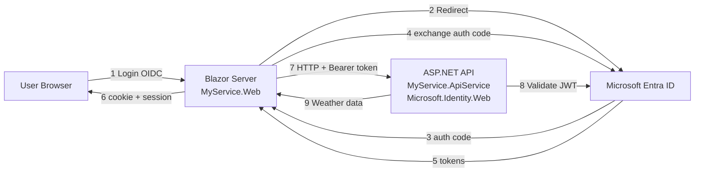

# Microsoft Learn — Microsoft Entra / 開発者向け (Identity Platform・MSAL・Microsoft.Identity.Web) (part 13)

Source: https://learn.microsoft.com/ja-jp/entra/
Pages in this file: 24

---

<!-- MSL-PAGE {"url":"entra/msidweb/frameworks/aspire"} -->
## .NET Aspire アプリMicrosoft Entra ID認証を追加する

- Source: https://learn.microsoft.com/ja-jp/entra/msidweb/frameworks/aspire
- Service: msal / microsoft-identity-web
- Article date: 2026-04-19
- Summary: Microsoft.Identity.Webを使用して、Microsoft Entra IDの認証と承認を通じて.NET Aspire分散型アプリケーションをセキュアにする方法を学びましょう。

このガイドでは、**.NET Aspire** **Microsoft Entra ID** 認証と承認を使用して分散アプリケーションをセキュリティで保護する方法について説明します。 以下が対象です。

1. **Blazor Server フロントエンド** (`MyService.Web`): OpenID Connect とトークン取得を使用したユーザー サインイン
2. **Protected API バックエンド** (`MyService.ApiService`): Microsoft.Identity.Web を使用した JWT 検証
3. **エンド ツー エンド フロー**: Blazor がアクセス トークンを取得し、「Aspire」サービス探索を用いて保護された API を呼び出す

このガイドでは、次のコマンドを使用して作成されたアスパイア プロジェクトを使い始めたものとします。

```sh
aspire new aspire-starter --name MyService
```

### 前提条件

- **.NET 9 SDK** 以降
- .NET Aspire CLI - Install Aspire CLI
- **Microsoft Entra テナント** — セットアップについては、Microsoft Entra ID のアプリの登録に関するページを参照してください

ヒント

Aspireを初めて使用しますか? [.NET Aspireの概要](https://learn.microsoft.com/ja-jp/dotnet/aspire/get-started/aspire-overview)を参照してください。

### 2 フェーズ ワークフローを理解する

このガイドは、2 段階のアプローチに従います。

| Phase | 何が起きるか | 結果 |
| --- | --- | --- |
| **フェーズ 1** | プレースホルダー値を使用して認証コードを追加する | アプリがビルドされるが、実行できない |
| **フェーズ 2** | Microsoft Entraアプリの登録をプロビジョニングする | 実際の認証を使用してアプリを実行する |

### Microsoft Entra IDにアプリを登録する

アプリでユーザーを認証するには、Microsoft Entraに 2 つのアプリ登録が必要です。

| アプリの登録 | Purpose | キー構成 |
| --- | --- | --- |
| **API** (`MyService.ApiService`) | 受信トークンを検証します | アプリ ID URI、 `access_as_user` スコープ |
| **Web アプリ** (`MyService.Web`) | ユーザーのサインイン、トークンの取得 | リダイレクト URI、クライアント シークレット、API のアクセス許可 |

アプリの登録が既に構成されている場合は、 `appsettings.json`に次の値が必要です。

- **TenantId** — Microsoft Entra テナント ID
- **API ClientId** — API アプリ登録のアプリケーション (クライアント) ID
- **API アプリ ID URI** — 通常は `api://<api-client-id>` ( `Audiences` と `Scopes`で使用)
- **Web App ClientId** — Web アプリ登録のアプリケーション (クライアント) ID
- **クライアント シークレット** (または証明書) - Web アプリの資格情報 (appsettings.jsonではなく、ユーザー シークレットに格納)
- **スコープ** - Web アプリが要求するスコープ (たとえば、 `api://<api-client-id>/.default` や `api://<api-client-id>/access_as_user`

#### 手順 1: API を登録する

1. [Microsoft Entra 管理センター](https://entra.microsoft.com)&gt;**Identity**&gt;**Applications**&gt;**アプリの登録** に移動します。
2. **[新規登録]**を選択します。
    - **名前:**`MyService.ApiService`
    - **サポートされているアカウントの種類:** この組織ディレクトリ内のアカウントのみ (シングル テナント)
    - **登録** を選択します。
3. [**API の公開]** に移動します&gt;アプリケーション ID URI の横に**追加**します。
    - 既定値 (`api://<client-id>`) をそのまま使用するか、カスタマイズします。
    - [ **スコープの追加] を**選択します。
        - **スコープ名:**`access_as_user`
        - **同意できるユーザー:** 管理者とユーザー
        - **管理者の同意の表示名:** MyService API にアクセスする
        - **管理者の同意の説明:** サインインしているユーザーの代わりに、アプリが MyService API にアクセスできるようにします。
        - **[スコープの追加]** を選択します。
4. **アプリケーション (クライアント) ID を**コピーします。これは、両方の`appsettings.json` ファイルに必要です。

詳細については、「 [クイック スタート: Web API を公開するようにアプリを構成する」を](https://learn.microsoft.com/ja-jp/entra/identity-platform/quickstart-configure-app-expose-web-apis)参照してください。

#### 手順 2: Web アプリを登録する

1. **アプリの登録**&gt;**New registration**に移動します。
    - **名前:**`MyService.Web`
    - **サポートされているアカウントの種類:** この組織のディレクトリ内のアカウントのみ
    - **リダイレクト URI:** **[Web**] を選択し、アプリの URL + を入力します`/signin-oidc`
        - ローカル開発の場合: `https://localhost:7001/signin-oidc` (実際のポートの `launchSettings.json` を確認してください)
    - **登録** を選択します。
2. **[認証**&gt;**追加 URI** に移動して、(`launchSettings.json` から) すべての開発 URL を追加します。
3. **[証明書とシークレット**&gt;**クライアント シークレット**&gt;**新しいクライアント シークレット**] に移動します。
    - 説明と有効期限を追加します。
    - シークレットの値をすぐにコピーします。再び表示されることはありません。
4. **API のアクセス許可**に移動します&gt;**アクセス許可の追加**&gt;**マイ API。**
    - `MyService.ApiService` を選択します。
    - [アクセス許可 `access_as_user`&gt;**追加]** を選択します。
    - [ **テナント] の [管理者の同意を付与]** を選択します (または、最初の使用時にユーザーにプロンプトが表示されます)。
5. Web アプリのの`appsettings.json`コピーします。

注

一部の組織では、クライアント シークレットが許可されていません。 別の方法については、「 [証明書の資格情報](https://learn.microsoft.com/ja-jp/entra/msidweb/authentication/certificates) 」または [「証明書なしの認証」](https://learn.microsoft.com/ja-jp/entra/msidweb/authentication/certificateless)を参照してください。

詳細については、「 [クイック スタート: アプリケーションを登録する」を](https://learn.microsoft.com/ja-jp/entra/identity-platform/quickstart-register-app)参照してください。

#### 手順 3: 構成を更新する

アプリの登録を作成した後、 `appsettings.json` ファイルを更新します。

**API (`MyService.ApiService/appsettings.json`):**

```json
{
  "AzureAd": {
    "Instance": "https://login.microsoftonline.com/",
    "TenantId": "YOUR_TENANT_ID",
    "ClientId": "YOUR_API_CLIENT_ID",
    "Audiences": ["api://YOUR_API_CLIENT_ID"]
  }
}
```

**Web アプリ (`MyService.Web/appsettings.json`):**

```json
{
  "AzureAd": {
    "Instance": "https://login.microsoftonline.com/",
    "TenantId": "YOUR_TENANT_ID",
    "ClientId": "YOUR_WEB_CLIENT_ID",
    "CallbackPath": "/signin-oidc",
    "ClientCredentials": [
      { "SourceType": "ClientSecret" }
    ]
  },
  "WeatherApi": {
    "Scopes": ["api://YOUR_API_CLIENT_ID/.default"]
  }
}
```

**シークレットを安全に格納します。**

```powershell
cd MyService.Web
dotnet user-secrets set "AzureAd:ClientCredentials:0:ClientSecret" "YOUR_SECRET_VALUE"
```

| 価値 | 検索する場所 |
| --- | --- |
| `TenantId` | Microsoft Entra 管理センター &gt; の概要 &gt; テナント ID |
| `API ClientId` | アプリの登録 &gt; MyService.ApiService &gt; アプリケーション (クライアント) ID |
| `Web ClientId` | アプリの登録 &gt; MyService.Web &gt; アプリケーション（クライアント）ID |
| `Client Secret` | 手順 2 で作成 (作成時に直ちにコピー) |

注

アスパイア スターター テンプレートは、`WeatherApiClient` プロジェクトに`MyService.Web` クラスを自動的に作成します。 この型指定された HttpClient は、保護された API の呼び出しを示すために、このガイド全体で使用されます。 このクラスは自分で作成する必要はありません。これはテンプレートの一部です。

### すばやく開始する

このセクションでは、認証を追加するための要約されたリファレンスを示します。 詳細なチュートリアルについては、 パート 1 と パート 2 を参照してください。

#### API (`MyService.ApiService`)

Microsoft.Identity.Web NuGet パッケージをインストールします。

```powershell
dotnet add package Microsoft.Identity.Web
```

Microsoft Entra構成を `appsettings.json` に追加します。

```json
{
  "AzureAd": {
    "Instance": "https://login.microsoftonline.com/",
    "TenantId": "<tenant-id>",
    "ClientId": "<api-client-id>",
    "Audiences": ["api://<api-client-id>"]
  }
}
```

`Program.cs`で認証と承認を登録します。

```csharp
builder.Services.AddAuthentication(JwtBearerDefaults.AuthenticationScheme)
    .AddMicrosoftIdentityWebApi(builder.Configuration.GetSection("AzureAd"));
builder.Services.AddAuthorization();
// ...
app.UseAuthentication();
app.UseAuthorization();
// ...
app.MapGet("/weatherforecast", () => { /* ... */ }).RequireAuthorization();
```

#### Web アプリ (`MyService.Web`)

Microsoft.Identity.Web NuGet パッケージをインストールします。

```powershell
dotnet add package Microsoft.Identity.Web
```

Microsoft Entra構成を `appsettings.json` に追加します。

```json
{
  "AzureAd": {
    "Instance": "https://login.microsoftonline.com/",
    "TenantId": "<tenant-id>",
    "ClientId": "<web-client-id>",
    "CallbackPath": "/signin-oidc",
    "ClientCredentials": [{ "SourceType": "ClientSecret" }]
  },
  "WeatherApi": { "Scopes": ["api://<api-client-id>/.default"] }
}
```

`Program.cs`で認証、トークン取得、およびダウンストリーム API クライアントを構成します。

```csharp
builder.Services.AddAuthentication(OpenIdConnectDefaults.AuthenticationScheme)
    .AddMicrosoftIdentityWebApp(builder.Configuration.GetSection("AzureAd"))
    .EnableTokenAcquisitionToCallDownstreamApi()
    .AddInMemoryTokenCaches();

builder.Services.AddCascadingAuthenticationState();
builder.Services.AddScoped<BlazorAuthenticationChallengeHandler>();

builder.Services.AddHttpClient<WeatherApiClient>(client =>
    client.BaseAddress = new("https+http://apiservice"))
    .AddMicrosoftIdentityMessageHandler(builder.Configuration.GetSection("WeatherApi"));
// ...
app.UseAuthentication();
app.UseAuthorization();
app.MapGroup("/authentication").MapLoginAndLogout();
```

`MicrosoftIdentityMessageHandler`はトークンを自動的に取得してアタッチし、同意と条件付きアクセスのチャレンジ`BlazorAuthenticationChallengeHandler`処理します。

Important

ログイン ボタンの `UserInfo.razor` を作成することを忘れないでください。 詳細については、「 Blazor UI コンポーネントの追加 」を参照してください。

注

`BlazorAuthenticationChallengeHandler`および`LoginLogoutEndpointRouteBuilderExtensions`はMicrosoft.Identity.Web (v3.3.0以降)で提供されます。 ファイルのコピーは必要ありません。

### 変更するファイルを識別する

次の表に、各プロジェクトで変更するファイルの一覧を示します。

| プロジェクト | File | Changes |
| --- | --- | --- |
| **ApiService** | `Program.cs` | JWT Bearer 認証、承認ミドルウェア |
|  | `appsettings.json` | Microsoft Entra構成 |
|  | `.csproj` | `Microsoft.Identity.Web`を追加する |
| **ウェブ** | `Program.cs` | OIDC 認証、トークンの取得、BlazorAuthenticationChallengeHandler |
|  | `appsettings.json` | Microsoft Entra構成、ダウンストリーム API スコープ |
|  | `.csproj` | `Microsoft.Identity.Web` の追加 (v3.3.0 以降) |
|  | `Components/UserInfo.razor` | ログイン ボタン UI (新しいファイル) |
|  | `Components/Layout/MainLayout.razor` | UserInfo コンポーネントを含める |
|  | `Components/Routes.razor` | 保護されたページ用のAuthorizeRouteView |
|  | API を呼び出すページ | ChallengeHandler で試す/キャッチする |

### 認証フローを理解する

次の図は、Blazor フロントエンド、Microsoft Entra、保護された API の相互作用を示しています。



1. **ユーザーが Blazor アプリにアクセス** →認証されていない→に [ログイン] ボタンが表示されます。
2. **ユーザーはログインを選択** → `/authentication/login`にリダイレクトします → OIDC チャレンジ → Microsoft Entra.
3. **ユーザーがサインイン** → Microsoft Entraは、確立された `/signin-oidc` → Cookie にリダイレクトします。
4. **ユーザーが天気ページに移動する**と、Blazor が`WeatherApiClient.GetAsync()`を呼び出します。
5. **`MicrosoftIdentityMessageHandler`** は要求をインターセプトし、キャッシュからトークンを取得し (または自動的に更新)、 `Authorization: Bearer <token>` ヘッダーをアタッチします。
6. **API がリクエストを受信** → Microsoft.Identity.Web が JWT を検証 → データを返します。
7. **Blazor は気象データをレンダリングします**。

### ソリューション構造を確認する

アスパイア スターター テンプレートでは、次のプロジェクト レイアウトが作成されます。

```
MyService/
├── MyService.AppHost/           # Aspire orchestration
├── MyService.ApiService/        # Protected API (Microsoft.Identity.Web)
├── MyService.Web/               # Blazor Server (Microsoft.Identity.Web)
├── MyService.ServiceDefaults/   # Shared defaults
└── MyService.Tests/             # Tests
```

### パート 1: Microsoftを使用して API バックエンドをセキュリティで保護する。Identity.Web

このセクションでは、Microsoft Entraによって発行された JWT ベアラー トークンを検証するように API プロジェクトを構成します。

#### Microsoft.Identity.Web パッケージを追加します

次のコマンドを実行して、Microsoft.Identity.Web NuGet パッケージをインストールします。

```powershell
cd MyService.ApiService
dotnet add package Microsoft.Identity.Web
```

#### Microsoft Entra設定を構成する

Microsoft Entra構成を `MyService.ApiService/appsettings.json` に追加します。

```json
{
  "AzureAd": {
    "Instance": "https://login.microsoftonline.com/",
    "TenantId": "<your-tenant-id>",
    "ClientId": "<your-api-client-id>",
    "Audiences": [
      "api://<your-api-client-id>"
    ]
  },
  "Logging": {
    "LogLevel": {
      "Default": "Information",
      "Microsoft.AspNetCore": "Warning"
    }
  },
  "AllowedHosts": "*"
}
```

主なプロパティ:

- **`ClientId`**: MICROSOFT ENTRA API アプリ登録 ID
- **`TenantId`**: Microsoft Entra テナント ID、マルチテナントの場合は `"organizations"`、任意の Microsoft アカウント の場合は `"common"`
- **`Audiences`**: 有効なトークン対象ユーザー (通常はアプリ ID URI)

#### API Program.csの更新

JWT Bearer 認証を追加し、エンドポイントを保護するために、 `MyService.ApiService/Program.cs` の内容を次のコードに置き換えます。

```csharp
using Microsoft.AspNetCore.Authentication.JwtBearer;
using Microsoft.Identity.Web;

var builder = WebApplication.CreateBuilder(args);

builder.AddServiceDefaults();

// Add Microsoft.Identity.Web JWT Bearer authentication
builder.Services.AddAuthentication(JwtBearerDefaults.AuthenticationScheme)
    .AddMicrosoftIdentityWebApi(builder.Configuration.GetSection("AzureAd"));

builder.Services.AddProblemDetails();
builder.Services.AddOpenApi();
builder.Services.AddAuthorization();

var app = builder.Build();

app.UseExceptionHandler();
app.UseAuthentication();
app.UseAuthorization();

if (app.Environment.IsDevelopment())
{
    app.MapOpenApi();
}

string[] summaries = ["Freezing", "Bracing", "Chilly", "Cool", "Mild",
    "Warm", "Balmy", "Hot", "Sweltering", "Scorching"];

app.MapGet("/", () =>
    "API service is running. Navigate to /weatherforecast to see sample data.");

app.MapGet("/weatherforecast", () =>
{
    var forecast = Enumerable.Range(1, 5).Select(index =>
        new WeatherForecast
        (
            DateOnly.FromDateTime(DateTime.Now.AddDays(index)),
            Random.Shared.Next(-20, 55),
            summaries[Random.Shared.Next(summaries.Length)]
        ))
        .ToArray();
    return forecast;
})
.WithName("GetWeatherForecast")
.RequireAuthorization();

app.MapDefaultEndpoints();
app.Run();

record WeatherForecast(DateOnly Date, int TemperatureC, string? Summary)
{
    public int TemperatureF => 32 + (int)(TemperatureC / 0.5556);
}
```

主な変更:

- JWT ベアラートークン認証を登録する `AddMicrosoftIdentityWebApi`
- `app.UseAuthentication()`と`app.UseAuthorization()`ミドルウェアを追加する
- 保護されたエンドポイントに `.RequireAuthorization()` を適用する

#### 保護された API をテストする

API が認証されていない要求を拒否し、有効なトークンを受け入れることを確認します。

トークンなしで要求を送信する:

```powershell
curl https://localhost:<PORT>/weatherforecast
# Expected: 401 Unauthorized
```

有効なトークンを使用して要求を送信します。

```powershell
curl -H "Authorization: Bearer <TOKEN>" https://localhost:<PORT>/weatherforecast
# Expected: 200 OK with weather data
```

### パート 2: 認証用に Blazor フロントエンドを構成する

Blazor Server アプリでは、**Microsoft.Identity.Web** を使用します。

- OIDC を使用してユーザーをサインインさせる
- API を呼び出すアクセス トークンを取得する
- 送信 HTTP 要求にトークンをアタッチする

#### Microsoft.Identity.Web パッケージを追加します

次のコマンドを実行して、Microsoft.Identity.Web NuGet パッケージをインストールします。

```powershell
cd MyService.Web
dotnet add package Microsoft.Identity.Web
```

#### Microsoft Entra設定を構成する

Microsoft Entra構成とダウンストリーム API スコープを `MyService.Web/appsettings.json` に追加します。

```json
{
  "AzureAd": {
    "Instance": "https://login.microsoftonline.com/",
    "Domain": "<your-tenant>.onmicrosoft.com",
    "TenantId": "<tenant-guid>",
    "ClientId":  "<web-app-client-id>",
    "CallbackPath": "/signin-oidc",
    "ClientCredentials": [
      {
        "SourceType": "ClientSecret",
        "ClientSecret": "<your-client-secret>"
      }
    ]
  },
  "WeatherApi": {
    "Scopes": [ "api://<api-client-id>/.default" ]
  },
  "Logging": {
    "LogLevel":  {
      "Default": "Information",
      "Microsoft.AspNetCore": "Warning"
    }
  },
  "AllowedHosts": "*"
}
```

構成の詳細:

- **`ClientId`**: Web アプリ登録 ID (API ID ではない)
- **`ClientCredentials`**: トークンを取得するための Web アプリの資格情報。 複数の資格情報の種類をサポートします。 運用対応オプションについては、「 [資格情報の概要」](https://learn.microsoft.com/ja-jp/entra/msidweb/authentication/credentials-overview) を参照してください。
- **`Scopes`**: API のアプリ ID URI とサフィックス `/.default` 一致する必要があります

Warnung

運用環境では、クライアント シークレットの代わりに証明書またはマネージド ID を使用します。 推奨される方法については、「 [証明書なしの認証](https://learn.microsoft.com/ja-jp/entra/msidweb/authentication/certificateless) 」を参照してください。

#### Web アプリのProgram.csを更新する

OIDC 認証、トークン取得、およびダウンストリーム API クライアントを構成するために、 `MyService.Web/Program.cs` の内容を次のコードに置き換えます。

```csharp
using Microsoft.AspNetCore.Authentication.OpenIdConnect;
using Microsoft.Identity.Abstractions;
using Microsoft.Identity.Web;
using MyService.Web;
using MyService.Web.Components;

var builder = WebApplication.CreateBuilder(args);

builder.AddServiceDefaults();

// Authentication + Microsoft Identity Web
builder.Services.AddAuthentication(OpenIdConnectDefaults.AuthenticationScheme)
    .AddMicrosoftIdentityWebApp(builder.Configuration.GetSection("AzureAd"))
    .EnableTokenAcquisitionToCallDownstreamApi()
    .AddInMemoryTokenCaches();

builder.Services.AddCascadingAuthenticationState();

// Blazor components
builder.Services.AddRazorComponents().AddInteractiveServerComponents();

// Blazor authentication challenge handler for incremental consent and Conditional Access
builder.Services.AddScoped<BlazorAuthenticationChallengeHandler>();

builder.Services.AddOutputCache();

// Downstream API client with MicrosoftIdentityMessageHandler
builder.Services.AddHttpClient<WeatherApiClient>(client =>
{
    // Aspire service discovery: resolves "apiservice" at runtime
    client.BaseAddress = new("https+http://apiservice");
})
.AddMicrosoftIdentityMessageHandler(builder.Configuration.GetSection("WeatherApi"));

var app = builder.Build();

if (!app.Environment.IsDevelopment())
{
    app.UseExceptionHandler("/Error", createScopeForErrors: true);
    app.UseHsts();
}

app.UseHttpsRedirection();
app.UseAuthentication();
app.UseAuthorization();
app.UseAntiforgery();
app.UseOutputCache();

app.MapStaticAssets();
app.MapRazorComponents<App>()
   .AddInteractiveServerRenderMode();

// Login/Logout endpoints with incremental consent support
app.MapGroup("/authentication").MapLoginAndLogout();

app.MapDefaultEndpoints();
app.Run();
```

重要なポイント:

- **`AddMicrosoftIdentityWebApp`**: OIDC 認証を構成します
- **`EnableTokenAcquisitionToCallDownstreamApi`**: ダウンストリーム API のトークン取得を有効にします。
- **`AddScoped<BlazorAuthenticationChallengeHandler>`**: Blazor サーバーでの増分同意と条件付きアクセスを処理します
- **`AddMicrosoftIdentityMessageHandler`**: ベアラー トークンを HttpClient 要求に自動的にアタッチします
- **`https+http://apiservice`**: Aspire のサービスディスカバリにより実際の API URL が解決されます。
- **ミドルウェアの順序**: エンドポイント `UseAuthentication()` → `UseAuthorization()` →

`AddMicrosoftIdentityMessageHandler`拡張機能では、複数の構成パターンがサポートされています。

**オプション 1: appsettings.json からの構成 (前述)**

```csharp
.AddMicrosoftIdentityMessageHandler(builder.Configuration.GetSection("WeatherApi"));
```

**オプション 2: アクション デリゲートを使用したインライン構成**

```csharp
.AddMicrosoftIdentityMessageHandler(options =>
{
    options.Scopes.Add("api://<api-client-id>/.default");
});
```

**オプション 3: 要求ごとの構成 (パラメーターなし)**

```csharp
.AddMicrosoftIdentityMessageHandler();

// Then in your service, configure per-request:
var request = new HttpRequestMessage(HttpMethod.Get, "/weatherforecast")
    .WithAuthenticationOptions(options =>
    {
        options.Scopes.Add("api://<api-client-id>/.default");
    });
var response = await _httpClient.SendAsync(request);
```

#### Blazor UI コンポーネントを追加する

Important

この手順は頻繁に忘れ去られています。 UserInfo コンポーネントがないと、ユーザーはサインインする方法がありません。

`BlazorAuthenticationChallengeHandler`および`LoginLogoutEndpointRouteBuilderExtensions`は、**Microsoft.Identity.Web v3.3.0以降**に含まれています。 パッケージを参照すると自動的に使用できます。ファイルのコピーは必要ありません。

**`MyService.Web/Components/UserInfo.razor`を作成します。**

```razor
@using Microsoft.AspNetCore.Components.Authorization

<AuthorizeView>
    <Authorized>
        <span class="nav-item">Hello, @context.User.Identity?.Name</span>
        <form action="/authentication/logout" method="post" class="nav-item">
            <AntiforgeryToken />
            <input type="hidden" name="returnUrl" value="/" />
            <button type="submit" class="btn btn-link nav-link">Logout</button>
        </form>
    </Authorized>
    <NotAuthorized>
        <a href="/authentication/login?returnUrl=/" class="nav-link">Login</a>
    </NotAuthorized>
</AuthorizeView>
```

**レイアウトに追加:**`<UserInfo />`に`MainLayout.razor`を含めます。

```razor
@inherits LayoutComponentBase

<div class="page">
    <div class="sidebar">
        <NavMenu />
    </div>

    <main>
        <div class="top-row px-4">
            <UserInfo />
        </div>

        <article class="content px-4">
            @Body
        </article>
    </main>
</div>
```

#### AuthorizeRouteView の Routes.razor を更新する

`RouteView`を`AuthorizeRouteView`の`Components/Routes.razor`に置き換えます。

```razor
@using Microsoft.AspNetCore.Components.Authorization

<Router AppAssembly="typeof(Program).Assembly">
    <Found Context="routeData">
        <AuthorizeRouteView RouteData="routeData" DefaultLayout="typeof(Layout.MainLayout)">
            <NotAuthorized>
                <p>You are not authorized to view this page.</p>
                <a href="/authentication/login">Login</a>
            </NotAuthorized>
        </AuthorizeRouteView>
        <FocusOnNavigate RouteData="routeData" Selector="h1" />
    </Found>
</Router>
```

#### API を呼び出すページで例外を処理する

Blazor サーバーでは、条件付きアクセスと同意のために明示的な例外処理が必要です。 アプリが事前に認証され、すべてのスコープを事前に要求していない限り、ダウンストリーム API を呼び出すすべてのページで `MicrosoftIdentityWebChallengeUserException` を処理する必要があります。

次の `Weather.razor` 例は、適切な例外処理を示しています。

```razor
@page "/weather"
@attribute [Authorize]

@using Microsoft.AspNetCore.Authorization
@using Microsoft.Identity.Web

@inject WeatherApiClient WeatherApi
@inject BlazorAuthenticationChallengeHandler ChallengeHandler

<PageTitle>Weather</PageTitle>

<h1>Weather</h1>

@if (!string.IsNullOrEmpty(errorMessage))
{
    <div class="alert alert-warning">@errorMessage</div>
}
else if (forecasts == null)
{
    <p><em>Loading...</em></p>
}
else
{
    <table class="table">
        <thead>
            <tr>
                <th>Date</th>
                <th>Temp. (C)</th>
                <th>Summary</th>
            </tr>
        </thead>
        <tbody>
            @foreach (var forecast in forecasts)
            {
                <tr>
                    <td>@forecast.Date.ToShortDateString()</td>
                    <td>@forecast.TemperatureC</td>
                    <td>@forecast.Summary</td>
                </tr>
            }
        </tbody>
    </table>
}

@code {
    private WeatherForecast[]? forecasts;
    private string? errorMessage;

    protected override async Task OnInitializedAsync()
    {
        if (!await ChallengeHandler.IsAuthenticatedAsync())
        {
            await ChallengeHandler.ChallengeUserWithConfiguredScopesAsync("WeatherApi:Scopes");
            return;
        }

        try
        {
            forecasts = await WeatherApi.GetWeatherAsync();
        }
        catch (Exception ex)
        {
            // Handle incremental consent / Conditional Access
            if (!await ChallengeHandler.HandleExceptionAsync(ex))
            {
                errorMessage = $"Error loading weather data: {ex.Message}";
            }
        }
    }
}
```

このパターンは次のように動作します。

1. `IsAuthenticatedAsync()` は、API 呼び出しを行う前にユーザーがサインインしているかどうかを確認します。
2. `HandleExceptionAsync()` は `MicrosoftIdentityWebChallengeUserException` (または InnerException) をキャッチします。
3. チャレンジ例外の場合、ユーザーは必要な要求またはスコープで再認証するようにリダイレクトされます。
4. チャレンジ例外でない場合、 `HandleExceptionAsync` は `false` を返して、エラーを自分で処理できるようにします。

#### クライアント シークレットをユーザー シークレットに格納する

.NET シークレット マネージャーを使用して、開発中にクライアント シークレットを安全に格納します。

注意事項

シークレットをソース管理にコミットしないでください。

ユーザー シークレットを初期化し、クライアント シークレットを格納します。

```powershell
cd MyService.Web
dotnet user-secrets init
dotnet user-secrets set "AzureAd:ClientCredentials:0:ClientSecret" "<your-client-secret>"
```

次に、 `appsettings.json` を更新して、ハードコーディングされたシークレットを削除します。

```json
{
  "AzureAd": {
    "ClientCredentials": [
      {
        "SourceType": "ClientSecret"
      }
    ]
  }
}
```

Microsoft。Identity.Web では、複数の資格情報の種類がサポートされています。 運用に関しては、[資格情報の概要](https://learn.microsoft.com/ja-jp/entra/msidweb/authentication/credentials-overview)を参照してください。

### 実装を確認する

このチェックリストを使用して、必要なすべての手順を完了したことを確認します。

#### API プロジェクト

- [ ] `Microsoft.Identity.Web` パッケージを追加しました
- [ ] `appsettings.json` セクションで`AzureAd`を更新しました
- [ ] で `Program.cs` を更新しました `AddMicrosoftIdentityWebApi`
- [ ] 保護されたエンドポイントに `.RequireAuthorization()` を追加しました

#### Web/Blazor プロジェクト

- [ ] `Microsoft.Identity.Web` パッケージ (v3.3.0 以降) を追加しました
- [ ] `appsettings.json`セクションと`AzureAd` セクションで`WeatherApi`を更新しました
- [ ] OIDC、トークン取得で `Program.cs` を更新しました
- [ ] 追加 `AddScoped<BlazorAuthenticationChallengeHandler>()`
- [ ] 作成した `Components/UserInfo.razor` (ログイン ボタン)
- `MainLayout.razor`を更新し`<UserInfo />`を含めた
- [ ] で `Routes.razor` を更新しました `AuthorizeRouteView`
- [ ] API を呼び出すすべてのページに、 `ChallengeHandler` で try/catch を追加しました
- [ ] ユーザー シークレットに格納されているクライアント シークレット

#### 検証

- [ ] `dotnet build` 成功
- [ ] Microsoft Entra 管理センターで作成されたアプリの登録
- [ ] `appsettings.json` には実際の GUID があります (プレースホルダーなし)

### テストとトラブルシューティング

実装が完了したら、アプリケーションを実行し、エンドツーエンドの認証フローを確認します。

#### アプリケーションを実行する

Web プロジェクトと API プロジェクトの両方を起動するために、アスパイア AppHost を起動します。

```powershell
# From solution root
dotnet restore
dotnet build

# Launch AppHost (starts both Web and API)
dotnet run --project .\MyService.AppHost\MyService.AppHost.csproj
```

#### 認証フローをテストする

1. Blazor Web UI →ブラウザーを開きます (URL については、アスパイア ダッシュボードを確認してください)。
2. [Login → Microsoft Entra でサインインします。
3. **[天気]** ページに移動します。
4. (保護された API からの) 気象データの読み込みを確認します。

#### 一般的な問題を解決

次の表に、頻繁に発生する問題とその解決策を示します。

| 問題点 | ソリューション |
| --- | --- |
| **API 呼び出しの 401** | `appsettings.json`のスコープが API のアプリ ID URI と一致するかどうかを確認する |
| **OIDC リダイレクトが失敗する** | リダイレクト URI に `/signin-oidc` を Microsoft Entra に追加する |
| **トークンがアタッチされていない** | `AddMicrosoftIdentityMessageHandler`で`HttpClient`が確実に呼び出されるようにしてください。 |
| **サービスの検出が失敗する** | `AppHost.cs`両方のプロジェクトの参照を確認し、それらが実行中であることを確認する |
| **AADSTS65001** | 管理者の同意が必要 - Microsoft Entra 管理センターで同意を付与する |
| **ログインボタンなし** | `UserInfo.razor`が存在し、`MainLayout.razor`に含まれることを確認する |
| **同意ループ** | `HandleExceptionAsync`で try/catch がすべての API 呼び出しページにあることを確認する |

#### MSAL ログを有効にする

認証の問題のトラブルシューティングを行うときは、詳細な MSAL ログを有効にして、トークン取得の詳細を表示します。 次のログ レベルを `appsettings.json`に追加します。

```json
{
  "Logging": {
    "LogLevel": {
      "Default": "Information",
      "Microsoft.AspNetCore": "Warning",
      "Microsoft.Identity": "Debug",
      "Microsoft.IdentityModel": "Debug"
    }
  }
}
```

Warnung

非常に詳細な場合があるため、運用環境でデバッグ ログを無効にします。

#### トークンを検査する

トークンの問題をデバッグするには、 https://jwt.ms で JWT をデコードし、次のことを確認します。

- **`aud` (対象ユーザー):** API のクライアント ID またはアプリ ID URI と一致します
- **`iss` (発行者):**お客様のテナントと一致します (`https://login.microsoftonline.com/<tenant-id>/v2.0`)
- **`scp` (スコープ):**必要なスコープが含まれています
- **`exp` (有効期限):** トークンの有効期限が切れていない

### 一般的なシナリオを調べる

以降のセクションでは、追加のユース ケース用に基本実装を拡張する方法を示します。

#### Blazor ページを保護する

認証を必要とするページに `[Authorize]` 属性を追加します。

```razor
@page "/weather"
@attribute [Authorize]
```

または、 `Program.cs`で承認ポリシーを定義します。

```csharp
// Program.cs
builder.Services.AddAuthorization(options =>
{
    options.AddPolicy("AdminOnly", policy => policy.RequireRole("Admin"));
});
```

```razor
@attribute [Authorize(Policy = "AdminOnly")]
```

#### API でスコープを検証する

次の `RequireScope`をチェーンして、API が特定のスコープを持つトークンのみを受け入れるようにします。

```csharp
app.MapGet("/weatherforecast", () =>
{
    // ... implementation
})
.RequireAuthorization()
.RequireScope("access_as_user");
```

#### アプリ専用トークンの使用 (サービス間)

ユーザー コンテキストのないデーモン シナリオまたはサービス間呼び出しの場合は、 `RequestAppToken` を `true` に設定します。

```csharp
builder.Services.AddHttpClient<WeatherApiClient>(client =>
{
    client.BaseAddress = new("https+http://apiservice");
})
.AddMicrosoftIdentityMessageHandler(options =>
{
    options.Scopes.Add("api://<api-client-id>/.default");
    options.RequestAppToken = true;
});
```

#### 運用環境で証明書なしの資格情報を使用する

Azureでの運用環境のデプロイでは、クライアント シークレットの代わりにマネージド ID を使用します。 `ClientCredentials` セクションを次のように構成します。

```json
{
  "AzureAd": {
    "Instance": "https://login.microsoftonline.com/",
    "TenantId": "<tenant-guid>",
    "ClientId":  "<web-app-client-id>",
    "ClientCredentials": [
      {
        "SourceType": "SignedAssertionFromManagedIdentity",
        "ManagedIdentityClientId": "<user-assigned-mi-client-id>"
      }
    ]
  }
}
```

詳細については、「 [証明書なしの認証](https://learn.microsoft.com/ja-jp/entra/msidweb/authentication/certificateless)」を参照してください。

#### API からダウンストリーム API を代理で呼び出す

API がユーザーの代わりに別のダウンストリーム API を呼び出す必要がある場合は、 `Program.cs`で代理トークンの取得を有効にします。

```csharp
// MyService.ApiService/Program.cs
builder.Services.AddAuthentication(JwtBearerDefaults.AuthenticationScheme)
    .AddMicrosoftIdentityWebApi(builder.Configuration.GetSection("AzureAd"))
    .EnableTokenAcquisitionToCallDownstreamApi()
    .AddInMemoryTokenCaches();

builder.Services.AddDownstreamApi("GraphApi", builder.Configuration.GetSection("GraphApi"));
```

ダウンストリーム API 構成を `appsettings.json`に追加します。

```json
{
  "GraphApi": {
    "BaseUrl": "https://graph.microsoft.com/v1.0",
    "Scopes": [ "User.Read" ]
  }
}
```

次に、エンドポイントからダウンストリーム API を呼び出します。

```csharp
{
    var user = await downstreamApi.GetForUserAsync<JsonElement>("GraphApi", "me");
    return user;
}).RequireAuthorization();
```

詳細については、「 [ダウンストリーム API の呼び出し」を](https://learn.microsoft.com/ja-jp/entra/msidweb/call-downstream-apis/overview)参照してください。
<!-- /MSL-PAGE -->

---

<!-- MSL-PAGE {"url":"entra/msidweb/frameworks/aspnet-framework"} -->
## ASP.NET フレームワークと.NET Standard サポート

- Source: https://learn.microsoft.com/ja-jp/entra/msidweb/frameworks/aspnet-framework
- Service: msal / microsoft-identity-web
- Article date: 2026-04-19
- Summary: Microsoft.Identity.Webを.NET Frameworkおよび.NET StandardアプリにOWINミドルウェアまたはMSAL.NETトークンキャッシュパッケージを使用して統合します。

Microsoft。Identity.Web は、Microsoft Entra ID認証を .NET Framework および .NET Standard アプリケーションに拡張します。 この記事は、シナリオに適したパッケージと統合パターンを選択するのに役立ちます。

### シナリオを選択する

アプリケーションの種類に一致する統合パターンを選択します。 Microsoft Entraでは、Web アプリとバックグラウンド サービス用のさまざまなパッケージが提供されます。

#### MSAL.NET および Microsoft.Identity.Web パッケージ

**コンソール アプリ、デーモン サービス、および Web 以外の.NET Framework アプリケーションの場合**

Microsoft.Identity.Web.TokenCache と Microsoft.Identity.Web.Certificate パッケージを MSAL.NET と共に使用します。

- トークン キャッシュのシリアル化 (SQL Server、Redis、Cosmos DB、PostgreSQL)
- KeyVault、証明書ストア、またはファイル システムからの証明書の読み込み
- コンソール アプリケーションとデーモン サービス
- .NET Standard 2.0 ライブラリ

**[MSAL.NET とMicrosoft.Identity.Web ガイド](https://learn.microsoft.com/ja-jp/entra/msidweb/frameworks/msal-dotnet-framework)**

#### ASP.NET MVC/Web API の OWIN 統合

**ASP.NET MVCおよび Web API アプリケーションの場合**

Microsoft.Identity.Web.OWIN パッケージを使用して、フル機能の Web 認証を行います。

- トークンの自動取得のための TokenAcquirerFactory
- Microsoft Graphおよびダウンストリーム API に簡単にアクセスするためのコントローラー拡張機能
- 分散トークン キャッシュのサポート
- 段階的同意処理

**[OWIN 統合ガイド](https://learn.microsoft.com/ja-jp/entra/msidweb/frameworks/owin)**

### 統合オプションの比較

次の表は、2 つの統合アプローチの主な違いをまとめたものです。

| 特徴 | MSAL.NET + TokenCache/Certificate | OWIN 統合 |
| --- | --- | --- |
| **パッケージ** | Microsoft.Identity.Web.TokenCacheMicrosoft.Identity.Web.Certificate | Microsoft.Identity.Web.OWIN |
| **ターゲット** | コンソールアプリ、デーモン、ワーカーサービス | ASP.NET MVC、ASP.NET Web API |
| **認証** | 手動 MSAL.NET 構成 | 自動 OWIN ミドルウェア |
| **トークンの取得** | マニュアルに`IConfidentialClientApplication` | コントローラー拡張機能を使った自動操作 |
| **トークン キャッシュ** | すべてのプロバイダー (SQL、Redis、Cosmos、PostgreSQL) | すべてのプロバイダー (SQL、Redis、Cosmos、PostgreSQL) |
| **証明書の読み込み** | KeyVault（キー保管庫）、ストア（保存）、ファイル、Base64（ベース64） | MSAL.NET 構成を使用する |
| **Microsoft Graph** | 手動 `GraphServiceClient` セットアップ | `this.GetGraphServiceClient()` |
| **ダウンストリーム API** | トークンを使用した手動 HTTP 呼び出し | `this.GetDownstreamApi()` |
| **段階的同意** | 手動チャレンジ処理 | 自動 `MsalUiRequiredException` |

### 利用可能なパッケージを確認する

Microsoft。Identity.Web 1.17+、ASP.NET Core以外の環境でMicrosoft ID ライブラリを使用できます。 次のパッケージは、.NET Framework と .NET Standard ワークロードを対象にしています。

#### 利用可能なパッケージ

| パッケージ | Purpose | ターゲット アプリケーション |
| --- | --- | --- |
| **Microsoft。Identity.Web.TokenCache** | MSAL.NET のトークン キャッシュ シリアライザー | コンソール、デーモン、ワーカー サービス |
| **Microsoft.Identity.Web.Certificate** | 証明書の読み込みユーティリティ | コンソール、デーモン、ワーカー サービス |
| **Microsoft。Identity.Web.OWIN** | OWIN ミドルウェアの統合 | ASP.NET MVC、ASP.NET Web API |

#### パッケージの利点を理解する

これらのパッケージは、ASP.NET Coreを必要とせずに、一般的な認証タスクを簡略化します。

| 特徴 | 給付金 |
| --- | --- |
| **トークン キャッシュのシリアル化** | メモリ内、SQL Server、Redis、Cosmos DB、PostgreSQL 用の再利用可能なキャッシュ アダプター |
| **証明書ヘルパー** | KeyVault、ファイル システム、または証明書ストアからの証明書の読み込みの簡略化 |
| **OWIN 統合** | ASP.NET MVC/Web API のシームレスな認証 |
| **.NET Standard 2.0** | .NET Framework 4.7.2 以降、.NET Core、.NET 5 以降と互換性があります |
| **最小依存関係** | ASP.NET Core依存関係のない対象パッケージ |

### サンプル アプリケーションを調べる

これらのサンプルは、独自の実装の開始点として使用します。

#### MSAL.NET サンプル

- [ConfidentialClientTokenCache](https://github.com/Azure-Samples/active-directory-dotnet-v1-to-v2/tree/master/ConfidentialClientTokenCache) - トークン キャッシュを含むコンソール アプリ
- [active-directory-dotnetcore-daemon-v2](https://github.com/Azure-Samples/active-directory-dotnetcore-daemon-v2) - KeyVault からの証明書を含むデーモン

#### OWIN のサンプル

- [ms-identity-aspnet-webapp-openidconnect](https://github.com/Azure-Samples/ms-identity-aspnet-webapp-openidconnect) - Microsoft.Identity.Web.OWIN を使用した ASP.NET MVC
<!-- /MSL-PAGE -->

---

<!-- MSL-PAGE {"url":"entra/msidweb/frameworks/msal-dotnet-framework"} -->
## .NET Framework で Microsoft.Identity.Web を使用した MSAL.NET

- Source: https://learn.microsoft.com/ja-jp/entra/msidweb/frameworks/msal-dotnet-framework
- Service: msal / microsoft-identity-web
- Article date: 2026-04-19
- Summary: Microsoft.Identity.WebとMSAL.NETを使用して、.NET Framework アプリでのトークン キャッシュと証明書の読み込みを構成し、認証を効率化します。

このガイドでは、.NET Framework、.NET Standard 2.0、およびクラシック .NET アプリケーション (.NET 4.7.2 以降) で、MSAL.NET と共に Microsoft.Identity.Web のトークン キャッシュおよび証明書パッケージを使用する方法を説明します。

### 概要を理解する

**Microsoft.Identity.Web 1.17+** 以降では、非 ASP.NET Core 環境で MSAL.NET と共に Microsoft.Identity.Web ユーティリティ パッケージを使用できます。

#### パッケージの利点を特定する

| 特徴 | 給付金 |
| --- | --- |
| **トークン キャッシュのシリアル化** | メモリ内、SQL Server、Redis、Cosmos DB、PostgreSQL 用の再利用可能なキャッシュ アダプター |
| **証明書ヘルパー** | KeyVault、ファイル システム、または証明書ストアからの証明書の読み込みの簡略化 |
| **クレーム拡張** | `ClaimsPrincipal`操作のためのユーティリティ メソッド |
| **.NET Standard 2.0** | .NET Framework 4.7.2 以降、.NET Core、.NET 5 以降と互換性があります |
| **最小依存関係** | ASP.NET Core依存関係のない対象パッケージ |

#### サポートされているシナリオを確認する

次のシナリオは、対象となるユーティリティ パッケージでサポートされています。

- **.NET Framework コンソール アプリケーション** (デーモン シナリオ)
- **Desktop Applications** (.NET Framework)
- **Worker Services** (.NET Framework)
- **.NET Standard 2.0 ライブラリ** (クロスプラットフォーム互換性)
- **Non-web MSAL.NET アプリケーション**

注

ASP.NET MVC/Web API アプリケーションについては、代わりに [OWIN 統合](https://learn.microsoft.com/ja-jp/entra/msidweb/frameworks/owin)を参照してください。

### パッケージの選択

シナリオに一致するパッケージを選択します。

#### MSAL.NET のコア パッケージを特定する

| パッケージ | Purpose | 依存関係 | .NET ターゲット |
| --- | --- | --- | --- |
| **Microsoft。Identity.Web.TokenCache** | トークン キャッシュ シリアライザー、 `ClaimsPrincipal` 拡張機能 | 最小限 | .NET Standard 2.0 |
| **Microsoft.Identity.Web.Certificate** | 証明書の読み込みユーティリティ | 最小限 | .NET Standard 2.0 |

#### パッケージをインストールする

プロジェクトにパッケージを追加するには、次のいずれかの方法を使用します。

**パッケージ マネージャー Console:**

```powershell
# Token cache serialization
Install-Package Microsoft.Identity.Web.TokenCache

# Certificate management
Install-Package Microsoft.Identity.Web.Certificate
```

**.NET CLI:**

```bash
dotnet add package Microsoft.Identity.Web.TokenCache
dotnet add package Microsoft.Identity.Web.Certificate
```

### コア パッケージの制限事項について

コア `Microsoft.Identity.Web` パッケージには、次のような依存関係 ASP.NET Core (`Microsoft.AspNetCore.*`) が含まれています。

- ASP.NET Framework と互換性がありません
- パッケージ サイズを不必要に増やす
- 依存関係の競合を引き起こす

** .NET Framework および .NET Standard のシナリオでは**ターゲット パッケージを使用してください。

### トークン キャッシュのシリアル化を構成する

#### トークン キャッシュ アダプターについて

Microsoft。Identity.Web は、MSAL.NET の `IConfidentialClientApplication` とシームレスに連携するトークン キャッシュ アダプターを提供します。

#### トークン キャッシュを使用して機密クライアントを構築する

次の例では、機密クライアント アプリケーションを作成し、メモリ内トークン キャッシュをアタッチします。

```csharp
using Microsoft.Identity.Client;
using Microsoft.Identity.Web;
using Microsoft.Identity.Web.TokenCacheProviders;

public class MsalAppBuilder
{
    private static IConfidentialClientApplication _app;

    public static IConfidentialClientApplication BuildConfidentialClientApplication()
    {
        if (_app == null)
        {
            string clientId = ConfigurationManager.AppSettings["AzureAd:ClientId"];
            string clientSecret = ConfigurationManager.AppSettings["AzureAd:ClientSecret"];
            string tenantId = ConfigurationManager.AppSettings["AzureAd:TenantId"];

            // Create the confidential client application
            _app = ConfidentialClientApplicationBuilder.Create(clientId)
                .WithClientSecret(clientSecret)
                .WithTenantId(tenantId)
                .WithAuthority(AzureCloudInstance.AzurePublic, tenantId)
                .Build();

            // Add token cache serialization (choose one option below)
            _app.AddInMemoryTokenCache();
        }

        return _app;
    }
}
```

#### トークン キャッシュ オプションの選択

デプロイ シナリオに最適なキャッシュ プロバイダーを選択します。

##### インメモリ トークン キャッシュを構成する

次の例では、単純なメモリ内キャッシュを追加します。

```csharp
using Microsoft.Identity.Web.TokenCacheProviders;

_app.AddInMemoryTokenCache();
```

**サイズ制限付きメモリ キャッシュ** (Microsoft。Identity.Web 1.20 以降):

```csharp
using Microsoft.Extensions.Caching.Memory;

_app.AddInMemoryTokenCache(services =>
{
    // Configure memory cache options
    services.Configure<MemoryCacheOptions>(options =>
    {
        options.SizeLimit = 5000000;  // 5 MB limit
    });
});
```

**特性**:

- 高速アクセス
- 外部依存関係なし
- プロセス間で共有されない
- アプリの再起動時に失われた

**ユース ケース:** 単一インスタンスコンソール アプリ、デスクトップ アプリケーション

##### 分散インメモリ トークン キャッシュを構成する

マルチインスタンス環境用の分散メモリ内キャッシュを追加するには、次のコードを使用します。

```csharp
_app.AddDistributedTokenCaches(services =>
{
    // Requires: Microsoft.Extensions.Caching.Memory (NuGet)
    services.AddDistributedMemoryCache();
});
```

**特性**:

- アプリ インスタンス間で共有
- 負荷分散シナリオに適しています
- 追加の NuGet パッケージが必要
- アプリの再起動時に引き続き失われる

**ユース ケース:** 受け入れ可能なトークンの再取得を使用するマルチインスタンス サービス

##### SQL Server のトークン キャッシュを構成する

永続的な分散SQL Server キャッシュを追加するには、次のコードを使用します。

```csharp
using Microsoft.Extensions.Caching.SqlServer;

_app.AddDistributedTokenCaches(services =>
{
    // Requires: Microsoft.Extensions.Caching.SqlServer (NuGet)
    services.AddDistributedSqlServerCache(options =>
    {
        options.ConnectionString = ConfigurationManager.ConnectionStrings["TokenCache"].ConnectionString;
        options.SchemaName = "dbo";
        options.TableName = "TokenCache";

        // IMPORTANT: Set expiration above token lifetime
        // Access tokens typically expire after 1 hour
        options.DefaultSlidingExpiration = TimeSpan.FromMinutes(90);
    });
});
```

次の SQL を実行して、必要なキャッシュ テーブルを作成します。

```sql
-- Create the cache table
CREATE TABLE [dbo].[TokenCache] (
    [Id] NVARCHAR(449) NOT NULL,
    [Value] VARBINARY(MAX) NOT NULL,
    [ExpiresAtTime] DATETIMEOFFSET NOT NULL,
    [SlidingExpirationInSeconds] BIGINT NULL,
    [AbsoluteExpiration] DATETIMEOFFSET NULL,
    PRIMARY KEY ([Id])
);

-- Create index for performance
CREATE INDEX [Index_ExpiresAtTime] ON [dbo].[TokenCache] ([ExpiresAtTime]);
```

**特性**:

- 再起動後も永続的
- 複数のインスタンス間で共有
- 信頼性と拡張性
- SQL Serverセットアップが必要

**ユース ケース:** 運用デーモン サービス、スケジュールされたタスク、マルチインスタンス ワーカー

##### Redis トークン キャッシュを構成する

次のコードを使用して、高パフォーマンスの Redis 分散キャッシュを追加します。

```csharp
using StackExchange.Redis;
using Microsoft.Extensions.Caching.StackExchangeRedis;

_app.AddDistributedTokenCaches(services =>
{
    // Requires: Microsoft.Extensions.Caching.StackExchangeRedis (NuGet)
    services.AddStackExchangeRedisCache(options =>
    {
        options.Configuration = ConfigurationManager.AppSettings["Redis:ConnectionString"];
        options.InstanceName = "TokenCache_";
    });
});
```

次の例は、運用対応の Redis 構成を示しています。

```csharp
services.AddStackExchangeRedisCache(options =>
{
    options.Configuration = ConfigurationManager.AppSettings["Redis:ConnectionString"];
    options.InstanceName = "MyDaemonApp_";

    // Optional: Configure Redis options
    options.ConfigurationOptions = new ConfigurationOptions
    {
        AbortOnConnectFail = false,
        ConnectTimeout = 5000,
        SyncTimeout = 5000
    };
});
```

**特性**:

- 非常に高速
- インスタンス間で共有
- 永続的 (Redis 永続化が有効になっている場合)
- Redis サーバーが必要

**ユース ケース:** 大量のデーモン アプリ、分散システム、マイクロサービス

##### Cosmos DB トークン キャッシュを構成する

グローバル分散 Cosmos DB キャッシュを追加するには、次のコードを使用します。

```csharp
using Microsoft.Extensions.Caching.Cosmos;

_app.AddDistributedTokenCaches(services =>
{
    // Requires: Microsoft.Extensions.Caching.Cosmos (preview)
    services.AddCosmosCache(options =>
    {
        options.ContainerName = "TokenCache";
        options.DatabaseName = "IdentityCache";
        options.ClientBuilder = new CosmosClientBuilder(
            ConfigurationManager.AppSettings["CosmosConnectionString"]);
        options.CreateIfNotExists = true;
    });
});
```

**特性**:

- グローバル分散
- 高可用性
- 自動スケーリング
- Redis よりも待機時間が長い
- コストの増加

**ユース ケース:** グローバル デーモン サービス、geo 分散アプリケーション

##### PostgreSQL トークン キャッシュを構成する

分散 PostgreSQL キャッシュを追加するには、次のコードを使用します。

```csharp
_app.AddDistributedTokenCaches(services =>
{
    // Requires: Microsoft.Extensions.Caching.Postgres (NuGet)
    services.AddDistributedPostgresCache(options =>
    {
        options.ConnectionString = ConfigurationManager.ConnectionStrings["PostgresCache"].ConnectionString;
        options.SchemaName = ConfigurationManager.AppSettings["PostgresCache:SchemaName"];
        options.TableName = ConfigurationManager.AppSettings["PostgresCache:TableName"];
        options.CreateIfNotExists = bool.Parse(
            ConfigurationManager.AppSettings["PostgresCache:CreateIfNotExists"] ?? "true");

        // Set expiration above token lifetime.
        // Access tokens typically expire after 1 hour.
        options.DefaultSlidingExpiration = TimeSpan.FromMinutes(90);
    });
});
```

**特性**:

- 再起動後も永続的
- 複数のインスタンス間で共有
- 使い慣れた SQL セマンティクス
- Azure Database for PostgreSQLで動作します
- PostgreSQL サーバーが必要です

**ケース:**アプリケーションはプライマリ データベースとして PostgreSQL を既に使用しているか、Azure Database for PostgreSQLを使用してAzureホストされているサービスを使用します

#### 完全なデーモン アプリケーションを構築する

次の例は、クライアント資格情報とSQL Server トークン キャッシュを使用してトークンを取得する完全なデーモン アプリケーションを示しています。

```csharp
using Microsoft.Identity.Client;
using Microsoft.Identity.Web;
using Microsoft.Identity.Web.TokenCacheProviders;
using System;
using System.Threading.Tasks;

namespace DaemonApp
{
    class Program
    {
        private static IConfidentialClientApplication _app;

        static async Task Main(string[] args)
        {
            // Build confidential client with token cache
            _app = BuildConfidentialClient();

            // Acquire token for app-only access
            string[] scopes = new[] { "https://graph.microsoft.com/.default" };

            try
            {
                var result = await _app.AcquireTokenForClient(scopes)
                    .ExecuteAsync();

                Console.WriteLine($"Token acquired successfully!");
                Console.WriteLine($"Token source: {result.AuthenticationResultMetadata.TokenSource}");
                Console.WriteLine($"Expires on: {result.ExpiresOn}");

                // Use token to call API
                await CallProtectedApi(result.AccessToken);
            }
            catch (MsalServiceException ex)
            {
                Console.WriteLine($"Error acquiring token: {ex.ErrorCode}");
                Console.WriteLine($"CorrelationId: {ex.CorrelationId}");
            }
        }

        private static IConfidentialClientApplication BuildConfidentialClient()
        {
            var app = ConfidentialClientApplicationBuilder
                .Create(ConfigurationManager.AppSettings["ClientId"])
                .WithClientSecret(ConfigurationManager.AppSettings["ClientSecret"])
                .WithTenantId(ConfigurationManager.AppSettings["TenantId"])
                .Build();

            // Add SQL Server token cache for persistence
            app.AddDistributedTokenCaches(services =>
            {
                services.AddDistributedSqlServerCache(options =>
                {
                    options.ConnectionString = ConfigurationManager
                        .ConnectionStrings["TokenCache"].ConnectionString;
                    options.SchemaName = "dbo";
                    options.TableName = "TokenCache";
                    options.DefaultSlidingExpiration = TimeSpan.FromMinutes(90);
                });
            });

            return app;
        }

        private static async Task CallProtectedApi(string accessToken)
        {
            // Your API call logic
        }
    }
}
```

### 証明書の管理

#### 証明書の読み込みについて

Microsoft。Identity.Web は、クライアント資格情報フローのさまざまなソースからの証明書の読み込みを簡略化します。

#### DefaultCertificateLoader を使用して証明書を読み込む

次の例では、Azure Key Vaultから証明書を読み込み、機密クライアント アプリケーションを作成する方法を示します。

```csharp
using Microsoft.Identity.Web;
using Microsoft.Identity.Client;

public class CertificateHelper
{
    public static IConfidentialClientApplication CreateAppWithCertificate()
    {
        string clientId = ConfigurationManager.AppSettings["AzureAd:ClientId"];
        string tenantId = ConfigurationManager.AppSettings["AzureAd:TenantId"];

        // Define certificate source
        var certDescription = CertificateDescription.FromKeyVault(
            keyVaultUrl: "https://my-keyvault.vault.azure.net",
            keyVaultCertificateName: "MyCertificate"
        );

        // Load certificate
        ICertificateLoader certificateLoader = new DefaultCertificateLoader();
        certificateLoader.LoadIfNeeded(certDescription);

        // Create confidential client with certificate
        var app = ConfidentialClientApplicationBuilder.Create(clientId)
            .WithCertificate(certDescription.Certificate)
            .WithTenantId(tenantId)
            .Build();

        // Add token cache
        app.AddInMemoryTokenCache();

        return app;
    }
}
```

#### 証明書ソースの選択

##### Azure Key Vaultからの読み込み

コンテナーの URL と証明書名を指定して、Azure Key Vaultに格納されている証明書を読み込みます。

```csharp
var certDescription = CertificateDescription.FromKeyVault(
    keyVaultUrl: "https://my-keyvault.vault.azure.net",
    keyVaultCertificateName: "MyApplicationCert"
);

ICertificateLoader loader = new DefaultCertificateLoader();
loader.LoadIfNeeded(certDescription);

var app = ConfidentialClientApplicationBuilder.Create(clientId)
    .WithCertificate(certDescription.Certificate)
    .WithTenantId(tenantId)
    .Build();
```

**前提条件:**

- Key Vault アクセス権を持つマネージド ID またはサービス プリンシパル
- `Azure.Identity` NuGet パッケージ
- Key Vaultのアクセス許可: 証明書に対する`Get`

##### 証明書ストアからの読み込み

識別名を使用して、Windows証明書ストアから証明書を読み込みます。

```csharp
var certDescription = CertificateDescription.FromStoreWithDistinguishedName(
    distinguishedName: "CN=MyApp.contoso.com",
    storeName: StoreName.My,
    storeLocation: StoreLocation.CurrentUser
);

ICertificateLoader loader = new DefaultCertificateLoader();
loader.LoadIfNeeded(certDescription);

var app = ConfidentialClientApplicationBuilder.Create(clientId)
    .WithCertificate(certDescription.Certificate)
    .WithTenantId(tenantId)
    .Build();
```

拇印で証明書を見つけることもできます。

```csharp
var certDescription = CertificateDescription.FromStoreWithThumbprint(
    thumbprint: "ABCDEF1234567890ABCDEF1234567890ABCDEF12",
    storeName: StoreName.My,
    storeLocation: StoreLocation.LocalMachine
);
```

##### ファイル システムからの読み込み

ローカル ファイル システム上の PFX ファイルから証明書を読み込みます。

```csharp
var certDescription = CertificateDescription.FromPath(
    path: @"C:\Certificates\MyAppCert.pfx",
    password: ConfigurationManager.AppSettings["Certificate:Password"]
);

ICertificateLoader loader = new DefaultCertificateLoader();
loader.LoadIfNeeded(certDescription);

var app = ConfidentialClientApplicationBuilder.Create(clientId)
    .WithCertificate(certDescription.Certificate)
    .WithTenantId(tenantId)
    .Build();
```

**セキュリティに関する注意:** パスワードをハードコーディングしないでください。 セキュリティで保護された構成を使用します。

##### Base64 でエンコードされた文字列から読み込む

構成に格納されている Base64 でエンコードされた文字列から証明書を読み込みます。

```csharp
string base64Cert = ConfigurationManager.AppSettings["Certificate:Base64"];

var certDescription = CertificateDescription.FromBase64Encoded(
    base64EncodedValue: base64Cert,
    password: ConfigurationManager.AppSettings["Certificate:Password"]  // Optional
);

ICertificateLoader loader = new DefaultCertificateLoader();
loader.LoadIfNeeded(certDescription);
```

#### App.config からの証明書の読み込みを構成する

App.config ファイルで証明書の設定を定義し、実行時に読み込みます。

**App.config:**

```xml
<appSettings>
  <add key="AzureAd:ClientId" value="your-client-id" />
  <add key="AzureAd:TenantId" value="your-tenant-id" />

  <!-- Option 1: KeyVault -->
  <add key="Certificate:SourceType" value="KeyVault" />
  <add key="Certificate:KeyVaultUrl" value="https://my-vault.vault.azure.net" />
  <add key="Certificate:KeyVaultCertificateName" value="MyCert" />

  <!-- Option 2: Store -->
  <!--
  <add key="Certificate:SourceType" value="StoreWithThumbprint" />
  <add key="Certificate:CertificateThumbprint" value="ABCD..." />
  <add key="Certificate:CertificateStorePath" value="CurrentUser/My" />
  -->
</appSettings>

<connectionStrings>
  <add name="TokenCache"
       connectionString="Data Source=(localdb)\MSSQLLocalDB;Initial Catalog=TokenCache;Integrated Security=True;" />
</connectionStrings>
```

構成に基づいて証明書を読み込むには、次のヘルパー メソッドを使用します。

```csharp
public static CertificateDescription GetCertificateFromConfig()
{
    string sourceType = ConfigurationManager.AppSettings["Certificate:SourceType"];

    return sourceType switch
    {
        "KeyVault" => CertificateDescription.FromKeyVault(
            ConfigurationManager.AppSettings["Certificate:KeyVaultUrl"],
            ConfigurationManager.AppSettings["Certificate:KeyVaultCertificateName"]
        ),

        "StoreWithThumbprint" => CertificateDescription.FromStoreWithThumbprint(
            ConfigurationManager.AppSettings["Certificate:CertificateThumbprint"],
            StoreName.My,
            StoreLocation.CurrentUser
        ),

        _ => throw new ConfigurationErrorsException("Invalid certificate source type")
    };
}
```

### サンプル アプリケーションを調べる

これらのサンプルを確認して、動作する実装を確認します。

#### 公式のMicrosoftサンプルを確認する

次の表に、トークン キャッシュと証明書の読み込みを示す公式サンプルを示します。

| サンプル | プラットフォーム | 説明 |
| --- | --- | --- |
| [ConfidentialClientTokenCache](https://github.com/Azure-Samples/active-directory-dotnet-v1-to-v2/tree/master/ConfidentialClientTokenCache) | コンソール (.NET Framework) | トークン キャッシュのシリアル化パターン |
| [active-directory-dotnetcore-daemon-v2](https://github.com/Azure-Samples/active-directory-dotnetcore-daemon-v2) | コンソール (.NET Core) | Key Vaultからの証明書の読み込み |

### ベスト プラクティスに従う

これらのパターンを適用して、信頼性の高いセキュリティで保護されたアプリケーションを構築します。

#### 推奨されるパターンに従う

**1. IConfidentialClientApplication にシングルトン パターンを使用します。**

1 つのインスタンスを作成し、アプリケーション全体で再利用します。

```csharp
private static IConfidentialClientApplication _app;

public static IConfidentialClientApplication GetApp()
{
    if (_app == null)
    {
        _app = ConfidentialClientApplicationBuilder.Create(clientId)
            .WithClientSecret(clientSecret)
            .WithTenantId(tenantId)
            .Build();

        _app.AddDistributedTokenCaches(/* ... */);
    }

    return _app;
}
```

**2. 適切なトークン キャッシュの有効期限を設定します。**

不要な再取得を防ぐために、トークンの有効期間を超えるスライディング有効期限を構成します。

```csharp
// Access tokens typically expire after 1 hour
// Set cache expiration ABOVE token lifetime
options.DefaultSlidingExpiration = TimeSpan.FromMinutes(90);
```

**3. セキュリティで保護された証明書ストレージを使用します。**

証明書をAzure Key Vaultまたは適切にセキュリティで保護された証明書ストアに格納します。

```csharp
// Azure Key Vault (production)
var cert = CertificateDescription.FromKeyVault(keyVaultUrl, certName);

// Certificate store with proper permissions
var cert = CertificateDescription.FromStoreWithThumbprint(
    thumbprint, StoreName.My, StoreLocation.LocalMachine);
```

**4. 適切なエラー処理を実装します。**

MSAL 例外をキャッチし、トラブルシューティングのために関連付け ID をログに記録します。

```csharp
try
{
    var result = await app.AcquireTokenForClient(scopes).ExecuteAsync();
}
catch (MsalServiceException ex)
{
    logger.Error($"Token acquisition failed. CorrelationId: {ex.CorrelationId}, ErrorCode: {ex.ErrorCode}");
    throw;
}
```

**5. 運用には分散キャッシュを使用します。**

分散キャッシュは、インスタンス間でトークンを共有し、再起動後も保持されます。

```csharp
// Correct for daemon services
app.AddDistributedTokenCaches(services =>
{
    services.AddDistributedSqlServerCache(/* ... */);
});
```

#### 一般的な間違いを避ける

**1. 新しい IConfidentialClientApplication インスタンスを繰り返し作成しないでください。**

```csharp
// Wrong - creates new instance every time
public void AcquireToken()
{
    var app = ConfidentialClientApplicationBuilder.Create(clientId).Build();
    // ...
}

// Correct - use singleton
private static readonly IConfidentialClientApplication _app = BuildApp();
```

**2. シークレットをハードコーディングしないでください。**

```csharp
// Wrong
.WithClientSecret("supersecretvalue123")

// Correct
.WithClientSecret(ConfigurationManager.AppSettings["AzureAd:ClientSecret"])
```

**3. マルチインスタンス サービスにはメモリ内キャッシュを使用しないでください。**

```csharp
// Wrong for services with multiple instances
app.AddInMemoryTokenCache();

// Correct - use distributed cache
app.AddDistributedTokenCaches(services =>
{
    services.AddDistributedSqlServerCache(/* ... */);
});
```

**4. 証明書の検証を無視しないでください。**

```csharp
// Wrong - skips validation
ServicePointManager.ServerCertificateValidationCallback = (sender, cert, chain, errors) => true;

// Correct - validate certificates properly
```

### ADAL.NET からの移行

主な違いを確認し、MSAL.NET を Microsoft.Identity.Web とともに使用するようコードを更新してください。

#### 主な違いを理解する

| 特徴 | ADAL.NET (非推奨) | MSAL.NET + Microsoft。Identity.Web |
| --- | --- | --- |
| **スコープ** | リソースベース (`https://graph.microsoft.com`) | スコープベース (`https://graph.microsoft.com/.default`) |
| **トークン キャッシュ** | 手動によるシリアル化が必要 | 拡張メソッドを使用した組み込みアダプター |
| **証明書** | X509Certificate2 の手動読み込み | `DefaultCertificateLoader` 複数のソースがある場合 |
| **機関** | 建設時に固定 | 要求ごとにオーバーライドできます |

#### 移行の例を比較する

**ADAL.NET (Old):**

```csharp
AuthenticationContext authContext = new AuthenticationContext(authority);
ClientCredential credential = new ClientCredential(clientId, clientSecret);
AuthenticationResult result = await authContext.AcquireTokenAsync(resource, credential);
```

**MSAL.NET とMicrosoft。Identity.Web (新規):**

```csharp
var app = ConfidentialClientApplicationBuilder.Create(clientId)
    .WithClientSecret(clientSecret)
    .WithTenantId(tenantId)
    .Build();

app.AddInMemoryTokenCache();  // Add token cache

string[] scopes = new[] { "https://graph.microsoft.com/.default" };
AuthenticationResult result = await app.AcquireTokenForClient(scopes).ExecuteAsync();
```

### 関連コンテンツを調べる

これらのリソースを使用して、関連するシナリオの詳細を確認してください。

- [デーモン アプリケーション](https://learn.microsoft.com/ja-jp/entra/msidweb/getting-started/daemon-app)
- [OWIN の統合](https://learn.microsoft.com/ja-jp/entra/msidweb/frameworks/owin)
- [ASP.NET Framework の概要](https://learn.microsoft.com/ja-jp/entra/msidweb/frameworks/aspnet-framework)
- [資格情報の概要](https://learn.microsoft.com/ja-jp/entra/msidweb/authentication/credentials-overview)
<!-- /MSL-PAGE -->

---

<!-- MSL-PAGE {"url":"entra/msidweb/frameworks/owin"} -->
## OWIN と Microsoft.Identity.Web の統合

- Source: https://learn.microsoft.com/ja-jp/entra/msidweb/frameworks/owin
- Service: msal / microsoft-identity-web
- Article date: 2026-04-19
- Summary: Microsoft.Identity.Web.OWIN を .NET Framework 4.7.2 以降での ASP.NET MVC および Web API アプリに組み込んで、最新の認証とトークン管理に対応させます。

Microsoft.Identity.Web.OWIN パッケージを使用して、.NET Framework 4.7.2 以降の ASP.NET MVC および Web API アプリケーションにモダン認証を追加します。

### OWIN 統合について

**Microsoft.Identity.Web.OWIN** パッケージは、Microsoft.Identity.Webの強力な機能を Microsoft Entra IDを使用する OWIN ミドルウェアを備えた ASP.NET MVC および Web API アプリケーションに提供します。

#### 主な利点を確認する

次の表は、パッケージの主な機能と利点をまとめたものです。

| 特徴 | 給付金 |
| --- | --- |
| **TokenAcquirerFactory** | キャッシュを使用したトークンの自動取得 |
| **コントローラー拡張機能** | `GraphServiceClient`への容易なアクセスおよび`IDownstreamApi` |
| **分散トークン キャッシュ** | SQL Server、Redis、Cosmos DB、PostgreSQL の組み込みサポート |
| **トークンの自動更新** | トークンの更新を透過的に処理する |
| **段階的同意** | シームレスな同意フローの統合 |

#### サポートされているシナリオを確認する

Microsoft。Identity.Web.OWIN では、次のアプリケーションの種類とシナリオがサポートされています。

- **ASP.NET MVC Web アプリケーション** (.NET Framework 4.7.2 以降)
- **ASP.NET Web API** (.NET Framework 4.7.2 以降)
- **ハイブリッド アプリ** (MVC + Web API)
- **コントローラーからのMicrosoft Graph**の呼び出し
- 自動認証**を使用したダウンストリーム API の呼び出し**

### パッケージをインストールする

Microsoft.Identity.Web.OWIN NuGet パッケージをお好みの方法でインストールします。

**パッケージ マネージャー コンソール**で次のコマンドを実行します。

```powershell
Install-Package Microsoft.Identity.Web.OWIN
```

または、**.NET CLI** で次のコマンドを実行します。

```bash
dotnet add package Microsoft.Identity.Web.OWIN
```

**依存関係は自動的に含まれます。**

- Microsoft.Identity.Web.TokenAcquisition
- Microsoft.Identity.Web.TokenCache
- Microsoft。Owin
- System.web

### アプリケーションの構成

Microsoft Entraおよびダウンストリーム API に接続するようにアプリケーション設定を構成します。

#### Web.config の構成

`Web.config` ファイルに、次のMicrosoft Entraとダウンストリーム API の設定を追加します。

```xml
<configuration>
  <appSettings>
    <!-- Microsoft Entra ID Configuration -->
    <add key="AzureAd:Instance" value="https://login.microsoftonline.com/" />
    <add key="AzureAd:TenantId" value="your-tenant-id" />
    <add key="AzureAd:ClientId" value="your-client-id" />
    <add key="AzureAd:ClientSecret" value="your-client-secret" />
    <add key="AzureAd:RedirectUri" value="https://localhost:44368/" />
    <add key="AzureAd:PostLogoutRedirectUri" value="https://localhost:44368/" />

    <!-- Microsoft Graph Configuration -->
    <add key="DownstreamApi:MicrosoftGraph:BaseUrl" value="https://graph.microsoft.com/v1.0" />
    <add key="DownstreamApi:MicrosoftGraph:Scopes" value="user.read" />

    <!-- Custom Downstream API Configuration -->
    <add key="DownstreamApi:TodoListService:BaseUrl" value="https://localhost:44351" />
    <add key="DownstreamApi:TodoListService:Scopes" value="api://todo-api-client-id/.default" />
  </appSettings>

  <connectionStrings>
    <!-- Optional: SQL Server Token Cache -->
    <add name="TokenCache"
         connectionString="Data Source=(localdb)\MSSQLLocalDB;Initial Catalog=TokenCache;Integrated Security=True;" />
  </connectionStrings>
</configuration>
```

#### appsettings.json の構成 (代替)

次の例に示すように、 `appsettings.json` ファイルに設定を格納することもできます。

```json
{
  "AzureAd": {
    "Instance": "https://login.microsoftonline.com/",
    "TenantId": "your-tenant-id",
    "ClientId": "your-client-id",
    "ClientSecret": "your-client-secret",
    "RedirectUri": "https://localhost:44368/",
    "PostLogoutRedirectUri": "https://localhost:44368/"
  },
  "DownstreamApi": {
    "MicrosoftGraph": {
      "BaseUrl": "https://graph.microsoft.com/v1.0",
      "Scopes": "user.read"
    },
    "TodoListService": {
      "BaseUrl": "https://localhost:44351",
      "Scopes": "api://todo-api-client-id/.default"
    }
  }
}
```

### スタートアップ クラスを設定する

認証ミドルウェア、トークン取得、およびダウンストリーム API サービスをスタートアップ クラスに登録します。

#### App\_Start/Startup.Auth.csの構成

次のコードは、Microsoft.Identity.Web.OWIN を使用した完全なセットアップを示しています。

```csharp
using Microsoft.Extensions.DependencyInjection;
using Microsoft.Extensions.Configuration;
using Microsoft.Identity.Web;
using Microsoft.Identity.Web.OWIN;
using Microsoft.Identity.Web.TokenCacheProviders.Distributed;
using Microsoft.Owin.Security;
using Microsoft.Owin.Security.Cookies;
using Microsoft.Owin.Security.OpenIdConnect;
using Owin;
using System;
using System.Configuration;
using System.Web;

namespace MyMvcApp
{
    public partial class Startup
    {
        public void ConfigureAuth(IAppBuilder app)
        {
            // Set default authentication type
            app.SetDefaultSignInAsAuthenticationType(CookieAuthenticationDefaults.AuthenticationType);

            // Configure cookie authentication
            app.UseCookieAuthentication(new CookieAuthenticationOptions
            {
                CookieName = "MyApp.Auth",
                ExpireTimeSpan = TimeSpan.FromHours(1),
                SlidingExpiration = true
            });

            // Configure OpenID Connect authentication
            app.UseOpenIdConnectAuthentication(
                new OpenIdConnectAuthenticationOptions
                {
                    ClientId = ConfigurationManager.AppSettings["AzureAd:ClientId"],
                    Authority = $"https://login.microsoftonline.com/{ConfigurationManager.AppSettings["AzureAd:TenantId"]}",
                    RedirectUri = ConfigurationManager.AppSettings["AzureAd:RedirectUri"],
                    PostLogoutRedirectUri = ConfigurationManager.AppSettings["AzureAd:PostLogoutRedirectUri"],

                    Scope = "openid profile email offline_access",
                    ResponseType = "code id_token",

                    TokenValidationParameters = new TokenValidationParameters
                    {
                        ValidateIssuer = true,
                        NameClaimType = "preferred_username"
                    },

                    Notifications = new OpenIdConnectAuthenticationNotifications
                    {
                        AuthenticationFailed = context =>
                        {
                            context.HandleResponse();
                            context.Response.Redirect("/Error?message=" + context.Exception.Message);
                            return Task.FromResult(0);
                        }
                    }
                });

            // Configure Microsoft Identity Web services
            var services = CreateOwinServiceCollection();

            // Add token acquisition
            services.AddTokenAcquisition();

            // Add Microsoft Graph support
            services.AddMicrosoftGraph();

            // Add downstream API support
            services.AddDownstreamApi("MicrosoftGraph", services.BuildServiceProvider()
                .GetRequiredService<IConfiguration>().GetSection("DownstreamApi:MicrosoftGraph"));

            services.AddDownstreamApi("TodoListService", services.BuildServiceProvider()
                .GetRequiredService<IConfiguration>().GetSection("DownstreamApi:TodoListService"));

            // Configure token cache (choose one option)
            ConfigureTokenCache(services);

            // Build service provider
            var serviceProvider = services.BuildServiceProvider();

            // Create and register token acquirer factory
            var tokenAcquirerFactory = TokenAcquirerFactory.GetDefaultInstance();
            tokenAcquirerFactory.Build(serviceProvider);

            // Add OWIN token acquisition middleware
            app.Use<OwinTokenAcquisitionMiddleware>(tokenAcquirerFactory);
        }

        private IServiceCollection CreateOwinServiceCollection()
        {
            var services = new ServiceCollection();

            // Add configuration from appsettings.json and/or Web.config
            IConfiguration configuration = new ConfigurationBuilder()
                .AddJsonFile("appsettings.json", optional: true)
                .AddInMemoryCollection(new Dictionary<string, string>
                {
                    ["AzureAd:Instance"] = ConfigurationManager.AppSettings["AzureAd:Instance"],
                    ["AzureAd:TenantId"] = ConfigurationManager.AppSettings["AzureAd:TenantId"],
                    ["AzureAd:ClientId"] = ConfigurationManager.AppSettings["AzureAd:ClientId"],
                    ["AzureAd:ClientSecret"] = ConfigurationManager.AppSettings["AzureAd:ClientSecret"],
                    ["DownstreamApi:MicrosoftGraph:BaseUrl"] = ConfigurationManager.AppSettings["DownstreamApi:MicrosoftGraph:BaseUrl"],
                    ["DownstreamApi:MicrosoftGraph:Scopes"] = ConfigurationManager.AppSettings["DownstreamApi:MicrosoftGraph:Scopes"],
                })
                .Build();

            services.AddSingleton(configuration);

            return services;
        }

        private void ConfigureTokenCache(IServiceCollection services)
        {
            // Option 1: In-memory cache (development)
            services.AddDistributedTokenCaches(cacheServices =>
            {
                cacheServices.AddDistributedMemoryCache();
            });

            // Option 2: SQL Server cache (production)
            /*
            services.AddDistributedTokenCaches(cacheServices =>
            {
                cacheServices.AddDistributedSqlServerCache(options =>
                {
                    options.ConnectionString = ConfigurationManager.ConnectionStrings["TokenCache"].ConnectionString;
                    options.SchemaName = "dbo";
                    options.TableName = "TokenCache";
                    options.DefaultSlidingExpiration = TimeSpan.FromMinutes(90);
                });
            });
            */

            // Option 3: Redis cache (production, high-scale)
            /*
            services.AddDistributedTokenCaches(cacheServices =>
            {
                cacheServices.AddStackExchangeRedisCache(options =>
                {
                    options.Configuration = ConfigurationManager.AppSettings["Redis:ConnectionString"];
                    options.InstanceName = "MyMvcApp_";
                });
            });
            */
        }
    }
}
```

### コントローラーを統合する

パッケージによって提供される拡張メソッドを使用して、コントローラーからMicrosoft Graphおよびダウンストリーム API にアクセスします。

#### MVC コントローラーを統合する

次の例は、コントローラー拡張メソッドを使用してMicrosoft Graphにアクセスする方法を示しています。

```csharp
using Microsoft.Identity.Web;
using Microsoft.Identity.Web.OWIN;
using Microsoft.Graph;
using System.Threading.Tasks;
using System.Web.Mvc;

namespace MyMvcApp.Controllers
{
    [Authorize]
    public class HomeController : Controller
    {
        // GET: Home/Index
        public async Task<ActionResult> Index()
        {
            try
            {
                // Access Microsoft Graph using extension method
                var graphClient = this.GetGraphServiceClient();
                var user = await graphClient.Me.GetAsync();

                ViewBag.UserName = user.DisplayName;
                ViewBag.Email = user.Mail ?? user.UserPrincipalName;
                ViewBag.JobTitle = user.JobTitle;

                return View();
            }
            catch (MsalUiRequiredException)
            {
                // Incremental consent required
                return new ChallengeResult();
            }
            catch (Exception ex)
            {
                return View("Error", new ErrorViewModel { Message = ex.Message });
            }
        }

        // GET: Home/Profile
        public async Task<ActionResult> Profile()
        {
            var graphClient = this.GetGraphServiceClient();

            // Get user profile
            var user = await graphClient.Me
                .GetAsync(requestConfig => requestConfig.QueryParameters.Select = new[] { "displayName", "mail", "jobTitle", "department" });

            return View(user);
        }

        // GET: Home/Photo
        public async Task<ActionResult> Photo()
        {
            var graphClient = this.GetGraphServiceClient();

            try
            {
                // Get user photo
                var photoStream = await graphClient.Me.Photo.Content.GetAsync();
                return File(photoStream, "image/jpeg");
            }
            catch (ServiceException ex) when (ex.StatusCode == System.Net.HttpStatusCode.NotFound)
            {
                return File(Server.MapPath("~/Content/images/default-user.png"), "image/png");
            }
        }
    }
}
```

#### Web API コントローラーを統合する

次の例は、ApiController 拡張メソッドを使用してダウンストリーム API を呼び出す方法を示しています。

```csharp
using Microsoft.Identity.Web;
using Microsoft.Identity.Web.OWIN;
using Microsoft.Identity.Abstractions;
using System.Threading.Tasks;
using System.Web.Http;

namespace MyWebApi.Controllers
{
    [Authorize]
    [RoutePrefix("api/todos")]
    public class TodoController : ApiController
    {
        // GET: api/todos
        [HttpGet]
        [Route("")]
        public async Task<IHttpActionResult> GetTodos()
        {
            try
            {
                // Call downstream API using extension method
                var downstreamApi = this.GetDownstreamApi();

                var todos = await downstreamApi.GetForUserAsync<List<TodoItem>>(
                    "TodoListService",
                    options =>
                    {
                        options.RelativePath = "api/todolist";
                    });

                return Ok(todos);
            }
            catch (MsalUiRequiredException)
            {
                return Unauthorized();
            }
            catch (HttpRequestException ex)
            {
                return InternalServerError(ex);
            }
        }

        // POST: api/todos
        [HttpPost]
        [Route("")]
        public async Task<IHttpActionResult> CreateTodo([FromBody] TodoItem todo)
        {
            var downstreamApi = this.GetDownstreamApi();

            var createdTodo = await downstreamApi.PostForUserAsync<TodoItem, TodoItem>(
                "TodoListService",
                todo,
                options =>
                {
                    options.RelativePath = "api/todolist";
                });

            return Created($"api/todos/{createdTodo.Id}", createdTodo);
        }
    }
}
```

### Microsoft Graph を呼び出す

`GraphServiceClient`を使用して、コントローラーからMicrosoft Graphデータを操作します。

#### Microsoft Graph クライアントを設定する

Microsoft Graph クライアントは、次の呼び出しで `Startup.Auth.cs` で既に構成されています。

```csharp
services.AddMicrosoftGraph();
```

#### コントローラーで GraphServiceClient を使用する

次の例は、MVC コントローラーでの一般的なMicrosoft Graph操作を示しています。

```csharp
[Authorize]
public class GraphController : Controller
{
    public async Task<ActionResult> MyProfile()
    {
        var graphClient = this.GetGraphServiceClient();
        var user = await graphClient.Me.GetAsync();

        return View(user);
    }

    public async Task<ActionResult> MyManager()
    {
        var graphClient = this.GetGraphServiceClient();
        var manager = await graphClient.Me.Manager.GetAsync();

        return View(manager);
    }

    public async Task<ActionResult> MyDirectReports()
    {
        var graphClient = this.GetGraphServiceClient();
        var directReports = await graphClient.Me.DirectReports.GetAsync();

        return View(directReports.Value);
    }

    public async Task<ActionResult> SendEmail([FromBody] EmailMessage message)
    {
        var graphClient = this.GetGraphServiceClient();

        var email = new Message
        {
            Subject = message.Subject,
            Body = new ItemBody
            {
                ContentType = BodyType.Text,
                Content = message.Body
            },
            ToRecipients = new[]
            {
                new Recipient
                {
                    EmailAddress = new EmailAddress
                    {
                        Address = message.To
                    }
                }
            }
        };

        await graphClient.Me.SendMail.PostAsync(new SendMailPostRequestBody
        {
            Message = email
        });

        return RedirectToAction("Index");
    }
}
```

### ダウンストリーム API を呼び出す

コントローラーからのトークンの自動取得を使用してダウンストリーム API を登録して呼び出します。

#### ダウンストリーム API を構成する

次のコードを使用して、 `Startup.Auth.cs` のダウンストリーム API を登録します。

```csharp
services.AddDownstreamApi("TodoListService", configuration.GetSection("DownstreamApi:TodoListService"));
```

`Web.config`に対応する設定を追加します。

```xml
<add key="DownstreamApi:TodoListService:BaseUrl" value="https://localhost:44351" />
<add key="DownstreamApi:TodoListService:Scopes" value="api://todo-api-client-id/.default" />
```

#### コントローラーで IDownstreamApi を使用する

次の例は、MVC コントローラーからダウンストリーム API に対して CRUD 操作を実行する方法を示しています。

```csharp
[Authorize]
public class TodoController : Controller
{
    // GET all todos
    public async Task<ActionResult> Index()
    {
        var downstreamApi = this.GetDownstreamApi();

        var todos = await downstreamApi.GetForUserAsync<List<TodoItem>>(
            "TodoListService",
            options =>
            {
                options.RelativePath = "api/todolist";
            });

        return View(todos);
    }

    // GET specific todo
    public async Task<ActionResult> Details(int id)
    {
        var downstreamApi = this.GetDownstreamApi();

        var todo = await downstreamApi.GetForUserAsync<TodoItem>(
            "TodoListService",
            options =>
            {
                options.RelativePath = $"api/todolist/{id}";
            });

        return View(todo);
    }

    // POST new todo
    [HttpPost]
    public async Task<ActionResult> Create(TodoItem todo)
    {
        var downstreamApi = this.GetDownstreamApi();

        var createdTodo = await downstreamApi.PostForUserAsync<TodoItem, TodoItem>(
            "TodoListService",
            todo,
            options =>
            {
                options.RelativePath = "api/todolist";
            });

        return RedirectToAction("Index");
    }

    // PUT update todo
    [HttpPost]
    public async Task<ActionResult> Edit(int id, TodoItem todo)
    {
        var downstreamApi = this.GetDownstreamApi();

        await downstreamApi.CallApiForUserAsync(
            "TodoListService",
            options =>
            {
                options.HttpMethod = HttpMethod.Put;
                options.RelativePath = $"api/todolist/{id}";
                options.RequestBody = todo;
            });

        return RedirectToAction("Index");
    }

    // DELETE todo
    [HttpPost]
    public async Task<ActionResult> Delete(int id)
    {
        var downstreamApi = this.GetDownstreamApi();

        await downstreamApi.CallApiForUserAsync(
            "TodoListService",
            options =>
            {
                options.HttpMethod = HttpMethod.Delete;
                options.RelativePath = $"api/todolist/{id}";
            });

        return RedirectToAction("Index");
    }
}
```

### サンプル アプリケーションを調べる

次のサンプルを使用して Microsoft.Identity.Web.OWIN の動作を確認してください。

#### 公式のMicrosoftサンプルを確認する

次の表は、Microsoft.Identity.Web.OWIN の統合を示す公式サンプルをリストしています。

| サンプル | 説明 |
| --- | --- |
| [ms-identity-aspnet-webapp-openidconnect](https://github.com/Azure-Samples/ms-identity-aspnet-webapp-openidconnect) | Microsoft.Identity.Web.OWINを使用したASP.NET MVCアプリケーション |
| 重要ファイル | `App_Start/Startup.Auth.cs`、`Controllers/HomeController.cs` |

次のコマンドを使用してサンプルを複製して実行します。

```bash
git clone https://github.com/Azure-Samples/ms-identity-aspnet-webapp-openidconnect
cd ms-identity-aspnet-webapp-openidconnect
# Update Web.config with your Microsoft Entra app registration
# Run in Visual Studio
```

### ベスト プラクティスに従う

Microsoft.Identity.Web.OWINを使用してアプリケーションを構築する際には、これらの推奨されるパターンを適用して、一般的な間違いを回避してください。

#### 推奨されるパターンを適用する

**1. 運用環境で分散キャッシュを使用する:**

```csharp
//  Production
services.AddDistributedTokenCaches(cacheServices =>
{
    cacheServices.AddDistributedSqlServerCache(options =>
    {
        options.ConnectionString = ConfigurationManager.ConnectionStrings["TokenCache"].ConnectionString;
        options.SchemaName = "dbo";
        options.TableName = "TokenCache";
        options.DefaultSlidingExpiration = TimeSpan.FromMinutes(90);
    });
});
```

**2. 増分同意を適切に処理します。**

```csharp
try
{
    var graphClient = this.GetGraphServiceClient();
    var user = await graphClient.Me.GetAsync();
}
catch (MsalUiRequiredException)
{
    // User needs to consent to additional scopes
    return new ChallengeResult();
}
```

**3. トラブルシューティングに関連付け ID を使用します。**

```csharp
var downstreamApi = this.GetDownstreamApi();
var correlationId = Guid.NewGuid();

var result = await downstreamApi.GetForUserAsync<Todo>(
    "TodoListService",
    options =>
    {
        options.RelativePath = $"api/todolist/{id}";
        options.TokenAcquisitionOptions = new TokenAcquisitionOptions
        {
            CorrelationId = correlationId
        };
    });
```

**4. 適切なエラー処理を実装します。**

```csharp
try
{
    // Call API
}
catch (MsalUiRequiredException)
{
    return new ChallengeResult();
}
catch (HttpRequestException ex)
{
    logger.Error($"API call failed: {ex.Message}");
    return View("Error");
}
```

#### 一般的な間違いを避ける

**1. Web ファームにメモリ内キャッシュを使用しないでください。**

```csharp
//  Wrong for load-balanced scenarios
services.AddDistributedTokenCaches(cacheServices =>
{
    cacheServices.AddDistributedMemoryCache();
});

//  Correct
services.AddDistributedTokenCaches(cacheServices =>
{
    cacheServices.AddDistributedSqlServerCache(/* ... */);
});
```

**2. 構成をハードコードしないでください。**

```csharp
//  Wrong
ClientId = "your-client-id-here"

//  Correct
ClientId = ConfigurationManager.AppSettings["AzureAd:ClientId"]
```

**3. トークンの有効期限を無視しないでください。**

```csharp
//  Microsoft.Identity.Web.OWIN handles this automatically
// No manual token refresh needed!
```

### 一般的な問題のトラブルシューティング

セットアップと実行時に発生する一般的な問題については、次の解決策を確認してください。

#### 一般的な問題を解決

**問題 1: "IAuthorizationHeaderProvider が見つかりません"**

**ソリューション：**`OwinTokenAcquirerFactory`が`Startup.Auth.cs`に登録されていることを確認します。

```csharp
var tokenAcquirerFactory = TokenAcquirerFactory.GetDefaultInstance();
tokenAcquirerFactory.Build(serviceProvider);
app.Use<OwinTokenAcquisitionMiddleware>(tokenAcquirerFactory);
```

**問題 2: "GraphServiceClient が見つかりません"**

**ソリューション：**`AddMicrosoftGraph()`に`Startup.Auth.cs`を追加します。

```csharp
services.AddMicrosoftGraph();
```

**問題 3: トークン キャッシュが保持されない**

**ソリューション：** 分散キャッシュの構成を確認します。

```csharp
services.AddDistributedTokenCaches(cacheServices =>
{
    cacheServices.AddDistributedSqlServerCache(options =>
    {
        // Ensure connection string is correct
        options.ConnectionString = ConfigurationManager.ConnectionStrings["TokenCache"].ConnectionString;
    });
});
```

### 関連コンテンツを調べる

関連する機能とシナリオの詳細を確認します。

- [MSAL.NET とMicrosoft。Identity.Web](https://learn.microsoft.com/ja-jp/entra/msidweb/frameworks/msal-dotnet-framework)
- [ASP.NET Framework の概要](https://learn.microsoft.com/ja-jp/entra/msidweb/frameworks/aspnet-framework)
- [認可](https://learn.microsoft.com/ja-jp/entra/msidweb/authentication/authorization)
- [ダウンストリーム API の呼び出し](https://learn.microsoft.com/ja-jp/entra/msidweb/call-downstream-apis/overview)
<!-- /MSL-PAGE -->

---

<!-- MSL-PAGE {"url":"entra/msidweb/getting-started/daemon-app"} -->
## デーモン アプリケーションとエージェント ID に関する Microsoft.Identity.Web

- Source: https://learn.microsoft.com/ja-jp/entra/msidweb/getting-started/daemon-app
- Service: msal / microsoft-identity-web
- Article date: 2026-04-19
- Summary: Microsoftを使用して保護された API を呼び出すデーモン アプリケーション、バックグラウンド サービス、自律エージェントを構築する方法について説明します。Identity.Web。

この記事では、Microsoftを使用してデーモン アプリケーション、バックグラウンド サービス、自律エージェントを構築します。Identity.Web。 これらのアプリケーションは、ユーザーの操作なしで実行され、 **アプリケーション ID** (クライアント資格情報) または **エージェント ID を**使用して認証されます。

### サポートされているシナリオを理解する

Microsoft。Identity.Web では、次の 3 種類の非対話型アプリケーションがサポートされています。

| **シナリオ** | **認証の種類** | **トークンの種類** | **ユースケース(事例)** |
| --- | --- | --- | --- |
| **Standard デーモン** | クライアント資格情報 (シークレット/証明書) | アプリ専用アクセス トークン | バックグラウンド サービス、スケジュールされたジョブ、データ処理 |
| **自律エージェント** | クライアント資格情報を使用するエージェント識別 | エージェントのアプリ専用アクセス トークン | Copilotエージェント、自律的にエージェントIDを代理して動作するサービス。 (通常、保護された Web API の場合) |
| **エージェント ユーザー ID** | エージェント ユーザー ID | クライアント資格情報を持つエージェント ユーザー ID | エージェント ユーザー ID に代わって動作する自律サービス。 (通常、保護された Web API の場合) |

### 概要

#### 前提条件

開始する前に、以下の項目があることを確認します:

- .NET 8.0 以降
- Microsoft Entra で、**クライアント資格情報**（クライアントシークレットまたは証明書）を使用してアプリを登録する
- エージェント シナリオの場合: Microsoft Entra テナントで設定されたエージェントの識別情報

#### パッケージをインストールする

必要な NuGet パッケージをプロジェクトに追加します。

```bash
dotnet add package Microsoft.Identity.Web
dotnet add package Microsoft.Extensions.Hosting
```

#### 構成方法を選択する

Microsoft。Identity.Web には、デーモン アプリケーションを構成する 2 つの方法があります。

##### オプション 1: TokenAcquirerFactory (単純なシナリオに推奨)

**次の場合に最適です。** クイック プロトタイプ、コンソール アプリ、テスト、単純なデーモン サービス。

次のコードでは、`TokenAcquirerFactory`を作成し、ダウンストリーム API とMicrosoft Graphを構成し、Graph APIを呼び出します。

```csharp
using Microsoft.Identity.Abstractions;
using Microsoft.Identity.Web;

// Get the token acquirer factory instance
var tokenAcquirerFactory = TokenAcquirerFactory.GetDefaultInstance();

// Configure downstream API and Microsoft Graph (optional)
tokenAcquirerFactory.Services.AddDownstreamApis(
    tokenAcquirerFactory.Configuration.GetSection("DownstreamApis"))
    .AddMicrosoftGraph();

var serviceProvider = tokenAcquirerFactory.Build();

// Call Microsoft Graph
var graphClient = serviceProvider.GetRequiredService<GraphServiceClient>();
var users = await graphClient.Users.GetAsync();
```

**長所:**

- 最小定型コード
- 自動的に読み込まれる `appsettings.json`
- 単純なシナリオに最適
- 1 行の初期化

**欠点：**

- 並列 (シングルトン) で実行されているテストには適していません

##### オプション 2: Full ServiceCollection (運用環境に推奨)

**次の場合に最適です。** 運用アプリケーション、複雑なシナリオ、依存関係の挿入、テスト可能性。

次のコードでは、.NET 汎用ホストを使用して、認証、トークン取得、キャッシュ、およびバックグラウンド サービスを構成します。

```csharp
using Microsoft.Extensions.DependencyInjection;
using Microsoft.Extensions.Hosting;
using Microsoft.Identity.Web;

var host = Host.CreateDefaultBuilder(args)
    .ConfigureServices((context, services) =>
    {
        // Configure authentication
        services.Configure<MicrosoftIdentityApplicationOptions>(
            context.Configuration.GetSection("AzureAd"));

        // Add token acquisition (true = singleton lifetime)
        services.AddTokenAcquisition(true);

        // Add token cache (in-memory for development)
        services.AddInMemoryTokenCaches();

        // Add HTTP client for API calls
        services.AddHttpClient();

        // Add Microsoft Graph (optional)
        services.AddMicrosoftGraph();

        // Add your background service
        services.AddHostedService<DaemonWorker>();
    })
    .Build();

await host.RunAsync();
```

**長所:**

- 構成プロバイダーを完全に制御する
- コンストラクターの挿入によるテスト性の向上
- ASP.NET Core ホスティング モデルとの統合
- 複雑なシナリオ (複数の認証スキーム) をサポートします
- 運用対応アーキテクチャ
- 並列テスト実行をサポートします (テストごとに分離されたサービス プロバイダー)

注

`true`で`AddTokenAcquisition(true)`パラメーターは、サービスがシングルトン (アプリの有効期間の**単一**インスタンス) として登録されていることを意味します。 Web アプリケーションでスコープ付き有効期間に `false` を使用します。

>
> **推薦：** プロトタイプとシングルスレッド テストの `TokenAcquirerFactory` から始めます。 運用アプリケーションをビルドするとき、または並列テストを実行する場合は、完全な `ServiceCollection` パターンに移行します。

### 標準デーモン アプリケーションを構成する

標準デーモン アプリケーションは **、クライアント資格情報 (クライアント** シークレットまたは証明書) を使用して認証し、API を呼び出す **アプリ専用アクセス トークン** を取得します。

#### 認証設定を構成する

**appsettings.json** ファイルに次の構成を追加します。 クライアント シークレットまたは証明書 (運用環境に推奨) を使用できます。

```json
{
  "AzureAd": {
    "Instance": "https://login.microsoftonline.com/",
    "TenantId": "your-tenant-id",
    "ClientId": "your-client-id",

    "ClientSecret": "your-client-secret",

    "ClientCredentials": [
      // Option 1: Client Secret
      {
        "SourceType": "ClientSecret",
        "ClientSecret": "your-client-secret",
      },
      // Option 2: Certificate (recommended for production)
      {
        "SourceType": "StoreWithDistinguishedName",
        "CertificateStorePath": "CurrentUser/My",
        "CertificateDistinguishedName": "CN=DaemonAppCert"
      }
      // More options: https://aka.ms/ms-id-web/client-credentials
    ]
  }
}
```

**大事な：** 出力ディレクトリにコピーするように `appsettings.json` を設定します。 `.csproj` ファイルに次を追加します。

```xml
<ItemGroup>
  <None Update="appsettings.json">
    <CopyToOutputDirectory>PreserveNewest</CopyToOutputDirectory>
  </None>
</ItemGroup>
```

ASP.NET Coreアプリケーションはこのファイルを自動的にコピーしますが、デーモン アプリ (および OWIN アプリ) はコピーしません。

#### サービス構成を設定する

次の**Program.cs** コードは、Microsoft Identity オプション、トークン取得、キャッシング、ホストされたバックグラウンド サービスを登録します。

```csharp
using Microsoft.Extensions.Configuration;
using Microsoft.Extensions.DependencyInjection;
using Microsoft.Extensions.Hosting;
using Microsoft.Identity.Web;

var host = Host.CreateDefaultBuilder(args)
    .ConfigureServices((context, services) =>
    {
        IConfiguration configuration = context.Configuration;

        // Configure Microsoft Identity options
        services.Configure<MicrosoftIdentityApplicationOptions>(
            configuration.GetSection("AzureAd"));

        // Add token acquisition (true = singleton)
        services.AddTokenAcquisition(true);

        // Add token cache
        services.AddInMemoryTokenCaches(); // For development
        // services.AddDistributedTokenCaches(); // For production

        // Add HTTP client
        services.AddHttpClient();

        // Add Microsoft Graph SDK (optional)
        services.AddMicrosoftGraph();

        // Add your background service
        services.AddHostedService<DaemonWorker>();
    })
    .Build();

await host.RunAsync();
```

#### Microsoft Graph を呼び出す

次の **DaemonWorker.cs** クラスでは、Graph SDK を使用して、定期的なスケジュールでユーザーを一覧表示します。

```csharp
using Microsoft.Extensions.Hosting;
using Microsoft.Extensions.Logging;
using Microsoft.Graph;
using Microsoft.Identity.Abstractions;

public class DaemonWorker : BackgroundService
{
    private readonly GraphServiceClient _graphClient;
    private readonly ILogger<DaemonWorker> _logger;

    public DaemonWorker(
        GraphServiceClient graphClient,
        ILogger<DaemonWorker> logger)
    {
        _graphClient = graphClient;
        _logger = logger;
    }

    protected override async Task ExecuteAsync(CancellationToken stoppingToken)
    {
        while (!stoppingToken.IsCancellationRequested)
        {
            try
            {
                // Call Microsoft Graph with app-only permissions
                var users = await _graphClient.Users
                    .GetAsync(cancellationToken: stoppingToken);

                _logger.LogInformation($"Found {users?.Value?.Count} users");
            }
            catch (Exception ex)
            {
                _logger.LogError(ex, "Error calling Microsoft Graph");
            }

            await Task.Delay(TimeSpan.FromMinutes(5), stoppingToken);
        }
    }
}
```

#### IAuthorizationHeaderProvider を使用する

HTTP 呼び出しをより詳細に制御するには、 `IAuthorizationHeaderProvider` を使用して承認ヘッダーを手動で作成します。

```csharp
using Microsoft.Identity.Abstractions;

public class DaemonService
{
    private readonly IAuthorizationHeaderProvider _authProvider;
    private readonly HttpClient _httpClient;

    public DaemonService(
        IAuthorizationHeaderProvider authProvider,
        IHttpClientFactory httpClientFactory)
    {
        _authProvider = authProvider;
        _httpClient = httpClientFactory.CreateClient();
    }

    public async Task<string> CallApiAsync()
    {
        // Get authorization header for app-only access
        string authHeader = await _authProvider
            .CreateAuthorizationHeaderForAppAsync(
                scopes: "https://graph.microsoft.com/.default");

        // Add to HTTP request
        _httpClient.DefaultRequestHeaders.Clear();
        _httpClient.DefaultRequestHeaders.Add("Authorization", authHeader);

        var response = await _httpClient.GetStringAsync(
            "https://graph.microsoft.com/v1.0/users");

        return response;
    }
}
```

[ダウンストリーム API の呼び出し](https://learn.microsoft.com/ja-jp/entra/msidweb/call-downstream-apis/overview)を参照して、Microsoft Identity Web がダウンストリーム API を呼び出す方法のすべてについて学んでください。

### 自律エージェントの構成 (エージェント ID)

自律エージェントは **、エージェント ID を** 使用してアプリ専用トークンを取得します。 このパターンは、Copilotシナリオや自律サービスに役立ちます。

注

Microsoftでは、ダウンストリーム API を呼び出すエージェントは、エージェントがアプリ トークンを取得した場合でも、保護された Web API 内からそうすることをお勧めします。

#### エージェント サービスを構成する

次のコードでは、インメモリ構成を使用して、認証、トークン取得、およびエージェント ID のサポートを設定します。

```csharp
using Microsoft.Extensions.DependencyInjection;
using Microsoft.Extensions.Configuration;
using Microsoft.Identity.Web;

var services = new ServiceCollection();

// Configuration
var configuration = new ConfigurationBuilder()
    .AddInMemoryCollection(new Dictionary<string, string?>
    {
        ["AzureAd:Instance"] = "https://login.microsoftonline.com/",
        ["AzureAd:TenantId"] = "your-tenant-id",
        ["AzureAd:ClientId"] = "your-agent-app-client-id",
        ["AzureAd:ClientCredentials:0:SourceType"] = "StoreWithDistinguishedName",
        ["AzureAd:ClientCredentials:0:CertificateStorePath"] = "CurrentUser/My",
        ["AzureAd:ClientCredentials:0:CertificateDistinguishedName"] = "CN=YourCert"
    })
    .Build();

services.AddSingleton<IConfiguration>(configuration);

// Configure Microsoft Identity
services.Configure<MicrosoftIdentityApplicationOptions>(
    configuration.GetSection("AzureAd"));

services.AddTokenAcquisition(true);
services.AddInMemoryTokenCaches();
services.AddHttpClient();
services.AddMicrosoftGraph();

// Add agent identities support
services.AddAgentIdentities();

var serviceProvider = services.BuildServiceProvider();
```

#### エージェント ID を使用してトークンを取得する

エージェント サービスを構成した後、`IAuthorizationHeaderProvider` または Microsoft Graph SDK を使用してトークンを取得します。

```csharp
using Microsoft.Identity.Abstractions;
using Microsoft.Graph;

// Your agent identity GUID
string agentIdentityId = "d84da24a-2ea2-42b8-b5ab-8637ec208024";

// Option 1: Using IAuthorizationHeaderProvider
IAuthorizationHeaderProvider authProvider =
    serviceProvider.GetRequiredService<IAuthorizationHeaderProvider>();

var options = new AuthorizationHeaderProviderOptions()
    .WithAgentIdentity(agentIdentityId);

string authHeader = await authProvider.CreateAuthorizationHeaderForAppAsync(
    scopes: "https://graph.microsoft.com/.default",
    options);

// Option 2: Using Microsoft Graph SDK
GraphServiceClient graphClient =
    serviceProvider.GetRequiredService<GraphServiceClient>();

var applications = await graphClient.Applications.GetAsync(request =>
{
    request.Options.WithAuthenticationOptions(authOptions =>
    {
        authOptions.WithAgentIdentity(agentIdentityId);
    });
});
```

#### 完全な自律エージェントの例を確認する

次のクラスは、エージェント ID トークンの取得とGraph API呼び出しを再利用可能なサービスにラップします。

```csharp
using Microsoft.Extensions.DependencyInjection;
using Microsoft.Extensions.Configuration;
using Microsoft.Graph;
using Microsoft.Identity.Abstractions;
using Microsoft.Identity.Web;

public class AutonomousAgentService
{
    private readonly GraphServiceClient _graphClient;
    private readonly IAuthorizationHeaderProvider _authProvider;
    private readonly string _agentIdentityId;

    public AutonomousAgentService(
        string agentIdentityId,
        IServiceProvider serviceProvider)
    {
        _agentIdentityId = agentIdentityId;
        _graphClient = serviceProvider.GetRequiredService<GraphServiceClient>();
        _authProvider = serviceProvider.GetRequiredService<IAuthorizationHeaderProvider>();
    }

    public async Task<string> GetAuthorizationHeaderAsync()
    {
        var options = new AuthorizationHeaderProviderOptions()
            .WithAgentIdentity(_agentIdentityId);

        return await _authProvider.CreateAuthorizationHeaderForAppAsync(
            "https://graph.microsoft.com/.default",
            options);
    }

    public async Task<IEnumerable<Application>> ListApplicationsAsync()
    {
        var apps = await _graphClient.Applications.GetAsync(request =>
        {
            request.Options.WithAuthenticationOptions(options =>
            {
                options.WithAgentIdentity(_agentIdentityId);
            });
        });

        return apps?.Value ?? Enumerable.Empty<Application>();
    }
}
```

### エージェント ユーザー ID の構成

エージェント ユーザー ID を使用すると、エージェントは委任されたアクセス許可を持つ **エージェント ユーザーに代わって** 動作できます。 このパターンは、独自のメールボックスまたはその他のユーザー スコープ リソースを必要とするエージェントに使用します。

#### 前提条件

エージェント ユーザー ID を使用するには、次のものが必要です。

- Microsoft Entra IDに登録されているエージェント ブループリント
- エージェント識別子が作成され、エージェント アプリケーションにリンクされました
- エージェント ID に関連付けられているエージェント ユーザー ID

#### エージェント ユーザー サービスを構成する

次のコードでは、証明書資格情報を使用してエージェント アプリケーション ID を構成し、必要なサービスを登録します。

```csharp
using Microsoft.Extensions.DependencyInjection;
using Microsoft.Identity.Web;
using System.Security.Cryptography.X509Certificates;

var services = new ServiceCollection();

// Configure agent application
services.Configure<MicrosoftIdentityApplicationOptions>(options =>
{
    options.Instance = "https://login.microsoftonline.com/";
    options.TenantId = "your-tenant-id";
    options.ClientId = "your-agent-app-client-id";

    // Use certificate for agent authentication
    options.ClientCredentials = new[]
    {
        CertificateDescription.FromStoreWithDistinguishedName(
            "CN=YourCertificate",
            StoreLocation.CurrentUser,
            StoreName.My)
    };
});

// Add services (true = singleton)
services.AddSingleton<IConfiguration>(new ConfigurationBuilder().Build());
services.AddTokenAcquisition(true);
services.AddInMemoryTokenCaches();
services.AddHttpClient();
services.AddMicrosoftGraph();
services.AddAgentIdentities();

var serviceProvider = services.BuildServiceProvider();
```

#### エージェント ID を使用してユーザー トークンを取得する

ターゲット ユーザーは UPN またはオブジェクト ID で識別できます。

##### ユーザー名（UPN）による

```csharp
using Microsoft.Identity.Abstractions;
using Microsoft.Graph;

string agentIdentityId = "your-agent-identity-id";
string userUpn = "user@yourtenant.onmicrosoft.com";

// Get authorization header
IAuthorizationHeaderProvider authProvider =
    serviceProvider.GetRequiredService<IAuthorizationHeaderProvider>();

var options = new AuthorizationHeaderProviderOptions()
    .WithAgentUserIdentity(
        agentApplicationId: agentIdentityId,
        username: userUpn);

string authHeader = await authProvider.CreateAuthorizationHeaderForUserAsync(
    scopes: new[] { "https://graph.microsoft.com/.default" },
    options);

// Or use Microsoft Graph SDK
GraphServiceClient graphClient =
    serviceProvider.GetRequiredService<GraphServiceClient>();

var me = await graphClient.Me.GetAsync(request =>
{
    request.Options.WithAuthenticationOptions(options =>
        options.WithAgentUserIdentity(agentIdentityId, userUpn));
});
```

##### ユーザー オブジェクト ID による

```csharp
string agentIdentityId = "your-agent-identity-id";
Guid userObjectId = Guid.Parse("user-object-id");

var options = new AuthorizationHeaderProviderOptions()
    .WithAgentUserIdentity(
        agentApplicationId: agentIdentityId,
        userId: userObjectId);

string authHeader = await authProvider.CreateAuthorizationHeaderForUserAsync(
    scopes: new[] { "https://graph.microsoft.com/.default" },
    options);

// With Graph SDK
var me = await graphClient.Me.GetAsync(request =>
{
    request.Options.WithAuthenticationOptions(options =>
        options.WithAgentUserIdentity(agentIdentityId, userObjectId));
});
```

#### ClaimsPrincipal を使用してトークンをキャッシュする

パフォーマンスを向上させるには、 `ClaimsPrincipal` インスタンスを渡してユーザー トークンをキャッシュします。 最初の呼び出しでは、プリンシパルに `uid` 要求と `utid` 要求が設定されます。後続の呼び出しでは、キャッシュされたトークンが再利用されます。

```csharp
using System.Security.Claims;
using Microsoft.Identity.Abstractions;

// First call - creates cache entry
ClaimsPrincipal userPrincipal = new ClaimsPrincipal();

string authHeader = await authProvider.CreateAuthorizationHeaderForUserAsync(
    scopes: new[] { "https://graph.microsoft.com/.default" },
    options,
    userPrincipal);

// ClaimsPrincipal now has uid and utid claims for caching
bool hasUserId = userPrincipal.HasClaim(c => c.Type == "uid");
bool hasTenantId = userPrincipal.HasClaim(c => c.Type == "utid");

// Subsequent calls - uses cache
authHeader = await authProvider.CreateAuthorizationHeaderForUserAsync(
    scopes: new[] { "https://graph.microsoft.com/.default" },
    options,
    userPrincipal); // Reuse the same principal
```

#### テナントをオーバーライドする

マルチテナント シナリオでは、実行時にテナントをオーバーライドできます。 これは、アプリが `"common"` で構成されているが、特定のテナントをターゲットにする必要がある場合に便利です。

```csharp
var options = new AuthorizationHeaderProviderOptions()
    .WithAgentUserIdentity(agentIdentityId, userUpn);

// Override tenant (useful when app is configured with "common")
options.AcquireTokenOptions.Tenant = "specific-tenant-id";

string authHeader = await authProvider.CreateAuthorizationHeaderForUserAsync(
    scopes: new[] { "https://graph.microsoft.com/.default" },
    options);

// With Graph SDK
var me = await graphClient.Me.GetAsync(request =>
{
    request.Options.WithAuthenticationOptions(options =>
    {
        options.WithAgentUserIdentity(agentIdentityId, userUpn);
        options.AcquireTokenOptions.Tenant = "specific-tenant-id";
    });
});
```

#### 完全なエージェント ユーザー ID の例を確認する

次のクラスは、エージェント ユーザー ID を使用してユーザー プロファイルと承認ヘッダーを取得するメソッドを提供します。

```csharp
using Microsoft.Extensions.DependencyInjection;
using Microsoft.Graph;
using Microsoft.Identity.Abstractions;
using System.Security.Claims;

public class AgentUserService
{
    private readonly IAuthorizationHeaderProvider _authProvider;
    private readonly GraphServiceClient _graphClient;
    private readonly string _agentIdentityId;

    public AgentUserService(
        string agentIdentityId,
        IServiceProvider serviceProvider)
    {
        _agentIdentityId = agentIdentityId;
        _authProvider = serviceProvider.GetRequiredService<IAuthorizationHeaderProvider>();
        _graphClient = serviceProvider.GetRequiredService<GraphServiceClient>();
    }

    public async Task<User> GetUserProfileAsync(string userUpn)
    {
        var me = await _graphClient.Me.GetAsync(request =>
        {
            request.Options.WithAuthenticationOptions(options =>
                options.WithAgentUserIdentity(_agentIdentityId, userUpn));
        });

        return me!;
    }

    public async Task<User> GetUserProfileByIdAsync(Guid userObjectId)
    {
        var me = await _graphClient.Me.GetAsync(request =>
        {
            request.Options.WithAuthenticationOptions(options =>
                options.WithAgentUserIdentity(_agentIdentityId, userObjectId));
        });

        return me!;
    }

    public async Task<string> GetAuthHeaderForUserAsync(
        string userUpn,
        ClaimsPrincipal? cachedPrincipal = null)
    {
        var options = new AuthorizationHeaderProviderOptions()
            .WithAgentUserIdentity(_agentIdentityId, userUpn);

        return await _authProvider.CreateAuthorizationHeaderForUserAsync(
            scopes: new[] { "https://graph.microsoft.com/.default" },
            options,
            cachedPrincipal ?? new ClaimsPrincipal());
    }
}
```

### 再利用可能なサービス構成を作成する

#### 拡張メソッドを定義する

アプリケーション全体でエージェント ID 構成をカプセル化する再利用可能な拡張メソッドを作成します。

```csharp
using Microsoft.Extensions.Configuration;
using Microsoft.Extensions.DependencyInjection;
using Microsoft.Identity.Web;
using Microsoft.Identity.Web.TokenCacheProviders.InMemory;

public static class ServiceCollectionExtensions
{
    public static IServiceProvider ConfigureServicesForAgentIdentities(
        this IServiceCollection services,
        IConfiguration configuration)
    {
        // Add configuration
        services.AddSingleton(configuration);

        // Configure Microsoft Identity options
        services.Configure<MicrosoftIdentityApplicationOptions>(
            configuration.GetSection("AzureAd"));

        services.AddTokenAcquisition(true);

        // Add token caching
        services.AddInMemoryTokenCaches();

        // Add HTTP client
        services.AddHttpClient();

        // Add Microsoft Graph (optional)
        services.AddMicrosoftGraph();

        // Add agent identities support
        services.AddAgentIdentities();

        return services.BuildServiceProvider();
    }
}
```

#### 拡張メソッドを使用する

拡張メソッドを呼び出して、1 行でサービスを構成します。

```csharp
var services = new ServiceCollection();
var configuration = new ConfigurationBuilder()
    .AddJsonFile("appsettings.json")
    .Build();

var serviceProvider = services.ConfigureServicesForAgentIdentities(configuration);
```

### API の呼び出し

このセクションでは、3 つの認証パターンをそれぞれ使用して API を呼び出す方法を示します。

#### Microsoft Graph を呼び出す

次の例では、標準デーモン、自律エージェント、およびエージェント ユーザー ID としてMicrosoft Graphを呼び出す方法を示します。

```csharp
using Microsoft.Graph;

GraphServiceClient graphClient =
    serviceProvider.GetRequiredService<GraphServiceClient>();

// Standard daemon (app-only)
var users = await graphClient.Users.GetAsync();

// Autonomous agent (app-only with agent identity)
var apps = await graphClient.Applications.GetAsync(request =>
{
    request.Options.WithAuthenticationOptions(options =>
    {
        options.WithAgentIdentity("agent-identity-id");
        options.RequestAppToken = true;
    });
});

// Agent user identity (delegated with user context)
var me = await graphClient.Me.GetAsync(request =>
{
    request.Options.WithAuthenticationOptions(options =>
        options.WithAgentUserIdentity("agent-identity-id", "user@tenant.com"));
});
```

#### IDownstreamApi を使用してカスタム API を呼び出す

`IDownstreamApi`を使用して、次の 3 つの認証パターンのいずれかで独自の保護された API を呼び出します。

```csharp
using Microsoft.Identity.Abstractions;

IDownstreamApi downstreamApi =
    serviceProvider.GetRequiredService<IDownstreamApi>();

// Standard daemon
var result = await downstreamApi.GetForAppAsync<ApiResponse>(
    serviceName: "MyApi",
    options => options.RelativePath = "api/data");

// With agent identity
var result = await downstreamApi.GetForAppAsync<ApiResponse>(
    serviceName: "MyApi",
    options =>
    {
        options.RelativePath = "api/data";
        options.WithAgentIdentity("agent-identity-id");
    });

// Agent user identity
var result = await downstreamApi.GetForUserAsync<ApiResponse>(
    serviceName: "MyApi",
    options =>
    {
        options.RelativePath = "api/data";
        options.WithAgentUserIdentity("agent-identity-id", "user@tenant.com");
    });
```

#### 手動の HTTP 呼び出しを行う

HTTP 要求を完全に制御する必要がある場合は、 `IAuthorizationHeaderProvider` を直接使用します。

```csharp
using Microsoft.Identity.Abstractions;

IAuthorizationHeaderProvider authProvider =
    serviceProvider.GetRequiredService<IAuthorizationHeaderProvider>();

HttpClient httpClient = new HttpClient();

// Standard daemon
string authHeader = await authProvider.CreateAuthorizationHeaderForAppAsync(
    "https://graph.microsoft.com/.default");

httpClient.DefaultRequestHeaders.Add("Authorization", authHeader);
var response = await httpClient.GetStringAsync("https://graph.microsoft.com/v1.0/users");

// With agent identity
var options = new AuthorizationHeaderProviderOptions()
    .WithAgentIdentity("agent-identity-id");

authHeader = await authProvider.CreateAuthorizationHeaderForAppAsync(
    "https://graph.microsoft.com/.default",
    options);

// Agent user identity
var userOptions = new AuthorizationHeaderProviderOptions()
    .WithAgentUserIdentity("agent-identity-id", "user@tenant.com");

authHeader = await authProvider.CreateAuthorizationHeaderForUserAsync(
    new[] { "https://graph.microsoft.com/.default" },
    userOptions);
```

### トークン キャッシュの構成

環境に基づいてキャッシュ戦略を選択します。

#### 開発: メモリ内キャッシュ

ローカルの開発とテストには、メモリ内キャッシュを使用します。

```csharp
services.AddInMemoryTokenCaches();
```

#### プロダクション: 分散キャッシュ

運用環境では、分散キャッシュを使用して、アプリの再起動とスケールアウト インスタンス間でトークンを保持します。

##### SQL Server

SQL Server テーブルにトークンを格納します。

```csharp
services.AddDistributedSqlServerCache(options =>
{
    options.ConnectionString = configuration["ConnectionStrings:TokenCache"];
    options.SchemaName = "dbo";
    options.TableName = "TokenCache";
});
services.AddDistributedTokenCaches();
```

##### Redis

Redis を使用して、高パフォーマンスの分散トークン キャッシュを行います。

```csharp
services.AddStackExchangeRedisCache(options =>
{
    options.Configuration = configuration["Redis:ConnectionString"];
    options.InstanceName = "TokenCache_";
});
services.AddDistributedTokenCaches();
```

##### Cosmos DB

グローバル分散トークン キャッシュには Cosmos DB を使用します。

```csharp
services.AddCosmosDbTokenCaches(options =>
{
    options.CosmosDbConnectionString = configuration["CosmosDb:ConnectionString"];
    options.DatabaseId = "TokenCache";
    options.ContainerId = "Tokens";
});
```

**詳細情報:**[トークン キャッシュの構成](https://learn.microsoft.com/ja-jp/entra/msidweb/authentication/token-cache-overview)

### Azureサンプルを調べる

Microsoftでは、デーモン アプリのパターンを示すサンプルを提供します。

#### サンプル リポジトリ

**[active-directory-dotnetcore-daemon-v2](https://github.com/Azure-Samples/active-directory-dotnetcore-daemon-v2)**

このリポジトリには、複数のシナリオが含まれています。

| **サンプル** | **説明** | **リンク** |
| --- | --- | --- |
| **1-Call-MSGraph** | クライアント資格情報を使用したデーモンによるMicrosoft Graphの基本的な呼び出し | [サンプルを表示](https://github.com/Azure-Samples/active-directory-dotnetcore-daemon-v2/tree/master/1-Call-MSGraph) |
| **2-Call-OwnApi** | 独自の保護された Web API を呼び出すデーモン | [サンプルを表示](https://github.com/Azure-Samples/active-directory-dotnetcore-daemon-v2/tree/master/2-Call-OwnApi) |
| **3-Using-KeyVault** | 証明書ストレージにAzure Key Vaultを使用するデーモン | [サンプルを表示](https://github.com/Azure-Samples/active-directory-dotnetcore-daemon-v2/tree/master/3-Using-KeyVault) |
| **4-マルチテナント** | マルチテナント デーモン アプリケーション | [サンプルを表示](https://github.com/Azure-Samples/active-directory-dotnetcore-daemon-v2/tree/master/4-Multi-Tenant) |
| **5-Call-MSGraph-ManagedIdentity** | Azureでマネージド ID を使用するデーモン | [サンプルを表示](https://github.com/Azure-Samples/active-directory-dotnetcore-daemon-v2/tree/master/5-Call-MSGraph-ManagedIdentity) |

#### サンプル パターンと運用パターンを比較する

Azure サンプルでは、**`TokenAcquirerFactory.GetDefaultInstance()`**を使ってわかりやすくします。これは、**simple コンソール アプリ、プロトタイプ、テスト**に推奨されるアプローチです。 このガイドでは、両方のパターンを示します。

**TokenAcquirerFactory パターン (Azure サンプル):**

```csharp
// Simple, perfect for prototypes and tests
var tokenAcquirerFactory = TokenAcquirerFactory.GetDefaultInstance();
tokenAcquirerFactory.Services.AddDownstreamApi("MyApi", ...);
var serviceProvider = tokenAcquirerFactory.Build();
```

**Full ServiceCollection パターン (運用アプリ):**

```csharp
// More control, testable, follows DI best practices
var services = new ServiceCollection();
services.AddTokenAcquisition(true); // true = singleton
services.Configure<MicrosoftIdentityApplicationOptions>(...);
var serviceProvider = services.BuildServiceProvider();
```

**使用するタイミング:**

- を使用する: コンソール アプリ、迅速プロトタイプ、単体テスト、単純なデーモン サービス
- `ServiceCollection`

どちらの方法も完全にサポートされ、運用環境に対応しています。 アプリケーションの複雑さと統合のニーズに基づいて選択します。

### 一般的なエラーのトラブルシューティング

#### AADSTS700016: アプリケーションが見つかりません

**原因：** 無効な `ClientId` またはアプリケーションがテナントに登録されていません。

**Solution:** 構成の `ClientId` がMicrosoft Entra アプリの登録と一致するかどうかを確認します。

#### AADSTS7000215: クライアント シークレットが無効です

**原因：** クライアント シークレットが正しくない、期限切れ、または構成されていない。

**Solution:**

- Azure ポータルのシークレットが構成と一致するかどうかを確認する
- シークレットの有効期限を確認する
- 運用環境での証明書の使用を検討する

#### AADSTS700027: クライアント アサーションに無効な署名が含まれています

**原因：** 証明書が見つからない、期限切れ、秘密キーにアクセスできない。

**Solution:**

- 証明書が正しい証明書ストアにインストールされていることを確認する
- 証明書の識別名が構成と一致するかどうかを確認する
- アプリケーションに秘密キーを読み取るアクセス許可があることを確認する
- [証明書構成ガイドを](https://learn.microsoft.com/ja-jp/entra/msidweb/frameworks/msal-dotnet-framework#manage-certificates)参照してください

#### AADSTS650052: アプリがサービスにアクセスする必要がある

**原因：** 必要な API アクセス許可が付与されていないか、管理者の同意がありません。

**Solution:**

1. Azure ポータル → アプリの登録 → アプリ → API のアクセス許可
2. 必要なアクセス許可を追加する (例: `User.Read.All` for Microsoft Graph)
3. [管理者の同意を付与する] ボタンをクリックします

#### エージェント ID エラー

##### AADSTS50105: サインインしているユーザーがロールに割り当てられない

**原因：** エージェント ID が正しく構成されていないか、アプリケーションに割り当てされていません。

**Solution:**

- Microsoft Entra IDにエージェント ID が存在するかどうかを確認する
- エージェント ID がアプリケーションにリンクされていることを確認する
- エージェント ID に必要なアクセス許可があることを確認する

##### トークンが取得されましたが、アクセス許可が間違っています

**原因：** エージェント ユーザー ID を使用するが、アプリのアクセス許可を要求する、またはその逆。

**Solution:**

- **アプリ専用トークンの場合**、`CreateAuthorizationHeaderForAppAsync`と`WithAgentIdentity`を使用する。
- **委任されたトークン**の場合: `CreateAuthorizationHeaderForUserAsync`と一緒に`WithAgentUserIdentity`を使用する
- API のアクセス許可がトークンの種類と一致していることを確認する (アプリケーションと委任)

#### トークン キャッシュの問題

**問題：** トークンはキャッシュされないため、毎回新しい取得が強制されます。

**Solution:**

- エージェント ユーザー ID の場合: 呼び出し間で同じ `ClaimsPrincipal` インスタンスを再利用する
- 分散キャッシュ接続を確認する (Redis/SQL を使用している場合)
- デバッグ ログを有効にしてキャッシュ操作を表示する

**詳細な診断:**[ログ記録と診断ガイド](https://learn.microsoft.com/ja-jp/entra/msidweb/advanced/logging)
<!-- /MSL-PAGE -->

---

<!-- MSL-PAGE {"url":"entra/msidweb/getting-started/packages"} -->
## Microsoft。Identity.Web NuGet パッケージ

- Source: https://learn.microsoft.com/ja-jp/entra/msidweb/getting-started/packages
- Service: msal / microsoft-identity-web
- Article date: 2026-04-19
- Summary: Microsoftで使用可能な NuGet パッケージについて説明します。Identity.Web と、アプリケーション シナリオに適したパッケージを選択する方法。

Microsoft。Identity.Web は、Microsoft ID プラットフォームと統合されるアプリケーションへの認証と承認の追加を簡略化する NuGet パッケージのセットです。 各パッケージは特定のシナリオを対象としているため、アプリケーションに必要なものだけをインストールします。 この記事では、使用可能なパッケージについて説明し、適切なパッケージを選択するのに役立ちます。

### コア パッケージ

これらのパッケージは、認証とトークン管理の基本的な機能を提供します。

| パッケージ | 説明 |
| --- | --- |
| **Microsoft。Identity.Web** | ASP.NET Core Web アプリと Web API のメイン パッケージ。 サインイン、トークン検証、ダウンストリーム API の呼び出しを有効にします。 |
| **Microsoft。Identity.Web.UI** | サインインコントローラーやサインアウト コントローラー、ビューなど、ASP.NET Core Web アプリの UI コンポーネントを提供します。 |
| **Microsoft.Identity.Web.TokenAcquisition** | 機密クライアント アプリケーション (ASP.NET Core および .NET SDK) でのトークン取得のための上位レベルの API。 トークン管理を自動的に処理します。 |
| **Microsoft。Identity.Web.TokenCache** | MSAL.NET 機密クライアント アプリケーション用のトークン キャッシュ シリアライザー。 メモリ内、分散、およびセッション ベースのキャッシュをサポートします。 |

### 資格情報管理パッケージ

これらのパッケージは、さまざまな認証資格情報の種類を処理します。

| パッケージ | 説明 |
| --- | --- |
| **Microsoft.Identity.Web.Certificate** | Azure Key Vaultおよびローカル ストアからの証明書の読み込みを含む、MSAL.NET の証明書管理機能。 |
| **Microsoft.Identity.Web.Certificateless** | マネージド ID やワークロード ID フェデレーションなどの証明書なしの認証シナリオ。 |

### ダウンストリーム API と統合パッケージ

これらのパッケージは、保護された API を呼び出し、Azure サービスと統合するのに役立ちます。

| パッケージ | 説明 |
| --- | --- |
| **Microsoft.Identity.Web.DownstreamApi** | 自動トークン管理を使用して機密クライアント アプリケーションからダウンストリームで保護された API を呼び出すための上位レベルのインターフェイス。 |
| **Microsoft。Identity.Web。Azure** | `TokenCredential` 実装を提供することで、ASP.NET Core Web アプリと Web API がMicrosoft ID プラットフォームでAzure SDKを使用できるようにします。 |
| **Microsoft。Identity.Web.OWIN** | .NET Framework 上 ASP.NET Web アプリ (OWIN/Katana) と Web API がMicrosoft ID プラットフォームを使用できるようにします。 |

### Microsoft Graph パッケージ

これらのパッケージは、Microsoft 365 サービスを呼び出すためのMicrosoft Graphとの統合を提供します。

| パッケージ | 説明 |
| --- | --- |
| **Microsoft.Identity.Web.GraphServiceClient** | Microsoft Graph の統合には Graph SDK v5 以降を使用します。 新しいプロジェクトに推奨されます。 |
| **Microsoft。Identity.Web.GraphServiceClientBeta** | Microsoft Graph SDK v5以降を用いた Microsoft Graph のベータ版統合。 プレビュー機能にアクセスするには、このパッケージを使用します。 |
| **Microsoft。Identity.Web.MicrosoftGraph** | Graph SDK v4 を使用して Microsoft Graph と統合します。 新しいプロジェクトでは`GraphServiceClient`パッケージを使用してください。 |
| **Microsoft。Identity.Web.MicrosoftGraphBeta** | Microsoft Graph のベータ版統合を Graph SDK v4 を使用して行います。 |

### 高度なシナリオ パッケージ

これらのパッケージは、特殊な認証シナリオをサポートします。

| パッケージ | 説明 |
| --- | --- |
| **Microsoft。Identity.Web.Diagnostics** | 認証の問題をトラブルシューティングするための診断とログのサポート。 |
| **Microsoft.Identity.Web.OidcFIC** | クラウド フェデレーション アイデンティティ資格情報 (FIC) のプロバイダー実装。 クラウド間認証シナリオを有効にします。 |
| **Microsoft.Identity.Web.AgentIdentities** | エージェントのアイデンティティ・シナリオ用のヘルパーメソッドで、自律エージェントの構築やコパイロットの統合を含みます。 |

### 適切なパッケージを選択する

アプリケーション シナリオに一致するパッケージをインストールするには、次の例を使用します。

#### ユーザーをサインインする Web アプリケーション

Microsoft Entra IDを使用してユーザーをサインインさせる ASP.NET Core Web アプリの場合は、コア パッケージと UI パッケージをインストールします。

```bash
dotnet add package Microsoft.Identity.Web
dotnet add package Microsoft.Identity.Web.UI
```

#### 保護された Web API

認証された呼び出し元からのトークンを検証する ASP.NET Core Web API の場合は、コア パッケージをインストールします。

```bash
dotnet add package Microsoft.Identity.Web
```

#### デーモン アプリケーションとバックグラウンド サービス

ユーザーの操作なしでトークンを取得するデーモン アプリまたはバックグラウンド サービスの場合は、トークン取得パッケージをインストールします。

```bash
dotnet add package Microsoft.Identity.Web.TokenAcquisition
```

#### Microsoft Graphの呼び出し

新しいプロジェクトの場合は、Graph SDK v5 パッケージを使用します。

```bash
dotnet add package Microsoft.Identity.Web.GraphServiceClient
```

プロジェクトで Graph SDK v4 を使用している場合は、代わりに以前の統合パッケージをインストールします。

```bash
dotnet add package Microsoft.Identity.Web.MicrosoftGraph
```

#### Azure SDKの使用

Microsoft ID プラットフォーム Azure SDKクライアントを認証するには、Azure統合パッケージをインストールします。

```bash
dotnet add package Microsoft.Identity.Web.Azure
```

#### カスタム ダウンストリーム API の呼び出し

自動トークン管理で独自の保護された API を呼び出すには、ダウンストリーム API パッケージをインストールします。

```bash
dotnet add package Microsoft.Identity.Web.DownstreamApi
```

#### エージェントと副操縦のシナリオ

自律エージェントまたは副次的な統合を構築する場合は、エージェント ID パッケージをインストールします。

```bash
dotnet add package Microsoft.Identity.Web.AgentIdentities
```

#### OWIN アプリケーション (.NET Framework)

.NET Framework (OWIN/Katana) 上の ASP.NET Web アプリと Web API の場合は、OWIN パッケージをインストールします。

```bash
dotnet add package Microsoft.Identity.Web.OWIN
```
<!-- /MSL-PAGE -->

---

<!-- MSL-PAGE {"url":"entra/msidweb/getting-started/quickstart-webapi"} -->
## クイック スタート: ASP.NET Core Web API を保護する

- Source: https://learn.microsoft.com/ja-jp/entra/msidweb/getting-started/quickstart-webapi
- Service: msal / microsoft-identity-web
- Article date: 2026-04-19
- Summary: ASP.NET Core Web API を Microsoft Entra ID と Microsoft.Identity.Web を用いて保護し、ベアラートークンを検証する方法を学びましょう。

このクイック スタートでは、Microsoft.Identity.Web を使用して Microsoft Entra ID により ASP.NET Core Web API を保護します。 ベアラー トークンを検証し、承認された呼び出し元へのアクセスを制限する認証ミドルウェアを追加します。

Azure サブスクリプションをお持ちでない場合は、開始する前に [無料アカウント](https://azure.microsoft.com/free/?WT.mc_id=A261C142F) を作成してください。

### 前提条件

- [.NET 9 SDK](https://dotnet.microsoft.com/download/dotnet/9.0)
- Microsoft Entra ID テナント。 アカウントがない場合は、[無料アカウントを作成](https://azure.microsoft.com/free/?WT.mc_id=A261C142F)してください。
- API のアプリ登録

### オプション 1: テンプレートから作成する (最速)

ASP.NET Core テンプレートと組み込みのMicrosoft Entra認証を使用して、保護された API プロジェクトをスキャフォールディングします。

#### 1.プロジェクトを作成する

次のコマンドを実行して、単一組織認証を使用して新しい Web API プロジェクトを作成し、プロジェクト ディレクトリに移動します。

```bash
dotnet new webapi --auth SingleOrg --name MyWebApi
cd MyWebApi
```

#### 2.アプリの登録を構成する

`appsettings.json` のプレースホルダーの値を、Microsoft Entra アプリの登録の詳細に置き換えます。

```json
{
  "AzureAd": {
    "Instance": "https://login.microsoftonline.com/",
    "TenantId": "your-tenant-id",
    "ClientId": "your-api-client-id"
  }
}
```

#### 3. API を実行する

アプリケーションを起動します。

```bash
dotnet run
```

これで API が `https://localhost:5001`で保護されるようになりました。

**完了!** 要求には有効なアクセス トークンが必要になりました。

### オプション 2: 既存の Web API に追加する

ASP.NET Core Web API が既にある場合は、次の手順でMicrosoft Entra認証を追加します。

#### 1. NuGet パッケージをインストールする

プロジェクトに Microsoft.Identity.Web NuGet パッケージを追加します。

```bash
dotnet add package Microsoft.Identity.Web
```

#### 2. `Program.cs`で認証を構成する

アプリのスタートアップ パイプラインに認証サービスと承認サービスを登録します。 次のコードは、Microsoft Entra検証を使用して JWT ベアラー認証を構成します。

```csharp
using Microsoft.AspNetCore.Authentication.JwtBearer;
using Microsoft.Identity.Web;

var builder = WebApplication.CreateBuilder(args);

// Add authentication
builder.Services.AddAuthentication(JwtBearerDefaults.AuthenticationScheme)
                .AddMicrosoftIdentityWebApi(builder.Configuration, "AzureAd");

// Add authorization
builder.Services.AddAuthorization();

builder.Services.AddControllers();

var app = builder.Build();

app.UseHttpsRedirection();

app.UseAuthentication(); //  Add authentication middleware
app.UseAuthorization();

app.MapControllers();

app.Run();
```

#### 3. 設定を追加する `appsettings.json`

テナントとアプリケーションの詳細を含むMicrosoft Entra構成セクションを追加します。 トークン検証の問題のトラブルシューティングに役立つ、`Microsoft.Identity.Web` のログ レベルを `Information` に設定します。

```json
{
  "AzureAd": {
    "Instance": "https://login.microsoftonline.com/",
    "TenantId": "your-tenant-id",
    "ClientId": "your-api-client-id"
  },
  "Logging": {
    "LogLevel": {
      "Default": "Information",
      "Microsoft.Identity.Web": "Information"
    }
  }
}
```

#### 4. API エンドポイントを保護する

有効なアクセス トークンを必要とするコントローラーまたはアクションに `[Authorize]` 属性を適用します。

**すべてのエンドポイントに対して認証を要求する:**

次のコントローラーは、すべてのアクションに対して有効なアクセス トークンを必要とし、ユーザー要求にアクセスする方法を示しています。

```csharp
using Microsoft.AspNetCore.Authorization;
using Microsoft.AspNetCore.Mvc;

[Authorize] //  Require valid access token
[ApiController]
[Route("api/[controller]")]
public class WeatherForecastController : ControllerBase
{
    [HttpGet]
    public IEnumerable<WeatherForecast> Get()
    {
        // Access user information
        var userId = User.FindFirst("oid")?.Value;
        var userName = User.Identity?.Name;

        return Enumerable.Range(1, 5).Select(index => new WeatherForecast
        {
            Date = DateOnly.FromDateTime(DateTime.Now.AddDays(index)),
            TemperatureC = Random.Shared.Next(-20, 55),
            Summary = "Protected data"
        });
    }
}
```

**特定のスコープが必要です。**

`[RequiredScope]`属性を使用して、個々のアクションにきめ細かなアクセス許可を適用します。

```csharp
using Microsoft.AspNetCore.Authorization;
using Microsoft.AspNetCore.Mvc;
using Microsoft.Identity.Web;

[Authorize]
[ApiController]
[Route("api/[controller]")]
public class TodoController : ControllerBase
{
    [HttpGet]
    [RequiredScope("access_as_user")] //  Require specific scope
    public IActionResult GetAll()
    {
        return Ok(new[] { "Todo 1", "Todo 2" });
    }

    [HttpPost]
    [RequiredScope("write")] //  Different scope for write operations
    public IActionResult Create([FromBody] string item)
    {
        return Created("", item);
    }
}
```

#### 5. 実行とテスト

アプリケーションを起動し、認証されていない要求が拒否されることを確認します。

```bash
dotnet run
```

Postman や curl などのツールを使用してテストします。 認証されていない要求は、次の `401 Unauthorized`を返します。

```bash
curl -H "Authorization: Bearer YOUR_ACCESS_TOKEN" https://localhost:5001/api/weatherforecast
```

**成功しました!** これで、API によってベアラー トークンが検証されるようになりました。

### アプリの登録のセットアップ

API でトークンを検証するには、Microsoft Entraアプリの登録が必要です。 Azure ポータルで次の手順に従います。

#### 1. API を登録する

1. Azure ポータル
2. **Microsoft Entra ID**&gt;の**アプリ登録**&gt;の**新しい登録**に移動します。
3. 名前を入力します (例: "My Web API")
4. **シングル テナント**を選択する (API で最も一般的)
5. API にリダイレクト URI は必要ありません
6. **[登録]** をクリックします。

#### 2. API スコープを公開する

API を呼び出すときにクライアント アプリが要求できるアクセス許可 (スコープ) を定義します。

1. API アプリの登録で、[API の**公開**] に移動します
2. [**スコープの追加]** をクリックする
3. 既定のアプリケーション ID URI をそのまま使用するか、カスタマイズします (例: `api://your-api-client-id`)
4. スコープを追加します。
    - **スコープ名:**`access_as_user`
    - **同意できるユーザー:** 管理者とユーザー
    - **管理者の同意の表示名:** "Access My Web API"
    - **管理者の同意の説明:** "サインインしているユーザーの代わりにアプリが Web API にアクセスできるようにする"
5. [**スコープの追加]** をクリックする

#### 3. アプリケーション ID をメモする

アプリ登録の概要ページから **アプリケーション (クライアント) ID を** コピーします。 この値は`appsettings.json`の`ClientId`にあります。

### クライアント アプリの登録を作成する (テスト用)

保護された API をテストするには、トークンを取得して API を呼び出す別のクライアント アプリケーションを登録します。

#### 1. クライアント アプリケーションを登録する

1. **Microsoft Entra ID**&gt;**アプリの登録** で、別の登録を作成します
2. 名前を付けます (例: "My API Client")
3. アカウントの種類の選択
4. リダイレクト URI の追加: `https://localhost:7000/signin-oidc` (Web アプリの場合)
5. **[登録]** をクリックします。

#### 2. API のアクセス許可を付与する

定義したスコープで API を呼び出すアクセス許可をクライアント アプリケーションに付与します。

1. クライアント アプリの登録で、**API のアクセス許可**に移動します
2. [**アクセス許可の追加]** をクリックします&gt;**マイ API**
3. API 登録を選択する
4. `access_as_user`スコープを確認する
5. [**アクセス許可の追加]** をクリックする
6. [ **管理者の同意を付与]** をクリックします (必要な場合)

#### 3. クライアント シークレットを作成する (機密クライアントの場合)

クライアント アプリが (ブラウザーやモバイル デバイスではなく) サーバー上で実行されている場合は、認証用のクライアント シークレットを作成します。

1. **証明書とシークレット**に移動します
2. [**新しいクライアント シークレット**] をクリックする
3. 説明と有効期限を追加する
4. **[追加]** をクリックします。
5. **シークレット値をすぐにコピー** します。もう一度表示することはできません

### 保護された API をテストする

認証された要求を送信して、API がトークンを正しく検証することを確認します。

#### Postman の使用

トークンを取得して API を呼び出すように、Postman で OAuth 2.0 認証を設定します。

1. Postman で新しい要求を作成する
2. OAuth 2.0 認証を設定します。
    - **許可の種類:** 承認コード (ユーザー コンテキストの場合) またはクライアント資格情報 (アプリ コンテキストの場合)
    - **認証 URL:**`https://login.microsoftonline.com/{tenant-id}/oauth2/v2.0/authorize`
    - **アクセス トークン URL:**`https://login.microsoftonline.com/{tenant-id}/oauth2/v2.0/token`
    - **クライアント ID:** クライアント アプリのクライアント ID
    - **クライアント シークレット:** クライアント アプリのシークレット
    - **スコープ:**`api://your-api-client-id/access_as_user`
3. [**Get New Access Token]\(新しいアクセス トークンの取得\**) を
4. トークンを使用して API を呼び出す

#### コードの使用 (C# の例)

次の例では、MSAL.NET を使用して、クライアント資格情報フローを使用してトークンを取得し、保護された API を呼び出します。

```csharp
// In a console app or client application
using Microsoft.Identity.Client;

var app = ConfidentialClientApplicationBuilder
    .Create("client-app-id")
    .WithClientSecret("client-secret")
    .WithAuthority("https://login.microsoftonline.com/{tenant-id}")
    .Build();

var result = await app.AcquireTokenForClient(
    new[] { "api://your-api-client-id/.default" }
).ExecuteAsync();

var accessToken = result.AccessToken;

// Use the token to call your API
using var client = new HttpClient();
client.DefaultRequestHeaders.Authorization =
    new AuthenticationHeaderValue("Bearer", accessToken);

var response = await client.GetAsync("https://localhost:5001/api/weatherforecast");
```

### 一般的な構成オプション

Microsoft。Identity.Web では、さまざまなシナリオで複数の構成パターンがサポートされています。

#### 構成で特定のスコープを要求する

`[RequiredScope]`属性を使用する代わりに、`appsettings.json`で必要なスコープをグローバルに構成できます。

```json
{
  "AzureAd": {
    "Instance": "https://login.microsoftonline.com/",
    "TenantId": "your-tenant-id",
    "ClientId": "your-api-client-id",
    "Scopes": "access_as_user"
  }
}
```

#### 複数のテナントからのトークンを受け入れる

任意のMicrosoft Entra テナントからトークンを受け入れるには、`TenantId` を `common` に設定します。

```json
{
  "AzureAd": {
    "Instance": "https://login.microsoftonline.com/",
    "TenantId": "common",
    "ClientId": "your-api-client-id"
  }
}
```

#### トークンの検証を構成する

API がダウンストリーム API (Microsoft Graph など) を呼び出す場合は、トークンの取得を有効にして、トークン キャッシュを構成します。

```csharp
builder.Services.AddMicrosoftIdentityWebApiAuthentication(builder.Configuration)
    .EnableTokenAcquisitionToCallDownstreamApi() // If your API calls other APIs
    .AddInMemoryTokenCaches();
```
<!-- /MSL-PAGE -->

---

<!-- MSL-PAGE {"url":"entra/msidweb/getting-started/quickstart-webapp"} -->
## クイック スタート: ASP.NET Core Web アプリでユーザーをサインインする

- Source: https://learn.microsoft.com/ja-jp/entra/msidweb/getting-started/quickstart-webapp
- Service: msal / microsoft-identity-web
- Article date: 2026-04-28
- Summary: Microsoft Identity.Web を使用して Microsoft Entra ID サインインを ASP.NET Core の web アプリに追加する方法を学びます。 テンプレートから新しいプロジェクトを作成するか、既存のアプリに認証を追加します。

このクイックスタートでは、Microsoft.Identity.Web を使用してMicrosoft Entra IDでユーザーをサインインさせるASP.NET Core Webアプリを作成します。 テンプレートから新しいプロジェクトをスキャフォールディングするか、既存のアプリに認証を追加できます。

Microsoft Entra テナントがない場合は、開始する前に、[free アカウント](https://azure.microsoft.com/free/?WT.mc_id=A261C142F)を作成します。

### 前提条件

- [.NET 9 SDK](https://dotnet.microsoft.com/download/dotnet/9.0)
- Microsoft Entra ID テナント
- Microsoft Entra テナントでのアプリの登録。 作成する必要がある場合は、「 アプリケーションの登録」を参照してください。

### テンプレートからプロジェクトを作成する

最も早く開始する方法は、認証が事前に構成された新しいプロジェクトをスキャフォールディングすることです。

次のコマンドを実行して、単一組織認証を使用して新しい Web アプリを作成し、プロジェクト ディレクトリに移動します。

```bash
dotnet new webapp --auth SingleOrg --name MyWebApp
cd MyWebApp
```

テンプレートは、Microsoft.Identity.Web が既に構成されたプロジェクトを生成します。 アプリの登録の詳細のみを指定する必要があります。

`appsettings.json`開き、プレースホルダーの値をアプリ登録の**アプリケーション (クライアント) ID** と**ディレクトリ (テナント) ID に**置き換えます。

```json
{
  "AzureAd": {
    "Instance": "https://login.microsoftonline.com/",
    "TenantId": "your-tenant-id",
    "ClientId": "your-client-id",
    "CallbackPath": "/signin-oidc"
  }
}
```

アプリケーションを起動して、サインインが機能することを確認します。

```bash
dotnet run
```

`https://localhost:5001`に移動し、[サインイン] を選択**します**。 Microsoftサインイン プロンプトが表示された場合、構成は正しいです。

### 既存の Web アプリに認証を追加する

既存の ASP.NET Core アプリがある場合は、Microsoft Entra サインインを追加するために次の手順に従ってください。

#### NuGet パッケージのインストール

Microsoft.Identity.Web ライブラリを追加します。 `Microsoft.Identity.Web` パッケージは認証を処理し、`Microsoft.Identity.Web.UI` は事前構築済みのサインインとサインアウトの UI コンポーネントを提供します。

```bash
dotnet add package Microsoft.Identity.Web
dotnet add package Microsoft.Identity.Web.UI
```

#### 認証サービスを構成する

`Program.cs`を開き、認証サービスを追加します。 次のコードは、OpenID Connect 認証をMicrosoft Entraに登録し、ダウンストリーム API 呼び出しのトークン取得を有効にして、サインイン/サインアウト UI を追加します。

```csharp
using Microsoft.Identity.Web;
using Microsoft.Identity.Web.UI;

var builder = WebApplication.CreateBuilder(args);

// Add authentication
builder.Services.AddAuthentication(OpenIdConnectDefaults.AuthenticationScheme)
                .AddMicrosoftIdentityWebApp(builder.Configuration, "AzureAd")
                .EnableTokenAcquisitionToCallDownstreamApi() // Optional: if calling APIs
                .AddInMemoryTokenCaches(); // For production, use distributed cache

// Add Razor Pages or MVC
builder.Services.AddRazorPages()
    .AddMicrosoftIdentityUI(); // Adds sign-in/sign-out UI

var app = builder.Build();

// Configure middleware
if (!app.Environment.IsDevelopment())
{
    app.UseExceptionHandler("/Error");
    app.UseHsts();
}

app.UseHttpsRedirection();
app.UseStaticFiles();
app.UseRouting();

app.UseAuthentication(); //  Add authentication middleware
app.UseAuthorization();

app.MapRazorPages();
app.MapControllers();

app.Run();
```

#### Microsoft Entra構成の追加

`appsettings.json`を開き、`AzureAd` セクションを追加します。 プレースホルダーの値をアプリ登録の **アプリケーション (クライアント) ID に**置き換えます。 `TenantId`をアプリの適切な対象ユーザーに設定します。

```json
{
  "AzureAd": {
    "Instance": "https://login.microsoftonline.com/",
    "TenantId": "common",
    "ClientId": "your-client-id-from-app-registration",
    "CallbackPath": "/signin-oidc"
  },
  "Logging": {
    "LogLevel": {
      "Default": "Information",
      "Microsoft.Identity.Web": "Information"
    }
  }
}
```

`TenantId`値によって、サインインできるアカウントが決まります。

| 価値 | 承認済みアカウント |
| --- | --- |
| `common` | 職場/学校アカウントと個人用Microsoft アカウント |
| `organizations` | 職場/学校アカウントのみ |
| `consumers` | 個人用 Microsoft アカウントのみ |
| `<your-tenant-id>` | シングルテナント — 貴社のみ |

#### ページを保護する

サインインが必要なページまたはコントローラーに `[Authorize]` 属性を追加します。

Razor Pages の場合、 `[Authorize]` 属性は認証されていないユーザーをサインイン ページにリダイレクトします。 サインイン後、`Name` オブジェクトを通じて、`preferred_username`や`User`などのユーザー要求を使用できるようになります。

```csharp
using Microsoft.AspNetCore.Authorization;
using Microsoft.AspNetCore.Mvc.RazorPages;

[Authorize] //  Require authentication
public class IndexModel : PageModel
{
    public void OnGet()
    {
        var userName = User.Identity?.Name;
        var userEmail = User.FindFirst("preferred_username")?.Value;
    }
}
```

MVC コントローラーの場合、同じ `[Authorize]` 属性がコントローラーまたはアクション レベルで適用されます。

```csharp
using Microsoft.AspNetCore.Authorization;
using Microsoft.AspNetCore.Mvc;

[Authorize] //  Require authentication
public class HomeController : Controller
{
    public IActionResult Index()
    {
        var userName = User.Identity?.Name;
        return View();
    }
}
```

#### サインインリンクとサインアウト リンクを追加する

ユーザーがサインインおよびサインアウトできるように、ナビゲーション リンクをレイアウトに追加します。`MicrosoftIdentity` エリア ルートは、`Microsoft.Identity.Web.UI` パッケージによって提供されます。 次の Razor マークアップは、ユーザーの認証状態に基づいて **、条件付きでサインアウト** または **サインイン** をレンダリングします。

```html
<ul class="navbar-nav">
    @if (User.Identity?.IsAuthenticated == true)
    {
        <li class="nav-item">
            <span class="nav-link">Hello @User.Identity.Name!</span>
        </li>
        <li class="nav-item">
            <a class="nav-link" asp-area="MicrosoftIdentity" asp-controller="Account" asp-action="SignOut">Sign out</a>
        </li>
    }
    else
    {
        <li class="nav-item">
            <a class="nav-link" asp-area="MicrosoftIdentity" asp-controller="Account" asp-action="SignIn">Sign in</a>
        </li>
    }
</ul>
```

#### 実行してテストする

アプリケーションを起動して、認証が機能することを確認します。

```bash
dotnet run
```

`https://localhost:5001` に移動します。 **[サインイン**] リンクが表示されます。 これを選択して、Microsoftサインイン フローが正常に完了したことを確認します。

### アプリケーションの登録

アプリの登録がまだない場合は、次の手順に従って、Azure ポータルで作成します。

1. Azure portal にサインインします。
2. **Microsoft Entra ID**&gt;**アプリの登録**&gt;**New registration** に移動します。
3. 表示名 ("My Web App" など) を入力します。
4. サポートされているアカウントの種類を選択します。
    - **シングル テナント** - 組織内のユーザーのみ
    - **マルチテナント** - 任意の組織のユーザー
    - **マルチテナント + 個人用** — すべてのMicrosoft アカウント
5. [ **リダイレクト URI**] で、プラットフォームを **Web** に設定し、「 `https://localhost:5001/signin-oidc`」と入力します。
6. **登録**を選択します。
7. 概要ページで、 **アプリケーション (クライアント) ID** と **ディレクトリ (テナント) ID をコピーします**。 これらの値は、`ClientId`の `TenantId` フィールドと`appsettings.json` フィールドに必要です。

#### オプション設定を構成する

シナリオでは、これらの追加設定が必要になる場合があります。

**ID トークンの発行を有効にする** — 一部のハイブリッド認証シナリオでは、承認エンドポイントから直接 ID トークンを発行する必要があります。 承認コード フロー (Microsoft.Identity.Web によって使用される) は推奨される方法です。 シナリオで特に必要な場合にのみ、この設定を有効にします。

1. アプリの登録で、[ **認証**] に移動します。
2. [ **暗黙的な許可とハイブリッド フロー**] で、[ **ID トークン**] を選択します。
3. **保存**を選びます。

Note

暗黙的な許可フローは、レガシ フローです。 Microsoftでは、すべての新しいアプリケーションに対して PKCE を使用した承認コード フローが推奨されます。 詳細については、[Microsoft ID プラットフォーム ドキュメント](https://learn.microsoft.com/ja-jp/entra/identity-platform/v2-oauth2-auth-code-flow)を参照してください。

**フロントエンド チャネル ログアウト URL の構成** — ユーザーがMicrosoft Entraからサインアウトしたときにアプリからサインアウトされることを確認します。

1. アプリの登録で、[ **認証**] に移動します。
2. **[Front-channel logout URL**] に「`https://localhost:5001/signout-oidc`」と入力します。
3. **保存**を選びます。

### 一般的なエラーのトラブルシューティング

サインイン中に問題が発生した場合は、次の一般的なエラーを確認してください。

| エラー | 原因 | ソリューション |
| --- | --- | --- |
| AADSTS50011: 応答アドレスが登録されていません | コードとアプリの登録の間のリダイレクト URI の不一致 | アプリ登録のリダイレクト URI が `CallbackPath` と一致することを確認します (既定では`/signin-oidc` ) |
| AADSTS700016: アプリケーションが見つかりません | 構成の `ClientId` が正しくありません | の`appsettings.json`アプリの登録と一致することを確認します |
| 権限設定エラー | `Instance`または`TenantId`がないか無効です。 | `Instance`を`https://login.microsoftonline.com/`に設定し、`TenantId`が有効であることを確認します |
<!-- /MSL-PAGE -->

---

<!-- MSL-PAGE {"url":"entra/msidweb/overview"} -->
## Microsoft Identity Web の概要

- Source: https://learn.microsoft.com/ja-jp/entra/msidweb/overview
- Service: msal / microsoft-identity-web
- Article date: 2026-04-19
- Summary: Microsoft Identity Web を使用して、Web アプリ、Web API、デーモン アプリケーションに認証と承認を追加する方法について説明します。

Microsoft。Identity.Web は、Microsoft Entra IDなど、Microsoft ID プラットフォームと統合されるアプリケーションへの認証と承認の追加を簡略化するライブラリのセットです。 以下がサポートされています。

- **[.NET Aspire](https://learn.microsoft.com/ja-jp/entra/msidweb/frameworks/aspire)** 分散アプリケーション
- **ASP.NET Core** Web アプリケーションと Web API
- .NET Framework 上の **OWIN** アプリケーション
- **.NET** デーモン アプリケーションとバックグラウンド サービス

ユーザーをサインインする Web アプリ、トークンを検証する Web API、保護された API を呼び出すバックグラウンド サービスのいずれを構築する場合でも、Microsoft。Identity.Web は、認証の複雑さを自動的に処理します。

### Microsoft Identity Web を使用する理由

Microsoft。Identity.Web は定型コードを減らし、一般的な ID シナリオに対して組み込みのベスト プラクティスを提供します。 主な機能は次のとおりです。

- **簡素化された認証** - ユーザーのサインインとトークンの検証のための最小限の構成
- **Downstream API 呼び出し**- 自動トークン管理を使用して、Microsoft Graph、Azure SDK、または独自の保護された API を呼び出します
    - **トークンの取得** - ユーザーまたはアプリケーションに代わってトークンを取得する
    - **トークン キャッシュ管理** - Redis、SQL Server、Cosmos DB、PostgreSQL での分散キャッシュのサポート
- **複数の資格情報の種類** - 証明書、マネージド ID、および証明書レス認証のサポート
- **自動承認ヘッダー** - API を呼び出すときに認証が透過的に処理される

使用可能なすべてのパッケージの概要と使用するタイミングについては、 [NuGet](https://learn.microsoft.com/ja-jp/entra/msidweb/getting-started/packages) パッケージを参照してください。

#### 自動認証を使用して API を呼び出す

トークンを手動で管理しなくても、保護された API を呼び出すことができます。 Microsoft。Identity.Web では、次の統合パターンがサポートされています。

- **Microsoft Graph** - トークンの自動取得で `GraphServiceClient` を使用する
- **Azure SDK** - Microsoft.Identity.Webと統合された`TokenCredential`実装を使用します。
- **独自の API** - シームレスな API 呼び出しに `IDownstreamApi` または `IAuthorizationHeaderProvider` を使用する
- **エージェント ID** - 自動資格情報処理を使用してマネージド ID またはサービス プリンシパルに代わって API を呼び出す

認証ヘッダーは要求に自動的に追加され、トークンは透過的に取得およびキャッシュされます。 詳細については、ダウンストリーム API、[デーモン アプリケーション](https://learn.microsoft.com/ja-jp/entra/msidweb/call-downstream-apis/overview)、および[エージェント ID ガイド](https://learn.microsoft.com/ja-jp/entra/msidweb/getting-started/daemon-app)の[呼び出](https://learn.microsoft.com/ja-jp/entra/msidweb/call-downstream-apis/agent-identities)しを参照してください。

### 構成方法

Microsoft.Identity.Web は設定ファイルを通じて、またはプログラムによって構成できます。 どちらの方法でも、すべての認証シナリオがサポートされます。

#### ファイル別の構成 (推奨)

`appsettings.json`で認証を構成します。

```json
{
  "AzureAd": {
    "Instance": "https://login.microsoftonline.com/",
    "TenantId": "your-tenant-id",
    "ClientId": "your-client-id"
  }
}
```

Important

デーモン アプリとコンソール アプリケーションの場合は、 `appsettings.json` ファイルが出力ディレクトリにコピーされていることを確認します。 Visual Studioで、**出力ディレクトリにコピー** プロパティを **最新の場合はコピー** または **常にコピー** に設定するか、次の内容を `.csproj` に追加します。

```xml
<ItemGroup>
  <None Update="appsettings.json">
    <CopyToOutputDirectory>PreserveNewest</CopyToOutputDirectory>
  </None>
</ItemGroup>
```

#### コードによる構成

または、アプリケーションのスタートアップ コードで認証を直接構成します。

```csharp
builder.Services.AddAuthentication(OpenIdConnectDefaults.AuthenticationScheme)
    .AddMicrosoftIdentityWebApp(options =>
    {
        options.Instance = "https://login.microsoftonline.com/";
        options.TenantId = "your-tenant-id";
        options.ClientId = "your-client-id";
    });
```
<!-- /MSL-PAGE -->

---

<!-- MSL-PAGE {"url":"entra/workload-id"} -->
## Microsoft Entra ワークロード ID のドキュメント - Microsoft Entra Workload ID

- Source: https://learn.microsoft.com/ja-jp/entra/workload-id
- Service: entra-workload-id
- Article date: 2023-03-22
- Summary: アプリとサービスなど、デジタル ワークロードの ID を管理し、セキュリティで保護する方法について説明します。

Microsoft Entra ワークロード ID は、アプリやサービスなど、デジタル ワークロードの ID を管理して、セキュリティで保護するのに役立ちます。

### ワークロード ID の概要

#### 概要

- [ワークロード ID とは](https://learn.microsoft.com/ja-jp/entra/workload-id/workload-identities-overview)
- [ライセンス プランに関してよく寄せられる質問](https://learn.microsoft.com/ja-jp/entra/workload-id/workload-identities-faqs)

### アプリの正常性状態をチェックし、リスクを緩和する

#### 攻略ガイド

- [未使用のアプリケーションを削除する](https://learn.microsoft.com/ja-jp/entra/identity/monitoring-health/recommendation-remove-unused-apps)
- [アプリから未使用の資格情報を削除する](https://learn.microsoft.com/ja-jp/entra/identity/monitoring-health/recommendation-remove-unused-credential-from-apps)
- [期限切れ間近のアプリケーションの資格情報を更新する](https://learn.microsoft.com/ja-jp/entra/identity/monitoring-health/recommendation-renew-expiring-application-credential)

### シークレットを管理せずにワークロードを接続する

#### 概要

- [ワークロード ID フェデレーションとは](https://learn.microsoft.com/ja-jp/entra/workload-id/workload-identity-federation)

#### video

- [ワークロード ID フェデレーションを使用する理由の説明](https://learn-video.azurefd.net/vod/player?id=4b15d772-e6de-4347-b8f6-d943c200667a)

#### 攻略ガイド

- [外部 ID プロバイダーを信頼するようにアプリを構成する](https://learn.microsoft.com/ja-jp/entra/workload-id/workload-identity-federation-create-trust)
- [外部 ID プロバイダーを信頼するようにマネージド ID を構成する](https://learn.microsoft.com/ja-jp/entra/workload-id/workload-identity-federation-create-trust-user-assigned-managed-identity)

### アプリで認証方法を使う方法のベスト プラクティスを適用する

#### 概要

- [アプリケーションの認証方法 API](https://learn.microsoft.com/ja-jp/graph/api/resources/applicationauthenticationmethodpolicy)

### 危険なワークロード ID をセキュリティで保護する

#### 概要

- [ワークロード ID をセキュリティで保護する](https://learn.microsoft.com/ja-jp/entra/id-protection/concept-workload-identity-risk)

### マネージド ID を信頼するようにアプリケーションを構成する

#### 攻略ガイド

- [マネージド ID を信頼するようにアプリケーションを構成する (プレビュー)](https://learn.microsoft.com/ja-jp/entra/workload-id/workload-identity-federation-config-app-trust-managed-identity)

### 条件付きアクセス ポリシーをサービス プリンシパルに適用する

#### 攻略ガイド

- [ワークロード ID 用の条件付きアクセス](https://learn.microsoft.com/ja-jp/entra/identity/conditional-access/workload-identity)

### 条件付きアクセスの場所とリスク ポリシーのリアルタイム適用を有効にする

#### 攻略ガイド

- [ワークロード ID の継続的アクセス評価](https://learn.microsoft.com/ja-jp/entra/identity/conditional-access/concept-continuous-access-evaluation-workload)

### 脅威を阻止し、ワークロード ID に対するリスクを軽減する

#### 攻略ガイド

- [Microsoft Entra ID 保護](https://learn.microsoft.com/ja-jp/entra/id-protection/concept-workload-identity-risk)

### サービス プリンシパルとアプリケーション特権ディレクトリ ロールをレビューする

#### 攻略ガイド

- [サービス プリンシパルのアクセス レビュー](https://learn.microsoft.com/ja-jp/entra/id-governance/privileged-identity-management/pim-create-roles-and-resource-roles-review)
<!-- /MSL-PAGE -->

---

<!-- MSL-PAGE {"url":"entra/workload-id/workload-identities-faqs"} -->
## Microsoft Entra ワークロード ID に関してよくあるご質問 - Microsoft Entra Workload ID

- Source: https://learn.microsoft.com/ja-jp/entra/workload-id/workload-identities-faqs
- Service: entra-workload-id
- Article date: 2025-03-18
- Summary: Microsoft Entra ワークロード ID のライセンス プラン、特徴、機能について説明します。

[Microsoft Entra ワークロード ID](https://learn.microsoft.com/ja-jp/entra/workload-id/workload-identities-overview) は、**Free** と **Microsoft Entra ワークロード ID Premium** の 2 つのエディションでご利用いただけます。 ワークロード ID の無料エディションは、[Azure](https://azure.microsoft.com/) や [Power Platform](https://powerplatform.microsoft.com/) などの商用オンライン サービスのサブスクリプションに含まれています。 ワークロード ID Premium オファリングは、Microsoft の担当者、[オープン ボリューム ライセンス プログラム](https://www.microsoft.com/licensing/how-to-buy/how-to-buy)、[クラウド ソリューション プロバイダー プログラム](https://learn.microsoft.com/ja-jp/azure/lighthouse/concepts/cloud-solution-provider)から入手できます。 Azure と Microsoft 365 の利用者は、ワークロード ID Premium をオンラインで購入できます。

詳細については、「[ワークロード ID とは](https://learn.microsoft.com/ja-jp/entra/workload-id/workload-identities-overview)」を参照してください。

注

ワークロード ID Premium はスタンドアロン製品であり、他の Premium 製品プランには含まれません。 すべてのサブスクライバーには、ワークロード ID Premium 機能を使うためのライセンスが必要です。

詳しくは、[ワークロード ID の価格](https://www.microsoft.com/security/business/identity-access/microsoft-entra-workload-identities#office-StandaloneSKU-k3hubfz)に関するページをご覧ください。

このドキュメントでは、Microsoft Entra ワークロード ID についてお客様から最もよく寄せられる質問にお答えします。

[Microsoft Entra ワークロード ID](https://learn.microsoft.com/ja-jp/entra/workload-id/workload-identities-overview) (ワークロード ID Premium) は通常、Microsoft の担当者、オープン ボリューム ライセンス プログラム、クラウド ソリューション プロバイダー プログラムから入手できます。 Azure と Office 365 の利用者は、これをオンラインで購入できます。 ワークロード ID Premium は、スタンドアロンの Stock Keeping Unit (SKU) (ワークロード ID あたり 3 ドル/月) であり、別の SKU の一部ではありません。

無料機能には、Azure、Power Platform などの商用オンライン サービスのサブスクリプションが付属しています。 たとえば、マネージド ID や、ワークロード ID フェデレーションです。

### ワークロード ID Premium の機能はどのようなもので、どれが無料ですか?

| 機能 | 説明 | Free | Premium |
| --- | --- | --- | --- |
| **認証と権限承認** |  |  |  |
| ワークロード ID の作成、読み取り、更新、削除 | サービス間アクセスをセキュリティで保護するための ID を作成および更新します | はい | はい |
| ワークロード ID とトークンを認証して、リソースにアクセスします | Microsoft Entra ID を使用してリソース アクセスを保護する | はい | はい |
| ワークロード ID のサインイン アクティビティと監査証跡 | ワークロード ID の動作を監視および追跡します | はい | はい |
| **マネージド ID** | 資格情報の処理を行わずに、Azure で Microsoft Entra ID を使用する | はい | はい |
| ワークロード アイデンティティ フェデレーション | Microsoft Entra の保護されたリソースにアクセスするために、外部 ID プロバイダー (IdP) によってテストされたワークロードを使用します | はい | はい |
| **ライフサイクル管理** |  |  |  |
| アプリケーション管理ポリシー | IT 管理者は、アプリの構成方法に関するベスト プラクティスを適用できます | はい | はい |
| サービス プロバイダー によって割り当てられた特権ロールのアクセス レビュー | 影響が大きいアクセス許可を持つワークロード ID を注意深く監視します |  | はい |
| アプリの健康に関する推奨事項 | 未使用または非アクティブなワークロード ID とそのリスク レベルを特定します。 修復ガイドラインを取得します。 |  | はい |
| **Microsoft Entra 条件付きアクセス** |  |  |  |
| ワークロード ID 用の条件付きアクセス ポリシー | ワークロードがリソースにアクセスするための条件 (IP 範囲など) を定義します。 マネージド ID は対象としません。 |  | はい |
| **Microsoft Entra ID Protection** |  |  |  |
| ワークロード識別子の保護 | 侵害されたワークロード ID を検出して修復します |  | はい |

### ワークロード ID Premium プランはいくらですか?

[Microsoft Entra ワークロード ID Premium](https://www.microsoft.com/security/business/identity-access/microsoft-entra-workload-identities#office-StandaloneSKU-k3hubfz) は、1 ワークロード ID あたり 3 ドル/月です。

注

「[ワークロード ID 用の条件付きアクセス](https://learn.microsoft.com/ja-jp/entra/identity/conditional-access/workload-identity)」をご確認ください。

### ライセンスはいくつ必要ですか? Microsoft アプリケーションとマネージド ID を含むすべてのワークロード ID についてライセンスが必要ですか?

ライセンスが必要なのは、Premium 機能の対象になるワークロード ID のみです。 一覧表示されているライセンス エンタープライズ アプリとサービス プリンシパルは、Microsoft Entra 管理センターで、[ワークロード ID] ランディング ページの最初のカテゴリに表示されます。 エンタープライズ アプリとサービス プリンシパルのサブセットに Premium 機能を使用するには、要件に合わせて調整された必要なライセンスを調達してください。 マネージド ID に対して[アクセス レビュー](https://learn.microsoft.com/ja-jp/entra/id-governance/privileged-identity-management/pim-create-roles-and-resource-roles-review)を使うと、例外が発生します。 グラフ内のマネージド ID の数に基づいてライセンスを取得してください。

シングルテナント アプリケーションのワークロード ID には条件付きアクセスを使用できます。 [ID 保護](https://learn.microsoft.com/ja-jp/entra/id-protection/concept-workload-identity-risk)は、エンタープライズ アプリ/サービス プリンシパルのシングルテナント アプリケーションとマルチテナント アプリケーションを保護します。 Microsoft アプリとマネージド ID は、条件付きアクセスと ID 保護の対象ではありません。 アクセス レビューは、特権ロールに割り当てられたサービス プリンシパル (マネージド ID を含む) に適用されます。 この機能には、レビュー担当者に対する Microsoft Entra ID P2 ライセンスと、アクセス レビューのサービス プリンシパルに対するワークロード ID Premium ライセンスが必要です。

### ワークロード ID Premium プランを購入するにはどうすればよいですか?

Azure または Microsoft 365 の現行または新規のサブスクリプションが必要です。 資格情報を使って [Microsoft Entra 管理センター](https://entra.microsoft.com/)にサインインして、ワークロード ID ライセンスを購入してください。

### ライセンスには、個々のワークロード ID の割り当てが必要ですか?

いいえ。ライセンスの割り当ては必要ありません。 テナント内の 1 つのライセンスにより、すべてのワークロード ID ですべての機能を利用できるようになります。

### ワークロード ID に割り当てられたライセンスを追跡するにはどうすればよいですか?

残念ながら、その情報を追跡するためのダッシュボードは提供されていません。 **[分析情報とレポート]** 領域で、ワークロード ID を対象とする有効な条件付きアクセス ポリシーを追跡できます。

[Image: [サービス プリンシパルのサインイン] の [影響の概要] のスクリーンショット。]

### ワークロード ID Premium を無料で試用できますか?

はい。 [90 日間の無料試用版](https://entra.microsoft.com/#view/Microsoft_Azure_ManagedServiceIdentity/WorkloadIdentitiesBlade)を入手できます。 モダン チャネルでは、30 日間の試用版を入手できます。 [Microsoft Azure Government](https://azure.microsoft.com/global-infrastructure/government/) クラウドでは無料試用版を利用できません。

### Azure Government クラウドではワークロード ID Premium プランを利用できますか?

はい。 Azure Government クラウドのお客様の場合は、アカウント マネージャーにお問い合わせください。

### Microsoft Entra ID P1、P2、ワークロード ID Premium のライセンスを 1 つのテナントで使用できますか?

はい。1 つのテナントにライセンスを混在させることができます。
<!-- /MSL-PAGE -->

---

<!-- MSL-PAGE {"url":"entra/workload-id/workload-identities-federated-credential-mutable-subjects"} -->
## フェデレーション ID 資格情報の変更可能なサブジェクト - Microsoft Entra Workload ID

- Source: https://learn.microsoft.com/ja-jp/entra/workload-id/workload-identities-federated-credential-mutable-subjects
- Service: entra-workload-id
- Article date: 2026-07-28
- Summary: 変更可能な OIDC サブジェクト クレームによって Microsoft Entra のフェデレーション ID 資格情報がサブジェクトの再利用にさらされる仕組みと、不変クレームがそのリスクを軽減する方法について説明します。

変更可能なサブジェクトは、外部発行者が変更または再利用できる名前から構築される OpenID Connect (OIDC) サブジェクト (`sub`) 要求値です。 Microsoft Entra のフェデレーション ID 資格情報は、外部発行元のトークン内のクレーム、特に `sub` クレームを照合することで、信頼関係を確立します。 そのサブジェクトが変更可能な値から派生した場合、同じ識別子が後で別のワークロードに属している可能性があるため、信頼関係があいまいになる可能性があります。

この記事では、サブジェクトを変更可能にする理由、変更可能なサブジェクトによって発生するセキュリティ リスク、およびフェデレーション ID 資格情報が意図したワークロードのみを信頼し続けるために、不変のサブジェクトに信頼を固定する方法について説明します。

### 件名を変更可能にする内容

サブジェクトは、発行者が変更またはリサイクルできる値から派生した場合に変更可能です。 次のような例がよく見られます。

- 名前が変更、転送、または削除され、同じ名前で再作成されたプロジェクトまたはリポジトリ。
- 名前が変更され、後で再利用されるグループ、名前空間、または組織ハンドル。
- 安定した内部 ID ではなく、ユーザー名に基づくユーザー識別子。

これに対し、変更できない識別子は変更またはリサイクルできません。 元のリソースまたはワークロードに永続的に固定された状態が維持されます。 発行者が不変識別子を公開している場合は、それらの値を信頼の基点とします。

### 変更可能なサブジェクトのセキュリティ リスク

変更可能なサブジェクトに対する信頼を照合すると、フェデレーション ID 資格情報が 2 つの関連するリスクに公開されます。

#### サブジェクトのリサイクル

主なリスクは、サブジェクトのリサイクルです。 次のように展開できます。

1. 管理者は、名前ベースのサブジェクトを信頼するフェデレーション ID 資格情報を作成します。
2. 元のリソースが削除、名前変更、または転送されます。
3. 識別子が再び使用可能になります。
4. 別のパーティがその識別子を取得します。
5. パーティーのトークンによって、既存のフェデレーション ID 資格情報と一致するサブジェクトが生成されるようになりました。
6. パーティは、元のワークロードのみを対象としたアクセス権を取得します。

#### 未解決のフェデレーション ID 資格情報

孤立したフェデレーション ID 資格情報とは、信頼していたワークロードがすでに存在しなくなった後も、構成された状態のまま残っている資格情報のことです。 孤立した認証情報は、特にサブジェクトの再利用に対して脆弱です。信頼されている名前が再び使用可能になっている可能性があるため、別のワークロードのトークンでも照合条件を満たしてしまうことがあります。

### フェデレーション ID 資格情報の推奨される管理方法

テナント管理者は信頼するユーザーを決定し、Microsoft Entraはその信頼を正確に表現するメカニズムを提供します。 信頼体制を強化するには、次のプラクティスに従います。

- **変更できないサブジェクトを優先します。** 発行者が不変のサブジェクトを公開している場合は、名前ではなくそのサブジェクトに一致するように、フェデレーション ID 資格情報または柔軟なフェデレーション ID 資格情報を構成してください。
- **不要な資格情報を削除します。** ワークロードが存在しなくなったフェデレーション ID 資格情報を削除します。
- **定期的に確認します。** フェデレーション ID 資格情報を定期的に監査して、それらが意図したワークロードにまだ対応していること、および一致した値が不変であることを確認します。
- **最小権限の適用範囲を限定します。** ワークロードに必要なアクセス許可のみを付与して、不一致が影響を受けないようにします。

### 不変のサブジェクトに信頼を固定する

サブジェクトのリサイクルに抵抗する最も強い方法は、不変のサブジェクトを信頼することです。 一部の発行者は、名前ではなく安定した内部 ID から構築された `sub` 要求をワークロードに提示できます。 発行者がこのオプションをサポートしている場合は、変更できないサブジェクトと一致するようにフェデレーション ID 資格情報を構成します。

変更できないサブジェクトは、次の 2 つの方法で照合できます。

- 標準のフェデレーション ID 資格情報は、 `sub` 値と正確に一致します。
- [柔軟なフェデレーション ID 資格情報は](https://learn.microsoft.com/ja-jp/entra/workload-id/workload-identities-flexible-federated-identity-credentials)、複数の分岐やタグなどの場合にワイルドカードをサポートする要求照合式を使用して、`sub`要求と一致します。

### GitLab: 変更できないサブジェクトを使用する

GitLab は、以前は変更可能なサブジェクトを生成し、変更できないオプションを提供する発行者の例です。 既定では、GitLab はプロジェクト パスから `sub` 要求をビルドします。これは名前ベースで変更可能です。

```json
{
  "iss": "https://gitlab.com",
  "sub": "project_path:acme-group/billing-service:ref_type:branch:ref:main"
}
```

グループまたはプロジェクト パスの名前を変更、転送、または再利用できるため、 `project_path` を持つサブジェクトは、サブジェクトのリサイクルに公開されます。

GitLab では、次の 2 つの方法でこのリスクが軽減されます。

- **プラットフォーム保護。** 以前に削除または名前変更された別のプロジェクトに名前空間パスが属していた場合、GitLab は CI ID トークンの発行をブロックします。
- **変更できないサブジェクト。** GitLab を使用すると、プロジェクトは、`project_id`ではなく、変更できない`project_path`を導く主題を提示できます。 これを有効にするには、GitLab Projects API を使用して `ci_id_token_sub_claim_components` を `["project_id", "ref_type", "ref"]` などの値に設定します。 次に、件名にプロジェクト ID が付きます。

```json
{
  "iss": "https://gitlab.com",
  "sub": "project_id:57382910:ref_type:branch:ref:main"
}
```

GitLab の件名は、 `project_path` または `project_id`でリードしますが、両方をリードすることはありません。 `project_id`は 1 回割り当てられ、再利用されないため、パスが後で名前変更または再利用された場合でも、元のプロジェクトに結び付けられたサブジェクトが続きます。

プロジェクトが変更できないサブジェクトを提示した後、Microsoft Entraの信頼をそのサブジェクトに固定します。 柔軟なフェデレーション ID 資格情報は、変更できないサブジェクトと一致し、ワイルドカードを使用してすべてのブランチとタグをカバーできます。

```json
{
  "name": "gitlab-billing-service-immutable",
  "issuer": "https://gitlab.com",
  "claimsMatchingExpression": {
    "value": "claims['sub'] matches 'project_id:57382910:*'",
    "languageVersion": 1
  },
  "audiences": ["api://AzureADTokenExchange"]
}
```

#### GitLab: 必要な変更できない要求を柔軟なフェデレーション ID 資格情報に追加する

GitLab の場合、柔軟なフェデレーション ID 資格情報は、 `sub` 要求と、次の 1 つ以上の追加要求と一致する必要があります。

- `project_id` は、ジョブを実行するプロジェクトを識別します。
- `namespace_id` は、プロジェクトの名前空間を識別します。
- `user_id` は、ジョブを実行するユーザーを識別します。

これらの追加の要求は、 `sub` が `project_path` または `project_id`で始まるかどうかに関係なく必要です。 目的の信頼境界を表す要求を含めます。

次の資格情報は、変更できないプロジェクトのサブジェクトと一致し、プロジェクトと名前空間を個別に検証します。

```json
{
  "name": "gitlab-billing-service-immutable",
  "issuer": "https://gitlab.com",
  "claimsMatchingExpression": {
    "value": "claims['sub'] matches 'project_id:57382910:*' and claims['project_id'] eq '57382910' and claims['namespace_id'] eq '<namespace-id>'",
    "languageVersion": 1
  },
  "audiences": ["api://AzureADTokenExchange"]
}
```

特定のユーザーが実行するジョブに対する信頼を制限するには、 `user_id`とも一致します。

```json
{
  "name": "gitlab-billing-service-user",
  "issuer": "https://gitlab.com",
  "claimsMatchingExpression": {
    "value": "claims['sub'] matches 'project_id:57382910:*' and claims['project_id'] eq '57382910' and claims['namespace_id'] eq '<namespace-id>' and claims['user_id'] eq '<user-id>'",
    "languageVersion": 1
  },
  "audiences": ["api://AzureADTokenExchange"]
}
```

プレースホルダーの値を GitLab ID トークンの ID に置き換えます。 GitLab には、すべての ID トークンに `project_id`、 `namespace_id`、および `user_id` が含まれています。

#### Azure CLIを使用して柔軟なフェデレーション ID 資格情報を作成する

Azure CLIを使用して柔軟なフェデレーション ID 資格情報を作成するには、資格情報本文を`credential.json`などのファイルに保存し、`az rest`を使用してMicrosoft Graphに投稿します。

```azurecli
az rest --method POST \
  --uri "https://graph.microsoft.com/beta/applications/<app-object-id>/federatedIdentityCredentials" \
  --headers "Content-Type=application/json" \
  --body "@credential.json"
```

`<app-object-id>`をアプリ登録のオブジェクト ID に置き換えます。 Microsoft Graphは、要求が成功したときに、`claimsMatchingExpression`値を含む、作成された資格情報を返します。

GitLab サブジェクトとMicrosoft Entra資格情報を構成するには、次のリソースを参照してください。

- [GitLab: クラウド サービスに接続する](https://docs.gitlab.com/ci/cloud_services/)
- [GitLab: プロジェクト ID をサブジェクトとして使用する](https://docs.gitlab.com/ci/cloud_services/#use-the-project-id-as-the-subject)
- [GitLab: プロジェクトを更新する](https://docs.gitlab.com/api/projects/#update-a-project)
- [柔軟なフェデレーション ID 資格情報を設定する](https://learn.microsoft.com/ja-jp/entra/workload-id/workload-identities-set-up-flexible-federated-identity-credential)
<!-- /MSL-PAGE -->

---

<!-- MSL-PAGE {"url":"entra/workload-id/workload-identities-flexible-federated-identity-credentials"} -->
## 柔軟なフェデレーション ID 資格情報 (プレビュー) - Microsoft Entra Workload ID

- Source: https://learn.microsoft.com/ja-jp/entra/workload-id/workload-identities-flexible-federated-identity-credentials
- Service: entra-workload-id
- Article date: 2026-09-18
- Summary: Microsoft Entra ワークロード ID	 の柔軟なフェデレーション ID 資格情報が、アプリケーションおよびユーザー割り当てマネージド ID とどのように機能するかについて説明します。

柔軟なフェデレーション ID 資格情報は、既存のフェデレーション ID 資格情報モデルを強化する Microsoft Entra ワークロード ID の高度な機能です。 この記事では、これらの資格情報のしくみ、その利点、および現在の制限について説明します。

柔軟なフェデレーション ID 資格情報を使用すると、受信 `subject` 要求を照合し、カスタム要求を含めることができるように制限された式言語を使用できるため、ワークロード ID フェデレーションでの管理オーバーヘッドとアドレススケールの制限を減らすことができます。 Microsoft Entra を使用して外部ワークロードの認証を効率化する場合、このガイドでは、この強力な機能を使用するために必要な分析情報と手順について説明します。

### 柔軟なフェデレーション ID 資格情報を使用する理由

ワークロード ID フェデレーション内でフェデレーション ID 資格情報の現在の動作では、フェデレーション ID 資格情報の定義済みの 、、および  を、Microsoft Entra に送信されるトークンに含まれる 、、および  と比較するときに、明示的な照合が必要です。 特定のアプリケーションまたはユーザー割り当てマネージド ID の現在の制限である 20 のフェデレーション ID 資格情報と組み合わせると、スケール制限にすぐに達する可能性があります。

柔軟なフェデレーション ID 資格情報は、着信 `subject` 要求と照合するときに制限付き式言語を使用できるようにすることで、既存のフェデレーション ID 資格情報モデルを拡張します。 また、フェデレーション ID 資格情報に許可されている特定のカスタム要求を含めることにより、フェデレーション ID 資格情報承認モデルを `subject`、`issuer`、および `audience` 要求を超えて拡張することもできます。

柔軟なフェデレーション ID 資格情報は、Microsoft Entra で外部ワークロードを認証しようとしたときの管理オーバーヘッドを軽減し、ワークロード ID フェデレーション実装のスケール制限に対処するのに役立ちます。

### 柔軟なフェデレーションID資格情報はどのように機能しますか？

柔軟なフェデレーション ID 資格情報では、フェデレーション ID 資格情報によって提供されるベースライン機能は変更されません。 これらの信頼関係は、外部 IdP のトークンをアプリケーションまたはユーザー割り当てマネージド ID によって信頼する必要があることを示すために引き続き使用されます。 代わりに、以前は複数のフェデレーション ID 資格情報を 1 つの柔軟なフェデレーション ID 資格情報で管理する必要があるシナリオを有効にすることで、フェデレーション ID 資格情報の機能を拡張します。 いくつかの例を次に示します。

- さまざまなワークフローを含む GitHub リポジトリ。それぞれが異なるブランチで実行されている (または複数のブランチで使用されている)。 以前は、ワークフローを実行できるブランチごとに一意のフェデレーション ID 資格情報が必要でした。 柔軟なフェデレーション ID 資格情報を使用すると、このシナリオを 1 つのフェデレーション ID 資格情報で管理できます。
- Terraform Cloud `run_phases` プラン。それぞれに一意のフェデレーション ID 資格情報が必要です。 柔軟なフェデレーション ID 資格情報を使用すると、1 つの柔軟なフェデレーション ID 資格情報で管理できます。
- GitHub のカスタム `job_workflow_ref` 要求に対してワイルドカードを使用できる再利用可能な GitHub Actions ワークフロー。

手記

現在、柔軟なフェデレーション ID 資格情報のサポートは、GitHub、GitLab、Terraform Cloud で発行されたトークンに対して照合するために提供されています。 アプリケーション オブジェクトとユーザー割り当てマネージド ID に対して柔軟なフェデレーション ID 資格情報を構成できます。

### サポートされている ID リソース

柔軟なフェデレーション ID 資格情報は、アプリケーションとユーザー割り当てマネージド ID でサポートされます。

### 柔軟なフェデレーション ID 資格情報の言語構造

柔軟なフェデレーション ID 資格情報式は、要求の参照、演算子、および比較の 3 つの部分で構成されます。 各パーツの内訳については、次の表を参照してください。

| 名前 | 説明 | 例 |
| --- | --- | --- |
| クレームの検索 | クレームの参照は、`claims['<claimName>']` のパターンに従わなければなりません | `claims['sub']` |
| オペレーター | 演算子の部分は、クレームルックアップと比較対象から1つのスペースで区切られた演算子名だけである必要があります。 | `matches` |
| 比較対照値 | 比較対象には、ルックアップで指定された要求を比較する対象が含まれています。これは単一引用符内に含まれている必要があります | `'repo:contoso/contoso-repo:ref:refs/heads/*'` |

まとめると、GitHub の柔軟なフェデレーション ID 資格情報式の例は、次のような JSON オブジェクトになります。 GitHub式は、`sub`と少なくとも 1 つの変更できない要求と一致する必要があります。

```json
"claims['sub'] matches 'repo:contoso/contoso-repo:ref:refs/heads/*' and claims['repository_id'] eq '456789'"
```

### 柔軟なフェデレーテッドID認証表現言語の機能

柔軟なフェデレーションアイデンティティ資格情報は、現在、有効化された発行者全体で少数のオペレーターの使用をサポートしています。 一重引用符は、柔軟なフェデレーション ID 資格情報式言語内でエスケープ文字として解釈されます。

| オペレーター | 説明 | 例 |
| --- | --- | --- |
| `matches` | 指定した要求に対して、単一文字 (`?`で示される) および複数文字 (`*`で示される) ワイルドカード照合の使用を有効にします。 | • `"claims['sub'] matches 'repo:contoso/contoso-repo:ref:refs/heads/*' and claims['repository_id'] eq '456789'"`• `"claims['sub'] matches 'repo:contoso/contoso-repo-*:ref:refs/heads/????' and claims['repository_owner_id'] eq '123456'"` |
| `eq` | 指定した要求に対して明示的に照合するために使用されます | • `"claims['sub'] eq 'repo:contoso/contoso-repo:ref:refs/heads/main' and claims['repository_id'] eq '456789'"` |
| `and` | 複数の要求に対して式を組み合わせるブール演算子 | • `"claims['sub'] eq 'repo:contoso/contoso-repo:ref:refs/heads/main' and claims['repository_id'] eq '456789' and claims['job_workflow_ref'] matches 'foo-org/bar-repo/.github/workflows/*@refs/heads/main'"` |

### 発行者 URL、サポートされているクレーム、およびプラットフォームごとの演算子

使用しているプラットフォームに応じて、さまざまな発行者の URL、要求、および演算子を実装する必要があります。 次のタブを使用して、選択したプラットフォームを選択します。

## [GitHub](#tab/github)
サポートされている発行者 URL: `https://token.actions.githubusercontent.com`

GitHubの場合、柔軟なフェデレーション ID 資格情報は、`sub`要求と、次の変更できない要求のいずれかまたは両方と一致する必要があります。

- `repository_id` は、ワークフローが実行されるリポジトリを識別します。
- `repository_owner_id` はリポジトリの所有者を識別します。

これらの要求は、 `sub` が名前ベースの形式、カスタマイズされた形式、または変更できない形式を使用しているかどうかに関係なく必要です。 `repository_id`を使用して、資格情報をリポジトリにバインドします。 また、リポジトリが特定の所有者と一緒に残る必要がある場合も、 `repository_owner_id` と一致します。

要求ごとにサポートされる要求と演算子:

- 要求 `sub` では、演算子の `eq` と `matches` がサポートされます
- 要求 `job_workflow_ref` では、演算子の `eq` と `matches` がサポートされます
- 要求 `repository_id` は演算子をサポートします `eq`
- 要求 `repository_owner_id` は演算子をサポートします `eq`

手記

2026 年 7 月 15 日以降、GitHubは、作成、名前変更、または転送されるリポジトリに変更できない形式を自動的に適用します。 既存のリポジトリは、オプトインするまで名前ベースの形式を保持します。 詳細については、GitHub変更ログの [OIDC トークンGitHub Actions変更できないサブジェクト要求](https://github.blog/changelog/2026-04-23-immutable-subject-claims-for-github-actions-oidc-tokens/)を参照してください。

## [GitLab](#tab/gitlab)
サポートされている発行者 URL: `https://gitlab.com`、`https://gitlab.example.com`、`https://gitlab.example.ca`。`example` は任意の文字列にすることができます。

GitLab で変更可能なサブジェクトを使用する場合、柔軟なフェデレーション ID 資格情報式は、 `sub` と `project_id` 要求と一致する必要があります。

要求ごとにサポートされる要求と演算子:

- 要求 `sub` では、演算子の `eq` と `matches`がサポートされます。
- 要求 `project_id` では、演算子の `eq`がサポートされます。

## [Terraform Cloud](#tab/terraformcloud)
サポートされている発行者 URL: `https://app.terraform.io`、`https://app.eu.terraform.io`

要求ごとにサポートされる要求と演算子:

- 要求 `sub` では、演算子の `eq` と `matches` がサポートされます

---

### Azure CLI、Azure PowerShell、Terraform プロバイダー

明示的な柔軟なフェデレーション ID 資格情報のサポートは、Azure CLI、Azure PowerShell、または Terraform プロバイダー内にはまだ存在しません。 これらのツールのいずれかを使用して柔軟なフェデレーション ID 資格情報を構成しようとすると、エラーが表示されます。 さらに、Microsoft Graph または Azure portal を使用して柔軟なフェデレーション ID 資格情報を構成し、これらのツールのいずれかでその柔軟なフェデレーション ID 資格情報を読み取ろうとすると、エラーが表示されます。

Azure CLI の `az rest` メソッドを使用して、柔軟なフェデレーション ID 資格情報の作成と管理のために REST API 要求を行うことができます。

#### Application

```bash
az rest --method post \
    --url https://graph.microsoft.com/beta/applications/{objectId}/federatedIdentityCredentials
    --body "{'name': 'FlexFic1', 'issuer': 'https://token.actions.githubusercontent.com', 'audiences': ['api://AzureADTokenExchange'], 'claimsMatchingExpression': {'value': 'claims[\'sub\'] matches \'repo:contoso/contoso-repo:ref:refs/heads/*\' and claims[\'repository_id\'] eq \'456789\'', 'languageVersion': 1}}"
```

#### ユーザー指定のマネージド ID

ユーザー割り当てマネージド ID には、Azure Resource Manager のフェデレーション ID 資格情報リソースを使用します。

```azurecli
az rest --method put \
    --url "https://management.azure.com/subscriptions/{subscriptionId}/resourceGroups/{resourceGroupName}/providers/Microsoft.ManagedIdentity/userAssignedIdentities/{identityName}/federatedIdentityCredentials/{credentialName}?api-version=2025-01-31-preview" \
    --body "{'properties': {'issuer': 'https://token.actions.githubusercontent.com', 'audiences': ['api://AzureADTokenExchange'], 'claimsMatchingExpression': {'value': 'claims[\'sub\'] matches \'repo:contoso/contoso-repo:ref:refs/heads/*\' and claims[\'repository_id\'] eq \'456789\'', 'languageVersion': 1}}}"
```

### 柔軟なフェデレーション ID 資格情報のプロパティ

- `audiences`: 外部トークンに表示できる対象ユーザー。 このフィールドは必須であり、Microsoft Entra ID の `api://AzureADTokenExchange` に設定する必要があります。 受信トークンの `aud` 要求で、Microsoft ID プラットフォームが受け入れる必要がある内容が記載されています。 この値は、外部 ID プロバイダーの Microsoft Entra ID を表し、ID プロバイダー間で固定値はありません。このトークンの対象ユーザーとして機能するには、IdP に新しいアプリケーション登録を作成する必要がある場合があります。
- `issuer`: 外部 ID プロバイダーの URL。 交換する外部トークンの `issuer` 要求と一致する必要があります。
- `subject`: 外部 ID プロバイダー内の外部ソフトウェア ワークロードの識別子。 対象ユーザーの値と同様に、各 IdP では独自の GUID、場合によってはコロンで区切られた識別子、場合によっては任意の文字列が使用されるため、固定形式はありません。 ここでの値は、Microsoft Entra ID に提示されるトークン内の `sub` 要求と一致する必要があります。 `subject` が定義されている場合は、`claimsMatchingExpression` を null に設定する必要があります。
- `name`: 資格情報を識別する一意の文字列。 アプリケーションの場合、このプロパティは代替キーであり、 [GET](https://learn.microsoft.com/ja-jp/graph/api/federatedidentitycredential-get) および [UPSERT](https://learn.microsoft.com/ja-jp/graph/api/federatedidentitycredential-upsert) 操作を使用して資格情報を参照するために使用できます。 ユーザー割り当てマネージド ID の場合、資格情報名は Azure Resource Manager リソース パスの一部です。
- `claimsMatchingExpression`: `value` と `languageVersion`の 2 つのプロパティを含む新しい複合型。 値を使用して式を定義し、`languageVersion` を使用して、使用される柔軟なフェデレーション ID 資格情報式言語 (FFL) のバージョンを定義します。 `languageVersion` は常に 1 に設定する必要があります。 `claimsMatchingExpression` が定義されている場合は、`subject` を null に設定する必要があります。

アプリケーションの場合、これらのプロパティはMicrosoft Graph `federatedIdentityCredentials` リソースの一部です。 ユーザー割り当てマネージド ID の場合、Azure Resource Managerは、`Microsoft.ManagedIdentity`フェデレーション ID 資格情報リソースを介してプロパティを受け入れて返します。
<!-- /MSL-PAGE -->

---

<!-- MSL-PAGE {"url":"entra/workload-id/workload-identities-github-immutable-subjects"} -->
## GitHub Actions のフェデレーション資格情報をイミュータブルなサブジェクトに移行する - Microsoft Entra Workload ID

- Source: https://learn.microsoft.com/ja-jp/entra/workload-id/workload-identities-github-immutable-subjects
- Service: entra-workload-id
- Article date: 2026-07-28
- Summary: 変更可能なサブジェクトからGitHubの変更できないサブジェクト形式にGitHub ActionsのMicrosoft Entraフェデレーション ID 資格情報を移行する方法について説明します。

Microsoft Entra フェデレーション ID 資格情報は、GitHub が発行する OpenID Connect (OIDC) トークン内のサブジェクト (`sub`) クレームを照合することで、GitHub Actions ワークフローとの信頼関係を確立します。 GitHubの元のサブジェクトはリポジトリと所有者の名前から作成され、名前の変更、転送、または再利用が可能です。 名前ベースのサブジェクトを信頼するフェデレーション ID 資格情報は、 *サブジェクトのリサイクル*に公開され、後で別のリポジトリまたは所有者が資格情報に一致するトークンを生成します。 このリスクの詳細については、 [フェデレーション ID 資格情報の変更可能なサブジェクト](https://learn.microsoft.com/ja-jp/entra/workload-id/workload-identities-federated-credential-mutable-subjects)を参照してください。

GitHubでは、変更できないリポジトリと所有者 ID を埋め込む不変のサブジェクト形式が提供されるようになりました。 この記事では、ダウンタイムなしで既存のフェデレーション ID 資格情報をその形式に移行する方法について説明します。不変サブジェクトの新しい資格情報を作成し、GitHubで変更できないサブジェクトを有効にし、ワークフローを検証してから、古い資格情報を削除します。

### 変更できないサブジェクト形式を理解する

GitHubの元のサブジェクトは名前ベースです。 たとえば、`main` リポジトリの `contoso/payments-api` ブランチで実行されているワークフローでは、次の件名が生成されます。

```text
repo:contoso/payments-api:ref:refs/heads/main
```

変更できない形式では名前が保持されますが、変更できない所有者 ID とリポジトリ ID が追加され、 `@` シンボルで区切られます。

```text
repo:<owner>@<owner_id>/<repo>@<repo_id>:ref:refs/heads/main
```

所有者 ID とリポジトリ ID は 1 回割り当てられ、再利用されないため、リポジトリの名前変更、転送、再作成は変更されません。 変更できないサブジェクトを信頼するフェデレーション ID 資格情報は、元のリポジトリにバインドされたままです。

Note

変更できないサブジェクトは、GitHub.com に適用されます。 GitHub Enterprise Server では使用できません。

### 変更できないリポジトリと所有者 ID を取得する

変更できないサブジェクトをビルドするには、GitHubから数値の所有者 ID とリポジトリ ID を取得します。 これらの ID は、GitHubの OIDC 設定と REST API を通じて使用できます。

名前と ID を組み合わせて、変更できないサブジェクトを形成します。 たとえば、所有者 `contoso` が ID `5544123` を持ち、リポジトリ `payments-api` に ID `821093847`がある場合、 `main` ブランチの変更できないサブジェクトは次のようになります。

```text
repo:contoso@5544123/payments-api@821093847:ref:refs/heads/main
```

### 変更できないサブジェクトのフェデレーション ID 資格情報を作成する

既存のサブジェクトと共に、変更できないサブジェクトの新しいフェデレーション ID 資格情報を作成します。 両方の資格情報を設定したままにすると、変更を検証しながらワークフローを実行し続けることができます。

作成した変更できないサブジェクトを使用して、資格情報本文を `credential.json` などのファイルに保存します。

```json
{
  "name": "payments-api-main-immutable",
  "issuer": "https://token.actions.githubusercontent.com",
  "subject": "repo:contoso@5544123/payments-api@821093847:ref:refs/heads/main",
  "audiences": ["api://AzureADTokenExchange"]
}
```

Azure CLIを使用して資格情報を作成します。

```azurecli
az ad app federated-credential create \
  --id <application-object-id> \
  --parameters ./credential.json
```

`<application-object-id>`をアプリ登録のオブジェクト ID に置き換えます。 異なるブランチや環境など、ワークフローが提示するサブジェクトごとに 1 つの資格情報を作成します。

#### 柔軟なフェデレーション ID 資格情報に必要な要求を追加する

GitHubの場合、柔軟なフェデレーション ID 資格情報は、`sub`要求と、次の追加要求のいずれかまたは両方と一致する必要があります。

- `repository_id` は、ワークフローが実行されるリポジトリを識別します。
- `repository_owner_id` はリポジトリの所有者を識別します。

これらの追加の要求は、 `sub` が名前ベースの形式、カスタマイズされた形式、または変更できない形式を使用しているかどうかに関係なく必要です。 目的の信頼境界を表す要求を含めます。

次の資格情報は、変更できないサブジェクトと一致し、リポジトリを個別に検証します。

```json
{
  "name": "github-repository-immutable",
  "issuer": "https://token.actions.githubusercontent.com",
  "claimsMatchingExpression": {
    "value": "claims['sub'] matches 'repo:octo-org@123456/octo-repo@456789:*' and claims['repository_id'] eq '456789'",
    "languageVersion": 1
  },
  "audiences": ["api://AzureADTokenExchange"]
}
```

リポジトリを特定の所有者と一緒に残す必要がある場合は、 `repository_owner_id`とも一致します。

```json
{
  "name": "github-repository-owner-immutable",
  "issuer": "https://token.actions.githubusercontent.com",
  "claimsMatchingExpression": {
    "value": "claims['sub'] matches 'repo:octo-org@123456/octo-repo@456789:*' and claims['repository_id'] eq '456789' and claims['repository_owner_id'] eq '123456'",
    "languageVersion": 1
  },
  "audiences": ["api://AzureADTokenExchange"]
}
```

この例の値を、GitHub OIDC トークンの ID に置き換えます。 GitHubは、トークン内の個別の要求として`repository_id`と`repository_owner_id`を提供します。

### GitHubで変更できないサブジェクトを有効にする

リポジトリまたは組織の OIDC 設定から、変更できないサブジェクト形式にリポジトリを選択します。 GitHubには、UI コントロールと API コントロールの両方と、ワークフローが出力するサブジェクトを示すプレビュー エンドポイントが用意されているため、値を信頼する前に確認できます。 現在の手順については、[GitHub OpenID Connect リファレンスを参照してください](https://docs.github.com/en/actions/reference/security/oidc)。

オプトインした後、GitHubは、一致するように資格情報を構成した変更できないサブジェクトを使用するトークンを発行します。

Note

2026 年 7 月 15 日以降、GitHubは、作成、名前変更、または転送されるリポジトリに変更できない形式を自動的に適用します。 既存のリポジトリは、オプトインするまで名前ベースの形式を保持します。 詳細については、GitHub変更ログの [OIDC トークンGitHub Actions変更できないサブジェクト要求](https://github.blog/changelog/2026-04-23-immutable-subject-claims-for-github-actions-oidc-tokens/)を参照してください。

### 古い資格情報を検証して削除する

新しい資格情報が設定され、変更できないサブジェクトGitHub出力されたら、ワークフローが動作することを確認してから、古い資格情報を削除します。

1. GitHub Actions ワークフローを実行し、新しい資格情報を使用してMicrosoft Entraに対して認証されることを確認します。
2. 変更できないサブジェクトに対してワークフローが成功したら、変更可能な資格情報が残されないように、古い名前ベースの資格情報を削除します。

    ```azurecli
    az ad app federated-credential delete \
      --id <application-object-id> \
      --federated-credential-id <old-credential-id>
    ```

    `<application-object-id>`をアプリ登録のオブジェクト ID に置き換え、`<old-credential-id>`古い名前ベースの資格情報の ID に置き換えます。

古い資格情報を削除すると、未解決の変更可能なサブジェクト信頼が削除され、移行が完了します。
<!-- /MSL-PAGE -->

---

<!-- MSL-PAGE {"url":"entra/workload-id/workload-identities-overview"} -->
## ワークロードアイデンティティー - Microsoft Entra Workload ID

- Source: https://learn.microsoft.com/ja-jp/entra/workload-id/workload-identities-overview
- Service: entra-workload-id
- Article date: 2026-05-08
- Summary: Microsoft Entra でワークロード ID を使用する際の概念およびサポートされるシナリオについて説明します。

ワークロード ID とは、他のサービスやリソースを認証してアクセスするためにソフトウェア ワークロード (アプリケーション、サービス、スクリプト、コンテナーなど) に割り当てる ID です。 この用語は業界全体で一貫していませんが、通常、ワークロード ID は、一部のシステムでソフトウェア エンティティを認証するために必要になるものです。 たとえば、GitHub Actions から Azure サブスクリプションにアクセスするには、それらのサブスクリプションにアクセスできるワークロード ID がアクションに必要です。 ワークロード ID は、Amazon S3 バケットへの読み取り専用アクセスを持つ EC2 インスタンスにアタッチされた AWS サービス ロールである場合もあります。

Microsoft Entra では、ワークロード ID はアプリケーション、サービス プリンシパル、マネージド ID です。

[アプリケーション](https://learn.microsoft.com/ja-jp/entra/identity-platform/app-objects-and-service-principals)は、アプリケーション オブジェクトによって定義される抽象エンティティ (テンプレート) です。 アプリケーション オブジェクトは、すべてのテナントにわたって使用するためのアプリケーションの*グローバル*な表現です。 アプリケーション オブジェクトでは、トークンの発行方法、アプリケーションがアクセスする必要があるリソース、アプリケーションが実行できるアクションが記述されます。

[サービス プリンシパル](https://learn.microsoft.com/ja-jp/entra/identity-platform/app-objects-and-service-principals)は、特定のテナント内のグローバル アプリケーション オブジェクトの*ローカル*表現、つまりアプリケーション インスタンスです。 アプリケーション オブジェクトは、アプリケーションが使用されるすべてのテナントで、サービス プリンシパル オブジェクトを作成するためのテンプレートとして使用されます。 サービス プリンシパル オブジェクトには、特定のテナント内でアプリが実際に実行できること、アプリにアクセスできるユーザー、アプリからアクセスできるリソースを定義します。

[マネージド ID](https://learn.microsoft.com/ja-jp/entra/identity/managed-identities-azure-resources/overview) は、開発者が資格情報を管理する必要をなくす特別な種類のサービス プリンシパルです。

Microsoft Entra ID のワークロード ID を使用するいくつかの方法を次に示します:

- 管理者またはユーザーの同意に基づいて Web アプリが Microsoft Graph にアクセスできるようにするアプリ。 このアクセスは、ユーザーの代わりに行われることも、アプリケーションの代わりに行われることもあります。
- Azure Key Vault や Azure Storage などの Azure リソースへのアクセス権を持つサービスをプロビジョニングするために開発者が使用するマネージド ID。
- CI/CD パイプラインで Web アプリを GitHub から Azure App Service にデプロイできるようにするために、開発者が使用するサービス プリンシパル。

### ワークロード ID、その他のマシン ID、人間の ID

大まかに言えば、ID には人間の ID と機械/人間以外の ID の 2 種類があります。 ワークロード ID とデバイス ID は、マシン (または人間以外) の ID と呼ばれるグループを構成します。 ワークロード ID はソフトウェア ワークロードを表し、デバイス ID はデスクトップ コンピューター、モバイル、IoT センサー、IoT マネージド デバイスなどのデバイスを表します。 マシン ID は、従業員 (社内労働者、現場従業員) や外部ユーザー (顧客、コンサルタント、ベンダー、パートナー) などの人々を表す人間の ID とは異なります。

[Image: さまざまな種類のマシンおよび人間の ID を示す図。]

### ワークロード ID をセキュリティで保護する必要性

重要なタスクを完了するために、ソリューションはますます人間以外のエンティティに依存しており、人間以外の ID の数は劇的に増えています。 最近のサイバー攻撃は、敵対者が人間の ID よりも人間以外の ID を標的にする傾向が強くなっていることを示しています。

人間のユーザーは、通常、幅広いリソースにアクセスするために使用される 1 つの ID を持っています。 人間のユーザーとは異なり、ソフトウェア ワークロードでは複数の資格情報を処理して異なるリソースにアクセスする場合があり、それらの資格情報を安全に格納する必要があります。 また、ワークロード ID がいつ作成されるかや、いつ取り消されるかを追跡することは困難です。 ワークロード ID のセキュリティ保護は困難なため、企業にはアプリケーションやサービスが悪用されたり侵害されたりするリスクがあります。

[Image: ワークロード ID のセキュリティ保護の問題点を示す図。]

現在市販されているほとんどの ID およびアクセス管理ソリューションは、ワークロード ID ではなく、人間の ID のセキュリティ保護にのみ焦点を当てています。 Microsoft Entra のワークロード ID は、ワークロード ID をセキュリティで保護するときにこれらの問題を解決するのに役立ちます。

### 主なシナリオ

ワークロード ID を使用できる方法は次のとおりです。

アダプティブ ポリシーを使用してアクセスをセキュリティで保護する:

- [ワークロード ID の条件付きアクセス](https://learn.microsoft.com/ja-jp/entra/identity/conditional-access/workload-identity)を使用して、組織が所有するサービス プリンシパルに条件付きアクセス ポリシーを適用します。
- [ワークロード ID の継続的アクセス評価](https://learn.microsoft.com/ja-jp/entra/identity/conditional-access/concept-continuous-access-evaluation-workload)を使用して、条件付きアクセスの場所とリスクのポリシーをリアルタイムで適用できるようにします。
- [アプリのカスタム セキュリティ属性](https://learn.microsoft.com/ja-jp/entra/identity/enterprise-apps/custom-security-attributes-apps)を管理します

侵害された ID をインテリジェントに検出する:

- [Microsoft Entra ID 保護](https://learn.microsoft.com/ja-jp/entra/id-protection/concept-workload-identity-risk)を使用して、リスク (漏洩した資格情報など) を検出し、脅威を阻止し、ワークロード ID に対するリスクを軽減します。

ライフサイクル管理を単純化する:

- [マネージド ID](https://learn.microsoft.com/ja-jp/entra/identity/managed-identities-azure-resources/overview) を使用して、Azure で実行されるワークロードのシークレットを管理する必要なしに、Microsoft Entra で保護されたリソースにアクセスします。
- GitHub Actions、Kubernetes で実行されているワークロード、または Azure の外部のコンピューティング プラットフォームで実行されているワークロードなど、サポートされているシナリオに[ワークロード ID フェデレーション](https://learn.microsoft.com/ja-jp/entra/workload-id/workload-identity-federation)を使用してシークレットを管理する必要なしに、Microsoft Entra で保護されたリソースにアクセスします。
- [サービス プリンシパルのアクセス レビュー](https://learn.microsoft.com/ja-jp/entra/id-governance/privileged-identity-management/pim-create-roles-and-resource-roles-review)を使用して、Microsoft Entra ID の特権ディレクトリ ロールに割り当てられたサービス プリンシパルとアプリケーションを確認します。

### AI ワークロードのエージェント ID

AI エージェント (ユーザーまたは組織に代わって推論、決定、アクションを実行する自律的なソフトウェア システム) は、固有のセキュリティ要件を持つマシン ID の個別のカテゴリを表します。 事前に定義されたロジックを実行する従来のワークロードとは異なり、AI エージェントは動的な決定を行い、動作を調整します。これには、より強力なガバナンス制御を備えた専用の ID コンストラクトが必要です。

[Microsoft Entra エージェント ID](https://learn.microsoft.com/ja-jp/entra/agent-id/what-is-microsoft-entra-agent-id) は、エージェント ID を介してこれらのコンストラクトを提供します。 エージェント ID は、強制された人間のスポンサーシップ、プロビジョニングから非アクティブ化までのライフサイクル ガバナンス、および特定の種類のすべてのエージェント インスタンスに対して一元化されたセキュリティ ポリシーを適用する大規模な管理を提供します。 詳細については、「[Microsoft Entra AI のセキュリティの概要](https://learn.microsoft.com/ja-jp/entra/agent-id/security-for-ai-overview)を参照してください。
<!-- /MSL-PAGE -->

---

<!-- MSL-PAGE {"url":"entra/workload-id/workload-identities-set-up-flexible-federated-identity-credential"} -->
## 柔軟なフェデレーション ID 資格情報を設定する (プレビュー) - Microsoft Entra Workload ID

- Source: https://learn.microsoft.com/ja-jp/entra/workload-id/workload-identities-set-up-flexible-federated-identity-credential
- Service: entra-workload-id
- Article date: 2026-09-18
- Summary: Azure ポータルまたは REST API を使用して、アプリケーションまたはユーザー割り当てマネージド ID の柔軟なフェデレーション ID 資格情報を構成する方法について説明します。

この記事では、アプリケーションまたはユーザー割り当てマネージド [ID の柔軟なフェデレーション ID 資格情報](https://learn.microsoft.com/ja-jp/entra/workload-id/workload-identities-flexible-federated-identity-credentials) を設定する方法について説明します。 Azure ポータル、アプリケーションのMicrosoft Graph、またはユーザー割り当てマネージド ID のAzure Resource Managerを使用できます。 開始する前に、「 前提条件」の要件を確認してください。

### 前提条件

- アクティブなサブスクリプションを持つ Azure アカウント。 まだお持ちでない場合は、[無料のアカウントを作成します](https://azure.microsoft.com/pricing/purchase-options/azure-account?cid=msft_learn)。
- アプリケーションの場合は、 [アプリの登録を作成します](https://learn.microsoft.com/ja-jp/entra/identity-platform/quickstart-register-app)。 外部ソフトウェア ワークロードの対象となるAzure リソースへのアクセス権をアプリケーションに付与します。
- マネージド ID の場合は、 [ユーザー割り当てマネージド ID を作成します](https://learn.microsoft.com/ja-jp/entra/identity/managed-identities-azure-resources/how-manage-user-assigned-managed-identities)。

### 資格情報のプロパティを理解する

| **財産** | **説明** |
| --- | --- |
| **対象ユーザー** | 外部トークンに表示できる対象ユーザー。 このフィールドは必須であり、Microsoft Entra ID の `api://AzureADTokenExchange` に設定する必要があります。 受信トークンの `aud` 要求で、Microsoft ID プラットフォームが受け入れる必要がある内容を示します。 これはお使いの外部 ID プロバイダー内の Microsoft Entra ID を表す値であり、ID プロバイダー間で固定の値はありません。このトークンの対象ユーザーとして機能するには、IdP に新しいアプリケーション登録の作成が必要になる場合があります。 |
| **発行者** | 外部 ID プロバイダーの URL。 交換する外部トークンの `issuer` 要求と一致する必要があります。 |
| **subject** | 外部 ID プロバイダー内の外部ソフトウェア ワークロードの識別子。 対象ユーザーの値と同様に、各 IdP では独自の GUID、場合によってはコロンで区切られた識別子、場合によっては任意の文字列が使用されるため、固定形式はありません。 ここでの値は、Microsoft Entra ID に提示されるトークン内の `sub` 要求と一致する必要があります。 サブジェクトが定義されている場合は、claimsMatchingExpression を null に設定する必要があります。 |
| **名前** | 資格情報を識別する一意の文字列。 アプリケーションの場合、このプロパティは代替キーであり、GET 操作を通じて資格情報を参照するために使用できます。 ユーザー割り当てマネージド ID の場合、資格情報名は Azure Resource Manager リソース パスの一部です。 |
| **claimsMatchingExpression** | value と languageVersion の 2 つのプロパティを含む新しい複合型。 値を使用して式を定義し、languageVersion を使用して、使用される柔軟なフェデレーション ID 資格情報式言語 (FFL) のバージョンを定義します。 languageVersion は常に 1 に設定する必要があります。 claimsMatchingExpression が定義されている場合は、subject を null に設定する必要があります。 |

### 柔軟なフェデレーション ID 資格情報を設定する

GitHubの場合、柔軟なフェデレーション ID 資格情報は、`sub`要求と、次の変更できない要求のいずれかまたは両方と一致する必要があります。

- `repository_id` は、ワークフローが実行されるリポジトリを識別します。
- `repository_owner_id` はリポジトリの所有者を識別します。

これらの要求は、 `sub` が名前ベースの形式、カスタマイズされた形式、または変更できない形式を使用しているかどうかに関係なく必要です。

GitLab で変更可能なサブジェクトを使用する場合、柔軟なフェデレーション ID 資格情報式は、 `sub` と `project_id` 要求と一致する必要があります。

## [アプリケーション - Azure ポータル](#tab/application-portal)
Azure ポータルで資格情報を作成するには:

- Microsoft Entra ID に移動し、フェデレーション ID 資格情報を構成するアプリケーションを選択します。
- 左側のナビゲーション ウィンドウで、[**証明書] [& シークレット] [**] を選択します。
- **フェデレーション資格** タブで、**+ 資格情報の追加**を選択します。
- 表示される[資格情報の追加] ウィンドウで、[フェデレーション資格情報のシナリオ]の横にあるドロップダウンメニューから、[その他の発行者]を選択します。
- [ **アカウントの接続**] で、外部 ID プロバイダーの **発行者**URL を入力します。 例えば：
    - GitHub:`https://token.actions.githubusercontent.com`
    - GitLab: `https://gitlab.example.com`
    - Terraform Cloud: `https://app.terraform.io`
- **[値]** に、使用する要求照合式を入力します。 たとえば、GitHubに「`claims['sub'] matches 'repo:contoso/contoso-repo:ref:refs/heads/*' and claims['repository_id'] eq '456789'`」と入力します。
- [ 追加] を選択して資格情報を保存します。

## [アプリケーション - Microsoft Graph](#tab/application-graph)
Microsoft Graph エクスプローラーを使用して資格情報を作成するには:

- [Microsoft Graph Explorer](https://developer.microsoft.com/graph/graph-explorer) を開きます。
- [ **要求** ] セクションに、アプリケーションに対応する URL を入力します: `https://graph.microsoft.com/beta/applications/{objectId}/federatedIdentityCredentials`。
- 次の要求本文を追加します。

    ```json
    {
      "audiences": [
        "api://AzureADTokenExchange"
      ],
      "issuer": "https://token.actions.githubusercontent.com",
      "name": "MyFlexibleFIC",
      "claimsMatchingExpression": {
        "value": "claims['sub'] matches 'repo:contoso/contoso-repo:ref:refs/heads/*' and claims['repository_id'] eq '456789'",
        "languageVersion": 1
      }
    }
    ```
- **[クエリの実行]** を選択して、フェデレーション ID 資格情報を作成します。

## [マネージド ID - Azure ポータル](#tab/managed-identity-portal)
Azure ポータルでユーザー割り当てマネージド ID の資格情報を作成するには:

- [Azure ポータル](https://portal.azure.com)で、資格情報を構成するユーザー割り当てマネージド ID を開きます。
- [ **設定]** で、[ **フェデレーション資格情報**] を選択します。
- **資格情報の追加**を選択します。
- **フェデレーション資格情報のシナリオでは**、[**その他の発行者**] を選択します。
- 外部 ID プロバイダーの **発行者**URL を入力します。 例えば：
    - GitHub:`https://token.actions.githubusercontent.com`
    - GitLab: `https://gitlab.example.com`
    - Terraform Cloud: `https://app.terraform.io`
- [ **値]** に、要求照合式を入力します。 たとえば、「`claims['sub'] matches 'repo:contoso/contoso-repo:ref:refs/heads/*' and claims['repository_id'] eq '456789'`」と入力します。
- [ 追加] を選択して資格情報を保存します。

## [マネージド ID - ARM REST](#tab/managed-identity-rest)
ユーザー割り当てマネージド ID の `Microsoft.ManagedIdentity/userAssignedIdentities/federatedIdentityCredentials` リソースの下に資格情報を作成します。

```http
PUT https://management.azure.com/subscriptions/{subscriptionId}/resourceGroups/{resourceGroupName}/providers/Microsoft.ManagedIdentity/userAssignedIdentities/{identityName}/federatedIdentityCredentials/{credentialName}?api-version=2025-01-31-preview
Content-Type: application/json

{
  "properties": {
    "issuer": "https://token.actions.githubusercontent.com",
    "audiences": [
      "api://AzureADTokenExchange"
    ],
    "claimsMatchingExpression": {
      "value": "claims['sub'] matches 'repo:contoso/contoso-repo:ref:refs/heads/*' and claims['repository_id'] eq '456789'",
      "languageVersion": 1
    }
  }
}
```

要求には、 `subject` または `claimsMatchingExpression`が含まれている必要がありますが、両方を含む必要はありません。

---

### 柔軟なフェデレーション ID 資格情報のその他の例

柔軟なフェデレーション ID 資格情報では、GitHub、GitLab、Terraform Cloud など、さまざまな発行者を使用できます。 次のタブを使用して、これらの発行者ごとに柔軟なフェデレーション ID 資格情報を設定します。

## [GitHub](#tab/github)
この例では、`job_workflow_ref`要求の式を使用して、GitHubの柔軟なフェデレーション ID 資格情報を設定する方法を示します。 GitHub OpenID Connect (OIDC) トークンから数値の`repository_id`と`repository_owner_id`の値を取得します。 `repository_id`を使用して、資格情報をリポジトリにバインドします。

```json
{
  "audiences": [
    "api://AzureADTokenExchange"
  ],
  "name": "MyGitHubFlexibleFIC",
  "issuer": "https://token.actions.githubusercontent.com",
  "claimsMatchingExpression": {
    "value": "claims['sub'] matches 'repo:contoso/contoso-repo:ref:refs/heads/*' and claims['repository_id'] eq '456789' and claims['job_workflow_ref'] matches 'contoso/contoso-prod/.github/workflows/*.yml@refs/heads/main'",
    "languageVersion": 1
  }
}
```

リポジトリを特定の所有者と一緒に残す必要がある場合は、 `repository_owner_id`とも一致します。

```json
{
  "audiences": [
    "api://AzureADTokenExchange"
  ],
  "name": "MyGitHubOwnerFlexibleFIC",
  "issuer": "https://token.actions.githubusercontent.com",
  "claimsMatchingExpression": {
    "value": "claims['sub'] matches 'repo:contoso/contoso-repo:ref:refs/heads/*' and claims['repository_id'] eq '456789' and claims['repository_owner_id'] eq '123456' and claims['job_workflow_ref'] matches 'contoso/contoso-prod/.github/workflows/*.yml@refs/heads/main'",
    "languageVersion": 1
  }
}
```

## [GitLab](#tab/gitlab)
GitLab ID トークンから数値 `project_id` 値を取得します。 `sub`要求が変更可能な`project_path`形式を使用する場合は、この変更できない要求を含めます。

```json
{
  "audiences": [
    "api://AzureADTokenExchange"
  ],
  "name": "MyGitLabFlexibleFIC",
  "issuer": "https://gitlab.example.com",
  "claimsMatchingExpression": {
    "value": "claims['sub'] matches 'project_path:contoso/contoso-project:ref_type:branch:ref:main' and claims['project_id'] eq '57382910'",
    "languageVersion": 1
  }
}
```

## [Terraform Cloud](#tab/terraform-cloud)
次の例は、指定したワークスペース内の任意の実行フェーズに対する Terraform Cloud の実行と一致します。

```json
{
  "audiences": [
    "api://AzureADTokenExchange"
  ],
  "name": "MyTfcFlexibleFIC",
  "issuer": "https://app.terraform.io",
  "claimsMatchingExpression": {
    "value": "claims['sub'] matches 'organization:contoso:project:contoso-proj:workspace:wrk-1:run_phase:*'",
    "languageVersion": 1
  }
}
```

---
<!-- /MSL-PAGE -->

---

<!-- MSL-PAGE {"url":"entra/workload-id/workload-identity-federation"} -->
## ワークロード ID フェデレーション - Microsoft Entra Workload ID

- Source: https://learn.microsoft.com/ja-jp/entra/workload-id/workload-identity-federation
- Service: entra-workload-id
- Article date: 2025-04-09
- Summary: ワークロード識別フェデレーションにより、シークレットを管理することなく、外部ソフトウェア ワークロードから Microsoft Entra で保護されたリソースに安全にアクセスできるようにする方法について説明します。

ワークロード ID フェデレーションによって、シークレットを管理せずに Microsoft Entra で保護されたリソースに安全にアクセスできるようにする方法について説明します。 この記事では、その利点とサポートされるシナリオの概要について説明します。

ワークロード ID フェデレーションは、GitHub Actions、Kubernetes で実行されているワークロード、Azure の外部のコンピューティング プラットフォームで実行されているワークロードなどのシナリオで使用できます。

### ワークロード ID フェデレーションを使用する理由

ワークロード ID フェデレーションを使用する理由については、こちらのビデオをご覧ください。

通常、ソフトウェア ワークロード (アプリケーション、サービス、スクリプト、コンテナーベースのアプリケーションなど) では、リソースの認証とアクセス、または他のサービスとの通信を行う際に ID が必要になります。 これらのワークロードが Azure で実行されると、 [マネージド ID を](https://learn.microsoft.com/ja-jp/entra/identity/managed-identities-azure-resources/overview) 使用でき、Azure プラットフォームによって資格情報が管理されます。 Azure の外部で実行されているソフトウェア ワークロード、または Azure で実行されているが、ID にアプリの登録を使用するソフトウェア ワークロードの場合は、アプリケーション資格情報 (シークレットまたは証明書) を使用して、Microsoft Entra で保護されたリソース (Azure、Microsoft Graph、Microsoft 365、サード パーティのリソースなど) にアクセスする必要があります。 これらの資格情報はセキュリティ上のリスクをもたらすため、安全に保管し、定期的にローテーションする必要があります。 また、資格情報の有効期限が切れると、サービスのダウンタイムのリスクも発生します。

ワークロード ID フェデレーションを使用して、GitHub や Google などの外部 ID プロバイダー (IdP) からのトークンを信頼するように、Microsoft Entra ID で [ユーザー割り当てマネージド ID](https://learn.microsoft.com/ja-jp/entra/identity/managed-identities-azure-resources/how-manage-user-assigned-managed-identities) または [アプリ登録](https://learn.microsoft.com/ja-jp/entra/identity-platform/app-objects-and-service-principals) を構成します。 Microsoft Entra ID のユーザー割り当てマネージド ID またはアプリの登録は、オンプレミスの Kubernetes や GitHub Actions ワークフローなどで実行されているソフトウェア ワークロードの ID になります。 その信頼関係が作成されると、外部のソフトウェア ワークロードは、外部 IdP からの信頼されたトークンを Microsoft ID プラットフォームからのアクセス トークンと交換します。 ソフトウェア ワークロードは、そのアクセス トークンを使用して、ワークロードにアクセス権が付与されている Microsoft Entra で保護されたリソースにアクセスします。 資格情報を手動で管理するメンテナンスの負担がなくなり、シークレットが漏洩するリスクや、証明書の有効期限が切れるリスクが排除されます。

### サポートされるシナリオ

ワークロード ID フェデレーションを使用して Microsoft Entra で保護されたリソースにアクセスする場合、次のシナリオがサポートされます。

- 任意の Kubernetes クラスター (Azure Kubernetes Service (AKS)、アマゾン ウェブ サービスの EKS、Google Kubernetes Engine (GKE)、またはオンプレミス) で実行されているワークロード。 Microsoft Entra ID のユーザー割り当てマネージド ID またはアプリと Kubernetes ワークロードの間に信頼関係を確立します ( [ワークロード ID の概要](https://learn.microsoft.com/ja-jp/azure/aks/workload-identity-overview)を参照)。
- Github Actions まず、Microsoft Entra ID の [ユーザー割り当てマネージド ID](https://learn.microsoft.com/ja-jp/entra/workload-id/workload-identity-federation-create-trust-user-assigned-managed-identity) または [アプリケーション](https://learn.microsoft.com/ja-jp/entra/workload-id/workload-identity-federation-create-trust) と、Microsoft Entra [管理センター](https://entra.microsoft.com) の GitHub リポジトリ、または Microsoft Graph を使用して、信頼関係を構成します。 次に、Microsoft ID プロバイダーからアクセス トークンを取得し、Azure リソースにアクセスするように [GitHub Actions ワークフローを構成](https://learn.microsoft.com/ja-jp/azure/developer/github/connect-from-azure) します。
- アプリ ID を使用して Azure コンピューティング プラットフォームで実行されているワークロード。 まず、ユーザー割り当てマネージド ID を Azure VM または App Service に割り当てます。 その後、アプリとユーザーに割り当てられた ID の間に信頼関係を構築します。
- Google Cloud。 まず、Microsoft Entra ID のユーザー割り当てマネージド ID またはアプリと Google Cloud の ID との間に信頼関係を構成します。 次に、Google Cloud で実行中のソフトウェア ワークロードを構成して、Microsoft ID プロバイダーからアクセス トークンを取得し、Microsoft Entra で保護されたリソースにアクセスできるようにします。 「[チュートリアル: Microsoft Entra IDを使用して Google Cloud ワークロード ID をフェデレーション](https://learn.microsoft.com/ja-jp/entra/workload-id/workload-identity-federation-google-cloud)する」を参照してください。
- アマゾン ウェブ サービス (AWS) で実行されているワークロード。 まず、[IAM Outbound Identity Federation](https://docs.aws.amazon.com/IAM/latest/UserGuide/id_roles_providers_outbound_getting_started.html) を使用して、Microsoft Entra ID 内のユーザー割り当てマネージド ID またはアプリと AWS アカウントの間の信頼関係を構成します。次に、AWS で実行されるソフトウェア ワークロードを構成して、まず IAM Outbound Identity Federation から JWT を取得し、次に [IAM Outbound Identity Federation から取得した JWT をフェデレーション資格情報として使用して](https://docs.aws.amazon.com/IAM/latest/UserGuide/id_roles_providers_outbound_getting_started.html) Microsoft ID プロバイダーにアクセス トークンを要求し、最後に Microsoft が発行したアクセス トークンを使用して Microsoft Entra で保護されたリソースにアクセスします。
- Azure の外部のコンピューティング プラットフォームで実行されているその他のワークロード。 Microsoft Entra ID の [ユーザー割り当てマネージド ID](https://learn.microsoft.com/ja-jp/entra/workload-id/workload-identity-federation-create-trust-user-assigned-managed-identity) または [アプリケーション](https://learn.microsoft.com/ja-jp/entra/workload-id/workload-identity-federation-create-trust) と、コンピューティング プラットフォームの外部 IdP との間に信頼関係を構成します。 そのプラットフォームによって発行されたトークンを使用して Microsoft ID プラットフォームで認証し、Microsoft エコシステム内で API を呼び出すことができます。 [クライアント資格情報フロー](https://learn.microsoft.com/ja-jp/entra/identity-platform/v2-oauth2-client-creds-grant-flow#third-case-access-token-request-with-a-federated-credential)を使用して Microsoft ID プラットフォームからアクセス トークンを取得し、格納されている証明書を使用して自分で作成するのではなく、ID プロバイダーの JWT を渡します。
- SPIFFE と SPIRE は、プラットフォームとクラウド ベンダーにデプロイされたソフトウェア ワークロードに ID を提供するためのプラットフォームに依存しないオープン ソース標準のセットです。 まず、Microsoft Entra ID のユーザー割り当てマネージド ID またはアプリと外部ワークロードの SPIFFE ID との間に信頼関係を構成します。 次に、外部ソフトウェア ワークロードを構成して、Microsoft ID プロバイダーからアクセス トークンを取得し、Microsoft Entra で保護されたリソースにアクセスできるようにします。 [「チュートリアル: SPIFFE/SPIRE ワークロード ID をMicrosoft Entra IDとフェデレーション](https://learn.microsoft.com/ja-jp/entra/workload-id/workload-identity-federation-spiffe-spire)する」を参照してください。
- Azure Pipelines でサービス接続を作成する。 ワークロード ID フェデレーションを使用して [Azure Resource Manager サービス接続を作成](https://learn.microsoft.com/ja-jp/azure/devops/pipelines/library/connect-to-azure#create-an-azure-resource-manager-service-connection-using-workload-identity-federation)します。

注

Microsoft Entra ID で発行されたトークンは、フェデレーション ID フローには使用されない場合があります。 フェデレーション ID 資格情報フローでは、Microsoft Entra ID によって発行されたトークンはサポートされていません。

### 動作方法

Microsoft Entra ID で、外部 IdP と [ユーザー割り当てマネージド ID](https://learn.microsoft.com/ja-jp/entra/workload-id/workload-identity-federation-create-trust-user-assigned-managed-identity) または [アプリケーション](https://learn.microsoft.com/ja-jp/entra/workload-id/workload-identity-federation-create-trust) の間に信頼関係を作成します。 フェデレーション ID 資格情報は、外部 IdP からのどのトークンをアプリケーションかマネージド IDで信頼する必要があるかを示すために使用されます。 次のいずれかでフェデレーション ID を構成します。

- ユーザー割り当てマネージドIDの管理には、[Microsoft Entra 管理センター](https://entra.microsoft.com)、Azure CLI、Azure PowerShell、Azure SDK、および Azure Resource Manager (ARM) テンプレートを利用します。 外部ワークロードは、シークレットを管理する必要なく、アクセス トークンを使用して、Microsoft Entra で保護されたリソースにアクセスします (サポートされているシナリオの場合)。 [信頼関係を構成する手順](https://learn.microsoft.com/ja-jp/entra/workload-id/workload-identity-federation-create-trust-user-assigned-managed-identity)は、シナリオと外部 IdP によって異なります。
- [Microsoft Entra 管理センター](https://entra.microsoft.com)または Microsoft Graph におけるアプリ登録について。 この構成により、Azure の外部でシークレットを管理しなくても、アプリケーションのアクセス トークンを取得できます。 詳細については、 [外部 ID プロバイダーを信頼するようにアプリを構成する](https://learn.microsoft.com/ja-jp/entra/workload-id/workload-identity-federation-create-trust) 方法と、アプリと [ユーザー割り当てマネージド ID](https://learn.microsoft.com/ja-jp/entra/workload-id/workload-identity-federation-config-app-trust-managed-identity) の間の信頼を構成する方法について説明します。

注

このシナリオが承認されるには、フェデレーション ID 資格情報 `issuer`、`subject`、`audience` の各値が、外部 IdP によって Microsoft Entra ID に送信されるトークンに指定された対応する `issuer`、`subject`、`audience` の各値と一致する (大文字と小文字は区別される) 必要があります。 この変更に関する詳細については、「 [認証の新機能](https://learn.microsoft.com/ja-jp/entra/identity-platform/reference-breaking-changes)」を参照してください。

ただし、外部トークンをアクセス トークンに交換するワークフローは、すべてのシナリオで同じです。 次の図は、外部トークンをアクセス トークンと交換した後で Microsoft Entra で保護されたリソースにアクセスするワークロードの一般的なワークフローを示しています。

[Image: アクセス トークンと交換され、Azure にアクセスする外部トークンを示す図]

1. 外部ワークロード (GitHub Actions ワークフローなど) が、外部 IdP (GitHub など) のトークンを要求します。
2. 外部 IdP が、外部ワークロードにトークンを発行します。
3. 外部ワークロード (GitHub ワークフローでのサインイン アクションなど) は、 [トークンを Microsoft ID プラットフォームに送信](https://learn.microsoft.com/ja-jp/entra/identity-platform/v2-oauth2-client-creds-grant-flow#third-case-access-token-request-with-a-federated-credential) し、アクセス トークンを要求します。
4. Microsoft ID プラットフォームは、 [ユーザー割り当てマネージド ID](https://learn.microsoft.com/ja-jp/entra/workload-id/workload-identity-federation-create-trust-user-assigned-managed-identity) または [アプリ登録](https://learn.microsoft.com/ja-jp/entra/workload-id/workload-identity-federation-create-trust) の信頼関係を確認し、外部 IdP の OpenID Connect (OIDC) 発行者 URL に対して外部トークンを検証します。
5. 確認が得られると、Microsoft ID プラットフォームが外部ワークロードにアクセス トークンを発行します。
6. 外部ワークロードが、Microsoft ID プラットフォームのアクセス トークンを使用して、Microsoft Entra で保護されたリソースにアクセスします。 たとえば、GitHub Actions ワークフローが、アクセス トークンを使用して Web アプリを Azure App Service に発行します。

この Microsoft ID プラットフォームには、外部 IdP の OIDC エンドポイントからダウンロードされた最初の 100 個の署名キーのみが格納されます。 この外部 IdP によって 100 個を超える署名キーが公開される場合、ワークロード ID フェデレーションを使用すると、エラーが発生することがあります。
<!-- /MSL-PAGE -->

---

<!-- MSL-PAGE {"url":"entra/workload-id/workload-identity-federation-block-using-azure-policy"} -->
## Azure Policy を使用してワークロード ID フェデレーションをブロックする - Microsoft Entra Workload ID

- Source: https://learn.microsoft.com/ja-jp/entra/workload-id/workload-identity-federation-block-using-azure-policy
- Service: entra-workload-id
- Article date: 2023-03-09
- Summary: 組み込みの Azure Policy を使用して、ユーザー割り当てマネージド ID のワークロード ID フェデレーションをブロックする方法について説明します。 外部ワークロードから Microsoft Entra で保護されたリソースに誰もアクセスできないように、マネージド ID でのフェデレーション ID 資格情報の使用を管理します。

この記事では、Azure Policy を使用して、ユーザー割り当てマネージド ID でのフェデレーション ID 資格情報の作成をブロックする方法について説明します。 フェデレーション ID 資格情報の作成をブロックすることで、すべてのユーザーが [ワークロード ID フェデレーション](https://learn.microsoft.com/ja-jp/entra/workload-id/workload-identity-federation) を使用して Microsoft Entra で保護されたリソースにアクセスできないようにすることができます。 [Azure Policy](https://learn.microsoft.com/ja-jp/azure/governance/policy/overview) は、特定のビジネス ルールを Azure リソースに適用し、そのリソースのコンプライアンスを評価するのに役立ちます。

許可されていないリソースの種類の組み込みポリシーを使用して、ユーザー割り当てマネージド ID でのフェデレーション ID 資格情報の作成をブロックできます。

### ポリシー割り当てを作成する

サブスクリプションまたはリソース グループでのフェデレーション ID 資格情報の作成をブロックする許可されていないリソースの種類のポリシー割り当てを作成するには:

1. [Azure portal](https://portal.azure.com) にサインインします。
2. Azure portal で **[ポリシー** ] に移動します。
3. **[定義**] ウィンドウに移動します。
4. **[検索**] ボックスで、[許可されていないリソースの種類] を検索し、返されたアイテムの一覧で *[許可されていないリソースの種類*] ポリシーを選択します。 [Image: [Azure Policy Definitions](Azure ポリシー定義) ペインの検索結果を示すスクリーンショット。]
5. ポリシーを選択すると、[ **定義** ] タブが表示されます。
6. [ **割り当て** ] ボタンをクリックして割り当てを作成します。 [Image: [ポリシー定義] ウィンドウを示すスクリーンショット。]
7. [**基本**] タブで、[**サブスクリプション**] を設定して **[スコープ**] に入力し、必要に応じて**リソース グループ**を設定します。
8. [**パラメーター**] タブで、[**許可されていないリソースの種類**] の一覧から **userAssignedIdentities/federatedIdentityCredentials** を選択します。 **[確認と作成]** を選択します。 [Image: [パラメーター] タブを示すスクリーンショット。]
9. [ **作成**] を選択して割り当てを適用します。
10. **[定義**] の横にある [**割り当て**] タブで課題を表示します。
<!-- /MSL-PAGE -->

---

<!-- MSL-PAGE {"url":"entra/workload-id/workload-identity-federation-config-app-trust-managed-identity"} -->
## マネージド ID を信頼するようにアプリケーションを構成する - Microsoft Entra Workload ID

- Source: https://learn.microsoft.com/ja-jp/entra/workload-id/workload-identity-federation-config-app-trust-managed-identity
- Service: entra-workload-id
- Article date: 2025-06-06
- Summary: Microsoft Entra ID でマネージド ID を信頼するようにアプリケーションを構成する方法について説明します。

この記事では、マネージド ID を信頼するように Microsoft Entra アプリケーションを構成する方法について説明します。 その後、アプリ シークレットを使用または管理しなくても、Microsoft Entra で保護されたリソースにアクセスできるアクセス トークンとマネージド ID トークンを交換できます。

### [前提条件]

- アクティブなサブスクリプションを持つ Azure アカウント。 [アカウントを無料で作成します](https://azure.microsoft.com/pricing/purchase-options/azure-account?cid=msft_learn)。
- この Azure アカウントには、 [アプリケーション資格情報を更新](https://learn.microsoft.com/ja-jp/entra/identity/role-based-access-control/custom-available-permissions#microsoftdirectoryapplicationscredentialsupdate)するためのアクセス許可が必要です。 以下のいずれの Microsoft Entra ロールにも、必要なアクセス許可が含まれています。
    - [アプリケーション管理者](https://learn.microsoft.com/ja-jp/entra/identity/role-based-access-control/permissions-reference#application-administrator)
    - [アプリケーション開発者](https://learn.microsoft.com/ja-jp/entra/identity/role-based-access-control/permissions-reference#application-developer)
    - [クラウド アプリケーション管理者](https://learn.microsoft.com/ja-jp/entra/identity/role-based-access-control/permissions-reference#cloud-application-administrator)
- [Azure リソースのマネージド ID](https://learn.microsoft.com/ja-jp/entra/identity/managed-identities-azure-resources/overview) の概念の理解。
- ワークロードをホストする Azure コンピューティング リソース (仮想マシンや Azure App Service など) に割り当てられた[ユーザー割り当てマネージド ID](https://learn.microsoft.com/ja-jp/entra/identity/managed-identities-azure-resources/how-manage-user-assigned-managed-identities?pivots=identity-mi-methods-azp#create-a-user-assigned-managed-identity)。
- Microsoft Entra ID での [アプリの登録](https://learn.microsoft.com/ja-jp/entra/identity-platform/quickstart-register-app)。 このアプリの登録は、マネージド ID と同じテナントに属している必要があります
    - 別のテナントのリソースにアクセスする必要がある場合は、アプリの登録がマルチテナント アプリケーションであり、他のテナントにプロビジョニングされている必要があります。 他の [テナントにマルチテナント アプリを追加する方法について説明します](https://learn.microsoft.com/ja-jp/entra/identity/enterprise-apps/grant-admin-consent)。
- アプリの登録には、Microsoft Entra で保護されたリソース (Azure、Microsoft Graph、Microsoft 365 など) へのアクセス権が付与されている必要があります。 このアクセスは、 [API のアクセス許可](https://learn.microsoft.com/ja-jp/entra/identity-platform/quickstart-configure-app-access-web-apis#add-permissions-to-access-microsoft-graph) または [委任されたアクセス許可](https://learn.microsoft.com/ja-jp/entra/identity-platform/quickstart-configure-app-access-web-apis#delegated-permission-to-microsoft-graph)を使用して付与できます。

### 重要な考慮事項と制限事項

フェデレーション ID 資格情報を作成、更新、または削除するには、アクションを実行するアカウントに [、アプリケーション管理者](https://learn.microsoft.com/ja-jp/entra/identity/role-based-access-control/permissions-reference#application-administrator)、 [アプリケーション開発者](https://learn.microsoft.com/ja-jp/entra/identity/role-based-access-control/permissions-reference#application-developer)、 [クラウド アプリケーション管理者](https://learn.microsoft.com/ja-jp/entra/identity/role-based-access-control/permissions-reference#cloud-application-administrator)、またはアプリケーション所有者ロールが必要です。 フェデレーション ID 資格情報を [更新するには、microsoft.directory/applications/credentials/update アクセス許可](https://learn.microsoft.com/ja-jp/entra/identity/role-based-access-control/custom-available-permissions#microsoftdirectoryapplicationscredentialsupdate) が必要です。

アプリケーションまたはユーザー割り当てマネージド ID には、最大 20 個のフェデレーション ID 資格情報を追加できます。

フェデレーション ID 資格情報を構成する場合、いくつかの重要な情報を提供する必要があります。

- *発行者*、 *サブジェクト* は、信頼関係を設定するために必要な重要な情報です。 Azure ワークロードが Microsoft ID プラットフォームに Entra アプリ アクセス トークンのマネージド ID トークンの交換を要求すると、フェデレーション ID 資格情報の *発行者* と *サブジェクト* の値が、マネージド ID トークンで指定された `issuer` および `subject` 要求に対してチェックされます。 検証チェックに合格すると、Microsoft ID プラットフォームは外部ソフトウェア ワークロードにアクセス トークンを発行します。
- *issuer* は、Microsoft Entra テナントの機関 URL の URL です (形式: `https://login.microsoftonline.com/{tenant}/v2.0`)。 Microsoft Entra アプリとマネージド ID の両方が同じテナントに属している必要があります。 `issuer` 要求の値に先頭または末尾の空白がある場合、トークン交換はブロックされます。
- `subject`: これは、Azure ワークロードに割り当てられているマネージド ID の **オブジェクト (プリンシパル) ID** の大文字と小文字が区別される GUID です。 ターゲット リソースが別のクラウドにある場合でも、マネージド ID はアプリ登録と同じテナントに存在する必要があります。 フェデレーション ID 資格情報構成の `subject` がマネージド ID のプリンシパル ID と正確に一致しない場合、Microsoft ID プラットフォームはトークン交換を拒否します。
- *対象ユーザー* は、マネージド ID トークンの `aud` 要求に表示される値を指定します (必須)。 ターゲット クラウドに応じて、値は次のいずれかである必要があります。

    - **Microsoft Entra ID グローバル サービス**: `api://AzureADTokenExchange`
    - **米国政府の Microsoft Entra ID**: `api://AzureADTokenExchangeUSGov`
    - **21Vianet が運営する Microsoft Entra China**: `api://AzureADTokenExchangeChina`

    重要

    *別のテナント*内のリソースへのアクセスがサポートされています。 *別のクラウド*内のリソースへのアクセスはサポートされていません。 他のクラウドへのトークン要求は失敗します。

    重要

    *発行者*に誤った情報を誤って追加した場合、フェデレーション ID 資格情報を設定する*件名*または*対象ユーザー*は、エラーなしで正常に作成されます。 このエラーは、トークン交換が失敗するまで明らかになりません。
- *name* は、フェデレーテッドIDの資格情報における一意の識別子です。 (必須)このフィールドには 3 ~ 120 文字の文字制限があり、URL フレンドリである必要があります。 英数字、ダッシュ、またはアンダースコア文字がサポートされており、最初の文字は英数字のみである必要があります。 作成後は変更できません。
- *description* は、フェデレーション ID 資格情報のユーザー指定の説明です (省略可能)。 説明は、Microsoft Entra ID によって検証またはチェックされません。 このフィールドの文字数は 600 文字です。

フェデレーション ID 資格情報プロパティ値では、ワイルドカード文字はサポートされていません。

### アプリケーションでフェデレーション ID 資格情報を構成する

このセクションでは、マネージド ID を信頼するように既存のアプリケーションでフェデレーション ID 資格情報を構成します。 次のタブを使用して、既存のアプリケーションでフェデレーション ID 資格情報を構成する方法を選択します。

## [Microsoft Entra 管理センター](#tab/microsoft-entra-admin-center)
1. [Microsoft Entra 管理センター](https://entra.microsoft.com/)にサインインします。 アプリケーションが登録されているテナントに存在することを確認します。
2. **Entra ID**&gt;**App 登録**に移動し、メイン ウィンドウでアプリケーションを選択します。
3. [ **管理**] で、[ **証明書とシークレット**] を選択します。
4. [フェデレーション資格情報] タブを選択し、[ **資格情報の追加]** を選択します。

    [Image: [フェデレーション資格情報] タブが強調表示されている Microsoft Entra 管理センターの [証明書とシークレット] ウィンドウのスクリーンショット。]
5. **[フェデレーション資格情報のシナリオ**] ドロップダウンから [**マネージド ID] を**選択し、次の表に従って値を入力します。

    | フィールド | 説明 | 例 |
    | --- | --- | --- |
    | 発行者 | マネージド ID トークンを発行する Microsoft Entra ID 機関の OAuth 2.0/OIDC 発行者 URL。 この値には、現在の Entra テナント発行者が自動的に設定されます。 | `https://login.microsoftonline.com/{tenantID}/v2.0` |
    | マネージド ID の選択 | このリンクをクリックして、フェデレーション ID 資格情報として機能するマネージド ID を選択します。 User-Assigned マネージド ID は資格情報としてのみ使用できます。 | *msi-webapp1* |
    | 説明 (省略可能) | フェデレーション ID 資格情報に関するユーザー提供の説明。 | *ワークロード UAMI をアプリの資格情報として信頼する* |
    | 聴衆 | 外部トークンに表示する必要がある対象ユーザーの値。 | 次のいずれかの値に設定する必要があります。 • **Entra ID グローバル サービス**: *api://AzureADTokenExchange*• **米国政府の Entra ID**: *api://AzureADTokenExchangeUSGov*• **21Vianetが運営するエントラID中国**: *api://AzureADTokenExchangeChina* |

    [Image: Microsoft Entra 管理センターの資格情報ウィンドウのスクリーンショット。]

## [Azure CLI](#tab/azure-cli)
任意の IDE でターミナルを開き、次のコマンドを実行して、アプリにフェデレーション ID 資格情報を作成します。

```CLI
az ad app federated-credential create --id 00001111-aaaa-2222-bbbb-3333cccc4444 --parameters credential.json
```

`id` パラメーターは、アプリケーション ID (オブジェクト ID) を指定します。 `parameters` パラメーターは、フェデレーション ID 資格情報の構成を JSON 形式で指定します。

これは、 *credential.json*の内容の例です。 `subject` GUID をマネージド ID のオブジェクト (プリンシパル) ID に置き換え、`{tenantID}`をアプリケーションのテナント ID に置き換えます。 対象ユーザーの値は、次のいずれかの値に設定する必要があります。 • **Entra ID グローバル サービス**: *api://AzureADTokenExchange*• **米国政府の Entra ID**: *api://AzureADTokenExchangeUSGov*• **21Vianetが運営するエントラID中国**: *api://AzureADTokenExchangeChina*

```json
{
    "name": "msi-webapp1",
    "issuer": "https://login.microsoftonline.com/{tenantID}/v2.0",
    "subject": "00001111-aaaa-2222-bbbb-3333cccc4444",
    "description": "Trust the workload's UAMI to impersonate the App",
    "audiences": [
        "api://AzureADTokenExchange"
    ]
}
```

## [PowerShell](#tab/powershell)
任意の IDE で PowerShell ターミナルを開き、次のコマンドを実行して、アプリにフェデレーション ID 資格情報を作成します。 `Subject` GUID をマネージド ID のオブジェクト (プリンシパル) ID に置き換え、`{tenantID}`をアプリケーションのテナント ID に置き換えます。

対象ユーザーの値は、次のいずれかの値に設定する必要があります。 • **Entra ID グローバル サービス**: *api://AzureADTokenExchange*• **米国政府の Entra ID**: *api://AzureADTokenExchangeUSGov*• **21Vianetが運営するエントラID中国**: *api://AzureADTokenExchangeChina*

```Powershell
New-AzADAppFederatedCredential -ApplicationObjectId $appObjectId -Audience api://AzureADTokenExchange -Issuer 'https://login.microsoftonline.com/{tenantID}/v2.0' -Name 'MyMsiFic' -Subject 'aaaaaaaa-0000-1111-2222-bbbbbbbbbbbb'
```

## [API](#tab/api)
任意の IDE でターミナルを開き、次のコマンドを実行して、アプリにフェデレーション ID 資格情報を作成します。 `subject`値をマネージド ID のオブジェクト (プリンシパル) ID に設定し、アプリケーションのテナント ID で`{tenantID}`します。

対象ユーザーの値は、次のいずれかの値に設定する必要があります。 • **Entra ID グローバル サービス**: *api://AzureADTokenExchange*• **米国政府の Entra ID**: *api://AzureADTokenExchangeUSGov*• **21Vianetが運営するエントラID中国**: *api://AzureADTokenExchangeChina*

```bash
az rest --method POST --uri 'https://graph.microsoft.com/applications/{app_registration_id}/federatedIdentityCredentials' --body '{"name":"MyMsiFicTest","issuer":"https://login.microsoftonline.com/{tenantID}/v2.0","subject":"{Managed_Identity_Principal_ID}","description":"Trust the workloads UAMI to impersonate the App","audiences":["api://AzureADTokenExchange"]}'
```

## [Bicep](#tab/bicep)
この例では、Bicep を使用して FIC を作成し、アプリが割り当てられたマネージド ID を信頼できるようにする方法を示します。 プレースホルダーを適切な値に置き換えます。

```Bicep
extension 'br:mcr.microsoft.com/bicep/extensions/microsoftgraph/v1.0:1.0.0'

param myWorkloadManagedIdentity string = '[MANAGED-IDENTITY-NAME]'
param applicationDisplayName string = '[APPLICATION-DISPLAYNAME]'
param applicationName string = '[APPLICATION-UNIQUE-NAME]'

resource myManagedIdentity 'Microsoft.ManagedIdentity/userAssignedIdentities@2023-01-31' existing = {
  name: myWorkloadManagedIdentity
}

resource myApp 'Microsoft.Graph/applications@v1.0' = {
  displayName: applicationDisplayName
  uniqueName: applicationName

  resource myMsiFic 'federatedIdentityCredentials@v1.0' = {
    name: '${myApp.uniqueName}/msiAsFic'
    description: 'Trust the workloads UAMI to impersonate the App'
    audiences: [
       'api://AzureADTokenExchange'
    ]
    issuer: '${environment().authentication.loginEndpoint}${tenant().tenantId}/v2.0'
    subject: myManagedIdentity.properties.principalId
  }
}
```

---

### アクセス トークンを要求するようにアプリケーション コードを更新する

次のコード スニペットは、マネージド ID トークンを取得し、それを Entra アプリケーションの資格情報として使用する方法を示しています。 サンプルは、ターゲット リソースが Entra アプリケーションと同じテナント内にある場合と、別のテナントにある場合の両方で有効です。

#### Azure ID クライアント ライブラリ

次のコード サンプルは、Azure Key Vault シークレットへのアクセスを示していますが、Microsoft Entra によって保護されている任意のリソースにアクセスするように調整できます。

## [.NET](#tab/dotnet)
```csharp
using Azure.Core;
using Azure.Identity;
using Azure.Security.KeyVault.Secrets;

// Audience value must be one of the below values depending on the target cloud:
// - Entra ID Global cloud: api://AzureADTokenExchange
// - Entra ID US Government: api://AzureADTokenExchangeUSGov
// - Entra ID China operated by 21Vianet: api://AzureADTokenExchangeChina
string miAudience = "api://AzureADTokenExchange";

// Create an assertion with the managed identity access token, so that it can be
// exchanged for an app token. Client ID is passed here. Alternatively, either
// object ID or resource ID can be passed.
ManagedIdentityCredential miCredential = new(
    ManagedIdentityId.FromUserAssignedClientId("<YOUR_MI_CLIENT_ID>"));
TokenRequestContext tokenRequestContext = new([$"{miAudience}/.default"]);
ClientAssertionCredential clientAssertionCredential = new(
    "<YOUR_RESOURCE_TENANT_ID>",
    "<YOUR_APP_CLIENT_ID>",
    async _ =>
        (await miCredential
            .GetTokenAsync(tokenRequestContext)
            .ConfigureAwait(false)).Token
);

// Create a new SecretClient using the assertion
SecretClient client = new(
    new Uri("https://testfickv.vault.azure.net/"), 
    clientAssertionCredential);

// Retrieve the secret
KeyVaultSecret secret = client.GetSecret("<SECRET_NAME>");
```

## [進む](#tab/go)
```go
package main

import (
  "context"
  "log"

  "github.com/Azure/azure-sdk-for-go/sdk/azcore/policy"
  "github.com/Azure/azure-sdk-for-go/sdk/azidentity"
  "github.com/Azure/azure-sdk-for-go/sdk/security/keyvault/azsecrets"
)

func main() {
  // Audience value must be one of the below values depending on the target cloud:
  // - Entra ID Global cloud: api://AzureADTokenExchange
  // - Entra ID US Government: api://AzureADTokenExchangeUSGov
  // - Entra ID China operated by 21Vianet: api://AzureADTokenExchangeChina
  azScopes := []string{"api://AzureADTokenExchange/.default"}

  // Client ID is passed here. Alternatively, either object ID or resource ID can be passed.
  mic, err := azidentity.NewManagedIdentityCredential(
    &azidentity.ManagedIdentityCredentialOptions{
      ID: azidentity.ClientID("<YOUR_MI_CLIENT_ID>"),
    },
  )
  if err != nil {
    log.Fatal("error constructing managed identity credential: ", err)
  }

  getAssertion := func(ctx context.Context) (string, error) {
    tk, err := mic.GetToken(ctx, policy.TokenRequestOptions{Scopes: azScopes})
    return tk.Token, err
  }
  cred, err := azidentity.NewClientAssertionCredential("<YOUR_TENANT_ID>", "<YOUR_APP_CLIENT_ID>", getAssertion, nil)
  if err != nil {
    log.Fatal("error constructing client assertion credential: ", err)
  }

  client := azsecrets.NewClient("https://testfickv.vault.azure.net", cred, nil)resp, err := client.GetSecret(context.TODO(), "<SECRET_NAME>", "", nil)if err != nil {	// TODO: handle error}
}
```

## [ジャワ](#tab/java)
```java
import com.azure.core.credential.TokenRequestContext;
import com.azure.core.credential.*;
import com.azure.identity.*;
import com.azure.security.keyvault.secrets.SecretClient;
import com.azure.security.keyvault.secrets.SecretClientBuilder;
import com.azure.security.keyvault.secrets.models.KeyVaultSecret;

import reactor.core.publisher.Mono;

public class KeyVaultFIC {
  // Audience value must be one of the below values depending on the target cloud:
  // - Entra ID Global cloud: api://AzureADTokenExchange
  // - Entra ID US Government: api://AzureADTokenExchangeUSGov
  // - Entra ID China operated by 21Vianet: api://AzureADTokenExchangeChina
  private static final String MI_AUDIENCE = "api://AzureADTokenExchange";

  public static void main(String[] args) throws Exception {
    ClientAssertionCredential clientAssertionCredential = new ClientAssertionCredentialBuilder()
        .tenantId("<YOUR_TENANT_ID>")
        .clientId("<YOUR_APP_CLIENT_ID>")
        .clientAssertion(() -> getTokenUsingManagedIdentity(MI_AUDIENCE).block())
        .build();

    SecretClient secretClient = new SecretClientBuilder()
        .vaultUrl("https://testfickv.vault.azure.net")
        .credential(clientAssertionCredential)
        .buildClient();

    KeyVaultSecret secret = secretClient.getSecret("<SECRET_NAME>");
  }

  private static Mono<String> getTokenUsingManagedIdentity(String audience) {
    // Client ID is passed here. Alternatively, either object ID or resource ID can be passed.
    ManagedIdentityCredential managedIdentityCredential = new ManagedIdentityCredentialBuilder()
        .clientId("<YOUR_MI_CLIENT_ID>")
        .build();
    TokenRequestContext requestContext = new TokenRequestContext()
        .addScopes(audience + "/.default");

    return managedIdentityCredential
        .getToken(requestContext)
        .map(accessToken -> accessToken.getToken());
  }
}
```

## [Node.js](#tab/js)
```typescript
import { ManagedIdentityCredential, ClientAssertionCredential, TokenCredential } from "@azure/identity";
import { SecretClient } from "@azure/keyvault-secrets";

// Audience value must be one of the below values depending on the target cloud:
// - Entra ID Global cloud: api://AzureADTokenExchange
// - Entra ID US Government: api://AzureADTokenExchangeUSGov
// - Entra ID China operated by 21Vianet: api://AzureADTokenExchangeChina
const MI_AUDIENCE: string = "api://AzureADTokenExchange";

async function getAccessToken(credential: TokenCredential, audience: string[]): Promise<string> {
    const accessToken = await credential.getToken(audience);
    const token = accessToken?.token;
    if (!token)
        throw new Error(`Failed to obtain valid access token, received ${token}`);
    return token;
}

const main = async () => {
    // Client ID is passed here. Alternatively, either object ID or resource ID can be passed.
    const managedIdentityCredential = new ManagedIdentityCredential(
    {
        clientId: "<YOUR_MI_CLIENT_ID>"
    });
    const clientAssertionCredential = new ClientAssertionCredential(
        "<YOUR_TENANT_ID>",
        "<YOUR_APP_CLIENT_ID>",
        () => getAccessToken(managedIdentityCredential, [`${MI_AUDIENCE}/.default`]));
    const client = new SecretClient("https://testfickv.vault.azure.net", clientAssertionCredential);

    try {
        const secret = await client.getSecret("<SECRET_NAME>");
        console.log("Found the secret from Key Vault");
    } catch (error) {
        console.error("Failed to retrieve secret:", error);
        throw error;
    }
};

main();
```

## [パイソン](#tab/python)
```python
from azure.identity import ManagedIdentityCredential, ClientAssertionCredential
from azure.keyvault.secrets import SecretClient

# Audience value must be one of the below values depending on the target cloud:
# - Entra ID Global cloud: api://AzureADTokenExchange
# - Entra ID US Government: api://AzureADTokenExchangeUSGov
# - Entra ID China operated by 21Vianet: api://AzureADTokenExchangeChina
MI_AUDIENCE = "api://AzureADTokenExchange"

def get_managed_identity_token(credential, audience):
    return credential.get_token(audience).token

# Client ID is passed here. Alternatively, either object ID or resource ID can be passed.
managed_identity_credential = ManagedIdentityCredential(client_id="<YOUR_MI_CLIENT_ID>")

client_assertion_credential = ClientAssertionCredential(
    "<YOUR_RESOURCE_TENANT_ID>",
    "<YOUR_APP_CLIENT_ID>",
    lambda: get_managed_identity_token(managed_identity_credential, f"{MI_AUDIENCE}/.default"))

client = SecretClient(
    vault_url="https://testfickv.vault.azure.net",
    credential=client_assertion_credential)
retrieved_secret = client.get_secret("<SECRET_NAME>")
```

---

#### Microsoft.Identity.Web

**Microsoft.Identity.Web** では、appsettings.jsonの `ClientCredentials` セクションを*設定して、*`SignedAssertionFromManagedIdentity`を使用して、構成されたマネージド ID を資格情報としてコードで使用できるようにすることができます。

```JSON
{
  "AzureAd": {
    "Instance": "https://login.microsoftonline.com/",
    "ClientId": "YOUR_APPLICATION_ID",
    "TenantId": "YOUR_TENANT_ID",
    
    "ClientCredentials": [
      {
        "SourceType": "SignedAssertionFromManagedIdentity",
        "ManagedIdentityClientId": "YOUR_USER_ASSIGNED_MANAGED_IDENTITY_CLIENT_ID",
        "TokenExchangeUrl": "api://AzureADTokenExchange/.default"
      }
    ]
  }
}
```

#### MSAL (.NET)

**MSAL** では、[ManagedClientApplication](https://learn.microsoft.com/ja-jp/entra/msal/dotnet/advanced/managed-identity) クラスを使用してマネージド ID トークンを取得できます。 このトークンは、機密クライアント アプリケーションを構築するときにクライアント アサーションとして使用できます。

```csharp
using Microsoft.Identity.Client;
using Microsoft.Identity.Client.AppConfig;
using Azure.Storage.Blobs;
using Azure.Core;
using Azure.Storage.Blobs.Models;

internal class Program
{
  static async Task Main(string[] args)
  {
      string storageAccountName = "YOUR_STORAGE_ACCOUNT_NAME";
      string containerName = "CONTAINER_NAME";

      string appClientId = "YOUR_APP_CLIENT_ID";
      string resourceTenantId = "YOUR_RESOURCE_TENANT_ID";
      Uri authorityUri = new($"https://login.microsoftonline.com/{resourceTenantId}");
      string miClientId = "YOUR_MI_CLIENT_ID";
      string audience = "api://AzureADTokenExchange/.default";

      // Get mi token to use as assertion
      var miAssertionProvider = async (AssertionRequestOptions _) =>
      {
            var miApplication = ManagedIdentityApplicationBuilder
                .Create(ManagedIdentityId.WithUserAssignedClientId(miClientId))
                .Build();

            var miResult = await miApplication.AcquireTokenForManagedIdentity(audience)
                .ExecuteAsync()
                .ConfigureAwait(false);
            return miResult.AccessToken;
      };

      // Create a confidential client application with the assertion.
      IConfidentialClientApplication app = ConfidentialClientApplicationBuilder.Create(appClientId)
        .WithAuthority(authorityUri, false)
        .WithClientAssertion(miAssertionProvider)
        .WithCacheOptions(CacheOptions.EnableSharedCacheOptions)
        .Build();

        // Get the federated app token for the storage account
        string[] scopes = [$"https://{storageAccountName}.blob.core.windows.net/.default"];
        AuthenticationResult result = await app.AcquireTokenForClient(scopes).ExecuteAsync().ConfigureAwait(false);

        TokenCredential tokenCredential = new AccessTokenCredential(result.AccessToken);
        var containerClient = new BlobContainerClient(
            new Uri($"https://{storageAccountName}.blob.core.windows.net/{containerName}"),
            tokenCredential);

        await foreach (BlobItem blob in containerClient.GetBlobsAsync())
        {
            // TODO: perform operations with the blobs
            BlobClient blobClient = containerClient.GetBlobClient(blob.Name);
            Console.WriteLine($"Blob name: {blobClient.Name}, URI: {blobClient.Uri}");
        }
    }
}
```
<!-- /MSL-PAGE -->

---

<!-- MSL-PAGE {"url":"entra/workload-id/workload-identity-federation-considerations"} -->
## アプリのワークロード ID フェデレーションに関する考慮事項 - Microsoft Entra Workload ID

- Source: https://learn.microsoft.com/ja-jp/entra/workload-id/workload-identity-federation-considerations
- Service: entra-workload-id
- Article date: 2024-02-28
- Summary: アプリでフェデレーション ID 資格情報を作成する場合の重要な考慮事項と制限事項。

この記事では、Microsoft Entra アプリとユーザー割り当て済みマネージド ID でのフェデレーション ID 資格情報の使用に関する重要な考慮事項、制限事項、制約事項について説明します。

フェデレーション ID 資格情報によって有効になるシナリオの詳細については、[ワークロード ID フェデレーションの概要](https://learn.microsoft.com/ja-jp/entra/workload-id/workload-identity-federation)に関する記事を参照してください。

### フェデレーション ID 資格情報に関する一般的な考慮事項

*適用対象: アプリケーションとユーザー割り当てマネージド ID*

アプリ登録を作成してシークレットまたは証明書を追加するアクセス許可があれば、だれでもフェデレーション ID 資格情報をアプリに追加できます。 ただし、**Microsoft Entra 管理センター**の  ブレードで &gt; スイッチが **[いいえ]** に設定されている場合は、アプリ登録を作成することも、フェデレーション ID 資格情報を構成することもできません。 フェデレーション ID 資格情報を代わりに構成してくれる管理者を探してください (アプリケーション管理者ロールまたはアプリケーション所有者ロールを持つ担当者)。

フェデレーション ID 資格情報を使用しても、Microsoft Entra テナントのサービス プリンシパル オブジェクト クォータは消費されません。

アプリケーションまたはユーザー割り当てマネージド ID に、最大 20 個のフェデレーション ID 資格情報を追加できます。

フェデレーション ID 資格情報を構成する場合に指定する重要な情報がいくつかあります。

- *issuer*と*subject*は、信頼関係を設定するために必要な重要な情報です。 `issuer` と `subject` の組合せは、アプリで一意である必要があります。 外部ソフトウェア ワークロードが Microsoft ID プラットフォーム に対してアクセス トークンの外部トークンの交換を要求すると、フェデレーション ID 資格情報の *subject* と *subject* の値が、外部トークンで指定された`issuer`および`subject`要求に対してチェックされます。 その検証チェックに合格するとMicrosoft ID プラットフォームは外部ソフトウェア ワークロードにアクセス トークンを発行します。
- *issuer* は、外部 ID プロバイダーの URL であり、交換される外部トークンの要求と `issuer` 一致する必要があります。 必須です。 `issuer` 要求の値に先頭または末尾の空白がある場合、トークン交換はブロックされます。 このフィールドの文字数制限は 600 文字です。
- *subject*は、外部 ソフトウェア ワークロードの識別子であり、交換される外部トークンの要求と `sub` (`subject`) 一致する必要があります。 *subject*には固定形式はありません。各 IdP は独自の GUID (場合によってはコロンで区切られた識別子、もしくは任意の文字列) が使用されます。 このフィールドの文字数制限は 600 文字です。

    重要

    *subject* の設定値は、GitHub ワークフローの構成と完全に一致する必要があります。 そうしないと、Microsoft ID プラットフォームは、受信した外部トークンを確認し、アクセス トークンとの交換を拒否します。 エラーは発生しませんが、交換はエラーなしで失敗します。

    重要

    誤って *subject* 設定に正しくない外部ワークロード情報を追加した場合でも、フェデレーション ID 資格情報はエラーなしで正常に作成されます。 エラーは、トークンの交換が失敗するまで明らかになりません。
- *audiences* は、外部トークンに指定できる対象ユーザーの一覧を示します。 必須です。 1 つの対象ユーザーの値を追加する必要があり、この値には 600 文字の制限があります。 推奨値は "api://AzureADTokenExchange" です。 これは、Microsoft ID プラットフォームが受信トークンの `aud` 要求で受け入れる必要があるものを示しています。
- *name* は、フェデレーション ID 資格情報の一意識別子です。 必須です。 このフィールドの文字数は 3 から 120 文字に制限され、URL に対応している必要があります。 英数字、ダッシュ、またはアンダースコア文字がサポートされており、最初の文字は英数字でなければなりません。 作成後は変更できません。
- *description* は、フェデレーション ID 資格情報のユーザー提供の説明です。 省略可能。 この説明は Microsoft Entra ID によって検証および確認されません。 このフィールドには、600 文字の制限があります。

フェデレーション ID 資格情報のプロパティ値では、ワイルドカード文字はサポートされていません。

### サポートされていないリージョン (ユーザー割り当て済みマネージド ID)

*適用対象: ユーザー割り当てマネージド ID*

現在、次のリージョンで作成されたユーザー割り当てマネージド ID では、フェデレーション ID 資格情報の作成は**サポートされていません**。

- マレーシア南部

これらのリージョンで、ユーザー割り当て ID でフェデレーション ID 資格情報を作成する操作のサポートは、段階的にロールアウトされます。このリージョンでフェデレーション ID 資格情報を使う必要があるリソースの場合、それを実現するには、サポートされているリージョンで作成されたユーザー割り当てマネージド ID を利用します。

### サポートされている署名アルゴリズムと発行者

*適用対象: アプリケーションとユーザー割り当てマネージド ID*

ワークロード ID フェデレーションを使用したトークン交換でサポートされるのは、RS256 アルゴリズムを使用して署名されたトークンを提供する発行者のみです。 他のアルゴリズムで署名されたトークンの交換は、機能する可能性はありますが、テストされていません。

### フェデレーション資格情報の変更が反映されるまでの時間

*適用対象: アプリケーションとユーザー割り当てマネージド ID*

フェデレーション ID 資格情報を最初に構成した後、それがリージョン全体に反映されるまでには時間がかかります。 フェデレーション ID 資格情報を構成した数分後に行われたトークン要求は、キャッシュが古いデータを含むディレクトリに設定されるため、失敗する可能性があります。 この時間枠の間は、承認要求が失敗し、次のエラー メッセージが返される場合があります。`AADSTS70021: No matching federated identity record found for presented assertion.`

この問題を回避するには、フェデレーション ID 資格情報を追加した後、承認サービスのすべてのノードでレプリケーションが完了するように、しばらく待ってからトークンを要求してください。 また、トークン要求の再試行ロジックを追加することもお勧めします。 トークンが正常に取得された後でも、要求ごとに再試行が行われるようにしてください。 最終的には、データが完全にレプリケートされた後、エラーの発生率が減少します。

### 同時更新はサポートされていない (ユーザー割り当て済みマネージド ID)

*適用対象: ユーザー割り当てマネージド ID*

同じユーザー割り当て済みマネージド ID で複数のフェデレーション ID 資格情報を作成すると、コンカレンシー検出ロジックが同時にトリガーされ、要求が失敗して 409 競合 HTTP 状態コードが返されます。

[Terraform Provider for Azure (Resource Manager)](https://registry.terraform.io/providers/hashicorp/azurerm/latest/docs) バージョン 3.40.0 では、複数のフェデレーション ID 資格情報を同時ではなく順番に作成する[更新プログラム](https://github.com/hashicorp/terraform-provider-azurerm/pull/20003)を導入しています。 3.40.0 より前のバージョンでは、複数のフェデレーション ID が作成されると、パイプラインでエラーが発生するおそれがあります。 複数のフェデレーション ID 資格情報が順番に作成されるように、[Terraform Provider for Azure (Resource Manager) v3.40.0](https://github.com/hashicorp/terraform-provider-azurerm/tree/main) 以降を使用することをお勧めします。

自動化または Azure Resource Manager テンプレート (ARM テンプレート) を使用して、同じ親 ID の下にフェデレーション ID 資格情報を作成する場合は、フェデレーション資格情報を順番に作成してください。 異なるマネージド ID にフェデレーション ID 資格情報を並行して作成することは、制限なしで実行できます。

フェデレーション ID 資格情報がループでプロビジョニングされている場合は、["mode": "serial"](https://learn.microsoft.com/ja-jp/azure/azure-resource-manager/templates/copy-resources#serial-or-parallel) を設定することで、*それらを順次にプロビジョニング*できます。

*dependsOn* プロパティを使用して、複数の新しいフェデレーション ID 資格情報を順番にプロビジョニングすることもできます。 次の Azure Resource Manager テンプレート (ARM テンプレート) の例では、"dependsOn" プロパティを使用して、ユーザー割り当て済みマネージド ID に対して 3 つの新しいフェデレーション ID 資格情報を順番に作成しています。

```json
{ 
    "$schema": "https://schema.management.azure.com/schemas/2019-04-01/deploymentTemplate.json#", 
    "contentVersion": "1.0.0.0", 
    "parameters": { 
        "userAssignedIdentities_parent_uami_name": { 
            "defaultValue": "parent_uami", 
            "type": "String" 
        } 
    }, 
    "variables": {}, 
    "resources": [ 
        { 
            "type": "Microsoft.ManagedIdentity/userAssignedIdentities", 
            "apiVersion": "2022-01-31-preview", 
            "name": "[parameters('userAssignedIdentities_parent_uami_name')]", 
            "location": "eastus" 
        }, 
        { 
            "type": "Microsoft.ManagedIdentity/userAssignedIdentities/federatedIdentityCredentials", 
            "apiVersion": "2022-01-31-preview", 
            "name": "[concat(parameters('userAssignedIdentities_parent_uami_name'), '/fic01')]", 
            "dependsOn": [ 
                "[resourceId('Microsoft.ManagedIdentity/userAssignedIdentities', parameters('userAssignedIdentities_parent_uami_name'))]" 
            ], 
            "properties": { 
                "issuer": "https://kubernetes-oauth.azure.com", 
                "subject": "fic01", 
                "audiences": [ 
                    "api://AzureADTokenExchange" 
                ] 
            } 
        }, 
        { 
            "type": "Microsoft.ManagedIdentity/userAssignedIdentities/federatedIdentityCredentials", 
            "apiVersion": "2022-01-31-preview", 
            "name": "[concat(parameters('userAssignedIdentities_parent_uami_name'), '/fic02')]", 
            "dependsOn": [ 
                "[resourceId('Microsoft.ManagedIdentity/userAssignedIdentities', parameters('userAssignedIdentities_parent_uami_name'))]", 
                "[resourceId('Microsoft.ManagedIdentity/userAssignedIdentities/federatedIdentityCredentials', parameters('userAssignedIdentities_parent_uami_name'), 'fic01')]" 
            ], 
            "properties": { 
                "issuer": "https://kubernetes-oauth.azure.com", 
                "subject": "fic02", 
                "audiences": [ 
                    "api://AzureADTokenExchange" 
                ] 
            } 
        }, 
        { 
            "type": "Microsoft.ManagedIdentity/userAssignedIdentities/federatedIdentityCredentials", 
            "apiVersion": "2022-01-31-preview", 
            "name": "[concat(parameters('userAssignedIdentities_parent_uami_name'), '/fic03')]", 
            "dependsOn": [ 
                "[resourceId('Microsoft.ManagedIdentity/userAssignedIdentities', parameters('userAssignedIdentities_parent_uami_name'))]", 
                "[resourceId('Microsoft.ManagedIdentity/userAssignedIdentities/federatedIdentityCredentials', parameters('userAssignedIdentities_parent_uami_name'), 'fic02')]" 
            ], 
            "properties": { 
                "issuer": "https://kubernetes-oauth.azure.com", 
                "subject": "fic03", 
                "audiences": [ 
                    "api://AzureADTokenExchange" 
                ] 
            } 
        } 
    ] 
} 
```

### Azure ポリシー

*適用対象: アプリケーションとユーザー割り当てマネージド ID*

次の ARM テンプレートの例のように、deny [Azure Policy](https://learn.microsoft.com/ja-jp/azure/governance/policy/overview) を使用できます。

```json
{ 
"policyRule": { 
            "if": { 
                "field": "type", 
                "equals": "Microsoft.ManagedIdentity/userAssignedIdentities/federatedIdentityCredentials" 
            }, 
            "then": { 
                "effect": "deny" 
            } 
        } 
}
```

### スロットルの制限

*適用対象: ユーザー割り当てマネージド ID*

次の表は、ユーザー割り当て済みマネージド ID の REST API への要求に関する制限事項について説明したものです。 スロットルの制限を超えると、HTTP 429 エラーが発生します。

| 操作 | Microsoft Entra テナントあたりの 1 秒あたりの要求数 | サブスクリプションあたりの要求数/秒 | リソースあたりの要求数/秒 |
| --- | --- | --- | --- |
| [作成または更新](https://learn.microsoft.com/ja-jp/rest/api/managedidentity/2022-01-31-preview/user-assigned-identities/create-or-update)要求 | 10 | 2 | 0.25 |
| [取得](https://learn.microsoft.com/ja-jp/rest/api/managedidentity/2022-01-31-preview/user-assigned-identities/get)要求 | 30 | 10 | 0.5 |
| [リソース グループ別の一覧表示](https://learn.microsoft.com/ja-jp/rest/api/managedidentity/2022-01-31-preview/user-assigned-identities/list-by-resource-group)または[サブスクリプション別の一覧表示](https://learn.microsoft.com/ja-jp/rest/api/managedidentity/2022-01-31-preview/user-assigned-identities/list-by-subscription)要求 | 15 | 5 | 0.25 |
| [削除](https://learn.microsoft.com/ja-jp/rest/api/managedidentity/2022-01-31-preview/user-assigned-identities/delete)要求 | 10 | 2 | 0.25 |

### エラー

*適用対象: アプリケーションとユーザー割り当てマネージド ID*

フェデレーション ID 資格情報の作成、更新、取得、一覧表示、または削除時には、次のエラー コードが返されることがあります。

| HTTP コード | エラー メッセージ | コメント |
| --- | --- | --- |
| 405 | 要求の形式が予期しないものでした。フェデレーション ID 資格情報のサポートは有効になっていません。 | フェデレーション ID 資格情報は、このリージョンでは有効になっていません。 "現在サポートされているリージョン" を参照してください。 |
| 400 | フェデレーション ID 資格情報には、対象ユーザーを 1 人だけ指定する必要があります。 | 現在、フェデレーション ID 資格情報では、1 人の対象ユーザー "api://AzureADTokenExchange" がサポートされています。 |
| 400 | HTTP 本文のフェデレーション ID 資格情報に空のプロパティがあります | フェデレーション ID 資格情報のプロパティはすべて必須です。 |
| 400 | フェデレーション ID 資格情報名 "{ficName}" が無効です。 | 英数字、ダッシュ、アンダースコア、3 ～ 120 個までの記号。 先頭に使用できるのは英数字のみです。 |
| 404 | 親のユーザー割り当て済み ID が存在しません。 | フェデレーション ID 資格情報のリソース パスで、ユーザー割り当て済み ID 名を確認してください。 |
| 400 | このマネージド ID には、発行者とサブジェクトの組み合わせが既に存在します。 | これは制約です。 ユーザー割り当て済み ID に関連付けられているすべてのフェデレーション ID 資格情報を一覧表示して、既存のフェデレーション ID 資格情報を検索してください。 |
| 409 | Conflict | 同じユーザー割り当て済み ID のフェデレーション ID 資格情報リソースへの同時書き込み要求が拒否されました。 |
<!-- /MSL-PAGE -->

---

<!-- MSL-PAGE {"url":"entra/workload-id/workload-identity-federation-create-trust"} -->
## アプリと外部 ID プロバイダーの間に信頼関係を作成する - Microsoft Entra Workload ID

- Source: https://learn.microsoft.com/ja-jp/entra/workload-id/workload-identity-federation-create-trust
- Service: entra-workload-id
- Article date: 2024-12-13
- Summary: Microsoft Entra ID のアプリと外部 ID プロバイダーの間に信頼関係を設定します。 これにより、Azure の外部にあるソフトウェア ワークロードは、シークレットや証明書を使用せずに Microsoft Entra で保護されたリソースにアクセスできます。

この記事では、Microsoft Entra ID でアプリケーションのフェデレーション ID 資格情報を管理する方法について説明します。 フェデレーション ID 資格情報は、アプリケーションと外部 ID プロバイダー (IdP) の間に信頼関係を作成します。

その後、外部 IdP からのトークンを Microsoft ID プラットフォームからのアクセス トークンと交換するように外部ソフトウェア ワークロードを構成できます。 外部ワークロードは、(サポートされているシナリオで) シークレットを管理しなくても、Microsoft Entra で保護されたリソースにアクセスできます。 トークン交換ワークフローの詳細については、ワークロード ID フェデレーション参照してください。

この記事では、Microsoft Entra ID でアプリケーションのフェデレーション ID 資格情報を作成、一覧表示、削除する方法について説明します。

### 重要な考慮事項と制限事項

フェデレーション ID 資格情報を作成、更新、または削除するには、アクションを実行するアカウントがアプリケーションの所有者であるか、[アプリケーション管理者](https://learn.microsoft.com/ja-jp/entra/identity/role-based-access-control/permissions-reference#application-administrator)、[クラウド アプリケーション管理者](https://learn.microsoft.com/ja-jp/entra/identity/role-based-access-control/permissions-reference#cloud-application-administrator)、[グローバル管理者](https://learn.microsoft.com/ja-jp/entra/identity/role-based-access-control/permissions-reference#global-administrator)、またはハイブリッド ID 管理者 のいずれかの Entra ロールを持っている必要があります。 フェデレーション ID 資格情報を更新するには、[microsoft.directory/applications/credentials/update アクセス許可](https://learn.microsoft.com/ja-jp/entra/identity/role-based-access-control/custom-available-permissions#microsoftdirectoryapplicationscredentialsupdate) が必要です。

アプリケーションまたはユーザー割り当てマネージド ID には、最大 20 個のフェデレーション ID 資格情報を追加できます。

フェデレーション ID 資格情報を構成する場合、いくつかの重要な情報を提供する必要があります。

- 発行者  と *サブジェクト* は、信頼関係を設定するために必要な重要な情報です。 `issuer` と `subject` の組み合わせは、アプリで一意である必要があります。 外部ソフトウェア ワークロードが外部トークンをアクセス トークンと交換するように Microsoft ID プラットフォームに要求すると、フェデレーション ID 資格情報の *発行者* と *サブジェクト* 値が、外部トークンで指定された `issuer` および `subject` 要求に対してチェックされます。 検証チェックに合格すると、Microsoft ID プラットフォームは外部ソフトウェア ワークロードにアクセス トークンを発行します。
- *発行者* は外部 ID プロバイダーの URL であり、交換される外部トークンの `issuer` 要求と一致する必要があります。 必須。 `issuer` 要求の値に先頭または末尾の空白がある場合、トークン交換はブロックされます。 このフィールドの文字数は 600 文字です。
- *サブジェクト* は外部ソフトウェア ワークロードの識別子であり、交換される外部トークンの `sub` (`subject`) 要求と一致する必要があります。 *件名* は、各 IdP が独自の形式 (場合によっては GUID、コロンで区切られた識別子、場合によっては任意の文字列) を使用する場合があるため、固定形式ではありません。 このフィールドの文字数は 600 文字です。

    重要

    *サブジェクト* 設定値は、GitHub ワークフロー構成の構成と完全に一致している必要があります。 それ以外の場合、Microsoft ID プラットフォームは受信した外部トークンを確認し、アクセス トークンの交換を拒否します。 エラーは発生しません。交換はエラーなしで失敗します。

    重要

    誤って *サブジェクトに誤った外部ワークロード情報を追加した場合* フェデレーション ID 資格情報の設定はエラーなしで正常に作成されます。 このエラーは、トークン交換が失敗するまで明らかになりません。
- 対象ユーザー  外部トークンに表示できる対象ユーザーを一覧表示します。 必須。 1 つの対象ユーザー値 (600 文字の制限あり) を追加する必要があります。 推奨値は "api://AzureADTokenExchange" です。 受信トークンの `aud` 要求で、Microsoft ID プラットフォームが受け入れる必要がある内容が記載されています。
- *名前* は、フェデレーション ID 資格情報の一意の識別子です。 必須。 このフィールドには 3 ~ 120 文字の文字制限があり、URL フレンドリである必要があります。 英数字、ダッシュ、またはアンダースコア文字がサポートされています。最初の文字は英数字のみである必要があります。 作成後は変更できません。
- *説明* は、フェデレーション ID 資格情報のユーザー指定の説明です。 随意。 説明は、Microsoft Entra ID によって検証またはチェックされません。 このフィールドの文字数は 600 文字です。

フェデレーション ID 資格情報プロパティ値では、ワイルドカード文字はサポートされていません。

サポートされているリージョン、フェデレーション資格情報の更新、サポートされている発行者などを伝達する時間の詳細については、「[フェデレーション ID 資格情報の重要な考慮事項と制限事項」](https://learn.microsoft.com/ja-jp/entra/workload-id/workload-identity-federation-considerations)を参照してください。

::: zone pivot="identity-wif-apps-methods-azp"

### 前提 条件

- Microsoft Entra ID で[アプリ登録を作成](https://learn.microsoft.com/ja-jp/entra/identity-platform/quickstart-register-app)するか、[マネージド ID](https://learn.microsoft.com/ja-jp/entra/identity/managed-identities-azure-resources/overview) を作成する。 外部ソフトウェア ワークロードの対象となる Azure リソースへのアクセス権をアプリに付与します。
- 次の手順で必要な (アプリケーション (クライアント) ID ではなく) アプリのオブジェクト ID を見つけます。 アプリのオブジェクト ID は、[Microsoft Entra 管理センター](https://entra.microsoft.com)にあります。 アプリの登録の一覧に移動し、アプリの登録を選択します。 **概要**では、**オブジェクト ID**を見つけることができます。
- 次のステップで必要となる外部 IdP とソフトウェア ワークロードの サブジェクトおよび 発行者の 情報を取得してください。

### アプリでフェデレーション ID 資格情報を構成する

#### GitHub Actions

GitHub アクションのフェデレーション ID を追加するには、次の手順に従います。

1. [Microsoft Entra 管理センター](https://entra.microsoft.com)のアプリ登録エクスペリエンスでアプリの登録を見つけます。 左側のナビゲーション ウィンドウで証明書 & シークレットを選択し、[フェデレーション資格情報] タブ 選択し、[資格情報の追加] 選択します。
2. **[フェデレーション資格情報シナリオ]** ドロップダウン ボックスで、**[Azure リソースをデプロイする GitHub Actions]** を選択します。
3. GitHub Actions ワークフローの **Organization** と **Repository** を指定します。
4. エンティティの種類、環境 、ブランチ、Pull request、またはタグを選択し、値を指定します。 値は、[GitHub ワークフロー](https://docs.github.com/actions/using-workflows/workflow-syntax-for-github-actions#on)の構成と正確に一致している必要があります。 パターン マッチングは、ブランチとタグではサポートされていません。 プッシュ時ワークフローが多数のブランチまたはタグに対して実行される場合は、環境を指定します。 詳細については、の例を参照してください。
5. フェデレーション資格情報に**名前**を追加します。
6. **発行者**、**対象ユーザー**、および **サブジェクト識別子** フィールドは、入力した値に基づいて自動的に入力されます。
7. **[** の追加] を選択して、フェデレーション資格情報を構成します。

    [Image: サンプル値を示す [資格情報の追加] ウィンドウのスクリーンショット。]

GitHub ワークフローには、Microsoft Entra アプリケーション登録の次の値を使用します。

- `AZURE_CLIENT_ID`: **アプリケーション (クライアント) ID**
- `AZURE_TENANT_ID`: **ディレクトリ (テナント) ID**

    次のスクリーンショットは、アプリケーション ID とテナント ID をコピーする方法を示しています。

    [Image: Microsoft Entra 管理センターからアプリケーション ID とテナント ID をコピーする方法を示すスクリーンショット。]

##### エンティティ型の例

###### ブランチの例

メイン ブランチのプッシュまたはプル要求イベントによってトリガーされるワークフローの場合:

```yml
on:
  push:
    branches: [ main ]
  pull_request:
    branches: [ main ]
```

**Branch** の **エンティティ型の** と、"main" の **GitHub ブランチ名** 指定します。

###### 環境の例

"production" という名前の環境に関連付けられているジョブの場合:

```yml
on:
  push:
    branches:
      - main

jobs:
  deployment:
    runs-on: ubuntu-latest
    environment: production
    steps:
      - name: deploy
        # ...deployment-specific steps
```

**環境** の **エンティティの種類** と、**GitHub 環境名** "production" を指定します。

###### タグの例

たとえば、"v2" という名前のタグへのプッシュによってトリガーされるワークフローの場合は、次のようになります。

```yml
on:
  push:
    # Sequence of patterns matched against refs/heads
    branches:
      - main
      - 'mona/octocat'
      - 'releases/**'
    # Sequence of patterns matched against refs/tags
    tags:
      - v2
      - v1.*
```

**タグ** の **エンティティ型** と、**GitHub タグ名** "v2" を指定します。

###### Pull request の例

pull request イベントによってトリガーされるワークフローの場合は、**pull request** の**エンティティ型**を指定します

#### Kubernetes

[Microsoft Entra 管理センター](https://entra.microsoft.com)のアプリ登録エクスペリエンスでアプリの登録を見つけます。 左側のナビゲーション ウィンドウで証明書 & シークレットを選択し、[フェデレーション資格情報] タブ 選択し、[資格情報の追加] 選択します。

ドロップダウン メニューから、Azure リソース シナリオにアクセスする Kubernetes を選択します。

**クラスター発行者の URL**、**名前空間の**、**サービス アカウント名の**、**名前の** フィールドを入力します。

- **クラスター発行者 URL** は、マネージド クラスターの [OIDC 発行者 URL](https://learn.microsoft.com/ja-jp/azure/aks/use-oidc-issuer) か、セルフマネージド クラスターの [OIDC 発行者 URL](https://azure.github.io/azure-workload-identity/docs/installation/self-managed-clusters/oidc-issuer.html) です。
- **サービス アカウント名** は、ポッドで実行されるプロセスの ID を提供する Kubernetes サービス アカウントの名前です。
- **名前空間** は、サービス アカウントの名前空間です。
- **名前** はフェデレーション資格情報の名前であり、後で変更することはできません。

#### その他の ID プロバイダー

[Microsoft Entra 管理センター](https://entra.microsoft.com)のアプリ登録エクスペリエンスでアプリの登録を見つけます。 左側のナビゲーション ウィンドウで証明書 & シークレットを選択し、[フェデレーション資格情報] タブ 選択し、[資格情報の追加] 選択します。

ドロップダウン メニューから **その他の発行者** シナリオを選択します。

次のフィールドを指定します (例として Google Cloud で実行されているソフトウェア ワークロードを使用)。

- **名前** はフェデレーション資格情報の名前であり、後で変更することはできません。
- **サブジェクト識別子**: 外部 ID プロバイダーによって発行されたトークンの `sub` 要求と一致する必要があります。 Google Cloud を使用するこの例では、*サブジェクト* は、使用する予定のサービス アカウントの一意の ID です。
- **発行者**: 外部 ID プロバイダーによって発行されたトークンの `iss` 要求と一致する必要があります。 OIDC Discovery 仕様に準拠する URL。Microsoft Entra ID では、この発行者 URL を使用して、トークンの検証に必要なキーをフェッチします。 Google Cloud の場合、*発行者の* は `https://accounts.google.com`です。

### アプリでフェデレーション ID 資格情報を一覧表示する

[Microsoft Entra 管理センター](https://entra.microsoft.com)のアプリ登録エクスペリエンスでアプリの登録を見つけます。 左側のナビゲーション ウィンドウで証明書 & シークレットを選択し、フェデレーション資格情報タブを選択します。アプリで構成されているフェデレーション資格情報が一覧表示されます。

### アプリからフェデレーション ID 資格情報を削除する

[Microsoft Entra 管理センター](https://entra.microsoft.com)のアプリ登録エクスペリエンスでアプリの登録を見つけます。 左側のナビゲーション ウィンドウで証明書 & シークレットを選択し、フェデレーション資格情報タブを選択します。アプリで構成されているフェデレーション資格情報が一覧表示されます。

フェデレーション ID 資格情報を削除するには、資格情報の [削除] アイコン 選択します。

### フレキシブル フェデレーション ID 資格情報を設定する (プレビュー)

1. Microsoft Entra ID に移動し、フェデレーション ID 資格情報を構成するアプリケーションを選択します。
2. 左側のナビゲーション ウィンドウで、**[証明書とシークレット]** を選択します。
3. **[フェデレーション資格情報]** タブで、**[+ 資格情報の追加]** を選択します。
4. **表示される [資格情報の追加]** ウィンドウで、[フェデレーション資格情報シナリオ] の横にあるドロップダウンメニューから、[その他の発行者] を選択します。
5. **値の**に、使用するクレーム照合式を入力してください。

::: zone-end

::: zone pivot="identity-wif-apps-methods-azcli"

### 前提 条件

- まだ Azure アカウントをお持ちでない場合は、続行する前に無料アカウント にサインアップ 。

- [Azure Cloud Shell](https://learn.microsoft.com/ja-jp/azure/cloud-shell/overview)で Bash 環境を使用します。 詳細については、「[Azure Cloud Shell の概要](https://learn.microsoft.com/ja-jp/azure/cloud-shell/quickstart)」を参照してください。

- CLI リファレンス コマンドをローカルで実行する場合、Azure CLI を[インストール](https://learn.microsoft.com/ja-jp/cli/azure/install-azure-cli)します。 Windows または macOS で実行している場合は、Docker コンテナーで Azure CLI を実行することを検討してください。 詳細については、「[Docker コンテナー](https://learn.microsoft.com/ja-jp/cli/azure/run-azure-cli-docker)で Azure CLI を実行する方法」を参照してください。

    - ローカル インストールを使用している場合は、[az login](https://learn.microsoft.com/ja-jp/cli/azure/reference-index#az-login) コマンドを使用して Azure CLI にサインインします。 認証プロセスを完了するには、ターミナルに表示される手順に従います。 その他のサインイン オプションについては、「 [Azure CLI を使用した Azure への認証](https://learn.microsoft.com/ja-jp/cli/azure/authenticate-azure-cli)」を参照してください。
    - メッセージが表示されたら、最初に使用するときに Azure CLI 拡張機能をインストールします。 拡張機能の詳細については、「[Azure CLI で拡張機能を使用および管理する](https://learn.microsoft.com/ja-jp/cli/azure/azure-cli-extensions-overview)」を参照してください。
    - az version実行して、インストールされているバージョンと依存ライブラリを見つけます。 最新バージョンにアップグレードするには、az upgrade実行します。

- [Microsoft Entra ID でアプリ登録](https://learn.microsoft.com/ja-jp/entra/identity-platform/quickstart-register-app) を作成します。 外部ソフトウェア ワークロードの対象となる Azure リソースへのアクセス権をアプリに付与します。
- 次の手順で必要な、アプリのオブジェクト ID、アプリ (クライアント) ID、または識別子 URI を見つけます。 これらの値は、Microsoft Entra 管理センターにあります。 登録済みアプリケーションの一覧に移動し、アプリの登録を選択します。 **概要**-&gt;**Essentials**で、次の手順で必要な **オブジェクト ID**、**アプリケーション (クライアント) ID**、または **アプリケーション ID URI** 値を取得します。
- 次のステップで必要となる外部 IdP とソフトウェア ワークロードの サブジェクトおよび 発行者の 情報を取得してください。

### アプリでフェデレーション ID 資格情報を構成する

[az ad app federated-credential create](https://learn.microsoft.com/ja-jp/cli/azure/ad/app/federated-credential) コマンドを実行して、アプリに新しいフェデレーション ID 資格情報を作成します。

`id` パラメーターは、アプリケーションの識別子 URI、アプリケーション ID、またはオブジェクト ID を指定します。 `parameters` パラメーターは、フェデレーション ID 資格情報を作成するためのパラメーターを JSON 形式で指定します。

#### GitHub Actions の例

*名* は、フェデレーション ID 資格情報の名前を指定します。

*発行者* は、GitHub OIDC プロバイダー (`https://token.actions.githubusercontent.com/`) へのパスを識別します。 この発行者は、Azure アプリケーションによって信頼されます。

*サブジェクト* は、GitHub Actions ワークフローの GitHub 組織、リポジトリ、環境を識別します。 GitHub Actions ワークフローが、GitHub トークンをアクセス トークンと交換するように Microsoft ID プラットフォームに要求すると、フェデレーション ID 資格情報の値が、指定された GitHub トークンに対してチェックされます。 Azure がアクセス トークンを付与する前に、要求はここで定義されている条件と一致している必要があります。

- 環境に関連付けられているジョブの場合: `repo:< Organization/Repository >:environment:< Name >`
- 環境に関連付けられていないジョブの場合は、ワークフローのトリガーに使用される ref パスに基づいてブランチ/タグの ref パスを含めます:`repo:< Organization/Repository >:ref:< ref path>`。 たとえば、`repo:n-username/ node_express:ref:refs/heads/my-branch` や `repo:n-username/ node_express:ref:refs/tags/my-tag`などです。
- pull request イベントによってトリガーされるワークフローの場合: `repo:< Organization/Repository >:pull-request`。

```azurecli
az ad app federated-credential create --id 00001111-aaaa-2222-bbbb-3333cccc4444 --parameters credential.json
("credential.json" contains the following content)
{
    "name": "Testing",
    "issuer": "https://token.actions.githubusercontent.com",
    "subject": "repo:octo-org/octo-repo:environment:Production",
    "description": "Testing",
    "audiences": [
        "api://AzureADTokenExchange"
    ]
}
```

#### Kubernetes の例

*発行者* は、サービス アカウントの発行者 URL (マネージド クラスターの [OIDC 発行者 URL](https://learn.microsoft.com/ja-jp/azure/aks/use-oidc-issuer) またはセルフマネージド クラスターの [OIDC 発行者 URL](https://azure.github.io/azure-workload-identity/docs/installation/self-managed-clusters/oidc-issuer.html)) です。

*サブジェクト* は、サービス アカウントに発行されたトークンのサブジェクト名です。 Kubernetes では、サブジェクト名に次の形式が使用されます: `system:serviceaccount:<SERVICE_ACCOUNT_NAMESPACE>:<SERVICE_ACCOUNT_NAME>`.

*名* はフェデレーション資格情報の名前であり、後で変更することはできません。

*対象ユーザー* には、外部トークンに表示できる対象ユーザーが一覧表示されます。 このフィールドは必須です。 推奨値は `api://AzureADTokenExchange`です。

```azurecli
az ad app federated-credential create --id 00001111-aaaa-2222-bbbb-3333cccc4444 --parameters credential.json
("credential.json" contains the following content)
{
    "name": "Kubernetes-federated-credential",
    "issuer": "https://aksoicwesteurope.blob.core.windows.net/aaaabbbb-0000-cccc-1111-dddd2222eeee/",
    "subject": "system:serviceaccount:erp8asle:pod-identity-sa",
    "description": "Kubernetes service account federated credential",
    "audiences": [
        "api://AzureADTokenExchange"
    ]
}
```

#### その他の ID プロバイダーの例

アプリでフェデレーション ID 資格情報を構成し、他の外部 ID プロバイダーとの信頼関係を作成できます。 次の例では、例として Google Cloud で実行されているソフトウェア ワークロードを使用します。

- `name` はフェデレーション資格情報の名前であり、後で変更することはできません。
- `id`: アプリのオブジェクト ID、アプリケーション (クライアント) ID、または識別子 URI。
- `subject`: 外部 ID プロバイダーによって発行されたトークン内の `sub` 要求と一致する必要があります。 Google Cloud を使用するこの例では、*サブジェクト* は、使用する予定のサービス アカウントの一意の ID です。
- `issuer`: 外部 ID プロバイダーによって発行されたトークン内の `iss` 要求と一致する必要があります。 OIDC Discovery 仕様に準拠する URL。Microsoft Entra ID では、この発行者 URL を使用して、トークンの検証に必要なキーをフェッチします。 Google Cloud の場合、*発行者の* は `https://accounts.google.com`です。
- `audiences`: 外部トークンに表示できる対象ユーザーを一覧表示します。 このフィールドは必須です。 推奨値は "api://AzureADTokenExchange" です。

```azurecli
az ad app federated-credential create --id 00001111-aaaa-2222-bbbb-3333cccc4444 --parameters credential.json
("credential.json" contains the following content)
{
    "name": "GcpFederation",
    "issuer": "https://accounts.google.com",
    "subject": "112633961854638529490",
    "description": "Test GCP federation",
    "audiences": [
        "api://AzureADTokenExchange"
    ]
}
```

### アプリでフェデレーション ID 資格情報を一覧表示する

[az ad app federated-credential list](https://learn.microsoft.com/ja-jp/cli/azure/ad/app/federated-credential) コマンドを実行して、アプリのフェデレーション ID 資格情報を一覧表示します。

`id` パラメーターは、アプリケーションの識別子 URI、アプリケーション ID、またはオブジェクト ID を指定します。

```azurecli
az ad app federated-credential list --id 00001111-aaaa-2222-bbbb-3333cccc4444
```

### アプリでフェデレーション ID 資格情報を取得する

[az ad app federated-credential show](https://learn.microsoft.com/ja-jp/cli/azure/ad/app/federated-credential) コマンドを実行して、アプリでフェデレーション ID 資格情報を取得します。

`id` パラメーターは、アプリケーションの識別子 URI、アプリケーション ID、またはオブジェクト ID を指定します。

`federated-credential-id` は、フェデレーション ID 資格情報の ID または名前を指定します。

```azurecli
az ad app federated-credential show --id 00001111-aaaa-2222-bbbb-3333cccc4444 --federated-credential-id c79f8feb-a9db-4090-85f9-90d820caa0eb
```

### アプリからフェデレーション ID 資格情報を削除する

[az ad app federated-credential delete](https://learn.microsoft.com/ja-jp/cli/azure/ad/app/federated-credential) コマンドを実行して、フェデレーション ID 資格情報をアプリから削除します。

`id` パラメーターは、アプリケーションの識別子 URI、アプリケーション ID、またはオブジェクト ID を指定します。

`federated-credential-id` は、フェデレーション ID 資格情報の ID または名前を指定します。

```azurecli
az ad app federated-credential delete --id 00001111-aaaa-2222-bbbb-3333cccc4444 --federated-credential-id c79f8feb-a9db-4090-85f9-90d820caa0eb
```

::: zone-end

::: zone pivot="identity-wif-apps-methods-powershell"

### 前提 条件

- サンプル スクリプトを実行するには、次の 2 つのオプションがあります。
    - [Azure Cloud Shell](https://learn.microsoft.com/ja-jp/azure/cloud-shell/overview) を使用します。これは、コード ブロックの右上隅にある **[試してみる]** ボタンから開くことができます。
    - 次のセクションで説明するように、Azure PowerShell を使用してローカルでスクリプトを実行します。
- [Microsoft Entra ID でアプリ登録](https://learn.microsoft.com/ja-jp/entra/identity-platform/quickstart-register-app) を作成します。 外部ソフトウェア ワークロードの対象となる Azure リソースへのアクセス権をアプリに付与します。
- 次の手順で必要な (アプリケーション (クライアント) ID ではなく) アプリのオブジェクト ID を見つけます。 アプリのオブジェクト ID は、[Microsoft Entra 管理センター](https://entra.microsoft.com)にあります。 登録済みアプリケーションの一覧に移動し、アプリの登録を選択します。 **概要**-&gt;**Essentials**で、**オブジェクト ID**を見つけます。
- 次のステップで必要となる外部 IdP とソフトウェア ワークロードの サブジェクトおよび 発行者の 情報を取得してください。

#### Azure PowerShell をローカルで構成する

Cloud Shell を使用する代わりに、この記事で Azure PowerShell をローカルで使用するには:

1. Azure PowerShell の最新バージョン まだインストールしていない場合はインストールします。
2. Azure にサインインします。

    ```azurepowershell
    Connect-AzAccount
    ```
3. [最新バージョンの PowerShellGet](https://learn.microsoft.com/ja-jp/powershell/gallery/powershellget/install-powershellget)をインストールします。

    ```azurepowershell
    Install-Module -Name PowerShellGet -AllowPrerelease
    ```

    次の手順でこのコマンドを実行した後、現在の PowerShell セッションから `Exit` する必要がある場合があります。
4. この記事のフェデレーション ID 資格情報操作を実行するには、`Az.Resources` モジュールのプレリリース バージョンをインストールします。

    ```azurepowershell
    Install-Module -Name Az.Resources -AllowPrerelease
    ```

### アプリでフェデレーション ID 資格情報を構成する

[New-AzADAppFederatedCredential](https://learn.microsoft.com/ja-jp/powershell/module/az.resources/new-azadappfederatedcredential) コマンドレットを実行して、アプリケーションに新しいフェデレーション ID 資格情報を作成します。

#### GitHub Actions の例

- *ApplicationObjectId*: 以前に Microsoft Entra ID に登録したアプリケーション (クライアント) ID ではなく、アプリのオブジェクト ID。
- *発行者* は、GitHub を外部トークン発行者として識別します。
- *サブジェクト*は、GitHub Actions ワークフローの GitHub 組織、リポジトリ、環境を識別します。 GitHub Actions ワークフローが、GitHub トークンをアクセス トークンと交換するように Microsoft ID プラットフォームに要求すると、フェデレーション ID 資格情報の値が、指定された GitHub トークンに対してチェックされます。
    - 環境に関連付けられているジョブの場合: `repo:< Organization/Repository >:environment:< Name >`
    - 環境に関連付けられていないジョブの場合は、ワークフローのトリガーに使用される ref パスに基づいてブランチ/タグの ref パスを含めます:`repo:< Organization/Repository >:ref:< ref path>`。 たとえば、`repo:n-username/ node_express:ref:refs/heads/my-branch` や `repo:n-username/ node_express:ref:refs/tags/my-tag`などです。
    - pull request イベントによってトリガーされるワークフローの場合: `repo:< Organization/Repository >:pull-request`。
- *名前* はフェデレーション資格情報の名前であり、後で変更することはできません。
- *対象ユーザー* には、外部トークンに表示できる対象ユーザーが一覧表示されます。 このフィールドは必須です。 推奨値は `api://AzureADTokenExchange`です。

```azurepowershell
New-AzADAppFederatedCredential -ApplicationObjectId $appObjectId -Audience api://AzureADTokenExchange -Issuer 'https://token.actions.githubusercontent.com/' -Name 'GitHub-Actions-Test' -Subject 'repo:octo-org/octo-repo:environment:Production'
```

#### Kubernetes の例

- *ApplicationObjectId*: 以前に Microsoft Entra ID に登録したアプリケーション (クライアント) ID ではなく、アプリのオブジェクト ID。
- *発行者* は、サービス アカウントの発行者 URL (マネージド クラスターの [OIDC 発行者 URL](https://learn.microsoft.com/ja-jp/azure/aks/use-oidc-issuer) またはセルフマネージド クラスターの [OIDC 発行者 URL](https://azure.github.io/azure-workload-identity/docs/installation/self-managed-clusters/oidc-issuer.html)) です。
- *サブジェクト* は、サービス アカウントに発行されたトークンのサブジェクト名です。 Kubernetes では、サブジェクト名に次の形式が使用されます: `system:serviceaccount:<SERVICE_ACCOUNT_NAMESPACE>:<SERVICE_ACCOUNT_NAME>`.
- *名前* はフェデレーション資格情報の名前であり、後で変更することはできません。
- *対象ユーザー* では、外部トークンの `aud` 要求に含まれる可能性のある対象ユーザーが列挙されています。

```azurepowershell
New-AzADAppFederatedCredential -ApplicationObjectId $appObjectId -Audience api://AzureADTokenExchange -Issuer 'https://aksoicwesteurope.blob.core.windows.net/aaaabbbb-0000-cccc-1111-dddd2222eeee/' -Name 'Kubernetes-federated-credential' -Subject 'system:serviceaccount:erp8asle:pod-identity-sa'
```

#### その他の ID プロバイダーの例

次のパラメーターを指定します (例として Google Cloud で実行されているソフトウェア ワークロードを使用)。

- *ObjectID*: 以前に Microsoft Entra ID に登録したアプリのオブジェクト ID (アプリケーション (クライアント) ID ではありません)。
- *名前* はフェデレーション資格情報の名前であり、後で変更することはできません。
- *サブジェクト*: 外部 ID プロバイダーによって発行されたトークンの `sub` 要求と一致する必要があります。 Google Cloud を使用するこの例では、*サブジェクト* は、使用する予定のサービス アカウントの一意の ID です。
- *発行者*: 外部 ID プロバイダーによって発行されたトークンの `iss` 要求と一致する必要があります。 OIDC Discovery 仕様に準拠する URL。Microsoft Entra ID では、この発行者 URL を使用して、トークンの検証に必要なキーをフェッチします。 Google Cloud の場合、*発行者の* は `https://accounts.google.com`です。
- *Audiences*: 外部トークン内の `aud` 要求と一致する必要があります。 セキュリティ上の理由から、Microsoft Entra ID 用のトークンに対して一意の値を選択する必要があります。 推奨値は "api://AzureADTokenExchange" です。

```azurepowershell
New-AzADAppFederatedCredential -ApplicationObjectId $appObjectId -Audience api://AzureADTokenExchange -Issuer 'https://accounts.google.com' -Name 'GcpFederation' -Subject '112633961854638529490'
```

### アプリでフェデレーション ID 資格情報を一覧表示する

[Get-AzADAppFederatedCredential](https://learn.microsoft.com/ja-jp/powershell/module/az.resources/get-azadappfederatedcredential) コマンドレットを実行して、アプリケーションのフェデレーション ID 資格情報を一覧表示します。

```azurepowershell
Get-AzADApplication -ObjectId $app | Get-AzADAppFederatedCredential
```

### アプリでフェデレーション ID 資格情報を取得する

[Get-AzADAppFederatedCredential](https://learn.microsoft.com/ja-jp/powershell/module/az.resources/get-azadappfederatedcredential) コマンドレットを実行して、アプリケーションから ID によるフェデレーション ID 資格情報を取得します。

```azurepowershell
Get-AzADAppFederatedCredential -ApplicationObjectId $appObjectId -FederatedCredentialId $credentialId
```

### アプリからフェデレーション ID 資格情報を削除する

[Remove-AzADAppFederatedCredential](https://learn.microsoft.com/ja-jp/powershell/module/az.resources/remove-azadappfederatedcredential) コマンドレットを実行して、アプリケーションからフェデレーション ID 資格情報を削除します。

```azurepowershell
Remove-AzADAppFederatedCredential -ApplicationObjectId $appObjectId -FederatedCredentialId $credentialId
```

::: zone-end

::: zone pivot="identity-wif-apps-methods-rest"

### 前提 条件

[Microsoft Entra ID でアプリ登録](https://learn.microsoft.com/ja-jp/entra/identity-platform/quickstart-register-app) を作成します。 外部ソフトウェア ワークロードの対象となる Azure リソースへのアクセス権をアプリに付与します。

次の手順で必要な (アプリケーション (クライアント) ID ではなく) アプリのオブジェクト ID を見つけます。 アプリのオブジェクト ID は、[Microsoft Entra 管理センター](https://entra.microsoft.com)にあります。 登録済みアプリケーションの一覧に移動し、アプリの登録を選択します。 **概要**-&gt;**Essentials**で、**オブジェクト ID**を見つけます。

次のステップで必要となる外部 IdP とソフトウェア ワークロードの サブジェクトおよび 発行者の 情報を取得してください。

Microsoft Graph エンドポイント () は、アプリケーションで federatedIdentityCredentials作成、更新、削除するための REST API を公開します。 Azure Cloud Shell起動し、テナントにサインインして AZ CLI から Microsoft Graph コマンドを実行します。

### アプリでフェデレーション ID 資格情報を構成する

#### GitHub Actions

次のメソッドを実行して、アプリ (アプリのオブジェクト ID で指定) の[新しいフェデレーション ID 資格情報を作成](https://learn.microsoft.com/ja-jp/graph/api/application-post-federatedidentitycredentials)します。 `issuer` は、GitHub を外部トークン発行者として識別します。 `subject` は、GitHub Actions ワークフローの GitHub 組織、リポジトリ、環境を識別します。 GitHub Actions ワークフローが、GitHub トークンをアクセス トークンと交換するように Microsoft ID プラットフォームに要求すると、フェデレーション ID 資格情報の値が、指定された GitHub トークンに対してチェックされます。

```azurecli
az rest --method POST --uri 'https://graph.microsoft.com/applications/00001111-aaaa-2222-bbbb-3333cccc4444/federatedIdentityCredentials' --body '{"name":"Testing","issuer":"https://token.actions.githubusercontent.com","subject":"repo:octo-org/octo-repo:environment:Production","description":"Testing","audiences":["api://AzureADTokenExchange"]}'
```

そして、あなたは応答を得ます:

```azurecli
{
  "@odata.context": "https://graph.microsoft.com/$metadata#applications('00001111-aaaa-2222-bbbb-3333cccc4444')/federatedIdentityCredentials/$entity",
  "audiences": [
    "api://AzureADTokenExchange"
  ],
  "description": "Testing",
  "id": "00aa00aa-bb11-cc22-dd33-44ee44ee44ee",
  "issuer": "https://token.actions.githubusercontent.com",
  "name": "Testing",
  "subject": "repo:octo-org/octo-repo:environment:Production"
}
```

スニペットでは、パラメーターは次のとおりです。

- `name`: Azure アプリケーションの名前。
- `issuer`: GitHub OIDC プロバイダーへのパス: `https://token.actions.githubusercontent.com`。 この発行者は、Azure アプリケーションによって信頼されます。
- `subject`: Azure がアクセス トークンを付与する前に、要求はここで定義されている条件と一致する必要があります。
    - 環境に関連付けられているジョブの場合: `repo:< Organization/Repository >:environment:< Name >`
    - 環境に関連付けられていないジョブの場合は、ワークフローのトリガーに使用される ref パスに基づいてブランチ/タグの ref パスを含めます:`repo:< Organization/Repository >:ref:< ref path>`。 たとえば、`repo:n-username/ node_express:ref:refs/heads/my-branch` や `repo:n-username/ node_express:ref:refs/tags/my-tag`などです。
    - pull request イベントによってトリガーされるワークフローの場合: `repo:< Organization/Repository >:pull-request`。
- `audiences` 外部トークンに表示できる対象ユーザーが一覧表示されます。 このフィールドは必須です。 推奨値は "api://AzureADTokenExchange" です。

#### Kubernetes の例

次の方法を実行して、アプリでフェデレーション ID 資格情報を構成し、Kubernetes サービス アカウントとの信頼関係を作成します。 次のパラメーターを指定します。

- `issuer` は、サービス アカウントの発行者 URL (マネージド クラスターの [OIDC 発行者 URL](https://learn.microsoft.com/ja-jp/azure/aks/use-oidc-issuer) またはセルフマネージド クラスターの [OIDC 発行者 URL](https://azure.github.io/azure-workload-identity/docs/installation/self-managed-clusters/oidc-issuer.html)) です。
- `subject` は、サービス アカウントに発行されたトークンのサブジェクト名です。 Kubernetes では、サブジェクト名に次の形式が使用されます: `system:serviceaccount:<SERVICE_ACCOUNT_NAMESPACE>:<SERVICE_ACCOUNT_NAME>`.
- `name` はフェデレーション資格情報の名前であり、後で変更することはできません。
- `audiences` 外部トークンに表示できる対象ユーザーが一覧表示されます。 このフィールドは必須です。 推奨値は "api://AzureADTokenExchange" です。

```azurecli
az rest --method POST --uri 'https://graph.microsoft.com/applications/00001111-aaaa-2222-bbbb-3333cccc4444/federatedIdentityCredentials' --body '{"name":"Kubernetes-federated-credential","issuer":"https://aksoicwesteurope.blob.core.windows.net/aaaabbbb-0000-cccc-1111-dddd2222eeee/","subject":"system:serviceaccount:erp8asle:pod-identity-sa","description":"Kubernetes service account federated credential","audiences":["api://AzureADTokenExchange"]}'
```

そして、あなたは応答を得ます:

```azurecli
{
  "@odata.context": "https://graph.microsoft.com/$metadata#applications('00001111-aaaa-2222-bbbb-3333cccc4444')/federatedIdentityCredentials/$entity",
  "audiences": [
    "api://AzureADTokenExchange"
  ],
  "description": "Kubernetes service account federated credential",
  "id": "51ecf9c3-35fc-4519-a28a-8c27c6178bca",
  "issuer": "https://aksoicwesteurope.blob.core.windows.net/aaaabbbb-0000-cccc-1111-dddd2222eeee/",
  "name": "Kubernetes-federated-credential",
  "subject": "system:serviceaccount:erp8asle:pod-identity-sa"
}
```

#### その他の ID プロバイダーの例

次のメソッドを実行して、アプリでフェデレーション ID 資格情報を構成し、外部 ID プロバイダーとの信頼関係を作成します。 次のパラメーターを指定します (例として Google Cloud で実行されているソフトウェア ワークロードを使用)。

- *名前* はフェデレーション資格情報の名前であり、後で変更することはできません。
- *ObjectID*: 以前に Microsoft Entra ID に登録したアプリのオブジェクト ID (アプリケーション (クライアント) ID ではありません)。
- *サブジェクト*: 外部 ID プロバイダーによって発行されたトークンの `sub` 要求と一致する必要があります。 Google Cloud を使用するこの例では、*サブジェクト* は、使用する予定のサービス アカウントの一意の ID です。
- *発行者*: 外部 ID プロバイダーによって発行されたトークンの `iss` 要求と一致する必要があります。 OIDC Discovery 仕様に準拠する URL。Microsoft Entra ID では、この発行者 URL を使用して、トークンの検証に必要なキーをフェッチします。 Google Cloud の場合、*発行者の* は "https://accounts.google.com"" です。
- 対象ユーザー  外部トークンに表示できる対象ユーザーを一覧表示します。 このフィールドは必須です。 推奨値は "api://AzureADTokenExchange" です。

```azurecli
az rest --method POST --uri 'https://graph.microsoft.com/applications/<ObjectID>/federatedIdentityCredentials' --body '{"name":"GcpFederation","issuer":"https://accounts.google.com","subject":"112633961854638529490","description":"Testing","audiences":["api://AzureADTokenExchange"]}'
```

そして、あなたは応答を得ます:

```azurecli
{
  "@odata.context": "https://graph.microsoft.com/$metadata#applications('00001111-aaaa-2222-bbbb-3333cccc4444')/federatedIdentityCredentials/$entity",
  "audiences": [
    "api://AzureADTokenExchange"
  ],
  "description": "Testing",
  "id": "51ecf9c3-35fc-4519-a28a-8c27c6178bca",
  "issuer": "https://accounts.google.com"",
  "name": "GcpFederation",
  "subject": "112633961854638529490"
}
```

### アプリでフェデレーション ID 資格情報を一覧表示する

次のメソッドを実行して、アプリのフェデレーション ID 資格情報 (アプリのオブジェクト ID で指定) を 一覧表示します。

```azurecli
az rest -m GET -u 'https://graph.microsoft.com/applications/00001111-aaaa-2222-bbbb-3333cccc4444/federatedIdentityCredentials'
```

次のような応答が表示されます。

```azurecli
{
  "@odata.context": "https://graph.microsoft.com/$metadata#applications('00001111-aaaa-2222-bbbb-3333cccc4444')/federatedIdentityCredentials",
  "value": [
    {
      "audiences": [
        "api://AzureADTokenExchange"
      ],
      "description": "Testing",
      "id": "00aa00aa-bb11-cc22-dd33-44ee44ee44ee",
      "issuer": "https://token.actions.githubusercontent.com/",
      "name": "Testing",
      "subject": "repo:octo-org/octo-repo:environment:Production"
    }
  ]
}
```

### アプリでフェデレーション ID 資格情報を取得する

次のメソッドを [実行して、アプリのフェデレーション アイデンティティ資格](https://learn.microsoft.com/ja-jp/graph/api/federatedidentitycredential-get) を取得します (アプリのオブジェクト ID によって指定)。

```azurecli
az rest -m GET -u 'https://graph.microsoft.com/applications/00001111-aaaa-2222-bbbb-3333cccc4444//federatedIdentityCredentials/00aa00aa-bb11-cc22-dd33-44ee44ee44ee'
```

次のような応答が表示されます。

```azurecli
{
  "@odata.context": "https://graph.microsoft.com/$metadata#applications('00001111-aaaa-2222-bbbb-3333cccc4444')/federatedIdentityCredentials",
  "value": {
      "@odata.context": "https://graph.microsoft.com/$metadata#applications('00001111-aaaa-2222-bbbb-3333cccc4444')/federatedIdentityCredentials/$entity",
      "@odata.id": "https://graph.microsoft.com/v2/3d1e2be9-a10a-4a0c-8380-7ce190f98ed9/directoryObjects/$/Microsoft.DirectoryServices.Application('00001111-aaaa-2222-bbbb-3333cccc4444')/federatedIdentityCredentials('00001111-aaaa-2222-bbbb-3333cccc4444')/00001111-aaaa-2222-bbbb-3333cccc4444",
    "audiences": [
        "api://AzureADTokenExchange"
      ],
      "description": "Testing",
      "id": "00aa00aa-bb11-cc22-dd33-44ee44ee44ee",
      "issuer": "https://token.actions.githubusercontent.com/",
      "name": "Testing",
      "subject": "repo:octo-org/octo-repo:environment:Production"
    }
}
```

### アプリからフェデレーション ID 資格情報を削除する

次のメソッドを実行して、フェデレーション ID 資格情報 をアプリ (アプリのオブジェクト ID で指定) から 削除します。

```azurecli
az rest -m DELETE  -u 'https://graph.microsoft.com/applications/00001111-aaaa-2222-bbbb-3333cccc4444/federatedIdentityCredentials/00aa00aa-bb11-cc22-dd33-44ee44ee44ee'
```

::: zone-end
<!-- /MSL-PAGE -->

---

<!-- MSL-PAGE {"url":"entra/workload-id/workload-identity-federation-create-trust-user-assigned-managed-identity"} -->
## User-Assigned マネージド ID と外部 ID プロバイダー間の信頼を作成する - Microsoft Entra Workload ID

- Source: https://learn.microsoft.com/ja-jp/entra/workload-id/workload-identity-federation-create-trust-user-assigned-managed-identity
- Service: entra-workload-id
- Article date: 2025-05-12
- Summary: ユーザー割り当てマネージド ID と外部 ID プロバイダー間の信頼を設定して、シークレットや証明書なしで Microsoft Entra リソースにアクセスします。

この記事では、Microsoft Entra ID のユーザー割り当てマネージド ID でフェデレーション ID 資格情報を管理する方法について説明します。 フェデレーション ID 資格情報は、ユーザー割り当てマネージド ID と外部 ID プロバイダー (IdP) の間に信頼関係を作成します。 システム割り当てマネージド ID でのフェデレーション ID 資格情報の構成はサポートされていません。

外部 IdP を信頼するようにユーザー割り当てマネージド ID を構成した後、外部 IdP からのトークンを Microsoft ID プラットフォームからのアクセス トークンと交換するように外部ソフトウェア ワークロードを構成します。 外部ワークロードは、シークレットを管理する必要なく、アクセス トークンを使用して、Microsoft Entra で保護されたリソースにアクセスします (サポートされているシナリオの場合)。 トークン交換ワークフローの詳細については、[ワークロード ID フェデレーション](https://learn.microsoft.com/ja-jp/entra/workload-id/workload-identity-federation)に関する記事をお読みください。

この記事では、ユーザー割り当てマネージド ID でフェデレーション ID 資格情報を作成、一覧表示、削除する方法について説明します。

### 重要な考慮事項と制限事項

アプリケーションまたはユーザー割り当てマネージド ID に、最大 20 個のフェデレーション ID 資格情報を追加できます。

フェデレーション ID 資格情報を構成する場合に指定する重要な情報がいくつかあります。

- *issuer*と*subject*は、信頼関係を設定するために必要な重要な情報です。 `issuer` と `subject` の組合せは、アプリで一意である必要があります。 外部ソフトウェア ワークロードが Microsoft ID プラットフォーム に対してアクセス トークンの外部トークンの交換を要求すると、フェデレーション ID 資格情報の *subject* と *subject* の値が、外部トークンで指定された`issuer`および`subject`要求に対してチェックされます。 その検証チェックに合格するとMicrosoft ID プラットフォームは外部ソフトウェア ワークロードにアクセス トークンを発行します。
- *issuer* は、外部 ID プロバイダーの URL であり、交換される外部トークンの要求と `issuer` 一致する必要があります。 必須です。 `issuer` 要求の値に先頭または末尾の空白がある場合、トークン交換はブロックされます。 このフィールドの文字数制限は 600 文字です。
- *subject*は、外部 ソフトウェア ワークロードの識別子であり、交換される外部トークンの要求と `sub` (`subject`) 一致する必要があります。 *subject*には固定形式はありません。各 IdP は独自の GUID (場合によってはコロンで区切られた識別子、もしくは任意の文字列) が使用されます。 このフィールドの文字数制限は 600 文字です。

    重要

    *subject* の設定値は、GitHub ワークフローの構成と完全に一致する必要があります。 そうしないと、Microsoft ID プラットフォームは、受信した外部トークンを確認し、アクセス トークンとの交換を拒否します。 エラーは発生しませんが、交換はエラーなしで失敗します。

    重要

    誤って *subject* 設定に正しくない外部ワークロード情報を追加した場合でも、フェデレーション ID 資格情報はエラーなしで正常に作成されます。 エラーは、トークンの交換が失敗するまで明らかになりません。
- *audiences* は、外部トークンに指定できる対象ユーザーの一覧を示します。 必須です。 1 つの対象ユーザーの値を追加する必要があり、この値には 600 文字の制限があります。 推奨値は "api://AzureADTokenExchange" です。 これは、Microsoft ID プラットフォームが受信トークンの `aud` 要求で受け入れる必要があるものを示しています。
- *name* は、フェデレーション ID 資格情報の一意識別子です。 必須です。 このフィールドの文字数は 3 から 120 文字に制限され、URL に対応している必要があります。 英数字、ダッシュ、またはアンダースコア文字がサポートされており、最初の文字は英数字でなければなりません。 作成後は変更できません。
- *description* は、フェデレーション ID 資格情報のユーザー提供の説明です。 省略可能。 この説明は Microsoft Entra ID によって検証および確認されません。 このフィールドには、600 文字の制限があります。

フェデレーション ID 資格情報のプロパティ値では、ワイルドカード文字はサポートされていません。

サポートされているリージョン、フェデレーション資格情報更新プログラムを反映する時間、サポートされている発行者などについては、[フェデレーション ID 資格情報に関する重要な考慮事項と制限事項](https://learn.microsoft.com/ja-jp/entra/workload-id/workload-identity-federation-considerations)に関するページを参照してください。

::: zone pivot="identity-wif-mi-methods-azp"

### 前提条件

- Azure リソースのマネージド ID の基本点な事柄については、[概要](https://learn.microsoft.com/ja-jp/entra/identity/managed-identities-azure-resources/overview)に関するセクションを参照してください。 [システム割り当てマネージド ID とユーザー割り当てマネージド ID の違い](https://learn.microsoft.com/ja-jp/entra/identity/managed-identities-azure-resources/overview#managed-identity-types)を必ず確認してください。
- まだ Azure アカウントを持っていない場合は、[無料のアカウントにサインアップ](https://azure.microsoft.com/pricing/purchase-options/azure-account?cid=msft_learn)してから先に進んでください。
- 以下の手順で必要になる、外部 IdP およびソフトウェア ワークロードの情報を取得します。
- ユーザー割り当てマネージド ID を作成し、フェデレーション ID 資格情報を構成するには、お使いのアカウントに[共同作成者](https://learn.microsoft.com/ja-jp/azure/role-based-access-control/built-in-roles#contributor)または[所有者](https://learn.microsoft.com/ja-jp/azure/role-based-access-control/built-in-roles#owner)ロールが割り当てられている必要があります。
- [ユーザー割り当てマネージド ID を作成する](https://learn.microsoft.com/ja-jp/entra/identity/managed-identities-azure-resources/how-manage-user-assigned-managed-identities?pivots=identity-mi-methods-azp#create-a-user-assigned-managed-identity)
- ユーザー割り当てマネージド ID の名前を見つけます。この ID は、次の手順で必要になります。

### ユーザー割り当てマネージド ID でフェデレーション ID 資格情報を構成する

[Microsoft Azure portal](https://portal.azure.com)で、作成したユーザー割り当てマネージド ID に移動します。 左側ナビゲーション バーの **[設定]** で、**[フェデレーション資格情報]** を選択し、**[資格情報の追加]** を選択します。

**[フェデレーション資格情報のシナリオ]** ドロップダウン ボックスで、シナリオを選択します。

#### Azure リソースをデプロイする GitHub Actions

GitHub アクションにフェデレーション ID を追加するには、次の手順に従います。

1. **[エンティティ型]** で **[環境]**、**[Branch](https://learn.microsoft.com/ja-jp/entra/workload-id/ブランチ)**、**[Pull Request]**、または **[タグ]** を選択し、値を指定します。 値は、 [GitHub ワークフロー](https://docs.github.com/actions/using-workflows/workflow-syntax-for-github-actions#on)の構成と完全に一致する必要があります。 詳細については、 例を参照してください。
2. フェデレーション資格情報の **[名前]** を追加します。
3. **[発行者]**、**[Audiences](https://learn.microsoft.com/ja-jp/entra/workload-id/対象)**、および **[Subject identifier](https://learn.microsoft.com/ja-jp/entra/workload-id/サブジェクト識別子)** フィールドには、入力した値に基づいて自動的に値が設定されます。
4. **[追加]** を選び、フェデレーション資格情報を構成します。

GitHub ワークフローには、Microsoft Entra マネージド ID から次の値を使用します:

- `AZURE_CLIENT_ID`: マネージド ID **クライアント ID**
- `AZURE_SUBSCRIPTION_ID`: **サブスクリプション ID**

    次のスクリーンショットは、マネージド ID とサブスクリプション ID をコピーする方法を示しています。

    [Image: Azure portal からマネージド ID とサブスクリプション ID をコピーする方法を示すスクリーンショット。]
- `AZURE_TENANT_ID`: **ディレクトリ (テナント) ID**[Microsoft Entra テナント ID を見つける方法](https://learn.microsoft.com/ja-jp/azure/active-directory-b2c/tenant-management-read-tenant-name) について説明します。

##### エンティティ型の例

###### ブランチの例

メイン ブランチでプッシュまたはプル要求イベントによってトリガーされるワークフローの場合:

```yml
on:
  push:
    branches: [ main ]
  pull_request:
    branches: [ main ]
```

**ブランチ**の**エンティティ型**と、**GitHub ブランチ名** "main" を指定します。

###### 環境の例

"Production" という名前の環境に関連付けられているジョブの場合:

```yml
on:
  push:
    branches:
      - main

jobs:
  deployment:
    runs-on: ubuntu-latest
    environment: production
    steps:
      - name: deploy
        # ...deployment-specific steps
```

**環境**の**エンティティ型**と、**GitHub 環境名** "production" を指定します。

###### タグの例

たとえば、"v2" という名前のタグへのプッシュによってトリガーされるワークフローの場合は、次のようになります。

```yml
on:
  push:
    # Sequence of patterns matched against refs/heads
    branches:
      - main
      - 'mona/octocat'
      - 'releases/**'
    # Sequence of patterns matched against refs/tags
    tags:
      - v2
      - v1.*
```

**タグ**の**エンティティ型**と、**GitHub タグ名** "v2" を指定します。

###### プル要求の例

プル要求イベントによってトリガーされるワークフローの場合は、**プル要求**の**エンティティ型**を指定します

#### Azure リソースにアクセスする Kubernetes

**[クラスター発行者の URL]**、**[名前空間]**、**[サービス アカウント名]**、**[名前]** の各フィールドに入力します。

- **[クラスター発行者の URL]** は、マネージド クラスターの [OIDC Issuer URL](https://learn.microsoft.com/ja-jp/azure/aks/use-oidc-issuer) または自己管理型クラスターの [OIDC Issuer URL](https://azure.github.io/azure-workload-identity/docs/installation/self-managed-clusters/oidc-issuer.html) です。
- **[サービス アカウント名]** は、Kubernetes サービス アカウントの名前であり、ポッドで実行されるプロセスの ID を提供するものです。
- **[名前空間]** は、サービス アカウントの名前空間です。
- **[名前]** はフェデレーション資格情報の名前です。これを後で変更することはできません。

**[追加]** を選び、フェデレーション資格情報を構成します。

#### その他

ドロップダウン メニューから **[Other issuer] (その他の発行者)** のシナリオを選択します。

次のフィールドを指定します (例として、Google Cloud で実行されているソフトウェア ワークロードを使用しています)。

- **[名前]** はフェデレーション資格情報の名前です。これを後で変更することはできません。
- **サブジェクト識別子**: 外部 ID プロバイダーによって発行されたトークン内の `sub` 要求と一致する必要があります。 Google Cloud を使用しているこの例では、*subject* は、使用する予定のサービス アカウントの一意の ID です。
- **発行者**: 外部 ID プロバイダーによって発行されたトークン内の `iss` 要求と一致する必要があります。 OIDC Discovery 仕様に準拠する URL です。Microsoft Entra ID では、この発行者 URL を使用して、トークンを検証するために必要なキーをフェッチします。 Google Cloud の場合、*issuer* は "https://accounts.google.com" です。

**[追加]** を選び、フェデレーション資格情報を構成します。

### ユーザー割り当てマネージド ID のフェデレーション ID 資格情報を一覧表示する

[Microsoft Azure portal](https://portal.azure.com)で、作成したユーザー割り当てマネージド ID に移動します。 左側ナビゲーション バーの **[設定]** で、**[フェデレーション資格情報]** を選択します。

そのユーザー割り当てマネージド ID で構成されたフェデレーション ID 資格情報が一覧表示されます。

### ユーザー割り当てマネージド ID からフェデレーション ID 資格情報を削除する

[Microsoft Azure portal](https://portal.azure.com)で、作成したユーザー割り当てマネージド ID に移動します。 左側ナビゲーション バーの **[設定]** で、**[フェデレーション資格情報]** を選択します。

そのユーザー割り当てマネージド ID で構成されたフェデレーション ID 資格情報が一覧表示されます。

特定のフェデレーション ID 資格情報を削除するには、資格情報の **[削除]** アイコンを選択します。

::: zone-end

::: zone pivot="identity-wif-mi-methods-azcli"

### 前提条件

- Azure リソースのマネージド ID の基本点な事柄については、[概要](https://learn.microsoft.com/ja-jp/entra/identity/managed-identities-azure-resources/overview)に関するセクションを参照してください。 [システム割り当てマネージド ID とユーザー割り当てマネージド ID の違い](https://learn.microsoft.com/ja-jp/entra/identity/managed-identities-azure-resources/overview#managed-identity-types)を必ず確認してください。
- まだ Azure アカウントを持っていない場合は、[無料のアカウントにサインアップ](https://azure.microsoft.com/pricing/purchase-options/azure-account?cid=msft_learn)してから先に進んでください。
- 以下の手順で必要になる、外部 IdP およびソフトウェア ワークロードの情報を取得します。
- ユーザー割り当てマネージド ID を作成し、フェデレーション ID 資格情報を構成するには、お使いのアカウントに[共同作成者](https://learn.microsoft.com/ja-jp/azure/role-based-access-control/built-in-roles#contributor)または[所有者](https://learn.microsoft.com/ja-jp/azure/role-based-access-control/built-in-roles#owner)ロールが割り当てられている必要があります。
- [ユーザー割り当てマネージド ID を作成する](https://learn.microsoft.com/ja-jp/entra/identity/managed-identities-azure-resources/how-manage-user-assigned-managed-identities?pivots=identity-mi-methods-azcli#create-a-user-assigned-managed-identity-1)
- ユーザー割り当てマネージド ID の名前を見つけます。この ID は、次の手順で必要になります。

- [Azure Cloud Shell](https://learn.microsoft.com/ja-jp/azure/cloud-shell/overview) で Bash 環境を使用します。 詳細については、「[Azure Cloud Shell の概要](https://learn.microsoft.com/ja-jp/azure/cloud-shell/quickstart)」を参照してください。

- CLI リファレンス コマンドをローカルで実行する場合、Azure CLI を[インストール](https://learn.microsoft.com/ja-jp/cli/azure/install-azure-cli)します。 Windows または macOS で実行している場合は、Docker コンテナーで Azure CLI を実行することを検討してください。 詳細については、「[Docker コンテナーで Azure CLI を実行する方法](https://learn.microsoft.com/ja-jp/cli/azure/run-azure-cli-docker)」を参照してください。

    - ローカル インストールを使用する場合は、[az login](https://learn.microsoft.com/ja-jp/cli/azure/reference-index#az-login) コマンドを使用して Azure CLI にサインインします。 認証プロセスを完了するには、ターミナルに表示される手順に従います。 その他のサインイン オプションについては、「 [Azure CLI を使用した Azure への認証](https://learn.microsoft.com/ja-jp/cli/azure/authenticate-azure-cli)」を参照してください。
    - 初回使用時にインストールを求められたら、Azure CLI 拡張機能をインストールします。 拡張機能の詳細については、「[Azure CLI で拡張機能を使用および管理する](https://learn.microsoft.com/ja-jp/cli/azure/azure-cli-extensions-overview)」を参照してください。
    - [az version](https://learn.microsoft.com/ja-jp/cli/azure/reference-index#az-version) を実行し、インストールされているバージョンおよび依存ライブラリを検索します。 最新バージョンにアップグレードするには、[az upgrade](https://learn.microsoft.com/ja-jp/cli/azure/reference-index#az-upgrade) を実行します。

### ユーザー割り当てマネージド ID でフェデレーション ID 資格情報を構成する

[az identity federated-credential create](https://learn.microsoft.com/ja-jp/cli/azure/identity/federated-credential#az-identity-federated-credential-create) コマンドを実行して、ユーザー割り当てマネージド ID (名前で指定) の新しいフェデレーション ID 資格情報を作成します。 *name*、*issuer*、*subject* とその他のパラメーターを指定します。

```azurecli
az login

# set variables
location="centralus"
subscription="{subscription-id}"
rg="fic-test-rg"

# user assigned identity name
uaId="fic-test-ua"

# federated identity credential name
ficId="fic-test-fic-name"

# create prerequisites if required.
# otherwise make sure that existing resources names are set in variables above
az account set --subscription $subscription
az group create --location $location --name $rg
az identity create --name $uaId --resource-group $rg --location $location --subscription $subscription

# Create/update a federated identity credential
az identity federated-credential create --name $ficId --identity-name $uaId --resource-group $rg --issuer 'https://aks.azure.com/issuerGUID' --subject 'system:serviceaccount:ns:svcaccount' --audiences 'api://AzureADTokenExchange'
```

### ユーザー割り当てマネージド ID のフェデレーション ID 資格情報を一覧表示する

[az identity federated-credential list](https://learn.microsoft.com/ja-jp/cli/azure/identity/federated-credential#az-identity-federated-credential-list) コマンドを実行して、ユーザー割り当てマネージド ID で構成されたすべてのフェデレーション ID 資格情報を読み取ります。

```azurecli
az login

# Set variables
rg="fic-test-rg"

# User assigned identity name
uaId="fic-test-ua"

# Read all federated identity credentials assigned to the user-assigned managed identity
az identity federated-credential list --identity-name $uaId --resource-group $rg
```

### ユーザー割り当てマネージド ID でフェデレーション ID 資格情報を取得する

[az identity federated-credential show](https://learn.microsoft.com/ja-jp/cli/azure/identity/federated-credential#az-identity-federated-credential-show) コマンドを実行して、フェデレーション ID 資格情報 (ID 別) を表示します。

```azurecli
az login

# Set variables
rg="fic-test-rg"

# User assigned identity name
uaId="fic-test-ua"

# Federated identity credential name
ficId="fic-test-fic-name"

# Show the federated identity credential
az identity federated-credential show --name $ficId --identity-name $uaId --resource-group $rg
```

### ユーザー割り当てマネージド ID からフェデレーション ID 資格情報を削除する

[az identity federated-credential delete](https://learn.microsoft.com/ja-jp/cli/azure/identity/federated-credential#az-identity-federated-credential-delete) コマンドを実行して、既存のユーザー割り当て ID のフェデレーション ID 資格情報を削除します。

```azurecli
az login

# Set variables
# in Linux shell remove $ from set variable statement
$rg="fic-test-rg"

# User assigned identity name
$uaId="fic-test-ua"

# Federated identity credential name
$ficId="fic-test-fic-name"

az identity federated-credential delete --name $ficId --identity-name $uaId --resource-group $rg
```

::: zone-end

::: zone pivot="identity-wif-mi-methods-powershell"

### 前提条件

- Azure リソースのマネージド ID の基本点な事柄については、[概要](https://learn.microsoft.com/ja-jp/entra/identity/managed-identities-azure-resources/overview)に関するセクションを参照してください。 [システム割り当てマネージド ID とユーザー割り当てマネージド ID の違い](https://learn.microsoft.com/ja-jp/entra/identity/managed-identities-azure-resources/overview#managed-identity-types)を必ず確認してください。
- まだ Azure アカウントを持っていない場合は、[無料のアカウントにサインアップ](https://azure.microsoft.com/pricing/purchase-options/azure-account?cid=msft_learn)してから先に進んでください。
- 以下の手順で必要になる、外部 IdP およびソフトウェア ワークロードの情報を取得します。
- ユーザー割り当てマネージド ID を作成し、フェデレーション ID 資格情報を構成するには、お使いのアカウントに[共同作成者](https://learn.microsoft.com/ja-jp/azure/role-based-access-control/built-in-roles#contributor)または[所有者](https://learn.microsoft.com/ja-jp/azure/role-based-access-control/built-in-roles#owner)ロールが割り当てられている必要があります。
- サンプル スクリプトを実行するには、次の 2 つのオプションがあります。
    - [Azure Cloud Shell](https://learn.microsoft.com/ja-jp/azure/cloud-shell/overview) を使用します。これは、コード ブロックの右上隅にある **[試してみる]** ボタンから開くことができます。
    - Azure PowerShell を使用して、スクリプトをローカルで実行します。次のセクションの説明を参照してください。
- [ユーザー割り当てマネージド ID を作成する](https://learn.microsoft.com/ja-jp/entra/identity/managed-identities-azure-resources/how-manage-user-assigned-managed-identities?pivots=identity-mi-methods-powershell#list-user-assigned-managed-identities-2)
- ユーザー割り当てマネージド ID の名前を見つけます。この ID は、次の手順で必要になります。

#### ローカルで Azure PowerShell を構成する

このアーティクルのために、Cloud Shell を使わずにMicrosoft Azure PowerShell をローカルで使用するには、次の手順に従います。

1. [最新バージョンの Azure PowerShell](https://learn.microsoft.com/ja-jp/powershell/azure/install-azure-powershell) をインストールします (まだインストールしていない場合)。
2. Azure にサインインします。

    ```azurepowershell
    Connect-AzAccount
    ```
3. [PowerShellGet の最新バージョン](https://learn.microsoft.com/ja-jp/powershell/gallery/powershellget/install-powershellget)をインストールします。

    ```azurepowershell
    Install-Module -Name PowerShellGet -AllowPrerelease
    ```

    次の手順のために、このコマンドを実行した後、現在の PowerShell セッションを `Exit` 終了する必要があるかもしれません。
4. `Az.ManagedServiceIdentity` モジュールをインストールして、この記事のユーザー割り当てマネージド ID 操作を実行します。

    ```azurepowershell
    Install-Module -Name Az.ManagedServiceIdentity
    ```

### ユーザー割り当てマネージド ID でフェデレーション ID 資格情報を構成する

[New-AzFederatedIdentityCredentials](https://learn.microsoft.com/ja-jp/powershell/module/az.managedserviceidentity/new-azfederatedidentitycredential) コマンドを実行して、ユーザー割り当てマネージド ID (名前で指定) の新しいフェデレーション ID 資格情報を作成します。 *name*、*issuer*、*subject* とその他のパラメーターを指定します。

```azurepowershell
New-AzFederatedIdentityCredentials -ResourceGroupName azure-rg-test -IdentityName uai-pwsh01 `
    -Name fic-pwsh01 -Issuer "https://kubernetes-oauth.azure.com" -Subject "system:serviceaccount:ns:svcaccount"
```

### ユーザー割り当てマネージド ID のフェデレーション ID 資格情報を一覧表示する

[Get-AzFederatedIdentityCredentials](https://learn.microsoft.com/ja-jp/powershell/module/az.managedserviceidentity/get-azfederatedidentitycredential) コマンドを実行して、ユーザー割り当てマネージド ID で構成されたすべてのフェデレーション ID 資格情報を読み取ります。

```azurepowershell
Get-AzFederatedIdentityCredentials -ResourceGroupName azure-rg-test -IdentityName uai-pwsh01
```

### ユーザー割り当てマネージド ID でフェデレーション ID 資格情報を取得する

[Get-AzFederatedIdentityCredentials](https://learn.microsoft.com/ja-jp/powershell/module/az.managedserviceidentity/get-azfederatedidentitycredential) コマンドを実行して、フェデレーション ID 資格情報 (名前別) を表示します。

```azurepowershell
Get-AzFederatedIdentityCredentials -ResourceGroupName azure-rg-test -IdentityName uai-pwsh01 -Name fic-pwsh01
```

### ユーザー割り当てマネージド ID からフェデレーション ID 資格情報を削除する

[Remove-AzFederatedIdentityCredentials](https://learn.microsoft.com/ja-jp/powershell/module/az.managedserviceidentity/remove-azfederatedidentitycredential) コマンドを実行して、既存のユーザー割り当て ID のフェデレーション ID 資格情報を削除します。

```azurepowershell
Remove-AzFederatedIdentityCredentials -ResourceGroupName azure-rg-test -IdentityName uai-pwsh01 -Name fic-pwsh01
```

::: zone-end

::: zone pivot="identity-wif-mi-methods-arm"

### 前提条件

- Azure リソースのマネージド ID の基本点な事柄については、[概要](https://learn.microsoft.com/ja-jp/entra/identity/managed-identities-azure-resources/overview)に関するセクションを参照してください。 [システム割り当てマネージド ID とユーザー割り当てマネージド ID の違い](https://learn.microsoft.com/ja-jp/entra/identity/managed-identities-azure-resources/overview#managed-identity-types)を必ず確認してください。
- まだ Azure アカウントを持っていない場合は、[無料のアカウントにサインアップ](https://azure.microsoft.com/pricing/purchase-options/azure-account?cid=msft_learn)してから先に進んでください。
- 以下の手順で必要になる、外部 IdP およびソフトウェア ワークロードの情報を取得します。
- ユーザー割り当てマネージド ID を作成し、フェデレーション ID 資格情報を構成するには、お使いのアカウントに[共同作成者](https://learn.microsoft.com/ja-jp/azure/role-based-access-control/built-in-roles#contributor)または[所有者](https://learn.microsoft.com/ja-jp/azure/role-based-access-control/built-in-roles#owner)ロールが割り当てられている必要があります。
- [ユーザー割り当てマネージド ID を作成する](https://learn.microsoft.com/ja-jp/entra/identity/managed-identities-azure-resources/how-manage-user-assigned-managed-identities?pivots=identity-mi-methods-arm#create-a-user-assigned-managed-identity-3)
- ユーザー割り当てマネージド ID の名前を見つけます。この ID は、次の手順で必要になります。

### テンプレートの作成と編集

Resource Manager テンプレートを使用すると、Azure リソース グループによって定義された新しいリソースまたは変更されたリソースをデプロイできます。 ローカルとポータル ベースの両方を含むテンプレートの編集やデプロイでは、次のような複数のオプションが使用できます。 次の操作を行います。

- [Microsoft Azure Marketplace からのカスタム テンプレート](https://learn.microsoft.com/ja-jp/azure/azure-resource-manager/templates/deploy-portal#deploy-resources-from-custom-template)を使用し、最初からテンプレートを作成したり、既存の共通テンプレートまたは[クイックスタート テンプレート](https://azure.microsoft.com/resources/templates/)に基づいてテンプレートを作成したりします。
- テンプレートをエクスポートして、既存のリソース グループから派生させます。 [元のデプロイ](https://learn.microsoft.com/ja-jp/azure/azure-resource-manager/management/manage-resource-groups-portal#export-resource-groups-to-templates)または[デプロイの現在の状態](https://learn.microsoft.com/ja-jp/azure/azure-resource-manager/management/manage-resource-groups-portal#export-resource-groups-to-templates)からエクスポートできます。
- ローカルの [JSON エディター (VS Code など)](https://learn.microsoft.com/ja-jp/azure/azure-resource-manager/templates/quickstart-create-templates-use-the-portal) を使用してから、PowerShell または Azure CLI を使用してアップロードおよびデプロイします。
- Visual Studio の [Azure リソース グループ プロジェクト](https://learn.microsoft.com/ja-jp/azure/azure-resource-manager/templates/create-visual-studio-deployment-project)を使用して、テンプレートを作成およびデプロイします。

### ユーザー割り当てマネージド ID でフェデレーション ID 資格情報を構成する

フェデレーション ID 資格情報と親ユーザー割り当て ID は、以下のテンプレートを使用して作成または更新できます。 [Azure portal](https://learn.microsoft.com/ja-jp/azure/azure-resource-manager/templates/quickstart-create-templates-use-the-portal) から [ARM テンプレートをデプロイ](https://portal.azure.com)できます。

すべてのテンプレート パラメーターが必須です。

フェデレーション ID 資格情報名の長さは、3 - 120 文字に制限されています。 使用できるのは、英数字、ダッシュ、アンダースコアです。 先頭に使用できるのは英数字のみです。

フェデレーション ID 資格情報には、対象ユーザーを 1 人だけ指定する必要があります。 対象ユーザーはトークン交換中に検証されます。 既定値として "api://AzureADTokenExchange" を使用します。

一覧表示、取得、削除の操作は、テンプレートでは使用できません。 これらの操作については、Azure CLI を参照してください。 既定では、すべての子フェデレーション ID 資格情報が並行して作成されます。これにより、コンカレンシー検出ロジックがトリガーされ、HTTP 競合を示す状態コード 409 でデプロイが失敗します。 これらを順番に作成するには、*dependsOn* プロパティを使用して依存関係のチェーンを指定します。

どの自動処理でも、同じ親 ID の下にフェデレーション ID 資格情報が順番に作成されるようにしてください。 異なるマネージド ID にフェデレーション ID 資格情報を並行して作成することは、制限なしで実行できます。

```json
{

    "$schema": "https://schema.management.azure.com/schemas/2019-04-01/deploymentTemplate.json#",
    "contentVersion": "1.0.0.0",
    "variables": {},
    "parameters": {
        "location": {
            "type": "string",
            "defaultValue": "westcentralus",
            "metadata": {
                "description": "Location for identities resources. FIC should be enabled in this region."
            }
        },
        "userAssignedIdentityName": {
            "type": "string",
            "defaultValue": "FIC_UA",
            "metadata": {
                "description": "Name of the User Assigned identity (parent identity)"
            }
        },
        "federatedIdentityCredential": {
            "type": "string",
            "defaultValue": "testCredential",
            "metadata": {
                "description": "Name of the Federated Identity Credential"
            }
        },
        "federatedIdentityCredentialIssuer": {
            "type": "string",
            "defaultValue": "https://aks.azure.com/issuerGUID",
            "metadata": {
                "description": "Federated Identity Credential token issuer"
            }
        },
        "federatedIdentityCredentialSubject": {
            "type": "string",
            "defaultValue": "system:serviceaccount:ns:svcaccount",
            "metadata": {
                "description": "Federated Identity Credential token subject"
            }
        },
        "federatedIdentityCredentialAudience": {
            "type": "string",
            "defaultValue": " api://AzureADTokenExchange",
            "metadata": {
                "description": "Federated Identity Credential audience. Single value is only supported."
            }
        }
    },
    "resources": [
        {
            "type": "Microsoft.ManagedIdentity/userAssignedIdentities",
            "apiVersion": "2018-11-30",
            "name": "[parameters('userAssignedIdentityName')]",
            "location": "[parameters('location')]",
            "tags": {
                "firstTag": "ficTest"
            },
            "resources": [
                {
                    "type": "Microsoft.ManagedIdentity/userAssignedIdentities/federatedIdentityCredentials",
                    "apiVersion": "2022-01-31-PREVIEW",
                    "name": "[concat(parameters('userAssignedIdentityName'), '/', parameters('federatedIdentityCredential'))]",
                    "dependsOn": [
                      "[resourceId('Microsoft.ManagedIdentity/userAssignedIdentities', parameters('userAssignedIdentityName'))]"
                    ],
                    "properties": {
                        "issuer": "[parameters('federatedIdentityCredentialIssuer')]",
                        "subject": "[parameters('federatedIdentityCredentialSubject')]",
                        "audiences": [
                            "[parameters('federatedIdentityCredentialAudience')]"
                        ]
                    }
                }
            ]
        }
    ]
}
```

::: zone-end

::: zone pivot="identity-wif-mi-methods-rest"

### 前提条件

- Azure リソースのマネージド ID の基本点な事柄については、[概要](https://learn.microsoft.com/ja-jp/entra/identity/managed-identities-azure-resources/overview)に関するセクションを参照してください。 [システム割り当てマネージド ID とユーザー割り当てマネージド ID の違い](https://learn.microsoft.com/ja-jp/entra/identity/managed-identities-azure-resources/overview#managed-identity-types)を必ず確認してください。
- まだ Azure アカウントを持っていない場合は、[無料のアカウントにサインアップ](https://azure.microsoft.com/pricing/purchase-options/azure-account?cid=msft_learn)してから先に進んでください。
- 以下の手順で必要になる、外部 IdP およびソフトウェア ワークロードの情報を取得します。
- ユーザー割り当てマネージド ID を作成し、フェデレーション ID 資格情報を構成するには、お使いのアカウントに[共同作成者](https://learn.microsoft.com/ja-jp/azure/role-based-access-control/built-in-roles#contributor)または[所有者](https://learn.microsoft.com/ja-jp/azure/role-based-access-control/built-in-roles#owner)ロールが割り当てられている必要があります。
- この記事で取り上げるすべてのコマンドは、クラウドでもローカルでも実行できます。
    - クラウドで実行するには、[Azure Cloud Shell](https://learn.microsoft.com/ja-jp/azure/cloud-shell/overview) を使用します。
    - ローカルで実行するには、[curl](https://curl.se/download.html) と [Azure CLI](https://learn.microsoft.com/ja-jp/cli/azure/install-azure-cli) をインストールします。
- [ユーザー割り当てマネージド ID を作成する](https://learn.microsoft.com/ja-jp/entra/identity/managed-identities-azure-resources/how-manage-user-assigned-managed-identities?pivots=identity-mi-methods-rest#create-a-user-assigned-managed-identity-4)
- ユーザー割り当てマネージド ID の名前を見つけます。この ID は、次の手順で必要になります。

### ベアラー アクセス トークンを取得する

1. ローカルで実行している場合は、Azure CLI を使用して Azure にサインインします。

    ```
    az login
    ```
2. [az account get-access-token](https://learn.microsoft.com/ja-jp/cli/azure/account#az-account-get-access-token) を使用してアクセス トークンを取得します。

    ```azurecli
    az account get-access-token
    ```

### ユーザー割り当てマネージド ID でフェデレーション ID 資格情報を構成する

指定したユーザー割り当てマネージド ID で[フェデレーション ID 資格情報を作成または更新](https://learn.microsoft.com/ja-jp/rest/api/managedidentity/2022-01-31-preview/federated-identity-credentials/create-or-update)します。

```bash
curl 'https://management.azure.com/subscriptions/<SUBSCRIPTION ID>/resourceGroups/<RESOURCE GROUP>/provider
s/Microsoft.ManagedIdentity/userAssignedIdentities/<USER ASSIGNED IDENTITY NAME>/federatedIdenti
tyCredentials/<FEDERATED IDENTITY CREDENTIAL NAME>?api-version=2022-01-31-preview' -X PUT -d '{"properties": "{ "properties": { "issuer": "<ISSUER>", "subject": "<SUBJECT>", "audiences": [ "api://AzureADTokenExchange" ] }}"}' -H "Content-Type: application/json" -H "Authorization: Bearer <ACCESS TOKEN>"
```

```http
PUT https://management.azure.com/subscriptions/<SUBSCRIPTION ID>/resourceGroups/<RESOURCE GROUP>/providers/Microsoft.ManagedIdentity/userAssignedIdentities/<USER ASSIGNED IDENTITY NAME>/federatedIdentityCredentials/<FEDERATED IDENTITY CREDENTIAL NAME>?api-version=2022-01-31-preview

{
 "properties": {
 "issuer": "https://oidc.prod-aks.azure.com/IssuerGUID",
 "subject": "system:serviceaccount:ns:svcaccount",
 "audiences": [
 "api://AzureADTokenExchange"
 ]
 }
}
```

**要求ヘッダー**

| 要求ヘッダー | 説明 |
| --- | --- |
| *Content-Type*（コンテンツの種類） | 必須です。 `application/json` を設定します。 |
| *承認* | 必須です。 有効な `Bearer` アクセス トークンを設定します。 |

**要求本文**

| 名前 | 説明 |
| --- | --- |
| プロパティ.対象ユーザー | 必須です。 発行されたトークンに表示できる対象ユーザーの一覧。 |
| プロパティ.発行者 | 必須です。 信頼する発行者の URL。 |
| プロパティ.サブジェクト | 必須です。 外部 ID の識別子。 |

### ユーザー割り当てマネージド ID のフェデレーション ID 資格情報を一覧表示する

指定したユーザー割り当てマネージド ID の[すべてのフェデレーション ID 資格情報を一覧表示](https://learn.microsoft.com/ja-jp/rest/api/managedidentity/2022-01-31-preview/federated-identity-credentials/list)します。

```bash
curl 'https://management.azure.com/subscriptions/<SUBSCRIPTION ID>/resourceGroups/<RESOURCE GROUP>/providers/Microsoft.ManagedIdentity/userAssignedIdentities/<USER ASSIGNED IDENTITY NAME>/<RESOURCE NAME>/federatedIdentityCredentials?api-version=2022-01-31-preview' -H "Content-Type: application/json" -X GET -H "Authorization: Bearer <ACCESS TOKEN>"
```

```http
GET
https://management.azure.com/subscriptions/<SUBSCRIPTION ID>/resourceGroups/<RESOURCE GROUP>/providers/Microsoft.ManagedIdentity/userAssignedIdentities/<USER ASSIGNED IDENTITY NAME>/<RESOURCE NAME>/federatedIdentityCredentials?api-version=2022-01-31-preview
```

**要求ヘッダー**

| 要求ヘッダー | 説明 |
| --- | --- |
| *Content-Type*（コンテンツの種類） | 必須です。 `application/json` を設定します。 |
| *承認* | 必須です。 有効な `Bearer` アクセス トークンを設定します。 |

### ユーザー割り当てマネージド ID でフェデレーション ID 資格情報を取得する

指定したユーザー割り当てマネージド ID の[フェデレーション ID 資格情報を取得](https://learn.microsoft.com/ja-jp/rest/api/managedidentity/2022-01-31-preview/federated-identity-credentials/get)します。

```bash
curl 'https://management.azure.com/subscriptions/<SUBSCRIPTION ID>/resourceGroups/<RESOURCE GROUP>/providers/Microsoft.ManagedIdentity/userAssignedIdentities/<USER ASSIGNED IDENTITY NAME>/<RESOURCE NAME>/federatedIdentityCredentials/<FEDERATED IDENTITY CREDENTIAL RESOURCENAME>?api-version=2022-01-31-preview' -X GET -H "Content-Type: application/json" -H "Authorization: Bearer <ACCESS TOKEN>"
```

```http
GET
https://management.azure.com/subscriptions/<SUBSCRIPTION ID>/resourceGroups/<RESOURCE GROUP>/providers/Microsoft.ManagedIdentity/userAssignedIdentities/<USER ASSIGNED IDENTITY NAME>/<RESOURCE NAME>/federatedIdentityCredentials/<FEDERATED IDENTITY CREDENTIAL RESOURCENAME>?api-version=2022-01-31-preview
```

**要求ヘッダー**

| 要求ヘッダー | 説明 |
| --- | --- |
| *Content-Type*（コンテンツの種類） | 必須です。 `application/json` を設定します。 |
| *承認* | 必須です。 有効な `Bearer` アクセス トークンを設定します。 |

### ユーザー割り当てマネージド ID からフェデレーション ID 資格情報を削除する

指定したユーザー割り当てマネージド ID の[フェデレーション ID 資格情報を削除](https://learn.microsoft.com/ja-jp/rest/api/managedidentity/2022-01-31-preview/federated-identity-credentials/delete)します。

```bash
curl 'https://management.azure.com/subscriptions/<SUBSCRIPTION ID>/resourceGroups/<RESOURCE GROUP>/providers/Microsoft.ManagedIdentity/userAssignedIdentities/<USER ASSIGNED IDENTITY NAME>/<RESOURCE NAME>/federatedIdentityCredentials/<FEDERATED IDENTITY CREDENTIAL RESOURCENAME>?api-version=2022-01-31-preview' -X DELETE -H "Content-Type: application/json" -H "Authorization: Bearer <ACCESS TOKEN>"
```

```http
DELETE
https://management.azure.com/subscriptions/<SUBSCRIPTION ID>/resourceGroups/<RESOURCE GROUP>/providers/Microsoft.ManagedIdentity/userAssignedIdentities/<USER ASSIGNED IDENTITY NAME>/<RESOURCE NAME>/federatedIdentityCredentials/<FEDERATED IDENTITY CREDENTIAL RESOURCENAME>?api-version=2022-01-31-preview
```

**要求ヘッダー**

| 要求ヘッダー | 説明 |
| --- | --- |
| *Content-Type*（コンテンツの種類） | 必須です。 `application/json` を設定します。 |
| *承認* | 必須です。 有効な `Bearer` アクセス トークンを設定します。 |

::: zone-end
<!-- /MSL-PAGE -->

---

<!-- MSL-PAGE {"url":"entra/workload-id/workload-identity-federation-google-cloud"} -->
## Google Cloud ワークロード ID のフェデレーション - Microsoft Entra Workload ID

- Source: https://learn.microsoft.com/ja-jp/entra/workload-id/workload-identity-federation-google-cloud
- Service: entra-workload-id
- Article date: 2026-08-12
- Summary: ワークロード ID フェデレーションを構成して、Google Cloud ワークロードが Google トークンを Microsoft Entra トークンと交換し、シークレットなしでAzureリソースに到達するようにします。

Google Cloud で実行されるサービスは、通常、Azureリソースに到達できるように、保存されたMicrosoft Entraアプリケーション シークレットを使用してMicrosoft Entra IDを認証します。 そのシークレットを保護してローテーションする必要があり、シークレットを交換する前に有効期限が切れるとサービスが停止します。

ワークロード ID フェデレーションによって、その格納されているシークレットが削除されます。 Google が発行する ID トークンを Google クラウド サービス アカウントに信頼するようにMicrosoft Entra アプリケーションを構成し、サービスは資格情報を格納するのではなく、Google が発行したトークンをMicrosoft Entraアクセス トークンと交換します。

このチュートリアルでは、Google クラウド サービス アカウントを識別し、Microsoft Entra アプリケーションとフェデレーションし、ワークロードが Azure Blob Storage などのAzure リソースを呼び出すために使用するMicrosoft Entra アクセス トークンに対して Google が発行した ID トークンを交換します。

このチュートリアルには、完了した 1 つのシナリオに合った 3 つのシーケンシャル パーツがあります。 各パーツは、その前のパーツの出力に依存します。

このチュートリアルでは、次の操作を行います。

- Google クラウド サービス アカウントを特定し、その一意の ID を取得します。
- Google が発行したトークンを信頼するようにMicrosoft Entra アプリケーションを構成します。
- Microsoft Entraアクセス トークンの Google ID トークンをExchangeし、Azure リソースにアクセスします。

次の図は、ワークロード ID フェデレーション フローを示しています。ワークロードは、外部 ID プロバイダーからトークンを取得し、アクセス トークンのMicrosoft ID プラットフォームと交換し、そのアクセス トークンを使用してAzure リソースに到達します。 このチュートリアルでは、外部 ID プロバイダーは Google Cloud であり、トークンは Google が発行した ID トークンです。

[Image: 外部ワークロード、ID プロバイダー、Microsoft ID プラットフォーム、およびAzure間のワークロード ID フェデレーション フローの図。]

### Prerequisites

- Microsoft Entra テナントとAzure サブスクリプション。 Azure サブスクリプションをお持ちでない場合は、開始する前に [無料アカウント](https://azure.microsoft.com/pricing/purchase-options/azure-account?cid=msft_learn) を作成してください。
- Google Cloud プロジェクトと、アプリ エンジンやコンピューティング エンジンなどのサービス アカウントの ID トークンを取得できる Google クラウド サービスで実行されるワークロード。
- **IAM と管理者**でサービスアカウントを表示するアクセス許可を持つ Google Cloud コンソールへのアクセス。
- Azure CLI (`az`) コマンド ライン ツールがインストールされ、テナントに到達するように構成されています。 Microsoft Entra 管理センターのMicrosoft Entra手順を完了することもできます。
- フェデレーション ID 資格情報をアプリ登録またはマネージド ID に追加するアクセス許可。 フェデレーション資格情報をアプリ登録に追加するには、アカウントがアプリの所有者であるか、 [アプリケーション管理者](https://learn.microsoft.com/ja-jp/entra/identity/role-based-access-control/permissions-reference#application-administrator)、 [アプリケーション開発者](https://learn.microsoft.com/ja-jp/entra/identity/role-based-access-control/permissions-reference#application-developer)、クラウド [アプリケーション管理者](https://learn.microsoft.com/ja-jp/entra/identity/role-based-access-control/permissions-reference#cloud-application-administrator) のいずれかのロールを保持しているか、 `microsoft.directory/applications/credentials/update` アクセス許可を持っている必要があります。

### パート 1: Google クラウド サービス アカウントを識別する

Google Cloud ワークロードには、Google がトークンを発行できる ID が必要です。 Google クラウド サービス アカウントは、この ID を提供します。 Google Cloud プロジェクトの既定のサービス アカウントを使用するか、ワークロード専用のサービス アカウントを作成します。

Google は、 `sub` (サブジェクト) 要求がサービス アカウントの一意の ID であり、 `iss` (発行者) 要求が `https://accounts.google.com`されているサービス アカウントの ID トークンを発行します。 パート 2 のMicrosoft Entra アプリケーションで信頼を構成するには、両方の値を使用します。

1. Google Cloud コンソールで、 **IAM と管理者**&gt;**Service アカウント**に移動します。
2. ワークロードを実行するサービス アカウントを選択します。
3. サービス アカウントの詳細で、その **一意の ID を** 見つけて値をコピーします。 この値は、Google がサービス アカウントに対して発行するトークンの `sub` 要求です。

一意の ID を `<service-account-unique-id>`として記録します。 パート 2 では、フェデレーション ID 資格情報のサブジェクトとして使用します。

### パート 2: Google トークンを信頼するようにMicrosoft Entra アプリケーションを構成する

このパートでは、Microsoft Entra アプリケーションにフェデレーション ID 資格情報を追加して、Microsoft Entra IDが Google がサービス アカウントに対して発行する ID トークンを信頼できるようにします。 フェデレーション ID 資格情報には、次の 3 つの入力が必要です。

- `subject`: Google 発行トークンの `sub` 要求 (サービス アカウントの一意の ID、 `<service-account-unique-id>`) と一致する必要があります。
- `issuer`: `iss` 要求と一致する必要があります。 Google Cloud の場合、この値は `https://accounts.google.com`。 発行者は、発行者の URL を使用してトークンを検証するキーをフェッチするため、Microsoft Entra ID 発行者は OpenID Connect 検出仕様に準拠する必要があります。
- `audiences`: `aud` 要求と一致する必要があります。 Microsoft推奨値`api://AzureADTokenExchange`使用します。

Microsoft Entra アプリケーションでは、限られた数のフェデレーション ID 資格情報がサポートされます。 現在の制限とその他の制限については、 [フェデレーション ID 資格情報の重要な考慮事項と制限](https://learn.microsoft.com/ja-jp/entra/workload-id/workload-identity-federation-considerations)を参照してください。

1. 次の内容を含む `credential.json` という名前のファイルを作成します。 `<service-account-unique-id>`を、パート 1 でコピーした一意の ID に置き換えます。

    ```json
    {
      "name": "AccessFromGoogle",
      "issuer": "https://accounts.google.com",
      "subject": "<service-account-unique-id>",
      "audiences": ["api://AzureADTokenExchange"],
      "description": "Federated credential for a Google Cloud workload"
    }
    ```
2. フェデレーション ID 資格情報をアプリの登録に追加します。 `<your-app-id>`をアプリ登録のアプリケーション (クライアント) ID に置き換えます。

    ```azurecli
    az ad app federated-credential create --id <your-app-id> --parameters credential.json
    ```

Microsoft Entra 管理センターにフェデレーション資格情報を追加することもできます。 アプリの登録に移動しアプリCertificates&secretsFederated 資格情報資格情報を追加して、その他の発行者シナリオを選択します。 発行者として `https://accounts.google.com` を指定し、サブジェクトとしてサービス アカウントの一意の ID を指定します。 詳細な手順については、「 [外部 ID プロバイダーを信頼するようにアプリを構成する」を](https://learn.microsoft.com/ja-jp/entra/workload-id/workload-identity-federation-create-trust)参照してください。

アプリの登録ではなく、ユーザー割り当てマネージド ID で資格情報を構成するには、次のコマンドを使用します。 マネージド ID の所有者ロールまたは共同作成者ロールが必要です。 詳細な手順については、「 [外部 ID プロバイダーを信頼するようにユーザー割り当てマネージド ID を構成する」を](https://learn.microsoft.com/ja-jp/entra/workload-id/workload-identity-federation-create-trust-user-assigned-managed-identity)参照してください。

```azurecli
az identity federated-credential create \
    --name AccessFromGoogle \
    --identity-name <your-identity-name> \
    --resource-group <your-resource-group> \
    --issuer https://accounts.google.com \
    --subject <service-account-unique-id> \
    --audience api://AzureADTokenExchange
```

ストレージ アカウントでのロールの割り当てなど、ワークロードが呼び出すAzure リソースへのアクセス権をアプリまたはマネージド ID に付与します。

### パート 3: Microsoft Entra アクセス トークンの Google トークンをExchangeする

このパートでは、ワークロードはサービス アカウントの Google 発行 ID トークンを取得し、Azure リソースの呼び出しに使用するMicrosoft Entra アクセス トークンと交換します。

アプリ エンジンやコンピューティング エンジンなどの Google クラウド サービスは、Google メタデータ サーバーからサービス アカウントの ID トークンを要求します。 Google が署名キーを管理するため、ワークロードに保存されたキーは必要ありません。

1. メタデータ サーバーに Google ID トークンを要求します。 要求の対象ユーザーは、フェデレーション ID 資格情報 ( `api://AzureADTokenExchange`) で構成した対象ユーザーと一致する必要があります。 次の Node.js スニペットはトークンを要求し、文字列として返します。 概念はどの言語でも同じです。

    ```javascript
    async function getGoogleIdToken() {
      const endpoint =
        "http://metadata.google.internal/computeMetadata/v1/instance/service-accounts/default/identity?audience=api://AzureADTokenExchange";
      const headers = { "Metadata-Flavor": "Google" };
      const response = await fetch(endpoint, { method: "GET", headers });
      return response.text();
    }
    ```
2. Azure Identity SDK の`ClientAssertionCredential`を使用して、Microsoft Entra アクセス トークンの Google ID トークンをExchangeします。 `ClientAssertionCredential` は、フェデレーション アサーション (この場合は Google ID トークン) を返すコールバックを受け取ります。 Microsoft Entraテナント ID を`tenantId`として指定し、アプリ登録のアプリケーション (クライアント) ID を`clientId`として指定します。

    ```javascript
    import { ClientAssertionCredential } from "@azure/identity";
    
    const credential = new ClientAssertionCredential(tenantId, clientId, getGoogleIdToken);
    ```
3. 任意のAzure SDK クライアントで資格情報を使用します。 たとえば、Azure Blob Storageを呼び出すには、次のようにします。

    ```javascript
    const { BlobServiceClient } = require("@azure/storage-blob");
    
    const blobClient = new BlobServiceClient(blobUrl, credential);
    ```

クライアントがトークンを必要とする場合は、コールバックを呼び出して新しい Google ID トークンをフェッチし、アクセス トークンのMicrosoft ID プラットフォームと Google トークンを交換し、結果のアクセス トークンをキャッシュします。 `ClientAssertionCredential`はコールバックを介してフェデレーション アサーションを提供するため、ワークロードはシークレットを格納しません。

`ClientAssertionCredential`は、.NET、Java、JavaScript、Python、Go など、Azure ID SDK 全体で使用できます。 MSAL ライブラリは、トークン交換を低レベルで制御する必要がある場合にも、クライアント アサーションをサポートします。

Google Cloud ワークロードは、保存されたシークレットなしで保護されたリソースMicrosoft Entraアクセスできるようになりました。

### リソースをクリーンアップする

このチュートリアルで作成したリソースが不要になった場合は、継続的な料金が発生しないように、リソースを削除します。

- アプリの登録からフェデレーション ID 資格情報を削除します。

    ```azurecli
    az ad app federated-credential delete \
        --id <your-app-id> \
        --federated-credential-id AccessFromGoogle
    ```
- このチュートリアル用に専用の Google Cloud サービス アカウントを作成した場合は、Google Cloud コンソールの **[IAM] > [管理者**&gt;**サービス アカウント**] で削除します。
- 追加したロールの割り当てを削除して、アプリまたはマネージド ID にAzureリソースへのアクセス権を付与します。
<!-- /MSL-PAGE -->

---

<!-- MSL-PAGE {"url":"entra/workload-id/workload-identity-federation-spiffe-spire"} -->
## SPIFFE/SPIRE ワークロード ID のフェデレーション - Microsoft Entra Workload ID

- Source: https://learn.microsoft.com/ja-jp/entra/workload-id/workload-identity-federation-spiffe-spire
- Service: entra-workload-id
- Article date: 2026-08-12
- Summary: SPIFFE/SPIRE ワークロードが JWT-SVID をMicrosoft Entra トークンと交換し、シークレットなしでAzureリソースに到達できるように、ワークロード ID フェデレーションを構成します。

SPIFFE (Secure Production Identity Framework for Everyone) は、ソフトウェア ワークロードにプラットフォームに依存しない ID (SPIFFE ID と呼ばれる) を提供する一連のオープンソース標準です。 ワークロードは、SVID と呼ばれる有効期間の短い資格情報を提示することで、その ID を証明します。 SPIRE は、SPIFFE 標準の参照実装です。

Azure外部で実行されるワークロードは、通常、保護してローテーションする必要がある保存されたシークレットまたは証明書で認証され、置き換える前に有効期限が切れると停止する可能性があります。 ワークロード ID フェデレーションでは、その保存された資格情報が削除されます。シークレットを保持する代わりに、ワークロードは既存の SPIFFE ID を提示し、それをMicrosoft Entra トークンと交換します。

このチュートリアルでは、Kubernetes クラスターで SPIRE を設定し、サンプル ワークロードに SPIFFE ID を指定し、その ID をMicrosoft Entra IDとフェデレーションします。 信頼関係が整った後、ワークロードは SPIFFE JWT-SVID をMicrosoft Entraアクセス トークンと交換し、シークレットや証明書を格納せずに、Azure Blob StorageなどのAzure リソースを呼び出します。

このチュートリアルには、1 つの完成したシナリオに合った 4 つのシーケンシャル パーツがあります。 各パーツは、その前のパーツの出力に依存します。

このチュートリアルでは、次の操作を行います。

- kubernetes クラスターで、JWT-SVID および OIDC 検出のサポートを使用して SPIRE をデプロイします。
- サンプル ワークロードをデプロイし、SPIFFE ID を割り当てます。
- SPIFFE ID を信頼するようにMicrosoft Entra アプリケーションを構成します。
- Microsoft Entra アクセス トークンの SPIFFE JWT-SVID をExchangeし、Azure リソースにアクセスします。

次の図は、ワークロード ID フェデレーション フローを示しています。ワークロードは、外部 ID プロバイダーからトークンを取得し、アクセス トークンのMicrosoft ID プラットフォームと交換し、そのアクセス トークンを使用してAzure リソースに到達します。 このチュートリアルでは、外部 ID プロバイダーは SPIRE であり、トークンは SPIFFE JWT-SVID です。

[Image: ワークロード ID フェデレーション フローの図: ワークロードは外部トークンをMicrosoft ID プラットフォームと交換してAzureアクセスします。]

### Prerequisites

- Microsoft Entra テナントとAzure サブスクリプション。 Azure サブスクリプションをお持ちでない場合は、開始する前に [無料アカウント](https://azure.microsoft.com/pricing/purchase-options/azure-account?cid=msft_learn) を作成してください。
- SPIRE サーバー、SPIRE エージェント、OIDC 検出プロバイダーをホストできる Kubernetes クラスター。 クラスターは、外部 IP アドレスを介してサービスを公開する必要があります。
- OIDC 検出エンドポイント用に制御する登録済みドメイン名と、その DNS レコードを管理する機能。 このチュートリアルでは、OIDC 検出ドメインのプレースホルダー `oidc.contoso.com` を使用します。
- サンプル ワークロード イメージを保持するコンテナー レジストリ。 このチュートリアルでは、レジストリ名のプレースホルダー `<your-registry>` を使用します。
- `kubectl`、`docker`、Azure CLI (`az`) コマンド ライン ツールがインストールされ、クラスター、レジストリ、テナントに到達するように構成されています。
- フェデレーション ID 資格情報をアプリ登録またはマネージド ID に追加するアクセス許可。 フェデレーション資格情報をアプリ登録に追加するには、アカウントがアプリの所有者であるか、 [アプリケーション管理者](https://learn.microsoft.com/ja-jp/entra/identity/role-based-access-control/permissions-reference#application-administrator)、 [アプリケーション開発者](https://learn.microsoft.com/ja-jp/entra/identity/role-based-access-control/permissions-reference#application-developer)、クラウド [アプリケーション管理者](https://learn.microsoft.com/ja-jp/entra/identity/role-based-access-control/permissions-reference#cloud-application-administrator) のいずれかのロールを保持しているか、 `microsoft.directory/applications/credentials/update` アクセス許可を持っている必要があります。

このチュートリアルでは、SPIFFE 信頼ドメイン `example.org`を使用します。 `example.org` は、SPIRE の公式クイック スタート全体で使用される信頼ドメインの例です。実際のデプロイでは、それを独自の信頼ドメインに置き換えます。 次の手順 (`server-configmap-oidc.yaml`、 `agent-configmap.yaml`など) で参照される SPIRE 構成ファイルは、SPIRE 配置マニフェストから取得されます。 SPIRE サーバー、エージェント、OIDC 検出プロバイダーの構成を、現在の公式 [の SPIRE ドキュメント](https://spiffe.io/docs/latest/) と Kubernetes クイック スタートに基づいて、ノード構成証明とイメージのバージョンを最新の状態に保ちます。

### パート 1: JWT と OIDC 検出のサポートを使用して SPIRE をデプロイする

このパートでは、SPIRE サーバー、SPIRE エージェント、および OIDC 検出プロバイダーを展開します。 OIDC 検出プロバイダーは、標準の OpenID Connect 検出ドキュメントと JWKS エンドポイントを発行して、Microsoft Entra IDが SPIFFE JWT-SVID を検証できるようにします。

1. 環境に合わせて SPIRE 構成ファイルをカスタマイズします。

    - `server-configmap-oidc.yaml`: OIDC 検出ドメインの FQDN ( `oidc.contoso.com` など) とクラスター名を設定します。
    - `agent-configmap.yaml`: クラスター名を設定します。
    - `oidc-ingress.yaml`: OIDC 検出 FQDN を設定します。
    - `oidc-dp-configmap.yaml`: OIDC 検出 FQDN、連絡先メール、および `set_key_use = true`を設定します。

    Important

    SPIRE OIDC 検出プロバイダーは、`oidc-dp-configmap.yaml`で`set_key_use = true`を設定するときに、発行された署名キーに `"use": "sig"` パラメーターを追加できます。 OIDC 探索ドキュメントの JWKS の署名キーに対してこのパラメーターが必要Microsoft Entra IDので、有効にします。

    Important

    Microsoft Entra IDは、トークンが RS256 アルゴリズムで署名されている外部発行者をサポートします。 SPIRE の問題 JWT-SVIDs 既定で EC (ES256) で署名されているため、MICROSOFT IDENTITY PLATFORMがトークンを受け入れるように、サーバー CA `jwt_key_type`を RSA キーの種類に設定するなどして、RS256 署名された JWT-SVIDs を発行するように SPIRE サーバー証明機関を構成します。 詳細については、 [フェデレーション ID 資格情報の重要な考慮事項と制限](https://learn.microsoft.com/ja-jp/entra/workload-id/workload-identity-federation-considerations)に関するサポートされている署名アルゴリズムと発行者のガイダンスを参照してください。
2. SPIRE サーバーをデプロイします。

    ```bash
    kubectl apply -f spire-namespace.yaml
    kubectl apply -f server-account.yaml -f spire-bundle-configmap.yaml -f server-cluster-role.yaml
    kubectl apply -f server-configmap-oidc.yaml -f server-statefulset.yaml -f server-service.yaml
    ```
3. SPIRE エージェントをデプロイします。

    ```bash
    kubectl apply -f agent-account.yaml -f agent-cluster-role.yaml
    kubectl apply -f agent-configmap.yaml -f agent-daemonset.yaml
    ```
4. SPIRE ポッドが実行されていることを確認します。 `spire-server-0` ポッドとノードごとに 1 つの`spire-agent-*` ポッドが必要です。すべてが`Running`状態です。

    ```bash
    kubectl get pods -n spire
    ```
5. SPIRE サーバーがエージェントを信頼できるように、エージェント ノード ID を登録します。 `<your-cluster-name>`をクラスター名に置き換えます。

    ```bash
    kubectl exec -n spire spire-server-0 -- /opt/spire/bin/spire-server entry create \
      -spiffeID spiffe://example.org/ns/spire/sa/spire-agent \
      -selector k8s_sat:cluster:<your-cluster-name> \
      -selector k8s_sat:agent_ns:spire \
      -selector k8s_sat:agent_sa:spire-agent -node
    ```
6. SPIRE OIDC 検出プロバイダーをデプロイします。 `set_key_use` オプションをサポートする現在のプロバイダー イメージを使用して、公開されたキーに公式[の SPIRE OIDC 検出プロバイダーのドキュメント](https://github.com/spiffe/spire/tree/main/support/oidc-discovery-provider)に従って、`"use": "sig"`が含まれるようにします。

    ```bash
    kubectl apply -f oidc-account.yaml -f oidc-dp-configmap.yaml
    kubectl apply -f oidc-ingress.yaml -f oidc-service.yaml
    kubectl apply -f oidc-deployment.yaml
    ```
7. OIDC プロバイダー ID を登録します。

    ```bash
    kubectl exec -n spire spire-server-0 -- /opt/spire/bin/spire-server entry create \
      -spiffeID spiffe://example.org/oidc-discovery \
      -parentID spiffe://example.org/ns/spire/sa/spire-agent \
      -selector k8s:ns:spire -selector k8s:sa:spire-oidc
    ```
8. OIDC 探索サービスは、外部 IP アドレスを持つ `LoadBalancer` として実行されます。 OIDC 検出ドメインの DNS `A` レコードをその外部 IP アドレスでポイントします。
9. 検出エンドポイントが解決されることを確認します。 探索ドキュメントには、 `issuer`、 `jwks_uri`、および `id_token_signing_alg_values_supported` の値が一覧表示され、JWKS には署名キーが一覧表示されます。

    - `https://oidc.contoso.com/.well-known/openid-configuration`
    - `https://oidc.contoso.com/keys`

    の JWKS 内の各キーにが含まれていることを確認します。 Microsoft Entra ID署名キーに対してこのパラメーターが必要です。

### パート 2: サンプル ワークロードをデプロイし、SPIFFE ID を割り当てる

このパートでは、サンプル ワークロードをビルドしてデプロイし、その Kubernetes 名前空間とサービス アカウントに基づいて SPIFFE ID を割り当てます。

1. サンプル ワークロード コンテナー イメージをビルドし、レジストリにプッシュします。 `<your-registry>`をレジストリ名に置き換えます。

    ```bash
    docker build -f deployment/docker/dockerfile -t spiffe-demo .
    docker tag spiffe-demo <your-registry>.azurecr.io/spiffe-demo:v1
    az acr login -n <your-registry>.azurecr.io
    docker push <your-registry>.azurecr.io/spiffe-demo:v1
    ```
2. `deployment.yaml`を編集してイメージ (`<your-registry>.azurecr.io/spiffe-demo:v1` など) を参照し、ワークロードをデプロイします。

    ```bash
    kubectl apply -f demo-namespace.yaml
    kubectl apply -f serviceaccount.yaml
    kubectl apply -f deployment.yaml
    kubectl apply -f service.yaml
    ```
3. 名前空間とサービス アカウントに基づいて、ワークロードに SPIFFE ID を割り当てます。

    ```bash
    kubectl exec -n spire spire-server-0 -- /opt/spire/bin/spire-server entry create \
      -spiffeID spiffe://example.org/ns/demo-spiffe/sa/demo-sa \
      -parentID spiffe://example.org/ns/spire/sa/spire-agent \
      -selector k8s:ns:demo-spiffe -selector k8s:sa:demo-sa
    ```

これで、ワークロードに SPIFFE ID `spiffe://example.org/ns/demo-spiffe/sa/demo-sa`。 この値は、パート 3 でフェデレーション ID 資格情報のサブジェクトとして使用し、Microsoft Entra アプリケーションを構成します。

### パート 3: SPIFFE ID を信頼するようにMicrosoft Entra アプリケーションを構成する

このパートでは、Microsoft Entra IDがワークロードの SPIFFE ID に対して発行されたトークンを信頼できるように、フェデレーション ID 資格情報を Microsoft Entra アプリ登録に追加します。 フェデレーション ID 資格情報には、次の 3 つの入力が必要です。

- **発行者**: OIDC 検出 URL ( `https://oidc.contoso.com`など)。
- **subject**: ワークロードの SPIFFE ID、 `spiffe://example.org/ns/demo-spiffe/sa/demo-sa`。
- **対象ユーザー**: `["api://AzureADTokenExchange"]`。

1. 次の内容を含む `credential.json` という名前のファイルを作成します。 発行者とサブジェクトの値を独自の値に置き換えます。

    ```json
    {
      "name": "AccessUsingSpiffe",
      "issuer": "https://oidc.contoso.com",
      "subject": "spiffe://example.org/ns/demo-spiffe/sa/demo-sa",
      "audiences": ["api://AzureADTokenExchange"],
      "description": "Federated credential for SPIFFE workload"
    }
    ```
2. フェデレーション ID 資格情報をアプリの登録に追加します。 `<your-app-id>`をアプリのオブジェクト ID に置き換えます。

    ```azurecli
    az ad app federated-credential create --id <your-app-id> --parameters credential.json
    ```

また、**その他の発行者**シナリオを選択し、OIDC 検出 URL を発行者として指定し、SPIFFE ID をサブジェクトとして指定することで、Microsoft Entra 管理センターにフェデレーション資格情報を追加することもできます。 詳細な手順については、「 [外部 ID プロバイダーを信頼するようにアプリを構成する」を](https://learn.microsoft.com/ja-jp/entra/workload-id/workload-identity-federation-create-trust)参照してください。 アプリの登録ではなく、ユーザー割り当てマネージド ID の資格情報を構成するには、「 [外部 ID プロバイダーを信頼するようにユーザー割り当てマネージド ID を構成する」を](https://learn.microsoft.com/ja-jp/entra/workload-id/workload-identity-federation-create-trust-user-assigned-managed-identity)参照してください。

ストレージ アカウントでのロールの割り当てなど、ワークロードが呼び出すAzure リソースへのアクセス権をアプリまたはマネージド ID に付与します。

### パート 4: Microsoft Entra アクセス トークンの JWT-SVID をExchangeする

このパートでは、ワークロードが SPIFFE JWT-SVID をフェッチし、Microsoft Entra アクセス トークンと交換します。これは、Azure リソースの呼び出しに使用されます。

SPIFFE は、ワークロードがローカル SPIRE エージェントから SSD をフェッチするために使用するワークロード API を定義します。 Microsoft Entra IDを識別するために、ワークロードは対象ユーザーの`api://AzureADTokenExchange`で JWT-SVID をフェッチします。 この対象ユーザーは、パート 3 の Microsoft Entra アプリ登録で構成したフェデレーション ID 資格情報の対象ユーザーと一致する必要があります。

1. SPIFFE ワークロード API から JWT-SVID をフェッチします。 次の例示スニペットは、 `api://AzureADTokenExchange` 対象ユーザーの JWT-SVID を要求し、SVID 文字列を返します。 この概念は、SPIFFE ワークロード API クライアントを持つすべての言語で同じです。

    ```javascript
    async function getSpiffeJwt() {
      const svid = await workloadApiClient.fetchJwtSvid({
        audience: ["api://AzureADTokenExchange"],
      });
      return svid.token;
    }
    ```
2. Azure Identity SDK の`ClientAssertionCredential`を使用して、Microsoft Entra トークンの JWT-SVID をExchangeします。 `ClientAssertionCredential` は、フェデレーション アサーション (この場合は JWT-SVID) を返すコールバックを受け取ります。

    ```javascript
    import { ClientAssertionCredential } from "@azure/identity";
    
    const credential = new ClientAssertionCredential(tenantId, clientId, getSpiffeJwt);
    ```
3. 任意のAzure SDK クライアントで資格情報を使用します。 たとえば、Azure Blob Storageを呼び出すには、次のようにします。

    ```javascript
    const { BlobServiceClient } = require("@azure/storage-blob");
    
    const blobClient = new BlobServiceClient(blobUrl, credential);
    ```

クライアントがトークンを必要とする場合は、コールバックを呼び出して新しい JWT-SVID をフェッチし、JWT-SVID をMicrosoft ID プラットフォームとアクセス トークンと交換し、結果のアクセス トークンをキャッシュします。 `ClientAssertionCredential`はコールバックを介してフェデレーション アサーションを提供するため、ワークロードはシークレットを格納しません。

`ClientAssertionCredential`は、.NET、Java、JavaScript、Python、Go など、Azure ID SDK 全体で使用できます。 MSAL ライブラリは、トークン交換を低レベルで制御する必要がある場合にも、クライアント アサーションをサポートします。

SPIFFE/SPIRE ワークロードは、シークレットが格納されていないMicrosoft Entra保護されたリソースにアクセスできるようになりました。

### リソースをクリーンアップする

このチュートリアルで作成したリソースが不要になった場合は、継続的な料金が発生しないように、リソースを削除します。

- クラスターから SPIRE ワークロードとデモ ワークロードを削除します。

    ```bash
    kubectl delete namespace demo-spiffe
    kubectl delete namespace spire
    ```
- OIDC 検出ドメイン用に作成した DNS `A` レコードを削除します。
- レジストリからコンテナー イメージを削除し、このチュートリアルでのみ作成した場合はクラスターを削除します。
- アプリの登録からフェデレーション ID 資格情報を削除します。

    ```azurecli
    az ad app federated-credential delete --id <your-app-id> --federated-credential-id AccessUsingSpiffe
    ```
<!-- /MSL-PAGE -->
