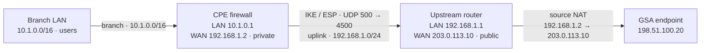
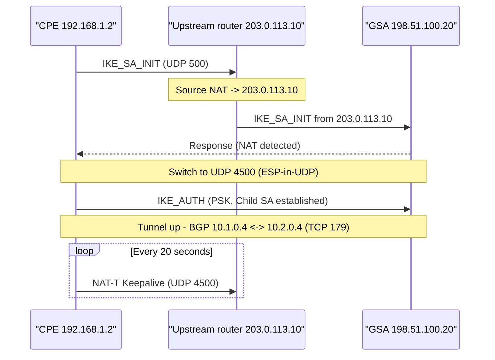

# Microsoft Learn — Microsoft Entra / Global Secure Access (Internet / Private Access) (part 1)

Source: https://learn.microsoft.com/ja-jp/entra/
Pages in this file: 73

---

<!-- MSL-PAGE {"url":"entra/global-secure-access"} -->
## Global Secure Access に関するドキュメント - Global Secure Access

- Source: https://learn.microsoft.com/ja-jp/entra/global-secure-access
- Service: global-secure-access
- Article date: 2025-02-28
- Summary: Microsoft Entra Internet Access と Microsoft Entra Private Access で構成された、Microsoft の Security Service Edge ソリューションであるグローバル セキュア アクセスのドキュメントについて説明します。

Microsoft Entra Internet Access と Microsoft Entra Private Access は、Microsoft Entra 管理センターの Global Secure Access に統合されます。 クライアント、リモート ネットワーク接続、クイック アクセス アプリを使用して、パブリック インターネットおよびプライベート ネットワーク リソースへのアクセスをセキュリティで保護する方法について説明します。

### Global Secure Access について

#### 概要

- [Global Secure Access とは](https://learn.microsoft.com/ja-jp/entra/global-secure-access/overview-what-is-global-secure-access)

### 作業の開始

#### クイックスタート

- [Global Secure Access の概要](https://learn.microsoft.com/ja-jp/entra/global-secure-access/quickstart-access-admin-center)
- [Windows クライアントをインストールする](https://learn.microsoft.com/ja-jp/entra/global-secure-access/how-to-install-windows-client)

### リモート ネットワーク

#### 概念

- [リモート ネットワーク接続について](https://learn.microsoft.com/ja-jp/entra/global-secure-access/concept-remote-network-connectivity)
- [リモート ネットワークを作成する](https://learn.microsoft.com/ja-jp/entra/global-secure-access/how-to-create-remote-networks)

### トラフィック転送

#### 攻略ガイド

- [トラフィック転送の概要](https://learn.microsoft.com/ja-jp/entra/global-secure-access/concept-traffic-forwarding)
- [クイック アクセスを構成する](https://learn.microsoft.com/ja-jp/entra/global-secure-access/how-to-configure-quick-access)
- [Microsoft トラフィック プロファイルを管理する](https://learn.microsoft.com/ja-jp/entra/global-secure-access/how-to-manage-microsoft-profile)
- [プライベート アクセス トラフィック プロファイルを管理する](https://learn.microsoft.com/ja-jp/entra/global-secure-access/how-to-manage-private-access-profile)

### クイック アクセス アプリとプライベート アクセス アプリ

#### 攻略ガイド

- [プライベート アクセスについて確認する](https://learn.microsoft.com/ja-jp/entra/global-secure-access/concept-private-access)
- [Microsoft Entra プライベート ネットワーク コネクタを構成する](https://learn.microsoft.com/ja-jp/entra/global-secure-access/how-to-configure-connectors)
- [クイック アクセス アプリを構成する](https://learn.microsoft.com/ja-jp/entra/global-secure-access/how-to-configure-quick-access)
- [プライベート アクセス アプリを構成する](https://learn.microsoft.com/ja-jp/entra/global-secure-access/how-to-configure-per-app-access)

### アクセス制御

#### 攻略ガイド

- [Global Secure Access のユニバーサル条件付きアクセスについて確認する](https://learn.microsoft.com/ja-jp/entra/global-secure-access/concept-universal-conditional-access)
- [Microsoft トラフィックの条件付きアクセス](https://learn.microsoft.com/ja-jp/entra/global-secure-access/how-to-target-resource-microsoft-profile)
- [プライベート アクセス アプリの条件付きアクセス](https://learn.microsoft.com/ja-jp/entra/global-secure-access/how-to-target-resource-private-access-apps)
- [ソース IP の復元](https://learn.microsoft.com/ja-jp/entra/global-secure-access/how-to-source-ip-restoration)
- [対応ネットワーク チェック](https://learn.microsoft.com/ja-jp/entra/global-secure-access/how-to-compliant-network)

### モニター

#### 攻略ガイド

- [ダッシュボード​](https://learn.microsoft.com/ja-jp/entra/global-secure-access/concept-traffic-dashboard)
- [監査ログ](https://learn.microsoft.com/ja-jp/entra/global-secure-access/how-to-access-audit-logs)
- [ネットワーク トラフィック ログ](https://learn.microsoft.com/ja-jp/entra/global-secure-access/how-to-view-traffic-logs)
- [エンリッチされた Microsoft 365 監査ログ](https://learn.microsoft.com/ja-jp/entra/global-secure-access/how-to-view-enriched-logs)
<!-- /MSL-PAGE -->

---

<!-- MSL-PAGE {"url":"entra/global-secure-access/concept-ai-agent-discovery"} -->
## グローバル セキュア アクセスでの AI エージェントの検出 (プレビュー) - Global Secure Access

- Source: https://learn.microsoft.com/ja-jp/entra/global-secure-access/concept-ai-agent-discovery
- Service: global-secure-access
- Article date: 2026-06-02
- Summary: Global Secure Access での AI エージェント検出によって、環境からインターネットに到達するマネージド AI エージェントとシャドウ AI エージェントをネットワーク レベルで可視化する方法について説明します。

Microsoft Entra Global Secure Access での AI エージェント検出により、セキュリティ チームは、環境 (マネージドとシャドウの両方) からインターネットに到達する AI エージェントのネットワーク レベルのビューを提供し、アクティビティを開始したユーザー、デバイス、プロセスに帰属を返します。 検出には、グローバル セキュア アクセス クライアントがインストールされているエンドポイントで実行されているローカル エージェント (マネージドエージェントとアンマネージド エージェントの両方) と、Microsoft Copilot Studioエージェントが含まれます。

AI エージェント検出では、グローバル セキュリティで保護されたアクセスの既存のネットワーク検査が使用されるため、新しい情報をデプロイしなくても対象範囲を取得できます。

Important

AI エージェントの検出は現在プレビュー段階です。 詳細については、[Microsoft Entra プレビューの用語](https://azure.microsoft.com/support/legal/preview-supplemental-terms/)を参照してください。

### AI エージェントの検出が重要な理由

AI エージェントは、ユーザーに代わって自律的に、またはユーザーに代わって、データへのアクセス、API の呼び出し、直接のユーザー操作なしで外部サービスへのアクセスをますます行います。 エージェントが ID とエンドポイントの制御の可視性の範囲外で実行されている場合、セキュリティ チームは基本的な質問 (環境内で実行されているエージェント) に答えることはできません。 誰が、何を使用していますか? 彼らは承認されていますか? 各エージェントはどのツールを使用していますか? エージェントが呼び出す API は何ですか?

AI エージェント検出は、次の方法でこれらの質問に答えるのに役立ちます。

- **承認済みの管理対象エージェントや未承認のシャドウエージェントを含む、インターネットにアクセスするすべてのエージェントを可視化**
- **エージェントのトラフィックを** 開始したユーザー、デバイス、およびプロセスにアクティビティを戻します。
- Microsoft Entra エージェント IDを使用して検出された各エージェントを分類することで、管理されたエージェント**とシャドウ** エージェントを区別します。
- 各エージェントがアクセスしようとしている外部エンドポイントと、それが生成するネットワーク アクティビティの量を確認できるように、**宛先とトラフィック 量を明らかに**します。

### AI エージェント検出のしくみ

グローバル セキュリティで保護されたアクセスは、インターネットにバインドされたネットワーク トラフィックを検査して、AI エージェントのアクティビティを識別します。 グローバル セキュリティで保護されたアクセスは既にネットワーク パスにインラインで配置されているため、検出には新しいエージェント、センサー、またはエンドポイントの変更は必要ありません。

検出プロセス:

- ユーザーとデバイスからグローバル セキュリティで保護されたアクセスを通過する**インターネット トラフィックを検査**します。
- **AI エージェントを識別します**。これには、グローバル セキュア アクセス クライアントを使用してエンドポイント上で実行されるローカル エージェントや、Microsoft Copilot Studio エージェントが含まれます。
- **各エージェントが**Microsoft Entra エージェント IDに登録されているかどうかに基づいて、各エージェントをマネージドまたはシャドウ (アンマネージド) として分類します。
- **アクティビティを**発生元のユーザー、デバイス、プロセスに関連付けることで、調査して対応できるようにします。

### プレビューに含まれる内容

AI エージェント検出のプレビューには、次のものが含まれます。

- グローバル セキュリティで保護されたアクセスの概要ダッシュボードの **AI エージェント検出ウィジェット**。 このウィジェットは、過去 7 日間に検出されたエージェント、マネージド エージェント、シャドウ エージェント、および新しいエージェントの合計数をまとめたものです。
- テナント全体で集計されたエージェント インベントリを含む **AI エージェント検出ブレード**。
- Microsoft Entra エージェント IDを使用した**マネージド分類とアンマネージド (シャドウ) 分類**。

### マネージド エージェントとシャドウ エージェント

| 特徴 | マネージド エージェント | シャドウ エージェント |
| --- | --- | --- |
| Definition | Microsoft Entra エージェント IDに登録され、組織によって承認された AI エージェント。 | 登録または承認されていない環境からインターネットに到達する AI エージェント。 |
| 視認性 | 完全な ID とポリシー コンテキストを使用してエージェント インベントリで追跡されます。 | ネットワーク トラフィック検査によってのみ検出されます。 |
| Examples | 承認されたMicrosoft Copilot Studioエージェントと登録済みのローカル エージェント。 | ユーザー デバイスで実行されている OpenClaw や Ollama などのアンマネージド ローカル エージェント。 |

### 前提条件

AI エージェントを検出するには、環境が次の要件を満たしている必要があります。

- **ローカル エージェント**: グローバル セキュア アクセス クライアントは、インターネット アクセス転送ポリシーと TLS 検査を有効にして、エンドポイントにインストールする必要があります。
- **Microsoft Copilot Studio エージェント**: グローバル セキュア アクセスとのMicrosoft Copilot Studio統合を有効にする必要があります。

### AI エージェントの検出にアクセスする

AI エージェント検出の分析情報は、Microsoft Entra 管理センターのグローバル セキュリティで保護されたアクセス エクスペリエンスで利用できます。

1. [グローバル なセキュリティで保護されたアクセス ログ 閲覧者](https://entra.microsoft.com)として [Microsoft Entra 管理センター](https://learn.microsoft.com/ja-jp/azure/active-directory/roles/permissions-reference#global-secure-access-log-reader)にサインインします。
2. **グローバル セキュリティで保護されたアクセス**&gt;**Overview** に移動して、過去 7 日間のエージェント、マネージド エージェント、シャドウ エージェント、および新しいエージェントの合計をまとめた **AI エージェント検出**ウィジェットを表示します。
3. ウィジェットを選択するか、 **グローバル セキュリティで保護されたアクセス**&gt;**AI エージェント検出**を参照して AI エージェント検出ブレードを開き、テナント全体で集計されたエージェント インベントリを確認します。
<!-- /MSL-PAGE -->

---

<!-- MSL-PAGE {"url":"entra/global-secure-access/concept-alerts"} -->
## グローバル セキュリティで保護されたアクセスアラートについて説明します - Global Secure Access

- Source: https://learn.microsoft.com/ja-jp/entra/global-secure-access/concept-alerts
- Service: global-secure-access
- Article date: 2025-12-08
- Summary: セキュリティの問題や運用上の懸念事項についてグローバル セキュア アクセスアラートが通知し、組織のセキュリティ体制を強化する方法について説明します。

グローバルなセキュリティで保護されたアクセスアラートは、組織のネットワーク内の潜在的なセキュリティの問題と運用上の懸念に関するリアルタイム通知を提供します。 アラートには、重大度、関連する MITRE 手法、プロバイダー情報、および関連エンティティに関する詳細が含まれます。

アラートは、アクティビティ、脅威、およびユーザー、デバイス、アプリケーションなどの関心のあるエンティティを可視化します。 アラートは、デプロイと正常性の問題を解決するための運用上の分析情報を提供します。 また、検出と関連アクティビティからセキュリティの分析情報を提供し、全体的なセキュリティ体制を強化します。

グローバルなセキュリティで保護されたアクセスのアラート構造は [、Microsoft Sentinel セキュリティ アラート スキーマ](https://learn.microsoft.com/ja-jp/azure/sentinel/security-alert-schema)に合わせ、 [Microsoft Defender XDR](https://learn.microsoft.com/ja-jp/defender-xdr/microsoft-365-defender) とのスムーズな統合を可能にします。

グローバル セキュリティで保護されたアクセス管理者は、アラートを使用して次のことができます。

- アラートの種類と重大度に関する統計情報を表示します。
- フィルターとリンクされた情報を使用して、アラートと関連データを調査します。
- セキュリティ情報およびイベント管理 (SIEM) ツールまたはその他のソリューションで使用するためのアラートをエクスポートします。

### アラートの種類

グローバル セキュリティで保護されたアクセスには、次の種類のアラートが含まれています。

#### トークン/デバイスの不整合アラート

このアラートは、複数のデバイスで同じアクセス トークンが使用されている場合に表示されます。

#### 外部テナント アクティビティアラートの増加

外部テナントのアクティビティが異常に増加すると、このアラートが表示されます。 このアラートでは、ホーム テナント以外のテナントにアクセスできる 14 日間のスライディング ウィンドウが表示されます。

#### 異常なリモート ネットワークアラート

このアラートは、リモート ネットワークの可用性に不備がある場合に表示されます。 このアラートは、BGPDisconnect や TunnelDisconnect などのリモート ネットワーク正常性イベントを 1 時間ごとにチェックします。

#### Netskope アラート

Netskope アラートには次のものが含まれます。

- **脅威の防止**: Netskope がトラフィック内のマルウェアまたは疑わしいコンテンツを検出すると、このアラートが表示されます。
- **データ損失防止** (DLP): 検査中に機密データが DLP プロファイルと一致すると、このアラートが表示されます。
- **フォールバック**: このアラートは、ファイル サイズの制限、スキャン タイムアウト、サポートされていないファイルの種類などの技術的な制限により、Netskope がトラフィックを完全に処理できない場合に表示されます。

Important

Netskope アラートには、グローバル セキュア アクセスの Netskope Advanced Threat Protection (ATP) および DLP モジュールが必要です。 詳細については、 [Netskope の Advanced Threat Protection とデータ損失防止](https://learn.microsoft.com/ja-jp/entra/global-secure-access/concept-netskope-integration)に関する説明を参照してください。

### アラートを表示する

グローバル セキュリティで保護されたアクセスのアラートを表示するには:

1. [グローバル セキュア アクセス 管理者](https://entra.microsoft.com)として [Microsoft Entra 管理センター](https://learn.microsoft.com/ja-jp/azure/active-directory/roles/permissions-reference#global-secure-access-administrator)にログインします。
2. **グローバル セキュリティで保護されたアクセス**&gt;**Monitor**&gt;**Alerts** に移動します。

[Image: [グローバルなセキュリティで保護されたアクセスアラート] ビューのスクリーンショット。]

重大度、日付、種類に基づいてアラートをフィルター処理して並べ替え、潜在的なセキュリティの問題をすばやく特定して対応できます。

また、**グローバル セキュリティで保護されたアクセス ダッシュボード**で[アラート](https://learn.microsoft.com/ja-jp/entra/global-secure-access/concept-traffic-dashboard) ウィジェットを表示して、最近のアラートの概要を確認することもできます。
<!-- /MSL-PAGE -->

---

<!-- MSL-PAGE {"url":"entra/global-secure-access/concept-bring-your-own-device"} -->
## Microsoft Entra Private Access と Microsoft Entra Internet Access 用のグローバル セキュア アクセス クライアントを使用した Bring Your Own Device (BYOD) について説明します - Global Secure Access

- Source: https://learn.microsoft.com/ja-jp/entra/global-secure-access/concept-bring-your-own-device
- Service: global-secure-access
- Article date: 2026-03-12
- Summary: Microsoft Entra Private Access と Microsoft Entra Internet Access 用のグローバル セキュア アクセス クライアントを使用した Bring Your Own Device (BYOD) について説明します。

### 概要

Global Secure Access クライアントは、ユーザーが会社のリソースにアクセスできるように、Bring Your Own Device (BYOD) シナリオをサポートしています。 テナント管理者として、内部ゲストを含むメンバーのグローバル セキュリティで保護されたアクセス トラフィック プロファイルを有効にします。 クライアントは、Microsoft Entra デバイスの自動登録をサポートしています。

Important

BYOD からのアクセスをブロックするには、準拠しているデバイスからのアクセスのみを許可するように条件付きアクセス ポリシーを構成します。

### ウィンドウズ

- Microsoft Entra 登録済み Windows デバイスでのセキュリティで保護されたアクセスをサポートします。
- プライベート アプリケーション トラフィックのみがサポートされています。 これらのユーザーのプライベート アクセス トラフィック プロファイルを有効にします。
- デバイスが登録または参加していない場合、クライアントは最初のサインイン時にデバイスをテナントに登録します。
- デバイスが参加されておらず、複数の登録がある場合、ユーザーはテナントの Microsoft Entra ユーザーとのサインイン時にテナントを選択します。
- サインイン フローでアカウント ピッカーをサポートし、別のアカウントで簡単にサインインできるようにします。
- アカウント ピッカーは、Microsoft Entra登録済みデバイスに既定で表示されます。
- アカウント ピッカーを有効にするか、Microsoft Entra参加済みデバイスで別のテナントに切り替えるには、[**サインアウト**] オプションを有効にします。 詳細については、 [システム トレイのメニュー ボタンの非表示または再表示を](https://learn.microsoft.com/ja-jp/entra/global-secure-access/how-to-install-windows-client#hide-or-unhide-system-tray-menu-buttons)参照してください。

Important

Microsoft Entra参加済みまたはハイブリッド参加済みWindowsデバイスでは、クライアントは既定で参加済みテナントに接続します。

### Android

- デバイス登録なしの BYOD サポートは、Microsoft Authenticator または Microsoft Entra デバイス登録を通じて Microsoft Intune ポータル サイトを使用して利用できます。
- デバイスで次の手順を実行します。
    1. App Store から Microsoft Authenticator をインストールし、デバイスをテナントに登録するか、ポータル サイト アプリをインストールします (デバイスの登録は必要ありません)。
    2. Google Play から Microsoft Defender アプリをインストールし、サインインを完了します。
    3. デバイス全体の VPN プロファイルが作成されます。 [グローバル なセキュリティで保護されたアクセス] タイルは既定でオフになっています。プライベート アクセス トラフィックを送信するには、ユーザーがそれをオンにする必要があります。
- これらのユーザーのプライベート トラフィック プロファイルを有効にします。

### iOS

- デバイス登録なしの BYOD サポートは、Microsoft Entraデバイス登録を通じてMicrosoft Authenticatorを使用して利用できます。
- デバイスで次の手順を実行します。
    1. App Store からMicrosoft Authenticatorをインストールし、デバイスをテナントに登録します。
    2. App Store からMicrosoft Defender アプリをインストールし、サインインを完了します。
    3. デバイス全体の VPN プロファイルが作成されます。 [グローバル なセキュリティで保護されたアクセス] タイルは既定でオフになっています。プライベート アクセス トラフィックを送信するには、ユーザーがそれをオンにする必要があります。
- これらのユーザーのプライベート トラフィック プロファイルを有効にします。

### MacOS

MacOS デバイスは、モバイル デバイス管理 (MDM) ソリューションを使用して登録する必要があります。 デバイス登録のない BYOD シナリオは、macOS ではサポートされていません。

#### プラットフォームの動作

| プラットフォーム/デバイスの状態 | 接続ターゲット | Microsoft Entra トンネル | M365 トンネル | インターネット トンネル | プライベート トンネル | 注記 |
| --- | --- | --- | --- | --- | --- | --- |
| Windows Microsoft Entra 参加済みデバイスとハイブリッド参加済みデバイス | クライアントは、デバイスが参加したテナントに接続します。 | ✅ | ✅ | ✅ | ✅ | ユーザーがサインアウトして外部テナントに切り替えることを許可するには、クライアントで [サインアウト] オプションを有効にします。 ユーザーが外部ユーザー アクセス (B2B) を使用してリソース テナントに切り替えることができます。 |
| Windows Microsoft Entra 登録済みデバイス | ユーザーは、最初のサインイン時にテナントを選択します。 | ❌ | ❌ | ❌ | ✅ | クライアントで **[サインアウト** ] オプションを選択して、他のテナントに切り替えることができます。 ユーザーが外部ユーザー アクセス (B2B) を使用してリソース テナントに切り替えることができます。 |
| デバイス登録での macOS Microsoft Entra 登録済みデバイス | ユーザーは、最初のサインイン時にテナントを選択します。引き続きそのテナントに接続されている | ✅ | ✅ | ✅ | ✅ | MDM ソリューションを使用してデバイスを登録する必要があります。 |
| Android Microsoft Entra 端末登録ありおよびなしでの登録 | ユーザーは、最初のサインイン時にテナントを選択します。引き続きそのテナントに接続されている | ✅ | ✅ | ✅ | ✅ | ポータル サイトを使用して登録済みデバイスに適用されます。 アンマネージド デバイスの場合、Microsoft Entra の登録はポータル サイトと Authenticator アプリで行うことができます。 |
| iOS Microsoft Entraデバイス登録あり/登録なし | ユーザーは、最初のサインイン時にテナントを選択します。引き続きそのテナントに接続されている | ✅ | ✅ | ✅ | ✅ | ポータル サイトを使用して登録済みデバイスに適用されます。 アンマネージド デバイスの場合は、Authenticator アプリを使用してMicrosoft Entra登録を行うことができます。 |

#### 概要

- ✅ Windows ではデバイスの参加が優先されます。
- ✅ 登録済みデバイスは、初回サインイン時にテナントを選択します。
<!-- /MSL-PAGE -->

---

<!-- MSL-PAGE {"url":"entra/global-secure-access/concept-clients"} -->
## Microsoft Entra Private Access と Microsoft Entra Internet Access のグローバル セキュア アクセス クライアントについて説明します - Global Secure Access

- Source: https://learn.microsoft.com/ja-jp/entra/global-secure-access/concept-clients
- Service: global-secure-access
- Article date: 2026-03-12
- Summary: Microsoft Entra Private Access と Microsoft Entra Internet Access のグローバル セキュア アクセス クライアントについて説明します。

### 概要

グローバル セキュア アクセス クライアントは、エンド ユーザー コンピューティング デバイスでネットワーク トラフィックを制御できます。 このクライアントを使用すると、組織は Microsoft Entra Internet Access と Microsoft Entra Private Access を介して特定のトラフィック プロファイルをルーティングできます。 この方法でトラフィックをルーティングすると、継続的アクセス評価 (CAE)、デバイス コンプライアンス、リソース アクセスへの多要素認証の要求など、より多くのことを制御できます。

グローバル セキュア アクセス クライアントは、軽量フィルター (LWF) ドライバーを使用してトラフィックを取得します。 これに対し、他の多くの Security Service Edge (SSE) ソリューションは、仮想プライベート ネットワーク (VPN) 接続として統合されます。 この違いにより、Global Secure Access クライアントは、これらの他のソリューションと共存できます。 Global Secure Access クライアントは、構成されたトラフィック転送プロファイルに基づいてトラフィックを取得します。

### 使用可能なクライアント

コンピューターや電話などのデバイスにクライアントをインストールし、Microsoft Entra 管理センターのグローバル セキュア アクセス設定を使用してデバイスをセキュリティで保護します。 クライアントは現在、Windows、Android、macOS、および iOS で使用できます。 Windows クライアントのインストールの詳細については、「Windows [用のグローバル なセキュリティで保護されたアクセス クライアント](https://learn.microsoft.com/ja-jp/entra/global-secure-access/how-to-install-windows-client)」を参照してください。 Android クライアントのインストールの詳細については、「Android [用グローバル セキュア アクセス クライアント](https://learn.microsoft.com/ja-jp/entra/global-secure-access/how-to-install-android-client)」を参照してください。 macOS クライアントのインストールの詳細については、 [macOS 用のグローバル セキュア アクセス クライアント](https://learn.microsoft.com/ja-jp/entra/global-secure-access/how-to-install-macos-client)を参照してください。 iOS クライアントのインストールの詳細については、「 [iOS 用グローバル セキュア アクセス クライアント](https://learn.microsoft.com/ja-jp/entra/global-secure-access/how-to-install-ios-client)」を参照してください。
<!-- /MSL-PAGE -->

---

<!-- MSL-PAGE {"url":"entra/global-secure-access/concept-connector-groups"} -->
## Microsoft Entra プライベート ネットワーク コネクタ グループ - Global Secure Access

- Source: https://learn.microsoft.com/ja-jp/entra/global-secure-access/concept-connector-groups
- Service: global-secure-access
- Article date: 2026-04-29
- Summary: Microsoft Entra プライベート ネットワーク コネクタ グループのしくみと、Microsoft Entra Private Access とアプリケーション プロキシでこれらのグループがどのように使用されるかについて説明します。

### 概要

プライベート ネットワーク コネクタ グループを使用して、アプリケーションにコネクタを割り当てます。 コネクタ グループを使用すると、より詳細な制御が得られ、デプロイの最適化に役立ちます。

各プライベート ネットワーク コネクタは、コネクタ グループ内にあります。 同じグループ内のコネクタは、高可用性と負荷分散のためのユニットとして機能します。 グループを作成しない場合、すべてのコネクタが既定のグループに含まれます。 Microsoft Entra 管理センターで新しいグループを作成し、コネクタを割り当てます。

アプリケーションが異なる場所で実行されている場合は、コネクタ グループを使用します。 各アプリケーションが近くのコネクタを使用するように、場所別にグループを作成します。

ヒント

Microsoft Entra アプリケーション プロキシの大規模なデプロイがある場合は、既定のコネクタ グループにアプリケーションを割り当てないでください。 新しいコネクタは、アクティブなグループに移動するまでライブ トラフィックを受信しません。 また、コネクタを既定のグループに戻してアイドル状態にして、ユーザーに影響を与えずにメンテナンスを実行することもできます。

### 前提条件

コネクタ グループを使用するには、複数のコネクタが必要です。 サービスは、既定のコネクタ グループに新しいコネクタを自動的に追加します。 コネクタをインストールするには、「 [Microsoft Entra Private Access とアプリケーション プロキシのプライベート ネットワーク コネクタを構成](https://learn.microsoft.com/ja-jp/entra/global-secure-access/how-to-configure-connectors)する」を参照してください。

### コネクタ グループへのアプリケーションの割り当て

アプリケーションを発行するときにコネクタ グループに割り当てます。 コネクタ グループはいつでも変更できます。

### コネクタ グループのユース ケース

次のシナリオでは、コネクタ グループを使用します。

#### 複数のデータセンターが相互接続されたサイト

ある大規模な組織は、複数のデータセンターを使っています。 データセンター間のリンクはコストが高く低速であるため、データセンター内のトラフィックをできるだけ多く保持します。

各データセンターにコネクタをデプロイして、そのデータセンター内のアプリのみを提供します。 このアプローチにより、データセンター間のトラフィックが減少し、ユーザーに対して透過的になります。

#### 分離されたネットワークにインストールされたアプリケーション

アプリは、主要な企業ネットワークの一部ではないネットワークで実行されます。 コネクタ グループを使用して、分離されたネットワークに専用コネクタをインストールし、それらのアプリをそこに保持します。 このシナリオは、特定のアプリを管理するベンダーに共通です。

#### IaaS にインストールされているアプリケーション

サービスとしてのインフラストラクチャ (IaaS) 上のアプリの場合は、コネクタ グループを使用して、企業ネットワークの依存関係を追加したり、エクスペリエンスを断片化したりすることなく、すべてのアプリへのアクセスをセキュリティで保護します。 各クラウド データセンターにコネクタをインストールし、そのネットワーク内のアプリにスコープを設定します。 高可用性のために複数のコネクタをインストールします。

たとえば、組織は、独自の IaaS でホストされる仮想ネットワークに接続された複数の仮想マシンを持っています。 従業員がこれらのアプリケーションを使用できるように、これらの仮想マシンはサイト間仮想プライベート ネットワーク (VPN) 経由で企業ネットワークに接続されます。 サイト間 VPN を使用すると、オンプレミスの従業員に優れたエクスペリエンスが提供されます。 ただし、次の図に示すように、アクセスをルーティングするためにより多くのオンプレミス インフラストラクチャが必要なため、リモート従業員には理想的ではありません。

[Image: Microsoft Entra IaaS ネットワークを示す図。]

Microsoft Entra プライベート ネットワーク コネクタ グループを使用すると、共通サービスを有効にして、企業ネットワークの依存関係を追加することなく、すべてのアプリへのアクセスをセキュリティで保護できます。

[Image: Microsoft Entra IaaS の複数のクラウド ベンダーを示す図。]

#### 複数フォレスト環境のフォレストごとに異なるコネクタ グループ

シングル サインオンでは、多くの場合、Kerberos の制約付き委任 (KCD) が使用されます。 コネクタ マシンは、ユーザーをアプリケーションに委任できるドメインに参加します。 KCD はフォレスト間のシナリオをサポートしますが、信頼のない個別の複数フォレスト環境では、1 つのコネクタですべてのフォレストを処理することはできません。

フォレストごとに専用コネクタをデプロイし、そのフォレスト内のユーザーのアプリにスコープを設定します。 各コネクタ グループはフォレストを表します。 テナントとほとんどのエクスペリエンスは統合されており、Microsoft Entra グループを使用してユーザーをフォレスト アプリに割り当てます。

#### ディザスター リカバリー サイト

ディザスター リカバリー (DR) サイトについて考慮するには、2 つの方法があります。

- DR サイトはアクティブ/アクティブ モードで実行され、メイン サイトのネットワークと Active Directory の設定と一致します。 DR サイト上のコネクタは、メイン サイトと同じコネクタ グループに作成します。 Microsoft Entra ID はフェールオーバーを検出します。
- DR サイトをメイン サイトから分離します。 そこに別のコネクタ グループを作成します。 バックアップ アプリを使用するか、必要に応じて既存のアプリを DR コネクタ グループに手動で転送します。

#### 1 つのテナントから複数の企業にサービスを提供する

1 つのサービス プロバイダーが複数の企業に対して Microsoft Entra 関連のサービスを展開および管理するモデルを実装できます。 コネクタ グループは、コネクタとアプリをグループに分けるのに役立ちます。

小規模企業の 1 つのオプションは、1 つの Microsoft Entra テナントを使用することですが、各会社は独自のドメイン名とネットワークを保持します。 同じアプローチを、合併のシナリオや、規制またはビジネス上の理由で単一の部門が複数の企業にサービスを提供する状況にも利用できます。

### コネクタの負荷分散

コネクタ グループに複数のコネクタを追加すると、各要求を処理するコネクタがグループによって選択されます。 ルーティング オプションには、ランダム (既定) とセッション永続化が含まれます。

グローバル セキュア アクセス アプリケーションごとにトラフィック ルーティング動作を変更できます。 トラフィック ルーティング オプションとその使用方法の詳細については、「 [グローバル セキュア アクセス アプリケーションを使用してアプリごとのアクセスを構成する方法](https://learn.microsoft.com/ja-jp/entra/global-secure-access/how-to-configure-per-app-access#configure-traffic-routing-for-the-app)」を参照してください。 Microsoft Graph詳細については、「[onPremisesPublishing リソースの種類](https://learn.microsoft.com/ja-jp/graph/api/resources/onpremisespublishing?view=graph-rest-beta&preserve-view=true)を参照してください。

#### ランダム

ランダムは、既定のトラフィック ルーティング方法です。 グローバル セキュリティで保護されたアクセス アプリケーションに対する新しい要求は、割り当てられたコネクタ グループ内の使用可能なコネクタに分散されます。

#### セッション永続化

セッションの永続化 (セッション アフィニティとも呼ばれます) は、セッションの期間中、特定のユーザーとデバイスのすべての要求をグループ内の同じコネクタに一貫してルーティングします。 この方法は、認証とアクセス制御リスト (ACL) にコネクタエグレス IP に依存するアプリケーションに役立ちます。 これにより、継続性が確保され、認証またはデータの取得を繰り返す必要が減ります。

ヒント

セッションの永続化は、Microsoft Entra アプリケーション プロキシ アプリケーションではなく、Microsoft Entra Private Access アプリケーションでのみ機能します。

### 構成の例

コネクタ グループのこれらのサンプル構成について考えてみましょう。

#### 既定の構成: コネクタ グループには使用しません

コネクタ グループを使用しない場合、構成は次の例のようになります。 既定のプロキシ コネクタ グループは、発行されたすべてのアプリケーションを処理します。

[Image: 既定のコネクタ グループと、すべての発行済みアプリケーションを処理する 2 つのコネクタのみを含むセットアップのスクリーンショット。]

小規模な展開とテストには、この構成で十分です。 また、組織にフラットなネットワーク トポロジがある場合にも機能します。

#### 分離ネットワーク用の 1 つのコネクタ グループ

この構成では、既定値が拡張されます。 特定のアプリは、IaaS 仮想ネットワークなどの分離されたネットワークで実行されます。 会社は、この分離されたネットワーク用のコネクタ グループを作成しました。

[Image: 1 つのコネクタ グループを持つ分離された IaaS 仮想ネットワークで 1 つのアプリが実行されているアプリケーション プロキシのスクリーンショット。]

#### 推奨される構成: 特定のグループと既定の待機中グループ

大規模で複雑な組織の場合は、アイドル状態または新しくインストールされたコネクタを保持するように既定のコネクタ グループを設定します。 アプリケーションを割り当てないでください。 カスタム コネクタ グループを使用して、すべてのアプリケーションにサービスを提供します。

この例では、会社には 2 つのデータセンター (A と B) があります。 2 つのコネクタが各サイトに対応します。 各サイトは、異なるアプリケーションを実行します。

[Image: 2 つのデータセンター、サイトごとに 2 つのコネクタ、既定のアイドル 状態のコネクタ グループ、およびすべてのアプリケーションにサービスを提供するカスタム グループを含む、推奨されるセットアップのスクリーンショット。]
<!-- /MSL-PAGE -->

---

<!-- MSL-PAGE {"url":"entra/global-secure-access/concept-connectors"} -->
## Microsoft Entra プライベート ネットワーク コネクタ - Global Secure Access

- Source: https://learn.microsoft.com/ja-jp/entra/global-secure-access/concept-connectors
- Service: global-secure-access
- Article date: 2026-03-12
- Summary: Microsoft Entra プライベート ネットワーク コネクタのしくみと、Microsoft Entra Private Access とアプリケーション プロキシで使用される方法について説明します。

### 概要

コネクタにより、Microsoft Entra Private Access とアプリケーション プロキシが可能になります。 この記事では、コネクタとは何か、そのしくみ、デプロイを最適化する方法について説明します。

### プライベート ネットワーク コネクタとは?

プライベート ネットワーク コネクタは、ネットワーク内の Windows Server にインストールする軽量エージェントです。 バックエンド リソースに到達するために、プライベート アクセスおよびアプリケーション プロキシ サービスへの送信接続を作成します。

ユーザーはクラウド サービスに接続します。これにより、トラフィックはコネクタを介してアプリにルーティングされます。 アーキテクチャの概要については、「 [Microsoft Entra アプリケーション プロキシを使用してリモート ユーザー用のオンプレミス アプリを発行する](https://learn.microsoft.com/ja-jp/entra/identity/app-proxy/overview-what-is-app-proxy)」を参照してください。

コネクタを設定してアプリケーション プロキシ サービスに登録するには:

1. 送信ポート 80 と 443 を開き、必要なサービスと Microsoft Entra ID URL へのアクセスを許可します。
2. Microsoft Entra 管理センターにサインインし、オンプレミスの Windows Server マシンでインストーラーを実行します。
3. アプリケーション プロキシ サービスをリッスンするようにコネクタを起動します。
4. オンプレミス アプリケーションを Microsoft Entra ID に追加し、ユーザー向け URL を設定します。

セットアップの詳細については、「 [Microsoft Entra Private Access とアプリケーション プロキシのプライベート ネットワーク コネクタを構成する方法](https://learn.microsoft.com/ja-jp/entra/global-secure-access/how-to-configure-connectors)」を参照してください。

コネクタとサービスは高可用性を処理します。 コネクタはいつでも追加または削除できます。

### コネクタ グループ

特定のリソースのトラフィックを処理するコネクタ グループにコネクタを整理できます。 同じグループ内のコネクタは、高可用性と負荷分散のための 1 つのユニットとして機能します。

Microsoft Entra 管理センターでグループを作成してコネクタを割り当て、グループを特定のアプリケーションにマップします。 高可用性を実現するために、各グループに少なくとも 2 つのコネクタを使用します。

次の場合にコネクタ グループを使用します。

- 地理的なアプリの発行。
- アプリケーションのセグメント化と分離。
- クラウドまたはオンプレミスで実行されている Web アプリの発行。

コネクタ グループを使用すると、大規模なデプロイの管理が簡略化されます。 リソースとアプリケーションが異なるリージョンにあるテナントの待機時間を短縮できます。 ローカル アプリケーションのみを提供する場所ベースのコネクタ グループを作成します。

詳細については、 [Microsoft Entra プライベート ネットワーク コネクタ グループ](https://learn.microsoft.com/ja-jp/entra/global-secure-access/concept-connector-groups)を参照してください。

### 管理

サービスは、使用可能なコネクタに新しい要求をルーティングします。 コネクタが一時的に使用できない場合、トラフィックは受信されません。

コネクタはステートレスであり、コンピューターに構成データを格納しません。 サービスと認証証明書に接続するための設定のみが格納されます。 サービスに接続すると、必要な構成データがプルされ、数分ごとに更新されます。 コネクタのメンテナンスの詳細については、「 [Microsoft Entra Private Access と Microsoft Entra アプリケーション プロキシ用にプライベート ネットワーク コネクタを構成する方法](https://learn.microsoft.com/ja-jp/entra/global-secure-access/how-to-configure-connectors)」を参照してください。

#### コネクタの状態

コネクタの状態は、Microsoft Entra 管理センターで確認できます。

- プライベート アクセスの場合: **グローバル セキュア アクセス**&gt;**Connect**&gt;**Connectors** に移動します。
- アプリケーション プロキシの場合: **Identity**&gt;**Applications**&gt;**Enterprise アプリケーション**に移動し、アプリケーションを選択します。 アプリケーション ページで、[ **アプリケーション プロキシ**] を選択します。

#### ログ

コネクタは Windows Server にインストールされるため、ほとんどの管理ツールが同じです。 Windows イベント ログと Windows パフォーマンス カウンターを使用して、コネクタを監視できます。

コネクタには、 **管理者** ログと **セッション** ログの両方があります。 **管理者**ログには主要なイベントとそのエラーが含まれます。 **セッション** ログには、すべてのトランザクションとその処理の詳細が含まれます。

ログを表示するには:

1. **イベント ビューアー**を開き、**アプリケーションとサービス ログ**&gt;**Microsoft**&gt;**Microsoft Entra プライベート ネットワーク**&gt;**Connector** に移動します。

    **既定では、管理者**ログが表示されます。
2. **セッション** ログを表示するには、 **[表示]** メニューの **[分析およびデバッグ ログの表示]** を選択します。

    **通常、セッション** ログはトラブルシューティングに使用され、既定では無効になっています。 イベントの収集を開始し、不要になったら無効にします。

#### サービスの状態

コネクタは、実際のコネクタとアップデーターの 2 つの Windows サービスで構成されます。 この両方を常に実行する必要があります。 **[サービス**] ウィンドウでサービスの状態を確認できます。

### コネクタ サーバーの問題の処理

サーバー、ネットワーク、または同様の障害が原因で 1 つ以上のコネクタ サーバーがダウンしている場合は、次の手順に従って継続性を維持します。

1. 影響を受けるサーバーを特定し、コネクタ グループから削除します。
2. 使用可能な正常なサーバーまたはバックアップ サーバーをコネクタ グループに追加して、容量を復元します。
3. 影響を受けるサーバーを再起動して、既存の接続をドレインします。 既存の継続的な接続は、コネクタ グループの変更によってすぐには切断されません。

このシーケンスを使用して、サービスの安定性を維持し、コネクタ サーバーに問題がある場合の中断を最小限に抑えます。

### コネクタの更新

Microsoft Entra ID では、展開するコネクタの自動更新が提供される場合があります。 コネクタは、アップデーター サービスに更新プログラムをポーリングします。 新しいバージョンが自動更新に使用できる場合は、コネクタ自体が更新されます。 アップデーター サービスが実行されている限り、コネクタは最新のメジャー コネクタ リリースに自動的に更新できます。 サーバーにアップデーター サービスが表示されない場合は、コネクタを再インストールして更新プログラムを取得する必要があります。

すべてのリリースで自動更新がスケジュールされているわけではありません。 [バージョン履歴ページ](https://learn.microsoft.com/ja-jp/entra/global-secure-access/reference-version-history)を監視して、更新プログラムが自動的に展開されているか、Microsoft Entra ポータルで手動展開が必要かを確認します。 手動更新を行う必要がある場合は、コネクタをホストするサーバーで、 [コネクタのダウンロード ページ](https://download.msappproxy.net/subscription/d3c8b69d-6bf7-42be-a529-3fe9c2e70c90/connector/download) に移動し、[ **ダウンロード**] を選択します。 このアクションにより、ローカル コネクタの更新が開始されます。

複数のコネクタを持つテナントでは、ダウンタイムを防ぐために、自動更新は各グループで一度に 1 つのコネクタを対象とします。 次の場合、更新中にダウンタイムが発生する可能性があります。

- コネクタは 1 つだけです。 ダウンタイムを回避し、可用性を高めるために、2 つ目のコネクタとコネクタ グループを追加します。
- 更新は、コネクタがトランザクションを処理している間に開始されます。 最初のトランザクションは失われますが、ブラウザーによって操作が自動的に再試行されるか、ページを更新できます。 再送信された要求は、バックアップ コネクタにルーティングされます。

以前のバージョンとその変更の詳細については、「 [Microsoft Entra プライベート ネットワーク コネクタ: バージョンリリース履歴](https://learn.microsoft.com/ja-jp/entra/global-secure-access/reference-version-history)」を参照してください。

### セキュリティとネットワーク

コネクタは、プライベート アクセスおよびアプリケーション プロキシ サービスに要求を送信できるネットワーク上の任意の場所にインストールできます。 ただし、コネクタを実行するコンピューターもアプリとリソースにアクセスできる必要があります。

企業ネットワーク内またはクラウドで実行されている仮想マシン (VM) にコネクタをインストールできます。 コネクタは境界ネットワーク内で実行できますが、すべてのトラフィックがネットワーク セキュリティのために送信されるため、必要ありません。

コネクタはアウトバウンドリクエストのみを送信します。 送信トラフィックは、サービスと公開済みリソースとアプリケーションに送信されます。 トラフィックはセッションの確立後に両方の方法で流れるので、受信ポートを開く必要はありません。 また、ファイアウォール経由での受信アクセスを構成する必要はありません。

### パフォーマンスと拡張性

プライベート アクセスとアプリケーション プロキシ サービスのスケールは透過的ですが、スケールはコネクタに影響を与える要因です。 ピーク時のトラフィックを処理するには十分なコネクタが必要です。

コネクタはステートレスであり、ユーザーまたはセッションの数はそれらに影響しません。 代わりに、要求の数とペイロード サイズに応答します。 標準的な Web トラフィックの場合、平均的なマシンで 1 秒あたり 2000 件の要求を処理できます。 具体的な容量は、実際のコンピューターの特性によって異なります。

CPU とネットワークによってコネクタのパフォーマンスが定義されます。 TLS の暗号化と暗号化解除には CPU パフォーマンスが必要ですが、アプリケーションとオンライン サービスに高速に接続するにはネットワークが重要です。

これに対し、コネクタにとってメモリはあまり重要ではありません。 処理の大半はオンライン サービスによって行われ、すべての認証されていないトラフィックが処理されます。 クラウドでできることはすべてクラウドで実行しています。

コネクタまたはマシンが使用できない場合、トラフィックはグループ内の別のコネクタに送信されます。 コネクタ グループに複数のコネクタがある場合、回復性が提供されます。

パフォーマンスに関するその他の要因としては、コネクタと次の項目間のネットワークの品質が挙げられます。

- **オンライン サービス**: Microsoft Entra サービスへの接続が遅いか、待機時間が長いと、コネクタのパフォーマンスが影響を受けます。 最適なパフォーマンスを得るために、Azure ExpressRoute を介して組織を Microsoft に接続します。 それ以外の場合は、ネットワーク チームに、Microsoft への接続が可能な限り効率的に処理されるように依頼してください。
- **バックエンド アプリケーション**: 場合によっては、コネクタとバックエンド リソースとアプリケーションの間に追加のプロキシがあり、接続の速度が低下したり、接続が妨げされたりすることがあります。 このシナリオをトラブルシューティングするには、コネクタ サーバーからブラウザーを開き、アプリケーションまたはリソースにアクセスします。 コネクタをクラウドで実行し、アプリケーションはオンプレミスで実行している場合は、ユーザーが期待するほどのエクスペリエンスが得られないことがあります。
- **ドメイン コントローラー**: コネクタが [Kerberos](https://web.mit.edu/kerberos) の制約付き委任 (KCD) を使用してシングル サインオン (SSO) を実行する場合は、バックエンドに要求を送信する前にドメイン コントローラーに接続します。 コネクタには Kerberos チケットのキャッシュがありますが、ドメイン コントローラーの応答性がビジー状態の環境でのパフォーマンスに影響する可能性があります。 こうした問題は、コネクタを Azure で実行していながらオンプレミスのドメイン コントローラーと通信している場合によく見られます。

コネクタをインストールする場所とネットワークを最適化する方法のガイダンスについては、 [Microsoft Entra アプリケーション プロキシを使用したトラフィック フローの最適化](https://learn.microsoft.com/ja-jp/entra/identity/app-proxy/application-proxy-network-topology)に関するセクションを参照してください。

### 動的な TCP ポート範囲と AutoReuse TCP ポート範囲の構成

プライベート ネットワーク コネクタは、構成された宛先への送信 TCP および UDP 接続を開始します。 各接続には、コネクタ ホストで使用可能なソース ポートが必要です。

大量の TCP ワークロードの場合は、重複しない個別の動的ポート範囲と AutoReuse ポート範囲を構成します。

- **動的 TCP 範囲**: 49152 ~ 65535 (16,384 ポート)
- **自動使用 TCP 範囲**: 10000 ~ 49151 (39,152 ポート)

AutoReuse 範囲は、完全な接続タプル (ソース IP、送信元ポート、宛先 IP、および宛先ポート) が一意のままである場合に、適格な送信接続でローカル ソース ポートを再利用できるようにすることで、TCP 接続のスケーラビリティを向上させます。

Important

動的 TCP 範囲と AutoReuse TCP 範囲は重複してはなりません。

作業を開始する前に、次のことを行います。

- Windows Server 2016以降を使用します。
- 管理者特権の PowerShell セッションからコマンドを実行します。
- コネクタ サーバーにインストールされているアプリケーションでポート 10000 ~ 49151 が必要ないことを確認します。
- 除外された TCP ポート範囲を確認します。

```
netsh int ipv4 show excludedportrange tcp
netsh int ipv6 show excludedportrange tcp
```

#### ポート範囲を構成する

**動的 TCP 範囲を構成する**

```
netsh int ipv4 set dynamicport tcp start=49152 num=16384
netsh int ipv6 set dynamicport tcp start=49152 num=16384
```

**自動使用 TCP 範囲を構成する**

```
Set-NetTCPSetting `
  -SettingName Internet,Datacenter,Compat `
  -AutoReusePortRangeStartPort 10000 `
  -AutoReusePortRangeNumberOfPorts 39152
```

#### 構成を確認する

```
netsh int ipv4 show dynamicport tcp
netsh int ipv6 show dynamicport tcp
 
Get-NetTCPSetting -SettingName Internet,Datacenter,Compat |
  Select-Object SettingName,
    DynamicPortRangeStartPort,
    DynamicPortRangeNumberOfPorts,
    AutoReusePortRangeStartPort,
    AutoReusePortRangeNumberOfPorts
```

想定される値:

| Setting | 開始ポート番号 | ポートの数 | 終端ポート |
| --- | --- | --- | --- |
| 動的 TCP 範囲 | 49152 | 16384 | 65,535 |
| TCP ポート範囲の自動再利用 | 10000 | 39152 | 49151 |

注

AutoReuse を使用すると、同じ送信元ポートを異なる宛先への同時接続に使用できます。 同じコネクタ IP から同じ解決された宛先 IP とポートへの接続には、引き続き異なるソース ポートが必要です。 そのため、1 つの宛先への接続量が多い場合でも、使用可能なソース ポートが使い果たされる可能性があります。 宛先は、IP アドレスまたは完全修飾ドメイン名 (FQDN) として構成できます。 FQDN の場合、Windowsは DNS 解決によって返される IP アドレスへの接続を確立します。 AutoReuse は TCP にのみ適用されます。 UDP は、設定されたダイナミック ポート範囲を引き続き使用します。

### 仕様とサイズ要件

Microsoft Entra プライベート ネットワーク コネクタごとに、次の仕様をお勧めします。

- **メモリ**: 8 GiB 以上。
- **CPU**: 4 つの CPU コア以上。

コネクタあたりのピーク CPU 使用率とメモリ使用率を 70%に維持します。 持続的な使用率が 70%を超える場合は、コネクタをグループに追加するか、ホスト容量をスケールアップして負荷を分散します。 Windows パフォーマンス カウンターを使用して監視し、使用率が許容範囲に戻っていることを検証します。

Azure VM 上の各コネクタあたり、最大1.5 Gbpsの合計のTCPスループット（受信と送信の合計）は、4つのvCPUと8 GiBのRAMを備え、標準的なネットワーク構成で提供されます。 より大きな VM サイズ (より多くの vCPU、より多くのメモリ、高速または高帯域幅の NIC) を使用するか、同じグループにコネクタを追加してスケールアウトすることで、より高いスループットを実現できます。

このパフォーマンス ガイダンスは、専用のテスト テナントで iPerf3 TCP データ ストリームを使用する制御されたラボ テストから派生しました。 実際のスループットは、次の条件に応じて異なる場合があります。

- CPU の生成。
- NIC 機能 (高速ネットワーク、オフロード)。
- TLS 暗号スイート。
- ネットワーク待機時間とジッター。
- パケット損失。
- 同時プロトコル ミックス (HTTPS、SMB、RDP)。
- 中間デバイス (ファイアウォール、IDS/IPS、SSL 検査)。
- バックエンド アプリケーションの応答性。

シナリオベースのベンチマーク データ (混合ワークロード、高接続コンカレンシー、待機時間の影響を受けやすいアプリケーション) は、使用可能になるとこのドキュメントに追加されます。

コネクタが登録されると、プライベート アクセス クラウド インフラストラクチャへの送信 TLS トンネルが確立されます。 これらのトンネルは、すべてのデータ パス トラフィックを処理します。 さらに、コントロール プレーン チャネルでは、最小帯域幅を使用して、キープアライブ ハートビート、正常性レポート、コネクタの更新、およびその他の機能を駆動します。

十分なネットワークとインターネット接続が使用可能な場合は、同じコネクタ グループにさらに多くのコネクタをデプロイして全体的なスループットを向上させることができます。 回復性と一貫性のある可用性を確保するために、少なくとも 2 つの正常なコネクタを維持します。

詳細については、コネクタの [高可用性に関するベスト プラクティス](https://learn.microsoft.com/ja-jp/entra/identity/app-proxy/application-proxy-high-availability-load-balancing#best-practices-for-high-availability-of-connectors)を参照してください。

### ドメイン参加

コネクタは、ドメインに参加していないコンピューターで実行できます。 ただし、統合 Windows 認証を使用するアプリケーションに SSO を使用する場合は、ドメインに参加しているコンピューターが必要です。 この場合、コネクタ マシンは、公開されたアプリケーションのユーザーに代わって KCD を実行できるドメインに参加している必要があります。

コネクタを次の場所に結合することもできます。

- 部分信頼を持つフォレスト内のドメイン。
- 読み取り専用ドメイン コントローラー。

### 強化された環境でのコネクタのデプロイ

通常、コネクタのデプロイはとても簡単で、特別な構成は必要ありません。 ただし、次のような一意の条件を考慮してください。

- 送信トラフィックでは、特定のポートを開く必要があります (80 と 443)。
- FIPS 準拠のマシンでは、コネクタ プロセスで証明書を生成して格納できるように、構成を変更することが必要な場合があります。
- 送信転送プロキシによって、双方向の証明書認証が中断されて、通信が失敗する可能性があります。

### コネクタの認証

セキュリティで保護されたサービスを提供する場合、コネクタはサービスに対して認証を行い、サービスはコネクタに対して認証を行う必要があります。 この認証では、コネクタが接続を開始するときにクライアント証明書とサーバー証明書が使用されます。 この方法では、管理者のユーザー名とパスワードはコネクタ コンピューターに格納されません。

証明書はサービスに固有です。 これらは新規登録時に作成され、数か月ごとに自動的に更新されます。

証明書の最初の更新が成功した後、コネクタ サービスには、ローカル コンピューター ストアから古い証明書を削除するアクセス許可がありません。 証明書の有効期限が切れた場合、またはサービスで使用されていない場合は、安全に削除できます。

証明書の更新に関する問題を回避するには、コネクタから文書化された宛先へのネットワーク通信が有効になっていることを確認します。

コネクタが数か月間サービスに接続されていない場合、その証明書が古くなっている可能性があります。 このような場合は、コネクタをアンインストールしてから再インストールして、登録をトリガーします。 次の PowerShell コマンドを実行できます。

```
Import-module MicrosoftEntraPrivateNetworkConnectorPSModule
Register-MicrosoftEntraPrivateNetworkConnector -EnvironmentName "AzureCloud"
```

Azure Government の場合は、 `-EnvironmentName "AzureUSGovernment"`を使用します。 詳細については、「 [Azure Government クラウドのエージェントをインストールする」を](https://learn.microsoft.com/ja-jp/entra/identity/hybrid/connect/reference-connect-government-cloud#install-the-agent-for-the-azure-government-cloud)参照してください。

証明書を確認し、問題のトラブルシューティングを行う方法については、 [プライベート ネットワーク コネクタのインストールに関する問題のトラブルシューティングを](https://learn.microsoft.com/ja-jp/entra/global-secure-access/troubleshoot-connectors)参照してください。

### アクティブになっていないコネクタ

未使用のコネクタを手動で削除する必要はありません。 サービスは非アクティブなコネクタを `_inactive_` としてタグ付けし、10 日後に削除します。

コネクタをアンインストールするには、コネクタ サービスとアップデーター サービスの両方をアンインストールします。 次に、コンピューターを再起動します。

アクティブであると予想されるコネクタがコネクタ グループで非アクティブと表示される場合は、ファイアウォールによって必要なポートがブロックされている可能性があります。 送信トラフィックのファイアウォール規則を構成する方法の詳細については、「[既存のオンプレミス プロキシ サーバーと連携する](https://learn.microsoft.com/ja-jp/entra/identity/app-proxy/application-proxy-configure-connectors-with-proxy-servers)」をご覧ください。
<!-- /MSL-PAGE -->

---

<!-- MSL-PAGE {"url":"entra/global-secure-access/concept-explicit-forward-proxy"} -->
## 明示的な転送プロキシの概要 - Global Secure Access

- Source: https://learn.microsoft.com/ja-jp/entra/global-secure-access/concept-explicit-forward-proxy
- Service: global-secure-access
- Article date: 2026-04-06
- Summary: 明示的な転送プロキシの概念について説明します。

明示的な転送プロキシは、グローバル セキュア アクセス クライアントのインストールが困難または不可能なシナリオで役立つトラフィック取得メカニズムです。 明示的な転送プロキシは、ユーザーがブラウザーを使用して次の場所からリソースにアクセスする場合に、インターネット トラフィックを保護するのに役立ちます。

- マルチセッション仮想デスクトップ インフラストラクチャ (VDI)
- キオスク
- Linux デスクトップ上のブラウザー
- 軽く管理されたデバイス
- Microsoft Edge と Intune アプリ ポリシーを使用した独自のデバイス

明示的な転送プロキシは、プロキシ自動構成 (PAC) ファイルを使用して、Microsoft Entra Internet Access接続用にブラウザーを構成します。 HTTP CONNECT プロトコルを使用して、ユーザーと Microsoft Entra Internet Access サービス間のネットワーク通信を容易にします。 Microsoft Entra IDとMicrosoft Entra 条件付きアクセスを使用して、インターネット リソースへのユーザー アクセスを認証および承認します。

### トラフィック フロー

| Step | 詳細情報 |
| --- | --- |
| 1 | トランスポート層セキュリティ (TLS) 検査に使用される明示的な転送プロキシ PAC 構成と中間証明書がデバイスに配信されます。 |
| 2 | ユーザーがインターネット リソースへのアクセスを試みます。 明示的な転送プロキシは、ユーザーをMicrosoft Entra IDにリダイレクトします。 |
| 3 | ユーザーは、明示的に、またはシングル サインオンを使用してMicrosoft Entra IDにサインインします。 Microsoft Entra IDは、条件付きアクセス ポリシーをチェックしてユーザー アクセスを承認します。 |
| 4 | ユーザーは、Microsoft Entra ID承認コードを使用して明示的な転送プロキシにリダイレクトされます。 |
| 5 | Microsoft Entra Internet Accessセキュリティ ポリシーが適用され、アクセスが決定されます。 アクセスが許可されている場合、ユーザーはインターネット リソースを取得できます。 |

### PAC ファイルホスティング

ブラウザーは、起動時にプロキシ構成を取得する必要があります。 PAC ファイル ホスティングには、主に次の 2 つの方法があります。

- **PAC ファイルの明示的な転送プロキシ ホスティング**。 Microsoft Entra Internet Accessがホストするテナント固有のPACファイルURLを使用してブラウザーを構成できます。 これらの PAC ファイルには、明示的な転送プロキシに推奨される構成が含まれています。
- **PAC ファイルの自己ホスト**。 PAC ファイルは、管理する Web サーバーでホストできます。 PAC ファイルの内容をカスタマイズする必要がある場合は、この方法を選択します。

スマート セッション管理の機能では、PAC ファイルの明示的な転送プロキシ ホスティングを使用する必要があります。

### セッション管理

最新の Web アプリケーションは複雑です。 ユーザー承認のMicrosoft Entra IDへの対話型リダイレクトは、すべてのユース ケースでは可能ではありません。 明示的な転送プロキシでは、最適なユーザー エクスペリエンスを維持しながら、ユーザー セッション アフィニティのバランスを取るためにいくつかのメカニズムが使用されます。

明示的な転送プロキシ セッション管理の基本要素は、ソース IP アフィニティです。 スマート セッション管理とヘッダー ベースのセッション アフィニティは、その上に構築されています。

スマート セッション管理は、明示的転送プロキシを有効にすると、既定で有効になります。 この機能は、明示的な転送プロキシ PAC ファイル ホスティングに依存します。 PAC ファイルが要求されるたびにランダムなセッション識別子が導入され、組織内の各ユーザーが常に一意のプロキシ アドレスを持っていることを確認します。 この一意のプロキシ アドレスを使用すると、明示的な転送プロキシは、最初のユーザー承認後にセッションを維持するために、ソース IP と共にその一意の識別子を使用できます。 明示的転送プロキシは、ユーザー固有のセッション識別子を検出すると、ユーザー固有のセキュリティ プロファイルを適用します。

必要に応じて、ヘッダーベースのセッション アフィニティを有効にし、すべてのトラフィックで特定の HTTP ヘッダー内のユーザーのプライベート IP アドレスを明示的転送プロキシ サービス ドメインに送信するようにエグレス プロキシを構成することもできます。 明示的な転送プロキシがその HTTP ヘッダーを検出すると、ユーザー固有のセキュリティ プロファイルが適用されます。

スマート セッション管理とヘッダー ベースのセッション アフィニティの両方が無効になっている場合、明示的転送プロキシはソース IP アフィニティにフォールバックします。 ユーザーが最初に認証されると、明示的な転送プロキシに表示されるエグレス IP アドレスは、そのユーザー セッションに関連してキャッシュされます。

複数のユーザーまたはデバイスが特定の IP アドレスを使用している可能性があるため、会社のネットワークがネットワーク チャネルとして明示的転送プロキシを使用してのみリソースにアクセスできるように、Microsoft Entra 条件付きアクセス ポリシーを構成する必要があります。 明示的な転送プロキシが、ユーザーのソース IP アドレスを超えるセッション管理メカニズムを確立できない場合は、ベースライン セキュリティ プロファイルのみが適用されます。

Important

明示的な転送プロキシ セッション管理は、セッション管理アンカーの 1 つとして IP アフィニティに依存します。 明示的転送プロキシの使用を信頼するネットワークに制限する条件付きアクセス ポリシーを構成することをお勧めします。 詳細については、「[Explicit Forward Proxy (プレビュー) セッション管理](https://learn.microsoft.com/ja-jp/entra/global-secure-access/concept-explicit-forward-proxy-session-management)」および「[明示的転送プロキシ (プレビュー)](https://learn.microsoft.com/ja-jp/entra/global-secure-access/how-to-configure-conditional-access-policy-for-explicit-forward-proxy) のMicrosoft Entra 条件付きアクセス ポリシーを構成する」を参照してください。

スマート セッション管理と HTTP ヘッダーを同時に有効にすることができます。 明示的な転送プロキシが HTTP ヘッダーとランダム セッション識別子の両方を検出した場合、セッション管理にはランダム セッション識別子が優先されます。

| 明示的な転送プロキシ セッション管理機能が有効になっている | アフィニティメソッド | 適用されるセキュリティ プロファイル |
| --- | --- | --- |
| None | 発信元 IP | ベースラインのみ |
| スマート セッション管理 | ソース IP + セッション ID | ユーザー固有のサポート |
| HTTP ヘッダー | HTTP ヘッダーからのソース IP + プライベート IP | ユーザー固有のサポート |
| スマート セッション管理と HTTP ヘッダー | HTTP ヘッダーと同じです。 ソース IP + セッション ID が優先されます。 | ユーザー固有のサポート |

Note

スマート セッション管理と HTTP ヘッダーベースのセッション アフィニティが有効になっている場合でも、特定の要求に両方の値がない場合、明示的転送プロキシはソース IP ベースのアフィニティとベースライン ポリシーに依存するように戻ります。

### セッションの有効期間とアクセスの失効

明示的な転送プロキシを使用するには、ユーザーがMicrosoft Entra IDで認証する必要があります。 スマート セッション管理、ソース IP、HTTP ヘッダーなどのセッション管理成果物は、Microsoft Entra ID アクセス トークンの有効期間に依存します。 このトークンの既定の有効期間は、60 分から 90 分の間にランダムに設定されます。

セッションの有効期間中、明示的な転送プロキシは、シングル サインオンを使用して一定の間隔でユーザーの再検証を試みます。 検証が成功した場合、明示的な転送プロキシは、新しいアクセス トークンの有効期間までにユーザーのキャッシュ エントリを拡張します。

明示的な転送プロキシでは、継続的アクセス評価がサポートされています。 継続的アクセス評価では、ユーザーの明示的転送プロキシ セッションは、Microsoft Entra IDによって検出された ID 変更イベントで終了し、明示的転送プロキシにシグナルとして送信されます。 これらのイベントには、パスワードのリセット/変更、多要素認証方法のリセット、セッション失効、ユーザー リスクの変更が含まれます。 その場合、新しい Web リソースへの明示的なナビゲーションによって認証フローが 2 分から 5 分でトリガーされ、ユーザーはMicrosoft Entra IDにサインインする必要があります。

### 制限事項

- 明示的な転送プロキシが処理するすべてのトラフィックは TLS で終了します。 TLS 終了をバイパスするには、独自の PAC ファイルをホストし、PAC ファイル内の特定の宛先を除外する必要があります。
- Microsoft Entra IDトラフィックは、接続を許可する前に、明示的な転送プロキシをバイパスしてユーザーを承認する必要があります。
- 明示的な転送プロキシでは、Microsoft 365 トラフィックの取得はサポートされていません。
<!-- /MSL-PAGE -->

---

<!-- MSL-PAGE {"url":"entra/global-secure-access/concept-explicit-forward-proxy-session-management"} -->
## 明示的な転送プロキシ セッション管理の概念 - Global Secure Access

- Source: https://learn.microsoft.com/ja-jp/entra/global-secure-access/concept-explicit-forward-proxy-session-management
- Service: global-secure-access
- Article date: 2026-04-06
- Summary: 明示的な転送プロキシ セッション管理の概念について説明します。

明示的な転送プロキシでは、ネットワーク トラフィックを許可する前に、Microsoft Entra ID認証と承認を使用してユーザー アクセスを検証します。 この検証方法では、Microsoft Entra 条件付きアクセスのアダプティブ ポリシー、パスキーなどの最新の資格情報、セッション失効による継続的アクセス評価が可能になります。 基本、ダイジェスト、NTLM、Kerberos などの従来のプロキシ承認方法はサポートされていません。

### セッション管理設定

明示的転送プロキシでは、スマート セッション管理 (既定で有効)、HTTP ヘッダーベースのセッション アフィニティ (有効にできる)、IP ベースのセッション アフィニティ (既定で有効)、Cookie ベースのセッション アフィニティがサポートされます。 使用可能な機能は、アフィニティ方法によって異なります。

| 能力 | IPアドレス親和性 | セッション ID | HTTP ヘッダー |
| --- | --- | --- | --- |
| 既定で有効 | はい | はい | いいえ |
| 無効にできる | いいえ | はい | はい |
| ユーザー プロファイルの割り当てをサポートします | いいえ | はい | はい |
| 明示的なフォワードプロキシベースの PAC（プロキシ自動構成）ホスティングに依存 | いいえ | はい | いいえ |

Important

信頼されたネットワークからのみ明示的な転送プロキシへのアクセスを許可する条件付きアクセス ポリシーを有効にすることをお勧めします。

### スマート セッション管理

ブラウザーは、ブラウザーの初回起動時、ネットワークの場所の変更時、デバイスの電源状態の変更時、および 12 時間ごとに PAC ファイルを要求します。 PAC ファイル ホスティングに明示的転送プロキシを使用する場合、明示的転送プロキシは、PAC ファイルで定義されているプロキシ エンドポイントの一部として一意のセッション ID を返します。

PAC ファイルが要求されるたびに、新しいセッション ID が生成されます。 一意のセッション識別子を使用すると、明示的な転送プロキシで一意の参照セッションを特定の認証済みユーザーにマップできます。

### HTTPヘッダーのセッション管理

デバイスの一意の IP アドレス (内部 IP アドレスなど) を使用して、`x-ms-gsa-efp-forwarded-for`のすべてのトラフィックに`*.interent.efp.globalsecureaccess.microsoft.com` ヘッダーを挿入するように組織の送信プロキシ サービスを構成できます。 この構成により、明示的転送プロキシは `x-ms-gsa-efp-forwarded-for` 値を使用して、認証済みユーザーを明示的転送プロキシ セッションにマップできます。

### IP ベースのセッション アフィニティ

ユーザー セッションが認証および承認されると、明示的な転送プロキシによって、そのユーザー接続のソース IP が記録されます。 同じ IP アドレスからの後続の要求が許可されます。 ソース IP 以外に他のセッション管理メカニズムをネゴシエートできない場合、明示的転送プロキシはベースライン セキュリティ プロファイルの適用にフォールバックします。

### 継続的アクセス評価

ユーザー セッションが取り消された場合 (ユーザー アカウントの無効化、パスワードのリセット/変更、多要素認証方法のリセット、ユーザー リスクの変更など)、明示的な転送プロキシはMicrosoft Entra IDから継続的アクセス評価シグナルを受信し、そのユーザー ID に関連付けられているセッションをほぼリアルタイムで無効にします (2 から 5 分)。 その後、ユーザーはMicrosoft Entra IDを使用して再認証する必要があります。 再認証が成功した場合、明示的な転送プロキシ接続が再確立されます。
<!-- /MSL-PAGE -->

---

<!-- MSL-PAGE {"url":"entra/global-secure-access/concept-external-user-access"} -->
## グローバル セキュア アクセスの外部ユーザー アクセスについて学びましょう - Global Secure Access

- Source: https://learn.microsoft.com/ja-jp/entra/global-secure-access/concept-external-user-access
- Service: global-secure-access
- Article date: 2026-04-09
- Summary: Global Secure Access を使用して、グローバル セキュア アクセス クライアントとAzure Virtual Desktopを介してパートナーの外部ユーザー アクセスをセキュリティで保護する方法について説明します。

多くの場合、組織はベンダーや請負業者などの外部パートナーと共同作業を行います。 外部ユーザーの内部リソースへのアクセスを許可するための従来のソリューションでは、通常、可視性と詳細なセキュリティ制御が欠けています。 Microsoft Entraに組み込まれたグローバルセキュリティアクセスは、既存の外部ユーザー ID を使用し、条件付きアクセス、継続的アクセス評価、テナント間の信頼などの高度なセキュリティ機能を提供することで、これらの課題を解決します。 この方法により、アカウントを複製したり複雑なフェデレーションを必要としたりすることなく、外部ユーザー アクセスを安全かつ効率的に管理できます。

グローバル セキュア アクセスの外部ユーザー アクセス機能を使用すると、パートナーは独自のデバイスと ID を使用して会社のリソースに安全にアクセスできます。 Bring Your Own Device (BYOD) シナリオをサポートし、アプリごとの多要素認証を適用し、パートナー ユーザーにシームレスなマルチテナント切り替えを提供します。 管理者は、ID、アクセス、およびネットワーク ポリシーの単一ペイン管理を利用できるため、運用上のオーバーヘッドが軽減され、ガバナンスが向上します。 ID レイヤーとネットワーク 層間で統合されたログ記録とテレメトリにより、外部ユーザー アクティビティを完全に可視化し、外部コラボレーションの安全で合理化されたエクスペリエンスを確保します。

### グローバル セキュリティで保護されたアクセス クライアントを使用して外部ユーザー アクセスを有効にする

パートナーは、ホーム組織のMicrosoft Entra ID アカウントにサインインしたグローバル セキュリティで保護されたアクセス クライアントを使用して、外部ユーザー アクセス機能を有効にすることができます。 Global Secure Access クライアントは、ユーザーが外部ユーザー (ゲストまたはメンバー) であるパートナー テナントを自動的に検出し、顧客のテナント コンテキストに切り替えるオプションを提供します。 外部ユーザーは、割り当てられたリソースにのみアクセスでき、リソース テナントのプライベート アクセス トラフィック転送プロファイルに含まれている場合にのみアクセスできます。 クライアントは、顧客のグローバル セキュリティで保護されたアクセス サービスを介して、顧客のプライベート アプリケーションのトラフィックのみをルーティングします。

[Image: グローバル セキュリティで保護されたアクセスを使用した外部ユーザー アクセスの図。]

#### [前提条件]

グローバル セキュア アクセス クライアントで外部ユーザー アクセスを有効にするには、次のものが必要です。

- リソース テナントで構成された外部ユーザー (ゲストまたはメンバー)。 詳細については、次の記事を参照してください。

    - [クイック スタート: 外部ユーザーを追加して招待を送信する](https://learn.microsoft.com/ja-jp/entra/external-id/b2b-quickstart-add-guest-users-portal)
    - [外部ユーザーのプロパティを理解して管理する](https://learn.microsoft.com/ja-jp/entra/external-id/user-properties)
- ホーム テナントに接続されているデバイスにインストールされ、実行されているグローバル セキュリティで保護されたアクセス クライアント。 グローバル セキュリティで保護されたアクセス クライアントをインストールするには、「 Microsoft Windowsを参照してください。

    ヒント

    ホーム テナントには、グローバル セキュリティで保護されたアクセス ライセンスは必要ありません。
- リソーステナントでGlobal Secure Accessのプライベートアクセスが有効になっています。 リソース テナントでプライベート アクセス トラフィック転送プロファイルを構成し、プロファイルを外部ユーザー アカウントに割り当てます。
- Microsoft Entra 外部 ID サブスクリプション リンクを使用して、Azure サブスクリプションにリンクされているリソース テナント。 外部ユーザーがプライベート リソースにアクセスできるように、管理者はリソース テナント内のサブスクリプションをリンクする必要があり、使用状況は正しく課金されます。 詳細については、「 [ゲスト ユーザー向けのグローバルなセキュリティで保護されたアクセス ライセンス」を](https://learn.microsoft.com/ja-jp/entra/global-secure-access/reference-licensing-guest-users#link-your-tenant-to-a-subscription)参照してください。
- 少なくとも 1 つのプライベート アプリケーションが構成され、外部ユーザー アカウントに割り当てられます。
- 次のレジストリ キーを設定して、クライアントで有効になっている外部ユーザー アクセス機能。`Computer\HKEY_LOCAL_MACHINE\Software\Microsoft\Global Secure Access Client`

    | 価値 | タイプ | データ | Description |
    | --- | --- | --- | --- |
    | ゲストアクセス有効 | REG\_DWORD | 0x1 | このデバイスでは、外部ユーザー アクセスが有効になっています。 |
    | ゲストアクセス有効 | REG\_DWORD | 0x0 | このデバイスでは、外部ユーザー アクセスが無効になっています。 |

管理者は、Microsoft Intune、グループ ポリシーなどのモバイル デバイス管理 (MDM) ソリューションを使用して、レジストリ値を設定できます。

#### リソース テナントに接続する

グローバル セキュア アクセス クライアントで外部ユーザー アクセスを有効にするには、次の手順に従います。

1. グローバル セキュリティで保護されたアクセス クライアントを起動します。
2. クライアントをリソース テナントに切り替えます。
    1. システム トレイのグローバル セキュア アクセス クライアント アイコンを選択します。
    2. [ユーザー] メニュー (プロファイル画像) を選択し、一覧からリソース テナントを選択します。
        ヒント

        ホーム テナントでは、この手順を機能させるためにグローバル セキュリティで保護されたアクセスを構成する必要はありません。
    3. リソース テナントに接続されていることを確認します。 true の場合、グローバル セキュリティで保護されたアクセス **組織** には、リソース テナントの名前が表示されます。[Image: 組織がリソース テナントに接続されていることを示す [グローバルなセキュリティで保護されたアクセスの状態] ウィンドウのスクリーン ショット。]

ホーム テナントへのグローバル セキュア アクセス トンネル (プライベート アクセス、インターネット アクセス、Microsoft 365 トンネルなど) はすべて切断され、新しいプライベート アクセス トンネルがリソース テナントに作成されます。 リソース テナントで構成されたプライベート アプリケーションにアクセスできる必要があります。

#### ホーム テナントに切り替えて戻る

1. システム トレイのグローバル セキュア アクセス クライアント アイコンを選択します。
2. [ユーザー] メニュー (プロファイル画像) を選択します。
3. 切り替えるには、一覧からホーム テナントを選択します。

切り替えると、プライベート アクセス トンネルがリソース テナントから切断され、構成されたトンネルがホーム テナントに接続されます。

### よく寄せられる質問 (FAQ)

**Q: MFA やデバイス コンプライアンスなどのテナント間シグナルはサポートされていますか?** A: はい。テナント間シグナルは、グローバル セキュア アクセス外部ユーザー アクセス機能と連携します。

**Q: ホーム テナントのライセンス要件は何ですか?** A: ホーム テナントには、グローバル セキュリティで保護されたアクセス ライセンスは必要ありません。 この機能には、少なくともMicrosoft Entra無料のテナントが必要です。

**Q: ゲストとメンバーの両方のユーザータイプがサポートされていますか?** A: はい。 クロス テナント同期では、既定で userType = Member としてゲスト ユーザーが作成され、このユーザーの種類がサポートされています。

**Q: デバイスをリソース テナントに登録する必要はありますか。** A: いいえ。外部ユーザー アクセスを機能させるために、リソース テナントでデバイスの登録は必要ありません。

**Q: リソース テナントで MFA を構成できますか。** A: はい。ユーザーとアプリケーションで MFA を構成できます。

**Q: テナント接続の状態は再起動時に保持されますか?** A: はい。クライアントは再起動後もテナント接続を保持します。 さらに、ユーザーが [プライベート アクセスの無効化] を選択した場合、トンネルの無効な状態は再起動しても保持されます

**Q: この機能は、Windows Entra 登録済みデバイス (BYOD) からサポートされていますか?** A: はい。リソース テナントに切り替えるために Entra に登録されている Windows デバイスを使用できます。

**Q: 外部ユーザーの定義は何ですか?** A: 外部ユーザーの定義は、[Microsoft製品使用条件](https://www.microsoft.com/licensing/terms/product/Glossary)で提供されます。 最新の定義については、公式の製品用語用語集を参照し、「外部ユーザー」を検索してください。

### トラフィック ログの可視性

リソース テナントでは、トラフィックが外部ユーザーから送信されたかどうかを確認できます。 トラフィック ログには、外部ユーザー セッションの次のフィールドが含まれます。

- **テナント間アクセスの種類**: B2B コラボレーション
- **ホーム テナント ID**: 外部ユーザーのホーム組織のテナント ID

これらのフィールドは、管理者がリソース テナント内の外部ユーザー トラフィック パターンを識別して監視するのに役立ちます。

### 既知の制限

- 外部ユーザー アクセスでは、ホーム テナントへのインターネット アクセス、Microsoft 365、Microsoft Entra トンネルの保持はサポートされていません。
- クロステナント構成で必要な MFA に対してリソース テナントが構成されていて、ホーム テナントが認証アプリでパスワードなしのサインイン (PSI) で構成されている場合、リソース テナントへのアカウントの切り替えが失敗します。
- リソース テナントでは、テナント間の設定ではプライベート アプリケーションへの受信アクセス設定は許可されません。
- ユーザーがテナントを切り替えると、リモート デスクトップ プロトコル (RDP) などの既存のアクティブなアプリケーション接続は、以前のテナントに接続されたままになります。
- プライベート アプリケーションに準拠しているネットワーク ポリシーが適用されている場合、リソース テナントの外部ユーザー アクセスは失敗します。 外部ユーザーは、これらのポリシーから除外する必要があります。
- クライアントが既に接続されていて、ユーザーが新しい外部テナントに追加されている場合、新しいテナントはクライアント UI に表示されません。 新しいテナントを表示するには、クライアントを無効にして再度有効にする必要があります。
- リソース テナントで、クライアントの接続後にプライベート アクセス トラフィック プロファイルが割り当てられている場合、プライベート トラフィックを有効にするには、クライアントを無効にして再度有効にする必要があります。

### Azure Virtual DesktopとWindows 365の外部ユーザー アクセスを有効にする

外部 ID をサポートするWindows 365インスタンスとAzure Virtual Desktopインスタンスでグローバル セキュア アクセスを有効にして、外部ユーザー アクセスを提供できます。 この機能により、他の組織の外部ユーザー (ゲスト、パートナー、請負業者など) は、テナント (リソース テナント) 内のリソースに安全にアクセスできます。 リソース テナント管理者は、これらのサード パーティユーザーのプライベート アクセス、インターネット アクセス、およびMicrosoft 365 トラフィック ポリシーを構成して、組織のリソースへの安全で制御されたアクセスを確保できます。

[Image: グローバル セキュリティで保護されたアクセスでの外部ユーザー アクセスの概要を示す図。]

Note

このシナリオでは、仮想マシンはリソース テナントのドメインに参加しています。 VM 上のグローバル セキュリティで保護されたアクセス クライアントは、VM のドメイン メンバーシップに基づいてリソース テナントに対して外部ユーザーを自動的に認証するため、テナントの手動切り替えは不要です。

グローバル セキュア アクセスを使用して Windows 365 または Azure Virtual Desktop (AVD) 仮想マシン (VM) の外部ユーザー アクセスを有効にするには、次の手順に従います。

1. 外部 ID リンクを使用するようにWindows 365またはAzure Virtual Desktop VM インスタンスを構成します。 詳細については、「 [外部 ID リンクの構成」を](https://learn.microsoft.com/ja-jp/azure/virtual-desktop/authentication#external-identity-preview)参照してください。
2. 組織をグローバルセキュリティで保護されたアクセスにオンボードします。 詳細については、 [オンボードの手順を参照してください](https://learn.microsoft.com/ja-jp/entra/global-secure-access/overview-what-is-global-secure-access#licensing-overview)。
3. 1 つ以上のグローバル セキュア アクセス トラフィック転送プロファイルを設定し、外部 ID を持つユーザーに割り当てます。 詳細については、「 [トラフィック転送プロファイルの構成](https://learn.microsoft.com/ja-jp/entra/global-secure-access/quickstart-access-admin-center) 」および「 [プロファイルへのユーザーの割り当て」を](https://learn.microsoft.com/ja-jp/entra/external-id/what-is-b2b)参照してください。
4. 仮想マシンにグローバル セキュア アクセス クライアントをインストールして構成します。 詳しくは、 [グローバル・セキュア・アクセス・クライアントのインストール・ガイドを](https://learn.microsoft.com/ja-jp/entra/global-secure-access/how-to-install-windows-client)参照してください。

構成が完了すると、グローバル セキュリティで保護されたアクセス クライアントは、外部 ID を使用して VM インスタンスに関連付けられているテナントに自動的に接続します。
<!-- /MSL-PAGE -->

---

<!-- MSL-PAGE {"url":"entra/global-secure-access/concept-generative-ai-insights"} -->
## グローバル セキュア アクセスにおける生成 AI インサイト (プレビュー) - Global Secure Access

- Source: https://learn.microsoft.com/ja-jp/entra/global-secure-access/concept-generative-ai-insights
- Service: global-secure-access
- Article date: 2026-06-04
- Summary: Global Secure Access の Generative AI 分析情報が、Generative AI プロンプト要求とモデル コンテキスト プロトコル (MCP) トラフィックに統合ネットワーク テレメトリを提供する方法について説明します。

Microsoft Entra Global Secure Access の Generative AI 分析情報 は、Internet Access を経由する Generative AI アクティビティを対象とした統合テレメトリ基盤です。 サポートされている AI アプリケーションに送信された **GenAI プロンプト要求** と、AI エージェントとリモート MCP サーバー間の **モデル コンテキスト プロトコル (MCP)** トラフィックの両方をキャプチャします。 セキュリティ管理者と ID 管理者は、Microsoft Entra 管理センターに 1 つのページを取得し、プロンプト コンテンツ、MCP 操作、および各イベントを生成したユーザー ID、宛先、トランザクションを確認できます。

Important

Generative AI 分析情報 のログ記録は現在プレビュー版です。 詳細については、[Microsoft Entra プレビューの用語](https://azure.microsoft.com/support/legal/preview-supplemental-terms/)を参照してください。

### 生成 AI インサイトが重要な理由

生成 AI は、ユーザーとエージェントがインターネット サービスと対話する方法を変更します。 プロンプトは機密データを伝達でき、MCP はエージェントにツールを呼び出し、リモート サーバーとデータを交換する新しい方法を提供します。 どちらのフローも、暗号化された HTTPS セッション内に乗るため、従来のログ記録をバイパスすることがよくあります。

生成AI 分析情報を使用すると、両方のフローをネットワーク レベルで可視化できるため、次のことができます。

- 完全なプロンプト コンテンツなど、サポートされている Generative AI アプリに**送信される内容を確認**します。
- アプリ カタログに依存するのではなく、**MCP** プロトコル自体を調べることで、プライベート サーバーやシャドウ サーバーを含む MCP サーバーを検出します。
- 特定のユーザー、宛先 URL、およびトランザクションに対する**属性アクティビティ**。
- **イベントを Microsoft Sentinel を含む SIEM にストリーミングし**、長期保存、相関分析、検出に活用できます。

### Generative AI 分析情報 のしくみ

Generative AI 分析情報 は、Global Secure Access のインライン ネットワーク検査機能を使用して、インターネット アクセスを通過する際の GenAI プロンプトと MCP アクティビティを記録します。

- **プロンプト ログ** では、TLS 検査を使用して、サポートされている GenAI アプリケーションに対する暗号化された要求からプロンプト本文を抽出します。 各イベントは、プロンプトの内容、ユーザー ID、タイムスタンプ、宛先 URL、および関連するグローバル セキュリティで保護されたアクセス トランザクション ID を記録します。
- **MCP ログ** では、クラウド アプリ カタログに依存せずに、ディープ パケット 検査を使用してプロトコル自体で MCP トラフィックを識別します。 識別は既知のアプリの一覧に依存しないため、Global Secure Access は不明な、プライベート、シャドウの MCP サーバーを検出します。
- **Copilot Studio統合**は、TLS 検査を有効にして構成する必要なく、MCP トラフィックをログに記録します。 [Global Secure Access と Microsoft Copilot Studio](https://learn.microsoft.com/ja-jp/entra/global-secure-access/concept-secure-web-ai-gateway-agents) の統合が有効になっている場合、グローバル セキュア アクセスと MCP イベントを介したエージェント トラフィック ルートが直接キャプチャされます。

### Generative AI 分析情報 が収集する情報

各 Generative AI 分析情報 イベントには、次のフィールドがあります。

| フィールド | 説明 |
| --- | --- |
| **アクティビティ** | トラフィックの種類。 GenAI のプロンプト要求には**プロンプト**、モデル コンテキスト プロトコル トラフィックには**MCP**。 |
| **サブアクティビティ** | 特定の操作。 プロンプトについては、GenAI アプリケーションまたはインタラクションの種類。 MCP の場合、プロトコルメソッド ( `initialize`、 `tools/list`、 `tools/call`、 `prompts/list`、 `prompts/get`など)。 |
| **Content** | プロンプト本文や MCP 要求または応答などのペイロード。 コンテンツ フィールドには、イベントごとに最大 65 KB が格納されます。 |
| **宛先 URL** | GenAI サービスまたはリモート MCP サーバーの URL。 |
| **日付時刻を作成する** | イベントが記録されたときのタイムスタンプ。 |
| **イベント ID** | イベントの一意の識別子。 MCP の場合、同じ操作の要求と応答は同じイベント ID を共有します。 |
| **イベントタイプ** | MCP の場合、エントリが **要求** か **応答**かを示します。 |
| **MCP クライアント名** | MCP クライアントによって報告される名前。 信頼できる識別子として宛先 URL を使用します。 |
| **MCP サーバー名** | MCP サーバーによって報告される名前。 信頼できる識別子として宛先 URL を使用します。 |
| **セッション ID** | セッション識別子。 同じセッション内で複数のイベントが発生する可能性があります。 |
| **トランザクション ID** | 関連するグローバル セキュリティで保護されたアクセス トラフィック ログ トランザクション。Generative AI 分析情報 イベントをトラフィック ログと関連付けるために使用されます。 |
| **ユーザー プリンシパル名** | トラフィックが検査されたユーザーまたは ID。 |

### サポートされている Generative AI アプリケーション

プロンプト ログでは、次の Generative AI アプリケーションがサポートされます。

- マイクロソフト コパイロット
- Copilot (パブリック)
- ChatGPT
- Claude
- Grok
- Mistral
- コヒア (Cohere)
- Pi
- Qwen
- Meta AI
- Gemini

### 生成AIの分析情報 vs. シャドウAIの検出

生成 AI インサイトと [Shadow AI の検出](https://learn.microsoft.com/ja-jp/entra/global-secure-access/concept-shadow-ai-discovery)は相互補完の関係にあります。 両方を一緒に使用して、階層化された可視性を実現します。

| 特徴 | シャドウ AI 検出 | 生成 AI 分析情報 |
| --- | --- | --- |
| Purpose | ユーザーがアクセスする Generative AI SaaS アプリを検出します。 | GenAI アプリと MCP サーバーに送信されたコンテンツと操作をログに記録します。 |
| 検出方法 | クラウド アプリ カタログをネットワーク トラフィックと照合する。 | TLS 検査 (プロンプト) とディープ パケット 検査 (MCP)。 |
| 粒度 | アプリケーション レベル : どのアプリ、どのユーザー、どのくらいの頻度で実行されるか。 | イベント レベル : 要求と応答ごとの完全なプロンプトまたは MCP ペイロード。 |
| カタログの依存関係 | はい — Microsoft Defender for Cloud Apps カタログに依存します。 | いいえ— MCP 検出はプロトコル自体で動作するので、プライベートおよびシャドウ MCP サーバを検出します。 |
| 表面化 | Application Usage Analytics。 | **Global Secure Access**&gt;**Monitor** の生成 AI の分析情報ログ ページ。 |

### 生成 AI のインサイトを SIEM にストリーミングする

Generative AI 分析情報 イベントは、Microsoft Entra の診断設定カテゴリとして提供されます。 それらを Azure Monitor Log Analytics または Microsoft Sentinel にストリーミングして、長期保持、他のシグナルとの相関分析、検出ルールに利用できます。

- **診断設定カテゴリ**: `NetworkAccessGenerativeAIInsights`
- **Sentinel/Log Analytics テーブル**: [`NetworkAccessGenerativeAIInsights`](https://learn.microsoft.com/ja-jp/azure/azure-monitor/reference/tables/networkaccessgenerativeaiinsights)

構成手順については、[Microsoft Sentinel 統合](https://learn.microsoft.com/ja-jp/entra/global-secure-access/how-to-sentinel-integration)を参照してください。

### Limitations

- MCP ログは **、リモート** MCP サーバーへのトラフィックのみをキャプチャします。 デバイスで実行されているローカル MCP サーバーは、トラフィックにグローバル セキュア アクセスで検査できるネットワーク フットプリントがないため、表示されません。
- プロンプトと MCP コンテンツの抽出には[TLS 検査](https://learn.microsoft.com/ja-jp/entra/global-secure-access/concept-transport-layer-security)が必要です。ただし、COPILOT STUDIO統合パスでは、MCP トラフィックは TLS 検査なしでログに記録されます。
- プロトコル ペイロードに名前が含まれていない場合、一部のイベントで MCP クライアント名と MCP サーバー名が欠落している可能性があります。 信頼できる識別子として宛先 URL を使用します。
<!-- /MSL-PAGE -->

---

<!-- MSL-PAGE {"url":"entra/global-secure-access/concept-global-secure-access-logs-monitoring"} -->
## グローバル セキュア アクセスのログと監視 - Global Secure Access

- Source: https://learn.microsoft.com/ja-jp/entra/global-secure-access/concept-global-secure-access-logs-monitoring
- Service: global-secure-access
- Article date: 2026-03-12
- Summary: 使用可能なグローバル セキュア アクセスのログと監視オプションについて説明します。

### 概要

IT 管理者は、ネットワークを通過するトラフィックのパフォーマンス、エクスペリエンス、可用性を監視する必要があります。 グローバル セキュア アクセスのログ内には、ネットワーク トラフィックに関する分析情報を得るために確認できるデータ ポイントが多数あります。 この記事では、使用できるログとダッシュボード、および一般的な監視シナリオについて説明します。

### ダッシュボード​

Global Secure Access ダッシュボードには、Microsoft トラフィックとプライベート アクセスのトラフィックを含む、Microsoft Entra Private Access および Microsoft Entra Internet Access サービスを通過するトラフィックが視覚化されます。 ダッシュボードには、製品のデプロイと分析情報に関連するデータの概要が掲載されます。 これらのカテゴリ内で、過去 24 時間に確認されたユーザー、デバイス、アプリケーションの数を確認できます。 デバイス アクティビティとテナント間アクセスも確認できます。

詳細については、[Global Secure Access ダッシュボード](https://learn.microsoft.com/ja-jp/entra/global-secure-access/concept-traffic-dashboard)に関する記事を参照してください。

### 監査ログ (プレビュー)

Microsoft Entra 監査ログは、Microsoft Entra 環境に対する変更を調査またはトラブルシューティングするときに役立つ情報ソースです。 Global Secure Access に関連する変更は、フィルター処理ポリシー、転送プロファイル、リモート ネットワーク管理などのいくつかのカテゴリの監査ログにキャプチャされます。

詳細については、「[グローバル セキュア アクセスの監査ログ (プレビュー)](https://learn.microsoft.com/ja-jp/entra/global-secure-access/how-to-access-audit-logs)」を参照してください。

### トラフィック ログ (プレビュー)

Global Secure Access トラフィック ログには、環境内で発生しているネットワーク接続とトランザクションの概要が記載されます。 このログは、"誰が"、"どの" トラフィックに、"どこから"、"どこに" アクセスし、"どうなった" かを監視します。 トラフィック ログは、環境内のすべての接続のスナップショットを提供し、それをトラフィック転送プロファイルにあてはまるトラフィック単位に分解します。 ログの詳細は、トラフィックの種類の宛先、送信元 IP などを提供します。

詳細については、「[グローバル セキュア アクセスのトラフィック ログ (プレビュー)](https://learn.microsoft.com/ja-jp/entra/global-secure-access/how-to-view-traffic-logs)」を参照してください。

### 強化された Office 365 ログ (プレビュー)

"エンリッチされた Office 365 ログ" は、組織で使用する Microsoft 365 アプリのパフォーマンス、エクスペリエンス、可用性に関する分析情報を得るために必要な情報を提供します。 ログを Log Analytics ワークスペースまたはサードパーティの SIEM ツールと統合して、さらに詳細に分析できます。

顧客は、監視、検出、調査、分析に既存の "Office 監査ログ" を使用します。 これらのログの重要性を認識し、SharePoint ログを含めるために Microsoft 365 と提携しました。 これらのエンリッチされたログには、セキュリティ シナリオのトラブルシューティングに使用できる、クライアント情報や元のパブリック IP の詳細などの情報が含まれます。

詳細については、[エンリッチされたOffice 365 ログ](https://learn.microsoft.com/ja-jp/entra/global-secure-access/how-to-view-enriched-logs)に関する記事を参照してください。

### ログの保持とストレージ

**トラフィック ログとリモート ネットワーク正常性ログ:** これらのログは、システム内で 30 日間保持されます。 この期間により、最近のアクティビティとネットワークの正常性状態を確認して分析するのに十分な時間が確保されます。

**監査ログ:** 監査ログの保持期間は、Microsoft Entra ID ライセンスによって異なります。 次の表に内訳を示します。

| レポートの種類 | Microsoft Entra ID Free（無料） | Microsoft Entra ID P1 | Microsoft Entra ID P2 |
| --- | --- | --- | --- |
| 監査ログ | 7 日間 | 30 日 | 30 日 |

**Office ログ:** Office ログは、最大 24 時間まで、より短い期間保持されます。

**ログのエクスポートと長期保存:** お客様は、診断設定機能を使用してこれらのログを柔軟にエクスポートできます。 ログをエクスポートすると、既定の保持期間を超えて、より長い期間、レコードを保持できます。 これは、コンプライアンス、監査、詳細な分析の目的に不可欠な場合があります。
<!-- /MSL-PAGE -->

---

<!-- MSL-PAGE {"url":"entra/global-secure-access/concept-internet-access"} -->
## Microsoft Entra Internet Access について説明します - Global Secure Access

- Source: https://learn.microsoft.com/ja-jp/entra/global-secure-access/concept-internet-access
- Service: global-secure-access / entra-internet-access
- Article date: 2026-03-12
- Summary: Microsoft Entra Internet Access がインターネットへのアクセスをセキュリティで保護する方法について説明します。

### 概要

Microsoft Entra Internet Access は、サービスとしてのソフトウェア (SaaS) アプリケーションやその他のインターネット トラフィック向けに ID を中心とした Secure Web Gateway (SWG) ソリューションを提供します。 クラス最高のセキュリティ制御とトラフィック ログによる可視性により、インターネットの広範な脅威からユーザー、デバイス、データを保護します。

### Web コンテンツ フィルタリング

すべてのアプリに対する Microsoft Entra Internet Access の主要な入門機能は、**Web コンテンツのフィルター処理**です。 この機能により、Web カテゴリと完全修飾ドメイン名 (FQDN) に対するきめ細かなアクセス制御が提供されます。 既知の不適切、悪質、または安全でない既知のサイトを明示的にブロックすることで、リモートであるか企業ネットワーク内であるかを問わず、あらゆるインターネット接続からユーザーとそのデバイスを保護します。

トラフィックが Microsoft の Secure Service Edge に到達すると、Microsoft Entra Internet Access は 2 つの方法でセキュリティ制御を実行します。 暗号化されていない HTTP トラフィックでは、Uniform Resource Locator (URL) が使用されます。 トランスポート層セキュリティ (TLS) で暗号化された HTTPS トラフィックでは、Server Name Indication (SNI) が使用されます。

Web コンテンツ のフィルター処理は、フィルター ポリシーを使用して実装されます。このポリシーはセキュリティ プロファイルにグループ化され、条件付きアクセス ポリシーにリンクできます。 条件付きアクセスの詳細については、「 [Microsoft Entra 条件付きアクセス](https://learn.microsoft.com/ja-jp/azure/active-directory/conditional-access/)」を参照してください。

注

Web コンテンツフィルタリングは Secure Web Gateway のコア機能ですが、[Microsoft Defender for Endpoint](https://learn.microsoft.com/ja-jp/defender-endpoint/web-content-filtering/) などのエンドポイント セキュリティ製品や、[Azure Firewall](https://learn.microsoft.com/ja-jp/azure/firewall/web-categories/) などのファイアウォールといった、他のセキュリティ製品にも同様の機能があります。 Microsoft Entra Internet Access は、ID 対応ポリシーと Microsoft Entra ID の統合、クラウド エッジでのポリシーの適用、すべてのデバイス プラットフォームのユニバーサル サポート、トランスポート層セキュリティ (TLS) 検査によるセキュリティ強化 (忠実度の高い Web 分類など) を通じて、追加のセキュリティ値を提供します。 インターネット アクセスでは、ポリシーはすべてユーザー ID に基づいているため、従来のポリシー管理も簡略化されます。 詳細については、[FAQ](https://learn.microsoft.com/ja-jp/entra/global-secure-access/resource-faq)を参照してください。

### セキュリティ プロファイル

セキュリティ プロファイルは、フィルター ポリシーをグループ化し、ユーザーを考慮した条件付きアクセス ポリシーを介して配信するために使用するオブジェクトです。 たとえば、ユーザー  を除く `msn.com` 以外のすべての `angie@contoso.com` Web サイトをブロックするには、2 つの Web フィルター ポリシーを作成し、セキュリティ プロファイルに追加します。 次に、セキュリティ プロファイルを取得し、`angie@contoso.com` に割り当てられた条件付きアクセス ポリシーにリンクします。

```
"Security Profile for Angie"       <---- the security profile
    Allow msn.com at priority 100  <---- higher priority filtering policies
    Block News at priority 200     <---- lower priority filtering policy
```

### ポリシー処理ロジック

セキュリティ プロファイル内では、独自の優先度の論理順序に従ってポリシーが適用されます。これは、100 が最も優先度が高く、65,000 が最も優先度が低くなっています (従来のファイアウォール論理と同様です)。 成功事例として、将来のポリシーの柔軟性を確保するために、優先順位の間に約 100 の間隔を追加します。

セキュリティ プロファイルを条件付きアクセス ポリシーにリンクすると、複数の条件付きアクセス ポリシーが一致する場合、両方のセキュリティ プロファイルが一致するセキュリティ プロファイルの優先順位で処理されます。

重要

ベースライン セキュリティ プロファイルは、条件付きアクセス ポリシーにリンクしていなくても、すべてのトラフィックに適用されます。 これにより、ポリシー スタック内で最も低い優先順位でポリシーが適用され、このサービスを介してルーティングされるすべてのインターネット アクセス トラフィックに "キャッチオール" ポリシーとして適用されます。 条件付きアクセス ポリシーが別のセキュリティ プロファイルと一致する場合でも、ベースライン セキュリティ プロファイルが実行されます。

### 既知の制限事項

既知の問題と制限事項の詳細については、「 [グローバル セキュリティで保護されたアクセスの既知の制限事項](https://learn.microsoft.com/ja-jp/entra/global-secure-access/reference-current-known-limitations)」を参照してください。
<!-- /MSL-PAGE -->

---

<!-- MSL-PAGE {"url":"entra/global-secure-access/concept-microsoft-traffic-profile"} -->
## Microsoft トラフィック プロファイルについて学習する - Global Secure Access

- Source: https://learn.microsoft.com/ja-jp/entra/global-secure-access/concept-microsoft-traffic-profile
- Service: global-secure-access
- Article date: 2024-10-11
- Summary: Microsoft トラフィック プロファイルの機能とトラフィック処理について学習する

Microsoft トラフィック プロファイルは、サポート対象のサービスの最適なパフォーマンス特性を保証し、トラフィックの取得を管理するルールの構成を簡略化します。 Microsoft サービスが機能するために必要な事前構成済みの完全修飾ドメイン名 (FQDN) と IP 範囲を使用すると、組織が使用している Microsoft サービスに基づいてトラフィック取得動作を定義できます。

### Microsoft トラフィック プロファイルでのトラフィック転送

トラフィック転送ルールには、宛先の種類 (IP または FQDN)、宛先 (具体的な FQDN または IP 範囲)、プロトコル (TCP または UDP)、ポート、トラフィック カテゴリ、アクションが含まれます。 Microsoft トラフィック プロファイルは、[Microsoft 365 の IP と FQDN のリスト](https://learn.microsoft.com/ja-jp/microsoft-365/enterprise/urls-and-ip-address-ranges)からトラフィック転送ルールを抽出し、トラフィック カテゴリに基づいて関連サービスをまとめます。 トラフィック カテゴリの詳細については、「[Microsoft 365 のネットワーク接続の原則](https://learn.microsoft.com/ja-jp/microsoft-365/enterprise/microsoft-365-network-connectivity-principles#optimizing-connectivity-to-microsoft-365-services)」で説明されています。

各ルールのトラフィック取得動作は、組織の具体的なニーズに応じて構成することができます。 転送アクションの構成によって、グローバル セキュア アクセス クライアントとリモート ネットワークにトラフィックを取得するように指示することができます。 バイパス用のルール アクションの構成によって、グローバル セキュア アクセス クライアントとリモート ネットワークがそのルール内の FQDN と IP 範囲のトラフィック取得をスキップするように指示することができます。

重要

ルールがバイパスに設定されている場合、インターネット アクセス トラフィック プロファイルはこのトラフィックを取得しません。 インターネット アクセス プロファイルが有効な場合でも、バイパスされたトラフィックは、グローバル セキュア アクセスによる取得をスキップし、そのクライアントのネットワーク ルーティング パスを使用して、インターネットへと出ていきます。 Microsoft トラフィック プロファイル内の取得が有効なトラフィックは、Microsoft トラフィック プロファイル内でしか取得できません。

トラフィック ルールは、アプリケーションの種類に基づいてグループ化されます。 トラフィック取得は、グループ全体に対して有効または無効にすることができます。 グループを有効にすると、個々のルールの動作を個別に制御できます。 グループを無効にすると、そのグループ内のルールによってカバーされているすべてのトラフィックがバイパスされます。

### トラフィック取得の既定の動作

Microsoft トラフィック プロファイルを有効にすると、トラフィック プロファイルの有効化の時点でサポートされているトラフィック ルールに基づいて、ユーザーが利用可能なルール リストが設定されます。 Microsoft が新しいルールを導入すると、それは Microsoft トラフィック プロファイル内の転送モードと、インターネット アクセス プロファイル内のバイパス モード内の構成に表示されるようになります。
<!-- /MSL-PAGE -->

---

<!-- MSL-PAGE {"url":"entra/global-secure-access/concept-netskope-integration"} -->
## グローバルセキュアアクセス: 高度な脅威保護 - Global Secure Access

- Source: https://learn.microsoft.com/ja-jp/entra/global-secure-access/concept-netskope-integration
- Service: global-secure-access
- Article date: 2025-11-07
- Summary: Netskope を利用したグローバル Secure Access Advanced Threat Protection (ATP) ポリシーとデータ損失防止 (DLP) ポリシーを使用して組織を保護する方法について説明します。

今日の進化する脅威の状況では、組織はサイバー攻撃から機密データとシステムを保護する課題に直面しています。 Global Secure Access Advanced Threat Protection (ATP) は、Microsoft Security Service Edge (SSE) と Netskope の高度な脅威検出およびデータ損失防止 (DLP) 機能を組み合わせて、包括的なセキュリティ ソリューションを提供します。 この統合により、マルウェア、ゼロデイ脆弱性、データ リークに対するリアルタイムの保護が提供され、統合されたプラットフォームによる管理が簡素化されます。

このガイドでは、組織を保護するために ATP と DLP ポリシーを構成する手順について説明します。 これらの手順に従うことで、IT 管理者は Microsoft SSE と Netskope の機能を適用して、組織のセキュリティ体制を強化し、脅威管理を合理化できます。

[Image: Microsoft Entra、Global Secure Access、Netskope の間でデータがどのようにルーティングおよび分析されるかを示すアーキテクチャの概要図。]

### [前提条件]

これらの手順を完了するには、次の前提条件があることを確認します。

- Microsoft Entra ID のグローバル セキュリティで保護されたアクセス設定を構成するためのグローバル セキュア アクセス管理者ロール。
- 「トランスポート層セキュリティ検査の構成」の説明に従って、トランスポート層セキュリティ (TLS) 検査ポリシーを [使用して構成](https://learn.microsoft.com/ja-jp/entra/global-secure-access/how-to-transport-layer-security)されたテナント。
- Microsoft Entra ID に参加またはハイブリッド参加している Windows 10 または Windows 11 を実行しているデバイスまたは仮想マシン。
- グローバル セキュア アクセス クライアントがインストールされているデバイス。 要件とインストール手順については、 [Microsoft Windows 用のグローバル セキュリティで保護されたアクセス クライアント](https://learn.microsoft.com/ja-jp/entra/global-secure-access/how-to-install-windows-client) に関する記事を参照してください。
- 条件付きアクセス ポリシーを構成するための条件付きアクセス管理者ロール。
- Microsoft Entra Internet Access ライセンスを試す。 ライセンスの詳細については、「グローバルなセキュリティで保護されたアクセス [ライセンスの概要」を](https://learn.microsoft.com/ja-jp/entra/global-secure-access/overview-what-is-global-secure-access#licensing-overview)参照してください。 ライセンスを購入することも、試用版ライセンスを取得することもできます。 インターネット アクセス試用版をアクティブ化するには、 https://aka.ms/InternetAccessTrial を参照します。

Von Bedeutung

続行する前に、 **重要** とマークされた構成手順を完了して確認します。

#### インターネット アクセス トラフィック プロファイルを有効にする

1. [Microsoft Entra 管理センター](https://entra.microsoft.com)にサインインします。
2. **グローバル セキュア アクセス**&gt;**Connect**&gt;**トラフィック転送**に移動して、インターネット アクセス プロファイルを有効にします。
3. **[インターネット アクセス プロファイル**&gt;**ユーザーとグループの割り当て**] で、[**表示**] を選択して、参加しているユーザーを選択します。

    詳細については、「 [インターネット アクセス トラフィック転送プロファイルを管理する方法](https://learn.microsoft.com/ja-jp/entra/global-secure-access/how-to-manage-internet-access-profile)」を参照してください。

    Von Bedeutung

    続行する前に、クライアントのインターネット トラフィックがグローバル セキュリティで保護されたアクセス サービス経由でルーティングされていることを確認します。
4. テスト デバイスで、システム トレイの [グローバルなセキュリティで保護されたアクセス] アイコンを右クリックし、[ **高度な診断**] を選択します。
5. [**転送プロファイル**] タブの [規則**] セクションに** **インターネット アクセス規則**が存在することを確認します。 この構成は、インターネット アクセス トラフィック プロファイルを有効にした後、クライアントに適用されるまでに最大 15 分かかる場合があります。

[Image: [転送プロファイル] タブのスクリーンショット。インターネット アクセス規則が強調表示されています。]

#### TLS 検査を有効にする

インターネット トラフィックの大部分が暗号化されます。 エッジで TLS を終了すると、グローバル セキュア アクセスでセキュリティ ポリシーを検査し、復号化されたトラフィックに適用できます。 このプロセスにより、脅威の検出、コンテンツのフィルター処理、詳細なアクセス制御が可能になります。

TLS 検査を有効にするには、「 [トランスポート層セキュリティ検査の構成」](https://learn.microsoft.com/ja-jp/entra/global-secure-access/how-to-transport-layer-security)の手順に従います。

注意事項

Marketplace から Netskope を購入する前に、テナントで TLS 検査を構成する必要があります。

### ATP ポリシーと DLP ポリシーを有効にしてテストする

Netskope エンジンを利用する ATP および DLP ポリシーは、Microsoft Entra 管理センターから直接作成できます。手順の概要を次に示します。 各手順の詳細は次のとおりです。

1. グローバル Secure Access マーケットプレースを使用して Netskope オファーをアクティブ化する
2. ATP ポリシーを作成する
3. DLP ポリシーを作成する
4. ATP、DLP、または TLS 検査ポリシーをセキュリティ プロファイルにリンクする
5. ATP、DLP、TLS 検査ポリシーを適用する条件付きアクセス ポリシーを作成する
6. ATP ポリシーをテストする
7. DLP ポリシーのテスト

#### グローバル Secure Access マーケットプレースを使用して Netskope オファーをアクティブ化する

無料試用版を有効にすることも、プライベート オファーについては Netskope にお問い合わせください。 タブを選択して、任意のオプションの手順に従います。

## [無料試用版](#tab/free-trial)
グローバル セキュア アクセス マーケットプレースを通じて Netskope の無料試用版をアクティブ化するには:

1. [グローバル セキュア アクセス 管理者](https://entra.microsoft.com)として [Microsoft Entra 管理センター](https://learn.microsoft.com/ja-jp/entra/identity/role-based-access-control/permissions-reference#global-secure-access-administrator)にログインします。
2. **グローバル セキュア アクセス**&gt;**Third Party Security Solutions**&gt;**Marketplace** に移動します。
3. [Netskope **Get it Now]\(今すぐ入手\** ) ボタンを選択します。
4. [ **30 日間無料で試す] を選択します**。[Image: [30 日間無料で試す] ボタンが強調表示されている Netskope One マーケットプレース ページを示すスクリーンショット。]
5. フォームに入力して試用版を要求します。
6. Netskope は、評価版を承諾または拒否したかどうかを2営業日以内に連絡し、通知します。
7. Netskope が試用版の要求を受け入れた場合は、Microsoft Entra 管理センターに戻ります。
8. **グローバル セキュア アクセス**&gt;**Third Party Security Solutions**&gt;**Marketplace** に移動します。
9. [Netskope **Get it Now]\(今すぐ入手\** ) ボタンを選択します。
10. [ **Netskope ライセンスの検証**] を選択します。 この手順では、テナントに対して Netskope をプロビジョニングし、30 日間の試用期間を開始します。
11. 30 日後、無料試用版の有効期限が切れます。[Image: Netskope 試用版の有効期限が切れていることを示すスクリーンショット。]

## [プライベート オファー](#tab/private-offer)
テナントのプライベート オファーを要求するために Netskope に問い合わせるには、次の手順を実行します。

1. [グローバル セキュア アクセス 管理者](https://entra.microsoft.com)として [Microsoft Entra 管理センター](https://learn.microsoft.com/ja-jp/entra/identity/role-based-access-control/permissions-reference#global-secure-access-administrator)にログインします。
2. **グローバル セキュア アクセス**&gt;**Third Party Security Solutions**&gt;**Marketplace** に移動します。
3. [Netskope **Get it Now]\(今すぐ入手\** ) ボタンを選択します。
4. **プライベート プランの [Netskope に問い合わせる] を**選択します。[Image: プライベート プランの連絡先 Netskope ボタンが強調表示されている Netskope One マーケットプレース ページを示すスクリーンショット。]
5. フォームに入力してプライベート オファーを要求します。
6. Netskopeは、プライベートオファーについて話し合うために2営業日以内に連絡を取ります。
7. Netskope でプライベート オファーの条件に同意したら、Microsoft Entra 管理センターに戻ります。
8. **グローバル セキュア アクセス**&gt;**Third Party Security Solutions**&gt;**Marketplace** に移動します。
9. [Netskope **Get it Now]\(今すぐ入手\** ) ボタンを選択します。
10. [ **Netskope ライセンスの検証**] を選択します。 このステップで、テナント向けの Netskope をプロビジョニングします。
11. オファーがプロビジョニングされると、[ **オファー** ] ページに Netskope の状態が **[アクティブ**] として一覧表示されます。[Image: Netskope の状態が [アクティブ] が強調表示されている [オファー] ページのスクリーンショット。]

---

#### ATP ポリシーを作成する

1. **グローバルセキュアアクセス**&gt;**セキュア**&gt;**脅威対策ポリシー**を参照します。
2. **[+ ポリシーの作成]** を選びます。
3. [基本] タブで、次の **操作** を行います。

    1. **セキュリティ プロバイダー**を **Netskope** に設定します。
    2. **ポリシー名**を入力します。
    3. ポリシーの位置を選択 **します**。
        - この位置は、Netskope が複数の ATP および DLP ポリシーを処理するときのポリシーの優先順位を設定します。
        - Netskope の ATP ポリシーと DLP ポリシーは、共通の順序付けリストを共有します。 指定した位置は、Netskope の ATP ポリシーと DLP ポリシーの両方に適用されます。 たとえば、Netskope\_ATP\_Policy\_1の位置が 1 で、その後に位置が 2 のNetskope\_DLP\_Policy\_1が続き、位置が 3 のNetskope\_ATP\_Policy\_2があります。
        - 別の Netskope ATP または DLP ポリシーで既に使用されている位置を割り当てると、下位ポリシーの位置が自動的に 1 つ下にシフトします。
    4. **[状態**] を **[有効]** に設定します。
    5. [**次へ**] を選択します。
4. [ポリシー] タブで、次の **手順** を実行します。

    1. [ **移動先の選択** ] リンクを選択します。
    2. **[宛先の種類]** で、**カテゴリ**または**アプリケーション**を選択します。
    3. 目的のカテゴリまたはアプリケーションを検索して選択します。 選択する Netskope Web カテゴリを決定するには、 [Netskope URL の分類の参照](https://www.netskope.com/url-lookup)を参照してください。
    4. **を選択して**を適用します。
    5. ポリシーをトリガーする **アクティビティ** の種類を選択します。 **アップロード** (ユーザーからインターネットに流れるデータ)、 **ダウンロード** (インターネットからユーザーに流れるデータ)、または **ダウンロードをアップロード**します。
    6. **[アクション]** で、[**アクションの選択**] リンクを選択し、[**低**]、[**中**]、[**高**レベルの脅威の重大度] にアクションを設定します。 これらの設定は、脅威の重大度ごとに実行するアクションを脅威エンジンに指示します。
    7. **を選択して**を適用します。
    8. **[詳細設定**] を使用すると、[**Patient zero]\(患者ゼロ**\) オプションを選択できます。これにより、脅威エンジンが脅威に対してより多くの診断を実行するように通知し、脅威エンジンが判定に達するまでユーザーのアップロードまたはダウンロードをブロックできます。 これらの診断には最大 15 分かかることがあります。

        注

        明示的に理解し、機能の動作を含めることを望まない限り、[ **患者 0** ] チェック ボックスをオンにしないでください。 Patient 0 が有効になっている場合、ポリシーはバイナリファイルと実行可能ファイルの種類 *にのみ* 一致します。 患者ゼロの影響は次のとおりです。

        - ファイルの種類がバイナリで実行可能であり、Netskope 脅威エンジンが判定を受けた場合、脅威エンジンはポリシーに一致するアクションを実行します。
        - ファイルの種類がバイナリで実行可能で、Netskope 脅威エンジンに判定がない場合、脅威エンジンはアクティビティをブロックします。
        - ファイルの種類がバイナリおよび実行可能でない場合、ファイルはポリシーと一致しません。

    Netskope からの ATP ポリシーの推奨事項については、このドキュメントの FAQ セクション を参照してください。
5. [**次へ**] を選択します。
6. 詳細を確認し、**[送信]** を選択します。

#### DLP ポリシーを作成する

1. **グローバルセキュリティで保護されたアクセス**&gt;**セキュリティ保護**&gt;**データ損失防止ポリシー**を参照します。
2. [ **+ ポリシーの作成**&gt;**Netskope policies**] を選択します。
3. [基本] タブで、次の **操作**を行います。
    1. ポリシーの **名前** と **説明** (省略可能) を入力します。
    2. ポリシーの位置を選択 **します**。 この位置は、Netskope が複数の ATP および DLP ポリシーを処理するときのポリシーの優先順位を設定します。
    3. **[状態]** を **[有効]** に設定します。
    4. [**次へ**] を選択します。
4. [ポリシー] タブで、次の **手順**を実行します。
    1. 宛先の選択リンクを選択します。
    2. **[変換先の種類]** で、[**カテゴリ]** または [アプリケーション] を選択**します**。
    3. 目的のカテゴリまたはアプリケーションを検索して選択します。
    4. **を選択して**を適用します。
    5. このポリシーの対象となる **アクティビティ** の種類を選択します。 **[アップロード]** と [**ダウンロード**] の両方を選択します。 使用可能なアクティビティは、選択したカテゴリとアプリケーションによって異なります。 **アップロード**と**ダウンロード**に加えて、Netskope は、さまざまなアプリケーションとアプリケーション カテゴリの幅広いアクティビティをきめ細かくサポートします。 これらのカテゴリを使用すると、包括的なデータ損失防止ポリシーを適用して、ビジネスクリティカルなアプリケーションとアプリケーションカテゴリのデータをセキュリティで保護することができます。
    6. DLP プロファイルから選択して構成するには、[プロファイルの **選択** ] リンクを選択します。 定義済みのデータ識別子と、財務データ、医療データ、バイオデータ、不適切な用語、業界に焦点を当てた情報などの個人識別子をカバーする DLP プロファイルから選択できます。
    7. 必要な情報の種類に一致する DLP プロファイルを選択し、それぞれに適用するアクションを選択します。 (初期テストの場合は、 **DLP-PCI** と **DLP-PII** を選択します)。
    8. **を選択して**を適用します。
    9. 必要に応じて、[ **詳細設定の選択** ] リンクを選択し、[ **ポリシー評価の続行]** を選択します。 [ポリシーの評価の続行] オプションを使用すると、DLP ポリシーの一致後に DLP ポリシーの評価が停止しないようにします。 すべての DLP 一致によってアラートが生成され、残りの DLP ポリシーごとにポリシーの評価が続行されます。 または、最初の DLP 一致後にポリシー評価を停止し、残りの DLP ポリシーを続行 *しない* 場合は、[ **ポリシー評価の続行** ] オプションを選択しないでください。
    10. **を選択して**を適用します。
    11. [**次へ**] を選択します。
5. 詳細を確認し、**[送信]** を選択します。

カスタム DLP プロファイルを作成する方法については、「 [カスタム DLP プロファイルの作成」を](https://learn.microsoft.com/ja-jp/entra/global-secure-access/how-to-full-data-loss-protection)参照してください。

#### ATP、DLP、または TLS 検査ポリシーをセキュリティ プロファイルにリンクする

**セキュリティ プロファイル**と**条件付きアクセス**を使用して、ATP ポリシーと DLP ポリシーをユーザーに割り当てます。

1. **[グローバル セキュア アクセス]**&gt;**[セキュア]**&gt;**[セキュリティ プロファイル]** に移動します。
2. 変更するセキュリティ プロファイルを選択します。
3. **リンクポリシー**ビューに切り替えます。
4. ATP ポリシーをリンクする:
    1. [**+ ポリシーのリンク**] を選択し&gt;**既存の脅威保護ポリシー**を選択します。
    2. [ **ポリシー名** ] メニューから、作成した Threat Protection ポリシーを選択します。
    3. **[位置**] と **[状態]** は既定値のままにします。
    4. [**] を選択し、[**] を追加します。
5. DLP ポリシーをリンクする:
    1. **ポリシーをリンクする**&gt;**既存の Netskope DLP ポリシーを選択します**。
    2. [ **ポリシー名** ] メニューから、作成した DLP ポリシーを選択します。
    3. **[位置**] と **[状態]** は既定値のままにします。
    4. [**] を選択し、[**] を追加します。
6. TLS 検査ポリシーをリンクします。
    1. **[+ ポリシーをリンクする]**&gt;**[既存の TLS 検査ポリシー]** を選択します。
    2. [ **ポリシー名** ] メニューから、作成した TLS 検査ポリシーを選択します。
    3. **[優先度]** と **[状態]** は既定値のままにします。
    4. [**] を選択し、[**] を追加します。
7. セキュリティ プロファイルを閉じます。

Microsoft と Netskope ポリシーの間の混乱を防ぐために、Netskope ポリシーには優先順位リストに **NS** が含まれています。 プラットフォームは、最初に Microsoft のセキュリティ ポリシーを評価します。 その後、トラフィックは Netskope に送られ、送信先にトラフィックを送信する前に ATP ポリシーと DLP ポリシーが適用されます。

[Image: Netskope ATP と DLP ポリシーを識別する NS マーカーを示す [ポリシーのリンク] ビューのスクリーンショット。]

注

ベースライン セキュリティ プロファイルは、このプレビュー中にサポートされていないため、ベースライン セキュリティ プロファイルを使用して ATP ポリシーと DLP ポリシーを適用しないでください。

#### ATP、DLP、TLS 検査ポリシーを適用する条件付きアクセス ポリシーを作成する

グローバル セキュア アクセス セキュリティ プロファイルと TLS 検査ポリシーを適用するには、次の詳細を含む条件付きアクセス ポリシーを作成します。 詳細については、「 [条件付きアクセス ポリシーの作成とリンク](https://learn.microsoft.com/ja-jp/entra/global-secure-access/how-to-configure-web-content-filtering#create-and-link-conditional-access-policy)」を参照してください。

| **ポリシーの詳細** | **説明** |
| --- | --- |
| **ユーザー** | テスト ユーザーを選択します。 |
| **ターゲット リソース** | グローバル セキュリティで保護されたアクセスを使用するすべてのインターネット リソース。 |
| **セッション** | 作成したグローバル セキュリティ アクセス セキュリティ プロファイルを使用します。 |

#### 構成を検証する

グローバル セキュリティ で保護されたアクセス クライアントのトークン有効期間のため、セキュリティ プロファイル ポリシーまたは ATP ポリシーの変更が適用されるまでに最大 1 時間かかることがあります。

TLS 検査が期待どおりに動作することを確認するには、ブラウザーの QUIC プロトコルのサポートを無効にします。 QUIC を無効にするには、 [インターネット アクセスでサポートされていない QUIC を](https://learn.microsoft.com/ja-jp/entra/global-secure-access/troubleshoot-global-secure-access-client-diagnostics-health-check#quic-not-supported-for-internet-access)参照してください。 詳細については、 TLS 検査が一部のサイトでのみ機能するトラブルシューティングのセクションを参照してください。

Von Bedeutung

続行する前に、構成設定を検証します。

構成設定を検証するには:

1. クライアント デバイスにグローバル セキュア アクセス クライアントがインストールされていることを確認します。
2. 条件付きアクセスを使用して対応するセキュリティ プロファイルが適用されていることを検証します。
3. [netskope.com/url-lookup](https://www.netskope.com/url-lookup) に移動します。

**成功**: 検索フィールドと **[検索** ] ボタンが表示された場合、Netskope によってトラフィックが分析され、ポリシーが有効になります。 [Image: 検索フィールドと [検索] ボタンを示す Netskope URL Lookup ページのスクリーンショット。トラフィック分析とアクティブ なポリシーの成功を示します。]

**失敗**: "URL 参照は Netskope のお客様のみが使用できます。" というメッセージが表示された場合。 Netskope ステアリングメソッドを使用してこのサービスにアクセスします。テストに失敗しました。 ガイダンスについては、「 トラブルシューティング」セクション を参照してください。[Image: サービスが Netskope のお客様に制限されていることを示す Netskope URL Lookup エラー メッセージのスクリーンショット。]

#### ATP ポリシーをテストする

ATP ポリシーをテストするには、European Institute for Computer Antivirus Research (EICAR) マルウェア対策テスト ファイルを使用します。 より高度なテストを行う場合は、セキュリティチームまたは赤いチームに参加してください。 EICAR テストの場合:

1. 作成した条件付きアクセス ポリシーの対象となるテスト ユーザーを使用して、テスト デバイスにサインインします。
2. [EICAR テスト ファイル](http://secure.eicar.org/eicar_com.zip)をダウンロードします。 Microsoft Defender SmartScreen がダウンロードをブロックする場合は、[ **その他のアクション**] を選択し、[保持] を選択 **します**。
3. ブラウザーの QUIC プロトコルのサポートを無効にします。 QUIC を無効にするには、 [インターネット アクセスでサポートされていない QUIC を](https://learn.microsoft.com/ja-jp/entra/global-secure-access/troubleshoot-global-secure-access-client-diagnostics-health-check#quic-not-supported-for-internet-access)参照してください。

#### DLP ポリシーをテストする

DLP ポリシーをテストするには:

1. **「DLP ポリシーの作成」**セクションで推奨されているように、**DLP-PCI および DLP-PII**DLP プロファイルを検証します。
2. PCI データと PII データを含むテスト ファイル (dlptest.com/sample-data.pdfなど) [を](https://dlptest.com/sample-data.pdf)開きます。
3. ポリシーが正しく構成されている場合、アクションは次のメッセージでブロックされます。

'**準拠していないアクション**。 現在の操作は IT 管理者によってブロックされています。'

### 監視およびログ記録

**グローバル セキュリティで保護されたアクセス**&gt;**Dashboard** に移動して、アラートを確認します。

#### 脅威アラート

脅威アラートを表示するには、 **グローバル セキュリティで保護されたアクセス**&gt;**Alerts** に移動します。 [Image: 検出されたアラートの一覧を示す [アラート] ダッシュボードのスクリーンショット。]

**マルウェアの検出**や**データ損失防止**など、脅威の種類によっては、より多くのレポートを利用できる場合があります。 アラートの種類を調べて詳細を表示するには、アラートの **説明** を選択します。

1. エンティティセクション **を** 展開します。
2. **[ファイル ハッシュ**] タブに切り替えます。
3. 構造化脅威情報 eXpression 脅威レポートをダウンロードするには、[ **マルウェア STIX レポートのダウンロード**] を選択します。
4. デトネーション イメージをダウンロードするには、使用可能な場合は、[ **追加のマルウェアの詳細をダウンロード**する] を選択します。[Image: [エンティティ] セクションのスクリーンショット。マルウェアのダウンロード リンクが強調表示されています。]
5. 脅威 URL を表示するには、[ **URL** ] タブに切り替えます。

#### トラフィック ログ

トラフィック ログを表示するには、 **グローバル セキュリティで保護されたアクセス**&gt;**Monitor**&gt;**Traffic ログ**に移動します。

Netskope 検査の対象となるすべてのトラフィックを表示するには:

1. [トランザクション] タブ **に** 移動します。
2. **[フィルターの追加]** を選択します。
3. **ベンダー名**フィルターを検索するか、スクロールして見つけてください。
4. フィールドに「 `Netskope` 」と入力して、Netskope トラフィックのみを表示します。
5. **を選択して**を適用します。[Image: ベンダー名に Netskope フィルターが強調表示されているトラフィック ログのスクリーンショット。]

このサンプルでは、ブロックされたコンテンツを含む ATP ポリシーによってトリガーされるイベントを示します。 **filteringProfileName** と **policyName** を調べて、適用されたアクションを担当するポリシーを特定します。

```json
{
    "action": "Block",
    "agentVersion": "1.7.669",
    "connectionId": "0000000000000000.0.0",
    "createdDateTime": "07/25/2024, 05:00 PM",
    "destinationFQDN": "secure.eicar.org",
    "destinationIp": "172.16.0.0",
    "destinationPort": "0000",
    "destinationWebCategory/displayName": "General,IllegalSoftware",
    "deviceCategory": "Client",
    "deviceId": "00001111-aaaa-2222-bbbb-3333cccc4444",
    "deviceOperatingSystem": "Windows 10 Pro",
    "deviceOperatingSystemVersion": "10.0.19045",
    "filteringProfileId": "11112222-bbbb-3333-cccc-4444dddd5555",
    "filteringProfileName": "ATP Profile",
    "headers/origin": "secure.eicar.org",
    "headers/referrer": "secure.eicar.org/text.html",
    "headers/xForwardedFor": "10.0.0.0",
    "initiatingProcessName": "chrome.exe",
    "networkProtocol": "IPv4",
    "policyId": "22223333-cccc-4444-dddd-5555eeee6666",
    "policyName": "Block Malware",
    "policyRuleId": "33334444-dddd-5555-eeee-6666ffff7777",
    "policyRuleName": "*",
    "receivedBytes": "14.78 KB",
    "resourceTenantId": "",
    "sentBytes": "0 bytes",
    "sessionId": "",
    "sourceIp": "clipped",
    "sourcePort": "00000",
    "tenantId": "aaaabbbb-0000-cccc-1111-dddd2222eeee",
    "trafficType": "Internet",
    "transactionId": "55556666-ffff-7777-aaaa-8888bbbb9999",
    "transportProtocol": "TCP",
    "userId": "ffffffff-eeee-dddd-cccc-bbbbbbbbbbb0",
    "userPrincipalName": "user@contoso.com",
    "vendorNames": "Netskope"
}
```

### トラブルシューティング

グローバル Secure Access Advanced Threat Protection (ATP) と Netskope との DLP 統合の構成または使用中に問題が発生した場合は、次の推奨事項をお試しください。

#### Netskope ATP または DLP ポリシーを作成できない

アクティブな Netskope オファーがあるかどうかを確認します。

#### Netskope オファーを購入できないか、状態が失敗と表示される

Von Bedeutung

マーケットプレースから Netskope オファーを購入する前に、TLS 検査を設定する必要があります。

TLS 検査を有効にするには、「 [トランスポート層セキュリティ検査の構成」](https://learn.microsoft.com/ja-jp/entra/global-secure-access/how-to-transport-layer-security)の手順に従います。

#### TLS 検査を構成したところ、インターネット閲覧時にエラーが発生するようになりました。

"接続がプライベートではありません" などのエラーやその他の証明書エラーが表示される場合は、次の点を確認します。

- TLS 検査証明書の署名に使用する証明機関証明書をデバイスにインポートしました。
- 証明機関証明書は、適切な証明書ストアの **信頼されたルート証明機関**に配置しました。

#### TLS 検査が正しく機能していることを確認する

TLS 検査が正しく機能しているかどうかを確認するには、確認する Web サイトに移動し、[ **サイト情報の表示** ] アイコンを選択して、[ **接続がセキュリティで保護されています**] を選択します。 [ **証明書の表示** ] アイコンを選択し、証明書の発行者が **Microsoft Global Secure Access Intermediate** であることを確認します。 この証明書発行者の存在は、Microsoft が TLS セッションを傍受したことを示します。[Image: 証明書の発行者が Microsoft Global Secure Access Intermediate であることを示す [証明書ビューアー] ダイアログのスクリーンショット。]

TLS 検査を正しく構成し、構成後少なくとも 10 分待っても、Microsoft Global Secure Access Intermediate によって発行された TLS セッションが表示されない場合は、ホスト ファイルの構成を確認します。

#### TLS 検査は一部のサイトでのみ機能します

現在、グローバル セキュリティで保護されたアクセス クライアントは、QUIC プロトコルを使用する要求をインターセプトしません。 グローバル・セキュアアクセス・クライアントでは、**高度な診断**&gt;**ヘルスチェック**内でQUICの状態を確認できます。 ブラウザーで QUIC を無効にするには、 [インターネット アクセスでサポートされていない QUIC を](https://learn.microsoft.com/ja-jp/entra/global-secure-access/troubleshoot-global-secure-access-client-diagnostics-health-check#quic-not-supported-for-internet-access)参照してください。

#### URL がマップされる Netskope Web カテゴリを確認する

Netskope ポリシーが正しい Web カテゴリまたはアプリケーション カテゴリに設定されていることを確認するには、Netskope URL カテゴリ分類ルックアップを参照してください: www.netskope.com/url-lookup. ルックアップ ツールに正常にアクセスするには、要求が Netskope プロキシを経由する必要があります。これには、少なくとも 1 つの Netskope ポリシーを構成し、使用中のセキュリティ プロファイルにリンクする必要があります。 **注**: Web カテゴリの Education、Government、Finance、Health and Medicine は、既定では検査されません。

#### Netskope ATP がトラフィックを分析しているかどうかを確認する

Netskope の ATP エンジンがトラフィックを分析しているかどうかをテストするには、 https://iplocation.net に移動してテスト マシンのエグレス IP アドレスを確認します。 トラフィックが Netskope の ATP エンジンを介してルーティングされているかどうかを確認するには、ISP フィールドを確認します。[Image: IP Location Web サイトのスクリーンショット。トラフィックが Netskope 経由でルーティングされていることを示す ISP フィールドが表示されています。]

注

Netskope ATP ポリシーがアクティブなテスト コンピューター上のルックアップ Web サイトにアクセスできない場合、ポリシーに **既定** のアクションがブロックに設定されている場合、ブロックはポリシー ルールが原因である可能性があります。

### 既知の制限事項

Advanced Threat Protection の既知の制限事項は次のとおりです。

- ベースライン セキュリティ プロファイルでは、このプレビューでの ATP または DLP ポリシーの適用はサポートされていません。 セキュリティ プロファイルと条件付きアクセスを使用して、脅威保護ポリシーをユーザーに割り当てます。
- Firefox はサポートされていません。

### よく寄せられる質問 (FAQ)

#### Netskope ATP はどのような脅威の有効性を提供しますか?

Netskope ATP は、高速スキャンとディープ スキャンのオプションを提供します。

- 高速スキャンは既定のオプションです。 Netskope の標準的な脅威保護を使用して、リアルタイム (T+0) スキャンを提供します。
- Deep Scan は、Netskope の高度な脅威保護を使用して、より徹底的な T+1 時間スキャンを提供します。

#### 推奨される脅威保護ポリシーはありますか?

はい。Netskope では、脅威保護のために次の 2 つのカテゴリベースのポリシーを作成することをお勧めします。

| Policy | 宛先カテゴリ | アクティビティ | 重大度に応じた対策 | ペイシェント ゼロ |
| --- | --- | --- | --- | --- |
| ポリシー 1 (患者ゼロなし) | すべて (宛先リスト内のすべてのカテゴリを選択) | アップロードとダウンロード | すべて「ブロック」 | 無効 |
| ポリシー 2 (患者ゼロあり) | 新しく登録されたドメイン、新しく観察されたドメイン、パークされたドメイン、未分類、Web プロキシ/アノニナイザー | アップロードとダウンロード | すべて「ブロック」 | 有効化済み |

注

Netskope Advanced Threat Protection ポリシーの場合、患者のゼロ設定はバイナリ ファイルと実行可能ファイルにのみ適用されます (詳細については、「 [検出でサポートされるファイルの種類](https://docs.netskope.com/en/supported-file-types-for-detection/)」を参照してください)。 患者ゼロ設定を有効にすると、脅威スキャンのためにバイナリファイルと実行可能ファイルのみが送信されます。 脅威エンジンは、判定に達するまで新しいファイルをブロックします。 既定のブロックの性質のため、前の表の脅威保護ポリシーを有効にすることをお勧めします。

#### Microsoft 製品と Netskope 機能の価格は何ですか?

無料試用版を有効にすることも、プライベート オファーについては Netskope にお問い合わせください。 詳細については、 グローバルセキュアアクセスマーケットプレースを通じてNetskopeオファーをアクティブ化するを参照してください。

#### Netskope 脅威エンジンはどのようなアクティビティをサポートしていますか?

Netskope 脅威エンジンは、 **アップロード**、 **ダウンロード**、 **参照**の 3 つのアクティビティをサポートしています。

既定では、Netskope は "参照" に分類されたトラフィックをスキャンするため、ポリシーを構成する必要はありません。 要件に一致するポリシーを使用して、"アップロード" と "ダウンロード" を構成できます。 Netskope Web アクティビティとポリシーの使用方法の詳細については、 [リアルタイム保護ポリシー](https://docs.netskope.com/en/inline-policies/)に関する Netskope のドキュメントを参照してください。

#### 組織のポリシーに合わせて DLP プロファイルをカスタマイズまたは変更するにはどうすればよいですか?

カスタム DLP プロファイルを作成する方法については、「 [カスタム DLP プロファイルの作成」を](https://learn.microsoft.com/ja-jp/entra/global-secure-access/how-to-full-data-loss-protection)参照してください。

Netskope Threat Protection の詳細については、次の記事を参照してください。

- [Netskope Threat Protection の概要](https://www.netskope.com/netskope-one/threat-protection)
- [Netskope Threat Protection のドキュメント](https://docs.netskope.com/en/threat-protection/)
- [Netskope データ損失防止](https://www.netskope.com/products/data-loss-prevention)
<!-- /MSL-PAGE -->

---

<!-- MSL-PAGE {"url":"entra/global-secure-access/concept-private-access"} -->
## Microsoft Entra Private Access について学習する - Global Secure Access

- Source: https://learn.microsoft.com/ja-jp/entra/global-secure-access/concept-private-access
- Service: global-secure-access / entra-private-access
- Article date: 2026-03-12
- Summary: Microsoft Entra Private Access が、クイック アクセスアプリとグローバル セキュア アクセス アプリの作成を通じて、プライベート企業リソースへのアクセスをセキュリティで保護する方法について説明します。

### 概要

Microsoft Entra Private Access は、プライベートまたは内部とみなす完全修飾ドメイン名 (FQDN) と IP アドレスに組織がアクセスする方法を管理できるように、それらを指定する機能を解放します。 プライベート アクセスを使用すると、organizationのユーザーがプライベート アプリやリソースにアクセスする方法を最新化できます。 リモート ワーカーは、グローバル セキュリティで保護されたアクセス クライアントがインストールされている場合、これらのリソースにアクセスするために VPN を使用する必要はありません。 クライアントは、必要なリソースに静かにシームレスに接続します。

プライベート アクセスには、サービスをトンネリングするプライベート リソースを構成する 2 つの方法が用意されています。 セキュリティで保護する FQDN と IP アドレスのプライマリ グループであるクイック アクセスを構成できます。 アプリごとのアクセス用にグローバル セキュア アクセス アプリを構成することもできます。これを使用すると、セキュリティで保護するプライベート リソースのサブセットを指定できます。 グローバル セキュア アクセス アプリは、プライベート リソースをセキュリティで保護するための詳細なアプローチを提供します。

Microsoft Entra Private Access の機能により、VPN を迅速かつ簡単に置き換え、条件付きアクセスのセキュリティで保護された機能を使用して、内部リソースへの安全なアクセスを簡単な 1 回限りの構成で行うことができます。

### クイック アクセスとグローバル セキュア アクセス アプリ

クイック アクセスとグローバル セキュア アクセス アプリを構成するときは、新しいエンタープライズ アプリケーションを作成します。 アプリは、セキュリティで保護するプライベート リソースのコンテナーとして機能します。 アプリケーションには、サービスと内部リソースの間の接続を仲介する独自の [Microsoft Entra プライベート ネットワーク コネクタ](https://learn.microsoft.com/ja-jp/entra/global-secure-access/how-to-configure-connectors) があります。 アプリにユーザーとグループを割り当て、次に条件付きアクセス ポリシーを使用してアプリへのアクセスを制御できます。

クイック アクセスとアプリごとのアクセスは似ていますが、それぞれを構成する方法を決断できるように、理解する必要がある重要な概念がいくつかあります。

#### クイック アクセス アプリ

クイック アクセスは、セキュリティで保護する FQDN と IP アドレスのプライマリ グループです。 グローバル セキュア アクセスのデプロイを計画するときは、プライベート リソースの一覧を確認し、どのリソースが "常に" サービスをトンネリングするかを決定します。 この FQDN、IP アドレス、および IP 範囲のプライマリ グループが、クイック アクセスへの追加内容です。

[Image: サービスを経由してアプリにトラフィックが流れ、プライベート ネットワーク コネクタ経由でアクセスを許可するクイック アクセス アプリ プロセスの図。]

#### グローバル セキュア アクセス アプリ

次のいずれかのシナリオが珍しくない場合は、グローバル セキュア アクセス アプリを構成することが考えられます。

- ユーザーのサブセットに別の条件付きアクセス ポリシーのセットを適用する必要がある。
- セキュリティで保護するプライベート リソースがいくつかあるが、異なるアクセス ポリシーのセットを設定する必要がある。
- 特定の期間に対してのみセキュリティで保護する必要があるプライベート リソースのサブセットがある。

[Image: サービスを経由してアプリにトラフィックが流れ、プライベート ネットワーク コネクタ経由でアクセスを許可するグローバル セキュリティで保護されたアクセス アプリ プロセスの図。]

グローバル セキュア アクセス アプリは、プライベート リソースをセキュリティで保護するために、より詳細なアプローチを使用します。 アプリごとに複数のアクセス アプリを作成して、異なるプライベート リソースをセキュリティで保護できます。 条件付きアクセス ポリシーと組み合わせると、プライベート リソースをセキュリティで保護するための強力かつ、きめ細かい方法になります。
<!-- /MSL-PAGE -->

---

<!-- MSL-PAGE {"url":"entra/global-secure-access/concept-private-name-resolution"} -->
## Microsoft Entra プライベート DNS - セキュリティで保護された内部名前解決の構成 - Global Secure Access

- Source: https://learn.microsoft.com/ja-jp/entra/global-secure-access/concept-private-name-resolution
- Service: global-secure-access
- Article date: 2026-03-25
- Summary: 従来の VPN を詳細なアクセスに置き換えて、セキュリティで保護された効率的な内部 DNS クエリ解決のために Microsoft Entra プライベート DNS を構成する方法について説明します。

### プライベート DNS の概要

Microsoft Entra Private Access は、従来の VPN を迅速かつ簡単に置き換える方法を提供します。 完全なネットワークを公開することなく、内部リソースにきめ細かく安全にアクセスできます。 DNS は重要な内部リソースの名前解決を有効にすることで重要な役割を果たし、リモート ユーザーは内部 DNS システムの構成を知る必要はありません。 Microsoft Entra Private DNS とクイック アクセスは、コネクタのローカル リゾルバーを使用して内部リソースの DNS クエリに応答する簡単なセットアップを提供します。

プライベート DNS サービスを使用すると、組織のドメイン サフィックスをクイック アクセス構成に追加できます。 これにより、クライアントのトラフィック転送プロファイルが自動的に更新されます。 構成が完了すると、クライアント デバイスからの一致するサフィックスで終わる完全修飾ドメイン名 (FQDN) の DNS クエリが、解決のために GSA エッジの DNS プロキシに送信されます。 キャッシュされた結果が使用可能な場合、DNS 応答がクライアントに返されます。 それ以外の場合、DNS プロキシはコネクタに要求を転送し、DNS クエリを解決のために DNS サーバーに送信します。 その後、コネクタは応答をエッジに戻し、クライアントにクエリを返します。 その後、GSA クライアントによって合成 IP アドレスが割り当てられ、アプリケーションに返されます。 合成 IP は、アプリケーション トラフィックを GSA エッジに誘導するために使用されます。

Windows クライアントの高レベルのプライベート DNS フローを次の図に示します。

**構成**

- 管理者はプライベート DNS を有効にし、クイック アクセスから DNS サフィックスを追加します。
- クライアントでは、GSA クライアントを使用して解決するサフィックスのために、名前解決ポリシーテーブル (NRPT) にエントリが生成されます。
- クライアント トラフィック転送プロファイルが更新され、プライベート DNS クエリが GSA エッジに送信されます。

**データパス**

1. ユーザーは、 `app.contoso.com`の DNS クエリを要求します。 ローカルにキャッシュされていない場合、DNS クエリは GSA エッジの DNS プロキシに送信されます。
2. DNS プロキシは、キャッシュから応答するか、クイック アクセスで定義されているコネクタ グループにクエリを転送します。
3. コネクタ サーバーは、オペレーティング システム レベルで構成された DNS サーバーに DNS クエリを送信します。
4. DNS プロキシは、内部 IP を使用してクライアントに応答します。 クライアントは内部 IP アドレスを格納し、合成 IP をアプリケーションに返します。

[Image: クイック アクセスで DNS サフィックスが構成されている場合にプライベート DNS 経由で解決された DNS クエリを示す図のスクリーンショット。]

クイック アクセスで DNS サフィックスが構成されている場合、一致するサフィックスで終わる完全修飾ドメイン名 (FQDN) に対するすべての DNS クエリは、Enterprise Apps の定義に使用されるものも含め、プライベート DNS によって解決されます。

### 単一ラベル ドメイン (SLD) の解像度

プライベート DNS は、ドメイン サフィックスのない SLD の名前解決を提供します。 プライベート DNS が構成されているときに、GSA サフィックス `globalsecureaccess.local.` を DNS プロキシに送信する NRPT エントリが作成されます。 クライアント マシンは、 `<appid>.globalsecureaccess.local.` サフィックスを SLD に追加し、DNS 要求を DNS プロキシに送信します。 DNS プロキシは、コネクタに DNS クエリを送信する前に検索サフィックスを削除します。 その後、コネクタはローカル検索サフィックスを使用して SLD クエリを解決します。 リソースの解決された IP アドレスが DNS プロキシに返され、クライアントに渡されます。

注

Kerberos 認証などの一部のアプリケーションでは、正しい SPN を使用することが重要です。 GSA 合成サフィックスは Kerberos フローを中断する可能性があるため、Kerberos 認証を必要とするアプリケーションには FQDN を使用することをお勧めします。
<!-- /MSL-PAGE -->

---

<!-- MSL-PAGE {"url":"entra/global-secure-access/concept-proxy-automatic-configuration-files"} -->
## プロキシ自動構成 (PAC) - Global Secure Access

- Source: https://learn.microsoft.com/ja-jp/entra/global-secure-access/concept-proxy-automatic-configuration-files
- Service: global-secure-access
- Article date: 2026-04-06
- Summary: 明示的な転送プロキシ PAC ファイルの概念について説明します。

プロキシ自動構成 (PAC) ファイルは、Web ブラウザーまたはアプリケーションが要求に使用するプロキシ サーバーを自動的に決定するためのメカニズムです。 PAC ファイルは、明示的な前方プロキシ構成に不可欠な要素であり、柔軟で動的なトラフィック ステアリングの決定を可能にします。 グローバル セキュア アクセスのコンテキストでは、PAC ファイルはグローバル セキュア アクセス クライアントのトラフィック転送ポリシーに似ています。

### PAC ファイルのしくみ

PAC ファイルを構成した後は、ブラウザーに `FindProxyForURL` と呼ばれる JavaScript 関数を提供することで動作します。 ブラウザーがリソースを要求すると、この関数が呼び出されます。 その後、関数は宛先アドレス、プロトコル、ホスト名などの条件を評価します。 この関数は、使用するプロキシ (またはプロキシ) を示すディレクティブ、または直接接続 (バイパス) するかどうかを示すディレクティブを返します。

この方法では、ネットワーク トラフィックをきめ細かく制御できるため、特定のニーズに合わせて調整されたルーティング ロジックを定義できます。

### PAC ファイルの構造と構文

PAC ファイルの中核となるのは、 `FindProxyForURL(url, host)` 関数を定義する JavaScript ブロックです。 この関数内では、 `if` ステートメント、正規表現、組み込みのヘルパー関数 ( `dnsDomainIs`、 `isInNet`、 `shExpMatch`など) などの JavaScript コンストラクトを使用して、プロキシの動作を決定できます。 この関数は、プロキシを使用する `"PROXY <tenantID>.internet.efp.globalsecureaccess.microsoft.com:443\"` や直接接続の `"DIRECT"` など、プロキシ設定を指定する文字列を返します。

次の PAC ファイル スニペットの例は、Microsoft Entra IDサインインに直接アクセスできる構成を示しています (インターネット アクセス用の明示的な転送プロキシに必要)。一方、他のすべての URL には明示的転送プロキシを介してアクセスします。

```javascript
function FindProxyForURL(url, host) {

if (dnsDomainIs(host, \"login.microsoftonline.com\"))

return \"DIRECT\";

else

return \"PROXY *tenantId*.internet.efp.globalsecureaccess.microsoft.com:443\";

}
```

### PAC ファイル設定をブラウザーに適用する

PAC ファイル設定を適用するメカニズムは、デバイスの管理とブラウザーの種類によって異なります。

ブラウザー ポリシーやエンタープライズ モビリティ管理によって管理されるデバイスなど、管理対象デバイスでは、一元化された構成ツールを使用して PAC ファイル URL またはコンテンツを配布できます。

アンマネージド デバイスの場合は、ブラウザーの設定で PAC ファイルの場所を手動で入力するか、ネットワークによって提供される構成に依存するようにユーザーに指示できます。 ネットワークで提供される構成には、動的ホスト構成プロトコル (DHCP) または Web プロキシ自動検出 (WPAD) があります。
<!-- /MSL-PAGE -->

---

<!-- MSL-PAGE {"url":"entra/global-secure-access/concept-remote-network-connectivity"} -->
## グローバル セキュア アクセスのリモート ネットワーク接続 - Global Secure Access

- Source: https://learn.microsoft.com/ja-jp/entra/global-secure-access/concept-remote-network-connectivity
- Service: global-secure-access
- Article date: 2026-04-15
- Summary: グローバル セキュア アクセスのリモート ネットワーク接続を使用して、ユーザーがブランチ オフィスなどのリモートの場所から企業ネットワークに接続する方法について説明します。

### 概要

グローバル セキュリティで保護されたアクセスでは、2 つの接続オプションがサポートされています。エンド ユーザー デバイスへのクライアントのインストールと、物理ルーターを使用したブランチの場所などのリモート ネットワークの構成です。 リモート ネットワーク接続により、Global Secure Access クライアントをインストールすることなく、エンド ユーザーとゲストによるリモート ネットワークからの接続方法を効率化できます。

この記事では、リモート ネットワーク接続の主要な概念と、それが役立つ一般的なシナリオについて説明します。

### リモート ネットワークとは

リモート ネットワークとは、インターネット接続を必要とするリモートの場所またはネットワークです。 たとえば、多くの組織には、地理的に異なる場所に中央の本社とブランチ オフィスの場所があります。 これらのブランチ オフィスでは、会社のデータとサービスにアクセスする必要があります。 データ センター、本社、リモート ワーカーと安全に通信する方法が必要です。 リモート ネットワークのセキュリティは、多くの種類の組織にとって不可欠です。

通常は、ブランチの場所などのリモート ネットワークを、専用のワイド エリア ネットワーク (WAN) または仮想プライベート ネットワーク (VPN) 接続を介して企業ネットワークに接続します。 ブランチロケーションの従業員は、顧客のオンプレミス機器 (CPE) を使用してネットワークに接続します。

### リモート ネットワーク セキュリティの現在の課題

**帯域幅の要件が増えています** 。 インターネット アクセスを必要とするデバイスの数が指数関数的に増加しています。 従来のネットワークはスケーリングが困難です。 Microsoft 365のようなサービスとしてのソフトウェア (SaaS) アプリケーションの出現に伴い、ワイド エリア ネットワーク (WAN) やマルチプロトコル ラベル スイッチング (MPLS) などの従来のテクノロジが苦労する低遅延でジッターのない通信に対する需要がますます高まっています。

**IT チームはコストがかかります** 。通常、オンプレミスの物理デバイスにファイアウォールを配置します。これには、セットアップとメンテナンスのために IT チームが必要です。 すべてのブランチの場所で IT チームを維持するには、コストがかかります。

**進化する脅威** – 悪意のあるアクターは、ネットワークの端でデバイスを攻撃するための新しい手段を見つけ続けます。 多くの場合、ブランチ オフィスやホーム オフィスのエッジ デバイスは、最も脆弱な攻撃対象となります。

ヒント

リモート ネットワークの回復性の強化に関するガイダンスについては、「 [グローバル セキュリティで保護されたアクセスのリモート ネットワークの回復性のベスト プラクティス](https://learn.microsoft.com/ja-jp/entra/global-secure-access/remote-network-resilience)」を参照してください。

### Global Secure Access のリモート ネットワーク接続のしくみ

リモート ネットワークをグローバル セキュア アクセスに接続するには、オンプレミスの機器とグローバル セキュア アクセス エンドポイントの間にインターネット プロトコル セキュリティ (IPsec) トンネルを設定します。 IPsec トンネル経由で指定したトラフィックを、最も近いグローバル セキュア アクセス エンドポイントにルーティングします。 Microsoft Entra 管理センターでセキュリティ ポリシーを適用できます。

Global Secure Access のリモート ネットワーク接続では、リモート ネットワークと Global Secure Access サービスの間に安全なソリューションを提供します。 リモート ネットワーク間の安全な接続は提供されません。 セキュリティで保護されたリモート ネットワーク間ネットワーク接続の詳細については、[Azure Virtual WAN ドキュメント](https://learn.microsoft.com/ja-jp/azure/virtual-wan/)を参照してください。

### サポートされているトラフィック転送プロファイル

リモート ネットワークでは、トラフィックを取得するためのさまざまなトラフィック転送プロファイルがサポートされています。 トラフィック転送プロファイルは、グローバル セキュア アクセス経由でルーティングされるトラフィックを制御します。 ベースライン プロファイルなどのセキュリティ プロファイルは、その取得したトラフィックに適用されるポリシーを制御します。

| トラフィック転送プロファイル | グローバル セキュア アクセス クライアント | リモート ネットワーク |
| --- | --- | --- |
| **Microsoft トラフィック** | ✅ サポートされています | ✅ サポートされています |
| **インターネット アクセス** | ✅ サポートされています | ✅ サポートされています |
| **プライベート アクセス** | ✅ サポートされています | ❌ サポートされていません |

Important

**Microsoft トラフィック**および**Internet Access** トラフィック転送プロファイルをリモート ネットワークに割り当てることができます。 **プライベート アクセス** トラフィック転送プロファイルには、グローバル セキュア アクセス クライアントがエンド ユーザー デバイスにインストールされている必要があります。 詳細については、「 [トラフィック プロファイルをリモート ネットワークに割り当てる](https://learn.microsoft.com/ja-jp/entra/global-secure-access/how-to-assign-traffic-profile-to-remote-network) 」および「 [トラフィック転送プロファイルについて」を](https://learn.microsoft.com/ja-jp/entra/global-secure-access/concept-traffic-forwarding)参照してください。

転送プロファイルを介してトラフィックを取得した後、セキュリティ プロファイルを使用してセキュリティ ポリシーを適用します。 [ベースライン セキュリティ プロファイル](https://learn.microsoft.com/ja-jp/entra/global-secure-access/how-to-apply-security-policies-remote-network)は、リモート ネットワーク トラフィックを含め、グローバル セキュア アクセス経由でルーティングされるすべてのトラフィックに対して、テナント レベルでポリシーを適用します。 条件付きアクセス ポリシーにリンクされているユーザー対応のセキュリティ プロファイルには、グローバル セキュリティで保護されたアクセス クライアントが必要です。

#### リモート ネットワーク デバイス リンクでのトラフィック プロファイルの適用

グローバル セキュア アクセスでは、リモート ネットワークに関連付けられているすべてのデバイス リンク (IPsec トンネルなど) にトラフィック転送プロファイルが適用されます。 有効で関連付けられているトラフィック転送プロファイルに一致するトラフィックの種類のみが転送されます。 グローバル セキュリティで保護されたアクセス ゲートウェイは、他のすべてのトラフィックを削除します。

この強制は、次のことを意味します。

- **Microsoft トラフィック プロファイル**のみをリモート ネットワークに関連付ける場合、グローバル セキュア アクセス ゲートウェイは、デバイス リンク経由で送信されたMicrosoft以外のトラフィック (一般的なインターネット トラフィックなど) を削除します。
- **Internet Access トラフィック プロファイル**のみをリモート ネットワークに関連付ける場合、グローバル セキュア アクセス ゲートウェイは、デバイス リンク経由で送信されたすべてのMicrosoftトラフィックを削除します。

Important

意図しないトラフィック損失を回避するには、ライセンスが許可されている場合、**Microsoft トラフィック プロファイル**と**インターネット アクセス トラフィック プロファイル**の両方をリモート ネットワークに関連付けます。 この構成により、ゲートウェイにサイレント ドロップするのではなく、IPsec トンネル経由で転送されるすべてのトラフィックが適切なプロファイルによって処理されます。

使用可能なトラフィック転送プロファイルとその構成の詳細については、「 [グローバルなセキュリティで保護されたアクセストラフィック転送プロファイル](https://learn.microsoft.com/ja-jp/entra/global-secure-access/concept-traffic-forwarding)」を参照してください。

### リモート ネットワーク接続が重要なのはなぜですか?

リモート ワークと分散したチームの世界では、企業ネットワークのセキュリティの維持がますます困難になっています。 Security Service Edge (SSE) は、顧客が本社へのトラフィックをバックホールすることなく、世界中のどこからでも企業リソースにアクセスできるセキュリティの世界を約束します。

### 一般的なリモート ネットワーク接続のシナリオ

#### オンプレミスの何千ものデバイスにクライアントをインストールしたくない。

一般に、デバイスにクライアントをインストールして SSE を適用します。 クライアントは、最も近い SSE エンドポイントへのトンネルを作成し、それを介してすべてのインターネット トラフィックをルーティングします。 SSE ソリューションはトラフィックを検査し、セキュリティ ポリシーを適用します。 ユーザーがモバイルではなく、物理的なブランチの場所に基づいている場合、そのブランチの場所に対するリモート ネットワーク接続によって、すべてのデバイスにクライアントをインストールする作業が不要になります。 ブランチ オフィスのコア ルーターと Global Secure Access エンドポイントの間に IPSec トンネルを作成すると、ブランチの場所全体を接続できます。

#### 組織が所有しているすべてのデバイスにクライアントをインストールすることはできない

場合によっては、すべてのデバイスにクライアントをインストールできない場合があります。 グローバル セキュア アクセスは現在、Windows、macOS、Android、iOS 用のクライアントを提供しています。 しかし、オンプレミスでインターネットにトラフィックを送信する Linux、メインフレーム、カメラ、プリンター、その他の種類のデバイスはどうでしょうか。 このトラフィックを監視してセキュリティで保護する必要があります。 リモート ネットワークを接続する場合は、送信元のデバイスに関係なく、その場所からのすべてのトラフィックに対してポリシーを設定できます。

#### クライアントがインストールされていないゲストがネットワーク上にある

ネットワーク上のゲスト デバイスにクライアントがインストールされていない場合があります。 これらのデバイスをネットワーク セキュリティ ポリシーに確実に準拠させるには、トラフィックを Global Secure Access エンドポイント経由でルーティングさせる必要があります。 この問題は、リモート ネットワーク接続によって解決されます。 クライアントをゲスト デバイスにインストールする必要はありません。 リモート ネットワークからの送信トラフィックはすべて、既定でセキュリティ評価を通過します。

#### 各テナントの帯域幅の割り当ては何ですか?

購入するライセンスの数によって、帯域幅の割り当ての合計が決まります。 各Microsoft Entra ID P1 ライセンス、Microsoft Entra Internet Access ライセンス、Microsoft Entra スイート ライセンスは、合計帯域幅に追加されます。 リモート ネットワークの帯域幅は、250 Mbps、500 Mbps、750 Mbps、または 1,000 Mbps の増分で IPsec トンネルに割り当てることができます。 この柔軟性により、特定のニーズに基づいて異なるリモート ネットワークの場所に帯域幅を割り当てることができます。 最適なパフォーマンスを得るためのMicrosoftでは、高可用性のために、場所ごとに少なくとも 2 つの IPsec トンネルを構成することをお勧めします。 次の表は、購入したライセンス数に基づく合計帯域幅を示しています。

##### 初期帯域幅の割り当て

| ライセンス数 | 合計帯域幅 (Mbps) |
| --- | --- |
| 50 – 99 | 500 Mbps |
| 100 – 499 | 1,000 Mbps |
| 500 – 999 | 2,000 Mbps |
| 1,000 – 1,499 | 3,500 Mbps |
| 1,500 – 1,999 | 4,000 Mbps |
| 2,000 – 2,499 | 4,500 Mbps |
| 2,500 – 2,999 | 5,000 Mbps |
| 3,000 – 3,499 | 5,500 Mbps |
| 3,500 – 3,999 | 6,000 Mbps |
| 4,000 – 4,499 | 6,500 Mbps |
| 4,500 – 4,999 | 7,000 Mbps |
| 5,000 – 5,499 | 10,000 Mbps |
| 5,500 – 5,999 | 10,500 Mbps |
| 6,000 – 6,499 | 11,000 Mbps |
| 6,500 – 6,999 | 11,500 Mbps |
| 7,000 – 7,499 | 12,000 Mbps |
| 7,500 – 7,999 | 12,500 Mbps |
| 8,000 – 8,499 | 13,000 Mbps |
| 8,500 – 8,999 | 13,500 Mbps |
| 9,000 – 9,499 | 14,000 Mbps |
| 9,500 – 9,999 | 14,500 Mbps |
| 1万以上 | 35,000 Mbps + |

**表の注記**

- リモート ネットワーク接続機能を使用するには、少なくとも 50 個のライセンスが必要です。
- ライセンスの数は、購入したライセンスの合計数です (Microsoft Entra ID P1 + Microsoft Entra Internet Access/Microsoft Entra スイート)。 10,000 ライセンスを超える場合、購入した 500 ライセンスごとに 500 Mbps が追加されます (たとえば、11,000 ライセンス = 36,000 Mbps)。
- 10,000 ライセンスを超える組織は、多くの場合、エンタープライズ規模で動作し、より堅牢なインフラストラクチャを必要とします。 35,000 Mbps へのジャンプにより、このようなデプロイの要求を満たす十分な容量が確保され、より高いトラフィック 量がサポートされ、必要に応じて帯域幅の割り当てを柔軟に拡張できます。
- より多くの帯域幅が必要な場合は、リモート ネットワーク帯域幅 SKU を使用して 500 Mbps 単位で追加の帯域幅を購入できます。

##### テナントごとの割り当て帯域幅の例

**テナント 1:**

- 1,000 Microsoft Entra ID P1 ライセンス
- 割り当て済み: 1,000 ライセンス、3,500 Mbps

**テナント 2:**

- 3,000 の Microsoft Entra ID P1 ライセンス
- 3,000 個のインターネット アクセス ライセンス
- 割り当て済み: 6,000 ライセンス、11,000 Mbps

**テナント 3:**

- 8,000 Microsoft Entra ID P1 ライセンス
- Microsoft Entra スイート ライセンス数 6,000
- 割り当て済み: 14,000 ライセンス、39,000 Mbps

##### リモート ネットワークの帯域幅分散の例

**テナント 1:**

合計帯域幅: 3,500 Mbps

割り当て：

- サイト A: 2 つの IPsec トンネル：2 x 250 Mbps = 500 Mbps
- サイト B: 2 IPsec トンネル: 2 x 250 Mbps = 500 Mbps
- サイト C: 2 IPsec トンネル: 2 x 500 Mbps = 1,000 Mbps
- サイト D: 2 IPsec トンネル: 2 x 750 Mbps = 1,500 Mbps

残りの帯域幅: なし

**テナント 2:**

合計帯域幅: 11,000 Mbps

割り当て：

- サイト A: 2 つの IPsec トンネル：2 x 250 Mbps = 500 Mbps
- サイト B: 2 IPsec トンネル: 2 x 500 Mbps = 1,000 Mbps
- サイト C: 2 IPsec トンネル: 2 x 750 Mbps = 1,500 Mbps
- サイト D: 2 IPsec トンネル: 2 x 1,000 Mbps = 2,000 Mbps
- サイト E: 2 IPsec トンネル: 2 x 1,000 Mbps = 2,000 Mbps

残りの帯域幅: 4,000 Mbps

**テナント 3:**

合計帯域幅: 39,000 Mbps

割り当て：

- サイト A: 2 つの IPsec トンネル：2 x 250 Mbps = 500 Mbps
- サイト B: 2 IPsec トンネル: 2 x 500 Mbps = 1,000 Mbps
- サイト C: 2 IPsec トンネル: 2 x 750 Mbps = 1,500 Mbps
- サイト D: 2 IPsec トンネル: 2 x 750 Mbps = 1,500 Mbps
- サイト E: 2 IPsec トンネル: 2 x 1,000 Mbps = 2,000 Mbps
- サイトF：2つのIPsecトンネル：2 × 1,000 Mbps = 2,000 Mbps
- サイト G: 2 IPsec トンネル: 2 x 1,000 Mbps = 2,000 Mbps

残りの帯域幅: 28,500 Mbps
<!-- /MSL-PAGE -->

---

<!-- MSL-PAGE {"url":"entra/global-secure-access/concept-secure-web-ai-gateway-agents"} -->
## Microsoft Copilot Studio エージェント用のセキュリティで保護された Web ゲートウェイと AI ゲートウェイについて説明します - Global Secure Access

- Source: https://learn.microsoft.com/ja-jp/entra/global-secure-access/concept-secure-web-ai-gateway-agents
- Service: global-secure-access
- Article date: 2025-11-03
- Summary: グローバル セキュア Accessのエージェント向けの Secure Web および AI Gateway の機能と利点について説明します。

組織が人間が以前に処理したタスクを実行するために自律型および対話型の AI エージェントを採用する場合、管理者はエージェントのネットワーク アクティビティを可視化して制御する必要があります。 エージェントのグローバルセキュアアクセスによって、Microsoft Copilot Studioエージェントにネットワークセキュリティ制御が提供されるため、ユーザーに使用するのと同じセキュリティポリシーをエージェントにも適用できます。

エージェントのグローバル セキュア Accessを使用すると、エージェントがナレッジ、ツール、アクションを使用して外部リソースをaccessする方法を規制できます。 Web コンテンツのフィルター処理、脅威インテリジェンス のフィルター処理、ネットワーク ファイルのフィルター処理などのネットワーク セキュリティ ポリシーをエージェント トラフィックに適用できます。

### Copilot Studio エージェントのネットワーク セキュリティのしくみ

Copilot Studio エージェントにネットワーク セキュリティ制御を適用するには、エージェント トラフィックを Global Secure Accessのグローバル分散プロキシ サービスに転送します。 Power Platform 管理センターでは、環境ごとまたは環境グループごとにトラフィック転送を有効にします。

エージェント トラフィック転送は、次のような複数のトラフィックの種類に適用されます。

- HTTP ノード トラフィック
- カスタム コネクタ
- MCP サーバー コネクタ

エージェント トラフィックが Global Secure Accessに転送されたら、トラフィックにセキュリティ ポリシーを適用できます。 サービスは、ユーザー トラフィックの評価方法と同様に、構成されたセキュリティ ポリシーに対してエージェント トラフィックを評価します。

[Image: グローバル セキュア Access経由で保護されたリソースに流れるエージェント トラフィックを示すダイアグラム。]

### エージェントのセキュリティ ポリシー

エージェントのセキュリティ ポリシーは、グローバル セキュア Accessのベースライン プロファイルを使用して構成されます。 ベースライン プロファイルでは、テナント レベルでセキュリティ ポリシーが適用され、すべてのエージェント トラフィックで一貫したセキュリティ制御が保証されます。

### 始め方

Microsoft Entra エージェント IDは、エージェント ID とエージェント ID ブループリントを作成および管理するためのプラットフォームを提供する、Microsoft Entra内の製品です。 エージェント ID は、すべてのMicrosoft Entraユーザーが使用できます。

[Microsoft Agent 365](https://learn.microsoft.com/ja-jp/microsoft-agent-365/overview) を使用すると、エージェントはMicrosoft 365サービスとエンタープライズ ワークフロー全体で動作できます。これには、ユーザーごとに **Microsoft Agent 365** ライセンスが必要です。 価格の詳細については、「[Microsoft Agent 365 のプランと価格](https://www.microsoft.com/microsoft-agent-365#plans-and-pricing)を参照してください。

Microsoft Entraセキュリティ機能をエージェントに拡張するには、Microsoft Agent 365 が必要です。 エージェント 365 は Microsoft 365 E7 に含まれており、Microsoft E5/A5/Business Premium (または Microsoft Defender スイート + Microsoft Purview スイート) のアドオンとして使用できます。 詳細については、 [最新の Agent 365 製品条項を参照してください](https://www.microsoft.com/licensing/terms/productoffering/Agent365/EAEAS#clause-2755-h3-1)。
<!-- /MSL-PAGE -->

---

<!-- MSL-PAGE {"url":"entra/global-secure-access/concept-shadow-ai-discovery"} -->
## グローバル セキュリティで保護されたアクセスでのシャドウ AI 検出 - Global Secure Access

- Source: https://learn.microsoft.com/ja-jp/entra/global-secure-access/concept-shadow-ai-discovery
- Service: global-secure-access
- Article date: 2026-06-04
- Summary: Global Secure Access でのシャドウ AI 検出によって、組織で使用されている承認されていない AI アプリケーションとツールに対するネットワーク ベースの可視性がどのように提供されるかについて説明します。

Microsoft Entra Global Secure Access のシャドウ AI 検出は、組織で使用されている承認されていない AI アプリケーションとツールを可視化するネットワークベースの機能です。 これは、ネットワーク トラフィックを分析することで、ChatGPT、Claude、SaaS MCP サーバー、AI モデル プロバイダー フレームワーク (DeepSeek、Anthropic Claude API など) などの AI サービスへのトラフィックを識別します。 シャドウ AI 検出を使用すると、管理者は、IT の承認なしに従業員が使用している生成 AI アプリまたはツールを確認できます。

### シャドウ AI 検出が重要な理由

アンマネージド AI の使用により、次のような重大なリスクが発生する可能性があります。

- **データ漏えい** - 機密データが外部 AI サービスに送信される可能性があります。
- **コンプライアンス違反** - 承認されていないツールが規制要件に違反する可能性があります。
- **制御されていない AI ツールアクティビティ** - セルフダイレクト AI ツールは、監視なしで意図しないアクションにつながる可能性があります。

シャドウ AI 検出は、承認されていない AI の使用状況を明らかにして、セキュリティ チームがユーザーの教育やポリシーの適用などのアクションを実行できるようにすることで、これらのリスクを軽減するのに役立ちます。 これにより、どの AI アプリケーションが使用されているかを推測する必要が生じないようにします。それらを明確に確認できます。

### シャドウ AI 検出のしくみ

グローバル セキュリティで保護されたアクセスは、ネットワーク トラフィックを分析して、組織内のユーザーがアクセスする生成 AI アプリケーションとツールを特定します。 検出プロセスは次の方法で動作します。

- **ネットワーク トラフィックの分析** - Global Secure Access は、インターネットと Microsoft 365 トラフィックを検査して、既知の生成 AI アプリケーション、SaaS MCP サーバー、AI モデル プロバイダー フレームワークへの接続を検出します。
- **アプリケーションのカタログ化** - 検出されたアプリケーションは、Microsoft Defender for Cloud Apps クラウド アプリ カタログと照合されます。このカタログでは、アプリケーションが分類され、一般的、セキュリティ、コンプライアンス、法的要因に基づいてリスク スコアが割り当てられます。
- **分析情報の表示** - IT 管理者は、検出されたすべての生成 AI アプリケーション、それらにアクセスするユーザー、使用状況の統計情報、およびリスク スコアを Application Usage Analytics ダッシュボードから表示できます。

### 主な機能

シャドウ AI 検出を使用すると、次のことができます。

- **生成型 AI アプリケーションとツールの検出** - ユーザーがインターネットと Microsoft 365 トラフィック全体でアクセスするすべての生成 AI アプリケーション (AI チャットボット、AI モデル プロバイダー API、SaaS MCP サーバーを含む) を特定します。
- **リスクの評価** - セキュリティ、コンプライアンス、法的評価など、検出された各 AI アプリケーションのリスク スコアと詳細なリスク要因を確認します。
- **使用パターンを分析する** - どのユーザーが AI アプリケーションにアクセスするか、どのくらいの頻度で、どのくらいのデータが転送されるかを理解します。
- **データ漏えいの監視** - 生成 AI アプリケーションに送受信されたバイト数を追跡して、潜在的なデータ漏洩を特定します。
- **アクションの実行** - 分析情報を使用して、ユーザーを教育し、特定の AI アプリケーションをブロックまたは監視するポリシーを作成し、組織のセキュリティ要件に準拠します。

### シャドウ AI 検出へのアクセス

シャドウ AI 検出の分析情報は、グローバル セキュリティで保護されたアクセスのアプリケーション使用状況分析に表示されます。

1. [グローバル なセキュリティで保護されたアクセス ログ 閲覧者](https://entra.microsoft.com)として [Microsoft Entra 管理センター](https://learn.microsoft.com/ja-jp/azure/active-directory/roles/permissions-reference#global-secure-access-log-reader)にサインインします。
2. **グローバル セキュリティで保護されたアクセス**&gt;**アプリケーション**&gt;**Insights と Analytics** に移動します。
3. **Generative AI アプリとツール**のフィルターまたは切り替えを使用して、検出された AI アプリケーションを強調表示し、使用状況の統計情報やリスク スコアなどの詳細を表示します。

グローバル セキュリティで保護されたアクセス ダッシュボードには、アクセスされた AI アプリの数や時間の経過に伴う使用状況の傾向など、シャドウ AI の使用状況を一目で要約するウィジェットも用意されています。

### シャドウ AI とシャドウ IT

| 特徴 | シャドウ IT | シャドウ AI |
| --- | --- | --- |
| 定義 | IT アプリケーションまたはサービスの不正使用 | 特に生成型 AI アプリケーションとツールの不正使用 |
| 主なリスク | データの拡散、セキュリティギャップ、コンプライアンス違反 | AI モデルへのデータ漏洩、コンプライアンス違反、制御されていない AI ツールアクティビティ |
| 例示 | 個人用クラウド ストレージ、未承認の SaaS ツール | AI チャットボット、AI モデル プロバイダー API、SaaS MCP サーバー、AI コード ジェネレーター |
| 検出 | アプリケーション検出とクラウド アプリ分析 | アプリケーション使用状況分析での生成 AI アプリとツールのフィルター処理 |

### シャドウAIの発見と生成AIインサイト

シャドウ AI 検出と [Generative AI 分析情報](https://learn.microsoft.com/ja-jp/entra/global-secure-access/concept-generative-ai-insights) は補完的です。 シャドウ AI 検出では、Microsoft Defender for Cloud Appsクラウド アプリ カタログを使用して、ユーザーがアクセスする Generative AI SaaS アプリケーションを識別します。 生成AI 分析情報では、TLS 検査とディープ パケット検査を使用して、これらのサービスに送信された実際のプロンプト コンテンツとモデル コンテキスト プロトコル (MCP) 操作をログに記録します。 階層化された可視性には、アプリケーション レベルのインベントリとリスク スコアリングのためのシャドウ AI 検出と、イベント レベルのプロンプトと MCP ペイロード用の Generative AI 分析情報の両方を組み合わせて使用します。
<!-- /MSL-PAGE -->

---

<!-- MSL-PAGE {"url":"entra/global-secure-access/concept-traffic-dashboard"} -->
## グローバル セキュリティで保護されたアクセス ダッシュボードについて説明します - Global Secure Access

- Source: https://learn.microsoft.com/ja-jp/entra/global-secure-access/concept-traffic-dashboard
- Service: global-secure-access
- Article date: 2026-04-15
- Summary: アクティブなデバイス、アラート、トラフィック パターン、Microsoft Entra Private Accessとインターネット アクセス サービス全体のテナント間の使用状況に関するリアルタイムの分析情報を表示します。

### 概要

グローバル セキュリティで保護されたアクセス ダッシュボードには、Microsoft Entra Private AccessおよびMicrosoft Entra Internet Access サービスが取得するネットワーク トラフィックの視覚化が表示されます。 ダッシュボードは、デバイス、ユーザー、テナントなどのネットワーク構成のデータを、次の質問に対する回答を提供するいくつかのウィジェットにコンパイルします。

- ネットワークで、いくつのグローバル セキュア アクセス クライアントを使用しているデバイスがアクティブですか?
- アクティブなデバイスの数に最近変更があったか。
- 注意する必要があるアラートはありますか?
- さまざまなトラフィックの種類でのサービスの使用パターンはどのようになっていますか?
- 最も使用されている宛先はどこですか?
- どのユーザーが脅威インテリジェンスがあるサイトに最も多くアクセスしていますか?
- すべてのテナントにおいてネットワークにアクセスしている一意のユーザー数はどれくらいですか。
- テナント間アクセス アクティビティ パターンはどのようになっていますか?
- ユーザーがアクセスしている最も人気のある Web サイト カテゴリは何ですか?
- アプリケーションに起因しない最もよく使用されるプライベート アプリケーション セグメントは何ですか?

この記事では、各ダッシュボード ウィジェットについてと、ダッシュボード上のデータを使用してネットワーク構成を監視および改善する方法について説明します。

### Prerequisites

グローバル セキュア アクセス ダッシュボードを表示するには、次のものが必要です。

- Microsoft Entra IDの **Global Secure Access Administrator** ロール。
- Microsoft Entra ID P1 ライセンス。 必要に応じて、[ライセンスを購入するか、試用版ライセンスを取得](https://aka.ms/azureadlicense)できます。
- ダッシュボードでデータを取得および表示するようにサービスのネットワーク トラフィックを構成しました。 ダッシュボードで、概要ビデオとして「**Get started with the dashboard**」(ダッシュボードの概要) を選択します。

### ダッシュボードへのアクセス方法

ダッシュボードにアクセスするには:

1. [Microsoft Entra 管理センター](https://entra.microsoft.com)に[グローバル セキュリティで保護されたアクセス管理者](https://learn.microsoft.com/ja-jp/azure/active-directory/roles/permissions-reference#global-secure-access-administrator)としてサインインします。
2. **[グローバル セキュア アクセス]**&gt;**[ダッシュボード]** に移動します。 [Image: ダッシュボードナビゲーションリンクが強調表示されたMicrosoft Entra 管理センターのスクリーンショット。]

### Global Secure Access スナップショット

このウィジェットは、サービスを使用しているユーザーとデバイスの数と、サービスがセキュリティで保護するアプリケーションの数をまとめたものです。

- **ユーザー**: 過去 24 時間に確認された個別のユーザーの数。 データは "ユーザー プリンシパル名 (UPN)" を使用します。
- **デバイス**: 過去 24 時間に確認された個別のデバイスの数。 データは "デバイス ID" を使用します。
- **宛先**: 過去 24 時間に表示された個別の宛先の数。 データは、完全修飾ドメイン名 (FQDN) と IP アドレスを使用します。
- **エージェント**: 過去 24 時間に表示された個別のエージェントの数。 データでは *、エージェント ID* または *エージェント名*が使用されます。

[Image: グローバル セキュリティで保護されたアクセススナップショット ウィジェットのスクリーンショット。]

**Global Secure Access スナップショット**では既定ですべての種類のトラフィックが表示されますが、フィルターを変更して、インターネット アクセス、プライベート アクセス、またはMicrosoft トラフィックを表示できます。

[Image: フィルターが開いている [グローバル なセキュリティで保護されたアクセス] スナップショット ウィジェットのスクリーンショット。]

### アラートと通知

このウィジェットは、ネットワーク アクティビティを表示し、ネットワーク データの疑わしいアクティビティや傾向を特定するのに役立ちます。

このウィジェットには、次のアラートが表示されます。

- **異常なリモート ネットワーク**: 異常なリモート ネットワークは、1 つ以上のデバイス リンクが切断されています。
- **外部テナント アクティビティの増加: 外部**テナントにアクセスするユーザーの数が増加しています。
- **トークンとデバイスの不整合**: 元のトークンが別のデバイスで使用されています。
- **ブロックされた Web コンテンツ**: Web サイトへのアクセスがブロックされます。

[Image: 2 種類のアラートを示すアラートと通知ウィジェットのスクリーンショット。]

アラート名の横にあるリンクを選択して、詳細情報を含む関連ページに移動します。

### 使用状況プロファイリング (プレビュー)

**使用状況プロファイル** ウィジェットには、選択した期間の使用パターンが表示されます。

**[Display by] (表示方法)** フィルターを選択して、次の使用状況カテゴリを表示します。

- Transactions
- ユーザー
- Devices
- 送信バイト数
- 受信バイト数

期間の既定値は前月ですが、期間を過去 24 時間または先週に変更できます。

[Image: 使用状況プロファイル ウィジェットのスクリーンショット。]

**[詳細の表示]** ボタンを選択するか、グラフ上の特定のポイントを選択すると、選択したデータ セットの使用状況プロファイルの詳細が表示されます。 使用状況プロファイルの詳細の日付を選択すると、その日付のトラフィック ログが表示されます。

### Top used destinations (最も使用されている宛先)

一番上に使用される宛先の一覧には、すべての種類のトラフィックが含まれており、トランザクションの数で並べ替えられます。 結果を絞り込むには、別のトラフィックの種類を選択するか、次のオプションでフィルター処理します。

- **トランザクション**: トランザクションの数が最も多い宛先。過去 24 時間のトランザクションの合計数が表示されます。
- **ユーザー**: ユーザーが最も多く使用した宛先。過去 24 時間に宛先にアクセスした個別のユーザー (UPN) の数が表示されます。
- **デバイス**: デバイスが最も多く使用した宛先。過去 24 時間に宛先にアクセスした個別のデバイス ID の数が表示されます。
- **送信バイト数**: 送信されたバイト数が最も多い宛先 (IP アドレス)。過去 24 時間に送信された合計バイト数が表示されます。
- **受信バイト数**: 受信されたバイト数が最も多い宛先 (IP アドレス)。過去 24 時間に受信された合計バイト数が表示されます。

[Image: [トランザクションの数] フィールドが強調表示されている上位の宛先ウィジェットのスクリーンショット。]

結果を変更して、すべてのトラフィックを表示するか、インターネット アクセス、プライベート アクセス、またはMicrosoft トラフィックでフィルター処理します。

[ **すべての変換先を表示** ] を選択すると、変換先の詳細が表示されます。

### テナント間アクセス

グローバル セキュリティで保護されたアクセスにより、他のテナントにアクセスするユーザーとデバイスの数が可視化されます。 このウィジェットには以下の情報が表示されます。

- **Sign-ins**: 過去24時間以内にMicrosoft Entra IDを通じてMicrosoftサービスにサインインした数。 このウィジェットは、テナント内のアクティビティに関する情報を提供します。
- **Total distinct tenants (個別テナントの合計)**: 過去 24 時間に確認された個別のテナント ID の数。
- **Unseen tenants (確認されないテナント)**: 過去 24 時間に確認されたが、過去 7 日間にはされなかった個別のテナント ID の数。
- **ユーザー**: 過去 24 時間の他のテナントへの個別のユーザー サインインの数。
- **デバイス**: 過去 24 時間の他のテナントにサインインした個別のデバイスの数。

[Image: テナント間アクセス ウィジェットのスクリーンショット。]

[ **テナント制限の構成]** を選択して、グローバル セキュリティで保護されたアクセスの **セッション管理** 領域に移動します。ここで、テナント制限の設定を確認できます。

### Web カテゴリのフィルター処理

**Web カテゴリ フィルタリング** ウィジェットには、サービスがブロックまたは許可する Web コンテンツの上位カテゴリが表示されます。 これらのカテゴリを使用して、ブロックするサイトまたはサイトのカテゴリを決定します。

ウィジェットは既定ではブロックされたトラフィックと許可されたトラフィックを表示しますが、**[ブロック]** または **[許可]** フィルター オプションを使用して、いずれか一方を表示できます。 次のカテゴリで結果を並べ替えます。

- **トランザクション**: 過去 24 時間のトランザクションの合計数が表示されます。
- **ユーザー**: 過去 24 時間に宛先にアクセスした個別のユーザー (UPN) の数。
- **デバイス**: 過去 24 時間に宛先にアクセスした個別のデバイス ID の数。

**[View all web categories] (すべての Web カテゴリの表示)** を選択すると、トラフィックの詳細が表示されます。

[Image: ユーザーとデバイスによってアクセスされるトラフィック カテゴリのスクリーンショット。]

### デバイスの状態

**デバイスの状態**ウィジェットには、展開したアクティブなデバイスと非アクティブなデバイスが表示されます。

- **アクティブなデバイス**: 過去 24 時間に表示された個別のデバイス ID の数と、その間の変化率。
- **非アクティブなデバイス**: 過去 7 日間にサービスで確認された個別のデバイス ID の数。過去 24 時間には表示されません。 ウィジェットには、過去 24 時間の変化率も表示されます。

[Image: デバイスの状態ウィジェットのスクリーンショット。]

### 上位の使用済みクラウド アプリケーション

**[Top used cloud applications]\(最も使用されているクラウド アプリケーション**\) ウィジェットには、最も使用されているクラウド アプリケーションが表示されます。 既定では、ウィジェット **にはすべての** クラウド アプリケーションが表示されますが、フィルター処理して、最も使用されている **Generative AI** アプリケーションのみを表示できます。

[Image: [Top used cloud applications](上位の使用済みクラウド アプリケーション) ウィジェットのスクリーンショット。[すべて] タブと [Generative AI] タブは、どちらもトランザクションの数で並べ替えられます。]

### クラウド アプリケーションの状態

**クラウド アプリケーションの状態**ウィジェットには、ユーザーとデバイスによってアクセスされたクラウド アプリケーションの合計数が表示されます。 ウィジェットには、生成型 AI アプリケーションの数と、アクセスされるリスクの高いアプリケーションの合計数も表示されます。

[Image: クラウド アプリケーションの合計、Generative AI アプリケーションの合計数、およびリスクの高いアプリケーションの合計数を示すクラウド アプリケーションの状態ウィジェットのスクリーンショット。]

### 場所別のネットワーク アクティビティ (プレビュー)

**[場所別のネットワーク アクティビティ**] ウィジェットには、**マップ ビュー**と**簡易ビュー**の 2 つのモードがあります。

**マップ ビュー**は、ユーザー、デバイス、接続、トランザクション、リモート ネットワーク アクティビティを場所別に表示する対話型マップです。 管理者は、ソース IP アドレスの発信元に基づいてネットワーク アクティビティを視覚化および分析できます。 これらの地理的な分析情報は、次の場合に役立ちます。

- セキュリティの監視: リスクの高いリージョンからのトラフィックを特定し、地理的なパターンに基づいて異常を検出します。
- 運用インテリジェンス: ISP 関連の問題を診断し、ルーティングの決定を最適化します。
- コンプライアンス サポート: 地域のデータ保護やデータ所在地ポリシーなど、場所に基づく規制要件を満たします。

[Image: [場所別のネットワーク アクティビティ] ウィジェットのスクリーンショット。1 つの場所が展開され、詳細が表示されます。]

**簡易ビュー**では、詳細な表に国ごとのテレメトリが表示されます。 テーブルから **Country** を選択して、その国でフィルター処理された接続ログを開きます。

### Alerts

アラート ウィジェットには **、** 種類と重大度別のアラート数のグラフが表示されます。

[Image: 先月のアラートを示すアラート ウィジェットのスクリーンショット。]

### 利用できるデータはありません。

ダッシュボードに [ **使用可能なデータがありません** ] メッセージが表示されている場合は、テナントをオンボードするか、ダッシュボードに表示されるデータを取得するために必要な設定を構成する必要があります。 このメッセージが表示される場合は、[作業の開始](https://learn.microsoft.com/ja-jp/entra/global-secure-access/quickstart-access-admin-center)ガイドを参照してテナントをオンボードします。

[Image: 使用可能なデータがないウィジェットのスクリーンショット。]
<!-- /MSL-PAGE -->

---

<!-- MSL-PAGE {"url":"entra/global-secure-access/concept-traffic-forwarding"} -->
## Global Secure Access のトラフィック転送プロファイル - Global Secure Access

- Source: https://learn.microsoft.com/ja-jp/entra/global-secure-access/concept-traffic-forwarding
- Service: global-secure-access
- Article date: 2026-09-20
- Summary: グローバル セキュア アクセス トラフィック転送プロファイルがトラフィックをルーティングする方法と、複数のプライベート アクセス プロファイルで詳細なアプリケーションと割り当ての制御を提供する方法について説明します。

### 概要

Global Secure Access のトラフィック転送プロファイルを使用して、組織がセキュリティで保護および管理する必要があるネットワーク トラフィックにポリシーを適用できます。 ネットワーク トラフィックは、構成したトラフィック転送プロファイルに対して評価されます。 該当するプロファイルが適用され、トラフィックはサービスを介して適切なアプリケーションとリソースに転送されます。

この記事では、トラフィック転送プロファイルとそのしくみについて説明します。

### トラフィック転送

**トラフィック転送**を使用すると、Microsoft Entra Private AccessとMicrosoft Entra Internet Access経由でトンネリングするネットワーク トラフィックの種類を構成できます。 特定の種類のトラフィックの処理方法を管理するようにプロファイルを設定します。

トラフィックがグローバル セキュリティで保護されたアクセスを経由する場合、サービスは最初に **Microsoft アクセス プロファイル**、次に**プライベート アクセス プロファイル**、最後に**インターネット アクセス プロファイル**を使用してトラフィックの種類を評価します。 これらのプロファイルの種類と一致しないトラフィックは、グローバル セキュリティで保護されたアクセスに転送されません。

トラフィック転送プロファイルごとに、次の構成を行うことができます。

- プロファイルを受け取るユーザーとデバイス。
- プロファイルを受け取るデバイス プラットフォーム。
- サービスに転送されるトラフィック。
- リソースに適用される条件付きアクセス ポリシー。

### プロファイルの優先度と割り当て

トラフィック転送プロファイルは、ユーザー、グループ、デバイス、デバイス プラットフォームに割り当てることができます。 ユーザーとデバイスの割り当ては、デバイス プラットフォームの割り当てと共に評価されます。

同じトラフィックの種類に対して複数の有効なプロファイルがユーザーとデバイスに適用される場合、クライアントによって最も優先度の高い適用可能なプロファイルのみが使用されます。

割り当ての詳細と例については、「 [トラフィック転送プロファイルにユーザーとデバイスを割り当てる」を](https://learn.microsoft.com/ja-jp/entra/global-secure-access/how-to-manage-users-groups-assignment)参照してください。

### Microsoft トラフィック

Microsoft トラフィック転送プロファイルには、Microsoft Teams、SharePoint Online、Exchange Online、およびその他の Microsoft アプリが含まれます。 トラフィック転送ポリシーは、ワークロード (Exchange Online など) に基づいてグループ化されます。 各グループからのトラフィックをグローバル セキュリティで保護されたアクセスに転送するか、バイパスするかを選択できます。

Microsoft トラフィックは、[リモート ネットワーク接続](https://learn.microsoft.com/ja-jp/entra/global-secure-access/concept-remote-network-connectivity) (ブランチ オフィスの場所など) または[グローバル セキュア アクセス クライアント](https://learn.microsoft.com/ja-jp/entra/global-secure-access/how-to-install-windows-client)を経由して、サービスに転送されます。

[Microsoft トラフィック プロファイルの詳細情報](https://learn.microsoft.com/ja-jp/entra/global-secure-access/concept-microsoft-traffic-profile)

#### ライセンス

Microsoft トラフィック プロファイルには、次のライセンスが必要です。

- Microsoft Entra ID P1 または P2 (前提条件)。

### プライベート アクセス

プライベート アクセス トラフィック転送プロファイルは、グローバル セキュア アクセス クライアントを介してプライベート リソースにトラフィックをルーティングします。 プライベート リソース定義は、クイック アクセスとプライベート アクセスのエンタープライズ アプリケーションから取得されます。

すべてのテナントには、既定のプライベート アクセス プロファイルがあります。 カスタムのプライベート アクセス プロファイルを作成して、次の操作を行うこともできます。

- 異なるユーザーまたはデバイスに異なるアプリケーション セットを提供します。
- デスクトップ プラットフォームやモバイル プラットフォームなど、デバイス プラットフォームごとにトラフィックの取得を分離します。
- 選択したユーザー、グループ、またはデバイスにプライベート アクセスを段階的に展開します。
- 広範に割り当てられたプロファイルから特権アプリケーションまたは機密性の高いアプリケーションを除外します。

各カスタム プロファイルには、独自の取得ルール、割り当て、状態、優先度があります。 プレビュー期間中は、最大 10 個のカスタム プライベート アクセス プロファイルを作成できます。

プライベート アクセス トラフィックは、 [グローバル セキュア アクセス クライアント](https://learn.microsoft.com/ja-jp/entra/global-secure-access/concept-clients)によって転送されます。

#### ライセンス

プライベート アクセス プロファイルには、次のライセンスが必要です。

- Microsoft Entra ID P1 または P2 (前提条件)。
- Microsoft Entra Private Access または Microsoft Entra スイート。

### インターネットへのアクセス

インターネット アクセス プロファイルを使うと、SaaS アプリへのトラフィックなどのパブリック インターネットにトラフィックをルーティングできます。 このトラフィック転送プロファイルは、完全修飾ドメイン名 (FQDN) とパブリック インターネットを表す IP アドレスの正規表現の事前設定されたリストで構成されます。

手記

インターネット アクセス プロファイルには、Microsoft トラフィック プロファイルで使用できるインターネットの宛先は含まれません。 完全なカバレッジを実現するには、インターネット アクセス プロファイルと共に Microsoft トラフィック プロファイルを有効にします。

インターネット アクセス トラフィックは、[Global Secure Access デスクトップ クライアント](https://learn.microsoft.com/ja-jp/entra/global-secure-access/how-to-install-windows-client)経由で接続して、サービスに転送できます。

#### ライセンス

インターネット アクセス プロファイルには、次のライセンスが必要です。

- Microsoft Entra ID P1 または P2 (前提条件)。
- Microsoft Entra Internet Access または Microsoft Entra スイート。

### Microsoft Entra トラフィック

Microsoft Entra トラフィック プロファイルは、グローバル セキュア アクセス内の専用システム プロファイルであり、Microsoft Entra サービスのすべての認証と ID 関連のトラフィックを処理します。 このプロファイルは、他のトラフィック プロファイル (プライベートまたはインターネット アクセスなど) とは独立して動作し、SKU やライセンスの割り当てに関係なく、ID トラフィックが常に取得および保護されるようにします。 システム管理プロファイルとして、ポータルで管理者には表示されません。

主な特性:

- **任意のプロファイルで常にオン**: Microsoft Entra トラフィックは、他のトラフィック転送プロファイルがアクティブな場合は常に自動的に有効になります。 個別に有効または無効にすることはできません。
- **ポリシーの優先度が最も高い**: Microsoft Entra トラフィックは、セキュリティで保護されたトンネリングのために mTLS と証明書ベースの認証を利用して、常に最初に処理されるように、クライアント ポリシーで優先順位が付けられます。
- **明示的な割り当ては必要ありません**:明示的なユーザーまたはブランチの割り当ては必要ありません。 Microsoft Entra トラフィックは、アクティブなプロファイルに自動的に含まれます。
- **包括的なカバレッジ**: プロファイルには、ログイン、Graph API、証明書検証サービスなど、Microsoft Entra 認証エンドポイントに関連付けられている定義済みの FQDN と IP 範囲のセットが含まれます。

手記

条件付きアクセス ポリシーでネットワーク条件を使用する場合は、グローバル セキュリティで保護されたアクセスで Microsoft Entra ID の条件付きアクセスシグナル通知を有効にします。 [条件付きアクセスのグローバル セキュリティで保護されたアクセス通知を有効にするを](https://learn.microsoft.com/ja-jp/entra/global-secure-access/how-to-source-ip-restoration)参照してください。
<!-- /MSL-PAGE -->

---

<!-- MSL-PAGE {"url":"entra/global-secure-access/concept-transport-layer-security"} -->
## トランスポート層セキュリティ検査とは - Global Secure Access

- Source: https://learn.microsoft.com/ja-jp/entra/global-secure-access/concept-transport-layer-security
- Service: global-secure-access
- Article date: 2026-08-28
- Summary: この記事では、トランスポート層セキュリティ (TLS) 検査プロセスの概要と、2 つの通信相手間のセキュリティを強化する方法について説明します。

トランスポート層セキュリティ (TLS) プロトコルは、トランスポート層の証明書を使用して、2 つの通信相手間で交換されるデータのプライバシー、整合性、および信頼性を確保します。 TLS は正当なトラフィックをセキュリティで保護しますが、マルウェアやデータ漏洩攻撃などの悪意のあるトラフィックは暗号化の背後に隠れる可能性があります。 Microsoft Entra Internet Access TLS 検査機能は、マルウェア検出、データ損失防止、迅速な検査、その他の高度なセキュリティ制御など、強化された保護のためにコンテンツを利用できるようにすることで、暗号化されたトラフィックを可視化します。 この記事では、TLS 検査プロセスの概要について説明します。

### TLS 検査プロセス

TLS 検査を有効にすると、グローバル セキュア アクセスはサービス エッジで HTTPS 要求を復号化します。 完全な URL フィルター処理やファイル スキャン ポリシーなどの高度なセキュリティ制御が評価されます。 要求をブロックするセキュリティ制御がない場合、グローバル セキュア アクセスは要求を再暗号化し、送信先に転送します。

TLS 検査を有効にするには、次の手順に従います。

1. グローバル セキュア アクセス ポータルで証明書署名要求 (CSR) を生成し、組織のルート証明機関または中間証明機関を使用して CSR に署名します。
2. 署名された証明書をポータルにアップロードします。

グローバル セキュリティで保護されたアクセスでは、2 層証明書アーキテクチャが使用されます。 顧客が署名した中間証明書は第 1 レベルであり、2 つ目の有効期間の短い中間証明書を作成するために使用されます。この証明書は、TLS 終了用のリーフ証明書を動的に生成します。 TLS 検査では、次の 2 つの個別の TLS 接続が確立されます。

- クライアント ブラウザーからグローバル セキュリティで保護されたアクセス サービス エッジに 1 つ
- グローバル セキュア アクセスから対象サーバーへの1つのアクセス

グローバル セキュリティで保護されたアクセスでは、クライアント デバイスとサービス間の TLS ハンドシェイク中にリーフ証明書が使用されます。 ハンドシェイクを成功させるには、ルート証明機関と中間証明機関 (CSR への署名に使用される場合) を、すべてのクライアント デバイスの信頼された証明書ストアにインストールします。

[Image: トランスポート層セキュリティ (TLS) 検査プロセスを示す図。]

トラフィック ログには、TLS ポリシーの適用方法を理解するのに役立つ 4 つの TLS 関連のメタデータ フィールドが含まれています。

- *TlsAction*: バイパスまたはインターセプト
- *TlsPolicyId*: 適用された TLS ポリシーの一意識別子
- *TlsPolicyName*: 参照しやすい TLS ポリシーの読み取り可能な名前
- *TlsStatus*: 成功または失敗

TLS 検査を開始するには、「 [トランスポート層セキュリティ ポリシーの構成](https://learn.microsoft.com/ja-jp/entra/global-secure-access/how-to-transport-layer-security)」を参照してください。

Note

TLS 検査は、エンド ユーザー デバイスで Generative AI プロンプト コンテンツとモデル コンテキスト プロトコル (MCP) ペイロードをキャプチャするための前提条件です。 詳細については、「グローバル セキュア アクセスの[Generative AI 分析情報](https://learn.microsoft.com/ja-jp/entra/global-secure-access/concept-generative-ai-insights)」を参照してください。

### サポートされている暗号

| サポートされている暗号の一覧 |
| --- |
| ECDHE-ECDSA-AES128-GCM-SHA256 |
| ECDHE-ECDSA-CHACHA20-POLY1305 |
| ECDHE-RSA-AES128-GCM-SHA256 |
| ECDHE-RSA-CHACHA20-POLY1305 |
| ECDHE-ECDSA-AES128-SHA |
| ECDHE-RSA-AES128-SHA |
| AES128-GCM-SHA256 |
| AES128-SHA |
| ECDHE-ECDSA-AES256-GCM-SHA384 |
| ECDHE-RSA-AES256-GCM-SHA384 |
| ECDHE-ECDSA-AES256-SHA |
| ECDHE-RSA-AES256-SHA |
| AES256-GCM-SHA384 |
| AES256-SHA |

### 既知の制限事項

TLS 検査には、次の既知の制限があります。

- TLS 検査では、最大 100 個のポリシー、1,000 個の規則、8,000 の宛先がサポートされます。
- 生成する各証明書署名要求 (CSR) に一意の証明書名があり、再利用されていないことを確認します。 署名された証明書は、少なくとも 6 か月間有効なままである必要があります。
- 一度に使用できるアクティブな証明書は 1 つだけです。
- TLS 検査では、HTTP/2 ネゴシエーションはサポートされていません。 ほとんどのサイトは自動的に HTTP/1.1 にフォールバックして動作し続けますが、TLS 検査が有効になっている場合、HTTP/2 を必要とするサイトは読み込まれません。 HTTP/2 専用サイトへのアクセスを許可するカスタム TLS バイパス規則を追加します。
- TLS 検査は、宛先証明書を検証するときに、機関情報アクセス (AIA) とオンライン証明書状態プロトコル (OCSP) のリンクに従いません。

### モバイル プラットフォーム

- 多くのモバイル アプリケーションでは証明書のピン留めを実装しているため、TLS 検査の成功を防ぎ、ハンドシェイクエラーや機能の損失が発生します。 リスクを軽減するには、まずテスト環境で TLS 検査を有効にし、重要なアプリケーションに互換性があることを検証します。 証明書のピン留めに依存するアプリの場合は、ドメインベースまたはカテゴリベースの規則を使用して、これらの宛先をバイパスするように TLS 検査カスタム規則を構成します。
<!-- /MSL-PAGE -->

---

<!-- MSL-PAGE {"url":"entra/global-secure-access/concept-universal-conditional-access"} -->
## グローバル セキュリティで保護されたアクセスによるユニバーサル条件付きアクセスについて説明します - Global Secure Access

- Source: https://learn.microsoft.com/ja-jp/entra/global-secure-access/concept-universal-conditional-access
- Service: global-secure-access
- Article date: 2026-03-12
- Summary: Microsoft Entra Internet Access と Microsoft Entra Private Access が条件付きアクセスを使用してリソースへのアクセスをセキュリティで保護する方法について説明します。

### 概要

管理者は、グローバル セキュア アクセスへのトラフィックの送信に加えて、条件付きアクセス ポリシーを使用してトラフィック プロファイルをセキュリティで保護できます。 多要素認証の要求、準拠デバイスの要求、許容されるサインイン リスクの定義などのコントロールを必要に応じて組み合わせることができます。 クラウド アプリケーションだけでなく、これらの制御をネットワーク トラフィックに適用することで、ユニバーサル条件付きアクセスが可能になります。

トラフィック プロファイルに対する条件付きアクセスにより、管理者によるセキュリティ体制の制御が強化されます。 管理者は、ポリシーを使用して[ゼロ トラスト原則](https://learn.microsoft.com/ja-jp/security/zero-trust/)を適用することで、ネットワークへのアクセスを管理できます。 トラフィック プロファイルを使用すると、ポリシーを一貫性を保って適用できます。 たとえば、最新の認証をサポートしていないアプリケーションをトラフィック プロファイルの背後で保護できるようになりました。

この機能により、管理者はアプリケーションやアクションだけでなく、[トラフィック プロファイル](https://learn.microsoft.com/ja-jp/entra/global-secure-access/concept-traffic-forwarding)に基づいて条件付きアクセス ポリシーを一貫性を保って適用できます。 管理者は、これらのポリシーを使用して、Microsoft 365、非公開リソース、インターネット アクセスなどの特定のトラフィック プロファイルを対象にできます。 ユーザーは、構成された条件付きアクセス ポリシーを満たしているときにのみ、これらの構成済みのエンドポイントまたはトラフィック プロファイルにアクセスできます。

### 前提条件

- **グローバル セキュア アクセス**機能を操作する管理者は、実行するタスクに応じて、次のロールの割り当ての 1 つ以上を持っている必要があります。
    - グローバル セキュア アクセス機能を管理するための[グローバル セキュア アクセス管理者ロール](https://learn.microsoft.com/ja-jp/azure/active-directory/roles/permissions-reference)のロール。
    - 条件付きアクセス ポリシーを作成して操作する[条件付きアクセス管理者](https://learn.microsoft.com/ja-jp/azure/active-directory/roles/permissions-reference#conditional-access-administrator)。
- この製品にはライセンスが必要です。 詳細については、「[Global Secure Access とは](https://learn.microsoft.com/ja-jp/entra/global-secure-access/overview-what-is-global-secure-access)」のライセンスに関するセクションを参照してください。 必要に応じて、[ライセンスを購入するか、試用版ライセンスを取得](https://aka.ms/azureadlicense)できます。

#### トンネルの承認に関する既知の制限

Microsoft とインターネット アクセスのどちらの転送プロファイルでも、グローバル セキュア アクセス クライアント内のトンネルに対するアクセスの承認に、Microsoft Entra ID 条件付きアクセス ポリシーが使用されます。 つまり、Microsoft トラフィック転送プロファイルとインターネット アクセス転送プロファイルへのアクセスは、条件付きアクセスで付与またはブロックできます。 トンネルに対する承認が付与されない場合、リソースへのアクセスを回復するための復旧パスでは、Microsoft トラフィック転送プロファイルまたはインターネット アクセス転送プロファイルのいずれかの宛先にアクセスする必要があるため、ユーザーはマシン上のあらゆるものにアクセスできなくなります。

たとえば、非準拠デバイスでのインターネット アクセス ターゲット リソースへのアクセスをブロックすると、Microsoft Entra Internet Access ユーザーはデバイスを準拠状態に戻すことができなくなります。 この問題を軽減する方法は、[Microsoft Intune のネットワーク エンドポイント](https://learn.microsoft.com/ja-jp/mem/intune/fundamentals/intune-endpoints)と、[Microsoft Intune のカスタム コンプライアンス検出スクリプト](https://learn.microsoft.com/ja-jp/mem/intune/protect/compliance-custom-script)でアクセスされるその他の宛先をバイパスすることです。 この操作は、[インターネット アクセス転送プロファイル](https://learn.microsoft.com/ja-jp/entra/global-secure-access/concept-traffic-forwarding)のカスタム バイパスの一部として実行できます。

#### その他の既知の制限

既知の問題と制限事項の詳細については、「 [グローバル セキュリティで保護されたアクセスの既知の制限事項](https://learn.microsoft.com/ja-jp/entra/global-secure-access/reference-current-known-limitations)」を参照してください。

### 条件付きアクセス ポリシー

条件付きアクセスを使用すると、Microsoft Entra Internet Access と Microsoft Entra Private Access によって取得されたネットワーク トラフィックのアクセス制御とセキュリティ ポリシーを有効にできます。

- すべての [Microsoft 365 トラフィック](https://learn.microsoft.com/ja-jp/entra/global-secure-access/how-to-target-resource-microsoft-profile)を対象にするポリシーを作成します。
- 条件付きアクセス ポリシーをクイック アクセスなどの[プライベート アクセス アプリ](https://learn.microsoft.com/ja-jp/entra/global-secure-access/how-to-target-resource-private-access-apps)に適用します。
- ソース IP アドレスが適切なログとレポートに表示されるように、 [グローバル セキュア アクセス](https://learn.microsoft.com/ja-jp/entra/global-secure-access/how-to-source-ip-restoration) のソース IP 復元を有効にします。

### インターネット アクセスフロー図

次の例は、ユニバーサル条件付きアクセス ポリシーをネットワーク トラフィックに適用した場合の Microsoft Entra Internet Access のしくみを示しています。

メモ

Microsoft の Security Service Edge ソリューションは、次の 3 つのトンネルで構成されています: Microsoft トラフィック、インターネット アクセス、プライベート アクセス。 ユニバーサル条件付きアクセスは、インターネット アクセスと Microsoft トラフィック トンネルに適用されます。 プライベート アクセス トンネルを対象にするサポートはありません。 プライベート アクセス エンタープライズ アプリケーションを個別に対象にする必要があります。

次のフロー図は、グローバル セキュ アアクセスを使用するインターネット リソースと Microsoft アプリを対象とするユニバーサル条件付きアクセスを示しています。

[Image: 図は、グローバル セキュア アクセスを使用するインターネット リソースとグローバル セキュア アクセスを使用する Microsoft アプリケーションを対象とするユニバーサル条件付きアクセスのフローを示しています。]

| ステップ | 説明 |
| --- | --- |
| 1 | グローバル セキュア アクセス クライアントは、Microsoft のセキュリティ サービス エッジ ソリューションへの接続を試みます。 |
| 2 | クライアントは、認証と認可のために Microsoft Entra ID にリダイレクトします。 |
| 3 | ユーザーとデバイスが認証されます。 ユーザーが有効なプライマリ更新トークンを持っている場合は、認証がシームレスに行われます。 |
| 4 | ユーザーとデバイスが認証されると、ユニバーサル条件付きアクセス ポリシーが実行されます。 ユニバーサル条件付きアクセス ポリシーは、グローバル セキュア アクセス クライアントと Microsoft のセキュリティ サービス エッジ間で確立された Microsoft トンネルおよびインターネット トンネルを対象とします。 |
| 5 | Microsoft Entra ID は、グローバル セキュア アクセス クライアント用のアクセス トークンを発行します。 |
| 6 | グローバル セキュア アクセス クライアントは、アクセス トークンを Microsoft のセキュリティ サービス エッジに提示します。 トークンが有効であることを確認します。 |
| 7 | グローバル セキュア アクセス クライアントと Microsoft セキュリティ サービス エッジの間にトンネルが確立されます。 |
| 8 | トラフィックの取得が開始され、Microsoft とインターネット アクセスのトンネルを介して宛先にトンネルされます。 |

メモ

Microsoft Security Service エッジとグローバル セキュア アクセス クライアントの間の接続を保護するために、グローバル セキュア アクセスを使用して Microsoft アプリケーションを対象にします。 ユーザーが Microsoft セキュリティ サービス エッジ サービスをバイパスできないようにするには、Microsoft 365 Enterprise アプリケーションのネットワークに準拠する必要がある条件付きアクセス ポリシーを作成します。

### ユーザー エクスペリエンス

Global Secure Access クライアントがインストールされ、構成され、実行されているマシンにユーザーが初めてサインインすると、サインインするように求められます。 ユーザーがポリシーによって保護されたリソースにアクセスしようとすると、 前の例と同様に、ポリシーが適用され、まだサインインしていない場合はするように求められます。 Global Secure Access クライアントのシステム トレイ アイコンを見ると、サインアウトしているか、実行されていないことを示す赤い円が表示されます。

[Image: Global Secure Access クライアントのアカウントを選択するウィンドウを示すスクリーンショット。]

ユーザーが Global Secure Access クライアントにサインインすると、サインインされていて、クライアントが実行されていることを示す緑色の円が表示されます。

[Image: Global Secure Access Client がサインインされて、実行中であることを示すスクリーンショット。]
<!-- /MSL-PAGE -->

---

<!-- MSL-PAGE {"url":"entra/global-secure-access/concept-universal-continuous-access-evaluation"} -->
## ユニバーサル・コンティニュアス・エバリュエーションについて学ぶ - Global Secure Access

- Source: https://learn.microsoft.com/ja-jp/entra/global-secure-access/concept-universal-continuous-access-evaluation
- Service: global-secure-access
- Article date: 2026-09-16
- Summary: ユニバーサル継続的評価の概念について説明します

ユニバーサル継続的アクセス評価 (CAE) は、グローバル セキュア アクセスのプラットフォーム機能であり、新しいアプリケーション リソースへの接続が確立されるたびにグローバル セキュア アクセス エッジへのアクセスが検証されるように、Microsoft Entra IDと連携します。 ユニバーサル CAE は、グローバル セキュリティで保護されたアクセス トークンを盗難や再生から保護します。 ユニバーサル CAE は、Entra ID が ID への変更を検出するたびに、準リアルタイムでネットワーク アクセスを取り消し、再検証します。 従来の Entra ID CAE では、各ワークロードに特別なライブラリを採用する必要があり、ファースト パーティのアプリケーションのみに限定されています。 ユニバーサル CAE は、アプリケーションが CAE に対応する必要なしに、CAE の利点をグローバル セキュア アクセスでアクセスされるあらゆるアプリケーションに拡張します。

### ユニバーサル CAE の利点

Entra ID が ID の変更を検出し、準リアルタイムで CAE をトリガーする場合に、ユニバーサル CAE が組織にどのように利益をもたらすかの例をいくつか示します。

- プライベート アクセス - リモート デスクトップ経由のユーザーのセッション、ファイル サーバーへのアクセス、プライベート アクセスによって保護されているすべてのプライベート リソースへのアクセスが中断され、退職した従業員や悪意のある内部関係者によるデータ流出のリスクが軽減されます。
- インターネット アクセス - Microsoft 以外のファイル共有サービスや会社のコラボレーション ツールなど、会社のデータを保持する可能性のあるサービスを含むすべてのインターネット リソースへのユーザーのアクセスが中断され、退職した従業員によるデータ流出のリスクが軽減されます。
- Microsoft サービス - 多くの Microsoft サービスは既に CAE をネイティブに使用していますが、一部のアプリケーションは使用していません。 ユニバーサル CAE では、アプリケーションが CAE に対応しているかどうかに関係なく、Microsoft アプリケーションへのユーザーのアクセスが中断されます。
- グローバル セキュリティで保護されたアクセスを使用してサービスに接続する前に、ユーザーが特定のネットワーク上にいる必要があります。これにより、最初のトンネル認証後でも別のネットワークに移動できなくなります。 このシナリオでは、ユーザーがネットワークを変更すると、グローバル セキュリティで保護されたアクセス経由のネットワーク アクセスが再認証され、場所ベースの条件付きアクセス ポリシーが再評価されます。
- 条件付きアクセスで構成されたオプションの厳密な適用モードは、グローバル セキュリティで保護されたアクセス トークンのトークンの盗難/再生から保護します。 認証時に使用された元の IP アドレスとは異なる IP アドレスからトークンのリプレイが試みられた場合、ネットワーク アクセスはブロックされます。

### しくみ

グローバル セキュア アクセスは、サービス トンネル (Microsoft トラフィック、インターネット アクセス、プライベート アクセス トラフィック転送プロファイル) に対して認証するために Entra ID アクセス トークンに依存します。 アクセス トークンは 60 から 90 分の間有効です。 アクセス トークンの有効期限が切れる前に、グローバル セキュリティで保護されたアクセス クライアントは、Entra ID 更新トークンを使用して新しいアクセス トークンを取得します。

OAuth2 仕様に従って、アクセス トークンは有効期限が切れるまで有効です。 たとえば、ユーザー アカウントを無効にすると、Entra ID は更新トークンをすぐに無効にしますが、グローバル セキュリティで保護されたアクセス トークンの有効期限が切れるまでに最大 90 分かかります。

ユニバーサル CAE では、ユーザー ID の変更が準リアルタイムでグローバル セキュア アクセスに伝達されます。 アクセス トークンがまだ有効であっても、グローバル セキュア アクセスは特別な要求チャレンジをエンド ユーザーに送り返し、ユーザーに再認証を要求します。 ユーザーが Entra ID 認証チャレンジを完了できない場合、グローバル セキュア アクセスを介したネットワーク アクセスはブロックされます。 ユニバーサル CAE は、Entra ID アカウントの状態が変更されてからユーザーに再認証を要求するまでの期間を短縮し、退職した従業員によるデータ流出のリスクを軽減します。

### Microsoft Entra ID がユニバーサル CAE 再認証を引き起こすシグナル

ユニバーサル CAE では、次のユーザー ベースのシグナルがサポートされます。

- ユーザー アカウントが削除または無効になっている
- ユーザーのパスワードが変更またはリセットされた
- ユーザーに対して多要素認証が有効化された
- 管理者が、ユーザーのすべての更新トークンを明示的に取り消した
- Microsoft Entra ID 保護によって検出された高いユーザー リスク

ユニバーサル CAE では、次のデバイス ベースのシグナル (プレビュー) がサポートされます。

- GSA アクセスが実行されているデバイスが削除または無効になっている
- GSA アクセスが実行されているデバイスが非準拠状態であることが検出される

グローバル セキュリティ で保護されたアクセスがセキュリティ イベントを受信すると、ユーザーは GSA クライアントで通知トーストを介して再認証する必要があります。 ユーザーが 2 分以内に再認証されない場合、すべての GSA トンネルが切断され、アプリケーションへのネットワーク接続が切断されます。 再認証が成功すると、接続が復元されます。

Important

デバイス コンプライアンスとユーザー リスクのシグナルは、対応する Entra 条件付きアクセス ポリシーと共に使用することを目的としています。 対応する条件付きアクセス ポリシーなしで使用した場合、再認証はサイレントであり、CAE イベントに対して動作するメカニズムはありません。 ポリシーの例を次に示します。

- すべてのユーザー -&gt; グローバルセキュリティで保護されたアクセスを持つすべてのインターネット リソース -&gt; 準拠デバイスが必要です
- すべてのユーザー -&gt; すべてのリソース -&gt; ユーザー リスク = 高 -&gt; リスク修復が必要

### 厳格な強制モード

厳格な強制モードでは、リソース プロバイダーによって検出された IP アドレスが条件付きアクセス ポリシーで許可されていない場合、ユニバーサル CAE は直ちにアクセスを停止します。 このオプションは、CAE の場所の適用における最も高度なセキュリティ モダリティであり、管理者はネットワーク環境での認証とアクセス要求のルーティングについて理解している必要があります。 厳密な適用が有効になっている場合、グローバル セキュリティで保護されたアクセス サービスへのアクセスは、ユーザーが組織によって承認された IP アドレス範囲からグローバル セキュリティで保護されたアクセス サービスに接続する場合にのみ可能です。

### ユニバーサル CAE の無効化

Entra ID 条件付きアクセスを使用して、テナントの CAE 動作を制御できます。 既定では、CAE は、それをサポートするすべてのアプリケーションに対してオンになっています。 Entra ID テナントで CAE を無効にすることができます。このテナントでは、グローバル セキュリティで保護されたアクセスを含むすべてのサービスの CAE が無効になります。 テナントで CAE を無効にするには、 [条件付きアクセス](https://learn.microsoft.com/ja-jp/entra/identity/conditional-access/concept-conditional-access-session)に関するドキュメントの手順に従います。

注

条件付きアクセスでオプションの Strict Enforcement モードを有効にし、グローバル セキュア アクセス ワークロード ID に適用しない限り、ユニバーサル CAE は日和見的です。 既定では、サポートされているグローバル セキュリティで保護されたアクセス クライアントは、Entra ID から CAE アクセス トークンを取得しようとします。 サポートされていないクライアント バージョンのため、CAE トークンを Entra ID から取得できない場合は、通常のアクセス トークンが発行されます。 フォールバック動作では、ユニバーサル CAE を無効にする必要はありません。

### 既知の制限事項

既知の問題と制限事項の詳細については、「 [グローバル セキュリティで保護されたアクセスの既知の制限事項](https://learn.microsoft.com/ja-jp/entra/global-secure-access/reference-current-known-limitations)」を参照してください。
<!-- /MSL-PAGE -->

---

<!-- MSL-PAGE {"url":"entra/global-secure-access/concept-web-filtering"} -->
## グローバル セキュリティで保護されたアクセス (V2) での Web フィルター処理 - Global Secure Access

- Source: https://learn.microsoft.com/ja-jp/entra/global-secure-access/concept-web-filtering
- Service: global-secure-access / entra-internet-access
- Article date: 2026-09-17
- Summary: ポリシー、ルール、セキュリティ プロファイル全体の評価、宛先照合、V1 共存など、V2 Web フィルタリング オブジェクト モデルがMicrosoft Entra Internet Accessでどのように機能するかについて説明します。

Microsoft Entra Internet Accessでの Web フィルタリングを使用すると、Web サイトの分類、Uniform Resource Locators (URL)、完全修飾ドメイン名 (FQDN) に基づいて、組織のインターネット アクセスを制御できます。 V2 オブジェクト モデルは、Web フィルター処理を他のグローバル セキュア アクセス セキュリティ機能で使用されるのと同じポリシー構造に合わせて調整し、フィルター規則を作成および管理するための一貫性のある 1 つの方法を提供します。

この記事では、V2 モデルの変更点、ポリシーとルールの構成方法、セキュリティ プロファイル間でのポリシーの評価方法、宛先照合のしくみ、および V2 と以前の V1 (Web コンテンツ フィルタリング) モデルの共存方法について説明します。 Web フィルタリングを構成するには、「 [グローバル セキュア アクセス Web コンテンツ フィルタリングを構成する方法](https://learn.microsoft.com/ja-jp/entra/global-secure-access/how-to-configure-web-content-filtering)」を参照してください。

### Overview

V2 オブジェクト モデルは、すべての新しいグローバル セキュア アクセス インターネット アクセス ポリシーのプラットフォーム基盤です。 脅威インテリジェンス、ファイルの種類とコンテンツのフィルター処理、Cloud Firewall などの新しいポリシーの種類は、このモデルで作成されます。このモデルでは、セキュリティ プロファイルごとに 1 つのポリシーに複数の規則が含まれています。

従来、Web フィルタリングでは、別の管理フローを使用して個別の V1 モデル (Web コンテンツ フィルタリングまたは OMv1 モデルとも呼ばれます) が使用されました。 Web フィルター処理を V2 モデルに取り込むことで、グローバル なセキュリティで保護されたアクセスのフィルター処理機能全体で、一貫した作成と管理のエクスペリエンスが 1 つ提供されます。

Note

V2 モデルの一部として、機能名は Web コンテンツ フィルタリングから Web フィルタリングに変更されます。 既存の V1 Web コンテンツ フィルタリング ポリシーは、移行するまで変更されずに機能し続けます。

### V2 の新機能

V2 オブジェクト モデルでは、Web フィルターの作成方法と管理方法に 2 つの大きな変更が導入されています。

#### 複数のルールを持つ 1 つのポリシー

V1 では、複数の Web コンテンツ フィルタリング ポリシーを作成し、そのいくつかをセキュリティ プロファイルにリンクできます。 V2 では、セキュリティ プロファイルには、複数の規則を保持する 1 つの Web フィルター ポリシーが含まれています。 意図ごとに新しいポリシーを作成する代わりに、ポリシーにルールを追加します。

この構造は、他の V2 セキュリティ機能で使用される構造を反映しているため、構成するフィルター機能に関係なく、作成エクスペリエンスは同じです。

2 つのモデルは、アクションが存在する場所と、ルールが一致しない場合の動作も異なります。

- V1 では、ポリシーに既定のアクションはありません。 いずれかのルールが一致する場合にのみ機能し、アクションはポリシーで定義され、そのルールは宛先のみを伝達します。
- V2 では、各ルールは独自のアクションを実行し、ポリシーはルールに一致しないトラフィックの既定のアクションを定義します。 **許可** と **ブロック** によって結果が生成されます。 プレビューの **[評価の続行]** アクションは、次の適用可能なセキュリティ プロファイルの Web フィルタリング ポリシーに評価を渡します。

次の表は、各モデルでのポリシーの構造を比較したものです。

| 特徴 | V1 (Web コンテンツのフィルター処理) | V2 (Web フィルタリング) |
| --- | --- | --- |
| セキュリティ プロファイルごとのポリシー | 複数のポリシーをリンクできます。 | ポリシーは 1 つだけです。 |
| 既定のアクション | None. ポリシーは、ルールが一致する場合にのみ機能します。 | Yes. ルールが一致しない場合に適用されます。 **許可** と **ブロック** はターミナルです。 **Continue Evaluation** は非終端であり、プレビューで利用できます。 |
| アクションが定義されている場所 | ポリシーについて。 ルールには宛先のみが記載されます。 | 各ルールに加えて、ポリシーの既定のアクションもあります。 |

#### FQDN 宛先は URL として処理されます

V1 では、Web フィルタリングでは 3 つの異なる宛先の種類 (FQDN、URL、Web カテゴリ) がサポートされ、種類ごとにトラフィックが異なって一致しました。 V2 では、スタンドアロン FQDN の種類が削除されます。 FQDN 宛先は URL 宛先として表され、URL のユーザー エクスペリエンスと照合ロジックに従います。

次の表は、各モデルで使用できる変換先の一致の種類をまとめたものです。

| 宛先タイプ | V1 (Web コンテンツのフィルター処理) | V2 (Web フィルタリング) |
| --- | --- | --- |
| Web カテゴリ | Supported. | Supported. |
| URL | Supported. | Supported. |
| FQDN | 個別の型としてサポートされます。 | URL の宛先として表されます。 |

### ポリシー、ルール、およびセキュリティ プロファイル

V2 オブジェクトの関係を理解することは、フィルター構成を計画するのに役立ちます。

- **ルール**: 宛先 (Web カテゴリまたは URL) と実行するアクション (**許可** または **ブロック**) を定義する単位。 ルールは、ポリシー内の優先順位で評価されます。
- **ポリシー**: 1 つの Web フィルタリング ポリシーには、構成後、1 つ以上のルールが含まれます。 V2 では、セキュリティ プロファイルに 1 つの Web フィルター ポリシーが含まれています。 各ポリシーでは、ルールに一致しないトラフィックの既定のアクションも定義されます。 このアクションでは、 **許可** または **ブロック** の結果を生成したり、別の適用可能なセキュリティ プロファイルで評価を続行したりできます。
- **セキュリティ プロファイル**: Microsoft Entra 条件付きアクセス ポリシーにリンクして適用ユーザー対応とコンテキスト対応にするフィルター ポリシーのグループ。 詳細については、「 [グローバル セキュリティで保護されたアクセス Web コンテンツのフィルター処理を構成する方法](https://learn.microsoft.com/ja-jp/entra/global-secure-access/how-to-configure-web-content-filtering)」を参照してください。

条件付きアクセスは、ユーザーとコンテキストを認識するための配信メカニズムのままです。 セキュリティ プロファイルは条件付きアクセス セッション制御のプロファイル識別子 (GUID) によって参照され、V2 への移行中もそれらの参照は有効なままです。

V2 Web フィルタリング規則では、現在、ユーザーまたはグループのターゲット設定はサポートされていません。 条件付きアクセスを使用して、セキュリティ プロファイルにユーザーとグループの割り当てを適用します。

### Web フィルター ポリシーを作成する

**グローバル セキュリティで保護されたアクセス**&gt;**セキュリティで保護**された&gt;**Web フィルター ポリシー (V2)** を参照し、[**ポリシーの作成**] を選択して、Microsoft Entra 管理センターで Web フィルター ポリシーを作成します。 作成画面は、**基本**、**ポリシー設定**、および **確認** の各タブで構成されています。

- [ **基本** ] タブで、ポリシーの名前と説明を指定します。 このページには、グローバル セキュア アクセス セキュリティ モジュール全体のポリシー評価順序も表示されます。
- [ **ポリシー設定** ] タブで、既定の **アクション**を設定します。これは、ポリシー内のルールが一致しない場合に適用される定義済みの動作です。 既定のアクションを **[許可]**、[ **ブロック**]、または **[評価の続行]** に設定できます。
- **確認** タブで、作成する前にポリシー構成を確認します。

Note

**評価の続行** はプレビューで利用できます。 ルールが一致しない場合、次に適用されるセキュリティ プロファイルの Web フィルター ポリシーがプロファイルの優先順位で評価されます。 ベースライン プロファイルは最後に **評価** され、 **許可** または **ブロック** の結果を生成する必要があるため、ベースライン プロファイルの評価の継続を使用することはできません。

Note

ルールなしで新しいポリシーが作成されます。 ポリシーを作成したら、規則を追加して、適用する宛先とアクションを定義します。

### ポリシーにルールを追加する

ポリシーが存在する場合は、そのポリシーに Web フィルター規則を追加します。 各ルールは、一致するトラフィックと、一致したときに実行するアクションを定義します。

Web フィルタールールには、次の設定が含まれています。

- **ルール名、説明、優先度**: ルールは、ポリシー内の優先順位で評価されます。
- **状態**: ルールを有効または無効にします。
- **ソース** (省略可能): ユーザーやエージェントなどのセッションの種類にルールのスコープを設定します。
- **HTTP メソッド要求** (省略可能): 特定の HTTP メソッドにルールのスコープを設定します。
- **宛先照合**: ルールが適用される URL、FQDN、および Web カテゴリを指定します。
- **ルール アクション: ルール**を **[許可]** または **[ブロック**] に設定します。

### 宛先照合の動作

Web カテゴリの一致は、V1 と V2 の間で変更されません。 URL 照合の動作は、特に以前に FQDN として作成された宛先について理解しておくことが重要です。

- **URL 照合**: URL 宛先は、入力したアドレスとそのサブパスにルールのスコープを設定します。
- **以前の FQDN 変換先**: FQDN の種類は V2 の URL として表されるため、以前は完全な FQDN 一致であった宛先が URL ロジックを使用して評価されます。 移行された FQDN 宛先は、正確なホストだけでなく、アドレスのサブパスと一致させることができます。

Important

以前の FQDN 宛先を V2 の URL として作成する場合、一致動作は V1 FQDN の動作とは異なる場合があります。 宛先を確認して、目的のトラフィックと一致することを確認します。

### V2 と V1 の共存方法

V1 と V2 は、遷移中にサイド バイ サイドで実行できます。 ただし、異なる評価モデルを使用するため、複数のセキュリティ プロファイルに一致するユーザーのポリシーを移行する場合は、構成済みの既定のアクションを確認します。

- **V2 の優先度が高い**: V2 Web フィルタリング ポリシーは、V1 Web コンテンツ フィルタリング ポリシーよりも高い優先度で評価されます。
- **シリーズの評価**: V1 ポリシーと V2 ポリシーの両方が適用されると、V1 ポリシーを削除するまで両方のモジュールが連続して実行されます。 一方のモジュールの一致が他方にどのように影響するかについては、「 V1 と V2 の評価のしくみ」を参照してください。
- **一貫性のあるログ**記録: 一致は、Web カテゴリ、プロファイル、ポリシー、ルールの名前と識別子など、既存のトラフィック ログ スキーマを使用して記録されます。 トラフィックを確認するには、 **グローバル セキュリティで保護されたアクセス**&gt;**Monitor**&gt;**Traffic ログ**を参照します。

### 移行の前に

移行する前に、セキュリティ プロファイルでポリシーの適用を組み合わせる方法を確認します。

- **V1 はプロファイル間で適用を構成できます**。V1 モジュールは、該当するすべてのセキュリティ プロファイルのポリシーを優先順位に従って評価します。
- **V2 は、プロファイル間で適用を構成できます**。非ベースライン ポリシーで既定のアクションを **[評価を続行** ] に設定すると、次の該当するセキュリティ プロファイルの Web フィルター ポリシーに一致しないトラフィックが渡されます。 一致するルールまたは **許可** または **ブロック** の既定のアクションは、V2 Web フィルタリングの評価を停止します。
- **ベースライン プロファイルはターミナルです**。ベースライン プロファイルは最後に評価され、既定のアクションとして **[許可]** または **[ブロック]** を使用する必要があります。
- **V2 ルールでは、ユーザーまたはグループのターゲット設定がサポートされていません**。個々のルールにユーザーまたはグループを割り当てることで、プロファイル レベルのターゲット設定を置き換えることはできません。

個別に管理された V2 ポリシーがプロファイルの優先順位で投稿する必要がある場合は、[ **評価の続行]** を使用します。 個別のプロファイル割り当てが必要ない場合は、順序付けされたルールを使用して、意図した結果を 1 つの V2 ポリシーに統合することもできます。

Important

個々のポリシーをそのまま移行しても、同等の適用結果になるとは限りません。 移行する前に、複数のセキュリティ プロファイルに一致するユーザーを特定し、有効な V1 ポリシーを提案された V2 ポリシーと比較し、許可された宛先とブロックされた宛先の両方をテストします。

### V1 と V2 の評価のしくみ

ユーザーに V1 ポリシーと V2 ポリシーの両方が適用されている場合、Global Secure Access は、それらを 1 つのマージされたポリシー セットとしてではなく、順番に実行される 2 つの個別のモジュールとして評価します。

1. V2 モジュールが最初に実行されます。 プロファイルの優先順位で適用可能なセキュリティ プロファイルを評価し、V2 Web フィルタリング ポリシーを含まないプロファイルをスキップします。 各ポリシーで、一致したルールまたは **許可** または **ブロック** の既定のアクションによって、V2 の評価が停止されます。 ルールが一致せず、既定のアクションが **[評価の続行]** の場合、モジュールは、次に該当するセキュリティ プロファイルの Web フィルター ポリシーを評価します。 ベースライン プロファイルは最後に評価され、最終結果が生成されます。
2. V1 モジュールは、V2 がブロックしなかった場合にのみ、2 番目に実行されます。 V2 の結果が **Block** の場合、要求はブロックされ、評価は停止します。 V2 の結果が **[許可]** の場合、評価は V1 モジュールに適用されます。これにより、ユーザーのプロファイルにリンクされているすべての V1 ポリシーが優先順位で評価され、最終的なアクションが適用されます。

重要な結果は、 **ブロック** と **許可** が 2 つのモジュール間で対称にならないということです。

- V2 **ブロック** はターミナルです。 これは、V1 ポリシーに関係なく、プロファイルの優先順位に関係なく有効になります。
- V2 **許可** (明示的な規則の一致を含む) はターミナルではありません。 これは、V2 モジュールに異議がなく、V1 ポリシーが同じトラフィックをブロックできることを意味するだけです。

つまり、V2 ポリシーは V1 をオーバーライドするブロックを追加できますが、V1 ポリシーによってブロックされるトラフィックを強制的に許可することはできません。

Important

プロファイルの優先度によって、該当する V2 Web フィルタリング ポリシーの評価順序が決まります。V2 モジュールは、V2 Web フィルタリング ポリシーを含まないプロファイルをスキップします。 一致するルールまたはターミナルの既定のアクションは、後の V2 プロファイルの前に評価を停止できます。 その結果、優先順位の低いプロファイルの V2 **ブロック** は、優先順位の高いプロファイルの V1 **許可** をオーバーライドできます。 混合 V1/V2 構成を実行する前に、次の例を確認してください。

**例 1: V2 ブロックは、優先順位の高い V1 許可をオーバーライドします。** プロファイル 1 (優先度 100) には、 `espn.com` を許可し、V2 ポリシーを許可しない V1 ポリシーがあります。 プロファイル 2 (優先度 200) には、スポーツ カテゴリをブロックする V2 ポリシーがあります。 V2 モジュールは、プロファイル 1 (V2 ポリシーなし) をスキップし、プロファイル 2 の V2 **ブロック**を評価して、 `espn.com`要求をブロックします。 V2 モジュールが最初に実行され、 **Block** がターミナルであるため、プロファイル 1 の優先度が高いほど適用されません。

**例 2: 明示的な V2 許可では、V1 ブロックはオーバーライドされません。** プロファイル 1 (優先度 100) には、 `example.com`を明示的に許可する V2 規則があります。 プロファイル 2 (優先度 200) には、 `example.com`をブロックする V1 ポリシーがあります。 V2 モジュールは明示的な **許可**と一致しますが、 **Allow** はターミナルではありません。そのため、評価は V1 モジュールに適用され、 `example.com`がブロックされます。 明示的な V2 **許可** がオーバーライドされます。

Note

V2 Web フィルタリング ポリシーを作成すると、V1 Web コンテンツ フィルタリング エクスペリエンスは更新と削除のみになります。 既存の V1 ポリシーを編集または削除することはできますが、新しいポリシーを作成することはできません。 V1 ポリシーの作成に戻すには、すべての V2 Web フィルター ポリシーを削除します。

### よく寄せられる質問

#### 複数のセキュリティ プロファイルに依存している場合はどうなりますか?

一致しないトラフィックを別の適用可能なセキュリティ プロファイルに渡す必要がある非ベースライン V2 ポリシーでは、プレビューの **[評価の続行]** の既定のアクションを使用します。 ベースライン プロファイルで既定のアクションを **許可** または **ブロック** したままにして、評価が常に最終結果で終了するようにします。

#### V2 で同等の動作を作成するにはどうすればよいですか?

**[評価の続行]** を使用して、ポリシーを個別のセキュリティ プロファイルに保持し、プロファイルの優先順位で評価するか、必要な宛先とアクションを 1 つの V2 ポリシーに統合し、ルールの優先順位を使用して評価順序を制御します。 V2 ルールは個々のユーザーまたはグループの割り当てをサポートしないため、条件付きアクセスを使用してそれらの割り当てをセキュリティ プロファイルに適用します。

#### V1 に戻ることができますか?

Yes. V2 Web フィルタリング ポリシーをすべて削除して、V1 ポリシーの作成を復元します。 既存の V1 ポリシーは、V2 ポリシーが存在する間も更新または削除できます。
<!-- /MSL-PAGE -->

---

<!-- MSL-PAGE {"url":"entra/global-secure-access/enable-intelligent-local-access"} -->
## インテリジェント ローカル ネットワークを有効にする - Global Secure Access

- Source: https://learn.microsoft.com/ja-jp/entra/global-secure-access/enable-intelligent-local-access
- Service: global-secure-access
- Article date: 2026-06-03
- Summary: プライベート ネットワーク経由で Entra アプリにアクセスするクライアントのトラフィック フローを最適化する Microsoft Entra Private Access のインテリジェント ローカル アクセス (ILA) 機能を有効にする方法について説明します。

インテリジェント ローカル アクセス機能は、クライアントが企業/プライベート ネットワーク上にある場合に、Microsoft Entra クライアントから Microsoft Entra Private Access アプリへのトラフィック フローを最適化するのに役立ちます。 この記事では、Microsoft Entra プライベート アクセスのインテリジェント プライベート ネットワークを有効にする方法について説明します。

### [前提条件]

グローバル セキュア アクセス (GSA) プライベート ネットワークを構成するには、次が必要です。

- [グローバルセキュリティで保護されたアクセス管理者](https://learn.microsoft.com/ja-jp/entra/identity/role-based-access-control/permissions-reference#global-secure-access-administrator) ロールまたは [特権ロール管理者](https://learn.microsoft.com/ja-jp/entra/identity/role-based-access-control/permissions-reference#privileged-role-administrator) ロール。
- 製品ライセンス。 詳細については、「[Global Secure Access とは](https://learn.microsoft.com/ja-jp/entra/global-secure-access/overview-what-is-global-secure-access)」のライセンスに関するセクションを参照してください。 必要に応じて、[ライセンスを購入するか、試用版ライセンスを取得](https://aka.ms/azureadlicense)できます。

### プライベート アクセスの概要

現在、Entra Private Access (PA) は、ユーザーの場所に関係なく、アプリケーションと認証の両方のすべてのトラフィックを SSE/Private Access サービス経由で送信します。 このプロセスは、次の図の緑色のワークフローで表され、ネットワーク バックホールが発生し、待機時間を追加し、ネットワークの速度を大幅に低下させることで、ユーザー エクスペリエンスに悪影響を与えます。 インテリジェント ローカル アクセス (ILA) 機能を使用して、インテリジェント なネットワーク ルーティングを有効にすることで、この問題に対処することを目指しています。 GSA クライアントは、トラフィックをプライベート アプリケーションにルーティングする方法を決定します。 この機能により、従業員がリモートでもオンプレミスでも、一貫したセキュリティ体制が確保されます。 このアダプティブ ローカル アクセスは、待機時間を短縮し、次の図の青いワークフローで表されるネットワーク ヘアピン留めを回避することで、ユーザー エクスペリエンスを大幅に向上させます。

[Image: Microsoft Entra Private Access と Intelligent Local Access の間のワークフローを示す図。]

GSA クライアントは DNS プローブを使用して、クライアントが企業ネットワーク内にあるかどうかを判断します。 クライアントがコーネットの場所を識別したら、クラウド バックエンド経由で送信するのではなく、ILA を使用するプライベート アクセス アプリケーションを定義し、トラフィックをバイパスできます。

### インテリジェントなローカル アクセス機能を有効にする

Microsoft Entra Private Access のインテリジェント ローカル アクセスを有効にするには、次の手順を実行します。 この手順では、プライベート ネットワークを作成し、プライベート ネットワークにアプリケーションを追加します。

1. [Microsoft Entra 管理センター](https://entra.microsoft.com/)にサインインします。
2. **グローバル セキュア アクセス**&gt;に移動します。
3. [ **プライベート ネットワークの追加] を選択します**。

[Image: プライベート ネットワークを追加できる UI 画面を示すスクリーンショット。]

1. 開いた [ **プライベート ネットワークの追加]** パネルで、次を定義します。

    1. 名前 - ネットワークのフレンドリ名。
    2. DNS サーバー - DNS 解決に使用されるサーバー アドレス。

        1. ネットワーク上の DNS サーバーを識別するインターネット プロトコル バージョン 4 (IPv4) アドレス (10.10.2.1 など)。
    3. 完全修飾ドメイン名 (FQDN)

        1. 解決が必要な完全修飾ドメイン名 (FQDN)。
    4. 選択した [解決済み IP アドレス] の種類に適した詳細を入力します。 選択した内容に応じて、**IP アドレス値に解決された**後続のフィールドに適切な値を入力します。

| IP アドレスの種類に解決済み | IP アドレス値に解決済み |
| --- | --- |
| **IPアドレス** | ネットワーク上のデバイスを識別するインターネット プロトコル バージョン 4 (IPv4) アドレス (10.10.2.1 など)。 |
| **IP アドレス範囲 (CIDR)** | クラスレス Inter-Domain ルーティング (CIDR) は、IP アドレスの後にサブネット マスク内のネットワーク ビット数を示すサフィックスが続く IP アドレスの範囲を表します。たとえば、10.10.2.0/24 は IP アドレスの最初の 24 ビットがネットワーク アドレスを表し、残りの 8 ビットはホスト アドレスを表します。開始アドレスとネットワーク マスクを指定します。 |
| **IP アドレス範囲 (IP から IP)** | 開始 IP (10.10.2.1 など) から終了 IP (10.10.2.10 など) までの IP アドレスの範囲。IP アドレスの開始と終了を指定します。 |

1. **[ターゲット リソース] を選択します**。

    1. このプライベート ネットワークが検出されたときにローカルでバイパスされるクイック アクセスまたは PA エンタープライズ アプリを選択します。
2. **を選択して**を作成します。

[Image: プライベート ネットワークを作成するページのスクリーンショット。]

### ベスト プラクティス

プライベート ネットワークの数を最小限に抑えます。 プライベート ネットワークは、クライアントが特定のネットワークに接続されていることを識別します。 個々のアプリケーションがそのネットワーク内でアクセスできるかどうかを示すものではありません。

このコンテキストでは、ネットワークは必ずしも単一の制限付き物理ネットワークを参照するとは限りません。 同じアプリケーションにアクセスできる複数の物理ネットワークで構成される論理ネットワークを表すことができます。

論理ネットワークごとに 1 つのプライベート ネットワーク定義を作成します。 次に、そのネットワークからアクセスできるすべてのプライベート アクセス アプリケーションを、そのプライベート ネットワークに割り当てます。

### クライアントでの ILA フローの確認

グローバル セキュア アクセスの高度な診断クライアントを使用して、ILA ネットワーク トラフィックを監視できます。

クライアントの**高度な診断**を開きます。

1. [ネットワーク トラフィック **の収集を開始する] を** 選択します。
2. エンド リソースの宛先 IP/FQDN でフィルター処理します。
3. **Action == Tunnel** の既定のフィルターが削除されていることを確認します。 [Image: ネットワーク トラフィックの詳細を示す [グローバル なセキュリティで保護されたアクセスの高度な診断] ページのスクリーンショット。]
4. アプリケーションにアクセスします。
5. 接続状態が **バイパスされていること** 、およびアクションがネットワーク トラフィック内で **ローカル** であることを確認します。 [Image: ネットワーク トラフィックの状態と設定を示す [グローバル なセキュリティで保護されたアクセスの高度な診断] ページのスクリーンショット。]

### 関連リンク

[プライベート アクセスについて](https://learn.microsoft.com/ja-jp/entra/global-secure-access/concept-private-access)
<!-- /MSL-PAGE -->

---

<!-- MSL-PAGE {"url":"entra/global-secure-access/faq-transport-layer-security"} -->
## トランスポート層セキュリティ検査に関してよく寄せられる質問 - Global Secure Access

- Source: https://learn.microsoft.com/ja-jp/entra/global-secure-access/faq-transport-layer-security
- Service: global-secure-access
- Article date: 2025-05-28
- Summary: トランスポート層セキュリティ (TLS) 検査に関する一般的な質問に対する回答を取得します。

この記事では、トランスポート層セキュリティ検査に関してよく寄せられる質問に回答します。

### トランスポート層セキュリティ (TLS) 検査とは

TLS 検査は、暗号化されたネットワーク トラフィックを復号化して分析し、組織が脅威を検出し、セキュリティ ポリシーを適用し、データ流出を防ぐのに役立ちます。 インターネット トラフィックの大部分が暗号化されたので、TLS 検査では、セキュリティ ツールに対して不透明なデータ フローを可視化できます。 TLS 検査を使用すると、企業は正当な通信の機密性を損なうことなく、コンテンツ フィルタリングなどの高度な保護を適用できます。

### TLS 検査のしくみ

TLS 検査を使用すると、セキュリティ検査のために暗号化を解除し、宛先に転送する前に再暗号化することで、暗号化されたネットワーク トラフィックを分析できます。 TLS 検査を効果的に実装するには、次の運用上のベスト プラクティスを検討してください。

- ユーザーと明確に通信する: 運用環境で TLS 検査を有効にする前に、暗号化されたトラフィックの処理方法についてユーザーに通知されるようにします。 多くの組織では、利用規約 (ToU) または同様の通知を提供することを選択しています。
- 証明機関の選択: TLS 検査のためにグローバル セキュア アクセスによって作成された証明書署名要求 (CSR) に署名するルート証明機関または中間証明機関を選択します。
- TLS ポリシーを定義する: 組織のセキュリティと運用の要件に合わせて TLS 検査ポリシーを構成します。
- 条件付きアクセスの構成: 条件付きアクセス ポリシーを作成し、TLS ポリシーにリンクされたグローバル セキュリティ アクセス セキュリティ プロファイルに関連付けます。
- 信頼された証明書を配布する: 信頼を確立し、シームレスな TLS 検査を有効にするために、選択した証明機関がすべてのクライアント デバイスにインストールされていることを確認します。

### TLS 検査用の証明書を生成するときにサポートされる暗号アルゴリズムは何ですか?

現在、グローバル セキュリティで保護されたアクセスでは、署名証明書に対して SHA-256、SHA-384、SHA-512 がサポートされています。

### Active Directory Certificate Services (AD CS) を使用して CSR に署名する方法

TLS 検査には中間証明機関が必要です。下位 CA テンプレートを使用していることを確認してください。 TLS 設定から生成された CSR に署名するには、AD CS Web 登録 UI を使用するか、certreq コマンド ライン ツールを使用します。

```cmd
certreq -submit -attrib "CertificateTemplate:SubCA" "C:\pathtoyourCSR\tlsca.csr" "tlsca.cer"
```

### 証明書のピン留めとは何ですか。また、TLS 検査にどのような影響がありますか?

証明書のピン留めは、アプリケーションの TLS 接続を特定の信頼された証明書または公開キーのセットに制限するセキュリティ メカニズムです。 証明書のピン留めにより、他の証明書が有効で、システムによって信頼されている場合でも、アプリケーションはそれらの正確な資格情報を提示するサーバーとのみ通信します。 この手法は、暗号化されたトラフィックの不正傍受を防ぐことで、中間者 (MITM) 攻撃から防御するのに役立ちます。 ただし、TLS 検査に依存するネットワーク セキュリティ ツールにも干渉します。これは、中間証明書を使用してトラフィックの暗号化を解除して再暗号化することで機能します。

### 証明書のピン留めを使用するアプリケーションを処理する方法

TLS 検査で証明書のピン留めを使用するアプリケーションからのトラフィックが終了した場合、接続は失敗します。 アプリケーションが期待どおりに動作するようにするには、 [カスタム TLS バイパス規則](https://learn.microsoft.com/ja-jp/entra/global-secure-access/how-to-transport-layer-security) を使用して、これらのアプリケーションに対してのみ TLS 検査をバイパスします。

### システム バイパスに含まれる宛先は何ですか?

システム バイパス リストには、証明書のピン留めを使用する既知の宛先や、TLS 検査に関するその他の非互換性がある宛先が含まれます。 これらの宛先は、適切な機能を確保するために TLS 検査から自動的に除外されます。 システム バイパス リストは、新しい宛先が識別されるときに含まれるように定期的に更新されます。 システム バイパス リストの宛先の例を次に示します。

- Adobe CRS
- AplusPC UCC リージョン
- App Center
- Apple ESS プッシュ サービス
- Azure Diagnostics
- Azure IoT Hub
- Azure管理
- Azure WAN リスナー
- Centanet
- セントラルプラザeオーダー
- Cisco Umbrella Proxy
- DocuSign
- Dropbox
- e-Szigno（デジタル署名ソリューション）
- グローバルセキュリティアクセス診断
- Guardz デバイス エージェント
- iCloud
- Likr Load Balancer
- MediaTek
- Microsigner
- Microsoft Graph
- Microsoftのログイン サービス
- Microsoft Office 365
- O2 Moje ログイン
- OpenSpace ソリューション
- Power BI 外部
- 信号
- TeamViewer
- Visual Studio テレメトリ
- Webex
- WhatsApp
- Windows Update（ウィンドウズの更新機能）
- ZDX Cloud
- Zscaler Beta（β版）
- Zscaler ツー
- ズーム

### TLS 1.3 はサポートされていますか?

Microsoft Entra TLS 検査では、TLS 1.2 と TLS 1.3 が既定で有効になります。 クライアントからグローバル セキュア アクセス、およびグローバル セキュア アクセスから宛先まで、相互にサポートされている最も高いバージョンがセッションに対して選択されます。 Microsoft Entraは、サーバー名表示 (SNI) が暗号化されているため、暗号化されたクライアント Hello (ECH) を使用した TLS 1.3 をサポートしていません。これにより、グローバル セキュリティで保護されたアクセスでは、TLS 終了用の対応するリーフ証明書が作成されなくなります。

### TLS 1.1 など、安全性の低い TLS バージョンを使用するレガシ アプリケーションがある場合はどうなりますか?

これらの宛先の TLS 検査をバイパスすることをお勧めします。 TLS 1.1 や TLS 1.0 などの古いバージョンはセキュリティで保護されておらず、攻撃に対して脆弱であるため、TLS 1.2 が最小推奨バージョンです。 可能であれば、TLS 1.2 以降をサポートするようにこれらのアプリケーションを移動します。

### ハードウェア セキュリティ モジュール (HSM) を使用してキーを保護していますか?

ソフトウェアで保護されたキーを使用します。 グローバル セキュア アクセスの中間証明書キーは、Web サイトのリーフ証明書を動的に生成するためにメモリに格納されます。 これらのキーは HSM によって保護されませんが、サーバーへのアクセスは高度に制限されており、キー アクセスとシステムの整合性を保護するために厳密なセキュリティ制御を使用します。

### TLS 検査に依存するその他のグローバル セキュア アクセス機能は何ですか?

コンテンツ ベースのセキュリティコントロールには、URL フィルタリング、コンテンツ ポリシー、プロンプト ポリシー、パートナー セキュリティ ソリューションの有効化など、TLS 検査に依存します。
<!-- /MSL-PAGE -->

---

<!-- MSL-PAGE {"url":"entra/global-secure-access/how-to-access-audit-logs"} -->
## グローバル セキュア アクセス監査ログ (プレビュー) にアクセスする方法 - Global Secure Access

- Source: https://learn.microsoft.com/ja-jp/entra/global-secure-access/how-to-access-audit-logs
- Service: global-secure-access
- Article date: 2026-03-25
- Summary: Microsoft の Security Service Edge ソリューションの監査ログにアクセス、アーカイブ、分析する方法について説明します。

### 概要

Microsoft Entra 監査ログは、Microsoft Entra 環境に対する変更を調査またはトラブルシューティングするときに役立つ情報源です。 Global Secure Access に関連する変更は、トラフィック転送プロファイル、リモート ネットワーク管理などのいくつかのカテゴリの監査ログにキャプチャされます。 この記事では、監査ログを使用して Global Secure Access 環境に対する変更を追跡する方法について説明します。

### 前提条件

テナントに関する監査ログにアクセスするには、次のいずれかのロールが必要です。

- レポート閲覧者
- セキュリティビューア
- セキュリティ管理者

監査ログは、 [Microsoft Entra のすべてのエディション](https://learn.microsoft.com/ja-jp/azure/active-directory/reports-monitoring/concept-audit-logs)で利用できます。 保存と、分析および監視ツールとの統合には、追加のライセンスとロールが必要な場合があります。

### 監査ログにアクセスする

監査ログを表示するには、いくつかの方法があります。 各オプションを使用する場合のオプションと推奨事項の詳細については、「 [アクティビティ ログにアクセスする方法」を](https://learn.microsoft.com/ja-jp/azure/active-directory/reports-monitoring/howto-access-activity-logs)参照してください。

#### Microsoft Entra 管理センターから監査ログにアクセスする

監査ログには **、グローバル セキュリティで保護されたアクセス** と **Microsoft Entra ID の監視と正常性**からアクセスできます。

**グローバル セキュリティで保護されたアクセスから:**

1. 必要なロールのいずれかを使用して [、Microsoft Entra 管理センター](https://entra.microsoft.com/) にサインインします。
2. **グローバルセキュアアクセス**&gt;**モニター**&gt;**監査ログ**にアクセスします。 フィルターには、Global Secure Access に関連するカテゴリとアクティビティが事前に設定されています。

**Microsoft Entra の [監視と正常性] から:**

1. 必要なロールのいずれかを使用して [、Microsoft Entra 管理センター](https://entra.microsoft.com/) にサインインします。
2. **Entra ID**&gt;**監視と健康**&gt;**監査ログ**に移動します。
3. クエリを実行する **日付** 範囲を選択します。
4. **[サービス**] フィルターを開き、[**グローバルなセキュリティで保護されたアクセス**] を選択して、[**適用**] を選択します。
5. **カテゴリ** フィルターを開き、使用可能なオプションの少なくとも 1 つを選択し、[**適用**] を選択します。

### 監査ログを保存する

監査ログ データは既定で 30 日間のみ保持されます。これは、すべての組織に対して十分な長さではない可能性があります。 また、30 日後にログを表示またはクエリする必要がある場合は、ログを他のサービスと統合して、監視と分析を強化することもできます。

- [アクティビティ ログをイベント ハブにストリーミング](https://learn.microsoft.com/ja-jp/azure/active-directory/reports-monitoring/tutorial-azure-monitor-stream-logs-to-event-hub) して、Azure Monitor や Splunk などの他のツールと統合します。
- [ストレージのアクティビティ ログをエクスポートします](https://learn.microsoft.com/ja-jp/azure/active-directory/reports-monitoring/quickstart-azure-monitor-route-logs-to-storage-account)。
- [Microsoft Sentinel を使用してリアルタイムでアクティビティを監視します](https://learn.microsoft.com/ja-jp/azure/sentinel/quickstart-onboard)。
<!-- /MSL-PAGE -->

---

<!-- MSL-PAGE {"url":"entra/global-secure-access/how-to-ai-prompt-injection-protection"} -->
## 迅速なインジェクション保護を使用してエンタープライズ生成 AI アプリを保護する - Global Secure Access

- Source: https://learn.microsoft.com/ja-jp/entra/global-secure-access/how-to-ai-prompt-injection-protection
- Service: global-secure-access
- Article date: 2026-08-28
- Summary: Microsoftの AI Gateway プロンプト インジェクション保護を使用して、エンタープライズ生成 AI アプリを迅速なインジェクション攻撃から保護します。

迅速なインジェクション攻撃は、生成型 AI アプリにとって重大なリスクとなります。 不適切なアクターは、悪意のある入力を作成して、大規模な言語モデル (LLM) が命令を無視したり、機密データを公開したり、意図しないアクションを実行したり、有害なコンテンツを生成したりします。

Microsoftの Security Service Edge (SSE) ソリューションの一部である AI Gateway は、生成型 AI アプリケーション、エージェント、言語モデルを保護します。 プロンプトインジェクション保護機能は、悪意のあるプロンプトインジェクション攻撃に対するリアルタイムの保護を提供します。これは、LLM にとって最もリスクの高い攻撃です。 Prompt Injection Protection は、ネットワーク レベルでガードレールを適用することで、コードを変更することなく、すべての生成 AI アプリケーションで一貫したセキュリティを確保します。

プロンプト インジェクション保護:

- AI モデルに到達する前に、敵対的なプロンプトと脱獄の試行をブロックします。
- 承認されていないアクションと機密データの流出を防止します。
- すべてのデバイス、ブラウザー、またはアプリケーション全体で動作し、統一された適用を実現します。

### 高レベル アーキテクチャ

[Image: グローバル セキュア アクセスと Microsoft Purview を使用したネットワーク コンテンツ フィルタリングのアーキテクチャを示す図]

### 前提条件

このプロセスの手順を完了するには、次の前提条件が満たされている必要があります。

- 有効な [Microsoft Entra Internet Access ライセンス](https://learn.microsoft.com/ja-jp/entra/global-secure-access/overview-what-is-global-secure-access#licensing-overview)。 必要に応じて、[ライセンスを購入するか、試用版ライセンスを取得](https://aka.ms/azureadlicense)できます。
- 組織の Microsoft Entra ID に Microsoft Entra 参加またはハイブリッド参加している、Windows を実行する 1 台以上のデバイスまたは仮想マシン。
- グローバル セキュリティで保護されたアクセスの設定を構成するには、 [グローバルセキュリティで保護されたアクセス管理者ロール](https://learn.microsoft.com/ja-jp/entra/global-secure-access/reference-role-based-permissions#global-secure-access-administrator)が必要です。
- 条件付きアクセス ポリシーを構成するには、 [条件付きアクセス管理者ロール](https://learn.microsoft.com/ja-jp/entra/global-secure-access/reference-role-based-permissions#conditional-access-administrator)が必要です。

### 初期構成

組織に対してプロンプトインジェクション保護を構成するには、次の手順を実行します。

1. [インターネット アクセス トラフィック転送プロファイルを有効](https://learn.microsoft.com/ja-jp/entra/global-secure-access/how-to-manage-internet-access-profile#enable-the-internet-access-traffic-forwarding-profile) にして、適切なユーザー割り当てを構成します。
2. [Microsoftマネージド証明書](https://learn.microsoft.com/ja-jp/entra/global-secure-access/how-to-transport-layer-security-settings-managed-certificate)または独自の証明書を使用して TLS 検査[を](https://learn.microsoft.com/ja-jp/entra/global-secure-access/how-to-transport-layer-security-settings)構成し、[TLS 検査ポリシーを構成します](https://learn.microsoft.com/ja-jp/entra/global-secure-access/how-to-transport-layer-security)。
3. グローバル セキュア アクセス クライアントをユーザー デバイスにインストールして構成します。  Microsoft Windowsの手順に従います。
    Important

    続行する前に、クライアントのインターネット トラフィックが Global Secure Access サービス経由でルーティングされていることをテストし、確認します。

### プロンプトをスキャンするための新しいプロンプト ポリシーを作成する

プロンプト インジェクション保護の新しいプロンプト ポリシーを作成するには:

1. [Microsoft Entra 管理センター](https://entra.microsoft.com)に[グローバル セキュリティで保護されたアクセス管理者](https://learn.microsoft.com/ja-jp/entra/identity/role-based-access-control/permissions-reference#global-secure-access-administrator)としてサインインします。
2. **グローバル セキュア アクセス**&gt;**セキュア**&gt;**プロンプトポリシー**を参照します。
3. **[ポリシーの作成]** を選択します。
4. [ **基本** ] タブで、ポリシーの **名前** と **説明** を入力します。
5. **次へ**を選択します。
6. [ **ルール** ] タブで、[ **ルールの追加**] を選択します。
7. [ **プロンプト ルール**] ページで、次の操作を行います。
    1. **ルール名**、**説明**、**優先度**、状態を入力または選択**します**。
    2. 悪意のあるプロンプトをブロックするには、[ **アクション** ] を **[ブロック** ] に設定します。 [Image: フォーム フィールドの値の例を含む [プロンプト ルール] 画面のスクリーン ショット。]
8. [ **+ 会話スキーム** ] を選択して、エンタープライズジェネレーティブ AI のターゲット LLM を選択します。
9. [ **種類** ] メニューから、アプリに一致する言語モデルを選択します。
10. 言語モデルが一覧にない場合:
    1. **カスタム**を選択します。
    2. プロンプトが送信されるサービス エンドポイントの **URL を** 入力します。
    3. 要求本文にプロンプトの場所の **JSON パス** を入力します。
11. [ **追加]** を選択して会話スキームを追加します。 複数のスキームを追加できます。
12. **次へ**を選択します。
13. プロンプト ポリシーを作成するには、[ **作成**] を選択します。

### プロンプト ポリシーをセキュリティ プロファイルにリンクする

プロンプト インジェクション保護プロンプト ポリシーを作成したら、新規または既存のセキュリティ プロファイルにリンクします。

1. **[グローバル セキュア アクセス]**&gt;**[セキュア]**&gt;**[セキュリティ プロファイル]** に移動します。
2. プロンプト ポリシーをリンクするセキュリティ プロファイルを選択または作成します。
3. **リンクポリシー** タブを選択します。
4. **+ ポリシーをリンク** を選択します&gt;**既存のプロンプト ポリシー**。
5. 前に作成したプロンプトインジェクション保護プロンプト ポリシーを選択します。
6. プロンプト挿入保護プロンプト ポリシーをリンクするには、[追加] を選択 **します**。

### 条件付きアクセス ポリシーを作成する

条件付きアクセス ポリシーを作成するには:

1. 少なくとも [Microsoft Entra 管理センター](https://entra.microsoft.com) に [Conditional Access Administrator](https://learn.microsoft.com/ja-jp/entra/identity/role-based-access-control/permissions-reference#conditional-access-administrator) としてサインインします。
2. **Entra ID**&gt;**Conditional Access** に移動します。
3. **[新しいポリシーの作成]** を選択します。
4. ポリシーの名前を入力します。
5. [ **ユーザー** ] を選択して、ポリシーが適用されるユーザーまたはグループを指定します。
6. グローバル セキュリティで保護されたアクセスを使用して、 **ターゲット リソース** を **すべてのインターネット リソースに**設定します。
7. 必要に応じて、[ **ネットワーク**]、[ **条件]**、[ **許可]** の設定を構成します。
8. **[セッション**] で、[**グローバルなセキュリティで保護されたアクセス セキュリティ プロファイルを使用**] を選択し、前に作成したセキュリティ プロファイルを選択します。
9. [ **作成]** を選択して条件付きアクセス ポリシーを作成します。

詳細については、「 [グローバル セキュア アクセス インターネット トラフィックを対象とする条件付きアクセス ポリシーを作成する](https://learn.microsoft.com/ja-jp/entra/global-secure-access/how-to-target-resource-microsoft-profile#create-a-conditional-access-policy-targeting-global-secure-access-internet-traffic)」を参照してください。

### 生成的AIモデル

次のセクションでは、Prompt Injection Protection で動作する AI モデルの詳細を示します。

#### サポートされている上位のジェネレーティブ AI モデル

Prompt Injection Protection は、ChatGPT、Claude、Cohere、Deepseek、Gemini、Grok、Meta AI、Mistral、Perplexity、Pi、Qwen の各モデルのカスタム エクストラクターで事前構成されています。

#### カスタム モデルのサポート

カスタム JSON ベースの LLM または GenAI アプリは、URL と JSON パスを使用してカスタム型モデルを構成することで保護できます。

#### レート制限

- システムは、指定された会話スキームの要求をスキャンするときにレート制限を適用します。
- レート制限に達すると、後続の要求がブロックされます。
- カスタム LLM のパフォーマンスを最適化するには、各スキームの正確な URL と JSON パスを指定します。

### 既知の制限

- Prompt Injection Protection では現在、テキスト プロンプトのみがサポートされています。 ファイルはサポートされていません。
- Prompt Injection Protection では、JSON ベースの生成 AI アプリのみがサポートされます。
- Prompt Injection Protection では、最大 64,000 文字のプロンプトがサポートされます。 長いものは切り捨てられます。
<!-- /MSL-PAGE -->

---

<!-- MSL-PAGE {"url":"entra/global-secure-access/how-to-application-discovery"} -->
## グローバルセキュリティで保護されたアクセスのためのアプリケーション検出 - Global Secure Access

- Source: https://learn.microsoft.com/ja-jp/entra/global-secure-access/how-to-application-discovery
- Service: global-secure-access
- Article date: 2026-04-16
- Summary: アプリケーション検出を使用して、ユーザーがアクセスするアプリケーションを検出し、個別のプライベート アプリケーションを作成します。

アプリケーション検出を使用すると、管理者はユーザーが企業ネットワークで使用するアプリケーションを確認できます。 管理者は、どのアプリケーションを使用しているかを特定することで、正確なセグメント化と最小限の特権アクセスでプライベート アプリケーションを作成できるため、ユーザーは必要なアクセス権のみを取得できます。

クイック アクセスを使用すると、従来の VPN ソリューションと同様に、幅広い IP 範囲とワイルドカード FQDN を発行することで、Private Access にすばやくオンボードできます。 その後、クイック アクセスからアプリケーションごとの発行に移行して、各アプリケーションの制御と細分性を向上させることができます。 たとえば、条件付きアクセス ポリシーを作成し、アプリケーションごとにユーザー割り当てを設定できます。

この記事では、アプリケーション検出を使用して(クイック アクセスを使用して) ユーザーがアクセスするアプリケーションを検出し、個別のプライベート アプリケーションを作成する方法について説明します。

### 前提 条件

- [Microsoft Entra Private Access](https://learn.microsoft.com/ja-jp/entra/global-secure-access/concept-private-access) にオンボードされたMicrosoft Entra テナント。
- [Quick Access](https://learn.microsoft.com/ja-jp/entra/global-secure-access/how-to-configure-quick-access) で構成されたMicrosoft Entra テナント。
- グローバル セキュア アクセス クライアント ([Windows](https://learn.microsoft.com/ja-jp/entra/global-secure-access/how-to-install-windows-client)、[macOS](https://learn.microsoft.com/ja-jp/entra/global-secure-access/how-to-install-macos-client)、[Android](https://learn.microsoft.com/ja-jp/entra/global-secure-access/how-to-install-android-client)、[iOS](https://learn.microsoft.com/ja-jp/entra/global-secure-access/how-to-install-ios-client)) で構成されたデバイス。

重要

アプリケーションの検出は、クイック アクセスを通過するトラフィックに依存します。 クイック アクセスが構成されていない場合、またはユーザーがクイック アクセスを使用してアプリケーションにアクセスしていない場合は、[ **アプリケーション検出** ] ページにデータが表示されません。 この空の状態は、製品エラーではなく予期される動作です。 探索テーブルを設定するには、 [クイック アクセスを構成](https://learn.microsoft.com/ja-jp/entra/global-secure-access/how-to-configure-quick-access) し、ユーザーがアクティブにアプリケーションにアクセスしていることを確認します。

### アプリケーションの検出

過去 30 日間にグローバル セキュア アクセス クライアント経由でユーザーがアクセスしたクイック アクセス内のすべてのアプリケーション セグメントの一覧を表示するには (テーブルが空の場合は、 [クイック アクセスが構成](https://learn.microsoft.com/ja-jp/entra/global-secure-access/how-to-configure-quick-access) されていること、およびユーザーがトラフィックを生成したことを確認します)。

1. [Microsoft Entra 管理センター](https://entra.microsoft.com)に[グローバル セキュリティで保護されたアクセス管理者](https://learn.microsoft.com/ja-jp/azure/active-directory/roles/permissions-reference#global-secure-access-administrator)としてサインインします。
2. **グローバル セキュア アクセス**&gt;**アプリケーション**&gt;**アプリケーション検出**を参照します。 [Image: アプリケーション検出画面のスクリーンショット。]

既定では、[ **アプリケーション検出** ] ビューでは、アプリケーション セグメントがユーザー数で降順に並べ替えられます。 最も使用されているアプリケーション セグメントが一覧の上部に表示され、管理者が見つけやすくなります。

管理者は、時間範囲の調整、他のフィルターの追加、各列に従ったアプリケーション セグメントの並べ替えを行うことができます。 管理者は、ユーザー でフィルター処理を して、特定のユーザーがアクセスしたアプリケーション セグメントの一覧を表示することもできます。 **Search** フィールドから、管理者は完全修飾ドメイン名 (FQDN)、IP アドレス、およびポート アドレスでフィルター処理できます。

各アプリケーション セグメントには、次の列が含まれています。

- **宛先 FQDN**: アプリケーション セグメントの FQDN。
- **宛先 IP**: アプリケーション セグメントの IP。
- **トランスポート プロトコル**: アプリケーション セグメントのトランスポート プロトコル。 プライベート アクセスでは、伝送制御プロトコル (TCP) とユーザー データグラム プロトコル (UDP) がサポートされます。
- **宛先ポート**: アプリケーション セグメントのポート。
- **ユーザー**: アプリケーション セグメントにアクセスしたユーザーの数。
- **トランザクション**: アプリケーション セグメントへのトランザクション (接続) の数。
- **デバイス** - アプリケーション セグメントへのアクセスに使用されるデバイスの数。
- **送信バイト**数: ユーザー デバイスがアプリケーション セグメントに送信したデータの合計バイト数。
- **受信バイト**数: ユーザー デバイスがアプリケーション セグメントから受信したデータの合計バイト数。
- **最終アクセス**: アプリケーション セグメントがアクセスされた時間範囲内の最後の時刻。
- **最初のアクセス**: アプリケーション セグメントがアクセスされた時間範囲内の最初の時刻。

### 推奨事項を確認する

Microsoft Entra推奨事項では、セキュリティ体制を改善するための実用的なガイダンスが提供されます。 アプリケーション検出の場合、推奨事項は、プライベート アプリケーションとしてオンボードするアプリケーション セグメントを識別するのに役立ちます。 詳細については、「[Microsoft Entra の推奨事項](https://learn.microsoft.com/ja-jp/entra/identity/monitoring-health/overview-recommendations)」を参照してください。

アプリケーション検出の推奨事項にアクセスするには:

1. [Microsoft Entra 管理センター](https://entra.microsoft.com)に[グローバル セキュリティで保護されたアクセス管理者](https://learn.microsoft.com/ja-jp/azure/active-directory/roles/permissions-reference#global-secure-access-administrator)としてサインインします。
2. **Identity**&gt;**Overview** に移動します。
3. [推奨事項] タブ **を** 選択します。
4. [アプリケーション検出: **検出された新しいアプリケーション セグメントをエンタープライズ アプリケーションにオンボードする**] の推奨事項を選択します。 [Image: [推奨事項] タブのスクリーンショット。検出された新しいアプリケーション セグメントをエンタープライズ アプリケーションにオンボードするための推奨事項が示されています。]
5. 推奨事項の詳細を確認し、推奨される **アクション プラン**に従います。 [Image: 影響を受けたリソースと推奨されるアクション プランのスクリーンショット。]

手記

この機能は現在、オーストラリアとアフリカでは使用できません。

### 新しいアプリケーションを作成する

アプリケーション検出を使用して、メイン テーブルの検出されたアプリケーション セグメントに基づいて新しいMicrosoft Entra ID アプリケーションを作成します。 アプリケーション セグメントを新しいアプリケーションに追加するには:

1. アプリケーション検出の一覧から、作成するアプリケーションに対応する 1 つ以上のアプリケーション セグメントを選択します。 [Image: 2 つのセグメントが選択されているアプリケーション セグメントの一覧のスクリーンショット。]
    1. 多くの場合、1 つのアプリケーションで 1 つのアプリケーション セグメントが使用されます。 例えば：
        - ファイル サーバー (`filesrv.contoso.com`、TCP、445 など)。
        - ポータル (`internalportal.contoso.com`、TCP、443 など)。
    2. ただし、1 つのアプリケーションで複数のポート、プロトコル、または複数のサーバー (FQDN/IP) にまたがる場合があります。 この場合は、複数のアプリケーション セグメントを選択し、他のアプリケーション セグメントを手動で追加することもできます。 例えば：
        - 特定の AD サイトでの ADDS サービスの発行: `dc1.contoso.com` と `dc2.contoso.com`、TCP、 88、135、137、138、389、445、464、636、3268、3269、および Netlogon `dc1.contoso.com` および `dc2.contoso.com`、UDP、88、123、389、464 用の固定ハイ ポート。
    3. ADDS ポートの一覧については、「[ドメインと信頼 Active Directoryのファイアウォールを構成する方法](https://learn.microsoft.com/ja-jp/troubleshoot/windows-server/active-directory/config-firewall-for-ad-domains-and-trusts)を参照してください。
2. **を新しいアプリケーション**に追加を選択します。 **グローバル セキュア アクセス アプリケーションの作成**画面が開き、選択したアプリケーション セグメントが表示されます。
    1. アプリケーションの**名前**を入力し、対応する**コネクタ グループ**を選択します
    2. 必要に応じて、アプリケーション セグメントを手動で追加または削除します。
    3. **[保存]** を選択して変更を保存します。 [Image: [名前] フィールド、[コネクタ グループ] フィールド、および [保存] ボタンが強調表示されている [グローバル なセキュリティで保護されたアクセスアプリケーションの作成] 画面のスクリーンショット。]
3. 新しいアプリケーションに割り当てられたユーザーとグループを調整して、適切なユーザーのアクセスを有効にします。
    1. アプリケーションを作成した "後"、割り当てを微調整する必要があります。 これにより、最小特権の原則に従って、新しいアプリケーションへのアクセスを必要とするユーザーのグループのみがリストに含まれます。
    2. エンタープライズ アプリケーションの場合:
        1. **グローバル セキュア アクセス**&gt;**アプリケーション**&gt;**エンタープライズ アプリケーションを参照し、**&gt;**ユーザーとグループ**を確認します。
        2. 作成したアプリケーションを選択します。
        3. 必要に応じて、ユーザーとグループの割り当てを変更します。

重要

グローバル セキュリティで保護されたアクセスは、クイック アクセスよりも個別に定義されたアプリケーションのトラフィックに優先順位を付けます。 アプリケーション セグメントをクイック アクセスから特定のグローバル セキュリティで保護されたアクセス アプリに移動すると、そのセグメントへのすべてのトラフィックがアプリケーション構成に従います。 新しいアプリケーションへのトラフィックは、セグメントがクイック アクセスによって定義された範囲内にとどまっていても、クイック アクセスを通過しません。 サービスの中断を回避するために、アプリケーション検出によって作成した新しいアプリケーションは、作成時に割り当てられたすべてのユーザーとグループをクイック アクセスから継承します。 新しいアプリケーションを検証したら、定義されたセグメントに接続する必要があるユーザーのみにアプリケーションのアクセス許可を再スコープします。

1. (省略可能)セキュリティを強化するために、会社のセキュリティ ポリシーに従って条件付きアクセス ポリシーを設定できます。 たとえば、ユーザーが重要なアプリケーションにアクセスするときに、多要素認証 (MFA) とデバイスコンプライアンスを要求できます。

手記

アプリケーションセグメントは、アプリケーションを作成した後も、ユーザーが新しいアプリケーションにサインインしてリソースにアクセスするまで、アプリケーション検出メイン テーブルに保持されます。 今後、アプリケーション検出のメイン テーブルは、ユーザーの操作に関係なく更新されます。

### 既存のアプリケーションに追加する

アプリケーション検出を使用して、既存のプライベート アプリケーションにアプリケーション セグメントを追加できます。 既存のアプリケーションにアプリケーション セグメントを追加するには:

1. アプリケーション検出リストから、1 つ以上のアプリケーション セグメントを選択します。
2. **[既存のアプリケーションの追加]** を選択します。
3. セグメントを追加する既存のプライベート アプリケーションを選択します。 **グローバル セキュア アクセス アプリケーションの編集** 画面が開き、既存のアプリケーションのプロパティ、選択したアプリケーション セグメント (状態 **保留中の**)、および以前に構成されたアプリケーション セグメント (状態 **成功**) が表示されます。
4. 構成を確認し、**名前**、**コネクタ グループの**、アプリケーション セグメントを変更し、必要な変更を加えます。
5. 変更を適用するには、**[保存]**を選択します。 [Image: [グローバルなセキュリティで保護されたアクセスの編集] アプリケーション画面のスクリーンショット。[状態] 列と [保存] ボタンが強調表示されています。]

### アプリケーション セグメントの詳細を表示する

プライベート アプリケーションを作成する前に、アプリケーション セグメントのその他の詳細を確認する必要があります。

1. アプリケーション検出テーブルで、探索するアプリケーション セグメントの **宛先 FQDN** または **宛先 IP** を選択します。
2. [**使用状況**] タブの既定では、時間の経過と **ユーザー** のグラフが表示されます。 グラフを設定して、トランザクション、デバイス、バイト、および時間の経過と に受信した バイトの分布を表示できます。 **タイムスパン** の設定を調整して、時間範囲を変更することもできます。 [Image: Y 軸の表示オプションが強調表示されている [使用状況] タブのスクリーンショット。]
3. [**ユーザー**] タブには、過去 30 日間に選択したアプリケーション セグメントにアクセスしたユーザーの一覧が表示されます。[Image: ユーザーの一覧を示す [ユーザー] タブのスクリーンショット。]

重要

ユーザーの一覧を使用して、選択したアプリケーション セグメントをオンボードした後、Microsoft Entra アプリケーションに割り当てる予定のユーザーとグループに関して行った決定を通知します。
<!-- /MSL-PAGE -->

---

<!-- MSL-PAGE {"url":"entra/global-secure-access/how-to-apply-security-policies-remote-network"} -->
## リモート ネットワーク トラフィックにセキュリティ ポリシーを適用する - Global Secure Access

- Source: https://learn.microsoft.com/ja-jp/entra/global-secure-access/how-to-apply-security-policies-remote-network
- Service: global-secure-access
- Article date: 2026-03-13
- Summary: グローバル セキュリティで保護されたアクセスのリモート ネットワーク トラフィックに、Web コンテンツのフィルター処理、脅威インテリジェンス、クラウド ファイアウォールなどのセキュリティ ポリシーを適用する方法について説明します。

### 概要

グローバル セキュリティで保護されたアクセスを使用すると、リモート ネットワーク トラフィックに包括的なセキュリティ ポリシーを適用し、ネットワーク境界全体で一貫した保護を提供できます。 ベースライン セキュリティ プロファイルを利用することで、条件付きアクセス ポリシーを必要とせずに、すべてのリモート ネットワークにテナント全体のセキュリティ制御を適用できます。

この記事では、ブランチ オフィス、小売店、その他のリモート サイトなどのリモート ネットワークからトラフィックを保護するためのセキュリティ ポリシーを構成して適用する方法について説明します。

### [前提条件]

リモート ネットワーク トラフィックにセキュリティ ポリシーを適用するには、次が必要です。

- Microsoft Entra ID の**グローバル セキュア アクセス管理者**ロール。
- グローバル セキュリティで保護されたアクセスに構成され、接続されているリモート ネットワーク。 詳細については、「 [リモート ネットワークを作成する方法」を](https://learn.microsoft.com/ja-jp/entra/global-secure-access/how-to-create-remote-networks)参照してください。
- 少なくとも 1 つのセキュリティ ポリシーが作成されました (Web コンテンツのフィルター処理、脅威インテリジェンス、TLS 検査、クラウド ファイアウォールなど)。
- この製品にはライセンスが必要です。 詳細については、「[Global Secure Access とは](https://learn.microsoft.com/ja-jp/entra/global-secure-access/overview-what-is-global-secure-access)」のライセンスに関するセクションを参照してください。 必要に応じて、[ライセンスを購入するか、試用版ライセンスを取得](https://aka.ms/azureadlicense)できます。

#### 既知の制限

既知の問題と制限事項の詳細については、「 [グローバル セキュリティで保護されたアクセスの既知の制限事項](https://learn.microsoft.com/ja-jp/entra/global-secure-access/reference-current-known-limitations)」を参照してください。

### ベースライン セキュリティ プロファイルについて

ベースライン セキュリティ プロファイルは、クライアント ベースのネットワーク トラフィックとリモート ネットワーク トラフィックの両方を含む、グローバル セキュア アクセス経由でルーティングされるすべてのトラフィックに適用される、テナント全体の特殊なセキュリティ プロファイルです。 条件付きアクセス ポリシーを必要とするユーザー固有のセキュリティ プロファイルとは異なり、ベースライン プロファイルは既定でテナント レベルでポリシーを適用します。

ベースライン プロファイルの主な特性:

- **自動適用**: 条件付きアクセス ポリシーの構成を必要とせずに、すべてのトラフィックに適用されます。
- **テナント全体の対象**範囲: すべてのリモート ネットワーク トラフィックにポリシーを自動的に適用します。
- **最も低い優先度**: ポリシー スタック内の優先度 65,000 で動作し、必要に応じユーザー固有のプロファイルをオーバーライドできるようにします。

セキュリティ プロファイルの概念の詳細については、「 [Microsoft Entra Internet Access](https://learn.microsoft.com/ja-jp/entra/global-secure-access/concept-internet-access) について」を参照してください。

## [Microsoft Entra 管理センター](#tab/microsoft-entra-admin-center)
ベースライン プロファイルを使用してリモート ネットワーク トラフィックにセキュリティ ポリシーを適用するには、次の手順に従います。

#### 手順 1: セキュリティ ポリシーを作成または選択する

セキュリティ ポリシーをまだ作成していない場合は、最初に作成します。

1. [グローバル セキュア アクセス 管理者](https://entra.microsoft.com)として [Microsoft Entra 管理センター](https://learn.microsoft.com/ja-jp/azure/active-directory/roles/permissions-reference#global-secure-access-administrator)にログインします。
2. **グローバルセキュリティで保護されたアクセス**&gt;**安全**に移動し、作成するポリシーの種類を選択します。次に例を示します。
    - **Web コンテンツ フィルタリング ポリシー**
    - **脅威情報ポリシー**
    - **TLS 検査ポリシー**
    - **クラウド ファイアウォール ポリシー**
3. [ **ポリシーの作成]** を選択し、ポリシー ルールを構成します。
4. ポリシーを保存します。

#### 手順 2: ポリシーをベースライン プロファイルにリンクする

1. **グローバルセキュアアクセス**&gt;**セキュア**&gt;**セキュリティプロファイル**&gt;**基準プロファイル**にアクセスします。
2. **[プロファイルの編集]** を選択します。
3. [ **ポリシーのリンク** ] ビューで、[ **ポリシーのリンク**&gt;**既存のポリシー** ] を選択します。
4. ポリシーの種類 (Web コンテンツのフィルター処理、脅威インテリジェンス、TLS 検査、クラウド ファイアウォールなど) を選択します。
5. 適用するポリシーを選択し、優先度を割り当てます。
6. [**] を選択し、[**] を追加します。
7. **保存**を選びます。

    [Image: セキュリティ ポリシーをベースライン プロファイルにリンクする方法を示す [ベースライン プロファイル] ページのスクリーンショット。]

注

ベースライン セキュリティ プロファイルは、リモート ネットワーク トラフィックを含め、グローバル セキュア アクセス経由でルーティングされるすべてのトラフィックに自動的に適用されます。 条件付きアクセス ポリシーの構成は必要ありません。

## [マイクロソフト グラフ API](#tab/microsoft-graph-api)
Microsoft Graph ネットワーク アクセス API を使用して、ベースライン プロファイルをプログラムで構成できます。 Microsoft Graph を使用してインターネット アクセス ポリシーを構成する完全なチュートリアルについては、Microsoft [Graph API を使用した Microsoft Entra Internet Access の構成](https://learn.microsoft.com/ja-jp/graph/tutorial-entra-internet-access)に関するページを参照してください。

#### API アクセスの前提条件

- 委任されたアクセス許可: **NetworkAccess.Read.All** と **NetworkAccess.ReadWrite.All**。
- [Graph エクスプローラー](https://aka.ms/ge)などの API クライアント。
- **グローバルなセキュリティで保護されたアクセス管理者** ロール。

#### 手順 1: ベースライン プロファイル ID を取得する

ベースライン セキュリティ プロファイルの ID を取得します。

##### リクエスト

```http
GET https://graph.microsoft.com/beta/networkaccess/filteringProfiles
```

##### [応答]

```json
{
  "@odata.context": "https://graph.microsoft.com/beta/$metadata#networkaccess/filteringProfiles",
  "value": [
    {
      "id": "00001111-aaaa-2222-bbbb-3333cccc4444",
      "name": "Baseline Profile",
      "description": "Default baseline security profile",
      "priority": 65000,
      "state": "enabled",
      "version": "1.0.0",
      "createdDateTime": "2024-01-01T00:00:00Z",
      "lastModifiedDateTime": "2024-01-01T00:00:00Z"
    }
  ]
}
```

#### 手順 2: セキュリティ ポリシーを作成する

適用するセキュリティ ポリシーを作成します。 この例では、Web コンテンツ フィルター ポリシーを作成します。

##### リクエスト

```http
POST https://graph.microsoft.com/beta/networkaccess/filteringPolicies
Content-type: application/json

{
  "name": "Block Social Media for Remote Networks",
  "policyRules": [
    {
      "@odata.type": "#microsoft.graph.networkaccess.webCategoryFilteringRule",
      "name": "Block Social Media",
      "ruleType": "webCategory",
      "destinations": [
        {
          "@odata.type": "#microsoft.graph.networkaccess.webCategory",
          "name": "SocialNetworking"
        }
      ]
    }
  ],
  "action": "block"
}
```

##### [応答]

```json
{
  "id": "cccccccc-2222-3333-4444-dddddddddddd",
  "name": "Block Social Media for Remote Networks",
  "description": null,
  "version": "1.0.0",
  "lastModifiedDateTime": "2024-02-11T18:10:28Z",
  "createdDateTime": "2024-02-11T18:10:27Z",
  "action": "block"
}
```

#### 手順 3: ポリシーをベースライン プロファイルにリンクする

セキュリティ ポリシーをベースライン プロファイルにリンクします。

##### リクエスト

```http
POST https://graph.microsoft.com/beta/networkaccess/filteringProfiles/{baseline-profile-id}/policies
Content-type: application/json

{
  "priority": 100,
  "state": "enabled",
  "@odata.type": "#microsoft.graph.networkaccess.filteringPolicyLink",
  "loggingState": "enabled",
  "policy": {
    "id": "cccccccc-2222-3333-4444-dddddddddddd",
    "@odata.type": "#microsoft.graph.networkaccess.filteringPolicy"
  }
}
```

##### [応答]

```json
{
  "id": "dddddddd-9999-0000-1111-eeeeeeeeeeee",
  "priority": 100,
  "state": "enabled",
  "version": "1.0.0",
  "loggingState": "enabled",
  "lastModifiedDateTime": "2024-02-11T18:31:32Z",
  "createdDateTime": "2024-02-11T18:31:32Z",
  "policy": {
    "@odata.type": "#microsoft.graph.networkaccess.filteringPolicy",
    "id": "cccccccc-2222-3333-4444-dddddddddddd",
    "name": "Block Social Media for Remote Networks",
    "description": null,
    "version": "1.0.0",
    "action": "block"
  }
}
```

---

### ポリシーの適用を確認する

リモート ネットワークのセキュリティ ポリシーを構成した後、それらが適用されていることを確認します。

1. **グローバル セキュア アクセス**&gt;**モニター**&gt;**トラフィックログ**に移動します。
2. **DeviceCategory** フィルターを適用して、リモート ネットワークからのトラフィックでログをフィルター処理します。
3. ブロックされたトラフィックに適切なアクションとポリシー情報が表示されていることを確認します。
4. 許可されたトラフィックが想定どおりに通過することを確認します。

注

ベースライン プロファイルに対する構成の変更は、通常、数分以内に有効になります。 トラフィック ログを監視して、ポリシーの適用を確認します。

### ポリシーの優先順位と相互作用

ベースライン プロファイルとユーザー固有のセキュリティ プロファイルの両方が構成されている場合:

- ユーザー固有のプロファイル (条件付きアクセス ポリシーにリンク) は最初に評価され、優先度が高くなります。
- ベースライン プロファイルは最も低い優先度 (65,000) で動作し、フォールバック ポリシーを提供します。
- プロファイル内のポリシーは、割り当てられた優先度番号に基づいて評価されます (100 が最も優先度が高い)。
- ポリシーが一致し、アクション (ブロック/許可) を実行すると、ポリシーの評価が停止します。

この設計では、次のことができます。

- ベースライン プロファイルを使用して、テナント全体の広範なポリシーを適用します。
- 条件付きアクセスのリンクされたプロファイルを使用して、特定のユーザーまたはグループのベースライン ポリシーをオーバーライドします。 ユーザーの認識は、グローバル セキュリティで保護されたアクセス クライアントを介してのみ可能です。 リモート ネットワークを経由するクライアント以外のトラフィックは、ベースライン プロファイルを経由します。
- 例外の柔軟性を維持しながら、すべてのリモート ネットワーク トラフィックに対して一貫した保護を確保します。
<!-- /MSL-PAGE -->

---

<!-- MSL-PAGE {"url":"entra/global-secure-access/how-to-assign-traffic-profile-to-remote-network"} -->
## グローバル セキュリティで保護されたアクセスのためにリモート ネットワークをトラフィック転送プロファイルに割り当てる方法 - Global Secure Access

- Source: https://learn.microsoft.com/ja-jp/entra/global-secure-access/how-to-assign-traffic-profile-to-remote-network
- Service: global-secure-access
- Article date: 2026-04-15
- Summary: リモート ネットワークを、Microsoft Entra 管理センターまたは Microsoft Graph API 経由でトラフィック転送プロファイルに割り当てて、グローバル セキュリティで保護されたアクセス経由でブランチ オフィス トラフィックをルーティングします。

### 概要

グローバル セキュア アクセス サービスを介してMicrosoft トラフィックをトンネリングする場合は、リモート ネットワークをトラフィック転送プロファイルに割り当てることができます。 エンド ユーザーは、ブランチ オフィスの場所などのリモート ネットワークからサービスに接続することで、Microsoftリソースにアクセスできます。

リモート ネットワークをトラフィック転送プロファイルに割り当てるには、いくつかの方法があります。

- Microsoft Entra 管理センターでリモート ネットワークを作成または管理する場合
- Microsoft Entra 管理センターでトラフィック転送プロファイルを有効または管理する場合
- Microsoft Graph APIを使用する

#### リモート ネットワーク デバイス リンクでのトラフィック プロファイルの適用

グローバル セキュア アクセスでは、リモート ネットワークに関連付けられているすべてのデバイス リンク (IPsec トンネルなど) にトラフィック転送プロファイルが適用されます。 有効で関連付けられているトラフィック転送プロファイルに一致するトラフィックの種類のみが転送されます。 グローバル セキュリティで保護されたアクセス ゲートウェイは、他のすべてのトラフィックを削除します。

この強制は、次のことを意味します。

- **Microsoft トラフィック プロファイル**のみをリモート ネットワークに関連付ける場合、グローバル セキュア アクセス ゲートウェイは、デバイス リンク経由で送信されたMicrosoft以外のトラフィック (一般的なインターネット トラフィックなど) を削除します。
- **Internet Access トラフィック プロファイル**のみをリモート ネットワークに関連付ける場合、グローバル セキュア アクセス ゲートウェイは、デバイス リンク経由で送信されたすべてのMicrosoftトラフィックを削除します。

Important

意図しないトラフィック損失を回避するには、ライセンスが許可されている場合、**Microsoft トラフィック プロファイル**と**インターネット アクセス トラフィック プロファイル**の両方をリモート ネットワークに関連付けます。 この構成により、ゲートウェイにサイレント ドロップするのではなく、IPsec トンネル経由で転送されるすべてのトラフィックが適切なプロファイルによって処理されます。

使用可能なトラフィック転送プロファイルとその構成の詳細については、「 [グローバルなセキュリティで保護されたアクセストラフィック転送プロファイル](https://learn.microsoft.com/ja-jp/entra/global-secure-access/concept-traffic-forwarding)」を参照してください。

### 前提条件

リモート ネットワークをトラフィック転送プロファイルに割り当てるには、次が必要です。

- Microsoft Entra IDの **Global Secure Access Administrator** ロール。
- この製品にはライセンスが必要です。 詳細については、「[Global Secure Access とは](https://learn.microsoft.com/ja-jp/entra/global-secure-access/overview-what-is-global-secure-access)」のライセンスに関するセクションを参照してください。 必要に応じて、[ライセンスを購入するか、試用版ライセンスを取得](https://aka.ms/azureadlicense)できます。

#### 既知の制限事項

既知の問題と制限事項の詳細については、「 [グローバル セキュリティで保護されたアクセスの既知の制限事項](https://learn.microsoft.com/ja-jp/entra/global-secure-access/reference-current-known-limitations)」を参照してください。

### リモート ネットワークを Microsoft またはインターネット トラフィック プロファイルに割り当てる

1. [Microsoft Entra 管理センター](https://entra.microsoft.com)に[グローバル セキュリティで保護されたアクセス管理者](https://learn.microsoft.com/ja-jp/azure/active-directory/roles/permissions-reference#global-secure-access-administrator)としてサインインします。
2. **[Global Secure Access]**&gt;**[接続]**&gt;**[リモート ネットワーク]** の順に移動します。
3. リモート ネットワークを選択します。
4. **[トラフィック プロファイル]** を選択します。
5. **Microsoft traffic profile** のチェック ボックスをオン (または選択解除) します。
6. **[保存]** を選択します。

    [Image: [リモート ネットワークの作成] ページのスクリーンショット。[トラフィック プロファイル] タブが開き、トラフィック プロファイルMicrosoft選択されています。]

### Microsoft トラフィック転送プロファイルにリモート ネットワークを割り当てる

1. **[グローバル セキュア アクセス]**&gt;**[接続]**&gt;**[トラフィック転送]** に移動します。
2. **Microsoft トラフィック プロファイル**の **[割り当てを追加/編集]** を選択します。

    [Image: Microsoft トラフィック プロファイルの追加/編集割り当てのスクリーンショット。]

#### Microsoft Graph API を使用してリモート ネットワークにトラフィック プロファイルを割り当てる

Microsoft Graph APIを使用してトラフィック プロファイルをリモート ネットワークに関連付けるには、2 つの手順を実行します。 まず、トラフィック転送プロファイル ID を取得します。 これはすべてのテナントで異なる一意な ID であり、 次に、トラフィック転送プロファイル ID を使用して、トラフィック転送プロファイルをリモート ネットワークに割り当てます。

`/beta` エンドポイントでMicrosoft Graphを使用して、トラフィック転送プロファイルを割り当てます。

1. Web ブラウザーを開き、https://aka.ms/geに移動します。
2. ドロップダウンから HTTP メソッドとして **[GET]** を選択します。
3. API バージョンをベータ版として選択 **します**。
4. クエリを入力します。

    ```
    GET https://graph.microsoft.com/beta/networkaccess/forwardingprofiles 
    ```
5. **[クエリの実行]** を選択します。
6. 目的のトラフィック転送プロファイルの ID を見つけます。
7. ドロップダウンから HTTP メソッドとして **[PATCH]** を選択します。
8. クエリを入力します。

    ```
        PATCH https://graph.microsoft.com/beta/networkaccess/branches/d2b05c5-1e2e-4f1d-ba5a-1a678382ef16/forwardingProfiles
        {
            "@odata.context": "#$delta",
            "value":
            [{
                "ID": "00aa00aa-bb11-cc22-dd33-44ee44ee44ee"
            }]
        }
    ```
9. **[クエリの実行]** を選択してブランチを更新します。
<!-- /MSL-PAGE -->

---

<!-- MSL-PAGE {"url":"entra/global-secure-access/how-to-check-web-content-filtering-categories"} -->
## Web コンテンツ のフィルターカテゴリを確認する (プレビュー) - Global Secure Access

- Source: https://learn.microsoft.com/ja-jp/entra/global-secure-access/how-to-check-web-content-filtering-categories
- Service: global-secure-access
- Article date: 2025-08-28
- Summary: Web カテゴリ チェッカーを使用して、URL が属する Web コンテンツ カテゴリを Microsoft Graph 経由で検索します。

### 概要

この記事では、Web カテゴリ チェッカー ツールを使用して、特定の Uniform Resource Locator (URL) が属するコンテンツ カテゴリを決定する方法について説明します。 このツールは現在、Microsoft Graph API 経由でのみ使用できます。

### Web カテゴリ チェッカーの使用方法

1. グローバルセキュリティで保護されたアクセス管理者として、 https://aka.ms/ge の Graph Explorer にサインインします。
2. HTTP メソッドを **GET** に設定し、API バージョンを **ベータ版**に設定します。
3. 次の要求形式を使用し、チェックしたいホスト/パスに応じてexample.comを置き換えてください（例えば、`msn.com/en-us/sports`）。

```http
GET https://graph.microsoft.com/beta/networkaccess/connectivity/microsoft.graph.networkaccess.getWebCategoriesByUrl(url='@url')?@url=example.com
```

例:

```http
GET https://graph.microsoft.com/beta/networkaccess/connectivity/microsoft.graph.networkaccess.getWebCategoriesByUrl(url='@url')?@url=msn.com/en-us/sports
```

注

- URL にエンコードが必要な文字 (スペースやクエリ文字列など) が含まれている場合は、 `@url` 値を URL エンコードします。
- この機能は現時点では API 専用です。この機能の Microsoft Entra 管理センターには UI はありません。

### Responses

- 200 OK — API は、指定された URL のカテゴリ情報を含む JSON を返します。 例 (例示):

```json
{
    "@odata.context": "https://graph.microsoft.com/beta/$metadata#microsoft.graph.networkaccess.webCategory",
    "name": "Sports",
    "displayName": "Sports",
    "group": "GeneralSurfing"
}
```
<!-- /MSL-PAGE -->

---

<!-- MSL-PAGE {"url":"entra/global-secure-access/how-to-cisco-coexistence"} -->
## セキュリティ サービス エッジ (SSE) と Microsoft と Cisco Umbrella の共存 - Global Secure Access

- Source: https://learn.microsoft.com/ja-jp/entra/global-secure-access/how-to-cisco-coexistence
- Service: global-secure-access / entra-private-access
- Article date: 2026-05-27
- Summary: DNS セキュリティを使用して、Cisco Umbrella と共にグローバル セキュア アクセスを展開します。 プライベート アクセス、Microsoft 365 トラフィック、インターネット アクセスをサポートする両方のプラットフォームのステップ バイ ステップ構成が含まれています。

### 概要

統一された環境で、DNS セキュリティのみを使用してグローバル セキュア アクセスと Cisco Umbrella をデプロイする方法について説明します。 このガイドでは、Secure Access Service Edge (SASE) 戦略の一部として、セキュリティと接続性を強化するために両方のプラットフォームを構成する手順について説明します。 概要を示す設定は、Cisco Umbrella と Cisco Secure Access の両方に適用されます。 各ポータルを構成するための詳細な手順が示されています。

注

これらのシナリオでは、DNS セキュリティのみが機能します。 シスコのセキュア Web ゲートウェイを含める場合は、 [Cisco セキュア アクセス ガイド](https://learn.microsoft.com/ja-jp/entra/global-secure-access/how-to-cisco-secure-access-coexistence)の共存構成を参照してください。

### シナリオ

このガイドでは、次の共存シナリオについて説明します。

1. **Microsoft Entra Internet Access と Microsoft Entra Microsoft Access と Cisco Umbrella DNS セキュリティ。** このシナリオでは、グローバル セキュリティで保護されたアクセスがインターネットと Microsoft のトラフィックを処理します。 Cisco Umbrella は DNS セキュリティを提供します。 Cisco セキュア Web ゲートウェイ機能を無効にする必要があります。
2. **Microsoft Entra Internet Access、Microsoft Access、および Microsoft Entra Private Access と Cisco Umbrella DNS セキュリティ。** このシナリオでは、グローバル セキュリティで保護されたアクセスは、インターネット、Microsoft、およびプライベート アクセスのトラフィックを処理します。 Cisco Umbrella は DNS を処理します。 Cisco Secure Web Gateway を無効にする必要があります。

### [前提条件]

1. これらの設定では、Cisco SWG 機能を無効にする必要があります。
2. 最適なユーザー エクスペリエンスを実現するために、Microsoft Entra ID との統合をお勧めします。

#### グローバルなセキュリティで保護されたアクセスのセットアップ

グローバル セキュリティで保護されたアクセスを構成するには:

1. Microsoft Entra テナントの**トラフィック転送プロファイルを有効または無効にします**。[グローバル セキュリティで保護されたアクセス トラフィック転送プロファイルを](https://learn.microsoft.com/ja-jp/entra/global-secure-access/concept-traffic-forwarding)参照してください。
2. プライベート アクセス アプリケーション**用の Microsoft Entra プライベート ネットワーク コネクタをインストールして構成**します。[コネクタを構成する方法を](https://learn.microsoft.com/ja-jp/entra/global-secure-access/how-to-configure-connectors)参照してください。
3. プライベート リソースへの**クイック アクセスを構成**し、プライベート DNS と DNS サフィックスを設定します。[クイック アクセスを構成する方法を](https://learn.microsoft.com/ja-jp/entra/global-secure-access/how-to-configure-quick-access)参照してください。
4. グローバル **セキュア アクセス クライアントを**エンド ユーザー デバイスにインストールして構成します。[グローバル セキュリティで保護されたアクセス クライアント](https://learn.microsoft.com/ja-jp/entra/global-secure-access/concept-clients)に関するセクションを参照してください。

注

プライベート アクセス アプリケーションには、プライベート ネットワーク コネクタが必要です。

#### Cisco Umbrella のセットアップ

Cisco Umbrella を設定するには:

1. **ユーザーとグループをプロビジョニングします。** Microsoft Entra ID との統合をお勧めします。 [Umbrella](https://learn.microsoft.com/ja-jp/entra/identity/saas-apps/cisco-umbrella-tutorial) または [Cisco Secure Access](https://docs.sse.cisco.com/sse-user-guide/docs/manage-users-and-groups) の Microsoft Entra ID SAML 構成ガイドを参照してください。
2. **テストの対象またはコンテンツをブロックするポリシーを作成します。** 詳細については、 [Umbrella ポリシー](https://docs.umbrella.com/deployment-umbrella/docs/create-and-apply-policies) または [Cisco セキュア アクセス インターネット アクセス ルールのドキュメント](https://docs.sse.cisco.com/sse-user-guide/docs/manage-internet-access-rules)を参照してください。
3. **Cisco Secure Client を展開してインストールします。**

Important

シスコは、グローバル セキュア アクセスとの共存を改善するために、Cisco Secure Client (CSC) 機能をリリースしました。 これらの手順は、CSC バージョン 5.1.10.x (またはそれ以降) の初回インストール後、または再インストール (アップグレード時に再度実行する必要はありません) の後に実行する必要があります。

1. Cisco Secure Client バージョン 5.1.10.x をインストールします。
2. 管理者として CMD プロンプトを開き、次のコマンドを実行します。
3. `"%ProgramFiles(x86)%\Cisco\Cisco Secure Client\acsocktool.exe" -slwm 10`
4. `net stop csc_vpnagent && net stop acsock && net start csc_vpnagent`

### 共存のためのバイパス構成

#### グローバルセキュアアクセスに必須のIPをバイパスするためのUmbrella/Cisco Secure Access

1. Microsoft Entra 管理センターで、**グローバル セキュア アクセス&gt; 接続&gt; トラフィック転送&gt; インターネットアクセスプロファイル** に移動します。
2. **[インターネット アクセス ポリシー] で**、[**表示**] を選択します。
3. [ **カスタム バイパス** ] を展開し、[ **ルールの追加]** を選択します。
4. 次の IP (コンマ区切り、空白なし) を入力して、1 つのルールとして貼り付けます。

    ```text
    208.67.222.222,208.67.220.220,67.215.64.0/19,146.112.0.0/16,155.190.0.0/16,185.60.84.0/22,204.194.232.0/21,208.67.216.0/21,208.69.32.0/21
    ```
5. **保存** を選択します。

#### Umbrella/Cisco Secure Access でグローバル セキュア アクセス IP と FQDN をバイパスする

## [Cisco Umbrella Portal](#tab/cisco-umbrella-portal)
1. [ **展開 &gt; 構成] &gt; [ドメイン管理] &gt; [内部ドメイン** ] の一覧にドメイン サフィックスと Microsoft Entra サービス FQDN を追加します。 `*.globalsecureaccess.microsoft.com`

    注

    Cisco Umbrella では暗黙のワイルドカードがサポートされているため、 `globalsecureaccess.microsoft.com`を使用できます。
2. これらのMicrosoft FQDN を追加します (Microsoftトラフィック転送プロファイルが有効になっている場合にのみ必要)。

    ```text
    auth.microsoft.com
    msftidentity.com
    msidentity.com
    onmicrosoft.com
    outlook.com
    protection.outlook.com
    sharepoint.com
    sharepointonline.com
    svc.ms
    wns.windows.com
    account.activedirectory.windowsazure.com
    accounts.accesscontrol.windows.net
    admin.onedrive.com
    adminwebservice.microsoftonline.com
    api.passwordreset.microsoftonline.com
    autologon.microsoftazuread-sso.com
    becws.microsoftonline.com
    ccs.login.microsoftonline.com
    clientconfig.microsoftonline-p.net
    companymanager.microsoftonline.com
    device.login.microsoftonline.com
    g.live.com
    graph.microsoft.com
    graph.windows.net
    login-us.microsoftonline.com
    login.microsoft.com
    login.microsoftonline-p.com
    login.microsoftonline.com
    login.windows.net
    logincert.microsoftonline.com
    loginex.microsoftonline.com
    nexus.microsoftonline-p.com
    officeclient.microsoft.com
    oneclient.sfx.ms
    outlook.cloud.microsoft
    outlook.office.com
    outlook.office365.com
    passwordreset.microsoftonline.com
    provisioningapi.microsoftonline.com
    spoprod-a.akamaihd.net
    ```
3. クイック アクセス FQDN を追加します (クイック アクセスでプライベート アクセスを使用する場合にのみ必要)。 `<quickaccessapplicationid>.globalsecureaccess.local`

注

`<quickaccessapplicationid>`をクイック アクセス アプリのアプリケーション ID に置き換えます。 4. プライベート DNS またはエンタープライズ アプリ セグメントで定義されている DNS サフィックスを追加します (プライベート アクセス トラフィック転送プロファイルが有効になっている場合にのみ必要)。 たとえば、プライベート DNS サフィックスが `contoso.local` で、プライベート アプリが `contoso.com` にある場合は、両方のサフィックスを追加します。 5. Cisco Umbrella クライアント サービスを再起動するか、クライアントがインストールされているマシンを再起動します。

## [Cisco セキュア アクセス ポータル](#tab/cisco-secure-access-portal)
1. **「Connect &gt; エンドユーザー接続 &gt; インターネットセキュリティ」**に移動します。
2. **Traffic Steering** で、[**宛先の追加] &gt; [セキュリティで保護されたアクセスのバイパス**] を選択し、この FQDN を追加して保存します。`*.globalsecureaccess.microsoft.com`

    注

    Cisco セキュア アクセスには暗黙のワイルドカードがあるため、 `globalsecureaccess.microsoft.com`を使用できます。
3. これらのMicrosoft FQDN を追加します (Microsoftトラフィック転送プロファイルが有効になっている場合にのみ必要)。

    ```text
    auth.microsoft.com
    msftidentity.com
    msidentity.com
    onmicrosoft.com
    outlook.com
    protection.outlook.com
    sharepoint.com
    sharepointonline.com
    svc.ms
    wns.windows.com
    account.activedirectory.windowsazure.com
    accounts.accesscontrol.windows.net
    admin.onedrive.com
    adminwebservice.microsoftonline.com
    api.passwordreset.microsoftonline.com
    autologon.microsoftazuread-sso.com
    becws.microsoftonline.com
    ccs.login.microsoftonline.com
    clientconfig.microsoftonline-p.net
    companymanager.microsoftonline.com
    device.login.microsoftonline.com
    g.live.com
    graph.microsoft.com
    graph.windows.net
    login-us.microsoftonline.com
    login.microsoft.com
    login.microsoftonline-p.com
    login.microsoftonline.com
    login.windows.net
    logincert.microsoftonline.com
    loginex.microsoftonline.com
    nexus.microsoftonline-p.com
    officeclient.microsoft.com
    oneclient.sfx.ms
    outlook.cloud.microsoft
    outlook.office.com
    outlook.office365.com
    passwordreset.microsoftonline.com
    provisioningapi.microsoftonline.com
    spoprod-a.akamaihd.net
    ```
4. クイック アクセス FQDN を追加します (クイック アクセスでプライベート アクセスを使用する場合にのみ必要)。 `<quickaccessapplicationid>.globalsecureaccess.local`

    注

    `<quickaccessapplicationid>`をクイック アクセス アプリのアプリケーション ID に置き換えます。
5. プライベート DNS セグメントまたはエンタープライズ アプリ セグメントで定義されている DNS サフィックスを追加します (プライベート アクセス トラフィック転送プロファイルが有効になっている場合にのみ必要)。 たとえば、プライベート DNS サフィックスが `contoso.local` で、プライベート アプリが `contoso.com` にある場合は、両方のサフィックスを追加します。
6. Cisco Umbrella クライアント サービスを再起動するか、クライアントがインストールされているマシンを再起動します。

---

### 構成シナリオ

#### 1. Microsoft Entra Internet Access と Microsoft Entra Microsoft Access と Cisco Umbrella DNS セキュリティ。

**グローバルなセキュリティで保護されたアクセスの構成:**

1. インターネット アクセスと Microsoft Access 転送プロファイルを有効にします。
2. Windows または macOS 用のグローバル セキュア アクセス クライアントをインストールして構成します。

**シスコの設定:**

1. 必要な宛先バイパスを構成します。 手順については、「 Umbrella/Cisco Secure Access のグローバル セキュア アクセス IP と FQDN をバイパス する」を参照し、 **Cisco Secure Access ポータル** または **Umbrella ポータル**のタブを選択します。
2. [Umbrella デバイス](https://docs.umbrella.com/umbrella-user-guide/docs/selective-enablement#disable-the-swg-module)または [Cisco セキュア アクセス](https://docs.sse.cisco.com/sse-user-guide/docs/edit-roaming-devices-internet-security-settings#disable-the-internet-security-settings) デバイスの SWG を無効にします。
3. Umbrella モジュールを使用して Cisco Secure Client ソフトウェアをインストールして設定します。

**検証：**

1. 両方のクライアントが有効になっており、Umbrella プロファイルが `Active`されていることを確認します。
2. ルールが適用され、正常性チェックに合格することを確認するには、グローバル セキュリティで保護されたアクセス クライアントで高度な診断を使用します。
3. さまざまなサイトにアクセスし、両方のプラットフォームでトラフィック ログを検証することで、トラフィック フローをテストします。
    1. システム トレイで、[グローバル セキュア アクセス クライアント] &gt; [高度な診断] &gt; [トラフィック] タブを右クリック &gt; 収集を開始します。
    2. ブラウザーで `bing.com`、 `salesforce.com`、 `yelp.com` にアクセスします。
    3. グローバル セキュア アクセス クライアント **が** これらのサイトのトラフィックをキャプチャすることを確認します。 これらのサイトの宛先 FQDN 情報は、[トラフィック] タブには表示 **されません** 。
    4. Umbrella または Cisco Secure Access ポータルで、これらのサイトへの DNS トラフィック **が** キャプチャされていることを検証します。
    5. ブラウザーで `outlook.office365.com`、 `<yourmicrosoftdomain>.sharepoint.com` にアクセスします。
    6. グローバル セキュア アクセス クライアント **が** これらのサイトのトラフィックをキャプチャすることを確認します。 我々はこれらのサイトの宛先 FQDN 情報が表示されることを期待しています。
    7. Cisco によってブロックされるサイトにアクセスし、Cisco ブロック ページが表示されることを確認して下さい。
    8. グローバル セキュア アクセスで、トラフィックの収集を停止し、正しいトラフィック処理を確認します。

#### 2. Microsoft Entra Internet Access、Microsoft Access および Microsoft Entra Private Access と Cisco Umbrella DNS セキュリティ。

**グローバルなセキュリティで保護されたアクセスの構成:**

1. インターネット アクセス、Microsoft Access、およびプライベート アクセス転送プロファイルを有効にします。
2. プライベート ネットワーク コネクタをインストールします。
3. クイック アクセスとプライベート DNS を構成します。
4. Windows または macOS 用のグローバル セキュア アクセス クライアントをインストールして構成します。

**シスコの設定:**

1. 必要な宛先バイパスを構成します。 手順については、「 Umbrella/Cisco Secure Access のグローバル セキュア アクセス IP と FQDN をバイパス する」を参照し、 **Cisco Secure Access ポータル** または **Umbrella ポータル**のタブを選択します。
2. [Umbrella デバイス](https://docs.umbrella.com/umbrella-user-guide/docs/selective-enablement#disable-the-swg-module)または [Cisco セキュア アクセス](https://docs.sse.cisco.com/sse-user-guide/docs/edit-roaming-devices-internet-security-settings#disable-the-internet-security-settings) デバイスの SWG を無効にします。
3. Umbrella モジュールを使用して Cisco Secure Client ソフトウェアをインストールして設定します。

**検証：**

1. 両方のクライアントが有効になっており、Umbrella プロファイルが `Active`されていることを確認します。
2. ルールが適用され、正常性チェックに合格することを確認するには、グローバル セキュリティで保護されたアクセス クライアントで高度な診断を使用します。
3. さまざまなサイトにアクセスし、両方のプラットフォームでトラフィック ログを検証することで、トラフィック フローをテストします。
    1. システム トレイで、[グローバル セキュア アクセス クライアント] &gt; [高度な診断] &gt; [トラフィック] タブを右クリック &gt; 収集を開始します。
    2. ブラウザーで `bing.com`、 `salesforce.com`、 `yelp.com` にアクセスします。
    3. グローバル セキュア アクセス クライアント **が** これらのサイトのトラフィックをキャプチャすることを確認します。 [トラフィック] タブには、これらのサイトの宛先 FQDN 情報は表示 **されません** 。
    4. Umbrella または Cisco Secure Access ポータルで、これらのサイトへの DNS トラフィック **が** キャプチャされていることを検証します。
    5. ブラウザーで `outlook.office365.com`、 `<yourmicrosoftdomain>.sharepoint.com` にアクセスします。
    6. グローバル セキュア アクセス クライアント **が** これらのサイトのトラフィックをキャプチャすることを確認します。 我々はこれらのサイトの宛先 FQDN 情報が表示されることを期待しています。
    7. Cisco によってブロックされるサイトにアクセスし、Cisco ブロック ページが表示されることを確認して下さい。
    8. Microsoft Entra プライベート アプリケーション (SMB ファイル共有など) にアクセスし、グローバル セキュア アクセス **が** トラフィックをキャプチャしていて、Cisco がキャプチャしていないことを検証します。
    9. グローバル セキュア アクセスで、トラフィックの収集を停止し、正しいトラフィック処理を確認します。

注

正常性チェックエラーのトラブルシューティングについては、「 [グローバル セキュリティで保護されたアクセス クライアントのトラブルシューティング: 正常性チェック](https://learn.microsoft.com/ja-jp/entra/global-secure-access/troubleshoot-global-secure-access-client-diagnostics-health-check)」を参照してください。
<!-- /MSL-PAGE -->

---

<!-- MSL-PAGE {"url":"entra/global-secure-access/how-to-cisco-secure-access-coexistence"} -->
## セキュリティ サービス エッジ (SSE) と Microsoft および Cisco セキュア アクセスの共存 - Global Secure Access

- Source: https://learn.microsoft.com/ja-jp/entra/global-secure-access/how-to-cisco-secure-access-coexistence
- Service: global-secure-access / entra-private-access
- Article date: 2026-03-25
- Summary: 統合された SASE 機能のために、Microsoft Global Secure Access と Cisco Secure Access を構成します。 展開手順、FQDN と IP バイパス、クライアント構成について説明します。

### 概要

グローバル セキュア アクセスと Cisco セキュア アクセスを使用して、セキュリティ サービス エッジ (SSE) の共存を設定する方法について説明します。

今日のデジタル環境では、組織には、セキュリティで保護されたシームレスな接続のための堅牢で統一されたソリューションが必要です。 グローバル セキュア アクセスと Cisco セキュア アクセスは、補完的なセキュア アクセス サービス エッジ (SASE) 機能を提供します。 これらのプラットフォームを統合すると、さまざまなアクセス シナリオでセキュリティと接続性が強化されます。

このガイドでは、Cisco Secure Access SSE オファリングと共にグローバル セキュア アクセス ソリューションを構成して展開する方法について説明します。 両方のプラットフォームを使用することで、プライベート アプリケーション、Microsoft 365 トラフィック、インターネット アクセスの高パフォーマンス接続を維持しながら、組織のセキュリティ体制を最適化できます。

### サポートされている共存シナリオ

このガイドでは、次の共存シナリオについて説明します。

1. **Microsoft Entra Private Access と Cisco Secure Internet Access。** このシナリオでは、グローバル セキュリティで保護されたアクセスがプライベート アプリケーション トラフィックを処理します。 Cisco セキュア インターネット アクセスは DNS セキュリティおよび SWG 機能を提供します。
2. **Microsoft Entra Private Access と Cisco Secure Internet Access および Cisco Secure Private Access。** このシナリオでは、両方のクライアントが個別のプライベート アプリケーションのトラフィックを処理します。 グローバル セキュア アクセスは Microsoft Entra Private Access のプライベート アプリケーションを処理し、Cisco Secure Client - Zero Trust Access モジュールは Cisco Secure Private Access のプライベート アプリケーションを処理します。 Web トラフィックと DNS トラフィックは、Cisco セキュア インターネット アクセスによって保護されます。
3. **Microsoft Entra Microsoft Access と Cisco Secure Internet Access および Cisco Secure Private Access。** グローバル セキュリティで保護されたアクセスは、すべての Microsoft 365 トラフィックを管理します。 Cisco セキュア クライアント ゼロ トラスト アクセス モジュールは、Cisco セキュア プライベート アクセスのプライベート アプリケーションを処理します。 Web トラフィックと DNS トラフィックは、Cisco セキュア インターネット アクセスによって保護されます。
4. **Microsoft Entra Internet Access と Microsoft Access、Cisco Secure Private Access。** グローバルセキュリティで保護されたアクセスは、インターネットと Microsoft のトラフィックを管理します。 Cisco セキュア アクセスは、Cisco セキュア クライアント ゼロ トラスト アクセス モジュールを使用してプライベート アクセスのみを処理します。

### [前提条件]

統合 SASE ソリューションのグローバル セキュア アクセスと Cisco セキュア アクセスを設定するには:

- グローバル セキュリティで保護されたアクセス (Microsoft Entra Internet Access と Microsoft Entra Private Access) を設定します。
- Cisco セキュア インターネット アクセスとセキュア プライベート アクセスを設定します。
- プラットフォーム間の統合に必要な FQDN と IP バイパスを確立します。

### グローバルなセキュリティで保護されたアクセスのセットアップ

1. Microsoft Entra テナント**のさまざまなトラフィック転送プロファイルを有効または無効にします**。 [トラフィック転送プロファイルを](https://learn.microsoft.com/ja-jp/entra/global-secure-access/concept-traffic-forwarding)参照してください。
2. Private Access アプリケーション**用のプライベート ネットワーク コネクタをインストールして構成**します。 「 [コネクタの構成」を](https://learn.microsoft.com/ja-jp/entra/global-secure-access/how-to-configure-connectors)参照してください。
3. プライベート リソースへの**クイック アクセスを構成**し、プライベート DNS と DNS サフィックスを設定します。 [クイック アクセスの構成を](https://learn.microsoft.com/ja-jp/entra/global-secure-access/how-to-configure-quick-access)参照してください。
4. グローバル **セキュア アクセス クライアントを**エンド ユーザー デバイスにインストールして構成します。 [グローバル セキュリティで保護されたアクセス クライアント](https://learn.microsoft.com/ja-jp/entra/global-secure-access/concept-clients)に関するセクションを参照してください。

注

プライベート アクセス アプリケーションには、プライベート ネットワーク コネクタが必要です。

### Cisco セキュア アクセスの設定

1. プライベート アプリケーション**用のリソース コネクタを設定**します。 [リソース コネクタとコネクタ グループの管理については、シスコのドキュメントを](https://docs.sse.cisco.com/sse-user-guide/docs/manage-resource-connectors-and-connector-groups)参照してください。
2. **ユーザーとグループをプロビジョニングします**。 Microsoft Entra ID との統合により、最適なユーザー エクスペリエンスが提供されます。 [Microsoft Entra ID SAML 構成](https://docs.sse.cisco.com/sse-user-guide/docs/configure-azure-for-saml)については、Cisco のドキュメントを参照してください。
3. **プライベート リソースを追加し、アクセス ポリシーを作成します**。 [プライベート アクセス ルールの管理](https://docs.sse.cisco.com/sse-user-guide/docs/manage-private-access-rules)については、Cisco のドキュメントを参照してください。
4. **共存のためにインターネット セキュリティを設定し、バイパスを構成** します。 [インターネット セキュリティの管理](https://docs.sse.cisco.com/sse-user-guide/docs/manage-internet-security)については、シスコのドキュメントを参照してください。
5. **Cisco Secure Client をインストールして設定します**。 [Windows および macOS 用のクライアントのダウンロードとインストールについては、Cisco のドキュメントを](https://docs.sse.cisco.com/sse-user-guide/docs/manual-installation-of-cisco-secure-client-windows-and-macos)参照してください。

Important

シスコは、グローバル セキュア アクセスとの共存を改善するために、Cisco Secure Client (CSC) 機能をリリースしました。 これらの手順は、CSC バージョン 5.1.10.x (またはそれ以降) の初回インストール後、または再インストール (アップグレード時に再度実行する必要はありません) の後に実行する必要があります。

1. Cisco Secure Client バージョン 5.1.10.x をインストールします。
2. 管理者として CMD プロンプトを開き、次のコマンドを実行します。
3. `"%ProgramFiles(x86)%\Cisco\Cisco Secure Client\acsocktool.exe" -slwm 10`
4. `net stop csc_vpnagent && net stop acsock && net start csc_vpnagent`

### 共存のためのバイパス構成

#### Cisco Secure Access/Umbrellaで必要なIPとFQDNをグローバル セキュア アクセスで回避する

1. Microsoft Entra 管理センターで、**グローバル セキュア アクセス&gt; 接続&gt; トラフィック転送&gt; インターネットアクセスプロファイル** に移動します。
2. **[インターネット アクセス ポリシー] で**、[**表示**] を選択します。
3. [ **カスタム バイパス** ] を展開し、[ **ルールの追加]** を選択します。
4. 次の IP アドレスを入力します。 `208.67.222.222, 208.67.220.220, 67.215.64.0/19, 146.112.0.0/16, 155.190.0.0/16, 185.60.84.0/22, 204.194.232.0/21, 208.67.216.0/21, 208.69.32.0/21`
5. 宛先のルールを追加します。 `*.zpc.sse.cisco.com`
6. **保存** を選択します。

#### Cisco セキュア アクセス/アンブレラでグローバル セキュア アクセス IP と FQDN をバイパスする

## [Cisco セキュア アクセス ポータル](#tab/cisco-secure-access-portal)
1. Cisco セキュア アクセス ポータルで、**インターネット セキュリティ&gt;エンド ユーザ接続&gt;**接続に移動します。
2. [ **Traffic Steering** ] セクションで、[ **宛先の追加] &gt; [セキュリティで保護されたアクセスのバイパス**] を選択し、次の FQDN を追加して保存します。 `*.globalsecureaccess.microsoft.com`
    注

    Cisco セキュア アクセスには暗黙のワイルドカードがあるため、 `globalsecureaccess.microsoft.com`を使用できます。
3. 次の Microsoft 365 FQDN を追加します (Microsoft トラフィック転送プロファイルが有効になっている場合にのみ必要)。 `auth.microsoft.com, msftidentity.com, msidentity.com, onmicrosoft.com, outlook.com, protection.outlook.com, sharepoint.com, sharepointonline.com, svc.ms, wns.windows.com, account.activedirectory.windowsazure.com, accounts.accesscontrol.windows.net, admin.onedrive.com, adminwebservice.microsoftonline.com, api.passwordreset.microsoftonline.com, autologon.microsoftazuread-sso.com, becws.microsoftonline.com, ccs.login.microsoftonline.com, clientconfig.microsoftonline-p.net, companymanager.microsoftonline.com, device.login.microsoftonline.com, g.live.com, graph.microsoft.com, graph.windows.net, login-us.microsoftonline.com, login.microsoft.com, login.microsoftonline-p.com, login.microsoftonline.com, login.windows.net, logincert.microsoftonline.com, loginex.microsoftonline.com, nexus.microsoftonline-p.com, officeclient.microsoft.com, oneclient.sfx.ms, outlook.cloud.microsoft, outlook.office.com, outlook.office365.com, passwordreset.microsoftonline.com, provisioningapi.microsoftonline.com, spoprod-a.akamaihd.net`
4. クイック アクセス FQDN を追加します (クイック アクセスでプライベート アクセスを使用する場合にのみ必要)。 `<quickaccessapplicationid>.globalsecureaccess.local`
    注

    `<quickaccessapplicationid>`をクイック アクセス アプリのアプリケーション ID に置き換えます。
5. プライベート DNS セグメントまたはエンタープライズ アプリ セグメントで定義されている DNS サフィックスを追加します (プライベート アクセス トラフィック転送プロファイルが有効になっている場合にのみ必要)。 たとえば、プライベート DNS サフィックスが `contoso.local` で、プライベート アプリが `contoso.com` にある場合は、両方のサフィックスを追加します。
6. [Traffic Steering]\(トラフィック ステアリング\) セクションで、[ **宛先の追加] &gt; [Web プロキシのみをバイパス**する] を選択し、これらの IP を追加して保存します。 `150.171.19.0/24, 150.171.20.0/24, 13.107.232.0/24, 13.107.233.0/24, 150.171.15.0/24, 150.171.18.0/24, 151.206.0.0/16, 6.6.0.0/16`
7. 次の Microsoft 365 IP アドレスを追加します (Microsoft トラフィック転送プロファイルが有効になっている場合にのみ必要)。 `132.245.0.0/16, 204.79.197.215/32, 150.171.32.0/22, 131.253.33.215/32, 23.103.160.0/20, 40.96.0.0/13, 52.96.0.0/14, 40.104.0.0/15, 13.107.128.0/22, 13.107.18.10/31, 13.107.6.152/31, 52.238.78.88/32, 104.47.0.0/17, 52.100.0.0/14, 40.107.0.0/16, 40.92.0.0/15, 150.171.40.0/22, 52.104.0.0/14, 104.146.128.0/17, 40.108.128.0/17, 13.107.136.0/22, 40.126.0.0/18, 20.231.128.0/19, 20.190.128.0/18, 20.20.32.0/19`
8. Cisco Umbrella クライアント サービスを再起動するか、クライアントがインストールされているマシンを再起動します。

## [Cisco Umbrella Portal](#tab/cisco-umbrella-portal)
1. ドメイン サフィックスと Microsoft Entra サービス FQDN を **内部ドメイン** の一覧に追加します。 `*.globalsecureaccess.microsoft.com`
    注

    Cisco Umbrella では暗黙のワイルドカードがサポートされているため、 `globalsecureaccess.microsoft.com`を使用できます。
2. 次の Microsoft 365 FQDN を追加します (Microsoft トラフィック転送プロファイルが有効になっている場合にのみ必要)。 `auth.microsoft.com, msftidentity.com, msidentity.com, onmicrosoft.com, outlook.com, protection.outlook.com, sharepoint.com, sharepointonline.com, svc.ms, wns.windows.com, account.activedirectory.windowsazure.com, accounts.accesscontrol.windows.net, admin.onedrive.com, adminwebservice.microsoftonline.com, api.passwordreset.microsoftonline.com, autologon.microsoftazuread-sso.com, becws.microsoftonline.com, ccs.login.microsoftonline.com, clientconfig.microsoftonline-p.net, companymanager.microsoftonline.com, device.login.microsoftonline.com, g.live.com, graph.microsoft.com, graph.windows.net, login-us.microsoftonline.com, login.microsoft.com, login.microsoftonline-p.com, login.microsoftonline.com, login.windows.net, logincert.microsoftonline.com, loginex.microsoftonline.com, nexus.microsoftonline-p.com, officeclient.microsoft.com, oneclient.sfx.ms, outlook.cloud.microsoft, outlook.office.com, outlook.office365.com, passwordreset.microsoftonline.com, provisioningapi.microsoftonline.com, spoprod-a.akamaihd.net`
3. クイック アクセス FQDN を追加します (クイック アクセスでプライベート アクセスを使用する場合にのみ必要)。 `<quickaccessapplicationid>.globalsecureaccess.local`
    注

    `<quickaccessapplicationid>`をクイック アクセス アプリのアプリケーション ID に置き換えます。
4. プライベート DNS セグメントまたはエンタープライズ アプリ セグメントで定義されている DNS サフィックスを追加します (プライベート アクセス トラフィック転送プロファイルが有効になっている場合にのみ必要)。 たとえば、プライベート DNS サフィックスが `contoso.local` で、プライベート アプリが `contoso.com` にある場合は、両方のサフィックスを追加します。
5. **[外部ドメインと IP**] セクションで、次のグローバル セキュア アクセス IP と FQDN を追加します。`*.globalsecureaccess.microsoft.com, 150.171.19.0/24, 150.171.20.0/24, 13.107.232.0/24, 13.107.233.0/24, 150.171.15.0/24, 150.171.18.0/24, 151.206.0.0/16, 6.6.0.0/16`
6. 次の Microsoft 365 IP アドレスを追加します (Microsoft トラフィック転送プロファイルが有効になっている場合にのみ必要)。 `132.245.0.0/16, 204.79.197.215/32, 150.171.32.0/22, 131.253.33.215/32, 23.103.160.0/20, 40.96.0.0/13, 52.96.0.0/14, 40.104.0.0/15, 13.107.128.0/22, 13.107.18.10/31, 13.107.6.152/31, 52.238.78.88/32, 104.47.0.0/17, 52.100.0.0/14, 40.107.0.0/16, 40.92.0.0/15, 150.171.40.0/22, 52.104.0.0/14, 104.146.128.0/17, 40.108.128.0/17, 13.107.136.0/22, 40.126.0.0/18, 20.231.128.0/19, 20.190.128.0/18, 20.20.32.0/19`
7. Cisco Umbrella クライアント サービスを再起動するか、クライアントがインストールされているマシンを再起動します。

---

### 構成シナリオ

#### 1. Microsoft Entra プライベートアクセス with Cisco セキュア インターネット アクセス

##### グローバル セキュリティで保護されたアクセスを構成する

1. プライベート アクセス転送プロファイルを有効にします。
2. プライベート ネットワーク コネクタをインストールします。
3. クイック アクセスとプライベート DNS を構成します。
4. Windows または macOS 用のグローバル セキュア アクセス クライアントをインストールして構成します。

##### Cisco セキュア アクセスの設定

1. インターネット セキュリティをバイパスするために必要な宛先を構成します。 手順については、「 Cisco Secure Access/Umbrella でグローバル セキュア アクセス IP と FQDN をバイパス する」を参照し、 **Cisco Secure Access ポータル** または **Umbrella ポータル**のタブを選択します。
2. Umbrella モジュールを使用して Cisco Secure Client を展開および設定します。

##### 構成を検証する

1. 両方のクライアントが有効になっており、Umbrella プロファイルが `Active`されていることを確認します。
2. ルールが適用され、正常性チェックに合格することを確認するには、グローバル セキュリティで保護されたアクセス クライアントで高度な診断を使用します。
3. さまざまなサイトにアクセスし、両方のプラットフォームでトラフィック ログを検証することで、トラフィック フローをテストします。
    1. システム トレイで、[グローバル セキュア アクセス クライアント] &gt; [高度な診断] &gt; [トラフィック] タブを右クリック &gt; 収集を開始します。
    2. ブラウザーで `bing.com`、 `salesforce.com`、 `outlook.office365.com` にアクセスします。
    3. グローバル セキュア アクセス クライアントがこれらのサイトのトラフィックをキャプチャ **していないことを** 確認します。
    4. Cisco セキュア アクセス ポータルで、これらのサイトへのトラフィック **が** キャプチャされていることを検証します。
    5. グローバル セキュリティで保護されたアクセス (SMB ファイル共有など) を使用してプライベート アプリケーションにアクセスします。
    6. SMB ファイル共有トラフィックがグローバル セキュア アクセス ログにキャプチャされ、Cisco ログに表示されていないことを検証します。
    7. トラフィックの収集を停止し、正しいトラフィック処理を確認します。

#### マイクロソフトEntra Private AccessとCisco Secure Internet AccessおよびCisco Secure Private Access

##### グローバル セキュリティで保護されたアクセスを構成する

1. プライベート アクセス転送プロファイルを有効にします。
2. プライベート ネットワーク コネクタをインストールします。
3. クイック アクセスとプライベート DNS を構成します。
4. Windows または macOS 用のグローバル セキュア アクセス クライアントをインストールして構成します。

##### Cisco セキュア アクセスの設定

1. インターネット セキュリティをバイパスするために必要な宛先を構成します。 手順については、「 Cisco Secure Access/Umbrella でグローバル セキュア アクセス IP と FQDN をバイパス する」を参照し、 **Cisco Secure Access ポータル** または **Umbrella ポータル**のタブを選択します。
2. ゼロ トラスト アクセスとアンブレラ モジュールを使用して Cisco Secure Client を展開および設定します。
3. プライベート リソースを追加し、アクセス ポリシーを作成します。

##### 構成を検証する

1. 両方のクライアントが有効になっており、Umbrella プロファイルが `Active`されていることを確認します。
2. ルールが適用され、正常性チェックに合格することを確認するには、グローバル セキュリティで保護されたアクセス クライアントで高度な診断を使用します。
3. さまざまなサイトにアクセスし、両方のプラットフォームでトラフィック ログを検証することで、トラフィック フローをテストします。
    1. システム トレイで、[グローバル セキュア アクセス クライアント] &gt; [高度な診断] &gt; [トラフィック] タブを右クリック &gt; 収集を開始します。
    2. ブラウザーで `bing.com`、 `salesforce.com`、 `outlook.office365.com` にアクセスします。
    3. グローバル セキュア アクセス クライアントがこれらのサイトのトラフィックをキャプチャ **していないことを** 確認します。
    4. Cisco セキュア アクセス ポータルで、これらのサイトへのトラフィック **が** キャプチャされていることを検証します。
    5. グローバル セキュリティで保護されたアクセス (SMB ファイル共有など) を使用してプライベート アプリケーションにアクセスします。
    6. Cisco Secure Private Access (RDP セッションなど) を使用してプライベート リソースにアクセスします。
    7. SMB ファイル共有トラフィックがグローバル セキュア アクセス ログにキャプチャされ、Cisco ログに表示されていないことを検証します。
    8. RDP トラフィックが Cisco ログでキャプチャされ、グローバル セキュア アクセス ログに表示されていないことを検証します。
    9. トラフィックの収集を停止し、正しいトラフィック処理を確認します。

#### 3. Microsoft Entra Microsoft Access と Cisco Secure Internet Access および Cisco Secure Private Access

##### グローバル セキュリティで保護されたアクセスを構成する

1. Microsoft Access 転送プロファイルを有効にします。
2. Windows または macOS 用のグローバル セキュア アクセス クライアントをインストールして構成します。

##### Cisco セキュア アクセスの設定

1. 他の Microsoft IP や FQDN など、インターネット セキュリティをバイパスするために必要な宛先を構成します。 手順については、「 Cisco Secure Access/Umbrella でグローバル セキュア アクセス IP と FQDN をバイパス する」を参照し、 **Cisco Secure Access ポータル** または **Umbrella ポータル**のタブを選択します。
2. ゼロ トラスト アクセスとアンブレラ モジュールを使用して Cisco Secure Client を展開および設定します。
3. プライベート リソースとアクセス ポリシーを追加します。

##### 構成を検証する

1. 両方のクライアントが有効になっており、Umbrella プロファイルが `Active`されていることを確認します。
2. ルールが適用され、正常性チェックに合格することを確認するには、グローバル セキュリティで保護されたアクセス クライアントで高度な診断を使用します。
3. さまざまなサイトにアクセスし、両方のプラットフォームでトラフィック ログを検証することで、トラフィック フローをテストします。
    1. グローバル セキュア アクセス クライアントでトラフィックの収集を開始します。
    2. ブラウザーで `bing.com`、 `salesforce.com` にアクセスします。
    3. グローバル セキュア アクセス クライアントがこれらのサイトのトラフィックをキャプチャ **していないことを** 確認します。
    4. Cisco セキュア アクセス ポータルで、これらのサイトへのトラフィック **が** キャプチャされていることを検証します。
    5. アクセス `outlook.office365.com`、 `<yourtenantdomain>.sharepoint.com`。
    6. グローバル セキュリティで保護されたアクセスのトラフィック ログを検証すると、これらのサイトが表示されます。Cisco セキュア アクセスはしません。
    7. Cisco セキュア プライベート アクセスを使用してプライベート リソースにアクセスします。
    8. 両方のポータルでトラフィック ログを検証します。
    9. トラフィックの収集を停止し、グローバルセキュアアクセスが Microsoft トラフィックのみをキャプチャしたことを確認します。

#### 4. Microsoft Entra Internet Access と Microsoft Access と Cisco Secure Private Access

##### グローバル セキュリティで保護されたアクセスを構成する

1. インターネット アクセスと Microsoft Access 転送プロファイルを有効にします。
2. Windows または macOS 用のグローバル セキュア アクセス クライアントをインストールして構成します。
3. Cisco セキュア アクセスのカスタム バイパスを追加する: `*.zpc.sse.cisco.com`。

##### Cisco セキュア アクセスの設定

1. 他の Microsoft IP や FQDN など、インターネット セキュリティをバイパスするために必要な宛先を構成します。 手順については、「 Cisco Secure Access/Umbrella でグローバル セキュア アクセス IP と FQDN をバイパス する」を参照し、 **Cisco Secure Access ポータル** または **Umbrella ポータル**のタブを選択します。
2. ゼロ トラスト アクセス モジュールを使用して Cisco Secure Client を展開して設定します。
3. プライベート リソースとアクセス ポリシーを追加します。

注

このシナリオでは、Cisco セキュア アクセスはプライベート トラフィックのみを処理します。 Umbrella モジュールはインストールされていません。

##### 構成を検証する

1. 両方のクライアントが有効になっていることを確認します。
2. ルールが適用され、正常性チェックに合格することを確認するには、グローバル セキュリティで保護されたアクセス クライアントで高度な診断を使用します。
3. さまざまなサイトにアクセスし、両方のプラットフォームでトラフィック ログを検証することで、トラフィック フローをテストします。
    1. グローバル セキュア アクセス クライアントでトラフィックの収集を開始します。
    2. `bing.com`、`salesforce.com`、`outlook.office365.com`にアクセスします。
    3. グローバル セキュア アクセス クライアントがこれらのサイトのトラフィックをキャプチャするかどうかを確認します。
    4. Cisco セキュア アクセス ポータルで、これらのサイトへのトラフィックがキャプチャ **されていないこと** を検証します。
    5. Cisco セキュア プライベート アクセスを使用してプライベート リソースにアクセスします。
    6. 両方のポータルでトラフィック ログを検証します。
    7. トラフィックの収集を停止し、グローバル セキュリティで保護されたアクセスがプライベート アプリケーション トラフィック **を処理していないことを** 確認します。

注

正常性チェックエラーのトラブルシューティングについては、「 [グローバル セキュリティで保護されたアクセス クライアントのトラブルシューティング: 正常性チェック](https://learn.microsoft.com/ja-jp/entra/global-secure-access/troubleshoot-global-secure-access-client-diagnostics-health-check)」を参照してください。
<!-- /MSL-PAGE -->

---

<!-- MSL-PAGE {"url":"entra/global-secure-access/how-to-cisco-vpn-coexistence"} -->
## セキュリティ サービス エッジ (SSE) と Microsoft および Cisco VPN の共存 - Global Secure Access

- Source: https://learn.microsoft.com/ja-jp/entra/global-secure-access/how-to-cisco-vpn-coexistence
- Service: global-secure-access / entra-private-access
- Article date: 2026-05-26
- Summary: 統合 SASE 用に、Cisco AnyConnect および ASA VPN と共に Microsoft グローバル セキュア アクセスを構成します。 プライベート アクセス、Microsoft 365 トラフィック、インターネット アクセスの詳細な構成を使用した展開シナリオについて説明します。

### 概要

組織では、セキュリティで保護されたシームレスな接続を確保するために、堅牢で統一されたソリューションが必要です。 Microsoft Secure Access Service Edge (SASE) の機能。Cisco Virtual Private Networks (VPN) と統合すると、さまざまなアクセス シナリオに対してセキュリティと接続が強化されます。

このガイドでは、Cisco VPN オファリングと共に Microsoft Entra ソリューションを構成して展開する方法について説明します。 両方のプラットフォームを使用することで、プライベート アプリケーション、Microsoft 365 トラフィック、インターネット アクセスの高パフォーマンス接続を維持しながら、組織のセキュリティ体制を最適化できます。

### Cisco リモート アクセス VPN プラットフォーム

このガイドでは、次の 2 つの Cisco リモート アクセス VPN プラットフォームについて説明します。

- **Cisco Secure Access VPN-as-a-Service (VPNaaS)**
- **Cisco Adaptive Security Appliance (ASA) リモートアクセス VPN接続**

### Cisco セキュア アクセス VPNaaS

#### Cisco セキュア アクセス VPNaaS - シナリオ

1. **プライベート アクセス用の Microsoft Entra Internet Access と Microsoft Access と Cisco Secure Access VPNaaS。** グローバル セキュリティで保護されたアクセスは、インターネットと Microsoft のトラフィックを処理します。 Cisco Secure Access VPNaaS は、プライベート アプリケーション トラフィックのみをキャプチャします。
2. **Microsoft Entra Private Access、Internet Access、および Cisco Secure Access VPNaaS を使用する Microsoft Access。** どちらのクライアントも、個別のプライベート アプリケーションのトラフィックを処理します。 グローバル セキュア アクセスは Microsoft Entra Private Access のプライベート アプリケーションを処理しますが、Cisco Secure Access VPNaaS を介してホストされているプライベート アプリケーションには、Cisco Secure Client VPN を介してアクセスします。 グローバル セキュリティで保護されたアクセスは、インターネットと Microsoft のトラフィックを処理します。

#### Cisco セキュア アクセス VPNaaS - 前提条件

統合 SASE ソリューション用に Microsoft と Cisco Secure Access VPNaaS を構成するには:

1. Microsoft Entra Internet Access と Microsoft Entra Private Access を設定します。 これらの製品は、グローバル セキュア アクセス ソリューションを構成します。
2. Cisco セキュア アクセス VPNaaS への接続を確立します。
3. Cisco リモート アクセス VPN プロファイルを設定します。
4. 完全修飾ドメイン名 (FQDN) と IP バイパスを構成します (以下の手順)。

#### Cisco セキュア アクセス VPNaaS - グローバル セキュア アクセスセットアップ

1. Microsoft Entra テナントのさまざまなトラフィック転送プロファイルを有効または無効にします。 詳細については、「[Global Secure Access のトラフィック転送プロファイル](https://learn.microsoft.com/ja-jp/entra/global-secure-access/concept-traffic-forwarding)」を参照してください。
2. Microsoft Entra プライベート ネットワーク コネクタをインストールして構成します。 [コネクタを構成する方法を](https://learn.microsoft.com/ja-jp/entra/global-secure-access/how-to-configure-connectors)参照してください。
    注

    Microsoft Entra Private Access アプリケーションにはプライベート ネットワーク コネクタが必要です。
3. プライベート リソースへのクイック アクセスを構成し、プライベート ドメイン ネーム システム (DNS) と DNS サフィックスを設定します。 [クイック アクセスを構成する方法を](https://learn.microsoft.com/ja-jp/entra/global-secure-access/how-to-configure-quick-access)参照してください。
4. エンドユーザー デバイスにグローバル セキュア アクセス クライアントをインストールして構成します。 [グローバル セキュリティで保護されたアクセス クライアント](https://learn.microsoft.com/ja-jp/entra/global-secure-access/concept-clients)に関するセクションを参照してください。
5. Cisco Secure Access VPNaaS サービス FQDN を除外するために、インターネット アクセス トラフィック転送プロファイル カスタム バイパスを追加します。
    1. Microsoft Entra 管理センターにサインインし、**グローバル セキュリティ アクセス&gt;接続&gt;トラフィック転送&gt;インターネット アクセス プロファイル** に移動します。
    2. [インターネット アクセス ポリシー] で、[ **表示**] を選択します。
    3. [ **カスタム バイパス** ] を展開し、[ **ルールの追加]** を選択します。
    4. 宛先の種類を FQDN のままにし、Cisco セキュア アクセス VPN ヘッド エンド サービス ドメインを入力し、宛先に `*.vpn.sse.cisco.com` します。
    5. **保存** を選択します。

#### Cisco セキュア アクセス VPNaaS - Cisco Secure Access セットアップ

##### Split-Include 構成

1. VPN プロファイルのトラフィック ステアリングを構成します。
    1. Cisco セキュア アクセス ポータルから、 **仮想プライベート ネットワーク &gt; エンド ユーザ接続 &gt; 接続**に移動します。
    2. VPN プロファイルを選択し、 **トラフィック ステアリング**を選択します。
    3. トンネル モードで、[ **セキュリティで保護されたアクセスのバイパス** ] を選択し、プライベート アプリケーション サブネットとグローバル セキュア アクセスの合成 IP 範囲 ( `6.6.0.0/16`) の例外 (トンネリングするもの) を追加します。
    4. DNS モードで、[ **DNS の分割** ] を選択し、プライベート アプリケーションのドメイン サフィックスを追加します。
2. Cisco Secure Client ソフトウェアをインストールします。

注

現在、 **Split-Include** は、サポートされている唯一の Cisco セキュア アクセス VPNaaS 構成です。

### Cisco セキュア アクセス VPNaaS - 構成シナリオ

#### 1. プライベート アクセスのための Cisco セキュア アクセス VPNaaS を使用した Microsoft Entra Internet Access と Microsoft Access

Important

この特定のシナリオでは、macOS 用のグローバル セキュア アクセス クライアントのサイド ビルドが必要です。 詳細については、サポートにお問い合わせください。

**グローバルなセキュリティで保護されたアクセスの構成:**

1. Microsoft Entra Internet Access と Microsoft Access 転送プロファイルを有効にします。
2. Windows または macOS 用のグローバル セキュア アクセス クライアントをインストールして構成します。
3. Cisco セキュア アクセス VPNaaS サービスを除外するために、インターネット アクセス トラフィック転送プロファイル カスタム バイパスを追加します。 インターネット アクセス プロファイルに `*.vpn.sse.cisco.com` のカスタム バイパス規則を追加します。 詳細な手順については、「 カスタム バイパスの追加」を参照してください。

**シスコの設定:**

1. 前に説明したように、リモート アクセス VPN プロファイルを設定します。
2. VPN を使用して Cisco Secure Client をインストールします。

**検証：**

1. 両方のクライアントが有効になっていることを確認します。
2. ルールが適用され、正常性チェックに合格することを確認するには、グローバル セキュリティで保護されたアクセス クライアントで高度な診断を使用します。
3. さまざまなサイトにアクセスし、両方のプラットフォームでトラフィック ログを検証することで、トラフィック フローをテストします。
    1. システム トレイで、[**グローバル セキュア アクセス クライアント**&gt;**Advanced Diagnostics**&gt;**Traffic] タブ**&gt;**[収集の開始**] を右クリックします。
    2. Web サイトにアクセスする: `bing.com`、 `salesforce.com`、 `outlook.office365.com`。
    3. グローバル セキュア アクセス クライアントがこれらのサイトからのトラフィックをキャプチャするかどうかを確認します。
    4. Microsoft Entra 管理センターで、[ **グローバル セキュリティで保護されたアクセス] &gt; [トラフィック ログ &gt; 監視**] に移動します。 トラフィックがログに記録されていることを確認します。
    5. Cisco セキュア アクセス ポータルで、 **モニタ &gt; アクティビティ検索**に移動します。 これらの Web サイトへのトラフィック **がキャプチャされていないことを** 検証します。
    6. Cisco Secure Client (RDP セッションなど) 経由でプライベート リソースにアクセスします。
    7. グローバル セキュア アクセス トラフィック ログから RDP トラフィックが欠落しており、Cisco Secure Access ログに存在することを検証します。
    8. グローバル セキュア アクセス クライアントでトラフィックの収集を停止し、プライベート アプリケーション トラフィックがキャプチャされていないことを検証します。

#### 2. Microsoft Entra Private Access、Internet Access、および Microsoft Access を使用したプライベート アクセスのための Cisco Secure Access VPN

**グローバルなセキュリティで保護されたアクセスの構成:**

1. Microsoft Entra Internet Access、Private Access、および Microsoft Access 転送プロファイルを有効にします。
2. Microsoft Entra Private Access 用のプライベート ネットワーク コネクタをインストールします。
3. クイック アクセスを構成し、プライベート DNS を設定します。
4. SMB ファイル共有などのアプリ セグメントを作成します。 これは、Cisco VPN ではなく、グローバル セキュア アクセスを介してアクセスするアプリケーションになります。
5. Cisco セキュア アクセス VPNaaS エンドポイントを除外するために、インターネット アクセス トラフィック転送プロファイル カスタム バイパスを追加します。 インターネット アクセス プロファイルに `*.vpn.sse.cisco.com` のカスタム バイパス規則を追加します。 詳細な手順については、「 カスタム バイパスの追加」を参照してください。
6. Windows または macOS 用のグローバル セキュア アクセス クライアントをインストールして構成します。

**シスコの設定:**

1. Split-Include モードを使用してリモート アクセス VPN プロファイルを設定し、プライベート アプリのサブネットと `6.6.0.0/16`をトンネリングします。 詳細な手順については、「 Split-Include 構成」を参照してください。
2. Cisco ASA VPN (RDP サーバーなど) 経由でアクセスするようにアプリケーションを構成したことを確認します。 これらのアプリは、グローバル セキュリティで保護されたアクセスで構成されているアプリとは異なる必要があります。
3. VPN を使用して Cisco Secure Client をインストールします。

**検証：**

1. 両方のクライアントが有効になっていることを確認します。
2. ルールが適用され、正常性チェックに合格することを確認するには、グローバル セキュリティで保護されたアクセス クライアントで高度な診断を使用します。
3. さまざまなサイトにアクセスし、両方のプラットフォームでトラフィック ログを検証することで、トラフィック フローをテストします。
    1. グローバル セキュア アクセス クライアントでトラフィックの収集を開始します。
    2. Web サイトにアクセスする: `bing.com`、 `salesforce.com`、 `outlook.office365.com`。
    3. グローバル セキュア アクセス クライアントがこれらのサイトからのトラフィックをキャプチャするかどうかを確認します。
    4. Microsoft Entra 管理センターのトラフィック ログでトラフィックを検証します。
    5. Cisco セキュア アクセス ポータルでトラフィック **がキャプチャされていないこと** を検証します。
    6. Cisco Secure Client (RDP セッションなど) 経由でプライベート リソースにアクセスします。
    7. グローバル セキュア アクセス ログから RDP トラフィックが欠落しており、Cisco Secure Access ログに存在することを検証します。
    8. Microsoft Entra Private Access (SMB ファイル共有など) でプライベート アプリケーションにアクセスします。
    9. SMB トラフィックが Cisco セキュア アクセス ログではなくグローバル セキュア アクセス ログにキャプチャされていることを検証します。
    10. グローバル セキュア アクセス クライアントでのトラフィックの収集を停止します。

### Cisco ASA リモート アクセス VPN

#### Cisco ASA リモート アクセス VPN - シナリオ

1. **プライベート アクセス用の Cisco ASA リモート アクセス VPN を使用した Microsoft Entra インターネット アクセスと Microsoft Access。** グローバル セキュリティで保護されたアクセスは、インターネットと Microsoft のトラフィックを処理します。 Cisco ASA は、プライベート アプリケーション トラフィックのみをキャプチャします。
2. **Cisco ASA リモート アクセス VPN を使用した Microsoft Entra Private Access、Internet Access、および Microsoft Access。** どちらのクライアントも、個別のプライベート アプリケーションのトラフィックを処理します。 グローバル セキュア アクセスは Microsoft Entra Private Access のプライベート アプリケーションを処理しますが、Cisco ASA を介してホストされるプライベート アプリケーションには Cisco Secure Client VPN を介してアクセスします。 グローバル セキュリティで保護されたアクセスは、インターネットと Microsoft のトラフィックを処理します。

#### Cisco ASA リモート アクセス VPN - 前提条件

統合 SASE ソリューション用に Microsoft および Cisco ASA リモート アクセス VPN を構成するには:

1. Microsoft Entra Internet Access と Microsoft Entra Private Access を設定します。 これらの製品は、グローバル セキュア アクセス ソリューションを構成します。
2. Cisco ASA へのリモート アクセス接続を確立します。
3. 完全修飾ドメイン名 (FQDN) と IP バイパスを構成します (以下の手順)。

#### Cisco ASA リモート アクセス VPN - グローバル セキュア アクセスセットアップ

1. Microsoft Entra テナントのさまざまなトラフィック転送プロファイルを有効または無効にします。 詳細については、「[Global Secure Access のトラフィック転送プロファイル](https://learn.microsoft.com/ja-jp/entra/global-secure-access/concept-traffic-forwarding)」を参照してください。
2. Microsoft Entra プライベート ネットワーク コネクタをインストールして構成します。 [コネクタを構成する方法を](https://learn.microsoft.com/ja-jp/entra/global-secure-access/how-to-configure-connectors)参照してください。

    注

    Microsoft Entra Private Access アプリケーションにはプライベート ネットワーク コネクタが必要です。
3. プライベート リソースへのクイック アクセスを構成し、プライベート ドメイン ネーム システム (DNS) と DNS サフィックスを設定します。 [クイック アクセスを構成する方法を](https://learn.microsoft.com/ja-jp/entra/global-secure-access/how-to-configure-quick-access)参照してください。
4. エンドユーザー デバイスにグローバル セキュア アクセス クライアントをインストールして構成します。 [グローバル セキュリティで保護されたアクセス クライアント](https://learn.microsoft.com/ja-jp/entra/global-secure-access/concept-clients)に関するセクションを参照してください。
5. Cisco ASA リモート アクセス VPN エンドポイント IP と FQDN を除外するために、インターネット アクセス トラフィック転送プロファイルカスタム バイパスを追加します。

    1. Microsoft Entra 管理センターにサインインし、**グローバル セキュリティ アクセス&gt;接続&gt;トラフィック転送&gt;インターネット アクセス プロファイル** に移動します。
    2. [インターネット アクセス ポリシー] で、[ **表示**] を選択します。
    3. [ **カスタム バイパス** ] を展開し、[ **ルールの追加]** を選択します。
    4. 宛先の種類を FQDN のままにし、宛先の Cisco ASA VPN への接続に使用する FQDN を入力します。
    5. 宛先の種類を IP として設定し、Cisco ASA のパブリック IP アドレスを入力します。
    6. **保存** を選択します。

### Cisco ASA VPN のセットアップ

#### スプリット・インクルード設定（ASA）

Cisco ASA リモート アクセス VPN のスプリットインクルードを設定する。

1. Cisco Adaptive Security Device Manager (ASDM) ソフトウェアを使用して Cisco ASA にサインインします。
2. [ **Configuration &gt; Remote Access VPN &gt; Network (Client) Access &gt; Secure Client Connection Profiles**] に移動します。
3. 既存の接続プロファイルを選択するか、新しい接続プロファイルを作成してから、[ **編集]** を選択します。
4. グループ **ポリシー**で、プライベート トラフィックに使用される DNS サーバーのプライベート IP アドレスを指定します。
5. グループ ポリシー設定で、[ **詳細 &gt; 分割トンネリング** ] を展開し、次の構成を行います。

- **DNS 名**: `Inherit`
- **トンネル経由ですべての DNS 参照を送信する**: `No`
- **ポリシー**: `Tunnel Network List Below`
- **ネットワーク一覧**: プライベート アプリケーションの IP 範囲を含むアクセス リストを選択します。

1. アクセス制御リスト (ACL) を編集して、プライベート アプリケーションの IP 範囲 ( `10.101.0.0/16` など) とグローバル セキュア アクセスの合成 IP 範囲 `6.6.0.0/16`許可します。
2. 変更内容を保存して適用します。

注

現在、サポートされている Cisco ASA VPN 構成は **Split-Include** のみです。

### Cisco ASA リモート アクセス VPN - 構成シナリオ

#### Cisco ASA リモート アクセス VPN

##### 1. プライベート アクセスのための Cisco ASA リモート アクセス VPN を使用した Microsoft Entra インターネット アクセスと Microsoft Access

**グローバルなセキュリティで保護されたアクセスの構成:**

1. Microsoft Entra Internet Access と Microsoft Access 転送プロファイルを有効にします。
2. Windows または macOS 用のグローバル セキュア アクセス クライアントをインストールして構成します。
3. Cisco ASA リモート アクセス URL とパブリック IP アドレスを除外するために、インターネット アクセス トラフィック転送プロファイルカスタム バイパスを追加します。 詳細な手順については、 Cisco ASA のカスタム バイパスの追加を参照してください。

**シスコの設定:**

1. プライベート アプリ サブネットをトンネリングする分割インクルード モード用に Cisco ASA リモート アクセス VPN 接続プロファイルを構成します。 詳細な手順については、「Split-Include 構成 (ASA)」を参照してください。
2. Cisco Secure Client または AnyConnect ソフトウェアをインストールします。
3. VPN エンドポイントに接続します。

**検証：**

1. 両方のクライアントが有効になっていることを確認します。
2. ルールが適用され、正常性チェックに合格することを確認するには、グローバル セキュリティで保護されたアクセス クライアントで高度な診断を使用します。
3. さまざまなサイトにアクセスし、両方のプラットフォームでトラフィック ログを検証することで、トラフィック フローをテストします。
    1. グローバル セキュア アクセス クライアントでトラフィックの収集を開始します。
    2. Web サイトにアクセスする: `bing.com`、 `salesforce.com`、 `outlook.office365.com`。
    3. グローバル セキュア アクセス クライアントがこれらのサイトからのトラフィックをキャプチャするかどうかを確認します。
    4. Microsoft Entra 管理センターのトラフィック ログでトラフィックを検証します。
    5. Web サイト **トラフィックが** Cisco ASA によってキャプチャされていないことを検証します。
    6. Cisco Secure Client (RDP セッションなど) 経由でプライベート リソースにアクセスします。
    7. グローバル セキュア アクセス ログから RDP トラフィックが欠落しており、Cisco ログに存在することを検証します。
    8. グローバル セキュア アクセス クライアントでのトラフィックの収集を停止します。

##### 2. プライベート アクセスのための Cisco ASA リモート アクセス VPN を使用した Microsoft Entra Private Access、Internet Access、および Microsoft Access

**グローバルなセキュリティで保護されたアクセスの構成:**

1. Microsoft Entra Internet Access、Private Access、および Microsoft Access 転送プロファイルを有効にします。
2. Microsoft Entra Private Access 用のプライベート ネットワーク コネクタをインストールします。
3. クイック アクセスを構成し、プライベート DNS を設定します。
4. SMB ファイル共有などのアプリ セグメントを作成します。 これは、Cisco ASA VPN ではなく、グローバル セキュア アクセスを介してアクセスするアプリケーションになります。
5. Cisco ASA リモート アクセス URL とパブリック IP アドレスを除外するために、インターネット アクセス トラフィック転送プロファイルカスタム バイパスを追加します。 詳細な手順については、 Cisco ASA のカスタム バイパスの追加を参照してください。
6. Windows または macOS 用のグローバル セキュア アクセス クライアントをインストールして構成します。

**シスコの設定:**

1. プライベート アプリ サブネットをトンネリングする分割インクルード モード用に Cisco ASA リモート アクセス VPN 接続プロファイルを構成します。 詳細な手順については、「Split-Include 構成 (ASA)」を参照してください。
2. Cisco ASA VPN (RDP サーバーなど) 経由でアクセスするようにアプリケーションを構成したことを確認します。 これらのアプリは、グローバル セキュリティで保護されたアクセスで構成されているアプリとは異なる必要があります。
3. Cisco Secure Client ソフトウェアをインストールします。
4. VPN エンドポイントに接続します。

**検証：**

1. 両方のクライアントが有効になっていることを確認します。
2. ルールが適用され、正常性チェックに合格することを確認するには、グローバル セキュリティで保護されたアクセス クライアントで高度な診断を使用します。
3. さまざまなサイトにアクセスし、両方のプラットフォームでトラフィック ログを検証することで、トラフィック フローをテストします。
    1. グローバル セキュア アクセス クライアントでトラフィックの収集を開始します。
    2. Web サイトにアクセスする: `bing.com`、 `salesforce.com`、 `outlook.office365.com`。
    3. グローバル セキュア アクセス クライアントがこれらのサイトからのトラフィックをキャプチャするかどうかを確認します。
    4. Microsoft Entra 管理センターのトラフィック ログでトラフィックを検証します。
    5. Web サイト **トラフィックが** Cisco ASA によってキャプチャされていないことを検証します。
    6. Cisco Secure Client (RDP セッションなど) 経由でプライベート リソースにアクセスします。
    7. グローバル セキュア アクセス ログから RDP トラフィックが欠落しており、Cisco ログに存在することを検証します。
    8. Microsoft Entra Private Access (SMB ファイル共有など) でプライベート アプリケーションにアクセスします。
    9. SMB トラフィックが Cisco ログではなくグローバル セキュア アクセス ログにキャプチャされていることを検証します。
    10. グローバル セキュア アクセス クライアントでのトラフィックの収集を停止します。

注

正常性チェックエラーのトラブルシューティングについては、「 [グローバル セキュリティで保護されたアクセス クライアントのトラブルシューティング: 正常性チェック](https://learn.microsoft.com/ja-jp/entra/global-secure-access/troubleshoot-global-secure-access-client-diagnostics-health-check)」を参照してください。
<!-- /MSL-PAGE -->

---

<!-- MSL-PAGE {"url":"entra/global-secure-access/how-to-compliant-network"} -->
## 条件付きアクセスによる準拠しているネットワークのチェックを有効にする - Global Secure Access

- Source: https://learn.microsoft.com/ja-jp/entra/global-secure-access/how-to-compliant-network
- Service: global-secure-access
- Article date: 2026-04-03
- Summary: 条件付きアクセスを使用してセキュリティで保護されたリソースに接続するために、既知の準拠ネットワークの場所を要求する方法について説明します。

条件付きアクセスをグローバル セキュリティで保護されたアクセスと共に使用する組織は、複数の条件を使用して多層防御を提供することで、Microsoft アプリ、サード パーティの SaaS アプリ、プライベート基幹業務 (LoB) アプリへの悪意のあるアクセスを防ぐことができます。 これらの条件には、強力な要素認証、デバイスのコンプライアンス、場所などが含まれる場合があります。 これらの条件を有効にすると、ユーザー ID の侵害やトークンの盗難から組織が保護されます。 グローバル セキュア アクセスには、Microsoft Entra ID 条件付きアクセス内で対応ネットワークの概念が導入されています。 この準拠ネットワーク チェックにより、ユーザーは特定のテナントのグローバル セキュリティ で保護されたアクセス サービスを介して接続し、管理者によって適用されるセキュリティ ポリシーに準拠していることを確認します。

構成されたリモート ネットワークの背後にあるデバイスまたはユーザーにインストールされているグローバル セキュリティで保護されたアクセス クライアントを使用すると、管理者は高度な条件付きアクセス制御を使用して、準拠しているネットワークの背後にあるリソースをセキュリティで保護できます。 この準拠ネットワーク機能により、管理者はエグレス IP アドレスの一覧を維持しなくても、アクセス ポリシーを簡単に管理できます。 また、ソース IP アンカーを維持し、IP ベースの条件付きアクセス ポリシーを適用するために、組織の VPN 経由でトラフィックをヘアピンする必要も排除されます。 詳細については、「[条件付きアクセスとは」](https://learn.microsoft.com/ja-jp/entra/identity/conditional-access/overview)を参照してください。

### コンプライアンスネットワークチェックの実施

準拠しているネットワークの強制により、トークンの盗難やリプレイ攻撃のリスクが軽減されます。 Microsoft Entra ID は、ユーザー認証時に認証プレーンの適用を実行します。 敵対者がセッション トークンを盗み、組織の準拠ネットワークに接続されていないデバイスから再生を試みる場合 (たとえば、盗まれた更新トークンを使用してアクセス トークンを要求するなど)、Microsoft Entra ID は要求を直ちに拒否し、それ以上のアクセスをブロックします。 データ プレーンの適用は、Microsoft Graph などの継続的アクセス評価 (CAE) をサポートするグローバル セキュア アクセスと統合されたサービスと連携します。 CAE をサポートするアプリを使用すると、テナントの準拠ネットワークの外部で再生される盗まれたアクセス トークンは、ほぼリアルタイムでアプリケーションによって拒否されます。 CAE がない場合、盗まれたアクセス トークンは完全な有効期間 (既定値は 60 ~ 90 分) の間有効です。

この準拠ネットワーク チェックは、構成するテナントに固有です。 たとえば、contoso.com で準拠ネットワークを必要とする条件付きアクセス ポリシーを定義した場合、この制御を渡すことができるのは、グローバル セキュリティで保護されたアクセス権を持つユーザーまたはリモート ネットワーク構成を持つユーザーだけです。 fabrikam.com のユーザーは、contoso.com の準拠したネットワーク ポリシーに合格できません。

準拠しているネットワークは、Microsoft Entra で構成できる [IPv4、IPv6、または地理的な場所](https://learn.microsoft.com/ja-jp/entra/identity/conditional-access/concept-assignment-network) とは異なります。 管理者は、準拠しているネットワーク IP アドレスまたは範囲を確認して維持する必要がないため、セキュリティ体制が強化され、管理オーバーヘッドが最小限に抑えられます。

### 前提条件

- **グローバル セキュリティで保護されたアクセス**機能を操作する管理者は、実行しているタスクに応じて、次のロールの割り当てを 1 つ以上持っている必要があります。
    - [グローバル セキュア アクセス管理者](https://learn.microsoft.com/ja-jp/azure/active-directory/roles/permissions-reference)ロールでグローバル セキュア アクセス機能を管理します。
    - [条件付きアクセスの](https://learn.microsoft.com/ja-jp/entra/identity/role-based-access-control/permissions-reference#conditional-access-administrator)グローバル セキュリティで保護されたアクセス通知を有効にし、条件付きアクセス ポリシーと名前付き場所を作成して操作するための条件付きアクセス管理者ロール。
- この製品にはライセンスが必要です。 詳細については、「[Global Secure Access とは](https://learn.microsoft.com/ja-jp/entra/global-secure-access/overview-what-is-global-secure-access)」のライセンスに関するセクションを参照してください。 必要に応じて、[ライセンスを購入するか、試用版ライセンスを取得](https://aka.ms/azureadlicense)できます。

#### 既知の制限事項

既知の問題と制限事項の詳細については、「 [グローバル セキュリティで保護されたアクセスの既知の制限事項](https://learn.microsoft.com/ja-jp/entra/global-secure-access/reference-current-known-limitations)」を参照してください。

### 条件付きアクセスの Global Secure Access シグナリングを有効にする

準拠しているネットワーク チェックを許可する設定を有効にするには、管理者が次の手順を実行する必要があります。

1. [グローバル セキュリティで保護されたアクセス管理者](https://entra.microsoft.com)ロールと[条件付き](https://learn.microsoft.com/ja-jp/entra/identity/role-based-access-control/permissions-reference#global-secure-access-administrator)アクセス管理者ロールがアクティブになっているアカウントを使用して[、Microsoft Entra 管理センター](https://learn.microsoft.com/ja-jp/entra/identity/role-based-access-control/permissions-reference#conditional-access-administrator)にサインインします。
2. **[Global Secure Access]**&gt;**設定**&gt;**セッション管理**&gt;**適応型アクセス** を順に参照します。
3. トグルを選択して、 **Microsoft Entra ID の条件付きアクセス シグナル通知を有効にします**。

    [Image: Microsoft Entra ID の条件付きアクセス シグナリングを有効にするトグルを示すスクリーンショット。]
4. **[Entra ID]**&gt;**[条件付きアクセス]**&gt;**[ネームド ロケーション]** の順に移動します。

    1. ある場所が **[All Compliant Network locations] (準拠しているすべてのネットワークの場所)** という名で、場所の種類が **[ネットワーク アクセス]** であることを確認します。 必要に応じて、この場所を信頼済みとしてマークできます。

注意事項

準拠しているネットワーク チェックに基づいてアクティブな条件付きアクセス ポリシーが組織にある場合、後で条件付きアクセスでグローバル セキュリティで保護されたアクセス通知を無効にすると、対象のエンド ユーザーが意図せずにリソースにアクセスできなくなる可能性があります。 この機能を無効にする必要がある場合は、その前に、該当する条件付きアクセス ポリシーをすべて削除してください。

### 準拠ネットワークの内部にあるリソースを保護する

準拠しているネットワーク条件付きアクセス ポリシーを使用して、Microsoft Entra ID シングル サインオンを使用する Microsoft およびサード パーティのアプリケーションを保護します。 一般的なポリシーは、準拠しているネットワークを除くすべてのネットワークの場所をブロックします。 次の例は、このポリシーの種類を構成する方法を示しています。

1. [条件付きアクセス管理者](https://entra.microsoft.com)以上として [Microsoft Entra 管理センター](https://learn.microsoft.com/ja-jp/entra/identity/role-based-access-control/permissions-reference#conditional-access-administrator)にサインインします。
2. **Entra ID**&gt;**Conditional Access** に移動します。
3. **[新しいポリシーの作成]** を選択します。
4. ポリシーの名前を入力します。 組織のポリシーの名前にわかりやすい標準を作成します。
5. **[割り当て]** で、 **[ユーザーまたはワークロード ID]**を選択します。
    1. **[Include](https://learn.microsoft.com/ja-jp/entra/global-secure-access/含める)** で、 **[すべてのユーザー]** を選択します。
    2. **[除外]** で、**[ユーザーとグループ]** を選択し、組織の緊急アクセス用または非常用アカウントを選択します。
6. [ **ターゲット リソース**&gt;**Include**] で、[ **すべてのリソース ] (以前の [すべてのクラウド アプリ])**を選択します。
    1. 組織がデバイスを Microsoft Intune に登録する場合は、循環依存関係を回避するために、条件付きアクセス ポリシーからアプリケーション **Microsoft Intune 登録** と **Microsoft Intune** を除外します。
7. **ネットワーク**以下:
    1. **[構成]** を **[はい]** に設定します。
    2. **含める**で、**任意の場所**を選択します。
    3. **[除外]** で、**[準拠しているすべてのネットワークの場所]** という場所を選択します。
8. **[アクセス制御]**で、次のようにします。
    1. **[許可]** を選択し、**[アクセスのブロック]** を選択して、さらに **[選択]** を選択します。
9. 設定を確認し、 **[Enable policy](https://learn.microsoft.com/ja-jp/entra/global-secure-access/ポリシーの有効化)** を **[オン]** に設定します。
10. **[作成]** を選択して、ポリシーを有効化します。

注記

グローバル セキュア アクセスと、"すべてのリソース" のために準拠したネットワークを必要とする条件付きアクセス ポリシーを使用します。

グローバル セキュア アクセス リソースは、ポリシーで "準拠しているネットワーク" が有効になっている場合、条件付きアクセス ポリシーから自動的に除外されます。 明示的にリソースを除外する必要ありません。 これらの自動除外は、グローバル セキュリティで保護されたアクセス クライアントが必要なリソースへのアクセスをブロックされないようにするために必要です。 グローバル セキュア アクセスに必要なリソースは次のとおりです。

- グローバル セキュア アクセス トラフィック プロファイル
- グローバル セキュア アクセス ポリシー サービス (内部サービス)

除外されたグローバル セキュア アクセス リソースの認証のためのサインイン イベントは、Microsoft Entra ID サインイン ログに次のように表示されます。

- グローバル セキュア アクセスを使用するインターネット リソース
- グローバル セキュア アクセスを使用する Microsoft アプリ
- グローバル セキュア アクセスを使用するすべてのプライベート リソース
- ZTNA ポリシー サービス

#### モバイル アプリのサポート

グローバル Secure Access モバイル アプリは、Defender アプリの一部です。 Defender クライアントが必要なリソースにアクセスできるように、除外を追加する必要があります。 条件付きアクセス ポリシーから Defender リソースを除外するには、「 [条件付きアクセス ポリシーからの Microsoft Defender モバイル アプリの除外](https://learn.microsoft.com/ja-jp/defender-endpoint/mobile-resources-defender-endpoint#microsoft-defender-mobile-app-exclusion-from-conditional-access-ca-policies)」を参照してください。

詳細については、「 [Microsoft Defender for Endpoint のモバイル リソース](https://learn.microsoft.com/ja-jp/defender-endpoint/mobile-resources-defender-endpoint)」を参照してください。

#### ユーザーの除外

条件付きアクセス ポリシーは強力なツールです。 ポリシーから次のアカウントを除外することをお勧めします。

- ポリシー構成の誤りによるロックアウトを防ぐための**緊急アクセス**または**ブレークグラス**アカウント。 すべての管理者がロックアウトされる可能性が低いシナリオでは、緊急アクセス管理者アカウントを使用してサインインし、アクセスを回復できます。
    - 詳細は、「[Microsoft Entra ID で緊急アクセス用アカウントの管理](https://learn.microsoft.com/ja-jp/entra/identity/role-based-access-control/security-emergency-access)」の記事を参照してください。
- **サービス アカウント**と**サービス プリンシパル**(Microsoft Entra Connect 同期アカウントなど)。 サービス アカウントは、特定のユーザーに関連付けられていない非対話型アカウントです。 通常、アプリケーションへのプログラムによるアクセスを許可するためにバックエンド サービスによって使用されますが、管理目的でシステムにサインインするためにも使用されます。 サービス プリンシパルによって行われた呼び出しは、ユーザーを対象とする条件付きアクセス ポリシーによってブロックされません。 ワークロード ID の条件付きアクセスを使用して、サービス プリンシパルを対象とするポリシーを定義します。
    - 組織がスクリプトまたはコードでこれらのアカウントを使用している場合は、 [それらをマネージド ID](https://learn.microsoft.com/ja-jp/entra/identity/managed-identities-azure-resources/overview) に置き換えます。

### 準拠しているネットワークのポリシーを試す

1. [グローバル セキュア アクセス クライアントがインストールされ、実行されている](https://learn.microsoft.com/ja-jp/entra/global-secure-access/how-to-install-windows-client)エンド ユーザー デバイスで、テナントで Microsoft Entra ID シングル サインオンを使用するhttps://myapps.microsoft.comまたはその他のアプリケーションを参照します。
2. Windows トレイでアプリケーションを右クリックし、[ **無効]** を選択して、グローバル セキュリティで保護されたアクセス クライアントを一時停止します。
3. グローバル セキュア アクセス クライアントを無効にした後、Microsoft Entra ID シングル サインオンと統合された別のアプリケーションにアクセスします。 たとえば、Azure portal へのサインインを試すことができます。 Microsoft Entra ID の条件付きアクセスによってアクセスがブロックされます。

注記

アプリケーションに既にサインインしている場合、アクセスは中断されません。 Microsoft Entra ID は、準拠しているネットワーク条件を評価します。 既にサインインしている場合は、アプリケーションとの既存のセッションがある可能性があります。 このシナリオでは、Microsoft Entra ID は、アプリケーション セッションの有効期限が切れたときに、次回サインインが必要になったときに準拠ネットワーク チェックを再評価します。

[Image: ブラウザー ウィンドウのエラー メッセージ [現時点ではこれにはアクセスできません] を示すスクリーンショット。]
<!-- /MSL-PAGE -->

---

<!-- MSL-PAGE {"url":"entra/global-secure-access/how-to-configure-cloud-firewall"} -->
## インターネット アクセス用にリモート ネットワークを使用してグローバル セキュア アクセス クラウド ファイアウォールを構成する - Global Secure Access

- Source: https://learn.microsoft.com/ja-jp/entra/global-secure-access/how-to-configure-cloud-firewall
- Service: global-secure-access / entra-private-access
- Article date: 2026-04-17
- Summary: インターネット アクセス用のリモート ネットワークを使用して、ブランチ オフィスからの未承認のインターネット アクセスから保護するためにクラウド ファイアウォールを構成して使用する方法について説明します。

グローバル セキュア アクセス クラウド ファイアウォールは、ネットワーク トラフィックにポリシーを適用することで、承認されていないエグレス アクセスからお客様を保護します。 クラウド ファイアウォールは、ブランチの一元管理、可視性、一貫性のあるポリシーを提供します。

現在のスコープでは、クラウド ファイアウォールを使用して、インターネット アクセス用のリモート ネットワークを使用してブランチ オフィスからのインターネット トラフィックにポリシーを適用しています。

クラウド ファイアウォールを使用すると、次のことができます。

- 詳細なファイアウォール フィルター規則を定義します。ここでは、トラフィックの一致条件と、トラフィックが一致した場合のアクションを定義します。
- 送信元 IP、送信元ポート、宛先 IP、宛先ポート、および宛先プロトコル (TCP、UDP) に基づいて 5 タプルルールを定義します。
- **許可**とブロックの間でアクションを定義して適用**します**。

### [前提条件]

- [インターネット アクセス用にリモート ネットワークを](https://learn.microsoft.com/ja-jp/entra/global-secure-access/how-to-create-remote-networks)構成します。

### サポートされているシナリオ

クラウド ファイアウォールでは、次のシナリオがサポートされています。

| # | **シナリオ** |
| --- | --- |
| 1 | 管理者は、既定の許可アクションを使用してクラウド ファイアウォール ポリシーを作成できます (変更できません)。既定のアクションは、ポリシーのどのルールにも一致しないすべてのトラフィックに適用されます。 |
| 2 | 管理者は、クラウド ファイアウォール ポリシーで規則を追加/更新し、各規則に優先順位を割り当てることができます。ルール 照合条件: 管理者は、これらの各ルールで、送信元 IPv4、送信元ポート、宛先 IPv4、宛先ポート、プロトコル (TCP、UDP、またはその両方) のトラフィック 照合条件を定義できます。各ルールのアクションは、[**許可] または [** **ブロック**] に設定できます。 |
| 3 | 管理者は、個々のクラウド ファイアウォール ポリシー規則を有効または無効にすることができます。 |
| 4 | 管理者は、個々のクラウド ファイアウォール ポリシー規則を削除できます。 |
| 5 | 管理者は、クラウド ファイアウォール ポリシーをリモート ネットワークのベースライン プロファイルにリンクできます。 |
| 6 | 管理者は、ベースライン プロファイル (優先度が 65000 のセキュリティ プロファイル) へのリンクされたファイアウォール ポリシーを有効または無効にすることができます。 |
| 7 | 管理者は、ベースライン プロファイルを使用してリンクされたファイアウォール ポリシーを削除し、別のファイアウォール ポリシーをリンクできます。 |

### シナリオの構成手順

#### 既定の **許可** アクションを使用してクラウド ファイアウォール ポリシーを作成します。

1. [Entra 管理センター](https://entra.microsoft.com/?Microsoft_Azure_Network_Access_isCloudFirewallPolicyEnabled=true&amp;exp.isCloudFirewallPolicyEnabled=true#view/Microsoft_Azure_Network_Access/CloudFirewallPolicy.ReactView)にサインインします。
2. **グローバル セキュア アクセス 🡪 セキュア 🡪 クラウド ファイアウォール ポリシー 🡪 ファイアウォール ポリシーを作成**に移動します。
3. [ **基本** ] タブで、[ **名前** ] と [ **説明]** を入力し、[ **次へ] &gt;**をクリックします。
4. [ **ポリシー設定**] で、[既定のアクション] が **[許可**] に設定されていることを確認し、[ **次へ] &gt;**をクリックします。
5. [ **確認と作成**] で、指定した情報を確認し、[ **作成**] をクリックします。

[Image: Entra 管理センターの [ファイアウォール ポリシーの作成] ページを示すスクリーンショット。]

#### クラウド ファイアウォール規則の追加または更新、優先度の割り当て、有効化または無効化

1. 前の手順で作成したファイアウォール ポリシーをクリックします。
2. [ **ルール**] で 、[ **+ ルールの追加]** を選択します。

[Image: クラウド ファイアウォール ポリシーの [ルールの追加] オプションを示すスクリーンショット。]

1. 5 タプル ルールを設定します。

    1. **[名前**] と [**説明]** を入力します。
    2. このポリシーの他のルールに関連するルールに優先順位を割り当てます。 ルールの優先度は 100 以上で、ポリシー内で一意である必要があります。 値が小さい場合は、優先度が高いことを意味します。
    3. [ルール設定 **の状態]** を選択して **、[有効]** または **[無効]** に設定します。 既定の状態は無効であり、強制する準備ができるまで、無効な状態でルールを開始することをお勧めします。
    4. ソースと宛先の一致条件を構成します。 次の重要な制限事項に注意してください。

        - IP は、IP、IP 範囲、またはクラスレス Inter-Domain ルーティング (CIDR) として定義されます。
        - 宛先完全修飾ドメイン名 (FQDN) は現在サポートされていないため、 **未設定** の値 (既定値) のままにすることをお勧めします。
    5. **[アクション**] を **[許可] または [** **ブロック**] に設定します。

[Image: クラウド ファイアウォール規則の構成ページを示すスクリーンショット。]

注

ルールでは、送信元 IP、送信元ポート、宛先 IP、宛先ポート、プロトコルは論理的に AND です。

たとえば、次のようにルールを構成します。

- ソース IP = 10.0.0.5
- ソース ポート = 12345
- 宛先 IP = 192.168.1.20
- 宛先ポート = 443
- プロトコル = TCP

このファイアウォール規則は、送信元 IP、送信元ポート、宛先ポート、宛先 IP、プロトコルの条件を同時に満たすトラフィックと一致します。 ソースと宛先の一致条件で値を設定しない (既定値) は無視されます。

1. (省略可能)ルール内の値を更新して保存します。

#### クラウド ファイアウォール規則を削除する

1. ルールを完全に削除するには、[ **アクション]** 列のごみ箱アイコンを使用します。

[Image: クラウド ファイアウォール規則の削除オプションを示すスクリーンショット。]

ヒント

ルールを削除するのではなく、今後使用する予定がある場合は、ルールを無効にすることもできます。

#### クラウド ファイアウォール ポリシーをリモート ネットワークのベースライン プロファイルにリンクする

Important

ベスト プラクティスとして、ポリシーをベースライン プロファイルにリンクする前に、まずポリシーにルールを作成することをお勧めします。 ポリシーでルールを作成すると、すべての変更がまとめて適用されます。 ブランチ トラフィック全体に対して "すべてブロック" ルールを作成し、特定のトラフィックを許可するルールを追加する場合は、一括変更を確実に行う必要があります。 このベスト プラクティスに従わないと、誤ってすべてのブランチ トラフィックをブロックする可能性があります。

1. Entra 管理センターで、[グローバル セキュア アクセス  セキュア  セキュリティ プロファイル  ベースライン プロファイル] に移動します。

[Image: セキュリティ プロファイルへのナビゲーションを示すスクリーンショット。]

1. [ **プロファイルの編集**] をクリックし、[ **ポリシーのリンク] &gt; + [ポリシーをリンク** ] を選択して、既存のクラウド ファイアウォール ポリシーをリンクします。

[Image: [ポリシーのリンク] オプションを示すスクリーンショット。]

ベースライン プロファイルにリンクできるクラウド ファイアウォール ポリシーは 1 つだけです。 クラウド ファイアウォール ポリシーをベースライン プロファイル以外のセキュリティ プロファイルにリンクしても、影響はありません。

#### ベースライン プロファイルへのリンクされたファイアウォール ポリシーを有効または無効にする

1. 鉛筆アイコンを使用して、リンクされたファイアウォール ポリシーの状態を **有効** から **無効** に、またはその逆に変更します。

[Image: リンクされたファイアウォール ポリシーの有効/無効オプションを示すスクリーンショット。]

#### リンクされたファイアウォール ポリシーを削除し、別のファイアウォール ポリシーにリンクする

1. ごみ箱アイコンを使用して、ポリシーを完全に削除します。
2. **[+ ポリシーをリンクする]** に移動して、別のポリシーにリンクします。

### 既知の制限事項

- 宛先 FQDN は、クラウド ファイアウォール規則ではサポートされていません。
- ファイアウォール ポリシーの更新が有効になるまでに 15 ~ 20 分かかる場合があります。
- クラウド ファイアウォール機能は、現在、グローバル セキュリティで保護されたアクセス クライアントではサポートされていません。
<!-- /MSL-PAGE -->

---

<!-- MSL-PAGE {"url":"entra/global-secure-access/how-to-configure-conditional-access-policy-for-explicit-forward-proxy"} -->
## 明示的な転送プロキシの条件付きアクセス ポリシーを構成する - Global Secure Access

- Source: https://learn.microsoft.com/ja-jp/entra/global-secure-access/how-to-configure-conditional-access-policy-for-explicit-forward-proxy
- Service: global-secure-access
- Article date: 2026-04-06
- Summary: 明示的転送プロキシの条件付きアクセス ポリシーを構成する方法について説明します。

Microsoft Entra Internet Accessの明示的な転送プロキシは、セッション管理のために、他のメカニズムの中でも IP アフィニティに依存します。 条件付きアクセス ポリシーは必要ありませんが、明示的な転送プロキシの使用を組織が信頼するネットワークに制限するポリシーを構成することをお勧めします。 さらに、条件付きアクセス ポリシーを使用して、Microsoft Entra Internet Accessセキュリティ プロファイルをユーザーに割り当てます。

### 前提条件

- 明示的転送プロキシの条件付きアクセス ポリシーを構成および管理する管理者には、少なくとも条件付きアクセス管理者ロールが必要です。
- Microsoft Entra 管理センターの **Global Secure Access**&gt;**Session management** セクションで明示的な転送プロキシを有効にします。 明示的な転送プロキシを有効にすると、テナントにワークロード ID が作成されます。 このワークロード ID は、条件付きアクセス ポリシーのターゲットです。
- **グローバル セキュア アクセス**&gt;の**セキュリティ プロファイル**&gt;**を構成します**。
- Microsoft Entra 条件付きアクセスの既知の会社ネットワークを表す名前付きの場所を定義します。

Note

以降のセクションでグループを構成する場合、明示的な転送プロキシ (プレビュー) は現在、 **グローバル セキュリティで保護されたアクセス グループを持つすべてのインターネット リソース** に含まれていないことに注意してください。

### 明示的フォワードプロキシの適用範囲を既知のネットワークに制限する

1. Microsoft Entra 管理センターに移動します。 [**Entra ID**で、**Conditional Access** を選択します。 次に、[ **+新しいポリシーの作成**] を選択します。
2. 組織のポリシーの名前付け基準に合った名前をポリシーに付けます。 たとえば、 **GSA – 明示的な転送プロキシの既知の場所ポリシー**を使用します。
3. [ **割り当て] で**、[ **ユーザーとグループ**] を選択します。 通常、このポリシーは**すべてのユーザー**に対して範囲を設定し、必要に応じて **[除外]** タブで例外 (たとえば、緊急用アカウント) を設定します。
4. [**ターゲット リソース**] で、[**リソースの選択**] を選択&gt;**特定のリソースを選択**します。 **GSA-ExplicitForwardProxy** ワークロード ID を検索して選択します。
5. 新しいポリシーの [ **ネットワーク** ] タブで、[ **構成** ] を選択し、[ **含める** - **任意のネットワークまたは場所**] の既定値のままにします。 [ **除外**] で、明示的転送プロキシの使用を許可する既知のネットワークを表す名前付きの場所を選択します。
6. [ **許可** ] タブで、[ **ブロック**] を選択します。
7. [ **ポリシー制御を有効にする]** トグルを **[オン**] に設定し、[ **作成** ] ボタンを選択します。

### 明示的転送プロキシにセキュリティ プロファイルを割り当てる

セキュリティ プロファイルは、Microsoft Entra 条件付きアクセス ポリシーを使用して割り当てます。 **GSA-ExplicitForwardProxy** ワークロード ID を明示的にターゲットにすることで、明示的転送プロキシにポリシーを割り当てることができます。

1. Microsoft Entra 管理センターに移動します。 [**Entra ID**で、**Conditional Access** を選択します。 次に、[ **+新しいポリシーの作成**] を選択します。
2. 組織のポリシーの名前付け基準に合った名前をポリシーに付けます。 たとえば、 **GSA – 明示的な転送プロキシ セキュリティ プロファイル**を使用します。
3. [ **割り当て] で**、[ **ユーザーとグループ**] を選択します。 ポリシーのスコープを設定してすべてのユーザーに適用することも、複数のポリシーを作成して異なるセキュリティ プロファイルを異なるユーザー グループに割り当てることもできます。 必要に応じて、**除外** タブで例外（例: break-glass アカウント）を構成します。
4. [**ターゲット リソース**] で、[**リソースの選択**] を選択&gt;**特定のリソースを選択**します。 **GSA-ExplicitForwardProxy** ワークロード ID を検索して選択します。
5. 新しいポリシーの [ **セッション** ] タブで、[ **グローバル なセキュリティで保護されたアクセスのセキュリティ プロファイルを使用**する] を選択します。 **[許可**] セクションを構成する必要はありません。
6. [ **ポリシー制御を有効にする]** トグルを **[オン**] に設定し、[ **作成** ] ボタンを選択します。
<!-- /MSL-PAGE -->

---

<!-- MSL-PAGE {"url":"entra/global-secure-access/how-to-configure-connectors"} -->
## Microsoft Entra Private Accessのコネクタを構成する方法 - Global Secure Access

- Source: https://learn.microsoft.com/ja-jp/entra/global-secure-access/how-to-configure-connectors
- Service: global-secure-access / entra-private-access
- Article date: 2026-05-26
- Summary: プライベート ネットワークからグローバル セキュア アクセスへの送信接続を有効にするプライベート ネットワーク コネクタを設定します。 インストール、コネクタ グループ、高可用性が含まれます。

### 概要

コネクタは、プライベート ネットワーク内のサーバー上で実行され、グローバル セキュリティで保護されたアクセス サービスへの送信接続を容易にする軽量エージェントです。 コネクタは、バックエンド リソースとアプリケーションにアクセスできるWindows Serverにインストールする必要があります。 コネクタはコネクタ グループに編成でき、各グループが特定のアプリケーションへのトラフィックを処理します。 コネクタの詳細については、 [Microsoft Entra プライベート ネットワーク コネクタに関するページを](https://learn.microsoft.com/ja-jp/entra/global-secure-access/concept-connectors)参照してください。

### 前提条件

プライベート リソースとアプリケーションをMicrosoft Entra IDに追加するには、次のものが必要です。

- この製品にはライセンスが必要です。 ライセンスの詳細については、「[グローバル セキュア アクセスとは](https://learn.microsoft.com/ja-jp/entra/global-secure-access/overview-what-is-global-secure-access)」のライセンスに関するセクションを参照してください。 必要に応じて、[ライセンスを購入するか、試用版ライセンスを取得](https://aka.ms/azureadlicense)できます。
- アプリケーション管理者ロールを持つアカウント。

オンプレミスのディレクトリからユーザー ID を同期するか、Microsoft Entra テナント内に直接作成します。 ID 同期を使用すると、Microsoft Entra IDは、アプリケーション プロキシが発行したアプリケーションへのアクセスをユーザーに許可する前に事前認証を行い、シングル サインオン (SSO) を実行するために必要なユーザー識別子情報を取得できます。

#### Windows Server

Microsoft Entra プライベート ネットワーク コネクタには、Windows Server 2016 以降を実行しているサーバーが必要です。 プライベート ネットワーク コネクタをサーバーにインストールしてください。 このコネクタ サーバーは、Microsoft Entra Private Access サービスまたはアプリケーション プロキシ サービス、および公開する予定のプライベート リソースまたはアプリケーションに接続する必要があります。

- 環境内で高可用性を実現するには、複数のWindows サーバーを使用することを検討してください。
- コネクタに必要な最小.NETバージョンは v4.7.2 以降です。
- 詳細については、「 [プライベート ネットワーク コネクタ](https://learn.microsoft.com/ja-jp/entra/global-secure-access/concept-connectors#specifications-and-sizing-requirements)」を参照してください。
- 詳細については、「[.NET フレームワークのバージョンがインストールされているかを確認する](https://learn.microsoft.com/ja-jp/dotnet/framework/migration-guide/how-to-determine-which-versions-are-installed)」を参照してください。

重要

コネクタを使用して、Microsoft Entra アプリケーション プロキシ経由で公開された Web アプリケーションにアクセスする場合は、Windows Server 2019 以降で実行されているMicrosoft Entraプライベート ネットワーク コネクタをホストしているサーバーで、`HTTP/2`を無効にする必要があります。 この構成の変更は、グローバル セキュリティで保護されたアクセスのプライベート アクセスでのみコネクタを使用する場合は必要ありません。

Web アプリケーションを正常に動作させるために、Microsoft Entra アプリケーション プロキシ経由で発行された Web アプリで `HTTP/2` プロトコルサポートを無効にします。 `HTTP/2` は、サポートされているオペレーティング システムの以前のバージョンでは既定で無効になっています。 次のレジストリ キーを追加し、サーバーを再起動すると、Windows Server 2019 以降で `HTTP/2` が無効になります。 これはマシン レベルのレジストリ キーです。

```registry
Windows Registry Editor Version 5.00

[HKEY_LOCAL_MACHINE\SOFTWARE\Microsoft\Windows\CurrentVersion\Internet Settings\WinHttp]
"EnableDefaultHTTP2"=dword:00000000
```

キーは PowerShell を使用して設定できます。 `WinHttp` レジストリ キーは、既定では新しくインストールされたサーバーには存在しないため、スクリプトによってテストされ、必要に応じて最初に作成されます。

```powershell
$key = 'HKLM:\SOFTWARE\Microsoft\Windows\CurrentVersion\Internet Settings\WinHttp'
if (-not (Test-Path $key)) { New-Item -Path $key -Force | Out-Null }
Set-ItemProperty -Path $key -Name 'EnableDefaultHTTP2' -Value 0 -Type DWord
```

警告

Microsoft Entraのパスワード保護プロキシを展開している場合、Microsoft Entra アプリケーションプロキシとMicrosoft Entra パスワード保護プロキシを同じコンピュータにインストールしないでください。 Microsoft Entra アプリケーション プロキシおよび Microsoft Entra パスワード保護プロキシは、Microsoft Entra Connect エージェント アップデーター サービスの異なるバージョンをインストールします。 これらの異なるバージョンは、一緒にインストールすると互換性がありません。

##### トランスポート層セキュリティ (TLS) の要件

プライベート ネットワーク コネクタをインストールする前に、Windows コネクタ サーバーで TLS 1.2 が有効になっている必要があります。

TLS 1.2 を有効にするには、次の手順に従います。

1. レジストリ キーを設定します。

    ```registry
    Windows Registry Editor Version 5.00
    
    [HKEY_LOCAL_MACHINE\SYSTEM\CurrentControlSet\Control\SecurityProviders\SCHANNEL\Protocols\TLS 1.2]
    [HKEY_LOCAL_MACHINE\SYSTEM\CurrentControlSet\Control\SecurityProviders\SCHANNEL\Protocols\TLS 1.2\Client]
    "DisabledByDefault"=dword:00000000
    "Enabled"=dword:00000001
    [HKEY_LOCAL_MACHINE\SYSTEM\CurrentControlSet\Control\SecurityProviders\SCHANNEL\Protocols\TLS 1.2\Server]
    "DisabledByDefault"=dword:00000000
    "Enabled"=dword:00000001
    [HKEY_LOCAL_MACHINE\SOFTWARE\Microsoft\.NETFramework\v4.0.30319]
    "SchUseStrongCrypto"=dword:00000001
    ```

    次の PowerShell スクリプトを使用して、コネクタ サーバーに TLS 1.2 を適用できます。

    ```powershell
    If (-Not (Test-Path 'HKLM:\SYSTEM\CurrentControlSet\Control\SecurityProviders\SCHANNEL\Protocols\TLS 1.2\Client'))
    {
        New-Item 'HKLM:\SYSTEM\CurrentControlSet\Control\SecurityProviders\SCHANNEL\Protocols\TLS 1.2\Client' -Force | Out-Null
    }
    New-ItemProperty -Path 'HKLM:\SYSTEM\CurrentControlSet\Control\SecurityProviders\SCHANNEL\Protocols\TLS 1.2\Client' -Name 'Enabled' -Value '1' -PropertyType 'DWord' -Force | Out-Null
    New-ItemProperty -Path 'HKLM:\SYSTEM\CurrentControlSet\Control\SecurityProviders\SCHANNEL\Protocols\TLS 1.2\Client' -Name 'DisabledByDefault' -Value '0' -PropertyType 'DWord' -Force | Out-Null
    
    If (-Not (Test-Path 'HKLM:\SYSTEM\CurrentControlSet\Control\SecurityProviders\SCHANNEL\Protocols\TLS 1.2\Server'))
    {
        New-Item 'HKLM:\SYSTEM\CurrentControlSet\Control\SecurityProviders\SCHANNEL\Protocols\TLS 1.2\Server' -Force | Out-Null
    }
    New-ItemProperty -Path 'HKLM:\SYSTEM\CurrentControlSet\Control\SecurityProviders\SCHANNEL\Protocols\TLS 1.2\Server' -Name 'Enabled' -Value '1' -PropertyType 'DWord' -Force | Out-Null
    New-ItemProperty -Path 'HKLM:\SYSTEM\CurrentControlSet\Control\SecurityProviders\SCHANNEL\Protocols\TLS 1.2\Server' -Name 'DisabledByDefault' -Value '0' -PropertyType 'DWord' -Force | Out-Null
    
    If (-Not (Test-Path 'HKLM:\SOFTWARE\Microsoft\.NETFramework\v4.0.30319'))
    {
        New-Item 'HKLM:\SOFTWARE\Microsoft\.NETFramework\v4.0.30319' -Force | Out-Null
    }
    New-ItemProperty -Path 'HKLM:\SOFTWARE\Microsoft\.NETFramework\v4.0.30319' -Name 'SystemDefaultTlsVersions' -Value '1' -PropertyType 'DWord' -Force | Out-Null
    New-ItemProperty -Path 'HKLM:\SOFTWARE\Microsoft\.NETFramework\v4.0.30319' -Name 'SchUseStrongCrypto' -Value '1' -PropertyType 'DWord' -Force | Out-Null
    
    Write-Host 'TLS 1.2 has been enabled. You must restart the Windows Server for the changes to take effect.' -ForegroundColor Cyan
    ```
2. サーバーを再起動します。

注意

Microsoft では、別のルート証明機関 (CA) のセットから TLS 証明書を使用するように、Azure サービスを更新しています。 この変更は、現在の CA 証明書が CA/ブラウザー フォーラムのベースライン要件の 1 つに準拠していないため行われています。 詳細については、「[Azure TLS 証明書の変更](https://learn.microsoft.com/ja-jp/azure/security/fundamentals/tls-certificate-changes)を参照してください。

##### コネクタ サーバーの推奨事項

- コネクタとアプリケーションの間のパフォーマンスを最適化します。 アプリケーション サーバーと物理的に近くにコネクタ サーバーを配置します。 詳細については、「[アプリケーション プロキシを使用したトラフィック フローの最適化Microsoft Entra](https://learn.microsoft.com/ja-jp/entra/identity/app-proxy/application-proxy-network-topology)を参照してください。
- コネクタ サーバーと Web アプリケーション サーバーが同じActive Directory ドメイン内にあるか、信頼するドメインにまたがることを確認します。 統合Windows 認証 (IWA) と Kerberos Constrained Delegation (KCD) を使用したシングル サインオン (SSO) には、同じドメイン内のサーバーまたは信頼するドメインが必要です。 コネクタ サーバーと Web アプリケーション サーバーが異なるActive Directory ドメインにある場合は、シングル サインオンにリソースベースの委任を使用します。
- コネクタ サーバーで[動的 TCP ポート範囲と AutoReuse TCP ポート範囲を構成](https://learn.microsoft.com/ja-jp/entra/global-secure-access/concept-connectors#configure-dynamic-and-autoreuse-tcp-port-ranges)するなど、コネクタのデプロイの[パフォーマンスとスケーラビリティ](https://learn.microsoft.com/ja-jp/entra/global-secure-access/concept-connectors#performance-and-scalability)を検討します。 詳細については、「[Microsoft Entra プライベート ネットワーク コネクタ](https://learn.microsoft.com/ja-jp/entra/global-secure-access/concept-connectors)を理解する」を参照してください。
- プライベート ネットワーク コネクタの [パフォーマンス ベースライン](https://learn.microsoft.com/ja-jp/troubleshoot/windows-server/performance/troubleshoot-performance-problems-in-windows) を作成することを検討してください。

#### オンプレミスの環境を準備する

Microsoft Entra アプリケーション プロキシ用に環境を準備するには、まず、Azure データ センターへの通信を有効にします。 パスにファイアウォールがある場合、それが開かれていることを確認します。 開いているファイアウォールを使用すると、コネクタはアプリケーション プロキシに対して HTTPS (TCP) 要求を行うことができます。

重要

Azure Government クラウド用のコネクタをインストールする場合は、[前提条件](https://learn.microsoft.com/ja-jp/entra/identity/hybrid/connect/reference-connect-government-cloud#allow-access-to-urls)と[インストール手順](https://learn.microsoft.com/ja-jp/azure/active-directory/hybrid/connect/reference-connect-government-cloud)に従います。 これには、別の URL のセットへのアクセスを有効にし、インストールを実行するための追加のパラメーターが必要です。

##### ポートを開く

以下の各ポートを**アウトバウンド** トラフィックに対して開きます。

| ポート番号 | 用途 |
| --- | --- |
| 80 | TLS または SSL 証明書の検証時に証明書失効リスト (CRL) をダウンロードする |
| 443 | アプリケーション プロキシ サービスとのすべての送信通信 |

ファイアウォールが送信元ユーザーに従ってトラフィックを適用する場合は、ネットワーク サービスとして実行されるWindows サービスからのトラフィックに対してもポート 80 と 443 を開きます。

##### URL へのアクセスを許可する

次の URL へのアクセスを許可します。

| URL | ポート | 用途 |
| --- | --- | --- |
| `*.msappproxy.net``*.servicebus.windows.net` | 443/HTTPS | コネクタと アプリケーション プロキシ クラウド サービス間の通信 |
| `crl3.digicert.com``crl4.digicert.com``ocsp.digicert.com``crl.microsoft.com``oneocsp.microsoft.com``ocsp.msocsp.com` | 80/HTTP | コネクタでは、証明書の検証にこれらの URL が使用されます。 |
| `login.windows.net``secure.aadcdn.microsoftonline-p.com``*.microsoftonline.com``*.microsoftonline-p.com``*.msauth.net``*.msauthimages.net``*.msecnd.net``*.msftauth.net``*.msftauthimages.net``*.phonefactor.net``enterpriseregistration.windows.net``management.azure.com``ctldl.windowsupdate.com``www.microsoft.com/pkiops` | 443/HTTPS | コネクタでは、登録プロセス中および登録プロセス以降にこれらの URL が使用されます。 |
| `ctldl.windowsupdate.com``www.microsoft.com/pkiops` | 80/HTTP | コネクタでは、登録プロセス中および登録プロセス以降にこれらの URL が使用されます。 |

ファイアウォールまたはプロキシでドメインのサフィックスに基づいてアクセス規則を構成できる場合は、上記の `*.msappproxy.net`、`*.servicebus.windows.net`、およびその他の URL への接続を許可できます。 そうでない場合は、[Azure IP 範囲とサービス タグ - パブリック クラウド](https://www.microsoft.com/download/details.aspx?id=56519)へのアクセスを許可する必要があります。 これらの IP 範囲は毎週更新されます。

重要

Microsoft Entra プライベート ネットワーク コネクタとMicrosoft Entra アプリケーション プロキシ クラウド サービス間の送信 TLS 通信では、あらゆる形式のインライン検査と終了を回避します。

### コネクタのインストールと登録

プライベート アクセスを使用するには、Microsoft Entra Private Accessに使用している各Windows サーバーにコネクタをインストールします。 コネクタは、オンプレミスのアプリケーション サーバーから Global Secure Access へのアウトバウンド接続を管理するエージェントです。 Microsoft Entra Connect など、他の認証エージェントもインストールされているサーバーにコネクタをインストールできます。

注意

プライベート アクセスに必要なコネクタの最小バージョンは **1.5.3417.0** です。 バージョン 1.5.3437.0 以降では、正常にインストールまたはアップグレード.NETバージョン 4.7.1 以降が必要です。

注意

それぞれのマーケットプレース (プレビュー)

Private Network Connector は、[Azure Marketplace](https://azuremarketplace.microsoft.com/marketplace/apps/microsoftcorporation1687208452115.entraprivatenetworkconnector?tab=overview)、[AWS Marketplace](https://aws.amazon.com/marketplace/pp/prodview-cgpbjiaphamuc)、および [GCP Marketplace](https://console.cloud.google.com/marketplace/product/ciem-entra/entraprivatenetworkconnector) (プレビュー段階) で、[Microsoft Entra管理センター](https://entra.microsoft.com)で使用できるようになりました。 Marketplace オファリングを使用すると、ユーザーは簡略化されたデプロイ モデルを使用して、事前にインストールされたプライベート ネットワーク コネクタを使用してWindows仮想マシンをデプロイできます。 このプロセスにより、インストールと登録が自動化されます。

**Microsoft Entra管理センターからコネクタをインストールするには**:

1. アプリケーション プロキシを使用するディレクトリのアプリケーション管理者として[Microsoft Entra管理センター](https://entra.microsoft.com)にサインインします。

    - たとえば、テナントのドメインが contoso.com の場合、管理者は `admin@contoso.com` またはそのドメイン上の他の管理者エイリアスであることが必要です。
2. 右上隅で自分のユーザー名を選択します。 アプリケーション プロキシを使用するディレクトリにサインインしていることを確認します。 ディレクトリを変更する必要がある場合は、**Switch ディレクトリ**を選択し、アプリケーション プロキシを使用するディレクトリを選択します。
3. **[グローバル セキュア アクセス]**&gt;**[接続]**&gt;**[コネクタ]** を参照します。
4. **[コネクタ サービスのダウンロード]** を選択します。

    [Image: [アプリ プロキシ] ページの [コネクタ サービスのダウンロード] ボタンを示すスクリーンショット。]
5. サービス利用規約を読みます。 準備ができたら、**[規約に同意してダウンロード]** を選択します。
6. ウィンドウの下部で、 **[実行]** を選択してコネクタをインストールします。 インストール ウィザードが開きます。
7. ウィザードの指示に従ってサービスをインストールします。 Microsoft Entra テナントのアプリケーション プロキシにコネクタを登録するように求められたら、アプリケーション管理者の資格情報を入力します。

    - Internet Explorer (IE): IE のセキュリティ強化構成が [オン] に設定されている場合、登録画面が表示されないことがあります。 アクセスするには、エラー メッセージに示された指示に従ってください。 セキュリティ強化構成Internet Explorerオフに設定されていることを確認します。

### 注意事項

前にコネクタをインストールしていた場合は、再インストールして最新バージョンにしてください。 アップグレードするときは、既存のコネクタをアンインストールし、関連するフォルダーをすべて削除してください。 以前にリリースされたバージョンとその変更点に関する情報については、「[アプリケーション プロキシ: バージョンリリース履歴](https://learn.microsoft.com/ja-jp/azure/active-directory/app-proxy/application-proxy-release-version-history)を参照してください。

オンプレミス アプリケーション用に複数のWindows サーバーを使用する場合は、各サーバーにコネクタをインストールして登録する必要があります。 コネクタはコネクタ グループに整理できます。 詳しくは、[コネクタ グループ](https://learn.microsoft.com/ja-jp/entra/global-secure-access/concept-connector-groups)に関するページをご覧ください。

コネクタ、容量計画、およびそれらが最新の状態に保たれる方法については、[Microsoft Entra プライベート ネットワーク コネクタ](https://learn.microsoft.com/ja-jp/entra/global-secure-access/concept-connectors)を参照してください。

注意

マルチ geo コネクタのMicrosoft Entra Private Accessサポートは現在プレビュー段階です。 既定では、コネクタが既定のリージョンとは異なるリージョンにインストールされている場合でも、コネクタのクラウド サービス インスタンスは、Microsoft Entra テナント (またはそれに最も近いリージョン) と同じリージョンで選択されます。 複数地域のサポートにより、お客様は、テナントの地理的位置のみに依存するのではなく、優先する地理的な場所に従ってコネクタ グループを割り当てることで、トラフィック フローを最適化できます。

### インストールと登録を確認する

グローバル セキュリティで保護されたアクセス ポータルまたはWindows サーバーを使用して、新しいコネクタが正しくインストールされていることを確認できます。

アプリケーション プロキシの問題のトラブルシューティングについては、「[アプリケーション プロキシ アプリケーションの問題をデバッグする](https://learn.microsoft.com/ja-jp/entra/identity/app-proxy/application-proxy-debug-apps)」を参照してください。

#### Microsoft Entra管理センターを使用してインストールを確認する

コネクタが正しくインストールおよび登録されていることを確認するには:

1. アプリケーション プロキシを使用するディレクトリのアプリケーション管理者として[Microsoft Entra管理センター](https://entra.microsoft.com)にサインインします。
2. **[グローバル セキュア アクセス]**&gt;**[接続]**&gt;**[コネクタ]** を参照します。

    - コネクタとコネクタ グループはすべてこのページに表示されます。
3. 詳細を確認するコネクタを表示します。

    - まだ展開されていない場合は、コネクタを展開して詳細を表示します。
    - アクティブな緑色のラベルは、コネクタがサービスに接続できることを示します。 ただし、ラベルが緑色であっても、ネットワークの問題のためにコネクタがメッセージを受信できない可能性があります。

    [Image: コネクタ グループとコネクタ グループの詳細を示すスクリーンショット。]

コネクタのインストールについて詳しくは、[コネクタのトラブルシューティング](https://learn.microsoft.com/ja-jp/entra/global-secure-access/troubleshoot-connectors)に関するページを参照してください。

#### Windows サーバー経由でインストールを確認する

コネクタが正しくインストールおよび登録されていることを確認するには:

1. **Windows** キーを選択し、「`services.msc`」と入力して、Windows Services Manager を開きます。
2. 次のサービスの状態が **[実行中**] かどうかを確認します。

    - *Microsoft Entra プライベート ネットワーク コネクタ*は接続を有効にします。
    - *Microsoft Entraプライベート ネットワーク コネクタアップデーター*は、自動更新サービスです。
    - アップデーターはコネクタの新しいバージョンをチェックし、必要に応じてコネクタを更新します。

    [Image: Windows Services Manager のプライベート ネットワーク コネクタとコネクタ アップデーター サービスを示すスクリーンショット。]
3. サービスの状態が **[実行中]** でない場合は、各サービスを右クリックして選択し、 **[開始]** を選択します。

### コネクタ グループを作成する

コネクタ グループを必要な数だけ作成するには:

1. **[グローバル セキュア アクセス]**&gt;**[接続]**&gt;**[コネクタ]** を参照します。
2. **[新しいコネクタ グループ]** を選択します。
3. 新しいコネクタ グループに名前を付け、ドロップダウン メニューを使用して、このグループに含めるコネクタを選択します。
4. **保存**を選びます。

コネクタ グループの詳細については、「[プライベート ネットワーク コネクタ グループMicrosoft Entra](https://learn.microsoft.com/ja-jp/entra/global-secure-access/concept-connector-groups)」を参照>。

### コネクタ サーバーのメンテナンス中の影響を最小限に抑える

プライベート ネットワーク コネクタ サーバーでメンテナンス (修正プログラムの適用や再起動など) を実行する場合は、専用のメンテナンス コネクタ グループを使用してユーザー接続の中断を最小限に抑えることができます。 コネクタをこのグループに一時的に移動することで、既存のセッションを正常に完了できるようにしながら、新しいトラフィックがルーティングされないようにします。

Microsoft Entra Private Accessのコネクタはステートレス エージェントであり、サービスはグループの割り当てと可用性に基づいてトラフィックをルーティングします。 コネクタが使用できない場合、サービスは新しい要求をグループ内の他の正常なコネクタに自動的に送信します。

#### メンテナンス手順

1. メンテナンス コネクタ グループを作成する

    - Microsoft Entra管理センターで、Private Access テスト アプリケーションに **only** 割り当てられる新しいコネクタ グループを作成します。
    - このグループは、メンテナンスのための「駐車場」として機能します。
2. コネクタをメンテナンス コネクタ グループに移動する

    - コネクタ サーバーにサービスを提供する準備ができたら、その割り当てを編集し、アクティブなトラフィックがないテスト プライベート アクセス アプリを使用してメンテナンス コネクタ グループに移動します。
    - コネクタがメンテナンス グループに移動されると、新しいユーザー接続は受信されなくなります。 既存の接続は、正常に終了するまで続行されます。
3. 既存のセッションを解放する

    - アクティブな接続が正常に完了するまで、適切な期間待機します。 期間は、アプリケーションのワークロードとセッション パターンによって異なります。
4. メンテナンスの実行

    - パッチと更新プログラムを適用し、必要に応じてサーバーを再起動します。
    - コネクタを運用環境に戻す前に、Microsoft Entraプライベート ネットワーク コネクタ サービスが再起動され、正常であることを確認します。
    - 修正プログラムを適用した後、テスト アプリケーションに要求を送信して、エンドツーエンドの接続を検証します。
5. コネクタを元のグループに戻す

    - メンテナンスが完了し、サービスが実行されたら、コネクタを元のコネクタ グループに戻します。
    - コネクタは、そのグループの高可用性プールの一部としてトラフィックを再び受信します。
<!-- /MSL-PAGE -->

---

<!-- MSL-PAGE {"url":"entra/global-secure-access/how-to-configure-custom-headers"} -->
## グローバル セキュリティで保護されたアクセスでカスタム HTTP ヘッダーを構成する方法 - Global Secure Access

- Source: https://learn.microsoft.com/ja-jp/entra/global-secure-access/how-to-configure-custom-headers
- Service: global-secure-access / entra-internet-access
- Article date: 2026-09-16
- Summary: グローバル Secure Access Web フィルタリング ポリシーを使用して送信 Web 要求にカスタム HTTP ヘッダーを追加して、テナントの制限を適用し、他のヘッダー対応サービスを構成します。

グローバル セキュア アクセス (GSA) のカスタム ヘッダーを使用すると、特定の宛先の送信 Web 要求にカスタム HTTP ヘッダーを追加できます。 ヘッダーは Web フィルタリング ポリシールールの一部として構成するため、ヘッダーは選択した完全修飾ドメイン名 (FQDN) と一致するトラフィックにのみ追加されます。

Note

カスタム ヘッダーは、Web フィルタリング (v2) ポリシーでのみ使用できます。 詳細については、「 [グローバル セキュリティで保護されたアクセス (V2)」の Web フィルター処理を](https://learn.microsoft.com/ja-jp/entra/global-secure-access/concept-web-filtering)参照してください。

最も一般的なユース ケースは、サービスとしてのソフトウェア (SaaS) アプリケーションのテナント制限です。 一部の一般的な SaaS サービスでは、そのサービス内の組織の承認されたテナントまたはワークスペースを識別する特定の HTTP ヘッダーを理解しています。 SaaS プロバイダーによって認識される HTTP ヘッダーを追加すると、SaaS アプリケーションは承認されたテナントへのアクセスを許可し、他の組織のコンシューマー テナントまたはテナントへのアクセスをブロックします。 また、ヘッダーの変更を使用して、識別子やポリシー タグなど、宛先サービスで想定されるカスタム ヘッダーを追加することもできます。

Important

ヘッダーの変更は現在プレビュー段階です。 この情報は、リリース前に大幅に変更される可能性があるプレリリース製品に関連しています。 Microsoft は、ここに記載されている情報に関して、明示または黙示を問わず、一切の保証を行いません。

### どのように機能するのか

Web フィルタリング ポリシー バージョン 2 (v2) ルールを作成するときは、1 つ以上の宛先 FQDN を選択し、追加するカスタム ヘッダーを定義します。 ポリシーをセキュリティ プロファイルにリンクすると、グローバル セキュア アクセスによって、構成されたヘッダーが、そのセキュリティ プロファイルが割り当てられているユーザーの一致する送信要求に追加されます。 宛先サービスはヘッダーを読み取り、独自のテナント制限またはアクセス ロジックを適用します。

グローバル セキュリティで保護されたアクセスでは、サービス レイヤーにヘッダーが追加されるため、ユーザーはデバイスでこれらのヘッダーを表示、削除、または変更することはできません。

### 前提条件

- Web フィルター ポリシーの構成に使用するアカウントには、 [アクティブなグローバル セキュリティで保護されたアクセス管理者](https://learn.microsoft.com/ja-jp/azure/active-directory/roles/permissions-reference) ロールの割り当てがあります。
- 組織では、インターネット トラフィック転送が有効になっており、[Microsoft Entra Internet Access](https://learn.microsoft.com/ja-jp/entra/global-secure-access/concept-internet-access) はオンボード済みです。
- [グローバル セキュア アクセス クライアント](https://learn.microsoft.com/ja-jp/entra/global-secure-access/how-to-install-windows-client)がエンド ユーザー デバイスにインストールされているか、トラフィックがリモート ネットワークまたは GSA の明示的な転送プロキシを介してルーティングされます。
- TLS 検査が構成されており、この機能のテストに使用するデバイスは TLS ルート証明書を信頼します
- 各宛先サービスのヘッダーで必要となる、テナントまたはワークスペース識別子の値を保持しています。 詳細については、「 一般的なサービスとヘッダー」を参照してください。

### TLS 検査ポリシーを確認し、必要に応じてカスタム ヘッダー用に作成します

Important

TLS 検査は、カスタム ヘッダーを必要とし、TLS (https) を適用するすべての宛先に必要です。

1. [Microsoft Entra 管理 センター](https://entra.microsoft.com)にサインインします。
2. **グローバル セキュア アクセス**&gt;&gt;を参照します。
3. TLSi のポリシーとルールを確認します。 ユーザーに適用される TLSi ポリシーを既に定義し、カスタム ヘッダーを追加する予定の宛先の TLS 検査をカバーしている場合は、それ以上のアクションは必要なく、次のセクションに進むことができます (Web フィルター ポリシーを作成します)。
4. 既存の TLSi ポリシー内にカスタム ヘッダーのルールを作成するには、TLSi ポリシー ルール画面で [ **+ ルールの追加** ] ボタンをクリックし、カスタム ヘッダーを必要とする宛先サービスの完全修飾ドメイン名 (FQDN) を追加します。 **[ルール] アクション**が **[検査**] に設定されていることを確認します。

    [Image: 特定の宛先の TLS 検査規則を示すスクリーンショット。]

### Web フィルター ポリシーを作成する

1. [Microsoft Entra 管理 センター](https://entra.microsoft.com)にサインインします。
2. **グローバルセキュリティで保護されたアクセス**&gt;**セキュリティで保護された**&gt;**Webコンテンツフィルタリングポリシーを参照します**。
3. **[ポリシーの作成]** を選択します。 または、既存の **Web コンテンツ フィルタリング v2 ポリシー**にヘッダー変更規則を追加することもできます。 既存のポリシーを使用している場合は、次のセクションに進みます。
4. [**基本**] タブで、ポリシーの名前 (`Custom Headers`など) **を**入力します。 必要に応じて、**説明**を入力します。
5. [ **次へ** ] を選択して [ **校閲** ] タブに移動し、[ **作成**] を選択します。

### カスタム ヘッダーを使用してセキュリティ ポリシー規則を追加する

ポリシーを作成したら、特定の宛先に HTTP ヘッダーを追加する規則を追加します。 ヘッダーの名前と値は宛先固有であるため、複数のルール (宛先 FQDN ごとに 1 つのルール) を同じポリシーに追加できます。

1. [ **Web フィルタリング ポリシー (V2)]** ページで、作成したポリシーの名前を選択します。
2. [ **ルール**] を選択し、[ **ルールの追加]** を選択します。
3. `ChatGPT Tenant Restrictions`などの**ルール名**を入力し、[優先度] を設定**します**。 **状態**を**有効**のままにします。
4. **宛先の一致** で、**宛先を選択** を選択します。 [ **宛先の照合** ] ウィンドウで、1 つ以上の宛先 **URL または FQDN を** コンマで区切って入力します (例: `*.chatgpt.com, chatgpt.com`)。 **保存**を選びます。
5. [ **ルール アクション]** で、[ **ルール] アクション** を **[許可**] のままにし、[ **カスタム ヘッダーの構成]** を選択します。
6. [ **カスタム ヘッダー** ] ウィンドウで、[ **カスタム ヘッダーの追加]** を選択します。 `ChatGPT-Allowed-Workspace-Id`の**ヘッダー名**やワークスペース ID など、宛先サービスに必要なヘッダー名とヘッダー値を値として入力します。 ヘッダーを追加するには、[ **ヘッダーの追加]** を選択します。 **保存**を選びます。
7. **[ルールの作成]** を選択します。

    [Image: カスタム ヘッダー ルールを示すスクリーンショット。]
8. 異なるヘッダーを追加する必要がある個別のサービスごとに、個別の Web コンテンツ フィルタリング ポリシールールを作成します。

### ポリシーをセキュリティ プロファイルにリンクする

ユーザーに顧客ヘッダーを適用するには、セキュリティ ポリシーをセキュリティ プロファイルにリンクする必要があります。 セキュリティ プロファイルは、Microsoft Entra 条件付きアクセスを通じてユーザーに割り当てられます。

1. **グローバルセキュリティで保護されたアクセス**&gt;**セキュリティで保護**された&gt;**セキュリティ プロファイル**に移動し、既存のセキュリティ プロファイルを選択するか、作成します。 新しいプロファイルを作成する場合は、そのプロファイルをユーザーに割り当てる新しい条件付きアクセス ポリシーも必要になります。
2. **ポリシーのリンク**&gt;**ポリシーをリンク**&gt;**既存の Web フィルタリング ポリシー (V2)** を選択し、作成したポリシーを選択します。

    Note

    1 つのセキュリティ プロファイルにリンクできる V2 WFP ポリシーは 1 つだけです。
3. リンクされたポリシーに優先順位を割り当て、変更を保存します。

条件付きアクセスを介してセキュリティ プロファイルが配信されると、そのプロファイルが割り当てられているユーザーには、一致するトラフィックに構成済みのヘッダーが追加されます。 たとえば、ChatGPT を参照しているユーザーには、テナント制限ヘッダーが自動的に追加されます。

Note

新しいセキュリティ プロファイルの適用には最大 60 ~ 90 分かかる場合があります。ユーザーは、適用を開始する前に、セキュリティ プロファイル要求を含むインターネット アクセス用の新しいアクセス トークンを受け取る必要があるためです。 既存のセキュリティ プロファイルに対する変更は、ほぼリアルタイムで有効になります。

### 一般的なサービスとヘッダー

カスタム ヘッダーは、ヘッダーベースのテナント制限をサポートするすべてのサービスで動作するため、次の一覧は完全ではありません。 次の表は、いくつかの一般的な例と、一致する FQDN と追加するヘッダーを示しています。 他の多くのサービスでも同様のヘッダーがサポートされています。 ヘッダー名、サポートされている値、および識別子の場所は、各サービス プロバイダーによって定義され、変更される可能性があります。 **宛先サービス独自のドキュメントで、常に特定のヘッダー名と値を確認してください。**

| サービス | FQDNs | ヘッダー名 | ヘッダー値 (検索先) |
| --- | --- | --- | --- |
| ChatGPT | `*.chatgpt.com`、`chatgpt.com` | `ChatGPT-Allowed-Workspace-Id` | ワークスペース管理者設定にある ChatGPT Enterprise または Team ワークスペースの ID。 |
| Claude | `claude.ai`、 `*.claude.ai`、 `claude.com`、 `*.claude.com`、 `anthropic.com`、 `*.anthropic.com`、 `api.anthropic.com`、 `*.api.anthropic.com` | `anthropic-allowed-org-ids` | Anthropic Console の組織設定で確認できる、承認済みの Anthropic 組織の ID。 |
| GitHub | `github.com`、 `*.github.com`、 `api.github.com`、 `*.api.github.com`、 `*.githubcopilot.com`、 `.githubcopilot.com` | `sec-GitHub-allowed-enterprise` | GitHub Enterprise アカウントの設定で確認できる、承認済みの GitHub Enterprise の ID（slug）。 |
| Google ワークスペース | `*.google.com` | `X-GoogApps-Allowed-Domains` | Google Workspace の構成で定義されている、許可するドメインのコンマ区切りの一覧。 |
| Slack | `*.slack.com`、`.slack.com` | `X-Slack-Allowed-Workspaces-Requester` | Slack 組織の設定で見つかった、承認された Slack ワークスペースまたは企業の ID。 |
| Dropbox | `*.dropbox.com`、`dropbox.com` | `X-Dropbox-allowed-Team-Ids` | Dropbox 管理コンソールで見つかった、承認された Dropbox Business チームのチーム ID。 |
| YouTube | `*.youtube.com`、`.youtube.com` | `YouTube-Restrict` | `Strict` または `Moderate` して YouTube コンテンツ制限レベルを設定します。 |

Important

Microsoft Entra テナントへのアクセスを制限するには、カスタム ヘッダーではなく[ユニバーサル テナント制限を](https://learn.microsoft.com/ja-jp/entra/global-secure-access/how-to-universal-tenant-restrictions)使用します。

### トラフィック ログのカスタム ヘッダー

Note

この機能は 2026 年 9 月にロールアウトされていますが、この [特別な Entra Admin Center リンク](https://entra.microsoft.com/?Microsoft_Azure_Network_Access_customheadersfields=true#view/Microsoft_Azure_Network_Access/TrafficLogs.ReactView) を使用して、グローバル セキュリティで保護されたアクセス ログにカスタム ヘッダーの詳細を表示することが必要になる場合があります。

グローバル セキュリティで保護されたアクセス トラフィック ログを確認して、ヘッダーを変更した特定のトランザクションを識別できます。 これを行うには、Entra管理センター/グローバルセキュアアクセス/モニター/トラフィックログに移動します。 [トランザクション] タブをクリックし、[カスタム ヘッダー] 列をビューに追加します。
<!-- /MSL-PAGE -->

---

<!-- MSL-PAGE {"url":"entra/global-secure-access/how-to-configure-customer-premises-equipment"} -->
## リモート ネットワーク用のルーターを構成する方法 - Global Secure Access

- Source: https://learn.microsoft.com/ja-jp/entra/global-secure-access/how-to-configure-customer-premises-equipment
- Service: global-secure-access
- Article date: 2026-03-25
- Summary: 顧客のオンプレミス機器とグローバル セキュア アクセス ネットワークの間の接続を構成する方法について学習します。

### 概要

IPSec トンネルは双方向の通信です。 この通信の一方の側は、グローバル セキュア アクセスで[リモート ネットワークにデバイス リンクを追加](https://learn.microsoft.com/ja-jp/entra/global-secure-access/how-to-manage-remote-network-device-links)すると確立されます。 そのプロセス中に、Microsoft Entra 管理センターにパブリック IP と Border Gateway Protocol (BGP) アドレスを入力することでネットワーク構成が通知されます。

この記事では、この通信チャネルのもう一方の側を設定する手順について説明します。

### 前提条件

顧客設置機器 (CPE) を構成するには、次が必要です。

- Microsoft Entra ID の**グローバル セキュア アクセス管理者**ロール。
- この製品にはライセンスが必要です。 詳細については、「[Global Secure Access とは](https://learn.microsoft.com/ja-jp/entra/global-secure-access/overview-what-is-global-secure-access)」のライセンスに関するセクションを参照してください。 必要に応じて、[ライセンスを購入するか、試用版ライセンスを取得](https://aka.ms/azureadlicense)できます。
- CPE を構成するには、Global Secure Access のオンボード プロセスを完了している必要があります。

### 顧客のオンプレミス機器を構成する方法

CPE は、Microsoft Entra 管理センターまたは Microsoft Graph API を使用して設定できます。 リモート ネットワークを作成し、デバイス リンク情報を追加すると、構成の詳細が生成されます。 これらの詳細は、CPE を構成するために必要です。

## [Microsoft Entra 管理センター](#tab/microsoft-entra-admin-center)
1. [Microsoft Entra 管理センター](https://entra.microsoft.com)に、**Global Secure Access 管理者**としてサインインします。
2. **[Global Secure Access]**&gt;**[接続]**&gt;**[リモート ネットワーク]** の順に移動します。
3. 構成する必要があるリモート ネットワークの **[構成の表示]** を選択します。

    [Image: Microsoft 情報が強調表示された構成詳細のスクリーンショット。]
4. 開いたパネルから Microsoft のパブリック IP アドレス `endpoint` を見つけて保存します。

    [Image: ビュー構成の詳細パネルを示すスクリーンショット。]
5. *CPE* の優先インターフェイスで、前の手順で保存した IP アドレスを入力します。 この手順により、IPSec トンネルの構成が完了します。

次の図では、デバイス構成の詳細の各主要セクションが強調表示されています。 各セクションのテキストの説明は、図に従います。

[Image: 各セクションが強調表示された構成の詳細の図。]

- `branchId` と `branchName` は、リモート ネットワークの詳細を表します。
- `displayName` はデバイス リンク名です。
- `endpoint`、`asn`、`bgpAddress` および `region` は、Microsoft 接続の詳細を表します。 CPE にこれらの詳細を入力します。
- ゾーン冗長デバイス リンクの場合は、2 つ目の詳細セットが生成されます。
- `PeerConfiguration` 以降の詳細は、CPE 接続の詳細を表します。
- さらにデバイスを構成した場合は、その詳細が表示されます。

重要

デバイス リンクに指定した暗号化プロファイルは、CPE で指定した暗号化プロファイルと一致している必要があります。 デバイス リンクの構成時に "既定の" IKE ポリシーを選択した場合は、**[リモート ネットワーク構成](https://learn.microsoft.com/ja-jp/entra/global-secure-access/reference-remote-network-configurations)**に関する記事で説明されている構成を使用します。

## [マイクロソフト グラフ API](#tab/microsoft-graph-api)
次の手順に従って、リモート ネットワークの接続情報をダウンロードします。

1. [グラフ エクスプローラー](https://aka.ms/ge)にサインインします
2. ドロップダウンから HTTP メソッドとして **[GET]** を選択します。
3. API バージョンを **[ベータ]** に設定します。
4. 次のクエリを実行して、リモート ネットワークとそのデバイス リンクを一覧表示します。

    ```http
    GET https://graph.microsoft.com/beta/networkaccess/connectivity/branches
    ```
5. 次のクエリを実行して接続情報を取得します。`{branchSiteId}` をリモート ネットワークの ID に、`{deviceLinkId}` をデバイス リンクの ID に置き換えます。

    ```http
    GET https://graph.microsoft.com/beta/networkAccess/connectivity/branches/{branchSiteId}/deviceLinks/{deviceLinkId}
    ```

応答の詳細は、Microsoft Entra 管理センターにあるデバイス構成の詳細と似ています。

---
<!-- /MSL-PAGE -->

---

<!-- MSL-PAGE {"url":"entra/global-secure-access/how-to-configure-domain-controllers"} -->
## Active Directory ドメイン コントローラーの Microsoft Entra プライベート アクセスを構成する - Global Secure Access

- Source: https://learn.microsoft.com/ja-jp/entra/global-secure-access/how-to-configure-domain-controllers
- Service: global-secure-access / entra-private-access
- Article date: 2026-06-04
- Summary: Microsoft Entra Private Access を使用して、Active Directory ドメイン コントローラーに Kerberos 認証の条件付きアクセスと多要素認証を適用します。

### 概要

このガイドでは、Active Directory ドメイン コントローラー (DC) 用に Microsoft Entra Private Access を構成する方法について説明します。 この機能は、DC で Kerberos 認証を使用するオンプレミス アプリケーションに条件付きアクセス/MFA を適用することで、オンプレミス ユーザーのセキュリティで保護されたアクセスを強化するのに役立ちます。

### [前提条件]

Active Directory ドメイン コントローラー用に Microsoft Entra プライベート アクセスを構成するには、次のものが必要です。

- Microsoft Entra ID の **グローバル セキュア アクセス管理者** ロール。
- この製品にはライセンスが必要です。 詳細については、「[Global Secure Access とは](https://learn.microsoft.com/ja-jp/entra/global-secure-access/overview-what-is-global-secure-access)」のライセンスに関するセクションを参照してください。 必要に応じて、[ライセンスを購入するか、試用版ライセンスを取得](https://aka.ms/azureadlicense)できます。
- 少なくとも Windows 10 を実行し、Microsoft Entra 参加済みデバイスまたはハイブリッド参加済みデバイスであるクライアント コンピューター。 クライアント マシンは、プライベート リソースと DC に対する視線も必要です (ユーザーは企業ネットワーク内にあり、オンプレミスのリソースにアクセスしています)。 デバイスへの参加とこれらのリソースへのアクセスに使用されるユーザー ID は、Active Directory (AD) で作成し、Microsoft Entra Connect を使用して Microsoft Entra ID に同期する必要があります。
- 最新の Microsoft Entra プライベート ネットワーク コネクタがインストールされ、DC への通信経路が用意されています。
- DC 上の Windows ファイアウォールで受信伝送制御プロトコル (TCP) ポート `1337` を開きます。
- プライベート アクセス センサーに必要な送信ネットワーク接続を許可します。 必要な URL とポートについては、「 ネットワーク要件」を参照してください。
- 保護するプライベート アプリのサービス プリンシパル名 (SPN)。 これらの SPN は、DC にインストールされているプライベート アクセス センサーのポリシーに追加します。

注

SPN では、*大文字と小文字が区別されません*。*完全一致*、または `<serviceclass>/*` など、`cifs/*` 形式のワイルドカードにする必要があります。

- DC に最新のプライベート アクセス センサーをインストールします。 バージョンの詳細については、 [Private Access Sensor のリリース ノートを](https://learn.microsoft.com/ja-jp/entra/global-secure-access/reference-private-access-sensor-release-history)参照してください。 DC にインストールできるプライベート アクセス センサーは 1 つだけです。 サイレント インストールは、Private Access Sensor バージョン 2.2.0 以降と PowerShell バージョン 5.x でサポートされています。
- この機能をテストするには、保護する SPN の Kerberos チケットを発行するサイト内のいくつかの DC にセンサーをインストールします。 センサーは既定で `Audit` モードでインストールされるため、 `enforce` モードに変更する必要があります。
- ベスト プラクティスとして、最初にプライベート アプリでこの機能をテストします。 その SPN を使用して、DC 自体に MFA を適用できます。 ただし、管理者ロックアウトの問題を回避するために、後の段階でテストすることを検討してください。
- 環境内で NT LAN Manager (NTLM) v1/v2 を使用する場合は、NTLM を制限し、ドメインで Kerberos 認証を使用することが必要になる場合があります。

注

ポリシーの設定: 影響評価を最初に実行せずにこのドメインで NTLM 認証を制限すると、それらのアプリケーションとユーザーが NTLM 認証を引き続き使用するサービスの停止を引き起こす可能性があります。

[NTLM の使用を監査・制限するためのガイド | Microsoft Learn](https://learn.microsoft.com/ja-jp/previous-versions/windows/it-pro/windows-server-2008-r2-and-2008/jj865674%28v=ws.10%29)[セキュリティ ポリシーを使用して NTLM トラフィックを制限する | Microsoft Learn](https://learn.microsoft.com/ja-jp/previous-versions/windows/it-pro/windows-server-2008-r2-and-2008/jj865668%28v=ws.10%29)

### ネットワークの要件

プライベート アクセス センサーは、Microsoft Entra プライベート ネットワーク コネクタと同じMicrosoft Entra クラウド サービスと通信するため、同じ送信ネットワーク接続が必要です。 次の URL への送信アクセスを許可します。

| URL | 港 / ポート | 使用方法 |
| --- | --- | --- |
| `*.msappproxy.net``*.servicebus.windows.net` | 443/HTTPS | センサーと Microsoft Entra クラウド サービス間の通信。 |
| `crl3.digicert.com``crl4.digicert.com``ocsp.digicert.com``crl.microsoft.com``oneocsp.microsoft.com``ocsp.msocsp.com` | 80/HTTP | センサーはこれらの URL を使用して証明書を検証します。 |
| `login.windows.net``secure.aadcdn.microsoftonline-p.com``*.microsoftonline.com``*.microsoftonline-p.com``*.msauth.net``*.msauthimages.net``*.msecnd.net``*.msftauth.net``*.msftauthimages.net``*.phonefactor.net``enterpriseregistration.windows.net``management.azure.com``ctldl.windowsupdate.com``www.microsoft.com/pkiops` | 443/HTTPS | センサーは、登録プロセス中および登録プロセス以降にこれらの URL を使用します。 |
| `ctldl.windowsupdate.com``www.microsoft.com/pkiops` | 80/HTTP | センサーは、登録プロセス中および登録プロセス以降にこれらの URL を使用します。 |

ファイアウォールまたはプロキシでドメイン サフィックスに基づいてアクセス規則を構成できる場合は、表の `*.msappproxy.net`、 `*.servicebus.windows.net`、およびその他の URL への接続を許可できます。 そうでない場合は、[Azure IP 範囲とサービス タグ - パブリック クラウド](https://www.microsoft.com/download/details.aspx?id=56519)へのアクセスを許可します。これは毎週更新されます。

これらの要件は、Microsoft Entra プライベート ネットワーク コネクタと一致します。 ソース テーブルについては、「 [URL へのアクセスを許可する](https://learn.microsoft.com/ja-jp/entra/global-secure-access/how-to-configure-connectors#allow-access-to-urls) 」と [「ポートを開く](https://learn.microsoft.com/ja-jp/entra/global-secure-access/how-to-configure-connectors#open-ports)」を参照してください。

Von Bedeutung

プライベート アクセス センサーと Microsoft Entra クラウド サービス間の送信 TLS 通信では、あらゆる形式のインライン検査と終了を回避します。

#### 送信プロキシのサポート

環境がプロキシ サーバー経由で送信トラフィックをルーティングする場合、プライベート アクセス センサーは、Microsoft Entra プライベート ネットワーク コネクタと同じように、送信プロキシを介して Microsoft Entra クラウド サービスと通信できます。

送信プロキシを介してセンサーのトラフィックをルーティングするには:

1. ドメイン コントローラーで、 `C:\Program Files\Private Access Sensor\bin\PaSensorServices.exe.config` ファイルを開きます。
2. `<configuration>`要素内に、次の`system.net`セクションを追加します。 `proxyserver:8080`をプロキシ サーバー名または IP アドレスとポートに置き換えます。 IP アドレスを使用する場合でも、 `http://` プレフィックスを含めます。

    ```xml
    <system.net>
      <defaultProxy>
        <proxy proxyaddress="http://proxyserver:8080" bypassonlocal="True" usesystemdefault="True" />
      </defaultProxy>
    </system.net>
    ```
3. ファイルを保存し、Private Access Sensor サービスを再起動します。

プロキシ認証はサポートされていないため、センサーに必要な宛先への匿名アクセスを許可します。 送信プロキシのシナリオの詳細については、「 [既存のオンプレミス プロキシ サーバーを操作する](https://learn.microsoft.com/ja-jp/entra/identity/app-proxy/application-proxy-configure-connectors-with-proxy-servers)」を参照してください。

### 構成の手順

Active Directory ドメイン コントローラーの Microsoft Entra プライベート アクセスを構成するには、次の手順に従います。

#### 1. Microsoft Entra プライベート ネットワーク コネクタをダウンロードしてインストールする

1. [Microsoft Entra 管理センター](https://entra.microsoft.com)にサインインします。
2. **グローバル セキュア アクセス**&gt;**コネクト**&gt;**コネクターとセンサー**&gt;**プライベート ネットワーク コネクター**に移動します。
3. プライベート ネットワーク コネクタの最新バージョンをダウンロードします。
4. ドメイン コントローラーへの通信経路がある Windows Server にコネクタをインストールします。
5. インストール後、Microsoft Entra 管理センターでコネクタの状態が **アクティブ** であることを確認します。

ヒント

コネクタのプライベート IP アドレス ( `10.5.0.7` など) をメモします。 プライベート アクセス センサー ポリシーを構成するときに IP が必要です。

#### 2. グローバルなセキュリティで保護されたアクセス アプリケーションを作成する

新しいエンタープライズ アプリケーションを作成するか、クイック アクセスを使用して、IP アドレスまたは完全修飾ドメイン名 (FQDN) を使用してドメイン コントローラーを発行します。 DC を発行すると、グローバル セキュア アクセス クライアントは Kerberos チケットを取得できます。 さらに、クイック アクセスを使用して SPN を構成します。 この例では、クイック アクセスを使用して両方を構成します。

1. [Microsoft Entra 管理センター](https://entra.microsoft.com)にサインインします。
2. **グローバル セキュリティで保護されたアクセス**&gt;**アプリケーション**&gt;**Quick Access**&gt;**アプリケーション セグメントに**移動し、[**クイック アクセス アプリケーション セグメントの追加]** を選択します。 ポート `88` を使用し、[TCP] を選択 **します**。
3. 次に、[ **サービス プリンシパル名** ] に移動し、[ **サービス プリンシパル名の追加** ] を選択して、セキュリティで保護するリソースの SPN を追加します。 これらの SPN は、ドメイン コントローラーにインストールされているプライベート アクセス センサーに自動的に配信されます。

[Image: Microsoft Entra Private Access と Active Directory ドメイン コントローラーの統合を構成するときのクイック アクセス設定を示す図。]

#### 3. ユーザーの割り当てと条件付きアクセスの構成

1. この例のアプリケーション設定ページのクイック アクセスで、[ **ユーザーとグループ**] を選択します。
2. ドメイン コントローラーを構成した Microsoft Entra アプリケーションで Active Directory から同期するユーザーを割り当てるには、[ **ユーザー/グループの追加]** を選択します。
3. これらのユーザー[に対してフィッシング対策認証を必要とする条件付きアクセス ポリシーを作成](https://learn.microsoft.com/ja-jp/entra/identity/conditional-access/policy-all-users-mfa-strength)します。

#### 4. プライベート アクセス プロファイルを有効にする

1. [Microsoft Entra 管理センター](https://entra.microsoft.com)にサインインします。
2. **グローバル セキュア アクセス**&gt;**接続**&gt;**トラフィック転送**&gt;**プライベートアクセスプロファイル**に移動します。
3. プライベート アクセス プロファイルを有効にします。

[Image: Microsoft Entra 管理センターでアクティブ化されたプライベート アクセス トラフィック転送プロファイルを示すスクリーンショット。]

#### 5. グローバル セキュア アクセス クライアントをインストールする

1. **[グローバル セキュア アクセス]**&gt;**[接続]**&gt;**[クライアントのダウンロード]**&gt;**[Windows 10/11]** から最新のグローバル セキュア アクセス Windows クライアントをダウンロードします。
2. Microsoft Entra 参加済みまたはハイブリッド参加済みの Windows 10/11 デバイスにクライアントをインストールします。
3. クライアント デバイスがプライベート アプリケーションとドメイン コントローラーに対する通信経路を持っていることを確認します。
4. インストール後、クライアントを一時停止 (無効化) します。

#### 6. ドメイン コントローラーにプライベート アクセス センサーをインストールする

1. Microsoft Entra 管理センターの**[グローバル セキュア アクセス]**&gt;**[接続]**&gt;**[コネクタとセンサー]**&gt;**[プライベート アクセス センサー]**&gt;**[プライベート アクセス センサーのダウンロード]** から、DC 用プライベート アクセス センサーをダウンロードします。
2. プライベート アクセス センサー インストーラーを選択し、手順に従ってセンサーをインストールします。
3. インストール時に、メッセージが表示されたら Microsoft Entra ID ユーザーでサインインします。
4. インストール後、Microsoft Entra 管理センターで、**Global Secure Access**&gt;**Connect**&gt;**Connectors およびセンサー**&gt;**Private アクセス センサー**に移動し、センサーの状態が**アクティブ**であることを確認します。

[Image: Microsoft Entra 管理センターでアクティブ化されたプライベート アクセス センサーを示すスクリーンショット。]

Von Bedeutung

Private Access Sensor バージョン 2.1.31 にアップグレードするには、前のセンサーをアンインストールしてから、新しいセンサーをインストールします。 センサー バージョン 2.1.31 以降からインプレース アップグレードできます。

#### 7. センサーをサイレント インストールする (対話型認証なし)

複数のドメイン コントローラーにセンサーを展開するエンタープライズ環境では、サイレント インストールを使用すると、各 DC で対話型サインインを必要とせずに、自動展開が可能になります。 この方法は、GUI を持たないサーバー、リモートの場所にあるサーバー、またはグループ ポリシー、Microsoft Endpoint Configuration Manager、スクリプトなどの展開自動化ツールを使用する場合に便利です。 ブラウザー アクセスを使用してワークステーションでオフライン トークンを生成することで、各サーバーで対話形式で認証しなくても、複数の DC にセンサーを登録できます。 サイレント インストールは、Private Access Sensor バージョン 2.2.0 以降と PowerShell バージョン 5.x でサポートされています。

1. センサーをドメイン コントローラー (DC) サーバーにダウンロードし、管理者特権で PowerShell またはコマンド ウィンドウでこのコマンドを実行して、静かにインストールします。

```cmd
.\PrivateAccessSensor.exe /quiet SKIPREGISTRATION="true"
```

1. センサーの登録

    a. この PowerShell スクリプトを使用してオフライン トークンを生成します。 このスクリプトでは、資格情報で認証するための対話型ブラウザー ポップアップを開く必要があるため、GUI、インターネット アクセス、ブラウザーを使用してコンピューターでこれを行うことをお勧めします。

    ```PowerShell
    # Microsoft Private Access / Global Secure Access – Token acquisition script
    # Works silently on any Windows machine with PowerShell 5.x (GUI + browser required)
    
    if (-not (Get-PSRepository -Name PSGallery -ErrorAction SilentlyContinue)) { Register-PSRepository -Default }
    Set-PSRepository -Name PSGallery -InstallationPolicy Trusted
    
    if (-not (Get-PackageProvider -Name NuGet -ErrorAction SilentlyContinue)) {
         Install-PackageProvider -Name NuGet -MinimumVersion 2.8.5.201 -Force -Scope CurrentUser
    }
    
    if (-not (Get-PackageSource -Name "nuget.org" -ProviderName NuGet -ErrorAction SilentlyContinue)) {
         Register-PackageSource -Name "nuget.org" -Location "https://www.nuget.org/api/v2" -ProviderName NuGet -Trusted -Force
    }
    
    $abstractionsVersion = "6.22.0"
    if (-not (Get-Package Microsoft.IdentityModel.Abstractions -ProviderName NuGet -RequiredVersion $abstractionsVersion -ErrorAction SilentlyContinue)) {
         Install-Package Microsoft.IdentityModel.Abstractions -ProviderName NuGet -RequiredVersion $abstractionsVersion -Force -Scope CurrentUser
    }
    
    $msalVersion = "4.53.0"
    if (-not (Get-Module -ListAvailable Microsoft.Identity.Client | Where-Object Version -eq $msalVersion)) {
         Install-Module Microsoft.Identity.Client -RequiredVersion $msalVersion -Force -Scope CurrentUser -AllowClobber
    }
    
    # Load Abstractions DLL
    $pkg = Get-Package Microsoft.IdentityModel.Abstractions -ProviderName NuGet -RequiredVersion $abstractionsVersion
    $folder = if ($pkg.Source -like "*.nupkg") { Split-Path $pkg.Source -Parent } else { $pkg.Source }
    Add-Type -Path (Join-Path $folder "lib\net461\Microsoft.IdentityModel.Abstractions.dll")
    
    # Load MSAL DLL
    $msal = Get-Module -ListAvailable Microsoft.Identity.Client | Where-Object Version -eq $msalVersion | Select-Object -First 1
    Add-Type -Path (Join-Path $msal.ModuleBase "Microsoft.Identity.Client.dll")
    
    # -------------------------- Authentication --------------------------
    $connectorAppId             = "55747057-9b5d-4bd4-b387-abf52a8bd489" # This is the standard Application (Principal) ID for Azure AD Application Proxy in Microsoft Entra ID
    $registrationServiceAppIdUri = "https://proxy.cloudwebappproxy.net/registerapp/user_impersonation"
    
    $scopes = [System.Collections.ObjectModel.Collection[string]]::new()
    $scopes.Add($registrationServiceAppIdUri)
    
    $app = [Microsoft.Identity.Client.PublicClientApplicationBuilder]::Create($connectorAppId).WithAuthority("https://login.microsoftonline.com/common/oauth2/v2.0/authorize").WithDefaultRedirectUri().Build()
    
    $authResult = $app.AcquireTokenInteractive($scopes).ExecuteAsync().GetAwaiter().GetResult()
    
    if ($authResult.AccessToken) {
         $token    = $authResult.AccessToken   
         $tenantId = $authResult.TenantId   
         Write-Host "`nSuccess: Token acquired successfully. You can access the value by typing $token in your PowerShell" -ForegroundColor Green
    }
    else {
         Write-Warning "Authentication failed or no token was returned"
    }
    ```

    この値にアクセスするには、PowerShell で「 `$token` 」と「 `$tenantId` 」と入力します。 これらの値をプレーン テキストとしてコピーし、DC サーバー コンピューターでそれぞれ `$token` および `$tenantId` として手動で設定します。

    b。 サーバー コンピューターで、コピーした `$token` をセキュリティで保護された文字列に変換します。

    ```PowerShell
    $SecureToken = $Token | ConvertTo-SecureString -AsPlainText -Force
    ```

    c. 最後の手順で作成した `$SecureToken` と `$tenantId`を使用してセンサーを登録します。 `RegisterConnector.ps1` スクリプトは`C:\Program Files\Private Access Sensor\bin`に含まれている必要があります。

    ```PowerShell
    .\RegisterConnector.ps1 -modulePath "C:\Program Files\Private Access Sensor\bin" -moduleName "MicrosoftEntraPrivateNetworkConnectorPSModule" -Authenticationmode Token -Token $SecureToken -TenantId $tenantId -Feature PrivateAccess
    ```

別のセンサーが既に登録されている場合は、最初に `.\CleanRegistrationCmd.bat` 実行する必要があります。

#### 8.プライベート アクセス センサー ポリシー ファイルを構成する

センサーをインストールすると、センサーのインストール パスに 2 つの JSON ポリシー ファイル (`cloudpolicy` と `localpolicy`) が作成されます。 `cloudpolicy` ファイルは変更しないでください。

1. 前に構成した SPN が `cloudpolicy` ファイルに存在することを確認します。
2. `localpolicy` ファイルで、プライベート コネクタ IP を`SourceIPAllowList`に追加して保存します。 これらのコネクタ IP からの Kerberos 要求のみが許可されます。他のユーザーはブロックされます。
3. SPN やコネクタ IP を追加または更新した場合、変更が有効になるまで数分かかる場合があります。 センサーを再起動する必要はありません。

Von Bedeutung

プライベート アクセス センサーは、既定で監査 (レポートのみ) モードでインストールされます。 MFA を適用するには、**[グローバル セキュア アクセス]**&gt;**[接続]**&gt;**[コネクタとセンサー]**&gt;**[プライベート アクセス センサー]** で、`SensorMode` を `PrivateAccessSensor` から `EnforceMode` に設定します。 センサー モードの更新には数分かかる場合があります。 Private Access Sensor バージョン 2.1.31 以降では、このモードは Microsoft Entra 管理センターからのみ更新でき、プライベート アクセス センサーのレジストリ キーは更新できません。

### SPNにおける除外および包含

プライベート アクセス センサー ポリシーでサービス プリンシパル名 (SPN) を構成する場合、グローバル セキュリティで保護されたアクセス クライアントがインストールされていないユーザーまたはマシンが環境内にある可能性があります。 プライベート アクセス センサーの展開後にこれらのユーザーまたはマシンが指定した SPN にアクセスできるようにするには、Microsoft Entra 管理センターまたは `localpolicy` ファイルから各 SPN の除外または包含を構成できます。 Microsoft Entra 管理センターから構成された除外または包含は、 `cloudpolicy` ファイルに存在します。

注

`cloudpolicy`と`localpolicy`の両方がアクセス用に評価されます。

特定の SPN の除外を定義しない場合、既定の動作では、グローバル セキュリティで保護されたアクセス クライアントがインストールされているデバイスを除き、その SPN への直接アクセスがすべてブロックされます。

#### 除外

除外により、特定のユーザーまたはマシンは、グローバル なセキュリティで保護されたアクセス クライアントを必要とせずに、構成済みの SPN にアクセスできます。 除外は次の方法で追加できます。

- クライアント IP アドレス
- IP アドレス範囲
- `username@domain`などのオンプレミス ユーザー プリンシパル名 (UPN)。 UPN は Private Access Sensor バージョン 2.1.31 以降でサポートされており、大文字と小文字は区別されません。 UPN の最初の部分であるユーザー名は、以前のバージョンのセンサーでサポートされており、 `localpolicy` ファイルにのみ追加できます。 ユーザー名の代わりに UPN を使用します。 オンプレミス ユーザーの UPN は、Microsoft Entra 管理センターから追加できます。 これらは、Microsoft Entra ID に同期されているオンプレミス ユーザーの UPN、または Microsoft Entra ID に同期されておらず、Active Directory にのみ存在するローカルの UPN です。

注

Active Directory にローカルであり、Microsoft Entra ID に同期されていないオンプレミス ユーザーの UPN は、2.2.0 より前のバージョンの Private Access Sensor の `localpolicy` ファイルにのみ追加できます。

1 つの SPN に対して、複数の IP アドレス、複数の IP 範囲、またはその両方を構成できます。 同様に、SPN の複数のユーザー名を除外できます。

#### 包含

多くのユーザーに対してアクセスを許可する必要がある場合は、代わりに SPN ごとに UPN の包含リストを指定できます。 SPN のインクルード ユーザーを構成する場合、グローバル セキュリティで保護されたアクセス クライアントを持つ必要があるのは、それらのユーザーだけです。 リストに含まれていないユーザーは、クライアントなしで SPN にアクセスできます。

Von Bedeutung

SPN には、UPN の包含リストまたは UPN の除外リストのいずれかを含めることができますが、両方を同時に含めることはできません。

#### 除外と包含の組み合わせ

- 特定の SPN に対して UPN 包含と IP 除外の両方を構成できます。
- 特定の SPN の UPN 除外と IP 除外の両方を構成できます。
- UPN の包含と IP の除外の両方でポリシーの一致が発生した場合、SPN へのアクセスが許可されます。
- ポリシーが複数のルール (ワイルドカードなど) と一致する場合、SPN が少なくとも 1 つの除外ルールと一致する場合は、SPN へのアクセスが許可されます。

ヒント

除外と包含を使用して、グローバル セキュア アクセス クライアントを持たないユーザーとデバイスのアクセスを微調整し、セキュリティ制御を維持しながらビジネス継続性を確保します。

Microsoft Entra 管理センターから SPN ユーザー名の除外と包含を構成する方法の例:

[Image: SPN ユーザー名の除外と包含に対してファイルを構成する方法を示す localpolicy ファイルを示すスクリーンショット。]

##### 非常時モード

- プライベート アクセス センサーでは、緊急時のすべてのトラフィックを許可するブレーク グラス モードがサポートされています。
- Microsoft Entra 管理センターからブレーク グラス モードを有効にするには:
    1. **グローバル セキュア アクセス**&gt;**接続**&gt;**コネクタとセンサー**に移動します。
    2. [ **プライベート アクセス センサー** ] タブで、[プライベート アクセス センサー] の一覧から **[名前]** を選択します。
    3. **[設定]** で、[**ブレーク グラス モードを有効にする]** を選択します。 変更が反映されるまでに数分かかる場合があります。
- また、`TmpBreakglass` の`HKLM\SOFTWARE\Microsoft\PrivateAccessSensor` (DWORD) レジストリ キーを、プライベート アクセス センサーがインストールされているドメイン コントローラーの`0`から`1`に変更することで、ブレーク グラス モードを有効にすることもできます。 レジストリ キーに更新プログラムを適用するには、センサーを再起動する必要があります。

#### 9. ドメイン コントローラーの Microsoft Entra プライベート アクセスをテストする

1. グローバル セキュア アクセス クライアントとプライベート アクセス センサーの両方をオフのままにします。
2. クイック アクセス アプリで構成された DC FQDN/IP が、グローバル セキュア アクセス クライアント ポリシーに存在することを確認します。 グローバルセキュアアクセスシステムトレイアイコンで確認: **高度な診断**&gt;**Traffic Forwarding Profile**。
3. (省略可能)クライアント コンピューターから `nltest` を実行して、ドメイン コントローラーを一覧表示します。
4. `klist purge`を実行して、すべての Kerberos チケットをクリアします。
5. ターゲット リソースへのアクセスを確認するには、 `klist tgt get cifs/SPN` を使用するか、サーバー メッセージ ブロック (SMB) 共有にアクセスします。
6. プライベート アクセス センサー サービスを有効にします (グローバル セキュリティで保護されたアクセス クライアントをオフのままにします)。
7. SMB ファイル共有へのアクセスを試みます。センサーが要求をブロックする必要があります。
8. グローバル セキュリティで保護されたアクセス クライアントを有効にして、SPN へのアクセスをもう一度試みます。 Kerberos チケットを取得する必要があり、条件付きアクセス ポリシーが適用されている場合は MFA が必要になることがあります。
9. Kerberos トラフィックがグローバル セキュア アクセス経由でトンネリングされていることを確認するには、グローバル セキュリティで保護されたアクセス クライアントで高度な診断を使用します。

#### 10. 調査とトラブルシューティング

- **アプリケーション ログとサービス ログ**&gt;&gt;&gt; の**イベント ビューアー**を使用して、プライベート アクセス センサーのログを確認します。 [Image: [イベント ビューアー] ページを示すスクリーンショット。]
- Private Access Sensor ログを収集するには、センサーのインストール パスから `PrivateAccessSensorLogsCollector` を実行し、生成された zip ファイルを Microsoft サポートと共有します。
- グローバル セキュア アクセス クライアント ログの場合:
    1. グローバル セキュア アクセス トレイ アイコンを右クリックします。
    2. **高度な診断**&gt;**高度なログ収集**&gt;**高度なログを収集する** を選択します。
    3. 問題を再現し、ログ収集を停止し、Microsoft サポートにログを送信します。

ヒント

問題が発生した場合は、スクリーンショット、コマンド出力、収集されたログを Microsoft サポートに提供して、さらに支援を受けてください。
<!-- /MSL-PAGE -->

---

<!-- MSL-PAGE {"url":"entra/global-secure-access/how-to-configure-explicit-forward-proxy"} -->
## 明示的な転送プロキシを構成する - Global Secure Access

- Source: https://learn.microsoft.com/ja-jp/entra/global-secure-access/how-to-configure-explicit-forward-proxy
- Service: global-secure-access
- Article date: 2026-04-06
- Summary: 明示的転送プロキシを構成する方法について説明します。

明示的な転送プロキシを使用すると、グローバル セキュア アクセス クライアントをインストールしなくても、Microsoft Entra Internet Accessのセキュリティで保護された Web ゲートウェイと AI ゲートウェイ機能を使用できます。 明示的な転送プロキシは、プロキシ自動構成 (PAC) をサポートする任意のブラウザーで動作します。

### 前提条件

- 次のMicrosoft Entra管理者ロールがあることを確認します。
    - グローバル セキュリティ アクセスの機能を管理するための管理者ロール
    - Microsoft Entra 条件付きアクセス ポリシーを作成および管理するための条件付きアクセス管理者ロール
- [グローバル セキュリティで保護されたアクセスの使用を開始するためのガイドを完了します](https://learn.microsoft.com/ja-jp/entra/global-secure-access/quickstart-access-admin-center)。
- [明示的転送プロキシの概念](https://learn.microsoft.com/ja-jp/entra/global-secure-access/concept-explicit-forward-proxy)と[明示的転送プロキシ セッション管理の概念を確認します](https://learn.microsoft.com/ja-jp/entra/global-secure-access/concept-explicit-forward-proxy-session-management)。
- インターネット アクセストラフィック転送プロファイルを有効にします。
- トランスポート層セキュリティ (TLS) 検査を構成します。

### 明示的な転送プロキシを有効にする

明示的転送プロキシは、次のMicrosoft Entra 管理センターを使用して有効にして管理できます。

1. [Microsoft Entra 管理センター](https://entra.microsoft.com)にサインインします。
2. **グローバル セキュリティで保護されたアクセス**&gt;**Session 管理**に移動し、[**明示的な転送プロキシ**] タブを選択します。
3. **[インターネット アクセス**] トグルを **[有効]** に設定します。 既定では、明示的な転送プロキシを有効にすると、スマート セッション管理が有効になります。
4. 必要に応じて、HTTP ヘッダー セッション管理を有効にします。 詳細については、「 [HTTP ヘッダー セッション管理の構成」](https://learn.microsoft.com/ja-jp/entra/global-secure-access/how-to-configure-explicit-forward-proxy-headers)を参照してください。

Microsoft Entra 管理センターで「明示的フォワード プロキシ」を構成するためのタブのスクリーンショット

Important

明示的な転送プロキシ セッション管理は、セッション管理アンカーの 1 つとして IP アフィニティに依存します。 明示的転送プロキシの使用を信頼するネットワークに制限する条件付きアクセス ポリシーを構成することをお勧めします。 詳細については、「[明示的な転送プロキシ セッション管理」および「明示的転送プロキシ](https://learn.microsoft.com/ja-jp/entra/global-secure-access/concept-explicit-forward-proxy-session-management)[の条件付きアクセス ポリシーの構成](https://learn.microsoft.com/ja-jp/entra/global-secure-access/how-to-configure-conditional-access-policy-for-explicit-forward-proxy)」を参照してください。
<!-- /MSL-PAGE -->

---

<!-- MSL-PAGE {"url":"entra/global-secure-access/how-to-configure-explicit-forward-proxy-headers"} -->
## 明示的な転送プロキシ HTTP ヘッダーのセッション管理を構成 - Global Secure Access

- Source: https://learn.microsoft.com/ja-jp/entra/global-secure-access/how-to-configure-explicit-forward-proxy-headers
- Service: global-secure-access
- Article date: 2026-04-06
- Summary: 明示的転送プロキシの HTTP ヘッダー セッション管理を構成する方法について説明します。

ネットワーク上のデバイスのプライベート IP アドレスに依存して認証されたユーザーをデバイスに関連付けるために、明示的転送プロキシ (プレビュー) を構成できます。 明示的転送プロキシで HTTP ヘッダー セッション管理を使用するには、デバイスのプライベート IP アドレスを明示的転送プロキシ機能に安全に通信する必要があります。

Important

HTTP ヘッダー セッション管理機能は現在プレビュー段階です。 この情報は、リリース前に大幅に変更される可能性があるプレリリース製品に関連しています。 Microsoft は、ここに記載されている情報に関して、明示または黙示を問わず、一切の保証を行いません。

### 前提条件

- HTTP ヘッダー セッション管理の構成に使用するアカウントには、アクティブなグローバル セキュリティで保護されたアクセス管理者ロールの割り当てがあります。
- 組織には、明示的な転送プロキシにトラフィックを送信する前にトランスポート層セキュリティ (TLS) 検査とヘッダー挿入を実行できる既存のプロキシ サービスがあります。
- HTTP ヘッダー セッション管理で明示的転送プロキシを使用するクライアント デバイスは、TLS 証明書のルート証明機関を信頼します。

### コンフィギュレーションの手順

1. Microsoft Entra 管理センターに移動します。 **グローバルセキュアアクセス**&gt;**セッション管理**&gt;**明示的フォワードプロキシ**で、**HTTP ヘッダー セッション管理**のチェックボックスを選択します。
2. `*.internet.efp.globalsecureaccess.microsoft.com`へのトラフィックをインターセプトするように送信プロキシ サービスを構成します。
3. 受信接続で検出されたプライベート IP アドレスの値を持つ `x-ms-gsa-efp-forwarded-for` ヘッダーを挿入するように送信プロキシ サービスを構成します。
4. 組織が信頼する既知のネットワークからのみ明示的転送プロキシへの認証を許可するように、Microsoft Entra 条件付きアクセス ポリシーを構成します。

Important

条件付きアクセス ポリシーを構成する手順はスキップしないでください。 HTTP ヘッダーは簡単に操作できるため、 `x-ms-gsa-efp-forwarded-for` は信頼できるネットワークからのみ送信することが不可欠です。
<!-- /MSL-PAGE -->

---

<!-- MSL-PAGE {"url":"entra/global-secure-access/how-to-configure-explicit-forward-proxy-intune-policy"} -->
## 明示的な転送プロキシのMicrosoft Edge アプリケーション管理ポリシーを構成する - Global Secure Access

- Source: https://learn.microsoft.com/ja-jp/entra/global-secure-access/how-to-configure-explicit-forward-proxy-intune-policy
- Service: global-secure-access / entra-internet-access
- Article date: 2026-04-22
- Summary: グローバル セキュリティで保護されたアクセスの明示的な転送プロキシ機能を使用するようにMicrosoft EdgeのMicrosoft Intune アプリ管理ポリシーを構成する方法について説明します。

Intune モバイル アプリケーション管理 (MAM) ポリシーを使用して、Microsoft Edgeでプロキシ設定と証明機関の信頼設定を自動的に配信できます。 ポリシーでは、グローバル セキュリティで保護されたアクセスの明示的な転送プロキシ機能を利用できます。

### 前提条件

- 少なくともグローバル セキュア アクセス アドミニストレーター リーダーと Intune アドミニストレーターのロールを持つ Microsoft Entra の ID。
- Microsoft Entra 管理センターで構成された明示的な転送プロキシ。
- Microsoft Edgeで明示的な転送プロキシ構成を受け取る必要があるユーザーを含むMicrosoft Entra IDのセキュリティ グループ。
- Microsoft Entra Internet Access の TLS 検査を構成する際に使用されたトランスポート層セキュリティ (TLS) 検査ルート証明書のプレーンテキストの公開鍵。

### 制限事項

- ポリシーを適用するこのメソッドは、WindowsのMicrosoft Edgeでのみ機能します。
- モバイル デバイス管理 (MDM) がデバイスで構成されていて、MDM ポリシーのMicrosoft Edge設定が競合している場合、MAM ポリシーは適用されません。

### コンフィギュレーション

#### 1. PAC ファイルの URL を取得する

1. [Microsoft Entra 管理センター](https://entra.microsoft.com)を開きます。
2. **グローバル セキュア アクセス**&gt;**Settings**&gt;**Session 管理**&gt;**Explicit Forward Proxy** に移動します。
3. プロキシ自動構成 (PAC) ファイルの URL をコピーします。 次に構成する Intune アプリ管理ポリシーに保存します。

#### 2. アプリのMicrosoft Edgeを選択する

1. [Intune 管理センター](https://intune.microsoft.com)を開きます。
2. [ **アプリ**&gt;**管理アプリ**] で、[構成] を選択 **します**。
3. **+ 作成**&gt;**管理アプリ** を選択します。
4. [ **名前]** に、任意の名前を入力します。 たとえば、Edge の **GSA 明示的転送プロキシ設定を入力します**。
5. **[ターゲット ポリシー]** として、**[選択したアプリ]** を指定します。
6. [ **+ パブリック アプリの選択] を選択します**。 [ **ターゲットにするアプリの選択** ] ウィンドウで、次の操作を行います。

    1. Edgeを**検索します**。
    2. **Microsoft Edge** / **Windows** を選択します。
    3. **[選択]** を選択します。

    [Image: Microsoft EdgeとWindowsが公開アプリとして選択されたことを示すスクリーンショット]
7. [ **次へ** ] を選択して **、[設定カタログ]** タブに進みます。

#### 3. プロキシ設定を追加する

1. [ **+ 設定の追加] を**選択します。 **[設定] ピッカー** ウィンドウで、次の操作を行います。

    1. 検索ボックスに **「プロキシ** 」と入力し、[ **検索**] を選択します。
    2. 結果で、**Microsoft Edge/Proxy server** を選択します。
    3. [ **プロキシ設定** ] チェック ボックスをオンにします。

        [Image: プロキシ設定の構成を示すスクリーンショット。]
    4. 検索ボックスに **「TLS** 」と入力し、[ **検索**] を選択します。
    5. 検索結果で、**Microsoft Edge 証明書管理設定** を選択します。
    6. Microsoft Edge で信頼する**TLS サーバー証明書**のチェックボックスを選択します。

        [Image: TLS 証明書設定の構成を示すスクリーンショット。]
    7. **設定ピッカー** ウィンドウ (右上の **X**) を閉じます。
2. [ **プロキシ サーバー]** セクションで、次のようにプロキシ設定を構成します。

    ```json
    {"ProxyMode":"pac_script","ProxyPacMandatory":false,"ProxyPacUrl":"URL_you_copied_from_the_Entra_portal"}
    ```

#### 4. キーを文字列に変換する

TLS 検査ルート公開キー (証明書) を連続するプレーンテキスト文字列に変換します。 PowerShell または Linux/macOS ターミナルを使用できます。

##### PowerShell

1. `.pem`または`.cer`プレーンテキスト キーが格納されている場所にディレクトリを変更します。
2. 次のコマンドを実行して、キーがプレーン テキストであることを確認します。

    ```powershell
    if ((Get-Content cert.pem -First 1) -match '-----BEGIN') { 'PEM (plain text)' } else { 'DER (binary)' }
    ```

    出力が `PEM (plain text)`されている場合は、続行できます。 それ以外の場合は、バイナリでエンコードされたファイルを PEM に変換します。
3. PEM 証明書文字列を変換して、改行なしでキーのみを抽出します。

    ```powershell
    (Get-Content cert.pem | Where-Object { $_ -notmatch '-----' }) -join ''
    ```
4. コンソール出力から結果の文字列をコピーし、次の手順のために保存します。

##### Linux/macOS ターミナル

1. `.pem`または`.cer`プレーンテキスト キーが格納されている場所にディレクトリを変更します。
2. 次のコマンドを実行して、キーがプレーン テキストであることを確認します。

    ```bash
    head -c 15 cert.pem | grep -q 'BEGIN' && echo 'PEM (plain text)' || echo 'DER (binary)'
    ```

    出力が `PEM (plain text)`されている場合は、続行できます。 それ以外の場合は、バイナリでエンコードされたファイルを PEM に変換します。
3. 改行なしでファイルからキーを抽出します。

    ```bash
    awk '!/-----/{printf "%s",$0}' cert.pem | tr -d '\r'
    ```
4. コンソール出力から結果の文字列をコピーし、次の手順のために保存します。 末尾の `%` がターミナル出力に表示される場合はコピーしないでください。

#### 5. コピーした文字列を貼り付ける

1. [ **証明書の管理設定** ] セクションで、変換されたプレーンテキスト文字列の出力をテキスト ボックスに貼り付けます (改行なし)。

    Note

    このセクションの **[インポート** ] ボタンは使用しないでください。 インポートは、信頼する必要がある複数の証明書がある一括構成設定を対象としています。 Intune ポータルのインポート機能では、PEM/CER ファイルではなく、プレーンテキストの連続したキーの一覧を含む CSV ファイルが必要です。
2. 結果の構成は、次のスクリーンショットのようになります。 [**次へ**] を選択します。

    [Image: 完了したプロキシと証明書の構成を示すスクリーンショット。]

#### 6. セキュリティ グループを割り当ててポリシーを作成する

1. [ **設定]** タブで、[ **次へ**] を選択します。
2. **割り当て**タブで：

    1. [ **グループの追加] を選択します**。
    2. 明示的な転送プロキシのユーザーを含むMicrosoft Entra IDのセキュリティ グループを選択します。
    3. [**次へ**] を選択します。
3. [ **確認と作成** ] タブは、次のスクリーンショットのようになります。 **を選択して**を作成します。

    [Image: 構成済みのポリシーを確認して作成するためのタブを示すスクリーンショット。]

### 検証

1. Windows デバイスでMicrosoft Edgeを開きます。 職場または学校アカウントでサインインします。
2. `edge://policy` にアクセスします。 明示的な転送プロキシ用に構成したポリシー設定が表示されることを確認します。

    [Image: 明示的フォワードプロキシ用に構成されたMicrosoft Edgeのポリシー設定を示すスクリーンショット]
<!-- /MSL-PAGE -->

---

<!-- MSL-PAGE {"url":"entra/global-secure-access/how-to-configure-global-access-with-pim"} -->
## Privileged Identity Management と Global Secure Access を使用してプライベート アプリケーション アクセスをセキュリティで保護する - Global Secure Access

- Source: https://learn.microsoft.com/ja-jp/entra/global-secure-access/how-to-configure-global-access-with-pim
- Service: global-secure-access / entra-private-access
- Article date: 2026-03-25
- Summary: Microsoft Entra Private Access で Privileged Identity Management (PIM) を使用して、重要なサーバーとアプリケーションに Just-In-Time 特権アクセスを追加します。

### 概要

Microsoft Entra Private Access は、プライベート アプリケーションへのセキュリティで保護されたアクセスを提供します。 プライベート アクセスには、セキュリティで保護された環境を維持するための組み込みの機能が含まれています。 Microsoft Entra Private Access は、プライベート アプリへのアクセスを制御し、承認されていないデバイスまたは侵害されたデバイスが重要なリソースにアクセスするのを防ぐことによってこれを行います。 一般的な企業アクセスについては、「 [Microsoft Entra Private Access](https://learn.microsoft.com/ja-jp/entra/global-secure-access/concept-private-access)」を参照してください。

高い価値を持つサーバーやアプリケーションなど、特定の *重要な* リソースへのアクセスを制御する必要があるシナリオでは、既にセキュリティで保護されているプライベート アクセスの上に Just-In-Time 特権アクセスを適用して、追加のセキュリティ層を追加することをお勧めします。

この記事では、Microsoft Entra Private Access を使用して、グローバル セキュア アクセスで Privileged Identity Management (PIM) を有効にする方法について説明します。 有効化 (PIM) の詳細については、「 [Microsoft Entra Privileged Identity Management とは」を](https://learn.microsoft.com/ja-jp/entra/id-governance/privileged-identity-management/pim-configure)参照してください。

### 高価値のプライベート アプリケーションへのセキュリティで保護されたアクセスを確保する

お客様は、次の機能を有効にするために、グローバル セキュア アクセスを使用して PIM を構成することを検討する必要があります。

**セキュリティ強化:** PIM を使用すると、Just-In-Time 特権アクセスが可能になり、環境内の過剰なアクセス許可、不要なアクセス許可、または不正使用されるアクセス許可のリスクが軽減されます。 この強化されたセキュリティは [ゼロ トラスト](https://www.microsoft.com/security/business/zero-trust) の原則に沿って行われるので、ユーザーは必要なときにのみアクセスできます。

**コンプライアンスと監査**: Microsoft Global Secure Access で PIM を使用すると、特権アクセス要求の詳細な追跡とログ記録を提供することで、組織がコンプライアンス要件を満たしていることを確認できます。 PIM ライセンスの詳細については、「[Microsoft Entra ID Governance licensing fundamentals (Microsoft Entra ID ガバナンス のライセンスの基礎](https://learn.microsoft.com/ja-jp/entra/id-governance/licensing-fundamentals))」を参照してください。

### 前提条件

- [Privileged Identity Management (PIM) を含む Microsoft Entra ID ライセンス](https://learn.microsoft.com/ja-jp/entra/fundamentals/licensing)
- [Microsoft Entra プライベート アクセス](https://learn.microsoft.com/ja-jp/entra/global-secure-access/concept-private-access)

### セキュリティで保護されたプライベート アクセス

セキュリティで保護されたプライベート アクセスを正常に実装するには、次の 3 つの手順を完了する必要があります。

1. グループの構成と割り当て
2. 特権アクセスのアクティブ化
3. コンプライアンス ガイダンスに従う

### 手順 1: グループを構成して割り当てる

まず、Microsoft Entra ID グループを作成してグループを構成して割り当て、PIM マネージド グループとしてオンボードし、資格のあるメンバーシップでグループの割り当てを更新し、ユーザーとデバイスのアクセス権を指定します。

1. [Microsoft Entra](https://entra.microsoft.com/) に、少なくとも[特権ロール管理者](https://learn.microsoft.com/ja-jp/entra/id-governance/privileged-identity-management/pim-configure)としてサインインします。
2. **Microsoft Entra ID**&gt;**グループ**&gt;**すべてのグループ**にアクセスします。

    [Image: [すべてのグループ] 画面のスクリーンショット。]
3. [ **新しいグループ]** を選択します。
4. グループの **種類**で、[セキュリティ] を選択 **します**。
5. グループ名を指定します (例: `FinReport-SeniorAnalyst-SecureAccess`)。

    - このグループ名の例は、アプリケーション (FinReport)、ロール (SeniorAnalyst)、およびグループの性質 (SecureAccess) を示します。グループの機能または保護する資産を反映する名前を選択します。
6. [ **メンバーシップの種類** ] オプションで、[ **割り当て済み**] を選択します。
7. **「作成」を選択します**。

    [Image: [新しいグループ] 画面のスクリーンショット。]

#### グループを PIM にオンボードする

1. [Microsoft Entra](https://entra.microsoft.com/) に、少なくとも[特権ロール管理者](https://learn.microsoft.com/ja-jp/entra/id-governance/privileged-identity-management/pim-configure)としてサインインします。
2. **ID ガバナンス**&gt;**特権 ID 管理**を参照します。
3. **グループ**を選択し、次に**グループを発見**。
4. 作成したグループを選択します。たとえば、 `FinReport-SeniorAnalyst-SecureAccess`し、[ **グループの管理**] を選択します。
5. オンボードを求められたら、[ **OK] を選択します**。

#### PIM ポリシー ロール設定を更新する (省略可能な手順)

1. [ **設定]** を選択し、[ **メンバー**] を選択します。
2. **[アクティブ化**] タブで必要なその他の設定を調整します。
3. **アクティブ化の最大期間**を設定します。たとえば、0.5 時間です。
4. [ **アクティブ化時** ] オプションで、 **Azure MFA** を要求し、[ **更新**] を選択します。

#### 適格なメンバーシップを割り当てる

1. **割り当て**を選択し、次に**割り当ての追加**を選びます。

    [Image: [割り当ての追加] オプションのスクリーンショット。]
2. [ **ロール** ] オプションで [ **メンバー**] を選択し、[ **次へ**] を選択します。
3. ロールに含める選択したメンバーを追加します。
4. [ **割り当ての種類]** オプションで、[ **対象]** を選択し、[ **割り当て**] を選択します。

#### クイックアクセスの割り当て

1. [Microsoft Entra](https://entra.microsoft.com/) に、少なくとも[特権ロール管理者](https://learn.microsoft.com/ja-jp/entra/id-governance/privileged-identity-management/pim-configure)としてサインインします。
2. グローバルセキュアアクセスクイックアクセスユーザーとグループを参照します。
3. [ **ユーザー/グループの追加]** を選択し、作成したグループを指定します。たとえば、 `FinReport-SeniorAnalyst-SecureAccess`。

注

このシナリオは、[ **アプリごとのアクセス**] を選択した場合に最も効果的です。 **クイック アクセス** はここで参照用にのみ使用されます。 **[エンタープライズ アプリケーション**] を選択した場合は、同じ手順を適用します。

#### クライアント側のエクスペリエンス

ユーザーとそのデバイスがセキュリティ要件を満たしている場合でも、特権リソースにアクセスしようとするとエラーが発生します。 このエラーは、Microsoft Entra Private Access がユーザーにアプリケーションへのアクセスが割り当てられていないことを認識するために発生します。

[Image: クライアント エクスペリエンスのエラー メッセージのスクリーンショット。]

### 手順 2: 特権アクセスをアクティブ化する

次に、Microsoft Entra 管理センターを使用してグループ メンバーシップをアクティブ化し、アクティブ化された新しいロールへの接続を試みます。

1. [Microsoft Entra](https://entra.microsoft.com/) にサインインします。
2. **ID ガバナンス**&gt;**特権 ID 管理**を参照します。
3. [ **自分のロール**&gt;**グループ** ] を選択して、対象となるすべての割り当てを表示します。

    [Image: [自分の役割グループ] 画面のスクリーンショット。]
4. [ **アクティブ化]** を選択し、[理由] ボックスに **理由** を入力します。 セッションのパラメーターを調整し、[ **アクティブ化**] を選択することもできます。

    [Image: [メンバーのアクティブ化] 画面のスクリーンショット。]
5. ロールがアクティブ化されると、ポータルから確認メッセージが届きます。

    [Image: ポータルでアクティブ化されているメンバーのスクリーンショット。]

#### アクティブ化されたロールへの接続を再試行する

公開されているリソースのいずれかを参照してください。リソースに正常に接続できるはずです。

[Image: 発行されたリソースへの接続のスクリーンショット。]

#### ロールを非アクティブ化する

割り当てた時間が経過する前に作業が完了した場合は、ロールを非アクティブ化することができます。 このアクションにより、ロールのメンバーシップが終了します。

1. [Microsoft Entra](https://entra.microsoft.com/) にサインインします。
2. **ID ガバナンス**&gt;**特権 ID 管理**を参照します。
3. [ **自分のロール**]、[ **グループ]** の順に選択します。
4. **[非アクティブ化] を選択します**。

    [Image: [メンバーの非アクティブ化] 画面のスクリーンショット。]
5. ロールが非アクティブ化されると、確認メッセージが届きます。

### 手順 3: コンプライアンス ガイダンスに従う

この最後の手順により、アクセス要求とアクティブ化の履歴を正常に維持できるようになります。 標準のログ形式は、追跡とログ記録のコンプライアンス ガイダンスに準拠し、監査証跡を提供するのに役立ちます。

[Image: [監査ログの詳細] 画面のスクリーンショット。]
<!-- /MSL-PAGE -->

---

<!-- MSL-PAGE {"url":"entra/global-secure-access/how-to-configure-kerberos-sso"} -->
## Microsoft Entra Private Access でのシングル サインオン (SSO) に Kerberos を使用する - Global Secure Access

- Source: https://learn.microsoft.com/ja-jp/entra/global-secure-access/how-to-configure-kerberos-sso
- Service: global-secure-access / entra-private-access
- Article date: 2026-05-26
- Summary: Kerberos 認証を使用して Microsoft Entra Private Access を通じて発行されたオンプレミス リソースへのシングル サインオンを有効にします。 必要に応じて、Windows Hello for Business クラウド Kerberos 信頼を統合します。

### 概要

Microsoft Entra Private Access を介して発行されたオンプレミスのリソースにシングル サインオンを提供します。 Microsoft Entra Private Access では、Kerberos を使用してこれらのリソースをサポートします。 必要に応じて、Windows Hello for Business クラウド Kerberos 信頼を使用してユーザーにシングル サインオンを許可します。

### 前提条件

シングル サインオンの使用を開始する前に、環境の準備ができていることを確認します。

- Active Directory フォレスト。 このガイドでは、パブリックに解決できるフォレスト ドメイン名を使用します。 ただし、パブリックに解決されるドメインは必須ではありません。
- Microsoft Entra Private Access 転送プロファイルを有効にします。
- Microsoft Entra Private Access コネクタの最新バージョンがドメイン コントローラーにアクセスできる Windows サーバーにインストールされている。
- グローバル セキュア アクセス クライアントの最新バージョン。 クライアントの詳細については、「[グローバル セキュア アクセス クライアント](https://learn.microsoft.com/ja-jp/entra/global-secure-access/concept-clients)」を参照してください。
- Active Directory を実行しているサーバーには、サポートされているバージョンの Windows Server がインストールされています。

#### シングル サインオンで使用するリソースを公開する

シングル サインオンをテストするには、ファイル共有を公開する新しいエンタープライズ アプリケーションを作成します。 エンタープライズ アプリケーションを使用してファイル共有を公開すると、条件付きアクセス ポリシーをリソースに割り当てて、多要素認証などの追加のセキュリティ コントロールを適用できます。

1. [Microsoft Entra](https://entra.microsoft.com/) に少なくとも[アプリケーション管理者](https://learn.microsoft.com/ja-jp/entra/global-secure-access/reference-role-based-permissions#application-administrator)としてサインインします。
2. **[グローバル セキュア アクセス]**&gt;**[アプリケーション]**&gt;**[エンタープライズ アプリケーション]** に移動します。
3. **[新しいアプリケーション]** を選択します。
4. ポート `445/TCP` を使用してファイル共有の IP を持つ新しいアプリ セグメントを追加し、**[保存]**を選択します。 このポートは、サーバー メッセージ ブロック (SMB) プロトコルで使用されます。
5. 作成したエンタープライズ アプリケーションを開き、**[ユーザーとグループ]** を選択して、リソースへのアクセスを割り当てます。

### Microsoft Entra ID 参加済みデバイス - パスワードベースの SSO

ユーザーがパスワードを使用して Windows にサインインする場合、このガイドで説明する以外の追加の構成は必要ありません。

Microsoft Entra ID 参加済みデバイスは、Microsoft Entra ID Connect によって同期される Active Directory ドメインとユーザー情報に依存します。 Windows ドメイン コントローラー ロケーターは、同期のためにドメイン コントローラーを検出します。 ユーザーのユーザー プリンシパル名 (UPN) とパスワードは、Kerberos チケット許可チケット (TGT) を要求するために使用されます。 このフローの詳細については、「[Microsoft Entra 参加済みデバイス上でオンプレミス リソースへの SSO が機能するしくみ](https://learn.microsoft.com/ja-jp/entra/identity/devices/device-sso-to-on-premises-resources)」を参照してください。

### Microsoft Entra ID 参加済みおよび Microsoft Entra ID ハイブリッド参加済みデバイス – Windows Hello for Business シングル サインオン

Windows Hello for Business には、このガイドで説明する以外の追加の構成が必要です。

Microsoft Entra ID を使用してハイブリッド クラウド Kerberos 信頼をデプロイすることをお勧めします。 クラウド Kerberos 信頼を使用するデバイスは、シングル サインオンに使用される TGT チケットを取得します。 クラウド Kerberos の信頼の詳細については、「 [Microsoft Entra ID を使用してオンプレミス リソースへのパスワードレス セキュリティ キー サインインを有効にする」を](https://learn.microsoft.com/ja-jp/entra/identity/authentication/howto-authentication-passwordless-security-key-on-premises#use-sso-to-sign-in-to-on-premises-resources-by-using-fido2-keys)参照してください。

オンプレミスの Active Directory で Windows Hello for Business のクラウド Kerberos 信頼をデプロイするには、次の手順を実行します。

1. Microsoft Entra ID Kerberos サーバー オブジェクトを作成します。 オブジェクトの作成の詳細については、「 [AzureADHybridAuthenticationManagement モジュールのインストール](https://learn.microsoft.com/ja-jp/entra/identity/authentication/howto-authentication-passwordless-security-key-on-premises#install-the-azureadhybridauthenticationmanagement-module)」を参照してください。
2. Intune またはグループ ポリシーを使用してデバイスで WHfB クラウド信頼を有効にします。 WHfB の有効化の詳細については、 [Cloud Kerberos 信頼展開ガイド](https://learn.microsoft.com/ja-jp/windows/security/identity-protection/hello-for-business/deploy/hybrid-cloud-kerberos-trust?tabs=intune#configure-windows-hello-for-business-policy)を参照してください。

### ドメイン コントローラーを公開する

クライアントが Kerberos チケットを取得するには、ドメイン コントローラーを公開する必要があります。 チケットは、オンプレミス リソースへのシングル サインオンに必要です。

少なくとも、プライベート アクセス コネクタがインストールされている Active Directory サイトで構成されているすべてのドメイン コントローラーを公開します。 たとえば、プライベート アクセス コネクタがブリスベンのデータ センターにある場合、ブリスベンのデータ センターにすべてのドメイン コントローラーを公開します。

オンプレミスのリソースへの SSO を有効にするには、ドメイン コントローラー ポートが必要です。

| 港 / ポート | プロトコル | 目的 |
| --- | --- | --- |
| 88 | ユーザー データグラム プロトコル (UDP) または伝送制御プロトコル (TCP) | Kerberos |
| 123 | UDP（ユーザー・データグラム・プロトコル） | ネットワーク タイム プロトコル (NTP) |
| 135 | UDP/TCP | ドメイン コントローラーからドメイン コントローラー、クライアントからドメイン コントローラーへの操作 |
| 389 | UDP/TCP | LDAP サーバー |
| 4:45 | UDP/TCP | レプリケーション、ユーザーとコンピューターの認証、グループ ポリシー |
| 464 | UDP/TCP | パスワード変更要求 |
| 636 | TCP | LDAP SSL（LDAPのSSL暗号化） |
| 3268 | TCP | グローバル カタログ |
| 3269 | TCP | セキュリティで保護されたグローバル カタログ |
| 49152-65535 | UDP/TCP | エフェメラル ポート |

メモ

このガイドでは、オンプレミスリソースへの SSO を有効にすることに重点を置き、Windows ドメインに参加しているクライアントがドメイン操作 (パスワード変更、グループ ポリシー) を実行するために必要な構成を除外します。 Windows Server のレガシ バージョンのサポートを含む Windows ネットワーク ポートの要件の詳細については、「Windows の[サービスの概要とネットワーク ポートの要件](https://learn.microsoft.com/ja-jp/troubleshoot/windows-server/networking/service-overview-and-network-port-requirements)」を参照してください。

1. [Microsoft Entra](https://entra.microsoft.com/) に少なくとも[アプリケーション管理者](https://learn.microsoft.com/ja-jp/entra/global-secure-access/reference-role-based-permissions#application-administrator)としてサインインします。
2. **[グローバル セキュア アクセス]**&gt;**[アプリケーション]**&gt;**[エンタープライズ アプリケーション]** に移動します。
3. **[新しいアプリケーション]** を選択して、ドメイン コントローラーを発行する新しいアプリケーションを作成します。
4. **[アプリケーション セグメントの追加]** を選択し、表に従って、ドメイン コントローラーのすべての IP または完全修飾ドメイン名 (FQDN) とポートを追加します。 発行するドメイン コントローラーは、Private Access コネクタが配置されている Active Directory サイト内のものだけにする必要があります。

メモ

ドメイン コントローラーを公開する際には、ワイルドカード FQDN を使用しないで、代わりに特定の IP または FQDN を追加してください。

エンタープライズ アプリケーションを作成したら、アプリに戻り、**[ユーザーとグループ]** を選択します。 Active Directory から同期されたすべてのユーザーを追加します。

### DNS サフィックスを公開する

グローバル セキュア アクセス クライアントでプライベート DNS 名を解決できるようにプライベート DNS を構成します。 シングル サインオンには、プライベート DNS 名が必要です。 クライアントは、それらを使用して、発行されたオンプレミス リソースにアクセスします。 クイック アクセスを使用したプライベート DNS の詳細については、「 [how-to-configure-quick-access.md#add-private-dns-suffixes](https://learn.microsoft.com/ja-jp/entra/global-secure-access/how-to-configure-quick-access)」を参照してください。

1. **[グローバル セキュア アクセス]**&gt;**[アプリケーション]**&gt;**[クイック アクセス]** に移動します。
2. **[プライベート DNS]** タブを選択し、**[プライベート DNS を有効にする]** を選択します。
3. **[DNS サフィックスの追加]** を選択します。 少なくとも、Microsoft Entra ID に同期されたユーザーをホストしている Active Directory フォレストの最上位のサフィックスを追加します。
4. **[保存]** を選択します。

### Kerberos SSO（シングルサインオン）を用いてSMBファイル共有にアクセスする方法

このダイアグラムは、Windows Hello for Business と Cloud Trust で構成されている Windows デバイスから SMB ファイル共有にアクセスしようとしたときに、Microsoft Entra Private Access がどのように機能するかを示しています。 この例では、管理者は、クイック アクセス プライベート DNS と 2 つのエンタープライズ アプリ (ドメイン コントローラー用と SMB ファイル共有用) を構成しています。

[Image: SMB ファイル共有に Kerberos SSO が使用されている Microsoft Entra Private Access のダイアグラム。]

| ステップ | 説明 |
| --- | --- |
| A | ユーザーが FQDN (完全修飾ドメイン名) を使用して SMB ファイル共有にアクセスしようとします。 GSA クライアントによってトラフィックが傍受され、SSE (セキュリティ サービス エッジ) にトンネルされます。 Microsoft Entra ID の承認ポリシーは、ユーザーがアプリケーションや条件付きアクセスに割り当てられているかどうかなどが評価され、適用されます。 ユーザーが認可されると、Microsoft Entra ID から SMB エンタープライズ アプリケーションのトークンが発行されます。 Private Access サービスに進むために、トラフィックはアプリケーションのアクセス トークンと共に解放されます。 アクセス トークンは Private Access サービスによって検証され、接続は Private Access バックエンド サービスに仲介されます。 その後、接続がプライベート ネットワーク コネクタに仲介されます。 |
| B | プライベート ネットワーク コネクタにより、ターゲット サーバーの IP アドレスを特定する DNS クエリが実行されます。 プライベート ネットワーク上の DNS (ドメイン ネーム システム) サービスから応答が送信されます。 プライベート ネットワーク コネクタによりターゲット SMB ファイル共有へのアクセスが試みられ、その後、Kerberos 認証が要求されます。 |
| C | クライアントにより、ドメイン コントローラーを検索する SRV DNS クエリが生成されます。 フェーズ A が繰り返され、DNS クエリが傍受され、Quick Access アプリのユーザーが承認されます。 プライベート ネットワーク コネクタにより、SRV (シェーダー リソース ビュー) DNS クエリがプライベート ネットワークに送信されます。 DNS サービスでは、プライベート ネットワーク コネクタを介してクライアントに DNS 応答が送信されます。 |
| D | Windows デバイスでは、Microsoft Entra ID に対して部分的な TGT (別名クラウド TGT) が要求されます (まだ存在しない場合)。 Microsoft Entra ID により部分的な TGT が発行されます。 |
| E | Windows では、フェーズ C からの DNS 応答に記載されている各ドメイン コントローラー (DC) が使用され、UDP (ユーザー データグラム プロトコル) ポート 389 経由で DC ロケーター接続が開始されます。フェーズ A が繰り返され、DC ロケーター トラフィックが傍受され、オンプレミスのドメイン コントローラーを発行するエンタープライズ アプリケーションのユーザーが承認されます。 プライベート ネットワーク コネクタにより、DC ロケーター トラフィックが各ドメイン コントローラーに送信されます。 応答はクライアントに転送されます。 Windows では、最も応答の速いドメイン コントローラーが選択されキャッシュされます。 |
| F | クライアントが部分的なTGTを完全なTGTと交換します。 その後、完全な TGT が使用され、SMB ファイル共有の TGS が要求され受信されます。 |
| G | クライアントにより、SMB ファイル共有に TGS が提示されます。 SMB ファイル共有では TGS が検証されます。 ファイル共有へのアクセス権が付与されます。 |

### トラブルシューティング

パスワード認証を使用する Microsoft Entra ID 参加済みデバイスは、Microsoft Entra ID Connect によって同期される属性に依存します。 属性 `onPremisesDomainName`、`onPremisesUserPrincipalName`、`onPremisesSamAccountName` の値が正しいことを確認します。 値を確認するには、Graph エクスプローラーと PowerShell を使用します。

これらの値が存在しない場合は、Microsoft Entra ID Connect 同期の設定を確認し、これらの属性が同期されていることを確認します。 属性の同期の詳細については、「 [Microsoft Entra Connect Sync: 属性が Microsoft Entra ID に同期される」を](https://learn.microsoft.com/ja-jp/entra/identity/hybrid/connect/reference-connect-sync-attributes-synchronized)参照してください。

Windows Hello for Businessを使用してサインインする場合は、nonelevated コマンド プロンプトから次の検証手順を実行します。

1. `dsregcmd /status` コマンドを実行します。

    ```cmd
    dsregcmd /status
    ```

    属性が値として `YES` されていることを確認します。

    - `PRT` は存在している必要があります。 `PRT`の詳細については、「[Windows デバイスでのプライマリ更新トークンの問題のトラブルシューティング](https://learn.microsoft.com/ja-jp/entra/identity/devices/troubleshoot-primary-refresh-token)」を参照してください。
    - `OnPremTgt`: *YES* は、Entra Kerberos が正しく構成されており、ユーザーにオンプレミス リソースへの SSO の部分的な TGT が発行されたことを示します。 クラウド Kerberos 信頼の構成の詳細については、「 [パスワードレス セキュリティ キーによるオンプレミス リソースへのサインイン](https://learn.microsoft.com/ja-jp/entra/identity/authentication/howto-authentication-passwordless-security-key-on-premises#install-the-azureadhybridauthenticationmanagement-module)」を参照してください。
2. `klist cloud_debug` コマンドを実行します。

    ```cmd
    klist cloud_debug
    ```

    `Cloud Primary (Hybrid logon) TGT available:`フィールドの値が`1`されていることを確認します。
3. `nltest /dsgetdc:contoso /keylist /kdc` コマンドを実行します。

    ```cmd
    nltest /dsgetdc:contoso /keylist /kdc
    ```

    DC ロケーターから、クラウド Kerberos 信頼操作の参加者であるドメイン コントローラーが返されることを確認します。 返された DC には、`KEYLIST` フラグが含まれている必要があります。

#### Windows マシンで Kerberos のネガティブ キャッシュを回避する方法

Kerberos は、ユーザーまたはホストの ID を検証する Windows のサービスに推奨される認証方法です。 Kerberos のネガティブ キャッシュによって、Kerberos チケットの延期期間が発生します。

Kerberos のネガティブ キャッシュは、グローバル セキュア アクセス クライアントがインストールされている Windows デバイスに対して発生します。 GSA クライアントは Kerberos チケットの最も近いドメイン コントローラーに接続しようとしますが、GSA クライアントがまだ接続されていないか、その時点でドメイン コントローラーに到達できないため、要求は失敗します。 要求が失敗すると、レジストリの既定の `FarKdcTimeout` 時間が **10 分** に設定されているため、クライアントはドメイン コントローラーへの再接続をすぐには試行しません。 GSA クライアントがこの既定の 10 分より前に接続された場合でも、GSA クライアントはネガティブ キャッシュ エントリを保持し続け、ドメイン コントローラーの検索プロセスが失敗したと判断します。 既定の 10 分が経過すると、GSA クライアントは Kerberos チケットを使用してドメイン コントローラーに対してクエリを実行し、接続は成功します。

この問題を軽減するには、レジストリの既定の `FarKdcTimeout` 時間を変更するか、GSA クライアントが再起動されるたびに Kerberos キャッシュを手動で瞬時にフラッシュすることができます。

##### オプション 1: レジストリの既定の FarKdcTimeout 時間を変更する

Windows を実行している場合は、Kerberos パラメーターを変更して、Kerberos 認証の問題のトラブルシューティングまたは Kerberos プロトコルのテストを行うことができます。

重要

このセクション、方法、またはタスクには、レジストリの編集方法が記載されています。 レジストリを誤って変更すると、深刻な問題が発生することがあります。 したがって、次の手順を注意深く実行してください。 保護のために、レジストリを変更する前に、バックアップします。 その後、問題が起こった場合は、レジストリを復元できます。 レジストリのバックアップと復元方法の詳細は、「[Windows のレジストリのバックアップおよび復元の方法](https://support.microsoft.com/help/322756)」を参照してください。

**パラメーター キーの下のレジストリ エントリと値**

このセクションにリストされるレジストリ エントリを次のレジストリ サブキーに追加する必要があります:

`HKEY_LOCAL_MACHINE\SYSTEM\CurrentControlSet\Control\Lsa\Kerberos\Parameters`

メモ

`Parameters` キーが Kerberos の下にリストされていない場合、作成する必要があります。

**次の `FarKdcTimeout` レジストリ エントリを変更します**

- エントリ: `FarKdcTimeout`
- 型: `REG_DWORD`
- 既定値:`0 (minutes)`

これは、ドメイン コントローラー キャッシュ内の別のサイトからドメイン コントローラーを無効にするために使用されるタイムアウト値です。

##### オプション 2: Kerberos キャッシュの手動による消去

Kerberos キャッシュを手動で消去することを選択した場合は、GSA クライアントを再起動するたびにこの手順を完了する必要があります。

管理者としてコマンドプロンプトを開き、コマンド `KLIST PURGE_BIND` を実行します。
<!-- /MSL-PAGE -->

---

<!-- MSL-PAGE {"url":"entra/global-secure-access/how-to-configure-mcp-firewall"} -->
## モデル コンテキスト プロトコル トラフィックをセキュリティで保護するようにグローバル セキュア アクセス MCP ファイアウォールを構成する - Global Secure Access

- Source: https://learn.microsoft.com/ja-jp/entra/global-secure-access/how-to-configure-mcp-firewall
- Service: global-secure-access
- Article date: 2026-08-06
- Summary: AI エージェントとリモート MCP サーバー間のモデル コンテキスト プロトコル トラフィックに対して許可ポリシーまたはブロック ポリシーを検査、監査、適用するようにグローバル セキュア アクセス MCP ファイアウォールを構成する方法について説明します。

AI エージェントが外部のツール、API、データ ソースを利用して推論と動作を行うようになり、大規模言語モデル (LLM) とツール間の通信の標準インターフェイスとして [モデル コンテキスト プロトコル (MCP](https://modelcontextprotocol.io/) ) が登場しました。 この変化により、新しいセキュリティ リスクも生じます。 MCP サーバーは、ファイル アクセス、データベース クエリ、ツールの実行などの強力な機能を公開します。これにより、セキュリティで守られていない場合に大きな攻撃対象領域が作成されます。 包括的な制御がないと、悪意のあるエージェントや正しく構成されていないエージェントは、機密データを流出させたり、意図しない副作用を引き起こしたり、信頼できるサービスを偽装したりする可能性があります。

グローバル セキュア アクセス MCP ファイアウォールは、ネットワーク ベースの ID 中心のセキュリティ制御であり、AI エージェントとリモート MCP サーバー間の MCP トラフィックに対する一元的な可視性、ポリシーの適用、およびランタイム保護を提供します。 これにより、グローバル セキュア アクセス セキュリティ サービス エッジ (SSE) 機能 (ID ベースのアクセス、条件付きアクセス、継続的アクセス評価) が MCP プロトコル 層に拡張されます。

グローバル セキュア アクセスでは、MCP プロトコルの仕様や MCP クライアント、ホスト、またはサーバーの実装を変更することなく、ツールの呼び出し、リソース アクセス、プロンプト テンプレート、サーバー メタデータなど、すべての MCP 対話に対してセキュリティ ポリシーを検査、監査、適用できるようになりました。これにより、グローバルに分散されたエッジで AI エージェントのモデルゼロ トラスト実現できます。

Note

MCP ファイアウォールは現在プレビュー段階です。 この情報は、リリース前に大幅に変更される可能性があるプレリリース製品に関連しています。 Microsoft は、ここに記載されている情報に関して、明示または黙示を問わず、一切の保証を行いません。 詳細については、[Microsoft Entra プレビューの用語](https://azure.microsoft.com/support/legal/preview-supplemental-terms/)を参照してください。

この記事では、グローバル セキュア アクセスを通過する MCP トラフィックを検査および制御する MCP ポリシーを作成する方法について説明します。

### サポートされているシナリオ

MCP ファイアウォールは、MCP トラフィック (ストリーミング可能な HTTP イベントと Server-Sent イベントを介して 2.0JSON-RPC) を検査し、さまざまな条件に基づいて **許可** または **ブロック** の決定を適用します。 次の主要なシナリオがサポートされています。

- **すべての MCP トラフィックをブロックします。** 信頼された MCP サーバーを確認して承認するまで、テナント全体のすべての MCP 通信を無効にします。
- **MCP サーバーを許可またはブロックします。** サーバー URL パターンに基づいて、MCP サーバーの許可リストまたは拒否リストを作成します。
- **MCP プリミティブを許可またはブロックします。** **ツール**、**リソース**、または**プロンプト テンプレート**をサーバーごとに選択的に許可またはブロックします。
- **特定のメソッドとプロトコル バージョンを許可またはブロックします。** 暗号化されていない HTTP 経由での MCP 接続試行をブロックするか、古い潜在的に脆弱な MCP バージョンからの接続をブロックしてプロトコルの検疫を適用します。

### 前提条件

MCP ファイアウォールを構成するには、次の前提条件が必要です。

- 有効な Microsoft Entra テナント。
- 有効な Microsoft Entra Internet Access ライセンス。 詳細については、「[Global Secure Access とは](https://learn.microsoft.com/ja-jp/entra/global-secure-access/overview-what-is-global-secure-access)」のライセンスに関するセクションを参照してください。 必要に応じて、[ライセンスを購入するか、試用版ライセンスを取得](https://aka.ms/azureadlicense)できます。
- [グローバル セキュリティで保護されたアクセスの](https://learn.microsoft.com/ja-jp/entra/global-secure-access/reference-role-based-permissions#global-secure-access-administrator)設定を構成するグローバル セキュリティで保護されたアクセス管理者ロールを持つユーザー。
- 条件付きアクセス ポリシーを構成するための [条件付きアクセス管理者](https://learn.microsoft.com/ja-jp/entra/global-secure-access/reference-role-based-permissions#conditional-access-administrator) ロールを持つユーザー。
- 参加済みまたはハイブリッド参加済みのデバイス (または仮想マシン) にインストールMicrosoft Entraグローバル セキュア アクセス クライアントMicrosoft Entra。
- [トランスポート層セキュリティ (TLS) 検査](https://learn.microsoft.com/ja-jp/entra/global-secure-access/how-to-transport-layer-security) が有効になっている。 MCP メッセージはトラフィックの暗号化されたペイロード内を移動するため、TLS 検査が必要です。 TLS 検査がないと、グローバル セキュリティで保護されたアクセスは MCP ポリシーを解析または適用できません。

### 初期構成

MCP ポリシー用に環境を準備するには、次の初期セットアップ手順を完了します。

1. [インターネット アクセス トラフィック転送プロファイルを有効に](https://learn.microsoft.com/ja-jp/entra/global-secure-access/how-to-manage-internet-access-profile#enable-the-internet-access-traffic-forwarding-profile) し、正しいユーザー割り当てを確認します。
2. 検査のために MCP トラフィックが復号化されるように [TLS 検査ポリシーを構成](https://learn.microsoft.com/ja-jp/entra/global-secure-access/how-to-transport-layer-security)します。
3. グローバル セキュア アクセス クライアントをインストールして構成します。

    1. Windowsまたは macOS にグローバル セキュア アクセス クライアントをインストールします。

        Important

        続行する前に、クライアントのインターネット トラフィックがグローバル セキュア アクセス経由でルーティングされていることを確認します。
    2. **[グローバルなセキュリティで保護されたアクセス**] アイコンを選択し、[トラブルシューティング] タブ**を**選択します。
    3. [ **高度な診断] で**、[ **実行ツール**] を選択します。
    4. [グローバル なセキュリティで保護されたアクセスの高度な診断] ウィンドウで、[ **転送プロファイル** ] タブを選択します。
    5. [ルール] セクションに**インターネット アクセス** **規則**が存在することを確認します。 この構成は、Microsoft Entra 管理センターでインターネット アクセス トラフィック プロファイルを有効にした後、クライアントに適用されるまでに最大 15 分かかる場合があります。
4. MCP ポリシーでカバーする予定の MCP サーバーにクライアントが到達できることを確認します。

### MCP ポリシーを構成する

MCP ファイアウォールを構成するには、次の手順を実行します。

1. MCP ポリシーを作成します。
2. MCP ポリシーをセキュリティ プロファイルにリンクします。
3. 条件付きアクセス ポリシーを構成します。

#### MCP ポリシーを作成する

1. [グローバル セキュア アクセス 管理者](https://entra.microsoft.com)として [Microsoft Entra 管理センター](https://learn.microsoft.com/ja-jp/entra/global-secure-access/reference-role-based-permissions#global-secure-access-administrator)にログインします。
2. **グローバル セキュリティで保護されたアクセス**&gt;**安全&gt;** **MCP ポリシー (プレビュー)** を参照します。
3. [**+ ポリシーの作成**] を選択します。
4. [ **基本** ] タブで、ポリシー **名** と **説明**を入力します。
5. [ **ポリシー設定** ] タブで、[許可] または [ブロック] の **既定のアクション** を選択します。
6. [ **ルールの追加** ] タブで、1 つ以上のルールを追加します。 ルールごとに、**ルール名**、**優先度、説明、** **状態**を入力し、一致条件を構成します。
7. 通信に使用される MCP バージョンに基づいて、 **MCP プロトコルのバージョン** を許可またはブロックするように構成します。

[Image: MCP プロトコルのバージョンを示すスクリーンショット。]

1. また、特定の **MCP メソッド**、 **トランスポート プロトコル**、保護 **されたリソース メタデータ**を構成することもできます。
2. 要件に基づいて **MCP サーバー プリミティブ** を構成します。

- **すべての MCP トラフィックをブロックします。** 割り当てられたユーザー全体のすべての MCP プロトコル トラフィックを無効にする、サーバーまたはプリミティブ スコープのないブロックルールを追加します。
- **検出された MCP サーバーで一致します。** Gen AI 分析情報に基づいて検出された MCP サーバーにルールのスコープを設定する

    - **[最近のアクティビティから推奨される MCP サーバーを表示**する] をクリックします。
    - 推奨される MCP サーバーから 1 つ以上のサーバーとツールを選択します。
    - [ **サーバーとツールの追加]** を選択します。
- **既知の MCP サーバーで一致します。** 次の方法で、ルールのスコープを 1 つ以上の既知の MCP サーバーに設定します。

    - **サーバー URL** — サーバー URL またはコンマ区切りリストを入力します。
    - [サーバーの追加] をクリック **します。**
- **検出されたツールで一致します。** サーバーが公開するツールを検出して追加します。

    - MCP サーバー URL を追加します。 [ **サーバーの追加] を選択します**。
    - サーバーが追加されたら、[ **検出**] を選択します。
    - このサーバーで使用できるツールが一覧表示され、分類が自動的に適用されます。
    - このルールの対象となるツールを細かく選択できます。
    - このルールを適用するツール名に一致する条件を選択します。

[Image: 検出されたツールを示すスクリーンショット。]

- **プリミティブを手動で追加します。** MCP サーバーで認証が必要な場合、または到達できない場合は、ツール、リソース、またはプロンプトも手動で追加できます。

    - MCP サーバー URL を追加します。 [ **サーバーの追加] を選択します**。
    - [ **手動で追加] を選択します。**
    - **[ツール]、[リソース]、または [プロンプト]** からプリミティブ**型**を選択します。
    - **[名前**] と [**説明] を入力します。**
    - [**] を選択し、[**] を追加します。
    - このルールを適用するツール名に一致する条件を選択します。

[Image: 手動オプションを示すスクリーンショット。]

1. **[アクション**] を **[許可] または [** **ブロック**] に設定します。
2. **追加**をクリックします。
3. すべてのルールが追加されたら、[ **次へ]** を選択します。
4. [ **校閲** ] タブで、設定を確認します。
5. [ **作成** ] をクリックしてポリシーを作成します。

Tip

ルールを作成する前に、組織で使用されている MCP サーバーとツールを検出するには、**グローバル セキュア アクセス**&gt;**Monitor**&gt;**Generative AI 分析情報**で MCP トラフィックを確認します。 `initialize`応答イベントを選択して、サーバーの報告されたツールと機能を表示します。 詳細については、「 [グローバル セキュア アクセスでモデル コンテキスト プロトコル (MCP) トラフィック ログを表示する方法](https://learn.microsoft.com/ja-jp/entra/global-secure-access/how-to-view-model-context-protocol-logging)」を参照してください。 これらの分析情報は、上記の **最近のアクティビティ オプションから推奨される MCP サーバーの表示** にも送られます。

#### MCP ポリシーをセキュリティ プロファイルにリンクする

1. **[グローバル セキュア アクセス]**&gt;**[セキュア]**&gt;**[セキュリティ プロファイル]** に移動します。
2. 変更するセキュリティ プロファイルを選択します。
3. **リンクポリシー**ビューに切り替えます。
4. リンクを構成します。
5. [ **+ ポリシーのリンク**&gt;**MCP ポリシーの作成を選択します**。
6. [ **ポリシー名** ] メニューから、作成した MCP ポリシーを選択します。
7. **Position** と **State** の既定値をそのまま使用します。
8. [**] を選択し、[**] を追加します。
9. セキュリティ プロファイルを閉じます。

#### 条件付きアクセス ポリシーを構成する

グローバル セキュア アクセス セキュリティ プロファイルを適用するには、次の構成で条件付きアクセス ポリシーを作成します。

1. [Microsoft Entra 管理センター](https://entra.microsoft.com)にサインインします。
2. **Identity**&gt;**Protection**&gt;**Conditional Access** に移動します。
3. [ **+ 新しいポリシーの作成]** を選択します。
4. ポリシーに名前を付けます。
5. ポリシーを適用するユーザーとグループを選択します。
6. グローバル セキュリティで保護されたアクセスを使用して、 **ターゲット リソース** を **すべてのインターネット リソースに**設定します。
7. 必要に応じて、[ **ネットワーク**]、[ **条件]**、[ **許可** ] セクションを構成します。
8. [ **セッション**] で、[ **グローバルなセキュリティで保護されたアクセス セキュリティ プロファイルを使用** する] を選択し、作成したセキュリティ プロファイルを選択します。
9. ポリシーを作成するには、[ **作成**] を選択します。

詳細については、「 [条件付きアクセス ポリシーの作成とリンク」を](https://learn.microsoft.com/ja-jp/entra/global-secure-access/how-to-configure-web-content-filtering#create-and-link-conditional-access-policy)参照してください。

MCP ポリシーが正常に構成されました。

### MCP ポリシーをテストする

GSA を使用して管理対象デバイス上の MCP クライアントまたは AI エージェントを使用して、ポリシー条件に一致する MCP サーバーに接続することで、構成をテストします。 ポリシーが想定どおりにトラフィックを許可またはブロックすることを確認します。

#### 例 1: MCP サーバー上の特定のツールをブロックする

この例では、MCP サーバーの残りの部分を許可しながら、1 つのツールをブロックします。

1. MCP ポリシーで、 **アクション** が **[ブロック**] に設定されたルールを追加します。
2. 一致条件で、 **サーバー URL を** ターゲット MCP サーバーに設定し、ブロックするツールに一致するツール **名** 条件を追加します。
3. 前に説明したように、ポリシーをセキュリティ プロファイルにリンクし、条件付きアクセス ポリシーで適用します。
4. グローバル セキュア アクセス クライアントがインストールされているマネージド デバイスで、MCP クライアントまたはエージェントを使用してサーバーに接続し、ブロックされたツールを呼び出します。
5. 同じサーバー上の他のツールが引き続き動作している間に、ツール呼び出しがブロックされていることを確認します。
6. ブロックを確認するには、**グローバルセキュリティで保護されたアクセス**&gt;**Monitor**&gt;**Traffic ログ**と **Generative AI 分析情報**の MCP アクティビティを確認します。

#### 例 2: 承認された MCP サーバーのみを許可する

この例では、MCP サーバーの承認済みリストを許可しながら、すべての接続をブロックします。

1. MCP ポリシーで、既定のアクションとして **[ブロック**] を追加します。
2. **[アクション]** が **[許可**] に設定されたルールを作成します。
3. 一致条件で、 **サーバー URL** を許可される MCP サーバーの一覧に設定します。
4. 前に説明したように、ポリシーをセキュリティ プロファイルにリンクし、条件付きアクセス ポリシーで適用します。
5. グローバル セキュア アクセス クライアントがインストールされているマネージド デバイスで、MCP クライアントまたはエージェントを使用してサーバーに接続します。
6. 指定したサーバーへの接続のみが許可されていることを確認します。 他のサーバーへの接続がブロックされます。
7. ブロックを確認するには、**グローバルセキュリティで保護されたアクセス**&gt;**Monitor**&gt;**Traffic ログ**と **Generative AI 分析情報**の MCP アクティビティを確認します。

### 監視およびログ記録

#### グローバル セキュリティで保護されたアクセスのトラフィック ログを確認する

ネットワーク レベルのトラフィック ログを表示し、許可またはブロックの決定を確認するには:

1. [Microsoft Entra 管理センター](https://entra.microsoft.com)に、少なくとも[レポート閲覧者](https://learn.microsoft.com/ja-jp/entra/identity/role-based-access-control/permissions-reference#reports-reader)としてサインインします。
2. **グローバル セキュア アクセス**&gt;**モニター**&gt;**トラフィックログ**に移動します。

#### Generative AI 分析情報 での MCP アクティビティの確認

MCP セッション、ツール呼び出し、および検出されたサーバーを確認するには:

1. [Microsoft Entra 管理センター](https://entra.microsoft.com)に、少なくとも[セキュリティ閲覧者](https://learn.microsoft.com/ja-jp/entra/identity/role-based-access-control/permissions-reference#security-reader)としてサインインします。
2. **Global Secure Access**&gt;**Monitor**&gt;**Generative AI 分析情報** に移動します。
3. **アクティビティ** フィルターを使用し、**MCP** を選択して MCP トラフィック イベントのみを表示します。

キャプチャされたフィールドとその解釈方法の詳細については、「 [グローバル セキュア アクセスでモデル コンテキスト プロトコル (MCP) トラフィック ログを表示する方法](https://learn.microsoft.com/ja-jp/entra/global-secure-access/how-to-view-model-context-protocol-logging)」を参照してください。

### 既知の制限

- MCP ファイアウォールは、ストリーミング可能な HTTP および Server-Sent イベント トランスポート経由でのみ MCP トラフィックを検査します。 stdio またはその他の非 HTTP トランスポート経由の MCP トラフィックはサポートされていません。
- **リモート** MCP サーバーのみが検査されます。 デバイスで実行されているローカル MCP サーバーは、グローバル セキュリティで保護されたアクセスには表示されません。
- JSON-RPC バッチは検査されません。
- 特定のツール、リソース、またはプロンプトが MCP サーバー プリミティブの下で構成されている場合、これらの詳細は、後続のルールの取得時に UI にレンダリングされません。 詳細は、代わりに Microsoft Graph API を使用して確認できます。
<!-- /MSL-PAGE -->

---

<!-- MSL-PAGE {"url":"entra/global-secure-access/how-to-configure-per-app-access"} -->
## グローバル セキュア アクセス アプリケーションを使用してアプリごとのアクセスを構成する方法 - Global Secure Access

- Source: https://learn.microsoft.com/ja-jp/entra/global-secure-access/how-to-configure-per-app-access
- Service: global-secure-access / entra-private-access
- Article date: 2026-04-29
- Summary: Microsoft Entra Private Access 用の Global Secure Access アプリケーションを使用して、プライベートな内部リソースへのアプリごとのアクセスを構成する方法について説明します。

### 概要

Microsoft Entra Private Access は、プライベート ネットワーク上の特定のネットワーク宛先へのアクセスを制御およびセキュリティで保護することで、組織の内部リソースへの安全なアクセスを提供します。 これにより、ユーザーのニーズに基づいてきめ細かいネットワーク アクセスを提供できます。 これを行うには、エンタープライズ アプリケーションを作成し、セキュリティで保護する内部のプライベート リソースによって使用されるアプリケーション セグメントを追加します。 Global Secure Access クライアントを実行しているデバイスからエンタープライズ アプリケーションに追加したアプリケーション セグメントに送信されたネットワーク要求は、ネットワーク上の他のリソースに接続することなく、Global Secure Access クラウド サービスによって内部アプリケーションに取得され、ルーティングされます。 エンタープライズ アプリケーションを構成することで、内部リソースへのアプリごとのアクセスを作成します。 エンタープライズ アプリケーションでは、アプリごとにリソースへのアクセス方法を管理する、セグメント化されたきめ細かい機能が提供されます。

この記事では、エンタープライズ アプリケーションを使用してアプリごとのアクセスを構成する方法について説明します。

### 前提条件

グローバル Secure Access Enterprise アプリを構成するには、次の項目が必要です。

- Microsoft Entra ID の **Global Secure Access 管理者**と**アプリケーション管理者**の役割
- この製品にはライセンスが必要です。 詳細については、「[Global Secure Access とは](https://learn.microsoft.com/ja-jp/entra/global-secure-access/overview-what-is-global-secure-access)」のライセンスに関するセクションを参照してください。 必要に応じて、[ライセンスを購入するか、試用版ライセンスを取得](https://aka.ms/azureadlicense)できます。

グローバル セキュア アクセス アプリに必要な Microsoft Entra プライベート ネットワーク コネクタ グループを管理するには、以下のものが必要です。

- Microsoft Entra ID の**アプリケーション管理者**ロール
- Microsoft Entra ID P1 または P2 ライセンス

#### 既知の制限事項

既知の問題と制限事項の詳細については、「 [グローバル セキュリティで保護されたアクセスの既知の制限事項](https://learn.microsoft.com/ja-jp/entra/global-secure-access/reference-current-known-limitations)」を参照してください。

### 上位手順

アプリごとのアクセスは、新しい Global Secure Access アプリを作成することによって構成します。 アプリを作成し、コネクタ グループを選択して、ネットワーク アクセス セグメントを追加します。 これらの設定は、ユーザーとグループを割り当てることができる個々のアプリを構成します。

Per-App Access を構成するには、少なくとも 1 つのアクティブな [Microsoft Entra プライベート ネットワーク](https://learn.microsoft.com/ja-jp/entra/identity/app-proxy/) コネクタを持つコネクタ グループが必要です。 このコネクタ グループが、この新しいアプリケーションへのトラフィックを処理します。 コネクタを使用すると、ネットワークとコネクタごとにアプリを分離できます。

要約すると、全体的なプロセスは次のとおりです。

1. 1 つ以上のアクティブなプライベート ネットワーク コネクタがあるコネクタ グループを作成する。

    - コネクタ グループが既にある場合は、最新バージョンであることを確認してください。
2. Global Secure Access アプリを作成する。
3. アプリにユーザーとグループを割り当てる。
4. 条件付きアクセス ポリシーを構成する。
5. Microsoft Entra Private Access を有効にする。

### プライベート ネットワーク コネクタ グループを作成する

グローバル セキュア アクセス アプリを構成するには、アクティブなプライベート ネットワーク コネクタを少なくとも 1 つ含むコネクタ グループが必要です。

コネクタをまだ設定していない場合は、「[コネクタの構成](https://learn.microsoft.com/ja-jp/entra/global-secure-access/how-to-configure-connectors)」を参照してください。

注

前にコネクタをインストールしていた場合は、再インストールして最新バージョンにしてください。 アップグレードするときは、既存のコネクタをアンインストールし、関連するフォルダーをすべて削除してください。

プライベート アクセスに必要なコネクタの最小バージョンは **1.5.3417.0** です。

### グローバル Secure Access Enterprise アプリケーションを作成する

新しいアプリを作成するには、名前を指定し、コネクタ グループを選択して、アプリケーション セグメントを追加します。 アプリ セグメントには、サービスをトンネリングするための完全修飾ドメイン名 (FQDN) と IP アドレスが含まれます。 3 つの手順をすべて同時に完了することも、初期セットアップ完了後に追加することもできます。

#### 名前とコネクタ グループを選択する

1. 適切なロールを使用して [Microsoft Entra 管理センター](https://entra.microsoft.com)にサインインします。
2. **[グローバル セキュア アクセス]**&gt;**[アプリケーション]**&gt;**[エンタープライズ アプリケーション]** に移動します。
3. **[新しいアプリケーション]** を選択します。

    [Image: [エンタープライズ アプリ] ボタンと [新しいアプリケーションの追加] ボタンを示すスクリーンショット。]
4. アプリの名前を入力します。
5. ドロップダウン メニューからコネクタ グループを選択します。

    重要

    アプリケーションを作成するには、少なくとも 1 つのアクティブなコネクタが必要です。 コネクタの詳細については、「[Microsoft Entra プライベート ネットワーク コネクタを理解する](https://learn.microsoft.com/ja-jp/entra/global-secure-access/concept-connectors)」を参照してください。
6. ページの下部にある **[保存]** ボタンを選択して、プライベート リソースを追加せずにアプリを作成します。

#### アプリケーション セグメントを追加する

アプリケーション セグメントは、宛先、ポート、プロトコルの 3 つのフィールドによって定義されます。 2 つ以上のアプリケーション セグメントに同じ宛先、ポート、プロトコルが含まれている場合、それらは重複していると見なされます。 アプリケーション **セグメントの追加** プロセスでは、グローバル セキュリティで保護されたアクセス クライアントがターゲットプライベート アプリケーションにルーティングする FQDN と IP アドレスを定義します。 アプリケーション セグメントは、アプリの作成時に追加できます。後でもう一方を追加したり、編集したりできます。

完全修飾ドメイン名 (FQDN)、IP アドレス、および IP アドレス範囲を追加できます。 各アプリケーション セグメント内に複数のポートとポート範囲を追加できます。

1. [Microsoft Entra 管理センター](https://entra.microsoft.com)にサインインします。
2. **[グローバル セキュア アクセス]**&gt;**[アプリケーション]**&gt;**[エンタープライズ アプリケーション]** に移動します。
3. **[新しいアプリケーション]** を選択します。
4. **[アプリケーション セグメントの追加]** を選択します。
5. 開いた **[Create application segment] (アプリケーション セグメントの作成)** パネルで、**[宛先の種類]** を選択します。
6. 選択した宛先の種類に適した詳細を入力します。 選択内容に応じて、後続のフィールドが変わります。

    - **IP アドレス**:
        - ネットワーク上のデバイスを識別するインターネット プロトコル バージョン 4 (IPv4) アドレス (192.168.2.1 など)。
        - 含めるポートを指定します。
    - **完全修飾ドメイン名**(ワイルドカード FQDN を含む):
        - ドメイン ネーム システム (DNS) 内のコンピューターまたはホストの正確な場所を指定するドメイン名。
        - 含めるポートを指定します。
        - NetBIOS はサポートされていません。 たとえば、`contoso.local/app1` の代わりに `contoso/app1.` を使用します
    - **IP アドレスの範囲 (CIDR)**:
        - クラスレス ドメイン間ルーティング (CIDR) は IP アドレスの範囲を表しており、IP アドレスの後にサブネット マスクでのネットワーク ビットの数を示すサフィックスが続きます。
        - たとえば、192.168.2.0/24 は、IP アドレスの最初の 24 ビットがネットワーク アドレスを表し、残りの 8 ビットがホスト アドレスを表すことを示します。
        - 開始アドレス、ネットワーク マスク、ポートを指定します。
    - **IP アドレスの範囲 (IP から IP)**:
        - 開始 IP (192.168.2.1 など) から終了 IP (192.168.2.10 など) までの IP アドレスの範囲。
        - IP アドレスの開始、終了、ポートを指定します。
7. ポートを入力し、**[適用]** ボタンを選択します。

    - ポートを複数指定するときはコンマで区切ります。
    - ハイフンでポート範囲を指定します。
    - 変更を適用すると、値の間のスペースが削除されます。
    - たとえば、`400-500, 80, 443` のようにします。

    [Image: 複数のポートが追加された [アプリ セグメントの作成] パネルを示すスクリーンショット。]

    次の表に、最もよく使用されるポートと、それに関連するネットワーク プロトコルを示します。

    | ポート | プロトコル |
    | --- | --- |
    | `22` | `Secure Shell (SSH)` |
    | `80` | `Hypertext Transfer Protocol (HTTP)` |
    | `443` | `Hypertext Transfer Protocol Secure (HTTPS)` |
    | `445` | `Server Message Block (SMB) file sharing` |
    | `3389` | `Remote Desktop Protocol (RDP)` |
8. **[保存]** を選択します。

注

アプリには最大 500 個のアプリケーション セグメントを追加できますが、これらのアプリケーション セグメントのいずれも、プライベート アクセス アプリ内またはプライベート アクセス アプリ間で重複する FQDN、IP アドレス、または IP 範囲を持つことはできません。 プライベート アクセス アプリとクイック アクセスの間でセグメントが重複する場合は、VPN の置き換えを可能にする特別な例外が許可されます。 エンタープライズ アプリで定義されたセグメント (10.1.1.1:3389 など) がクイック アクセスで定義されたセグメント (10.1.1.0/24:3389 など) と重なる場合、エンタープライズ アプリで定義されたセグメントは GSA サービスによって優先されます。 エンタープライズ アプリとして定義されているアプリケーション セグメントへのユーザーからのトラフィックは、クイック アクセスによって処理されません。 つまり、10.1.1.1 への RDP を試みるすべてのユーザーは、ユーザーの割り当てや条件付きアクセス ポリシーなど、エンタープライズ アプリの構成に従って評価およびルーティングされます。 ベスト プラクティスとして、エンタープライズ アプリで定義したアプリケーション セグメントをクイック アクセスから削除し、除外できるように IP サブネットをより小さな範囲に分割します。

#### クライアントでルールの優先度を表示する

宛先のアクティブなルールを特定するには、グローバル セキュリティで保護されたアクセス クライアントを開き、 **Advanced Diagnostics**&gt;**Forwarding プロファイルに移動します**。 [ **転送プロファイル** ] タブには、クライアントのアクティブなルールが表示され、[ **優先度]** 列が表示されます。

数値の優先順位の値が小さいルールは、数値が大きいルールよりも優先されます。 [**転送プロファイル**] タブで**ポリシー テスター**を使用して、特定の宛先のアクティブなルールを識別することもできます。

### ユーザーとグループの割り当て

ユーザーやグループをアプリに割り当てて、作成したアプリへのアクセス権を付与する必要があります。 詳細については、「[アプリケーションにユーザーとグループを割り当てる](https://learn.microsoft.com/ja-jp/azure/active-directory/manage-apps/assign-user-or-group-access-portal)」を参照してください。

1. [Microsoft Entra 管理センター](https://entra.microsoft.com)にサインインします。
2. **[グローバル セキュア アクセス]**&gt;**[アプリケーション]**&gt;**[エンタープライズ アプリケーション]** に移動します。
3. アプリケーションを検索して選択します。
4. サイド メニューから **[ユーザーおよびグループ]** を選択します。
5. 必要に応じてユーザーとグループを追加します。

注

アプリまたはアプリに割り当てられたグループに直接割り当てられたユーザーを割り当てる必要があります。 入れ子になったグループはサポートされません。 また、クイック アクセスで定義されている既存の (重複する) アプリケーション セグメントがある場合でも、アクセスの割り当ては新しく作成されたエンタープライズ アプリに自動的に転送されないことに注意してください。 これは重要です。クイック アクセスを通じてアプリ セグメントに正常にアクセスしたユーザーが、エンタープライズ アプリにアクセスを割り当てるまで、アプリ セグメントが Enterprise Apps に移動されるとアクセスがブロックされるという問題が発生する可能性があるためです。 構成の変更がグローバル セキュア アクセス クライアントと同期されるまでに 15 分かかります。

### アプリケーション セグメントを更新する

アプリに含まれる FQDN と IP アドレスはいつでも追加や更新ができます。

1. [Microsoft Entra 管理センター](https://entra.microsoft.com)にサインインします。
2. **[グローバル セキュア アクセス]**&gt;**[アプリケーション]**&gt;**[エンタープライズ アプリケーション]** に移動します。
3. アプリケーションを検索して選択します。
4. サイド メニューから **[ネットワーク アクセス プロパティ]**を選択します。
    - 新しい FQDN または IP アドレスを追加するには、**[アプリケーション セグメントの追加]** を選択します。
    - 既存のアプリを編集するには、**[宛先の種類]** 列から選択します。

### アプリのトラフィック ルーティングを構成する

トラフィック ルーティングは、グローバル セキュア アクセス アプリケーションごとに構成されます。 既定のトラフィック ルーティング方法は **Random** で、選択したコネクタ グループ内の使用可能なコネクタ間で要求を分散します。

グローバル セキュア アクセス アプリケーションの場合は、セッションの永続化 (セッション アフィニティとも呼ばれます) を使用するようにルーティング動作を変更できます。 セッション永続化は、セッションの期間中、同じユーザーとデバイスからの要求を同じコネクタに一貫してルーティングします。

セッション永続化は、認証またはアクセス制御リスト (ACL) にコネクタエグレス IP に依存するアプリケーションに役立ちます。

ヒント

セッションの永続化はグローバル Secure Access アプリケーションでのみ機能し、アプリケーション プロキシ アプリケーションMicrosoft Entra機能しません。

グローバル セキュア アクセス アプリのトラフィック ルーティング方法を構成するには、アプリケーションの `trafficRoutingMethod` プロパティを Microsoft Graph で更新します。 `trafficRoutingMethod` プロパティ定義とサポートされる値については、[onPremisesPublishing リソースの種類に関するページを参照してください](https://learn.microsoft.com/ja-jp/graph/api/resources/onpremisespublishing?view=graph-rest-beta&preserve-view=true)。

Microsoft Graphに対する別の `PATCH` 要求でアプリケーション オブジェクトを更新します。

```http
PATCH https://graph.microsoft.com/beta/applications/{appRegistrationObjectId}
Content-Type: application/json

{
    "onPremisesPublishing": {
        "trafficRoutingMethod": "sessionPersistence"
    }
}
```

`{appRegistrationObjectId}`をアプリケーション登録のオブジェクト ID に置き換えます。 この値は、Microsoft Entra 管理センターの **Identity**&gt;**アプリの登録** にあります。グローバル セキュア アクセス アプリケーションのアプリ登録を選択し、&gt; ページから **Object ID** をコピーします。 既定の動作に戻すには、 `trafficRoutingMethod` を `random` に設定します。 詳細については、「アプリケーションの [更新](https://learn.microsoft.com/ja-jp/graph/api/application-update?view=graph-rest-beta&preserve-view=true)」を参照してください。

構成がコミットされたことを確認するには、$select パラメーターを使用してアプリ登録オブジェクトを取得し、`GET`値を確認する要求`onPremisesPublishing.trafficRoutingMethod`します。

```http
GET https://graph.microsoft.com/beta/applications/{appRegistrationObjectId}
```

詳細については、「アプリケーションの[取得](https://learn.microsoft.com/ja-jp/graph/api/application-get?view=graph-rest-beta&preserve-view=true)」および[「クエリ パラメーターを使用してMicrosoft Graph応答をカスタマイズする」](https://learn.microsoft.com/ja-jp/graph/query-parameters?tabs=http#select)を参照してください。

### Global Secure Access クライアントでアクセスを有効または無効にする

Global Secure Access クライアントを使用して、Global Secure Access アプリへのアクセスを有効または無効にすることができます。 このオプションは既定で選択されていますが、アプリ セグメントに含まれる FQDN と IP アドレスがサービスを介してトンネリングされないように無効にすることができます。

[Image: [アクセスを有効にする] チェック ボックスを示すスクリーンショット。]

### 条件付きアクセス ポリシーを割り当てる

アプリごとのアクセスに対する条件付きアクセス ポリシーは、アプリごとにアプリケーション レベルで構成されます。 条件付きアクセス ポリシーは、アプリケーションに対して次の 2 つの場所から作成して適用できます。

- **Global Secure Access**&gt;** アプリケーション**&gt;**エンタープライズ アプリケーション**に進みます。 アプリケーションを選択し、サイド メニューから **[条件付きアクセス]** を選択します。
- **Microsoft Entra ID**&gt;**Conditional Access**&gt;**Policies** に移動します。 **[新しいポリシーの作成]** を選択します。

詳細については、「[条件付きアクセス ポリシーをプライベート アクセス アプリに適用する](https://learn.microsoft.com/ja-jp/entra/global-secure-access/how-to-target-resource-private-access-apps)」を参照してください。

### Microsoft Entra Private Access を有効にする

アプリを構成し、プライベート リソースを追加して、ユーザーをアプリに割り当てたら、プライベート アクセス トラフィック転送プロファイルを有効にすることができます。 Global Secure Access アプリを構成する前にプロファイルを有効にできますが、アプリとプロファイルが構成されていない場合、転送するトラフィックはありません。

1. [Microsoft Entra 管理センター](https://entra.microsoft.com)にサインインします。
2. **[グローバル セキュア アクセス]**&gt;**[接続]**&gt;**[トラフィック転送]** に移動します。
3. **[プライベート アクセス プロファイル]** のトグルを選びます。

このダイアグラムは、リモート デスクトップ プロトコルを使用してプライベート ネットワーク上のサーバーに接続しようとした場合に Microsoft Entra Private Access がどのように機能するかを示しています。

[Image: リモート デスクトップ プロトコルを使用する Microsoft Entra Private Access のダイアグラム。]

| ステップ | 説明 |
| --- | --- |
| 1 | ユーザーは、ターゲット サーバーにマップされる FQDN への RDP セッションを開始します。 トラフィックは GSA クライアントによってインターセプトされ、SSE Edge にトンネルされます。 |
| 2 | SSE Edge により、ユーザーがアプリケーションに割り当てられているかどうか、条件付きアクセス ポリシーなど、Microsoft Entra ID に格納されているポリシーが評価されます。 |
| 3 | ユーザーが認可されると、Microsoft Entra ID から Private Access アプリケーションのトークンが発行されます。 |
| 4 | Private Access サービスに進むために、トラフィックはアプリケーションのアクセス トークンと共に解放されます。 |
| 5 | アクセス トークンは Private Access サービスによって検証され、接続は Private Access バックエンド サービスに仲介されます。 |
| 6 | 接続はプライベート ネットワーク コネクタに仲介されます。 |
| 7 | プライベート ネットワーク コネクタにより、ターゲット サーバーの IP アドレスを特定する DNS クエリが実行されます。 |
| 8 | プライベート ネットワーク上の DNS サービスから応答が送信されます。 |
| 9 | プライベート ネットワーク コネクタにより、トラフィックはターゲット サーバーに転送されます。 RDP セッション (RDP 認証を含む) がネゴシエートされ、確立されます。 |
<!-- /MSL-PAGE -->

---

<!-- MSL-PAGE {"url":"entra/global-secure-access/how-to-configure-quick-access"} -->
## Global Secure Access のクイック アクセスを構成する方法 - Global Secure Access

- Source: https://learn.microsoft.com/ja-jp/entra/global-secure-access/how-to-configure-quick-access
- Service: global-secure-access / entra-private-access
- Article date: 2026-03-25
- Summary: クイック アクセス アプリを使用して、Microsoft Entra Private Access でセキュリティで保護する内部リソースを指定する方法について説明します。

### 概要

Global Secure Access を使用すると、プライベート リソースの特定の完全修飾ドメイン名 (FQDN) または IP アドレスを定義して、Microsoft Entra Private Access のトラフィックに含めることができます。 これで、組織の従業員が、指定したアプリとサイトにアクセスできます。 この記事では、Microsoft Entra Private Access のクイック アクセスを構成する方法について説明します。

メモ

ゼロ トラスト体験の移行状態としてクイック アクセスを使用します。 Quick Access が VPN の置き換えを可能にした後、アプリごとのアクセスを設定して、アプリケーションのセグメンテーションとアプリごとの詳細な制御を実現します。

### 前提条件

クイック アクセスを構成するには、次のものが必要です。

- Microsoft Entra ID の **Global Secure Access 管理者**と**アプリケーション管理者**のロール。
- この製品にはライセンスが必要です。 詳細については、「[Global Secure Access とは](https://learn.microsoft.com/ja-jp/entra/global-secure-access/overview-what-is-global-secure-access)」のライセンスに関するセクションを参照してください。 必要に応じて、[ライセンスを購入するか、試用版ライセンスを取得](https://aka.ms/azureadlicense)できます。

クイック アクセスに必要な Microsoft Entra プライベート ネットワーク コネクタ グループを管理するには、次のものが必要です。

- Microsoft Entra ID の**アプリケーション管理者**ロール
- Microsoft Entra ID P1 または P2 ライセンス

#### 既知の制限事項

既知の問題と制限事項の詳細については、「 [グローバル セキュリティで保護されたアクセスの既知の制限事項](https://learn.microsoft.com/ja-jp/entra/global-secure-access/reference-current-known-limitations)」を参照してください。

### 高レベルの手順

クイック アクセス設定の構成は、Microsoft Entra Private Access を利用するための主要なコンポーネントです。 クイック アクセスを初めて構成するときに、Private Access が新しいエンタープライズ アプリケーションを作成します。 この新しいアプリのプロパティは、Private Access と連携するように自動的に構成されます。

クイック アクセスを構成するには、少なくとも 1 つのアクティブな [Microsoft Entra プライベート ネットワーク](https://learn.microsoft.com/ja-jp/entra/identity/app-proxy/) コネクタを持つコネクタ グループが必要です。 このコネクタ グループが、この新しいアプリケーションへのトラフィックを処理します。 クイック アクセスとプライベート ネットワーク コネクタ グループを構成したら、アプリへのアクセス権を付与する必要があります。

要約すると、全体的なプロセスは次のとおりです。

1. 1 つ以上のアクティブなプライベート ネットワーク コネクタがあるコネクタ グループを作成する。
2. クイック アクセスを構成する。
3. アプリにユーザーとグループを割り当てる。
4. 条件付きアクセス ポリシーを構成する。
5. プライベート アクセス トラフィック転送プロファイルを有効にする。

### プライベート ネットワーク コネクタ グループを作成する

クイック アクセスを構成するには、1 つ以上のアクティブなプライベート ネットワーク コネクタがあるコネクタ グループが必要です。

コネクタ グループをまだ設定していない場合は、[クイック アクセス用のコネクタの構成](https://learn.microsoft.com/ja-jp/entra/global-secure-access/how-to-configure-connectors)に関する記事を参照してください。

メモ

前にコネクタをインストールしていた場合は、再インストールして最新バージョンにしてください。 アップグレードするときは、既存のコネクタをアンインストールし、関連するフォルダーをすべて削除してください。

プライベート アクセスに必要なコネクタの最小バージョンは **1.5.3417.0** です。

### クイック アクセスを構成する

クイック アクセス ページで、クイック アクセス アプリの名前を指定し、コネクタ グループを選択し、FQDN と IP アドレスを含むアプリケーション セグメントを追加します。 3 つの手順をすべて同時に完了することも、初期セットアップの完了後にアプリケーション セグメントを追加することもできます。

#### 名前とコネクタ グループ

1. 適切なロールを使用して [Microsoft Entra管理センター](https://entra.microsoft.com)にサインインします。
2. **[グローバル セキュア アクセス]**&gt;**[アプリケーション]**&gt;**[クイック アクセス]** に移動します。
3. 名前を入力してください。 *クイック アクセスという名前を使用*します。
4. ドロップダウン メニューからコネクタ グループを選択します。
5. **[保存]** を選択して、FQDN、IP アドレス、プライベート DNS サフィックスを含まない「クイック アクセス」アプリを作成します。

#### クイック アクセス アプリケーション セグメントを追加する

含める FQDN と IP アドレスの定義は、**[クイック アクセス アプリケーション セグメントの追加]** で行います。 それらのリソースは、クイック アクセス アプリを作成または更新するときに追加します。

完全修飾ドメイン名 (FQDN)、IP アドレス、および IP アドレス範囲を追加できます。 各アプリケーション セグメント内に複数のポートとポート範囲を追加できます。

1. [Microsoft Entra 管理センター](https://entra.microsoft.com)にサインインします。
2. **[グローバル セキュア アクセス]**&gt;**[アプリケーション]**&gt;**[クイック アクセス]** に移動します。
3. **[Add Quick Access application segment] (クイック アクセス アプリケーション セグメントの追加)** を選択します。
4. 開いた **[Create application segment] (アプリケーション セグメントの作成)** パネルで、**[宛先の種類]** を選択します。
5. 選択した宛先の種類に適した詳細を入力します。 選択内容に応じて、後続のフィールドが変わります。

    - **IP アドレス**:
        - ネットワーク上のデバイスを識別するインターネット プロトコル バージョン 4 (IPv4) アドレス (192.168.2.1 など)。
        - 含めるポートを指定します。
    - **完全修飾ドメイン名**(ワイルドカード FQDN を含む):
        - ドメイン ネーム システム (DNS) 内のコンピューターまたはホストの正確な場所を指定するドメイン名。
        - 含めるポートを指定します。
        - ワイルドカード FQDN は、`*.contoso.com`形式で指定する必要があります。
    - **IP アドレスの範囲 (CIDR)**:
        - クラスレス ドメイン間ルーティング (CIDR) は、IP アドレスの範囲を表します。 IP アドレスの後には、サブネット マスクのネットワーク ビット数を示すサフィックスが付きます。
        - たとえば、192.168.2.0/24 は、IP アドレスの最初の 24 ビットがネットワーク アドレスを表し、残りの 8 ビットがホスト アドレスを表すことを示します。
        - 開始アドレス、ネットワーク マスク、ポートを指定します。
    - **IP アドレスの範囲 (IP から IP)**:
        - 開始 IP (192.168.2.1 など) から終了 IP (192.168.2.10 など) までの IP アドレスの範囲。
        - IP アドレスの開始、終了、ポートを指定します。
6. ポートを入力し、**[適用]** を選択します。

    - ポートを複数指定するときはコンマで区切ります。
    - ハイフンでポート範囲を指定します。
    - 変更を適用すると、値の間のスペースが削除されます。
    - たとえば、`400-500, 80, 443` のようにします。

    [Image: 複数のポートが追加された [アプリ セグメントの作成] パネルを示すスクリーンショット。]

    次の表に、最もよく使用されるポートと、それに関連するネットワーク プロトコルを示します。

    | ポート | プロトコル |
    | --- | --- |
    | 22 | Secure Shell (SSH) |
    | 80 | ハイパーテキスト転送プロトコル (HTTP) |
    | 443 | ハイパーテキスト転送プロトコル セキュア (HTTPS): |
    | 445 | サーバー メッセージ ブロック (SMB) ファイル共有 |
    | 3389 | リモート デスクトップ プロトコル (RDP) |
7. 完了後は、**保存** を選択します。

メモ

クイック アクセス アプリには、最大 500 のアプリケーション セグメントを追加できます。

#### プライベート DNS サフィックスを追加する

[Microsoft Entra Private Access のプライベート DNS サポート](https://learn.microsoft.com/ja-jp/entra/global-secure-access/concept-private-name-resolution) を使用すると、独自の内部 DNS サーバーにクエリを実行して、内部ドメイン名の IP アドレスを解決できます。 例を見てみましょう。 `10.8.0.0` から `10.8.255.255` までの内部 IP 範囲があるとします。 この範囲は、クイック アクセス アプリケーション定義で構成します。 ユーザーが Web ブラウザーで `10.8.0.5` を入力するときに、IP `https://benefits` で応答する Web アプリケーションにアクセスする必要があります。 ただし、アプリケーションの FQDN を構成する必要はありません。 プライベート DNS を使用して対応する DNS サフィックスを構成し、グローバル セキュア アクセス クライアントが要求を正しくルーティングする方法を認識できるようにします。

さらに、プライベート DNS を使用してドメイン コントローラーに Kerberos 認証を構成することで、Kerberos リソースにシングル サインオン (SSO) エクスペリエンスを提供できます。 SSO エクスペリエンスの作成について詳しくは「[Microsoft Entra Private Access でリソースへのシングル サインオン (SSO) に Kerberos を使用する](https://learn.microsoft.com/ja-jp/entra/global-secure-access/how-to-configure-kerberos-sso)」をご覧ください。

プライベート DNS に使用する DNS サフィックスを追加します。

1. **[プライベート DNS]** タブを選択します。
2. **[プライベート DNS を有効にする]** チェックボックスをオンにします。
3. **[DNS サフィックスの追加]** を選択します。
4. DNS サフィックスを入力し、**[追加]** を選択します。

### ユーザーとグループの割り当て

クイック アクセスを構成するときに、ユーザーに代わって新しいエンタープライズ アプリが作成されます。 ユーザーやグループをアプリに割り当てて、作成したクイック アクセス アプリへのアクセス権を付与する必要があります。

**クイック アクセス**からプロパティを表示するか、**エンタープライズ アプリケーション**に移動してクイック アクセス アプリを検索できます。

ヒント

**エンタープライズ アプリケーション** ページでアプリを検索するには、探しているアプリを除外しないように、すべてのフィルターをオフにします。

1. クイック アクセスで、**[アプリケーション設定の編集]** を選択します。

    [Image: アプリケーション設定の編集を示すスクリーンショット。]
2. サイド メニューから **[ユーザーおよびグループ]** を選択します。
3. 必要に応じてユーザーとグループを追加します。

    - 詳しくは、「[アプリケーションにユーザーとグループを割り当てる](https://learn.microsoft.com/ja-jp/azure/active-directory/manage-apps/assign-user-or-group-access-portal)」をご覧ください。

メモ

ユーザーは、アプリに直接、またはアプリに割り当てられたグループに割り当てる必要があります。 ネストされたグループはサポートされていません。

### 条件付きアクセス ポリシーをリンクする

条件付きアクセス ポリシーを、クイック アクセス アプリに適用できます。 条件付きアクセス ポリシーを適用すると、アプリケーション、サイト、およびサービスへのアクセスを管理するためのオプションがより多く提供されます。

条件付きアクセス ポリシーの作成については、[プライベート アクセス アプリの条件付きアクセス ポリシーを作成する方法](https://learn.microsoft.com/ja-jp/entra/global-secure-access/how-to-target-resource-private-access-apps)に関する記事を参照してください。

### Microsoft Entra Private Access を有効にする

クイック アクセス アプリを構成し、プライベート リソースを追加し、ユーザーをアプリに割り当てたら、Global Secure Access の **[Traffic forwarding] (トラフィック転送)** 領域でプライベート アクセス プロファイルを有効にできます。 クイック アクセスを構成する前にプロファイルを有効にできますが、アプリとプロファイルを構成しないと、転送するトラフィックがありません。 プライベート アクセス トラフィック転送プロファイルを有効にする方法については、「[プライベート アクセス トラフィック転送プロファイルを管理する方法](https://learn.microsoft.com/ja-jp/entra/global-secure-access/how-to-manage-private-access-profile)」をご覧ください。
<!-- /MSL-PAGE -->

---

<!-- MSL-PAGE {"url":"entra/global-secure-access/how-to-configure-threat-intelligence"} -->
## グローバル セキュア アクセスの脅威インテリジェンスを設定する方法 - Global Secure Access

- Source: https://learn.microsoft.com/ja-jp/entra/global-secure-access/how-to-configure-threat-intelligence
- Service: global-secure-access / entra-internet-access
- Article date: 2026-04-18
- Summary: Microsoft Entra Internet Accessで脅威インテリジェンスを構成する方法について説明します。

### 概要

脅威インテリジェンスを使用すると、現在の脅威に関するリアルタイム データに基づいて、ユーザーがインターネット上の悪意のある宛先にアクセスするのを防うことができます。

脅威インテリジェンス ポリシーを構成して、重大度の高い既知の悪意のあるインターネットの宛先からユーザーをブロックできます。 このポリシーでは、Microsoft Entra Internet Accessは、Microsoft とサード パーティの両方の脅威インテリジェンス プロバイダーからのドメインと URL インジケーターに基づいてトラフィックをブロックします。 脅威インテリジェンス ルール エンジンを使用して、誤検知を処理するための許可リストを構成することもできます。 これらのポリシーはすべて、セキュリティ プロファイル フレームワークでコンテキストに対応し、グローバル セキュア アクセス (GSA) セキュリティ ポリシーを条件付きアクセスにリンクできます。

### [前提条件]

- 管理者が **グローバル セキュア アクセス**機能を操作する場合、実行しているタスクに応じて、次のロールが１つ以上割り当てられている必要があります。
    - [グローバルセキュアアクセス管理者ロール](https://learn.microsoft.com/ja-jp/azure/active-directory/roles/permissions-reference)は、グローバルセキュアアクセス機能を管理する役割です。
    - 条件付きアクセス ポリシーを作成して操作する[条件付きアクセス管理者](https://learn.microsoft.com/ja-jp/azure/active-directory/roles/permissions-reference#conditional-access-administrator)。
- [グローバル セキュア アクセスの入門ガイドを](https://learn.microsoft.com/ja-jp/entra/global-secure-access/quickstart-access-admin-center)完了します。
- エンド ユーザー デバイス[にグローバル セキュア アクセス クライアントをインストール](https://learn.microsoft.com/ja-jp/entra/global-secure-access/how-to-install-windows-client)します。
- ネットワーク トラフィックをトンネリングするには、HTTPS (セキュリティで保護された DNS) 経由のドメイン ネーム システム (DNS) を無効にする必要があります。 トラフィック転送プロファイルの完全修飾ドメイン名 (FQDN) の規則を使用します。 詳細については、「 [DoH をサポートするように DNS クライアントを構成する](https://learn.microsoft.com/ja-jp/windows-server/networking/dns/doh-client-support#configure-the-dns-client-to-support-doh)」を参照してください。
- Chrome とMicrosoft Edgeで組み込みの DNS クライアントを無効にします。
- IPv6 トラフィックはクライアントによって取得されないため、ネットワークに直接転送されます。 関連するすべてのトラフィックをトンネリングできるようにするには、ネットワーク アダプターのプロパティを [IPv4 優先](https://learn.microsoft.com/ja-jp/entra/global-secure-access/troubleshoot-global-secure-access-client-diagnostics-health-check#ipv4-preferred)に設定します。
- ユーザー データグラム プロトコル (UDP) トラフィック (QUIC) はサポートされていません。 ほとんどの Web サイトでは、QUIC を確立できない場合の伝送制御プロトコル (TCP) へのフォールバックがサポートされています。 ユーザー エクスペリエンスを向上させるために、送信 UDP 443 をブロックする Windows ファイアウォール規則をデプロイできます。

```powershell
New-NetFirewallRule -DisplayName "Block QUIC" -Direction Outbound -Action Block -Protocol UDP -RemotePort 443
```

- (省略可能)HTTPS トラフィックに対して URL インジケーターを評価するために、 [トランスポート層セキュリティ (TLS) 検査を構成](https://learn.microsoft.com/ja-jp/entra/global-secure-access/how-to-transport-layer-security) します。

### 大まかな手順

脅威インテリジェンスを構成するには、いくつかの手順があります。 条件付きアクセス ポリシーを構成する必要がある場所を書き留めます。

1. インターネット トラフィック転送を有効にします。
2. 脅威インテリジェンス ポリシーを作成します。
3. 許可リストを構成します (省略可能)。
4. セキュリティ プロファイルを作成します。
5. セキュリティ プロファイルを条件付きアクセス ポリシーにリンクします。

### インターネット トラフィック転送を有効にする

最初の手順では、インターネット アクセス トラフィック転送プロファイルを有効にします。 プロファイルとその有効化方法の詳細については、「 [インターネット アクセス トラフィック転送プロファイルを管理する方法](https://learn.microsoft.com/ja-jp/entra/global-secure-access/how-to-manage-internet-access-profile)」を参照してください。

Internet Access プロファイルのスコープを特定のユーザーとグループに設定できます。 ユーザーとグループの割り当ての詳細については、「 [トラフィック転送プロファイルを使用してユーザーとグループを割り当てて管理する方法」を](https://learn.microsoft.com/ja-jp/entra/global-secure-access/how-to-manage-users-groups-assignment)参照してください。

### 脅威インテリジェンス ポリシーを作成する

1. **グローバル セキュア アクセス**&gt;**セキュア**&gt;**脅威インテリジェンス ポリシー**を参照します。
2. **[ポリシーの作成]** を選択します。
3. ポリシーの名前と説明を入力し、[ **次へ**] を選択します。
4. 脅威インテリジェンスの既定のアクションは "許可" です。 つまり、トラフィックが脅威インテリジェンス ポリシーのルールと一致しない場合、ポリシー エンジンはトラフィックを次のセキュリティ制御に移動することを許可します。
5. [ **次へ** ] を選択し、新しい脅威インテリジェンス ポリシーを **確認** します。
6. **を選択し** を作成する

Important

このポリシーは、重大度の高い脅威が検出された宛先へのアクセスをブロックするルールを使用して作成されます。 Microsoft では、重大度の高い脅威を、アクティブなマルウェアの配布、フィッシング キャンペーン、コマンド アンド コントロール (C2) インフラストラクチャ、およびその他のスレッドに関連付けられたドメインまたは URL として定義します。これは、Microsoft とサード パーティの脅威インテリジェンス フィードによって高い信頼度で識別されます。

### 許可リストを構成する (省略可能)

ビジネスクリティカルなサイトや誤検知のラベルが付いているサイトを認識している場合は、これらのサイトを許可するルールを構成できます。 インターネットの脅威の状況は常に変化し続けるので、このアクションに関連するセキュリティ リスクに注意してください。

1. **Global Secure Access**&gt;**Secure**&gt;**脅威インテリジェンス ポリシー**で、希望の脅威インテリジェンス ポリシーを選択します。
2. **[ルール] を選択します**。
3. **[規則の追加]** を選択します。
4. ルールの名前、説明、優先度、および状態を入力します。
5. **宛先 FQDN を**編集し、許可リストのドメインの一覧を選択します。 これらの FQDN は、コンマ区切りのドメインとして入力できます。
6. [**] を選択し、[**] を追加します。

### セキュリティ プロファイルを作成するか、ベースライン プロファイルを構成する

セキュリティ プロファイルは、Web コンテンツのフィルター処理や脅威インテリジェンス ポリシーなどのセキュリティ コントロールのグループです。 Microsoft Entra条件付きアクセス ポリシーを使用してセキュリティ プロファイルを割り当てたり、リンクしたりできます。 1 つのセキュリティ プロファイルには、各種類のポリシーを含めることができます。

この手順では、セキュリティ プロファイルを作成して、Web コンテンツのフィルター処理や脅威インテリジェンスなどのフィルターポリシーをグループ化します。 その後、セキュリティ プロファイルを条件付きアクセス ポリシーと共に割り当てるか、リンクして、ユーザーまたはコンテキストに対応させます。

脅威インテリジェンスはユーザーの基本的なセキュリティ体制にとって重要であるため、脅威インテリジェンス ポリシーをベースライン セキュリティ プロファイルにリンクすることもできます。これにより、テナント内のすべてのユーザーのトラフィックにポリシーが適用されます。

注

脅威インテリジェンス ポリシーは、セキュリティ プロファイルごとにのみ構成できます。 各セキュリティ コントロール内のルールの優先順位は例外を処理し、セキュリティコントロールは順序に従い、(1) TLS 検査 &gt; (2) Web コンテンツフィルタリング &gt; (3) 脅威インテリジェンス &gt; (4) ファイルの種類 &gt; (5) データ損失防止 &gt; (6) サードパーティ

1. **[グローバル セキュア アクセス]**&gt;**[セキュア]**&gt;**[セキュリティ プロファイル]** に移動します。
2. [ **プロファイルの作成] を選択します**。
3. プロファイルの名前と説明を入力し、[ **次へ**] を選択します。
4. [ **ポリシーのリンク]** を選択し、[ **既存の脅威インテリジェンス ポリシー**] を選択します。
5. 既に作成した脅威インテリジェンス ポリシーを選択し、[ **追加**] を選択します。
6. [ **次へ** ] を選択して、セキュリティ プロファイルと関連ポリシーを確認します。
7. [ **プロファイルの作成] を選択します**。
8. [ **最新の情報に更新]** を選択して、新しいプロファイルを表示します。

### 条件付きアクセス ポリシーを作成してリンクする

エンド ユーザーまたはグループの条件付きアクセス ポリシーを作成し、条件付きアクセス セッション制御を使用してセキュリティ プロファイルを配信します。 条件付きアクセスは、インターネット アクセス ポリシーのユーザーとコンテキストを認識するための配信メカニズムです。

1. **Identity**&gt;**Protection**&gt;**Conditional Access** に移動します。
2. **[新しいポリシーの作成]** を選択します。
3. 名前を入力し、ユーザーまたはグループを割り当てます。
4. グローバル **セキュリティで保護されたアクセスを使用**して、[**ターゲット リソース**] と [すべてのインターネット リソース] を選択します。
5. [ **セッション**&gt;**グローバル セキュリティ で保護されたアクセス セキュリティ プロファイルを使用** し、セキュリティ プロファイルを選択します。
6. **[選択]**
7. [ **ポリシーの有効化]** セクションで、[ **オン]** が選択されていることを確認します。
8. **を選択して**を作成します。

注

新しいセキュリティ プロファイルの適用には、アクセス トークンを使用してセキュリティ プロファイルが適用されるため、最大 60 ~ 90 分かかる場合があります。

注

*テスト用の*条件付きアクセス構成の変更を迅速化するには、Entra 管理センターでユーザー セッションを取り消します (ユーザーの概要ページで **[セッションの取り消し**] を選択します)。 これにより、ユーザーは更新されたポリシーを使用して新しいトークンを取得する必要があります。 [継続的アクセス評価](https://learn.microsoft.com/ja-jp/entra/global-secure-access/concept-universal-continuous-access-evaluation)の詳細を確認します。

### エンド ユーザー ポリシーの適用を確認する

グローバル セキュア アクセス クライアントがインストールされているWindows デバイスを使用します。 インターネット トラフィック取得プロファイルが割り当てられているユーザーとしてサインインします。 悪意のある Web サイトへの移動が想定どおりにブロックされていることをテストします。

注

脅威インテリジェンス ポリシーを構成した後、 [ブラウザーのキャッシュをクリア](https://www.microsoft.com/edge/learning-center/how-to-manage-and-clear-your-cache-and-cookies) してポリシーの適用を検証することが必要になる場合があります。

1. タスク マネージャー トレイのグローバル セキュリティで保護されたアクセス クライアント アイコンを右クリックし、 **詳細診断**&gt;**Forwarding プロファイルを**開きます。 インターネット アクセスの取得規則が存在することを確認します。
2. 既知の悪意のあるサイト ( `entratestthreat.com` や `smartscreentestratings2.net`など) に移動します。 ブロックされていること、およびトラフィック ログの [脅威の種類] フィールドが空でないことを確認します。 トラフィック ログがポータルに表示されるまでに最大 5 分かかる場合があります。
3. Microsoft Defenderまたはスマート画面によってブロックされている場合は、サイトをオーバーライドしてアクセスし、グローバル セキュリティで保護されたアクセスブロック メッセージをテストします。 これを行うには、[詳細情報] の下にある [安全でないサイトに進む (推奨されていません)]" を選択します。
4. 許可リストをテストするには、脅威インテリジェンス ポリシーで、サイトへのアクセスを許可するルールを作成します。 2 分以内にアクセスできるようになります。 (ブラウザーのキャッシュをクリアする必要がある場合があります)。
5. 既知の脅威インジケーターに対して、残りの脅威フィードを評価します。

[Image: 暗号化されていない HTTP トラフィックまたは TLS 検査済み HTTP トラフィックのプレーンテキスト ブラウザー エラーを示すスクリーンショット。]

注意事項

実際の悪意のあるサイトでのテストは、デバイスと企業を保護するためにサンドボックスまたはテスト環境で実行する必要があります。
<!-- /MSL-PAGE -->

---

<!-- MSL-PAGE {"url":"entra/global-secure-access/how-to-configure-web-content-filtering"} -->
## グローバル セキュア アクセス Web コンテンツ フィルタリングを構成する方法 - Global Secure Access

- Source: https://learn.microsoft.com/ja-jp/entra/global-secure-access/how-to-configure-web-content-filtering
- Service: global-secure-access / entra-internet-access
- Article date: 2026-09-16
- Summary: Web サイトのカテゴリ、URL、FQDN に基づいてインターネット アクセスを制御します。 セキュリティ プロファイルと条件付きアクセスを使用して、詳細なユーザー対応フィルター ポリシーを構成します。

### 概要

Web コンテンツのフィルター処理を使用すると、Web サイトの分類に基づいて、組織の詳細なインターネット アクセス制御を実装できます。

Microsoft Entra Internet Accessの最初の Secure Web Gateway (SWG) 機能には、ドメイン名に基づく Web コンテンツのフィルター処理が含まれます。 Microsoftでは、詳細なフィルター ポリシーとMicrosoft Entra IDとMicrosoft Entra 条件付きアクセスが統合されるため、ユーザー対応、コンテキスト対応、管理が容易なポリシーがフィルター処理されます。

Web フィルター機能では、現在、ユーザーとコンテキストに対応した Uniform Resource Locator (URL) ベースの Web カテゴリ のフィルター処理、URL フィルター処理、FQDN フィルター処理がサポートされています。

Web コンテンツ のフィルター処理では、トラフィックに対応したポリシーの適用を有効にする 2 つのオプションのルール条件もサポートされています。

- **ソース トラフィックの種類のフィルター処理**: 特定のトラフィックの種類 (エージェントまたはユーザー) にルールをスコープします。
- **HTTP メソッド要求のフィルター処理**: GET、POST、PUT、PATCH、DELETE などの特定の HTTP メソッドをブロックまたは許可します。

ヒント

ファイル MIME の種類に基づくネットワーク コンテンツ フィルタリング、またはファイルとテキスト コンテンツのMicrosoft Purview検査については、「[ネットワーク コンテンツ フィルタリングのコンテンツ ポリシーを作成する](https://learn.microsoft.com/ja-jp/entra/global-secure-access/how-to-network-content-filtering)」を参照してください。

### 前提条件

- **グローバル セキュリティで保護されたアクセス**機能を操作する管理者は、実行しているタスクに応じて、次のロールの割り当てを 1 つ以上持っている必要があります。

    - [グローバル セキュアアクセス管理者ロール](https://learn.microsoft.com/ja-jp/azure/active-directory/roles/permissions-reference)でグローバル セキュアアクセス機能を管理する。
    - [条件付きアクセス ポリシー](https://learn.microsoft.com/ja-jp/azure/active-directory/roles/permissions-reference#conditional-access-administrator)を作成して操作するための条件付きアクセス管理者。
- [グローバル セキュア アクセスのクイックスタート](https://learn.microsoft.com/ja-jp/entra/global-secure-access/quickstart-access-admin-center) ガイドを完了します。
- エンド ユーザー デバイス[にグローバル セキュア アクセス クライアントをインストール](https://learn.microsoft.com/ja-jp/entra/global-secure-access/how-to-install-windows-client)します。
- ネットワーク トラフィックをトンネルするには、HTTPS 経由のドメイン ネーム システム (DNS) (Secure DNS) を無効にする必要があります。 トラフィック転送プロファイルで完全修飾ドメイン名 (FQDN) の規則を使用します。 詳細については、「 [DoH をサポートするように DNS クライアントを構成する](https://learn.microsoft.com/ja-jp/windows-server/networking/dns/doh-client-support#configure-the-dns-client-to-support-doh)」を参照してください。
- Chrome とMicrosoft Edgeで組み込みの DNS クライアントを無効にします。
- IPv6 トラフィックはクライアントによって取得されないため、ネットワークに直接転送されます。 関連するすべてのトラフィックをトンネリングできるようにするには、ネットワーク アダプターのプロパティを [IPv4 優先](https://learn.microsoft.com/ja-jp/entra/global-secure-access/troubleshoot-global-secure-access-client-diagnostics-health-check#ipv4-preferred)に設定します。
- ユーザー データグラム プロトコル (UDP) トラフィック (つまり QUIC) は、インターネット アクセスの現在のプレビューではサポートされていません。 ほとんどの Web サイトでは、QUIC を確立できないときの伝送制御プロトコル (TCP) へのフォールバックがサポートされています。 ユーザー エクスペリエンスを向上させるために、送信 UDP 443 をブロックする Windows ファイアウォール規則 (`New-NetFirewallRule -DisplayName "Block QUIC" -Direction Outbound -Action Block -Protocol UDP -RemotePort 443`) を展開できます。
- HTTPS トラフィックにソース トラフィックの種類と HTTP メソッド要求規則を適用するには、TLS 検査を有効にします。 TLS 検査を使用しない場合は、サーバー名表示 (SNI) ベースの Web コンテンツ フィルター規則のみが適用されます。
- ソース トラフィックの種類のフィルター処理には、クライアントベースのグローバル セキュリティで保護されたアクセス接続が必要です。 リモート ネットワークでは、ソース トラフィックの種類の規則はサポートされていません。
- Web コンテンツ フィルタリングの概念を確認します。 詳細については、 [Web コンテンツのフィルター処理に関するページを](https://learn.microsoft.com/ja-jp/entra/global-secure-access/concept-internet-access)参照してください。

### 大まかな手順

Web コンテンツのフィルター処理を構成するには、いくつかの手順があります。 条件付きアクセス ポリシーを構成する必要がある場所を書き留めます。

1. インターネット トラフィック転送を有効にします。
2. Web コンテンツ フィルター ポリシーを作成します。
3. セキュリティ プロファイルを作成します。
4. セキュリティ プロファイルを条件付きアクセス ポリシーにリンクします。
5. トラフィック転送プロファイルにユーザーまたはグループを割り当てます。

### インターネット トラフィックの転送を有効にする

まず、Internet Access のトラフィック転送プロファイルを有効にします。 プロファイルとその有効化方法の詳細については、「 [インターネット アクセス トラフィック転送プロファイルを管理する方法](https://learn.microsoft.com/ja-jp/entra/global-secure-access/how-to-manage-internet-access-profile)」を参照してください。

### Web コンテンツのフィルター処理ポリシーを作成する

1. **グローバルセキュリティで保護されたアクセス**&gt;**セキュリティで保護された**&gt;**Webコンテンツフィルタリングポリシーに**移動します。
2. [ **ポリシーの作成] を選択します**。
3. ポリシーの名前と説明を入力し、[ **次へ**] を選択します。
4. [ **ルールの追加] を選択します**。
5. 名前を入力し、 [Web カテゴリ](https://learn.microsoft.com/ja-jp/entra/global-secure-access/reference-web-content-filtering-categories)、有効な URL、または有効な FQDN を選択して、[ **追加**] を選択します。
    - この機能の有効な URL と FQDN には、アスタリスク記号 \*を使用してワイルドカードを含めることもできます。また、コンマ区切りのリストを使用することもできます。
    - FQDN を入力するときは、ドメイン名のみを使用します。 プロトコル ( `https://`など)、ポート番号、URL パスは含めないでください。 たとえば、`contoso.com`ではなく「`https://contoso.com:443/path`」と入力します。
    - ドメインのすべてのサブドメインと一致するには、ワイルドカード形式の `*.domain.com`を使用します。 ワイルドカード `*.domain.com` は、 `www.domain.com` などのサブドメインと一致しますが、ルート ドメイン `domain.com` 自体と一致しません。 ドメインとそのすべてのサブドメインの両方をカバーするには、両方のエントリをコンマ区切りリスト (たとえば、 `*.contoso.com,contoso.com`) として含めます。
    - コンマ区切りリストに複数の FQDN を入力する場合は、エントリ間にスペースを含めないでください (たとえば、 `contoso.com,fabrikam.com,*.example.com`)。
    - URL フィルタリング プレビューでは、テナントあたり最大 1,000 個の URL がサポートされることに注意してください。
6. (省略可能)ソースの **種類** の条件を構成します。 詳細については、「 ソース トラフィックの種類のフィルター処理を構成する」を参照してください。
7. (省略可能) **HTTP メソッド要求** 条件を構成します。 詳細については、「 HTTP メソッド要求フィルターの構成」を参照してください。
8. [ **次へ** ] を選択してポリシーを確認し、[ **ポリシーの作成**] を選択します。

### ソース トラフィックの種類のフィルター処理を構成する

ソース トラフィックの種類のフィルター処理を使用すると、Web コンテンツフィルタールールを特定の種類のネットワーク トラフィックにスコープ設定できます。 トラフィックの発信元が AI エージェントかユーザーかに基づいて、区別されたポリシーを適用できます。

#### サポートされているソース トラフィックの種類

| ソースの種類 | 説明 |
| --- | --- |
| エージェント | Copilot エージェントや自律 AI ツールなど、AI エージェントから送信されるトラフィック。 |
| User | Web ブラウザーやアプリケーションなど、ユーザーから送信されたトラフィック。 |

#### ソース トラフィックの種類の条件を構成する

1. Web コンテンツ フィルタリング ルールの構成で、[ **ソースの種類** ] フィールドを見つけます。
2. **[ソースの種類**] フィールドを有効にして、ルールに含めます。
3. ルールに含めるソース トラフィックの種類を選択します。

注意

ソース トラフィックの種類のフィルター処理は、クライアント ベースのグローバル セキュリティで保護されたアクセス接続でのみ使用できます。 この機能は、トラフィックを分類するためにタスクとプロセッサメタデータを送信するグローバルセキュアアクセスクライアントに依存します。 リモート ネットワークでは、ソース トラフィックの種類の規則はサポートされていません。

注意

要求が AI エージェントから発信されていない場合、トラフィックは **ユーザー**として分類されます。 このトラフィックを照合するには、ルール内の **ユーザー** を明示的に対象とします。

#### 例: AI エージェントによるソーシャル ネットワーキング サイトへのアクセスをブロックする

ユーザー トラフィックを許可しながら、AI エージェントがソーシャル ネットワーキング Web サイトにアクセスできないようにするには:

1. Web コンテンツ フィルタリング ポリシールールを作成します。
2. **SocialNetworking** Web カテゴリを選択します。
3. **ソースの種類**を有効にし、[エージェント] を選択**します**。
4. ポリシー アクションを **[ブロック**] に設定します。

この構成により、ソーシャル ネットワーキング サイトへの AI エージェント トラフィックがブロックされ、ユーザー トラフィックが同じサイトにアクセスできるようになります。

### HTTP メソッド要求のフィルター処理を構成する

HTTP メソッド要求フィルターを使用すると、トラフィックを照合するための特定の HTTP メソッドをブロックまたは許可できます。 読み取り専用アクセスを許可しながら書き込み操作を制限することで、最小特権アクセスを適用できます。

#### サポートされている HTTP メソッド

| Method | 説明 |
| --- | --- |
| GET | リソースを取得します。 |
| 投稿 | リソースにデータを送信します。 |
| PUT | リソースを置き換えます。 |
| PATCH | リソースを部分的に更新します。 |
| DELETE | リソースを削除します。 |

#### HTTP メソッド要求条件を構成する

1. Web コンテンツ フィルタリング ルールの構成で、 **HTTP メソッド要求** フィールドを見つけます。
2. **HTTP メソッド要求**フィールドを有効にして、ルールに含めます。
3. ルールに含める HTTP メソッドを選択します。

Important

HTTP メソッドの適用には、HTTPS トラフィックに対する TLS 検査が必要です。 TLS 検査がないと、Secure Web Gateway は HTTP メソッド ヘッダーを観察できません。SNI ベースの Web コンテンツ フィルタリング規則のみが適用されます。 暗号化されていない HTTP トラフィックは常に検査できます。

#### 例: AI エージェントの書き込み操作をブロックする

AI エージェントがエンタープライズ リソースに対して書き込み操作 (PUT、PATCH、DELETE) を実行できないようにするには、

1. Web コンテンツ フィルタリング ポリシールールを作成します。
2. 保護する宛先 URL、FQDN、または Web カテゴリを選択します。
3. **ソースの種類**を有効にし、[エージェント] を選択**します**。
4. **HTTP メソッド要求**を有効にし、**PUT**、**PATCH**、DELETE を選択**します**。
5. ポリシー アクションを **[ブロック**] に設定します。

この構成により、GET やその他の読み取り専用メソッドを許可しながら、AI エージェント トラフィックが指定された宛先に対して書き込み操作を実行するのをブロックします。

### ソース トラフィックの種類と HTTP メソッドの条件を組み合わせる

ソース トラフィックの種類と HTTP メソッドの要求条件は、個別に使用することも、1 つのルールでまとめて使用することもできます。

- **ソースの種類のみ**: HTTP メソッドに関係なく、特定のソースの種類からのすべてのトラフィックにルールを適用します。
- **HTTP メソッド要求のみ**: トラフィック ソースに関係なく、特定の HTTP メソッドにルールを適用します。
- **両方の条件**: ソース トラフィックの種類と HTTP メソッドの両方が一致する場合にのみルールを適用します。

ルールで両方の条件を構成する場合、要求は、ルールを適用するために、指定されたソース トラフィックの種類と指定された HTTP メソッドの両方と一致する必要があります。 条件は、属性間で AND ロジックを使用して評価されます。

#### ポリシーの評価と優先順位

ポリシーの評価は、既存の Web コンテンツ フィルタリング ポリシー フレームワークの順序付け規則と優先順位ルールに従います。

- **同じ属性 (**OR ロジック) 内。 選択した値と一致すると、条件がトリガーされます。
- **属性間**: AND ロジック。 すべての構成済み条件が一致する必要があります。
- **競合するアクション**: 複数のポリシーが競合するアクションと一致する場合、最も制限の厳しいアクションが優先されます (許可を超えるブロック)。

### セキュリティ プロファイルを作成する

セキュリティ プロファイルは、フィルター処理ポリシーのグループです。 セキュリティ プロファイルは、Microsoft Entra 条件付きアクセス ポリシーを使用して割り当てたり、リンクしたりできます。 1 つのセキュリティ プロファイルに複数のフィルター処理ポリシーを含めることができます。 また、1 つのセキュリティ プロファイルを複数の条件付きアクセス ポリシーに関連付けることができます。

この手順では、フィルター処理ポリシーをグループ化するためのセキュリティ プロファイルを作成します。 その後、セキュリティ プロファイルを条件付きアクセス ポリシーに割り当てるかリンクして、ユーザーまたはコンテキストに対応させます。

注意

Microsoft Entra 条件付きアクセス ポリシーの詳細については、「[条件付きアクセス ポリシーの構築](https://learn.microsoft.com/ja-jp/azure/active-directory/conditional-access/concept-conditional-access-policies)」を参照してください。

1. **グローバル セキュリティで保護されたアクセス**&gt;**セキュリティで保護された**&gt;**セキュリティ プロファイル**を参照します。
2. [ **プロファイルの作成] を選択します**。
3. ポリシーの名前と説明を入力し、[ **次へ**] を選択します。
4. [ **ポリシーのリンク]** を選択し、[ **既存のポリシー**] を選択します。
5. 既に作成した Web コンテンツ フィルター ポリシーを選択し、[ **追加]** を選択します。
6. [ **次へ** ] を選択して、セキュリティ プロファイルと関連ポリシーを確認します。
7. [ **プロファイルの作成] を選択します**。
8. [ **更新]** を選択してプロファイル ページを更新し、新しいプロファイルを表示します。

### 条件付きアクセス ポリシーを作成およびリンクする

エンド ユーザーまたはグループの条件付きアクセス ポリシーを作成し、条件付きアクセス セッション制御を使用してセキュリティ プロファイルを配信します。 条件付きアクセスは、インターネット アクセス ポリシーに関してユーザーとコンテキストに対応するための配信メカニズムです。 セッション制御の詳細については、「 [条件付きアクセス: セッション](https://learn.microsoft.com/ja-jp/azure/active-directory/conditional-access/concept-conditional-access-session)」を参照してください。

1. 少なくとも[Conditional Access Administrator](https://entra.microsoft.com)として[Microsoft Entra 管理センター](https://learn.microsoft.com/ja-jp/entra/identity/role-based-access-control/permissions-reference#conditional-access-administrator)にサインインします。
2. **Entra ID**&gt;**Conditional Access**&gt;**Policies** に移動します。
3. **[新しいポリシー]** を選択します。
4. ポリシーの名前を設定してください。 組織は、ポリシーの名前に対して意味のある標準を作成する必要があります。
5. **[割り当て]** で、 **[ユーザーまたはワークロード ID]**を選択します。
    1. [**含める**] で、[**すべてのユーザー**] を選択します
6. グローバル **セキュリティで保護されたアクセスを使用**して、[**ターゲット リソース**] と [すべてのインターネット リソース] を選択します。
7. [ **セッション**&gt;**グローバル セキュリティ で保護されたアクセス セキュリティ プロファイルを使用** し、セキュリティ プロファイルを選択します。
8. **[選択]**を選択します。
9. [ **ポリシーの有効化]** セクションで、[ **オン]** が選択されていることを確認します。
10. **作成**を選択します。

注意

明示的転送プロキシ (EFP) プレビューは、現在、 **グローバル セキュリティで保護されたアクセスグループを持つすべてのインターネット リソースには** 含まれていません。 ユーザーが明示的転送プロキシ (プレビュー) を使用している場合は、 [EFP 条件付きアクセス ポリシーを構成する方法に](https://learn.microsoft.com/ja-jp/entra/global-secure-access/how-to-configure-conditional-access-policy-for-explicit-forward-proxy)従います。

### リモート ネットワーク トラフィックの Web コンテンツ フィルター処理を有効にする

リモート ネットワーク接続を使用すると、クライアントを個々のデバイスにインストールすることなく、ブランチ オフィスやその他のリモートの場所をグローバル セキュア アクセスに接続できます。 リモート ネットワーク接続の詳細については、「 [グローバルなセキュリティで保護されたアクセスのリモート ネットワーク接続](https://learn.microsoft.com/ja-jp/entra/global-secure-access/concept-remote-network-connectivity)」を参照してください。

ベースライン セキュリティ プロファイルを使用して、テナント全体の Web コンテンツ フィルタリング ポリシーをすべてのリモート ネットワーク トラフィックに適用できます。 ベースライン プロファイルは、ポリシー スタック内の最も低い優先順位でポリシーを適用し、サービス経由でルーティングされるすべてのインターネット アクセス トラフィックに適用されるため、リモート ネットワークの場所をセキュリティで保護するのに最適です。

Important

ソース トラフィックの種類のフィルター処理は、リモート ネットワーク トラフィックではサポートされていません。 ソース トラフィックの種類の規則では、トラフィック分類のタスクとプロセッサのメタデータを提供するために、グローバル セキュリティで保護されたアクセス クライアントが必要です。 ベースライン プロファイルを使用して、ソース トラフィックの種類の条件のない Web カテゴリ、URL、FQDN、および HTTP メソッドルールをリモート ネットワークに適用できます。

## [Microsoft Entra 管理センター](#tab/microsoft-entra-admin-center)
1. **グローバルセキュアアクセス**&gt;**セキュア**&gt;**セキュリティプロファイル**&gt;**基準プロファイル**にアクセスします。
2. [ **ポリシーのリンク]** を選択し、[ **既存のポリシー**] を選択します。
3. リモート ネットワーク トラフィックに適用する Web コンテンツ フィルタリング ポリシーを選択し、[追加] を選択 **します**。
4. ベースライン プロファイルは、条件付きアクセス ポリシーを必要とせずに、すべてのリモート ネットワーク トラフィックに自動的に適用されます。

    [Image: ベースライン プロファイルが優先度 65000 に一覧表示されている [ベースライン プロファイル] タブを示す [セキュリティ プロファイル] ページのスクリーンショット。]

注意

ベースライン セキュリティ プロファイルは、クライアント ベースのネットワーク トラフィックとリモート ネットワーク トラフィックの両方を含め、グローバル セキュア アクセス経由でルーティングされるすべてのトラフィックに適用されます。 ベースライン プロファイルでは既定でポリシーが適用されるため、リモート ネットワーク トラフィックに条件付きアクセス ポリシーの構成は必要ありません。

## [マイクロソフト グラフ API](#tab/microsoft-graph-api)
また、Microsoft Graphネットワーク アクセス API を使用して、ベースライン プロファイルをプログラムで構成することもできます。 完全なチュートリアルについては、Microsoft Graph API を使用した [Configure Microsoft Entra Internet Access](https://learn.microsoft.com/ja-jp/graph/tutorial-entra-internet-access)を参照してください。

1. Web ブラウザーを開き、 で https://aka.ms/geに移動します。
2. ドロップダウンから HTTP メソッドとして **[GET]** を選択します。
3. API バージョンを **[ベータ]** に設定します。
4. 次のクエリを入力して、ベースライン プロファイル ID を取得します。

    ```
    GET https://graph.microsoft.com/beta/networkaccess/filteringProfiles
    ```
5. [ **クエリの実行** ] を選択し、ベースライン プロファイル ID (優先度 65,000) を見つけます。
6. Web コンテンツ フィルター ポリシーを作成します。

    ```
    POST https://graph.microsoft.com/beta/networkaccess/filteringPolicies
    Content-type: application/json
    
    {
      "name": "Block Social Media for Remote Networks",
      "policyRules": [
        {
          "@odata.type": "#microsoft.graph.networkaccess.webCategoryFilteringRule",
          "name": "Block Social Media",
          "ruleType": "webCategory",
          "destinations": [
            {
              "@odata.type": "#microsoft.graph.networkaccess.webCategory",
              "name": "SocialNetworking"
            }
          ]
        }
      ],
      "action": "block"
    }
    ```
7. ポリシーをベースライン プロファイルにリンクします。

    ```
    POST https://graph.microsoft.com/beta/networkaccess/filteringProfiles/{baseline-profile-id}/policies
    Content-type: application/json
    
    {
      "priority": 100,
      "state": "enabled",
      "@odata.type": "#microsoft.graph.networkaccess.filteringPolicyLink",
      "loggingState": "enabled",
      "policy": {
        "id": "<filtering-policy-id>",
        "@odata.type": "#microsoft.graph.networkaccess.filteringPolicy"
      }
    }
    ```
8. [ **クエリの実行** ] を選択してポリシーをリンクします。

---

リモート ネットワークにセキュリティ ポリシーを適用する方法の詳細については、「リモート ネットワーク [トラフィックにセキュリティ ポリシーを適用する](https://learn.microsoft.com/ja-jp/entra/global-secure-access/how-to-apply-security-policies-remote-network)」を参照してください。

### インターネット アクセスフロー図

この例では、Web コンテンツ フィルタリング ポリシーを適用するときのMicrosoft Entra Internet Accessトラフィックのフローを示します。

次のフロー図は、インターネット リソースへのアクセスをブロックまたは許可する Web コンテンツ フィルタリング ポリシーを示しています。

[Image: 図は、インターネット リソースへのアクセスをブロックまたは許可する Web コンテンツ フィルター ポリシーのフローを示しています。]

| ステップ | 説明 |
| --- | --- |
| 1 | Global Secure Access クライアントは、Microsoftの Security Service Edge ソリューションへの接続を試みます。 クライアントには、ソース トラフィックの種類の分類に関するタスクとプロセッサのメタデータが含まれています。 |
| 2 | クライアントは、認証と承認のためにMicrosoft Entra IDにリダイレクトされます。 |
| 3 | ユーザーとデバイスが認証されます。 ユーザーが有効なプライマリ更新トークン (PRT) を持っている場合は、認証がシームレスに行われます。 |
| 4 | ユーザーとデバイスが認証されると、条件付きアクセスはインターネット アクセスの条件付きアクセス規則に一致し、該当するセキュリティ プロファイルをトークンに追加します。 これによって、適用対象の認可ポリシーが適用されます。 |
| 5 | Microsoft Entra IDは、トークンを検証のためにMicrosoft Security Service Edgeに提示します。 |
| 6 | トンネルは、グローバル セキュア アクセス クライアントと Microsoft Security Service Edge の間で確立されます。 |
| 7 | トラフィックの取得が開始され、インターネット アクセス トンネルを経由してトンネルが行われます。 |
| 8 | Microsoft Security Service Edge は、アクセス トークン内のセキュリティ ポリシーを優先度順に評価します。 ソース トラフィックの種類、HTTP メソッド、Web カテゴリ、URL、FQDN 条件を評価します。 これが Web コンテンツ フィルタリング ルールにマッチすると、Web コンテンツ フィルタリング ポリシーの評価が停止します。 |
| 9 | Microsoft Security Service Edge では、セキュリティ ポリシーが適用されます。 |
| 10 | ポリシーが "ブロック" の場合は、HTTP トラフィックに対するエラーか、HTTPS トラフィックに対する接続リセット例外が発生します。 |
| 11 | ポリシー = "許可" の場合、結果としてトラフィックは宛先に転送されます。 |

注意

アクセス トークンによるセキュリティ プロファイルの適用のため、新しいセキュリティ プロファイルの適用には最大 60 から 90 分を要する可能性があります。 ユーザーは、新しいセキュリティ プロファイル ID が含まれる新しいアクセス トークンを、それが有効になる前に要求として受け取る必要があります。 既存のセキュリティ プロファイルへの変更では、適用の開始はより素早く行われます。

### ユーザーおよびグループの割り当て

インターネット アクセス プロファイルのスコープを、特定のユーザーとグループに設定できます。 ユーザーとグループの割り当ての詳細については、「 [トラフィック転送プロファイルを使用してユーザーとグループを割り当てて管理する方法」を](https://learn.microsoft.com/ja-jp/entra/global-secure-access/how-to-manage-users-groups-assignment)参照してください。

### エンド ユーザー ポリシーの適用を確認する

トラフィックが Microsoft の Secure Service Edge に到達すると、Microsoft Entra Internet Accessは 2 つの方法でセキュリティ制御を実行します。 暗号化されていない HTTP トラフィックでは、Uniform Resource Locator (URL) が使用されます。 トランスポート層セキュリティ (TLS) で暗号化された HTTPS トラフィックでは、Server Name Indication (SNI) が使用されます。

グローバル セキュア アクセス クライアントがインストールされているWindows デバイスを使用します。 インターネット トラフィック取得プロファイルが割り当てられているユーザーとしてサインインします。 Web サイトへの移動が想定どおりに許可または制限されていることをテストします。

1. タスク マネージャー トレイのグローバル セキュリティで保護されたアクセス クライアント アイコンを右クリックし、 **詳細診断**&gt;**Forwarding プロファイルを**開きます。 インターネット アクセスの取得規則が存在することを確認します。 また、ユーザーのインターネット トラフィックのホスト名の取得とフローが参照中に取得されているかどうかを確認します。
2. 許可されているサイトとブロックされているサイトに移動し、それらが適切に動作しているかを確認します。 **グローバル セキュリティで保護されたアクセス**&gt;**Monitor**&gt;**Traffic ログ**を参照して、トラフィックが適切にブロックまたは許可されていることを確認します。
3. ソース トラフィックの種類と HTTP メソッド要求ルールを確認するには、さまざまなソースの種類からトラフィックを生成します。 たとえば、AI エージェントを使用して保護されたリソースに PATCH 要求を送信し、 **規則がトラフィック ログ**で正しく適用されていることを確認します。

すべてのブラウザーに対する現在のブロック エクスペリエンスには、HTTP トラフィックに対するプレーンテキスト ブラウザー エラーと、HTTPS トラフィックに対する "接続リセット" ブラウザー エラーが含まれます。

[Image: 暗号化されていない HTTP トラフィックまたは TLS 検査済み HTTP トラフィックのプレーンテキスト ブラウザー エラーを示すスクリーンショット。]

[Image: HTTPS トラフィックの]

注意

Web コンテンツのフィルター処理に関連するグローバル セキュア アクセス エクスペリエンスの構成の変更は、通常、5 分以内に有効になります。 Web コンテンツのフィルター処理に関連する条件付きアクセスの構成変更は、約 1 時間で有効になります。

注意

条件付きアクセス構成の変更*テスト*を迅速に行うには、Microsoft Entra 管理センターでユーザー セッションを取り消します (ユーザーの概要ページで **Revoke セッション** を選択します)。 これにより、ユーザーは更新されたポリシーを使用して新しいトークンを取得する必要があります。 [継続的アクセス評価](https://learn.microsoft.com/ja-jp/entra/global-secure-access/concept-universal-continuous-access-evaluation)の詳細を確認します。
<!-- /MSL-PAGE -->

---

<!-- MSL-PAGE {"url":"entra/global-secure-access/how-to-create-remote-network-cpe-behind-nat"} -->
## CPE が NAT の背後にあるときにリモート ネットワークを接続する方法 - グローバル セキュリティで保護されたアクセスMicrosoft Entra - Global Secure Access

- Source: https://learn.microsoft.com/ja-jp/entra/global-secure-access/how-to-create-remote-network-cpe-behind-nat
- Service: global-secure-access
- Article date: 2026-08-01
- Summary: IKEv2 NAT トラバーサル (NAT-T) を使用して、顧客のオンプレミス機器がアップストリーム NAT ルーターの背後に配置されている場合は、グローバル セキュア アクセス リモート ネットワークを構成します。

グローバル セキュア アクセス (GSA) リモート ネットワークは、ブランチ オフィスまたはサイトを、顧客のオンプレミス機器 (CPE) (サイトのルーターまたはファイアウォール) と最も近い GSA エンドポイントとの間の IPsec トンネル経由で、Microsoftの Security Service Edge に接続します。 GSA は **レスポンダー** モードで動作するため、CPE は常に接続を **開始します** 。

標準トポロジでは、CPE は WAN インターフェイスにパブリック IP アドレスを持ち、GSA に直接ダイヤルアウトします。 この記事では、完全にサポートされている一般的なバリエーションについて説明します。

>
> CPE は、ネットワーク アドレス変換 (NAT) を実行するアップストリーム ルーターの背後に配置されます。 その結果、CPE の WAN インターフェイスは *プライベート* IP アドレスのみを保持し、 *パブリック* IP はアップストリーム デバイスに属します。

アップストリーム デバイスには、ISP が提供するモデム/ルーター、SD-WAN エッジ、キャリア CPE、または別のファイアウォールがあります。 これは、IKEv2 の標準部分である **NAT トラバーサル (NAT-T)** が原因で機能します。 この記事では、この概念について説明し、接続の確立方法を示し、このトポロジの GSA リモート ネットワークを構成する方法について説明します。

この記事は、 [グローバル セキュリティで保護されたアクセスを使用してリモート ネットワークを作成する方法の](https://learn.microsoft.com/ja-jp/entra/global-secure-access/how-to-create-remote-networks)コンパニオンです。 最初にそのプロシージャを読み取る。この記事では、NAT デバイスが CPE の前にある場合にのみ、どのような変更が行われます。

### シナリオの概要

| 要素 | 価値 |
| --- | --- |
| CPE ロール | IPsec **イニシエーター** と BGP ピア |
| GSA ロール | IPsec **レスポンダー** と BGP ピア |
| CPE WAN インターフェイス | **プライベート** IP アドレス |
| アップストリーム ルーター | **パブリック** IP を保持します。ソース NAT/PAT を実行します。純粋 IP トランジット |
| トラフィック パス | ブランチ LAN → CPE →アップストリーム NAT ルーター→インターネット → GSA エンドポイント |
| 有効化メカニズム | NAT トラバーサル (NAT-T)、UDP 4500 |

この記事全体の例では、次のアドレスを使用します。 すべて RFC 5737 (パブリック例)、RFC 1918 (プライベート)、または RFC 6996 (プライベート ASN) 値です。



ここには 3 つの異なるセグメントがあります。 **ブランチ LAN** (`10.1.0.0/16`) は CPE の背後にあり、BGP 経由で GSA にアドバタイズされるネットワークです。 **アップリンク セグメント** (`192.168.1.0/24`) は、CPE の WAN インターフェイス (`192.168.1.2`) とアップストリーム ルータ間のプライベート ハンドオフです。 ルータの向こう側は、GSA に **対するパブリック** 側です。

ソリッド パスは、パケットが物理的に走査するパスです。アップストリーム ルータは途中で送信元アドレスを書き換えます。 **IPsec トンネルと BGP セッションは、CPE と GSA でのみ終了**します。アップストリーム ルーターは IPsec または BGP に参加しません。 外部 UDP パケットを単に転送し、NAT を送信します。

### 前提条件

CPE は、IPsec、IKEv2、GCMAES128/192/256 のフェーズ 2、BGP、および任意の (`0.0.0.0/0`) トラフィック セレクターを使用するルート ベースの VPN のサポートという標準の GSA リモート ネットワーク要件を満たしている必要があります。 [リモート ネットワークの有効な構成を確認します](https://learn.microsoft.com/ja-jp/entra/global-secure-access/reference-remote-network-configurations)。

さらに、このトポロジの場合:

- CPE は、サポートされ、 **NAT-T が有効になっている** 必要があります (UDP 4500)。
- アップストリーム ルータは **UDP 500 および 4500 アウトバウンド** および対応するリターン トラフィックを許可する必要があります。
- アップストリーム ルーターのパブリック IP は **静的**である必要があります。 動的パブリック IP は、トンネルが変更され、再構成が必要になるたびにトンネルを中断します。

### NAT トラバーサル (NAT-T) の背景

#### NAT が IPsec を中断する理由と、NAT-T の機能

IPsec トンネルは、ネットワーク上で次の 2 つのプロトコルを使用します。

- **IKE (インターネット キー Exchange)** は **UDP ポート 500** で実行され、セキュリティ アソシエーション (キー、暗号、有効期間) をネゴシエートします。
- **ESP (セキュリティ ペイロードのカプセル化)** は、暗号化されたトラフィックを伝送します。 ESP は **IP プロトコル 50** です。TCP または UDP プロトコル *ではないため* 、 **ポート番号はありません**。

ポート アドレス変換 (PAT) を実行する NAT デバイス 。これは、ほとんどの ISP ルーターが行う処理であり、ポート番号でフローを追跡および多重解除します。 ESP にはポートがないため、NAT デバイスは変換エントリを構築する必要がなく、リターン パケットを送信元デバイスにマップし直すことはできません。 また、NAT はソース IP アドレスを書き換え、元のアドレスに依存するピア ID または整合性チェックを中断します。

NAT-T は、次の 3 つの部分でこれを解決します。

- **NAT 検出。** 初期 IKE 交換 (`IKE_SA_INIT`) 中に、両方のピアが `NAT_DETECTION_SOURCE_IP` ペイロードと `NAT_DETECTION_DESTINATION_IP` ペイロードを送信します。各ピアが使用していると *思われる* IP とポートのハッシュ。 NAT が転送中のアドレスを書き換えた場合、受信したハッシュは一致せず、ピアは NAT が存在すると結論付けます。
- **ポート浮動および UDP カプセル化。** NAT が検出されると、両方の側が UDP 500 から **UDP 4500** に IKE を移動し、ESP は UDP ヘッダー (RFC 3948 に従って *ESP-in-UDP*) にラップされます。また、UDP 4500 上にもあります。 暗号化されたペイロードにポート番号が含まれるようになったため、NAT デバイスは通常の変換エントリを構築し、リターン トラフィックを正しくルーティングできます。
- **キープアライブ。** NAT-T キープアライブ (UDP 4500 上の小さな定期的なパケット) は、アイドル期間中にタイムアウトにならないように NAT 変換エントリを維持します。

#### 接続の確立方法

CPE が開始されると、アップストリーム ルータはソース NAT を適用し、CPE のプライベート WAN IP (`192.168.1.2`) を独自のパブリック IP (`203.0.113.10`) に置き換えます。 GSA はアドレスの不一致を検出し、両方のピアが UDP 4500 に浮動し、ESP を UDP にカプセル化し、ソース IP ではなく事前共有キーで認証が完了します。 その後、ルートベースのトンネルが起動し、内部アドレス上のトンネル経由で BGP ピアが発生します。 アップストリーム ルータは、外部 UDP パケットのみを転送します。トンネルのプレーンテキスト、IKE ID、BGP セッションは表示されません。



### デバイス ロール

主要なアーキテクチャ ポイント: **CPE は IPsec と BGP の両方を実行します。アップストリーム ルーターはどちらも実行しません。**

| デバイス | IPsec ロール | BGP ロール | Function |
| --- | --- | --- | --- |
| **CPE (ファイアウォール/ルーター)** | イニシエーター;は IKEv2 ルート ベースのトンネルを終了します | BGP スピーカー。はオンプレミスのプレフィックスをアドバタイズし、GSA ルートを学習します | トンネルと動的ルーティングの暗号化、暗号化解除、実行 |
| **アップストリーム ルーター** | なし | なし | UDP 500/4500 のソース NAT/PAT および IP 転送。 純粋なトランジット - プレーンテキストが表示されない、SA または BGP セッションに参加しない |
| **GSA エンドポイント** | レスポンダー | BGP ピア (Microsoft ASN) | Microsoft側を終了します。トラフィック転送ポリシーを適用します |

### このシナリオ用にリモート ネットワークを設定する

この手順は、基本記事と同じ手順に従います。 CPE が NAT の背後にある場合は、強調表示されている項目のみが異なります。

#### ステップ 1: 基本事項

Microsoft Entra 管理センターにリモート ネットワークの**名前**と**リージョン**を入力します。 このシナリオに変更はありません。

#### 手順 2: 接続 - 主な違い

デバイス リンクを追加すると、GSA は監視するパブリック ソース IP によって受信トンネルを識別し、構成するパブリック IP が到着したパブリック IP と一致することを要求します。

Important

CPE のプライベート WAN IP (`192.168.1.2`*) ではなく*、**アップストリーム ルーターのパブリック IP** (`203.0.113.10`) をデバイスのパブリック IP として入力します。 アドレス GSA は、NAT がアップストリーム ルーターのパブリック アドレスの後に表示されるため、デバイス リンクに含める必要がある値です。 CPE のプライベート WAN IP の入力は、このトポロジで障害が発生する最も一般的な原因です。

デバイス リンクに次の値を入力します。

| Microsoft Entra 管理センター フィールド | 値の例 | Meaning |
| --- | --- | --- |
| **デバイスの IP アドレス** | `203.0.113.10` | GSA が観察する CPE のパブリック IP (このシナリオでは **アップストリーム ルーターのパブリック IP** ) |
| **デバイス BGP アドレス** | `10.1.0.4` | CPE の独自の BGP アドレス |
| **デバイス ASN** | `65001` | CPE の ASN |
| **ローカル BGP アドレス** | `10.2.0.4` | GSA 独自の BGP アドレス。CPE で **ピア** BGP アドレスとして入力された |

ローカル BGP アドレスとピア BGP アドレスは、次の 2 つの側面の間で逆になります。

- **ブランチ LAN**: `10.1.0.0/16`。
- **CPE**: ローカル BGP アドレス = `10.1.0.4`、ピア BGP アドレス = `10.2.0.4`。
- **GSA (Microsoft Entra)**: デバイス BGP アドレス (ピアとも呼ばれます) = `10.1.0.4`、ローカル BGP アドレス = `10.2.0.4`。

Note

**ルーターのパブリック IP が CPE の BGP アドレスと ASN である理由** パブリック IP は *外部* (トランスポート) 属性です。これは、ルーターのソース NAT の後に GSA がネットワーク上で見るものであるため、ルーターのパブリック アドレスである必要があります。 BGP アドレスと ASN は、トンネル内で暗号化された *内部* 属性であり、NAT によって変更されないため、CPE 独自の属性を維持します。 アップストリーム ルーターはトンネルも BGP も終了せず、内部ネットワークにはインターフェイスがないため、BGP アドレスの候補となるアドレスはありません。

Note

**BGP アドレスの選択。** GSA 側 (ローカル) BGP アドレスは、CPE が静的ルート経由で **トンネル経由** で到達する内部プレーン ID であるため、CPE ルートがオンプレミスのすべてのプレフィックスの外側に配置されるか、直接接続として扱われるプライベート アドレスである必要があります。 このトポロジでは、ブランチ LAN (`10.1.0.0/16`) とアップリンク セグメント (`192.168.1.0/24`) の 2 つの範囲を意味します。 アドレスが接続されたサブネットと重複している場合、CPE はトンネル経由ではなく物理ネットワーク (ARP) 上でアドレスに到達しようとします。 **また、IPsec トンネルが稼働していても BGP は確立されません**。 したがって、CPE アドレスと GSA アドレスはさまざまな範囲で提供されます。ここでは、空間内 `10.1.0.4` し、その外部に `10.2.0.4` します。 [リモート ネットワークの有効な構成](https://learn.microsoft.com/ja-jp/entra/global-secure-access/reference-remote-network-configurations)に記載されている予約値は避けてください。

#### 手順 3: トラフィック転送プロファイル

トラフィック転送プロファイルをリモート ネットワークに関連付けます。 GSA ゲートウェイでのトラフィックのサイレント ドロップを回避するには、Microsoft トラフィック プロファイルと、ライセンスが許可されているインターネット アクセス トラフィック プロファイルの**両方**を関連付けます。 このシナリオに変更はありません。

#### 手順 4: CPE 接続の構成を表示する

**ビュー構成**から接続のMicrosoft側を取得します。Microsoftのパブリック IP エンドポイント (この例では`198.51.100.20`)、BGP アドレス (`10.2.0.4`)、および ASN。 CPE でこれらを入力します。

#### 手順 5: CPE を設定する

手順 4 のMicrosoftの値を使用して、独自の管理コンソールで CPE を構成します。 標準のトンネルと BGP の設定に加えて、以下のチェックリストの NAT 固有の項目を適用します。

#### コンフィギュレーション チェックリスト

| 領域 | 設定 |
| --- | --- |
| **GSA のパブリック IP** | **アップストリーム ルーターのパブリック IP** (`203.0.113.10`)。 CPE のプライベート WAN IP は使用しないでください。 |
| ** CPE でのNAT-T** | 有効 (自動検出)。 アップストリーム デバイスを介して検出が信頼できない場合は、NAT-T を強制します。 UDP 4500 をエンド ツー エンドで許可する必要があります。 |
| **キープアライブと DPD** | アップストリーム ルータのトランスレーション エントリが開いたままになるように、NAT-T キープアライブとデッド ピア検出を有効にします (GSA は受信を再開できません)。 |
| **Authentication** | 事前共有キーは GSA と正確に一致している必要があります。 IP ではなく、キー/IKE ID でピアを識別します。 |
| **暗号化ポリシー** | フェーズ 1 とフェーズ 2 のアルゴリズムは、GCMAES を使用して GSA デバイス リンク (既定またはカスタム IKE ポリシー) と一致する必要があります。 |
| **VPN の種類** | 任意の (`0.0.0.0/0`) トラフィック セレクターを持つルート ベース (仮想トンネル インターフェイス)。 |
| **BGP** | ASN は異なる必要があります。 ローカル/ピア アドレスは、GSA と逆になります。 CPE がアドバタイズされたルートを学習できるように、トンネル インターフェイス経由で GSA の BGP アドレス (`10.2.0.4`) に静的ルートを追加します。 |
| **ファイアウォール規則** | トンネルと BGP に UDP 500 と 4500 と TCP 179 を許可します。 |
| **アップストリーム ルーター** | UDP 500/4500 を許可します。 **IPsec/VPN パススルー ALG を無効にする**。は、寛大な UDP セッション タイムアウトを使用します。 |
| **MTU/MSS** | 断片化を回避するために、トンネル インターフェイスで TCP MSS をクランプします。 |

### 確認とトラブルシューティング

**フェーズ 1 (IKE) が失敗するか、GSA が応答しません。**

- GSA デバイス リンク内のパブリック IP が **アップストリーム ルーターのパブリック IP** と一致することが確認されます。
- アップストリーム ルーターが検出を中断する方法で UDP 500 を再マップしていないことを確認し、IPsec/VPN パススルー ALG が干渉していないことを確認します。 アップストリーム デバイスが IKE ポートを管理している場合、UDP 500/4500 から CPE へのポートフォワーディングによって解決されます。
- 事前共有キーと暗号化ポリシーが両端で一致するようにします。

**アイドル状態になるとトンネルがドロップします。**

- CPE で NAT-T キープアライブと DPD を有効にします。
- NAT マッピングがタイムアウトしないように、アップストリーム ルーターの UDP セッション タイムアウトを増やします。

**トンネルは稼働していますが、BGP は確立されません。**

- トンネル インターフェイス経由で GSA の BGP アドレス (`10.2.0.4`) ポイントへの静的ルートを確認します。
- 2 つの ASN が異なり、ローカル/ピア BGP アドレスが CPE と GSA の間で正しく反転されていることを確認します。

**大規模なパケットまたは一部のフローは断続的に失敗します。**

- TCP MSS をクランプするか、トンネル MTU を下げて ESP と NAT-T のオーバーヘッドを考慮します。

**パブリック IP が変更されます。**

- アップストリーム ルータのパブリック IP を変更すると、デバイス リンクが無効になります。 静的パブリック IP を使用するか、新しいアドレスでリンクを削除して再作成します。
<!-- /MSL-PAGE -->

---

<!-- MSL-PAGE {"url":"entra/global-secure-access/how-to-create-remote-network-custom-ike-policy"} -->
## カスタム IKE ポリシーを使ってリモートネットワークを作成する - Global Secure Access

- Source: https://learn.microsoft.com/ja-jp/entra/global-secure-access/how-to-create-remote-network-custom-ike-policy
- Service: global-secure-access
- Article date: 2026-03-23
- Summary: Global Secure Access とルーターの間に双方向通信トンネルを設定する方法について説明します。

IPSec トンネルは双方向の通信です。 この記事では、Microsoft Entra 管理センターと Microsoft Graph API で通信チャネルを設定する手順について説明します。 この通信の相手側の構成作業は、顧客のオンプレミス機器 (CPE) 上で行われます。

### 前提条件

インターネット キー交換 (IKE)ポリシーを使用してリモート ネットワークを作成するには、以下が必要です。

- Microsoft Entra ID の **グローバル セキュア アクセス管理者**ロールがあること。
- Global Secure Access のオンボーディングから接続情報を受信しました。
- この製品にはライセンスが必要です。 詳細については、「[Global Secure Access とは](https://learn.microsoft.com/ja-jp/entra/global-secure-access/overview-what-is-global-secure-access)」のライセンスに関するセクションを参照してください。 必要に応じて、[ライセンスを購入するか、試用版ライセンスを取得](https://aka.ms/azureadlicense)できます。

### カスタム IKE ポリシーを使用してリモート ネットワークを作成する方法

リモート ネットワークにカスタム IKE ポリシーの設定を入力する場合、その作業はリモート ネットワークにデバイス リンクを追加するときに行えます。 この手順は、Microsoft Entra 管理センターまたは Microsoft Graph API を使用して実行できます。

## [Microsoft Entra 管理センター](#tab/microsoft-entra-admin-center)
カスタム IKE ポリシーを設定したリモート ネットワークを、Microsoft Entra 管理センターで作成するには、以下の手順を実行します。

1. [Microsoft Entra 管理センター](https://entra.microsoft.com)に、[Global Secure Access 管理者](https://learn.microsoft.com/ja-jp/entra/identity/role-based-access-control/permissions-reference#global-secure-access-administrator)としてサインインします。
2. **[Global Secure Access]**&gt;**[接続]**&gt;**[リモート ネットワーク]** の順に移動します。
3. **[リモート ネットワークの作成]** を選択します。
4. リモート ネットワークの名前とリージョンを指定して、**[次へ: 接続]** を選びます。
5. **[+ リンクの追加]** を選んで、CPE の接続の詳細を追加します。

#### リンクの追加 - [全般] タブ

[全般] タブには、入力する詳細情報がいくつかあります。ピアアドレスとローカルのボーダーゲートウェイプロトコル (BGP) アドレスには細心の注意を払ってください。 *構成作業を実行する場所によって、ピアとローカルの設定内容は逆になります。*

[Image: 各フィールドに例が含まれている [全般] タブのスクリーンショット。]

1. 次の詳細を入力します。

    - **リンク名**: CPE の名前。
    - **デバイスの種類**: ドロップダウン リストからデバイス オプションを選択します。
    - **デバイスの IP アドレス**: デバイスのパブリック IP アドレス。
    - **デバイスの BGP アドレス**: CPE の BGP IP アドレスを入力します。
        - これは、CPE 側には*ローカル* BGP IP アドレスとして入力するアドレスです。
    - **デバイスの ASN**: CPE の自律システム番号 (ASN) を指定します。
        - 2 つのネットワーク ゲートウェイを BGP 対応接続で結ぶには、それらのゲートウェイが異なる ASN を持っている必要があります。
        - 予約済みで使用できない値については、[有効な ASN 値](https://learn.microsoft.com/ja-jp/entra/global-secure-access/reference-remote-network-configurations#valid-asn)の一覧を参照してください。
    - **冗長性**: IPSec トンネルの *[冗長性なし]* または *[ゾーン冗長]* を選択します。
    - **ゾーン冗長ローカル BGP アドレス**: これは、**ゾーン冗長**を選択した場合にのみ表示されるオプション フィールドです。
        - CPE が存在するオンプレミス ネットワークに含まれ*ない*、**ローカル BGP アドレス**とは異なる BGP IP アドレスを入力します。
    - **帯域幅容量 (Mbps)**: トンネル帯域幅を指定します。 使用できるオプションは、250、500、750、1,000 Mbps です。
    - **ローカル BGP アドレス**: CPE が存在するオンプレミス ネットワークに含まれない BGP IP アドレスを入力します。
        - たとえば、オンプレミス ネットワークが 10.1.0.0/16 である場合、10.2.0.4 はローカル BGP アドレスとして使用可能です。
        - これは、あなたのCPEにおいて*ピア* BGP IPアドレスとして入力されるアドレスです。
        - 予約済みで使用できない値については、[有効な BGP アドレス](https://learn.microsoft.com/ja-jp/entra/global-secure-access/reference-remote-network-configurations#valid-bgp-addresses)の一覧を参照してください。
2. [**次へ**] を選択します。

#### リンクの追加 - [詳細] タブ

重要

CPE では、フェーズ 1とフェーズ 2 の両方の組み合わせを指定する必要があります。

1. **IKEv2** が既定で選択されています。 サポートされているのは現在 IKEv2 のみです。
2. **IPSec/IKE ポリシー**を **[カスタム]** に変更します。
3. フェーズ 1 の組み合わせについて、**暗号化**、**IKEv2 整合性**、**DHGroup** の設定を選択します。

    - 選択内容の組み合わせは、[リモート ネットワークの有効な構成](https://learn.microsoft.com/ja-jp/entra/global-secure-access/reference-remote-network-configurations) リファレンス記事に記載されている使用可能なオプションに適合している必要があります。
4. フェーズ 2 の組み合わせについて、**IPsec 暗号化**、**IPsec 整合性**、**PFS グループ**、**SA の有効期間 (秒)** の設定を選択します。

    - 選択内容の組み合わせは、[リモート ネットワークの有効な構成](https://learn.microsoft.com/ja-jp/entra/global-secure-access/reference-remote-network-configurations) リファレンス記事に記載されている使用可能なオプションに適合している必要があります。
5. [既定] と [カスタム] のどちらを選択する場合も、指定する IPSec/IKE ポリシーは CPE の暗号化ポリシーと一致する必要があります。
6. [**次へ**] を選択します。

    [Image: デバイス リンクの詳細なカスタム設定のスクリーンショット。]

#### リンクの追加 - [セキュリティ] タブ

1. 事前共有キー (PSK) とゾーン冗長事前共有キー (PSK) を入力します。 それぞれの CPE で同じ秘密鍵を使う必要があります。 ゾーン冗長事前共有キー (PSK) フィールドは、リンクを作成する最初のページで冗長が設定されている場合にのみ表示されます。
2. **[保存]** を選択します。

[Image: デバイス リンクを追加するための [セキュリティ] タブのスクリーンショット。]

## [マイクロソフト グラフ API](#tab/microsoft-graph-api)
カスタム IKE ポリシーを持つリモート ネットワークは、`/beta` エンドポイント上の Microsoft Graph を使用して作成できます。

重要

Microsoft Graph の `/beta` バージョンの API は変更される可能性があります。 実稼働アプリケーションでこれらの API を使用することは、サポートされていません。 詳細については、 [Microsoft Graph のバージョン管理とサポートに関するページを参照](https://learn.microsoft.com/ja-jp/graph/versioning-and-support)してください。

1. [グラフ エクスプローラー](https://aka.ms/ge)にサインインします
2. ドロップダウンから HTTP メソッドとして **[POST]** を選択します。
3. API バージョンを **[ベータ]** に設定します。
4. 次のクエリを追加してから、**[クエリの実行]** を選びます。

```http
    POST https://graph.microsoft.com/beta/networkAccess/connectivity/remoteNetworks/{remoteNetworkId}/deviceLinks
Content-Type: application/json

{
    "name": "custom link",
    "ipAddress": "114.20.4.14",
    "deviceVendor": "ciscoMeraki",
    "tunnelConfiguration": {
        "saLifeTimeSeconds": 300,
        "ipSecEncryption": "gcmAes128",
        "ipSecIntegrity": "gcmAes128",
        "ikeEncryption": "aes128",
        "ikeIntegrity": "sha256",
        "dhGroup": "ecp384",
        "pfsGroup": "ecp384",
        "@odata.type": "#microsoft.graph.networkaccess.tunnelConfigurationIKEv2Custom",
        "preSharedKey": "SHAREDKEY"
    },
    "bgpConfiguration": {
        "localIpAddress": "10.1.1.11",
        "peerIpAddress": "10.6.6.6",
        "asn": 65000
    },
    "redundancyConfiguration": {
        "redundancyTier": "zoneRedundancy",
        "zoneLocalIpAddress": "10.1.1.12"
    },
    "bandwidthCapacityInMbps": "mbps250"
}
```

---
<!-- /MSL-PAGE -->

---

<!-- MSL-PAGE {"url":"entra/global-secure-access/how-to-create-remote-network-vwan"} -->
## Azure vWAN を使用してリモート ネットワーク接続をシミュレートする - Global Secure Access

- Source: https://learn.microsoft.com/ja-jp/entra/global-secure-access/how-to-create-remote-network-vwan
- Service: global-secure-access
- Article date: 2026-04-15
- Summary: グローバル セキュリティで保護されたアクセスを使用して、AzureリソースとMicrosoft Entra リソースを構成し、Azure内のリソースに接続する仮想ワイド エリア ネットワークを作成します。

この記事では、リモート仮想ワイド エリア ネットワーク (vWAN) を使用してリモート ネットワーク接続をシミュレートする方法について説明します。 Azure仮想ネットワーク ゲートウェイ (VNG) を使用してリモート ネットワーク接続をシミュレートするには、[Azure VNG](https://learn.microsoft.com/ja-jp/entra/global-secure-access/how-to-simulate-remote-network) を使用したリモート ネットワーク接続のシミュレーションに関するページを参照してください。

### 前提条件

このプロセスの手順を完了するには、次の前提条件が必要です。

- Azure サブスクリプションと、[Azure ポータルでリソースを作成するアクセス許可](https://portal.azure.com)。
- 仮想ワイド エリア ネットワーク (vWAN) の基本的な理解。
- [サイト間 VPN 接続](https://learn.microsoft.com/ja-jp/azure/vpn-gateway/tutorial-site-to-site-portal)の基本的な理解。
- [Global Secure Access Administrator](https://learn.microsoft.com/ja-jp/entra/identity/role-based-access-control/permissions-reference#global-secure-access-administrator) ロールが割り当てられたMicrosoft Entra テナント。
- Azure仮想デスクトップまたはAzure仮想マシンに関する基本的な理解。

このドキュメントでは、画像と手順の値とともに、次のような例の値を使用します。 これらの設定は、独自の要件に従って自由に構成できます。

- サブスクリプション: Visual Studio Enterprise
- リソース グループ名: GlobalSecureAccess\_Documentation
- 国/地域: 米国中南部

### 手順の概要

Azure vWAN を使用してリモート ネットワークを作成するには、Azure ポータルとMicrosoft Entra 管理センターの両方にアクセスする必要があります。 簡単に切り替えるには、AzureとMicrosoft Entraを別々のタブで開いたままにします。 特定のリソースは配置に 30 分以上かかる場合があるため、このプロセスを完了するために少なくとも 2 時間は確保してください。 リマインダー: リソースを実行したままにすると、お金がかかる場合があります。 テストが完了したら、またはプロジェクトの最後に、不要になったリソースを削除します。

1. Azure ポータルで vWAN を設定します
    1. vWAN を作成する
    2. サイト間 VPN ゲートウェイを使用して仮想ハブを作成する *仮想ハブのデプロイには約 30 分かかります。*
    3. VPN ゲートウェイ情報を取得する
2. Microsoft Entra 管理センターでリモート ネットワークを作成します。
3. Microsoft ゲートウェイを使用して VPN サイトを作成します
    1. VPN サイトを作成する
    2. サイト間接続の作成*サイト間接続の展開には約 30 分かかります。*
    3. Microsoft Azure portal
    4. Microsoft Entra 管理センター
4. テスト用のセキュリティ機能を構成する
    1. 仮想ネットワークを作成する
    2. 仮想ネットワーク接続を vWAN に追加する
    3. Azure仮想デスクトップの作成*Azure仮想デスクトップのデプロイには約 30 分かかります。要塞にはさらに 30 分かかります。*
5. Azure 仮想デスクトップ (AVD) のセキュリティ機能をテストする
    1. テナントの制限をテストする
    2. ソース IP 復元のテスト

### Azure ポータルで vWAN を設定する

vWAN の設定には、主に次の 3 つの手順があります。

1. vWAN を作成する
2. サイト間 VPN ゲートウェイを使用して仮想ハブを作成する
3. VPN ゲートウェイ情報を取得する

#### vWAN を作成する

Azure内のリソースに接続する vWAN を作成します。 vWAN の詳細については、 [vWAN の概要](https://learn.microsoft.com/ja-jp/azure/virtual-wan/virtual-wan-about)を参照してください。

1. Microsoft Azure portalの **Search resources** バーで、検索ボックスに「**vWAN**」と入力し、**Enter** を選択します。
2. 結果から **vWAN を** 選択します。 [vWAN] ページで、[ **+ 作成** ] を選択して [ **WAN の作成** ] ページを開きます。
3. [ **WAN の作成** ] ページの [ **基本**] タブで、フィールドに入力します。 例の値を変更して、お使いの環境に適用します。
    - **サブスクリプション**: 使用するサブスクリプションを選択します。
    - **リソース グループ**: 新規作成するか、既存のものを使用します。
    - **リソース グループの場所**: ドロップダウンからリソースの場所を選択します。 WAN はグローバル リソースであり、特定のリージョンに存在するものではありません。 ただし、作成した WAN リソースを管理および検索するために、リージョンを選択する必要があります。
    - **名前**: vWAN を呼び出す名前を入力します。
    - **型**: Basic または Standard。 **[標準]** を選択します。 [Basic] を選択した場合には、Basic vWAN は、Basic ハブのみを含むことができます。 Basic ハブは、サイト間接続にのみ使用できます。
4. フィールドに入力した後、ページの下部にある [ **確認と作成**] を選択します。 [Image: 完了したフィールドを含む [WAN の作成] ページのスクリーンショット。]
5. 検証に合格したら、[ **作成** ] ボタンを選択します。

#### VPN Gateway を使用して仮想ハブを作成する

次に、サイト間仮想プライベートネットワーク (VPN) ゲートウェイを備えた仮想ハブを作成します。

1. 新しい vWAN 内の [ **接続]** で、[ **ハブ**] を選択します。
2. [ **+ 新しいハブ]** を選択します。
3. [ **仮想ハブの作成** ] ページの [ **基本**] タブで、環境に応じてフィールドに入力します。
    - **リージョン**: 仮想ハブをデプロイするリージョンを選択します。
    - **名前**: 仮想ハブの名前を入力します。
    - **ハブのプライベート アドレス空間**: この例では 10.101.0.0/24 を使用します。 ハブを作成するには、アドレス範囲がクラスレス ドメイン間ルーティング (CIDR) 表記で、最小アドレス空間が /24 である必要があります。
    - **仮想ハブ容量**: この例では、 **2 つのルーティング インフラストラクチャ ユニット、3 Gbps ルーター、2,000 個の VM をサポート**します。 詳細については、「 [仮想ハブの設定](https://learn.microsoft.com/ja-jp/azure/virtual-wan/hub-settings)」を参照してください。
    - **ハブ ルーティングの基本設定**: 既定値のままにします。 詳細については、「 [仮想ハブのルーティング設定](https://learn.microsoft.com/ja-jp/azure/virtual-wan/about-virtual-hub-routing-preference)」を参照してください。
    - **[次: サイト間]&gt;** を選択します。 [Image: [基本] タブの [仮想ハブの作成] ページのスクリーンショット。完了したフィールドがあります。]
4. **サイト間**タブで、次のフィールドを入力します。
    - サイト間 (VPN ゲートウェイ) を作成するには、[ **はい**] を選択します。
        - **AS 番号**: AS **番号** フィールドを編集することはできません。
    - **ゲートウェイ スケール ユニット**: この例では **、1 スケール ユニット ( 500 Mbps x 2** ) を選択します。 この値は、仮想ハブに作成される VPN Gateway の集計スループットと一致する必要があります。
    - **ルーティングの基本設定**: この例では、Azureとインターネットの間でトラフィックをルーティングする方法として**Microsoft ネットワーク** を選択します。 Microsoft ネットワークまたはインターネット サービス プロバイダー (ISP) を介したルーティング優先設定の詳細については、[ルーティング設定](https://learn.microsoft.com/ja-jp/azure/virtual-network/ip-services/routing-preference-overview)に関する記事を参照してください。 [Image: [サイト間] タブの [仮想ハブの作成] ページのスクリーンショット。完了したフィールドがあります。]
5. 残りのタブ オプションは既定値のままにし、[ **確認と作成** ] を選択して検証します。
6. [ **作成]** を選択してハブとゲートウェイを作成します。 *このプロセスには最大 30 分かかることがあります*。
7. 30 分後、 **更新** して **ハブ** ページにハブを表示し、[ **リソースに移動** ] を選択してリソースに移動します。

#### VPN Gateway の情報を入手する

Microsoft Entra 管理センターでリモート ネットワークを作成するには、前の手順で作成した仮想ハブの VPN ゲートウェイ情報を表示して記録する必要があります。

1. 新しい vWAN 内の [ **接続]** で、[ **ハブ**] を選択します。
2. 仮想ハブを選択します。
3. **VPN (サイト間) を**選択します。
4. [仮想ハブ] ページで、**VPN Gateway** リンクを選択します。 VPN（サイト間）ページのスクリーンショット。VPNゲートウェイリンクが表示されている。
5. VPN Gateway ページで、**JSON ビュー**を選択します。
6. 次の手順で参照できるように、JSON テキストをファイルにコピーします。 次の手順でMicrosoft Entra 管理センターで使用する**自動システム番号 (ASN)**、デバイス **IP アドレス**、およびデバイス **border ゲートウェイ プロトコル (BGP) アドレス**を書き留めます。

    ```json
       "bgpSettings": {
            "asn": 65515,
            "peerWeight": 0,
            "bgpPeeringAddresses": [
                {
                    "ipconfigurationId": "Instance0",
                    "defaultBgpIpAddresses": [
                        "10.101.0.12"
                    ],
                    "customBgpIpAddresses": [],
                    "tunnelIpAddresses": [
                        "203.0.113.250",
                        "10.101.0.4"
                    ]
                },
                {
                    "ipconfigurationId": "Instance1",
                    "defaultBgpIpAddresses": [
                        "10.101.0.13"
                    ],
                    "customBgpIpAddresses": [],
                    "tunnelIpAddresses": [
                        "203.0.113.251",
                        "10.101.0.5"
                    ]
                }
            ]
        }
    ```

ヒント

ASN 値を変更することはできません。

### Microsoft Entra 管理センターでリモート ネットワークを作成する

この手順では、VPN ゲートウェイのネットワーク情報を使用して、Microsoft Entra 管理センターにリモート ネットワークを作成します。 最初の手順では、リモート ネットワークの名前と場所を指定します。

1. 少なくとも [Security Administrator](https://learn.microsoft.com/ja-jp/entra/identity/role-based-access-control/permissions-reference#security-administrator) として [Microsoft Entra 管理センター](https://entra.microsoft.com) にサインインします。
2. **グローバル セキュア アクセス**&gt;**Connect**&gt;**Remote ネットワーク**に移動します。
3. [ **リモート ネットワークの作成**] ボタンを選択し、詳細を指定します。
    - **名前**: この例では、Azure\_vWANを使用します。
    - **リージョン**: この例では、[ **米国中南部**] を選択します。
4. **[次へ: 接続**] を選択して [**接続**] タブに進みます。[Image: [基本] タブの [リモート ネットワークの作成] ページのスクリーンショット。[次へ: 接続] ボタンが強調表示されています。]
5. [ **接続** ] タブで、リモート ネットワークのデバイス リンクを追加します。 VPN ゲートウェイの *Instance0* 用の 1 つのリンクと、VPN ゲートウェイの *Instance1*用の別のリンクを作成します。
    1. [ **+ リンクの追加] を選択します**。
    2. JSON ビューの VPN ゲートウェイの **Instance0** 構成を使用して、[**リンクの追加**] フォームの [*全般*] タブのフィールドに入力します。
        - **リンク名**: 顧客設置機器 (Customer Premises Equipment、CPE) の名前。 この例では、 **Instance0** です。
        - **デバイスの種類**: ドロップダウン リストからデバイス オプションを選択します。 **[その他**] に設定します。
        - **デバイス IP アドレス**: デバイスのパブリック IP アドレス。 この例では、 **203.0.113.250** を使用します。
        - **デバイス BGP アドレス**: CPE のボーダー ゲートウェイ プロトコル (BGP) IP アドレスを入力します。 この例では、 **10.101.0.4 を**使用します。
        - **デバイス ASN**: CPE の自律システム番号 (ASN) を指定します。 この例では、ASN は **65515 です**。
        - **冗長性**: [ **冗長性なし**] に設定します。
        - **ゾーン冗長ローカル BGP アドレス**: この省略可能なフィールドは、[ **ゾーン冗長**] を選択した場合にのみ表示されます。

            - CPE が存在するオンプレミス ネットワークの一部 *ではなく* 、 **ローカル BGP アドレス**とは異なる BGP IP アドレスを入力します。
        - **帯域幅容量 (Mbps):** トンネル帯域幅を指定します。 この例では、 **250 Mbps** に設定します。
        - **ローカル BGP アドレス**: CPE が存在するオンプレミス ネットワークの一部 *ではない* BGP IP アドレス ( **192.168.10.10** など) を使用します。

            - 使用できない予約値については、 [有効な BGP アドレス](https://learn.microsoft.com/ja-jp/entra/global-secure-access/reference-remote-network-configurations#valid-bgp-addresses) の一覧を参照してください。

            [Image: JSON コードとリンク情報の関係を示す矢印が表示された [リンクの追加] フォームのスクリーンショット。]
    3. [ **次へ** ] ボタンを選択して **、[詳細** ] タブを表示します。既定の設定のままにします。
    4. [ **次へ** ] ボタンを選択して、[ **セキュリティ** ] タブを表示します。
    5. **事前共有キー (PSK)** を入力します。 使用する秘密鍵は、CPE と同じものにする必要があります。
    6. **[保存**] ボタンを選択します。

リンクの詳細については、「 [リモート ネットワーク デバイス リンクを管理する方法](https://learn.microsoft.com/ja-jp/entra/global-secure-access/how-to-manage-remote-network-device-links)」の記事を参照してください。

1. 上記の手順を繰り返して、VPN ゲートウェイの *Instance1*構成を使用して 2 つ目のデバイス リンクを作成します。
    1. [ **+ リンクの追加] を選択します**。
    2. JSON ビューの VPN ゲートウェイの **Instance1** 構成を使用して、[**リンクの追加**] フォームの [*全般*] タブのフィールドに入力します。
        - **リンク名**: Instance1
        - **デバイスの種類**: その他
        - **デバイスの IP アドレス**: 203.0.113.251
        - **デバイス BGP アドレス**: 10.101.0.5
        - **デバイス ASN**: 65515
        - **冗長性**: 冗長性なし
        - **帯域幅容量 (Mbps):** 250 Mbps
        - **ローカル BGP アドレス**: 192.168.10.11
    3. [ **次へ** ] ボタンを選択して **、[詳細** ] タブを表示します。既定の設定のままにします。
    4. [ **次へ** ] ボタンを選択して、[ **セキュリティ** ] タブを表示します。
    5. **事前共有キー (PSK)** を入力します。 使用する秘密鍵は、CPE と同じものにする必要があります。
    6. **[保存**] ボタンを選択します。
2. [ **トラフィック プロファイル** ] タブに進み、リモート ネットワークにリンクするトラフィック プロファイルを選択します。
3. **Microsoft 365トラフィック プロファイル**を選択します。
4. [ **確認と作成**] を選択します。
5. [ **リモート ネットワークの作成] を**選択します。

[リモート ネットワーク] ページに移動し、新しいリモート ネットワークの詳細を表示します。 1 つの **リージョン** と 2 つの **リンク**が必要です。

1. [ **接続の詳細**] で、[ **構成の表示** ] リンクを選択します。 [Image: 新しく作成されたリージョン、その 2 つのリンク、および [構成の表示] リンクが強調表示されている [リモート ネットワーク] ページのスクリーンショット。]
2. 次の手順で参照できるように、ネットワーク構成テキストをファイルにコピーします。 各リンク (**Instance0** と **Instance1**) の**エンドポイント**、**ASN**、**BGP アドレス**をメモしておきます。

    ```json
       {
      "id": "68d2fab0-0efd-48af-bb17-d793f8ec8bd8",
      "displayName": "Instance0",
      "localConfigurations": [
        {
          "endpoint": "203.0.113.32",
          "asn": 65476,
          "bgpAddress": "192.168.10.10",
          "region": "southCentralUS"
        }
      ],
      "peerConfiguration": {
        "endpoint": "203.0.113.250",
        "asn": 65515,
        "bgpAddress": "10.101.0.4"
      }
    },
    {
      "id": "26500385-b1fe-4a1c-a546-39e2d0faa31f",
      "displayName": "Instance1",
      "localConfigurations": [
        {
          "endpoint": "203.0.113.34",
          "asn": 65476,
          "bgpAddress": "192.168.10.11",
          "region": "southCentralUS"
        }
      ],
      "peerConfiguration": {
        "endpoint": "203.0.113.251",
        "asn": 65515,
        "bgpAddress": "10.101.0.5"
      }
    }
    ```

### Microsoft ゲートウェイを使用して VPN サイトを作成する

この手順では、VPN サイトを作成し、VPN サイトをハブに関連付け、接続を検証します。

#### VPN サイトを作成する

1. Microsoft Azure portalで、前の手順で作成した仮想ハブにサインインします。
2. **接続**&gt;**VPN (サイト間) に**移動します。
3. [ **+ 新しい VPN サイトの作成]** を選択します。
4. [ **VPN サイトの作成** ] ページで、[ **基本** ] タブのフィールドに入力します。
5. **Links**タブに進みます。各リンクについて、「詳細の表示」の手順に記載されているリモート ネットワーク構成から、Microsoft ゲートウェイ構成を入力します。
    - **リンク名**: この例では **Instance0**。 **Instance1**。
    - **リンク速度**: この例では、両方のリンクとも速度は**250**です。
    - **リンク プロバイダー名**: 両方のリンクに対して **[その他** ] に設定します。
    - **リンク IP アドレス/FQDN**: エンドポイント アドレスを使用します。 この例では、 **203.0.113.32**。 **203.0.113.34**。
    - **リンク BGP アドレス**: BGP アドレス **192.168.10.10** を使用します。 **192.168.10.11**.
    - **ASN のリンク: ASN** を使用します。 この例では、両方のリンクに **65476** を使用します。 [Image: [リンク] タブの [VPN の作成] ページのスクリーンショット。完了したフィールドがあります。]
6. [ **確認と作成**] を選択します。
7. **[作成]**を選択します。

#### サイト間接続を作成する

この手順では、前の手順で作成した VPN サイトをハブに関連付けます。 次に、既定のハブの関連付けを削除します。

1. **接続**&gt;**VPN (サイト間) に**移動します。
2. **X** を選択して既定の**ハブの関連付けを削除します。このハブ フィルターに接続**されているため、使用可能な VPN サイトの一覧に VPN サイトが表示されます。 [Image: ハブ関連付けフィルターの [X] が強調表示されている [VPN (サイト間)] ページのスクリーンショット。]
3. 一覧から VPN サイトを選択し、[ **VPN サイトの接続**] を選択します。
4. [サイトの接続] フォームで、Microsoft Entra 管理センターに使用するものと同じ**事前共有キー (PSK)** を入力します。
5. [ **接続**] を選択します。
6. 約 30 分後、VPN サイトが更新され、 **接続プロビジョニングの状態と接続** 状態の両方の成功アイコン **が表示されます**。 [Image: 接続プロビジョニングと接続の両方の正常な状態を示す [VPN (サイト間)] ページのスクリーンショット。]

#### Microsoft Azure portalで BGP 接続と学習されたルートを確認する

この手順では、BGP ダッシュボードを使用して、サイト間ゲートウェイが学習している学習済みルートの一覧を確認します。

1. **接続**&gt;**VPN (サイト間) に**移動します。
2. 前の手順で作成した VPN サイトを選択します。
3. **[BGP ダッシュボード**] を選択します。

    BGP ダッシュボードには、BGP **ピア** (VPN ゲートウェイと VPN サイト) が一覧表示されます。このサイトの状態は **[接続済み** **]** である必要があります。
4. 学習したルートの一覧を表示するには、 **サイト間ゲートウェイが学習しているルートを**選択します。

**Learned Routes** の一覧は、サイト間ゲートウェイが、Microsoft 365 トラフィック プロファイルに一覧表示されているMicrosoft 365 ルートを学習していることを示しています。 [Image: 学習したMicrosoft 365ルートが強調表示された [Learned Routes] ページのスクリーンショット。]

次の図は、Microsoft 365 プロファイルのトラフィック プロファイルに関するポリシーとルールを示しています。これは、サイト間ゲートウェイから学習されたルートと一致する必要があります。 [Image: 一致する学習されたルートを示すMicrosoft 365トラフィック転送プロファイルのスクリーンショット。]

#### Microsoft Entra 管理センターで接続を確認する

リモート ネットワーク正常性ログを表示して、Microsoft Entra 管理センターの接続を検証します。

1. Microsoft Entra 管理センターで、**Global Secure Access** の**モニター** に進み、**リモートネットワークの正常性ログ** を確認します。
2. [ **フィルターの追加] を選択します**。
3. **[ソース IP]** を選択し、VPN ゲートウェイの *Instance0 または Instance1* IP アドレスのソース IP アドレス*を*入力します。 [ **適用]** を選択します。
4. 接続は **"リモート ネットワークアライブ"** である必要があります。

**tunnelConnected** または **BGPConnected** でフィルター処理して検証することもできます。 詳細については、「 [リモート ネットワーク正常性ログとは」](https://learn.microsoft.com/ja-jp/entra/global-secure-access/how-to-remote-network-health-logs)を参照してください。

### テスト用にセキュリティ機能を構成する

この手順では、仮想ネットワークを構成し、仮想ネットワーク接続を vWAN に追加し、Azure Virtual Desktopを作成して、テストの準備をします。

#### 仮想ネットワークの作成

この手順では、Azure ポータルを使用して仮想ネットワークを作成します。

1. Azure ポータルで、**仮想ネットワーク**を検索して選択します。
2. [ **仮想ネットワーク** ] ページで、[ **+ 作成**] を選択します。
3. **[サブスクリプション**]、[**リソース グループ**]、[**仮想ネットワーク名**]、[リージョン] などの [**基本**] タブを完了**します**。
4. [ **次へ** ] を選択して、[ **セキュリティ** ] タブに進みます。
5. [**Azure Bastion** セクションで、**Enable Bastion** を選択します。

    - **Azure Bastionホスト名**を入力します。 この例では、 **Virtual\_network\_01 bastion** を使用します。
    - **Azure Bastionパブリック IP アドレス**を選択します。 この例では、 **既定の (新規)** を選択します。 [Image: [セキュリティ] タブの [仮想ネットワークの作成] 画面のスクリーンショット。Bastion の設定が表示されています。]
6. [ **次へ** ] を選択して、[ **IP アドレス] タブ** に進みます。1 つ以上の IPv4 または IPv6 アドレス範囲を使用して、仮想ネットワークのアドレス空間を構成します。

    ヒント

    重複するアドレス空間を使用しないでください。 たとえば、前の手順で作成した仮想ハブでアドレス空間 10.0.0.0/16 を使用している場合、この仮想ネットワークをアドレス空間 10.2.0.0/16 で作成します。
7. [ **確認と作成**] を選択します。 検証に合格したら、[ **作成**] を選択します。

#### 仮想ネットワーク接続を vWAN に追加する

この手順では、仮想ネットワークを vWAN に接続します。

1. 前の手順で作成した vWAN を開き、 **接続**&gt;**仮想ネットワーク接続**に移動します。
2. [ **+ 接続の追加] を**選択します。
3. [ **接続の追加]**フォームに入力し、前のセクションで作成した仮想ハブと仮想ネットワークの値を選択します。
    - **接続名**: VirtualNetwork
    - **ハブ**: hub1
    - **サブスクリプション**: Contoso Azure サブスクリプション
    - **リソース グループ**: GlobalSecureAccess\_Documentation
    - **仮想ネットワーク**: VirtualNetwork
4. 残りのフィールドは既定値のままにして、[ **作成**] を選択します。 [Image: [接続の追加] フォームのスクリーンショット。必須フィールドに情報の例が表示されています。]

#### Azure Virtual Desktopを作成する

この手順では、仮想デスクトップを作成し、Bastion でホストします。

1. Azure ポータルで、**Azure Virtual Desktop** を検索して選択>。
2. **Azure Virtual Desktop** ページで、**ホスト プールの作成**を選択します。
3. [ **基本**] タブで次の操作を行います。
    - The **ホスト プール名**。 この例では、 **VirtualDesktops です**。
    - Azure Virtual Desktop オブジェクトの **Location**。 この場合、 **米国中南部**。
    - **推奨されるアプリ グループの種類**: **[デスクトップ**] を選択します。
    - **ホスト プールの種類**: [ **プール済み**] を選択します。
    - **負荷分散アルゴリズム**: **幅優先を**選択します。
    - **最大セッション制限**: **2** を選択します。
4. **Next: Virtual Machines** を選択します。
5. **Next: Virtual Machines**タブに次のように入力します。
    - **仮想マシンの追加**: はい
    - 目的の **リソース グループ**。 この例では、 **GlobalSecureAccess\_Documentation**。
    - **名前プレフィックス**: avd
    - **仮想マシンの種類**: **Azure仮想マシン**を選択します。
    - **仮想マシンの場所**: **米国中南部**。
    - **可用性オプション**: [ **インフラストラクチャの冗長性は必要ありません**] を選択します。
    - **セキュリティの種類**: **[信頼された起動仮想マシン**] を選択します。
    - **セキュア ブートを有効にする**: はい
    - **vTPM を有効にする**: はい
    - **Image**: この例では、**Windows 11 Enterprise マルチセッション + Microsoft 365 アプリ バージョン 22H2** を選択します。
    - **仮想マシンのサイズ**: **Standard D2s v3、2 vCPU、8 GB メモリ**を選択します。
    - **VM の数**: 1
    - **仮想ネットワーク**: 前の手順で作成した仮想ネットワーク **VirtualNetwork** を選択します。
    - **参加するドメイン**: **Microsoft Entra ID** を選択する。
    - 管理者アカウントの資格情報を入力します。
6. その他のオプションは既定値のままにして、[ **確認と作成**] を選択します。
7. 検証に合格したら、[ **作成**] を選択します。
8. 約 30 分後、ホスト プールが更新され、デプロイが完了したことが示されます。
9. Microsoft Azure **Home** に移動し、**仮想マシン** を選択します。
10. 前の手順で作成した仮想マシンを選択します。
11. [**接続**&gt;**Bastion 経由で接続] を**選択します。
12. **Bastion のデプロイ**を選択します。 システムでは、Bastion ホストのデプロイに約 30 分かかります。
13. Bastion がデプロイされたら、Azure Virtual Desktopの作成に使用したのと同じ管理者資格情報を入力します。
14. [ **接続**] を選択します。 仮想デスクトップが起動します。

### Azure Virtual Desktop (AVD) を使用してセキュリティ機能をテストする

この手順では、AVD を使用して仮想ネットワークへのアクセス制限をテストします。

#### リモート ネットワーク内の仮想マシンに接続するときに非対称ルーティングを回避する

Azure仮想マシン (VM) をグローバル セキュリティで保護されたアクセス リモート ネットワークに接続する場合、リモート デスクトップ プロトコル (RDP) as-is を使用してそのパブリック IP アドレスを使用して VM に接続することはできません。 リモート ネットワークを切断すると、RDP が再び動作します。 非対称ルーティングによってこの動作が発生し、予期されます。

これが発生する理由は次のとおりです。VM にはパブリック IP アドレスがあるため、PC からの受信 RDP トラフィック (SYN パケット) が VM に直接到達します。 ただし、グローバル セキュア アクセスはインターネット アドレス範囲全体をアドバタイズするため、VM のリターン トラフィック (SYN-ACK) は IPsec トンネルを経由してグローバル セキュア アクセスにルーティングされます。 グローバル セキュア アクセスは、対応する SYN がないセッションの SYN-ACK を受信するため、パケットがドロップされ、接続が失敗します。 この条件により、VM のパブリック IP アドレスが受信接続で使用できなくなります。

**回避策**

リモート ネットワークでの非対称ルーティングの問題を回避するには、次のいずれかの回避策を使用します。

- Azure Bastionを使用する

    [Azure Bastion](https://learn.microsoft.com/ja-jp/azure/bastion/bastion-overview) では、RDP などのリモート管理シナリオの非対称ルーティングが不要になります。 Bastion を使用すると、PC は HTTPS 経由で Bastion サービスに接続し、Bastion はプライベート IP アドレスを使用して VM への RDP セッションを開始します。 VM は、仮想ネットワーク内の Bastion に直接応答します。 接続の両方向が仮想ネットワーク内に留まるため、トラフィックはグローバル セキュア アクセス ゲートウェイを通過することはなく、ルーティングは対称のままです。
- ポイント対サイト (P2S) VPN を VNG で使用する

    [ポイント対サイト (P2S) 接続](https://learn.microsoft.com/ja-jp/azure/vpn-gateway/point-to-site-about)用に仮想ネットワーク ゲートウェイ (VNG) を構成する場合、クライアント デバイスは、[Azure VPN クライアント](https://learn.microsoft.com/ja-jp/azure/vpn-gateway/point-to-site-vpn-client-certificate-windows-azure-vpn-client)を使用して VNG アドレス プールからプライベート IP アドレスを受信します。 VM へのすべてのトラフィックは VNG トンネルを通過し、同じ方法で返され、ルーティングが対称になります。

#### テナント制限をテストする

テストの前に、仮想ネットワークのテナント制限を有効にします。

1. Microsoft Entra 管理センターで、**Global Secure Access**&gt;**Settings**&gt;**Session management** に移動します。
2. **タグ付けを有効にしてネットワークにテナント制限を適用する** トグルをオンに設定します。
3. **[保存] を選択します**。
4. テナント間アクセス ポリシーを変更するには、**Entra ID**&gt;**External Identities**&gt;**Cross-tenant access settings** に移動します。 詳細については、 [クロステナント アクセスの概要](https://learn.microsoft.com/ja-jp/entra/external-id/cross-tenant-access-overview)に関する記事を参照してください。
5. マネージド デバイスに外部アカウントでログインできないように、既定の設定のままにしておきます。

テストは、次のようにします。

1. 前の手順で作成したAzure Virtual Desktop仮想マシンにサインインします。
2. https://www.office.com に移動し、内部組織 ID でサインインします。 このテストには正常に合格するはずです。
3. 前の手順を繰り返しますが、 *外部アカウント*を使用します。 アクセスがブロックされているため、このテストは失敗するはずです。[Image: [Access is blocked] (アクセスがブロックされています) メッセージのスクリーンショット。]

#### ソース IP の復元をテストする

テストする前に、条件付きアクセスを有効にします。

1. Microsoft Entra 管理センターで、**Global Secure Access**&gt;**Settings**&gt;**Session management** に移動します。
2. [ **アダプティブ アクセス** ] タブを選択します。
3. **[条件付きアクセスにグローバル セキュア アクセス信号通知の有効化]** トグルをオンに設定します。
4. **[保存] を選択します**。 詳細については、 [ソース IP の復元](https://learn.microsoft.com/ja-jp/entra/global-secure-access/how-to-source-ip-restoration)に関する記事を参照してください。

(オプション 1 を) テストするには: 前のセクションのテナント制限テストを繰り返します。

1. 前の手順で作成したAzure Virtual Desktop仮想マシンにサインインします。
2. https://www.office.com に移動し、内部組織 ID でサインインします。 このテストには正常に合格するはずです。
3. 前の手順を繰り返しますが、 *外部アカウント*を使用します。 このテストは失敗します。エラー メッセージのソース **IP アドレス**は、要求をMicrosoft EntraにプロキシするMicrosoft SSE ではなく、VPN ゲートウェイのパブリック IP アドレスから送信されます。[Image: IP アドレスが強調表示されている [Access is blocked](https://learn.microsoft.com/ja-jp/entra/global-secure-access/アクセスがブロックされています) メッセージのスクリーンショット。]

(オプション 2 を) テストするには:

1. Microsoft Entra 管理センターで、**Global Secure Access**&gt;「**監視**」&gt;「**リモートネットワークの状態ログ**」に移動します。
2. [ **フィルターの追加] を選択します**。
3. **[ソース IP]** を選択し、VPN ゲートウェイのパブリック IP アドレスを入力します。 [ **適用]** を選択します。 [Image: [フィルターの追加] メニューが開き、ソース IP を入力する準備ができた [リモート ネットワーク正常性ログ] ページのスクリーンショット。]

システムで、支店の顧客のオンプレミス機器 (CPE) の IP アドレスが復元されます。 VPN Gateway は CPE を表しているため、正常性ログにはプロキシの IP アドレスではなく、VPN Gateway のパブリック IP アドレスが表示されます。

### 不要なリソースの削除

テストの終了時、またはプロジェクトの終了時に、不要になったリソースを削除することをお勧めします。 リソースを実行したままにすると、お金がかかる場合があります。 リソースを個別に削除するか、リソース グループを削除してリソースのセット全体を削除することができます。
<!-- /MSL-PAGE -->

---

<!-- MSL-PAGE {"url":"entra/global-secure-access/how-to-create-remote-networks"} -->
## リモート ネットワークを作成する方法 - Global Secure Access

- Source: https://learn.microsoft.com/ja-jp/entra/global-secure-access/how-to-create-remote-networks
- Service: global-secure-access
- Article date: 2026-04-15
- Summary: グローバル セキュリティで保護されたアクセスのために、ブランチ オフィスなどのリモートの場所にリモート ネットワークを作成する方法について説明します。

リモート ネットワークとは、インターネット接続を必要とするリモート拠点 (ブランチ オフィスなど) またはネットワークです。 リモート ネットワークを設定すると、リモート拠点にあるユーザーが Global Secure Access に接続されます。 リモート ネットワークを構成したら、トラフィック転送プロファイルを割り当てて企業ネットワーク トラフィックを管理できます。 Global Secure Access では、リモート ネットワーク接続が提供されるため、アウトバウンド トラフィックにネットワーク セキュリティ ポリシーを適用できます。

リモート ネットワークをグローバル セキュリティで保護されたアクセスに接続するには、いくつかの方法があります。 簡単に言うと、リモート ネットワーク上の、顧客のオンプレミス機器 (CPE) と呼ばれるコア ルーターと、最も近い Global Secure Access エンドポイントとの間にインターネット プロトコル セキュリティ (IPSec) トンネルを作成します。 すべてのインターネットにバインドされたトラフィックは、クラウドのセキュリティ ポリシー評価のためにリモート ネットワークのコア ルーターを介してルーティングされます。 個々のデバイスにクライアントをインストールする必要はありません。

この記事では、Global Secure Access 用のリモート ネットワークを作成する方法について説明します。

### 前提条件

リモート ネットワークを構成するために必要な前提条件は以下のとおりです。

- Microsoft Entra IDの **Global Secure Access Administrator** ロール。
- この製品にはライセンスが必要です。 詳細については、「[Global Secure Access とは](https://learn.microsoft.com/ja-jp/entra/global-secure-access/overview-what-is-global-secure-access)」のライセンスに関するセクションを参照してください。 必要に応じて、[ライセンスを購入するか、試用版ライセンスを取得](https://aka.ms/azureadlicense)できます。
- 顧客のオンプレミス機器 (CPE) は、次のプロトコルをサポートする必要があります。
    - インターネット プロトコル セキュリティ (IPSec)
    - GCMEAES128、GCMAES192、またはGCMAES256アルゴリズムは、インターネット鍵交換（IKE）フェーズ2のネゴシエーションに使用します。
    - インターネット キー交換 バージョン2 (IKEv2)
    - ボーダー ゲートウェイ プロトコル (BGP)
- [リモート ネットワークの設定に有効な構成を確認します](https://learn.microsoft.com/ja-jp/entra/global-secure-access/reference-remote-network-configurations)。
- リモート ネットワーク接続ソリューションは、*RouteBased* VPN 構成を使用し、*任意の環境間* (ワイルドカードまたは 0.0.0.0/0) トラフィック セレクターを使用します。 CPE に正しいトラフィック セレクターが設定されていることを確認してください。
- リモート ネットワーク接続ソリューションでは、*Responder* モードが使用されます。 あなたのCPEは、接続を必ず開始する必要があります。

#### 既知の制限事項

既知の問題と制限事項の詳細については、「 [グローバル セキュリティで保護されたアクセスの既知の制限事項](https://learn.microsoft.com/ja-jp/entra/global-secure-access/reference-current-known-limitations)」を参照してください。

### 大まかな手順

リモート ネットワークは、Microsoft Entra 管理センターまたは Microsoft Graph APIを使用して作成できます。

大まかに言えば、リモート ネットワークを作成し、アクティブな IPsec トンネルを構成するには、次の 5 つの手順があります。

1. **基本**: リモート ネットワークの **[名前]** や **[リージョン]** などの基本的な詳細を入力します。 **リージョン** では、IPsec トンネルのもう一方の終端を設定する場所を指定します。 トンネルのもう一方の端は、ルーターまたは CPE です。
2. **接続性**: デバイス リンク (または IPsec トンネル) をリモート ネットワークに追加します。 この手順では、Microsoft Entra 管理センター にルーターの詳細を入力します。これにより、Microsoft に対して IKE ネゴシエーションがどこから発生するかが伝えられます。
3. **トラフィック転送プロファイル**: トラフィック転送プロファイルをリモート ネットワークに関連付けます。これは、IPsec トンネル経由で取得されるトラフィックを指定します。 グローバル セキュリティで保護されたアクセスでは、BGP を介した動的ルーティングが使用されます。
4. **CPE接続構成の表示**: Microsoft側のIPsecトンネルの詳細を取得します。 **Connectivity** ステップで、ルーターの詳細をMicrosoftに指定しました。 この手順では、接続構成のMicrosoft側を取得します。
5. ** CPE を設定します**: 前の手順からMicrosoftの接続構成を取得し、ルーターまたは CPE の管理コンソールに入力します。 この手順は、Microsoft Entra 管理センターには含まれていません。

## [Microsoft Entra 管理センター](#tab/microsoft-entra-admin-center)
リモート ネットワークは 3 つのタブで構成します。 各タブを順番に完了します。 各タブを完了したら、ページの上部から次のタブを選択するか、ページの下部にある **[次へ** ] ボタンを選択します。

#### 基本操作

[ **基本** ] タブで、リモート ネットワークの名前と場所を入力します。 このタブを完了する必要があります。

1. [Microsoft Entra 管理センター](https://entra.microsoft.com)に[グローバル セキュリティで保護されたアクセス管理者](https://learn.microsoft.com/ja-jp/azure/active-directory/roles/permissions-reference#global-secure-access-administrator)としてサインインします。
2. **[Global Secure Access]**&gt;**[接続]**&gt;**[リモート ネットワーク]** の順に移動します。
3. [ **リモート ネットワークの作成]**を選択し、詳細を入力します。
    - **名前**
    - **リージョン**

[Image: デバイス リンクの作成プロセスで使用する [基本] タブのスクリーンショット。]

#### 接続

[ **接続** ] タブで、リモート ネットワークのデバイス リンクを追加します。リモート ネットワークの作成 *後* にデバイス リンクを追加できます。 デバイス リンクごとに、デバイスの種類、CPE のパブリック IP アドレス、ボーダー ゲートウェイ プロトコル (BGP) アドレス、自律システム番号 (ASN) を入力します。

**[接続]** タブを完了するために必要な詳細は複雑になる場合があります。 詳細については、「[リモート ネットワークのデバイス リンクを管理する方法](https://learn.microsoft.com/ja-jp/entra/global-secure-access/how-to-manage-remote-network-device-links)」を参照してください。

#### トラフィック転送プロファイル

リモート ネットワークを作成するときに、トラフィック転送プロファイルにリモート ネットワークを割り当てることができます。 また、後でリモート ネットワークを割り当てることもできます。 詳細については、「[トラフィック転送の概要](https://learn.microsoft.com/ja-jp/entra/global-secure-access/concept-traffic-forwarding)」を参照してください。

1. **[次へ]** ボタンを選択するか、**[トラフィック プロファイル]** タブを選択します。
2. 適切なトラフィック転送プロファイルを選択します。
3. [ **確認と作成** ] ボタンを選択します。

    [Image: [リモート ネットワークの作成] ページのスクリーンショット。[トラフィック プロファイル] タブが開き、トラフィック プロファイルMicrosoft選択されています。]

##### リモート ネットワーク デバイス リンクでのトラフィック プロファイルの適用

グローバル セキュア アクセスでは、リモート ネットワークに関連付けられているすべてのデバイス リンク (IPsec トンネルなど) にトラフィック転送プロファイルが適用されます。 有効で関連付けられているトラフィック転送プロファイルに一致するトラフィックの種類のみが転送されます。 グローバル セキュリティで保護されたアクセス ゲートウェイは、他のすべてのトラフィックを削除します。

この強制は、次のことを意味します。

- **Microsoft トラフィック プロファイル**のみをリモート ネットワークに関連付ける場合、グローバル セキュア アクセス ゲートウェイは、デバイス リンク経由で送信されたMicrosoft以外のトラフィック (一般的なインターネット トラフィックなど) を削除します。
- **Internet Access トラフィック プロファイル**のみをリモート ネットワークに関連付ける場合、グローバル セキュア アクセス ゲートウェイは、デバイス リンク経由で送信されたすべてのMicrosoftトラフィックを削除します。

Important

意図しないトラフィック損失を回避するには、ライセンスが許可されている場合、**Microsoft トラフィック プロファイル**と**インターネット アクセス トラフィック プロファイル**の両方をリモート ネットワークに関連付けます。 この構成により、ゲートウェイにサイレント ドロップするのではなく、IPsec トンネル経由で転送されるすべてのトラフィックが適切なプロファイルによって処理されます。

使用可能なトラフィック転送プロファイルとその構成の詳細については、「 [グローバルなセキュリティで保護されたアクセストラフィック転送プロファイル](https://learn.microsoft.com/ja-jp/entra/global-secure-access/concept-traffic-forwarding)」を参照してください。

プロセスの最後のタブでは、指定したすべての設定を確認します。 ここに記載されている詳細を確認し、**[リモート ネットワークの作成]** ボタンを選択します。

#### CPE 接続構成を表示する

すべてのリモート ネットワークが **[リモート ネットワーク]** ページに表示されます。 **[接続に関する詳細]** 列の **[構成の表示]** リンクを選択すると、構成の詳細が表示されます。

これらの詳細には、CPE の設定に使用する双方向通信チャネルのMicrosoft側からの接続情報が含まれます。

このプロセスについては、「[顧客のオンプレミス機器を構成する方法](https://learn.microsoft.com/ja-jp/entra/global-secure-access/how-to-configure-customer-premises-equipment)」で詳しく説明します。

#### CPE のセットアップ

この手順は、Microsoft Entra 管理センターではなく、CPE の管理コンソールで実行します。 この手順が完了するまで、IPsec は設定*されません*。 IPsec は双方向通信です。 IKE ネゴシエーションは、トンネルが正常に設定される前に、2 つのパーティ間で行われます。 この手順はスキップしないでください。

ヒント

リモート ネットワークの回復性の強化に関するガイダンスについては、「 [グローバル セキュリティで保護されたアクセスのリモート ネットワークの回復性のベスト プラクティス](https://learn.microsoft.com/ja-jp/entra/global-secure-access/remote-network-resilience)」を参照してください。

## [Microsoft Graph API](#tab/microsoft-graph-api)
`/beta` エンドポイントのMicrosoft Graphを使用して、グローバル セキュリティで保護されたアクセスのリモート ネットワークを表示および管理できます。 リモート ネットワークの作成と、トラフィック転送プロファイルの割り当ては、別個の API 呼び出しです。

1. [グラフ エクスプローラー](https://aka.ms/ge)にサインインします
2. `POST` メソッドとして `HTTP` を選択します。
3. `BETA` バージョンとして `API` を選択します。
4. クエリを実行します。

    ```http
    POST https://graph.microsoft.com/beta/networkAccess/connectivity/remoteNetworks
    Content-Type: application/json
    
    {
        "name": "Bellevue branch w/ device link",
        "region": "canadaEast",
        "forwardingProfiles": [
            {
                "id": "1adaf535-1e31-4e14-983f-2270408162bf"
            }
        ],
        "deviceLinks": [
            {
                "name": "CPE1",
                "ipAddress": "52.13.21.25",
                "bandwidthCapacityInMbps": "mbps500",
                "deviceVendor": "barracudaNetworks",
                "bgpConfiguration": {
                    "localIpAddress": "192.168.1.2",
                    "peerIpAddress": "10.1.1.2",
                    "asn": 65533
                },
                "redundancyConfiguration": {
                    "zoneLocalIpAddress": null,
                    "redundancyTier": "noRedundancy"
                },
                "tunnelConfiguration": {
                    "@odata.type": "#microsoft.graph.networkaccess.tunnelConfigurationIKEv2Default",
                    "preSharedKey": "test123"
                }
            }
        ]
    }
    ```

#### トラフィック転送プロファイルを割り当てる

Microsoft Graph APIを使用してリモート ネットワークにトラフィック転送プロファイルを関連付けるのは、2 段階のプロセスです。 まず、トラフィック プロファイルの ID を見つけます。 ID はすべてのテナントで異なります。 次に、トラフィック転送プロファイルを目的のリモート ネットワークに関連付けます。

1. [グラフ エクスプローラー](https://aka.ms/ge)にサインインします
2. ドロップダウンから `PATCH` メソッドとして `HTTP` を選択します。
3. `API` バージョンとして **[ベータ版]** を選択します。
4. クエリを入力します。

    ```
    GET https://graph.microsoft.com/beta/networkaccess/forwardingprofiles 
    ```
5. **[クエリの実行]** を選択します。
6. 目的のトラフィック転送プロファイルの `ID` を見つけます。
7. ドロップダウンから `PATCH` メソッドとして `HTTP` を選択します。
8. クエリを入力します。

    ```http
        PATCH https://graph.microsoft.com/beta/networkAccess/connectivity/remoteNetworks/dc6a7efd-6b2b-4c6a-84e7-5dcf97e62e04
        Content-Type: application/json
    
        {
            "name": "Test Redmond branch"
        }
    ```

#### リモート ネットワーク デバイス リンクでのトラフィック プロファイルの適用

グローバル セキュア アクセスでは、リモート ネットワークに関連付けられているすべてのデバイス リンク (IPsec トンネルなど) にトラフィック転送プロファイルが適用されます。 有効で関連付けられているトラフィック転送プロファイルに一致するトラフィックの種類のみが転送されます。 グローバル セキュリティで保護されたアクセス ゲートウェイは、他のすべてのトラフィックを削除します。

この強制は、次のことを意味します。

- **Microsoft トラフィック プロファイル**のみをリモート ネットワークに関連付ける場合、グローバル セキュア アクセス ゲートウェイは、デバイス リンク経由で送信されたMicrosoft以外のトラフィック (一般的なインターネット トラフィックなど) を削除します。
- **Internet Access トラフィック プロファイル**のみをリモート ネットワークに関連付ける場合、グローバル セキュア アクセス ゲートウェイは、デバイス リンク経由で送信されたすべてのMicrosoftトラフィックを削除します。

Important

意図しないトラフィック損失を回避するには、ライセンスが許可されている場合、**Microsoft トラフィック プロファイル**と**インターネット アクセス トラフィック プロファイル**の両方をリモート ネットワークに関連付けます。 この構成により、ゲートウェイにサイレント ドロップするのではなく、IPsec トンネル経由で転送されるすべてのトラフィックが適切なプロファイルによって処理されます。

使用可能なトラフィック転送プロファイルとその構成の詳細については、「 [グローバルなセキュリティで保護されたアクセストラフィック転送プロファイル](https://learn.microsoft.com/ja-jp/entra/global-secure-access/concept-traffic-forwarding)」を参照してください。

---

### リモート ネットワーク構成を確認する

リモート ネットワークを作成するときは、いくつかの設定を検討して確認します。 一部の設定をダブルチェックすることが必要な場合があります。

- **IKE 暗号化プロファイルの確認**: デバイス リンクに設定された暗号化プロファイル (IKE フェーズ 1 とフェーズ 2 のアルゴリズム) が CPE 設定と一致している必要があります。 **既定の IKE ポリシー**を選択する場合は、[リモート ネットワーク構成](https://learn.microsoft.com/ja-jp/entra/global-secure-access/reference-remote-network-configurations)のリファレンス記事で指定されている暗号化プロファイルを使用して CPE が設定されていることを確認します。
- **Verify 事前共有キー**: Microsoftグローバル セキュア アクセスでデバイス リンクを作成するときに指定した事前共有キー (PSK) と、CPE で指定した PSK を比較します。 [リンクの追加] プロセス中に、[ **セキュリティ** ] タブにこの詳細 **を追加** します。 詳細については、「[リモート ネットワークのデバイス リンクを管理する方法](https://learn.microsoft.com/ja-jp/entra/global-secure-access/how-to-manage-remote-network-device-links#add-a-link---security-tab)」を参照してください。
- **ローカルおよびピア BGP IP アドレスの確認**: CPE の設定に使用するパブリック IP および BGP アドレスは、Microsoft Global Secure Access でデバイスリンクを作成するときに使用するパブリック IP アドレスと一致する必要があります。

    - 使用できない予約値については、 [有効な BGP アドレス](https://learn.microsoft.com/ja-jp/entra/global-secure-access/reference-remote-network-configurations#valid-bgp-addresses)の一覧を参照してください。
        - ローカル BGP アドレスとピア BGP アドレスは、CPE とグローバル セキュア アクセスで入力した内容の間で逆になります。
        - **CPE**: ローカル BGP IP アドレス = IP1、ピア BGP IP アドレス = IP2
        - **Global Secure Access**: ローカル BGP IP アドレス = IP2、ピア BGP IP アドレス = IP1
    - オンプレミス ネットワークと重複しない Global Secure Access の IP アドレスを選択します。
- **VERify ASN**: グローバル セキュア アクセスでは、BGP を使用して、ネットワークとMicrosoftの 2 つの自律システム間のルートをアドバタイズします。 これらの自律システムには、異なる自律システム番号 (ASN) が必要です。

    - 使用できない予約値については、 [有効な ASN 値](https://learn.microsoft.com/ja-jp/entra/global-secure-access/reference-remote-network-configurations#valid-asn) の一覧を参照してください。
    - Microsoft Entra 管理センターでリモート ネットワークを作成するときは、ネットワークの ASN を使用します。
    - CPE を構成するときは、Microsoftの ASN を使用します。 **[Global Secure Access ]**&gt;**[デバイス]**&gt;**[リモート ネットワーク]** に移動します。 **[リンク]** を選択し、**[リンク ASN]** 列の値を確認します。
- **パブリック IP アドレスの確認**: テスト環境またはラボのセットアップでは、CPE のパブリック IP アドレスが予期せず変更される可能性があります。 この変更により、すべてが同じであっても IKE ネゴシエーションが失敗する可能性があります。

    - このシナリオが発生した場合は、次の手順を実行します。
        - CPE の暗号化プロファイルのパブリック IP アドレスを更新します。
        - **[Global Secure Access ]**&gt;**[デバイス]**&gt;**[リモート ネットワーク]** に移動します。
        - 適切なリモート ネットワークを選択し、古いトンネルを削除し、更新されたパブリック IP アドレスを使用して新しいトンネルを再作成します。
- **Microsoftのパブリック IP アドレスを確認**: デバイス リンクを削除したり、新しいリンクを作成したりすると、そのリモート ネットワークの**View 構成**で、そのリンクの他のパブリック IP エンドポイントが取得される可能性があります。 この変更により、IKE ネゴシエーションが失敗する可能性があります。 このシナリオが発生した場合は、CPE の暗号化プロファイルでパブリック IP アドレスを更新します。
- **CPE で BGP 接続設定を確認する**: たとえば、リモート ネットワークのデバイス リンクを作成するとします。 Microsoftは、ゲートウェイのパブリック IP アドレス (PIP1 など) と BGP アドレス (BGP1 など) を提供します。 この接続情報は、そのリモート ネットワークで **設定を表示** を選択すると表示される JSON BLOB の `localConfigurations` にあります。 お使いの CPE で、PIP1 を使って作成されたトンネル インターフェイス経由で送信される BGP1 宛ての静的ルートがあることを確認します。 CPE が、Microsoftで作成した IPsec トンネル経由で公開する BGP ルートを学習できるようにするために、ルートが必要です。
- **ファイアウォール規則の確認**: ファイアウォールでの IPsec トンネルと BGP 接続に対して、ユーザー データグラム プロトコル (UDP) ポート 500 および 4500 および伝送制御プロトコル (TCP) ポート 179 を許可します。
- **ポート転送**: 状況によっては、インターネット サービス プロバイダー (ISP) ルーターもネットワーク アドレス変換 (NAT) デバイスです。 NAT は、ホーム デバイスのプライベート IP アドレスをパブリック インターネット ルーティング可能なデバイスに変換します。

    - 一般に、NAT デバイスは IP アドレスとポートの両方を変更します。 このポートの変更が問題の根本です。
    - IPsec トンネルを機能させるには、Global Secure Access でポート 500 が使用されます。 このポートが IKE ネゴシエーションが行われる場所です。
    - ISP ルーターがこのポートを別のポートに変更した場合、Global Secure Access はこのトラフィックを識別できず、ネゴシエーションは失敗します。
    - その結果、IKE ネゴシエーションのフェーズ 1 が失敗し、トンネルが確立されません。
    - このエラーを解決するには、デバイスでポートフォワーディングを完了します。これにより、ISP ルータにポートを変更しないように指示し、as-is転送します。
<!-- /MSL-PAGE -->

---

<!-- MSL-PAGE {"url":"entra/global-secure-access/how-to-create-traffic-forwarding-profile"} -->
## Microsoft Entra Private Access トラフィック転送プロファイルを作成する - Global Secure Access

- Source: https://learn.microsoft.com/ja-jp/entra/global-secure-access/how-to-create-traffic-forwarding-profile
- Service: global-secure-access / entra-private-access
- Article date: 2026-09-20
- Summary: グローバル セキュア アクセスでカスタムプライベート アクセス トラフィック転送プロファイルを作成して構成する方法について説明します。

グローバル セキュリティで保護されたアクセスには、トラフィックの種類ごとに既定のトラフィック転送プロファイルが含まれています。 次のカスタム プライベート アクセス トラフィック転送プロファイルを作成できます。

- 異なるユーザーまたはデバイスに異なるプライベート アプリケーションのセットを提供します。
- デスクトップとモバイル デバイスのプラットフォームには、個別のプロファイルを使用します。
- 選択したユーザー、グループ、またはデバイスにプライベート アクセスをロールアウトします。
- 複数のプロファイルが適用される場合に、どのプロファイルが優先するかを制御します。

Note

カスタム トラフィック転送プロファイルの作成は現在プレビュー段階です。 この情報は、リリース前に大幅に変更される可能性があるプレリリース製品に関連しています。 Microsoft は、ここに記載されている情報に関して、明示または黙示を問わず、一切の保証を行いません。 詳細については、[Microsoft Entra プレビューの用語](https://azure.microsoft.com/support/legal/preview-supplemental-terms/)を参照してください。

プレビュー期間中は、最大 10 個のカスタム プライベート アクセス トラフィック転送プロファイルを作成できます。

### 前提条件

プライベート アクセス トラフィック転送プロファイルを作成するには、次が必要です。

- Microsoft Entra ID の [グローバルセキュアアクセス管理者](https://learn.microsoft.com/ja-jp/entra/identity/role-based-access-control/permissions-reference#global-secure-access-administrator) ロール。
- プライベート アクセス アプリケーションを管理するためのアプリケーション [管理者](https://learn.microsoft.com/ja-jp/entra/identity/role-based-access-control/permissions-reference#application-administrator) ロール。
- Microsoft Entra Private AccessまたはMicrosoft Entra スイート ライセンス。 詳細については、「 [グローバルセキュリティで保護されたアクセスとは」](https://learn.microsoft.com/ja-jp/entra/global-secure-access/overview-what-is-global-secure-access)のライセンスセクションを参照してください。
- Global Secure Access にオンボード済みのテナント。
- 該当するエンド ユーザー デバイスにインストールされている最新のグローバル セキュリティで保護されたアクセス クライアント。

### プロファイルの作成

1. グローバルセキュリティで保護されたアクセス管理者として[Microsoft Entra 管理センター](https://entra.microsoft.com)にサインインします。
2. **[グローバル セキュア アクセス]**&gt;**[接続]**&gt;**[トラフィック転送]** に移動します。
3. [ **新しいトラフィック転送プロファイルの作成**] を選択し、[ **プライベート アクセス プロファイル**] を選択します。

    [Image: [新しいトラフィック転送プロファイルの作成] が強調表示されている [トラフィック転送] ページのスクリーンショット。]
4. プロファイル設定を入力します。

    - **プロファイル名**: 一意のわかりやすい名前を入力します。
    - **説明**: プロファイル用のユーザー、デバイス、またはアプリケーションについて説明します。
    - **優先順位**: 101 から 199 までの値を入力します。 複数のプライベート アクセス プロファイルが同じユーザーとデバイスに適用される場合は、優先度が最も高い該当するプロファイルのみが使用されます。
    - **状態**: 取得ルールと割り当てを構成した後でプロファイルを使用できるようにするには、[ **有効] を** 選択します。
5. [ **次へ**] を選択し、設定を確認して、[ **作成**] を選択します。

新しいプロファイルは、アプリケーション取得ルールまたは割り当てなしで作成されます。 プロファイルを使用する前に両方を構成します。

### 取得規則を構成する

1. **グローバル セキュア アクセス**&gt;**Connect**&gt;**トラフィック転送**から、カスタム プロファイルを選択します。
2. [ **取得ルール] を選択します**。
3. **クイック アクセスの**宛先を含めたり除外したりするようにクイック アクセスを構成します。
4. **0 個のアプリケーションを選択済み** などのアプリケーション リンクを選択します。
5. 含める Private Access アプリを選択し、**選択** を選択します。

    [Image: [すべて選択] と [アプリケーションの削除] ボタンが強調表示されているアプリケーション選択ウィンドウのスクリーンショット。]

ほとんどのアプリケーションを含める必要がある場合は **、[すべて選択** ] を使用し、除外するアプリケーションを削除します。

### プロパティからアプリケーションをアタッチする

プライベート アクセス アプリケーションを、アプリケーションの 1 つ以上のプロファイルに関連付けることもできます。

1. **[グローバル セキュア アクセス]**&gt;**[アプリケーション]**&gt;**[エンタープライズ アプリケーション]** に移動します。
2. Private Access アプリケーションを選択します。
3. **[ネットワーク アクセス プロパティ**] を選択します。
4. [ **添付プロファイルの管理**] を選択します。
5. 1 つ以上のトラフィック転送プロファイルを選択し、[ **保存]** を選択します。

    [Image: [ネットワーク アクセス プロパティ] と [プロファイルの割り当て] ウィンドウのスクリーンショット。複数のプロファイルが選択されています。]

### 割り当てを構成する

プロファイルのアプリケーションを選択したら、目的のユーザー、グループ、デバイス、およびデバイス プラットフォームにプロファイルを割り当てます。 割り当て条件が一緒に評価され、プロファイルの優先順位によって、複数のプロファイルが適用されるケースが解決されます。

詳細な手順については、「 [トラフィック転送プロファイルにユーザーとデバイスを割り当てる」を](https://learn.microsoft.com/ja-jp/entra/global-secure-access/how-to-manage-users-groups-assignment)参照してください。
<!-- /MSL-PAGE -->

---

<!-- MSL-PAGE {"url":"entra/global-secure-access/how-to-custom-proxy-file-hosting"} -->
## Microsoft Entra Internet Accessで明示的な転送プロキシ用のカスタム プロキシ自動構成ファイルをホストする - Global Secure Access

- Source: https://learn.microsoft.com/ja-jp/entra/global-secure-access/how-to-custom-proxy-file-hosting
- Service: global-secure-access
- Article date: 2026-06-19
- Summary: 独自のプロキシ自動構成 (PAC) ファイルをアップロードしてホストする方法について説明します

Important

明示的な転送プロキシ機能は現在プレビュー段階です。 この情報は、リリース前に大幅に変更される可能性があるプレリリース製品に関連しています。 Microsoft は、ここに記載されている情報に関して、明示または黙示を問わず、一切の保証を行いません。

グローバル セキュア アクセス (GSA) 明示的転送プロキシ (EFP) は、推奨設定でサービス経由でトラフィックをルーティングするプロキシ自動構成 (PAC) ファイルを自動的に生成します。 プロキシ ルーティングの決定をより詳細に制御する必要がある場合は、独自のカスタム PAC ファイルをホストできます。

カスタム PAC ファイルを使用すると、次のことができるようになります。

- 明示的な転送プロキシ トラフィックの取得から特定のホストまたは IP 範囲を除外します。
- 既存のプロキシ ソリューションとの共存のために、URL パターンまたは宛先ホストに基づいて異なるプロキシにトラフィックをルーティングします。
- 組織に関連するプロキシ ロジックを実装します。

### Prerequisites

- グローバル セキュリティで保護されたアクセス ライセンス。 ライセンスの詳細については、「 [グローバル セキュリティで保護されたアクセス のライセンス」を](https://learn.microsoft.com/ja-jp/entra/global-secure-access/overview-what-is-global-secure-access#licensing)参照してください。
- [グローバル セキュリティで保護されたアクセス管理者](https://learn.microsoft.com/ja-jp/entra/identity/role-based-access-control/permissions-reference#global-secure-access-administrator)ロールを持つ管理者アカウント。
- テナントで明示的フォワードプロキシ [が有効化および設定済み](https://learn.microsoft.com/ja-jp/entra/global-secure-access/how-to-configure-explicit-forward-proxy)。

### カスタム PAC ファイルを作成する

Note

カスタム PAC ファイル ホスティングでは基本的な JavaScript が検証されますが、実装されたトラフィック ルーティングと JavaScript ロジックの意図は検証されません。 PAC ファイルは、他のカスタム コード成果物としてアプローチし、運用環境で使用する前にコードを確認することをお勧めします。 これを実現する 1 つの方法は、AI ツールを使用して提案された PAC ファイルの内容を確認し、有効性、構文、および目的のロジックを確認することです。 プロンプトの例: "このカスタム プロキシ自動構成ファイルを分析して、明示的な転送プロキシを確認します。 構文とルーティングの決定ロジックを確認します。 ルーティングの決定に影響を与える条件の詳細を含むレポートを作成します。"

1. [Microsoft Entra管理センター](https://entra.microsoft.com)に、少なくとも[グローバル セキュリティで保護されたアクセス管理者](https://learn.microsoft.com/ja-jp/entra/identity/role-based-access-control/permissions-reference#global-secure-access-administrator)としてサインインします。
2. **グローバル セキュア アクセス**&gt;**Connect**&gt;**Session Management** に移動します。
3. [ **明示的な転送プロキシ** ] タブを選択します。
4. [ **インターネット アクセス** ] セクションで、テナントの既定の PAC ファイルをダウンロードするリンクを選択します。 [Image: [明示的な転送プロキシの構成] ページのスクリーンショット。]

Important

PAC ファイルでは、大文字と小文字が区別される JavaScript 構文が使用されます。 PAC ファイル スクリプトで変数を使用する場合は、変数の大文字と小文字の区別が一貫していることを確認します。 これは、 **efpURL** という名前の変数が **efpUrl** という名前の変数とは異なっていることを意味します。 カスタム PAC ファイルを使用する場合は、JavaScript 構文を常に検証してください。

1. ダウンロードした PAC ファイルをテキスト エディターで開きます。
2. "var tenantId" および "var efpEndpoint" で始まる行を削除します。
3. "var efpUrl" で始まる行を次のコードに更新します。

    ```javascript
    var efpUrl = "HTTPS ${GSAEFP}";
    ```
4. カスタム PAC ファイル ロジックを実装するように変更を加えます。 EFP プロキシ エンドポイントを参照するときは、常に **${GSAEFP}** 変数を使用します。
5. 拡張子が \*.pac の PAC ファイルを保存します。
6. **カスタム PAC ファイル**の横にある **[管理**] を選択します。
7. [ **+ PAC ファイルの追加]** を選択します。
8. PAC ファイルの一意の名前を入力 **します** 。 `.pac`拡張機能は自動的に追加されます。
9. [ **ファイルから読み込む]** を選択します。 ファイル ピッカー ダイアログ ボックスで、変更したカスタム PAC ファイルを見つけて選択します。 [Image: [Explicit Forward Proxy upload file](明示的な転送プロキシのアップロード ファイル) ページのスクリーンショット。]
10. デバイスでファイルを使用できるようにする準備ができたら、[ **有効]** トグルを **[オン] に** 設定します。
11. **保存**を選びます。 [Image: [明示的な転送プロキシの保存] 構成ページのスクリーンショット。]

### カスタム PAC ファイルを編集する

1. [ **カスタム PAC ファイル** ] パネルで、編集する PAC ファイルを選択します。
2. エディターで変更を加えます。
3. **保存**を選びます。

Important

接続されているデバイスは PAC ファイルをキャッシュします。 有効なファイルに対する編集は、ファイルを使用してすべてのデバイスにロールアウトするまでに時間がかかる場合があります。

### カスタム PAC ファイルを有効または無効にする

カスタム PAC ファイルは、削除せずに有効または無効にすることができます。

1. **[カスタム PAC ファイル**] パネルで、PAC ファイルを選択します。
2. **[有効]** スイッチをオンまたはオフに切り替えます。
3. **保存**を選びます。

PAC ファイルが無効になっている場合、その PAC の URL で構成されているブラウザーを持つユーザーは、リソースへのアクセスに関する問題が発生する可能性があります。 既存の PAC ファイルを無効にする前に、ブラウザーの PAC ファイル設定が再構成されていることを確認します。

### PAC ファイル プレースホルダー変数

グローバル セキュリティで保護されたアクセスは、PAC ファイルがデバイスに提供されるときに正しい値に置き換えられるプレースホルダー変数を提供します。 変数の値は、ブラウザーが PAC ファイルを要求したときにコンテキストに応じて置き換えられます。

| Variable | 説明 |
| --- | --- |
| `${GSAEFP}` | お客様のテナントの明示的フォワードプロキシのホスト名。 GSA EFP 経由でトラフィックをルーティングするには、この変数を `PROXY` または return ステートメント `HTTPS` 使用します。 |

### 考慮事項と制限事項

- **キャッシュ**: 接続されているデバイスは PAC ファイルをキャッシュします。 有効な PAC ファイルを編集すると、変更がすべてのデバイスに反映されるまでに時間がかかる場合があります。
- **PAC ファイルの最大サイズ**: 最大 950 KB のファイルをアップロードできます。 PAC ファイルを大きくすると読み込みに時間がかかるため、PAC ファイルごとに 250 KB を超えないようにすることをお勧めします。
- **PAC ファイルの最大数**: テナントで最大 20 個の PAC ファイルをホストできます。
<!-- /MSL-PAGE -->

---

<!-- MSL-PAGE {"url":"entra/global-secure-access/how-to-customize-block-page"} -->
## グローバルセキュリティで保護されたアクセスブロックページをカスタマイズする方法 - Global Secure Access

- Source: https://learn.microsoft.com/ja-jp/entra/global-secure-access/how-to-customize-block-page
- Service: global-secure-access
- Article date: 2025-09-24
- Summary: カスタム ブロック ページを使用して、組織固有のメッセージング インターネット アクセス ポリシーを表示すると、ユーザーは Web サイトにアクセスできなくなります。

### 概要

カスタム ブロック ページを使用すると、インターネットアクセスポリシーによってユーザーのインターネットリソースへのアクセス要求が制限された場合に、ページの既定のメッセージ「組織によって制限されています。」を組織のスタイルガイドに合わせてカスタマイズし、適切なメッセージを構成およびプレビューできます。 カスタム ブロック ページを使用して、組織固有のメッセージング インターネット アクセス ポリシーを表示すると、ユーザーは Web サイトにアクセスできなくなります。

### [前提条件]

- [トランスポート層セキュリティ (TLS) 検査](https://learn.microsoft.com/ja-jp/entra/global-secure-access/how-to-transport-layer-security)を構成します。
- [Web コンテンツのフィルター処理](https://learn.microsoft.com/ja-jp/entra/global-secure-access/how-to-configure-web-content-filtering)や[脅威インテリジェンス のフィルター処理を構成します](https://learn.microsoft.com/ja-jp/entra/global-secure-access/how-to-configure-threat-intelligence)。
- [Global Secure Access Administrator ロール](https://learn.microsoft.com/ja-jp/azure/active-directory/roles/permissions-reference) またはそれに相当するロールが Microsoft Entra ID に割り当てられていることを確認します。

### カスタム ブロック ページを構成する

1. **グローバル セキュリティで保護されたアクセス**&gt;**設定**&gt;**セッション管理**&gt;**カスタムブロックページ**に移動します
2. **カスタム本文メッセージ**を **[オン]** に切り替えます。
3. 必要に応じて、カスタマイズされた本文メッセージを構成します。 たとえば、`Your admin at Contoso has blocked your access.` のように指定します。
4. (省略可能)制限付きマークダウン言語 (たとえば、 `[click here](https://bing.com)`) を使用して、1 つまたは複数のクリック可能なリンクを貼り付けます。
5. [プレビュー] ボタンを使用して、カスタマイズされたメッセージを **プレビュー** します。
6. [ **保存] を** 選択してカスタム ブロック ページを保存します。

[Image: 管理ポータルでのプレビュー エクスペリエンスを示すスクリーンショット]

注

一時的な既知の問題により、構成が失敗する可能性があります。 現在の軽減策は、カスタム ブロック ページを再構成して再試行することです。

### ブロック ページを確認する

1. グローバル セキュア アクセス クライアントがインストールされ、インターネット アクセス トラフィック転送プロファイルが有効になっているデバイスから、ポリシーがブロックするサイトへの移動を試みます。
2. ブロック エクスペリエンスを観察し、カスタム メッセージングの表示を確認します。

[Image: カスタム ブロック ページのエンド ユーザー エクスペリエンスを示すスクリーンショット]

### 注意事項と制限事項

- カスタム本文メッセージは、1024 Unicode (utf-8) 文字に制限されています。
- カスタム ブロック ページへの変更は、アクティブなセッションに反映されるまでに数分かかる場合があります。
- カスタム ブロック ページは、TLS で検査されたトラフィックに対してのみ表示されます。
- 一時的な既知の問題により、構成が失敗する可能性があります。 現在の軽減策は、カスタム ブロック ページを再構成して再試行することです。
- 公開する連絡先情報が組織のプライバシー ポリシーに準拠していることを確認します。
<!-- /MSL-PAGE -->

---

<!-- MSL-PAGE {"url":"entra/global-secure-access/how-to-delete-traffic-forwarding-profile"} -->
## Microsoft Entra Private Access トラフィック転送プロファイルを削除する - Global Secure Access

- Source: https://learn.microsoft.com/ja-jp/entra/global-secure-access/how-to-delete-traffic-forwarding-profile
- Service: global-secure-access / entra-private-access
- Article date: 2026-09-20
- Summary: グローバル セキュリティで保護されたアクセスでカスタムのプライベート アクセス トラフィック転送プロファイルを削除する方法について説明します。

組織で取得ルールや割り当てが不要になった場合は、カスタムのプライベート アクセス トラフィック転送プロファイルを削除できます。

既定のトラフィック転送プロファイルはサービスによって作成され、削除できません。 削除されたカスタム プロファイルは復元できません。

Important

カスタム プロファイルを削除する前に、そのアプリケーション、ユーザー、グループ、デバイス、およびデバイス プラットフォームの割り当てを確認します。 削除する前に、必要な構成を別のプロファイルに移動します。

### 前提条件

カスタムのプライベート アクセス トラフィック転送プロファイルを削除するには、次の情報が必要です。

- Microsoft Entra ID の [グローバルセキュアアクセス管理者](https://learn.microsoft.com/ja-jp/entra/identity/role-based-access-control/permissions-reference#global-secure-access-administrator) ロール。
- カスタムのプライベート アクセス トラフィック転送プロファイル。

### カスタム プロファイルを削除する

1. グローバルセキュリティで保護されたアクセス管理者として[Microsoft Entra 管理センター](https://entra.microsoft.com)にサインインします。
2. **[グローバル セキュア アクセス]**&gt;**[接続]**&gt;**[トラフィック転送]** に移動します。
3. 削除するカスタムのプライベート アクセス トラフィック転送プロファイルを選択します。
4. コマンド バーから **[削除] を** 選択します。

    [Image: [削除] が強調表示されているカスタム プライベート アクセス トラフィック転送プロファイルのスクリーンショット。]
5. 確認を確認し、削除を確認します。

削除されたプロファイルは、割り当てられたユーザーまたはデバイスには適用されなくなります。
<!-- /MSL-PAGE -->

---

<!-- MSL-PAGE {"url":"entra/global-secure-access/how-to-edr-antivirus-coexistence"} -->
## グローバル セキュア アクセス クライアントとの EDR とウイルス対策の共存 - Global Secure Access

- Source: https://learn.microsoft.com/ja-jp/entra/global-secure-access/how-to-edr-antivirus-coexistence
- Service: global-secure-access
- Article date: 2025-03-28
- Summary: グローバル セキュア アクセス クライアントとのエンドポイント検出と応答とウイルス対策ソリューションの共存について説明します。

グローバル セキュア アクセス クライアントと並べてMicrosoft Defender for Endpointなどのウイルス対策ソリューションを実行すると、システムのパフォーマンスに影響する可能性があります。 システムで [高い CPU 使用率またはパフォーマンスの問題](https://learn.microsoft.com/ja-jp/defender-endpoint/troubleshoot-performance-issues)が発生する場合は、ウイルス対策ソリューションから Global Secure Access クライアント プロセスを除外します。

### 構成の概要

ウイルス対策ソリューションで、すべてのグローバル セキュア アクセス クライアント プロセスの除外とバイパスを構成します。

- `C:\Program Files\Global Secure Access Client\GlobalSecureAccessClientManagerService.exe`
- `C:\Program Files\Global Secure Access Client\GlobalSecureAccessEngineService.exe`
- `C:\Program Files\Global Secure Access Client\GlobalSecureAccessETLController.exe`
- `C:\Program Files\Global Secure Access Client\GlobalSecureAccessTunnelingService.exe`
- `C:\Program Files\Global Secure Access Client\TrayApp\GlobalSecureAccessClient.exe`
- `C:\Program Files\Global Secure Access Client\PolicyService\GlobalSecureAccessPolicyRetrieverService.exe`
- `C:\Program Files\Global Secure Access Client\LogsCollector\LogsCollector.exe`
- `C:\Program Files\Global Secure Access Client\AuthenticationRunner\GlobalSecureAccessAuthenticationRunner.exe`
- `C:\Program Files\Global Secure Access Client\AdvancedDiagnostics\GlobalSecureAccessClientAdvancedDiagnostics.exe`

これらのプロセスをMicrosoft Defender for Endpointから除外するには、「Microsoft Defender ウイルス対策のカスタム除外を構成する。
<!-- /MSL-PAGE -->

---

<!-- MSL-PAGE {"url":"entra/global-secure-access/how-to-enable-multi-geo"} -->
## Microsoft Entra プライベート アクセス用の Multi-Geo - Global Secure Access

- Source: https://learn.microsoft.com/ja-jp/entra/global-secure-access/how-to-enable-multi-geo
- Service: global-secure-access
- Article date: 2025-08-18
- Summary: Microsoft Entra Private Access で Multi-Geo 機能を有効にして、Microsoft Entra Clients から Microsoft Entra Apps へのトラフィック フローを最適化する方法について説明します。

Multi-Geo 機能は、プライベート アクセスを通じて Microsoft Entra クライアントから Microsoft Entra アプリへのトラフィック フローを最適化するのに役立ちます。 この記事では、Microsoft Entra Private Access の複数地域機能を有効にする方法について説明します。

### [前提条件]

- Microsoft Entra Private Access ライセンスが必要です。
- Microsoft Entra Private Access コネクタ グループが必要です。 詳細については、「 [Microsoft Entra Private Access と Microsoft Entra アプリケーション プロキシのプライベート ネットワーク コネクタを構成する方法](https://learn.microsoft.com/ja-jp/entra/global-secure-access/how-to-configure-connectors)」を参照してください。
- **グローバル セキュア アクセス管理者**ロールまたは**特権ロール管理者**ロールが必要です。 詳細については、「 [Microsoft Entra 組み込みロール](https://learn.microsoft.com/ja-jp/entra/identity/role-based-access-control/permissions-reference)」を参照してください。

### 概要

Multi-Geo 機能は、プライベート アクセスを通じて Microsoft Entra クライアントから Microsoft Entra アプリへのトラフィック フローを最適化するのに役立ちます。 現在、テナントの既定の geo 場所によって、プライベート アクセスの Microsoft Entra ルーティングが決まります。 たとえば、テナントの既定のリージョンが北米の場合、一部のアプリケーションとコネクタ グループが異なるリージョンにある場合でも、すべてのコネクタ グループが北米の Microsoft Entra バックエンドに接続する必要があります。 複数地域のサポートにより、お客様は、テナントの地理的位置のみに依存するのではなく、優先する地理的な場所に従ってコネクタ グループを割り当てることで、トラフィック フローを最適化できます。 各コネクタ グループは、選択した領域の SSE バックエンドに接続され、全体的な効率が向上します。 この配置により、お客様は、選択した SSE バックエンドに柔軟に接続できます。

[Image: Multi-Geo サポートが Microsoft Entra プライベート ネットワーク コネクタを使用してトラフィックをルーティングする方法を示す図。]

### 複数地域機能を有効にする

Microsoft Entra Private Access の複数地域機能を有効にするには、次の手順を実行します。 この手順では、異なる地理的リージョンにコネクタ グループを作成し、コネクタをインストールし、アプリケーション セグメントをコネクタ グループに追加します。

1. [グローバル セキュリティで保護されたアクセス管理者](https://entra.microsoft.com)として [Microsoft Entra 管理センター](https://learn.microsoft.com/ja-jp/entra/identity/role-based-access-control/permissions-reference#global-secure-access-administrator)にサインインします。
2. **[アプリケーション]**&gt;**[Enterprise アプリケーション]**&gt;**[Private Network コネクタ]** の順にブラウズします。
3. コネクタ グループを作成し、任意の地理的リージョンに関連付けます。
    1. [ **+ 新しいコネクタ グループ**] を選択します。
    2. [ **新しいコネクタ グループ** ] ウィンドウで、コネクタ グループの名前を入力します。
    3. [詳細設定] で、コネクタ グループ用に最適化された **国/地域** を選択します。 選択したリージョンによって、コネクタ グループが接続するバックエンドが決まります。
4. コネクタをインストールします。 コネクタのインストールでは、関連付けられているリージョンの管理者と連携する必要があります。 詳細については、「 [Microsoft Entra Private Access と Microsoft Entra アプリケーション プロキシのプライベート ネットワーク コネクタを構成する方法](https://learn.microsoft.com/ja-jp/entra/global-secure-access/how-to-configure-connectors)」を参照してください。
5. アプリケーション セグメントをコネクタ グループに追加します。
    1. **グローバル セキュア アクセス**&gt;**アプリケーション**&gt;**エンタープライズ アプリケーション**&gt;**ネットワーク アクセス 特性**を参照します。
    2. [ **+ アプリケーション セグメントの追加]** を選択します。
    3. コネクタ グループに追加するアプリケーション セグメントを選択します。
    4. **[保存] を選択します**。
6. 約 30 分後に、複数地域の構成が有効になり、トラフィックのフローが開始されます。

注

- Multi-Geo コネクタは、クイック アクセスでは使用できません。 Multi-Geo では、プライベート エンタープライズ アプリのみがサポートされます。
- 複数地域構成では、ドメイン ネーム システム (DNS) の機能をサポートしていません。
- Mulit-Geo では、Microsoft Entra 管理センターによる日本リージョンの選択はサポートされていません。
<!-- /MSL-PAGE -->

---

<!-- MSL-PAGE {"url":"entra/global-secure-access/how-to-export-connector-logs"} -->
## コネクタ ログを Log Analytics ワークスペースにエクスポートする - Global Secure Access

- Source: https://learn.microsoft.com/ja-jp/entra/global-secure-access/how-to-export-connector-logs
- Service: global-secure-access
- Article date: 2024-12-03
- Summary: コネクタ ログを抽出し、それらのログを顧客の Azure サブスクリプションの Log Analytics ワークスペースに送信します。

この記事では、顧客のネットワークにデプロイされているコネクタ マシンからプライベート ネットワーク コネクタ ログを抽出する方法について説明します。 抽出されたログは、顧客の Azure サブスクリプションの Log Analytics ワークスペースに送信できます。 これらのログの抽出は、Azure Arc とその拡張機能を使用して実行されます。 お客様は Azure 環境でログの制御と管理を維持するため、お客様はデータの完全な所有権とセキュリティを確保できます。

### 前提 条件

このプロセスの手順を完了するには、次の前提条件が満たされている必要があります。

- アクティブな Azure サブスクリプション。
- Azure Log Analytics に接続する Microsoft Entra プライベート ネットワーク コネクタを実行しているオンプレミスの Windows マシン。 詳細については、「[Microsoft Entra プライベート ネットワーク コネクタ](https://learn.microsoft.com/ja-jp/entra/global-secure-access/concept-connectors)について」を参照してください。
- Azure portal でコマンドを移動して実行するためのアクセス。
- オンプレミスとマルチクラウドのリソースを管理するための Microsoft Azure Arc アカウント。 詳細については、「[Azure Arc の概要](https://learn.microsoft.com/ja-jp/azure/azure-arc/overview)」を参照してください。

### コネクタ ログの抽出

コネクタ ログを抽出するには、コネクタ マシンで詳細ログを有効にしてから、ログを Log Analytics にストリーミングする必要があります。

#### コネクタ マシンで詳細なログを有効にする

詳細ログは、Entra Private Access に関する Microsoft Entra プライベート ネットワーク コネクタ側の問題をデバッグするときに役立ちます。 既定では、詳細ログはコネクタで有効になっていません。

詳細ログを有効にするには、次の手順を実行します。

1. `C:\Program Files\Microsoft Entra Private Network Connector`にあるコネクタのインストール ディレクトリを見つけます。
2. で、の書き込みアクセス許可を持つフォルダーをローカルディレクトリに作成します。

    書き込みアクセス許可を確認するには:

    1. 作成したフォルダーを右クリックし、[プロパティ]クリックします。
    2. **[セキュリティ]** タブに移動し、**[書き込み]** プロパティの **[許可]** がオンになっていることを確認します。 **[書き込み]** がオンになっていない場合、**[編集]** を選択します。
    3. ポップアップ ウィンドウで、**[書き込み]** 行の **[許可]** をオンに、**[適用]** をクリックします。
3. メモ帳やメモ帳++ などのテキスト エディター アプリケーションを右クリックし、[管理者として実行] **選択**。
4. 編集するファイル `MicrosoftEntraPrivateNetworkConnector.exe.config` を開きます。
5. 次のセクションから、`<system.diagnostics>` から `</system.diagnostics>` までのコードを選択し、`MicrosoftEntraPrivateNetworkConnector.exe.config` ファイルに追加します。

```json

<?xml version="1.0" encoding="utf-8" ?> 

<configuration> 

  <runtime> 

     <gcServer enabled="true"/> 

  </runtime> 

  <appSettings> 

    <add key="TraceFilename" value="MicrosoftEntraPrivateNetworkConnector.log" /> 

  </appSettings> 

<system.diagnostics> 

  <trace autoflush="true" indentsize="4"> 

    <listeners> 

      <add name="consoleListener" type="System.Diagnostics.ConsoleTraceListener" /> 

      <add name="textWriterListener" type="System.Diagnostics.TextWriterTraceListener" initializeData="C:\logs\connector_logs.log" /> 

      <remove name="Default" /> 

    </listeners> 

  </trace> 

</system.diagnostics> 

</configuration>

```

次に、上記の変更を有効にするには、コネクタ サービスを停止して開始する必要があります。

1. タスク バーの検索ボックスに「**Services**」と入力し、**Services**に移動します。
2. サービスの一覧から Microsoft Entra Private Network Connector サービス を探して選択します。
3. エージェント サービスの **[停止]** を選択し、エージェント サービスの **[開始]** をもう一度選択します。 この時点で、C:\logs\ フォルダーに `connector_logs.log` というラベルが付いたテキスト ファイルが表示されます。

手記

詳細ログが有効になっていない場合、既定のログ ファイルの場所は `C:\Users\<user>\AppData\Local\Temp`に格納されます。 詳細ログが有効になっている場合、ログ ファイルは `C:\logs\connector_logs.log`に格納されます。 詳細ログは、手順 4 で指定した行を追加または削除すると、有効化または無効にすることができます。 ログ記録の変更を有効にするには、サービス エージェントを毎回再起動する必要があります。

#### オンプレミス コンピューターで Azure Arc を設定する

1. オンプレミス コンピューターに対して Azure Arc を有効にするスクリプトを取得します。
    1. [Azure portal](https://portal.azure.com/) にアクセスします。
    2. 検索バーで **Azure Arc** を検索します。
    3. **Azure Arc リソースの &gt; Machines**に移動します。
    4. [**追加/作成] &gt; [マシンの追加]** の順にクリックします。
    5. 単一のサーバーを追加し、&gt; をクリックします。
    6. 情報を入力し、[スクリプトのダウンロードと実行 ] をクリックします。
2. オンプレミスのコネクタ マシンに Azure Arc エージェントをインストールします。
    1. Azure Portal から Azure Arc エージェントセットアップ スクリプトをダウンロードします。
    2. タスク バーの検索ボックス **Windows PowerShell ISE** を検索します。 アプリケーションを右クリックし、[管理者として実行]クリックします。 PowerShell から、`OnboardingScript.ps1`というラベルの付いたダウンロードしたファイルを開きます。
    3. スクリプトを実行します。 実行ポリシーをバイパスする必要がある場合は、次のコマンドを実行してください: `powershell -ExecutionPolicy Bypass - File "FilePath"`
    4. ポップアップ ウィンドウにログインし、Azure アカウントの資格情報を使用して認証します。 次のメッセージが画面に返されます: `Authentication complete. You can return to the application. Feel free to close this browser tab.`

#### データ収集エンドポイント (DCE) を設定する

1. [Azure portal](https://portal.azure.com/) にアクセスします。
2. 検索バーで、**データ収集エンドポイント**を検索します。
3. **[作成]** をクリックします。
4. DCE の名前とリージョンを指定します。
5. **[確認と作成]**、**[作成]** の順にクリックします。

#### Log Analytics ワークスペースを設定する

1. [Azure portal](https://portal.azure.com/) にアクセスします。
2. データ収集エンドポイントを作成する
3. Log Analytics ワークスペースを作成します。
    1. 検索バーに「**Log Analytics**」を入力し、「**Log Analytics ワークスペース**」を選択します。
    2. **[作成]** をクリックします。
    3. 必要な詳細を入力します。
        - **サブスクリプション**: サブスクリプションを選択します。
        - **リソース グループ**: 既存のリソース グループを選択するか、新しいリソース グループを作成します。
        - **名前**: Log Analytics ワークスペースの一意の名前を指定します。
        - **リージョン**: オンプレミス コンピューターに最も近いリージョンを選択します。
    4. **[確認と作成]**、**[作成]** の順にクリックします。
4. 新しいワークスペースの下にテーブルを作成します。
    1. 作成したワークスペース名を選択します。
    2. **ワークスペース**&gt; \*\* **設定**&gt;**Tables** に移動します。
    3. [ **+ 作成**&gt;**新しいカスタム ログ (直接取り込み)** をクリックします。
    4. 必要な詳細を入力します。
        - **テーブル名**: テーブル名を指定します。
        - **説明**: テーブルの説明 (省略可能) を指定します。
        - **テーブル プラン**: 適切なテーブル プランを選択します。
        - **データ収集ルール**: 既存の DCR がない場合は、[新しいデータ収集規則の作成] をクリックします。
            - **サブスクリプション**: サブスクリプションを選択します。
            - **リソース グループ**: 既存のリソース グループを選択するか、新しいリソース グループを作成します。
            - **リージョン**: リージョンを選択します。
            - **名前**: DCR の一意の名前を指定します。
        - **データ収集エンドポイント**: 上記で作成したデータ収集エンドポイントを選択します。
        - **スキーマと変換**: json 形式のサンプル ログ ファイルをアップロードします。 仮想マシン上のログ ファイルを見て、サンプル json に変換します。 たとえば、以下のコンテンツを含む sample.json を作成してアップロードします。
        - **作成**: テーブルの確認と作成

```json
		[			{				"RawData": "MicrosoftEntraPrivateNetworkConnectorService.exe Information: 0 : Main was called"			},			{				"RawData": "MicrosoftEntraPrivateNetworkConnectorService.exe Warning: 0 : TraceMaxMessages must be an integer value and minimum of '50000'"			},			{				"RawData": "MicrosoftEntraPrivateNetworkConnectorService.exe Information: 0 : Tracing to text file: 'Error'"			}		] 

```

#### データ収集規則 (DCR) を設定する

1. [Azure portal](https://portal.azure.com/) にアクセスします。
2. 検索バーで、**データ収集規則**を検索します。
3. テーブルの作成の一部として作成した DCR を選択します。
4. [設定: リソース] に移動します
    1. **[リソースの追加]** をクリックします。
    2. サブスクリプションを開きます。
    3. 一覧からリソース グループを選択します。
    4. [適用] をクリックします。 リソースに VM 名の一覧が表示されます。
5. [設定: データ ソース] に移動する
    1. [**データソースの追加]** をクリックします。
    2. [データ ソースの種類] で、[**カスタム テキスト ログ**] を選択します。
    3. オンプレミスの Windows マシン上のログへのパスを指定します (例: C:\logs\ connector\_logs.log)。
    4. Log Analytics ワークスペースで作成したテーブル名を入力します。 テーブル名を取得するには、新しいタブを開き、Azure portal に移動し、**Log Analytics ワークスペース**を検索します。 作成したテーブルを選択します。 **設定** をクリックし、テーブルを開きます。 **カスタム テーブル (クラシック)**の名前を見つけます。
    5. **レコード区切り記号**の選択: 行末
    6. **変換**: "ソース | 拡張 RawData = RawData"
    7. [ **保存]**、[ **次へ: 宛先]** の順にクリックします。
6. 送信先を設定する:
    1. 宛先の **[種類] -&gt; [Azure Monitor ログ]**。
    2. サブスクリプションを選択します。
    3. 宛先として、Log Analytics ワークスペースを選択します。
    4. **[保存]** をクリックします。

#### データ収集の確認

- Log Analytics のデータを確認する:

    エージェントをインストールして構成した後、データの表示が開始されるまでに時間がかかる場合があります。

    1. Azure portal で、Log Analytics ワークスペースに移動 &gt; ワークスペースを選択します。
    2. **ログ** に移動し、ポップアップ メニューで終了をクリック&gt;**KQL モード**を選択&gt;クエリを入力 (テーブル名 | take 10)。
    3. **[実行]** を選択します。 ログが表示されます。 このセットアップでは、オンプレミスの Windows マシンからテキスト ログを収集し、Azure Arc を使用して Azure Log Analytics に送信できます。データ収集ルールにより、定義されたパスに従ってログが収集され、エージェントによって Log Analytics ワークスペースに送信されます。

### ワークスペースへのアクセスを共有する

Log Analytics ワークスペースへのログを取得したら、ワークスペースを共有することで、外部ユーザー (テナントの外部) へのログへのアクセスを安全に開くことができます。 1 つのユース ケースは、サポートの問題に対して (必要に応じて) サポート担当者にアクセス権を付与することです。 サポート担当者は、Microsoft CSS (カスタマー サービス & サポート)、エンジニアリング OCE (オン コール エンジニア)、または顧客独自のサポート ネットワークから取得できます。 ワークスペースにアクセスできるようにすることは、問題を迅速に診断するのに役立ち、平均復旧時間 (MTTR) と平均緩和時間 (MTTM) にプラスの影響を与え、その延長によって顧客満足度に影響を与えます。

外部ユーザーへのアクセスを提供する手順を次に示します。

#### 前提 条件

- **Azure サブスクリプション**: アクティブな Azure サブスクリプションがあることを確認します。
- **Log Analytics ワークスペース**: 共有する既存の Log Analytics ワークスペース。
- **Microsoft Entra ID ゲスト ユーザー**: 外部ユーザーを Microsoft Entra ID のゲスト ユーザーとして追加する必要があります。

#### Microsoft Entra ID で外部ユーザーをゲストとして追加する

1. Microsoft Entra ID に移動します。
    1. [Azure portal](https://portal.azure.com/) にアクセスします。
    2. 検索バーに「**Microsoft Entra ID**」と入力してから選択します。
2. 新しいゲスト ユーザーの追加:
    1. Microsoft Entra ID ダッシュボードで、[ **管理**&gt;**ユーザー]** を選択します。
    2. [+ 新しいユーザー] をクリックし、[外部ユーザー招待] を選択します。
    3. 外部ユーザーのメール アドレスを入力し、必要な情報を入力します。
    4. "**招待**をクリックして、外部ユーザーに招待を送信します。" 外部ユーザーは、Microsoft Entra ID ページにゲストとして参加するための招待メールを受け取ります。

#### Log Analytics ワークスペースでゲスト ユーザーにロールを割り当てる

1. Log Analytics ワークスペースに移動します。
    - Azure portal で、Log Analytics ワークスペースを検索し、共有するワークスペースを選択します。
2. ID アクセス制御 (IAM):
    1. ワークスペース ブレードで、左側のメニュー **アクセス制御 (IAM)** を選択します。
    2. [**+**を追加] をクリックして、[**ロールの割り当てを追加]**を選択します。
3. ロールを割り当てる:
    1. ゲスト ユーザーに割り当てるロールを選択します。 Log Analytics にアクセスするための一般的なロールは次のとおりです。
    2. Log Analytics 閲覧者: ユーザーがログの読み取りとクエリを実行できるようにします。
    3. Log Analytics 共同作成者: ユーザーがログの読み取り、クエリ、変更を行うことができます。
4. ゲスト ユーザーを追加します。
    1. [メンバー] セクションで、**[メンバーの選択]**をクリックします。
    2. 先ほど追加したゲスト ユーザーをメール アドレスで検索します。
    3. ゲスト ユーザーを選択し、[選択] をクリックします。
5. 確認と割り当て:
    - ロールの割り当てを確認し、**[確認と割り当て]** をクリックしてプロセスを完了します。

#### アクセス許可が適切に設定されていることを確認する

- アクセス許可の確認: ゲスト ユーザーは、アクセス許可が割り当てられた Log Analytics ワークスペースにアクセスできるようになります。
    - Log Analytics ワークスペースで **アクセス制御 (IAM)** に移動し、ロールの割り当てを確認できます。

#### 外部ユーザー アクセスとクエリ ログ

1. 外部ユーザー アクセス:
    - 外部ユーザーは、電子メールに送信された招待に同意し、資格情報を使用して Azure portal にログインする必要があります。
2. Log Analytics へのアクセス:
    1. ログインすると、外部ユーザーは自分と共有されている Log Analytics ワークスペースに移動します。
    2. Log Analytics ワークスペースの **ログ** 機能を使用して、付与されたアクセス許可に基づいてログのクエリと分析を行うことができます。

#### その他の考慮事項

- **セキュリティ**: 最小限の特権の原則に従い、ゲスト ユーザーに必要なアクセス許可のみを付与します。
- **監視と監査の**: Log Analytics ワークスペースへのアクセスを定期的に監視および監査して、コンプライアンスとセキュリティを確保します。

これらの手順に従うことで、テナントの外部のユーザーに対して Azure Log Analytics ワークスペースを安全に開き、必要に応じてログにアクセスしてクエリを実行できます。

### お役立ちリンク

- [Microsoft Entra プライベート ネットワーク コネクタの](https://learn.microsoft.com/ja-jp/entra/global-secure-access/concept-connectors) について
- [Microsoft Entra Private Access](https://learn.microsoft.com/ja-jp/entra/global-secure-access/concept-private-access) について説明します
<!-- /MSL-PAGE -->

---

<!-- MSL-PAGE {"url":"entra/global-secure-access/how-to-find-microsoft-services-partners"} -->
## Microsoft サービス パートナーを探す - Global Secure Access

- Source: https://learn.microsoft.com/ja-jp/entra/global-secure-access/how-to-find-microsoft-services-partners
- Service: global-secure-access
- Article date: 2024-07-01
- Summary: Microsoft サービス パートナーを介して Microsoft のセキュリティ サービス エッジ (SSE) ソリューションを導入する方法について学習します。

Microsoft パートナーは、ビジネスを変革し、収益性を高め、新しい方法で成長するために必要な技術的な専門知識、サービス、ソリューションを提供しています。 Microsoft サービス パートナーは、アドバイザリ、実装、統合、およびマネージド サービスを提供します。 組織が Microsoft Entra ソリューションの計画、展開、保守を効果的に行うのに役立ちます。

### Microsoft の Security Service Edge (SSE) ソリューションのサービス パートナー リスト

熟練した Microsoft サービス パートナーと連携し、**Microsoft Entra Internet Access** と **Microsoft Entra Private Access** で構成された Microsoft の SSE ソリューションを組織が効果的に導入できるようにします。 Microsoft Entra Internet Access と Microsoft Entra Private Access 製品の両方を示す際に使用される統一用語は、**グローバル セキュア アクセス**です。

サービス パートナーのキュレーション リストを確認し、ご自分のニーズに合ったパートナーを見つけてください。 [Microsoft ソリューション パートナーのファインダー](https://partner.microsoft.com/partnership/find-a-partner) Web サイトでさらにパートナーを見つけることもできます。

| パートナー | 説明 |
| --- | --- |
| **[Advania](https://aka.ms/AdvaniaSSELaunchPartner)** | グローバル セキュア アクセスに関する深い専門知識を活用して、組織のセキュリティ態勢を強化し、運用を合理化します。 プロフェッショナル サービスでは、保護とユーザー エクスペリエンスを強化するカスタマイズされたソリューションを提供し、断片化されたレガシ テクノロジからシームレスに切り替えることができます。 戦略的で協調的な設計、実装、導入のアプローチを使用して、統合されたゼロ トラスト フレームワークを採用します。 |
| **[Avanade](https://aka.ms/AvanadeSSELaunchPartner)** | Avanade は、ID およびアクセス管理のグローバル リーダーであり、2 度の Microsoft ゼロ トラスト賞を受賞しています。 Microsoft のセキュリティ サービス エッジ (SSE) ソリューションの立ち上げパートナーとして、Avanade はクイック スタート パイロット手法を提供し、クライアントがこの SSE ソリューションの利点を迅速に有効にし、パイロット運用し、体験できるように支援します。 |
| **[BEMO](https://aka.ms/BemoSSELaunchPartner)** | BEMO は、最大 1,000 人の従業員を持つ米国全体の SMB に Microsoft の SSE ソリューションを提供する信頼できる専門家です。 BEMO は最新の作業とセキュリティに特化しており、SMB が Microsoft テクノロジを活用してセキュリティとコンプライアンス (SOC 2、CMMC、ISO 27001、NIST 800-171、HIPAA) の目標を達成するのを支援しています。 |
| **[glueckkanja](https://aka.ms/GlueckkanjaSSELaunchPartner)** | 100% クラウド アプローチで長年の経験を持つ glueckkanja は、一貫したゼロ トラスト設計を実装するための広範なサポートを提供しています。 古い VPN および Web プロキシ ソリューションに別れを告げ、Microsoft の SSE ソリューション機能を最大限に活用します。 グローバル セキュア アクセスは、POC からマネージド サービスまで、最新の職場と ID 中心のセキュリティ ブループリントの中心部です。 |
| **[InSpark](https://aka.ms/InsparkSSELaunchPartner)** | InSpark はオランダの Microsoft パートナーであり、お客様が完全な Microsoft Entra ポートフォリオを使用して無名からヒーローになるお手伝いをしています。 Microsoft Entra Internet と Private Access は、お客様のゼロトラスト体験において重要な製品であり、当社が重視している点です。現在の世界において、インターネットへのアクセスのセキュリティ保護と、セグメント化されたネットワーク アクセスの提供は重要であると考えているからです。 |
| **[Invoke](https://www.invokellc.com/identity-access-management)** | Identity の Microsoft Partner of the Year ファイナリストである Invoke は、プライベート アクセスとインターネット アクセスを含む Microsoft の SSE ソリューションの展開に優れています。 企業のセキュリティ、コンプライアンス、ID のニーズに合わせて調整された包括的な評価、PoC、実装サービスを使用して、プライベートおよびパブリックにアクセス可能なすべてのデジタル リソースに対してゼロ トラスト手法を採用します。 |
| **[Kocho](https://aka.ms/KochoSSELaunchPartner)** | Kocho は、ID およびアクセス管理 (IAM)、クラウド セキュリティ、脅威に対する保護、情報保護とガバナンスに関する高度な専門性を備えた英国を拠点とする主要な Microsoft パートナーです。 Microsoft の SSE ソリューションに関する専門知識により、あらゆるデバイスまたは場所からリソースやアプリケーションへの安全で摩擦のないアクセスが保証されます。 お客様がデジタル環境を保護し、ユーザー エクスペリエンスを向上させ、生産性を高められるようにします。 |
| **[オックスフォード コンピューター グループ](https://aka.ms/OCGSSELaunchPartner)** | グローバル セキュア アクセスは Entra ワークロードとシームレスに統合され、安全性の高いゼロ トラスト インフラストラクチャをリモート ユーザーに拡張すると同時に、優れたライセンス効率を提供します。 Oxford Computer Group は、Microsoft Entra Internet Access や Microsoft Entra Private Access など、Microsoft 365 と Microsoft Entra のライセンスを組織が最大限に活用できるよう支援します。 当社には、大規模で厳しく規制された業界に対して、ID とセキュリティのソリューションの実装を成功させた 20 年以上の実績があります。 |
<!-- /MSL-PAGE -->

---

<!-- MSL-PAGE {"url":"entra/global-secure-access/how-to-full-data-loss-protection"} -->
## グローバル セキュア アクセスと Netskope 統合を使用してカスタムデータ損失防止プロファイルを作成する - Global Secure Access

- Source: https://learn.microsoft.com/ja-jp/entra/global-secure-access/how-to-full-data-loss-protection
- Service: global-secure-access
- Article date: 2025-11-07
- Summary: Netskope を利用したカスタムデータ損失防止 (DLP) プロファイルを使用して組織を保護する方法について説明します。

Microsoft Entra Internet Access と Global Secure Access の統合と Netskope は、組織の機密データを漏洩や不正アクセスから保護するのに役立つ包括的なデータ損失防止 (DLP) 機能を提供します。 Netskope の高度な DLP 機能を使用すると、ネットワーク全体のデータを監視、制御、保護するポリシーを作成して適用できます。

このガイドでは、グローバル セキュア アクセスと Netskope 統合を使用してカスタム DLP プロファイルを作成する手順について説明します。

### [前提条件]

これらの手順を完了するには、次の前提条件があることを確認します。

- [Netskope の Advanced Threat Protection とデータ損失防止との統合を含むグローバルセキュアアクセス](https://learn.microsoft.com/ja-jp/entra/global-secure-access/concept-netskope-integration)に記載されているすべての前提条件。
- DLP 統合を設定するための Microsoft Entra ID のアプリ管理者ロール。
- アプリ **Netskope GSA SAML SSO** に割り当てられたグローバル Secure Access 管理者。 詳細については、「 [アプリケーションへのユーザーとグループの割り当てを管理する」を](https://learn.microsoft.com/ja-jp/entra/identity/enterprise-apps/assign-user-or-group-access-portal)参照してください。

### カスタム DLP プロファイルを作成する

カスタム DLP プロファイルを作成するには、次の手順に従います。

#### Microsoft Graph API を使用して SAML SSO を構成する

Global Secure Access と Netskope の間でシングル サインオン (SSO) 認証を有効にするには、Microsoft Graph API を使用して次のコマンドを実行して SAML SSO を構成する必要があります。 次の手順に従います。

1. 要求マッピング ポリシーを作成します。

    ```json
    POST https://graph.microsoft.com/v1.0/policies/claimsMappingPolicies 
    
    { 
    
      "definition": [ 
    
       "{\"ClaimsMappingPolicy\":{\"Version\":1,\"IncludeBasicClaimSet\":\"true\",\"ClaimsSchema\":[{\"Source\":\"user\",\"Id\":\"userprincipalname\",\"SamlClaimType\":\"http://schemas.xmlsoap.org/ws/2005/05/identity/claims/nameidentifier\"},{\"Source\":\"user\",\"Id\":\"givenname\",\"SamlClaimType\":\"http://schemas.xmlsoap.org/ws/2005/05/identity/claims/givenname\"},{\"Source\":\"user\",\"Id\":\"displayname\",\"SamlClaimType\":\"http://schemas.xmlsoap.org/ws/2005/05/identity/claims/name\"},{\"Source\":\"user\",\"Id\":\"surname\",\"SamlClaimType\":\"http://schemas.xmlsoap.org/ws/2005/05/identity/claims/surname\"},{\"Source\":\"user\",\"Id\":\"assignedroles\",\"SamlClaimType\":\"admin-role\"},{\"Source\":\"user\",\"Id\":\"mail\",\"SamlClaimType\":\"http://schemas.xmlsoap.org/ws/2005/05/identity/claims/emailaddress\"}]}}" 
    
      ], 
    
      "displayName": "Netskope SAML SSO Claims Policy" 
    
    } 
    ```
2. 応答から ID をコピーします。
3. アプリケーション ID を取得します。

    ```json
    GET https://graph.microsoft.com/v1.0/applications?$filter=displayName+eq+'Netskope+GSA+SAML+SSO'&$select=appId
    ```
4. 要求マッピングポリシーを関連づけます。`<insert app id>`と`<insert claims mapping policy id>`を、前の手順で取得したそれぞれの値に置き換えます。

    ```json
    POST https://graph.microsoft.com/v1.0/servicePrincipals(appId='<insert app id>')/claimsMappingPolicies/$ref 
    
    { 
    
      "@odata.id": "https://graph.microsoft.com/v1.0/policies/claimsMappingPolicies/<insert claims mapping policy id>" 
    
    } 
    ```

#### カスタム DLP プロファイルを使用して DLP ポリシーを作成する

カスタム DLP プロファイルを使用して DLP ポリシーを作成するには、次の手順に従います。

1. [グローバル セキュア アクセス 管理者](https://entra.microsoft.com)として [Microsoft Entra 管理センター](https://learn.microsoft.com/ja-jp/entra/identity/role-based-access-control/permissions-reference#global-secure-access-administrator)にログインします。
2. **グローバルセキュリティで保護されたアクセス**&gt;**セキュリティ保護**&gt;**データ損失防止ポリシー**を参照します。
3. [ **+ ポリシーの作成]** を選択し、DLP プロファイルを選択します。
4. リンクを選択して、Netskope 管理センターを開きます。
5. Netskope 管理センターで、 [カスタム DLP プロファイルを作成します](https://docs.netskope.com/en/create-a-custom-dlp-profile)。
6. プロファイルを作成したら、Microsoft Entra 管理センターに戻ります。
7. カスタム DLP プロファイルは自動的に同期され、DLP プロファイルの一覧に表示されます。
8. カスタム DLP プロファイルを選択し、ポリシー作成ワークフローを完了します。

### Netskope オファーをアクティブ化する

Netskope の DLP オファリングは、Microsoft Entra Internet Access の付加価値強化です。 無料試用版を開始する方法、またはプライベート オファーについて Netskope に問い合わせる方法については、 [グローバル セキュア アクセス マーケットプレースを通じて Netskope オファーをアクティブ化](https://learn.microsoft.com/ja-jp/entra/global-secure-access/concept-netskope-integration#activate-a-netskope-offer-through-the-global-secure-access-marketplace)する方法に関する記事を参照してください。
<!-- /MSL-PAGE -->

---

<!-- MSL-PAGE {"url":"entra/global-secure-access/how-to-install-android-client"} -->
## Android 用のグローバル セキュリティで保護されたアクセス クライアントをインストールする - Global Secure Access

- Source: https://learn.microsoft.com/ja-jp/entra/global-secure-access/how-to-install-android-client
- Service: global-secure-access
- Article date: 2026-02-21
- Summary: グローバル セキュア アクセス クライアントは、ユーザー デバイスでネットワーク トラフィックをセキュリティで保護するのに役立ちます。 この記事では、Android クライアントをダウンロードしてインストールする方法について説明します。

この記事では、Android でMicrosoft IntuneとMicrosoft Defender for Endpointを使用して、グローバル セキュア アクセス クライアントを Android デバイスに展開する方法について説明します。 Android クライアントは、エンドポイント Android アプリのDefenderに組み込まれており、ユーザーがグローバル セキュア アクセスに接続する方法を効率化します。 グローバル セキュア アクセス Android クライアントを使用すると、ユーザーは自分のデバイスで VPN 設定を手動で構成しなくても、必要なリソースに簡単に接続できます。

### 前提条件

- この製品にはライセンスが必要です。 詳細については、[Global Secure Access とは？](https://learn.microsoft.com/ja-jp/entra/global-secure-access/overview-what-is-global-secure-access)のライセンスセクションをご参照ください。 必要に応じて、 [ライセンスを購入するか、試用版ライセンスを取得します](https://aka.ms/azureadlicense)。
- 少なくとも 1 つのグローバル セキュア アクセス [トラフィック転送プロファイルを](https://learn.microsoft.com/ja-jp/entra/global-secure-access/concept-traffic-forwarding)有効にします。
- クライアントをインストールするには、デバイスのインストール権限が必要です。
- Android デバイスでは、Android 11.0 以降を実行する必要があります。
- Android デバイスはMicrosoft Entraに登録されたデバイスである必要があります。

    - 組織が管理していないデバイスには、Microsoft Authenticator アプリがインストールされている必要があります。
    - Intune で管理されていないデバイスには、ポータル サイト アプリがインストールされている必要があります。
    - Intune デバイス コンプライアンス ポリシーを適用するには、デバイスの登録が必要です。
- Kerberos シングル サインオン (SSO) エクスペリエンスを有効にするには、Microsoft以外の SSO クライアントをインストールして構成します。

#### 既知の制限事項

既知の問題と制限事項の詳細については、「 [グローバル セキュリティで保護されたアクセスの既知の制限事項](https://learn.microsoft.com/ja-jp/entra/global-secure-access/reference-current-known-limitations)」を参照してください。

### サポートされるシナリオ

Android 用グローバル セキュア アクセス クライアントは、次の Android Enterprise シナリオでの展開をサポートしています。

- 会社所有のフル マネージド ユーザー デバイス
- 仕事用プロファイルを持つ企業所有のデバイス
- 仕事用プロファイルを持つ個人用デバイス

#### Microsoft以外のモバイル デバイス管理

グローバル セキュア アクセス クライアントは、Microsoft以外のモバイル デバイス管理 (MDM) シナリオもサポートしています。 *グローバル セキュア アクセスのみのモード*と呼ばれるこれらのシナリオでは、トラフィック転送プロファイルを有効にし、ベンダーのドキュメントに基づいてアプリを構成する必要があります。

Microsoft以外の MDM ソリューションを使用して構成する場合は、マネージド アプリ構成で次のキーと値のペアを使用します。

| 構成キー | 価値 | 詳細 |
| --- | --- | --- |
| `Global Secure Access` | `1`–`3` | 必須。 Defender アプリでグローバル セキュリティで保護されたアクセスを有効にするかどうかを制御します。 値の詳細については、 この記事の後半の表を参照してください。 |
| `GlobalSecureAccessPrivateChannel` | `0`–`3` | このフィールドは省略可能です。 プライベート アクセス チャネルを制御します。 値の詳細については、 この記事の後半の表を参照してください。 |

### Android にMicrosoft Defender for Endpointをデプロイする

Android にMicrosoft Defender for Endpointを展開するには、MDM プロファイルを作成し、グローバル セキュリティで保護されたアクセスを構成します。

1. [Microsoft Intune管理センター](https://intune.microsoft.com/#home)で、 **Apps**&gt;**Android**&gt;**Manage Apps**&gt;**Configuration** に移動します。
2. [ **+ 作成**] を選択し、[ **管理対象デバイス**] を選択します。 [ **アプリ構成ポリシーの作成** ] フォームが開きます。
3. [基本] タブで、次の **操作** を行います。

    1. 名前の値を入力してください。
    2. **プラットフォーム**を **Android Enterprise** に設定します。
    3. **プロファイルの種類**を**フル マネージド、専用、Corporate-Owned 仕事用プロファイルのみに**設定します。
    4. **Targeted app** を **Microsoft Defender** に設定します。

    [Image: アプリ構成ポリシーを作成するためのペインの [基本] タブのスクリーンショット。]
4. [**次へ**] を選択します。
5. [設定] タブで、次の **手順を実行** します。

    1. **[構成設定] の形式**を [**構成デザイナーを使用する]** に設定します。
    2. [ **+ 追加** ] ボタンを選択します。
    3. 検索ボックスに「 **global** 」と入力し、次の表に示すグローバル セキュリティで保護されたアクセス構成キーを選択します。
    4. 次の表に従って、各構成キーに適切な値を設定します。

    注

    Android 構成キーは、iOS クライアント キーとは異なります。 Android では、次に示すように `Global Secure Access` と `GlobalSecureAccessPrivateChannel` を使用します。 iOS キー名 (`EnableGSA`、 `EnableGSAPrivateChannel`) は使用しないでください。

    `GlobalSecureAccessPA`構成キーはサポートされなくなりました。

    | 構成キー | 価値 | 詳細 |
    | --- | --- | --- |
    | `Global Secure Access` | 値なし | グローバルセキュアアクセスのデフォルト設定は、値1の動作です。 |
    |  | `0` | グローバル セキュリティで保護されたアクセスが有効になっていないと、タイルが表示されません。 |
    |  | `1` | タイルが表示され、既定で `false` (無効な状態) になっています。 ユーザーは、アプリのトグルを使用して、グローバル セキュリティで保護されたアクセスを有効または無効にすることができます。 |
    |  | `2` | タイルが表示され、既定で `true` (有効な状態) になっています。 ユーザーは、グローバル セキュリティで保護されたアクセスをオーバーライドできます。 ユーザーは、アプリのトグルを使用して、グローバル セキュリティで保護されたアクセスを有効または無効にすることができます。 |
    |  | `3` | タイルが表示され、既定で `true` (有効な状態) になっています。 ユーザーはグローバル セキュリティで保護されたアクセスを無効 *にできません* 。 |
    | `GlobalSecureAccessPrivateChannel` | 値なし | グローバルセキュアアクセスは、デフォルトで`2`の動作になります。 |
    |  | `0` | プライベート アクセスが有効ではなく、トグル オプションがユーザーに表示されません。 |
    |  | `1` | [プライベート アクセス] トグルが表示され、既定では無効状態になります。 ユーザーは、プライベート アクセスを有効または無効にすることができます。 |
    |  | `2` | [プライベート アクセス] トグルが表示され、既定で有効な状態になります。 ユーザーは、プライベート アクセスを有効または無効にすることができます。 |
    |  | `3` | [プライベート アクセス] トグルは表示されますが使用できず、既定では有効な状態になります。 ユーザーはプライベート アクセスを無効 *にできません* 。 |

    [Image: アプリ構成ポリシーを作成するためのウィンドウの [設定] タブのスクリーンショット。]
6. [**次へ**] を選択します。
7. [ **スコープ タグ** ] タブで、必要に応じてスコープ タグを構成し、[ **次へ**] を選択します。
8. [ **割り当て** ] タブで、[ **+ グループの追加]** を選択して構成ポリシーを割り当て、グローバル セキュリティで保護されたアクセスを有効にします。

    [Image: アプリ構成ポリシーを作成するためのウィンドウの [割り当て] タブのスクリーンショット。]

    ヒント

    少数の特定のユーザー以外のすべてのユーザーに対してポリシーを有効にするには、[**含まれるグループ**] セクション**で [すべてのデバイスを追加**] を選択します。 次に、[除外するグループ] セクションで除外するユーザーまたは **グループ** を追加します。
9. [**次へ**] を選択します。
10. 構成の概要を確認し、[ **作成**] を選択します。

### Defender アプリにグローバル セキュリティで保護されたアクセスが表示されたことを確認する

Android クライアントはエンドポイントのDefenderと統合されているため、ユーザー エクスペリエンスを理解すると便利です。 グローバル セキュリティで保護されたアクセスにオンボードすると、クライアントが Defender ダッシュボードに表示されます。 オンボードするには、トラフィック転送プロファイルを有効にします。

[Image: Defender アプリのダッシュボードにあるグローバル セキュア アクセス タイルのスクリーンショット]

*クライアントは、ユーザー デバイスに展開されると、既定で無効になります。* ユーザーは、Defender アプリからクライアントを有効にする必要があります。 クライアントを有効にするには、トグルをタップします。

[Image: グローバル セキュリティで保護されたアクセス クライアントが無効な状態のスクリーンショット。]

クライアントの詳細を表示するには、ダッシュボードのタイルをタップします。 クライアントが有効で正常に動作すると、ダッシュボードに "有効" というメッセージが表示されます。 また、クライアントがグローバル セキュア アクセスに接続した日時も表示されます。

[Image: 有効な状態のグローバル セキュリティで保護されたアクセス クライアントのスクリーンショット。]

クライアントが接続できない場合は、切り替えが表示され、サービスが無効になります。 ユーザーは後でクライアントを有効にして戻ることができます。

[Image: 接続できないグローバル セキュリティで保護されたアクセス クライアントのスクリーンショット。]

### トラブルシューティング

テナントをサービスにオンボードした後に [グローバル なセキュリティで保護されたアクセス] タイルが表示されない場合は、Defender アプリを再起動します。

プライベート アクセス アプリケーションにアクセスしようとすると、対話型サインインが成功した後に接続がタイムアウトすることがあります。 Web ブラウザーを更新して、アプリケーションを再読み込みします。
<!-- /MSL-PAGE -->

---

<!-- MSL-PAGE {"url":"entra/global-secure-access/how-to-install-ios-client"} -->
## iOS 用グローバル セキュア アクセス クライアントをインストールする - Global Secure Access

- Source: https://learn.microsoft.com/ja-jp/entra/global-secure-access/how-to-install-ios-client
- Service: global-secure-access
- Article date: 2025-10-13
- Summary: グローバル セキュア アクセス クライアントは、ユーザー デバイスでネットワーク トラフィックをセキュリティで保護するのに役立ちます。 この記事では、iOS クライアントをダウンロードしてインストールする方法について説明します。

この記事では、iOS および iPadOS デバイスにグローバル セキュア アクセス クライアント アプリを設定して展開する方法について説明します。 わかりやすくするために、この記事では iOS と iPadOS の両方を *iOS* と示します。

グローバル セキュリティで保護されたアクセス クライアントは、iOS 上のMicrosoft Defender for Endpointを介して展開されます。 iOS のグローバル セキュリティで保護されたアクセス クライアントは、通常の VPN ではない VPN を使用します。 むしろ、ローカル/自己ループ VPN です。

注意事項

iOS 上の Endpoint のDefenderと共にMicrosoft以外のエンドポイント保護製品を実行すると、パフォーマンスの問題や予期しないシステム エラーが発生する可能性があります。

### 前提条件

- グローバル セキュア アクセス iOS クライアントを使用するには、iOS エンドポイント デバイスをMicrosoft Entra登録済みデバイスとして構成します。
- テナントのグローバル セキュリティで保護されたアクセスを有効にするには、 [ライセンス要件を](https://learn.microsoft.com/ja-jp/entra/global-secure-access/overview-what-is-global-secure-access#licensing-overview)参照してください。 必要に応じて、 [ライセンスを購入するか、試用版ライセンスを取得](https://aka.ms/azureadlicense)できます。
- テナントをグローバル セキュリティで保護されたアクセスにオンボードし、1 つ以上のトラフィック転送プロファイルを構成します。 詳細については、「 Microsoft Entra 管理センターを参照してください。
- Kerberos シングル サインオン (SSO) エクスペリエンスを有効にするには、iOS [SSO アプリ拡張機能](https://learn.microsoft.com/ja-jp/intune/intune-service/configuration/ios-device-features-settings#single-sign-on-app-extension)のプロファイルを作成してデプロイします。

### 要件

#### ネットワークの要件

iOS 上のMicrosoft Defender for Endpointがネットワークに接続されているときに機能するには、Microsoft Defender for Endpointサービス URL に対する[有効なアクセス](https://learn.microsoft.com/ja-jp/defender-endpoint/configure-environment#enable-access-to-microsoft-defender-for-endpoint-service-urls-in-the-proxy-server)にファイアウォール/プロキシを構成する必要があります。 iOS のMicrosoft Defender for Endpointは、[Apple App Store](https://apps.apple.com/us/app/microsoft-defender-security/id1526737990) で入手できます。

注

iOS 上のMicrosoft Defender for Endpointは、ユーザーレスまたは共有デバイスではサポートされていません。

#### システム要件

iOS デバイス (電話またはタブレット) は、次の要件を満たしている必要があります。

- デバイスは iOS 16.0 以降を実行します。
- デバイスには、Microsoft Authenticator アプリまたは Intune ポータル サイト アプリがあります。
- デバイスが監視対象の場合は、Intune デバイス コンプライアンス ポリシーを適用するためにデバイスを登録する必要があります。

### 既知の制限事項

既知の問題と制限事項の詳細については、「 [グローバル セキュリティで保護されたアクセスの既知の制限事項](https://learn.microsoft.com/ja-jp/entra/global-secure-access/reference-current-known-limitations)」を参照してください。

### インストール手順

#### Microsoft Intuneを使用してデバイス管理者登録済みデバイスに展開する

1. [Microsoft Intune管理センター](https://intune.microsoft.com/#home)で、 **Apps**&gt;**iOS/iPadOS**&gt;**Add**&gt;**iOS ストア アプリ**に移動します。 次に **[選択]** を選択します。

    [Image: iOS ストア アプリを追加する手順が強調表示されたMicrosoft Intune管理センターのスクリーンショット。]
2. **[アプリの追加]** ページで、**[App Store の検索]** を選択し、検索バーに「**Microsoft Defender**」と入力します。
3. 検索結果で **Microsoft Defender** を選択し、 **Select** を選択します。
4. 最小オペレーティング システムとして **iOS 16.0** を選択します。 アプリに関する残りの情報を確認し、[ **次へ**] を選択します。
5. **[割り当て]** セクションで、**[Required]** セクションに移動し、**[グループの追加]** を選択します。

    [Image: グループを追加するためのオプションが強調表示されている [アプリの追加] ページのスクリーンショット。]
6. iOS アプリのエンドポイントのDefenderを対象とするユーザー グループを選択します。

    注

    選択したユーザー グループは、Microsoft Intune登録済みユーザーで構成されている必要があります。
7. [ **選択] を選択**し、[ **次へ**] を選択します。
8. [ **確認と作成** ] セクションで、入力したすべての情報が正しいことを確認し、[ **作成**] を選択します。 しばらくすると、エンドポイント アプリのDefenderが正常に作成され、ページの右上隅に通知が表示されます。
9. アプリ情報ページの **[監視** ] セクションで、[デバイスの **インストール状態** ] を選択して、デバイスのインストールが正常に完了したことを確認します。

    [Image: デバイスのインストール状態のウィンドウにインストールされているデバイスの一覧を示すスクリーンショット。]

#### VPN プロファイルを作成し、Microsoft Defender for Endpointのグローバル セキュリティで保護されたアクセスを構成する

1. [Microsoft Intune管理センター](https://intune.microsoft.com/#home)で、 **Devices**&gt;**Configuration**&gt;**Create**&gt;**New Policy** に移動します。
2. **プラットフォーム**を **iOS/iPadOS** に設定し、**プロファイルの種類**を**テンプレート**に設定し、**テンプレート名**を **VPN** に設定します。
3. **［作成］** を選択します
4. プロファイルの名前を入力し、[ **次へ**] を選択します。
5. **[接続の種類]** を **[カスタム VPN]** に設定します。
6. [ **ベース VPN** ] セクションで、次の情報を入力します。

    - **Connection name**: **Microsoft Defender for Endpoint**
    - **VPN サーバー アドレス**: **127.0.0.1**
    - **認証方法**: **ユーザー名とパスワード**
    - **分割トンネリング**: **無効**
    - **VPN 識別子**: **com.microsoft.scmx**
7. キー/値のペアのボックス内:

    - `EnableGSA` キーを追加し、次の表の適切な値を設定します。

        | 鍵 | 値 | 詳細 |
        | --- | --- | --- |
        | `EnableGSA` | 値なし | グローバルセキュアアクセスのデフォルト設定は、値1の動作です。 |
        |  | `0` | グローバル セキュリティで保護されたアクセスが有効になっていないと、タイルが表示されません。 |
        |  | `1` | [グローバルなセキュリティで保護されたアクセス] タイルが表示され、既定では無効な状態になります。 ユーザーは、トグルを使用してタイルを有効または無効にすることができます。 |
        |  | `2` | [グローバルなセキュリティで保護されたアクセス] タイルが表示され、既定では有効な状態になります。 ユーザーは、アプリの切り替えを使用してタイルを有効または無効にすることができます。 |
        |  | `3` | [グローバルなセキュリティで保護されたアクセス] タイルが表示され、既定では有効な状態になります。 ユーザーはグローバル セキュリティで保護されたアクセスを無効 *にできません* 。 |
    - `SilentOnboard` キーを追加し、値を `True` に設定します。
    - 必要に応じて、さらにキーと値のペアを追加します (省略可能)。 `EnableGSAPrivateChannel` キーを追加する場合は、次のいずれかの値を選択します。

        | 鍵 | 値 | 詳細 |
        | --- | --- | --- |
        | `EnableGSAPrivateChannel` | 値なし | `EnableGSA`構成済みオプションを使用します。 |
        |  | `0` | プライベート アクセスが有効ではなく、トグル オプションがユーザーに表示されません。 |
        |  | `1` | [プライベート アクセス] トグルが表示され、既定では無効な状態になります。 ユーザーは有効または無効にすることができます。 |
        |  | `2` | [プライベート アクセス] トグルが表示され、既定では有効な状態になります。 ユーザーは有効または無効にすることができます。 |
        |  | `3` | [プライベート アクセス] トグルは表示されますが、使用できません。既定では有効な状態になります。 ユーザーはプライベート アクセスを無効 *にできません* 。 |
8. [ **自動 VPN の種類]** で、[ **オンデマンド VPN**] を選択します。
9. **オンデマンド ルールの**場合は、[**追加**] を選択し、次の操作を行います。

    - **[次の操作を行いたい]** を **[VPN の接続]** に設定します。
    - **制限を希望する** を **すべてのドメイン** に設定します。

    [Image: VPN 構成設定のセットアップ パラメーターの例のスクリーンショット。]
10. ユーザーが VPN を無効にできないようにするには、[ **ユーザーが自動 VPN を無効にできないように** する] を **[はい**] に設定します。 既定では、この設定は構成されておらず、ユーザーは設定でのみ VPN を無効にすることができます。
11. **[次へ]** を選択し、対象ユーザーにプロファイルを割り当てます。
12. **[確認と作成]** セクションで、すべての情報が正しいことを確認し、**[作成]** を選択します。

構成が完了し、デバイスと同期されると、対象の iOS デバイスで次のアクションが実行されます。

- Microsoft Defender for Endpointがデプロイされ、サイレント モードでオンボードされます。
- デバイスは、エンドポイント ポータルのDefenderに一覧表示されます。
- 仮通知がユーザー デバイスに送信されます。
- グローバル セキュリティで保護されたアクセスとその他のMicrosoft Defender for Endpoint構成された機能がアクティブ化されます。

### Defender アプリにグローバル セキュリティで保護されたアクセスが表示されたことを確認する

iOS 用グローバル セキュア アクセス クライアントはMicrosoft Defender for Endpointと統合されているため、ユーザー エクスペリエンスを理解すると便利です。 グローバル セキュリティで保護されたアクセスにオンボードすると、クライアントが Defender ダッシュボードに表示されます。

[Image: Microsoft Defender ダッシュボードのスクリーンショット (iOS).]

`EnableGSA`で  キーを設定することで、iOS 用グローバル セキュア アクセス クライアントを有効または無効にすることができます。 ユーザーは、適切なトグルを使用して、構成設定に基づいて個々のサービスまたはクライアント自体を有効または無効にすることができます。

[Image: [アクティブ] と [未接続] の両方の状態画面を示す、iOS 上のグローバル セキュリティで保護されたアクセス クライアントのスクリーンショット。]

### トラブルシューティング

テナントのオンボード後に「セキュア アクセス」タイルがDefenderアプリに表示されない場合は、Defenderアプリを再度開いてください。

対話型サインインが成功した後に Private Access アプリケーションへのアクセスで接続タイムアウト エラーが表示される場合は、アプリケーションを再度読み込む (または Web ブラウザーを更新します)。
<!-- /MSL-PAGE -->

---

<!-- MSL-PAGE {"url":"entra/global-secure-access/how-to-install-macos-client"} -->
## macOS 用のグローバル セキュリティで保護されたアクセス クライアントをインストールする - Global Secure Access

- Source: https://learn.microsoft.com/ja-jp/entra/global-secure-access/how-to-install-macos-client
- Service: global-secure-access
- Article date: 2026-08-21
- Summary: グローバル セキュア アクセス クライアントは、ユーザー デバイスでネットワーク トラフィックをセキュリティで保護するのに役立ちます。 この記事では、macOS クライアントをダウンロードしてインストールする方法について説明します。

グローバル セキュリティで保護されたアクセスの重要なコンポーネントである Global Secure Access クライアントは、組織がユーザー デバイス上のネットワーク トラフィックを管理およびセキュリティで保護するのに役立ちます。 クライアントの主な役割は、グローバル セキュリティで保護されたアクセスによって保護される必要があるトラフィックをクラウド サービスにルーティングすることです。 その他のすべてのトラフィックは、ネットワークに直接送信されます。 ポータルで構成する [転送プロファイル](https://learn.microsoft.com/ja-jp/entra/global-secure-access/concept-traffic-forwarding) によって、グローバル セキュア アクセス クライアントがクラウド サービスにルーティングするトラフィックが決まります。

この記事では、macOS 用のグローバル セキュア アクセス クライアントをダウンロードしてインストールする方法について説明します。

### Prerequisites

- macOS バージョン 14 以降を実行している Intel、M1、M2、M3、または M4 プロセッサを搭載した Mac デバイス。
- ポータル サイト アプリを介してMicrosoft Entra テナントに登録されたデバイス。
- グローバル セキュリティで保護されたアクセスにオンボードされたMicrosoft Entra テナント。
- インターネット接続。
- ポータル サイト アプリにサインインしたユーザーに基づくシングル サインオン (SSO) エクスペリエンスの場合は、Apple デバイス用の [Microsoft Enterprise SSO プラグインのデプロイ](https://learn.microsoft.com/ja-jp/entra/identity-platform/apple-sso-plugin)。

### クライアントをダウンロードする

最新バージョンのグローバル セキュア アクセス クライアントは、Microsoft Entra 管理センターからダウンロードできます。

1. [Microsoft Entra 管理センター](https://entra.microsoft.com)に[グローバル セキュリティで保護されたアクセス管理者](https://learn.microsoft.com/ja-jp/azure/active-directory/roles/permissions-reference#global-secure-access-administrator)としてサインインします。
2. **[グローバル セキュア アクセス]**&gt;**[接続]**&gt;**[クライアント ダウンロード]** に移動します。
3. **macOS** タブを選択します。
4. **[クライアントのダウンロード]** を選択します。

[Image: クライアントのダウンロードウィンドウのスクリーンショット。[クライアントのダウンロード] ボタンが強調表示されています。]

### クライアントをインストールする

#### 自動インストール

サイレント インストールには、次のコマンドを使用します。 *.pkg ファイルのダウンロード場所に従ってファイル パスを置き換える必要があります。*

`sudo installer -pkg ~/Downloads/GlobalSecureAccessClient.pkg -target / -verboseR`

クライアントは、インストール時に承認する必要があるシステム拡張機能と透過的なアプリケーション プロキシを使用します。 ユーザーにこれらのコンポーネントの許可を求めずにサイレント展開を行う場合は、モバイル デバイス管理 (MDM) を使用してコンポーネントを自動的に承認するポリシーを展開します。

#### Microsoft Intuneを使用してデプロイする

グローバル セキュア アクセス クライアントの.pkg ファイルをマネージド アプリとしてMicrosoft Intune経由で展開するには:

Important

バージョン **1.1.26060207** 以降、アプリ パッケージには、将来のユース ケースをサポートするための `com.microsoft.autoupdate2` アプリケーションが含まれています。 `com.microsoft.autoupdate2`が既にインストールされている場合は、Intune 検出ルールに含めると競合が発生する可能性があります。 必要に応じて、アプリのデプロイ時に検出ルールから `com.microsoft.autoupdate2` を削除できます。

1. Microsoft Entra 管理センターから `GlobalSecureAccessClient.pkg` ファイルをダウンロードします。
2. [Microsoft Intune管理センター](https://intune.microsoft.com)で、**Apps**&gt;**All Apps**&gt;**Create** を選択します。
3. [ **アプリの種類の選択** ] ウィンドウの [ **その他の** アプリの種類] で、 **macOS アプリ (PKG)** を選択します。 次に **[選択]** を選択します。
4. [ **アプリ パッケージ ファイル** ] タブで、[ **アプリ パッケージ ファイルの選択**] を選択します。 `GlobalSecureAccessClient.pkg` ファイルを参照し、[**OK]** を選択します。
5. [ **アプリ情報** ] タブで、必要な詳細を入力し、[ **次へ**] を選択します。
6. [ **要件** ] タブで、最小オペレーティング システムを **macOS 14.0** に設定し、[ **次へ**] を選択します。
7. [ **検出ルール** ] タブで、[ **含まれているアプリ** ] の一覧を確認して、グローバル セキュリティで保護されたアクセス クライアント アプリが正しく検出されたことを確認します。 必要に応じて、 `com.microsoft.autoupdate2` アプリを一覧から削除します。 その後、**次へ** を選択します。
8. [ **割り当て** ] タブで、アプリを適切なデバイスまたはユーザー グループに割り当てます。 その後、**次へ** を選択します。
9. 構成を確認し、**[作成]** を選択します。

#### モバイル デバイス管理によるシステム拡張機能の許可

Important

これらの手順の以前のバージョンでは、非推奨の **拡張機能** プロファイルの種類が参照されています。 組織が**拡張機能プロファイルを**使用してシステム拡張機能を以前に展開していた場合は、次の手順で説明するように**、[設定] カタログ**の **[許可されたシステム拡張機能**] 設定に移行します。

次の手順は、[Microsoft Intune](https://learn.microsoft.com/ja-jp/mem/intune/apps/apps-win32-app-management)用です。 さまざまな MDM ソリューションに合わせて調整できます。

1. Microsoft Intune管理センターで、**Devices**&gt;**Manage devices**&gt;**Configuration**&gt;**Policies**&gt;**Create**&gt;**新しいポリシー**を選択します。
2. **プラットフォーム**が **macOS** に設定され、プロファイルの**種類**が**設定カタログ**に設定されたプロファイルを作成します。 次に、[ **作成**] を選択します。

    [Image: プラットフォームとプロファイルの種類が強調表示された、プロファイルを作成するためのフォームのスクリーンショット。]
3. [ **基本** ] タブで、新しいプロファイルの名前を入力し、[ **次へ**] を選択します。
4. [ **構成設定** ] タブで、[ **+ 設定の追加]** を選択します。
5. **[設定] ピッカー**で、[**システム構成]** カテゴリを展開し、[**システム拡張機能**] を選択します。
6. [ **システム拡張機能** ] サブカテゴリで、[ **許可されているシステム拡張機能**] を選択します。

    [Image: カテゴリとサブカテゴリの選択が強調表示されている設定ピッカーのスクリーンショット。]
7. **[設定] ピッカーを**閉じます。
8. **[許可されたシステム拡張機能**] ボックスの一覧で、[**+ インスタンスの編集]** を選択します。
9. [ **インスタンスの構成** ] ダイアログで、次のエントリを使用して **システム拡張機能** のペイロード設定を構成します。

    | バンドル識別子 | チーム識別子 |
    | --- | --- |
    | `com.microsoft.globalsecureaccess.tunnel` | `UBF8T346G9` |
    | `com.microsoft.globalsecureaccess` | `UBF8T346G9` |
10. &gt;] を選択します。
11. [ **スコープ タグ** ] タブで、必要に応じてタグを追加します。
12. [ **割り当て** ] タブで、macOS デバイスまたはユーザーのグループにプロファイルを割り当てます。
13. [ **確認と作成** ] タブで、構成を確認し、[ **作成**] を選択します。

#### MDM を介して透過的なアプリケーション プロキシを許可する

次の手順は、[Microsoft Intune](https://learn.microsoft.com/ja-jp/mem/intune/apps/apps-win32-app-management)用です。 さまざまな MDM ソリューションに合わせて調整できます。

1. Microsoft Intune管理センターで、**Devices**&gt;**Manage devices**&gt;**Configuration**&gt;**Policies**&gt;**Create**&gt;**新しいポリシー**を選択します。
2. **Custom** 型のテンプレートに基づいて macOS プラットフォームのプロファイルを作成し、[**作成**] を選択します。

    [Image: プラットフォーム、プロファイルの種類、テンプレートの種類が強調表示されたプロファイルを作成するためのフォームのスクリーンショット。]
3. [ **基本** ] タブで、プロファイルの **[名前]** 値を入力します。
4. [ **構成設定** ] タブで、[ **カスタム構成プロファイル名** ] の値を入力します。
5. **展開チャネル**を **[デバイス チャネル**] に設定したままにします。
6. 次のデータを含む .xml ファイルをアップロードします。

    ```xml
    <?xml version="1.0" encoding="UTF-8"?>
    <!DOCTYPE plist PUBLIC "-//Apple//DTD PLIST 1.0//EN" "http://www.apple.com/DTDs/PropertyList-1.0.dtd">
    <plist version="1.0">
      <dict>
        <key>PayloadUUID</key>
        <string>87cbb424-6af7-4748-9d43-f1c5dda7a0a6</string>
        <key>PayloadType</key>
        <string>Configuration</string>
        <key>PayloadOrganization</key>
        <string>Microsoft Corporation</string>
        <key>PayloadIdentifier</key>
        <string>com.microsoft.globalsecureaccess</string>
        <key>PayloadDisplayName</key>
        <string>Global Secure Access Proxy Configuration</string>
        <key>PayloadDescription</key>
        <string>Add Global Secure Access Proxy Configuration</string>
        <key>PayloadVersion</key>
        <integer>1</integer>
        <key>PayloadEnabled</key>
        <true/>
        <key>PayloadRemovalDisallowed</key>
        <true/>
        <key>PayloadScope</key>
        <string>System</string>
        <key>PayloadContent</key>
        <array>
          <dict>
            <key>PayloadUUID</key>
            <string>04e13063-2bb8-4b72-b1ed-45290f91af68</string>
            <key>PayloadType</key>
            <string>com.apple.vpn.managed</string>
            <key>PayloadOrganization</key>
            <string>Microsoft Corporation</string>
            <key>PayloadIdentifier</key>
            <string>com.microsoft.globalsecureaccess</string>
            <key>PayloadDisplayName</key>
            <string>Global Secure Access Proxy Configuration</string>
            <key>PayloadDescription</key>
            <string/>
            <key>PayloadVersion</key>
            <integer>1</integer>
            <key>TransparentProxy</key>
            <dict>
              <key>AuthenticationMethod</key>
              <string>Password</string>
              <key>Order</key>
              <integer>1</integer>
              <key>ProviderBundleIdentifier</key>
              <string>com.microsoft.globalsecureaccess.tunnel</string>
              <key>ProviderDesignatedRequirement</key>
              <string>identifier "com.microsoft.globalsecureaccess.tunnel" and anchor apple generic and certificate 1[field.1.2.840.113635.100.6.2.6] /* exists */ and certificate leaf[field.1.2.840.113635.100.6.1.13] /* exists */ and certificate leaf[subject.OU] = UBF8T346G9</string>
              <key>ProviderType</key>
              <string>app-proxy</string>
              <key>RemoteAddress</key>
              <string>100.64.0.0</string>
            </dict>
            <key>UserDefinedName</key>
            <string>Global Secure Access Proxy Configuration</string>
            <key>VPNSubType</key>
            <string>com.microsoft.globalsecureaccess</string>
            <key>VPNType</key>
            <string>TransparentProxy</string>
          </dict>
        </array>
      </dict>
    </plist>
    ```
7. 必要に応じてユーザーとデバイスを割り当てることで、プロファイルの作成を完了します。

#### クライアントを手動でインストールする

1. `GlobalSecureAccessClient.pkg`セットアップ ファイルを実行します。 **インストール** ウィザードが起動します。 画面の指示に従います。
2. [ **概要** ] 手順で、[ **続行**] を選択します。
3. **[ライセンス**] ステップで [**続行**] を選択し、[**同意する**] を選択して使用許諾契約書に同意します。

    [Image: [インストール] ウィザードの [ライセンス] ステップのスクリーンショット。[ソフトウェア 使用許諾契約書] ダイアログが表示されています。]
4. インストール手順で、[ **インストール** ] を選択 **します**。
5. **[概要**] ステップで、インストールが完了したら、[**閉じる**] を選択します。
6. グローバル セキュリティで保護されたアクセス システム拡張機能を許可します。

    1. [**システム拡張機能のブロック**] ダイアログで、[**システム設定を開く**] を選択します。

        [Image: [システムの設定を開く] が強調表示されている [システム拡張機能のブロック] ダイアログのスクリーンショット。]
    2. [許可] を選択して、グローバル セキュア アクセス クライアントのシステム拡張機能を **許可します**。

        [Image: [許可] ボタンが強調表示されているブロックされたアプリケーション メッセージが表示されている、プライバシーとセキュリティのオプションが開いたシステム設定のスクリーンショット。]
    3. [**プライバシー & セキュリティ**] ダイアログボックスで、ユーザー名とパスワードを入力して、システム拡張機能の承認を検証します。 次に、**設定を変更**を選択します。

        [Image: [設定の変更] ボタンが強調表示されている、サインイン資格情報を要求する [プライバシーとセキュリティ] ダイアログのスクリーンショット。]
    4. [ を許可 選択して、グローバル セキュア アクセス クライアントでプロキシ構成を追加できるようにすることで、プロセスを完了します。

        [Image: グローバル セキュリティで保護されたアクセス クライアントがプロキシ構成を追加することを示すダイアログのスクリーンショット。[許可] ボタンが強調表示されています。]
7. インストールが完了すると、Microsoft Entraにサインインするように求められる場合があります。

    Note

    Apple デバイス用の [Microsoft Enterprise SSO プラグイン](https://learn.microsoft.com/ja-jp/entra/identity-platform/apple-sso-plugin) がデプロイされている場合、既定の動作では、ポータル サイト アプリに入力された資格情報で SSO を使用します。
8. システム トレイに **グローバル セキュア アクセス - 接続済み** アイコンが表示されていることを確認します。 グローバル セキュリティで保護されたアクセスに正常に接続されたことを示します。

    [Image: グローバル セキュア アクセスへの接続アイコンが強調表示されているシステム トレイのスクリーンショット。]

### クライアントをアップグレードする

クライアント インストーラーはアップグレードをサポートします。 インストール ウィザードを使用して、現在以前のクライアント バージョンを実行しているデバイスに新しいバージョンをインストールできます。

サイレント アップグレードの場合は、次のコマンドを実行します。 *.pkg ファイルのダウンロード場所に従ってファイル パスを置き換える必要があります。*

`sudo installer -pkg ~/Downloads/GlobalSecureAccessClient.pkg -target / -verboseR`

### クライアントをアンインストールする

グローバル セキュア アクセス クライアントを手動でアンインストールするには、次のいずれかの方法を使用します。

- **グローバル セキュリティで保護されたアクセスクライアントのアンインストール** アプリケーションを実行します。
- 次のコマンドを実行します: `sudo /Applications/GlobalSecureAccessClient/Global\ Secure\ Access\ Client.app/Contents/Resources/install_scripts/uninstall`

MDM ソリューションを使用している場合は、MDM ソリューションを使用してクライアントをアンインストールします。

### クライアント アクション

使用可能なクライアント メニュー アクションを表示するには、システム トレイのグローバル セキュリティで保護されたアクセス アイコンを右クリックします。

[Image: グローバル セキュリティで保護されたアクセスクライアントアクションの一覧を示すスクリーンショット。]

| Action | Description |
| --- | --- |
| **Disable** | クライアントを再度有効にするまで無効にします。 クライアントを無効にすると、業務上の正当な理由を入力し、サインイン資格情報を再入力するように求められます。 業務上の正当な理由がログに記録されます。 |
| **Enable** | クライアントを有効にします。 |
| **Pause** | クライアントを再開するまで、またはデバイスが再起動されるまで、クライアントを 10 分間一時停止します。 クライアントを一時停止すると、業務上の正当な理由を入力し、サインイン資格情報を再入力するように求められます。 業務上の正当な理由がログに記録されます。 |
| **Resume** | 一時停止しているクライアントを再開します。 |
| **Restart** | クライアントを再起動します。 |
| **ログの収集** | クライアント ログを収集し、調査のためにMicrosoft サポートと共有する .zip ファイルにアーカイブします。 |
| **Settings** | **設定と高度な診断ツールを**開きます。 |
| **About** | 製品のバージョンに関する情報を表示します。 |

#### システム トレイのクライアントの状態

| Icon | Message | Description |
| --- | --- | --- |
|  | グローバル セキュリティで保護されたアクセス クライアント | クライアントは、グローバル セキュリティで保護されたアクセスへの接続を初期化して確認しています。 |
|  | グローバル セキュリティで保護されたアクセス クライアント - 接続済み | クライアントはグローバル セキュリティで保護されたアクセスに接続されています。 |
|  | グローバル セキュリティで保護されたアクセス クライアント - 無効 | サービスがオフラインであるか、クライアントを無効にしているため、クライアントは無効になっています。 |
|  | グローバル セキュア アクセス クライアント - 切断 | クライアントがグローバル セキュリティで保護されたアクセスに接続できませんでした。 |
|  | グローバル セキュリティで保護されたアクセス クライアント - 一部のチャネルに到達できない | クライアントは、グローバル セキュリティで保護されたアクセスに部分的に接続されています。 つまり、少なくとも 1 つのチャネル (Microsoft Entra、Microsoft 365、プライベート アクセス、インターネット アクセス) への接続に失敗しました。 |
|  | グローバルなセキュリティで保護されたアクセス クライアント - 組織によって無効になっている | 組織がクライアントを無効にしました。 つまり、すべてのトラフィック転送プロファイルが無効になります。 |
|  | グローバル セキュリティで保護されたアクセス - プライベート アクセスが無効になっている | このデバイスでプライベート アクセスを無効にしました。 |
|  | グローバルセキュリティで保護されたアクセス - インターネットに接続できませんでした | クライアントがインターネット接続を検出できませんでした。 デバイスは、インターネットに接続されていないネットワークに接続されているか、キャプティブ ポータルのサインインを必要とするネットワークに接続されています。 |

### 設定とトラブルシューティング

**[設定]** ウィンドウでは、構成を設定し、いくつかの高度なアクションを実行できます。 **[設定]** ウィンドウには 2 つのタブがあります。

#### 設定タブ

| Option | Description |
| --- | --- |
| **テレメトリの完全な診断** | アプリケーションを改善するために、完全な診断データをMicrosoftに送信します。 |
| **詳細ログ記録を有効化** | ログを .zip ファイルにエクスポートするときに、詳細ログとネットワーク キャプチャを収集できるようにします。 |

[Image: macOS の [設定] タブのスクリーンショット。]

#### [トラブルシューティング] タブ

| Action | Description |
| --- | --- |
| **最新のポリシーを取得する** | 組織の最新の転送プロファイルをダウンロードして適用します。 |
| **キャッシュされたデータ** をクリアする | 認証、転送プロファイル、FQDN、IP に関連するクライアントの内部キャッシュ データを削除します。 |
| **ログのエクスポート** | クライアント関連のログと構成ファイルを .zip ファイルにエクスポートします。 |
| **高度な診断ツール** | クライアントの動作を監視およびトラブルシューティングするための高度なツールを開きます。 |

[Image: macOS の [トラブルシューティング] タブのスクリーンショット。]

#### システム トレイのメニュー ボタンを非表示または再表示する

管理者は、次の表の値を展開することで、クライアントのシステム トレイのアイコン メニューに特定のボタンを表示または非表示にすることができます。

| Value | タイプ | Data | 既定の動作 | Description |
| --- | --- | --- | --- | --- |
| `HideDisablePrivateAccessButton` | ブール値 | `false` = 表示 `true` = 非表示 | 隠しファイル | [ **プライベート アクセスを無効にする** ] ボタンを表示または非表示にするには、この値を設定します。 このオプションは、デバイスが企業ネットワークに直接接続されていて、ユーザーがグローバル セキュリティで保護されたアクセスではなく、ネットワーク経由で直接プライベート アプリケーションにアクセスすることを好むシナリオに適しています。 |
| `HideDisableButton` | ブール値 | `false` = 表示 `true` = 非表示 | 表示 | **[無効にする**] アクションを表示または非表示にするには、この値を設定します。 アクションが表示されたら、ユーザーはグローバル セキュリティで保護されたアクセス クライアントを無効にすることができます。 クライアントは、ユーザーが再度有効にするか、デバイスを再起動するまで無効なままです。 |
| `HidePauseButton` | ブール値 | `false` = 表示 `true` = 非表示 | 表示 | **[一時停止**] アクションを表示または非表示にするには、この値を設定します。 アクションが表示されたら、ユーザーはグローバル セキュリティで保護されたアクセス クライアントを一時停止できます。 クライアントは、10 分間、またはユーザーが再度有効になるまで一時停止します。 |
| `HideQuitButton` | ブール値 | `false` = 表示 `true` = 非表示 | 隠しファイル | この値を設定して、[ **終了** ] アクションを表示または非表示にします。 アクションが表示されたら、ユーザーはグローバル セキュリティで保護されたアクセス クライアントを終了して、クライアント アプリケーションを閉じます。 もう一度開くには、Finder からグローバル セキュア アクセス アプリケーションを実行します。 |

Microsoft Intuneを使用して、クライアントのシステム トレイのアイコン メニューを構成することもできます。

1. 手順に従って [プロファイルを作成します](https://learn.microsoft.com/ja-jp/intune/intune-service/configuration/preference-file-settings-macos#create-the-profile)。
2. **[基本設定ドメイン名]** に「`com.microsoft.globalsecureaccess`」と入力します。
3. **プロパティ リスト ファイル**の場合は、次のサンプルのような XML ファイルをアップロードします。 設定に合わせて XML を変更します。

    ```xml
    <key>HidePauseButton</key>
    <false/>
    <key>HideDisableButton</key>
    <false/>
    <key>HideQuitButton</key>
    <true/>
    <key>HideDisablePrivateAccessButton</key>
    <true/>
    ```

[Image: Microsoft Intune管理センターの構成手順を示すスクリーンショットで、サンプル XML コードが表示されています。]

### 既知の制限事項

既知の問題と制限事項の詳細については、「 [グローバル セキュリティで保護されたアクセスの既知の制限事項](https://learn.microsoft.com/ja-jp/entra/global-secure-access/reference-current-known-limitations)」を参照してください。
<!-- /MSL-PAGE -->

---

<!-- MSL-PAGE {"url":"entra/global-secure-access/how-to-install-windows-client"} -->
## Windows用のグローバル セキュリティで保護されたアクセス クライアントをインストールする - Global Secure Access

- Source: https://learn.microsoft.com/ja-jp/entra/global-secure-access/how-to-install-windows-client
- Service: global-secure-access
- Article date: 2026-02-02
- Summary: グローバル セキュア アクセス クライアントは、ユーザー デバイスでネットワーク トラフィックをセキュリティで保護するのに役立ちます。 この記事では、Windows クライアントをダウンロードしてインストールする方法について説明します。

グローバル セキュリティで保護されたアクセス クライアントは、グローバル セキュリティで保護されたアクセスの重要な部分です。 これは、組織がユーザー デバイス上のネットワーク トラフィックを管理およびセキュリティで保護するのに役立ちます。 クライアントは、グローバル セキュリティで保護されたアクセスによって保護される必要があるトラフィックをクラウド サービスにルーティングします。 その他のすべてのトラフィックは、ネットワークに直接送信されます。 ポータルで設定した [転送プロファイル](https://learn.microsoft.com/ja-jp/entra/global-secure-access/concept-traffic-forwarding) によって、グローバル セキュア アクセス クライアントがクラウド サービスにルーティングするトラフィックが決まります。

この記事では、Windows用のグローバル セキュア アクセス クライアントをダウンロードしてインストールする方法について説明します。 グローバル セキュア アクセス クライアントは、 [macOS](https://learn.microsoft.com/ja-jp/entra/global-secure-access/how-to-install-macos-client)、 [Android](https://learn.microsoft.com/ja-jp/entra/global-secure-access/how-to-install-android-client)、 [iOS](https://learn.microsoft.com/ja-jp/entra/global-secure-access/how-to-install-ios-client) でも使用できます。

### 前提条件

- グローバル セキュリティで保護されたアクセスにオンボードされたMicrosoft Entra テナント。
- オンボードされたテナントに参加または登録されているデバイス (プレビュー):

    - デバイスは、Microsoft Entra 参加済み、Microsoft Entra ハイブリッド参加済み、または Microsoft Entra 登録済みである必要があります。 詳細については、 [グローバル セキュリティで保護されたアクセス クライアントの概要](https://learn.microsoft.com/ja-jp/entra/global-secure-access/concept-clients)に関するページを参照してください。
    - デバイスが参加または登録されていない場合、グローバル セキュリティで保護されたアクセス クライアントは、ユーザーがサインインしたときに、デバイスをテナントに登録します。
    - デバイスが未参加で、複数の登録がある場合、Global Secure Accessが接続する必要があるテナントのMicrosoft Entraユーザーでサインインします。
    - 登録済みデバイスMicrosoft Entraでは、プライベート アクセス トラフィックのみがサポートされます。
- Windows 10の 64 ビット バージョン (LTSC 2021 以降)、Windows 11、または Arm64 バージョンのWindows 11:

    - 単一セッションAzure Virtual Desktopがサポートされています。
    - Azure Virtual Desktopマルチセッションはサポートされていません。
    - Windows 365がサポートされています。
    - Arm デバイス上のWindows (Snapdragon プロセッサを使用したSurface ProやSurface Laptopなど) には、[separate クライアント インストーラー](https://aka.ms/GlobalSecureAccess-WindowsOnArm)が必要です。 Arm64 デバイスで標準の x64 インストーラーを使用しないでください。
- グローバル セキュリティで保護されたアクセス クライアントをインストールまたはアップグレードするためのローカル管理者の資格情報。
- ライセンス。 詳細については、[Global Secure Access とは？](https://learn.microsoft.com/ja-jp/entra/global-secure-access/overview-what-is-global-secure-access)のライセンスセクションをご参照ください。 必要に応じて、 [ライセンスを購入するか、試用版ライセンスを取得できます](https://aka.ms/azureadlicense)。

### クライアントのダウンロード

グローバル セキュア アクセス クライアントの最新バージョンは、Microsoft Entra admin centerからダウンロードできます。

1. [Microsoft Entra admin center](https://entra.microsoft.com)に[グローバル セキュリティで保護されたアクセス管理者](https://learn.microsoft.com/ja-jp/azure/active-directory/roles/permissions-reference#global-secure-access-administrator)としてサインインします。
2. **グローバル セキュア アクセス**&gt;**Connect**&gt;**Client ダウンロード**に移動します。
3. **[クライアントのダウンロード]** を選択します。

    [Image: [クライアントのダウンロード] ボタンが強調表示されているクライアントダウンロードウィンドウのスクリーンショット。]

### クライアントをインストールする

#### 自動インストール

組織は、 `/quiet` スイッチを使用して、グローバル セキュリティで保護されたアクセス クライアントをサイレント インストールできます。 または、[Microsoft Intune](https://learn.microsoft.com/ja-jp/mem/intune/apps/apps-win32-app-management) などのモバイル デバイス管理 (MDM) ソリューションを使用して、クライアントをデバイスに展開することもできます。

#### Microsoft Intuneを使用してグローバル セキュリティで保護されたアクセス クライアントを展開する

このセクションでは、Intune を使用して、グローバル セキュリティで保護されたアクセス クライアントを Windows 11 クライアント デバイスにインストールする方法について説明します。

##### 前提条件

- グローバル セキュリティで保護されたアクセス クライアントをインストールする場所を識別するデバイスまたはユーザーを含むセキュリティ グループ。

##### クライアントをパッケージ化する

インストール スクリプトを `.intunewin` ファイルにパッケージ化します。

1. 次の PowerShell スクリプトをデバイスに保存します。 PowerShell スクリプトと Global Secure Access `.exe` インストーラーをフォルダーに配置します。

    PowerShell インストール スクリプトは、グローバル セキュア アクセス クライアントをインストールし、IPv6 トラフィックよりも IPv4 を優先するように `IPv4Preferred` レジストリ キーを設定し、レジストリ キーの変更を有効にするための再起動を求めます。

    注

    PowerShell インストール スクリプトが正常に動作するためには、 `.exe` ファイルの名前が `GlobalSecureAccessClient.exe` されている必要があります。 `.exe` ファイルの名前を別のものに変更する場合は、PowerShell スクリプトの`$installerPath`も変更する必要があります。

    ```powershell
    # Create log directory and log helper
    $logFile = "$env:ProgramData\GSAInstall\install.log"
    New-Item -ItemType Directory -Path (Split-Path $logFile) -Force | Out-Null
    
    function Write-Log {
        param([string]$message)
        $timestamp = Get-Date -Format "yyyy-MM-dd HH:mm:ss"
        Add-Content -Path $logFile -Value "$timestamp - $message"
    }
    
    try {
        $ErrorActionPreference = 'Stop'
        Write-Log "Starting Global Secure Access client installation."
    
        # IPv4 preferred via DisabledComponents registry value
        $ipv4RegPath    = "HKLM:\SYSTEM\CurrentControlSet\Services\Tcpip6\Parameters"
        $ipv4RegName    = "DisabledComponents"
        $ipv4RegValue   = 0x20  # Prefer IPv4 over IPv6
        $rebootRequired = $false
    
        # Ensure the key exists
        if (-not (Test-Path $ipv4RegPath)) {
            New-Item -Path $ipv4RegPath -Force | Out-Null
            Write-Log "Created registry key: $ipv4RegPath"
        }
    
        # Get current value if present
        $existingValue = $null
        $valueExists = $false
        try {
            $existingValue = Get-ItemPropertyValue -Path $ipv4RegPath -Name $ipv4RegName -ErrorAction Stop
            $valueExists = $true
        } catch {
            $valueExists = $false
        }
    
        # Determine if we must change it
        $expected = [int]$ipv4RegValue
        $needsChange = -not $valueExists -or ([int]$existingValue -ne $expected)
    
        if ($needsChange) {
            if (-not $valueExists) {
                # Create as DWORD when missing
                New-ItemProperty -Path $ipv4RegPath -Name $ipv4RegName -PropertyType DWord -Value $expected -Force | Out-Null
                Write-Log ("IPv4Preferred value missing. Created '{0}' with value 0x{1} (dec {2})." -f $ipv4RegName, ([Convert]::ToString($expected,16)), $expected)
            } else {
                # Update if different
                Set-ItemProperty -Path $ipv4RegPath -Name $ipv4RegName -Value $expected
                Write-Log ("IPv4Preferred value differed. Updated '{0}' from 0x{1} (dec {2}) to 0x{3} (dec {4})." -f `
                    $ipv4RegName, ([Convert]::ToString([int]$existingValue,16)), [int]$existingValue, ([Convert]::ToString($expected,16)), $expected)
            }
            $rebootRequired = $true
        } else {
            Write-Log ("IPv4Preferred already set correctly: {0}=0x{1} (dec {2}). No change." -f `
                $ipv4RegName, ([Convert]::ToString($expected,16)), $expected)
        }
    
        # Resolve installer path
        $ScriptRoot = if ($PSScriptRoot) { $PSScriptRoot } else { Split-Path -Parent $MyInvocation.MyCommand.Path }
        $installerPath = Join-Path -Path $ScriptRoot -ChildPath "GlobalSecureAccessClient.exe"
        Write-Log "Running installer from $installerPath"
    
        if (Test-Path $installerPath) {
            $installProcess = Start-Process -FilePath $installerPath -ArgumentList "/quiet" -Wait -PassThru
    
            if ($installProcess.ExitCode -eq 1618) {
                Write-Log "Another installation is in progress. Exiting with code 1618."
                exit 1618
            } elseif ($installProcess.ExitCode -ne 0) {
                Write-Log "Installer exited with code $($installProcess.ExitCode)."
                exit $installProcess.ExitCode
            }
    
            Write-Log "Installer completed successfully."
        } else {
            Write-Log "Installer not found at $installerPath"
            exit 1
        }
    
        if ($rebootRequired) {
            Write-Log "Reboot required due to registry value creation or update."
            exit 3010  # Soft reboot required
        } else {
            Write-Log "Installation complete. No reboot required."
            exit 0
        }
    }
    catch {
        Write-Log "Fatal error: $_"
        exit 1603
    }
    ```
2. [Microsoft Win32 コンテンツ準備ツール](https://github.com/Microsoft/Microsoft-Win32-Content-Prep-Tool)に移動します。 `IntuneWinAppUtil.exe` を選択します。

    [Image: 準備ツールでインストール ファイルを選択するスクリーンショット。]
3. 右上隅にある [**その他のファイル アクション**] を選択&gt;**ダウンロード**します。

    [Image: その他のファイル 操作に関するメニューの [ダウンロード] コマンドのスクリーンショット。]
4. `IntuneWinAppUtil.exe`を参照して実行します。 コマンド プロンプトが開きます。
5. グローバル セキュア アクセス `.exe` ファイルのフォルダー パスの場所を入力します。 「**を選択し、**を入力します。」
6. グローバル セキュア アクセス インストール `.ps1` ファイルの名前を入力します。 「**を選択し、**を入力します。」
7. `.intunewin` ファイルを配置するフォルダー パスを入力します。 「**を選択し、**を入力します。」
8. **N** と入力します。**Enter キーを押します**。

    [Image: クライアントをインストールするコマンド ラインのスクリーンショット。]

`.intunewin` ファイルは、Microsoft Intuneをデプロイする準備ができています。

##### クライアントを展開する

詳細なガイダンスについては、「 [Win32 アプリを Intune に追加する」を](https://learn.microsoft.com/ja-jp/mem/intune/apps/apps-win32-add#add-a-win32-app-to-intune)参照してください。

1. [Intune管理センター](https://intune.microsoft.com/)に移動します。
2. **[アプリ]**&gt;**[すべてのアプリ]**&gt;**[追加] **を選択します。
3. **アプリの種類の選択**の**その他のアプリの種類**で、**Windows アプリ (Win32)** を選択します。
4. 「**を選択し、**を選択してください。」 **[アプリの追加]** 手順が表示されます。
5. [ **アプリ パッケージ ファイルの選択] を選択します**。
6. フォルダー アイコンを選択します。 前のセクションで作成した `.intunewin` ファイルを開きます。

    [Image: アプリ パッケージ ファイルの選択を示すスクリーンショット。]
7. **[OK] を選択**.
8. [ **アプリ情報** ] タブで、次の値を構成します。

    - **名前**: クライアント アプリの名前を入力します。
    - **説明**: 説明を入力します。
    - 発行元: Microsoft。
    - **アプリのバージョン***(省略可能):* クライアントのバージョンを入力します。
9. 残りの設定には既定値を使用します。

    [Image: クライアントをインストールするためのアプリ情報の追加のスクリーンショット。]
10. [**次へ**] を選択します。
11. [ **プログラム** ] タブで、次の値を構成します。

    - **インストール コマンド**: `.ps1`には、`powershell.exe -ExecutionPolicy Bypass -File OriginalNameOfFile.ps1` ファイルの元の名前を使用します。
    - **[アンインストール] コマンド**: `"GlobalSecureAccessClient.exe" /uninstall /quiet /norestart`を入力します。
    - **使用可能なアンインストールは許可しない**: **いいえ**を選択します。
    - **インストール動作**: **[システム**] を選択します。
    - **デバイスの再起動の動作**: **リターン コードに基づいて動作を決定する**を選択します。 次のリターン コードを指定します。

        | リターン コード | コードの種類 |
        | --- | --- |
        | 0 | Success |
        | 3010 | ソフトウェア再起動 |
        | 18:16 | [再試行] |

    [Image: インストール パラメーターを構成するための [プログラム] タブのスクリーンショット。]
12. [**次へ**] を選択します。
13. [ **要件** ] タブで、次の値を構成します。

    - **オペレーティング システムのアーキテクチャを確認**する: **[はい] を選択します。アプリをインストールできるシステムを指定します。** 次に、展開するシステムの種類に応じて [ **インストール** ] オプションを選択します。
    - **最小オペレーティング システム**: 最小要件を選択します。
14. 残りのボックスは空白のままにします。

    [Image: インストール パラメーターを構成するための [要件] タブのスクリーンショット。]

    注

    Arm デバイス上のWindowsには独自のクライアントがあり、**aka.ms/GlobalSecureAccess-WindowsOnArm** で使用できます。
15. [**次へ**] を選択します。
16. [ **検出ルール** ] タブの [ **ルールの形式**] で、[ **検出ルールを手動で構成する**] を選択します。
17. [**] を選択し、[**] を追加します。
18. **[ルールの種類] で** [ファイル] を選択**します**。
19. 次の値を構成します。

    - **パス**: `C:\Program Files\Global Secure Access Client\TrayApp`を入力します。
    - **ファイルまたはフォルダー**: 「 `GlobalSecureAccessClient.exe`」と入力します。
    - **検出方法**: **文字列 (バージョン)** を選択します。
    - **[演算子]: ** **[次の値以上]** を選択します。
    - **値**: クライアントのバージョン番号を入力します。
    - **64 ビット クライアント上の 32 ビット アプリに関連付けられている**: **[いいえ**] を選択します。

    [Image: クライアントの検出ルールを作成するためのペインのスクリーンショット。]
20. **[OK] を選択**. その後、**次へ** を選択します。
21. [ **次へ** ] を 2 回選択して **、[割り当て]** に移動します。
22. [ **必須**] で、[ **+グループの追加]** を選択します。 ユーザーまたはデバイスのグループを選択し、[選択] を **選択**します。
23. **[再起動の猶予期間** **] を [有効]** に設定すると、デバイスの突然の再起動でユーザーが混乱するのを防ぐことができます。

    [Image: 必要なグループと再起動の猶予期間が [有効] に設定されていることを示す [割り当て] タブのスクリーンショット。]
24. [**次へ**] を選択します。 次に、[ **作成**] を選択します。

注

グローバル セキュア アクセス クライアントを仮想マシンにデプロイすると、デバイスを再起動するプロンプトが表示されない場合があります。

##### クライアント のバージョンを更新する

最新のクライアント バージョンに更新するには、「 [基幹業務アプリの更新」の](https://learn.microsoft.com/ja-jp/mem/intune/apps/lob-apps-windows#update-a-line-of-business-app) 手順に従います。 新しい `.intunewin` ファイルをアップロードするだけでなく、次の設定を更新してください。

- クライアントのバージョン
- 新しいクライアント バージョン番号に設定された検出ルールの値

運用環境では、段階的な展開アプローチで新しいクライアント バージョンをデプロイすることをお勧めします。

1. 既存のアプリはそのままにしておきます。
2. 前の手順を繰り返して、新しいクライアント バージョンの新しいアプリを追加します。
3. 新しいクライアント バージョンをパイロットするには、新しいアプリを少数のユーザー グループに割り当てます。 これらのユーザーを、インプレース アップグレード用の古いクライアント バージョンのアプリに割り当ててもかまいません。
4. 必要なすべてのデバイスに新しいクライアントを展開するまで、パイロット グループのメンバーシップをゆっくりと増やします。
5. 古いクライアント バージョンのアプリを削除します。

#### Intune を使用してグローバル セキュリティで保護されたアクセス クライアント設定を構成する

管理者は、Intune の [修復スクリプト](https://learn.microsoft.com/ja-jp/intune/intune-service/fundamentals/remediations) を使用して、一般ユーザーがクライアントを無効にしたり、特定のボタンを非表示にしたりできないようにするなど、クライアント側の制御を適用できます。

Important

`$gsaSettings`を、検出スクリプトと修復スクリプトの両方で組織が必要とする値に設定します。

64 ビット PowerShell で実行するようにこれらのスクリプトを構成してください。

[Image: カスタム スクリプト設定を作成するためのタブのスクリーンショット。64 ビット PowerShell でスクリプトを実行するためのオプションが [はい] に設定されています。]

PowerShell スクリプトを選択して展開します。

PowerShell 検出スクリプト

##### 検出スクリプト

```powershell
# Check Global Secure Access registry keys 

$gsaPath = "HKLM:\SOFTWARE\Microsoft\Global Secure Access Client" 

$gsaSettings = @{ 

"HideSignOutButton" = 1 
 
"HideDisablePrivateAccessButton" = 1 
 
"HideDisableButton" = 0 
 
"RestrictNonPrivilegedUsers" = 0 

} 

$nonCompliant = $false 

foreach ($setting in $gsaSettings.GetEnumerator()) { 

$currentValue = (Get-ItemProperty -Path $gsaPath -Name $setting.Key -ErrorAction SilentlyContinue).$($setting.Key) 
 
if ($currentValue -ne $setting.Value) { 
 
    Write-Output "Non-compliant: $($setting.Key) is $currentValue, expected $($setting.Value)" 
 
    $nonCompliant = $true 
 
} 

} 

if (-not $nonCompliant) { 

Write-Output "Compliant" 
 
exit 0 

} else { 

Write-Output "Non-compliant" 
 
exit 1 

} 
```

PowerShell 修復スクリプト

##### 修復スクリプト

```powershell
# Ensure Global Secure Access registry keys are present 

$gsaPath = "HKLM:\SOFTWARE\Microsoft\Global Secure Access Client" 

$gsaSettings = @{ 

"HideSignOutButton" = 1 
 
"HideDisablePrivateAccessButton" = 1 
 
"HideDisableButton" = 0 
 
"RestrictNonPrivilegedUsers" = 0 

} 

if (-Not (Test-Path $gsaPath)) { 

New-Item -Path $gsaPath -Force | Out-Null 

} 

foreach ($setting in $gsaSettings.GetEnumerator()) { 

Set-ItemProperty -Path $gsaPath -Name $setting.Key -Value $setting.Value -Type DWord -Force | Out-Null 
 
Write-Output "Set $($setting.Key) to $($setting.Value)" 

}
```

#### Intune を使用してMicrosoft Entra Internet Accessの設定を構成する

Microsoft Entra Internet Accessは、HTTPS またはクイック UDP インターネット接続 (QUIC) トラフィック経由の DNS をサポートしていません。 この制限を軽減するには、ユーザーのブラウザーでこれらのプロトコルを無効にします。 次の手順では、Intune を使用してこれらのコントロールを適用する方法に関するガイダンスを提供します。

##### Intune を使用して Microsoft Edge および Chrome で QUIC を無効にする

1. Microsoft Intune管理センターで、**Devices**&gt;**Manage devices**&gt;**Configuration** を選択します。
2. [ポリシー] タブ**で**、[ **+ 作成**&gt;**+ 新しいポリシー**] を選択します。
3. [ **プロファイルの作成] ダイアログで、次の手順を** 実行します。

    - **Platform** を **Windows 10 以降に設定**。
    - **[プロファイルの種類** **] を [設定] カタログに設定します**。
    - **を選択して**を作成します。 [ **プロファイルの作成]** フォームが開きます。
4. [ **基本** ] タブで、プロファイルに名前と説明を付けます。
5. [**次へ**] を選択します。
6. [ **構成設定** ] タブで、次の手順を実行します。

    1. [ **+ 設定の追加] を**選択します。
    2. **設定ピッカー**で、**QUIC** を検索します。
    3. 検索結果から:
        1. **Microsoft Edge** を選択し、**Allow QUIC プロトコル**設定を選択します。
        2. **Google Chrome** を選択し、[**QUIC プロトコルの許可] 設定**を選択します。
    4. **設定ピッカー**で、**DNS over-HTTPS** を検索します。
    5. 検索結果から:
        1. **Microsoft Edge**を選択し、**DNS-over-HTTPS** 設定のモードを制御します。
        2. **Google Chrome** を選択し、[**DNS over-HTTPS のモードを制御**する] 設定を選択します。
    6. **[設定] ピッカーを**閉じます。
7. **Google Chrome** の場合、両方のトグルを **[無効]** に設定します。
8. **Microsoft Edge**では、両方のトグルを **Disabled** に設定します。

    [Image: Microsoft Edgeと Chrome の設定を構成するためのタブのスクリーンショット。]
9. **[次へ]** を 2 回選択します。
10. **割り当て**タブで：

    1. [ **グループの追加] を選択します**。
    2. ポリシーを割り当てるユーザーまたはデバイスのグループを選択します。
    3. **選択**
11. [**次へ**] を選択します。
12. **[確認および作成]** タブで、 **[作成]** を選択します。

#### Firefox ブラウザーの設定を構成する

管理者は Intune の [修復スクリプトを](https://learn.microsoft.com/ja-jp/intune/intune-service/fundamentals/remediations) 使用して、Firefox ブラウザーで HTTPS および QUIC プロトコル経由の DNS を無効にすることができます。

64 ビット PowerShell で実行するようにこれらのスクリプトを構成してください。

[Image: カスタム スクリプト設定を作成するためのタブのスクリーンショット。64 ビット PowerShell でスクリプトを実行するためのオプションが [はい] に設定されています。]

PowerShell スクリプトを選択して展開します。

PowerShell 検出スクリプト

##### 検出スクリプト

```powershell
# Define the path to the Firefox policies.json file 

$destination = "C:\Program Files\Mozilla Firefox\distribution\policies.json" $compliant = $false 

# Check if the file exists 

if (Test-Path $destination) { try { # Read the file content $fileContent = Get-Content $destination -Raw if ($fileContent -and $fileContent.Trim().Length -gt 0) { # Parse JSON content $json = $fileContent | ConvertFrom-Json 

       # Check if Preferences exist under policies 
        if ($json.policies -and $json.policies.Preferences) { 
            $prefs = $json.policies.Preferences 
 
            # Convert Preferences to hashtable if needed 
            if ($prefs -isnot [hashtable]) { 
                $temp = @{} 
                $prefs.psobject.Properties | ForEach-Object { 
                    $temp[$_.Name] = $_.Value 
                } 
                $prefs = $temp 
            } 
 
            # Initialize compliance flags 
            $quicCompliant = $false 
            $dohCompliant = $false 
 
            # Check if QUIC is disabled and locked 
            if ($prefs.ContainsKey("network.http.http3.enable")) { 
                $val = $prefs["network.http.http3.enable"] 
                if ($val.Value -eq $false -and $val.Status -eq "locked") { 
                    $quicCompliant = $true 
                } 
            } 
 
            # Check if DNS over HTTPS is disabled and locked 
            if ($prefs.ContainsKey("network.trr.mode")) { 
                $val = $prefs["network.trr.mode"] 
                if ($val.Value -eq 0 -and $val.Status -eq "locked") { 
                    $dohCompliant = $true 
                } 
            } 
 
            # Set overall compliance if both settings are correct 
            if ($quicCompliant -and $dohCompliant) { 
                $compliant = $true 
            } 
        } 
    } 
} catch { 
    Write-Warning "Failed to parse policies.json: $_" 
} 

} 

# Output compliance result 

if ($compliant) { Write-Output "Compliant" Exit 0 } else { Write-Output "Non-compliant" Exit 1 } 
```

PowerShell 修復スクリプト

##### 修復スクリプト

```powershell
# Define paths 

$distributionDir = "C:\Program Files\Mozilla Firefox\distribution" $destination = Join-Path $distributionDir "policies.json" $backup = "$destination.bak" 

# Initialize variable for existing JSON 

$existingJson = $null 

# Try to read and parse existing policies.json 

if (Test-Path $destination) { $fileContent = Get-Content $destination -Raw if ($fileContent -and $fileContent.Trim().Length -gt 0) { try { $existingJson = $fileContent | ConvertFrom-Json } catch { Write-Warning "Existing policies.json is malformed. Starting fresh." } } } 

#Create a new JSON structure if none exists 

if (-not $existingJson) { $existingJson = [PSCustomObject]@{ policies = [PSCustomObject]@{ Preferences = @{} } } } 

# Ensure policies and Preferences nodes exist 

if (-not $existingJson.policies) { $existingJson | Add-Member -MemberType NoteProperty -Name policies -Value ([PSCustomObject]@{}) } if (-not $existingJson.policies.Preferences) { $existingJson.policies | Add-Member -MemberType NoteProperty -Name Preferences -Value @{} } 

# Convert Preferences to hashtable if needed 

if ($existingJson.policies.Preferences -isnot [hashtable]) { $prefs = @{} $existingJson.policies.Preferences.psobject.Properties | ForEach-Object { $prefs[$.Name] = $.Value } $existingJson.policies.Preferences = $prefs } 

$prefObj = $existingJson.policies.Preferences $updated = $false 

# Ensure QUIC is disabled and locked

if (-not $prefObj.ContainsKey("network.http.http3.enable") -or $prefObj["network.http.http3.enable"].Value -ne $false -or $prefObj["network.http.http3.enable"].Status -ne "locked") { 

$prefObj["network.http.http3.enable"] = @{ 
    Value = $false 
    Status = "locked" 
} 
$updated = $true 

} 

# Ensure DNS over HTTPS is disabled and locked 

if (-not $prefObj.ContainsKey("network.trr.mode") -or $prefObj["network.trr.mode"].Value -ne 0 -or $prefObj["network.trr.mode"].Status -ne "locked") { 

$prefObj["network.trr.mode"] = @{ 
    Value = 0 
    Status = "locked" 
} 
$updated = $true 
} 

# If any updates were made, back up and write the new JSON 

if ($updated) { if (Test-Path $destination) { Copy-Item $destination $backup -Force } 

$jsonOut = $existingJson | ConvertTo-Json -Depth 10 -Compress 
$utf8NoBomEncoding = New-Object System.Text.UTF8Encoding($false) 
[System.IO.File]::WriteAllText($destination, $jsonOut, $utf8NoBomEncoding) 
} 
```

#### グローバル セキュリティで保護されたアクセス クライアントを手動でインストールする

1. `GlobalSecureAccessClient.exe`セットアップ ファイルを実行します。 ソフトウェア ライセンス条項に同意します。
2. クライアントがインストールされ、Microsoft Entra資格情報を使用して自動的にサインインします。 サイレント サインインに失敗した場合、インストーラーは手動でサインインするように求めます。
3. 接続アイコンが緑色に変わります。 その上にマウス ポインターを置くと、クライアントの状態通知が開きます。クライアントの状態通知は [ **接続済み**] と表示されます。

    [Image: 接続されているクライアントを示すスクリーンショット。]

### クライアント インターフェイス

グローバル セキュア アクセス クライアント インターフェイスを開くには、システム トレイのグローバル セキュア アクセス アイコンを選択します。 クライアント インターフェイスには、現在の接続状態、クライアント用に構成されたチャネル、診断ツールへのアクセスが表示されます。

#### 接続を表示

**[接続]** ビューには、クライアントの状態と、クライアント用に構成されたチャネルが表示されます。 次のアクションを使用できます。

- クライアントを無効にするには、[ **無効にする** ] ボタンを選択します。
- クライアント接続のトラブルシューティングを行うには、「 **追加の詳細** 」セクションの情報を使用できます。
- セクションを展開して詳細情報を表示するには、[ **詳細を表示**] を選択します。

[Image: グローバル セキュア アクセス クライアント インターフェイスの [接続] ビューのスクリーンショット。]

#### トラブルシューティング画面

**[トラブルシューティング**] ビューでは、次のことができます。

- さまざまな診断タスクを実行します。
- IT 管理者とログをエクスポートして共有します。
- さまざまなトラブルシューティング ツールを提供する **高度な診断** ツールにアクセスします。 (クライアントのシステム トレイのアイコン メニューから **高度な診断** ツールを開くこともできます)。

[Image: グローバル セキュア アクセス クライアント インターフェイスの [トラブルシューティング] ビューのスクリーンショット。]

#### 設定画面

**Settings** ビューに切り替えて、インストールされているバージョンを確認するか、Microsoftプライバシーに関する声明にアクセスします。

[Image: グローバル セキュア アクセス クライアント インターフェイスの [設定] ビューのスクリーンショット。]

### クライアント アクション

クライアント メニューで使用可能なアクションを表示するには、システム トレイのグローバル セキュリティで保護されたアクセス アイコンを選択します。

[Image: グローバル セキュア アクセス クライアント アクションの完全な一覧を示すスクリーンショット。]

ヒント

クライアント メニューのグローバル セキュリティで保護されたアクセスアクションは、 クライアント レジストリ キーの構成によって異なります。

| アクション | 説明 |
| --- | --- |
| **サインアウト** | *既定では非表示*。 このアクションは、Windowsへのサインインに使用したユーザー以外のMicrosoft Entra ユーザーを使用してグローバル セキュリティで保護されたアクセス クライアントにサインインする必要がある場合に使用します。 このアクションを使用できるようにするには、適切な クライアント レジストリ キーを更新します。 |
| **無効にする** | クライアントを無効にするには、このアクションを選択します。 クライアントを有効にするか、マシンを再起動するまで、クライアントは無効のままとなります。 |
| **有効にする** | グローバル セキュア アクセス クライアントを有効にするには、このアクションを選択します。 |
| **プライベート アクセスを無効にする** | *既定では非表示*。 このアクションは、デバイスを企業ネットワークに直接接続して、グローバル セキュリティで保護されたアクセスではなく、ネットワーク経由で直接プライベート アプリケーションにアクセスする場合に、グローバル セキュリティで保護されたアクセスをバイパスする場合に使用します。 このアクションを使用できるようにするには、適切な クライアント レジストリ キーを更新します。 |
| **ログの収集** | クライアント ログ (クライアント コンピューターに関する情報、サービスの関連イベント ログ、レジストリ値) を収集し、調査のためにMicrosoft Supportと共有する .zip ファイルにアーカイブするには、このアクションを選択します。 ログの既定の場所は `C:\Program Files\Global Secure Access Client\Logs` です。 コマンド プロンプトで次のコマンドを入力して、Windowsのクライアント ログを収集することもできます: `C:\Program Files\Global Secure Access Client\LogsCollector\LogsCollector.exe" <username> <user>`。 |
| **詳細な診断** | 高度な診断を開き、さまざまなトラブルシューティング ツールにアクセスするには、このアクション を 選択します。 |

### クライアント ステータス インジケーター

#### 状態通知

[グローバルなセキュリティで保護されたアクセス] アイコンを選択してクライアントの状態通知を開き、クライアント用に構成した各チャネルの状態を表示します。

[Image: クライアントの状態が [接続済み] であることを示すスクリーンショット。]

#### システム トレイのクライアントの状態

| アイコン | メッセージ | 説明 |
| --- | --- | --- |
|  | グローバルなセキュリティで保護されたアクセス | クライアントは、グローバル セキュア アクセスへの接続を初期化して確認しています。 |
|  | グローバル セキュア アクセス - 接続済み | クライアントがグローバル セキュア アクセスに接続済み。 |
|  | グローバル セキュア アクセス - 無効 | サービスがオフラインであるか、ユーザーがクライアントを無効にしているため、クライアントは無効になっています。 |
|  | グローバル セキュア アクセス - 切断 | クライアントがグローバル セキュア アクセスへの接続に失敗しました。 |
|  | グローバル セキュア アクセス - 一部のチャネルに到達できない | クライアントは、グローバル セキュリティで保護されたアクセスに部分的に接続されています。 つまり、少なくとも 1 つのチャネル (Microsoft Entra、Microsoft 365、プライベート アクセス、インターネット アクセス) への接続に失敗しました。 |
|  | グローバル セキュア アクセス - 組織によって無効にされている | 組織がクライアントを無効にしました。 つまり、すべてのトラフィック転送プロファイルが無効になります。 |
|  | グローバル セキュア アクセス - プライベート アクセスが無効になっている | ユーザーは、このデバイスでプライベート アクセスを無効にしました。 |
|  | グローバル セキュア アクセス - インターネットに接続できませんでした | クライアントがインターネット接続を検出できませんでした。 デバイスは、インターネットに接続されていないネットワークに接続されているか、キャプティブ ポータルのサインインを必要とするネットワークに接続されています。 |

### 既知の制限

既知の問題と制限事項の詳細については、「 [グローバル セキュリティで保護されたアクセスの既知の制限事項](https://learn.microsoft.com/ja-jp/entra/global-secure-access/reference-current-known-limitations)」を参照してください。

### トラブルシューティング

グローバル セキュア アクセス クライアントのトラブルシューティングを行うには、タスク バーのクライアント アイコンを選択し、トラブルシューティング オプションの 1 つ ( **ログのエクスポート** または **高度な診断ツール**) を選択します。

ヒント

管理者は、 クライアント レジストリ キーを変更することで、[グローバル なセキュリティで保護されたアクセス] クライアント メニューのオプションを変更できます。

グローバル セキュア アクセス クライアントのトラブルシューティングの詳細については、次の記事を参照してください。

- [Windows 向けグローバル セキュア アクセス クライアントのトラブルシューティング: 高度な診断](https://learn.microsoft.com/ja-jp/entra/global-secure-access/troubleshoot-global-secure-access-client-advanced-diagnostics)
- [Windows グローバル セキュア アクセス クライアントのトラブルシューティング: \[正常性チェック\]タブ](https://learn.microsoft.com/ja-jp/entra/global-secure-access/troubleshoot-global-secure-access-client-diagnostics-health-check)

### セキュリティに関する推奨事項

グローバル セキュア アクセス クライアントのセキュリティを強化するには、次の構成を使用します。

#### 最新のクライアント バージョンにアップグレードする

新しい機能、パフォーマンスの向上、およびセキュリティ修正プログラムを利用するために、最新の Global Secure Access クライアント リリースを定期的にテストして展開します。 Microsoft Entra admin centerから最新バージョンの Global Secure Access クライアントをダウンロードします。

#### 特権のないユーザーによるクライアントの無効化を制限する

管理者は、Windows デバイス上の特権のないユーザーがグローバル セキュア アクセス クライアントを無効または有効にできないようにすることができます。 この制限により、クライアントがオンのままになり、グローバル セキュリティで保護されたアクセスが引き続き認証され、ネットワーク トラフィックのセキュリティ保護に役立ちます。 この制限を有効にするには、クライアントを無効にするために昇格された特権が必要です。

この制限を適用する前に、ユーザーがセキュリティで保護されていないモードでグローバル セキュリティで保護されたアクセス クライアントを操作できるようにします。 組織のクライアントを構成して、ユーザーが特定のシナリオでクライアントを無効にする必要がないようにします (たとえば、特定の Web サイトにアクセスしたり、Microsoft以外の VPN を並列で使用したりする場合など)。

特権のない制限付きユーザーを持つデバイス上のグローバル セキュリティで保護されたアクセス クライアントを停止するには、必要に応じて、ローカル管理者特権を持つユーザーを使用するプロセスがあることを確認します。 特権のないユーザーの制限の詳細については、「特権のないユーザーの 制限」を参照してください。

#### [無効にする] ボタンを非表示にする

特権のないユーザーによるクライアントの無効化を制限するだけでなく、管理者はクライアントのシステム トレイのアイコン メニューの **[無効]** ボタンを非表示にできます。 [ **無効にする** ] ボタンをビューから削除すると、ユーザーが誤って、または承認なしでクライアントを無効にする可能性がさらに低下します。

クライアント メニュー ボタンの非表示の詳細については、「 システム トレイのメニュー ボタンを非表示または再表示する」を参照してください。

### クライアント レジストリ キー

グローバル セキュア アクセス クライアントは、特定のレジストリ キーを使用して機能を有効または無効にします。 管理者は、Microsoft Intuneやグループ ポリシーなどの MDM ソリューションを使用して、レジストリ値を制御できます。

注意事項

Microsoft Supportが指示しない限り、他のレジストリ値を変更しないでください。

#### 特権のないユーザーを制限する

管理者は、次のレジストリ キーを設定することで、Windows デバイス上の特権のないユーザーがクライアントを無効または有効にできないようにすることができます: `Computer\HKEY_LOCAL_MACHINE\Software\Microsoft\Global Secure Access Client`。

| [値] | タイプ | データ | 説明 |
| --- | --- | --- | --- |
| `RestrictNonPrivilegedUsers` | `REG_DWORD` | `0x0` | Windows デバイスの特権のないユーザーは、クライアントを無効にして有効にすることができます。 |
| `RestrictNonPrivilegedUsers` | `REG_DWORD` | `0x1` | Windows デバイス上の特権のないユーザーは、クライアントの無効化と有効化を制限されます。 ユーザー アカウント制御 (UAC) プロンプトでは、無効と有効化のオプションにローカル管理者の資格情報が必要です。 管理者は、[ **無効にする** ] ボタンを非表示にすることもできます ( システム トレイのメニュー ボタンの非表示または再表示を参照)。 |

#### クライアントでプライベート アクセスを無効または有効にする

このレジストリ値は、クライアントに対してプライベート アクセスを有効にするか無効にするかを制御します。 ユーザーが企業ネットワークに接続されている場合、グローバル セキュア アクセスをバイパスし、プライベート アプリケーションに直接アクセスすることを選択できます。

ユーザーは、システム トレイ メニューからプライベート アクセスを無効または有効にすることができます。

ヒント

このオプションは、メニューが非表示でなく ( システム トレイのメニュー ボタンを非表示または再表示するを参照)、このテナントに対して Private Access が有効になっている場合にのみ使用できます。

管理者は、次のレジストリ キーを設定することで、ユーザーのプライベート アクセスを無効または有効にすることができます: `Computer\HKEY_CURRENT_USER\Software\Microsoft\Global Secure Access Client`。

| [値] | タイプ | データ | 説明 |
| --- | --- | --- | --- |
| `IsPrivateAccessDisabledByUser` | `REG_DWORD` | `0x0` | このデバイスでは、プライベート アクセスが有効になっています。 プライベート アプリケーションへのネットワーク トラフィックは、グローバル セキュア アクセスを経由します。 |
| `IsPrivateAccessDisabledByUser` | `REG_DWORD` | `0x1` | このデバイスでは、プライベート アクセスが無効になっています。 プライベート アプリケーションへのネットワーク トラフィックは、ネットワークに直接送信されます。 |

[Image: IsPrivateAccessDisabledByUser レジストリ キーが強調表示されているレジストリ エディターのスクリーンショット。]

レジストリ値が存在しない場合、既定値は `0x0` され、プライベート アクセスが有効になります。

#### システム トレイのメニュー ボタンを非表示または再表示する

管理者は、クライアントのシステム トレイのアイコン メニューで特定のボタンを表示または非表示にすることができます。 `Computer\HKEY_LOCAL_MACHINE\SOFTWARE\Microsoft\Global Secure Access Client` のレジストリ キーの下に値を作成します。

| [値] | タイプ | データ | 既定の動作 | 説明 |
| --- | --- | --- | --- | --- |
| `HideSignOutButton` | `REG_DWORD` | `0x0` - 表示 `0x1` - 非表示 | 隠しファイル | この設定を構成して、**サインアウト**アクションを表示または非表示にします。 このオプションは、ユーザーが、Windowsへのサインインに使用したものとは異なるMicrosoft Entraユーザーを使用してクライアントにサインインする必要がある特定のシナリオに適しています。 注: デバイスが参加しているのと同じMicrosoft Entra テナント内のユーザーを使用してクライアントにサインインする必要があります。 **サインアウト**アクションを使用して、既存のユーザーを再認証することもできます。 |
| `HideDisablePrivateAccessButton` | `REG_DWORD` | `0x0` - 表示 `0x1` - 非表示 | 隠しファイル | この設定を構成して、**プライベート アクセスを無効にする**アクションを表示または非表示にします。 このオプションは、デバイスが企業ネットワークに直接接続されていて、ユーザーがグローバル セキュリティで保護されたアクセスではなく、ネットワーク経由で直接プライベート アプリケーションにアクセスすることを好むシナリオに適しています。 |
| `HideDisableButton` | `REG_DWORD` | `0x0` - 表示 `0x1` - 非表示 | 表示 | **無効**アクションを表示または非表示にするには、この設定を構成します。 アクションが表示されたら、ユーザーはグローバル セキュリティで保護されたアクセス クライアントを無効にすることができます。 クライアントは、ユーザーによって再度有効にされるまで、無効のままです。 **無効**アクションが非表示の場合、特権のないユーザーはクライアントを無効にできません。 |

[Image: HideSignOutButton レジストリ キーと HideDisablePrivateAccessButton レジストリ キーが強調表示されているレジストリ エディターのスクリーンショット。]

詳細については、「[上級ユーザー向けに IPv6 を Windows で構成するためのガイド](https://learn.microsoft.com/ja-jp/troubleshoot/windows-server/networking/configure-ipv6-in-windows)」を参照>。
<!-- /MSL-PAGE -->

---

<!-- MSL-PAGE {"url":"entra/global-secure-access/how-to-list-remote-networks"} -->
## グローバル セキュア アクセスのリモート ネットワークを一覧表示する方法 - Global Secure Access

- Source: https://learn.microsoft.com/ja-jp/entra/global-secure-access/how-to-list-remote-networks
- Service: global-secure-access
- Article date: 2026-03-25
- Summary: Microsoft Entra 管理センターまたは Microsoft Graph API を使用して、グローバル セキュリティで保護されたアクセス展開内のすべてのリモート ネットワークを表示および確認します。

### 概要

リモート ネットワークの確認は、グローバル セキュア アクセス デプロイの管理で重要な部分です。 組織が成長するにつれて、さらにリモート ネットワークを追加することになります。 Microsoft Entra 管理センターまたは Microsoft Graph API を使用します。

### 前提条件

- Microsoft Entra ID には **Global Secure Access 管理者**ロールがあります。
- この製品にはライセンスが必要です。 詳細については、「[Global Secure Access とは](https://learn.microsoft.com/ja-jp/entra/global-secure-access/overview-what-is-global-secure-access)」のライセンスに関するセクションを参照してください。 必要に応じて、[ライセンスを購入するか、試用版ライセンスを取得](https://aka.ms/azureadlicense)できます。

### Microsoft Entra 管理センターを使用してすべてのリモート ネットワークを一覧表示する

1. [Microsoft Entra 管理センター](https://entra.microsoft.com)にサインインします。
2. **[Global Secure Access]**&gt;**[接続]**&gt;**[リモート ネットワーク]** の順に移動します。 すべてのリモート ネットワークが一覧表示されます。
3. 詳細を表示するには、リモート ネットワークを選択します。

### Microsoft Graph API を使用してすべてのリモート ネットワークを一覧表示する

1. [グラフ エクスプローラー](https://aka.ms/ge)にサインインします
2. ドロップダウンから HTTP メソッドとして `GET` を選択します。
3. API バージョンを [ベータ] に設定します。
4. 次のクエリを入力します。

    ```
       GET https://graph.microsoft.com/beta/networkaccess/connectivity/branches
    ```
5. **[クエリの実行]** ボタンを選択して、リモート ネットワークを一覧表示します。
<!-- /MSL-PAGE -->
